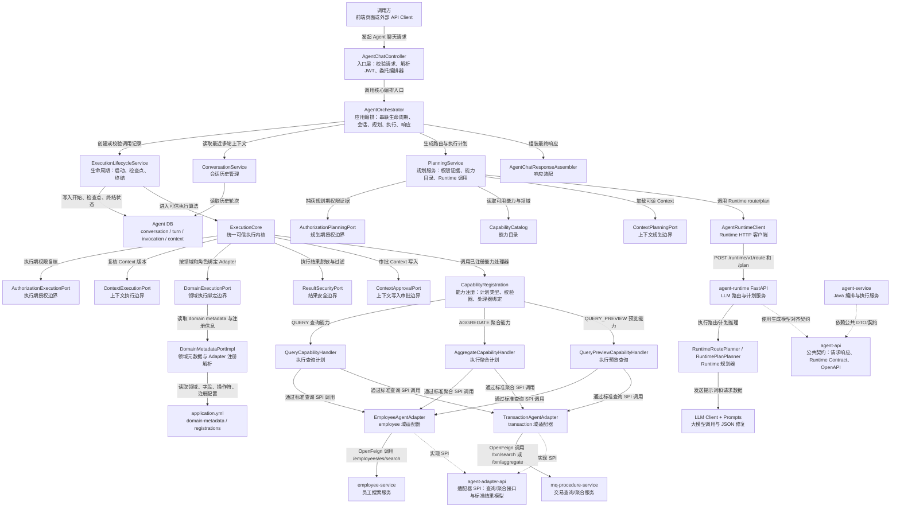
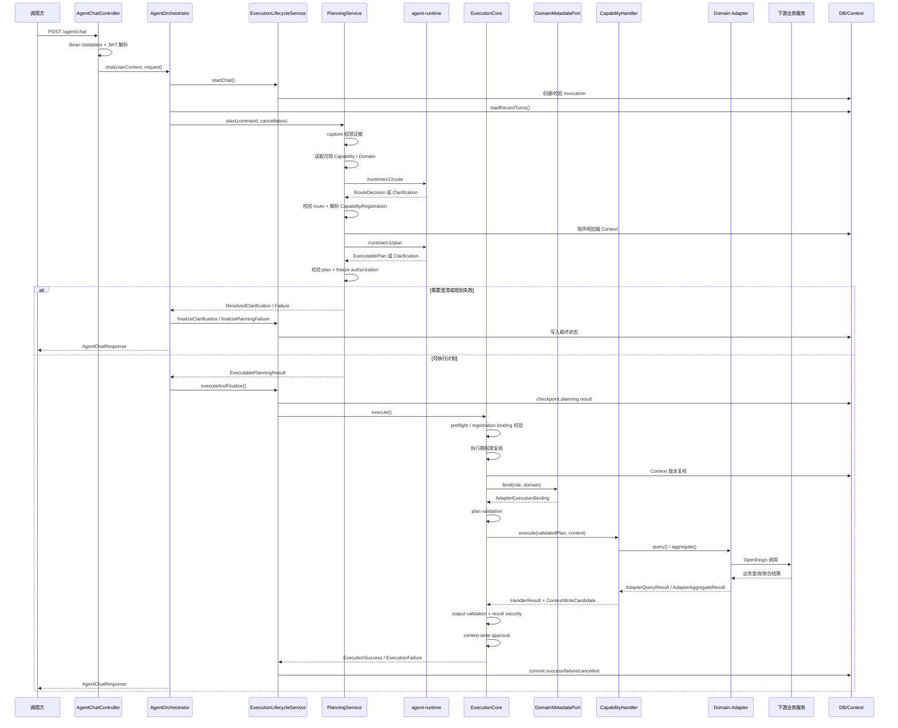

# ARCHITECTURE

```mermaid
graph TD
  U["调用方<br/>前端页面或外部 API Client"] -->|发起 Agent 聊天请求| C["AgentChatController<br/>入口层：校验请求、解析 JWT、委托编排器"]

  AAPI["agent-api<br/>公共契约：请求响应、Runtime Contract、OpenAPI"]
  ADAPI["agent-adapter-api<br/>适配器 SPI：查询/聚合接口与标准结果模型"]

  C -->|调用核心编排入口| O["AgentOrchestrator<br/>应用编排：串联生命周期、会话、规划、执行、响应"]
  O -->|创建或校验调用记录| LC["ExecutionLifecycleService<br/>生命周期：启动、检查点、终结"]
  O -->|读取最近多轮上下文| CS["ConversationService<br/>会话历史管理"]
  O -->|生成路由与执行计划| PS["PlanningService<br/>规划服务：权限证据、能力目录、Runtime 调用"]
  O -->|组装最终响应| RA["AgentChatResponseAssembler<br/>响应装配"]

  PS -->|捕获规划期权限证据| AP["AuthorizationPlanningPort<br/>规划期授权边界"]
  PS -->|读取可用能力与领域| CAT["CapabilityCatalog<br/>能力目录"]
  PS -->|加载可读 Context| CP["ContextPlanningPort<br/>上下文规划边界"]
  PS -->|调用 Runtime route/plan| RC["AgentRuntimeClient<br/>Runtime HTTP 客户端"]

  RC -->|POST /runtime/v1/route 和 /plan| RAPI["agent-runtime FastAPI<br/>LLM 路由与计划服务"]
  RAPI -->|执行路由/计划推理| RP["RuntimeRoutePlanner / RuntimePlanPlanner<br/>Runtime 规划器"]
  RP -->|发送提示词和请求数据| LLM["LLM Client + Prompts<br/>大模型调用与 JSON 修复"]

  LC -->|写入开始、检查点、终结状态| DB["Agent DB<br/>conversation / turn / invocation / context"]
  CS -->|读取历史轮次| DB
  LC -->|进入可信执行算法| EC["ExecutionCore<br/>统一可信执行内核"]

  EC -->|执行期权限复核| AE["AuthorizationExecutionPort<br/>执行期授权边界"]
  EC -->|复核 Context 版本| CE["ContextExecutionPort<br/>上下文执行边界"]
  EC -->|按领域和角色绑定 Adapter| DE["DomainExecutionPort<br/>领域执行绑定边界"]
  EC -->|执行结果脱敏与过滤| RS["ResultSecurityPort<br/>结果安全边界"]
  EC -->|审批 Context 写入| CA["ContextApprovalPort<br/>上下文写入审批边界"]

  DE -->|读取 domain metadata 与注册信息| DM["DomainMetadataPortImpl<br/>领域元数据与 Adapter 注册解析"]
  DM -->|读取领域、字段、操作符、注册配置| YML["application.yml<br/>domain-metadata / registrations"]

  EC -->|调用已注册能力处理器| REG["CapabilityRegistration<br/>能力注册：计划类型、校验器、处理器绑定"]
  REG -->|QUERY 查询能力| QH["QueryCapabilityHandler<br/>执行查询计划"]
  REG -->|AGGREGATE 聚合能力| AH["AggregateCapabilityHandler<br/>执行聚合计划"]
  REG -->|QUERY_PREVIEW 预览能力| PH["QueryPreviewCapabilityHandler<br/>执行预览查询"]

  QH -->|通过标准查询 SPI 调用| EMPA["EmployeeAgentAdapter<br/>employee 域适配器"]
  AH -->|通过标准聚合 SPI 调用| EMPA
  PH -->|通过标准查询 SPI 调用| EMPA
  QH -->|通过标准查询 SPI 调用| TXNA["TransactionAgentAdapter<br/>transaction 域适配器"]
  AH -->|通过标准聚合 SPI 调用| TXNA
  PH -->|通过标准查询 SPI 调用| TXNA

  EMPA -->|OpenFeign 调用 /employees/es/search| EMP["employee-service<br/>员工搜索服务"]
  TXNA -->|OpenFeign 调用 /txn/search 或 /txn/aggregate| TXN["mq-procedure-service<br/>交易查询/聚合服务"]

  Service["agent-service<br/>Java 编排与执行服务"] -.依赖公共 DTO/契约.-> AAPI
  RAPI -.使用生成模型对齐契约.-> AAPI
  EMPA -.实现 SPI.-> ADAPI
  TXNA -.实现 SPI.-> ADAPI
```

# SEQUENCE

```mermaid
sequenceDiagram
  participant Client as 调用方
  participant Controller as AgentChatController
  participant Orchestrator as AgentOrchestrator
  participant Lifecycle as ExecutionLifecycleService
  participant Planning as PlanningService
  participant Runtime as agent-runtime
  participant Core as ExecutionCore
  participant Domain as DomainMetadataPort
  participant Handler as CapabilityHandler
  participant Adapter as Domain Adapter
  participant Biz as 下游业务服务
  participant Store as DB/Context

  Client->>Controller: POST /agent/chat
  Controller->>Controller: Bean Validation + JWT 解析
  Controller->>Orchestrator: chat(userContext, request)

  Orchestrator->>Lifecycle: startChat()
  Lifecycle->>Store: 创建/校验 invocation
  Orchestrator->>Store: loadRecentTurns()

  Orchestrator->>Planning: plan(command, cancellation)
  Planning->>Planning: capture 权限证据
  Planning->>Planning: 读取可用 Capability / Domain
  Planning->>Runtime: /runtime/v1/route
  Runtime-->>Planning: RouteDecision 或 Clarification
  Planning->>Planning: 校验 route + 解析 CapabilityRegistration
  Planning->>Store: 按声明加载 Context
  Planning->>Runtime: /runtime/v1/plan
  Runtime-->>Planning: ExecutablePlan 或 Clarification
  Planning->>Planning: 校验 plan + freeze authorization

  alt 需要澄清或规划失败
    Planning-->>Orchestrator: ResolvedClarification / Failure
    Orchestrator->>Lifecycle: finalizeClarification / finalizePlanningFailure
    Lifecycle->>Store: 写入最终状态
    Orchestrator-->>Client: AgentChatResponse
  else 可执行计划
    Planning-->>Orchestrator: ExecutablePlanningResult
    Orchestrator->>Lifecycle: executeAndFinalize()
    Lifecycle->>Store: checkpoint planning result
    Lifecycle->>Core: execute()

    Core->>Core: preflight / registration binding 校验
    Core->>Core: 执行期权限复核
    Core->>Store: Context 版本复核
    Core->>Domain: bind(role, domain)
    Domain-->>Core: AdapterExecutionBinding
    Core->>Core: plan validation
    Core->>Handler: execute(validatedPlan, context)
    Handler->>Adapter: query() / aggregate()
    Adapter->>Biz: OpenFeign 调用
    Biz-->>Adapter: 业务查询/聚合结果
    Adapter-->>Handler: AdapterQueryResult / AdapterAggregateResult
    Handler-->>Core: HandlerResult + ContextWriteCandidate
    Core->>Core: output validation + result security
    Core->>Core: context write approval
    Core-->>Lifecycle: ExecutionSuccess / ExecutionFailure
    Lifecycle->>Store: commit success/failure/cancelled
    Orchestrator-->>Client: AgentChatResponse
  end
```