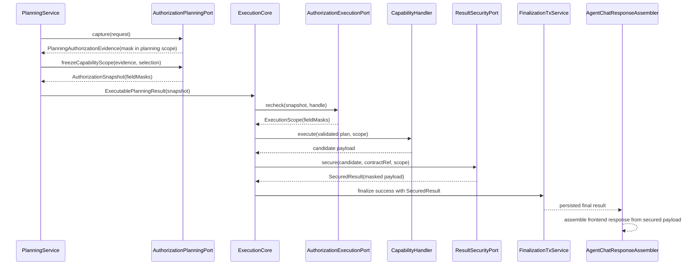

# Agent ResultSecurity 值级 Mask 脱敏接入 L2 实施详细设计 v1.0

## 1. 文档状态

| 项目 | 内容 |
| --- | --- |
| 文档名称 | Agent ResultSecurity 值级 Mask 脱敏接入 L2 实施详细设计 |
| 文档状态 | Draft |
| 文档版本 | v1.0 |
| 创建日期 | 2026-07-03 |
| 更新日期 | 2026-07-03 |
| 输出语言 | 简体中文 |
| 输出格式 | Markdown |
| 目标文档 | `docs/design/Agent_ResultSecurity值级Mask脱敏接入_L2实施详细设计_v1.0.md` |

## 2. 修改历史

| 序号 | 日期 | 位置 | 修改原因 | 修改内容 |
| --- | --- | --- | --- | --- |
| 1 | 2026-07-03 | 全文 | 新建详细设计 | 按方案 A 设计 Agent Policy 驱动的值级 Mask 脱敏接入方案，并补齐 Java 实施落点、测试设计、静态门禁和实施对齐检查。 |

## 3. 任务背景与问题结论

### 3.1 背景

D05 已完成 `query.preview` 能力扩展验证与字段级结果裁剪，并保持权限、Domain metadata、Context、ResultSecurity、Lifecycle finalization 继续沿用 D02/D03/D04 边界。代码评审报告中遗留风险 RISK-001 指出：当前生产链路已经存在 `com.dylan.agent.mask.FieldMaskerRegistry` 和各类 `FieldMasker` 实现，但未接入统一 ResultSecurity 链路；如果只在 `query.preview` 单独接入，会形成第二套脱敏路径。

本设计按方案 A 落地：以 Agent Policy 中 `DomainSecurityConstraints.FieldSecurityConstraint.requiredMask` 作为值级 mask 规则来源，将 mask fact 冻结并传递到 `AuthorizationSnapshot` 和 `ExecutionScope`，最终在统一 `ResultSecurity` 边界对 `query.search`、`query.preview`、`aggregate.compute` 结果执行字段裁剪和值级脱敏。

### 3.2 当前实现问题

| 问题编号 | 当前状态 | 风险 | 本设计处理 |
| --- | --- | --- | --- |
| P1 | `AuthorizationPlanningPortImpl.fieldAccess(...)` 将 `requiredMask` 固定为 `MaskType.NONE` | Policy 中声明的脱敏规则无法进入授权证据链 | 从 active `AgentPolicySnapshot.domainSecurityConstraints()` 合并 `requiredMask` |
| P2 | `AuthorizationSnapshot` 不携带 field mask fact | Planning 冻结后的执行阶段无法稳定复用同一版本 mask 决策 | 新增 `fieldMasks` 冻结字段，键使用 canonical `domain.field` |
| P3 | `AuthorizationExecutionPortImpl.recheck(...)` 构造 `ExecutionScope` 时传入 `Map.of()` | `ExecutionScope.fieldMasks()` 永远为空，ResultSecurity 无规则可执行 | 原样传递 `snapshot.fieldMasks()`，不得扩大 |
| P4 | `QueryResultSecurityProjector` 和 `AggregateResultSecurityProjector` 当前返回 candidate | 普通查询与聚合结果未执行字段裁剪和值级脱敏 | 接入统一 `ResultValueMaskingSupport` |
| P5 | `QueryPreviewResultSecurityProjector` 已做字段裁剪但未做值级脱敏 | 预览样例值、过滤条件值可能带出敏感原值 | 在现有 preview projector 内复用统一 helper，不新增第二路径 |
| P6 | `FieldMaskerRegistry` 只被测试调用 | 已有脱敏组件未进入生产安全收口 | 由 ResultSecurity helper 注入并统一调用 |

## 4. 上级文档约束

| 上级文档 | 必须遵守的约束 | 本设计响应 |
| --- | --- | --- |
| `docs/design/D02_03_元数据授权与Context安全_L2_v1.0.md` | `DomainSecurityConstraints` 可表达 optional `requiredMask`；`AuthorizationSnapshot` 是 capability-scoped 冻结证据；`ExecutionScope` 只能等于或小于 Snapshot；ResultSecurity 负责字段过滤、mask、安全消息与摘要。 | mask 规则只来自 Policy，先进入 Planning scope，再冻结到 Snapshot，Execution 只传递并收窄字段，不重新扩大或绕过 ResultSecurity。 |
| `docs/design/D03_Capability v2跨服务原子切换_L2实施详细设计_v1.0.md` | 主链为 Planning → ExecutionCore → Authorization recheck → Handler → `ResultSecurityPort.secure` → ContextApproval → Finalization；Handler/Adapter 不得做权限决策；ResultSecurity 是持久化和 API 返回前置条件。 | 所有值级 mask 在 `metadata/result` 下执行，Handler/Adapter/Runtime/前端不承担脱敏责任。 |
| `docs/design/Agent元数据与上下文安全架构设计_v1.0.md` | Profile、Policy、UserPermission、Context、ResultSecurity 分层职责清晰，结果安全必须在后端统一收口。 | 保持 Policy 为部署级安全上限，UserPermission 为主体授权来源，ResultSecurity 为唯一结果安全出口。 |
| `docs/design/Agent能力执行内核架构设计_v1.0.md` | ExecutionCore 只按端口调用授权复检、能力执行、结果安全、Context 审批和生命周期收口，不为具体 capability 增加分支。 | 不修改 Core 编排，不增加 capability 特判，仅扩展授权证据模型和 projector 实现。 |

## 5. 关联文档边界

| 关联文档 | 边界要求 | 本设计处理 |
| --- | --- | --- |
| `docs/design/D03_01_UserPermissionAuthority权限权威源契约说明_L2_v1.0.md` | `auth-service` 是外部用户权限权威源；当前接口契约不包含 mask 决策。 | 不修改 UserPermission 请求/响应 DTO，不把 mask 下沉到 auth-service。 |
| `docs/design/D04_Agent Adapter与Domain Metadata收敛_L2实施详细设计_v1.0.md` | D04 收敛 Domain metadata、Adapter binding、字段引用校验和执行绑定；不拥有主体差异化权限决策。 | D04 只继续参与 `CanonicalFieldRef` 校验和字段存在性约束，不作为 mask 决策源。 |
| `docs/design/D05_Capability扩展验证与遗留清理_L2实施详细设计_v1.0.md` | D05 不新增第二权限源、第二 Domain metadata 源、第二 ResultSecurity 路径。 | `query.preview` 与 query/aggregate 共用同一 ResultSecurity mask helper。 |
| `docs/design/D05_Capability扩展验证与遗留清理_设计文档品审报告.md` | S0 已确认首版以 employee 为主验证，但支持所有已授权 `QUERYABLE` domain；剩余问题要求避免 preview 单独脱敏路径。 | mask 键采用 `domain.field`，支持所有已授权 QUERYABLE domain，不绑定 employee。 |
| 用户提供的 AGENTS 约束 | 默认只允许修改目标文档；不修改上级文档、关联文档、代码、测试、配置。 | 本次仅生成本目标文档；实施落点以设计形式列出，不直接修改代码。 |

## 6. 范围

### 6.1 范围内

| 范围项 | 说明 |
| --- | --- |
| Policy mask 来源 | 以 Agent Policy 的 `DomainSecurityConstraints.requiredMask` 作为值级 mask 规则来源。 |
| 授权证据传递 | 将 mask 规则传递到 `AuthorizationSnapshot` 与 `ExecutionScope`。 |
| 统一 ResultSecurity | 对 `query.search`、`query.preview`、`aggregate.compute` 统一进行字段裁剪和值级脱敏。 |
| 既有脱敏器复用 | 接入 `com.dylan.agent.mask.FieldMaskerRegistry`，不新增第二套脱敏 registry。 |
| Java 实施落点 | 明确包、类、方法、参数、返回值和配置装配改造点。 |
| 测试与门禁 | 补充单元测试、边界测试、架构静态检查和实施对齐检查。 |

### 6.2 范围外

| 范围外项 | 原因 |
| --- | --- |
| 修改 auth-service UserPermission 请求/响应 DTO | D03_01 未授权变更；mask 决策应由 Agent Policy 收紧，不改变外部权限契约。 |
| 修改 D03_01 权限权威源接口契约 | 本设计不扩展跨服务权限协议。 |
| 把 mask 决策下沉到 Adapter | Adapter 不应承担主体权限和结果安全决策。 |
| 在前端执行安全脱敏 | 前端脱敏不能作为安全边界。 |
| 新增 Runtime Prompt 或 Python generated model 变更 | mask 是 Java 后端 ResultSecurity 行为，不影响 Runtime planning schema。 |
| 修改数据库结构 | Snapshot/result payload 可沿既有对象序列化和 final result 持久化链路；不新增表或列。 |
| 修改上级文档或关联文档 | 当前授权不允许扩大文档修改范围。 |

## 7. 目标与非目标

### 7.1 目标

1. 最终返回给前端的 payload 和持久化 final result payload 均已完成字段裁剪和值级脱敏。
2. ResultSecurity 保持唯一结果安全收口边界。
3. `query.preview` 不新增第二套脱敏路径，与 query/aggregate 共用 helper 和 mask fact。
4. 最小化跨服务契约变更，不修改 `auth-service`、D03_01、D04 和前端契约。
5. `MaskType.NONE` 或未配置 mask 时保持当前行为。

### 7.2 非目标

1. 不新增按用户维度动态 mask 策略。
2. 不设计新的脱敏算法或替换既有 `FieldMasker`。
3. 不对 aggregate metric 默认脱敏，除非后续设计明确 metric alias 到字段安全规则。
4. 不调整查询、预览、聚合能力的 plan schema。

## 8. 架构方案比较

| 方案 | 规则来源 | 执行位置 | 优点 | 风险/代价 | 结论 |
| --- | --- | --- | --- | --- | --- |
| 方案 A：Policy 驱动 + ResultSecurity 统一执行 | `AgentPolicySnapshot.domainSecurityConstraints().requiredMask` | `metadata/result` 统一 projector | 不改外部权限契约；符合 D02_03；Policy 只能收紧；复用现有 `FieldMaskerRegistry`；query/preview/aggregate 一致 | 需要扩展 Snapshot 和 ExecutionScope 的内部字段 | 采用 |
| 方案 B：UserPermissionAuthority 返回 mask | auth-service UserPermission DTO | ResultSecurity 或 Adapter | 可支持主体差异化 mask | 需要修改 D03_01 和 auth-service 契约，跨服务兼容成本高 | 不采用 |
| 方案 C：D04 Domain metadata 携带 mask | D04 metadata | ResultSecurity | 与字段元数据放在一起 | D04 会从字段事实边界扩张为安全策略源，职责不清 | 不采用 |
| 方案 D：Adapter 或前端脱敏 | Adapter/前端本地规则 | Adapter/前端 | 表面改动少 | 绕过 ResultSecurity，无法保证持久化 final result 安全；容易多路径不一致 | 禁止 |

方案 A 的架构合理性在于：UserPermission 决定主体可访问字段，Policy 决定部署级收紧策略，D04 验证字段引用存在性，ResultSecurity 执行最终安全投影。四者边界不重叠，且没有新增跨服务协议。

## 9. 总体设计

### 9.1 目标链路

```mermaid
flowchart LR
    A["Agent Policy: DomainSecurityConstraints.requiredMask"] --> B["AuthorizationPlanningPortImpl.capture"]
    B --> C["PlanningEffectiveScope.FieldAccess.requiredMask"]
    C --> D["AuthorizationSnapshot.fieldMasks"]
    D --> E["AuthorizationExecutionPortImpl.recheck"]
    E --> F["ExecutionScope.fieldMasks"]
    F --> G["ResultSecurityBoundary.secure"]
    G --> H["Query/Aggregate/Preview Projector"]
    H --> I["ResultValueMaskingSupport"]
    I --> J["FieldMaskerRegistry"]
    H --> K["SecuredResult"]
    K --> L["FinalizationTxService / API Response"]
```



### 9.2 核心原则

| 原则 | 设计规则 |
| --- | --- |
| 先授权裁剪，再值级 mask | 未授权字段必须删除，不能通过 mask 保留。 |
| Policy 只能收紧 | 只有已经在 UserPermission 和 EffectiveProfile 中允许的字段，才允许附加 mask；Policy 不新增字段访问权。 |
| Snapshot 冻结 | mask fact 在 Planning 阶段随 capability scope 冻结，Execution 不读取新 Policy 重算，避免混合版本。 |
| Execution 不扩大 | Execution recheck 只能原样传递或随字段收窄同步删除 mask，不能添加 Snapshot 没有的 mask fact 或字段。 |
| ResultSecurity 唯一执行 | 值级脱敏只在 `ResultSecurityProjector` 链路执行。 |
| 默认兼容 | `MaskType.NONE` 或缺省 mask 时保持原值。 |
| fail closed | projector 或 masker 异常不得返回未脱敏结果，不得写入 Context/final result。 |

### 9.3 Mask 键规范

`ExecutionScope.fieldMasks()` 和 `AuthorizationSnapshot.fieldMasks()` 的键统一为 canonical field key：

```text
<domain>.<field>
```

示例：

```text
employee.mobile -> MOBILE
employee.idCardNo -> ID_CARD
```

设计原因：

1. 避免不同 domain 中同名字段误用同一 mask。
2. 与现有 `CanonicalFieldRef(domain, field)` 语义一致。
3. 便于 ResultSecurity 只根据 payload domain 和字段名查找 mask。

## 10. 功能设计

### 10.1 mask 规则合并

Planning 阶段对每个候选字段执行以下逻辑：

1. 从 `UserPermission.displayableFields` 与 `UserPermission.filterableFields` 得到当前主体允许的字段集合。
2. 与 EffectiveProfile/Delegation 得出的 capability/domain/context/budget 范围相交。
3. 对已允许字段查询 active Policy 的 `DomainSecurityConstraints.fields().get(new CanonicalFieldRef(domain, field)).requiredMask()`。
4. 若 Policy 未配置该字段或 `requiredMask` 为空，则写入 `MaskType.NONE`。
5. 若字段未被 UserPermission 授权，则不生成 `FieldAccess`，也不生成 mask fact。

字段保留与 mask 的优先级：

| 场景 | 处理 |
| --- | --- |
| 字段未授权 | 删除字段，忽略 mask 配置。 |
| 字段授权且 `requiredMask` 为空 | 保留原值。 |
| 字段授权且 `requiredMask = NONE` | 保留原值。 |
| 字段授权且 `requiredMask != NONE` | 保留字段名，值通过 `FieldMaskerRegistry.mask(maskType, value)` 脱敏。 |

### 10.2 Snapshot 冻结

`AuthorizationSnapshot` 新增 `Map<String, MaskType> fieldMasks`。

冻结规则：

1. 只冻结本次 capability scope 内的 allowed field mask。
2. 键为 canonical `domain.field`。
3. value 为 `MaskType`，不保存原始敏感值。
4. 若字段 mask 为 `NONE`，可以选择不写入 map 或写入 `NONE`；实施时应采用“只写入非 NONE mask”的稀疏 map，以降低审计噪声。
5. ResultSecurity 查询不到 mask 时按 `NONE` 处理。

### 10.3 ExecutionScope 传递

`AuthorizationExecutionPortImpl.recheck(...)` 继续只校验当前 UserPermission 是否覆盖 Snapshot 必要项。通过后构造 `ExecutionScope`：

1. `allowedFields` 仍来自 `snapshot.allowedFields()`。
2. `fieldMasks` 来自 `snapshot.fieldMasks()`。
3. 若未来允许 Execution 因当前权限收窄字段范围，则必须同步移除被收窄字段对应 mask，不允许保留 orphan mask。
4. `currentPolicyVersion` 保持 `snapshot.policyVersion()`，不在 execution 阶段读取 active policy 重算。

不在 execution 阶段重算 Policy 的原因：

1. D02_03/D03 要求 Execution 不引入新的 Profile/Policy/D04 版本来扩大或重算预算。
2. 重算 mask 会形成“字段授权来自旧 Snapshot、mask 来自新 Policy”的混合证据。
3. 更严格的 Policy 应通过新请求、新 Planning 生效；紧急撤销仍走现有 fail closed 机制。

### 10.4 ResultSecurity 执行

所有 projector 共用 `ResultValueMaskingSupport`：

| 能力 | 字段裁剪 | 值级 mask | 特殊规则 |
| --- | --- | --- | --- |
| `query.search` | 裁剪 `queryParameters.selectFields`、`filters`、`queryResult.columns`、`rows` | 对保留字段的 row 值和 filter value/values 执行 mask | safeMessage/safeSummary 基于脱敏后结果生成。 |
| `query.preview` | 复用现有 preview 字段裁剪逻辑 | 对 `previewResult.sampleRows` 和过滤条件值执行 mask | 不新增独立脱敏路径。 |
| `aggregate.compute` | 裁剪 `groupByFields` 与 `rows.groups` | 对 group value 执行 mask | `metrics` 默认保留，不根据 metric alias 推断原字段脱敏。 |

### 10.5 aggregate metric 规则

本设计不对 aggregate metric 默认脱敏。原因：

1. metric 是计算结果，不一定对应某个单一原字段。
2. 仅凭 `metricAlias` 反推字段安全规则不稳定，可能误脱敏或漏脱敏。
3. 若后续需要 metric 级安全，应新增明确的 metric-to-field 安全映射设计。

当前规则：

| 数据项 | 处理 |
| --- | --- |
| `aggregateResult.groupByFields` | 按 allowedFields 过滤。 |
| `aggregateResult.rows[*].groups` | 保留已授权 group 字段并对 group 值 mask。 |
| `aggregateResult.metricAliases` | 保留。 |
| `aggregateResult.rows[*].metrics` | 保留。 |

## 11. 接口与数据设计

### 11.1 外部接口

| 接口类型 | 是否变更 | 说明 |
| --- | --- | --- |
| auth-service UserPermission API | 否 | 不增加 mask 字段，不修改 D03_01。 |
| Agent 对前端响应 DTO | 否 | 字段结构不变，仅字段值在后端返回前已脱敏。 |
| Runtime Prompt / Python model | 否 | 不改变 Runtime 输入输出 schema。 |
| D04 Domain metadata API | 否 | 不新增 mask 决策字段。 |
| 数据库表结构 | 否 | 不新增 migration。 |

### 11.2 内部 Java 数据结构

| 类 | 变更 | 字段/方法 |
| --- | --- | --- |
| `AuthorizationSnapshot` | MODIFY | 新增 `private final Map<String, MaskType> fieldMasks`；构造器新增参数；新增 `public Map<String, MaskType> fieldMasks()`。 |
| `ExecutionScope` | MODIFY | 保留现有 `fieldMasks` 字段，明确键为 canonical `domain.field`；注释从 `field -> mask type` 改为 `domain.field -> mask type`。 |
| `PlanningEffectiveScope.FieldAccess` | KEEP | 继续使用现有 `Optional<MaskType> requiredMask`。 |
| `DomainSecurityConstraints.FieldSecurityConstraint` | KEEP | 继续作为 Policy mask 来源。 |

### 11.3 数据兼容性

| 场景 | 兼容处理 |
| --- | --- |
| 旧测试/旧构造器未传 fieldMasks | 实施时需要同步更新构造调用点；生产不保留旧构造器，避免遗漏安全事实。 |
| Policy 未配置 mask | `fieldMasks` 稀疏 map 为空，ResultSecurity 按 `NONE` 处理。 |
| final result 持久化 | 持久化的是 `SecuredResult` 的安全 payload，结构不变。 |
| 审计/checkpoint | 若包含 `AuthorizationSnapshot`，新增字段只保存 mask type，不保存敏感值。 |

## 12. Java 实施落点

### 12.1 授权规划

| 路径 | 类 | 方法 | 参数 | 返回值 | 变更 |
| --- | --- | --- | --- | --- | --- |
| `agent-service/src/main/java/com/dylan/agent/metadata/authorization/internal/AuthorizationPlanningPortImpl.java` | `AuthorizationPlanningPortImpl` | `capture(PlanningSecurityRequest request)` | `PlanningSecurityRequest request` | `PlanningAuthorizationEvidence` | 在读取 active policy 后，将 `policy.domainSecurityConstraints()` 传入 scope 交集计算。 |
| 同上 | `AuthorizationPlanningPortImpl` | `intersect(EffectiveProfile effective, UserPermission permission, DelegationConstraint delegation, DomainSecurityConstraints domainSecurityConstraints)` | `EffectiveProfile`、`UserPermission`、`DelegationConstraint`、`DomainSecurityConstraints` | `PlanningEffectiveScope` | 方法签名增加 Policy security constraints。 |
| 同上 | `AuthorizationPlanningPortImpl` | `fieldAccess(UserPermission permission, DomainSecurityConstraints domainSecurityConstraints)` | `UserPermission permission`、`DomainSecurityConstraints domainSecurityConstraints` | `Map<CanonicalFieldRef, PlanningEffectiveScope.FieldAccess>` | 将原固定 `MaskType.NONE` 替换为 Policy `requiredMask`。 |
| 同上 | `AuthorizationPlanningPortImpl` | `freezeCapabilityScope(PlanningAuthorizationEvidence evidence, CapabilityScopeSelection selection)` | `PlanningAuthorizationEvidence evidence`、`CapabilityScopeSelection selection` | `AuthorizationSnapshot` | 构造 Snapshot 时写入 `fieldMasks(evidence.planningScope(), selectedDomain)`。 |
| 同上 | `AuthorizationPlanningPortImpl` | `private static Map<String, MaskType> fieldMasks(PlanningEffectiveScope scope, Set<String> frozenDomains)` | `PlanningEffectiveScope scope`、`Set<String> frozenDomains` | `Map<String, MaskType>` | 新增 helper，仅输出 selected domain 内非 `NONE` mask。 |
| 同上 | `AuthorizationPlanningPortImpl` | `private static String maskKey(String domain, String field)` | `String domain`、`String field` | `String` | 新增 canonical key helper，格式为 `domain + "." + field`。 |

### 12.2 授权模型

| 路径 | 类 | 方法/字段 | 参数 | 返回值 | 变更 |
| --- | --- | --- | --- | --- | --- |
| `agent-service/src/main/java/com/dylan/agent/metadata/authorization/model/AuthorizationSnapshot.java` | `AuthorizationSnapshot` | `private final Map<String, MaskType> fieldMasks` | 无 | 无 | 新增字段，保存 capability-scoped mask fact。 |
| 同上 | `AuthorizationSnapshot` | 构造器 | 追加 `Map<String, MaskType> fieldMasks` | `AuthorizationSnapshot` | 防御性复制并校验 key 非空、value 非空。 |
| 同上 | `AuthorizationSnapshot` | `public Map<String, MaskType> fieldMasks()` | 无 | `Map<String, MaskType>` | 新增访问器。 |
| `agent-service/src/main/java/com/dylan/agent/metadata/authorization/model/ExecutionScope.java` | `ExecutionScope` | `fieldMasks` 注释 | 无 | 无 | 明确 key 语义为 `domain.field -> mask type`。 |

### 12.3 执行复检

| 路径 | 类 | 方法 | 参数 | 返回值 | 变更 |
| --- | --- | --- | --- | --- | --- |
| `agent-service/src/main/java/com/dylan/agent/metadata/authorization/internal/AuthorizationExecutionPortImpl.java` | `AuthorizationExecutionPortImpl` | `recheck(AuthorizationSnapshot snapshot, InvocationHandle handle)` | `AuthorizationSnapshot snapshot`、`InvocationHandle handle` | `ExecutionScope` | 将 `Map.of()` 替换为 `snapshot.fieldMasks()`；不读取 active policy 重算。 |

### 12.4 ResultSecurity helper

| 路径 | 类 | 方法 | 参数 | 返回值 | 变更 |
| --- | --- | --- | --- | --- | --- |
| `agent-service/src/main/java/com/dylan/agent/metadata/result/ResultValueMaskingSupport.java` | `ResultValueMaskingSupport` | 构造器 | `FieldMaskerRegistry fieldMaskerRegistry` | `ResultValueMaskingSupport` | NEW，统一封装字段裁剪和值级 mask。 |
| 同上 | `ResultValueMaskingSupport` | `Set<String> allowedFields(String domain, ExecutionScope scope)` | `String domain`、`ExecutionScope scope` | `Set<String>` | 返回 domain 下允许展示的字段集合。 |
| 同上 | `ResultValueMaskingSupport` | `Map<String, Object> filterAndMaskRow(String domain, Map<String, Object> row, ExecutionScope scope)` | `String domain`、`Map<String,Object> row`、`ExecutionScope scope` | `Map<String,Object>` | 删除未授权字段，对保留字段按 mask 规则脱敏。 |
| 同上 | `ResultValueMaskingSupport` | `List<String> filterFields(String domain, List<String> fields, ExecutionScope scope)` | `String domain`、`List<String> fields`、`ExecutionScope scope` | `List<String>` | 过滤 select/columns/groupBy 字段。 |
| 同上 | `ResultValueMaskingSupport` | `AgentQueryFilterParameter filterAndMaskFilter(String domain, AgentQueryFilterParameter filter, ExecutionScope scope)` | `String domain`、`AgentQueryFilterParameter filter`、`ExecutionScope scope` | `AgentQueryFilterParameter` 或 `null` | 未授权 filter 返回 `null`；已授权 filter 的 `value`/`values` 执行 mask。 |
| 同上 | `ResultValueMaskingSupport` | `Object maskValue(String domain, String field, Object value, ExecutionScope scope)` | `String domain`、`String field`、`Object value`、`ExecutionScope scope` | `Object` | 查找 `domain.field` mask，`NONE` 或缺省时返回原值。 |
| 同上 | `ResultValueMaskingSupport` | `static String maskKey(String domain, String field)` | `String domain`、`String field` | `String` | 统一 canonical key 格式。 |

异常策略：

1. `FieldMaskerRegistry.mask(...)` 抛异常时不吞掉异常，由 `ResultSecurityBoundary` 所在线路 fail closed。
2. `row == null` 时返回空 map 或按现有 payload 语义保留 null；实施应与当前 projector 测试保持一致。
3. `value == null` 时直接返回 null，不调用 masker。

### 12.5 Query projector

| 路径 | 类 | 方法 | 参数 | 返回值 | 变更 |
| --- | --- | --- | --- | --- | --- |
| `agent-service/src/main/java/com/dylan/agent/metadata/result/QueryResultSecurityProjector.java` | `QueryResultSecurityProjector` | 构造器 | `ResultValueMaskingSupport maskingSupport` | `QueryResultSecurityProjector` | 从无参构造改为注入 helper。 |
| 同上 | `QueryResultSecurityProjector` | `filter(QueryAgentResultPayload candidate, ExecutionScope scope)` | `QueryAgentResultPayload candidate`、`ExecutionScope scope` | `FilteredResult<QueryAgentResultPayload>` | 过滤 query parameters、columns、rows，并对保留字段值执行 mask。 |

处理对象：

1. `candidate.getQueryParameters().getSelectFields()`
2. `candidate.getQueryParameters().getFilters()`
3. `candidate.getQueryResult().getColumns()`
4. `candidate.getQueryResult().getRows()`

### 12.6 Query preview projector

| 路径 | 类 | 方法 | 参数 | 返回值 | 变更 |
| --- | --- | --- | --- | --- | --- |
| `agent-service/src/main/java/com/dylan/agent/metadata/result/QueryPreviewResultSecurityProjector.java` | `QueryPreviewResultSecurityProjector` | 构造器 | `ResultValueMaskingSupport maskingSupport` | `QueryPreviewResultSecurityProjector` | 从内部静态复制过滤改为复用 helper。 |
| 同上 | `QueryPreviewResultSecurityProjector` | `filter(QueryPreviewResultPayload candidate, ExecutionScope scope)` | `QueryPreviewResultPayload candidate`、`ExecutionScope scope` | `FilteredResult<QueryPreviewResultPayload>` | 保留现有字段裁剪语义，并对 sample rows 与 filter value/values 执行 mask。 |

处理对象：

1. `candidate.getQueryParameters().getSelectFields()`
2. `candidate.getQueryParameters().getFilters()`
3. `candidate.getPreviewResult().getColumns()`
4. `candidate.getPreviewResult().getSampleRows()`

### 12.7 Aggregate projector

| 路径 | 类 | 方法 | 参数 | 返回值 | 变更 |
| --- | --- | --- | --- | --- | --- |
| `agent-service/src/main/java/com/dylan/agent/metadata/result/AggregateResultSecurityProjector.java` | `AggregateResultSecurityProjector` | 构造器 | `ResultValueMaskingSupport maskingSupport` | `AggregateResultSecurityProjector` | 从无参构造改为注入 helper。 |
| 同上 | `AggregateResultSecurityProjector` | `filter(AggregateAgentResultPayload candidate, ExecutionScope scope)` | `AggregateAgentResultPayload candidate`、`ExecutionScope scope` | `FilteredResult<AggregateAgentResultPayload>` | 过滤 group 字段并对 group 值执行 mask；metric 默认不脱敏。 |

处理对象：

1. `candidate.getAggregateResult().getDomain()`
2. `candidate.getAggregateResult().getGroupByFields()`
3. `candidate.getAggregateResult().getRows()[*].getGroups()`
4. `candidate.getAggregateResult().getMetricAliases()` 和 `metrics` 保持原语义。

### 12.8 Spring 装配

| 路径 | 类 | Bean 方法 | 参数 | 返回值 | 变更 |
| --- | --- | --- | --- | --- | --- |
| `agent-service/src/main/java/com/dylan/agent/metadata/config/AgentMetadataSecurityConfiguration.java` | `AgentMetadataSecurityConfiguration` | `resultValueMaskingSupport(FieldMaskerRegistry fieldMaskerRegistry)` | `FieldMaskerRegistry fieldMaskerRegistry` | `ResultValueMaskingSupport` | NEW，装配统一 helper。 |
| 同上 | `AgentMetadataSecurityConfiguration` | `queryResultSecurityProjector(ResultValueMaskingSupport maskingSupport)` | `ResultValueMaskingSupport maskingSupport` | `QueryResultSecurityProjector` | 修改为有参构造。 |
| 同上 | `AgentMetadataSecurityConfiguration` | `queryPreviewResultSecurityProjector(ResultValueMaskingSupport maskingSupport)` | `ResultValueMaskingSupport maskingSupport` | `QueryPreviewResultSecurityProjector` | 修改为有参构造。 |
| 同上 | `AgentMetadataSecurityConfiguration` | `aggregateResultSecurityProjector(ResultValueMaskingSupport maskingSupport)` | `ResultValueMaskingSupport maskingSupport` | `AggregateResultSecurityProjector` | 修改为有参构造。 |

## 13. 配置设计

### 13.1 新增配置

本设计不新增配置 key。

### 13.2 既有配置使用

mask 规则继续使用 Agent Policy 的既有结构：

```text
AgentPolicySnapshot.domainSecurityConstraints().fields()[CanonicalFieldRef].requiredMask
```

如果工程已有 YAML/properties 绑定到 `DomainSecurityConstraints.FieldSecurityConstraint.requiredMask`，实施只需补充测试样例；如果当前默认 bootstrap 中未配置任何 mask，则默认行为保持不变。

### 13.3 配置校验

| 校验项 | 要求 |
| --- | --- |
| MaskType 合法性 | Spring/配置绑定阶段必须只能绑定到 `MaskType` enum。 |
| FieldMasker 覆盖 | `FieldMaskerRegistry` 启动时校验所有 `MaskType` 都有实现。 |
| 字段引用合法性 | 继续由 D02_03/D04 现有 metadata reload/reference validation 保证。 |
| 未配置 mask | 按 `NONE` 处理。 |

## 14. 脚本与静态门禁设计

本设计不新增生产脚本，但实施完成后应增加或更新已有静态门禁脚本/测试用例中的检查项。

| 路径 | 类型 | 参数 | 输出效果 |
| --- | --- | --- | --- |
| `agent-service/src/test/java/com/dylan/agent/metadata/MetadataArchitectureTest.java` | JUnit 静态架构测试 | 无 | 校验 `FieldMaskerRegistry` 只被 `metadata/result` helper 及 mask 包调用，Handler/Adapter/前端相关代码不得直接调用。 |
| 手工门禁命令 | `rg -n "FieldMaskerRegistry|\\.mask\\(" agent-service/src/main/java` | 无 | 输出生产调用点，期望 `FieldMaskerRegistry` 生产调用点集中在 `ResultValueMaskingSupport`。 |
| 手工门禁命令 | `rg -n "fieldMasks\\(\\)|new ExecutionScope|new AuthorizationSnapshot" agent-service/src/main/java agent-service/src/test/java` | 无 | 输出构造和访问点，确保 Snapshot/ExecutionScope 新参数全部对齐。 |

## 15. 状态流与事务一致性

### 15.1 状态流



### 15.2 事务一致性

| 场景 | 一致性规则 |
| --- | --- |
| ResultSecurity 成功 | 仅 `SecuredResult` 进入 Lifecycle finalization 和 API response。 |
| ResultSecurity 失败 | Invocation 不得写入成功 final result，不得审批 Context writes。 |
| Masker 抛异常 | 作为 ResultSecurity 失败处理，fail closed。 |
| 权限复检失败 | Handler 不执行，无 candidate result。 |
| 当前权限收窄导致必要字段不可访问 | Execution recheck 失败，不返回部分未审计结果。 |

## 16. 异常处理

| 异常场景 | 处理策略 | 对用户/调用方影响 |
| --- | --- | --- |
| Snapshot 缺少 domain metadata evidence | 沿现有 `AuthorizationExecutionPortImpl` fail closed | invocation 失败。 |
| 当前 UserPermission 不覆盖 Snapshot 字段 | fail closed | invocation 失败。 |
| `fieldMasks` 中出现空 key 或空 value | Snapshot/ExecutionScope 构造器拒绝 | 启动或测试阶段暴露。 |
| `MaskType` 无对应 `FieldMasker` | `FieldMaskerRegistry` 启动失败 | 服务启动失败，避免运行时漏脱敏。 |
| `FieldMasker.mask(...)` 执行异常 | 不吞异常，ResultSecurity 失败 | 不返回未脱敏结果。 |
| payload 缺少 domain | 结果安全无法定位字段规则时仅允许返回空字段集合或保持当前 fail closed 语义 | 具体由 projector 测试固定。 |

## 17. 权限、审计与风控

| 维度 | 设计 |
| --- | --- |
| 权限来源 | UserPermission 仍是主体授权来源；Policy 只收紧 mask，不扩大字段。 |
| 审计证据 | Snapshot 记录 profileVersion、policyVersion、domain evidence、allowed fields、field masks。 |
| 风控边界 | ResultSecurity 是返回和持久化前唯一结果安全出口。 |
| 防泄漏 | 未授权字段删除；已授权但需 mask 的字段仅返回脱敏值。 |
| 安全摘要 | safeMessage/safeSummary 必须基于过滤和脱敏后的 payload 生成。 |
| 前端安全 | 前端只展示后端安全 payload，不作为安全边界。 |

## 18. 性能与容量

| 项 | 影响 | 处理 |
| --- | --- | --- |
| 每行字段遍历 | query/preview rows 需要按字段执行 allowed check 和可选 mask | 使用 `Set<String>` allowedFields 与 `Map<String, MaskType>` O(1) 查询。 |
| 大结果集 | 受既有 `maxResultRows/maxResultBytes` 限制 | 不新增分页或流式处理机制。 |
| Masker 调用成本 | 仅对保留且非 NONE 字段调用 | 稀疏 fieldMasks 降低无 mask 字段成本。 |
| aggregate metrics | 默认不 mask metric | 避免对大量 metric 做不必要推断。 |

## 19. 测试设计

### 19.1 单元测试

| 路径 | 测试类 | 测试方法/用例 | 目的 |
| --- | --- | --- | --- |
| `agent-service/src/test/java/com/dylan/agent/metadata/authorization/internal/AuthorizationPlanningPortTest.java` | `AuthorizationPlanningPortTest` | `capturesPolicyRequiredMaskInPlanningScope()` | Policy `requiredMask` 能进入 `PlanningEffectiveScope.FieldAccess`。 |
| 同上 | `AuthorizationPlanningPortTest` | `freezesNonNoneFieldMasksInAuthorizationSnapshot()` | Snapshot 冻结非 NONE mask，键为 `domain.field`。 |
| 同上 | `AuthorizationPlanningPortTest` | `doesNotCreateMaskForUnauthorizedField()` | 未授权字段不会因 Policy mask 被保留。 |
| `agent-service/src/test/java/com/dylan/agent/metadata/authorization/internal/AuthorizationExecutionPortTest.java` | `AuthorizationExecutionPortTest` | `passesSnapshotFieldMasksToExecutionScope()` | ExecutionScope 原样获得 Snapshot fieldMasks。 |
| 同上 | `AuthorizationExecutionPortTest` | `doesNotRecomputePolicyMaskDuringRecheck()` | Execution recheck 不读取新 Policy 重算 mask。 |
| `agent-service/src/test/java/com/dylan/agent/metadata/result/ResultValueMaskingSupportTest.java` | `ResultValueMaskingSupportTest` | `filtersUnauthorizedFieldsBeforeMasking()` | 未授权字段删除优先于 mask。 |
| 同上 | `ResultValueMaskingSupportTest` | `appliesConfiguredMaskForCanonicalField()` | `domain.field` mask 能调用 `FieldMaskerRegistry`。 |
| 同上 | `ResultValueMaskingSupportTest` | `keepsOriginalValueWhenMaskMissingOrNone()` | 缺省或 NONE 保持当前行为。 |

### 19.2 ResultSecurity projector 测试

| 路径 | 测试类 | 测试方法/用例 | 目的 |
| --- | --- | --- | --- |
| `agent-service/src/test/java/com/dylan/agent/metadata/result/QueryResultSecurityProjectorTest.java` | `QueryResultSecurityProjectorTest` | `filtersAndMasksQueryRows()` | query result rows 字段裁剪和值级 mask。 |
| 同上 | `QueryResultSecurityProjectorTest` | `masksQueryFilterValues()` | query parameters filter value/values 脱敏。 |
| `agent-service/src/test/java/com/dylan/agent/metadata/result/QueryPreviewResultSecurityProjectorTest.java` | `QueryPreviewResultSecurityProjectorTest` | `filtersAndMasksPreviewSampleRows()` | preview sampleRows 字段裁剪和值级 mask。 |
| 同上 | `QueryPreviewResultSecurityProjectorTest` | `reusesUnifiedMaskingSupport()` | preview 不维护第二套脱敏逻辑。 |
| `agent-service/src/test/java/com/dylan/agent/metadata/result/AggregateResultSecurityProjectorTest.java` | `AggregateResultSecurityProjectorTest` | `masksAggregateGroupValuesOnly()` | aggregate group value 脱敏，metric 默认不脱敏。 |
| 同上 | `AggregateResultSecurityProjectorTest` | `filtersUnauthorizedGroupFields()` | 未授权 group 字段删除。 |
| `agent-service/src/test/java/com/dylan/agent/metadata/result/ResultSecurityBoundaryTest.java` | `ResultSecurityBoundaryTest` | `doesNotReturnCandidateWhenMaskerFails()` | mask 失败时不返回未脱敏 candidate。 |

### 19.3 装配与架构测试

| 路径 | 测试类 | 测试方法/用例 | 目的 |
| --- | --- | --- | --- |
| `agent-service/src/test/java/com/dylan/agent/metadata/config/AgentMetadataSecurityConfigurationTest.java` | `AgentMetadataSecurityConfigurationTest` | `wiresMaskingSupportIntoAllProjectors()` | Spring 装配包含 `ResultValueMaskingSupport`。 |
| `agent-service/src/test/java/com/dylan/agent/metadata/MetadataArchitectureTest.java` | `MetadataArchitectureTest` | `maskingIsOnlyExecutedInResultSecurityPackage()` | Handler/Adapter 不直接调用 `FieldMaskerRegistry`。 |
| `agent-service/src/test/java/com/dylan/agent/metadata/config/AgentMetadataPropertiesValidatorTest.java` | `AgentMetadataPropertiesValidatorTest` | `validatesPolicyRequiredMaskFieldReferences()` | Policy requiredMask 字段引用仍受 D04 校验。 |

### 19.4 建议验证命令

```powershell
.\mvnw.cmd -pl "..\agent-service" -am "-Dtest=AuthorizationPlanningPortTest,AuthorizationExecutionPortTest,ResultValueMaskingSupportTest,QueryResultSecurityProjectorTest,QueryPreviewResultSecurityProjectorTest,AggregateResultSecurityProjectorTest,ResultSecurityBoundaryTest,AgentMetadataSecurityConfigurationTest,AgentMetadataPropertiesValidatorTest,MetadataArchitectureTest" test --batch-mode
```

```powershell
.\mvnw.cmd -pl "..\agent-service" -am "-DskipTests" compile --batch-mode
```

```powershell
rg -n "FieldMaskerRegistry|\.mask\(" agent-service/src/main/java
```

```powershell
rg -n "fieldMasks\(\)|new ExecutionScope|new AuthorizationSnapshot" agent-service/src/main/java agent-service/src/test/java
```

## 20. 实施顺序

| 顺序 | 步骤 | 产物 | 验证 |
| --- | --- | --- | --- |
| 1 | 扩展 `AuthorizationSnapshot.fieldMasks` 并更新构造调用点 | Snapshot 可承载 mask fact | 编译与授权模型测试。 |
| 2 | 在 Planning 中从 Policy 合并 `requiredMask` | Planning scope 和 Snapshot 有 mask | `AuthorizationPlanningPortTest`。 |
| 3 | 在 Execution recheck 中传递 Snapshot mask | `ExecutionScope.fieldMasks()` 非空 | `AuthorizationExecutionPortTest`。 |
| 4 | 新增 `ResultValueMaskingSupport` | 统一字段裁剪和值级脱敏 helper | helper 单元测试。 |
| 5 | 改造 query/preview/aggregate projectors | 三类 payload 统一脱敏 | projector 测试。 |
| 6 | 更新 Spring 装配 | 所有 projector 注入 helper | configuration 测试。 |
| 7 | 增加静态架构门禁 | 防止 Handler/Adapter 直接脱敏 | `MetadataArchitectureTest` 与 `rg`。 |
| 8 | 执行专项测试和 compile | 回归确认 | Maven 命令。 |

## 21. 实施对齐检查清单

| 检查项 | 期望结果 | 验证方式 |
| --- | --- | --- |
| Policy 只能收紧字段 | 未授权字段不会因 mask 配置出现在 payload 中 | `doesNotCreateMaskForUnauthorizedField()` |
| Snapshot 冻结 mask | `AuthorizationSnapshot.fieldMasks()` 包含非 NONE `domain.field` | `freezesNonNoneFieldMasksInAuthorizationSnapshot()` |
| Execution 不重算 Policy | recheck 不读取 active policy，只传递 snapshot mask | 代码审查 + `doesNotRecomputePolicyMaskDuringRecheck()` |
| Query 最终返回已脱敏 | rows/filter values 中敏感值被 mask | `filtersAndMasksQueryRows()` |
| Preview 不走第二路径 | preview 使用同一 helper | `reusesUnifiedMaskingSupport()` |
| Aggregate metric 默认不脱敏 | metrics 保持计算值，groups 按需 mask | `masksAggregateGroupValuesOnly()` |
| FieldMaskerRegistry 生产调用点集中 | 只在 ResultSecurity helper 调用 | `MetadataArchitectureTest` + `rg` |
| final result 安全 | Lifecycle 只接收 `SecuredResult` | `ResultSecurityBoundaryTest` |

## 22. 剩余风险与后续边界

| 风险 | 触发场景 | 当前处理 | 后续建议 |
| --- | --- | --- | --- |
| Policy 更新与 in-flight invocation 时间窗 | Planning 后 Policy 变得更严格 | 本次按 Snapshot 冻结语义执行，避免混合版本；新请求使用新 Policy | 如需紧急全局收紧，需在上级设计中定义 emergency policy revocation。 |
| aggregate metric 敏感性 | metric alias 实际对应敏感原字段且业务要求脱敏 | 本设计不推断 alias，不默认脱敏 | 后续单独设计 metric-to-field 安全映射。 |
| 非字符串值 mask 语义 | Masker 遇到 number/object/list | 沿用现有 `FieldMasker` 行为；异常 fail closed | 如需复杂类型 mask，扩展 `FieldMasker` 契约和测试。 |
| safe summary 细节 | summary 拼接代码若引用原 candidate | 本设计要求基于过滤脱敏后 payload 生成 | 实施时以测试固定。 |
| Policy 配置缺省 | 默认 bootstrap 未配置 requiredMask | 行为保持现状，不产生脱敏效果 | 生产接入前补充明确 Policy 配置样例和验收数据。 |

## 23. 内部评审记录

| 轮次 | 检查项 | 发现 | 修正结果 |
| --- | --- | --- | --- |
| 1 | 上级文档一致性 | 需要明确 Execution 不重算 active Policy，避免混合版本 | 已在 10.3 中明确 Snapshot 冻结与 Execution 只传递。 |
| 1 | 关联文档边界 | 需要明确不修改 auth-service/D03_01/D04/前端/数据库 | 已在第 5、6、11 节明确。 |
| 1 | aggregate 规则 | metric 是否默认脱敏存在歧义 | 已在 10.5 明确 metric 默认不脱敏，仅 group value mask。 |
| 1 | 实施落点完整性 | 需要列出方法参数和返回值 | 已在第 12 节补齐。 |
| 2 | 授权、ResultSecurity、测试设计 | 未发现阻断问题 | 文档保持 Draft，等待实施评审。 |

## 24. 完成摘要

| 项 | 结论 |
| --- | --- |
| 是否创建目标文档 | 是 |
| 是否修改上级文档 | 否 |
| 是否修改关联文档 | 否 |
| 是否修改代码/测试/配置 | 否 |
| 是否满足方案 A | 是，Policy 决策、Snapshot/ExecutionScope 传递、ResultSecurity 统一执行。 |
| 是否包含 Java 实施落点 | 是，包含路径、类、方法、参数、返回值。 |
| 是否包含测试设计 | 是，包含授权、projector、装配、架构门禁测试。 |
| 是否存在需授权扩展范围 | 当前无；若后续要修改 D03_01、D04、数据库或前端契约，需要单独授权。 |
