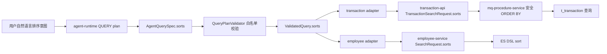

# Agent与业务域白名单排序能力_L2实施详细设计

## 1. 文档信息

| 项目 | 内容 |
|---|---|
| 文档名称 | Agent与业务域白名单排序能力_L2实施详细设计 |
| 文档路径 | `docs/design/Agent与业务域白名单排序能力_L2实施详细设计_v1.0.md` |
| 文档状态 | Approved |
| 当前版本 | v1.0 |
| 作者 | Codex |
| 创建日期 | 2026-07-05 |
| 最后更新日期 | 2026-07-05 |
| 适用范围 | `agent-api`、`agent-runtime`、`agent-service`、`agent-adapter-api`、`agent-adapter-employee`、`agent-adapter-transaction`、`employee-service`、`transaction-api`、`mq-procedure-service` |
| 上级文档 | `docs/design/D01_Agent契约生成与治理_L2实施详细设计_v1.0.md`、`docs/design/D02_01_Capability注册与可信执行内核_L2_v1.0.md`、`docs/design/D04_Agent Adapter与Domain Metadata收敛_L2实施详细设计_v1.0.md`、`docs/ARCHITECTURE.md` |
| 关联文档 | `docs/design/Agent多轮分页与权限拒绝提示修复_L2实施详细设计_v1.0.md`、`docs/design/D02_03_元数据授权与Context安全_L2_v1.0.md`、`docs/design/D05_Capability扩展验证与遗留清理_L2实施详细设计_v1.0.md`、`docs/design/Agent_ResultSecurity值级Mask脱敏接入_L2实施详细设计_v1.0.md`、`agent-api/src/main/resources/openapi/agent-runtime-openapi.json` |
| 是否可作为实现依据 | 是；关联设计文档已按授权同步，OpenAPI 仍需在实现阶段由 Java 契约源重新生成 |

## 2. 修改历史

| 序号 | 日期 | 位置 | 修改原因 | 修改内容 |
|---:|---|---|---|---|
| 1 | 2026-07-05 | 全文 | 初始化文档 | 新建 Agent 与 employee、transaction 业务域白名单排序能力详细设计，覆盖契约、元数据、校验、适配器、下游接口和测试落点 |
| 2 | 2026-07-05 | 第 6 章、第 17 章、第 21 章 | 内部评审第 1 轮发现上级契约变更边界需要显式说明 | 补充 D01/D02/D04 上级文档约束、契约版本升级要求和实现前授权风险 |
| 3 | 2026-07-05 | 第 10 章、第 14 章、第 19 章 | 内部评审第 2 轮发现 MERGE 排序继承和下游稳定排序规则需要落到具体类方法 | 补充 `sorts == null`、`sorts == []` 语义、稳定次级排序规则和实现落点 |
| 4 | 2026-07-05 | 第 10 章、第 17 章、第 19 章、第 20 章、第 22 章 | 品审-修复循环第 1 轮发现共享 QUERY 契约、Context 迁移和 transaction 兼容落点不足 | 补充 `query.preview` 共享影响、Context migrator 接入、结果安全投影、旧 `/txn/query` 兼容和测试落点 |
| 5 | 2026-07-05 | 第 20 章、第 22 章 | 品审-修复循环第 2 轮发现根目录无 Maven 聚合 `pom.xml`，聚合模块参数示例不可直接执行 | 调整测试命令为进入各模块目录执行 `mvn test` |
| 6 | 2026-07-05 | 第 10 章、第 19 章、第 20 章、第 22 章 | 品审-修复循环第 3 轮发现 Context 1.0.0 历史版本、配置装配和现有测试落点覆盖不足 | 补充 `1.0.0 -> 1.2.0` 直接迁移、`ContextSecurityConfiguration` 装配、契约/Runtime client/Domain Metadata 投影/Capability registration 测试落点 |
| 7 | 2026-07-05 | 第 1、3、5、7、21、22 章及关联文档 | 用户授权同步关联设计文档 | 同步 D01、D02_01、D02_03、D04、D05、多轮分页、ResultSecurity 与 ARCHITECTURE 中的 QUERY 白名单排序约束；OpenAPI 明确由实现阶段生成 |
| 8 | 2026-07-05 | 第 1、3、21、22 章 | 关联文档同步后复评通过 | 文档状态改为 Approved；明确可作为实现依据，保留 OpenAPI 由 Java 契约源生成和生产索引评估风险 |

## 3. 文档状态说明

| 状态 | 含义 | 是否可作为开发依据 |
|---|---|---:|
| Draft | 草稿，内容尚未完成完整评审 | 否 |
| In Review | 评审中，内容可能继续调整 | 否 |
| Approved | 已评审通过，可作为实现依据 | 是 |
| Implementing | 已进入实现阶段 | 是 |
| Implemented | 已完成实现，并已与设计对齐 | 是 |
| Deprecated | 已废弃，不再作为实现依据 | 否 |

当前状态：Approved。

本设计涉及 `QueryAgentPlan`、Runtime OpenAPI、QUERY Context 和 `TransactionSearchRequest` 等公共契约变更。2026-07-05 已获得用户授权并同步调整 D01/D02/D04/D05 等关联设计文档；进入实现时仍不得手改 OpenAPI/Python generated model，必须从 Java 契约源生成。

## 4. 背景与目标

当前核实结论如下：

| 对象 | 当前排序能力 | 主要证据 |
|---|---|---|
| `employee-service` | 下游 ES 查询请求支持 `SearchRequest.sorts`，但仅允许 `EmployeeEsService.SEARCHABLE_FIELDS` 白名单字段排序 | `EmployeeEsService.buildSorts()` 使用 `requireSearchableField(sort.getField(), "sort")` |
| `agent-adapter-employee` | Agent 侧不支持用户排序，固定注入 `memberNo ASC, idCardNo ASC` | `EmployeePlanMapper.toSearchRequest()` 固定构造两个 `SearchSort` |
| `mq-procedure-service` / `transaction-api` | 不支持请求指定排序，分页查询固定 `TRANS_DATE desc, TRANS_ID asc` | `TransactionSearchRequest` 仅有 `condition/page/size`；`TransactionMapper.xml` 固定 `order by TRANS_DATE desc, TRANS_ID asc` |
| `agent` QUERY | 不支持排序 | `AgentQuerySpec`、`ValidatedQuery`、runtime generated models、QUERY Context 均无排序字段 |
| `agent` AGGREGATE | 已支持聚合结果排序 | `AgentAggregateSpec.orderBy` 和 `AggregateOrderSpec` |

本设计目标：

1. 为 Agent QUERY 增加受控排序能力，支持用户表达“按某字段升序/降序排序”。
2. 为 employee、transaction 两个业务域通过 Agent 暴露白名单排序能力。
3. 保持排序字段受 Domain Metadata、执行投影和下游业务域白名单共同约束。
4. 保持旧请求兼容：不传排序时沿用当前默认稳定排序。
5. 明确 MERGE 多轮查询中排序的继承、替换和清除语义。
6. 明确实现落点、测试落点、契约版本、发布顺序和风险。

## 5. 设计范围

### 5.1 范围内

| 序号 | 范围 | 内容 |
|---:|---|---|
| 1 | Agent QUERY 计划契约 | 新增查询排序 DTO 和 `AgentQuerySpec.sorts` |
| 2 | Runtime OpenAPI 与 Python 模型 | 更新 OpenAPI、生成 `agent-runtime/app/contracts/generated_models.py`、调整 QUERY prompt |
| 3 | Agent 元数据 | 在 Domain Metadata 的 QUERYABLE role 中增加 `sort-fields` 白名单并投影给 Runtime |
| 4 | Agent 校验 | 在 `QueryPlanValidator` 校验排序字段、数量和方向 |
| 5 | Agent 上下文 | 在 QUERY Context 中保存排序条件，支持 `query.search` MERGE 继承 |
| 6 | employee Agent 适配器 | 将已校验排序映射为 `SearchRequest.sorts`，保留默认排序 |
| 7 | transaction Agent 适配器 | 将已校验排序映射为 `TransactionSearchRequest.sorts` |
| 8 | transaction 下游接口 | 为 `/txn/search` 请求新增排序字段并生成安全 `ORDER BY` |
| 9 | `query.preview` 共享影响 | 因 `query.preview` 复用 `QueryAgentPlan`、`AgentQuerySpec`、`ValidatedQuery`、`AgentQueryParameters`，需同步校验、回显和结果安全投影 |
| 10 | 测试 | 覆盖契约、校验、适配器映射、下游 SQL、上下文、`query.preview` 和 runtime prompt |

### 5.2 范围外

| 序号 | 范围外内容 | 原因 |
|---:|---|---|
| 1 | 支持任意字段排序 | 会绕过字段权限和下游字段能力，存在越权、注入和慢查询风险 |
| 2 | AGGREGATE `orderBy` 重构 | 聚合排序已有独立语义，字段来源为 `groupByFields` 或 metric alias，不属于 QUERY 排序 |
| 3 | 新增数据库索引或迁移脚本 | 需要结合生产数据量和 DBA 评估，本文只记录性能风险和建议 |
| 4 | 手工修改 OpenAPI / Python generated model | OpenAPI 与 Python generated model 必须由 Java 契约源生成，不允许文档同步阶段手工补丁 |
| 5 | 前端排序控件 | 用户请求聚焦 Agent 与业务域能力，UI 控件可作为后续任务 |
| 6 | 非 employee、transaction 业务域排序 | 当前只覆盖两个已接入 Agent 的业务域 |
| 7 | `query.preview` 多轮排序继承 | 首版只保证 `query.preview` 能消费显式 `query.sorts` 并回显；不改变 D05 定义的预览上下文写入语义 |

## 6. 上级文档约束

| 上级文档 | 同步后的继承约束 | 对本设计的影响 |
|---|---|---|
| `D01_Agent契约生成与治理_L2实施详细设计_v1.0.md` | 已同步 `AgentSortSpec`、`AgentQuerySpec.sorts`、`RuntimeDomainSchema.sortFields`、`RuntimeQueryContextView.sorts`；OpenAPI 与 fixture 必须由 Java contract 生成并禁止 Python 后处理补齐 | 本设计必须通过 Java 契约源实现排序契约，并重新生成 OpenAPI 与 Python 模型 |
| `D01_Agent契约生成与治理_L2实施详细设计_v1.0.md` | `AgentPlan` sealed union 只有 `QueryAgentPlan` 与 `AggregateAgentPlan` | 本设计不得新增新的 Plan 类型，只扩展 `QueryAgentPlan.query` |
| `D02_01_Capability注册与可信执行内核_L2_v1.0.md` | 已同步 `QueryPlanValidator` 的排序白名单校验职责、`AgentExecutionContracts` 版本和 `QUERY_CONTEXT` 1.2.0 字段集合；Handler 只能调用已解析 Adapter | 排序校验必须放在 Query Validator；Adapter 只接收已验证 `ValidatedQuery.sorts` |
| `D02_03_元数据授权与Context安全_L2_v1.0.md` | 已同步 `ExecutionValidationProjection.sortFields`、`QueryCapabilityContextPayload.sorts`、`RuntimeQueryContextView.sorts` 以及 `1.0.0/1.1.0 -> 1.2.0` 精确迁移 | 实现阶段必须补 direct migrator 和 ContextBoundary 迁移接入，不能依赖链式迁移或 Jackson 猜类型 |
| `D04_Agent Adapter与Domain Metadata收敛_L2实施详细设计_v1.0.md` | domain、field、operator、function 只能来自 Canonical Catalog 和 Adapter Registration；Adapter 不自报字段能力 | 排序字段白名单必须进入 Domain Metadata，而不是让 Adapter 动态声明 |
| `docs/ARCHITECTURE.md` | 已同步 QUERY `sorts` 与 AGGREGATE `orderBy` 的边界：前者是明细行白名单排序，后者是聚合结果排序 | 本设计新增的是 QUERY 明细排序，不复用 AGGREGATE 的 metric/group 排序语义 |

## 7. 关联文档与边界

| 关联文档 | 关联内容 | 本文档职责 | 对方职责 | 边界说明 |
|---|---|---|---|---|
| `Agent多轮分页与权限拒绝提示修复_L2实施详细设计_v1.0.md` | 多轮分页、`totalPages`、权限拒绝提示 | 定义排序与分页上下文的继承关系 | 保留既有分页与权限错误处理约束 | 排序不得破坏“下一页/上一页/最后一页”语义 |
| `D02_03_元数据授权与Context安全_L2_v1.0.md` | Context 安全、加密、权限投影 | 定义新增 `sorts` 的 Context 字段含义 | 维护 Context 存储、加密、可见字段投影 | 本文不改变 Context 存储模型，只改变 payload schema |
| `docs/design/D05_Capability扩展验证与遗留清理_L2实施详细设计_v1.0.md` | `query.preview` 共享 QUERY planKind 与共享 DTO | 定义排序字段对 preview 的共享影响 | 维护 preview 不写 Context、不固定 Prompt 分支、ResultSecurity 过滤的边界 | 只消费显式当前 plan `sorts`，不承诺 preview MERGE 继承 |
| `docs/design/Agent_ResultSecurity值级Mask脱敏接入_L2实施详细设计_v1.0.md` | ResultSecurity 统一过滤与脱敏 | 定义排序回显需要安全过滤 | 维护 `queryParameters.sorts` 不泄露未授权字段 | 排序只含字段名/方向，不做值级 mask |
| `agent-api/src/main/resources/openapi/agent-runtime-openapi.json` | Runtime OpenAPI 产物 | 说明需要重新生成 | 作为 D01 contract 产物受测试门禁保护 | 不允许手改生成产物后绕过 Java contract |
| `employee-service` ES 查询实现 | `SearchRequest.sorts`、字段白名单 | 说明 Agent 如何复用现有能力 | 维护 ES DSL 与字段白名单 | employee-service 生产代码原则上不必改，只补测试 |
| `mq-procedure-service` 查询实现 | `/txn/search`、MyBatis SQL | 设计 transaction 排序请求与安全 `ORDER BY` | 维护 transaction 业务数据查询 | 动态 SQL 必须由 Service 白名单生成，不允许 Controller/Mapper 接收原始列名 |

## 8. 设计边界与约束

| 边界类型 | 设计约束 |
|---|---|
| 业务边界 | 只支持明细查询排序，不支持写操作排序、聚合排序重构或跨域排序 |
| 系统边界 | Agent 负责理解、校验、回显排序意图；业务域负责按已验证字段执行排序 |
| 模块边界 | `agent-api` 定义公共 DTO；`agent-service` 校验和上下文；Adapter 只映射；业务服务只处理本域接口 |
| 数据边界 | Agent 不接触数据库列名；transaction 列名映射只在 `mq-procedure-service` 内部维护 |
| 权限边界 | 排序字段必须在当前用户的 execution projection 中可见，且属于 `sort-fields` 白名单 |
| 安全边界 | 禁止将用户输入字段直接拼接 SQL 或 ES DSL；所有字段必须先 canonical 化并白名单校验 |
| 兼容边界 | `sorts` 为可选字段；历史请求缺省排序保持不变；历史 QUERY Context 缺少 `sorts` 时视为空列表 |
| 性能边界 | 每次 QUERY 最多允许 2 个用户排序字段；业务域追加稳定 tie-breaker 不计入用户排序字段数 |

## 9. 总体设计

排序能力的端到端链路如下：



核心原则：

1. Runtime 只能从 `RuntimeDomainSchema.sortFields` 中选择排序字段。
2. Java Validator 仍是最终可信边界，Runtime 生成了非法字段也必须 fail closed。
3. Adapter 不再判断字段是否授权，只处理 `ValidatedQuery.sorts`。
4. 下游业务域必须维护自身字段到 ES/DB 的安全映射，禁止透传用户字段为底层列名。
5. 没有显式排序时保留现状默认排序，避免老用户看到分页顺序变化。

## 10. 详细功能设计

### 10.1 QUERY 排序计划契约

#### 10.1.1 功能说明

在 `AgentQuerySpec` 中新增 `sorts` 字段，表达明细查询排序要求。

#### 10.1.2 输入与输出

| 字段 | 类型 | 必填 | 约束 | 说明 |
|---|---|---:|---|---|
| `sorts` | `List<AgentSortSpec>` | 否 | 最多 2 个；可为 `null` 或空列表 | QUERY 明细结果排序列表 |
| `sorts[].field` | `String` | 是 | 非空；必须来自 `RuntimeDomainSchema.sortFields` 和执行投影 | canonical 字段名 |
| `sorts[].direction` | `String` | 是 | `ASC` 或 `DESC` | 排序方向 |

新增 DTO：

```java
package com.dylan.agent.api.plan;

public class AgentSortSpec {
    private String field;
    private String direction;
}
```

#### 10.1.3 处理流程

1. Runtime 根据用户话术和 `RuntimeDomainSchema.sortFields` 生成 `query.sorts`。
2. `QueryPlanValidator` 校验排序字段和方向。
3. `ValidatedQuery` 保存已验证排序。
4. `QueryCapabilityHandler` 将排序写入 `queryParameters` 和 QUERY Context。
5. Adapter 将排序映射给业务域。

#### 10.1.4 业务规则

| 规则编号 | 规则 |
|---|---|
| QR-001 | `sorts == null` 在 REPLACE 模式表示用户未指定排序，使用业务域默认排序 |
| QR-002 | `sorts == null` 在 MERGE 模式表示继承上一轮 QUERY Context 的排序 |
| QR-003 | `sorts == []` 在 MERGE 模式表示清除上一轮用户排序，恢复业务域默认排序 |
| QR-004 | 同一请求内 `sorts.field` 不允许重复 |
| QR-005 | `sorts.direction` 必须规范化为大写 `ASC` 或 `DESC` |
| QR-006 | 排序字段不要求出现在 `selectFields` 中，但必须在当前 execution projection 中可见 |
| QR-007 | 排序字段必须同时属于 Domain Metadata 的 `sort-fields` 白名单 |

#### 10.1.5 边界条件

| 场景 | 处理方式 |
|---|---|
| 用户要求按不可见字段排序 | 返回字段权限拒绝或计划校验失败，不执行下游查询 |
| 用户要求按不存在字段排序 | 返回计划校验失败，不执行下游查询 |
| 用户要求超过 2 个排序字段 | 返回计划校验失败 |
| 用户要求自然语言排序但字段不明确 | Runtime 应返回澄清，不生成模糊排序字段 |
| Runtime 生成非法排序字段 | Java Validator fail closed |

#### 10.1.6 异常处理

| 异常 | 触发条件 | 处理方式 |
|---|---|---|
| `IllegalArgumentException("invalid query sorts")` | 空字段、重复字段、非法方向、超限 | 由 Kernel 转换为计划校验失败 |
| `KernelExecutionException(FIELD_FORBIDDEN)` | 字段存在但当前 scope 不可访问 | 返回字段权限拒绝提示 |
| `KernelExecutionException(PLAN_VALIDATION_FAILED)` | 字段不在 `sort-fields` 白名单 | 返回计划校验失败，不调用 Adapter |

### 10.2 Domain Metadata 排序白名单

#### 10.2.1 功能说明

在 `agent.domain-metadata.domains.<domain>.role-capabilities.QUERYABLE` 下新增 `sort-fields`，用于声明当前业务域允许 Agent QUERY 排序的 canonical 字段。

#### 10.2.2 配置结构

```yaml
agent:
  domain-metadata:
    domains:
      employee:
        role-capabilities:
          QUERYABLE:
            sort-fields: [chineseName, memberNo, position, contactAddress, idCardNo, phoneNo, email]
      transaction:
        role-capabilities:
          QUERYABLE:
            sort-fields: [transId, transType, transDate, amount]
```

#### 10.2.3 处理流程

1. `DomainMetadataProperties.RoleCapabilityProperties` 绑定 `sortFields`。
2. `DomainMetadataPropertiesValidator` 校验 `sortFields` 是 `fields` 子集。
3. `DomainMetadataPortImpl.planSchema()` 将排序字段投影为 `RuntimeDomainSchema.sortFields`。
4. `DomainMetadataPortImpl.executionProjection()` 将排序字段投影到 `ExecutionValidationProjection.sortFields`。

#### 10.2.4 业务规则

| 规则编号 | 规则 |
|---|---|
| DM-001 | `sort-fields` 只在 `QUERYABLE` role 生效 |
| DM-002 | `sort-fields` 必须是同 role `fields` 的子集 |
| DM-003 | 未配置 `sort-fields` 时默认为空集合，不允许排序 |
| DM-004 | Runtime schema 只暴露当前授权后的排序字段，不暴露数据库列名或 Adapter 实现细节 |

### 10.3 employee 域排序

#### 10.3.1 功能说明

employee 下游 ES 查询已具备白名单排序能力，本设计只让 Agent 使用该能力。

#### 10.3.2 输入与输出

| 输入 | 输出 |
|---|---|
| `ValidatedQuery.sorts` | `SearchRequest.sorts` |
| 空排序 | `memberNo ASC, idCardNo ASC` 默认排序 |
| 用户排序 | 用户排序 + 必要时追加 `idCardNo ASC` 稳定排序 |

#### 10.3.3 处理流程

1. `EmployeePlanMapper.toSearchRequest(ValidatedQuery query)` 读取 `query.getSorts()`。
2. 如果为空，沿用当前固定排序：`memberNo ASC, idCardNo ASC`。
3. 如果非空，将每个 `ValidatedSort` 映射为 `SearchSort`。
4. 如果用户排序不包含 `idCardNo`，追加 `idCardNo ASC` 作为稳定 tie-breaker。
5. `EmployeeEsService.buildSorts()` 继续执行现有字段白名单校验。

#### 10.3.4 业务规则

| 规则编号 | 规则 |
|---|---|
| EMP-001 | Agent employee 排序白名单必须与 `EmployeeEsService.SEARCHABLE_FIELDS` 保持一致 |
| EMP-002 | 文本字段排序使用现有 `.keyword` 子字段逻辑 |
| EMP-003 | `idCardNo` 作为唯一稳定字段，用于分页稳定性 |
| EMP-004 | employee-service 生产代码不新增公共契约字段 |

### 10.4 transaction 域排序

#### 10.4.1 功能说明

transaction 当前 `/txn/search` 只支持固定排序。本设计在 `transaction-api` 新增排序 DTO，并由 `mq-procedure-service` 生成安全 `ORDER BY`。

#### 10.4.2 输入与输出

| 输入 | 输出 |
|---|---|
| `TransactionSearchRequest.sorts == null` 或空 | `TRANS_DATE DESC, TRANS_ID ASC` |
| `sorts=[{field:"amount", direction:"DESC"}]` | `ORDER BY AMOUNT DESC, TRANS_ID ASC` |
| `sorts=[{field:"transId", direction:"DESC"}]` | `ORDER BY TRANS_ID DESC` |

#### 10.4.3 处理流程

1. `TransactionPlanMapper.toSearchRequest(ValidatedQuery query)` 将排序映射为 `TransactionSearchRequest.sorts`。
2. `TransactionService.search(TransactionSearchRequest request)` 校验分页、查询条件和排序。
3. `TransactionService` 使用内部 `FIELD_MAP` 将 canonical field 映射为 DB 列名。
4. `TransactionService` 生成已验证 `orderByClause`。
5. `TransactionMapper.query(condition, offset, size, orderByClause)` 执行分页查询。
6. `TransactionMapper.xml` 只使用 Service 生成的 `orderByClause`，不接收 Controller 原始字段。

#### 10.4.4 业务规则

| 规则编号 | 规则 |
|---|---|
| TXN-001 | transaction 排序字段白名单为 `transId/transType/transDate/amount` |
| TXN-002 | 未指定排序时保持现有 `TRANS_DATE DESC, TRANS_ID ASC` |
| TXN-003 | 用户排序不包含 `transId` 时追加 `TRANS_ID ASC` 作为稳定 tie-breaker |
| TXN-004 | `sorts.direction` 只允许 `ASC`、`DESC` |
| TXN-005 | `sorts.field` 必须通过 `FIELD_MAP` 映射，不允许直接拼接请求字段 |
| TXN-006 | `countUpTo()` 不使用排序，避免无意义排序开销 |
| TXN-007 | `TransactionService.query(Transaction condition)` 和旧 `/txn/query` 调用必须显式传入 `orderByClause=null`，保持原有无分页查询行为不变 |
| TXN-008 | `TransactionMapper.xml` 使用 `${orderByClause}` 前必须由 `TransactionService.buildOrderByClause(...)` 生成；Controller、Adapter、请求 DTO 均不得传入数据库列名或 SQL 片段 |

### 10.5 多轮上下文排序继承

#### 10.5.1 功能说明

QUERY Context 新增 `sorts`，使“下一页”“上一页”“最后一页”在排序查询后保持同一排序。

#### 10.5.2 MERGE 规则

| 上一轮 Context | 当前计划 | 合并结果 |
|---|---|---|
| `sorts=[amount DESC]` | `contextMode=MERGE, sorts=null, page=2` | 继承 `amount DESC` |
| `sorts=[amount DESC]` | `contextMode=MERGE, sorts=[]` | 清空用户排序，恢复默认排序 |
| `sorts=[amount DESC]` | `contextMode=MERGE, sorts=[transDate ASC]` | 替换为 `transDate ASC` |
| 无上一轮 Context | `contextMode=MERGE` | 保持现有错误：提示先完成一次查询 |

#### 10.5.3 上下文字段

`QueryCapabilityContextPayload` 新增字段：

```java
List<AgentSortSpec> sorts
```

兼容规则：历史 Context 缺少 `sorts` 时反序列化为 `List.of()`。

Context 声明规则：

1. `QueryCapabilityConfiguration` 的 `ContextReadDeclaration` 和 `ContextWriteDeclaration` 均需把 `sorts` 加入字段集合，否则 `ContextBoundary.validateWritableFields(...)` 会拒绝写入带排序的 QUERY Context。
2. `ContextBoundary.payloadFields(...)` 需在 `query.sorts()` 非空时加入 `sorts`，并在 `toRuntimeView(...)` 中仅当 readable fields 包含 `sorts` 时投影到 `RuntimeQueryContextView.sorts`。
3. `query.preview` 首版不写 QUERY Context；是否读取上一轮 `sorts` 不改变 D05 既有语义。若后续要求“预览继承上一轮排序”，必须同步修订 D05 或取得显式授权。
4. 若 `QUERY_CONTEXT` 版本从 `1.1.0` 升级到 `1.2.0`，`ContextBoundary.load(...)` 不能继续只做 exact contract equality；必须通过 `ContextMigrationRegistry.resolve(storedRef, targetRef)` 执行精确迁移。
5. 新增 `QueryContextPayloadV11ToV12Migrator`，source 为 `QueryCapabilityContextPayload/1.1.0`，target 为 `QueryCapabilityContextPayload/1.2.0`，迁移结果保持 filters/selectFields/page/size/total/totalExact/totalPages，并设置 `sorts=List.of()`。
6. 因 `ContextMigrationRegistry` 当前只支持精确 source/target 迁移，不做路径搜索；若仍可能存在 `QUERY_CONTEXT/1.0.0` 历史记录，必须新增 `QueryContextPayloadV10ToV12Migrator`，直接将 filters/selectFields/page/size 原样保留，total/totalExact/totalPages 置为 `null`，`sorts` 置为 `List.of()`。
7. `ContextSecurityConfiguration.contextBoundary(...)` 必须注入 `ContextMigrationRegistry` 或等价迁移端口；否则即使新增 migrator，生产 `ContextBoundary` 也无法执行迁移。

### 10.6 `query.preview` 共享 QUERY 契约影响

#### 10.6.1 功能说明

`query.preview` 与 `query.search` 共用 `QueryAgentPlan`、`AgentQuerySpec`、`ValidatedQuery` 和 `AgentQueryParameters`。因此 `AgentQuerySpec.sorts` 不是只影响 `query.search` 的字段，必须同步处理预览能力的编译、校验、Adapter 入参和响应安全投影。

#### 10.6.2 处理规则

| 规则编号 | 规则 |
|---|---|
| QP-001 | `query.preview` 允许消费当前计划中显式提供的 `query.sorts`，排序字段和方向使用与 `query.search` 相同的白名单校验逻辑 |
| QP-002 | `query.preview` 不写 QUERY Context；本设计不改变 D05 中 `ContextWriteDeclaration` 为空的约束 |
| QP-003 | `query.preview` 不承诺 MERGE 排序继承；`sorts == null` 或 `sorts == []` 均表示使用业务域默认排序 |
| QP-004 | `QueryPreviewPlanValidator.toPreviewQuery(...)` 创建 `ValidatedQuery` 时必须传入已校验 `ValidatedSort` 列表，避免新构造器导致编译遗漏 |
| QP-005 | `QueryPreviewCapabilityHandler.toQueryParameters(...)` 必须回显 `sorts`，与 `query.search` 的 `AgentQueryParameters` 结构保持一致 |
| QP-006 | `QueryPreviewResultSecurityProjector` 必须按当前 `ExecutionScope` 过滤 `queryParameters.sorts`，避免未授权字段通过参数回显泄露 |

#### 10.6.3 与 D05 的协调边界

D05 要求 `query.preview` 作为同 `QUERY` planKind 的代表能力，不在 Runtime prompt 中写 capability 专用分支。本设计保持该约束：Runtime prompt 只描述通用 QUERY 排序规则，不出现 `query.preview` 固定分支。由于共享 DTO 增加字段会影响 D05 已落地类，编码时应将 D05 相关实现文件纳入同一编译和测试闭环；是否修订 D05 文档本身需用户另行授权。

## 11. 接口设计

| 接口 | 方法 | 路径 | 说明 |
|---|---|---|---|
| Runtime Plan | `POST` | `/runtime/v1/plans/generate` | `QueryAgentPlan.query` 新增可选 `sorts` |
| Agent Chat | `POST` | `/agent/chat` | `queryParameters` 新增 `sorts` 回显 |
| Employee Search | `POST` | employee Feign `/employee/es/search` 对应路径 | 沿用 `SearchRequest.sorts`，无需新增字段 |
| Transaction Search | `POST` | `/txn/search` | `TransactionSearchRequest` 新增可选 `sorts` |

### 11.1 Runtime QUERY Plan 请求产物示例

```json
{
  "planKind": "QUERY",
  "query": {
    "filters": [
      {"field": "amount", "operator": "GT", "value": "100"}
    ],
    "selectFields": ["transId", "transDate", "amount"],
    "sorts": [
      {"field": "amount", "direction": "DESC"}
    ],
    "page": 1,
    "size": 20
  }
}
```

### 11.2 Agent Chat 响应回显示例

```json
{
  "queryParameters": {
    "domain": "transaction",
    "filters": [
      {"field": "amount", "operator": "GT", "value": "100"}
    ],
    "selectFields": ["transId", "transDate", "amount"],
    "sorts": [
      {"field": "amount", "direction": "DESC"}
    ],
    "page": 1,
    "size": 20
  }
}
```

### 11.3 Transaction Search 请求示例

```json
{
  "condition": {
    "amountGt": 100
  },
  "page": 1,
  "size": 20,
  "sorts": [
    {"field": "amount", "direction": "DESC"}
  ]
}
```

### 11.4 错误处理

| 场景 | 错误来源 | 响应要求 |
|---|---|---|
| 排序字段不在授权投影 | `QueryPlanValidator` | 不调用 Adapter，返回字段权限拒绝或计划校验失败 |
| 排序字段不在业务域白名单 | `QueryPlanValidator` 或业务 Service | 不执行查询，返回计划校验失败 |
| transaction 下游收到非法排序字段 | `TransactionService.validateSearchRequest()` | 抛出 `IllegalArgumentException`，Controller 按现有异常路径处理 |
| Runtime 生成非法 `direction` | Java Bean Validation 或 `QueryPlanValidator` | 计划校验失败 |

## 12. 数据设计

### 12.1 新增或修改对象

| 对象 | 字段 | 类型 | 必填 | 默认值 | 说明 |
|---|---|---|---:|---|---|
| `AgentSortSpec` | `field` | `String` | 是 | 无 | canonical 字段名 |
| `AgentSortSpec` | `direction` | `String` | 是 | 无 | `ASC` 或 `DESC` |
| `AgentQuerySpec` | `sorts` | `List<AgentSortSpec>` | 否 | `null` | QUERY 排序计划 |
| `AgentQueryParameters` | `sorts` | `List<AgentSortSpec>` | 否 | `List.of()` | query.search 与 query.preview 响应回显排序条件 |
| `ValidatedSort` | `field` | `String` | 是 | 无 | 已验证字段 |
| `ValidatedSort` | `direction` | `String` | 是 | 无 | 已规范化方向 |
| `ValidatedQuery` | `sorts` | `List<ValidatedSort>` | 是 | `List.of()` | 已验证排序 |
| `DomainMetadataProperties.RoleCapabilityProperties` | `sortFields` | `Set<String>` | 是 | `Set.of()` | YAML `sort-fields` 绑定结果 |
| `CanonicalRoleCapability` | `sortFields` | `Set<String>` | 是 | `Set.of()` | 不可变 Domain Metadata 快照中的排序字段白名单 |
| `RuntimeDomainSchema` | `sortFields` | `List<String>` | 是 | `List.of()` | Runtime 可见排序字段 |
| `ExecutionValidationProjection` | `sortFields` | `Set<String>` | 是 | `Set.of()` | Java 执行校验排序字段 |
| `QueryCapabilityContextPayload` | `sorts` | `List<AgentSortSpec>` | 是 | `List.of()` | 上下文排序条件 |
| `RuntimeQueryContextView` | `sorts` | `List<AgentSortSpec>` | 是 | `List.of()` | Runtime 可读 QUERY Context |
| `TransactionSearchSort` | `field` | `String` | 是 | 无 | transaction canonical 字段名 |
| `TransactionSearchSort` | `direction` | `String` | 是 | 无 | `ASC` 或 `DESC` |
| `TransactionSearchRequest` | `sorts` | `List<TransactionSearchSort>` | 否 | `null` | transaction 查询排序 |

### 12.2 不涉及数据库表结构变更

本设计不新增数据库表字段，不修改 `t_transaction` 表结构，不新增 migration。排序 SQL 只修改查询语句的 `ORDER BY` 生成方式。

## 13. 状态流转设计

本设计不新增业务状态枚举。涉及的状态语义为 QUERY Context 的多轮继承状态：

| 状态 | 进入条件 | 可执行动作 | 输出 |
|---|---|---|---|
| 无排序上下文 | 首次查询未指定排序，或 MERGE 清空排序 | 下一页、修改条件、指定新排序 | 使用业务域默认排序 |
| 有排序上下文 | 首次查询指定排序，或 MERGE 替换排序 | 下一页、上一页、最后一页、修改条件 | 继承或替换排序 |
| 排序上下文失效 | 上下文过期、权限变化、domain metadata 版本变化 | 不允许继续 MERGE | 返回重新查询或权限拒绝 |

## 14. 幂等、事务与一致性设计

| 项目 | 设计 |
|---|---|
| 幂等性 | 排序查询是只读操作，不新增幂等记录；相同 filters/sorts/page/size 在同一数据快照下应返回同序结果 |
| 事务边界 | Agent 不开启业务事务；employee ES 查询和 transaction DB 查询沿用各自服务只读边界 |
| 跨服务一致性 | Agent 查询总数和结果行仍存在读时数据变化风险；排序不新增跨服务事务 |
| 分页一致性 | employee 追加 `idCardNo ASC`、transaction 追加 `TRANS_ID ASC` 作为稳定 tie-breaker，降低分页重复和漏读风险 |
| Context 一致性 | 成功 QUERY 才写入带 `sorts` 的 Context；失败查询不覆盖上一轮 Context |
| 历史兼容 | 历史 Context 缺少 `sorts` 时按空列表处理，不影响已有多轮分页 |

## 15. 权限、风控与审计设计

| 类型 | 设计 |
|---|---|
| 操作权限 | 排序仍属于 READ_ONLY 查询能力，不新增写权限 |
| 数据权限 | 排序字段必须在当前 execution projection 可见；不可见字段不允许用于排序 |
| 字段权限 | 即使用户不在 `selectFields` 展示排序字段，也必须具备该字段访问权限 |
| 风控规则 | 每次最多 2 个用户排序字段；禁止任意字段排序；禁止原始字段拼 SQL |
| 审计内容 | Invocation audit、PlanningCheckpoint、queryParameters 和 QUERY Context 记录排序条件 |
| 敏感信息 | `sorts` 只包含 canonical 字段名和方向，不包含字段值 |
| 失败审计 | 排序校验失败应保留 diagnosticId、capabilityId、domain、失败字段，不记录用户隐私值 |

## 16. 性能与容量设计

| 项目 | 设计 |
|---|---|
| 排序数量 | 最多 2 个用户排序字段，业务域追加稳定字段不计入用户上限 |
| employee 性能 | ES 使用 keyword 字段排序；排序字段与 `SEARCHABLE_FIELDS` 对齐 |
| transaction 性能 | 默认排序保持 `TRANS_DATE DESC, TRANS_ID ASC`；非默认字段排序可能触发 filesort 或全量扫描 |
| 分页上限 | 继续使用 `agent.query.max-size`、domain `max-page-size`、ExecutionScope `maxResultRows` 的最小值 |
| 降级策略 | 不支持排序字段时 fail closed，不降级为无排序查询，避免用户误解结果顺序 |
| 索引建议 | 如生产 transaction 按 `amount`、`transType` 排序频繁，应单独评估 `(AMOUNT, TRANS_ID)`、`(TRANS_TYPE, TRANS_ID)` 等索引，不纳入本文实现范围 |

## 17. 兼容性与扩展性设计

| 类型 | 设计 |
|---|---|
| Runtime 合约兼容 | `AgentQuerySpec.sorts` 为可选字段；旧请求不带排序仍合法 |
| Runtime 版本 | 建议将 `AgentRuntimeContract.VERSION` 从 `1.0.0` 升级到 `1.1.0`，因为 OpenAPI schema 和 Python generated models 发生变化 |
| QUERY Result 版本 | `QueryAgentResultPayload` 中 `queryParameters` 新增 `sorts`，建议从 `1.0.0` 升级到 `1.1.0` |
| Query Preview Result 版本 | `QueryPreviewResultPayload` 复用 `AgentQueryParameters`，`queryParameters` 同步新增 `sorts`，建议从 `1.0.0` 升级到 `1.1.0` |
| QUERY Context 版本 | 当前 `QUERY_CONTEXT` 为 `1.1.0`，新增 `sorts` 后建议升级到 `1.2.0` |
| 历史 Context | 接入 `ContextMigrationRegistry` 并新增 `QueryContextPayloadV11ToV12Migrator`、`QueryContextPayloadV10ToV12Migrator`，将缺失 `sorts` 的旧 payload 转为 `List.of()` |
| Context 迁移约束 | `ContextBoundary.load(...)` 对 stored contract 与 target contract 不一致时先查精确 migrator；无 migrator 时继续 fail closed |
| transaction 下游兼容 | `/txn/search` 请求新增可选 `sorts`；旧调用方不传字段不受影响 |
| transaction 旧查询兼容 | `TransactionService.query(Transaction condition)` 与旧 `/txn/query` 继续传 `orderByClause=null`，不改变既有无分页查询排序行为 |
| employee 下游兼容 | 复用既有 `SearchRequest.sorts`，不改变 employee-service 接口 |
| 扩展性 | 后续新增业务域只需配置 `sort-fields`、实现 Adapter 排序映射和下游安全排序 |
| 发布顺序 | 先发布 agent-api/transaction-api 契约与下游 transaction 服务，再发布 Agent runtime 和 Agent adapter 使用排序 |

## 18. 日志、监控与告警

| 类型 | 设计 |
|---|---|
| 关键日志 | `QueryPlanValidator` 在 debug 级别记录排序字段数量和 domain，不记录用户原文 |
| 业务日志 | transaction 下游在 debug 级别记录排序字段 canonical 名，不记录拼接 SQL 全文 |
| 审计日志 | 通过既有 Invocation audit 和 Context write commit ref 记录排序计划 |
| 指标监控 | 复用 Agent plan validation failure 指标；可新增 `agent.query.sort.validation.failed` 计数 |
| 告警条件 | 排序校验失败率异常升高、transaction `/txn/search` P95 延迟显著升高 |
| 排查入口 | diagnosticId、requestCorrelationId、conversationId、Invocation audit |
| 链路追踪 | Agent 到 transaction Feign 调用沿用现有 trace/correlation 机制 |

## 19. 实现落点清单

### 19.1 Java 实现落点

| 序号 | 类型 | 路径 | 类名 | 方法名 | 入参类型 | 返回类型 | 新增/修改 | 说明 |
|---:|---|---|---|---|---|---|---|---|
| 1 | DTO | `agent-api/src/main/java/com/dylan/agent/api/plan/AgentSortSpec.java` | `com.dylan.agent.api.plan.AgentSortSpec` | `getField()`、`setField(String field)`、`getDirection()`、`setDirection(String direction)` | `String field`、`String direction` | `String` / `void` | 新增 | QUERY 排序 DTO，字段、方向 |
| 2 | DTO | `agent-api/src/main/java/com/dylan/agent/api/plan/AgentQuerySpec.java` | `com.dylan.agent.api.plan.AgentQuerySpec` | `getSorts()`、`setSorts(List<AgentSortSpec> sorts)` | `List<AgentSortSpec> sorts` | `List<AgentSortSpec>` / `void` | 修改 | 新增可选排序字段，建议 `@Size(max = 2)` |
| 3 | DTO | `agent-api/src/main/java/com/dylan/agent/api/response/AgentQueryParameters.java` | `com.dylan.agent.api.response.AgentQueryParameters` | `getSorts()`、`setSorts(List<AgentSortSpec> sorts)` | `List<AgentSortSpec> sorts` | `List<AgentSortSpec>` / `void` | 修改 | 响应回显排序条件 |
| 4 | Context | `agent-api/src/main/java/com/dylan/agent/api/context/QueryCapabilityContextPayload.java` | `com.dylan.agent.api.context.QueryCapabilityContextPayload` | canonical constructor | `List<AgentFilter> filters, List<String> selectFields, List<AgentSortSpec> sorts, int page, int size, Long total, Boolean totalExact, Integer totalPages` | `QueryCapabilityContextPayload` | 修改 | 新增排序上下文字段，缺省空列表 |
| 5 | Runtime Contract | `agent-api/src/main/java/com/dylan/agent/api/contract/runtime/common/RuntimeQueryContextView.java` | `com.dylan.agent.api.contract.runtime.common.RuntimeQueryContextView` | `getSorts()`、`setSorts(List<AgentSortSpec> sorts)` | `List<AgentSortSpec> sorts` | `List<AgentSortSpec>` / `void` | 修改 | Runtime 可读取上一轮排序 |
| 6 | Runtime Contract | `agent-api/src/main/java/com/dylan/agent/api/contract/runtime/common/RuntimeDomainSchema.java` | `com.dylan.agent.api.contract.runtime.common.RuntimeDomainSchema` | `getSortFields()`、`setSortFields(List<String> sortFields)` | `List<String> sortFields` | `List<String>` / `void` | 修改 | 暴露当前 domain 可排序字段 |
| 7 | Contract Ref | `agent-api/src/main/java/com/dylan/agent/api/contract/runtime/common/AgentRuntimeContract.java` | `com.dylan.agent.api.contract.runtime.common.AgentRuntimeContract` | 常量 `VERSION` | 无 | `String` | 修改 | 建议升级到 `1.1.0` |
| 8 | Contract Ref | `agent-api/src/main/java/com/dylan/agent/api/contract/common/AgentExecutionContracts.java` | `com.dylan.agent.api.contract.common.AgentExecutionContracts` | 常量 `QUERY_RESULT`、`QUERY_PREVIEW_RESULT`、`QUERY_CONTEXT` | 无 | `ContractRef` | 修改 | 建议 `QUERY_RESULT=1.1.0`、`QUERY_PREVIEW_RESULT=1.1.0`、`QUERY_CONTEXT=1.2.0` |
| 9 | Adapter DTO | `agent-adapter-api/src/main/java/com/dylan/agent/adapter/api/query/ValidatedSort.java` | `com.dylan.agent.adapter.api.query.ValidatedSort` | 构造器、`getField()`、`getDirection()` | `String field, String direction` | `ValidatedSort` / `String` | 新增 | 已校验排序值对象 |
| 10 | Adapter DTO | `agent-adapter-api/src/main/java/com/dylan/agent/adapter/api/query/ValidatedQuery.java` | `com.dylan.agent.adapter.api.query.ValidatedQuery` | 构造器、`getSorts()` | `List<ValidatedFilter> filters, List<String> selectFields, List<ValidatedSort> sorts, int page, int size` | `List<ValidatedSort>` | 修改 | 保存已校验排序 |
| 11 | Metadata Config | `agent-service/src/main/java/com/dylan/agent/metadata/domain/internal/DomainMetadataProperties.java` | `DomainMetadataProperties.RoleCapabilityProperties` | `getSortFields()`、`setSortFields(Set<String> sortFields)` | `Set<String> sortFields` | `Set<String>` / `void` | 修改 | 绑定 `sort-fields` |
| 12 | Metadata Validator | `agent-service/src/main/java/com/dylan/agent/metadata/domain/internal/DomainMetadataPropertiesValidator.java` | `com.dylan.agent.metadata.domain.internal.DomainMetadataPropertiesValidator` | `validate()` 内 role capability 校验逻辑 | `DomainMetadataProperties properties` | `void` | 修改 | 校验 `sortFields` 是 `fields` 子集 |
| 13 | Metadata Projection | `agent-service/src/main/java/com/dylan/agent/metadata/domain/internal/DomainMetadataPortImpl.java` | `com.dylan.agent.metadata.domain.internal.DomainMetadataPortImpl` | `planSchema(...)`、`executionProjection(...)` | 既有入参 | `RuntimeDomainSchema` / `ExecutionValidationProjection` | 修改 | 投影 `sortFields` |
| 14 | Execution Projection | `agent-service/src/main/java/com/dylan/agent/kernel/port/model/ExecutionValidationProjection.java` | `com.dylan.agent.kernel.port.model.ExecutionValidationProjection` | 构造器、`sortFields()` | `Set<String> sortFields` | `Set<String>` | 修改 | Validator 使用排序字段投影 |
| 15 | Query Validator | `agent-service/src/main/java/com/dylan/agent/capability/query/QueryPlanValidator.java` | `com.dylan.agent.capability.query.QueryPlanValidator` | `validate(...)`、`bindQuery(...)`、新增 `normalizeKernelSorts(...)`、`validateKernelSorts(...)` | `AgentQuerySpec query, ExecutionValidationContext context` 等 | `ValidatedQueryPlan` / `List<ValidatedSort>` | 修改 | 校验排序数量、字段、方向和 MERGE 继承 |
| 16 | Query Mapper | `agent-service/src/main/java/com/dylan/agent/capability/query/QueryParameterMapper.java` | `com.dylan.agent.capability.query.QueryParameterMapper` | `toQueryParameters(ValidatedQueryPlan plan)` | `ValidatedQueryPlan plan` | `AgentQueryParameters` | 修改 | 回显排序 |
| 17 | Query Handler | `agent-service/src/main/java/com/dylan/agent/capability/query/QueryCapabilityHandler.java` | `com.dylan.agent.capability.query.QueryCapabilityHandler` | `toKernelContextWrite(...)`、`toKernelAgentSort(...)` | `ValidatedQueryPlan plan, AdapterQueryResult adapterResult` | `ContextWriteCandidate` | 修改 | 写入 QUERY Context 排序 |
| 18 | Context View | `agent-service/src/main/java/com/dylan/agent/metadata/context/internal/ContextBoundary.java` | `com.dylan.agent.metadata.context.internal.ContextBoundary` | QUERY Context 投影相关方法 | 既有入参 | 既有返回 | 修改 | 从 payload 填充 `RuntimeQueryContextView.sorts` |
| 19 | Result Security | `agent-service/src/main/java/com/dylan/agent/metadata/result/QueryResultSecurityProjector.java` | `com.dylan.agent.metadata.result.QueryResultSecurityProjector` | `filter(...)`、`filterParameters(...)` | 既有入参 | 既有返回 | 修改 | 保留允许字段排序回显，并按 scope 过滤 `queryParameters.sorts` |
| 20 | Employee Adapter | `agent-adapter-employee/src/main/java/com/dylan/agent/adapter/employee/EmployeePlanMapper.java` | `com.dylan.agent.adapter.employee.EmployeePlanMapper` | `toSearchRequest(ValidatedQuery query)`、新增 `toSorts(List<ValidatedSort> sorts)` | `ValidatedQuery query` / `List<ValidatedSort> sorts` | `SearchRequest` / `List<SearchSort>` | 修改 | 用户排序映射为 ES 搜索排序，空排序保留默认 |
| 21 | Transaction DTO | `transaction-api/src/main/java/com/dylan/transaction/api/query/TransactionSearchSort.java` | `com.dylan.transaction.api.query.TransactionSearchSort` | getter/setter | `String field, String direction` | `String` / `void` | 新增 | transaction 查询排序 DTO |
| 22 | Transaction DTO | `transaction-api/src/main/java/com/dylan/transaction/api/query/TransactionSearchRequest.java` | `com.dylan.transaction.api.query.TransactionSearchRequest` | `getSorts()`、`setSorts(List<TransactionSearchSort> sorts)` | `List<TransactionSearchSort> sorts` | `List<TransactionSearchSort>` / `void` | 修改 | `/txn/search` 请求新增排序 |
| 23 | Transaction Adapter | `agent-adapter-transaction/src/main/java/com/dylan/agent/adapter/transaction/TransactionPlanMapper.java` | `com.dylan.agent.adapter.transaction.TransactionPlanMapper` | `toSearchRequest(ValidatedQuery query)`、新增 `toSorts(List<ValidatedSort> sorts)` | `ValidatedQuery query` / `List<ValidatedSort> sorts` | `TransactionSearchRequest` / `List<TransactionSearchSort>` | 修改 | 映射排序到下游请求 |
| 24 | Transaction Service | `mq-procedure-service/src/main/java/com/dylan/mqprocedureserver/service/TransactionService.java` | `com.dylan.mqprocedureserver.service.TransactionService` | `query(Transaction condition)`、`search(TransactionSearchRequest request)`、新增 `buildOrderByClause(List<TransactionSearchSort> sorts)`、`validateSorts(...)` | `Transaction condition` / `TransactionSearchRequest request` / `List<TransactionSearchSort> sorts` | `List<Transaction>` / `TransactionSearchResponse` / `String` | 修改 | 白名单排序与安全 `ORDER BY`；旧 `query(...)` 传 `orderByClause=null` |
| 25 | Transaction Mapper | `mq-procedure-service/src/main/java/com/dylan/mqprocedureserver/mapper/TransactionMapper.java` | `com.dylan.mqprocedureserver.mapper.TransactionMapper` | `query(Transaction condition, Integer offset, Integer size, String orderByClause)` | `Transaction condition, Integer offset, Integer size, String orderByClause` | `List<Transaction>` | 修改 | 接收已验证排序子句 |
| 26 | Transaction SQL | `mq-procedure-service/src/main/java/com/dylan/mqprocedureserver/mapper/TransactionMapper.xml` | `TransactionMapper.xml` | `<select id="query">` | `condition, offset, size, orderByClause` | `List<Transaction>` | 修改 | 使用 Service 生成的 `orderByClause` |
| 27 | Metadata Snapshot | `agent-service/src/main/java/com/dylan/agent/metadata/domain/internal/CanonicalRoleCapability.java` | `com.dylan.agent.metadata.domain.internal.CanonicalRoleCapability` | record component `sortFields` | `Set<String> sortFields` | `Set<String>` | 修改 | 不可变保存 `sort-fields`，避免只绑定配置但运行时不可见 |
| 28 | Query Capability Config | `agent-service/src/main/java/com/dylan/agent/capability/query/QueryCapabilityConfiguration.java` | `com.dylan.agent.capability.query.QueryCapabilityConfiguration` | `querySearchRegistration(...)` | 既有入参 | `CapabilityRegistration` | 修改 | QUERY Context read/write 字段集合增加 `sorts` |
| 29 | Query Preview Validator | `agent-service/src/main/java/com/dylan/agent/capability/querypreview/QueryPreviewPlanValidator.java` | `com.dylan.agent.capability.querypreview.QueryPreviewPlanValidator` | `validate(...)`、`toPreviewQuery(...)` | `QueryAgentPlan rawPlan, ExecutionValidationContext context` | `ValidatedQueryPreviewPlan` | 修改 | 显式排序使用同一白名单校验，并传入 `ValidatedQuery.sorts` |
| 30 | Query Preview Handler | `agent-service/src/main/java/com/dylan/agent/capability/querypreview/QueryPreviewCapabilityHandler.java` | `com.dylan.agent.capability.querypreview.QueryPreviewCapabilityHandler` | `toQueryParameters(...)`、新增 `toSortParameters(...)` | `ValidatedQueryPreviewPlan plan` | `AgentQueryParameters` | 修改 | `query.preview` 响应回显 `sorts` |
| 31 | Query Preview Result Security | `agent-service/src/main/java/com/dylan/agent/metadata/result/QueryPreviewResultSecurityProjector.java` | `com.dylan.agent.metadata.result.QueryPreviewResultSecurityProjector` | `filter(...)`、`filterParameters(...)` | 既有入参 | 既有返回 | 修改 | 按 scope 过滤 `queryParameters.sorts`，避免预览响应泄露未授权字段 |
| 32 | Context Migration | `agent-service/src/main/java/com/dylan/agent/metadata/context/migration/QueryContextPayloadV11ToV12Migrator.java` | `com.dylan.agent.metadata.context.migration.QueryContextPayloadV11ToV12Migrator` | `source()`、`sourceType()`、`target()`、`targetType()`、`migrate(...)` | `QueryCapabilityContextPayload sourcePayload` | `QueryCapabilityContextPayload` | 新增 | 将旧 QUERY Context 迁移为 `sorts=List.of()` |
| 33 | Context Boundary | `agent-service/src/main/java/com/dylan/agent/metadata/context/internal/ContextBoundary.java` | `com.dylan.agent.metadata.context.internal.ContextBoundary` | 构造器、`load(...)`、`toSnapshot(...)`、`payloadFields(...)`、`toRuntimeView(...)` | `ContextMigrationRegistry` 等既有入参 | `ContextSnapshot` / `RuntimeContextView` | 修改 | 使用精确 migrator 处理 stored/effective contract 差异，并投影 `sorts` |
| 34 | Context Migration | `agent-service/src/main/java/com/dylan/agent/metadata/context/migration/QueryContextPayloadV10ToV12Migrator.java` | `com.dylan.agent.metadata.context.migration.QueryContextPayloadV10ToV12Migrator` | `source()`、`sourceType()`、`target()`、`targetType()`、`migrate(...)` | `QueryCapabilityContextPayload sourcePayload` | `QueryCapabilityContextPayload` | 新增 | 在不引入迁移路径搜索的前提下兼容 `QUERY_CONTEXT/1.0.0` 历史记录 |
| 35 | Context Config | `agent-service/src/main/java/com/dylan/agent/metadata/context/internal/ContextSecurityConfiguration.java` | `com.dylan.agent.metadata.context.internal.ContextSecurityConfiguration` | `contextBoundary(...)`、新增 `contextMigrationRegistry(List<ContextPayloadMigrator<?, ?>> migrators)` | `List<ContextPayloadMigrator<?, ?>> migrators` | `ContextBoundary` / `ContextMigrationRegistry` | 修改 | 将 migrator registry 装配进生产 `ContextBoundary` |

### 19.2 Python 实现落点

| 序号 | 类型 | 路径 | 文件名 | 函数 / 类名 | 入参类型 | 返回类型 | 新增/修改 | 说明 |
|---:|---|---|---|---|---|---|---|---|
| 1 | Model | `agent-runtime/app/contracts/generated_models.py` | `generated_models.py` | `AgentSortSpec`、`AgentQuerySpec`、`RuntimeDomainSchema`、`RuntimeQueryContextView` | OpenAPI schema | Pydantic model | 修改 | 由 `scripts/generate_contract_models.py` 生成，不手改 |
| 2 | Model Facade | `agent-runtime/app/contracts/models.py` | `models.py` | re-export generated models | 无 | 模型导出 | 修改 | 如 `__all__` 或导入列表需要显式更新 |
| 3 | Prompt | `agent-runtime/app/prompts/query_system.md` | `query_system.md` | QUERY prompt 文本 | `PlanRequest` 上下文 | LLM 计划 JSON | 修改 | 增加排序生成规则、字段来源和 MERGE 继承规则 |
| 4 | Test | `agent-runtime/tests/test_prompt_contract.py` | `test_prompt_contract.py` | 新增 `test_query_prompt_mentions_sort_fields_contract` | 无 | `None` | 修改 | 验证 prompt 明确限制排序字段来源 |
| 5 | Test | `agent-runtime/tests/test_runtime_api.py` | `test_runtime_api.py` | 新增 `test_plan_query_can_return_sorts` | async test client | `None` | 修改 | 验证 Runtime 接口接受带排序的 QUERY plan |
| 6 | Test | `agent-runtime/tests/test_contracts.py` | `test_contracts.py` | 新增 `test_query_plan_contains_optional_sorts` | 无 | `None` | 修改 | 验证 generated model 包含 `sorts` |

### 19.3 脚本与配置落点

| 序号 | 类型 | 路径 | 文件名 | 脚本 / 配置项 | 入参 / 参数 | 输出 / 效果 | 新增/修改 | 说明 |
|---:|---|---|---|---|---|---|---|---|
| 1 | YAML | `agent-service/src/main/resources/application.yml` | `application.yml` | `agent.domain-metadata.domains.employee.role-capabilities.QUERYABLE.sort-fields` | 字段列表 | employee 排序白名单 | 修改 | 与 `EmployeeEsService.SEARCHABLE_FIELDS` 对齐 |
| 2 | YAML | `agent-service/src/main/resources/application.yml` | `application.yml` | `agent.domain-metadata.domains.transaction.role-capabilities.QUERYABLE.sort-fields` | 字段列表 | transaction 排序白名单 | 修改 | `[transId, transType, transDate, amount]` |
| 3 | OpenAPI | `agent-api/src/main/resources/openapi/agent-runtime-openapi.json` | `agent-runtime-openapi.json` | active Runtime OpenAPI | `-Dagent.contract.update=true` | 更新 schema | 修改 | 由 Java contract test 生成 |
| 4 | Fixture | `agent-api/src/test/resources/contract/fixtures/plan-request.json` | `plan-request.json` | QUERY plan fixture | JSON | 包含 `sorts` 示例 | 修改 | 正向契约样例 |
| 5 | Fixture | `agent-api/src/test/resources/contract/fixtures/negative/extra-field.json` | `extra-field.json` | negative fixture | JSON | 仍只验证一个失败原因 | 修改 | 若 schema 变更导致 fixture 需同步 |
| 6 | Script | `agent-runtime/scripts/generate_contract_models.py` | `generate_contract_models.py` | 生成脚本 | `python scripts/generate_contract_models.py` | 更新 generated models | 不修改 | 执行已有脚本 |
| 7 | Script | `scripts/verify-d01-contract.ps1` | `verify-d01-contract.ps1` | 契约校验脚本 | PowerShell | 验证 Java/Python contract drift | 不修改 | 执行已有脚本 |
| 8 | SQL | 无 | 无 | 无 | 无 | 无数据库迁移 | 不新增 | 本设计不新增索引或表结构 |

### 19.4 测试落点

| 序号 | 测试类型 | 路径 | 测试类 / 文件 | 测试方法 / 用例 | 验证目标 | 新增/修改 |
|---:|---|---|---|---|---|---|
| 1 | Contract | `agent-api/src/test/java/com/dylan/agent/api/contract/AgentRuntimeContractOpenApiGenerationTest.java` | `AgentRuntimeContractOpenApiGenerationTest` | 更新既有 OpenAPI drift 测试 | OpenAPI 包含 QUERY `sorts`、`sortFields` | 修改 |
| 2 | Contract | `agent-api/src/test/java/com/dylan/agent/api/contract/AgentRuntimeContractFixtureTest.java` | `AgentRuntimeContractFixtureTest` | 新增或更新 QUERY fixture 断言 | fixture 中排序字段可反序列化 | 修改 |
| 3 | Contract | `agent-api/src/test/java/com/dylan/agent/api/AgentExecutionContractsTest.java` | `AgentExecutionContractsTest` | `querySortBumpsResultPreviewAndContextContracts` | `QUERY_RESULT`、`QUERY_PREVIEW_RESULT`、`QUERY_CONTEXT` 版本按第 17 章升级 | 修改 |
| 4 | Contract | `agent-api/src/test/java/com/dylan/agent/api/AgentResultPayloadContractTest.java` | `AgentResultPayloadContractTest` | `queryParametersCanSerializeSorts` | `AgentQueryParameters.sorts` 在 query.search/query.preview payload 中可序列化 | 修改 |
| 5 | Unit | `agent-service/src/test/java/com/dylan/agent/kernel/core/QueryPlanValidatorTest.java` | `QueryPlanValidatorTest` | `acceptsWhitelistedSorts`、`rejectsUnknownSortField`、`rejectsForbiddenSortField`、`rejectsDuplicateSortField` | QUERY 排序校验 | 新增 |
| 6 | Unit | `agent-service/src/test/java/com/dylan/agent/kernel/core/QueryPlanValidatorMergeTest.java` | `QueryPlanValidatorMergeTest` | `mergeInheritsPreviousSorts`、`mergeClearsSortsWhenEmptyListProvided`、`mergeReplacesSorts` | 多轮排序继承 | 修改 |
| 7 | Unit | `agent-service/src/test/java/com/dylan/agent/metadata/ContextRuntimeViewTest.java` | `ContextRuntimeViewTest` | `queryContextViewIncludesSorts` | Runtime Query Context 暴露排序 | 修改 |
| 8 | Unit | `agent-service/src/test/java/com/dylan/agent/metadata/domain/DomainMetadataPropertiesValidatorTest.java` | `DomainMetadataPropertiesValidatorTest` | `rejectsSortFieldOutsideQueryableFields` | `sort-fields` 配置校验 | 修改 |
| 9 | Unit | `agent-service/src/test/java/com/dylan/agent/metadata/domain/DomainMetadataProjectionTest.java`、`agent-service/src/test/java/com/dylan/agent/metadata/domain/DomainMetadataPortImplTest.java` | `DomainMetadataProjectionTest` / `DomainMetadataPortImplTest` | `planSchemaExposesAuthorizedSortFields`、`executionProjectionIncludesSortFields` | `sort-fields` 从配置进入 Runtime schema 和 execution projection | 修改 |
| 10 | Unit | `agent-service/src/test/java/com/dylan/agent/client/AgentRuntimeClientContractTest.java` | `AgentRuntimeClientContractTest` | `planRequestCanCarrySortFieldsInDomainSchemaAndContext` | Agent Service 调 Runtime 的 request JSON 带 `sortFields` / context `sorts` 时仍可序列化反序列化 | 修改 |
| 11 | Unit | `agent-service/src/test/java/com/dylan/agent/kernel/KernelCapabilityRegistrationTest.java`、`agent-service/src/test/java/com/dylan/agent/metadata/CapabilityCatalogTest.java` | `KernelCapabilityRegistrationTest` / `CapabilityCatalogTest` | `queryRegistrationDeclaresSortsContextFields`、`queryPreviewStillUsesQueryPlanWithoutContextWrite` | Registration contract、contextAccess 和 `query.preview` 边界 | 修改 |
| 12 | Unit | `agent-adapter-employee/src/test/java/com/dylan/agent/adapter/employee/EmployeePlanMapperTest.java` | `EmployeePlanMapperTest` | `mapsValidatedSorts`、`usesDefaultSortWhenSortsEmpty`、`appendsIdCardTieBreaker` | employee adapter 排序映射 | 修改 |
| 13 | Unit | `employee-service/src/test/java/com/dylan/employee/service/EmployeeEsServiceTest.java` | `EmployeeEsServiceTest` | `searchRejectsUnsupportedSortField`、`searchBuildsKeywordSortDsl` | employee 下游白名单排序 | 修改 |
| 14 | Unit | `agent-adapter-transaction/src/test/java/com/dylan/agent/adapter/transaction/TransactionPlanMapperTest.java` | `TransactionPlanMapperTest` | `mapsValidatedSortsToTransactionRequest` | transaction adapter 排序映射 | 修改 |
| 15 | Unit | `mq-procedure-service/src/test/java/com/dylan/mqprocedureserver/service/TransactionServiceSearchTest.java` | `TransactionServiceSearchTest` | `usesDefaultSortWhenSortsMissing`、`buildsWhitelistedSortClause`、`rejectsUnsupportedSortField` | transaction service 排序白名单 | 修改 |
| 16 | Integration | `mq-procedure-service/src/test/java/com/dylan/mqprocedureserver/mapper/TransactionMapperIntegrationTest.java` | `TransactionMapperIntegrationTest` | `shouldSortByAmountDescWithStableTransIdTieBreaker` | MyBatis 排序 SQL 结果 | 修改 |
| 17 | Python Contract | `agent-runtime/tests/test_contracts.py` | `test_contracts.py` | `test_query_plan_contains_optional_sorts`、`test_domain_schema_contains_sort_fields`、`test_query_context_view_contains_sorts` | Python generated model | 修改 |
| 18 | Python Runtime | `agent-runtime/tests/test_runtime_api.py` | `test_runtime_api.py` | `test_plan_query_can_return_sorts` | Runtime 计划输出排序 | 修改 |
| 19 | Unit | `agent-service/src/test/java/com/dylan/agent/kernel/core/QueryPreviewPlanValidatorTest.java` | `QueryPreviewPlanValidatorTest` | `acceptsExplicitWhitelistedSorts`、`usesDefaultSortWhenSortsMissing`、`rejectsUnsupportedSortField` | `query.preview` 共享 QUERY 排序校验 | 修改 |
| 20 | Unit | `agent-service/src/test/java/com/dylan/agent/kernel/core/QueryPreviewCapabilityHandlerTest.java` | `QueryPreviewCapabilityHandlerTest` | `queryParametersEchoSorts` | `query.preview` 响应回显排序 | 修改 |
| 21 | Unit | `agent-service/src/test/java/com/dylan/agent/metadata/result/QueryResultSecurityProjectorTest.java`、`agent-service/src/test/java/com/dylan/agent/metadata/result/QueryPreviewResultSecurityProjectorTest.java` | `QueryResultSecurityProjectorTest` / `QueryPreviewResultSecurityProjectorTest` | `filtersUnauthorizedSortParameters` | query.search/query.preview 均过滤未授权排序回显 | 修改 |
| 22 | Unit | `agent-service/src/test/java/com/dylan/agent/metadata/ContextBoundaryTest.java`、`agent-service/src/test/java/com/dylan/agent/metadata/ContextMigrationRegistryTest.java` | `ContextBoundaryTest` / `ContextMigrationRegistryTest` | `loadsQueryContextThroughV11ToV12Migrator`、`loadsQueryContextThroughV10ToV12Migrator`、`projectsReadableSortsOnlyWhenDeclared` | QUERY Context 版本迁移和 readable fields 投影 | 修改 |
| 23 | Unit | `agent-service/src/test/java/com/dylan/agent/metadata/config/AgentMetadataSecurityConfigurationTest.java` | `AgentMetadataSecurityConfigurationTest` | `wiresContextMigrationRegistryIntoContextBoundary` | 生产配置装配 migrator registry | 修改 |
| 24 | Unit | `mq-procedure-service/src/test/java/com/dylan/mqprocedureserver/service/TransactionServiceSearchTest.java` | `TransactionServiceSearchTest` | `legacyQueryPassesNullOrderByClause` | 旧 `/txn/query` / `TransactionService.query` 兼容 | 修改 |

## 20. 测试设计

| 测试类型 | 验证内容 | 最小执行命令 |
|---|---|---|
| Java 契约测试 | OpenAPI、fixture、contract version、`AgentQueryParameters.sorts`、`additionalProperties=false` | `cd agent-api; mvn test -Dtest=AgentRuntimeContractOpenApiGenerationTest,AgentRuntimeContractFixtureTest,AgentExecutionContractsTest,AgentResultPayloadContractTest` |
| Agent Service 单元测试 | `QueryPlanValidator` 排序校验、MERGE 继承、Context 投影、Context 迁移、Domain Metadata 校验、Runtime client contract、Capability registration、ResultSecurity 排序回显过滤 | `cd agent-service; mvn test -Dtest=QueryPlanValidatorTest,QueryPlanValidatorMergeTest,ContextRuntimeViewTest,ContextBoundaryTest,ContextMigrationRegistryTest,DomainMetadataPropertiesValidatorTest,DomainMetadataProjectionTest,DomainMetadataPortImplTest,AgentRuntimeClientContractTest,KernelCapabilityRegistrationTest,CapabilityCatalogTest,AgentMetadataSecurityConfigurationTest,QueryResultSecurityProjectorTest,QueryPreviewResultSecurityProjectorTest` |
| query.preview 单元测试 | 显式排序校验、默认排序、响应回显 | `cd agent-service; mvn test -Dtest=QueryPreviewPlanValidatorTest,QueryPreviewCapabilityHandlerTest` |
| employee adapter 测试 | `ValidatedSort` 到 `SearchSort` 映射和默认排序 | `cd agent-adapter-employee; mvn test -Dtest=EmployeePlanMapperTest` |
| employee-service 测试 | ES DSL sort 白名单和 keyword 字段 | `cd employee-service; mvn test -Dtest=EmployeeEsServiceTest` |
| transaction adapter 测试 | `ValidatedSort` 到 `TransactionSearchSort` 映射 | `cd agent-adapter-transaction; mvn test -Dtest=TransactionPlanMapperTest` |
| transaction service 测试 | 排序字段白名单、默认排序、非法排序拒绝 | `cd mq-procedure-service; mvn test -Dtest=TransactionServiceSearchTest` |
| transaction mapper 集成测试 | `ORDER BY` 结果顺序和稳定 tie-breaker | `cd mq-procedure-service; mvn test -Dtest=TransactionMapperIntegrationTest` |
| Python contract 测试 | generated models 与 prompt contract | `cd agent-runtime; python -m pytest tests/test_contracts.py tests/test_prompt_contract.py -q` |
| Python runtime 测试 | Runtime plan 输出带排序且符合契约 | `cd agent-runtime; python -m pytest tests/test_runtime_api.py -q` |
| 全量契约门禁 | Java/Python contract drift | `pwsh -File scripts/verify-d01-contract.ps1 -BaseRef <实际基线，例如 origin/master>` |

异常测试必须覆盖：

1. 排序字段不存在。
2. 排序字段存在但当前用户不可见。
3. 排序字段在可见字段中但未配置 `sort-fields`。
4. 排序方向非法。
5. 排序字段重复。
6. MERGE 无历史 Context。
7. 历史 Context 缺少 `sorts` 的兼容反序列化。
8. `query.preview` 显式排序字段未授权或不在 `sort-fields`。
9. `QueryPreviewResultSecurityProjector` 过滤未授权排序回显。
10. stored `QUERY_CONTEXT/1.1.0` 通过 migrator 读取为 effective `QUERY_CONTEXT/1.2.0`。
11. stored `QUERY_CONTEXT/1.0.0` 通过 direct migrator 读取为 effective `QUERY_CONTEXT/1.2.0`，不依赖迁移路径搜索。
12. `TransactionService.query(...)` 旧路径不传排序子句。

## 21. 风险与待确认事项

| 序号 | 类型 | 内容 | 影响 | 建议处理方式 | 是否阻塞 |
|---:|---|---|---|---|---|
| 1 | 上级文档约束 | D01/D02/D04/D05 已按授权同步 QUERY 排序字段、排序上下文和 preview 共享影响 | 设计层级冲突已消除；实现仍需遵守各文档新增约束 | 编码前以同步后的 D01/D02_01/D02_03/D04/D05 为共同基线 | 否 |
| 2 | 契约版本 | Runtime plan、query result、QUERY context 都发生 schema 变化 | 若实现阶段未升版或未生成契约产物，会出现 Java/Python contract drift 或历史 Context 读取失败 | 按第 17 章升级版本并补兼容迁移测试 | 否，已纳入实现门禁 |
| 3 | transaction 性能 | `amount`、`transType` 排序可能缺少索引 | 大数据量下 `/txn/search` 延迟升高 | 先以 page size 和条件必填控制风险，生产前按数据量评估索引 | 否 |
| 4 | 动态 SQL | `ORDER BY` 需要动态列名 | 如果绕过白名单会有 SQL 注入风险 | 只允许 Service 由 `FIELD_MAP` 生成 `orderByClause`，Mapper 不接收原始字段 | 否，已纳入实现门禁 |
| 5 | employee 文本排序 | `chineseName/contactAddress/position` 使用 `.keyword` 排序可能与中文语义排序预期不同 | 用户可能认为排序不符合拼音或自然语言顺序 | 文档和提示中不承诺拼音排序；必要时后续设计专门排序字段 | 否 |
| 6 | UI 展示 | 当前不设计前端排序控件 | 用户只能通过自然语言触发排序 | 后续如需要可补充 UI 设计 | 否 |
| 7 | `query.preview` 共享契约 | `AgentQuerySpec`、`ValidatedQuery`、`AgentQueryParameters` 被 `query.preview` 复用 | 若只改 `query.search` 会产生编译遗漏、预览排序不生效或参数回显泄露 | 按第 10.6、19、20 章同步 validator、handler、result projector 和测试；不改变 D05 prompt 固定分支约束 | 否，已纳入实现门禁 |
| 8 | Context 迁移接入 | 当前 `ContextBoundary.load(...)` 对 stored/effective contract 采用 exact equality | 仅新增 migrator 但不接入 load 会导致旧 QUERY Context 在版本升级后全部不可读 | 在 `ContextBoundary` 使用 `ContextMigrationRegistry` 精确迁移；无迁移时 fail closed | 否，已纳入实现门禁 |
| 9 | 关联文档协调 | D01/D02_01/D02_03/D04/D05、多轮分页、ResultSecurity、ARCHITECTURE 已同步 QUERY 排序增量 | 设计层级不再存在已知冲突；OpenAPI 仍是实现阶段生成产物 | 不手改生成产物；实现阶段由 Java 契约源生成 OpenAPI/Python model 并执行 drift 测试 | 否 |
| 10 | Context 历史版本跨度 | D02_03 已将 `QUERY_CONTEXT` 从 1.0.0 升至 1.1.0，本设计再升至 1.2.0；当前 registry 不支持链式迁移 | 只实现 1.1.0 到 1.2.0 会使保留期内的 1.0.0 Context 无法读取 | 增加 `1.0.0 -> 1.2.0` direct migrator；本文不扩大为链式迁移框架改造 | 否，已纳入实现门禁 |

## 22. 评审记录

| 轮次 | 日期 | 评审结论 | 发现问题数 | 修正问题数 | 遗留问题 | 说明 |
|---:|---|---|---:|---:|---|---|
| 1 | 2026-07-05 | 发现上级契约变更边界、版本升级和实现前授权风险需要显式记录 | 3 | 3 | 当时上级文档同步待授权，已在第 7 轮处理 | 已补充第 6、17、21 章 |
| 2 | 2026-07-05 | 发现 MERGE 排序继承、默认排序和实现落点需要更具体 | 3 | 3 | transaction 索引是否需要新增仍需生产数据评估 | 已补充第 10、14、19、20 章 |
| 3 | 2026-07-05 | 文档结构满足详细设计模板，仍处于 Draft 状态 | 0 | 0 | 需用户确认是否授权进入实现及同步上级文档 | 无新增修改 |
| 4 | 2026-07-05 | 品审发现 `query.preview` 共享 DTO、Context 迁移接入和旧 transaction 查询兼容未充分落地 | 5 | 5 | 当时关联文档同步待授权，已在第 7 轮处理；生产索引仍需评估 | 已补充第 5、10、12、17、19、20、21、23 章 |
| 5 | 2026-07-05 | 品审发现测试命令使用不存在的根聚合 Maven 结构 | 1 | 1 | 当时关联文档同步待授权，已在第 7 轮处理；生产索引仍需评估 | 已改为按模块目录执行 |
| 6 | 2026-07-05 | 品审发现 Context 历史版本跨度和现有测试落点覆盖不足 | 4 | 4 | 当时关联文档同步待授权，已在第 7 轮处理；生产索引仍需评估 | 已补充 direct migrator、Context 装配和契约/Runtime client/Domain Metadata/Registration 测试 |
| 7 | 2026-07-05 | 用户已授权同步关联文档，复评前检查设计层级冲突 | 8 | 8 | 生产索引仍需实施前评估；OpenAPI 仍需由实现阶段生成 | 已同步 D01/D02_01/D02_03/D04/D05、多轮分页、ResultSecurity 与 ARCHITECTURE，清除关联文档未同步阻塞 |
| 8 | 2026-07-05 | 复评通过，未发现 S0/S1 | 0 | 0 | 生产索引评估、OpenAPI/生成模型更新和测试执行属于实现阶段门禁 | 文档状态改为 Approved，可作为后续编码依据 |

## 23. 实施对齐检查

| 检查项 | 设计要求 | 实现位置 | 是否满足 | 说明 |
|---|---|---|---|---|
| QUERY 计划支持排序 | `AgentQuerySpec.sorts` 可选，最多 2 个 | `agent-api/src/main/java/com/dylan/agent/api/plan/AgentQuerySpec.java` | 待实现 | 必须通过 OpenAPI/fixture 验证 |
| Runtime 只看白名单 | Runtime prompt 使用 `RuntimeDomainSchema.sortFields` | `agent-runtime/app/prompts/query_system.md` | 待实现 | 不得凭字段别名自由生成 |
| Java 可信校验 | `QueryPlanValidator` 校验字段、方向、重复和权限 | `agent-service/src/main/java/com/dylan/agent/capability/query/QueryPlanValidator.java` | 待实现 | Runtime 非可信 |
| Domain Metadata 白名单 | `sort-fields` 是 QUERYABLE fields 子集 | `agent-service/src/main/resources/application.yml`、`DomainMetadataPropertiesValidator.java` | 待实现 | 未配置即不允许排序 |
| Domain Metadata 快照 | `sort-fields` 写入不可变 `CanonicalRoleCapability` 并投影 | `CanonicalRoleCapability.java`、`DomainMetadataPortImpl.java` | 待实现 | 防止配置绑定后运行期不可见 |
| Adapter 不自报能力 | Adapter 只消费 `ValidatedQuery.sorts` | `agent-adapter-employee`、`agent-adapter-transaction` | 待实现 | 符合 D04 |
| employee 默认排序兼容 | 无排序时仍为 `memberNo ASC, idCardNo ASC` | `EmployeePlanMapper.java` | 待实现 | 保持历史行为 |
| transaction 默认排序兼容 | 无排序时仍为 `TRANS_DATE DESC, TRANS_ID ASC` | `TransactionService.java`、`TransactionMapper.xml` | 待实现 | 保持历史行为 |
| transaction SQL 安全 | `ORDER BY` 只来自 `FIELD_MAP` | `TransactionService.buildOrderByClause(...)` | 待实现 | 不允许 Controller 原始字段进入 Mapper |
| transaction 旧查询兼容 | 旧 `/txn/query` 不因 Mapper 签名变更改变排序行为 | `TransactionService.query(...)`、`TransactionMapper.query(...)` | 待实现 | 传 `orderByClause=null` |
| 多轮分页继承排序 | MERGE `sorts == null` 继承，`[]` 清空 | `QueryPlanValidator.bindQuery(...)` | 待实现 | 保持排序分页一致 |
| 历史 Context 兼容 | 缺少 `sorts` 时为空列表，并从 stored 1.0.0 或 1.1.0 精确迁移到 effective 1.2.0 | `QueryCapabilityContextPayload`、`QueryContextPayloadV10ToV12Migrator`、`QueryContextPayloadV11ToV12Migrator`、`ContextBoundary.load(...)` | 待实现 | 防止历史会话失败 |
| query.preview 共享影响 | 显式排序可校验、传给 Adapter 并在响应参数中安全回显 | `QueryPreviewPlanValidator.java`、`QueryPreviewCapabilityHandler.java`、`QueryPreviewResultSecurityProjector.java` | 待实现 | 不改变 D05 的 preview Context 写入语义 |
| 测试覆盖 | 单元、集成、契约、Python runtime 测试覆盖关键规则 | 第 20 章列出的测试文件 | 待实现 | 实现完成前必须执行最小相关测试 |
