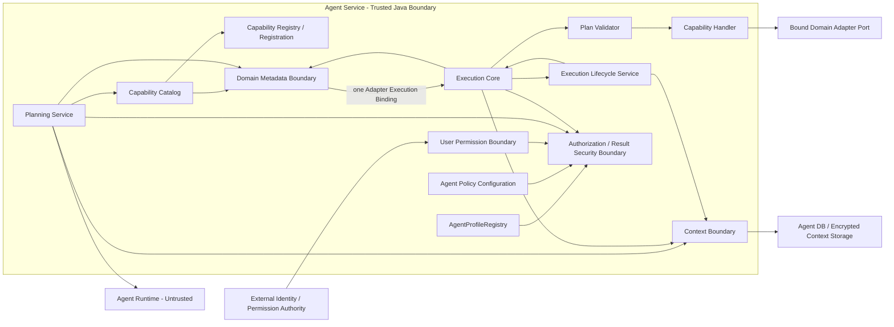
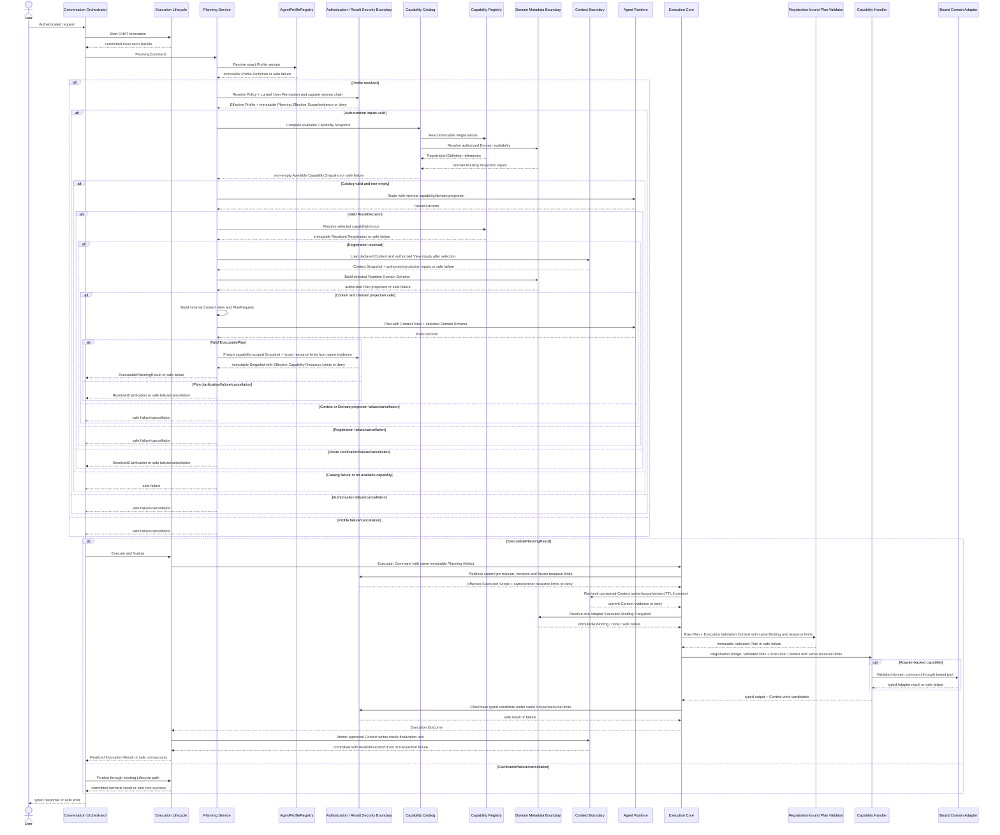

# Agent 元数据与上下文安全架构设计 v1.0

> 文档层级：L1 分域架构设计
> 文档状态：架构基线（已评审）
> 上位文档：`Agent目标架构总览_v1.0.md`
> 关联 L1：`Agent契约与规划架构设计_v1.0.md`（已评审）、`Agent能力执行内核架构设计_v1.0.md`（已评审）
> 适用代码基线：`389b72b6162edfdb4385c8a77bebf56bfb3e2608`<br>
> 适用范围：`agent-service` 元数据、安全投影与 Context 边界，`agent-api` 结构引用，`agent-adapter-api` Adapter Role/执行端口边界
> 前提：系统尚未投产，不承担旧 AgentIntent、旧 query context、分散 Domain metadata 或旧权限配置的兼容责任
> 下位交付：`P1_V2/02` 可信执行内核与 Invocation 生命周期、`P1_V2/03` 元数据授权 Context 与 Result Security、`P1_V2/04` Adapter 与 Domain Metadata、`P1_V2/05` 有效资源预算、`P1_V2/06` 原子迁移与清理门禁

---

## 修订历史

| 序号 | 日期 | 文档位置 | 修改内容 | 修改原因 |
|---:|---|---|---|---|
| 1 | 2026-07-13 | `docs/design/Agent元数据与上下文安全架构设计_v1.0.md` | 明确当前只启用 ConversationScope、冻结后台主体与 RunScope seam；补充 capability 资源预算最严交集和 Generated Text Candidate 安全规则；限定 Multi-Agent 当前不实现；更新可追溯代码基线 | 保证单 Agent 当前安全闭环并避免未来 TASK 授权、预算和结果归并发生大改 |
| 2 | 2026-07-13 | `docs/design/Agent元数据与上下文安全架构设计_v1.0.md` | 统一下位交付为 P1_V2；把当前 Context/Authorization 具体范围收敛为 ConversationScope；补齐 Effective Capability Resource Limits 的解析所有权、Snapshot 冻结与同源消费 | 消除旧 D01～D06 入口和提前固化 TASK/RunScope 的冲突，闭合执行内核与 P1_V2/05 的资源安全契约 |

## 1. 文档定位

### 1.1 目的

本文在 L0、契约与规划 L1、能力执行内核 L1 的约束下，完整定义 Agent 元数据与上下文安全域的稳定架构，包括：

1. Agent Profile、Agent Policy Configuration 和 User Permission 的唯一事实来源与边界。
2. Effective Profile、Authorization Snapshot 和请求级 Effective Scope 的确定性收敛规则。
3. Capability Catalog 与 Available Capability 的通用计算规则。
4. Canonical Domain Field Catalog、Adapter Role、Adapter Registration 和动态可用性的职责分离。
5. Domain Routing Projection、Runtime Domain Schema、Execution Validation Projection 和 Adapter Execution Binding 的投影关系。
6. Capability Context 的类型、Owner、Invocation Scope、Version、TTL、加密和清理不变量。
7. Context 只在 capability 确定后读取、只在成功终结事务中写入的完整闭环。
8. Execution 阶段授权复检、结果过滤和 mask 的安全边界。
9. 新 capability、新 Domain、新 Profile、新 Context type 和 Multi-Agent 的扩展不变量。

### 1.2 权威关系

```text
L0 Agent 目标架构总览
  ├→ 契约与规划 L1（Route/Plan/Runtime/PlanningResult）
  ├→ 能力执行内核 L1（Registration/Core/Lifecycle/Handler/Invocation）
  └→ 本文（Profile/Policy/Authorization/Context/Catalog/Domain Metadata）

三份单 Agent L1 均已评审
  → P1_V2/02 可信执行内核与 Invocation 生命周期
      → P1_V2/03 元数据授权 Context 与 Result Security
      → P1_V2/04 Adapter 与 Domain Metadata
      → P1_V2/05 有效资源预算与 Capability-local Port
          → P1_V2/06 原子迁移、扩展验证与清理门禁
```

约束顺序：

- L0 高于本文。
- 契约与规划 L1 唯一定义 PlanningCommand、PlanningResult、Route/Plan、Runtime 投影结构和两阶段时序；本文只提供其所消费的安全事实与投影。
- 能力执行内核 L1 唯一定义 Definition、Registration、Registry、Lifecycle、Core、Validator、Handler 和 Invocation；本文只提供授权复检、Adapter Binding、结果过滤和 Context 持久化边界。
- 本文高于 P1_V2 中对应 L2、配置、数据库和代码。
- 若实现不可行，必须先通过 ADR 修改本文或上位文档；不得在 Planning、Core、Handler、Adapter 或配置中形成未记录旁路。

### 1.3 本文唯一负责的内容

本文唯一负责：

- Agent Profile Definition 和 AgentProfileRegistry 的语义；
- Agent Policy Configuration 的部署级收紧语义；
- User Permission 的消费边界，不重新定义外部身份权限系统；
- Effective Profile、Authorization Snapshot、Effective Scope 和授权复检公式；
- Capability Catalog 与 Available Capability Snapshot；
- Canonical Domain Field Catalog；
- Adapter Role、Adapter Registration、请求级 Adapter 可用性和 Adapter Execution Binding 的元数据侧语义；
- Domain/Context/结果的请求级安全投影；
- Capability Context Envelope、Context Snapshot、Context View 和 Context write/cleanup 边界；
- 字段级过滤、mask 和安全 summary 输入边界；
- metadata/context 的版本、缓存、并发、失败和观测不变量。

### 1.4 本文不负责的内容

| 内容 | 唯一负责文档 | 本文使用方式 |
|---|---|---|
| Route/Plan/Clarification 契约、PlanningCommand、PlanningResult、Prompt、repair | `Agent契约与规划架构设计_v1.0.md` | 提供安全投影和 Context 边界，不重新定义 Runtime DTO、Planning 状态机或 Prompt |
| Capability Definition/Registration/Registry、Validator、Lifecycle、Core、Handler、Invocation | `Agent能力执行内核架构设计_v1.0.md` | 消费声明和执行引用，不重新定义执行链、状态机或终结事务 |
| Coordinator、CoordinationPlanner、Run/Task/Attempt、ResultRef、Task State Boundary | future `Multi-Agent协调与任务架构设计_v1.0.md` | 当前只冻结复用 metadata/security/context 边界的约束；具体 TASK、RunScope、调度与归并由 future Multi-Agent L1 定义 |

本文也不定义：

- Java 类、接口、方法、包路径和完整字段；
- SQL、表、索引、迁移脚本、加密算法和密钥产品；
- 外部 IAM/RBAC/ABAC 系统内部模型；
- 具体 Profile、Policy、Domain、field、operator、mask 或 Context payload 内容；
- Adapter SPI 具体方法和下游 HTTP API；
- Runtime/Python/Prompt 实现；
- 完整测试类、fixture 和部署命令。

以上内容由 L2 或对应外部系统定义，但不得改变本文的所有权、公式、时序和不变量。

---

## 2. L0 与关联 L1 约束映射

| 上位约束 | 本文落实方式 | 主要章节 |
|---|---|---|
| AD-02 Java 是跨边界结构契约唯一来源 | Profile/Policy/Catalog/Context/Domain 投影的结构与枚举使用 Java 权威类型；配置只提供数据 | 第 5、10～12 节 |
| AD-03 事实和投影分离 | Registry、Profile、Policy、Canonical Catalog 是事实；Effective Profile、Available Capability、Snapshot、View、Schema、Binding 是请求级投影 | 第 5、8～13 节 |
| AD-04 Planning/Lifecycle/Core 分离 | 本文边界只提供事实、投影、复检和存储，不编排 Route/Plan、Execution 或终态 | 第 4、15 节 |
| AD-06 Runtime 不可信 | Runtime 只接收最小投影，不接收 JWT、完整权限、mask、Envelope、凭据或未授权 metadata | 第 11、18 节 |
| AD-08 Multi-Agent 复用单 Agent 内核 | 当前只实现 CHAT/ConversationScope；future TASK 必须复用同一 Profile/Authorization/Catalog/Context/Binding 规则，不建立任务专用权限体系 | 第 20 节 |
| AD-09 两阶段 Context 隔离 | Route 前不加载 capability Context；Registration 解析后才按 Effective Scope 读取 | 第 13、15 节 |
| AD-10 全链 absolute deadline | metadata、permission、Context、availability 和 filtering 边界只消费剩余预算 | 第 15、17 节 |
| AD-11 capability-local infrastructure port | 端口只接收已授权最小数据，生成候选继续通过 Result Security Boundary | 第 8.5、18 节 |
| Capability Catalog 无专用分支 | 当前按 Registration、Profile、Policy、Permission 和 Domain 能力通用计算；future Delegation 只作为收紧输入 | 第 9、20 节 |
| 新 Domain 不侵入 Agent 主流程 | 只增加 Canonical Catalog 数据、Adapter Registration、Policy 和 composition root 装配 | 第 10、19 节 |
| Context 安全持久化 | 当前按 Owner/ConversationScope 最小化、加密、TTL、版本 CAS 并随 Conversation 清理；future Run 清理由 Multi-Agent L1 定义 | 第 12～14、20 节 |
| Execution 单一绑定 | Core 复检后只解析一次 Adapter Execution Binding，Validator/Handler 使用同一绑定 | 第 11、15 节 |
| 单 Agent 本地事务 | Context write 由 Lifecycle 与 Turn/Invocation/结果同一 finalization unit 提交 | 第 14、17 节 |

本文不得放宽以上约束。

---

## 3. 当前基线与目标差距

| 维度 | 当前基线问题 | 目标状态 |
|---|---|---|
| Profile | Agent 行为、能力和配置可能分散 | AgentProfileRegistry 是 Profile Definition 唯一来源 |
| Policy | 启停、权限、预算和业务配置边界混杂 | Agent Policy Configuration 只保存部署级启停与收紧限制 |
| 授权 | 入口身份、Prompt、Handler 和 Adapter 可能分别判断 | Planning Snapshot + Execution 当前权限复检，统一 fail closed |
| Capability 可用性 | 配置、Handler 和路由逻辑可能各自维护可用清单 | Capability Catalog 通用计算请求级交集 |
| Domain metadata | 字段、operator、映射能力在配置、Prompt、Adapter 重复 | Canonical Domain Field Catalog 是唯一 Domain 执行能力与规划语义来源 |
| Adapter 选择 | Handler 可能按 domain/role 二次查找 | Core 通过 metadata 边界一次解析 Adapter Execution Binding |
| Context | 与 QUERY/Turn 或专用 JSON 强绑定 | 独立的 typed/versioned Context，按 Owner + Invocation Scope 隔离 |
| Context 时序 | Route 前读取广域上下文 | Route 后、Registration 确定后按声明加载最小 Snapshot/View |
| Context 生命周期 | TTL、清理、并发更新不完整 | 当前加密、TTL、版本 CAS、成功写入并随 Conversation 清理；future Run 复用清理约束 |
| 输出安全 | Handler 自由文本或下游结果可能直接返回 | typed output 校验后按 Effective Scope 过滤/mask，再生成安全 summary 输入 |

目标迁移不保留 Profile/Policy 双来源、Prompt/Adapter 字段清单、旧 query context facade、capability/domain 专用 Catalog 分支或 Handler 二次 Adapter 路由。

---

## 4. 总体架构

### 4.1 逻辑组件关系



图中 Registry、Catalog 和各 Boundary 都是逻辑职责或进程内组件，不代表独立微服务。User Permission Boundary 是 Authorization Boundary 使用的外部权限适配端口，不是额外应用服务；Profile、Policy、Permission 的读取与交集也不形成“授权聚合服务”。Projection Builder 是所属边界或 Planning/Core 的内部逻辑，不新增“元数据编排层”或通用中转层。跨进程拆分必须另行 ADR。

### 4.2 责任边界

| 组件/边界 | 负责 | 明确禁止 |
|---|---|---|
| AgentProfileRegistry | 保存并按 agentId/version 解析 Profile Definition | 保存 User Permission、Policy 正文、Capability Definition 或 Handler |
| Agent Policy Configuration | 部署级启停和只能收紧的限制 | 定义 capability、复制 Profile、扩大用户权限 |
| User Permission Boundary | 从外部权威系统解析当前主体权限及版本证据 | 将 JWT、角色表达式或凭据暴露给 Runtime |
| Authorization / Result Security Boundary | 计算 Effective Profile/Scope、按 resource limit ContractRef 解析并冻结 Effective Capability Resource Limits、执行当前权限复检，并按同一有效范围/限额过滤或 mask 类型化候选 | 编排 Planning/Execution、执行 Handler、持久化 Invocation、信任 Handler 自报授权或让消费方重算限额 |
| Capability Catalog | 通用计算 Available Capability Snapshot | 保存 Registration 副本、按 capabilityId/domain 写业务分支 |
| Domain Metadata Boundary | Canonical Catalog、Adapter Registration、Domain 投影和一次 Binding 解析 | 成为 Capability Registry、执行 Handler 或保存下游凭据到投影 |
| Context Boundary | 按声明读取 Snapshot、提供已授权 View 投影输入，并校验存储不变量、持久化/清理 Context | 组装 PlanRequest、决定 capability、合并 Raw Plan、终结 Invocation |
| Planning Service | 协调以上边界并组装 Route/Plan 请求 | 重新实现这些事实、公式、存储或最终执行授权 |
| Execution Core | 调用授权复检、Binding、Validator、过滤边界 | 维护 Profile/Policy/Catalog 副本或持久化 Context |
| Execution Lifecycle Service | 在终结事务中提交已批准 Context write | 解释 Context payload、权限公式或 Domain metadata |

### 4.3 依赖方向

```text
Planning / Execution Core / Lifecycle
  → depend on metadata/security/context boundary interfaces
  → consume immutable definitions, snapshots and projections

metadata/security/context boundaries
  → use agent-api Java contracts for Runtime/cross-service structures
  → own Java-only internal immutable value objects where no external consumer exists
  → may reference Capability Registry / Registration declarations
  → may depend on agent-adapter-api stable ports
  × must not depend on Runtime behavior or Handler implementations

agent-adapter-* implementations
  → register through composition root
  × must not redefine Canonical Domain Field Catalog facts
```

### 4.4 单一安全收敛链

```text
Profile Definition + Policy + Current User Permission + optional Delegation Constraint
  → Effective Profile / Planning Effective Scope
  → Capability Catalog + Domain availability
  → Available Capability Snapshot
  → Route safe projection
  → selected Registration
  → capability-scoped Context Snapshot + Plan Domain Schema
  → Authorization Snapshot with Effective Capability Resource Limits bound into ExecutablePlanningResult
  → Execution current-permission/resource-limit recheck
  → one Adapter Execution Binding
  → Validator / Handler
  → typed output validation + result filtering/mask
  → Lifecycle atomic result + Context finalization
```

任何绕过 Profile/Policy/Permission 交集、在 Route 前读取 Capability Context、让 Runtime/Handler 决定权限、或在 Handler 中重新选择 Adapter 的路径都违反本文。

---

## 5. 稳定核心概念与事实所有权

### 5.1 稳定概念

| 概念 | 稳定含义 | 明确不承担 |
|---|---|---|
| Agent Profile Definition | Agent 的 capability 组合、行为引用、Context、预算和委派上限 | 用户权限、部署启停、Capability Definition 副本 |
| AgentProfileRegistry | Profile Definition 的唯一解析边界 | 请求级授权计算、Runtime Registry |
| Agent Policy Configuration | 部署环境的启停和收紧限制 | Profile 组合意图、用户身份、结构契约 |
| Effective Profile | Profile 经当前 Policy 收紧后的请求级不可变投影 | 新事实源、用户授权结论 |
| Planning Effective Scope | Effective Profile、Current User Permission 与可选 Delegation Constraint 的请求级交集；当前 CHAT 使用中性全集 | 最终执行许可、跨 Invocation 复用 |
| User Permission | 外部权威系统给当前主体的权限事实 | Profile/Policy 配置副本 |
| Delegation Constraint | 入口中立、只可收紧的可选委派边界；当前 CHAT 使用中性全集，future TASK 复用该 seam | 新权限、调用方 JWT、Task Graph、Task 权限存储 |
| Authorization Snapshot | Planning 时刻绑定主体、版本和允许范围的不可变授权证据 | 最终执行许可、完整权限表达式 |
| Effective Execution Scope | Core 复检时 Snapshot 与当前权威限制的交集 | 可缓存的长期权限或 Runtime 输入 |
| Effective Capability Resource Limits | Authorization/metadata 边界按权威 ContractRef 单调求交并冻结到 Authorization Snapshot 的 Invocation 级类型化限额 | Core/Handler/Provider 各自读取配置或重算限额 |
| Capability Catalog | 通用计算 Available Capability 的请求级目录边界 | 静态 Registration/Definition 来源 |
| Available Capability | 单个 capability 在 Registration、Profile、Policy、Permission、可选 Delegation 和 Domain 能力下的请求级可用交集 | 静态事实、最终执行授权 |
| Available Capability Snapshot | 当前 PlanningCommand 的不可变 Available Capability 集合及版本证据 | 静态 enabled 状态、跨请求缓存 |
| Canonical Domain Field Catalog | Domain 稳定规划语义和真实可执行字段/operator/function 能力的唯一来源 | 用户权限、Capability Definition、Adapter 实现 |
| Adapter Role | Capability 对 Domain 执行能力类别的稳定引用 | 具体 Adapter 实现或 domain 标识 |
| Adapter Registration | `(Adapter Role, domain)` 到已部署执行端口的静态绑定 | 字段/operator 清单副本、请求授权结论 |
| Adapter Availability Projection | 当前部署/健康/Policy 下请求可用的动态投影 | 静态 Catalog 或 Registration 事实 |
| Adapter Execution Binding | Core 复检后一次解析的请求级不可变端口绑定 | 全局 Registry、跨请求缓存、Handler 二次路由 |
| Capability Context | 成功执行产生的小型、类型化、版本化规划状态 | 完整业务结果、消息历史、ResultRef |
| Context Snapshot | capability 确定后加载的类型化内容、版本和授权证据 | Runtime DTO、可变存储 Entity |
| Context View | Snapshot 面向 Plan Runtime 的最小只读投影 | 授权事实、持久化 Envelope、write 权限 |

### 5.2 唯一事实来源

| 事实 | 唯一权威来源 |
|---|---|
| Profile Definition | AgentProfileRegistry |
| 部署级启停与收紧限制 | Agent Policy Configuration |
| 当前主体权限 | 外部 User Permission Authority，经 User Permission Boundary 读取 |
| Capability 静态结构与执行声明 | Capability Registration / Definition |
| Domain 稳定语义和可执行能力 | Canonical Domain Field Catalog |
| `(Adapter Role, domain)` 执行端口绑定 | Adapter Registration set / composition root |
| 请求级可用 capability | Capability Catalog 计算结果 |
| Planning 请求级授权证据 | Authorization Snapshot |
| Context 持久化事实 | Context Boundary 管理的 Agent DB 记录 |
| 最终执行许可 | Execution Core 调用 Authorization Boundary 的当前复检结果 |
| Capability 资源限额静态声明 | Capability Definition 的 resource limit ContractRef 与固有限制 |
| 业务数据与规则 | Downstream Business Service |

Effective Profile、Effective Capability Resource Limits、Available Capability、Domain Projection、Runtime Domain Schema、Context View、Adapter Availability Projection、Adapter Execution Binding、缓存和查询投影都不是新的事实来源。

### 5.3 Java 单一结构契约源

- Runtime/跨服务传输所需的 Profile/Permission、Catalog、Domain、Context 安全投影结构与枚举由 `agent-api` Java 类型权威定义。
- 只在 `agent-service` 内部流转的 Profile Definition、Policy、Authorization Snapshot、Context Snapshot、Adapter Execution Binding 等不可变对象可以由其所有者模块定义；它们仍以 Java 为唯一结构来源，具体包归属由 L2 冻结，不为 Runtime 生成无消费者 DTO。
- 配置和数据库保存实例数据、引用和版本，不重新定义字段、enum、union、required/nullable 或 discriminator。
- Prompt、Python、Adapter 和 UI 不维护 capability/domain/context/operator 的平行结构清单。
- Canonical Catalog 的“内容”是 metadata 事实；其“结构”仍以 Java 契约为唯一来源。
- JSON Schema/OpenAPI/Python model 如有消费者，只能从 Java 单向生成，不成为第二契约源。

---

## 6. Agent Profile 架构

### 6.1 Profile Definition 语义

Agent Profile Definition 稳定表达以下类别，具体 Java 类型由 L2 定义：

- agentId 和不可变 profile version；
- 允许组合的 capability 引用集合；
- 行为/Prompt 资产引用，不复制 Prompt 正文；
- Context read/write 类型和上限引用，不复制 Context schema；
- Route/Plan/Execution 总预算及阶段上限；
- Multi-Agent 可用的委派上限引用；当前仅作为 Profile 的稳定上限 seam，不创建 Run/Task 字段、委派状态或 Task 权限存储，具体委派语义由 future Multi-Agent L1 定义。

### 6.2 Profile 不变量

- Profile 只表达 Agent 组合意图，不能授予 User Permission 中不存在的权限。
- Profile 不复制 Capability Definition、Registration、Domain field/operator、Policy 正文、Context payload 或 Handler/Adapter 信息。
- Profile 不用 capabilityId switch 表达执行流程；capability 组合是数据。
- Profile version 不可变；变更产生新版本，不原地改变已冻结 Snapshot 的语义。
- 缺失、重复、循环引用、无法解析的 ContractRef/PromptRef 或越过全局安全上限时，Profile 加载 fail closed。

### 6.3 AgentProfileRegistry

AgentProfileRegistry：

- 以 agentId + version 解析唯一 Profile Definition；
- 可以提供当前激活版本引用，但已开始 Invocation 必须绑定精确版本；
- 注册/加载后向请求方返回不可变对象；
- 不计算 User Permission、Available Capability 或 Context 内容；
- 不调用 Runtime、Handler、Adapter 或 Lifecycle；
- 不形成跨服务自报 Registry。

### 6.4 新 Profile

新增 Profile 只允许新增 Profile Definition、必要 Policy 适用引用和测试数据。不得复制 Handler/Validator、修改 Planning/Core/Catalog 算法、共享 Prompt graph 或 Runtime 核心 graph。

---

## 7. Policy 与 Effective Profile

### 7.1 Agent Policy Configuration

Policy 只保存部署级、环境级且只能收紧的限制：

- Profile/capability/domain/Adapter Role 的启停或允许范围；
- 风险级别、执行模式和只读能力限制；
- field/operator/function、Context read/write 和结果暴露上限；
- mask/过滤策略引用，不把规则正文发送给 Runtime；
- deadline、repair、Context TTL、结果大小和资源预算上限；
- future Multi-Agent L1 生效后，对其定义的委派/资源约束提供部署级收紧引用；当前不创建对应配置项或类型。

Policy 不保存：

- Capability Definition/Descriptor/Handler；
- Profile capability 组合、Prompt 或 Context schema 正文；
- User/tenant 的完整权限和 JWT；
- Canonical Domain field/operator/function 事实；
- Adapter endpoint、凭据和实现类。

Policy 中的 capability/domain/field/operator/function/Context 引用必须解析到对应 Registration、Canonical Catalog 或 Java ContractRef；Policy 只能对这些既有事实做 deny/intersection/upper bound，未知引用或试图引入新事实时 fail closed。

### 7.2 Effective Profile 公式

```text
Effective Profile
  = Profile Definition
  ∩ Applicable Agent Policy limits
```

该计算只收紧 Profile，不形成用户授权结论。Planning Effective Scope 再与 User Permission 和可选 Delegation Constraint 求交：

```text
Planning Effective Scope
  = Effective Profile limits
  ∩ Current User Permission
  ∩ optional Delegation Constraint
```

当前 CHAT 对不适用的 Delegation Constraint 使用中性全集，不创建委派状态、Repository 或 Task 权限配置。future TASK 在 Multi-Agent L1 定义后复用同一收紧输入，不得改变现有 Profile/Policy/Permission 所有权。任一适用层明确拒绝、版本不可解析或必要交集为空均 fail closed。缺失 Policy 不得被解释为无限权限；是否允许显式“无附加部署限制”的默认项必须由受控配置明确声明。

Capability 运行资源和结果暴露预算同样遵循单调收紧，不允许 capability 配置形成平行授权事实：

```text
Effective Capability Resource Limits
  = Definition intrinsic/contract limit
  ∩ Effective Profile limit
  ∩ Current User Permission / data scope limit when applicable
  ∩ optional Delegation Constraint
  ∩ Request-declared narrowing limit
```

例如 evidence 数量、summary document 数量、display citation 数量、生成输入/输出大小等：Definition/ContractRef 保存不可突破的结构或能力固有限制，Profile 保存 Agent 组合上限，Policy 保存部署级与安全上限，请求只能收紧。Authorization/metadata 边界内部负责按 ContractRef 解析、校验和单调求交，并把类型化 `Effective Capability Resource Limits`、ContractRef 与 canonical digest 冻结到 Authorization Snapshot。Execution 复检只允许保持或由同一边界进一步收紧；Validator、Handler、capability-local Provider Operation Context 和 Result Security Boundary 必须消费同一值或可证明更严格的引用，不得各自读取配置独立计算。

future Multi-Agent L1 可以在上述公式末尾追加 Run/Task remaining budget 这一只可收紧输入；当前 CHAT 的 Delegation Constraint 为中性全集，P1_V2 不创建 Run/Task budget 字段、类型或默认值。

### 7.3 Policy/Profile 分工

| 内容 | Profile | Policy |
|---|---|---|
| Agent capability 组合意图 | 是 | 否，只能启停/收紧 |
| Prompt/行为资产引用 | 是 | 否 |
| Context 类型组合 | 是 | 否，只能限制 read/write/TTL |
| 部署环境启停 | 否 | 是 |
| 安全预算上限 | 声明 Agent 上限 | 进一步收紧 |
| 用户权限 | 否 | 否，来自外部权威系统 |
| 委派能力 | 声明可委派上限 | 进一步收紧，不授予权限 |

禁止把同一事实同时写入 Profile 和 Policy；无法判定所有权时必须先修改本文，而不是复制配置。

### 7.4 版本变化

- Planning 冻结 Profile/Policy 精确版本到 Authorization Snapshot。
- Execution 发现绑定版本已撤销、不可解析或被安全策略标记为不再有效时 fail closed。
- 新版本不得让旧 Snapshot 自动获得新增权限。
- 仅影响未来请求的普通配置变化可以通过新版本生效；紧急撤权必须使当前复检失败。

---

## 8. Authorization 架构

### 8.1 主体与 Owner

授权链稳定区分：

- Execution Subject：当前权限判断所针对的稳定主体引用；
- Owner Reference：当前绑定认证 Conversation Owner 的稳定中立引用，不把 owner 语义编码进执行内核；
- Invocation Scope：当前具体类型只有 ConversationScope；
- Delegation Constraint：入口中立的可选收紧引用；当前 CHAT 使用中性全集，不创建委派状态或存储；
- Runtime identity：Agent Service 调用 Runtime 的内部服务身份，不是用户主体。

JWT、session、临时认证对象不得发送给 Runtime，也不得被序列化为未来后台执行的长期授权来源。

当前 P1_V2 只启用认证 Owner 的 ConversationScope。Execution Subject、Owner Reference 和 Invocation Scope 使用入口中立的稳定引用，但不得因此提前创建 Run Owner 类型/存储、RunScope Context、Delegation Repository、Task 权限服务、TASK discriminator 或配置。future Multi-Agent L1 必须先定义这些具体语义，才能扩展当前类型。

### 8.2 Authorization Snapshot

Authorization Snapshot 是 Planning 时刻的请求级不可变证据，稳定绑定以下语义类别：

- invocation/request correlation；
- Execution Subject、Owner 和 Invocation Scope 引用；
- Agent Profile/Policy/User Permission 和可选 Delegation 的精确版本或证据引用；
- 允许的 capability、domain、field、operator/function、Context read/write 范围；
- 风险、执行模式、结果过滤、TTL 上限，以及类型化 Effective Capability Resource Limits 的 ContractRef/canonical digest/不可变引用；
- Catalog/Domain metadata 版本引用；
- 创建时间、有效边界和 absolute deadline。

Snapshot 不保存 JWT、角色表达式、完整 Policy、mask 规则正文、Prompt、Context payload、Adapter 凭据或最终执行许可。

### 8.3 Snapshot 冻结

Planning 在计算 Catalog 前必须捕获同一 Profile/Policy/Permission/optional Delegation 解析链的不可变授权证据与版本链，并用其完成 Route/Plan 全部安全投影。每次向 Runtime 发送 Route/Plan 前以及冻结 Snapshot 时，都必须确认该证据仍有效；一旦变化就 fail closed，不重新读取并混入新版本继续当前 Planning。capability 确定后，Planning 只从该证据链收敛一个 capability-scoped Authorization Snapshot，并由 Authorization/metadata 边界按 Definition resource limit ContractRef 冻结 Effective Capability Resource Limits。禁止调用方并列传入可替换的 capability/domain/Context 权限或资源限额副本。Snapshot 与 Available Capability Snapshot、Context Snapshot 和 Resolved Registration 必须共享同一主体、范围、版本链和 request correlation；Planning 完成后的最新变化由 Core 当前复检处理。

### 8.4 Execution 当前复检

Core 调用 Authorization Boundary 形成：

```text
Effective Execution Scope
  = Planning Authorization Snapshot Scope
  ∩ Current User Permission
  ∩ Current limits of the bound Profile version under applicable Policy
  ∩ Current Delegation Constraint when present
```

复检前必须确认主体、Owner、ConversationScope、Profile/Policy/optional Delegation 版本以及 Snapshot 中的 resource limit ContractRef/digest 仍有效；“bound Profile version”不得替换为最新 Profile 版本。任何撤权、版本不匹配、权威源不可用、范围扩大请求或无法确认都 fail closed。复检可以保持或缩小 Planning 范围和 Effective Capability Resource Limits，永远不能扩大。future Run budget 只能由 Multi-Agent L1 追加为收紧输入。

Canonical Domain capability 和 Adapter availability 不授予权限，不进入上述授权事实公式；Core/Validator/Domain Metadata Boundary 必须在 Effective Execution Scope 通过后，分别校验当前 field/operator/function 可执行能力并解析唯一 Binding。授权交集与可执行性门禁均通过才允许调用 Handler。

若 ExecutablePlanningResult 消费了 Context Snapshot，Core 还必须在 Validator 前确认其 request correlation、Owner、Invocation Scope、ContractRef/schema、record version 和 TTL 仍有效且未发生并发替换。任一变化均 fail closed；Core 不重新加载另一份 Context 继续执行，也不重做 Planning。

### 8.5 Result Security Scope

结果过滤使用同一次 Core 复检得到的 Effective Execution Scope、同一 Effective Capability Resource Limits 和 output ContractRef：

- 先校验类型和 ContractRef；
- 再按当前 User Permission 与 applicable Policy 提供的 field 权限、mask、安全分类引用和结果大小上限过滤；这些规则不由 Profile、Handler 或 Canonical Catalog 自行补充；
- summary/message 默认从过滤后的结构化结果和安全模板生成；需要生成式回答或摘要时，只接受 output ContractRef 声明的类型化 Generated Text Candidate；
- Generated Text Candidate 必须绑定已授权 evidence/citation reference、生成 operation metadata 和有效输出预算；Result Security Boundary 必须校验证据归属、citation 完整性、当前字段权限、mask 和大小限制后才能形成最终文本；
- Handler/Adapter/Capability Infrastructure Port 未绑定证据或未经类型化校验的自由文本不得绕过过滤；
- 只有 output ContractRef 明确允许省略或类型化 redaction 时才可省略/mask；required 字段无法安全暴露或过滤后不再满足 ContractRef 时整体 fail closed，不返回未过滤候选。

---

## 9. Capability Catalog

### 9.1 定位

Capability Catalog 是请求级可用能力计算边界，不是静态 metadata Registry。它消费不可变事实和当前请求限制，返回 Available Capability Snapshot。

### 9.2 通用计算公式

```text
Available Capability
  = Capability Registration / Definition
  ∩ Planning Effective Scope
  ∩ Domain / Adapter availability required by Domain Mode
```

其中 Planning Effective Scope 已唯一包含 Effective Profile（Profile ∩ Policy）、Current User Permission 和 optional Delegation Constraint；当前 CHAT 的 Delegation 为中性全集。Catalog 必须按声明和交集通用计算，禁止重复读取 Policy/Permission，或增加 capabilityId/domain/agentId 专用 if/switch、硬编码清单和 Prompt 分支。

### 9.3 Domain Mode 规则

| Domain Mode | Catalog 可用性规则 |
|---|---|
| NONE | 不要求 Domain/Adapter；不得投影伪 Domain |
| OPTIONAL | capability 基础范围可用时可以无 domain；仅投影通过 Planning Effective Scope、Canonical Catalog 和 Adapter availability 的可选 domain |
| REQUIRED | 至少存在一个通过完整交集的 `(Adapter Role, domain)` 才投影 capability；否则 capability 整体不出现 |

静态 Registry 启动成功不代表请求可用；当前无可用 domain/adapter 通过“不投影”表达，不在 Registration 上写动态 enabled 标志。

### 9.4 Available Capability Snapshot

Snapshot 至少稳定表达：

- request correlation 和 Effective Profile/Authorization/Catalog version references；
- 当前可用 capabilityId；
- 对应 Resolved Definition/Descriptor 安全引用；
- 权威 planKind 引用；
- Domain Mode 与当前允许 domain 范围；
- Route 阶段可用预算和风险上限引用。

它不包含 Handler、Adapter 实现、完整 Profile/Policy/Permission、field schema、Context、mask 规则或凭据。

### 9.5 投影与执行边界

- 只有 Snapshot 中的 capability/domain 才能进入 RouteRequest。
- Runtime RouteDecision 必须重新绑定 Snapshot；缺失项不自动选择替代 capability。
- Available Capability 不是最终执行授权；Execution Core 仍必须当前复检。
- Snapshot 只在当前 PlanningCommand/Invocation 有效，不跨主体或 Invocation 复用。
- 空 Snapshot 返回类型化安全 Planning failure，不调用 Runtime 猜测默认 capability。

---

## 10. Canonical Domain Field Catalog 与 Adapter Metadata

### 10.1 Canonical Domain Field Catalog

每个 Domain 在一个逻辑 Canonical Domain Field Catalog 中只有一份权威 metadata，稳定表达：

- 稳定 domainId、可安全暴露的别名和规划语义；
- canonical field 标识、类型、格式、单位和允许值语义；
- 按 Adapter Role 划分的可执行 operator/function；
- 各 Adapter Role 实际可映射的 canonical field 集合；
- catalog version、生命周期和兼容性证据。

Catalog 不保存用户权限、Profile/Policy、Capability Definition、Adapter 凭据、下游实时数据或 Prompt 文本。

Domain Adapter 可以包含实现 canonical command/result 与下游模型转换所必需的映射代码，但不得再维护一份供规划、授权或可用性计算使用的 field/operator/function 支持清单。对外可声明的执行能力只来自 Canonical Catalog，并由 build/startup contract test 验证 Adapter 实现覆盖。

### 10.2 Adapter Role

Adapter Role 是 capability 对执行能力类别的稳定引用：

- Definition 只声明 Role，不引用具体实现类；
- Role 的结构/枚举由 Java 权威类型定义；
- Role 不编码 domain、tenant、endpoint 或用户权限；
- 新 Domain 优先复用已有 Role；只有执行端口语义确实不同才新增 Role。

### 10.3 Adapter Registration

Adapter Registration 是 composition root/metadata 边界拥有的静态部署事实，稳定绑定：

```text
(Adapter Role, domainId)
  → compatible agent-adapter-api port
  + Canonical Catalog capability reference
  + deployment identity/version
```

Registration 不复制 field/operator/function 清单，不保存请求授权结论，不向 Runtime 暴露实现类、endpoint 或凭据。同一生效范围内 `(Adapter Role, domainId)` 必须解析到唯一逻辑 Registration；负载均衡、故障转移和多个物理实例封装在该端口之后，不形成多个逻辑匹配。重复逻辑 Registration 或端口不兼容导致启动/装配失败。

### 10.4 静态事实与动态可用性

- Canonical Catalog 和 Adapter Registration 是版本化静态事实。
- 部署启停、Policy、当前健康和请求权限形成 Adapter Availability Projection。
- 健康失败不会修改 Catalog/Registration，只使对应请求组合不投影或 Execution fail closed。
- Runtime 可用性和 Domain Adapter 可用性是不同信号，禁止建立互相自报的第二 Registry。
- Registry/Catalog/Adapter metadata 任一版本无法建立一致关联时拒绝相关 capability/domain，不静默降级到未知能力。

### 10.5 P1_V2/04 收敛要求

`P1_V2/04` 必须删除配置、Prompt、Adapter 自报清单和 Java 常量中的 Domain 执行事实副本；Adapter 的必要映射实现保留，但不再作为 metadata 来源。该详细设计形成：

- 唯一 Canonical Domain Field Catalog；
- 唯一 Adapter Role 与 Adapter Registration 装配；
- build/startup 覆盖校验；
- Route/Plan/Execution 所需的最小安全投影；
- 新 Domain 不修改 Planning/Core/Handler/Validator 的验证基线。

---

## 11. Domain 投影与 Adapter Execution Binding

### 11.1 投影层次

| 投影 | 产生时点 | 内容上限 | 消费方 |
|---|---|---|---|
| Domain Routing Projection | Route 前 | domainId、允许别名、安全描述 | Runtime Route |
| Runtime Domain Schema | capability/domain 确定后 | 当前允许 field/operator/function 与必要类型语义 | Runtime Plan |
| Execution Validation Projection | Core 当前复检后 | Validator 所需 canonical 类型、允许范围和 Binding 安全能力 | Plan Validator |
| Adapter Execution Binding | Core 当前复检后 | 当前 Invocation 唯一端口绑定、role/domain/版本与安全能力引用 | Validator/Handler |
| Result Security Projection | 输出过滤时 | field/mask/安全分类引用和结果大小限制 | Authorization / Result Security Boundary |

以上均为请求级最小投影，不是事实源，也不允许反向更新 Profile、Policy、Catalog 或 Permission。

投影中的别名、描述和 Context 文本始终是结构化数据，不是 Prompt 指令；其内容不能提升权限、增加 schema 字段、改变 Java 契约或绕过结果过滤。

### 11.2 Route 与 Plan 隔离

- Route Projection 不包含 field、operator、function、mask 或完整 Domain Schema。
- Runtime Domain Schema 只在 RouteDecision 和 Registration 均合法后生成。
- Domain Mode NONE 不生成业务 Domain Schema。
- OPTIONAL 无选定 domain 时不生成伪 schema；选择 domain 后按完整交集生成。
- REQUIRED 必须选择 Available Capability Snapshot 中的 domain，否则 fail closed。
- 未授权、未映射或 Adapter 当前不可用的字段/operator/function 不进入投影。

### 11.3 一次 Adapter Binding

Core 在当前授权复检后调用 Domain Metadata Boundary：

```text
Resolved Registration.Adapter Role
  + selected domain
  + Effective Execution Scope
  + current Adapter availability
  → exactly one immutable Adapter Execution Binding
```

- Domain Mode NONE 返回“无需绑定”的显式结果，不伪造空 Adapter。
- OPTIONAL 在 Raw/Validated Plan 无 domain 时无需绑定；有 domain 时必须唯一绑定。
- REQUIRED 必须唯一绑定，否则 Execution fail closed。
- 同一 Binding 的安全能力投影交给 Validator，端口引用随 Execution Context 交给 Handler。
- Handler 不持有全局 Adapter Registry，不重新按 role/domain/availability 选择。
- Binding 只在当前 Invocation 有效，不跨请求缓存，不包含可外泄凭据。

### 11.4 Projection Builder 边界

Projection Builder 是 Catalog、Domain Metadata、Context 或 Authorization / Result Security Boundary 的内部纯转换逻辑，不形成独立服务、通用 Schema Registry 或事实来源。Planning/Core 负责调用时序，不建立额外“Context Assembly Service”。

---

## 12. Capability Context 模型

### 12.1 定位

Capability Context 是成功能力执行产生、供后续同 Scope 规划使用的小型状态。它不是消息历史、完整查询结果、业务缓存、Authorization Snapshot 或 Multi-Agent ResultRef。

### 12.2 Context Envelope 语义

Context 持久化记录稳定表达以下类别，具体字段与映射由 L2 定义：

- context identity 和 contextType；
- Java ContractRef/schema version；
- Owner Reference；
- Invocation Scope：当前仅 ConversationScope；
- source capabilityId 和 source invocationId；
- payload 密文与加密/密钥版本引用；
- optimistic version；
- created/updated/expires timestamps；
- 必要的安全诊断引用。

Envelope 不保存 JWT、完整权限表达式、Prompt、Raw/Validated Plan、完整业务结果、ResultRef payload 或下游凭据。

### 12.3 Owner 与 Invocation Scope

```text
Context key boundary
  = Owner Reference
  + ConversationScope
  + contextType
  + schema version compatibility
```

- CHAT 只读取/写入认证 Owner 的 ConversationScope。
- Owner/Scope 只从 Invocation Handle 和 Authorization Snapshot 派生，不接受 Runtime、Handler、Adapter 或 payload 自报。
- 不允许跨 Conversation 回退到同用户“最近 Context”。
- 每个 Definition read declaration 在同一 Owner/Scope/contextType 下最多解析一个当前、未过期且版本兼容的逻辑记录；出现多个不可判定候选或并行 schema 分支时 fail closed，不由时间戳猜测“最新”。历史版本只用于受控审计/清理，不参与 Planning。

future Multi-Agent L1 若引入 RunScope，必须复用 Owner + Invocation Scope + contextType + schema version compatibility 的隔离算法，并明确 Task 间显式数据通过 ResultRef 而非“最新 Context”传递；当前不创建 RunScope discriminator、字段、表或记录。

### 12.4 类型与版本

- Context 结构由 `agent-api` Java ContractRef 唯一定义。
- Capability Definition 声明 read/write ContractRef 和必要性；Profile/Policy/Permission 只能收紧。
- 读取只接受声明兼容的版本；不得在 Runtime/Handler 中猜测旧 JSON。
- 必需 Context 版本缺失、过期或无法安全迁移时 fail closed；可选 Context 可以按声明省略。
- 版本迁移必须由 L2 明确定义的 Java 迁移器完成并受测试/门禁覆盖，不允许脚本或 Prompt 隐式修补。

### 12.5 最小化、加密与 TTL

- payload 只保存后续规划必要字段，不保存完整业务列表、凭据或可重取的大对象。
- payload 静态加密；解密只发生在 Context Boundary 内，日志和投影不暴露密钥材料。
- 读取只接受记录自身 expiry 尚未到期且属于 Planning Effective Scope 的 Context；新 write 的 TTL/expiry 取 Definition、Core 当前复检后的 Effective Execution Scope 和全局安全上限中的最严值，确保 Planning 后发生的收紧仍生效。
- 读取、merge 或 Runtime 建议不能延长 TTL；只有新的成功 write 可以按当次最严上限产生新 expiry。
- 当前 Context 随 Conversation 清理；清理幂等且不得留下可继续读取的孤儿投影。future RunScope 的清理由 Multi-Agent L1 定义。

---

## 13. Context 读取与 Planning 隔离

### 13.1 两阶段时序

```text
Before Route
  → resolve Profile / Policy / Permission
  → build Available Capability + Domain Routing Projection
  × do not load capability-specific Context

After valid RouteDecision and Registration resolution
  → read Registration Context declarations
  → calculate Effective Context Read Scope
  → load Context Snapshot
  → build minimal Context View
  → enter Plan
```

历史消息投影不得嵌入旧 query context、完整结构化业务结果或权限事实来绕过该隔离。

### 13.2 Effective Context Read Scope

```text
Effective Context Read Scope
  = Registration read declaration
  ∩ Planning Effective Scope
  ∩ Owner
  ∩ Invocation Scope
  ∩ compatible Version
  ∩ unexpired TTL
```

任一适用层拒绝或无法确认即 fail closed。当前 CHAT 的 Delegation Constraint 使用中性全集，不新增 Chat 专用公式或委派状态。

### 13.3 Context Snapshot

Context Boundary 返回不可变 Context Snapshot，语义上包含：

- request/invocation correlation；
- Owner/Scope/contextType/ContractRef；
- 被读取记录的精确 version 和 expiry；
- 类型化明文内容，仅在受信 Java 边界内存活；
- Profile/Policy/Permission/optional Delegation 证据引用；
- 供后续 optimistic write 使用的 expected version。

Snapshot 不是数据库 Entity，不跨 Invocation 复用，不发送给 Runtime。

### 13.4 Context View

Context View 只包含 Plan Runtime 当前需要的最小只读数据：

- 允许暴露的类型化字段；
- 必要的 schema/version 语义；
- Java 契约允许的 merge/replace 输入。

Context View 不包含 Envelope、Owner 内部信息、write 权限、权限表达式、mask、密钥、source audit detail 或未声明 Context。Runtime 的 merge/replace 只是建议，Planning 必须按 Java 契约确定性应用；Execution Validator 最终复核。

Context View 必须作为契约与规划 L1 定义的结构化数据块进入 Prompt，不得提升为系统指令；其中任何自然语言内容都不能改变 capability/domain 权限、结构契约、schema 或输出过滤规则。

Context Boundary 负责给出按 Effective Context Read Scope 过滤的类型化投影输入；Planning Service 按契约与规划 L1 在内部把该输入组装为最小 Context View 和 PlanRequest。Planning 不重新解释授权，Context Boundary 也不组装 Runtime 请求；二者之间不增加独立 Context Assembly Service。

### 13.5 读取失败

- 必需 Context 缺失、过期、解密失败、schema 不兼容或 Owner/Scope 不匹配：Planning fail closed，不调用 Plan。
- 可选 Context 缺失：生成显式无 Context 的最小 View，不伪造默认业务值。
- Context 权威存储不可用：不使用缓存中的旧明文继续规划。
- 读取后权限/版本变化：Execution 当前复检失败，候选结果不执行。

---

## 14. Context Write、并发与清理

### 14.1 Write candidate 来源

只有 Handler 成功候选可以声明 Context write candidate；Core 按能力执行内核 L1 校验：

```text
Effective Context Write Scope
  = Registration write declaration
  ∩ Effective Execution Scope
  ∩ Owner
  ∩ Invocation Scope
  ∩ declared ContractRef / schema version
  ∩ strictest TTL
```

- contextType/ContractRef/schema version 与 Definition 声明一致；
- source capabilityId/invocationId 与当前 Registration/Invocation 一致；
- Owner/Scope 从 Handle/Snapshot 派生；
- write 权限属于当前 Effective Execution Scope；
- payload 最小化、类型合法且不含凭据/完整结果；
- TTL/expiry 不超过当次最严上限；
- expected version 与 Context Snapshot 一致。

Runtime、Validator、Handler 和 Adapter 都不能直接持久化 Context。

### 14.2 原子提交

当前单 Agent P1_V2 中，Lifecycle 在同一 Agent DB finalization transaction 中原子提交：

```text
filtered result
  + approved Context writes with version CAS
  + Invocation terminal CAS
  + Turn terminal CAS
```

任一 Context write、加密、version CAS 或存储失败使整个 finalization 回滚，不能返回 SUCCESS。具体未知提交结果、CAS 输家和 recovery 语义由能力执行内核 L1 统一定义，本文不建立第二套终结状态机。

### 14.3 并发写入

- write 使用 Snapshot 的 expected version 或“期望不存在”条件，防止丢失更新。
- 同 Scope/contextType 的竞争只允许一个符合 CAS 的提交者。
- CAS 冲突不自动重执行 Handler/Adapter，不用迟到 candidate 覆盖新 Context。
- 当前只读 capability 下，冲突作为 finalization 安全失败处理；是否重新发起新的 Invocation 由调用方策略决定。
- source invocationId 必须可用于拒绝重复 write，但不得据此补写未提交的 SUCCESS。

### 14.4 失败、澄清和取消

- Validation/Handler/Adapter/output/filter 失败不写可继承 Context。
- ResolvedClarification 不写业务 Context。
- Cancellation/deadline 后的迟到 candidate 不写 Context；future TASK 的 lease 失效语义由 Multi-Agent L1 定义。
- 未经 Lifecycle 成功终结事务提交的 candidate 不是 Context 事实。

### 14.5 清理

- Conversation 删除/过期触发其 ConversationScope Context 清理。
- TTL 到期记录不可再读，并由幂等清理回收密文。
- 清理失败必须可观测和重试，但不得重新开放已过期 Context。
- Context 查询投影、缓存和审计引用不得阻止权威 payload 清理。

future Multi-Agent L1 必须为 RunScope 定义 Run 终结、保留期与幂等清理触发条件；当前不预建相关任务、表或清理分支。

---

## 15. 完整调用链

### 15.1 CHAT 全链



图中 Validator、Handler 和 Adapter 的类型桥、业务执行和失败语义仍以能力执行内核 L1 为准；本文只显示 metadata/security/context 参与点。Lifecycle→Context 表示同一 finalization transaction 内的持久化参与者，不代表 Context Boundary 决定终态。

### 15.2 调用链不变量

1. Invocation Start 提交后才解析 Profile/Permission 和进入 Planning。
2. Effective Profile、Authorization 和 Available Capability 先于 Route。
3. Route 前不读取 capability-specific Context，不生成字段级 Runtime Domain Schema。
4. RouteDecision 合法并按 capabilityId 解析 Registration 后才加载 Context 和 Plan Domain Projection。
5. Route 前捕获不可变授权证据链；capability 确定后只从同一证据链冻结 Snapshot，不重新读取或混用版本。
6. Snapshot、Available Capability、Context Snapshot、Resolved Registration 必须绑定同一主体、范围、版本和 correlation。
7. Runtime 不接收完整权限、Envelope、mask、凭据或未授权 metadata。
8. ExecutablePlanningResult 进入 Core 后必须重新复检当前权限。
9. Adapter Execution Binding 每个 Invocation 最多解析一次，Validator/Handler 使用同一绑定。
10. 结果过滤/mask 在 Lifecycle 持久化和 API 响应前完成。
11. Context 只有在 Lifecycle finalization transaction 成功后成为事实。
12. 任一 metadata、permission、Context、binding 或 filtering 失败均 fail closed，不调用尚未进入的阶段。
13. Authorization Snapshot、Execution Validation Context、Execution Context、capability-local Provider Operation Context 和 Result Security 使用同一或可证明更严格的 Effective Capability Resource Limits，不允许局部重算扩大。

### 15.3 Deadline 与取消

- Profile/Policy/Permission/Catalog/Context/Domain/Binding/Filtering 调用共享 PlanningCommand/Invocation 的 absolute deadline。
- 各边界只使用剩余预算，不重置完整超时。
- deadline 到期或 cancellation 生效后停止后续读取、投影、Binding、写入和结果返回。
- 迟到 metadata/permission/Context/availability 结果不得覆盖已冻结版本或终态。

---

## 16. 版本、缓存与一致性

### 16.1 版本链

一次 Planning/Execution 至少关联以下版本类别：

- Profile version；
- Policy version；
- User Permission evidence/version；
- future optional Delegation version/reference（当前 CHAT 不创建）；
- Capability Registration identity；
- Canonical Domain Catalog version；
- Adapter Registration/deployment version；
- Context record/schema version。

Authorization Snapshot 保存这些引用，Invocation Record 只保存能力执行内核 L1 允许的安全 version/reference，不复制完整事实。

### 16.2 缓存规则

- 不可变 Profile/Policy/Catalog/Adapter Registration 可以按精确版本缓存。
- 缓存只是加速投影，不是事实源；无法验证版本时不得使用。
- User Permission、Authorization Snapshot、Available Capability Snapshot、Context Snapshot/View、Adapter Availability Projection 和 Adapter Execution Binding 都是请求级对象，不跨主体/Invocation 复用。
- Context 明文不得进入共享缓存；需要缓存时只能在受控进程内、当前 Invocation 生命周期内存在。
- 撤权、禁用和紧急 Policy 变化必须使 Execution 当前复检可见，不能被缓存延迟扩大权限。

### 16.3 Reload 与启动门禁

build/startup/reload 必须验证：

1. Profile/Policy ID 与 version 唯一，引用可解析。
2. Profile capability 引用都能解析到 Registration，且不复制 Definition。
3. Policy schema 和运算只允许 disable、intersection 和 upper bound 等单调收紧语义，不存在可覆盖输入范围的 grant/allow override。
4. Canonical Catalog domain/field 标识唯一，类型和 operator/function 关联闭合。
5. Adapter Role 是已知 Java 稳定值。
6. Adapter Registration 的 `(role, domain)` 唯一且端口类型兼容。
7. Catalog field/operator/function 与 Adapter Role 可执行能力一致。
8. Context ContractRef/schema/version 可解析，read/write 声明闭合。
9. resource limit ContractRef/type、单调交集实现、Definition/Profile/Policy 引用和 capability-local Provider 支持维度闭合；缺失或不一致拒绝启动。
10. 任一不一致拒绝相应版本整体生效，不允许部分加载或静默降级。

### 16.4 请求内一致性

- Planning 不混用不同版本链计算 Snapshot 和投影。
- Route 后若关键版本变化，Planning 必须 fail closed，不以新版本重算一半流程继续 Plan。
- Core 发现版本变化或不可确认时 fail closed；不把旧 Snapshot 自动升级。
- Context optimistic version 冲突按第 14.3 节处理，不覆盖更新。

---

## 17. 失败与恢复闭环

### 17.1 阶段矩阵

| 阶段/失败 | 后续调用 | 安全结果 |
|---|---|---|
| Profile 缺失/非法 | 不计算 Catalog，不调用 Runtime | Planning safe failure |
| Policy 非法或不可解析 | 不计算授权/Catalog | Planning safe failure |
| User Permission 不可用/无法确认 | 不调用 Runtime | fail closed |
| Effective Scope 明确拒绝/为空 | 不投影相关能力；整体为空则 Planning failure | 无默认 capability |
| Catalog/Registration 绑定不一致 | 不调用 Route | Planning safe failure |
| REQUIRED Domain 无可用 Adapter | capability 不出现在 Snapshot | 不静默降级到其他 Domain Mode |
| Route 选择 Snapshot 外 capability/domain | 不加载 Context/Plan | Planning safe failure |
| 必需 Context 缺失/过期/解密失败 | 不调用 Plan | Planning safe failure |
| Domain Schema 投影失败 | 不调用 Plan | Planning safe failure |
| Execution 权限/版本复检失败 | 不调用 Validator/Handler | Execution safe failure |
| Effective Capability Resource Limits 缺失、类型/digest 不匹配或无法证明只收紧 | 不调用 Validator/Handler/Provider | Execution safe failure |
| Consumed Context Snapshot Owner/Scope/schema/record version/TTL 复检失败 | 不调用 Validator/Handler，不重载另一份 Context | Execution safe failure |
| Adapter Binding 缺失/不唯一/不可用 | 不调用 Handler | Execution safe failure |
| Result filtering/mask 失败 | 不提交结果/Context | Execution safe failure |
| Context write CAS/加密/存储失败 | finalization 整体回滚 | 不返回 SUCCESS，不重执行业务 |
| Context cleanup 失败 | 保持不可读并重试清理 | 记录安全诊断，不重新开放 |

### 17.2 Fail closed 原则

- 不自动扩大 Profile、Policy、Permission、Delegation、Domain、Context 或 result scope。
- 不因 metadata/permission 边界或外部权威源不可用而使用“上次允许”缓存继续执行。
- 不自动选择另一个 capability/domain 来掩盖权限或可用性失败。
- 不把缺失 field/operator 当作 Adapter 支持。
- 不在失败路径写 Context 或返回未过滤结果。

### 17.3 恢复所有权

本文不建立独立 metadata/context 状态机：

- Invocation/Turn/Context finalization 的确认未提交、commit unknown、CAS 输家和 recovery 由能力执行内核 L1 定义。
- Context Boundary 只参与同一事务、执行 version CAS、加密和数据生命周期操作。
- startup 时无完整有效版本必须拒绝启动；runtime reload 的候选版本校验失败时整体拒绝该候选，只能继续使用尚未撤销的上一已验证版本。若上一版本已撤销或无法确认有效，则相关新请求和 Execution 复检 fail closed；不得暴露部分新版本或用 reload 失败绕过紧急撤权。
- 外部 Permission 不可用不由后台任务猜测恢复授权；新 Invocation 重新解析。

---

## 18. 安全与观测边界

### 18.1 Runtime 暴露上限

Runtime 可以接收：

- 当前 Available Capability 的安全 Descriptor 投影；
- Route 阶段最小 Domain Routing Projection；
- Plan 阶段选定 capability/domain 的 Runtime Domain Schema；
- 最小 Context View；
- absolute deadline 和 Java 契约允许的 operation metadata。

Runtime 不接收：

- JWT、session、用户凭据和内部服务凭据；
- 完整 Profile/Policy/User Permission/Authorization Snapshot；
- 角色/权限表达式、mask 规则和内部敏感级别；
- Context Envelope、Owner 内部信息、密文/密钥或 write 权限；
- Adapter 实现类、endpoint、凭据或完整 Canonical Catalog；
- 未授权 capability/domain/field/operator/function。

### 18.2 日志和审计

允许记录：

- invocationId、agentId/profile version、capabilityId/planKind；
- Policy/Permission/Catalog/Context/Adapter version references；
- 阶段、耗时、状态、安全 error code 和 diagnostic id；
- Snapshot/Catalog/Context/Binding 的非敏感标识和计数。

禁止记录：

- JWT、凭据、完整权限表达式和 mask 规则；
- Context 明文/密文、完整业务结果和 ResultRef payload；
- 完整 Profile/Policy/Catalog；
- Runtime Prompt/原始响应和下游错误正文；
- 可反推出敏感字段值的 summary。

### 18.3 指标

至少观测：

- Profile/Policy/Permission 解析成功率、版本和耗时；
- Available Capability 数量分布及空目录数；
- capability/domain 被 Policy、Permission、Adapter availability 拒绝的分类计数；future Delegation 生效后复用同一拒绝分类维度；
- Context read/write/expire/cleanup/CAS conflict/解密失败数；
- Domain Projection、Binding、result filtering/mask 失败率；
- 版本不匹配、缓存失效和 startup/reload gate 失败；
- resource limit 解析、类型/digest、单调求交和超限拒绝分类计数；
- 迟到结果、deadline 和 cancellation 拒绝数。

指标标签不得使用 userId、Context payload、field value 或高基数权限表达式。

### 18.4 数据保护

- Context 和未来 ResultRef 的保护要求一致遵循 L0，但本文不提前定义 ResultRef schema/状态机。
- 加密密钥轮换不得改变 Context ContractRef/schema 语义。
- 权限撤销后，历史 Context 即使尚未 TTL 到期也不能绕过当前 User Permission 重新读取。
- 自然语言 summary、日志和错误消息均不能成为结构化权限过滤的旁路。

---

## 19. 扩展不变量

### 19.1 新增同 Plan Kind capability

允许新增：

- Capability Definition/Registration、Validator、Handler；
- Profile capability 引用和 Policy 限制数据；
- Context ContractRef/read/write 声明；
- 可选 Adapter Role 引用和测试。

不得修改：

- Capability Catalog 算法；
- Authorization/Context/Domain 投影公式；
- Planning Service 主流程；
- Execution Core/Lifecycle；
- 既有 Handler/Validator；
- 共享 Prompt 和 Runtime 核心 graph。

### 19.2 新增 Domain

只允许增加：

- Canonical Domain Field Catalog 数据；
- Adapter Registration/Adapter；
- Policy 允许范围；
- 下游公开 API 依赖和 composition root 装配。

不得修改 Catalog 算法、Planning/Core/Lifecycle、已有 Handler/Validator、共享 Prompt 或 Runtime graph。若现有 Plan/Handler 语义不足，必须新增 capability 或 Plan Kind，不能伪装为 Domain 接入。

### 19.3 新增 Agent Profile

只增加 Profile Definition 和必要 Policy 适用数据；不复制 Capability Definition、Handler、Prompt 正文、Context schema、Catalog 或权限规则，不修改 Agent 主流程。

### 19.4 新增 Context type

只允许增加 Java Context Contract、Capability Definition read/write 引用、Profile/Policy 限制和迁移/测试；不得在 Turn、Prompt、Runtime graph、Handler Registry 或 Context Boundary 主流程增加类型专用分支。

### 19.5 Policy 与权限变化

- Policy/Profile 更新通过新版本数据生效，不修改 Catalog/Authorization 算法。
- User Permission 变化由外部权威系统提供，Agent 不维护平行角色配置。
- 撤权必须在 Execution 当前复检和后续 Context 读取中生效。

---

## 20. Multi-Agent 复用边界

本节只冻结当前单 Agent 需要保留的 metadata/security/context seam，不要求 P1_V2/P2_V3 实现 Multi-Agent 运行组件。当前验收只检查共享算法可由 future 入口复用、ConversationScope 可独立工作，且不存在未使用的 Run/Task/ResultRef 存储、类型或权限空壳。

### 20.1 TASK 输入

future Multi-Agent L1 完成后，TaskRunner 才可使用同一 PlanningCommand 边界提供由该 L1 定义的：

- Execution Subject 和中立 Owner/Scope Reference；
- 目标 Agent Profile reference；
- Delegation Constraint；
- RunScope（具体类型由 Multi-Agent L1 定义）；
- absolute deadline；
- Multi-Agent L1 允许的最小 ResultRef 输入投影。

后台 TASK 不保存或复用调用方 JWT/实时认证会话。Authorization Boundary 根据稳定主体引用解析当前 User Permission，按同一 Snapshot 模型和交集公式生成新的 request-scoped Authorization Snapshot；不得复用 CHAT 或上一次 Attempt 的 Snapshot 实例。

### 20.2 复用不变量

- 当前 CHAT 使用完整边界；future TASK 必须复用同一 Profile、Policy、Permission、Capability Catalog、Canonical Catalog、Context 和 Authorization / Result Security Boundary。
- Delegation 只收紧 Subject 权限，不能创造权限；CHAT 使用中性全集。
- RunScope Context 只服务同一 Run 的后续规划；Task 间显式数据依赖使用 ResultRef。
- Adapter Execution Binding、result filtering 和 Execution 当前复检保持不变。
- 不建立 Task 专用 Capability Catalog、Context Store、Adapter Registry、mask 规则或审计事实。

### 20.3 本文不定义的 Multi-Agent 内容

Coordinator、CoordinationPlanner、Run/Task Graph、claim/lease/retry、Task State Boundary、ResultRef schema/传播、Run 终态和 typed Multi-Agent Response 由 Multi-Agent L1 唯一定义。本文只冻结其必须复用的 metadata/security/context seam。

---

## 21. L1 架构决策与下位交付

### 21.1 架构决策

| 编号 | 决策 | 上位依据 |
|---|---|---|
| MS-01 | AgentProfileRegistry 是 Profile Definition 唯一来源 | L0 第 6 节 |
| MS-02 | Policy 只保存部署级启停和收紧限制，不复制 Profile/Definition | L0 第 5、12 节 |
| MS-03 | Effective Profile = Profile ∩ Policy；请求授权再与 Permission/optional Delegation 求交，当前 CHAT 的 Delegation 为中性全集 | L0 第 5、7、9 节 |
| MS-04 | Authorization Snapshot 是 Planning 证据，Execution 必须复检当前权限 | AD-03、AD-06 |
| MS-05 | Capability Catalog 只计算请求级交集，不保存 Registration metadata | L0 第 5、6 节 |
| MS-06 | 不可用 capability/domain 通过不投影表达，不增加动态 enabled 副本 | AD-03 |
| MS-07 | Canonical Domain Field Catalog 是 Domain 规划语义和执行能力唯一来源 | L0 第 6、9 节 |
| MS-08 | Adapter Registration 只绑定 role/domain/port，不复制 field/operator 清单 | AD-03、L0 第 5.3 节 |
| MS-09 | Context 只在 capability 确定后按 Effective Context Read Scope 加载 | AD-09 |
| MS-10 | 当前 Context 以 Owner + ConversationScope + type/version 隔离；future RunScope 复用相同隔离算法但由 Multi-Agent L1 定义具体类型 | L0 第 5.4、9.2 节 |
| MS-11 | 当前 Context 最小化、加密、TTL、版本 CAS 并随 Conversation 清理；future Run 清理由 Multi-Agent L1 定义 | L0 第 9.3 节 |
| MS-12 | Context 只在 Lifecycle 成功 finalization transaction 中成为事实 | AD-04、能力执行内核 L1 |
| MS-13 | Core 当前复检后每个 Invocation 只解析一次 Adapter Execution Binding | 能力执行内核 L1 EK-16 |
| MS-14 | 结果过滤/mask 使用 Effective Execution Scope，先于持久化和响应 | AD-06、L0 第 9.3 节 |
| MS-15 | 请求级 Snapshot/View/Schema/Binding/缓存都不是新事实源 | AD-03 |
| MS-16 | 新 capability/domain/profile/context type 不修改通用主流程算法 | L0 第 12 节 |
| MS-17 | 当前只实现 CHAT；future TASK 复用同一 metadata/security/context 边界，不预建第二体系 | AD-08 |
| MS-18 | 所有逻辑边界默认进程内，跨进程拆分必须 ADR | L0 第 4.1、15 节 |
| MS-19 | Core 在 Validator 前复检已消费 Context Snapshot 的 Owner/Scope/schema/record version/TTL，变化时不替换 Context 继续执行 | AD-06、AD-09、能力执行内核 L1 EK-19 |
| MS-20 | 当前 capability 资源与结果预算按 Definition、Profile、Policy、Permission、Request 单调求交并冻结在 Authorization Snapshot；Validator/Handler/Provider/Result Security 使用同一或可证明更严格的 Effective Capability Resource Limits | AD-03、AD-06、AD-11 |
| MS-21 | 当前只启用 ConversationScope；RunScope、Delegation 和后台主体只冻结稳定引用 seam，不提前创建运行状态或存储 | AD-04、AD-08 |
| MS-22 | 生成式文本必须以绑定已授权 evidence/citation 的类型化候选进入统一 Result Security Boundary | AD-06、AD-11、L0 第 9.3 节 |

这些决策只能通过本文或 L0 的 ADR 修改。

### 21.2 交付顺序

```text
P1_V2/01 契约生成与治理
  → P1_V2/02 可信执行内核与 Invocation 生命周期
      → P1_V2/03 元数据授权 Context 与 Result Security
      → P1_V2/04 Adapter 与 Domain Metadata
      → P1_V2/05 有效资源预算与 Capability-local Port
          → P1_V2/06 原子迁移、扩展验证与清理门禁
```

本文评审通过后，与已评审的能力执行内核 L1 共同闭合 P1_V2/02～05 的 L1 前置；具体交付仍须遵守 L0 第 13.2 节和 `P1_V2/00` 的阶段顺序。

### 21.3 P1_V2/02、03、05 必须输出

`P1_V2/02、03、05` 必须列出并冻结：

- AgentProfileRegistry、Policy、User Permission 和 Authorization boundary 的具体包、类、方法和配置；
- Effective Profile/Scope、Authorization Snapshot、Available Capability Snapshot 的不可变 Java 类型；
- Capability Catalog 通用算法、Domain Mode 规则和无专用分支测试；
- Context Envelope/Snapshot/View、Repository、加密、TTL、version CAS、cleanup 和本地事务接入；
- Domain/Result Security projection 与一次 Adapter Execution Binding 接口；
- resource limit ContractRef、Effective Capability Resource Limits、Authorization Snapshot 冻结、Core 复检和同源消费接口；
- startup/reload gate、缓存、deadline、error code 和观测；
- 与 PlanningResult、Execution Command、Lifecycle finalization 的精确调用接口；
- 数据迁移、配置删除、测试和验收命令。

### 21.4 P1_V2/04 必须输出

`P1_V2/04` 必须列出并落地：

- Canonical Domain Field Catalog 的唯一存储/装配来源；
- Adapter Role/Adapter Registration 的唯一绑定；
- 配置、Prompt、Adapter 自报清单和 Java 常量中的 Domain 事实副本清理清单，同时保留必要映射实现；
- Route/Plan/Validation/Binding 投影生成；
- build/startup coverage gate；
- 代表性新 Domain 不修改 Planning/Core/Handler/Validator 的验证。

### 21.5 P1_V2/06 原子接入

`P1_V2/06` 必须把契约、Planning、Capability Kernel、Persistence、Adapter metadata、有效资源限额、API/UI 和旧路径删除一起纵向切换。禁止提前发布新的 Profile/Catalog/Context/Adapter metadata 半链，或保留旧 query context、旧权限判断和新边界并行运行。

---

## 22. 验收标准与文档维护

### 22.1 架构验收标准

本文只有同时满足以下条件才通过架构验收：

1. AgentProfileRegistry 是 Profile Definition 唯一来源，Profile 不复制 Definition/Handler/Policy/Permission。
2. Agent Policy Configuration 只表达部署级启停与收紧限制，不能扩大 Profile 或 User Permission。
3. Profile、Policy、Permission、optional Delegation 的交集公式唯一且 fail closed；当前 CHAT 的 Delegation 为中性全集且无委派状态。
4. Authorization Snapshot 绑定同一主体、Owner、Scope、版本和 correlation，不保存 JWT/完整权限表达式。
5. Execution Core 对 Snapshot 执行当前权限与版本复检，结果只能保持或缩小 Planning 范围。
6. Capability Catalog 按 Registration/Profile/Policy/Permission/optional Delegation/Domain 能力通用计算，无 capability/domain 专用分支。
7. Available Capability 是请求级交集条目，Available Capability Snapshot 是当前 PlanningCommand 的不可变条目集合；二者都不复制 Registration metadata，也不作为最终执行授权。
8. 不可用 capability/domain 通过不投影表达，不新增动态 enabled 双来源。
9. Domain Mode NONE/OPTIONAL/REQUIRED 的 Catalog 和 Binding 语义完整闭合。
10. Canonical Domain Field Catalog 是 Domain field/operator/function 和 Adapter Role 能力唯一事实来源。
11. Adapter Registration 只绑定 role/domain/port，不复制 Canonical Catalog 清单或用户权限。
12. Route Projection 不包含 field schema；Runtime Domain Schema 只在 capability/domain 确定后生成。
13. Runtime 不接收 JWT、完整 Profile/Policy/Permission/Snapshot、mask、Context Envelope、Adapter 凭据或未授权 metadata。
14. Context 只在合法 RouteDecision 和 Registration 解析后按 Effective Context Read Scope 加载。
15. Context Snapshot 不发送 Runtime；Context View 只是最小只读投影和非授权事实。
16. 当前 Context 以 Owner + ConversationScope + contextType/version 隔离，不跨 Conversation 回退“最近值”；future RunScope 由 Multi-Agent L1 扩展。
17. 当前 Context payload 最小化、静态加密、设置最严 TTL，并随 Conversation 清理；future Run 清理由 Multi-Agent L1 定义。
18. Context write 使用 expected version CAS，只在 Lifecycle 成功 finalization transaction 中与结果、Invocation、Turn 原子提交。
19. 失败、澄清、取消、deadline、过滤失败和迟到结果不产生可继承 Context。
20. Context write 冲突/存储失败不重执行 Handler/Adapter，不返回 SUCCESS。
21. Core 每个 Invocation 只解析一次 Adapter Execution Binding，Validator/Handler 使用同一绑定，Handler 不二次路由。
22. 结果先按 output ContractRef 和 Effective Execution Scope 过滤/mask，summary 不能绕过结构化权限。
23. 所有 Profile/Policy/Catalog/Context/Domain 投影结构和枚举以 Java 为唯一契约源。
24. Snapshot/View/Schema/Binding/缓存/查询投影均不是事实源，不能反向更新权威数据。
25. 新增同 Plan Kind capability 不修改 Catalog、Authorization、Context、Planning/Core 主流程算法。
26. 新增 Domain 只增加 Canonical Catalog、Adapter Registration/Adapter、Policy、下游 API 和装配。
27. 新增 Profile 不复制 Handler/Prompt/Context schema/Catalog/权限规则，不修改主流程。
28. 新增 Context type 只增加 Java Contract、声明、限制、迁移和测试，不增加主流程专用分支。
29. 当前只实现 CHAT；future TASK 必须复用同一 Profile、Authorization / Result Security、Catalog、Context 和 Domain 边界，不建立第二权限体系。
30. 本文不定义或侵入 Route/Plan、Execution 状态机、Handler 业务、Run/Task/ResultRef 调度语义。
31. 所有逻辑边界默认进程内，不因名称为 Registry/Catalog/Boundary 自动拆分微服务。
32. P1_V2/02～05 输出范围、P1_V2/06 原子切换和旧双来源删除均有明确下位门禁。
33. Core 在 Validator 前复检已消费 Context Snapshot 的 request correlation、Owner、Scope、schema、record version 和 TTL；变化时 fail closed，不重载另一份 Context 或重做 Planning。
34. Authorization/metadata 边界把类型化 Effective Capability Resource Limits 冻结到 Authorization Snapshot；Validator、Handler、Provider 和 Result Security 使用同一或可证明更严格的值，不分别从配置推导互相冲突的 evidence、summary、citation 或生成预算。
35. Generated Text Candidate 只有在 evidence/citation、字段授权、mask、ContractRef 和输出预算全部校验后才能形成最终回答或摘要。
36. 当前只实现 ConversationScope，且不存在未使用的 RunScope Context、Task 权限、Delegation 存储或 ResultRef 空壳。

### 22.2 结构与一致性维护

- 本文只维护 metadata/context/security 稳定架构，不增加类、方法、字段、SQL 和测试文件清单。
- Route/Plan/PlanningResult/Prompt/repair 必须引用契约与规划 L1，不复制。
- Definition/Registration/Lifecycle/Core/Handler/Invocation 必须引用能力执行内核 L1，不复制。
- Run/Task/Attempt/ResultRef/Task State Boundary 必须引用 Multi-Agent L1，不提前定义。
- Agent Profile Definition、AgentProfileRegistry、Agent Policy Configuration、Effective Profile、Authorization Snapshot、Capability Catalog、Available Capability、Canonical Domain Field Catalog、Adapter Role、Adapter Registration、Capability Context、Context Snapshot、Context View 等名称必须保持一致。
- 任何在 Prompt、Handler、Adapter 自报清单或平行配置中维护 Profile/Policy/Catalog/Context/Domain metadata 事实副本的实现均违反本文；Adapter 必要映射代码不因此成为 metadata 来源。
- 任何在 capability 确定前加载 Capability Context、让 Runtime 决定权限、让 Handler 二次选择 Adapter 或直接写 Context 的实现均违反本文。

### 22.3 评审状态

本文完成初稿后必须至少执行：

1. L0 逐项约束映射审计。
2. 契约与规划 L1 的 Route/Plan、Projection、Context 时序审计。
3. 能力执行内核 L1 的 Authorization、Binding、Context finalization 和 result filtering 审计。
4. 事实源、公式、状态所有权和调用链闭环审计。
5. 冗余组件、重复投影、平行配置和过度设计审计。
6. 结构、标题、表格、Mermaid、决策编号和验收编号机械检查。

评审完成前保持“待评审”；若发现本文自身问题，订正后重新执行完整评审。若发现上级或关联 L1 问题，停止修改上级文档并先请求确认。

内部跨文档复审记录（2026-07-13）：当前单 Agent Profile、Authorization、Catalog、Context 和 Result Security 主链保持闭合；已统一资源预算与生成式候选安全 seam。RunScope、Delegation、ResultRef 和后台 Task 授权仍等待 future Multi-Agent L1，不在当前阶段实现。

本文确认 Profile、Policy、Authorization / Result Security、Capability Catalog、Domain Metadata 和 Context 的稳定所有权与闭环；具体编码以完成评审的 P1_V2 详细设计为准。
