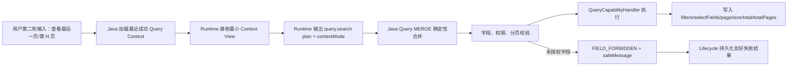

# Agent 多轮分页与权限拒绝提示修复 L2 实施详细设计 v1.0

## 1. 文档状态

| 项目 | 内容 |
| --- | --- |
| 文档名称 | Agent 多轮分页与权限拒绝提示修复 L2 实施详细设计 |
| 文档状态 | Draft |
| 文档版本 | v1.0 |
| 创建日期 | 2026-07-04 |
| 输出语言 | 简体中文 |
| 输出格式 | Markdown |
| 目标文档 | `docs/design/Agent多轮分页与权限拒绝提示修复_L2实施详细设计_v1.0.md` |

## 2. 修改历史

| 序号 | 日期 | 位置 | 修改原因 | 修改内容 |
| --- | --- | --- | --- | --- |
| 1 | 2026-07-04 | 全文 | 新建详细设计 | 针对多轮分页、末页计算、权限不足友好拒绝提示三个优先问题，给出 Java/Python/Context/测试实施方案，并核实关联设计文档是否需要同步修订。 |

## 3. 任务背景与问题结论

### 3.1 背景

当前 Agent 查询链路已暴露两个优先级较高的问题：

1. 第一轮输入“查询上海地区员工”后，第二轮输入“查看最后一页”或明确页码时，Runtime 可以表达 `MERGE` 语义，但 Java 校验侧未实际合并上一轮 `QueryCapabilityContextPayload`，导致 `filters` 为空或 `page` 无法绑定，最终进入失败路径。
2. viewer 角色请求 employee 域的地址、电话、邮箱、身份证等未授权字段时，后端 fail closed 是正确的，但对前端返回 `AGENT_PLAN_INVALID`，用户看到的是“规划失败/执行失败”一类泛化提示，不能表达“当前角色无权限访问这些字段”。

### 3.2 根因结论

| 问题 | 根因 | 风险 |
| --- | --- | --- |
| 第二轮分页失败 | `QueryPlanValidator` 只校验当前 plan，不按 `contextMode=MERGE` 合并上一轮 filters/selectFields/page/size。 | 多轮查询上下文失效，用户无法翻页、查看末页或继承过滤条件。 |
| 末页无法计算 | `QueryCapabilityContextPayload` 与 `RuntimeQueryContextView` 不携带 `total/totalExact/totalPages`。 | Runtime 没有足够上下文把“最后一页”转换成确定页码；Java 也无法做页码边界校验。 |
| 权限拒绝提示不友好 | 字段校验异常被归为 `PLAN_VALIDATION_FAILED`，再映射成 `AGENT_PLAN_INVALID`；执行失败持久化没有明确 safeMessage 来源。 | 安全拒绝语义被误报为规划失败，影响用户判断，也不利于审计和问题定位。 |

## 4. 上级文档约束

| 上级文档 | 必须遵守的约束 | 本设计响应 |
| --- | --- | --- |
| `docs/design/Agent目标架构总览_v1.0.md` | Java 是契约与最终授权执行边界；Runtime 不可信；Context 是最小化类型化规划状态。 | 分页上下文只增加必要分页元数据；权限判断仍在 Java 校验与执行边界完成。 |
| `docs/design/Agent契约与规划架构设计_v1.0.md` | Runtime 只接收最小 Context View；Runtime 的合并建议必须由 Java 确定性处理并再次校验。 | Runtime 可根据 Context View 给出页码建议；Java 对 MERGE 后最终查询做确定性合并和校验。 |
| `docs/design/Agent能力执行内核架构设计_v1.0.md` | Execution Core 统一执行授权复检、能力校验、Handler、ResultSecurity、Context 审批、Lifecycle finalization。 | 不把权限拒绝或分页逻辑下沉到 Adapter；Core 保持统一错误码和 safeMessage 出口。 |
| `docs/design/Agent元数据与上下文安全架构设计_v1.0.md` | Runtime 不接收 JWT、完整权限、mask 规则或未授权 metadata；结果安全必须在后端统一收口。 | 新增的 `total/totalExact/totalPages` 不是业务明细结果，不包含敏感字段值；未授权字段不进入 Runtime schema，越权仍 fail closed。 |

## 5. 关联文档边界与核实结论

本次请求授权新增本目标文档并核实关联文档。除本目标文档外，不直接修改其他 `docs/design` 文档。

| 关联文档 | 核实结论 | 是否建议同步修改 | 原因与授权边界 |
| --- | --- | --- | --- |
| `docs/design/D02_00_CapabilityKernel实施总览与集成门禁_L2_v1.0.md` | 已定义 Query MERGE 应由 Java 确定性合并，但未覆盖末页分页元数据和权限拒绝提示。 | 建议修改 | 若实施本设计，应补充 D02 集成门禁对 query context 版本、FIELD_FORBIDDEN、safeMessage 的验证项。需用户单独授权。 |
| `docs/design/D02_01_Capability注册与可信执行内核_L2_v1.0.md` | `query.search` 的 Context read/write 字段仍为 `filters/selectFields/page/size`；`ExecutionFailure` 未定义 safeMessage。 | 必须修改 | 末页能力需要 Context 字段扩展；友好拒绝提示需要 ExecutionFailure 携带安全消息或同等结构。需用户单独授权。 |
| `docs/design/D02_02_Invocation生命周期与持久化_L2_v1.0.md` | `FinalizedInvocationResult` 已有 `safeMessage`，但 `commitExecutionFailure` 的消息来源和权限拒绝场景未明确。 | 建议修改 | 需明确执行失败 finalization 优先使用 `ExecutionFailure.safeMessage`，否则退回通用安全提示。需用户单独授权。 |
| `docs/design/D02_03_元数据授权与Context安全_L2_v1.0.md` | Context payload 与安全错误码列表未覆盖 `total/totalExact/totalPages` 和字段越权错误码。 | 必须修改 | Query Context schema 与安全错误码属于该文档边界。需用户单独授权。 |
| `docs/design/D04_Agent Adapter与Domain Metadata收敛_L2实施详细设计_v1.0.md` | D04 定义 canonical field catalog、RuntimeDomainSchema、ExecutionValidationProjection；不拥有 Context 状态机和用户权限拒绝消息。 | 不建议修改 | 本设计只消费 D04 输出的字段存在性与授权投影，不改变 D04 的 catalog、adapter registration 或 projection 边界。 |
| `docs/design/Agent_ResultSecurity值级Mask脱敏接入_L2实施详细设计_v1.0.md` | 文档聚焦成功结果的字段裁剪和值级脱敏；未授权请求字段应在 plan validation/execution validation 前置拒绝。 | 不建议修改 | 权限不足拒绝提示不是 ResultSecurity 成功结果投影问题；除非后续要统一错误消息章节，否则无需修改。 |
| L1 架构文档 | 原则层已支持 Java 确定性合并、Context 最小化、权限 fail closed。 | 不建议修改 | 本次是 L2 实施细化，不需要变更 L1 架构边界。 |

## 6. 设计范围

### 6.1 范围内

| 范围项 | 说明 |
| --- | --- |
| 多轮 query 分页 | 支持第二轮指定页码、上一页、下一页、第一页、最后一页。 |
| 末页计算 | 通过上一轮成功查询的总数上下文推导最后一页。 |
| Query Context 扩展 | 增加 `total`、`totalExact`、`totalPages`，并投影到 Runtime Context View。 |
| Java MERGE 合并 | Java 对 Runtime 返回的 `contextMode=MERGE` 做确定性合并后再校验。 |
| 字段权限不足拒绝 | 对存在但未授权的字段返回权限拒绝错误码和安全提示。 |
| Lifecycle 友好提示 | 执行失败 safeMessage 进入持久化和最终 API 响应。 |
| Runtime prompt/model | 让 Runtime 能基于分页上下文输出确定页码，无法确定时发起澄清。 |
| 测试设计 | 覆盖 Java 单元、Context 序列化、Python contract/prompt 行为、端到端手工验证。 |

### 6.2 范围外

| 范围外项 | 原因 |
| --- | --- |
| 修改 viewer/admin 权限配置 | 当前权限模型已能限制 viewer 字段，问题是提示语义而非授权规则。 |
| 将未授权字段改为自动脱敏返回 | 未授权与可见但需 mask 是两个安全语义；未授权必须拒绝或裁剪，不能用脱敏掩盖。 |
| 在 Adapter 内计算权限或错误码 | Adapter 只负责下游执行映射，不承担主体权限判断。 |
| 前端本地推断权限不足 | 权限拒绝必须来自后端权威错误码和 safeMessage。 |
| 引入新的数据库列 | Context payload 走现有加密 JSON 存储，新增字段不需要表结构变更。 |

## 7. 总体方案

### 7.1 方案概述



### 7.2 关键设计判断

| 判断 | 结论 | 依据 |
| --- | --- | --- |
| 末页是否新增 `pageMode=LAST` 合约 | 暂不新增。 | 最小影响方案是把上一轮 `totalPages` 暴露给 Runtime Context View，Runtime 输出具体 `page`，Java 再校验最终页码。 |
| `total` 是否属于敏感业务结果 | 不属于业务明细，但属于规划状态。 | 仅暴露总条数、是否精确、总页数，不暴露员工字段值或权限规则。 |
| 权限不足是否仍返回 `AGENT_PLAN_INVALID` | 不应继续返回。 | 用户请求存在但未授权字段时，行为是安全拒绝，不是规划结构无效。 |
| 未授权字段是否可以在 Runtime 阶段完全避免 | 不能完全依赖 Runtime。 | Runtime schema 已过滤未授权字段，但用户明示敏感字段或模型幻觉时，Java 必须二次 fail closed。 |

## 8. 多轮分页详细设计

### 8.1 Query Context Payload

`QueryCapabilityContextPayload` 扩展为：

| 字段 | 类型 | 必填 | 说明 |
| --- | --- | --- | --- |
| `filters` | `List<RuntimeFilterSpec>` | 是 | 上一轮最终生效 filters。 |
| `selectFields` | `List<String>` | 是 | 上一轮最终生效展示字段。 |
| `page` | `int` | 是 | 上一轮返回页码，1-based。 |
| `size` | `int` | 是 | 上一轮页大小。 |
| `total` | `Long` | 否 | 下游返回的总条数；未知时为 null。 |
| `totalExact` | `Boolean` | 否 | `total` 是否精确；未知时为 null 或 false。 |
| `totalPages` | `Integer` | 否 | 当 `totalExact=true` 且 `size>0` 时计算。 |

`totalPages` 计算规则：

```text
if totalExact == true and total != null and size > 0:
  totalPages = max(1, ceil(total / size))
else:
  totalPages = null
```

### 8.2 Runtime Context View

`RuntimeQueryContextView` 增加同名只读字段：`total`、`totalExact`、`totalPages`。

Runtime 行为规则：

| 用户第二轮意图 | Context 条件 | Runtime 输出 |
| --- | --- | --- |
| “查看第 2 页” | 有上一轮 query context | `contextMode=MERGE`，`page=2`。 |
| “下一页” | 有上一轮 `page/size` | `contextMode=MERGE`，`page=previous.page + 1`。 |
| “上一页” | 有上一轮 `page/size` | `contextMode=MERGE`，`page=max(1, previous.page - 1)`。 |
| “第一页” | 有上一轮 query context | `contextMode=MERGE`，`page=1`。 |
| “最后一页” | `totalExact=true` 且 `totalPages` 非空 | `contextMode=MERGE`，`page=previous.totalPages`。 |
| “最后一页” | 没有精确总页数 | 返回澄清，提示用户指定页码或重新查询。 |

### 8.3 Java MERGE 合并规则

在 `QueryPlanValidator` 或后续恢复的 `QueryPlanBindingStrategy` 中执行确定性合并。以当前代码最小改动为准，优先落在 `QueryPlanValidator.validate(...)`，因为该类已经注入 `QueryMergeEngine` 且持有 `ExecutionValidationContext`。

| 字段 | `REPLACE` | `MERGE` |
| --- | --- | --- |
| `filters` | 必须来自当前 plan，不能为空。 | 读取上一轮 filters，用 `QueryMergeEngine` 合并当前 filters；当前 filters 为空时继承上一轮 filters。 |
| `selectFields` | 当前 plan 显式字段或默认字段。 | 当前 plan 有值则覆盖；无值则继承上一轮 selectFields。 |
| `page` | 当前 plan 页码或默认 1。 | 当前 plan 有值则覆盖；无值则继承上一轮 page。 |
| `size` | 当前 plan size 或默认 size。 | 当前 plan 有值则覆盖；无值则继承上一轮 size。 |
| `total/totalPages` | 不进入执行请求。 | 只用于页码边界校验，不传给 Adapter。 |

校验规则：

1. MERGE 时缺少上一轮 query context，应返回安全失败或澄清，不允许以空 filters 执行。
2. MERGE 后最终 filters 仍为空，按查询能力约束拒绝。
3. 当 `totalExact=true` 且 `totalPages` 非空时，`page` 不得小于 1；如果 `page > totalPages`，返回友好失败“请求页码超过当前结果总页数，请调整页码后重试。”。
4. Adapter 执行仍只接收标准 query request：filters、selectFields、page、size。

### 8.4 Context 写入规则

`QueryCapabilityHandler` 在收到 `AdapterQueryResult` 后写入新的 query context：

| 来源 | 写入字段 |
| --- | --- |
| `ValidatedQueryPlan` | filters、selectFields、page、size。 |
| `AdapterQueryResult` / `KernelQueryResult` | total、totalExact。 |
| handler 内部计算 | totalPages。 |

只有成功完成并通过 ResultSecurity 的 query invocation 才写入 Context。失败、澄清、取消均不写入新的 query context。

## 9. 权限不足友好提示详细设计

### 9.1 错误码

新增内部错误码：

```java
FIELD_FORBIDDEN
```

映射关系：

| 内部错误码 | Agent API 错误码 | safeMessage |
| --- | --- | --- |
| `FIELD_FORBIDDEN` | `AGENT_FIELD_FORBIDDEN` | `当前角色无权限访问请求字段：{字段列表}。请调整查询字段或联系管理员授权。` |

### 9.2 字段存在性与授权区分

Validator 必须区分两类错误：

| 场景 | 判断依据 | 错误 |
| --- | --- | --- |
| 字段不存在 | Canonical Domain Catalog 中没有该 field。 | `PLAN_VALIDATION_FAILED`，提示为泛化无效计划。 |
| 字段存在但当前主体未授权 | Catalog 中存在，但 `ExecutionValidationProjection.fieldRules` 不包含或不允许对应用途。 | `FIELD_FORBIDDEN`，返回友好拒绝。 |

Query、Aggregate、Preview 等能力的字段校验应复用同一判断语义，避免 query 能友好拒绝而 aggregate 仍报 `AGENT_PLAN_INVALID`。

### 9.3 ExecutionFailure safeMessage

`ExecutionFailure` 增加安全消息字段：

| 字段 | 类型 | 说明 |
| --- | --- | --- |
| `safeMessage` | `String` | 可返回给前端和持久化的安全提示，不包含内部异常、SQL、下游路径、完整权限正文或敏感值。 |

`FinalizationTxService.commitExecutionFailure(...)` 规则：

1. `ExecutionFailure.safeMessage` 非空时，持久化并返回该消息。
2. 为空时，按现有通用消息兜底：“执行失败，请稍后重试。”。
3. planning failure 仍走 planning failure 的 safeMessage 规则，不混入 execution failure。

`AgentChatResponseAssembler` 规则：

1. `FIELD_FORBIDDEN` 映射到 `AGENT_FIELD_FORBIDDEN`。
2. 前端展示 `FinalizedInvocationResult.safeMessage`。
3. 不把 `diagnosticId` 或内部 exception message 作为用户提示。

## 10. Java 实施落点

| 模块 | 文件/类 | 修改点 |
| --- | --- | --- |
| `agent-api` | `com.dylan.agent.api.context.QueryCapabilityContextPayload` | 新增 `total`、`totalExact`、`totalPages`；保持旧 JSON 兼容。 |
| `agent-api` | `com.dylan.agent.api.contract.runtime.common.RuntimeQueryContextView` | 新增同名只读字段，并更新 OpenAPI/generated contract 流程。 |
| `agent-api` | `AgentExecutionContracts.QUERY_CONTEXT` | 将 query context contract 版本从 `1.0.0` 提升到 `1.1.0`，或明确兼容字段扩展策略。 |
| `agent-service` | `ContextBoundary` | `toRuntimeView` 与 `payloadFields` 增加分页总数字段。 |
| `agent-service` | `QueryCapabilityConfiguration` | context read/write field declaration 增加分页总数字段。 |
| `agent-service` | `QueryPlanValidator` | 执行 MERGE 合并、分页边界校验、字段越权错误区分。 |
| `agent-service` | `QueryMergeEngine` | 继续负责 filters 合并；如需统一，可新增 select/page 合并 helper，但不引入泛化抽象。 |
| `agent-service` | `QueryCapabilityHandler` | Context write 从 adapter result 带出 total/totalExact/totalPages。 |
| `agent-service` | `KernelErrorCode` | 新增 `FIELD_FORBIDDEN`。 |
| `agent-service` | `ExecutionFailure` | 新增 `safeMessage`，提供工厂方法或构造重载。 |
| `agent-service` | `ExecutionCore` | 捕获字段越权异常并返回 `FIELD_FORBIDDEN` 的 `ExecutionFailure`。 |
| `agent-service` | `FinalizationTxService` | execution failure 持久化优先使用 `ExecutionFailure.safeMessage`。 |
| `agent-service` | `AgentChatResponseAssembler` | `FIELD_FORBIDDEN` 映射为 `AGENT_FIELD_FORBIDDEN`。 |
| `auth-service` | 现有 viewer/admin 配置 | 不修改，仅作为测试输入。 |

## 11. Python Runtime 实施落点

| 文件/区域 | 修改点 |
| --- | --- |
| `agent-runtime/app/prompts/query_system.md` | 增加多轮分页规则：第 N 页、上一页、下一页、第一页、最后一页；最后一页必须依赖 `totalExact=true` 和 `totalPages`。 |
| Python generated models | 通过 Java OpenAPI/contract 生成流程更新 `RuntimeQueryContextView` 字段，禁止手工维护生成代码长期漂移。 |
| Runtime plan tests/fixtures | 增加 “查看最后一页” 有精确总页数时输出 `page=totalPages`、无总页数时输出 clarification 的用例。 |
| Runtime console 日志 | 若前序已要求 `_error` 打印具体失败信息，应保留安全日志边界：console 可输出 Runtime 内部错误摘要，不能输出 JWT、权限正文或敏感业务值。 |

## 12. 兼容性与迁移

| 项目 | 设计 |
| --- | --- |
| 旧 Context JSON | 新字段使用 nullable boxed 类型；旧 JSON 缺失字段时反序列化为 null。 |
| Contract 版本 | 推荐将 `QueryCapabilityContextPayload` 合约提升到 `1.1.0`。 |
| Context migration | 如果当前 Context 存储严格校验 contract version，新增 `QueryContextV1ToV1_1Migrator`，将旧 payload 补齐 null 字段。 |
| 无历史上下文 | 第二轮分页缺上下文时不执行查询，返回友好澄清或安全失败。 |
| `totalExact=false` | 不支持“最后一页”自动计算，提示用户指定页码或重新查询。 |

## 13. 授权、安全与审计

| 项目 | 设计 |
| --- | --- |
| Runtime 可见信息 | 只增加分页总数元数据，不暴露用户完整权限、mask 规则、JWT 或未授权字段 schema。 |
| 字段越权 | Java validator fail closed，返回 `FIELD_FORBIDDEN`，不执行 Adapter。 |
| 日志 | 可记录 `diagnosticId`、domain、capabilityId、errorCode、字段数量；不得记录敏感字段值、完整权限正文或 token。 |
| 审计 | invocation final result 保留错误码和 diagnosticId；safeMessage 只保存可展示文本。 |
| ResultSecurity | 成功结果仍必须经过 ResultSecurity 后再持久化与返回；本设计不绕过脱敏链路。 |

## 14. 幂等性、事务与一致性

| 场景 | 设计 |
| --- | --- |
| 重试同一 invocation | 仍通过 invocation/correlation 幂等与 CAS finalization 保证终态唯一。 |
| Context 写入冲突 | 沿用 `MyBatisContextRepository.upsertApproved` 与 ContextApproval 的 CAS/版本策略；本设计不改变写入幂等模型。 |
| 执行失败 | 不写入 query context；只 finalization 失败结果。 |
| 成功查询 | result、context write refs 与 invocation finalization 保持同一 finalization 事务语义。 |
| 末页上下文过期 | Context TTL 过期后不继承，Runtime/Java 返回需要重新查询或指定条件的提示。 |

## 15. 性能与容量

| 项目 | 影响 |
| --- | --- |
| Context payload 体积 | 增加 3 个标量字段，影响可忽略。 |
| MERGE 合并 | 只处理上一轮 filters/selectFields/page/size，复杂度与字段数量线性相关。 |
| 权限校验 | 字段存在性和授权判断使用现有 catalog/projection map，O(1) 查询。 |
| 下游查询 | 不新增额外下游请求；末页使用上一轮 totalPages，不单独 count。 |

## 16. 测试设计

### 16.1 Java 单元测试

| 测试类 | 用例 | 目的 |
| --- | --- | --- |
| `QueryPlanValidatorTest` | `mergeInheritsFiltersWhenSecondTurnOnlySpecifiesPage()` | 第二轮只给 page 时继承上一轮 filters。 |
| `QueryPlanValidatorTest` | `mergeUsesRequestedPageAndInheritedSize()` | page 覆盖、size 继承。 |
| `QueryPlanValidatorTest` | `mergeRejectsWhenPreviousContextMissing()` | MERGE 缺上下文不得空 filters 执行。 |
| `QueryPlanValidatorTest` | `rejectsPageGreaterThanTotalPagesWhenTotalExact()` | 页码超过总页数时友好失败。 |
| `QueryCapabilityHandlerTest` | `writesTotalAndTotalPagesIntoQueryContext()` | 成功查询写入分页总数上下文。 |
| `ContextBoundaryTest` | `projectsQueryTotalFieldsToRuntimeView()` | Runtime Context View 包含 total 字段。 |
| `PayloadJsonCodecTest` | `readsOldQueryContextWithoutTotalFields()` | 旧 context JSON 兼容。 |
| `ExecutionCoreTest` | `fieldForbiddenBecomesExecutionFailureWithSafeMessage()` | 字段越权映射为 `FIELD_FORBIDDEN`。 |
| `FinalizationTxServiceTest` | `commitExecutionFailureUsesFailureSafeMessage()` | finalization 持久化安全提示。 |
| `AgentChatResponseAssemblerTest` | `mapsFieldForbiddenToAgentFieldForbidden()` | API 错误码映射正确。 |

### 16.2 Python/Contract 测试

| 测试 | 目的 |
| --- | --- |
| contract drift test | Java `RuntimeQueryContextView` 与 Python generated model 一致。 |
| prompt fixture: last page with totalPages | “查看最后一页” 输出 `page=totalPages`。 |
| prompt fixture: last page without totalPages | 返回 clarification，不输出未确定页码。 |

### 16.3 集成与手工验证

| 用户 | 输入链路 | 期望 |
| --- | --- | --- |
| admin | “查询上海地区员工” -> “查看第 2 页” | 第二轮继承上海过滤条件，返回第 2 页。 |
| admin | “查询上海地区员工” -> “查看最后一页” | 若上一轮 totalExact=true，返回最后一页。 |
| viewer | “查询上海地区员工，返回姓名、身份证、电话、邮箱、联系地址” | 返回 `AGENT_FIELD_FORBIDDEN` 和友好提示，不执行下游查询。 |
| viewer | “查询上海地区员工” | 返回 viewer 已授权字段，不泄露地址、电话等未授权字段。 |

## 17. 建议验证命令

```powershell
.\mvnw.cmd -pl agent-service -am "-Dtest=QueryPlanValidatorTest,QueryCapabilityHandlerTest,ContextBoundaryTest,PayloadJsonCodecTest,ExecutionCoreTest,FinalizationTxServiceTest,AgentChatResponseAssemblerTest" test --batch-mode
```

```powershell
.\mvnw.cmd -pl agent-api,agent-service -am test --batch-mode
```

```powershell
pytest agent-runtime/tests -q
```

```powershell
rg -n "QueryCapabilityContextPayload|RuntimeQueryContextView|FIELD_FORBIDDEN|AGENT_FIELD_FORBIDDEN|totalPages" agent-api agent-service agent-runtime docs/design
```

## 18. 实施顺序

| 顺序 | 步骤 | 产物 | 验证 |
| --- | --- | --- | --- |
| 1 | 扩展 Java query context contract | `QueryCapabilityContextPayload`、`RuntimeQueryContextView` 新字段 | contract/codec 测试。 |
| 2 | 更新 ContextBoundary 与 capability declaration | Runtime View 和 read/write 字段包含总数元数据 | ContextBoundary 测试。 |
| 3 | 实现 Query MERGE 合并与页码校验 | 第二轮分页可继承 filters 并使用 page | QueryPlanValidator 测试。 |
| 4 | Query handler 写入 total/totalPages | 成功查询后具备末页上下文 | QueryCapabilityHandler 测试。 |
| 5 | 增加 `FIELD_FORBIDDEN` 与 safeMessage 链路 | 权限不足返回友好拒绝 | Core/finalization/assembler 测试。 |
| 6 | 更新 Runtime prompt/generated model | Runtime 能理解最后一页与页码继承 | Python contract/prompt fixture 测试。 |
| 7 | 执行端到端链路验证 | admin 分页、viewer 拒绝均符合预期 | 手工请求链路。 |

## 19. 实施对齐检查清单

| 检查项 | 期望 |
| --- | --- |
| Java 合并最终查询 | `contextMode=MERGE` 不再因当前 filters 为空直接失败。 |
| 末页计算 | 只有 `totalExact=true` 且 `totalPages` 存在时自动跳末页。 |
| Context 最小化 | 不把业务行数据、权限正文或 mask 规则写入 Runtime Context View。 |
| 权限拒绝语义 | 存在但未授权字段返回 `AGENT_FIELD_FORBIDDEN`。 |
| ResultSecurity 边界 | 成功结果仍经过统一 ResultSecurity。 |
| 旧 Context 兼容 | 旧 payload 缺少总数字段不导致反序列化失败。 |
| 关联文档 | D02_00/D02_01/D02_02/D02_03 若要同步修订，先取得用户授权。 |

## 20. 剩余风险与处理建议

| 风险 | 触发场景 | 影响 | 建议 |
| --- | --- | --- | --- |
| Runtime 对“最后一页”仍输出空 page | Prompt/model 未同步或模型未遵守规则。 | Java 仍会拒绝或澄清，用户体验未完全恢复。 | 增加 prompt fixture，并在 Java 对缺页码场景给出明确提示。 |
| `totalExact=false` 下用户要求末页 | 下游 ES/Adapter 无精确 total。 | 无法可靠计算末页。 | 返回澄清，不猜测页码。 |
| Contract 版本校验严格 | 旧 context version 为 `1.0.0`，新代码要求 `1.1.0`。 | 旧会话第二轮无法继承。 | 增加 migrator 或版本兼容读取。 |
| 字段越权异常未覆盖全部 capability | aggregate/preview 仍抛普通 validation 异常。 | 部分链路仍返回 `AGENT_PLAN_INVALID`。 | 字段校验 helper 统一存在性和授权判断。 |
| 关联文档未同步 | 实施后 D02 文档与代码不一致。 | 后续开发按旧文档实现会回归。 | 在用户授权后同步修订 D02_00/D02_01/D02_02/D02_03。 |

## 21. 需用户授权的关联文档修订项

如要保持 `docs/design` 体系完全一致，建议用户授权后另行修改以下文档：

| 文档 | 建议修订点 |
| --- | --- |
| `D02_00_CapabilityKernel实施总览与集成门禁_L2_v1.0.md` | 增加本次 query context version、MERGE 分页、FIELD_FORBIDDEN、safeMessage 的集成门禁。 |
| `D02_01_Capability注册与可信执行内核_L2_v1.0.md` | 更新 `query.search` context read/write 字段；更新 `ExecutionFailure` 模型；补充 `FIELD_FORBIDDEN` 校验语义。 |
| `D02_02_Invocation生命周期与持久化_L2_v1.0.md` | 明确 `commitExecutionFailure` 的 safeMessage 来源和兜底规则。 |
| `D02_03_元数据授权与Context安全_L2_v1.0.md` | 更新 `QueryCapabilityContextPayload` schema、安全错误码清单、Runtime Context View 最小化说明。 |

恢复执行指令模板：

```text
请继续修订关联设计文档，授权范围为：
1. docs/design/D02_00_CapabilityKernel实施总览与集成门禁_L2_v1.0.md
2. docs/design/D02_01_Capability注册与可信执行内核_L2_v1.0.md
3. docs/design/D02_02_Invocation生命周期与持久化_L2_v1.0.md
4. docs/design/D02_03_元数据授权与Context安全_L2_v1.0.md
修订内容仅限 Agent 多轮分页、末页计算、FIELD_FORBIDDEN、ExecutionFailure.safeMessage 与相关验证门禁。
```

## 22. 内部评审记录

| 轮次 | 关注点 | 结论 |
| --- | --- | --- |
| 1 | 是否改变权限模型 | 不改变 viewer/admin 权限，只修复拒绝语义和提示。 |
| 1 | 是否扩大 Context 安全暴露 | 仅增加分页标量元数据，不暴露业务明细和权限正文。 |
| 1 | 是否需要修改 D04/ResultSecurity 文档 | 不建议修改；D04 是 metadata 边界，ResultSecurity 是成功结果安全边界。 |
| 1 | 是否需要修改 D02 系列关联文档 | 需要，但需用户明确授权后另行修订。 |

## 23. 完成摘要

| 项目 | 结果 |
| --- | --- |
| 是否新建目标详细设计文档 | 是 |
| 是否修改关联文档 | 否，已列出需授权修订项。 |
| 是否修改代码/测试/配置 | 否 |
| 是否覆盖分页问题 | 是，包含指定页、上一页、下一页、第一页、最后一页。 |
| 是否覆盖权限拒绝提示 | 是，定义 `FIELD_FORBIDDEN`、safeMessage、API 映射。 |
| 是否包含实施落点 | 是，包含 Java、Python、Context、Lifecycle、测试与验证命令。 |
