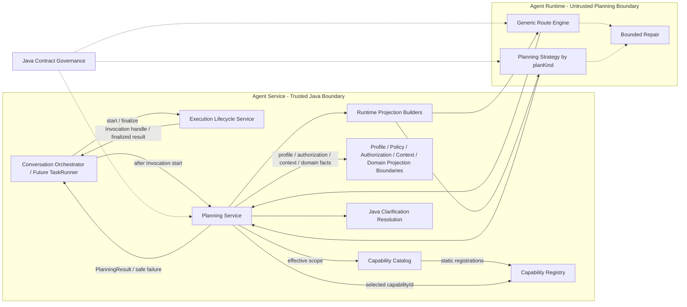
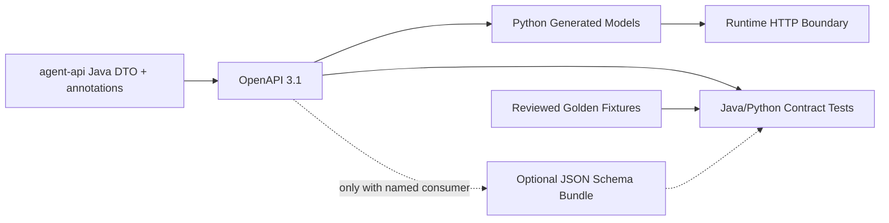

# Agent 契约与规划架构设计 v1.0

> 文档层级：L1 分域架构设计  
> 文档状态：架构基线（已评审）  
> 上位文档：`Agent目标架构总览_v1.0.md`  
> 适用代码基线：`389b72b6162edfdb4385c8a77bebf56bfb3e2608`
> 适用范围：`agent-api`、`agent-service` 的 Planning 边界、`agent-runtime`  
> 前提：系统尚未投产，不承担旧 Runtime 协议、旧 Python model 和旧 Prompt 的兼容责任  
> 下位交付：`docs/design/P1_V2/01` 契约生成与治理、`P1_V2/02` 可信执行内核中的规划接口、`P1_V2/03` 安全投影，以及 `P1_V2/06` 原子迁移门禁

---

## 修订历史

| 序号 | 日期 | 文档位置 | 修改内容 | 修改原因 |
|---:|---|---|---|---|
| 1 | 2026-07-13 | `docs/design/Agent契约与规划架构设计_v1.0.md` | 明确 PlanningCommand 入口中立、当前只启用 CHAT；区分 Planning Runtime 与 capability-local generation port；将 Multi-Agent 内容限定为 D06 演进 seam；更新可追溯代码基线 | 防止当前单 Agent 契约固化为 CHAT 专用或提前建设 TASK 双协议 |
| 2 | 2026-07-13 | 第 1、3、5～7、16、18～20 节 | L1 串行复审修复 | 将下位交付入口收敛到 P1_V2；把 `Run Owner Reference` 修正为当前可实现的中立 Owner Reference，并明确 Multi-Agent concrete input 等待未来 L1 |

## 1. 文档定位

### 1.1 目的

本文在 L0 目标架构约束下，完整定义 Agent 契约与规划域的稳定架构，包括：

1. Java 与 Runtime 之间的单向结构契约。
2. Planning Service 的职责、输入、输出和调用边界。
3. Java 可见的 Route/Plan 两阶段规划协议。
4. Capability Routing Descriptor 的请求级投影规则。
5. ClarificationRequired 到 ResolvedClarification 的安全终结路径。
6. Runtime 的 descriptor-driven 路由、Planning Strategy、Prompt 和有界 repair 架构。
7. deadline、失败、取消、观测和契约演进规则。

### 1.2 权威关系

本文是“契约与规划域”的 L1 权威来源，但必须服从 `Agent目标架构总览_v1.0.md`。

```text
L0 Agent 目标架构总览
  → 本文：契约与规划 L1
      → P1_V2/01、02、03、06 对应 L2 详细设计
          → Java、Python、Prompt、配置和测试
```

发生冲突时遵循以下规则：

- L0 优先于本文。
- 本文优先于对应 L2 和代码。
- 如果实施证明本文不可行，必须先通过 ADR 修订本文或 L0，禁止在 Runtime 或 Prompt 中形成未记录分支。

### 1.3 本文唯一负责的内容

本文唯一负责：

- 跨 Java/Runtime DTO 的结构边界和生成方向；
- RouteRequest、RouteOutcome、PlanRequest、PlanOutcome 的协议语义；
- Capability Routing Descriptor 的 Runtime 请求投影；
- PlanningCommand、PlanningResult 的应用层边界语义；
- Planning Service 的两阶段流程和一致性校验；
- ClarificationRequired、ClarificationArgs、ResolvedClarification 的边界；
- Runtime Route Engine 和按 planKind 选择 Planning Strategy 的扩展机制；
- Prompt 的事实来源和禁止硬编码项；
- 单次 Runtime operation 内的有界 repair；
- Planning 全链 absolute deadline、错误和观测语义。

### 1.4 本文不负责的内容

以下内容由其他 L1 文档唯一负责，本文只引用，不重新定义：

| 内容 | 唯一负责文档 | 本文使用方式 |
|---|---|---|
| Capability Definition、Registration、Registry、Validator、Handler、Execution Core、Invocation 核心语义 | `Agent能力执行内核架构设计_v1.0.md` | 使用 Registration/Registry 解析结果和执行入口，不定义注册结构和执行逻辑 |
| Profile、Policy、Authorization Snapshot、Context 授权、Capability Catalog、Canonical Domain Field Catalog | `Agent元数据与上下文安全架构设计_v1.0.md` | 使用请求级安全投影，不定义权限公式、存储结构和 Catalog 内容 |
| Coordinator、CoordinationPlanner、TaskRunner、ResultRef、Task State Boundary、Run/Task/Attempt | `Multi-Agent协调与任务架构设计_v1.0.md` | 只保证 TaskRunner 可复用 Planning Service，不定义 Task Graph 和调度状态机 |
| Handler 执行期的 generation、embedding、rerank 等 capability-local infrastructure port | `Agent能力执行内核架构设计_v1.0.md` | 本文只定义 Planning Runtime；不得把执行期生成调用并入 Route/Plan operation 或共享 Planning Prompt |

本文也不定义：

- Java 类、接口、方法、包路径；
- Python 文件、函数和 LangGraph 节点名称；
- HTTP URI、注解、完整 DTO 字段清单；
- SQL、表结构、索引和事务代码；
- LLM 厂商、模型和具体 SDK；
- Handler、Adapter 和业务结果结构；
- 完整测试文件和 CI 命令。

以上实施细节必须在 L2 中列出，但不得改变本文的协议和边界。

---

## 2. L0 约束映射

| L0 约束 | 本文落实方式 | 主要章节 |
|---|---|---|
| AD-01 capabilityId 是已选能力主键 | Route 选择 capabilityId；Java 通过 capabilityId 唯一解析 Registration | 第 5、8、9 节 |
| AD-02 Java 是跨 Runtime 结构契约源 | Java DTO→OpenAPI→Python generated model | 第 6 节 |
| AD-03 事实和投影分离 | Descriptor、Domain Schema、Context View 都是请求级投影 | 第 5、8、9 节 |
| AD-04 Planning/Lifecycle/Core 分离 | Planning 只返回 PlanningResult，不调用 Handler/Adapter、不持久化终态 | 第 4、7、14 节 |
| AD-05 类型桥只在 Registration | Planning 只携带 Resolved Registration 与 Raw Plan，不操作裸 Handler 或执行类型转换 | 第 4、5、7、9 节 |
| AD-06 Runtime 不可信 | 所有 Runtime 输出由 Java 校验；执行权限由 Execution Core 复检 | 第 4、8、9、13 节 |
| AD-07 不保留双协议 | Route/Plan 纵向原子切换，不提供 v1/v2 转换层 | 第 6、15 节 |
| AD-08 Multi-Agent 复用单 Agent 内核 | Future TaskRunner 复用同一 PlanningCommand/PlanningResult，不建立 Task 专用规划协议 | 第 4、7、16 节 |
| AD-09 Java 可见两阶段规划 | Route 确定 capability 后才加载 Context 并进入 Plan | 第 7～9 节 |
| AD-10 全链共享 absolute deadline | Route、Plan、repair 只消耗剩余预算，不重置计时 | 第 13 节 |
| AD-11 capability-local infrastructure port | 本文只治理 Planning Runtime；执行期 generation/embedding/rerank port 不进入 Route/Plan 协议 | 第 1.4、16.5 节 |
| 新 capability 不侵入主流程 | Route 读取动态 Descriptor；相同 planKind 复用既有 Planning Strategy | 第 11、16 节 |
| 新 Domain 不侵入主流程 | Domain Routing Projection/Runtime Domain Schema 由安全投影动态提供，Prompt 不维护 Domain 清单 | 第 8、9、12、16 节 |

本文不得放宽以上约束。

---

## 3. 当前基线与目标差距

当前代码仍是迁移前基线，本文定义目标状态，不要求兼容旧设计。

| 维度 | 当前基线 | 目标状态 |
|---|---|---|
| Runtime 操作 | 单一 plan generate 操作 | Java 可见且独立的 Route、Plan 两个 operation |
| 能力主键 | intent 与 Handler/Plan 强绑定 | capabilityId 负责选择；planKind 只负责 Plan 结构 |
| Runtime 路由 | intent→capability 硬编码映射 | 根据请求级 Capability Routing Descriptor 动态选择 |
| Runtime graph | QUERY/AGGREGATE 等专用分支 | 通用 Route Engine + planKind 对应 Planning Strategy |
| 澄清 | Clarify intent/Plan/Handler | RouteOutcome/PlanOutcome 的 ClarificationRequired variant |
| Context | 规划前携带 previousQuery 等专用上下文 | Route 后按选定 Registration 加载最小 Context View |
| Domain metadata | 配置、Adapter、Prompt 多处维护 | Canonical Domain Field Catalog 形成 Route/Plan 各自的请求级安全投影 |
| Python model | 生成后兼容处理和手写 facade | 从 OpenAPI 直接生成，禁止结构补丁和平行 DTO |
| Prompt | 硬编码 intent、capabilityId、Domain 和结构示例 | 只保存行为规则，结构事实从 generated artifact/请求投影获得 |
| repair | 与完整 graph/SDK 重试交织 | 每个 operation 内部有界、可观测、受 absolute deadline 约束 |

迁移必须按 `P1_V2/06` 纵向原子完成。仓库不得出现可运行的双 endpoint、双 generated model、intent/capability 转换器或兼容 facade。

---

## 4. 架构边界

### 4.1 组件关系



图中组件均为逻辑职责。Planning Service 不是独立微服务；Projection Builder、Clarification Resolution 和 repair 不形成额外架构层。

### 4.2 责任边界

| 组件/边界 | 负责 | 禁止 |
|---|---|---|
| Conversation Orchestrator / TaskRunner | 把入口请求转换为 PlanningCommand，把 PlanningResult 交给 Lifecycle | 复制 Route/Plan 编排、调用 Handler、持久化 Planning 事实 |
| Planning Service | 可用能力、授权快照协调、Route/Plan、Context 时序、一致性校验、PlanningResult | 执行业务能力、形成最终执行授权、直接终结 Invocation |
| Capability Catalog | 返回请求级 Available Capability | 维护 Runtime graph 或 Prompt |
| Capability Registry | 按 capabilityId 唯一解析 Registration | 按 planKind 选择 Registration |
| Metadata/Security boundaries | 提供 Effective Profile、Authorization Snapshot、Context View、Domain Schema 投影所需事实 | 把完整权限表达式或持久化 Envelope 暴露给 Runtime |
| Agent Runtime | 建议 capability/domain、生成候选 Plan 或 ClarificationRequired | 决定权限、执行 Handler/Adapter、生成最终澄清问题 |
| Execution Lifecycle Service | 开始/终结 Invocation，承接 PlanningResult 或 Planning 失败 | 重新实现 Planning、修改 Runtime outcome |

### 4.3 依赖方向

```text
agent-service Planning
  → depends on agent-api Java contracts
  → uses Capability Catalog and Capability Registry interfaces
  → uses Profile / Authorization / Context projection boundaries
  → calls agent-runtime through Route and Plan operations

agent-runtime contract models
  ← generated from agent-api OpenAPI artifact

agent-runtime behavior
  → depends on generated models and request-level projections
  × must not become a structural contract source
```

### 4.4 PlanningResult 与执行边界

Planning Service 只返回封闭联合：

```text
PlanningResult
  = ExecutablePlanningResult
  | ResolvedClarification
```

- `ExecutablePlanningResult` 表示 Java 已确认 Route/Plan/Registration 一致，但其中的 Raw Plan 仍是不可信执行输入，必须由 Execution Core 调用 Registration 绑定的 Plan Validator。
- `ResolvedClarification` 是内部终态建议，必须由 Execution Lifecycle Service 直接形成 CLARIFY 响应，不进入 Execution Core。
- Planning 异常和取消通过异常/取消通道返回入口，由 Execution Lifecycle Service 形成 FAILED/CANCELLED；它们不是第三个 PlanningResult variant。

---

## 5. 稳定契约概念

### 5.1 契约分类

| 分类 | 稳定概念 | 权威来源 |
|---|---|---|
| Runtime HTTP | RouteRequest、RouteOutcome、PlanRequest、PlanOutcome、RuntimeError | `agent-api` Java DTO |
| Runtime 选择输入 | Capability Routing Descriptor 请求投影、Domain Routing Projection、Runtime Domain Schema、Context View | Java 事实的请求级安全投影，其结构由 `agent-api` 定义 |
| Runtime 候选输出 | RouteDecision、ExecutablePlan、ClarificationRequired | `agent-api` Java union/subtype |
| Java 内部输入 | PlanningCommand | 本文定义语义，具体 Java 类型由 L2 定义 |
| Java 内部输出 | ExecutablePlanningResult、ResolvedClarification | 本文定义边界，具体 Java 类型由 L2 定义 |
| 执行引用 | Resolved Registration、Authorization Snapshot、Context Snapshot | 其他 L1 的权威对象，本文只携带引用/不可变快照 |

### 5.2 Capability Routing Descriptor

Capability Routing Descriptor 是 Capability Definition 内的静态路由事实，稳定表达：

- planKind 引用；
- 面向模型的能力描述；
- 适用和排除条件。

Runtime 不接收完整 Capability Definition。RouteRequest/PlanRequest 携带的是该 Descriptor 结合 Available Capability 形成的请求级安全投影，至少包含：

- capabilityId；
- planKind 引用；
- 面向模型的能力描述；
- 适用和排除条件；
- Domain Mode 和当前允许的 domain 标识范围。

约束：

- 请求投影只能从 Available Capability 与 Capability Definition 内的 Descriptor 生成；对应 Java Runtime request DTO 只是传输投影，不是第二套静态 descriptor 或配置事实源。
- 只有当前请求可用的 capability 才生成请求投影；不可用性通过“不出现在请求中”表达，不增加 enabled/disabled 平行状态。
- 未授权、未启用或 Adapter 不可用的 capability/domain 不得进入请求。
- Descriptor 不包含用户角色表达式、mask 规则、凭据和内部 Handler/Adapter 名称。
- capabilityId 必须是数据，不得生成为 Python enum 或写入共享 Route Prompt 的分支。
- planKind 可以被 Runtime 用于选择 Planning Strategy，但 RouteDecision 不回传 planKind；Java 从 Registration 获得权威 planKind。

### 5.3 Domain Routing Projection 与 Runtime Domain Schema

Domain Routing Projection 是从 Canonical Domain Field Catalog、Available Capability domain 范围和用户权限形成的最小 Route 阶段投影，只包含：

- domain 标识；
- 允许暴露的别名；
- 用于 domain 选择的安全描述。

它不包含字段、operator、function、mask 或完整 Domain Schema。Capability Routing Descriptor 通过 domain 标识引用该投影，但不复制 domain 别名和描述。两者都是请求级投影，不改变各自事实来源。

Runtime Domain Schema 是 capability 和 domain 确定后，从 Canonical Domain Field Catalog、当前授权和 Adapter 可用范围形成的 Plan 阶段最小投影，只包含当前请求允许的字段、operator、function 和必要语义。它不包含 mask 规则、内部字段映射、完整 Catalog 或未授权 metadata，也不是新的 Domain 事实来源。

### 5.4 Context Snapshot 与 Context View

- Context Snapshot 是 capability 确定后由 Java Context 边界加载的不可变版本/授权证据和类型化内容，只供 Planning 确定性合并、Execution 复检及审计关联。
- Context View 是依据 Resolved Registration 的 Context read 声明、Effective Scope 和 Snapshot 投影给 Runtime 的最小只读数据。
- Context Snapshot 不序列化给 Runtime；Context View 不包含持久化 Envelope、write 权限、Owner 内部信息或未声明 Context。
- Context View 不是授权或执行事实源；Runtime 对它的引用和 merge/replace 建议仍必须由 Java 确定性处理，并由 Execution Core 最终验证。

### 5.5 RouteOutcome

```text
RouteOutcome
  = RouteDecision
  | ClarificationRequired
```

`RouteDecision` 只表达候选选择：

- capabilityId；
- 可选 domain；
- Java 契约允许的有界路由 metadata。

路由 metadata 不得包含 chain-of-thought、自由推理文本或未授权候选信息。

`RouteDecision` 不携带：

- 业务 Plan；
- planKind；
- Context 内容；
- 权限表达式；
- 最终执行结论。

### 5.6 PlanOutcome

```text
PlanOutcome
  = ExecutablePlan
  | ClarificationRequired
```

`ExecutablePlan` 是 Runtime 生成的候选 Agent Plan：

- 必须携带与 Route 阶段可关联的 request/correlation 标识；
- payload 必须是 planKind 对应的唯一 Java Plan subtype；
- 不重复回传顶层 capabilityId 或独立 planKind 身份字段；Java 定义的 subtype discriminator 只表达结构类型，权威选择由 RouteDecision、Resolved Registration 和期望 subtype 绑定；
- Plan subtype 若按业务结构携带 domain 引用，该引用必须与 Route 阶段选定 domain 一致；
- 不因名称为 Executable 而获得执行信任。

### 5.7 ClarificationRequired 与 ResolvedClarification

`ClarificationRequired` 是 RouteOutcome/PlanOutcome 的公共 variant，包含：

- Java 定义的 reasonCode；
- 与 reasonCode 对应的类型化 ClarificationArgs；
- 必要关联标识；
- Runtime Operation Metadata。

它不得包含 Runtime 自由生成的最终 question，也不得伪装为 capability、Plan 或 Handler 输入。

reasonCode/ClarificationArgs 只能表达 Route 通用语义或 Plan Kind 通用语义，不得编码具体 capabilityId、domain 或业务服务。新增同 Plan Kind capability 必须复用既有澄清类型；只有新增 Plan Kind 或确认现有通用语义不足时，才允许按 Java 契约治理流程扩展。

`ResolvedClarification` 由 Planning Service 在 Java 内部形成，包含：

- 已校验 reasonCode 和 typed args；
- Java 安全模板生成的 question；
- 已发生 Route/Plan operation 的 metadata；
- clarification stage；
- 用于 Invocation 审计的安全关联信息：Route 阶段尚未选择 capability 时为空；Plan 阶段包含已选 capabilityId/domain、Resolved Registration identity 和必要的 Authorization/Context Snapshot version/reference。

### 5.8 Runtime Operation Metadata

RouteOutcome、PlanOutcome 的每个合法 variant 以及 typed Runtime error 都携带同一类 Runtime Operation Metadata，至少稳定表达：

- repair 次数；
- repair 累计耗时；
- operation 总耗时；
- termination reason；
- 是否触及 deadline/repair limit。

业务 outcome/error 与运行遥测不得拆成平行响应类型。精确字段和枚举由 `P1_V2/01` 定义；请求在进入 operation 前即因认证或结构解析被拒绝时，metadata 使用 Java 契约规定的零尝试/拒绝语义，不伪造 provider 调用。

发生网络中断、协议解析失败等“未收到合法 Runtime outcome/error”的情况时，Planning Service 只记录本地可观测的 operation、耗时和 termination reason；Runtime repair 次数必须使用 Java 契约定义的 `NOT_REPORTED`/等价缺失语义，禁止把未知值记为 0。

### 5.9 PlanningResult 交付边界

`PlanningResult` 是 Java 内部不可变封闭联合，不是 Runtime HTTP response。

`ExecutablePlanningResult` 稳定携带：

- invocation/request correlation；
- 同一规划流程确定的 capabilityId、可选 domain 和权威 planKind；
- Resolved Registration identity/reference；
- 经 Java 完成确定性 merge/replace 与绑定复核、但尚未通过最终 Plan Validator 的 Raw Plan；
- Authorization Snapshot 与 capability-scoped Context Snapshot 的不可变 reference/snapshot；
- Route/Plan Runtime Operation Metadata；
- effective absolute deadline。

这些内容必须来自同一 PlanningCommand 和同一次 Route→Plan 链，禁止调用方替换 capabilityId、Registration、Snapshot 或 Raw Plan。`ExecutablePlanningResult` 不携带 Handler/Adapter、最终执行授权、Validated Plan、业务结果或 API response。

`ResolvedClarification` 携带第 5.7 节定义的安全澄清与阶段性审计事实，不携带 Raw/Validated Plan 或业务 Context write。Planning failure/cancellation 保持独立错误通道，不增加第三个 `PlanningResult` variant。

---

## 6. Java 单一契约源

### 6.1 单向生成链



权威顺序：

```text
Java DTO
  → OpenAPI 3.1
      → Python Generated Models
      → Contract Tests
      → Optional JSON Schema Bundle
```

### 6.2 结构事实范围

Java 结构契约唯一负责：

- required、nullable、长度、范围和格式；
- enum、union、discriminator 和 subtype；
- capabilityId、planKind 和 contract version 的字段语义；
- Route/Plan request/outcome 阶段边界；
- Clarification reasonCode/args 的封闭类型；
- Runtime error 的结构；
- HTTP request/response shape。

### 6.3 Python 允许与禁止

Python generated model 禁止手工编辑或通过 regex/脚本补写结构语义。

Python 手写代码可以负责：

- Runtime 内部 graph state；
- Planning Strategy 行为；
- Prompt 构造；
- bounded repair guard；
- 对请求投影的语义引用校验；
- Java 仍会重新执行的防御性校验。

Python 手写代码不得：

- 重新声明 Java enum/union/DTO；
- 维护 capabilityId、domain、field、operator 的平行清单；
- 修改 generated model；
- 让内部 graph state 直接成为 HTTP response；
- 把 Prompt 示例当作结构契约。

### 6.4 生成物和 Fixture

| 产物 | 用途 | 是否事实源 |
|---|---|---|
| OpenAPI 3.1 | Runtime HTTP 契约和 Python codegen 输入 | 否，Java 的生成物 |
| Python generated model | Runtime 边界解析和序列化 | 否 |
| JSON Schema Bundle | 仅在存在独立结构校验消费者时生成 | 否 |
| Golden Fixture | 双端解析、语义和回归测试 | 否 |
| Prompt Contract Fixture | 验证动态 Prompt 输入/输出可被 generated model 解析 | 否 |

每个提交到仓库的生成物必须有命名消费者和 drift gate；无消费者的产物必须删除。

### 6.5 版本与破坏性切换

- Route 和 Plan 使用同一目标 contract generation，不保留双版本 generated model。
- 如协议需要显式 `contractVersion`，它只标识 Java 生成的整套 Route/Plan Runtime contract generation；ContractRef 只标识 Capability input/output/context 对应的 Java schema。禁止再引入独立 `planVersion`、`strategyVersion` 或 Python 侧 schema version 作为并行兼容轴，精确字段由 `P1_V2/01` 冻结。
- 破坏性变更先修改 Java，再生成 OpenAPI/Python model，最后按 `P1_V2/06` 纵向原子切换。
- 禁止 compatibility alias、新旧 endpoint 并行、DTO converter 和 Prompt 双分支。

---

## 7. Planning Service 架构

### 7.1 定位

Planning Service 是 `agent-service` 内部唯一 Planning 用例所有者，是进程内应用组件，不是独立部署服务。

它把认证入口产生的 PlanningCommand 转换为：

```text
ExecutablePlanningResult
  or ResolvedClarification
  or failure/cancellation channel
```

### 7.2 PlanningCommand 语义

PlanningCommand 必须提供或能够解析：

- invocation/request correlation；
- 用户消息和允许的历史投影；
- 目标 Agent Profile reference；
- Execution Subject Reference 与入口中立的 Owner Reference；当前 CHAT owner 只能解析为 Conversation/user 关联，未来 Run owner 结构由 Multi-Agent L1 定义；
- 可选 Delegation Constraint；
- Invocation Scope；
- absolute deadline。

PlanningCommand 是入口中立的 Invocation 规划命令，不引用 Conversation、Turn、Task 或 Task Attempt 具体实体。当前 P1_V2/P2_V3 只由 CHAT Entry Adapter 构造，并使用 ConversationScope、CHAT owner 与不适用 Delegation 的中性语义；不得创建平行 `ChatPlanningCommand`。未来 Multi-Agent L1 可以让 TaskRunner 复用同一 PlanningCommand 边界，并通过届时评审通过的稳定引用提供 RunScope/Delegation/ResultRef 最小投影，不新增 `TaskPlanningCommand`。

入口中立不等于当前提前实现 TASK 字段、Task DTO 或空服务。P1_V2 只需冻结稳定的 subject、owner、profile reference、Invocation Scope、deadline 和可扩展输入投影边界；Run/Task/ResultRef 的具体结构必须等待 Multi-Agent L1。

PlanningCommand 不携带：

- Runtime 自由 DTO；
- 预选 Handler/Adapter；
- 调用方自行声明的权限结果；
- 完整 Context Envelope；
- 用户 JWT 给 Runtime。

### 7.3 依赖

Planning Service 通过稳定边界使用：

- Agent Profile/Policy 解析；
- Capability Catalog；
- Capability Registry；
- Authorization Snapshot 生成/冻结；
- Context View 读取；
- Runtime Domain Schema 投影；
- Runtime Route/Plan port；
- Java clarification template rendering。

这些依赖不形成额外上下文组装层或通用中转层。组装 RouteRequest/PlanRequest 是 Planning Service 的内部职责。

### 7.4 完整流程

```mermaid
sequenceDiagram
    participant E as Entry Adapter
    participant P as Planning Service
    participant M as Metadata/Security Boundaries
    participant C as Capability Catalog
    participant R as Capability Registry
    participant RT as Agent Runtime
    participant L as Execution Lifecycle

    E->>L: Start Invocation (CHAT, future TASK)
    L-->>E: Invocation Handle
    E->>P: PlanningCommand
    P->>M: Resolve Effective Profile and capture immutable authorization evidence/version chain
    M-->>P: Planning Effective Scope and authorized projections or failure
    P->>C: Resolve Available Capabilities
    C-->>P: Available Capability Snapshot
    P->>P: Confirm captured evidence still valid and build minimal RouteRequest
    P->>RT: Route operation
    RT-->>P: RouteOutcome, typed Runtime error or transport failure
    P->>P: Validate Route response and authorization binding

    alt Valid Route ClarificationRequired
        P->>P: Validate args and render safe question
        P-->>E: ResolvedClarification
        E->>L: Finalize CLARIFY
    else Valid RouteDecision
        P->>R: Resolve by capabilityId
        R-->>P: Resolved Registration and planKind or failure

        alt Registration resolved
            P->>M: Load capability-scoped Context and Domain projection
            M-->>P: Context Snapshot and authorized Domain facts or failure

            alt Context and Domain projection valid
                P->>P: Confirm captured evidence still valid; build minimal Context View, Runtime Domain Schema and PlanRequest
                P->>RT: Plan operation
                RT-->>P: PlanOutcome, typed Runtime error or transport failure
                P->>P: Validate Plan response and Route/Registration binding

                alt Valid Plan ClarificationRequired
                    P->>P: Validate args and render safe question
                    P-->>E: ResolvedClarification
                    E->>L: Finalize CLARIFY
                else Valid ExecutablePlan
                    P->>P: Apply deterministic merge and recheck binding
                    P->>M: Freeze capability-scoped Authorization Snapshot from same captured evidence
                    M-->>P: Immutable Snapshot or failure if evidence changed
                    alt Authorization Snapshot frozen
                        P-->>E: ExecutablePlanningResult
                        E->>L: Execute and finalize through Execution Core
                    else Snapshot freeze failure/cancellation
                        P--xE: Safe failure or cancellation
                        E->>L: Finalize FAILED or CANCELLED
                    end
                else Plan failure or cancellation
                    P--xE: Safe failure or cancellation
                    E->>L: Finalize FAILED or CANCELLED
                end
            else Context or Domain projection failure/cancellation
                P--xE: Safe failure or cancellation
                E->>L: Finalize FAILED or CANCELLED
            end
        else Registration failure/cancellation
            P--xE: Safe failure or cancellation
            E->>L: Finalize FAILED or CANCELLED
        end
    else Pre-Route/Route preparation, operation or validation failure/cancellation
        P--xE: Safe exception or cancellation
        E->>L: Finalize FAILED or CANCELLED
    end
```

### 7.5 顺序不变量

1. Invocation 必须已由 Execution Lifecycle Service 开始，Planning 才能运行。
2. 先解析 Effective Profile，捕获不可变授权证据/version chain，并计算 Available Capability；每次 Route/Plan 调用前都确认该证据仍有效。
3. RouteRequest 不读取 capability-specific Context。
4. RouteDecision 必须先通过 Java 校验。
5. Capability Registry 只能按 capabilityId 唯一解析 Registration。
6. 只有解析 Registration 后才能确定权威 planKind 和 Context 声明。
7. Context 只能在 capability 确定后按 Effective Scope 加载。
8. PlanRequest 只包含选定 capability/domain 的最小投影。
9. PlanOutcome 必须与 RouteDecision/Registration 一致。
10. ExecutablePlanningResult 的 capability-scoped Authorization Snapshot 只能从 Route 前捕获的同一授权证据链冻结；不得重新读取并混入新版本。
11. PlanningResult 或异常必须交回入口，由 Lifecycle 终结 Invocation。

### 7.6 Planning 不负责

Planning Service 不负责：

- 创建或完成 Turn/Task Attempt/Invocation；
- 保存 Context、ResultRef 或业务结果；
- 调用 Plan Validator、Handler、Adapter 或业务服务；
- 作出最终执行授权结论；
- 管理 Run/Task 调度；
- 将 Runtime 响应直接透传给 API。

---

## 8. Route 阶段

### 8.1 目标

Route 阶段只回答：当前授权范围内，哪个 capability 最适合处理请求，以及是否已经具备进入 Plan 阶段的最小信息。

Route 不生成业务 Plan，不读取 capability-specific Context。

### 8.2 RouteRequest 内容边界

RouteRequest 只包含：

- request/correlation 和 contract version；
- 用户消息及允许的最小历史投影；
- 当前 Available Capability 对应的 Capability Routing Descriptor；
- 从 Canonical Domain Field Catalog 投影的最小 Domain Routing Projection，不包含字段级 schema；
- 必需的 Agent Profile 行为投影；
- absolute deadline 和 repair limit。

RouteRequest 不包含：

- 完整 Domain Field Schema；
- Capability Context；
- 未选 capability 的 Plan schema payload；
- 完整 Profile/Policy/Authorization Snapshot；
- JWT、角色表达式、mask 规则和内部凭据。

允许的历史投影只能包含经安全过滤的会话文本，不得嵌入 Capability Context、旧 `query_context_json`、完整结构化业务结果、Authorization Snapshot 或权限表达式；否则等同于绕过 Route/Plan 两阶段隔离。

### 8.3 Route Engine

Route Engine 必须是 descriptor-driven：

- 遍历请求下发的 descriptors，而不是硬编码 capabilityId。
- 只允许选择请求中存在的 capability/domain；不可用项通过不投影到请求中表达，不维护 Runtime enabled/disabled 平行状态。
- capabilityId 是开放数据值，不生成 Runtime enum 分支。
- 共享 Route Prompt 不包含具体 capabilityId、Domain 清单或 intent switch。
- 新增同 planKind capability 不增加 Route graph 节点。

### 8.4 RouteOutcome Java 校验

Planning Service 必须校验：

- outcome 属于 Java union；
- request/correlation 匹配；
- operation metadata 合法；
- RouteDecision.capabilityId 存在于 Available Capability Snapshot；
- domain 满足 Descriptor 的 Domain Mode 和允许范围；
- Runtime 未回传 planKind 或业务 Plan；
- ClarificationRequired 的 reasonCode/args/候选值在授权投影内。

任何不一致都 fail closed，不进入 Registry、Context 或 Plan。

---

## 9. Plan 阶段

### 9.1 进入条件

只有同时满足以下条件才允许进入 Plan：

1. RouteOutcome 是合法 RouteDecision。
2. capabilityId 仍位于 Available Capability Snapshot。
3. Capability Registry 按 capabilityId 解析到唯一 Registration。
4. Registration 中 planKind、Domain Mode、ContractRef 和 Context 声明完整。
5. capability-scoped Context 和 Domain 投影加载成功。
6. absolute deadline 仍有可用预算。

### 9.2 PlanRequest 内容边界

PlanRequest 只包含：

- Route 关联信息；
- Java 解析的 capabilityId 和 planKind；
- 仅已选 capability 的 Capability Routing Descriptor；
- 选定 capability 对应的 input ContractRef/schema 投影；
- 选定 domain 的 Runtime Domain Schema；
- 按有效范围加载的最小 Context View；
- 用户消息和必要历史投影；
- absolute deadline 和 repair limit。

PlanRequest 不包含：

- 未选 capability 的 Descriptor/Plan schema；
- 未授权 Domain/field/operator；
- 完整 Context Envelope、ResultRef payload 或凭据；
- Handler、Adapter 和下游服务实现信息。

Domain Mode 为 NONE 时不得伪造业务 Domain Schema；OPTIONAL/REQUIRED 的精确投影规则由元数据与上下文安全 L1 定义，本文只强制最小化。
PlanRequest 的历史投影继续遵守第 8.2 节的数据最小化规则；Capability Context 只能通过本阶段的 Context View 提供，不得从历史文本恢复或复制。

### 9.3 Planning Strategy

Runtime 根据 Java 已解析的 planKind 选择唯一 Planning Strategy：

```text
planKind
  → Planning Strategy
      → behavior prompt
      → generated Plan subtype
      → semantic checks / bounded repair
```

Planning Strategy 不按 capabilityId 或 domain 分支。多个 capability 共享 planKind 时复用同一 Strategy。

### 9.4 PlanOutcome Java 校验

Planning Service 必须校验：

- outcome 属于 Java union；
- request/correlation 与 Route 阶段一致；
- outcome 不回传顶层 capabilityId/独立 planKind 权威身份字段；
- Plan subtype/discriminator 与 Resolved Registration 的 planKind 一致；
- Plan subtype 中允许存在的 domain 引用与 RouteDecision 一致；
- 字段、operator 和 domain 引用没有超出请求投影；
- Context merge/replace 指令属于 Java 契约并可确定性执行；
- ClarificationRequired 的 reasonCode/args 与选定 capability 的授权范围一致。

Planning Service 可以执行确定性 Context merge/replace 并重新做绑定校验，但不调用 Registration 的最终 Plan Validator；最终 Raw Plan→Validated Plan 转换属于 Execution Core。

---

## 10. 澄清架构

### 10.1 澄清不是 Capability

ClarificationRequired 是 Planning outcome，不注册：

- clarify capability；
- Clarify Plan；
- Clarify Handler；
- Clarify Adapter。

因此澄清不会扩大 Capability Catalog、Registry 或 Execution Core。

### 10.2 Route 澄清

Route 阶段可在以下语义类别下请求澄清：

- 无法在授权 descriptors 中唯一选择 capability；
- Domain 缺失或歧义；
- 进入 Plan 前缺少必要类别信息。

Route 澄清后：

- 不解析 Registration；
- 不加载 Capability Context；
- 不调用 Plan operation；
- 不进入 Execution Core。

### 10.3 Plan 澄清

Plan 阶段可在已选 capability 范围内请求澄清，例如字段、值类型或允许值缺失/歧义。

Plan 澄清后：

- 保留已解析 Registration 作为审计关联；
- 不调用 Plan Validator、Handler 或 Adapter；
- 不产生业务 Context/ResultRef。

### 10.4 Java 安全终结

Planning Service 依次执行：

1. 校验 reasonCode 是 Java enum。
2. 校验 ClarificationArgs subtype 与 reasonCode 匹配。
3. 校验 domain/field/value 候选属于授权投影。
4. 使用 Java 管理的安全模板渲染 question。
5. 形成 ResolvedClarification。
6. 交由 Execution Lifecycle Service 形成 CLARIFY 终态。

Runtime 自由文本不得成为最终 question；模板缺失、args 非法或候选越权时 fail closed。

---

## 11. Runtime 内部架构

### 11.1 两个独立 operation

Runtime 对外提供逻辑上独立的 Route 和 Plan operation。精确 URI 属于 L2，但必须满足：

- 独立 request/outcome 契约；
- 独立 contract validation；
- 独立 repair budget 和 operation metadata；
- 共享调用方 absolute deadline；
- 禁止在一个 operation 内隐式完成另一个阶段。

两个 operation 使用独立于用户凭据的内部服务身份认证；Agent Service 不向 Runtime 转发用户 JWT。具体认证机制和配置属于 L2。

### 11.2 通用 Route graph

```text
Validate RouteRequest
  → Build descriptor-driven prompt
  → LLM/Rule route
  → Parse generated RouteOutcome
  → Semantic validation
      ├─ valid → return
      ├─ repairable and budget available → operation-scoped bounded repair
      └─ invalid/exhausted → typed Runtime error
```

Route graph 不包含 QUERY、AGGREGATE、具体 capabilityId 或 domain 专用节点。

### 11.3 Plan graph

```text
Validate PlanRequest
  → Resolve Planning Strategy by planKind
  → Build strategy behavior prompt + dynamic schema
  → LLM/Rule plan
  → Parse generated PlanOutcome
  → Strategy semantic validation
      ├─ valid → return
      ├─ repairable and budget available → strategy-scoped bounded repair
      └─ invalid/exhausted → typed Runtime error
```

同 planKind capability 复用 Strategy；新增 Plan Kind 才允许增加 Strategy 和对应行为 Prompt。

### 11.4 内部状态与 HTTP 契约

Runtime 可以手写 RouteState、PlanState、repair state，但这些类型：

- 只能存在于 Runtime 内部；
- 不得重新声明 Java DTO；
- 不得直接作为 HTTP response；
- 必须显式映射为 generated RouteOutcome/PlanOutcome；
- 不得成为 Prompt 或测试的第二结构来源。

### 11.5 Runtime 错误边界

Runtime error contract 由 Java 定义，至少区分以下语义类别：

- 请求契约错误；
- 认证错误；
- provider 不可用；
- deadline/timeout；
- output/repair exhausted；
- Runtime 内部错误。

Runtime 错误携带第 5.8 节规定的安全 Runtime Operation Metadata，不包含 provider 原始响应、Prompt、凭据、栈信息或完整用户数据。

### 11.6 Build 与启动覆盖门禁

契约与 Planning Strategy 覆盖必须在 build/CI 和各进程启动校验中 fail fast：

- 每个 Java Plan Kind 都有且只有一个 Planning Strategy；
- 每个 Strategy 的输入/输出 subtype 可从 generated model 解析；
- Capability Definition 引用的 input/output/context ContractRef 均可从 Java 生成 artifact 解析；
- Route/Plan/Clarification 的所有 union variant 都有双端解析测试；
- 每个 Planning Strategy 都有对应行为 Prompt 或确定性实现；
- Prompt 引用的结构名和示例都通过 generated model 校验；
- 不允许因单个 Strategy/ContractRef 缺失而降级为部分能力注册。

各进程只校验本地拥有的门禁：Agent Service 校验 Java ContractRef、Plan union 和 Planning/Registration 引用；Runtime 校验 generated model、Strategy 和 Prompt 覆盖；跨进程组合覆盖由 build/CI 的生成物与 Golden Fixture 证明。

以上是覆盖门禁，不新增跨服务 Registry，也不要求 Agent Service 启动时通过 Runtime 的自报清单建立第二事实来源。Runtime 可用性仍通过独立健康检查和调用失败处理。

---

## 12. Prompt 架构

### 12.1 Prompt 只保存行为规则

Prompt 可以定义：

- Route 或 Plan 的任务目标；
- 选择/不选择、澄清和保守失败原则；
- 如何引用动态 descriptors/schema/context；
- 输出必须符合 generated contract；
- 不得编造 capability/domain/field 的行为约束。

Prompt 不得维护：

- capabilityId、planKind、domain、field、operator 的固定清单；
- Java enum/union/required/nullable；
- Profile、Policy、权限和 mask 规则；
- Runtime endpoint version 的平行常量；
- 需要手工同步的 JSON shape。

### 12.2 Prompt 组装顺序

```text
Static behavior rules
  + Generated contract guidance
  + Request-level Capability Routing Descriptor / planKind schema
  + Domain Routing Projection（Route only）
  + Authorized Runtime Domain Schema（Plan only）
  + Minimal Context View（Plan only）
  + User message / allowed history
  → LLM request
```

Route 阶段不得加入 capability-specific Context 和完整 Domain Field Schema；Plan 阶段只加入已选 capability/domain 的投影。
Route 阶段使用 Available Capability 的 Descriptor 集合；Plan 阶段只复用 Route 已选中的单个 Descriptor，不重新下发其他 capability。

Prompt 组装必须保持信任分区：静态行为规则和已评审 Profile 行为属于指令；Capability/Domain/Context 投影和用户消息必须作为结构化数据块传入，不得通过字符串拼接提升为系统指令。描述、别名和 Context 文本中的指令性内容不改变权限、schema 或输出契约。

### 12.3 Prompt 与扩展

- 新增同 planKind capability：通过 Capability Routing Descriptor 生效，不修改共享 Prompt。
- 新增 Domain：通过 Domain Routing Projection 和 Runtime Domain Schema 生效，不修改共享 Prompt。
- 新增 Plan Kind：允许增加对应 Planning Strategy 行为 Prompt，但不修改已有 Strategy Prompt。
- 新增 Agent Profile：通过请求级行为投影生效，不复制结构契约。

### 12.4 Prompt 校验

- Prompt 中引用的结构名称必须可由 generated artifact 解析。
- 如保留 JSON 示例，必须由 generated model 自动校验。
- Prompt contract test 只能检测漂移，不能成为结构来源。
- Prompt 变更不能绕过 Java outcome 校验和 Execution 最终验证。

---

## 13. Repair、deadline 与取消

### 13.1 Absolute deadline

PlanningCommand 携带调用方 absolute deadline。Planning Service 和 Runtime 必须始终使用剩余预算：

```text
remaining = absoluteDeadline - now
```

Route、Plan、repair 不得重新获得完整超时。进入 Execution、Adapter 和下游 Client 后继续使用同一个 deadline；后半链由执行内核 L1 负责。

Planning Service 可以为 Route/Plan 设置只会收紧总预算的阶段上限或预留预算，但不得延长 absolute deadline；精确分配算法属于 L2。

### 13.2 Repair 边界

Repair 只允许在单个 Runtime operation 内发生：

- Route repair 不能隐式进入 Plan。
- Plan repair 不能重新执行 Route。
- repair 次数受请求和部署上限的最小值约束。
- 每次 repair 前必须检查剩余 deadline。
- 只修复结构/可修复语义，不改变授权投影。
- repair exhausted 返回 typed Runtime error，不降级为自由文本或伪造 ClarificationRequired。

### 13.3 外层重试

Planning Service、Runtime HTTP Client 和 provider SDK 都不得对 Route/Plan 执行不可见自动重试。一次 operation 只允许第 13.2 节定义的显式有界 repair，并且所有 provider 调用次数都进入 Runtime Operation Metadata。

未来若需要传输级重试，必须先通过 ADR 定义 Runtime requestId 去重、未知结果处理、独立 attempt budget、operation metadata 和 absolute deadline 约束；不得仅通过 L2 配置开启。

### 13.4 取消

- 入口取消、deadline 到期必须传播到当前 Runtime operation。
- 取消后不得继续发起 Plan、repair 或 Execution。
- 迟到 outcome 可以记录安全诊断，但不得成为 PlanningResult。
- 入口把取消交给 Execution Lifecycle Service 形成 CANCELLED。

---

## 14. 失败与终态闭环

### 14.1 阶段矩阵

| 阶段/结果 | Planning 行为 | Runtime 后续 | Lifecycle 终态 |
|---|---|---|---|
| Available Capability 为空 | fail closed | 不调用 Runtime | FAILED |
| Route request/projection 失败 | fail closed | 不调用 Runtime | FAILED |
| Route Runtime error/timeout | 返回安全异常 | 不调用 Plan | FAILED/CANCELLED |
| Route ClarificationRequired | Java 形成 ResolvedClarification | 不调用 Plan | COMPLETED + CLARIFY |
| RouteDecision 越权/未知 | fail closed | 不加载 Context、不调用 Plan | FAILED |
| Registration 解析失败 | fail closed | 不加载 Context、不调用 Plan | FAILED |
| Context/Domain 投影失败 | fail closed | 不调用 Plan | FAILED |
| Plan Runtime error/timeout | 返回安全异常 | 不进入 Execution | FAILED/CANCELLED |
| Plan ClarificationRequired | Java 形成 ResolvedClarification | 不进入 Execution | COMPLETED + CLARIFY |
| ExecutablePlan 绑定不一致 | fail closed | 不进入 Execution | FAILED |
| ExecutablePlanningResult | 返回入口 | 由 Lifecycle 进入 Execution Core | 由执行链决定 |
| Planning 期间取消 | 停止当前/后续 operation | 不进入 Execution | CANCELLED |

### 14.2 持久化边界

Planning Service 不写 Turn、Invocation Record、Context 或 ResultRef。它返回：

- PlanningResult；或
- 带安全 error code、stage、Runtime Operation Metadata 和 diagnostic id 的异常；或
- cancellation。

入口适配者必须把三者交给 Execution Lifecycle Service。Lifecycle 持久化失败时不得向调用方声明 Planning/Execution 成功。

### 14.3 Fail closed

以下情况禁止自动选择其他 capability 或放宽 schema：

- Runtime 返回未知 capability/domain/planKind；
- Descriptor、Registration、Plan subtype 不一致；
- Context/Domain projection 缺失或越权；
- repair exhausted；
- Authorization version 无法确认；
- deadline 已到期。

---

## 15. 观测与审计

### 15.1 关联标识

Route 和 Plan operation 必须能够关联：

- invocation/request correlation；
- operation type；
- capabilityId（仅选定后）；
- planKind（仅 Java 解析后）；
- contract version；
- deadline/termination reason。

Route 阶段尚未选择 capability 时，capabilityId/planKind 允许为空。

### 15.2 指标

至少观测：

- Route/Plan 请求数、成功、澄清、失败和取消数；
- 每阶段耗时和剩余 deadline；
- repair 次数、耗时、成功率和 exhausted 数；
- contract validation、binding mismatch、unauthorized reference 数；
- 各 planKind 的 Strategy 使用量和失败率；
- generated artifact drift gate 结果。

### 15.3 日志保护

日志和指标不得记录：

- 完整 Prompt、消息历史和 Context payload；
- JWT、shared secret、下游凭据；
- 完整 Authorization Snapshot/权限表达式；
- provider 原始响应；
- 未授权 metadata。

允许记录标识、版本、计数、耗时、termination reason 和安全摘要。

---

## 16. 扩展不变量

### 16.1 新增同 Plan Kind capability

允许变化：

- 其他 L1 定义的 Capability Definition/Registration、Validator、Handler；
- Capability Routing Descriptor 的数据实例；
- Profile/Policy 授权引用；
- 测试和可选 Adapter Role 装配。

本文范围内不得修改：

- Planning Service 主流程；
- RouteRequest/RouteOutcome union；
- 共享 Route Prompt；
- Runtime Route graph；
- 已有 Planning Strategy；
- 既有 Plan subtype；
- 为单个 capability 新增专用 Clarification reasonCode/args subtype。

### 16.2 新增 Plan Kind

只有现有 Plan 结构不能表达时才新增 Plan Kind。允许变化：

- Java Plan union/subtype/discriminator；
- OpenAPI 和 Python generated model；
- 新 Planning Strategy 及其行为 Prompt；
- 对应 contract/behavior tests。

不得修改已有 capability 的 Handler/Adapter 或已有 Planning Strategy 语义。

### 16.3 新增 Domain

Domain 接入只通过其他 L1 定义的 Canonical Domain Field Catalog、Adapter 和策略装配，并分别投影为 Route 阶段的 Domain Routing Projection 和 Plan 阶段的 Runtime Domain Schema。

不得修改：

- Planning Service；
- Route/Plan contract shape；
- Runtime Route graph；
- 共享 Prompt；
- 已有 Planning Strategy。

### 16.4 新增 Agent Profile

Profile 只改变请求级 capability、Prompt 行为、Context 和预算投影，不修改跨 Runtime 结构契约和 Planning 主流程。

### 16.5 演进 Multi-Agent

本节是当前 P1_V2/P2_V3 必须保持的协议 seam，不是当前实现清单。当前只实现 CHAT Entry Adapter，并通过架构测试证明 PlanningCommand/PlanningResult、Route/Plan operation 和 Planning Service 不依赖 Conversation/Turn 具体实体；不创建 TaskRunner、Task DTO、ResultRef DTO 或 TASK endpoint。

未来 Multi-Agent L1 定义的 TaskRunner 使用同一 PlanningCommand/PlanningResult 和 Route/Plan operations，并额外提供经该 L1 冻结的 Run owner、Delegation Constraint、ResultRef reference 和 effective deadline。PlanningCommand 不直接携带完整 ResultRef payload；如 Planning 需要其内容，只能消费 Multi-Agent L1 定义并授权过滤后的最小结构化投影。

不得新增：

- Task 专用 Runtime Route/Plan 协议；
- Task 专用 Planning Service；
- 第二套 generated model；
- Coordinator 直连 Runtime/Handler/Adapter 的旁路。

---

## 17. L1 架构决策

| 编号 | 决策 | L0 依据 |
|---|---|---|
| CP-01 | Route 与 Plan 是 Java 可见的两个 operation | AD-09 |
| CP-02 | RouteDecision 选择 capabilityId，不回传权威 planKind | AD-01、AD-03 |
| CP-03 | Capability Routing Descriptor 是 Definition 内静态事实，Runtime 只接收其 Available Capability 请求投影 | AD-03 |
| CP-04 | Context 只在 RouteDecision 校验后加载 | AD-09 |
| CP-05 | Runtime outcome 是 Java 定义的封闭 union | AD-02、AD-06 |
| CP-06 | Runtime 不生成最终 clarification question | AD-06 |
| CP-07 | Java→OpenAPI→Python model 单向生成 | AD-02 |
| CP-08 | repair 只存在于单个 operation 内并共享 absolute deadline | AD-10 |
| CP-09 | 相同 planKind capability 复用 Planning Strategy | L0 扩展不变量 |
| CP-10 | Planning 只返回 PlanningResult，不持久化、不执行业务能力 | AD-04 |
| CP-11 | 破坏性协议采用纵向原子切换，不保留双协议 | AD-07 |
| CP-12 | Planning 不持有裸 Handler 或类型桥，只把 Resolved Registration 与 Raw Plan 交给执行边界 | AD-05 |
| CP-13 | 当前 CHAT 与未来 TASK 复用同一 PlanningCommand/PlanningResult 和 Route/Plan operation；当前不实现 TASK concrete contract | AD-08 |
| CP-14 | Route/Plan 不允许 Planning Client、Runtime Client 或 provider SDK 隐式重试 | AD-10、可观测性边界 |
| CP-15 | PlanningResult 是不可变 Java 内部联合；Executable 结果绑定同一次 Route→Plan 的 Registration、Raw Plan，以及从同一捕获证据链冻结的 Snapshot | AD-03、AD-04、AD-06 |
| CP-16 | PlanOutcome 不回显顶层 capabilityId/独立 planKind；Java 用 RouteDecision、Resolved Registration 和 subtype 建立唯一身份绑定 | AD-01、AD-03、AD-06 |
| CP-17 | PlanningCommand/PlanningResult 是入口中立 seam；当前只启用 CHAT，不提前创建 TASK 双协议或空 DTO | AD-04、AD-08 |
| CP-18 | Planning Runtime 只负责 Route/Plan；Handler 执行期 generation/embedding/rerank port 由执行内核治理，不复用或旁路 Runtime Planning 协议 | AD-04、AD-11 |

这些决策只能通过本文或 L0 的 ADR 修改。

---

## 18. 下位交付边界

本文遵守 L0 的 P1_V2/P2_V3 交付顺序。与契约和规划域直接相关的门禁为：

```text
P1_V2/01 契约生成与治理
  → P1_V2/02 可信执行内核与 Invocation 生命周期
      → P1_V2/03 元数据、授权、Context 与 Result Security
          → P1_V2/04 Adapter 与 Domain Metadata
              → P1_V2/06 原子迁移、扩展验证与清理门禁
```

P1_V2/03、04 由元数据与上下文安全 L1 约束；本文只把它们作为 P1_V2/06 生成 Domain Routing Projection、Runtime Domain Schema 和 execution binding 的必要前置条件。

### 18.1 P1_V2/01 契约生成与治理

P1_V2/01 必须详细设计并验证：

- Java Route/Plan/Clarification/Runtime error 契约；
- OpenAPI 3.1 生成；
- Python model 直接生成；
- 可选 JSON Schema 的消费者判定；
- Golden Fixture 和 drift gate；
- 无结构 post-process 的生成链。

### 18.2 P1_V2/02 规划接口门禁

P1_V2/02 在执行内核详细设计中必须引用本文，冻结：

- PlanningResult 与 Resolved Registration/Authorization Snapshot/Context Snapshot 的边界；
- Planning 与 Execution Core 的 Raw Plan/Validated Plan 分界；
- Planning failure/clarification 到 Lifecycle 的终结接口。

P1_V2/02 不单独形成半成品运行态。

### 18.3 P1_V2/06 原子切换

P1_V2/06 必须在一个纵向交付单元完成：

- Java 新契约；
- OpenAPI/Python generated model；
- Planning Service；
- Runtime Route/Plan operations；
- descriptor-driven Route；
- planKind-driven Planning Strategy；
- Clarification outcome；
- Prompt 和 tests；
- P1_V2/03、04 提供的 Canonical Domain Field Catalog 与安全投影接入；
- Execution Lifecycle/Invocation 持久化集成，以及 Agent API/UI typed response 同步切换；
- 旧 intent graph、单阶段 endpoint、Clarify Handler 和兼容路径删除。

Execution Lifecycle、Persistence、Agent API 和 UI 的具体设计属于其他 L1/L2，本文只要求 P1_V2/06 原子集成。禁止只切换 Java、Runtime、Persistence、API/UI 或 Prompt 的单边实现。

---

## 19. 验收标准

本文只有同时满足以下条件才通过架构验收：

1. Java DTO 是 Route/Plan/Clarification/Runtime error 的唯一结构契约源。
2. OpenAPI→Python model 可重复生成，无手工或脚本结构补丁。
3. Route 和 Plan 是 Java 可见的独立 operation，并共享 absolute deadline。
4. RouteRequest 不加载 capability-specific Context，历史投影也不嵌入 Context、完整结构化结果或授权事实。
5. Capability Registry 只按 capabilityId 唯一解析 Registration。
6. RouteDecision 不携带业务 Plan 或权威 planKind。
7. PlanRequest 只包含选定 capability/domain 的最小安全投影。
8. RouteOutcome/PlanOutcome 都是 Java 定义的封闭 union。
9. Runtime 不生成最终 question，ClarificationRequired 由 Java 转换为 ResolvedClarification。
10. Planning Service 不调用 Handler、Adapter、业务服务，不持久化 Invocation/Context/ResultRef。
11. ExecutablePlanningResult 仍由 Execution Core 执行授权复检和 Plan Validator。
12. Runtime Route graph 不包含具体 capabilityId/domain/intent 分支。
13. 新增同 planKind capability 不修改 Planning 主流程、共享 Prompt、Route graph 和既有 Planning Strategy。
14. 新增 Domain 只产生新的 Domain Routing Projection/Runtime Domain Schema 数据，不修改 Planning、Route/Plan contract、共享 Prompt 和 Runtime graph。
15. Prompt 不维护结构 enum、JSON shape、capability/domain/field/operator 固定清单。
16. Repair 在单个 operation 内有界、可观测且不突破 absolute deadline。
17. 成功、澄清、失败和取消都能交给 Execution Lifecycle Service 形成终态。
18. P1_V2/06 删除旧单阶段、intent-driven 和 Clarify-as-Capability 路径，不保留双协议。
19. Future TaskRunner 可以复用同一 PlanningCommand/PlanningResult，不新增 Task 专用规划协议。
20. 每个 Java Plan Kind 都有唯一 Planning Strategy，ContractRef、union variant 和 Prompt 覆盖门禁全部通过。
21. Prompt 指令与 Capability/Domain/Context/用户数据保持信任分区，数据内容不能提升权限或改变结构契约。
22. Planning Service 不持有裸 Handler、unchecked 类型桥或 Raw Plan→Validated Plan 转换；类型桥只存在于 Capability Registration。
23. Context Snapshot 不发送给 Runtime；PlanRequest 只携带由其生成的最小 Context View，且 Runtime 不能把该 View 作为授权事实。
24. Planning Client、Runtime HTTP Client 和 provider SDK 不执行不可见自动重试；无合法 Runtime 响应时未知 repair 次数不得记为 0。
25. ExecutablePlanningResult 不可变绑定同一次 Route→Plan 的 capabilityId、Resolved Registration、Raw Plan、Authorization/Context Snapshot 和 operation metadata，且 Raw Plan 仍须进入 Execution Core 最终验证。
26. Invocation 必须先由 Execution Lifecycle Service 成功启动才进入 Planning；PlanningResult、失败和取消最终都返回 Lifecycle 终结。
27. Clarification reasonCode/args 不编码 capabilityId/domain；新增同 Plan Kind capability 不增加专用澄清类型。
28. Runtime 协议不维护独立 planVersion、strategyVersion 或 Python schema version；跨 Runtime 版本事实只来自 Java contract generation 和 Java ContractRef。
29. PlanOutcome 不把顶层 capabilityId/独立 planKind 作为 Runtime 回显身份源；Java subtype discriminator 只表达结构，ExecutablePlanningResult 中的权威值由 RouteDecision 和 Resolved Registration 附着。
30. Planning 在 Route 前捕获不可变授权证据/version chain；ExecutablePlanningResult 的 capability-scoped Authorization Snapshot 只从该证据链冻结，证据变化时 fail closed，不混入新版本继续当前 Planning。
31. PlanningCommand/PlanningResult 和 Planning Service 不依赖 Conversation/Turn 具体实体；当前代码不创建 Chat/Task 两套 Planning 协议或未使用的 TASK DTO。
32. capability-local generation/embedding/rerank 调用不进入 Agent Runtime Route/Plan operation，不共享 Planning Prompt 或 repair 状态。

---

## 20. 文档维护规则

- 本文只维护契约与规划域的稳定架构，不增加类、方法、字段、URI、SQL 和测试文件清单。
- Capability/Execution、Metadata/Context、Multi-Agent 的完整定义必须引用对应 L1，不得复制正文。
- 新增具体字段、enum 值、Prompt 文件和 graph 节点属于 L2，但必须满足本文不变量。
- Capability Routing Descriptor、Planning Strategy、RouteOutcome、PlanOutcome、ResolvedClarification 等名称必须保持一致。
- 任何会导致新 capability/domain 修改共享 Route graph 或 Prompt 的实现，均视为违反本文。
- 任何 Python 手写结构契约或双 Runtime 协议，均视为违反 Java 单一契约源。
- 本文评审通过后，P1_V2/01、02、03、04、06 才能以其为直接设计依据。

内部跨文档复审记录（2026-07-13）：当前单 Agent Route/Plan 与 PlanningResult 主链保持闭合；Planning 契约已明确为入口中立且当前只启用 CHAT。Multi-Agent 状态、ResultRef 和调度协议仍等待未来 Multi-Agent L1，不在当前阶段实现。

本文确认契约、Planning 和 Runtime 行为边界；具体编码以完成评审的 L2 详细设计为准。
