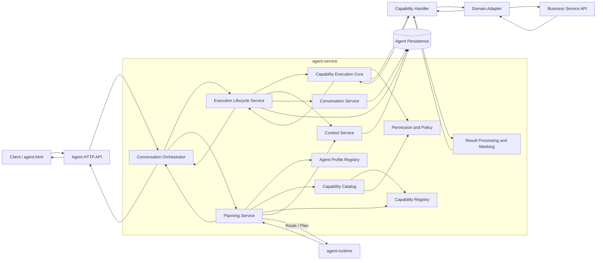
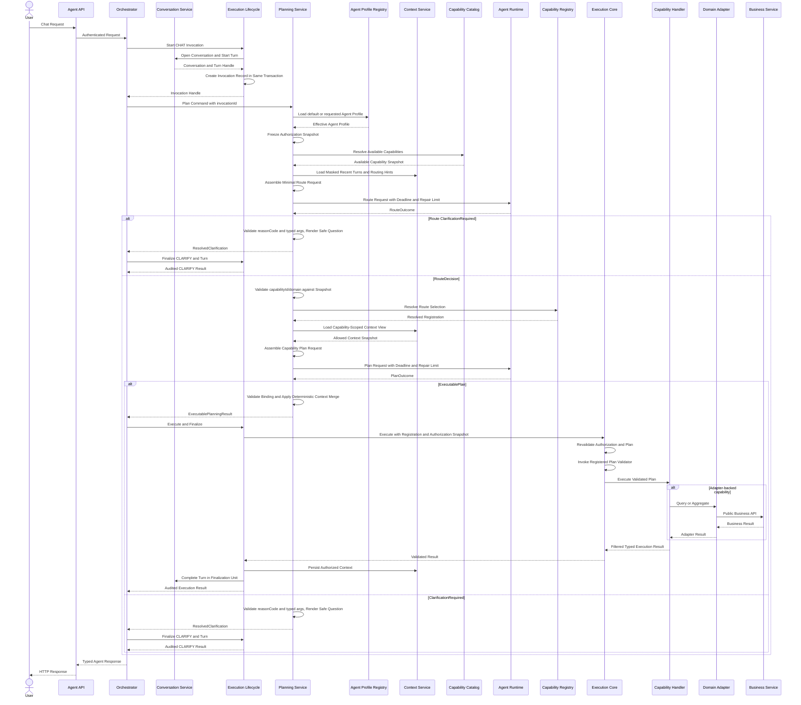
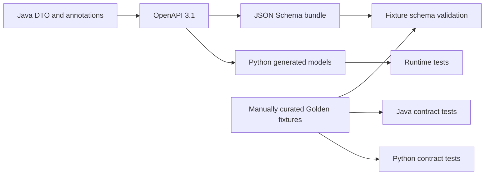
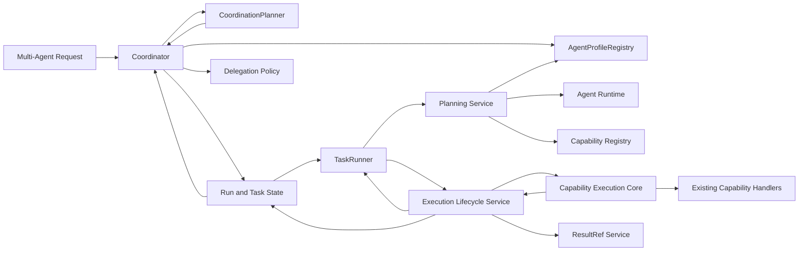

# Agent 目标架构与演进设计 v1.0

> 文档状态：拆分源材料（非权威）  
> 适用代码基线：`472373e` 及其后续同源提交  
> 适用范围：`agent-api`、`agent-service`、`agent-runtime`、`agent-adapter-api`、`agent-adapter-*`  
> 前提：系统尚未投产，目标状态不承担旧契约、旧配置和旧数据库结构的兼容责任  
> 替代关系：L0 权威基线已迁移至 `Agent目标架构总览_v1.0.md`  
> 文档职责：保留完整审计过程和拆分素材，供后续 L1/L2 文档提取；不再作为上位架构或直接编码基线

---

## 1. 文档定位

### 1.1 目的

本文定义 Agent 系统从当前 intent 驱动状态演进为 capability-first 架构的稳定目标，并规定后续 Multi-Agent 演进不能突破的边界。

本文重点回答：

1. 系统由哪些稳定概念构成。
2. Java、Runtime、Adapter 和业务服务分别负责什么。
3. 一次请求如何完成规划、校验、执行、持久化和响应。
4. Capability、Domain、Context、Agent Profile 和 Multi-Agent 如何组合。
5. 跨服务契约、权限和业务事实分别由谁维护。
6. 后续详细设计应按照什么依赖顺序展开。

### 1.2 与详细设计文档的关系

本文不再是后续设计的上位约束。目标分层、边界、概念和全局不变量以 `Agent目标架构总览_v1.0.md` 为准；本文中的协议、状态、事务、调用链和验收内容将按总览第 13 章拆分到对应 L1/L2 文档。拆分完成前，本文只能作为问题清单和素材来源，不能单独批准代码实施。

### 1.3 与原实施文档的关系

`Agent能力架构收敛与Multi-Agent演进实施设计_v1.0.md` 继续作为拆分素材和问题来源，不再作为直接编码基线。其内容将按本文第 18 章拆分为独立实施设计；拆分全部完成后，原文档标记为已替代。

---

## 2. 架构驱动因素

当前系统已经能够向 Runtime 下发 capability metadata，但能力选择、权限、Handler 路由、持久化和 Python 规划仍部分依赖 `AgentIntent`。随着 Domain 和能力数量增长，该状态会产生以下问题：

| 编号 | 架构问题 | 影响 |
|---|---|---|
| A-01 | intent 同时承担结构类型和能力主键 | 同一 plan 形态无法自然承载多个 capability |
| A-02 | Capability metadata 存在多个维护点 | Handler、Factory、Prompt 和配置容易漂移 |
| A-03 | Java/Python 契约依赖手工对齐 | 跨服务变更无法形成可靠门禁 |
| A-04 | Orchestrator 同时规划、路由和执行 | 执行内核无法被其他入口复用 |
| A-05 | Domain 字段语义在配置和 Adapter 重复 | Schema、校验与实际 mapper 能力可能不一致 |
| A-06 | Context 以查询专用字段持久化 | 无法支持多种能力上下文和版本演进 |
| A-07 | 历史上下文读取与当前 capability 绑定 | 规划前无法确定读取目标，且阻断跨 capability 继承 |
| A-08 | Multi-Agent 只描述协调器 | 缺少任务规划、执行、状态和结果传递闭环 |
| A-09 | 分模块切换跨服务契约 | 中间提交无法独立编译和运行 |
| A-10 | 统一响应和失败阶段语义不完整 | UI 契约漂移，权限失败时机与 Turn 终态容易被错误实现 |
| A-11 | 两阶段规划增加 Runtime 调用次数 | Route、Plan 和 repair 可能突破端到端超时预算 |

目标架构必须同时消除以上问题，而不是只完成类名或包结构替换。

---

## 3. 目标与非目标

### 3.1 目标

- 使用 `capabilityId` 统一能力注册、可用性、权限、路由、执行和已选能力审计归因；使用 `invocationId` 统一请求级审计。
- 使用 `planKind` 只表达 Plan 的结构形态。
- 使用 Planning Service 统一管理 Java 可见的 Route/Plan 两阶段规划。
- 使用 Java RouteOutcome/PlanOutcome 统一可继续规划、可执行计划和 ClarificationRequired。
- 建立可脱离聊天入口复用的 Capability Execution Core。
- 建立 Java 到 OpenAPI、JSON Schema 和 Python model 的单向结构契约链。
- 将 Domain 执行能力收敛到 Adapter metadata。
- 使用类型化、可版本化 Context Envelope 管理上下文。
- 让新增同类 capability 不修改 Orchestrator、执行内核和 Runtime 核心路由。
- 为 Multi-Agent 提供稳定的 Agent Profile、Task、TaskRunner、ResultRef 和统一执行边界。
- 使用 Agent Invocation Record 统一 CHAT 和 TASK attempt 从 Planning 到终结的审计。

### 3.2 非目标

- 本文不定义具体 Java 类、Python 函数和包路径。
- 本文不定义 POM、requirements、YAML 或 SQL 的具体内容。
- 本文不决定详细数据库字段长度和索引形式。
- 本文不实现写操作、审批、人工确认或工作流动作。
- 本文不选择具体 Multi-Agent 调度算法。
- 本文不引入 Runtime 直连数据库、业务服务、消息队列或工作流服务。
- 本文不要求 capability 动态注册或管理后台。

---

## 4. 核心概念

### 4.1 Capability

Capability 是可授权、可执行、可审计的原子业务能力，使用稳定的 `capabilityId` 标识，例如：

- `query.search`
- `query.preview`
- `aggregate.compute`

Capability 是以下行为的唯一主键：

- 注册和发现；
- 启停和授权；
- Runtime 可用能力目录；
- Handler 路由；
- 已选能力的审计归因；
- Context 来源；
- ResultRef 来源；
- Agent Profile 能力集合；
- 子任务委派范围。

澄清不是业务 Capability。`ClarificationRequired` 是 Runtime 的规划 outcome，由 Java 校验并转换为内部终态 `ResolvedClarification` 和 CLARIFY 响应，不注册 `clarify.ask`、Clarify Plan 或 Clarify Handler。

### 4.2 Plan Kind

Plan Kind 只描述 Plan 的结构形态和对应的规划策略，例如：

- QUERY
- AGGREGATE

多个 capability 可以共享同一个 Plan Kind。Plan Kind 不能作为权限、Handler Registry 或审计的主键。

### 4.3 Agent Plan

Agent Plan 是 Runtime 根据用户输入、可用 capability、Domain schema 和历史上下文生成的候选结构化计划。

Plan 必须包含：

- 契约版本；
- capabilityId；
- planKind；
- 符合 Domain Mode 的 domain；
- 与 planKind 对应的唯一类型化 payload。

Plan 是不可信输入。Java 必须重新校验 capability、类型、Domain、字段、操作符、权限和上下文规则后才能执行。

#### 4.3.1 Route Outcome 与 Plan Outcome

Runtime Route 和 Plan 操作都返回由 Java 定义的封闭类型联合：

```text
RouteOutcome
  = RouteDecision
  | ClarificationRequired

PlanOutcome
  = ExecutablePlan
  | ClarificationRequired
```

两个联合的所有 variant 都携带公共 `RuntimeOperationMetadata`，包含 repairCount、repairDuration 和 terminationReason；业务 outcome 与运行遥测不使用平行响应类型。

- `RouteDecision` 只包含候选 capabilityId、domain 和必要置信信息，不包含 planKind 或业务 Plan；planKind 由 Java 从 Registration 解析。
- `ExecutablePlan` 包含与 RouteDecision 一致的 Agent Plan。
- `ClarificationRequired` 包含 Java 枚举定义的 reasonCode、与 reasonCode 匹配的类型化 ClarificationArgs 和必要关联标识，不包含 Runtime 自由文本，不是 Capability、Agent Plan 或可执行命令。ClarificationArgs 只能使用 Java 契约允许的字段，例如 candidateDomains、missingFieldKeys、expectedValueType 或 allowedValues。
- `ResolvedClarification` 是 Agent Service 内部的终态 Planning Result，包含已校验 reasonCode/ClarificationArgs、已发生 Route/Plan 的 RuntimeOperationMetadata 和 Java 模板生成的 question；它不是 Runtime HTTP 响应类型。

Route 或 Plan 返回 `ClarificationRequired` 后，Planning Service 不再次调用 LLM，也不进入 Execution Core。Java 必须校验 reasonCode、ClarificationArgs 的 subtype/字段/值域，并确认其中的 domain/field/value 候选均属于 Authorization Snapshot 可见范围，再使用 Java 管理的安全模板生成 `ResolvedClarification`；reasonCode、args、授权范围或模板不合法时 Planning 失败。Route 阶段不解析 Capability Registration；Plan 阶段可以保留此前已解析的 Registration 作为审计来源。Runtime 不得直接提供绕过模板的最终 question。

RouteOutcome 为 `ClarificationRequired` 时跳过 Context 加载和 Plan Runtime 调用；PlanOutcome 为 `ClarificationRequired` 时结束 Planning。Route/Plan 的 capabilityId 和 domain 一致性只约束 `RouteDecision + ExecutablePlan` 路径；ExecutablePlan 的 planKind 必须与 Resolved Registration 一致。

### 4.4 Capability Definition

Capability Definition 是代码级静态事实，描述：

- capabilityId；
- planKind；
- 输入和输出契约；
- 风险与执行模式；
- Domain Mode；
- Domain Mode 非 NONE 时所需的 Adapter Role；
- Context 读写声明。

Definition 的输入、输出和 Context 结构只能保存指向 `agent-api` Java Schema 的 `ContractRef`，不得复制字段、枚举、required/nullable 或约束正文。Definition 由 Capability Registration 提供，是 Runtime descriptor 和执行路由的静态来源；一旦注册，运行期间不可变。

### 4.5 Capability Registration

Capability Registration 是 Agent Service 内部可执行能力的不可变注册单元，由以下内容组成：

```text
Capability Registration
  = Capability Definition
  + Agent Plan subtype
  + Capability Plan Validator
  + Validated Plan type
  + Capability Handler
  + controlled type bridge
```

Registration 负责把静态描述、`CapabilityPlanValidator<RawPlan, ValidatedPlan>` 与实际执行入口绑定。Registry 以 capabilityId 保存 Registration，并在启动阶段验证 Definition、Plan subtype、Validator 输入/输出、Validated Plan type 和 Handler 输入类型一致。Handler 只接收 Validated Plan，不负责解析或信任 Runtime 原始 Plan。

Registration 不作为跨服务 DTO 发送给 Runtime；Runtime 只接收由 Registration 投影得到的请求级 Capability Descriptor。Java 类型擦除所需的受控类型转换只能封装在 Registration 内部。

当 Definition 的 Domain Mode 非 NONE 时，Registration 必须通过 Definition 的 Adapter Role 与对应 Adapter SPI Registration 建立通用关联。Capability Catalog 只能按 Adapter Role、Domain 和策略计算可用范围，禁止按具体 capabilityId 编写 Query/Aggregate 分支。

### 4.6 Agent Policy Configuration

Agent Policy Configuration 是部署级限制的唯一配置源，按 capability、domain 和 profile 分区保存：

- policyVersion：每次有效策略变更必须递增；
- Capability Policy：是否启用、允许角色和部署限制；
- Domain Policy：访问角色、字段 filter/display、mask 和默认展示字段；
- Profile Policy：Profile 是否可见、部署级最大预算和其他只能收紧的限制。

以上 Policy 只是同一配置聚合的类型化投影，不是独立配置文件或事实源。Profile Policy 不能重新声明 capability、Prompt、Context 或委派策略；Policy 不能覆盖 Definition、Canonical Domain Field Catalog 或 Agent Profile Definition 的结构事实，也不能声明不存在的 capability、domain 或 profile。

### 4.7 Available Capability

Available Capability 是请求级结果，由以下集合取交集得到：

```text
Registered Capability
∩ Enabled Policy
∩ User Permission
∩ Effective Agent Profile Capability Set
∩ Domain Availability Predicate
= Request Available Capability
```

Runtime 只接收请求级可用结果，不接收被禁用或无权使用的 capability。

Domain Availability Predicate 按 Domain Mode 计算：NONE 恒为真；REQUIRED 必须至少存在一个同时满足 Adapter Role、Domain Policy 和用户权限的 domain；OPTIONAL 即使没有 domain 仍可保留能力，但任何非空 domain 都必须满足相同交集。

### 4.8 Domain Mode

Capability 对 domain 的要求使用三态模型：

| Domain Mode | 语义 | 校验规则 |
|---|---|---|
| NONE | 能力与业务域无关 | Plan 不得携带 domain |
| OPTIONAL | 能力可以引用业务域 | domain 可空；非空时必须在授权范围内 |
| REQUIRED | 能力必须绑定业务域 | domain 必填且必须在授权范围内 |

QUERY 和 AGGREGATE 通常为 REQUIRED；与业务域无关的系统能力使用 NONE。禁止使用 boolean 表达三态语义。

#### 4.8.1 Adapter Role

Adapter Role 是 `agent-adapter-api` 中定义的内部 Java 执行端口标识，例如 `queryable`、`aggregatable`。它不等同于 capabilityId、planKind 或 domain：Capability Definition 声明所需 Role，具体 Adapter SPI Registration 声明自身 Role、domain 和 canonical Field Catalog，Capability Catalog 对二者执行通用关联。

Domain Mode 为 NONE 的 Capability 不声明 Adapter Role；当前目标中的 Domain-bound 原子 Capability 只声明一个 Role。未来确需组合多个执行端口时必须单独评审，不在 Catalog 中增加隐式多 Role 推断。

### 4.9 Agent Profile

Agent Profile 是 Agent 的能力和行为边界，至少包含：

- agentId；
- profileVersion；
- capabilityId 集合；
- Prompt 策略；
- Context 策略；
- 预算和委派策略。

Agent Profile 只能缩小用户已有权限，不能扩大用户权限。多个 Agent 可以复用同一 capability。

AgentProfileRegistry 是 Agent Profile Definition 的唯一权威来源。有效 Profile 必须按以下规则计算：

```text
Effective Profile Scope
  = Agent Profile Definition
  ∩ Profile Deployment Restriction
  ∩ Optional Delegation Scope

Effective Budget
  = min(Profile Budget, Deployment Limit, Run/Task Limit, Optional Caller Limit)
```

Profile Deployment Restriction 只能收紧 Definition；CHAT 中不适用的 Delegation Scope 按全集处理，不存在的 Run/Task/Caller Limit 按无穷大处理。Capability v2 首次切换时必须提供最小 AgentProfileRegistry，其中只有一个不可变的 `default` Agent Profile，不引入数据库或管理后台。Multi-Agent 阶段只扩展多 Profile、持久化、委派和动态选择，不重新定义 Profile 语义或替换 Registry 接口。

#### 4.9.1 Authorization Snapshot

Authorization Snapshot 是 Planning 开始时固化的请求级授权证据，至少包含 user/owner、agentId/profileVersion、policyVersion、可选 delegationVersion、允许的 capability/domain/field/context 范围、Invocation Scope 和 absoluteDeadline。

Snapshot 不是长期授权票据，不能绕过 Execution 阶段复检。Execution Core 必须比较当前授权与 Snapshot：Profile/Policy/Delegation version 不匹配时 fail closed；版本一致时使用 `Snapshot Scope ∩ Current User Permission` 重新验证，授权撤销或 Plan/Context 超出交集时拒绝执行。

### 4.10 Capability Context

Capability Context 是成功执行后产生、供后续规划或执行读取的类型化状态。

Context 必须具备：

- context type；
- context version；
- source capabilityId；
- source invocationId 和 turn/task；
- owner 和 invocation scope；
- 类型化 payload。

Context 的读取以 context type 和允许的来源 capability 集合为条件，不以当前尚未确定的 capabilityId 为唯一查询条件。

Invocation Scope 使用封闭联合 `ConversationScope | RunScope`：CHAT Context 使用 conversationId，独立 Multi-Agent Task Context 使用 runId。Context 必须最小化保存、加密存储、设置 TTL，并随 Conversation/Run 的清理策略删除；不得保存凭据、完整业务结果或 ResultRef 可替代的大对象。

### 4.11 ResultRef

ResultRef 是跨 Agent、跨 Task 传递结构化结果的受控引用。它保存结果标识、所有者、来源 Invocation、schema、Run Scope、有效期和访问边界，不直接把大对象嵌入自然语言上下文。ResultRef 指向的数据必须是已过滤和脱敏结果，并遵守加密、TTL、撤销和 Run 清理策略。

### 4.12 Agent Response

Agent Response 是 Agent API 返回给客户端的统一类型化响应外壳，稳定表达：

- conversationId、turnId 和 invocationId；
- 已选定时的 capabilityId 和 planKind；
- response type；
- 用户可读 message 和 summary；
- 与 response type 匹配的类型化 payload；
- 失败时的安全 error code。

响应不变量：

- SUCCESS 必须包含类型化成功 payload，error code 为空；
- CLARIFY 必须来自 Java 已形成的 ResolvedClarification，包含 reasonCode、类型化 ClarificationArgs 和 Java 模板生成的 question，不伪造 capability 或业务结果；
- ERROR 的业务 payload 为空，error code 非空；
- 在 capability 尚未选定前失败时，capabilityId 和 planKind 可以为空；
- capabilityId 和 planKind 只要非空，就必须来自 Java 已解析的 Registration，不能采用 Runtime 或 Handler 返回的自由字符串；Route 阶段 CLARIFY 二者为空，Plan 阶段 CLARIFY 可以记录已选 Registration；
- message、summary 和 payload 在返回前必须经过同一字段过滤和脱敏边界。

Agent Response 的结构由 agent-api Java 契约定义。UI 只消费统一响应，不根据旧版顶层专用字段推断能力类型。

### 4.13 Planning Service

Planning Service 是 `agent-service` 内部的应用层规划组件，不是独立部署的微服务。它是 Planning 用例的唯一所有者，负责把经过认证的用户请求转换为 Java 可继续校验和执行的候选 Plan，或形成 ResolvedClarification 终态。

Planning Service 负责：

- 计算请求级 Available Capability Snapshot；
- 固化本次 Planning 使用的 Authorization Snapshot，包括 user/owner、Profile/Policy version、Delegation Scope 和请求 deadline；
- 组装最小化 Routing Context；
- 调用 Runtime Route 操作；
- 解析 Java 契约定义的 RouteOutcome；
- 对 ClarificationRequired 校验 reasonCode/ClarificationArgs 并使用 Java 安全模板形成 ResolvedClarification；
- 对 RouteDecision 校验并解析 Capability Registration；
- 根据选定 Capability Registration 加载允许的 Context；
- 组装 Capability Plan Context；
- 调用 Runtime Plan 操作并解析 Java 契约定义的 PlanOutcome；
- 对 ExecutablePlan 校验 Route 与 Plan 的 requestId、capabilityId、domain 一致性，并校验 planKind/subtype 与 Resolved Registration 一致；
- 对 Plan 阶段 ClarificationRequired 执行相同的 Java reasonCode/ClarificationArgs/template 终结处理；
- 执行 MERGE/REPLACE 等确定性 Context 合并并重新校验；
- 在调用方总 deadline 内分配 Route、Plan 和 Runtime 内部 repair 预算；
- 返回封闭的 Planning Result：ExecutablePlanningResult 或 ResolvedClarification。ExecutablePlanningResult 包含不可变 Resolved Registration、Agent Plan、Context Snapshot、Authorization Snapshot 和 Route/Plan RuntimeOperationMetadata。

Planning Service 不负责：

- 创建、完成或持久化 Turn；
- 调用 Handler、Adapter 或业务服务；
- 字段、operator 和业务语义的最终校验；
- 最终执行权限判断；
- 结果过滤、脱敏和持久化。

Orchestrator 管理 Conversation/Turn 用例，Planning Service 管理规划流程，Execution Lifecycle Service 管理执行记录和原子终结，Capability Execution Core 管理可信执行流程。四者不得互相复制职责。

### 4.14 Agent Invocation Record

Agent Invocation Record 是 Turn/Task Attempt 从开始 Planning 到执行或澄清终结的唯一审计事实；即使最终未选定 capability，也记录该次 invocation 的规划结果。聊天 Turn 和 Multi-Agent Task Attempt 都必须引用它：

```text
Agent Turn ──────────┐
                     ├→ Agent Invocation Record
Agent Task Attempt ──┘
```

invocationId 是可安全用于 API、Runtime 和日志关联的不可预测不透明标识，不得使用自增数据库主键或编码 owner/tenant 信息。

Invocation Record 稳定表达 invocation type、user/agent、conversation/turn、run/task/attempt、capabilityId、planKind、planning outcome、Route/Plan RuntimeOperationMetadata、状态、response type、Authorization Snapshot version、Context、ResultRef、error code 和时间信息。在 Route 尚未选定 capability 或直接返回 ClarificationRequired 时，capabilityId 和 planKind 允许为空；选定后只能来自 Resolved Registration。

Invocation Record 状态至少包含 PROCESSING、COMPLETED、FAILED、CANCELLED；SUCCESS 和 CLARIFY 都以 COMPLETED 终结，由 response type 区分是否执行了业务 Capability。

Execution Lifecycle Service 是 Invocation 开始和终结的唯一协调者：开始时以单事务创建 Turn/Task Attempt 与 Invocation Record；成功、澄清、失败或取消时以单事务协调已过滤结果、Context、ResultRef、Invocation Record 终态以及所属 Turn/Task Attempt 的 CAS 终态。Capability Execution Core 只执行授权复检、Validator 和 Handler，不直接持久化审计、Context 或 ResultRef。

首个目标版本要求 Invocation Record、Turn/Task Attempt、Context 和 ResultRef 位于同一 Agent 数据库并使用本地事务，不预设 outbox。未来确需拆分存储时，必须通过独立 ADR 定义 PENDING 响应、outbox、幂等消费者和恢复语义；异步终结完成前不得返回 SUCCESS。ResultRef Service 只执行 ResultRef 的保存、读取和 owner/schema/TTL 校验，不反向推进 Invocation Record、Task 或 Run。

Agent Turn 只表达用户对话轮次，Task Attempt 只表达任务尝试；二者以 invocationId 关联 Agent Invocation Record。允许保存只读查询投影，但 Agent Invocation Record 始终是权威来源，投影不得独立更新或参与执行判断。

### 4.15 Run、Task、CoordinationPlanner 与 TaskRunner

- Run 表示一次 Multi-Agent 协作过程。
- Task 表示可调度、可重试、可审计的工作单元。
- CoordinationPlanner 负责根据 Run 目标提出 Task Graph，不执行 Capability。
- TaskRunner 负责把 Task instruction 和输入 ResultRef 交给统一 Planning Service，并通过 Execution Lifecycle Service 进入 Capability Execution Core；TaskRunner 不自行持久化结果或推进执行终态。
- Coordinator 负责调用 CoordinationPlanner、校验 Task Graph、管理依赖、预算、调度和汇总，不直接执行业务能力。

---

## 5. 核心架构决策

### AD-01：capabilityId 是能力主键

所有已选能力级行为必须使用 capabilityId；尚未选定能力的 Planning/Clarification 审计使用 invocationId。`AgentIntent` 不进入目标架构；planKind 不能替代 capabilityId。

结果：同一个 QUERY 结构可以注册多个拥有独立权限、描述和 Handler 的 capability。

### AD-02：结构契约由 Java 单向生成

跨 Java/Runtime 的请求、响应、RouteOutcome、PlanOutcome、Plan、Context 和 ResultRef 结构以 Java DTO 为源，通过 OpenAPI 3.1 和 JSON Schema 生成 Python model。

Python model、Runtime 内部状态和 Prompt 都不得复制结构枚举、capabilityId、planKind、字段、operator、版本、required/nullable 或 JSON shape。Prompt 只保存行为规则；结构信息必须由 generated artifact 或请求级 descriptor/schema 注入。生成结果不得执行语义性文本补丁。

### AD-03：结构事实、执行事实和策略事实分离

| 事实 | 唯一来源 |
|---|---|
| 跨服务结构契约 | agent-api Java DTO |
| Capability 静态 metadata | Capability Registration |
| Domain 字段执行能力和稳定规划语义 | Canonical Domain Field Catalog |
| Agent Profile Definition | AgentProfileRegistry |
| 启停、访问角色、脱敏和 Profile 部署限制 | Agent Policy Configuration |
| 请求级可用性 | Capability Catalog 计算结果 |
| 请求级授权证据 | Authorization Snapshot（由 Planning Service 从权威来源计算） |
| 最终执行结论 | Java Validator + Execution Core |
| Agent invocation 审计 | Agent Invocation Record |

任何详细设计不得重新增加平行事实来源。

### AD-04：Planning 与 Execution 分离

Planning 负责生成候选 Plan；Execution 负责把已解析 capability 和 Plan 校验后执行。

Planning Service 是 Planning 的唯一应用层入口。聊天 Orchestrator 和 Multi-Agent TaskRunner 复用同一 Planning Service、Execution Lifecycle Service 与 Execution Core。上层只调用 Execution Lifecycle Service 暴露的统一执行/终结入口，不直接跨过它调用 Execution Core。Orchestrator、Coordinator 和 TaskRunner 均不得复制 Runtime 编排、执行审计、结果持久化或 Handler 调用逻辑。

### AD-05：类型桥只存在于注册边界

Capability Registration 必须把 plan subtype、Capability Plan Validator、validated model 和 Handler 绑定为一个不可变注册项。

Registry 对外返回可执行的 resolved registration。Execution Core 不直接操作裸 wildcard Handler，也不在多个调用点使用 unchecked cast。若 Java 类型擦除要求受控桥接，该桥只能存在于注册项内部，并通过启动校验保证类型一致。

### AD-06：Runtime 不在信任边界内

Runtime 可以推荐 capability、domain 和参数，但不能决定：

- 用户身份；
- 权限；
- 字段可见性；
- 风险结论；
- 是否允许执行；
- 业务数据真实性。

### AD-07：跨服务契约切换采用纵向原子变更

破坏性契约切换不能按 Java、Python、数据库分别交付。一个切换单元必须同时完成发送端、接收端、生成模型、执行链、持久化、fixture 和测试。

可以先交付不改变线上契约的生成基础设施，但最终 v2 切换必须作为一个可编译、可运行、可回退的纵向变更。

因此实施路线把“Capability Kernel 目标设计”和“跨服务切换设计”拆成两个详细设计文档，但二者共享一个代码实施与合并门禁。仓库中不建立可运行的 v1/v2 双协议、双 generated model 或转换层；目标代码只在全部链路完成后一次合并。

### AD-08：Multi-Agent 不创建第二套执行框架

Multi-Agent 只新增 Profile、Run、Task、CoordinationPlanner、TaskRunner、Coordinator、Delegation、ResultRef 和调度状态，不新增业务 Handler 体系，不允许 Coordinator 直接调用 Adapter。

Coordinator 通过 CoordinationPlanner 获得候选 Task Graph。CoordinationPlanner 可以采用确定性 Strategy；需要外部 LLM/规则服务时，可在其内部使用专用 Adapter/Port，但不增加所有实现都必须穿越的公共层。其输出只是候选任务结构，必须由 Java 的 DelegationPolicy、预算、深度和 capability scope 校验后才能持久化和调度。

### AD-09：Capability Context 采用两阶段规划隔离

Planning 必须具有 Java 可见的 Route 和 Plan 两个阶段：

1. Route 阶段只使用最小化 Routing Context，选择 capabilityId 和候选 domain。
2. Java 校验并解析 Capability Registration，由 Registration 确定 planKind。
3. Java 只加载该 capability 明确允许读取的 Context。
4. Plan 阶段基于选定 capability、允许 Context 和目标 Domain Schema 生成 PlanOutcome。
5. Route 或 Plan 返回 ClarificationRequired 时，由 Java 形成 ResolvedClarification/CLARIFY 终态；不转换为 Capability 或可执行 Plan。

两个阶段可以由同一 `agent-runtime` 部署和同一 Runtime Client 承载，但不能封装成 Java 无法介入的单次黑盒规划调用。

### AD-10：两阶段规划共享一个总预算

Planning Service 必须从调用方接收单次规划绝对 deadline，并为 Route、Plan 分配 Runtime 内部 repair 上限。Route/Plan Request 必须携带 absoluteDeadline 和 maxRepairAttempts；Runtime 在单次操作内部执行有界 repair，并在响应 metadata 中返回 repairCount、repairDuration 和 terminationReason。Java 不发起独立 repair 往返，Route、Plan 也不得各自重新获得完整超时时间；ClarificationRequired 终结处理不得增加新的 LLM 调用。

超时、取消和客户端断开必须沿 Planning Service → Runtime Client 传播。任何阶段耗尽总预算后立即终止后续 Runtime 调用，不进入 Adapter。

---

## 6. 总体架构



关键约束：

- Client 只访问 Agent API。
- Runtime 只接收规划所需的最小信息，不接收 JWT 和权限表达式。
- Agent Service 是权限、验证、执行和审计边界。
- Planning Service 是 Route 和 Plan 两阶段调用的唯一所有者。
- Execution Lifecycle Service 是聊天和 Task invocation 执行审计与终结的统一入口。
- Route/Plan 的 ClarificationRequired 由 Planning Service 转换为 ResolvedClarification，并由 Execution Lifecycle Service 直接闭环，不进入 Execution Core。
- Adapter 只通过业务 API 调用下游服务。
- 业务服务保持数据和业务规则的最终权威。

---

## 7. 模块职责和依赖边界

| 模块 | 核心职责 | 明确禁止 |
|---|---|---|
| agent-api | 跨服务结构契约和枚举 | Spring 业务逻辑、Adapter、权限实现 |
| agent-runtime | 自然语言理解、路由建议、Plan 生成和 repair | JWT、数据库、业务 Client、最终权限判断 |
| agent-service | 会话、Catalog、权限、最终校验、执行、持久化和审计 | 复制下游业务逻辑、按固定 Domain 编写核心路由 |
| agent-adapter-api | Domain Adapter SPI、Adapter Role、validated execution model 和 metadata 类型契约 | Runtime DTO、Spring Service 依赖、具体 Domain metadata 实例、具体业务 Client |
| agent-adapter-* | Domain 映射、业务 API 调用和响应解析 | 绕过 validated model、直连业务数据库 |
| downstream service | 数据查询、聚合和业务规则 | 依赖 Agent 内部模型 |

### 7.1 允许的依赖方向

```text
agent-service
  ├─depends on→ agent-api
  ├─depends on→ agent-adapter-api
  └─composition root depends on→ agent-adapter-*
                                      ├─depends on→ agent-adapter-api
                                      └─depends on→ downstream public API contracts

agent-adapter-api ─depends on→ agent-api
agent-runtime ─generated from→ agent-api contract artifacts
```

具体 Adapter 可以依赖 `agent-adapter-api` 和下游公开 API，但 `agent-adapter-api` 不得反向依赖 `agent-service`。新增 Domain 允许修改具体 Adapter 模块、策略配置、根模块清单和 `agent-service` composition root/POM 以装配新模块；不得修改 Orchestrator、Planning Service、Capability Catalog 算法、Execution Core 或 Runtime 核心 graph。

---

## 8. Capability Metadata 生命周期

### 8.1 启动阶段

1. Spring 收集 Capability Registration。
2. Registry 校验 capabilityId 唯一。
3. Registry 校验 planKind、plan subtype、Capability Plan Validator 输入/输出、validated type、Handler 输入和 Definition 绑定一致。
4. Domain Catalog Registry 校验每个 Domain 只有一个 canonical Field Catalog；各 Adapter SPI Registration 必须引用该 Catalog 并声明 Adapter Role。
5. Registry 校验所有 Domain Mode 非 NONE 的 Capability Definition 都能按 Adapter Role 关联到兼容的 Adapter SPI Registration。
6. Policy Validator 校验唯一 Agent Policy Configuration 中 capability、domain 和 profile 引用均存在。
7. AgentProfileRegistry 校验 `default` Agent Profile 及其他 Profile 的 capabilityId 均已注册；Policy Validator 校验 Profile Policy 只能收紧 Definition。
8. Contract Gate 校验所有 input/output/context ContractRef 可从 agent-api Java 生成的 Schema 中解析。
9. 任一不一致导致启动失败，不允许降级为部分注册。

### 8.2 请求阶段

1. 从认证上下文取得用户身份和角色。
2. Execution Lifecycle Service 以单事务创建 Turn/Task Attempt 与关联 Agent Invocation Record；任一创建失败则整体回滚。
3. 加载目标 Agent Profile，并与 Profile Policy 和可选 Delegation Scope 形成 Effective Profile。
4. 固化 Authorization Snapshot，过滤未启用和无权 capability。
5. 根据 Domain Adapter 可用性计算每项 capability 的 Domain 范围。
6. 生成仅包含当前请求可用能力的 Runtime descriptor。
7. 组装不含完整 Capability Context 的最小化 Routing Context。
8. 调用 Runtime Route 操作并解析 Java 契约定义的 RouteOutcome；请求携带 absoluteDeadline 和 maxRepairAttempts，响应必须返回 repair metadata。
9. 若为 ClarificationRequired，Java 校验 reasonCode/ClarificationArgs、生成安全 question 并形成 ResolvedClarification，不加载 Context、不调用 Plan Runtime。
10. 若为 RouteDecision，Planning Service 校验 capabilityId/domain 与 Available Capability Snapshot 一致，Registry 解析唯一 Resolved Registration 和 planKind。
11. 按 Registration、Effective Profile、可选 Delegation Constraint 和 Invocation Scope 的权限交集加载 Context View。
12. Domain Mode 非 NONE 时，根据 Definition 的 Adapter Role，只为选定 capability 和候选 domain 生成 Plan 阶段 Domain Schema；NONE 不生成业务 Domain Schema。
13. 调用 Runtime Plan 操作并解析 PlanOutcome；请求和响应采用与 Route 相同的 deadline/repair 协议。
14. ExecutablePlan 由 Planning Service 校验 Agent Plan 与 RouteDecision/Resolved Registration 一致并执行确定性 Context 合并；ClarificationRequired 由 Java 校验 reasonCode/ClarificationArgs 并形成 ResolvedClarification。
15. Planning Service 返回 ExecutablePlanningResult 或 ResolvedClarification；调用方统一交给 Execution Lifecycle Service。

### 8.3 执行阶段

1. Execution Lifecycle Service 为既有 CHAT/TASK Invocation Record 关联 Planning Result。
2. ResolvedClarification 直接形成 CLARIFY 终态，不调用 Execution Core、Handler 或 Adapter。
3. ExecutablePlanningResult 携带 Planning 阶段已解析的不可变 Resolved Registration、Context Snapshot 和 Authorization Snapshot；执行阶段不重复查询 Registry。
4. Execution Core 校验 planKind、plan subtype、Domain Mode、Resolved Registration 和 Authorization Snapshot 完整性。
5. 复检当前 capability、domain、field、Context、Profile 和 Delegation 权限；Profile/Policy/Delegation version 不匹配或 Plan 超出 `Snapshot Scope ∩ Current User Permission` 时 fail closed。
6. 通过 Registration 绑定的 Capability Plan Validator 将不可信 Plan 转换为 validated execution model。
7. 调用 Handler；需要业务访问时再调用 Adapter。
8. 校验 Handler 输出类型和 Context 声明。
9. Execution Lifecycle Service 以 Agent 数据库本地事务闭环结果、Context/ResultRef、Invocation Record 和 Turn/Task Attempt 终态。
10. 返回带 invocationId 的类型化结果。

---

## 9. 单 Agent 主调用链



### 9.1 生命周期责任

- Orchestrator 负责 Conversation 和 Turn 生命周期。
- Planning Service 负责 Available Capability、Route、Capability Context、Plan 和 Planning Result 的完整规划编排。
- Routing Context 和 Capability Plan Context 的组装是 Planning Service 的内部实现职责，不形成独立架构层。
- Registry 负责解析注册事实，不执行权限和业务调用。
- Execution Lifecycle Service 负责原子创建 Turn/Task Attempt 与 Agent Invocation Record，并作为唯一终结者协调结果、Context/ResultRef、Invocation Record 和 Turn/Task Attempt 的一致终态。
- Execution Core 负责最终权限、验证和 Handler 调用。
- Capability Plan Validator 负责把不可信 Raw Plan 转换为 Validated Plan；Handler 只负责单一 capability 的业务执行编排。
- Adapter 负责 Domain 模型到下游 API 的转换。
- Conversation Service 负责 Conversation/Turn 数据操作；何时开始和终结由 Orchestrator 发起，开始与终结写入由 Execution Lifecycle Service 协调。Context 的执行来源由 Agent Invocation Record 唯一确定。

### 9.2 失败闭环

失败处理必须区分 Turn 创建前后和权限校验发生阶段：

- HTTP 反序列化、Bean Validation、认证或 Agent Access 校验失败：不创建 Turn，直接返回安全错误响应。
- Turn 与 CHAT Invocation Record 必须由 Execution Lifecycle Service 原子创建；任一失败整体回滚。Available Capability 为空或 Catalog 前置权限失败时，两者进入 FAILED，不调用 Runtime 和 Adapter。
- Route/Plan Runtime 超时、协议错误或输出不可解析：Turn 进入 FAILED，Invocation Record 进入 FAILED，不调用 Adapter。
- Route/Plan 返回合法 ClarificationRequired：Turn 进入 SUCCEEDED，Invocation Record 进入 COMPLETED，response type 为 CLARIFY，返回 Java 模板生成的问题，不调用 Execution Core、Handler 或 Adapter。
- Route 后或 Execution 前授权复检失败：Runtime 可能已经调用，但不得调用 Adapter；Turn 和 Invocation Record 进入 FAILED。
- Plan、Domain、字段或 operator 最终校验失败：不得调用 Adapter；Turn 和 Invocation Record 进入 FAILED。
- Adapter 或下游业务失败：Turn 和 Invocation Record 进入 FAILED，不产生可继承 Context 和 ResultRef。
- Invocation Record、Context/ResultRef 或 Turn/Task Attempt 的终结持久化/CAS 失败：同一事务整体回滚，不能向用户声明成功，并记录诊断标识。

一旦 Turn 成功创建，流程必须尝试把它推进到 SUCCEEDED、FAILED 或 CANCELLED。客户端取消且已成功传播时，Turn 与 Invocation Record 进入 CANCELLED；进程崩溃等无法同步收口的场景由超时恢复机制处理，不能长期保留无主处理中状态。

Agent Invocation Record 创建后必须进入明确终态。Turn 或 Task Attempt 只有在关联 Invocation Record 完成后才能宣告成功；重试必须创建新的 attempt 和 Invocation Record，不得覆盖失败历史。

---

## 10. Context 读取与继承链

Capability Context 具有 capability 级读取边界。为了保证 Runtime 在能力确定前看不到无权 Context，Planning 使用 Java 可见的两阶段流程。

### 10.1 Route 阶段

Route 阶段只使用最小化 Routing Context，由 Planning Service 内部完成组装：

- 当前用户消息；
- 已经过滤和脱敏的最近对话；
- 当前请求可用 capability descriptor；
- domain 名称、别名和可用性摘要；
- 上一轮 capabilityId、planKind、domain 等非业务结果路由提示；
- requestId、invocationId、agentId，以及 CHAT 的 turnId 或 TASK 的 runId/taskId/attemptId 等必要关联标识。

Route 阶段禁止发送：

- 完整 Capability Context payload；
- 历史结构化查询条件；
- ResultRef 指向的完整业务结果；
- ownerUserId、内部数据库主键和权限表达式。

Runtime 返回 RouteOutcome 后，Planning Service 先处理 ClarificationRequired；仅 RouteDecision 路径在 Java 中验证 capabilityId、domain 和 Available Capability Snapshot，并解析出 Selected Registration，由 Registration 确定 planKind 和 Domain Mode。

### 10.2 Plan 阶段

Selected Registration 确定后执行：

```text
Selected Registration
  → 读取 Registration Context Read Policy
  → 与 Effective Agent Profile Context Policy 求交集
  → 与 User Permission 求交集
  → 与 Optional Delegation Constraint 求交集（CHAT 为全集）
  → 应用 owner、Invocation Scope、version 和 TTL 约束
  → 计算最终允许的 Context Type 和 source capability 集合
  → 按 owner、ConversationScope/RunScope、type、version、source set 加载最新有效 Context
  → 将持久化 Context Envelope 投影为最小化 Runtime Context View
  → 根据 Capability Definition 的 Adapter Role 生成选定 capability/domain 的完整 Domain Schema
  → Runtime Plan 操作生成 PlanOutcome
  → ExecutablePlan：Java 校验 capabilityId/domain 与 RouteDecision 一致、planKind/subtype 与 Registration 一致
  → ClarificationRequired：Java 校验 reasonCode/ClarificationArgs 并形成 ResolvedClarification/CLARIFY 终态
  → ExecutablePlan 路径执行 MERGE/REPLACE 等确定性规则
```

### 10.3 Context 不变量

- Context 必须来自 response type=SUCCESS 且 Capability 执行完成的 Invocation；CLARIFY 即使 Turn 为 SUCCEEDED 也不能产生 Context。
- FAILED/CANCELLED 结果不能成为可继承 Context。
- 持久化 Context Envelope 保存 owner、Invocation Scope、source、version 和 TTL；Runtime Context View 不发送无关内部标识。
- 有效 Context 读取范围始终是 Registration、Effective Profile、User Permission、可选 Delegation Constraint 和 owner/InvocationScope/version/TTL 约束的交集；适用约束明确拒绝或交集为空时拒绝读取，不适用约束使用全集。
- `query.preview` 等同类 capability 只有在 Registration 显式允许时才能读取 `query.search` 产生的 Query Context。
- Runtime 只能建议 REPLACE/MERGE，合并和重新校验由 Java 确定性执行。
- 新 Context Type 不能复用旧类型并依赖 JSON 猜测。
- 两阶段可以复用同一 Runtime 进程和连接池，但 Java 必须能够在两个阶段之间执行 Registration 解析和 Context 授权。
- Task 间显式业务结果传递必须使用 ResultRef；Context 只保存小型规划状态，不以“最新 Task Context”隐式替代 Task Graph 的依赖输入。

---

## 11. Domain Metadata 投影链

### 11.1 单一事实来源

每个 Domain 只有一个 canonical Domain Field Catalog，保存该 Domain 的可执行事实：

- domain 名称、稳定别名和非敏感描述；
- 字段名称和类型；
- 字段稳定别名、非敏感描述、单位和枚举/值语义；
- 按 Adapter SPI/能力角色划分的可用 operator；
- 按 Adapter SPI/能力角色划分的聚合函数；
- 格式、时区和数值精度；
- Adapter 是否真正能够完成映射。

Queryable、Aggregatable 等 Adapter SPI Registration 不得各自复制 Field Catalog，也不得重新声明 operator/function 列表。它们只引用同一 canonical Catalog、domain 和自身 Adapter Role；Catalog 中对应角色的能力集合就是该 Adapter 必须实现的完整集合。Capability Definition 通过相同 Adapter Role 与这些 Registration 建立通用关联。

唯一 Agent Policy Configuration 的 Domain Policy 分区保存运行策略：

- Domain access roles；
- filter/display roles；
- mask；
- default select fields。

### 11.2 投影过程

```text
Canonical Domain Field Catalog
  + Capability Definition Required Adapter Role
  + Matching Adapter SPI Registration
  + Agent Policy Configuration Domain Policy
  + User Permission
  + Available Capability Domain Set
  → Runtime Domain Schema
```

Runtime Domain Schema 只是请求级投影，不是新的事实来源。

稳定 domain/field aliases、描述、单位、枚举和值格式必须从 canonical Catalog 投影，不得在 Prompt 或 Agent Policy Configuration 中再次维护。请求级投影必须先执行字段权限过滤，禁止把未授权字段的语义 metadata 发送给 Runtime。

### 11.3 校验要求

- 配置引用的字段必须存在于 canonical Domain Catalog。
- 默认展示字段必须同时满足 Catalog 和 display policy。
- Runtime 下发的 operator 必须属于 canonical Catalog 中目标 Adapter SPI/能力角色的可映射集合。
- Mapper 对 Catalog 未声明的 operator 必须 fail closed。
- 非 Queryable Domain 可以为其他 capability 注册，不要求所有 Domain 实现同一 SPI。
- Domain 可以同时提供 Queryable、Aggregatable 等不同 SPI，但所有 SPI 必须引用同一 canonical Domain Field Catalog。
- 字段类型、格式、精度及各 SPI 的能力集合只在 canonical Catalog 定义一次；SPI Registration 只能引用，不能覆盖或重复声明。
- 新增 capability 或 domain 时，Catalog 只执行 Definition Adapter Role 与 Adapter SPI Registration 的通用连接，不增加 capabilityId/domain 专用分支。

---

## 12. 跨服务契约治理

### 12.1 单向生成链



Golden Fixture 是从已评审业务场景手工维护的独立测试输入，不由 OpenAPI 或代码生成器自动生成，也不是新的结构事实来源。所有 Fixture 必须通过 JSON Schema 校验，并由 Java、Python 双端解析和行为测试共同消费。

### 12.2 结构职责

Java 结构契约负责：

- required、nullable、enum、长度和范围；
- RouteRequest、RouteOutcome、RouteDecision、ClarificationRequired/ClarificationArgs、PlanRequest、PlanOutcome 和 RuntimeOperationMetadata 的阶段边界；
- Plan、Response、Context 的 discriminator；
- input/output schema；
- HTTP request/response contract。

Python 手写代码只负责：

- RuntimeRouteState、LangGraph State 等 Runtime 内部状态；
- 不包含结构常量和 JSON shape 的行为 Prompt；
- repair guard；
- 对请求下发动态 catalog 的引用校验。

`RuntimeRouteState` 不得作为 HTTP Response 直接返回。Runtime API 必须把内部路由状态显式映射为 Java 契约生成的 `RouteOutcome`；同理，Plan 内部状态必须映射为 generated `PlanOutcome`。Prompt 所需的 capabilityId、planKind、operator、字段、版本和输出结构必须从 generated artifact 或请求级 descriptor/schema 渲染，禁止人工维护平行清单和结构示例。

### 12.3 变更规则

- 结构变更必须先修改 Java 源契约。
- 生成 artifact 必须提交并通过 drift check。
- Python generated model 不允许手工编辑。
- capability schema reference 必须在构建时解析。
- Route 和 Plan 必须使用独立契约；RouteDecision 不能携带 planKind 或完整业务 Plan，PlanRequest 只能包含 Java 已解析的 capability/planKind。
- RouteOutcome 只能是 RouteDecision 或 ClarificationRequired；PlanOutcome 只能是 ExecutablePlan 或 ClarificationRequired。
- ClarificationRequired 的 reasonCode 和 ClarificationArgs subtype 由 Java 定义且不携带 Runtime 自由文本；Runtime 不得直接返回最终 question 或其他 capability 的 Agent Plan。
- RouteRequest/PlanRequest 必须携带 absoluteDeadline、maxRepairAttempts；RouteOutcome/PlanOutcome 必须携带 RuntimeOperationMetadata，至少记录 repairCount、repairDuration 和 terminationReason。
- 破坏性版本切换必须执行完整纵向测试。

---

## 13. 权限与信任边界

### 13.1 权限层次

```text
Agent Access
  → Agent Profile Access
  → Capability Access
  → Domain Access
  → Field Filter/Display Access
  → Result Masking
```

每层只能缩小权限，不能扩大上层范围。

### 13.2 双重 capability 校验

- Catalog 阶段过滤无权 capability，避免 Runtime 规划不可执行动作。
- Planning 阶段固化 Authorization Snapshot，记录 user/owner、Profile/Policy version、Delegation Scope、允许 capability/domain/field/context 范围和 deadline。
- Execution 阶段根据当前授权重新检查 capability、domain、field、Context 和 Delegation Scope，并与 Authorization Snapshot 比较；Profile/Policy/Delegation version 不匹配或 Plan 超出 `Snapshot Scope ∩ Current User Permission` 时 fail closed。

### 13.3 数据最小化

Runtime 不接收：

- JWT；
- 用户完整角色表达式；
- mask 规则；
- 数据库信息；
- 下游服务凭据；
- 未授权字段和 capability。

### 13.4 结果边界

任何业务结果在返回、持久化或形成 ResultRef 前，必须经过字段过滤和脱敏。自然语言 summary 不能绕过结构化结果的权限规则。

### 13.5 Context 授权边界

Planning Service 加载 Context 前必须计算有效读取范围：

```text
Effective Context Scope
  = Registration Context Read Policy
  ∩ Effective Agent Profile Context Policy
  ∩ User Permission
  ∩ Optional Delegation Constraint
  ∩ Owner/Invocation Scope
  ∩ Supported Version and TTL
```

适用层的任何拒绝都必须 fail closed；CHAT 中不适用的 Delegation Constraint 使用全集。Runtime 只接收该交集投影出的最小化 Context View，不能接收完整持久化 Envelope 或额外 Context。

### 13.6 状态数据保护

- Context、ResultRef 数据和 Invocation Record 中的敏感扩展字段必须加密存储，并执行 owner/Invocation Scope 授权。
- Context 和 ResultRef 必须设置 TTL，Conversation/Run 删除或撤销时同步失效；过期引用不得被恢复或重新规划使用。
- 日志、指标和错误信息只记录标识、schema/version 和安全摘要，不记录完整 Context payload、ResultRef 数据或用户凭据。

---

## 14. Multi-Agent 目标边界

### 14.1 目标组件关系



### 14.2 组件责任

| 组件 | 责任 |
|---|---|
| AgentProfileRegistry | 提供 Agent 能力、Prompt、Context 和预算边界 |
| Coordinator | 调用 CoordinationPlanner，校验候选 Task Graph，并管理依赖、调度、取消、预算和汇总 |
| CoordinationPlanner | 根据 Run 目标提出候选 Task Graph，不持久化、不调度、不执行 Capability |
| DelegationPolicy | 校验子任务 capability 范围和深度 |
| TaskService | 管理状态、claim、lease、retry 和终态 |
| TaskRunner | 调用 Planning Service 和 Execution Lifecycle Service，提交 Task instruction/input ResultRef，不自行写 ResultRef 或推进终态 |
| Planning Service | 复用单 Agent 的 RouteOutcome/PlanOutcome 两阶段规划逻辑 |
| Execution Lifecycle Service | 为 CHAT/TASK 原子创建统一 Agent Invocation Record，并协调 Context、ResultRef、错误和 Turn/Task Attempt 终态 |
| Capability Execution Core | 复用单 Agent 的权限、验证和执行逻辑 |
| ResultRefService | 持久化结构化结果引用并执行 owner/schema/TTL 校验 |

CoordinationPlanner 可以直接采用确定性 Strategy；只有接入外部 LLM/规则服务时才在其内部增加专用 Adapter/Port。该 Port 是实现细节，不是所有部署必须穿越的架构层，也不得复用 Capability Route/Plan 协议。

### 14.3 Run 分解调用链

```text
Run Goal
  → Coordinator 加载 Root Agent Profile 和预算
  → CoordinationPlanner 生成候选 Task Graph
  → Java 校验 agentId、capability scope、依赖环、深度和任务数量
  → DelegationPolicy 校验子任务权限不扩大
  → TaskService 持久化通过校验的 Run/Task
  → 无前置依赖的 Task 进入 READY
```

CoordinationPlanner 的输出始终是不可信候选结构。无论采用规则还是 LLM，均不得直接创建任务记录、调用 Planning Service、Execution Core、Handler 或 Adapter。

### 14.4 Task 执行调用链

```text
Claim READY Task
  → TaskService CAS claim，并由 Execution Lifecycle Service 在同一事务创建 Task Attempt + TASK Agent Invocation Record
  → 计算 Effective Task Deadline = min(Run, Task, Attempt, Optional Caller Deadline)
  → 校验 lease、owner、Effective Agent Profile 和 delegated capability scope
  → 校验并解析输入 ResultRef；失败时终结 Attempt/Invocation Record，不进入 Planning
  → 调用 Planning Service 执行两阶段规划
  → 获得 Planning Result
      ├─ ExecutablePlanningResult
      │    → 通过 Execution Lifecycle Service 调用 Execution Core
      │    → 结果过滤和脱敏
      │    → Execution Lifecycle Service 原子写入 ResultRef、完成 Invocation Record、CAS Task Attempt/Task
      │    → 释放下游依赖 Task
      └─ ResolvedClarification
           → Execution Lifecycle Service 完成 CLARIFY Invocation Record 和 Task Attempt，并按运行模式 CAS Task 到 BLOCKED_PARENT 或 FAILED
           → 进入 Task 澄清流程
           → 不调用 Execution Core/Handler/业务 Adapter，不写业务 ResultRef
```

Coordinator 不直接调用 Capability Runtime、Handler 或 Adapter；任务分解通过 CoordinationPlanner，Task 执行通过 TaskRunner，所有 Capability Route/Plan 调用仍由 Planning Service 统一管理。每次 Task attempt 都对应独立 Agent Invocation Record，重试不得覆盖历史 attempt。

### 14.5 Task 澄清流程

TaskRunner 获得 ResolvedClarification 时，不得写业务 ResultRef，也不得把 Task 标记为 SUCCEEDED：

```text
ResolvedClarification
  → Task 进入 BLOCKED_PARENT
  → Coordinator 请求父 Task 提供结构化补充或重新规划
      → 父级能够可靠回答：创建新 attempt，Task 回到 READY
      → 父级无法回答：Task 与 Run 进入 WAITING_INPUT
  → 通知根用户补充信息
  → 用户输入重新经过认证、权限、Context 和 Planning 校验
  → 创建新 attempt，恢复 Task/Run
```

约束：

- 同一 Task 的 clarification 次数和父级冒泡深度必须有上限。
- 父 Task 只能根据 Java 校验后的 ClarificationArgs 提供结构化补充，不得通过自然语言猜测敏感字段或绕过权限。
- WAITING_INPUT 必须配置过期时间；超时后进入 FAILED 或 CANCELLED。
- 无人值守 Run 可以禁止 WAITING_INPUT，此时 ResolvedClarification 直接触发有界重新规划或失败。
- Clarification attempt 仍以 COMPLETED 完成对应 Invocation Record，但 response type 为 CLARIFY，不产生业务 Context/ResultRef，也不进入 Execution Core。

### 14.6 Task 状态原则

目标架构支持以下完整交互式状态机：

```text
PENDING → READY → RUNNING → SUCCEEDED
                         ↘ FAILED
                         ↘ RETRY_WAIT → READY
             RUNNING → BLOCKED_PARENT → READY
             RUNNING → WAITING_INPUT → READY
PENDING/READY/RUNNING/BLOCKED_PARENT/WAITING_INPUT → CANCELLED

Run: RUNNING → WAITING_INPUT → RUNNING
     RUNNING → SUCCEEDED | FAILED | CANCELLED
     WAITING_INPUT → FAILED | CANCELLED
```

首个 Multi-Agent 版本若明确支持父级补充或用户交互恢复，必须实现上述 BLOCKED_PARENT/WAITING_INPUT 状态；若首版仅支持无人值守执行，可以把 ResolvedClarification 收敛为一次有界重新规划后 FAILED，并暂不实现这两个状态。不得声明支持交互恢复却只依赖内存等待。

采用完整交互式状态机时，详细设计必须定义：

- 合法状态转换；
- CAS/version；
- worker lease 和超时回收；
- attempt 和 retry policy；
- 依赖完成条件；
- Run 终态归并；
- cancel 的传播范围；
- 幂等完成行为。
- clarification 次数、WAITING_INPUT 超时和恢复后的新 attempt 规则。

---

## 15. 可靠性、错误与可观测性

### 15.1 错误分层

| 错误层 | 示例 | 处理原则 |
|---|---|---|
| Pre-Turn Request | 反序列化、认证、Bean Validation、Agent Access 失败 | 请求拒绝，不创建 Turn |
| Catalog | 无可用 capability、Profile 或前置权限失败 | Turn 失败，不调用 Runtime/Adapter |
| Route | Runtime 超时、RouteOutcome 契约错误 | Turn 失败，不进入 Plan/Adapter；合法 ClarificationRequired 进入 CLARIFY 终态 |
| Plan | Runtime 超时、Agent Plan 契约错误 | Turn 失败，不进入 Adapter |
| Execution Permission | Route 后权限变化或伪造 capability | Runtime 可能已调用，但 Adapter 不得调用 |
| Validation | capability/domain/field 不合法 | fail closed，不调用 Adapter |
| Field Permission | filter/display 字段无权 | fail closed，不暴露目录细节 |
| Execution | 下游超时、业务拒绝 | Turn/Task 失败，不产生 Context |
| Cancellation | 客户端断开、Run/Task 取消、lease 丢失 | 传播取消；禁止提交迟到结果，Turn/Attempt/Invocation 按规则进入 CANCELLED |
| Persistence | CAS、序列化、事务失败 | 不声明成功，保留诊断引用并进入恢复流程 |
| Coordination | lease、retry、dependency 失败 | 按 Task 状态机处理 |

### 15.2 关联标识

日志、指标和审计至少能够按以下标识关联：

- conversationId；
- turnId；
- invocationId；
- requestId；
- agentId；
- capabilityId；
- runId；
- taskId；
- attemptId；
- downstream request reference。

### 15.3 指标边界

至少观测：

- Runtime Route/Plan 分阶段调用耗时、失败率和 repair 次数；
- capability 选择、拒绝和执行次数；
- Adapter/下游延迟和错误；
- Turn/Task 状态分布；
- Agent Invocation Record 状态、终态延迟和恢复次数；
- Context 命中和版本拒绝；
- lease 超时、retry 和 cancellation；
- contract drift gate 结果。

### 15.4 Planning 总预算

Planning Service 必须以调用方传入的单一绝对 deadline 为准，不能让 Route、Plan 和 Runtime 内部 repair 分别拥有完整超时时间：

```text
Total Planning Budget
  = Route Budget
  + Plan Budget
  + Bounded Repair Budget
  + Java Validation Overhead
```

预算规则：

- 进入每次 Runtime 调用前重新计算 remaining time；不足时立即失败，不再发起请求。
- Route 和 Plan 的 Java→Runtime 正常调用次数各为一次；repair 只允许在对应 Runtime 操作内部执行，并受请求 maxRepairAttempts 和 absoluteDeadline 双重限制。
- RuntimeOperationMetadata 的 repairCount 不得超过请求上限；缺失、超限或 terminationReason 不合法视为协议错误。
- ClarificationRequired 只执行 Java reasonCode/ClarificationArgs 校验和安全模板渲染，不增加 LLM 调用。
- HTTP client timeout 必须小于当前 remaining deadline，并传播取消信号。
- Chat planning deadline 来自 Agent API 请求；Task planning deadline 使用 Effective Task Deadline 的剩余时间。
- 超时后不得调用 Adapter，不得产生可继承 Context 或业务 ResultRef。
- 指标必须分别记录 Route、Plan、repair 和 Java validation 耗时，同时记录总 budget exhausted 原因。

### 15.5 Invocation 执行预算与取消

```text
Effective Task Deadline
  = min(Run Deadline, Task Deadline, Attempt Deadline, Optional Caller Deadline)
```

异步 Run 不存在 Caller Deadline 时按无穷远处理；任何实际 deadline 都使用同一时钟基准的绝对时间。

- CHAT 的 Effective Invocation Deadline 为 Agent API absoluteDeadline；Planning 和 Execution 共享其剩余时间。
- Orchestrator/TaskRunner、Execution Lifecycle、Execution Core、Adapter 和下游 Client 必须共享对应 Effective Invocation Deadline，不得在进入 Execution 时重新获得完整超时。
- Run/Task 取消、lease 丢失或 deadline 到期必须传播到 Runtime 和下游 Client；无法物理取消的迟到结果必须丢弃。
- 取消或超时后禁止写入 Context/ResultRef、禁止释放下游依赖；Invocation Record 和 Task Attempt 以 CANCELLED 或 FAILED 终结，并通过 CAS 防止迟到成功覆盖。
- Handler/Adapter 必须使用 invocationId 作为幂等和诊断关联标识；未来引入写能力时，必须另行定义业务幂等键和补偿边界。

---

## 16. 扩展不变量

### 16.1 新增同 Plan Kind capability

新增 `query.preview` 一类 capability 时：

- 可以复用 QUERY planKind 和规划策略；
- 必须拥有独立 capabilityId、Definition、Capability Plan Validator、Policy 和 Handler，并在 Definition 中引用已有或新增 Adapter Role；
- 不修改 Orchestrator、Execution Core 和 Runtime 核心 graph；
- Capability Catalog 只按 Registration、Adapter Role 和 Adapter SPI Registration 通用连接计算可用性，不增加 capabilityId 分支；
- 可以显式声明是否读取其他 Query capability 的 Context。

目标架构不再新增 `AgentIntent`。产品语义中的“新增业务意图”默认等价于新增 capability；只有输入结构确实无法由现有 Plan Kind 表达时，才按第 16.2 节新增 Plan Kind。

### 16.2 新增 Plan Kind

新增全新 Plan Kind 时允许修改：

- Java Plan union；
- 对应 Capability Plan Validator 和 Registration；
- Runtime Planning Strategy Registry；
- 对应 Prompt；
- Contract artifact 和 tests。

不得因此修改现有 capability 的 Handler 或 Adapter。

### 16.3 新增 Domain

新增 Domain 时：

- 增加具体 Adapter 和 Field Catalog；
- 增加策略配置；
- 不修改核心 Registry、Execution Core 和 Runtime 路由；
- 不要求实现与该 Domain 无关的 Adapter SPI。
- 允许在根模块清单和 `agent-service` composition root/POM 增加具体 Adapter 模块依赖；该装配变更不属于主流程侵入。
- domain/field aliases、描述、单位、枚举和值格式从 canonical Catalog 投影，不得通过修改共享 Prompt 接入新 Domain。

### 16.4 新增 Agent Profile

新增 Agent Profile 只组合已有 capability、Prompt 和 Context/预算策略，不能复制 Handler，也不能扩大用户权限。

---

## 17. 演进原则

### 17.1 按纵向能力切片交付

实施单元必须形成以下闭环：

```text
输入基线
  → 代码和契约变更
  → 配置/数据同步
  → 调用链贯通
  → 自动化测试
  → 验收命令
  → 明确输出基线
```

禁止以“只修改 Java DTO”“只生成 Python model”“只改数据库”作为破坏性契约切换的完成状态。

### 17.2 设计拆分与代码切换分离

- D01 可以独立交付不改变业务契约的生成工具、测试和 CI 门禁。
- D02 负责冻结 Capability Kernel、RouteOutcome/PlanOutcome、Planning Service、最小 AgentProfileRegistry/default Profile、Capability Registry 和 Execution Core 的目标详细设计，不形成单独代码发布态。
- D04 在 D03 前独立建立 canonical Domain Field Catalog、Adapter Role 和 Adapter SPI Registration，删除 Domain 执行 metadata 双来源，但不切换 Runtime 协议。
- D03 负责跨服务接入和切换详细设计；除 D04 明确承接的 Adapter metadata 子集外，D02 所定义的 Kernel/Runtime 契约代码在 D03 的同一 Feature Branch、同一合并单元实现和验收，并直接使用 D04 已稳定的 Domain metadata 基线。
- 不引入 v1/v2 Runtime feature flag、双 endpoint、双 Python generated model、DTO 转换器或兼容 facade。
- 最终合并必须一次完成跨模块调用链，并删除旧主路径；合并后的仓库只保留目标契约。
- 清理性变更只能在新路径验证通过后进行，不能提前删除仍被调用的类型。

### 17.3 每一步可独立验收

每份实施设计必须明确：

- 前置文档和代码基线；
- 本步骤允许修改的模块；
- 本步骤是独立评审门禁还是代码合并门禁；
- 若属于代码门禁，本步骤结束时唯一有效的调用链；
- 对应的编译、测试、契约和运行验收；
- 未完成时的回退策略；
- 向下一步骤交付的稳定接口。

---

## 18. 实施文档拆分与顺序

### 18.1 D01：Agent 契约生成与治理实施设计

目标：在不切换当前业务契约的前提下，建立完整 OpenAPI、JSON Schema、Python codegen、fixture、drift check 和 CI 门禁。

输出：可支撑破坏性 v2 切换的稳定生成基础设施。

### 18.2 D02：Capability Kernel 与 v2 目标详细设计

目标：完整定义 Capability Registration/Plan Validator、Adapter Role 绑定、Capability Registry、Catalog、Planning Service、最小 AgentProfileRegistry/default Profile、Authorization Snapshot、Execution Lifecycle、Execution Core、Agent Invocation Record、RouteOutcome/PlanOutcome、typed Response/Context 和两阶段 Runtime 契约，为 D04 metadata 收敛和 D03 原子实施提供无未决项的编码基线。

约束：

- D02 是独立文档评审门禁，不是独立可运行版本或代码合并门禁；
- 必须给出完整类、方法、契约、调用链和测试设计；
- 不设计 v1/v2 并行 endpoint、并行 Python model、转换器或 feature flag；
- 除交由 D04 独立落地的 Adapter Role、Field Catalog 和 Adapter SPI Registration 外，D02 所定义的 Kernel/Runtime 契约代码必须与 D03 在同一 Feature Branch 完成，不能提前合并半成品内核。

输出：已评审、无未决项的 capability-first kernel 和目标契约详细设计。

### 18.3 D04：Agent Adapter 与 Domain Metadata 收敛实施设计

目标：基于 D02 冻结的 Adapter Role 语义，建立包含执行事实和稳定规划语义的 canonical Domain Field Catalog、Adapter SPI Registration 和统一 operator/type/aggregate 语义，删除 YAML、Prompt、SPI 与 Mapper 的 metadata 重复。

约束：本步骤不引入 v2 Runtime endpoint 或兼容转换层；可以在当前主链下独立完成 Adapter metadata 收敛，并向 D03 提供唯一 Domain 执行事实来源。

输出：可验证、可独立合并的 Domain 执行事实来源和通用 Adapter Role 注册基线。

### 18.4 D03：Capability v2 跨服务原子切换实施设计

目标：基于 D02 设计和 D04 metadata 基线，将当前主链路一次切换到 capabilityId、Planning Service 两阶段规划、RouteOutcome/PlanOutcome、typed Plan、Capability Context、Execution Lifecycle/Core 和统一响应。

该切换必须在同一交付单元覆盖：

- Java API、Agent Service 和 Runtime；
- Route/Plan 两阶段协议与 Python generated model；
- RouteOutcome、PlanOutcome、typed ClarificationArgs、内部 ResolvedClarification、Runtime 内部 repair 协议和 Planning 总 deadline；
- 仅包含不可变 default Profile 的最小 AgentProfileRegistry；
- Authorization Snapshot 与执行前全范围复检；
- ConversationScope/RunScope Context、加密/TTL、持久化和配置；
- Execution Lifecycle Service、CHAT Agent Invocation Record 与 Turn invocationId 原子关联，并使用 Agent 数据库本地事务终结；
- UI 响应适配；
- 旧 intent 主路径删除；
- 契约、集成和端到端验证。
- v1 DTO、Runtime endpoint、Python model、fixture 和兼容代码删除。

输出：单 Agent capability-first 主链路；仓库只保留目标契约，不存在 v1/v2 并行运行态。

### 18.5 D05：Capability 扩展验证与遗留清理实施设计

目标：通过新增一项真实、具有代表性的 capability 验证扩展不变量，确认 D03 已无旧 Intent、兼容 alias、v1 fixture 和双协议残留，并清理不影响 D03 原子切换的死代码与过期文档。

输出：Capability 扩展闭环和 Multi-Agent 准入结论。

### 18.6 D06：Multi-Agent 详细设计与实施拆分

前置条件：D01～D05 全部完成且代表性新增 capability 验证通过。

该文档不得重新定义本文的 Multi-Agent 目标架构。它基于实际 Planning Service、Execution Lifecycle Service、Execution Core、Agent Invocation Record 和 default Agent Profile，扩展 Invocation Record 以支持 TASK invocation，并详细设计多 Agent Profile、ResultRef、Run/Task/Attempt、CoordinationPlanner、TaskRunner、Coordinator、Delegation、可选澄清状态机和并发模型。

Multi-Agent 后续至少拆分为：

1. Agent Profile 扩展与 ResultRef 实施设计；
2. AgentInvocationRecord、Run/Task/Attempt 状态机与持久化实施设计；
3. CoordinationPlanner、TaskRunner 与 Coordinator 实施设计；
4. 委派、Effective Task Deadline、取消传播、并发、重试和可观测性实施设计。

### 18.7 文档依赖关系

```mermaid
flowchart LR
    A["本文：Agent 目标架构"] --> D1["D01 契约生成与治理"]
    D1 --> D2["D02 Capability Kernel 目标设计"]
    D2 --> D4["D04 Adapter Metadata 收敛"]
    D4 --> D3["D03 Capability v2 原子切换"]
    D3 --> D5["D05 扩展验证与清理"]
    D5 --> D6["D06 Multi-Agent 详细设计与实施拆分"]
    D6 --> M1["Profile and ResultRef"]
    M1 --> M2["InvocationRecord, Run and Task State"]
    M2 --> M3["CoordinationPlanner, TaskRunner and Coordinator"]
    M3 --> M4["Delegation and Reliability"]
```



---

## 19. 详细设计统一模板

所有实施设计必须使用一致结构：

1. 文档目的和输入基线；
2. 本步骤目标、范围和非目标；
3. 当前调用链和目标调用链；
4. 关键架构决策及与本文的对应关系；
5. 涉及模块、文件、类、方法和函数完整清单；
6. 契约、配置、数据库、事务/幂等和生成产物设计；
7. 正常、失败、权限、deadline/cancel 和回退调用链；
8. 编码及提交顺序；
9. 删除、迁移和文档同步清单；
10. 单元、契约、集成和端到端测试；
11. 验证命令和退出条件；
12. 风险、回退和下一步骤交付接口；
13. 需求—设计—代码—测试—验收追踪矩阵。

实施设计中的方法签名不得使用 Java `...` 占位；引用的生产类型必须给出明确归属，不允许出现“放在 A 或 B 模块”之类未决方案。

---

## 20. 架构问题闭环矩阵

| 问题 | 架构决策 | 落实文档 | 验证方式 |
|---|---|---|---|
| A-01 intent/能力混用 | AD-01、Capability/Plan Kind 分离 | D02、D03 | 同 planKind 多 capability |
| A-02 metadata 多来源 | AD-03 | D02、D04 | Registration/Validator、AgentProfileRegistry、canonical Catalog、Mapper、Prompt 投影和唯一 Policy Configuration 一致性测试 |
| A-03 Java/Python 手工对齐 | AD-02 | D01、D03 | RouteOutcome/PlanOutcome、ClarificationArgs、RuntimeOperationMetadata generation drift、Prompt 结构常量扫描 + 双端 fixture |
| A-04 Orchestrator 过重 | AD-04、AD-05、Planning Service、Execution Lifecycle Service | D02、D03 | Registration 绑定 Plan Validator；非聊天入口复用 Planning Service、Execution Lifecycle Service 和 Execution Core |
| A-05 Domain metadata 重复 | 第 11 章 | D04 | canonical Domain Catalog 与 SPI 映射全覆盖测试 |
| A-06 Context 不可扩展 | 第 4.10、10、13.5～13.6 节 | D02、D03 | ConversationScope/RunScope、可选 Delegation Constraint、加密/TTL 与 typed/versioned Context 测试 |
| A-07 规划前上下文无法加载 | AD-09、第 10 章 | D02、D03 | Route/Plan 分阶段与跨 capability Context 隔离测试 |
| A-08 Multi-Agent 无执行闭环 | AD-08、第 4.14、14、15.5 节 | D06 及后续 | Attempt+InvocationRecord 原子创建、ResultRef 失败审计、Task Clarification、deadline/cancel 与 TaskRunner 端到端测试 |
| A-09 分模块切换不可运行 | AD-07、第 17 章 | D03 | 单一纵向提交全量验证 |
| A-10 响应和失败语义不完整 | AD-02、第 4.3.1、4.12、9.2、13.2、15.1 节 | D03 | ClarificationRequired→ResolvedClarification、typed ClarificationArgs、Authorization Snapshot、Response union 和 Turn/Invocation 终态测试 |
| A-11 两阶段规划突破预算 | AD-10、第 15.4 节 | D03 | absoluteDeadline、maxRepairAttempts、RuntimeOperationMetadata 和取消传播测试 |

---

## 21. 架构验收标准

本文通过评审必须满足：

### 21.1 概念一致性

- capabilityId、planKind、agentId、contextType 含义互不重叠。
- Domain 使用 NONE/OPTIONAL/REQUIRED 三态。
- Capability Definition、Registration、Policy、Available Capability 分层明确。
- Capability Registration 明确绑定 Raw Plan、Capability Plan Validator、Validated Plan 和 Handler。
- Agent Policy Configuration 是 capability/domain/profile 部署策略的唯一配置聚合。
- AgentProfileRegistry 是 Agent Profile Definition 的唯一来源，Profile Policy 只能收紧。
- ResultRef 与自然语言 summary 的用途明确分离。
- Agent Response 的成功、澄清和错误结构不变量明确。
- RouteOutcome/PlanOutcome 明确区分可继续规划/执行与 ClarificationRequired；Java 将其转换为 ResolvedClarification，ClarificationArgs 类型化且澄清不注册 Capability、Plan 或 Handler。

### 21.2 边界一致性

- Runtime 不执行权限和业务调用。
- Agent Service 是最终校验和执行边界。
- Adapter 不直连业务数据库。
- Multi-Agent 不建立第二套 Handler 和执行框架。
- Coordinator 只通过 CoordinationPlanner 获得候选 Task Graph，候选结果必须经过 Java 校验。
- RouteOutcome、RouteDecision、PlanOutcome 等跨服务类型由 Java 生成；Python 只维护不同命名的内部状态。
- RouteDecision 不重复返回 planKind；planKind 由 Java Registration 唯一确定。
- Prompt 不维护 capabilityId、planKind、operator、字段、版本或 JSON shape 的平行结构清单。

### 21.3 调用链闭环

- 单 Agent 从请求到 SUCCEEDED/FAILED/CANCELLED Turn 完整闭环。
- Context 在规划前可加载，在执行后可类型化持久化。
- Planning Service 对外形成明确的 Route、Plan 和 Planning Result 边界。
- Planning Result 只有 ExecutablePlanningResult 或 ResolvedClarification；后者不进入 Execution Core。
- Route 阶段不读取完整 Capability Context，Plan 阶段只读取选定 capability 允许的 Context。
- Context 读取应用 Registration、Effective Profile、User Permission、可选 Delegation Constraint 和 owner、Invocation Scope、version、TTL 的完整权限交集。
- Multi-Agent 存在 TaskRunner，能够把 instruction 转换为统一执行命令。
- CHAT Turn 和 TASK Attempt 都与 Agent Invocation Record 原子创建并通过 invocationId 唯一关联；ResultRef 解析失败同样完成审计。
- Task Clarification 不产生业务 ResultRef 或错误成功状态；支持交互恢复的版本进入 BLOCKED_PARENT/WAITING_INPUT，无人值守首版可以有界失败。
- 首版 Execution Lifecycle Service 使用 Agent 数据库本地事务原子闭环结果、Context/ResultRef、Invocation Record 和 Turn/Task Attempt，不预设 outbox。
- Golden Fixture 独立手工维护，并通过 Schema、Java 和 Python 三方验证。
- 所有成功结果在返回和引用前经过过滤与脱敏。
- Execution Core 在执行前复检 Authorization Snapshot 对应的 capability/domain/field/context/delegation 范围。

### 21.4 演进可行性

- 破坏性契约切换按纵向原子步骤实施。
- 每份实施设计具备独立输入、输出和验收条件。
- D02 是独立详细设计评审门禁，D02/D03 代码共享同一个纵向原子合并门禁；不产生 v1/v2 并行运行态。
- D04 在 D03 前提供 canonical Domain Catalog、Adapter Role 和 Adapter SPI Registration 基线，D03 不使用临时 metadata 双来源。
- 每个 Domain 只有一个 canonical Field Catalog，Adapter SPI 只能引用其能力视图。
- Capability Definition 通过 Adapter Role 与 Adapter SPI Registration 通用关联；新增 capability/domain 不修改 Catalog 算法和主流程。
- D03 提供不可变 default Agent Profile，D06 只扩展多 Profile 和委派。
- Planning 使用单一 absoluteDeadline；Route/Plan 的 Runtime 内部 repair 受 maxRepairAttempts 约束并返回 RuntimeOperationMetadata。
- CHAT/TASK 的 planning、execution、Adapter 和下游调用共享 Effective Invocation Deadline，取消或 lease 丢失后迟到结果不得提交。
- Multi-Agent 在 Capability 扩展验证通过后才进入详细设计。
- 所有架构问题都能映射到实施文档和验证方式。

---

## 22. 评审结论约束

本文确认的是目标方向和稳定边界，不代表所有实施细节已经完成。

只有在 D01～D05 完成并满足以下事实后，才能宣布 capability 架构收敛：

1. capabilityId 成为已选能力的注册、权限和执行唯一主键；invocationId 成为包含未选能力/澄清场景的审计主键；
2. RouteOutcome、RouteDecision、PlanOutcome、ClarificationArgs 和 RuntimeOperationMetadata 等 Java 到 Python 契约生成链可重复且无语义补丁，Prompt 不复制结构契约；
3. Execution Lifecycle Service 和 Execution Core 可被聊天入口之外调用；
4. CHAT Turn 与 Agent Invocation Record 原子关联，并可扩展到 TASK Attempt；
5. 每个 Domain 只有一个 canonical Field Catalog，统一承载执行事实和稳定规划语义；
6. Context 可按 Registration/Effective Profile/User Permission/Optional Delegation/Owner/Invocation Scope 权限交集、类型、版本和允许来源安全继承；
7. 两阶段 Planning 在单一 absoluteDeadline 内运行，Runtime 内部 repair 有界可观测，ClarificationRequired 由 Java 转换为 ResolvedClarification 且不增加 LLM 调用；
8. 新增一项真实代表性 capability 不修改核心执行框架即可落地。

只有上述条件成立，才允许基于实际代码基线编写 D06 Multi-Agent 详细设计与实施拆分；D06 不得重新定义本文的目标架构。
