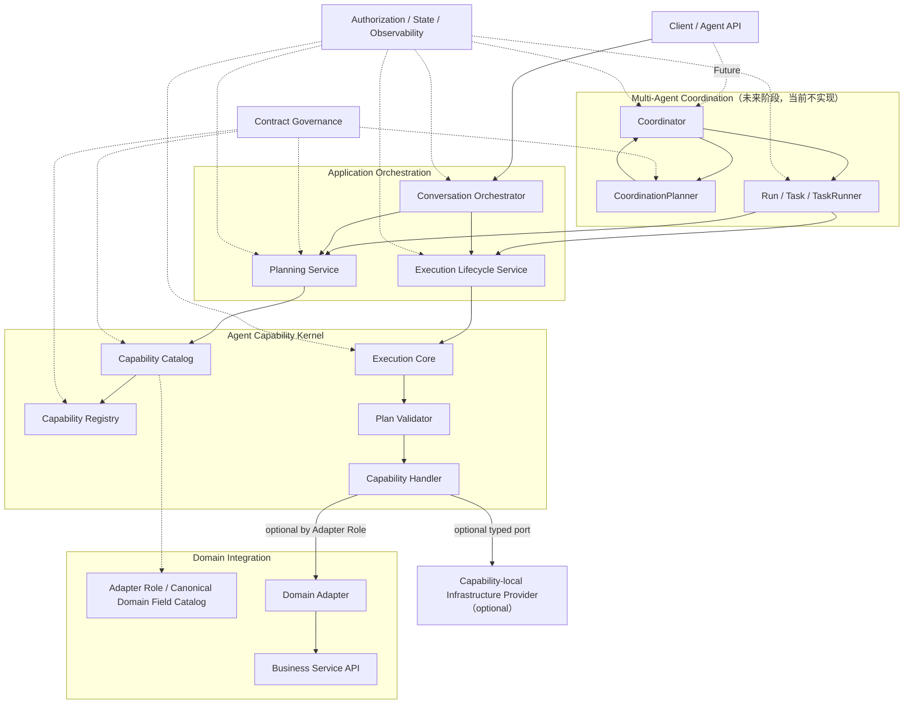
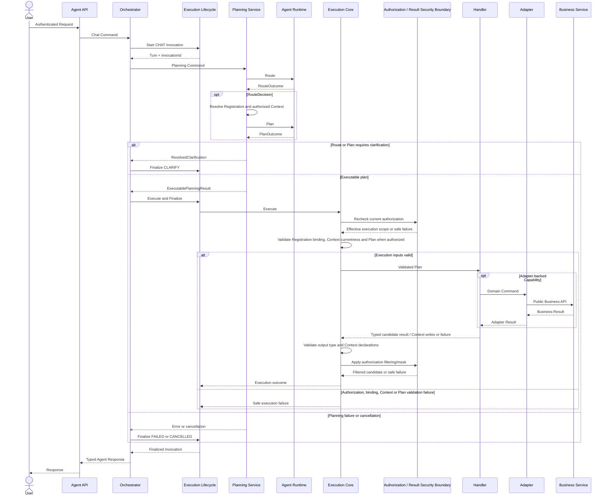
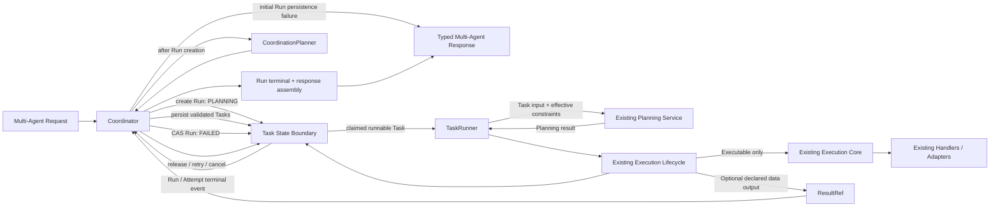

# Agent 目标架构总览 v1.0

> 文档层级：L0 目标架构总览  
> 文档状态：权威架构基线  
> 适用代码基线：`389b72b6162edfdb4385c8a77bebf56bfb3e2608`
> 适用范围：`agent-api`、`agent-service`、`agent-runtime`、`agent-adapter-api`、`agent-adapter-*`  
> 前提：系统尚未投产，不承担旧契约、旧配置和旧数据库结构的兼容责任  
> 下位文档：L1 分域架构设计、L2 实施详细设计

---

## 修订历史

| 序号 | 日期 | 文档位置 | 修改内容 | 修改原因 |
|---:|---|---|---|---|
| 1 | 2026-07-13 | `docs/design/Agent目标架构总览_v1.0.md` | 明确当前只实施单 Agent、冻结 Multi-Agent 演进接缝；拆分当前与 D06 验收口径；更新可追溯代码基线 | 避免当前阶段提前建设 Multi-Agent 空壳，同时降低后续演进重构风险 |
| 2 | 2026-07-13 | 第 3、4、5、7、10、13～15 节 | L0 串行复审修复 | 区分当前 `ConversationScope` 与未来 `RunScope` 扩展时态；将下位交付入口从旧 D01～D05 文档批次收敛为 P1_V2/P2_V3 自包含基线；保留 Multi-Agent 为未来独立阶段 |

## 1. 文档定位

### 1.1 目的

本文定义 Agent 系统从 intent 驱动状态演进为 capability-first、可扩展至 Multi-Agent 的稳定目标架构。

本文只回答以下问题：

1. 目标系统采用什么架构分层。
2. 核心概念及其边界是什么。
3. Java、Runtime、Agent Service、Adapter 和业务服务分别负责什么。
4. 单 Agent 和 Multi-Agent 如何复用同一 Planning 与 Execution 内核。
5. 新增 capability、Plan Kind、Domain 和 Agent Profile 时允许修改什么。
6. 下位架构设计和实施设计如何拆分。

### 1.2 本文负责的内容

本文是 Agent 架构的 L0 权威来源，负责定义：

- 架构原则和全局不变量；
- 分层、模块边界和依赖方向；
- 核心概念的稳定含义；
- 顶层正常、澄清和失败调用链；
- 单一事实来源；
- Multi-Agent 演进边界；
- 文档层级和实施顺序。

### 1.3 本文不负责的内容

本文不定义：

- Java 类、接口、方法和包路径；
- Python 文件、函数和 LangGraph 节点；
- DTO 的完整字段、注解和 discriminator 细节；
- SQL、表字段、索引和具体事务代码；
- YAML、POM、requirements 和 CI 脚本内容；
- 完整 Task 状态机和调度算法；
- 测试类、fixture 文件和验收命令。

以上内容由 L1/L2 文档定义，但不得改变本文的架构边界和不变量。

### 1.4 文档权威顺序

```text
L0 目标架构总览
  → L1 分域架构设计
      → L2 实施详细设计
          → 代码、配置、数据库和测试
```

发生冲突时，上位文档优先。若实施验证证明上位决策不可行，必须先通过 ADR 修订上位文档，禁止在代码中形成未记录的架构分支。

---

## 2. 架构前提与驱动因素

### 2.1 基本前提

- 系统尚未投产，可以执行破坏性契约切换。
- Java 是跨 Java/Runtime 结构契约的唯一来源。
- Runtime 是不可信规划方，不是权限和业务执行边界。
- Agent Service 是最终授权、验证、执行、状态和审计边界。
- 业务服务保持数据真实性和业务规则的最终权威。
- Multi-Agent 必须复用单 Agent 的能力执行内核。

### 2.2 主要架构问题

| 编号 | 当前问题 | 目标方向 |
|---|---|---|
| A-01 | intent 同时承担能力主键和 Plan 类型 | capabilityId 与 planKind 分离 |
| A-02 | Capability metadata 多来源 | Registration 成为静态能力来源 |
| A-03 | Java/Python 手工维护结构契约 | Java 单向生成 Runtime model |
| A-04 | Orchestrator 同时规划和执行 | Planning、Lifecycle、Execution 分离 |
| A-05 | Domain metadata 在配置和 Adapter 重复 | Canonical Domain Field Catalog |
| A-06 | Context 与 QUERY/Turn 强绑定 | typed/versioned Context + Invocation Scope |
| A-07 | 规划前无法安全读取 capability Context | Java 可见的 Route/Plan 两阶段规划 |
| A-08 | Multi-Agent 缺少任务执行闭环 | Coordinator + TaskRunner + 统一内核 |
| A-09 | 跨服务契约按模块分批切换 | 纵向原子切换 |
| A-10 | 响应、澄清和执行审计语义不统一 | typed Response + Agent Invocation Record |
| A-11 | 两阶段规划可能突破总预算 | absolute deadline + 有界 repair |

---

## 3. 目标与非目标

### 3.1 目标

- capabilityId 成为已选能力注册、授权、路由、执行和审计归因的唯一主键。
- planKind 只表达结构化 Plan 的类型。
- Java DTO 单向生成 OpenAPI 和 Python model；JSON Schema Bundle 仅在存在明确消费者时生成。
- 新增同 Plan Kind capability 不修改 Orchestrator、Planning 主流程、Execution Core、共享 Runtime Prompt 和 Runtime 核心 graph。
- 新增 Domain 不修改 Agent 主流程和 Capability Catalog 算法。
- Planning 与可信执行可以被聊天和 Task 入口共同复用。
- Context、Profile、Policy、Domain metadata 和审计事实各有唯一来源。
- Multi-Agent 只新增协调、任务和调度能力，不创建第二套 Handler/Adapter 体系。
- Multi-Agent 的 Task 授权、结果、失败和取消能够归并到明确 Run 终态及类型化响应。
- 当前单 Agent 阶段只冻结入口中立的 Planning、Lifecycle、Execution、Authorization、Invocation Scope 和 typed result 接缝，不实现 Multi-Agent 组件与状态。
- 每个实施阶段具有明确输入、输出、验证和删除边界。

### 3.2 非目标

- 当前目标不实现写操作、审批、人工确认或工作流动作。
- 不要求 capability 动态注册或建设管理后台。
- 不允许 Runtime 直连数据库、业务服务、消息队列或工作流服务。
- 不在 L0 选择具体 LLM、调度算法和数据库索引方案。
- 不为未投产系统保留 v1/v2 双协议、转换层或兼容 facade。
- 不因逻辑职责命名为 Service 就预设独立部署、远程调用或额外持久化层。
- 当前 P1_V2/P2_V3 单 Agent 基线不创建 Coordinator、CoordinationPlanner、TaskRunner、Run/Task/Attempt 表、ResultRef、claim/lease/retry 或调度空壳；这些内容只在未来 Multi-Agent L1 完成评审后进入实施。

---

## 4. 总体分层

### 4.1 四层、两横切、一演进预留层



图中的 Service、Registry、Catalog、Coordinator 和 TaskRunner 均表示逻辑职责或进程内组件，不代表独立微服务。只有出现独立扩缩容、故障隔离或安全边界证据时，才允许通过 ADR 增加跨进程调用。

### 4.2 分层责任

| 层/平面 | 主要责任 | 明确禁止 |
|---|---|---|
| Client / API | 认证后的请求接入和统一响应 | 直接访问 Runtime、Handler、Adapter |
| Application Orchestration | 当前承载 CHAT Capability Invocation 管道、Planning 调用和 Invocation 状态迁移协调；未来 TASK 入口复用同一管道 | 复制 capability 业务逻辑、直接实现状态存储、拥有 Run/Task Graph 或调度职责 |
| Agent Capability Kernel | 注册、验证、授权复检和能力执行 | 固定 Domain 分支、下游业务规则 |
| Domain Integration | Domain metadata、模型映射、下游 API 调用 | 接收未验证 LLM JSON、直连业务数据库 |
| Capability-local Infrastructure Port | 为单一 capability 提供 generation、embedding、rerank 等执行期基础设施能力，并传播统一 deadline/cancellation | 充当 Planning Runtime、业务数据权威、权限判断或跨 capability 编排层 |
| Multi-Agent Coordination | 目标分解、Task Graph、调度和汇总 | 直接执行 Handler 或 Adapter |
| Contract Governance | Java 契约、生成物和 drift gate | Python 手写平行 DTO/enum |
| Authorization/State/Observability | Profile/Policy 计算、Context/Invocation 持久化、CAS、deadline/cancel 信号和审计设施 | 向 Runtime 暴露凭据和权限表达式、直接编排用例或执行业务能力 |

Execution Lifecycle Service 是 Invocation 状态迁移的唯一协调者；Authorization/State/Observability 平面只提供授权、持久化、CAS、时限信号和观测能力，不决定用例流程或业务终态。

Conversation Orchestrator 和未来的 TaskRunner 都是共享 Invocation 管道的入口适配者：前者把聊天请求转换为 Invocation Command，后者把 Task 转换为 Invocation Command；二者都不拥有 Planning、Execution、持久化或终态逻辑。

### 4.3 依赖方向

```text
agent-service
  ├─depends on→ agent-api
  ├─depends on→ agent-adapter-api
  └─composition root depends on→ agent-adapter-*

agent-adapter-* ─depends on→ agent-adapter-api + downstream public API
agent-adapter-api ─depends on→ agent-api
agent-runtime contract models ─generated from→ agent-api contract artifacts
```

禁止 `agent-api`、`agent-adapter-api` 反向依赖 `agent-service`。新增具体 Adapter 允许修改 composition root/POM，但不得修改 Agent 主调用链。

---

## 5. 稳定核心概念

| 概念 | 稳定含义 | 不承担的职责 |
|---|---|---|
| Capability | 可授权、可执行、可审计归因的原子业务能力 | 不表达 Plan 结构 |
| capabilityId | Capability 的稳定主键 | 不作为 Plan discriminator |
| Plan Kind | Plan 的结构类型 | 不作为权限、Handler 或审计主键 |
| Capability Definition | 能力的静态结构、Capability Routing Descriptor、风险、Domain Mode、Adapter Role 和 Context 声明 | 不保存部署策略 |
| Capability Routing Descriptor | Definition 内供规划选择 capability 的机器可读语义、适用/排除条件和 planKind 引用 | 不成为独立配置或第二事实来源 |
| Capability Registration | Definition、Raw Plan、Validator、Validated Plan 和 Handler 的不可变绑定 | 不作为 Runtime DTO |
| Capability-local Infrastructure Port | Handler 在执行期使用的最小类型化外部能力端口；由 composition root 装配 | Planning Runtime、Domain Adapter 替代品、权限或 metadata 事实源 |
| Capability Registry | 保存并按 capabilityId 唯一解析静态 Registration；可以按 planKind 分组查询 | 不按 planKind 选择唯一 Registration，不计算用户请求级可用范围 |
| Capability Catalog | 根据 Registry、Profile、Policy、用户权限和 Domain 能力计算 Available Capability | 不重新声明 Registration metadata |
| Available Capability | 注册、策略、用户、Profile 和 Domain 可用性的请求级交集 | 不成为静态事实来源 |
| Agent Profile | Agent 的 capability、Prompt、Context、预算和委派边界 | 不能扩大用户权限 |
| Agent Policy Configuration | 部署级启停、权限和只能收紧的限制 | 不覆盖 Definition/Profile/Catalog |
| Authorization Snapshot | Planning 时刻的版本化请求级授权证据 | 不能替代 Execution 复检 |
| Capability Context | 成功能力执行产生的小型、类型化、版本化规划状态 | 不保存完整业务结果 |
| Generated Text Candidate | capability-local infrastructure port 产生并绑定授权 evidence/citation、operation metadata 和 output ContractRef 的类型化候选 | 最终响应、授权结论、可绕过 Result Security 的自由文本 |
| ResultRef（未来 Multi-Agent） | Task 间传递安全结构化结果的引用 | 当前单 Agent 不实现；不以内嵌自然语言替代 |
| Agent Invocation Record | 当前 CHAT、未来 TASK 从 Planning 到终结的统一审计事实 | 不替代 Turn 或 Task 的业务语义 |
| Turn / Task Attempt（Task Attempt 为未来类型） | Conversation/Run 下的用户交互或调度尝试记录 | 当前只实现 Turn；不复制完整规划、授权和执行审计字段 |
| RouteOutcome | RouteDecision 或 ClarificationRequired | 不携带业务 Plan |
| PlanOutcome | ExecutablePlan 或 ClarificationRequired | 不决定最终执行权限 |
| ResolvedClarification | Java 校验并模板化后的内部澄清终态 | 不是 Runtime HTTP 契约 |

### 5.1 Capability 与 Plan Kind

多个 capability 可以共享同一个 planKind。新增同类业务意图默认新增 capability；只有现有 Plan 结构无法表达时，才新增 Plan Kind。

Capability Registry 只能通过 capabilityId 唯一解析 Registration。planKind 只用于 Plan 结构分组和 Planning Strategy 选择，禁止用于选择 Handler、权限或审计归属。

### 5.2 Capability Registration

Registration 是 Capability Kernel 的最小可执行注册单元：

```text
Definition
  + Raw Plan Type
  + Plan Validator
  + Validated Plan Type
  + Capability Handler
  = Capability Registration
```

类型擦除需要的受控转换只能存在于 Registration 内部。Execution Core 不直接操作裸 wildcard Handler。

### 5.3 Domain Mode 与 Adapter Role

Domain Mode 使用 NONE、OPTIONAL、REQUIRED 三态。Domain-bound capability 通过 Adapter Role 与具体 Adapter Registration 建立通用关联。

Capability Catalog 只能按 Registration、Adapter Role、Domain、Profile 和 Policy 通用计算可用性，禁止按 capabilityId 或 domain 编写专用分支。

### 5.4 Invocation Scope

Context 的 Invocation Scope 采用可演进的封闭类型。当前单 Agent 基线唯一可构造的 concrete value 是：

```text
Current Invocation Scope = ConversationScope
```

未来 Multi-Agent L1 评审通过后，才允许在该封闭类型中新增 `RunScope` concrete value。CHAT 始终使用 ConversationScope；未来独立 Multi-Agent Run/Task 使用 RunScope。Task 间显式业务结果传递使用 ResultRef，不通过“最新 Context”隐式传递。当前代码、配置、数据库和契约不得提前创建 `RunScope`、TASK discriminator 或兼容空壳。

---

## 6. 单一事实来源

| 事实 | 唯一权威来源 |
|---|---|
| 跨 Java/Runtime 结构契约 | `agent-api` Java DTO |
| Capability 静态 metadata 和执行绑定 | Capability Registration |
| Capability 路由语义 | Capability Definition 内的 Capability Routing Descriptor |
| Agent Profile Definition | AgentProfileRegistry |
| 部署级启停和授权限制 | Agent Policy Configuration |
| Domain 执行能力和稳定规划语义 | Canonical Domain Field Catalog |
| 请求级可用 capability | Capability Catalog 计算结果 |
| 请求级授权证据 | Authorization Snapshot |
| 最终执行结论 | Java Validator + Execution Core |
| 当前 CHAT、未来 TASK invocation 审计 | Agent Invocation Record |
| 未来 Run/Task 持久化状态与 CAS | Agent 数据库中的 Task State Boundary；当前不实现 |
| 业务数据和规则 | Downstream Business Service |

请求级投影、生成物、缓存、Golden Fixture 和只读查询表都不是新的事实来源。

---

## 7. 单 Agent 顶层调用链

### 7.1 全终态执行



### 7.2 Planning 边界

Planning Service 统一负责：

- Effective Profile 和 Available Capability；
- Authorization Snapshot；
- Java 可见的 Route/Plan 两阶段调用；
- 从 Available Capability 生成最小 Capability Routing Descriptor 投影，使 Runtime 按数据选择 capability；
- capability 确定后的最小 Context 加载；
- Route、Plan 和 Registration 一致性；
- 确定性 Context 合并；
- ExecutablePlanningResult 或 ResolvedClarification。

Planning 不调用 Handler、Adapter 或业务服务，不作最终执行授权结论。

同一 Plan Kind 下新增 capability 时，Route 和 Plan 使用请求携带的 Capability Routing Descriptor 与 schema，不增加共享 Prompt 分支或 Runtime graph 节点。

### 7.3 Execution 边界

Execution Lifecycle Service 统一负责 Invocation 的原子开始和终结。Execution Core 统一负责：

- Authorization Snapshot 与当前权限复检；
- 调用 Registration 绑定的 Plan Validator；
- 调用只接收 Validated Plan 的 Handler；
- 校验 Handler 输出类型和 Context 声明；
- 通过安全边界按当前有效范围执行字段过滤和 mask。

单 Agent 原子切换阶段要求 Turn、Invocation Record 和 Context 位于同一 Agent 数据库，使用本地事务完成开始和终结，不提前实现 Task Attempt、ResultRef 或 Task State Boundary。

未来 Multi-Agent 阶段引入 TASK 后，Task Attempt、Invocation Record、ResultRef 和 Run/Task 持久化状态同样位于该 Agent 数据库，并统一通过 Task State Boundary 访问；Execution Lifecycle Service 使用本地事务和 CAS 完成 Attempt 终结。未来拆分存储或跨进程事务必须另行 ADR。

Turn（以及未来 Multi-Agent 阶段引入的 Task Attempt）只保存 Conversation/Run 下的业务入口、展示或调度语义；Invocation Record 保存统一的 Planning、Authorization、Execution 和审计事实。二者通过 invocationId 关联，禁止复制完整 Plan、Authorization Snapshot、Context、ResultRef、错误详情和执行 metadata。

### 7.4 澄清和失败

- Runtime 只返回结构化 ClarificationRequired，不返回最终 question。
- Java 校验 reasonCode/typed args 和授权范围，并通过安全模板形成 ResolvedClarification。
- ResolvedClarification 不进入 Execution Core、Handler 或 Adapter。
- ResolvedClarification、Planning 异常、Execution 异常和取消都必须交回 Execution Lifecycle Service 终结 Invocation 及其 Turn；未来引入 TASK 后对 Task Attempt 应用同一规则。
- Planning、Validation、Permission、Adapter 或 Persistence 任一阶段失败都必须 fail closed。
- Invocation 创建后必须进入 COMPLETED、FAILED 或 CANCELLED 终态。
- CLIENT 取消或 deadline 到期后，迟到结果不得提交 Context 或成功状态。Task lease 和 ResultRef 的迟到提交规则由第 10 节定义。

---

## 8. Contract 与 Runtime 边界

### 8.1 单向生成链

```text
Java DTO
  → OpenAPI 3.1
      ├→ Python Generated Models
      │   └→ Runtime Contract Tests
      └→ JSON Schema Bundle（可选，仅在存在明确消费者时生成）
```

Python generated model 禁止手工编辑。Runtime 可以保留行为或语义校验器，但不得重新定义字段、enum、union、discriminator 和版本等结构契约。Prompt 只保存行为规则；capabilityId、planKind、operator、字段、版本和 JSON shape 必须从 generated artifact 或请求级 descriptor/schema 获得。

每个提交到仓库的中间产物都必须有明确消费者：OpenAPI 服务于 HTTP 契约并作为 Python codegen 输入，Python model 服务于 Runtime；JSON Schema Bundle 只有在存在独立结构校验消费者时才生成和提交。任何生成物都不是新的契约源。

### 8.2 Runtime 信任边界

Runtime 可以建议 capability、domain、Plan 和 ClarificationRequired，但不能决定：

- 用户身份和角色；
- capability、domain 和 field 权限；
- Context 可读范围；
- 是否允许执行；
- 业务数据真实性；
- 最终响应脱敏规则。

Runtime 不接收 JWT、凭据、完整权限表达式、mask 规则、数据库信息或未授权 metadata。

### 8.3 预算边界

Caller、Route、Plan、repair、Execution、Capability-local Infrastructure Port、Adapter 和下游 Client 共享同一个 absolute deadline；后续阶段只能使用剩余预算，不能重新计时。Repair 只允许在单次 Runtime operation 内部有界执行；执行期 infrastructure port 不得复用 Planning repair 或开启不可见自动重试，并通过 Java 定义的 operation metadata 返回次数、耗时和终止原因。

---

## 9. Metadata、Context 与安全边界

### 9.1 Domain Metadata

每个 Domain 只有一个 Canonical Domain Field Catalog，统一保存：

- 稳定 domain/field 名称和规划语义；
- 类型、格式、单位和允许值语义；
- 按 Adapter Role 划分的 operator/function 执行能力；
- Adapter 可以实际映射的字段集合。

Runtime Domain Schema 是 Canonical Domain Field Catalog、Policy、Profile 和用户权限的请求级安全投影，不是新事实来源。

### 9.2 Context 授权

Context 只在 capability 已确定后加载。有效范围是 Registration、Effective Profile、User Permission、可选 Delegation Constraint、Owner、Invocation Scope、Version 和 TTL 的交集。

CHAT 中不适用的 Delegation Constraint 按全集处理；任何适用层拒绝或交集为空都必须 fail closed。

### 9.3 状态数据保护

- Context payload 与 ResultRef 所引用的结构化结果必须最小化、加密、设置 TTL，并随 Conversation/Run 清理；ResultRef 标识本身只保存解析和授权所需的最小引用信息。
- ResultRef 只能引用已过滤和脱敏的结构化结果。
- 日志和指标不得记录完整 Context/ResultRef payload 或凭据。
- 自然语言 summary 不能绕过结构化结果的字段权限和脱敏边界。

---

## 10. Multi-Agent 目标边界

本节是当前单 Agent 架构必须遵守的**演进约束**，不是 P1_V2/P2_V3 的实现清单。当前阶段只要求共享内核保持入口中立、主体与 Scope 可扩展、结果类型化且可安全归并；图中的 Coordinator、CoordinationPlanner、TaskRunner、Run/Task/Attempt、ResultRef 和 Task State Boundary 均不在当前阶段创建接口空壳、数据表、配置或运行组件。

进入 Multi-Agent 实施前必须另行完成并评审 `Multi-Agent协调与任务架构设计_v1.0.md`，再定义状态机、调度、claim/lease/retry、ResultRef、部分成功和 Run 终态。该文档不得反向改变本节冻结的 Planning、Lifecycle、Execution Core、Authorization、Handler/Adapter 和 Invocation 审计接缝。

### 10.1 组件关系



### 10.2 稳定责任

- CoordinationPlanner 是 Java 侧候选 Task Graph 策略边界，只生成候选结构，不持久化、不调度、不执行能力。它可以使用确定性策略；只有接入外部 LLM/规则服务时才增加可选 Port。
- CoordinationPlanner 跨进程时，Task Graph 请求/响应仍以 Java DTO 为契约源，其输出始终按不可信输入处理；不得复用 Capability Route/Plan 协议表达 Task Graph。
- Coordinator 在调用 CoordinationPlanner 前先创建 PLANNING 状态的 Run。Run 创建失败时返回类型化持久化错误且不创建 Task；创建成功后，CoordinationPlanner 失败以及 Task Graph、Delegation、预算、深度或依赖校验失败都必须使 Run 进入 FAILED 并返回类型化响应。
- 只有候选 Task Graph 全部通过 Java 校验后，Coordinator 才能原子持久化 Task 并开始调度；初始 Task 持久化失败时 Run 进入 FAILED，不得留下可调度 Task。
- Coordinator 直接负责依赖归并、结果汇总、Run 终结和响应组装，不增加独立汇总服务。
- TaskRunner 把 Task instruction、输入 ResultRef、Execution Subject/Run Owner Reference、目标 Agent Profile、Delegation Constraint 和 absolute deadline 交给既有 Planning Service。Planning Service 根据稳定主体引用解析当前 User Permission 并生成 Authorization Snapshot；后台 Task 不复用调用方 JWT 或实时认证会话。
- 每次 Task Attempt 都原子关联独立 Agent Invocation Record。
- Task 执行通过既有 Execution Lifecycle 和 Execution Core，不建立第二套 Handler/Adapter。
- Task 间结构化结果通过 ResultRef 传递，不把大对象拼接到自然语言上下文。
- Run/Task 状态、依赖、claim、lease、retry 和调度归属于 Coordinator 使用的统一 Task State Boundary；Execution Lifecycle 只协调 Attempt、Invocation、Context、ResultRef 和 Task Attempt CAS 终结，不负责调度或汇总。TaskRunner 不直接写状态。
- Task State Boundary 是逻辑所有权边界；是否形成进程内 TaskService/Repository 由未来 Multi-Agent 详细设计根据并发和事务需求决定，不在单 Agent 阶段提前建设。拆为跨进程服务必须另行 ADR，并重新设计事务一致性。

### 10.3 可靠性边界

- Effective Task Deadline 是 Run、Task、Attempt 和可选 Caller deadline 的最小值。
- Planning、Execution、Adapter 和下游 Client 共享同一绝对 deadline。
- Retry 创建新 Attempt 和 Invocation Record，不覆盖失败历史。
- 支持交互恢复时才引入 BLOCKED_PARENT/WAITING_INPUT；无人值守首版可以有界失败。
- Cancel、lease 丢失或 deadline 到期后禁止提交迟到结果和释放下游依赖。
- 控制依赖在前置 Task 成功终结后释放；数据依赖还要求依赖边声明的 ResultRef 已原子提交。澄清、失败或取消按 Task Graph 策略进入有界重试、阻塞或失败归并。
- 所有必需 Task 到达终态后，Coordinator 必须形成明确的 SUCCEEDED、FAILED 或 CANCELLED Run 终态，并返回类型化 Multi-Agent Response。是否允许部分成功必须由类型化 Run 创建请求显式声明，经 Coordinator 校验后作为 Run 属性持久化；不引入独立策略服务、注册表或配置来源。

---

## 11. 全局架构决策

| 决策 | 内容 |
|---|---|
| AD-01 | capabilityId 是已选能力主键；invocationId 是请求级审计主键 |
| AD-02 | 跨 Java/Runtime 结构契约由 Java 单向生成；未来 Task Graph 契约同样适用 |
| AD-03 | 结构事实、执行事实、策略事实和请求级投影分离；Capability Routing Descriptor 是 Definition 的投影而非新来源 |
| AD-04 | Planning、Execution Lifecycle、Execution Core 分离并可复用 |
| AD-05 | Raw Plan→Validated Plan→Handler 类型桥只存在于 Registration |
| AD-06 | Runtime 不在授权和业务执行信任边界内 |
| AD-07 | 破坏性跨服务契约使用纵向原子切换，不保留双协议 |
| AD-08 | Multi-Agent 由 Coordinator 负责协调、汇总和 Run 终结，并复用同一 Planning 和 Execution 内核 |
| AD-09 | Capability Context 使用 Java 可见的 Route/Plan 两阶段隔离 |
| AD-10 | Caller、Route、Plan、repair、Execution、Capability-local Infrastructure Port、Adapter 和下游 Client 共享绝对 deadline |
| AD-11 | capability-local generation、embedding、rerank 等基础设施通过 Handler 的最小类型化 port 接入；不复用 Planning Runtime、不替代 Domain Adapter，候选输出继续经过统一安全边界 |

L1 文档可以细化这些决策，但不得改变其含义。

---

## 12. 扩展不变量

### 12.1 新增同 Plan Kind capability

允许新增：

- Capability Definition/Registration，包括 Definition 内的 Capability Routing Descriptor；
- Plan Validator 和 Handler；
- Profile/Policy 授权引用和测试；
- 已有或新增 Adapter Role 引用。
- capability 私有且受统一 deadline/output security 约束的 infrastructure port。

不得修改 Orchestrator、Planning Service 主流程、Execution Core、Capability Catalog 算法、共享 Runtime Prompt 和 Runtime 核心 graph。Runtime 必须通过请求级 Capability Routing Descriptor 和既有 Planning Strategy 识别该 capability。

### 12.2 新增 Plan Kind

允许修改 Java Plan union、Planning Strategy、对应行为 Prompt、生成契约和测试。不得修改已有 capability 的 Handler 或 Adapter。

### 12.3 新增 Domain

允许新增 Canonical Domain Field Catalog、具体 Adapter、策略配置、下游 API 依赖和 composition root 装配。

对于已有 capability/Plan Kind，不得修改 Orchestrator、Planning Service、Capability Catalog 算法、Execution Core、已有 Handler、已有 Plan Validator、共享 Runtime Prompt 和 Runtime 核心 graph。Domain 语义必须通过 Canonical Domain Field Catalog 投影；若现有 Plan 或 Handler 无法表达该业务语义，应按新增 capability 或 Plan Kind 处理，不能伪装为 Domain 接入。

### 12.4 新增 Agent Profile

新 Profile 只组合已有 capability、Prompt、Context、预算和委派边界；只能缩小用户权限，不能复制 Handler 或扩大授权。Profile 保存组合意图，Policy 只保存部署级启停和收紧限制，二者不得重复声明 capability 定义、Prompt、Context schema 或委派规则正文。

---

## 13. 文档拆分与实施顺序

### 13.1 L1 分域架构文档

| 文档 | 唯一负责内容 | 状态 |
|---|---|---|
| `Agent契约与规划架构设计_v1.0.md` | 跨 Java/Runtime DTO、Capability Routing Descriptor 请求投影、Route/Plan、Clarification、Runtime、Prompt、repair | 已评审（架构基线） |
| `Agent能力执行内核架构设计_v1.0.md` | Capability Definition、Registration、Registry、Validator、Lifecycle、Core、Handler、Invocation 核心语义 | 已评审（架构基线） |
| `Agent元数据与上下文安全架构设计_v1.0.md` | Profile、Policy、Authorization、Context、Capability Catalog、Canonical Domain Field Catalog | 已评审（架构基线） |
| `Multi-Agent协调与任务架构设计_v1.0.md` | Coordinator、CoordinationPlanner、TaskRunner、ResultRef、Task State Boundary、Run/Task/Attempt、可靠性 | 未来 Multi-Agent 实施前编写并评审；不是当前 P1_V2/P2_V3 前置，不在当前阶段创建空壳 |

每个概念、公式、状态机和协议只能在一个 L1 文档中完整定义；其他文档必须引用，不复制正文。

### 13.2 L2 详细设计与交付顺序

当前下位详细设计只维护两个自包含基线：

| 详细设计基线 | 前置 L1 | 唯一职责 | 阅读规则 |
|---|---|---|---|
| `docs/design/P1_V2/00～06` | 三份单 Agent L1 全部完成评审 | 契约、Kernel/Lifecycle、安全、Adapter/Domain Metadata、资源端口、原子迁移与扩展门禁 | 当前单 Agent 通用内核实施只读取 L0/L1 + P1_V2，不回查旧 P1 |
| `docs/design/P2_V3/00～07` | P1_V2 稳定边界 + 文档专项上级约束 | Document 语料、Profile、ACL、检索、证据输出、Provider、发布回滚 | Document 实施只读取 L0/L1 + P1_V2 + P2_V3，不回查旧 P2/P2_V2 |

```text
L0 + 三份单 Agent L1
  → P1_V2 单 Agent 通用内核详细设计与原子实施
      → P2_V3 Document capability 详细设计与代表性扩展验证
          → 清理旧路径并验证扩展不变量
              → 单独编写、评审 Multi-Agent L1
                  → Multi-Agent 详细设计与实施拆分
```

- P1_V2/01 先建立 Java→OpenAPI→Python codegen、fixture 和 drift gate。
- P1_V2/02～05 共同冻结可信执行、安全、Domain 和资源端口边界，不形成半切换运行态。
- P1_V2/06 在一个纵向交付单元完成 Java、Runtime、Persistence、下游契约和旧路径清理，并验证 core-no-diff 扩展不变量。
- P2_V3 只能消费 P1_V2 已冻结的通用 seam，不反向修改 Kernel、安全或资源所有权。
- Multi-Agent 只能基于已落地的 Planning、Lifecycle、Core、Authorization 和 Invocation Record 设计。

### 13.3 原文档关系

`agent架构设计文档_v1.6.md`、`Agent目标架构与演进设计_v1.0.md` 和 `Agent能力架构收敛与Multi-Agent演进实施设计_v1.0.md` 保留为历史参考或拆分源材料，不再作为 L0 或直接编码基线。

---

## 14. 全局验收标准

### 14.1 当前单 Agent 收敛标准

P1_V2/P2_V3 只有同时满足以下条件才算收敛：

1. Java→OpenAPI→Python model 可重复生成且无生成后结构契约补丁；JSON Schema Bundle 仅在存在明确消费者时生成，每个提交产物都有明确用途。
2. capabilityId、planKind、agentId、contextType 和 invocationId 含义互不重叠。
3. Registration 绑定 Definition、Raw Plan、Validator、Validated Plan 和 Handler。
4. Prompt、配置、Adapter 和 Python 不再维护结构契约或 Domain 执行事实副本。
5. 新增同 Plan Kind capability 只增加 Registration、Capability Routing Descriptor 投影及能力实现，不修改 Orchestrator、Planning 主流程、Execution Core、共享 Prompt 和 Runtime 核心 graph。
6. 已有 capability/Plan Kind 接入新 Domain 不修改 Agent 主流程、已有 Handler/Validator 和共享 Prompt。
7. 当前 CHAT 使用的 Planning Service、Execution Lifecycle 和 Execution Core 保持入口中立，未来接入 TASK 时复用这些接口而不复制内核。
8. Runtime 不接收无权 metadata、凭据和权限表达式，不作最终执行结论。
9. Context 只在 capability 确定后按 Effective Scope 加载，并安全持久化和清理。
10. 单 Agent 阶段原子闭环 Turn、Invocation Record 和 Context；未来引入 TASK 后，Task Attempt 与 Invocation Record 原子关联，成功、澄清、失败和取消均有终态。
11. Route、Plan、repair、Execution、Capability-local Infrastructure Port、Adapter 和下游调用遵守同一绝对 deadline；所有候选输出经过统一 output/result security 校验。
12. Conversation Orchestrator 只是 CHAT 入口适配者；Planning、Lifecycle、Execution Core、Handler、Authorization 和 typed result 不依赖 Conversation/Turn 具体实体。
13. Invocation Scope 当前只启用且只实现 ConversationScope，但封闭类型和 Context key 不阻止未来在 Multi-Agent L1 评审后新增 RunScope 实现。
14. 当前代码和配置不存在未使用的 Coordinator、TaskRunner、ResultRef、Task State Boundary 或 Task 状态空壳。
15. 代表性新增 capability 验证通过后，才允许进入 Multi-Agent 架构设计。

### 14.2 未来 Multi-Agent 收敛标准

以下条目只在完成并评审 Multi-Agent L1 后作为未来阶段验收条件，不前置到当前单 Agent 实施：

1. Multi-Agent 不建立第二套 Handler、Adapter、权限和审计框架，Task 授权约束完整传入统一 Planning/Execution 链。
2. Multi-Agent 的成功、澄清、失败和取消都能由 Task Attempt 归并到明确 Run 终态并返回类型化响应。
3. Task Graph 的控制依赖和数据依赖语义分离，数据依赖必须验证声明的 ResultRef 已提交。
4. Turn/Task Attempt 与 Invocation Record、Profile 与 Policy 不重复保存同一权威事实。

---

## 15. 文档维护规则

- 本文只维护稳定架构，不增加类、方法、字段、SQL 和测试文件清单。
- L1 文档负责一个分域的完整闭环，不得重复其他 L1 的权威定义。
- L2 文档必须列出具体代码、配置、数据库、测试和验收命令。
- 跨文档概念使用稳定名称和 AD 编号，禁止同义词平行存在。
- L0 中的逻辑职责不得直接解释为新增微服务；跨进程拆分必须由独立 ADR 和运行证据支持。
- 架构调整先修改本文或对应 L1，再修改实施设计和代码。
- 追踪矩阵应独立维护或由各 L1/L2 汇总，不再写入本文正文。

内部跨文档复审记录（2026-07-13）：当前单 Agent 主链由 P1_V2/P2_V3 承接；Multi-Agent 内容仅作为演进约束，不表示 Multi-Agent 架构已完成，也不授权提前创建相关组件。正式 Multi-Agent 评审以未来 `Multi-Agent协调与任务架构设计_v1.0.md` 为准。

本文确认目标方向、分层、边界和不变量；具体实现以完成评审的 L1/L2 文档为直接编码依据。
