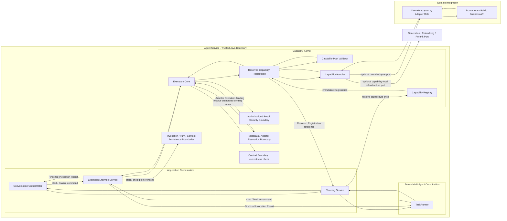
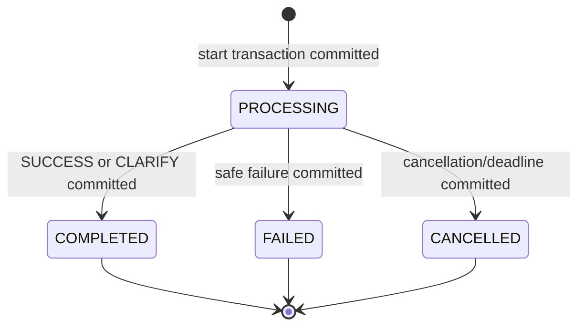
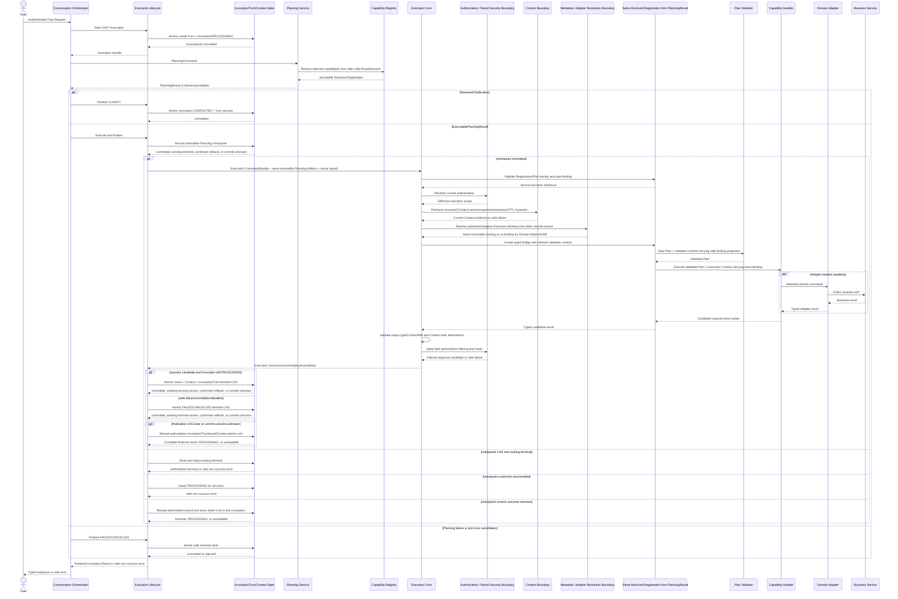

# Agent 能力执行内核架构设计 v1.0

> 文档层级：L1 分域架构设计  
> 文档状态：架构基线（已评审）  
> 上位文档：`Agent目标架构总览_v1.0.md`  
> 关联 L1：`Agent契约与规划架构设计_v1.0.md`（已评审）、`Agent元数据与上下文安全架构设计_v1.0.md`（已评审）
> 适用代码基线：`389b72b6162edfdb4385c8a77bebf56bfb3e2608`
> 适用范围：`agent-service` Capability Kernel、`agent-api` 执行引用、`agent-adapter-api` 执行端口边界  
> 前提：系统尚未投产，不承担旧 AgentIntent 路由、旧 Handler 接口、旧 Turn/Context 结构的兼容责任  
> 下位交付：D02 Capability Kernel 实施详细设计、D03 Capability v2 原子切换；D03 前置依赖 D01 契约治理、D02 详细设计和 D04 Adapter Metadata 收敛全部通过评审

---

## 修订历史

| 序号 | 日期 | 文档位置 | 修改内容 | 修改原因 |
|---:|---|---|---|---|
| 1 | 2026-07-13 | `docs/design/Agent能力执行内核架构设计_v1.0.md` | 以 Invocation 级不可变 Planning Artifact 替代 JVM 实例身份；补充入口中立、capability-local infrastructure port 和类型化生成候选安全边界；明确 Multi-Agent 当前仅预留 seam | 保证当前单 Agent 可落地且未来接入 TASK 时不重写共享执行内核 |

## 1. 文档定位

### 1.1 目的

本文在 L0 和契约与规划 L1 约束下，完整定义 Agent 能力执行内核的稳定架构，包括：

1. Capability Definition、Registration、Registry 的静态执行绑定。
2. Raw Plan→Validated Plan→Handler 的唯一可信执行链。
3. Java 类型擦除桥的唯一封装位置。
4. Execution Lifecycle Service 的 Invocation 开始、Planning 关联和原子终结职责。
5. Execution Core 的授权复检、Validator 调用、Handler 调用和输出校验职责。
6. Capability Handler 与 Domain Adapter 的边界。
7. Agent Invocation Record 的权威审计语义和状态不变量。
8. 结果、Context、失败、取消、deadline 和恢复闭环。
9. 新 capability、新 Plan Kind、新 Domain 和 Multi-Agent 的扩展不变量。

### 1.2 权威关系

```text
L0 Agent 目标架构总览
  ├→ 契约与规划 L1（已评审）
  ├→ 本文：能力执行内核 L1
  └→ 元数据与上下文安全 L1（已评审）
契约与规划 L1 已评审，且能力执行内核 L1 + 元数据与上下文安全 L1 均已评审
  → D02 Capability Kernel 实施详细设计
      → D04 Adapter Metadata 收敛
          → D03 Capability v2 原子切换
```

约束顺序：

- L0 高于本文。
- 契约与规划 L1 定义 PlanningResult 和 Raw Plan 的输入边界；本文不得重新定义 Route/Plan 协议。
- 本文高于 D02/D03 对应 L2 和代码。
- 实施不可行时必须先通过 ADR 修订本文或 L0，禁止在 Handler、Registry 或 Lifecycle 中形成未记录旁路。

元数据与上下文安全 L1 已完成评审；本文仍不得代替它定义 Profile/Policy/Authorization/Context/Catalog 公式、存储和 metadata 事实。两份 L1 已共同闭合 D02 的架构前置，但 D02 仍须遵守 L0 第 13.2 节的交付顺序。

### 1.3 本文唯一负责的内容

本文唯一负责：

- Capability Definition 的执行内核语义；
- Capability Registration 的不可变聚合和类型绑定；
- Capability Registry 的静态注册、唯一查找和启动校验；
- Resolved Registration 的执行边界；
- Raw Plan、Validated Plan、Plan Validator 和 Handler 的类型关系；
- Execution Lifecycle Service 的开始、Planning checkpoint、执行协调和终结语义；
- Execution Core 的可信执行算法；
- Handler 输入/输出和 Adapter 调用边界；
- Agent Invocation Record 的核心字段类别、状态和审计权威性；
- 执行结果和 Context write 在持久化前的校验边界；
- 执行阶段 deadline、取消、迟到结果和恢复原则。

### 1.4 本文不负责的内容

| 内容 | 唯一负责文档 | 本文使用方式 |
|---|---|---|
| Route/Plan/Clarification Runtime 契约、PlanningCommand、PlanningResult、Prompt、repair | `Agent契约与规划架构设计_v1.0.md` | 接收 ExecutablePlanningResult/ResolvedClarification，不重新定义 Runtime 协议 |
| Profile、Policy、Authorization Snapshot、Context 授权、Capability Catalog、Canonical Domain Field Catalog | `Agent元数据与上下文安全架构设计_v1.0.md` | 调用授权复检、结果过滤和 Context 持久化边界，不复制权限公式或 metadata |
| Coordinator、CoordinationPlanner、TaskRunner、ResultRef、Task State Boundary、Run/Task/Attempt | `Multi-Agent协调与任务架构设计_v1.0.md` | 只定义 CHAT/TASK 共用 Invocation/Execution 语义，不定义 Task Graph 和调度状态机 |

本文也不定义：

- Java 类、接口、方法、泛型签名和包路径；
- DTO 完整字段、注解和数据库映射；
- SQL、表、索引、迁移脚本和事务注解；
- Adapter SPI 的具体方法和下游 HTTP API；
- 具体 capability 的业务校验和结果字段；
- Runtime/Python/Prompt 内部实现；
- 完整测试类、fixture 和部署命令。

这些内容由 L2 定义，但不得改变本文的边界和不变量。

---

## 2. L0 与关联 L1 约束映射

| 上位约束 | 本文落实方式 | 主要章节 |
|---|---|---|
| AD-01 capabilityId 是已选能力主键 | Registry 只按 capabilityId 唯一解析 Registration | 第 5、7 节 |
| AD-02 Java 是跨边界结构契约唯一来源 | Core、Registration、Handler 只消费 Java 类型和 ContractRef，不接受平行手写 DTO/enum | 第 6、10、13、19 节 |
| AD-03 事实和投影分离 | Definition/Registration 是静态事实；Catalog/Policy/Context 是外部投影 | 第 5～7 节 |
| AD-04 Planning/Lifecycle/Core 分离 | Planning 产出结果；Lifecycle 协调；Core 执行 | 第 4、8～10 节 |
| AD-05 类型桥只在 Registration | Core 不接触裸 wildcard Handler 或 unchecked cast | 第 6、7、10 节 |
| AD-06 Runtime 不可信 | Raw Plan 必须经过授权复检和 Plan Validator | 第 9～11 节 |
| AD-07 纵向原子切换 | D02 只冻结设计，D03 一次替换旧执行链 | 第 20 节 |
| AD-08 Multi-Agent 复用内核 | CHAT/TASK 共用 Lifecycle、Core、Registration、Handler | 第 18 节 |
| AD-09 两阶段 Context 隔离 | Core 只接收 capability 确定后按声明加载的 Context Snapshot，不接收预路由广域 Context | 第 10、13 节 |
| AD-10 全链 absolute deadline | Lifecycle/Core/Handler/Adapter 只消耗剩余预算 | 第 15 节 |
| AD-11 capability-local infrastructure port | Handler 可调用最小类型化 generation/embedding/rerank port；其候选输出仍经 output/result security | 第 12.4、13、17 节 |
| PlanningResult 封闭联合 | ResolvedClarification 直接终结；ExecutablePlanningResult 才进入 Core | 第 8、9 节 |
| Context/权限外部权威 | Core 使用 Snapshot 和当前授权交集，Lifecycle 调用 Context 边界 | 第 9、13 节 |
| 新 Domain 不侵入内核 | Core 消费 metadata 边界解析的 Adapter Execution Binding，Handler 只调用已绑定 port | 第 12、18 节 |
| 静态注册与请求级可用性分离 | Registry 只验证结构绑定；当前无可用 domain/adapter 由 Capability Catalog 以不投影表达 | 第 7、12 节 |
| Invocation 持久化事实唯一 | Checkpoint/finalization 未提交不伪称终态；CAS 输家服从已提交结果 | 第 8、14、16 节 |

本文不得放宽以上约束。

---

## 3. 当前基线与目标差距

| 维度 | 当前基线 | 目标状态 |
|---|---|---|
| 能力注册主键 | Handler Registry 按 AgentIntent 保存 | Capability Registry 按 capabilityId 保存 Registration |
| 静态 metadata | Descriptor Factory、Handler、配置分散声明 | Capability Definition 由 Registration 唯一提供 |
| 类型桥 | Orchestrator 持有 raw cast/unchecked bridge | 受控类型桥只封装在 Registration 内部 |
| 验证与执行 | Handler 同时暴露 validate/execute | Plan Validator 产生 Validated Plan；Handler 只接收 Validated Plan |
| 执行编排 | Orchestrator 解析、路由、校验、执行、完成 Turn | Planning、Lifecycle、Execution Core 分离 |
| 生命周期 | Conversation Service 直接 start/complete Turn | Lifecycle 原子协调 Turn、Invocation、Context 和终态 |
| 审计 | Turn 同时承载交互和执行事实 | Turn 表达交互；Invocation Record 表达 Planning/Execution 审计 |
| Context | Turn 保存 query-specific JSON | 类型化 Context 由执行来源和声明约束，Lifecycle 统一提交 |
| 澄清 | Clarify Handler 作为能力执行 | ResolvedClarification 由 Lifecycle 直接形成 CLARIFY 终态 |
| Domain 调用 | capability/domain 假设可能进入主流程 | Handler→Adapter Role→Domain Adapter 通用连接 |

目标迁移不保留 AgentIntent→capabilityId 转换器、旧 Handler facade、双 Registry 或旧/新 Turn 完成路径。

---

## 4. 总体架构

### 4.1 组件关系



图中 Registration 是不可变执行对象，不是额外服务；Authorization/Result Security、Metadata/Adapter Resolution、Context Boundary 和 Persistence 都是稳定边界，不代表新增微服务。Core 使用元数据与上下文安全 L1 已定义的同一 Context Boundary 执行 currentness check，不新增平行概念、存储或应用服务。Output/Context write 的结构与声明校验是 Core 内部步骤，不形成额外组件；字段过滤和 mask 规则由同一安全边界提供。Metadata 边界只解析一次请求级 Adapter Execution Binding，Handler 不再按 role/domain 二次选择 Adapter。

### 4.2 分层责任

| 层/组件 | 负责 | 禁止 |
|---|---|---|
| Entry Adapter | 请求 Lifecycle 开始 Invocation、调用 Planning、把结果交回 Lifecycle | 自行创建/迁移 Invocation、调用 Core/Handler/Adapter、持久化执行结果 |
| Execution Lifecycle Service | Invocation 开始、Planning checkpoint、执行协调、原子终结、恢复协调 | 重新规划、做 capability 业务校验、直接调用 Adapter |
| Capability Registry | 保存/解析静态 Registration，启动校验 | 用户授权、请求级 availability、执行 Handler |
| Execution Core | 当前授权复检、Registration/Plan 校验、Validator/Handler 调用、输出校验 | 持久化审计/Context、重新查询 Registry、调用 Runtime |
| Plan Validator | Raw Plan→Validated Plan 的确定性转换 | 业务执行、持久化、Runtime/LLM 调用 |
| Capability Handler | 对单一 capability 编排已验证业务执行，并可调用 composition root 注入的 capability-local infrastructure port | 接收 Raw Plan、扩大权限、管理 Invocation、调用 Planning Runtime |
| Metadata/Security/Context boundaries | 提供当前授权复检、Context Snapshot 有效性复检、Catalog 安全投影、请求级 Adapter Execution Binding 和结果过滤 | 编排用例、迁移 Invocation、执行 Handler、成为 Definition/Registration 副本 |
| Domain Adapter | Validated domain command→公开业务 API，结果映射 | 接收 LLM JSON、直连业务数据库、重新定义权限 |
| Persistence boundaries | Repository/CAS/Context storage | 决定用例流程或业务终态 |

### 4.3 依赖方向

```text
agent-service Capability Kernel
  → depends on agent-api contract references and typed result contracts
  → depends on agent-adapter-api execution ports
  → uses Metadata/Security/Context boundaries
  → composition root may depend on concrete agent-adapter-* modules

agent-adapter-*
  → depends on agent-adapter-api + downstream public API
  × must not depend on agent-service implementation

Capability Kernel
  × must not depend on agent-runtime
```

Planning Service 是 Runtime 的唯一应用入口；Execution Core、Handler 和 Adapter 不允许调用 Runtime。

### 4.4 唯一可信执行链

```text
ExecutablePlanningResult
  → Lifecycle records planning checkpoint
  → Lifecycle binds Invocation Handle + same immutable Planning Artifact as Execution Command
  → Execution Core
      → Registration binding validation
      → Authorization recheck
      → resolve one Adapter Execution Binding when domain-bound
      → Capability Plan Validator
          Raw Plan + safe projection of the same binding → Validated Plan
      → Capability Handler
          Validated Plan + Execution Context carrying the same binding
      → optional bound Domain Adapter
  → output/context validation and filtering
  → Lifecycle atomic finalization
  → Finalized Invocation Result
  → Entry Adapter maps typed API response
```

任何跳过 Registration、Authorization recheck 或 Plan Validator 的调用路径都违反本文。

---

## 5. 稳定核心概念

| 概念 | 稳定含义 | 明确不承担 |
|---|---|---|
| Capability Definition | capability 的代码级静态结构和执行声明 | 部署策略、请求级 availability |
| Capability Registration | Definition、Raw Plan、Validator、Validated Plan、Handler 的不可变绑定 | Runtime DTO、用户授权 |
| Capability Registry | 按 capabilityId 保存/解析 Registration | Planning Strategy、请求级 Catalog |
| Resolved Registration | Planning 已按 capabilityId 解析的不可变 Registration 引用 | 新事实源、可变执行状态 |
| Raw Plan | Runtime 产生、Planning 已做绑定检查但尚未通过最终 Validator 的 Plan | Handler 输入、执行授权 |
| Validated Plan | Plan Validator 依据当前授权和业务约束产生的不可变执行模型 | Runtime/Prompt DTO |
| Capability Plan Validator | Raw Plan→Validated Plan 的确定性可信边界 | 下游业务调用 |
| Capability Handler | 对单一 capability 执行已验证业务编排 | Raw Plan 解析、通用路由 |
| Execution Core | 所有 capability 共享的可信执行算法 | 持久化和 capability 特判 |
| Execution Lifecycle Service | Invocation 开始、checkpoint、终结和一致性协调者 | Planning、业务规则 |
| Agent Invocation Record | CHAT/TASK 从 Planning 开始到终结的唯一执行审计事实 | Conversation/Task 业务语义 |
| Invocation Handle | Start 事务提交后由 Lifecycle 返回的不可变调用引用，唯一绑定 invocationId、invocation type、subject/scope 引用和 absolute deadline | Invocation Record 副本、可替换状态或权限事实 |
| Execution Command | Lifecycle 交给 Core 的不可变内部命令，只聚合 Invocation Handle、原始 ExecutablePlanningResult 和 cancellation signal | 拆出后可被调用方替换的 Registration/Raw Plan/Snapshot 副本 |
| Planning Artifact | 同一 Invocation 内由 Planning 形成、不可变绑定 correlation、Registration identity、Raw Plan、Snapshot 和 deadline 的规划产物；当前实现可保持进程内，D06 决定是否持久化 | JVM object identity、可被字段复制重组的 DTO、跨 Attempt 自动复用 |
| Execution Validation Context | Core 从同一 Execution Command、当前授权复检和 metadata 安全投影构建的 Validator 最小只读视图 | Authorization/Catalog/Context 新事实源 |
| Execution Context | Core 交给 Handler 的最小只读执行视图，只包含已验证主体/范围引用、deadline/cancellation 和可选 Adapter Execution Binding | JWT、完整 Policy/Context、Invocation 变更权 |
| Adapter Execution Binding | metadata 边界按 Adapter Role、authorized domain 和当前可用性一次解析的请求级不可变 Adapter port 绑定 | 全局 Registry 副本、Handler 二次路由或权限结论 |
| Execution Outcome | Core 返回的成功候选或安全失败 | 持久化终态、API 直接响应 |
| Finalized Invocation Result | Lifecycle 在终结事务提交后返回给 Entry Adapter 的不可变内部结果 | API DTO、未提交候选结果 |

Invocation Handle、Execution Command、Execution Validation Context、Execution Context 和 Adapter Execution Binding 都是不可变内部值对象或最小投影，不新增应用层级、独立服务或事实源。D02 可以在保持所有权与依赖方向的前提下将其实现为同一内核包内的类型，不得为每个概念建立转发组件。

---

## 6. Capability Definition

### 6.1 稳定内容

Capability Definition 至少声明以下语义类别：

- capabilityId；
- planKind；
- Capability Routing Descriptor；
- input/output ContractRef；
- Context read/write ContractRef 和声明；
- risk level 和 execution mode；
- Domain Mode；
- Domain Mode 非 NONE 时所需 Adapter Role。

具体字段和 Java 类型由 D02 定义。

### 6.2 事实源规则

- Definition 由 Capability Registration 提供，注册后运行期间不可变。
- input/output/context 只保存指向 `agent-api` Java schema 的 ContractRef，不复制字段、enum、required/nullable 或约束正文。
- Capability Routing Descriptor 是 Definition 内的能力路由事实；Runtime 请求只接收其安全投影。
- Definition 不保存 Policy、Profile、用户角色、mask、当前 domain availability 和 feature flag。
- Definition 不引用具体 Adapter 实现类，只声明稳定 Adapter Role。

### 6.3 Domain Mode

| Domain Mode | 执行语义 | Core/Validator 不变量 |
|---|---|---|
| NONE | capability 与业务 Domain 无关 | Raw/Validated Plan 不得携带 domain，不要求 Adapter |
| OPTIONAL | capability 可以引用 Domain | domain 可空；非空时必须通过授权和 Adapter Role 关联 |
| REQUIRED | capability 必须绑定 Domain | domain 必填，且授权、Catalog、Adapter Registration 均必须匹配 |

禁止用 boolean 替代三态语义。

### 6.4 Definition 不变式

- capabilityId 全局唯一且不可变。
- planKind 只决定 Raw Plan 结构，不决定权限、Handler 或审计归属。
- output/context ContractRef 必须在 build/startup gate 中解析。
- risk/execution mode 只能被 Policy/Profile 收紧，不能被覆盖扩大。
- 新 Domain 不得修改既有 Definition；只有 capability 结构语义改变时才新增/修改 capability。

---

## 7. Capability Registration 与 Registry

### 7.1 Registration 聚合

```text
Capability Registration<R, V, O>
  = Capability Definition
  + Raw Plan type R
  + Capability Plan Validator<R, V>
  + Validated Plan type V
  + Capability Handler<V, O>
  + Output type O / ContractRef
  + controlled type bridge
```

以上是类型关系，不规定具体 Java 泛型签名。

### 7.2 类型桥

Java 类型擦除所需的受控转换只能存在于 Registration 内部。Registration 在执行前必须验证：

- Raw Plan runtime subtype 与注册的 R 一致；
- Validator 输入是 R，输出是 V；
- Handler 输入是 V；
- Handler 输出与 O/output ContractRef 一致；
- Definition.planKind 与 Raw Plan discriminator 一致。

Execution Core 只调用类型安全的 Registration 执行边界，不持有裸 wildcard Handler，不使用分散的 unchecked cast。

### 7.3 Registry 语义

Capability Registry：

- 以 capabilityId 为唯一 key；
- 返回不可变 Resolved Registration；
- 注册完成后冻结；
- 可以按 planKind 分组查询用于覆盖校验，但不能按 planKind 选择唯一 Registration；
- 不计算用户、Profile、Policy 或 Domain 可用性；
- 不执行 Handler、Validator 或 Adapter。

### 7.4 启动覆盖门禁

启动/build gate 必须验证：

1. Registry 非空且 capabilityId 无重复。
2. Definition、Raw Plan、Validator、Validated Plan、Handler、Output 类型闭合。
3. Definition.planKind 与 Java Plan union/subtype 一致。
4. ContractRef 均可从 Java 生成 artifact 解析。
5. Domain Mode 非 NONE 时声明有效 Adapter Role。
6. Domain Mode 非 NONE 时 Adapter Role 必须是元数据 L1 定义的已知稳定 role，且已部署 Adapter Registration 若存在必须与该 role/执行端口类型兼容。Registry 启动门禁不要求 REQUIRED capability 当前至少有一个可用 domain；零可用组合由请求级 Capability Catalog 以“不投影”表达。只有部署策略显式声明该 capability/domain 必须启用时，缺失 Adapter 才由 metadata/部署门禁拒绝启动，不改变 Registry 语义。
7. Context read/write 类型存在且与 Handler output 声明兼容。
8. Capability Routing Descriptor 完整且不复制 Policy/Profile 事实。
9. 任一不一致导致启动失败，不允许部分注册或静默降级。

跨 Java/Runtime 的 Planning Strategy 覆盖由契约与规划 L1 负责；本门禁只验证执行内核静态绑定，不建立 Runtime 自报 Registry。

### 7.5 Resolved Registration

Planning Service 解析 RouteDecision 后，把 Resolved Registration 放入 ExecutablePlanningResult。执行阶段：

- 不再次按 capabilityId 查询 Registry；
- 不接受调用方用 capabilityId 替换 Registration；
- 不允许 Runtime/Handler 返回新的 capabilityId/planKind；
- 将 Registration identity 与 Planning/Invocation 审计关联。

这样可以防止 Planning 与 Execution 之间发生 Registry 漂移或二次路由。

---

## 8. Execution Lifecycle Service

### 8.1 定位

Execution Lifecycle Service 是 Invocation 状态迁移和一致性写入的唯一协调者，是进程内应用组件，不是独立微服务。

它负责四类动作：

```text
Start Invocation
  → Record Planning checkpoint
      → Execute and finalize
      or Finalize clarification/failure/cancellation
```

### 8.2 Start Invocation

CHAT 阶段在同一 Agent 数据库本地事务中：

1. 校验入口拥有启动 Invocation 的最小认证上下文。
2. 打开或确认 Conversation。
3. 创建 PROCESSING Turn。
4. 创建 PROCESSING Agent Invocation Record。
5. 以 invocationId 原子关联 Turn 与 Invocation。
6. 任一步失败整体回滚，不调用 Planning/Runtime。
7. 仅在事务提交后返回不可变 Invocation Handle；不向 Entry Adapter 暴露可变 Entity/Repository。

D03 不提前创建 Task Attempt、ResultRef 或 Task State Boundary。D06 引入 TASK 后，Task Attempt 与 Invocation Record 遵循相同原子关联原则，具体状态机由 Multi-Agent L1 定义。

### 8.3 Planning checkpoint

ExecutablePlanningResult 进入 Core 前，Lifecycle 必须以 CAS/事务记录不可变 Planning checkpoint：

- invocationId；
- 已选 capabilityId/planKind；
- Resolved Registration identity；
- Planning outcome 类型；
- Route/Plan Runtime Operation Metadata；
- Authorization Snapshot version/reference；
- Context Snapshot version/reference；
- effective deadline。

写入前必须确认 ExecutablePlanningResult 的 invocation/request correlation 与 Invocation Handle 一致，且 effective deadline 与 Handle 绑定值相同、未被 Planning 延长。

Checkpoint 不把完整 Plan、Context payload 或权限表达式复制进 Invocation Record。Checkpoint 持久化失败时不得调用 Execution Core。

Checkpoint 失败必须区分：

- CAS 因 Invocation 已被取消或终结而拒绝：丢弃 PlanningResult，只返回/映射已提交终态，不再终结第二次。
- 存储或事务故障导致未提交：Invocation 保持 PROCESSING，对调用方返回安全非成功错误，交给 recovery 终结；不得在内存中伪称 FAILED。
- 提交结果未知（例如 commit ACK 丢失）：立即按 invocationId 重读权威记录，但本次 Invocation 无论是否读到 checkpoint 都不再进入 Core。已终结则服从终态；仍为 PROCESSING 则返回安全非成功错误并交给 recovery；无法重读则只返回安全非成功错误。原因是 Invocation Record 故意不保存完整 Raw Plan，无法证明内存 PlanningResult 与已提交 checkpoint 完全同一；禁止为续跑而新增 Raw Plan 副本或可逆指纹。
- Checkpoint command 的 invocation/correlation/不可变绑定不合法但存储边界可用：Lifecycle 不重做 Planning 业务校验，不写 checkpoint，走正常 safe-failure finalization；仅在 FAILED 终结事务提交后才宣称已终结。

ResolvedClarification 不需要执行 checkpoint；其 Planning metadata 在 CLARIFY finalization 中一次提交。

### 8.4 Execute and finalize

Lifecycle 对 ExecutablePlanningResult 执行：

1. 确认 Invocation 仍为 PROCESSING 且未取消/过期。
2. 写入/确认 Planning checkpoint。
3. 用已提交 Invocation Handle、同一不可变 Planning Artifact 和 cancellation signal 构造 Execution Command，调用 Execution Core；不拆分、复制或替换 Planning 事实。当前实现不要求以 JVM 引用相等证明同一性，而以 invocation/correlation、Registration identity、绑定版本和不可变性验证。
4. 接收 Execution Outcome。
5. 在本地终结事务中提交已过滤结果、允许的 Context writes、Invocation 终态和 Turn CAS 终态。
6. 提交成功后才返回 Finalized Invocation Result，由 Entry Adapter 映射为 typed API response。

Lifecycle 不解释 capability 业务字段，不调用 Adapter。

### 8.5 Clarification/failure/cancellation finalization

- ResolvedClarification：Invocation→COMPLETED，response type=CLARIFY；Turn 进入成功终态；不写业务 Context/ResultRef。
- Planning/Execution failure：Invocation→FAILED，Turn→FAILED；只保存安全 error code/stage/diagnostic id，以及契约与规划 L1 允许的 Runtime Operation Metadata，不保存 Runtime 原始响应。
- Cancellation/deadline：Invocation→CANCELLED，Turn→CANCELLED；拒绝迟到结果覆盖。

终结状态必须通过 CAS 从 PROCESSING 推进，不允许从终态重新变回 PROCESSING。

### 8.6 本地事务与响应边界

单 Agent D03 使用同一 Agent 数据库和本地事务，不预设 outbox、PENDING response 或异步终结：

- Turn、Invocation Record、Context write 必须在同一 finalization unit 中一致提交。
- 终结提交失败时不能返回 SUCCESS/CLARIFY。
- 终结事务确认回滚/确认未提交时，权威状态仍是事务前的 PROCESSING；返回安全非成功错误并进入 recovery，不能伪称 FAILED 已持久化。
- 终结 commit 结果未知时，必须按 invocationId 重读权威 Invocation/Turn/结果/Context 原子单元：读到完整终态则服从并可返回其 Finalized Invocation Result；读到 PROCESSING 则返回安全非成功错误并交给 recovery；无法重读则只返回安全非成功错误。所有情况都不重执行 Handler/Adapter 或重复提交 Context。
- 终结 CAS 因另一提交者已赢得而失败时，必须丢弃本次候选，重读权威终态；只有能完整读取已提交 Finalized Invocation Result 时才可返回该结果，否则返回安全非成功错误。
- 只读业务调用已经完成但本地提交失败时，不重执行 Handler/Adapter，不补写结果。
- 当前目标只允许只读 capability；未来写操作、审批或外部副作用需要独立 ADR 定义幂等、outbox/补偿和确认语义。

### 8.7 恢复

PROCESSING Invocation 不得永久悬挂。恢复机制必须：

- 识别超过 deadline/恢复阈值的无主 Invocation；
- 在同一本地 recovery 事务中通过 CAS 将 Invocation 与其关联 Turn 一致推进到 FAILED 或 CANCELLED；D06 引入 TASK 后，Task Attempt、Invocation 和相关状态仍位于同一 Agent DB，并经 Task State Boundary 将对应 Task Attempt 纳入该本地事务/CAS；
- 不补写 SUCCESS、Context 或业务结果；
- 记录恢复原因和诊断标识；
- 不重新执行 Handler/Adapter。

Recovery 事务未提交时仍保持原权威状态，不允许 Invocation 与 Turn/Attempt 出现一边终结、一边 PROCESSING 的半提交。

精确扫描、锁和阈值属于 D02/L2。

---

## 9. Agent Invocation Record

### 9.1 权威语义

Agent Invocation Record 是 CHAT/TASK 从 Planning 开始到终结的唯一执行审计事实。Turn/Task Attempt 只表达 Conversation/Run 下的交互或调度语义，并通过 invocationId 引用它。

### 9.2 标识

invocationId 必须是不可预测、不透明且可安全用于 API/Runtime/log correlation 的标识：

- 不使用自增数据库主键作为外部标识；
- 不编码 user、tenant、conversation 或 capability 信息；
- 创建后不可变；
- retry/新 attempt 创建新 invocationId，不覆盖历史。

### 9.3 稳定字段类别

Invocation Record 稳定表达以下类别，具体字段由 D02 定义：

- invocation type：CHAT/TASK；
- Execution Subject/Agent Profile 引用；
- conversation/turn 或 run/task/attempt 引用；
- capabilityId/planKind（Route 尚未选定或 Route clarification 时可空）；
- Planning outcome 和 Route/Plan operation metadata；
- Resolved Registration identity；
- Authorization/Context snapshot version/reference；
- state、response type 和 terminal stage；
- output/context references 的安全标识，以及 D06 后可选 ResultRef 标识；
- error code、diagnostic id；
- absolute deadline、created/completed timestamps。

Invocation Record 不保存完整 Prompt、Raw/Validated Plan、Context payload、ResultRef payload、权限表达式或下游原始结果。

### 9.4 状态模型



Planning checkpoint 不增加新的持久化状态，只补充 PROCESSING Invocation 的不可变 Planning facts。

### 9.5 状态与响应类型

- COMPLETED + SUCCESS：业务 capability 成功执行并完成终结事务。
- COMPLETED + CLARIFY：合法 ResolvedClarification 完成，不执行 capability。
- FAILED：Planning、授权、验证、Handler、Adapter 或输出失败，且 FAILED 终结 CAS 已提交；持久化故障本身不等于 FAILED，只能在后续 recovery CAS 成功后形成 FAILED/CANCELLED。
- CANCELLED：调用取消、deadline 或 D06 后的 lease/cancel 生效。

response type 不得替代 state；state 也不得编码 capability 类型。

### 9.6 Turn/Invocation 去重边界

Turn 只保存用户消息、展示所需 assistant message/response reference 和交互终态；Invocation Record 保存 Planning/Execution 审计。禁止两者同时维护完整 Plan、Authorization Snapshot、Context、error detail 和 operation metadata。

允许构建只读查询投影，但投影：

- 不是事实源；
- 不独立更新；
- 不参与授权或执行判断；
- 可从权威记录重建。

---

## 10. Execution Core

### 10.1 输入

Execution Core 只接受 Lifecycle 传入的一个不可变 Execution Command：

```text
Execution Command
  = Invocation Handle
  + same immutable Planning Artifact produced by ExecutablePlanningResult
  + cancellation signal
```

Resolved Registration、Raw Plan、Authorization Snapshot、Context Snapshot、capabilityId/planKind 和 absolute deadline 都只能从该 Planning Artifact 及其已绑定引用中读取，Lifecycle/Entry Adapter 不得以并列参数、setter 或新 DTO 副本覆盖。Execution Subject/Invocation Scope 只从 Invocation Handle 的已提交引用获取，并必须与 Authorization Snapshot 绑定主体一致。

Planning Artifact 的“同一性”是 Invocation/Attempt 级逻辑身份，不是 JVM object identity。D03 允许只在当前进程和 Invocation 生命周期内保存；若进程崩溃，仍按本文 recovery 规则终结失败而不恢复执行。D06 若需要 worker 重启后恢复已规划 Attempt，必须由 Multi-Agent L1 另行定义 artifact identity/canonical digest、持久化和防重放规则；不得通过 Java 对象序列化或字段复制隐式获得恢复能力。

Core 不接受 capabilityId-only command，不接收 Runtime HTTP DTO、未解析 JSON 或被拆分后可独立替换的 Planning 事实。

Context Snapshot 必须由 Planning Service 在 capability 确定后，按 Resolved Registration、Definition 声明和授权交集加载；Core 拒绝预路由广域 Context 或来源不明的 Context payload。

### 10.2 可信执行算法

```text
1. Validate invocation/deadline/cancellation
2. Validate Resolved Registration identity and immutability
3. Validate capabilityId/planKind/raw subtype binding
4. Recheck current authorization against Authorization Snapshot
5. Recheck consumed Context Snapshot owner/scope/schema/record version/TTL when present
6. Recheck Domain Mode / domain and resolve one authorized Adapter Execution Binding when required
7. Build minimal Execution Validation Context and invoke Registration-bound Plan Validator
8. Receive immutable Validated Plan
9. Invoke Registration-bound Handler
10. Optionally call Domain Adapter through Handler
11. Validate output ContractRef and declared Context writes
12. Apply result filtering/masking through security boundary
13. Return Execution Outcome to Lifecycle
```

步骤顺序不可跳过。任何阶段失败都不调用后续阶段。

### 10.3 Execution binding 与 Context evidence 校验

Core 必须确认：

- Execution Command 中 Invocation Handle 的 invocationId/request correlation 与 ExecutablePlanningResult 一致，Planning 回传 absolute deadline 与 Handle 相同且从未延长；
- Handle 绑定的 Execution Subject/Invocation Scope 与 Authorization Snapshot 的主体、owner/scope 引用一致；
- ExecutablePlanningResult 消费 Context Snapshot 时，其 request correlation、Owner、Invocation Scope、ContractRef/schema、record version 和 TTL 必须仍有效且未发生并发替换；Core 通过 Context Boundary 复检，不重新加载另一份 Context 继续执行；
- ExecutablePlanningResult 的 capabilityId/planKind 由 Planning Service 从同一 Resolved Registration 附着，不接受 Runtime PlanOutcome 回显覆盖；
- Raw Plan subtype/discriminator 与 Registration 一致；
- Definition/Registration identity 与 Planning checkpoint 一致；
- Domain Mode 和 Adapter Role 声明完整；Domain Mode 非 NONE 时，当前请求只能从 metadata 边界获得一个与 role/domain/授权交集一致的 Adapter Execution Binding；
- output/context ContractRef 可解析。

执行阶段不重新查询 Registry，也不按 planKind/capabilityId 再路由 Handler。

### 10.4 授权复检

授权公式和数据源由元数据与上下文安全 L1 定义。Core 只强制以下不变量：

- Snapshot 的 Profile/Policy/Delegation version 必须仍有效；
- 当前 User Permission 与 Snapshot Scope 求交；
- capability、domain、field、operator、Context read/write 均不得超出交集；
- Definition risk/execution mode 只能被进一步收紧；
- 任何撤权、版本不匹配或无法确认都 fail closed。

Runtime、Raw Plan、Handler 和 Adapter 都不能扩大授权。

### 10.5 无专用分支

Execution Core 禁止：

- capabilityId switch/if；
- domain 专用分支；
- Query/Aggregate 等 Plan Kind 专用执行分支；
- Handler 类型判断；
- Adapter 实现类判断。

所有差异通过 Registration、Validator、Handler、Adapter Role 和外部 metadata 边界表达。

### 10.6 Core 不负责

- 调用 Runtime 或重新 Planning；
- 持久化 Invocation/Turn/Context/ResultRef；
- 直接构建 API response；
- 管理 Conversation/Run/Task；
- 重试 Handler/Adapter；
- 解释未声明的 output/context 类型。

---

## 11. Capability Plan Validator

### 11.1 定位

Plan Validator 是从不可信 Raw Plan 到可信、不可变 Validated Plan 的唯一转换边界：

```text
Raw Plan + Execution Validation Context
  → Capability Plan Validator
      → Validated Plan
      or safe validation failure
```

### 11.2 Validation Context

Validator 使用 Core 提供的受控上下文，语义上包含：

- capability/planKind/Domain Mode；
- 当前授权交集；
- Canonical Domain Field Catalog 的允许投影；
- Domain Mode 非 NONE 时与 Handler 将要使用的同一 Adapter Execution Binding 及其安全能力投影（不再解析）；
- Context Snapshot；
- Definition/ContractRef；
- deadline/cancellation。

它不接收 JWT、完整 Policy 配置、持久化 Context Envelope 或 Runtime Prompt。

### 11.3 验证职责

Validator 负责 capability-specific、确定性的：

- Plan subtype 和 required shape；
- domain 与 Domain Mode；
- field/operator/function/value/type/format；
- filter/metric/order/pagination 等 Plan 结构语义；
- Context merge 后的最终一致性；
- Handler/Adapter command 所需的 canonical 值规范化（不构建下游专用 DTO）；
- 产生不可变 Validated Plan。

字段、operator、function 列表必须引用 Canonical Domain Field Catalog 投影，不在 Validator 中维护平行清单。

### 11.4 禁止副作用

Validator 不得：

- 调用 Runtime/LLM；
- 调用 Handler、Adapter、业务服务或数据库；
- 写 Invocation/Context；
- 修改 Authorization Snapshot；
- 根据 capabilityId 做共享路由；
- 把非法 Plan 自动放宽为可执行 Plan。

### 11.5 Validated Plan

Validated Plan：

- 只包含 Handler 执行需要的最小类型化数据；
- 不包含 Runtime 自由 JSON；
- 不包含用户凭据和完整权限表达式；
- 不允许 Handler 再解释 operator/field 白名单；
- 在当前 Invocation 内不可变，不跨 Invocation 复用。

Validated Plan 不是跨边界 DTO：不接受 HTTP/JSON 反序列化，不允许 Entry Adapter/Core/Handler 通过 public constructor/factory/builder 伪造。D02 必须使其创建路径只对当前 Registration 绑定的 Validator/type bridge 可见，并用测试证明 Handler 无法接收调用方自建的伪 Validated Plan。

Planning 阶段的确定性 merge/replace 不能替代本 Validator；Validator 必须对 merge 后 Raw Plan 重新执行最终校验。

---

## 12. Capability Handler 与 Adapter

### 12.1 Handler 定位

每个 Registration 绑定一个 Capability Handler。Handler 只接收：

- Validated Plan；
- 最小 Execution Context（内含已验证主体/范围引用、deadline/cancellation 和 Core 已解析的可选 Adapter Execution Binding）。

Handler 不暴露 validate(rawPlan)；验证是独立 Plan Validator 的职责。

### 12.2 Handler 职责

Handler 可以：

- 编排单一 capability 的业务执行步骤；
- 把 Validated Plan 转换为 Adapter command；
- 通过 Execution Context 中已绑定的 Adapter port 执行 command；
- 调用 composition root 注入的 generation、embedding、rerank 等 capability-local infrastructure port；这些 port 不是 Agent Runtime，不参与 capability 路由、授权或事实源计算；
- 组合类型化候选结果；
- 声明本次 Context write candidate。

Handler 不得：

- 接收或解析 Raw Plan/Runtime DTO；
- 决定 capability/domain/field 权限；
- 修改 Invocation 状态；
- 持久化 Context/ResultRef；
- 调用 Runtime；
- 让 capability-local infrastructure port 获得 JWT、完整权限表达式、未过滤证据或独立完整超时；
- 按 Adapter Role/domain 重新查询或选择 Adapter；
- 返回新的 capabilityId/planKind；
- 绕过 output ContractRef 和过滤边界。

### 12.3 Adapter Role 连接

Domain-bound capability 在 Core 授权复检后，通过 metadata 边界一次解析 Adapter Registration：

```text
Definition Adapter Role
  + authorized domain
  + current authorization / availability
  → metadata resolution boundary
      → immutable Adapter Execution Binding
          → Execution Context
              → Handler invokes bound Domain Adapter port
```

Adapter Registration/Catalog 的事实来源由元数据与上下文安全 L1 定义。Execution 内核只消费已校验关联；Handler 不持有全局 Adapter Registry，不做第二次 availability/权限判断。Binding 仅在当前 Invocation 有效，不跨请求缓存。

### 12.4 Capability-local Infrastructure Port 边界

部分 capability 在 Domain Adapter 之外还需要 generation、embedding、rerank 等基础设施能力。此类 port：

- 由 capability 模块声明稳定接口并在 composition root 装配，不进入 Capability Registry、Adapter Registration 或 Runtime Planning 协议；
- 只能接收 Handler 从 Validated Plan、已授权数据和 Execution Context 构造的最小请求；
- 必须传播同一 absolute deadline、cancellation、correlation 和安全 operation metadata，不得开启不可见自动重试；
- 不持有用户 JWT、完整 Authorization Snapshot、mask 规则或未过滤业务结果；
- 返回的文本、向量、排序或其他候选仍是不可信候选，必须经过 Registration output ContractRef 和 Result Security Boundary；
- 不得成为跨 capability 通用业务编排层。若该 port 实际承担 Domain 业务数据访问，应归入 Adapter Role/Domain Adapter，而不是以 infrastructure 名义绕过 Domain 边界。

### 12.5 Domain Adapter 边界

Domain Adapter：

- 接收 Validated domain command，不接收 LLM JSON；
- 通过下游公开 API 访问业务服务，不直连业务数据库；
- 负责 Agent canonical model 与下游模型映射；
- 只实现 Canonical Domain Field Catalog 对相应 Adapter Role 声明的能力；
- 对未知 field/operator/function fail closed；
- 返回类型化候选结果或安全失败。

### 12.6 新 Domain 不侵入 Handler

已有 capability/Plan Kind 接入新 Domain 时，只允许新增：

- Canonical Domain Field Catalog 数据；
- Adapter Registration/Adapter；
- Policy 和 composition root 装配；
- 下游 API 依赖。

不得修改已有 Handler、Plan Validator、Execution Core、Lifecycle 或 Planning 主流程。若现有 Validated Plan/Handler 无法表达业务语义，必须按新 capability 或新 Plan Kind 处理。

---

## 13. 输出与 Context Write 边界

### 13.1 Execution Outcome

Execution Core 返回 Lifecycle 的 Execution Outcome 是内部候选结果，语义上包含：

Handler output 可以携带 output ContractRef 声明的 Generated Text Candidate；该对象仍是不可信候选，只能在 Core 调用 Result Security Boundary 完成校验后进入 Execution Outcome。

- success/failure category；
- 与 Definition.output ContractRef 匹配的类型化结果；
- 经过过滤/脱敏后的 response candidate；
- 符合 Definition 声明的 Context write candidates；
- 可选的已验证生成文本或类型化 fallback 结果；其来源候选必须绑定已授权 evidence/citation reference、生成 operation metadata 和 output ContractRef；
- 仅基于过滤后的结构化结果或通过 Result Security 校验的 Generated Text Candidate 形成 summary/message 所需的安全输入；
- capabilityId/planKind/diagnostic correlation。

具体 Java 类型由 D02 定义。

### 13.2 输出验证

Core 在返回 Lifecycle 前必须：

1. 校验 Handler output runtime type 与 Registration/O 一致。
2. 校验 output ContractRef。
3. 执行字段级授权过滤和 mask。
4. summary/message 默认基于过滤后的结构化结果和安全模板生成；需要生成式文本时，只接受 output ContractRef 声明的 Generated Text Candidate，并校验证据归属、citation 绑定、字段授权、输出预算和生成 metadata。未绑定证据或未经校验的 Handler/Infrastructure Port 自由文本一律拒绝、降级或省略。
5. 删除内部 metadata、凭据和下游原始错误。
6. 形成可持久化/响应的安全候选。

Handler/Adapter 不能声明“已经授权”而绕过此边界。

### 13.3 Context write

Context write candidate 必须同时满足：

- context type/schema/version 来自 Definition ContractRef；
- capabilityId 与当前 Resolved Registration 一致；
- 来源 invocationId 唯一；
- owner 与 ConversationScope/RunScope 只从 Invocation Handle/Authorization Snapshot 派生，不接受 Handler/Runtime 自报；
- write 授权和 TTL/expiry 必须通过元数据与上下文安全 L1 唯一定义的 Effective Context Write Scope；Core 传入当前 Effective Execution Scope，不在本文或 Handler 中重算 Profile/Policy/Permission 交集；
- payload 最小化且不包含完整业务结果/凭据；
- 只在业务执行成功后提交。

Execution Core 校验 candidate，Execution Lifecycle 在 finalization 事务中持久化。Handler、Validator 不直接写 Context。

Lifecycle 只把已批准 candidate 交给 Context 持久化边界；该边界必须落实 L0 规定的静态加密、TTL/expiry 强制和随 Conversation/Run 清理。精确密钥、清理策略、存储结构和授权公式由元数据与上下文安全 L1/L2 定义，本文不复制其事实。

### 13.4 失败和澄清

- Validation/Handler/Adapter/output 失败不产生可继承 Context。
- ResolvedClarification 不产生业务 Context。
- Cancellation/deadline 后的迟到 candidate 不得提交。
- Context finalization 失败时整体终结事务失败，不能返回 SUCCESS。

### 13.5 ResultRef 阶段边界

D03 单 Agent 阶段不实现 ResultRef。D06 引入 TASK 后：

- Core 仍只返回经过过滤的类型化候选结果；
- Lifecycle 与 Task State Boundary 协调 ResultRef/Attempt/Invocation 终结；
- ResultRef schema/owner/TTL 和 Task 传播由 Multi-Agent L1 定义；
- 不修改 Handler/Adapter 执行框架。

---

## 14. 完整调用链

### 14.1 CHAT 全终态链



### 14.2 调用链不变量

- Start transaction 成功后才能调用 Planning。
- ExecutablePlanningResult checkpoint 成功后才能调用 Core。
- Core 不能跳过 Authorization/Registration/Validator。
- Core 消费 Context Snapshot 时不能跳过 Context 当前有效性复检。
- Handler 只能接收 Validated Plan。
- Adapter 只能接收 validated domain command。
- Lifecycle finalization commit 成功后才能返回成功/澄清的 Finalized Invocation Result；API response 由 Entry Adapter 映射。
- Checkpoint/finalization 存储失败不能在内存中伪称 FAILED；确认未提交时权威状态保持 PROCESSING 并交给 recovery，commit 结果未知时必须重读。CAS 输家只能重读并服从已提交终态。
- 任一失败不得调用尚未进入的下游阶段。

### 14.3 Future TASK 复用

本节只冻结当前单 Agent 必须保留的复用 seam，不要求 D01～D05 创建 TaskRunner、Task Attempt、Task State Boundary、ResultRef 或相关空接口。从共享 Invocation/Execution 管道视角看，D06 的 TaskRunner 只替换 Entry Adapter 和 Start/Finalize 所关联的 Task Attempt/Task State Boundary：

```text
TaskRunner
  → same Planning Service
  → same Execution Lifecycle Service
  → same Execution Core
  → same Registration / Validator / Handler / Adapter
```

Coordinator 不直接调用 Core/Handler/Adapter；TASK 不创建第二套 Execution Outcome 或 Invocation Record。

TASK 入口必须把稳定 Execution Subject/Run Owner Reference、目标 Agent Profile、Delegation Constraint 和 absolute deadline 交给同一 Planning/Lifecycle 链；Planning 依元数据 L1 生成 Authorization Snapshot，Start 事务将主体/范围引用绑定到 Invocation Handle。后台 Task 不保存或复用调用方 JWT/实时认证会话，Core 仍执行当前权限复检。

这不是 D06 的完整组件清单。Coordinator、CoordinationPlanner、Run/Task Graph、scheduler、claim/lease/retry、ResultRef 和 typed Multi-Agent Response 仍由 Multi-Agent L1 完整定义；本文只冻结它们不得复制或绕过的执行内核 seam。

---

## 15. Deadline、取消与并发

### 15.1 Deadline 传播

Execution 使用 PlanningCommand 传入并记录到 Invocation 的同一 absolute deadline：

```text
remaining = absoluteDeadline - now
```

Lifecycle、Core、Handler、Adapter 和下游 Client 只能使用剩余预算，不得重置完整超时。

### 15.2 阶段检查

至少在以下边界检查 deadline/cancellation：

- Planning checkpoint 前；
- Core 入口；
- Plan Validator 前后；
- Handler 前；
- Adapter/下游调用前后；
- output/context finalization 前。

deadline 已到期时 fail closed，不调用后续阶段。

### 15.3 取消与迟到结果

- 取消通过 Invocation cancellation signal 传播。
- 取消生效后 Lifecycle 通过 CAS 终结 CANCELLED。
- Handler/Adapter 必须尊重取消和下游 timeout。
- 取消、deadline 或终态 CAS 完成后，迟到结果不得覆盖终态、写 Context 或返回 SUCCESS。

### 15.4 并发和 CAS

- Invocation terminal transition 只能有一个成功提交者。
- SUCCESS/FAILED/CANCELLED 竞争由 CAS 决定，失败方只能丢弃迟到结果并记录诊断。
- 同一 invocationId 不得并发执行多个 Handler。
- retry 创建新 invocation/attempt，不把 FAILED/CANCELLED 改回 PROCESSING。

---

## 16. 失败与恢复闭环

### 16.1 阶段矩阵

| 阶段/失败 | 后续调用 | Context/结果 | Invocation/Turn 终态 |
|---|---|---|---|
| Start transaction 失败 | 不调用 Planning | 无 | 无残留或整体回滚 |
| Planning failure | 不调用 Core | 无新 Context | FAILED |
| ResolvedClarification | 不调用 Core | 无业务 Context | COMPLETED + CLARIFY |
| Planning checkpoint CAS 遇到已终结 Invocation | 不调用 Core | 丢弃 PlanningResult | 保持已提交终态 |
| Planning checkpoint 确认回滚/确认未提交 | 不调用 Core | 无 | 仍为 PROCESSING，recovery→FAILED/CANCELLED |
| Planning checkpoint commit 结果未知 | 本次 Invocation 不再调用 Core；只重读终态/交给 recovery | 无新业务结果 | 以重读权威状态为准 |
| Authorization recheck 失败 | 不调用 Validator/Handler | 无 | FAILED |
| Registration binding 失败 | 不调用 Validator/Handler | 无 | FAILED |
| Consumed Context Snapshot currentness 复检失败 | 不调用 Validator/Handler | 无 | FAILED |
| Plan Validator 失败 | 不调用 Handler | 无 | FAILED |
| Handler 失败 | 停止 Handler 剩余步骤，不进入输出提交 | 无提交 | FAILED |
| Adapter/下游失败 | 不提交 Context/成功结果 | 无提交 | FAILED |
| Output/Context 校验失败 | 不提交候选结果 | 无提交 | FAILED |
| Finalization CAS 输给已提交终态 | 不二次终结 | 丢弃本次候选 | 保持已提交终态 |
| Finalization transaction 确认回滚/确认未提交 | 不返回 SUCCESS/CLARIFY | 回滚 | 仍为 PROCESSING，recovery→FAILED/CANCELLED |
| Finalization commit 结果未知 | 不重执行业务，重读原子单元 | 只服从已提交结果 | 以重读权威状态为准 |
| Cancellation/deadline | 停止后续阶段 | 丢弃迟到结果 | CANCELLED |
| 进程崩溃留下 PROCESSING | 不自动重执行业务 | 不补写成功 | recovery→FAILED/CANCELLED |

表中 FAILED/CANCELLED/COMPLETED 都以对应终结事务/CAS 已成功提交为前提；确认未提交时才可判定“权威状态仍为 PROCESSING + 安全非成功错误 + recovery”。Commit 结果未知时不预判状态，必须重读原子单元；任何情况都不在内存中模拟终态。

### 16.2 Error stage

安全 error stage 至少区分：

- LIFECYCLE_START；
- PLANNING；
- PLANNING_CHECKPOINT；
- AUTHORIZATION；
- CONTEXT_VALIDATION；
- BINDING；
- PLAN_VALIDATION；
- HANDLER；
- ADAPTER/DOWNSTREAM；
- OUTPUT_VALIDATION；
- FINALIZATION；
- CANCELLATION/DEADLINE；
- RECOVERY。

精确 enum 由 D02 定义。错误响应不得泄露 Plan、权限、Prompt、凭据、下游原始错误和栈信息。

### 16.3 不确定结果

当前只读 capability 下，下游读取成功但本地 finalization 失败不会产生外部写副作用，仍必须向调用方返回安全非成功错误。如果终结事务没有提交，Invocation 仍为 PROCESSING；只有 recovery 后续 CAS 成功才能宣称 FAILED/CANCELLED。

未来引入写操作前必须通过独立 ADR 解决：

- idempotency key；
- external side-effect status；
- outbox/补偿；
- approval/confirmation；
- ambiguous result recovery。

本文不预先实现这些机制。

---

## 17. 安全与观测边界

### 17.1 Runtime/Handler/Adapter 信任

- Runtime Raw Plan 永远不可信。
- Handler 只能信任由当前 Validator 产生的 Validated Plan，不信任外部构造对象。
- Adapter 返回结果仍需 output ContractRef、字段权限和 mask 校验。
- 下游业务服务是业务数据/规则权威，但 Agent 仍负责用户级结果过滤。

### 17.2 日志保护

日志、指标和 Invocation Record 不记录：

- 完整 Raw/Validated Plan；
- Context/ResultRef payload；
- JWT、权限表达式、mask 规则；
- 下游凭据和完整业务结果；
- Handler/Adapter 内部异常栈对外内容。

允许记录 invocationId、capabilityId、planKind、阶段、版本、耗时、状态、error code 和安全摘要。

### 17.3 指标

至少观测：

- Invocation start/checkpoint/finalization 成功率和耗时；
- PROCESSING 停留时长和 recovery 数；
- Authorization/context-currentness/binding/validation/handler/adapter/output 各阶段失败率；
- capabilityId/planKind 执行量和耗时；
- CAS 冲突、取消、deadline、迟到结果丢弃数；
- Context write 候选/提交/拒绝数；
- Registry/startup gate 失败。

---

## 18. 扩展不变量

### 18.1 新增同 Plan Kind capability

允许新增：

- Capability Definition/Registration；
- Capability Plan Validator；
- Capability Handler；
- output/context ContractRef 引用；
- Profile/Policy 授权引用；
- 可选 Adapter Role 装配和测试。

不得修改：

- Execution Lifecycle Service；
- Execution Core；
- Capability Registry 算法；
- Planning Service 主流程；
- 已有 capability Handler/Validator；
- Runtime Route graph/共享 Prompt。

### 18.2 新增 Plan Kind

新增 Plan Kind 由契约与规划 L1 定义 Java Plan union 和 Planning Strategy。本文只允许新增使用该 Raw Plan subtype 的 Registration/Validator/Validated Plan/Handler，不修改 Core/Lifecycle。

### 18.3 新增 Domain

已有 capability/Plan Kind 接入新 Domain 只增加 Canonical Domain Field Catalog、Adapter Registration/Adapter、Policy、下游 API 和 composition root 装配。

不得修改已有 Validator/Handler/Core/Lifecycle。若 Validated Plan 或 Handler 语义不足，必须转为新 capability/Plan Kind 设计。

### 18.4 新增 Agent Profile

Profile 只改变 capability 组合、授权、Context 和预算投影，不复制或替换 Registration/Handler，不修改执行内核。

### 18.5 Multi-Agent

当前阶段只验证 Entry Adapter、Planning Artifact、Invocation Handle、Execution Command、Execution Outcome 和 Finalized Invocation Result 不依赖 Conversation/Turn 具体实体；不实现 TASK 运行组件。相对于本文的执行内核，D06 才允许新增以下集成 seam：

- Task Attempt 与 Invocation 原子关联；
- Task State Boundary；
- ResultRef finalization；
- Run/Task deadline/cancel/lease；
- Coordinator/TaskRunner 调用入口。

Multi-Agent L1 还必须定义 CoordinationPlanner、Run/Task Graph、调度/依赖/重试和 typed response 等完整架构；它们不属于“执行内核保持不变”的列表，也不得因本节简写而遗漏。

以下内核保持不变：

- Definition/Registration/Registry；
- Raw→Validated Plan；
- Execution Core；
- Handler/Adapter；
- Authorization recheck；
- output/context validation。

---

## 19. L1 架构决策

| 编号 | 决策 | L0 依据 |
|---|---|---|
| EK-01 | Capability Registration 是最小不可变执行单元 | AD-03、AD-05 |
| EK-02 | Registry 只按 capabilityId 唯一解析 Registration | AD-01 |
| EK-03 | Java 类型擦除桥只存在于 Registration | AD-05 |
| EK-04 | Raw Plan 必须经 Validator 转换为 Validated Plan | AD-05、AD-06 |
| EK-05 | Handler 只接收 Validated Plan | AD-05 |
| EK-06 | Lifecycle 是 Invocation 状态迁移和终结的唯一协调者 | AD-04 |
| EK-07 | D03 使用同一 Agent DB 本地事务，不预设 outbox | L0 第 7.3 节 |
| EK-08 | Core 不持久化、不调用 Runtime、不重新查询 Registry | AD-04、AD-06 |
| EK-09 | Output/Context write 通过校验后才由 Lifecycle 提交 | AD-03、AD-06 |
| EK-10 | Retry 创建新 Invocation，不覆盖终态历史 | L0 Multi-Agent/审计不变量 |
| EK-11 | Domain 扩展通过 Adapter Role/Registration，不修改 Handler/Core | L0 扩展不变量 |
| EK-12 | CHAT/TASK 复用同一 Lifecycle/Core/Handler 框架 | AD-08 |
| EK-13 | 当前只读能力不预设写操作 outbox/补偿 | L0 非目标 |
| EK-14 | 执行边界结构契约和枚举只消费 Java 权威定义，不维护平行手写来源 | AD-02 |
| EK-15 | Core 只接收 Invocation Handle + 原始 ExecutablePlanningResult + cancellation 组成的单一事实源 Execution Command | AD-03、AD-04、AD-06 |
| EK-16 | Domain-bound 执行由 metadata 边界一次解析请求级 Adapter Execution Binding，Handler 不二次路由 | AD-03、L0 第 5.3/9.1 节 |
| EK-17 | Checkpoint/finalization 确认未提交时权威状态仍为 PROCESSING，不得伪称 FAILED；commit 结果未知必须重读，checkpoint 不确定后本次不再进入 Core，CAS 输家服从已提交终态 | AD-04、L0 第 7.3/8.2 节 |
| EK-18 | Recovery 在同一 Agent DB 本地事务/CAS 中原子终结 Invocation 和关联 Turn；D06 后经 Task State Boundary 将 Attempt 纳入同一事务/CAS，不允许半终结 | AD-04、AD-08、L0 第 7.3 节 |
| EK-19 | Core 在 Validator 前复检已消费 Context Snapshot 的 Owner/Scope/schema/record version/TTL，不以新 Context 替换后继续执行 | AD-06、AD-09、元数据与上下文安全 L1 |
| EK-20 | Planning Artifact 以 Invocation/Attempt 级逻辑身份绑定规划事实，不以 JVM object identity 作为架构契约 | AD-03、AD-04、AD-08 |
| EK-21 | capability-local infrastructure port 不属于 Planning Runtime 或 Domain metadata 事实源，其候选输出继续通过统一 output/result security 边界 | AD-06、AD-11 |

这些决策只能通过本文或 L0 的 ADR 修改。

---

## 20. 下位交付边界

### 20.1 交付顺序

本文不改变 L0 的阶段顺序：

```text
D01 契约生成与治理
  → D02 Capability Kernel 实施详细设计
      → D04 Adapter Metadata 收敛
          → D03 Capability v2 原子切换
```

该图表示交付先后，不取代 L0 第 13.2 节的 L1 前置表：开始 D02 前，本文和元数据与上下文安全 L1 必须均已评审；D01 已评审不能替代该前置。

### 20.2 D02 必须输出

D02 必须列出并冻结：

- Definition/Registration/Registry 的具体 Java 类型、泛型和启动校验；
- PlanningResult→Lifecycle→Core 的接口；
- Invocation Handle、Planning Artifact 与单一事实源 Execution Command 的不可变 Java 类型，以及禁止拆分覆盖 Planning 绑定、禁止依赖 JVM object identity 的测试；
- Raw/Validated Plan/Validator/Handler 的类型桥；
- Execution Validation Context、Execution Context 和请求级 Adapter Execution Binding 的最小投影与一次解析接口；
- Context Snapshot currentness 复检接口，以及 Owner/Scope/schema/record version/TTL 变化时不进入 Validator、不重载 Context 的测试；
- Invocation/Turn/Context persistence schema、Repository 和事务，以及 Context 静态加密、TTL/expiry 和随 Conversation/Run 清理的边界接入；
- state/error/response enum；
- authorization/output/context boundaries；
- deadline/cancel/recovery 实现；
- 具体测试、迁移和验收命令。

D02 是设计评审门禁，不形成可运行的半成品双内核。

### 20.3 D04 前置依赖

D04 必须在 D03 前提供：

- Canonical Domain Field Catalog；
- Adapter Role/Adapter Registration；
- Runtime/Execution 所需安全投影；
- 新 Domain 不修改 Handler/Validator/Core 的验证基线。

本文不重新定义 D04 内容，只把它作为执行内核接入 Adapter/metadata 的前置条件。

### 20.4 D03 原子切换

D03 必须在一个纵向交付单元完成：

- capabilityId-based Definition/Registration/Registry；
- Registration 内唯一类型桥；
- 独立 Plan Validator 和 Validated Plan；
- 只接收 Validated Plan 的 Handler；
- Execution Lifecycle、Execution Core、Invocation Record；
- Turn/Context 本地事务和恢复；
- D01 Route/Plan/Clarification 契约与 Planning 接入；
- D04 Adapter metadata/role 接入；
- Agent API/UI typed response 同步切换；
- 删除 AgentIntent Registry/Router、Orchestrator unchecked bridge、Clarify Handler 和旧 Turn 完成路径。

禁止单独发布 Registry、Handler、Persistence、Runtime 或 UI 的不完整切换。

---

## 21. 验收标准

本文只有同时满足以下条件才通过架构验收：

1. Capability Definition 是 capability 静态执行语义来源，不包含 Policy/Profile/用户事实。
2. Registration 不可变绑定 Definition、Raw Plan、Validator、Validated Plan、Handler 和 output type。
3. Registry 只按 capabilityId 唯一解析 Registration，不按 planKind 路由 Handler。
4. 所有 ContractRef 和类型绑定在 build/startup gate 中验证，失败时拒绝启动。
5. 类型擦除桥只存在于 Registration，Orchestrator/Core 无 unchecked Handler cast。
6. ExecutablePlanningResult 在执行阶段不重新查询 Registry 或二次路由。
7. Runtime Raw Plan 必须经过 Authorization recheck 和 Plan Validator。
8. Handler 只接收当前 Invocation 产生的 Validated Plan。
9. Validator/Handler/Core 不按 capabilityId/domain 写共享专用分支。
10. Lifecycle 是 Invocation 开始、Planning checkpoint、执行协调和终结的唯一协调者。
11. D03 原子创建 Turn+Invocation，成功终结原子提交结果、Context、Invocation 和 Turn CAS。
12. CLARIFY 直接由 Lifecycle 终结，不进入 Core/Handler/Adapter。
13. Core 不调用 Runtime、不持久化、不构建 API response。
14. Handler 不做授权决策、不持久化 Context/Invocation、不返回新 capabilityId/planKind。
15. Adapter 只接收 validated command，通过公开业务 API 访问下游，不直连业务数据库。
16. Output/Context write 在持久化前经过 type、ContractRef、授权、过滤和 mask 校验；Context 持久化边界执行静态加密、TTL/expiry 和随 Conversation/Run 清理。
17. Validation/Handler/Adapter/output 失败、澄清和取消都不产生可继承业务 Context。
18. Lifecycle 终结事务提交前不返回 SUCCESS/CLARIFY。
19. PROCESSING Invocation 可恢复到 FAILED/CANCELLED，不自动重执行业务或补写成功。
20. deadline/cancellation 传播到 Core、Handler、Adapter 和下游，迟到结果不能覆盖终态。
21. 新增同 planKind capability 不修改 Core/Lifecycle/Registry 算法和既有 Handler/Validator。
22. 新增 Domain 不修改已有 Handler/Validator/Core/Lifecycle。
23. CHAT 和 future TASK 复用同一 Lifecycle/Core/Registration/Handler 框架。
24. D03 不实现 ResultRef/Task State Boundary，不预设写操作 outbox/补偿。
25. D03 删除 AgentIntent 路由、Orchestrator 类型桥、Clarify Handler 和旧完成路径，不保留双内核。
26. Core、Registration、Handler 和 Adapter 执行端口使用 Java 权威结构契约与枚举，不维护平行手写 DTO、schema 或 enum 来源。
27. Core 只接收不可变 Execution Command，Registration/Raw Plan/Authorization Snapshot/Context Snapshot 不作为可独立替换的并列输入。
28. Domain-bound 执行每个 Invocation 只解析一次 Adapter Execution Binding，Handler 不持有全局 Adapter Registry 或二次选择 Adapter。
29. Checkpoint/finalization 确认回滚时 Invocation 仍为 PROCESSING；commit 结果未知时必须重读权威原子单元，checkpoint 结果未知后本次不再进入 Core；只有持久化 CAS 成功才能宣称 FAILED/CANCELLED/成功终态。
30. Recovery 必须在同一 Agent DB 本地事务/CAS 中终结 Invocation 和关联 Turn；D06 后经 Task State Boundary 将 Attempt 纳入同一事务/CAS，不产生半终结状态。
31. Core 在 Validator 前复检已消费 Context Snapshot 的 request correlation、Owner、Scope、schema、record version 和 TTL；变化时 fail closed，不重载另一份 Context 或重做 Planning。
32. Planning Artifact 通过 Invocation/correlation、Registration identity 和绑定版本证明同一性，不依赖 JVM object identity；D03 崩溃后不恢复执行。
33. capability-local generation/embedding/rerank port 传播同一 deadline/cancellation，不调用 Planning Runtime、不获得未过滤数据，其候选输出仍经过统一 output/result security 校验。
34. 当前实现不存在未使用的 TaskRunner、Task State Boundary、ResultRef 或 TASK 状态空壳，且共享内核类型不依赖 Conversation/Turn 具体实体。

---

## 22. 文档维护规则

- 本文只维护执行内核稳定架构，不增加类、方法、字段、SQL 和测试文件清单。
- Route/Plan/Clarification、Prompt 和 repair 必须引用契约与规划 L1，不得复制。
- Authorization、Context、Capability Catalog 和 Canonical Domain Field Catalog 必须引用元数据与上下文安全 L1，不得复制。
- Run/Task/ResultRef/Task State Boundary 必须引用 Multi-Agent L1，不得提前实现。
- Capability Definition、Registration、Registry、Resolved Registration、Validated Plan、Execution Core、Execution Lifecycle Service、Agent Invocation Record 等名称必须保持一致。
- 任何绕过 Registration/Validator、在 Core 中新增 capability/domain 分支、或让 Handler 持久化状态的实现均违反本文。
- 本文与元数据及上下文安全 L1 均已评审，D02 的两项 L1 架构前置已闭合；D02 仍须遵守 L0 交付顺序，D03 还必须等待 D01/D02/D04 门禁。

内部跨文档复审记录（2026-07-13）：当前单 Agent Registration/Execution 主链保持闭合；已消除 JVM 实例身份约束并补充生成式候选安全 seam。Multi-Agent 内容仅为 D06 演进约束，不表示 Task 状态、调度和恢复架构已完成。

本文确认能力执行、生命周期和审计边界；具体编码以完成评审的 D02/D03 详细设计为准。
