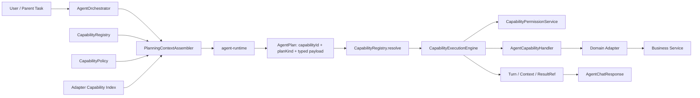
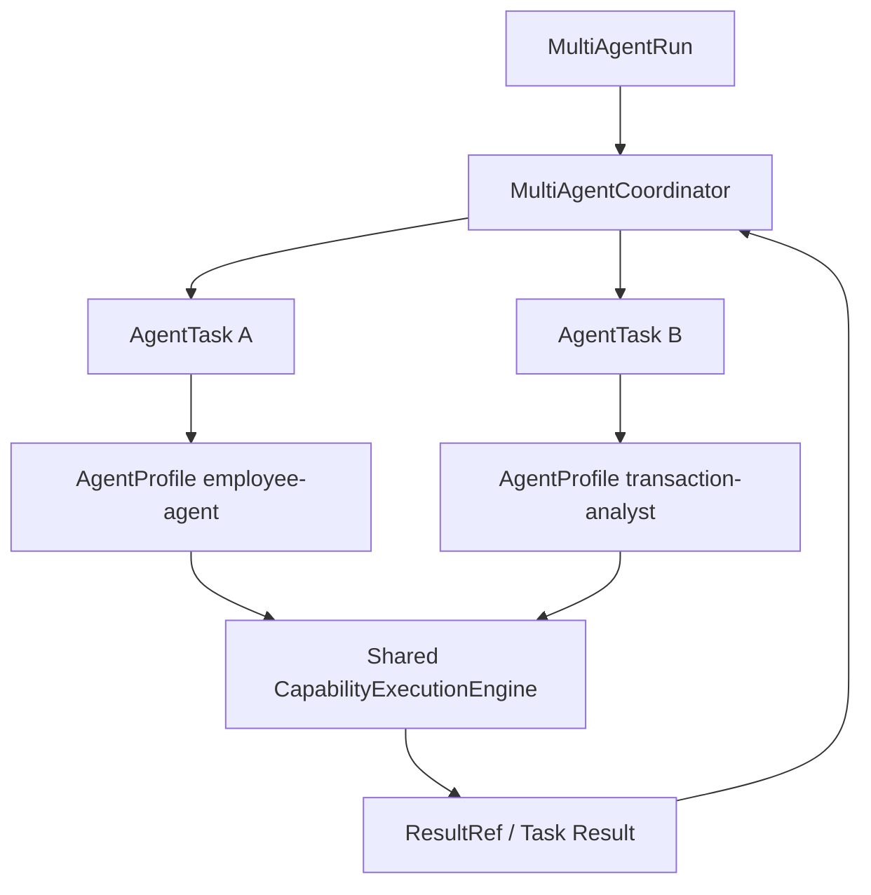

# Agent 能力架构收敛与 Multi-Agent 演进实施设计 v1.0

> 文档状态：拆分源材料（非权威）  
> 适用基线：`04e136b` 及其后续同源提交  
> 适用模块：`agent-api`、`agent-service`、`agent-runtime`、`agent-adapter-api`、`agent-adapter-*`  
> 前提：系统尚未投产，不保留旧契约、旧配置、旧数据库结构或 Python 兼容别名  
> 替代关系：L0 权威基线已迁移至 `Agent目标架构总览_v1.0.md`  
> 文档职责：保留原始实施问题和拆分素材，不能作为直接编码基线

---

## 1. 文档目的

本文将当前 Agent 从“已经下发 capability metadata、但执行仍以 intent 为主”的过渡状态，收敛为真正的 `capabilityId-first` 架构，并给出从能力扩展演进到 multi-agent 的完整实施方案。

本文解决以下问题：

1. 以 `capabilityId` 统一能力选择、权限、路由、执行、审计和持久化。
2. 将 `AgentIntent` 从能力主键中移除，避免一个 intent 只能对应一个 capability。
3. 建立 capability metadata 单一 Java 来源，删除 handler、factory、Python prompt 之间的重复声明。
4. 建立可脱离聊天入口复用的 `CapabilityExecutionEngine`，为 multi-agent 子任务执行提供稳定内核。
5. 收敛 Java → OpenAPI/JSON Schema → Python generated model 的单向契约链。
6. 收敛 Domain 字段能力、Adapter 能力和配置策略的事实来源。
7. 删除未投产阶段不应保留的兼容层、死代码、过渡 SQL 和误导性抽象。
8. 明确能力扩展完成后 multi-agent 只新增协调层，不重写既有执行层。

---

## 2. 设计边界

### 2.1 本文实施范围

- QUERY、CLARIFY、AGGREGATE 三项现有能力的 capability-first 改造。
- Java capability registration、catalog、permission、execution、persistence 收敛。
- Runtime 路由和规划从固定 intent 映射改为 capability 驱动。
- Agent Plan 与响应契约改为明确的类型联合。
- OpenAPI 3.1/JSON Schema 生成、Python 代码生成和 drift check。
- Domain Field Definition 与运行策略配置分离。
- Context Envelope、Capability 审计字段和后续 ResultRef 接口预留。
- Multi-agent 所需 Agent Profile、Run、Task、Coordinator 的目标设计和接入边界。
- 配置、SQL、测试、CI、文档的同步改造。

### 2.2 本文不实施的业务能力

- 不在本轮实现 SUMMARY、UPDATE、BUSINESS_SUBMIT、WORKFLOW_ACTION 的业务逻辑。
- 不在 capability 收敛阶段实现用户确认、审批、幂等执行和写操作风控。
- 不在 capability 收敛阶段实现 multi-agent 调度算法、自动委派、并行执行或长期记忆。
- 不引入 capability 管理后台或数据库动态注册。
- 不允许 Runtime 直接调用业务服务、数据库、消息队列或工作流服务。

### 2.3 明确删除的兼容要求

- 不兼容旧 `AgentPlan` JSON。
- 不兼容旧 `agent.intent-roles` 配置。
- 不兼容旧 `agent_turn.intent` 和 `query_context_json` 结构。
- 不保留 Python 大写枚举别名、legacy import alias 或测试 re-export。
- 不执行旧库增量迁移；直接修改初始化基线 SQL。

---

## 3. 当前基线结论

### 3.1 可保留的架构边界

以下边界继续作为架构不变量：

1. Runtime 只负责自然语言理解和候选 Plan 生成。
2. Java 对 Runtime 输出执行结构、权限、领域、字段、风险和上下文的最终校验。
3. Adapter 只接收 Java 校验后的执行模型。
4. Adapter 通过业务 API 调用下游服务，不直连业务数据库。
5. 业务结果必须经过字段过滤和脱敏后才能返回、持久化或形成 ResultRef。
6. 用户身份只来自认证上下文，不进入 Runtime。
7. 未注册、未授权或不在当前 Agent Profile 中的 capability 默认拒绝。

### 3.2 必须消除的当前问题

| 编号 | 当前问题 | 目标状态 |
|---|---|---|
| P-01 | `AgentPlan` 无 `capabilityId` | Route、Plan、Java 执行全链路携带 required `capabilityId` |
| P-02 | Handler Registry 以 `AgentIntent` 为 key | Registry 以 `capabilityId` 为唯一 key |
| P-03 | 权限使用 `intentRoles` | 权限使用 `capabilityRoles` 或 capability policy |
| P-04 | `CapabilityDescriptorFactory` 与 handler 重复 metadata | Handler Registration 是静态 metadata 唯一来源 |
| P-05 | Python 手写 intent → capability 映射 | Python 只从请求 capability catalog 选择 capability |
| P-06 | Graph 和 prompt 固定 QUERY/AGGREGATE/CLARIFY | 规划策略按 `planKind` 注册，能力按 catalog 动态渲染 |
| P-07 | Orchestrator 同时负责规划和执行 | 拆出独立 `CapabilityExecutionEngine` |
| P-08 | `query_context_json` 存储多种 Object | 使用带类型和版本的 `CapabilityContextEnvelope` |
| P-09 | Domain 字段能力在 YAML、Catalog、Mapper 多处维护 | Adapter Field Definition 是执行能力来源，YAML 只保存策略 |
| P-10 | OpenAPI artifact 无 paths，contract ref 不可解析 | 输出完整 OpenAPI 和 JSON Schema，所有 ref 构建时可解析 |
| P-11 | Python generated model 依赖 regex 兼容后处理 | 修正 Java Schema，Python 直接生成，不做语义补丁 |
| P-12 | 架构文档与实现状态不一致 | 同一提交更新架构、实施、生成和验证文档 |

---

## 4. 核心设计原则

### 4.1 能力、计划形态和 Agent 三个概念分离

| 概念 | 稳定主键 | 含义 | 示例 |
|---|---|---|---|
| Capability | `capabilityId` | 可授权、可执行、可审计的原子能力 | `query.search`、`aggregate.compute` |
| Plan Kind | `planKind` | Plan 的结构类型和规划策略 | `QUERY`、`CLARIFY`、`AGGREGATE` |
| Agent Profile | `agentId` | 一组 capability、Prompt 策略和上下文策略 | `employee-agent`、`transaction-analyst` |

约束：

- 多个 capability 可以使用同一个 `planKind`。
- 一个 Agent Profile 可以包含多个 capability。
- 多个 Agent Profile 可以复用同一个 capability。
- Handler、权限、审计不以 `planKind` 为主键。
- 新增同类 capability 不得修改 Orchestrator、ExecutionEngine 或 Runtime 核心路由。

### 4.2 Java 是唯一跨服务契约来源

Java 唯一负责：

- 请求/响应结构。
- required、nullable、长度、数值范围和枚举。
- capability descriptor 结构。
- Plan 类型联合和 discriminator。
- Context/ResultRef 结构。
- capability 注册 metadata。
- 最终业务语义和执行权限。

Python 只负责：

- 消费 Java 生成的结构模型。
- Runtime 内部 RouteDecision 和 LangGraph 状态。
- LLM Prompt 和 repair 策略。
- 为减少无效 LLM 重试而执行轻量语义检查。

Python 不得维护：

- capability ID 固定目录。
- capability → planKind 固定映射。
- 独立的业务字段/operator 目录。
- 最终权限、风险或执行结论。

### 4.3 静态定义与请求级可用性分离

- `CapabilityDefinition`：代码级静态事实，由 handler registration 提供。
- `CapabilityPolicy`：配置级启停和角色策略。
- `AvailableCapability`：按用户、Agent Profile、Domain Adapter 计算后的请求级视图。
- `AgentCapabilityDescriptor`：发送给 Runtime 的序列化视图，只包含当前请求真正可用的能力。

Runtime 请求中不发送 disabled capability；不存在即不可用，因此删除请求 descriptor 中的 `enabled` 和 `reasonCode` 兼容字段。

---

## 5. 目标架构

### 5.1 Capability 执行主链路



### 5.2 Multi-Agent 演进链路



Multi-agent 不增加第二套能力执行框架。Coordinator 只负责任务拆分、依赖、预算、重试、委派和结果汇总；所有业务动作仍进入同一个 `CapabilityExecutionEngine`。

---

## 6. 关键架构决策

### 6.1 `AgentIntent` 改为 `AgentPlanKind`

删除 `AgentIntent`，新增：

```java
public enum AgentPlanKind {
    QUERY,
    CLARIFY,
    AGGREGATE
}
```

本轮不提前加入 SUMMARY、COMMAND 等未来枚举。新增 plan kind 时必须同时提供 Java Plan subtype、Runtime PlanningStrategy、契约生成和执行测试。

### 6.2 Agent Plan 使用明确类型联合

目标 JSON：

```json
{
  "requestId": "turn-001",
  "plan": {
    "planVersion": "2.0",
    "capabilityId": "query.search",
    "planKind": "QUERY",
    "domain": "employee",
    "query": {
      "contextMode": "REPLACE",
      "filters": [
        {
          "field": "status",
          "operator": "EQ",
          "value": "ACTIVE"
        }
      ],
      "selectFields": ["chineseName"],
      "page": 1,
      "size": 20
    }
  }
}
```

Java 类型：

```java
@JsonTypeInfo(
    use = JsonTypeInfo.Id.NAME,
    include = JsonTypeInfo.As.EXISTING_PROPERTY,
    property = "planKind",
    visible = true)
@JsonSubTypes({
    @JsonSubTypes.Type(value = QueryAgentPlan.class, name = "QUERY"),
    @JsonSubTypes.Type(value = ClarifyAgentPlan.class, name = "CLARIFY"),
    @JsonSubTypes.Type(value = AggregateAgentPlan.class, name = "AGGREGATE")
})
@Schema(oneOf = {QueryAgentPlan.class, ClarifyAgentPlan.class, AggregateAgentPlan.class},
        discriminatorProperty = "planKind")
public abstract class AgentPlan {
    private String planVersion;
    private String capabilityId;
    private AgentPlanKind planKind;
    private String domain;
}
```

结构约束由 subtype 表达，不再通过顶层 `query/clarify/aggregate` 三个 nullable 字段组合表达。

### 6.3 Capability Registration 是 metadata 唯一来源

```java
public record CapabilityDefinition(
        String capabilityId,
        AgentPlanKind planKind,
        String displayName,
        String description,
        AgentCapabilityRiskLevel riskLevel,
        AgentCapabilityExecutionMode executionMode,
        Class<? extends AgentPlan> inputType,
        Class<? extends AgentResponsePayload> outputType,
        CapabilityContextSpec contextSpec,
        boolean domainBound) {
}
```

每个 handler 必须返回一个 `CapabilityDefinition`。Catalog、Runtime descriptor、schema ref、权限校验和审计均从该定义派生，不再存在独立硬编码 factory。

### 6.4 Runtime descriptor 不暴露角色

Runtime 只收到当前用户和当前 Agent Profile 已授权后的 available capability。角色、JWT、权限表达式不发送给 Runtime。

### 6.5 Contract Ref 必须可解析

`CapabilityContractRef.schema` 改为 `schemaRef`，值必须是 OpenAPI/JSON Schema 中真实存在的 JSON Pointer，例如：

```json
{
  "schemaRef": "#/components/schemas/QueryAgentPlan",
  "version": "2.0"
}
```

禁止 `AgentPlan.query`、`AgentChatResponse.CLARIFY` 等逻辑字符串。

### 6.6 Domain 执行能力与策略配置分离

- Adapter Definition：字段名、类型、operator、格式、精度、聚合函数。
- Agent 配置：字段别名、访问角色、filter/display 角色、脱敏和默认展示。
- Schema Factory：组合两者，输出 RuntimeDomainSchema。

### 6.7 Context 使用可版本化 Envelope

```java
public record CapabilityContextEnvelope(
        AgentContextType type,
        String version,
        String sourceCapabilityId,
        CapabilityContextPayload payload) {
}
```

数据库不再保存裸 `Object`，也不再使用 `query_context_json` 表示非查询上下文。

---

## 7. `agent-api` 详细设计

### 7.1 包结构目标

```text
com.dylan.agent.api
├─ capability
│  ├─ AgentCapabilityDescriptor.java
│  ├─ AgentCapabilityExecutionMode.java
│  ├─ AgentCapabilityRiskLevel.java
│  ├─ CapabilityContextSpec.java
│  └─ CapabilityContractRef.java
├─ enums
│  ├─ AgentPlanKind.java
│  ├─ AgentResponseType.java
│  ├─ AgentErrorCode.java
│  ├─ AgentContextType.java
│  └─ 现有字段/operator/aggregate/runtime role 枚举
├─ plan
│  ├─ AgentPlan.java
│  ├─ QueryAgentPlan.java
│  ├─ ClarifyAgentPlan.java
│  ├─ AggregateAgentPlan.java
│  └─ 现有 Query/Aggregate/Filter Spec
├─ request
│  ├─ AgentChatRequest.java
│  └─ PlanGenerateRequest.java
├─ response
│  ├─ AgentChatResponse.java
│  ├─ AgentResponsePayload.java
│  ├─ QueryResponsePayload.java
│  ├─ AggregateResponsePayload.java
│  ├─ ClarifyResponsePayload.java
│  └─ 现有 Query/Aggregate Result DTO
└─ runtime
   ├─ CapabilityContextEnvelope.java
   ├─ CapabilityContextPayload.java
   ├─ RuntimeQueryContext.java
   ├─ RuntimeAggregateContext.java
   └─ RuntimeDomainSchema / RuntimeFieldSchema / RuntimeTurn
```

### 7.2 文件、类和方法清单

| 状态 | 文件 / 类 | 字段或方法 | 设计要求 |
|---|---|---|---|
| 删除 | `enums/AgentIntent.java` | 全部 | 不保留兼容枚举 |
| 新增 | `enums/AgentPlanKind.java` | `QUERY`、`CLARIFY`、`AGGREGATE` | 只表示结构类型 |
| 修改 | `enums/AgentResponseType.java` | `SUCCESS`、`CLARIFY`、`ERROR` | 删除 `RESULT`、`AGGREGATE_RESULT` 对具体能力的耦合 |
| 修改 | `enums/AgentErrorCode.java` | 新增 `AGENT_CAPABILITY_FORBIDDEN`、`AGENT_CAPABILITY_NOT_FOUND`、`AGENT_CAPABILITY_EXECUTION_FAILED`；删除 `AGENT_INTENT_FORBIDDEN`、`AGENT_QUERY_FAILED` | 错误语义以 capability 为中心 |
| 新增 | `enums/AgentContextType.java` | `QUERY_CONTEXT`、`AGGREGATE_CONTEXT` | Context discriminator；只加入当前已实现类型 |
| 保留 | `AgentCapabilityRiskLevel` | 当前 `READ_ONLY` | 写能力落地时再新增风险值 |
| 保留 | `AgentCapabilityExecutionMode` | 当前 `IMMEDIATE` | 确认链路落地时再新增模式 |
| 修改 | `capability/AgentCapabilityDescriptor.java` | `capabilityId`、`planKind`、`displayName`、`description`、`domains`、`riskLevel`、`executionMode`、`inputContract`、`outputContract`、`context` | 删除 `intent`、`enabled`、`permissions`；`domains` 为已授权 domain 名称列表 |
| 删除 | `capability/CapabilityDomainScope.java` | 全部 | 当前请求只发送可用 domain，无需 enabled/reasonCode 包装 |
| 修改 | `capability/CapabilityContractRef.java` | `schemaRef`、`version` | `schemaRef` 必须为真实 JSON Pointer |
| 修改 | `capability/CapabilityContextSpec.java` | `List<AgentContextType> reads`、`writes` | 删除自由字符串 context key |
| 修改 | `plan/AgentPlan.java` | 公共字段、`getPlanVersion()`、`getCapabilityId()`、`getPlanKind()`、`getDomain()` 及对应 setter | 抽象基类；Jackson/OpenAPI discriminator 为 `planKind` |
| 新增 | `plan/QueryAgentPlan.java` | `AgentQuerySpec query`、`getQuery()`、`setQuery()` | `query` required；不再存在 clarify/aggregate 字段 |
| 新增 | `plan/ClarifyAgentPlan.java` | `ClarifySpec clarify`、`getClarify()`、`setClarify()` | `clarify` required；domain nullable |
| 新增 | `plan/AggregateAgentPlan.java` | `AgentAggregateSpec aggregate`、`getAggregate()`、`setAggregate()` | `aggregate` required |
| 修改 | `request/PlanGenerateRequest.java` | 现有 getter/setter；`domainSchemas` 允许空列表；`capabilities` 使用 `@NotEmpty` | 支持 domainless Agent Profile；至少一项 capability |
| 修改 | `response/PlanGenerateResponse.java` | `requestId`、required `AgentPlan plan` | 成功响应必须有 plan；错误使用 RuntimeErrorResponse |
| 新增 | `response/AgentResponsePayload.java` | sealed marker interface | OpenAPI oneOf 输出根类型 |
| 新增 | `response/QueryResponsePayload.java` | `AgentQueryParameters parameters`、`AgentQueryResult result` | QUERY 成功负载 |
| 新增 | `response/AggregateResponsePayload.java` | `AgentAggregateResult result` | AGGREGATE 成功负载 |
| 新增 | `response/ClarifyResponsePayload.java` | `String question` | CLARIFY 负载 |
| 修改 | `response/AgentChatResponse.java` | `conversationId`、`turnId`、`capabilityId`、`planKind`、`type`、`message`、`summary`、`AgentResponsePayload payload`、`errorCode` | 删除 query/aggregate 专用顶层字段；所有字段提供标准 getter/setter |
| 新增 | `runtime/CapabilityContextPayload.java` | sealed marker interface | Context payload 根类型 |
| 新增 | `runtime/CapabilityContextEnvelope.java` | `type`、`version`、`sourceCapabilityId`、`payload` 及 getter/setter | 持久化 context 的唯一外壳 |
| 修改 | `RuntimeQueryContext.java` | 实现 `CapabilityContextPayload` | 字段保持现状 |
| 修改 | `RuntimeAggregateContext.java` | 实现 `CapabilityContextPayload` | 字段保持现状 |
| 修改 | `RuntimeFieldSchema.java` | `supportedAggregateFunctions` required、非 null | 空数组表示无字段级非 COUNT 聚合；domain 可用性不再用 null 表示 |

所有普通 DTO 均保持：

- public 无参构造函数。
- 每个字段一个 public getter 和 setter。
- `@Schema`、Bean Validation 和 Jackson JSON 名称在 Java 中声明。
- object schema `additionalProperties: false`。

### 7.3 Agent Plan 不变量

| Plan subtype | capabilityId 示例 | planKind | domain | 专属字段 |
|---|---|---|---|---|
| QueryAgentPlan | `query.search` | QUERY | required | `query` required |
| ClarifyAgentPlan | `clarify.ask` | CLARIFY | optional | `clarify` required |
| AggregateAgentPlan | `aggregate.compute` | AGGREGATE | required | `aggregate` required |

Java `CapabilityRegistry.resolve()` 必须再次验证 capability definition 的 planKind 与实际 subtype 一致，不能只依赖 Jackson discriminator。

### 7.4 响应结构不变量

- `SUCCESS`：payload 必须是 QueryResponsePayload 或 AggregateResponsePayload。
- `CLARIFY`：payload 必须是 ClarifyResponsePayload。
- `ERROR`：payload 必须为 null，errorCode 必须非 null。
- 成功响应的 `capabilityId` 和 `planKind` 必须来自 resolved capability，不从 handler 返回的任意字符串读取。

### 7.5 Contract fixture

修改现有：

- `contracts/query-plan-v1.json` → `query-plan-v2.json`
- `contracts/transaction-query-plan-v1.json` → `transaction-query-plan-v2.json`
- `contracts/clarify-plan-v1.json` → `clarify-plan-v2.json`
- `contracts/ambiguous-domain-clarify-plan-v1.json` → `ambiguous-domain-clarify-plan-v2.json`
- `contracts/aggregate-plan-v1.json` → `aggregate-plan-v2.json`

新增负例：

- `invalid/unknown-capability-v2.json`
- `invalid/capability-kind-mismatch-v2.json`
- `invalid/unknown-property-v2.json`
- `invalid/missing-capability-id-v2.json`
- `invalid/missing-plan-payload-v2.json`

---

## 8. `agent-service` Capability 注册与 Catalog 设计

### 8.1 新包结构

```text
com.dylan.agent
├─ capability
│  ├─ definition
│  │  └─ CapabilityDefinition.java
│  ├─ registry
│  │  ├─ CapabilityRegistry.java
│  │  └─ ResolvedCapability.java
│  ├─ catalog
│  │  ├─ CapabilityCatalogService.java
│  │  └─ AvailableCapabilitySet.java
│  ├─ AgentCapabilityHandler.java
│  ├─ CapabilityValidationContext.java
│  └─ query / clarify / aggregate
├─ execution
│  ├─ CapabilityExecutionEngine.java
│  ├─ CapabilityExecutionCommand.java
│  └─ CapabilityExecutionResult.java
└─ planning
   ├─ PlanningContextAssembler.java
   └─ RuntimeDomainSchemaFactory.java
```

### 8.2 CapabilityDefinition

文件：`agent-service/src/main/java/com/dylan/agent/capability/definition/CapabilityDefinition.java`

使用 immutable record，构造时校验：

- capabilityId 匹配 `[a-z][a-z0-9-]*(\.[a-z][a-z0-9-]*)+`。
- planKind、riskLevel、executionMode、inputType、outputType 非 null。
- displayName、description 非空。
- inputType 必须是 AgentPlan subtype。
- outputType 必须是 AgentResponsePayload subtype。
- inputType 声明的 planKind 必须与 definition 一致。

公开方法：

```java
String capabilityId();
AgentPlanKind planKind();
String displayName();
String description();
AgentCapabilityRiskLevel riskLevel();
AgentCapabilityExecutionMode executionMode();
Class<? extends AgentPlan> inputType();
Class<? extends AgentResponsePayload> outputType();
CapabilityContextSpec contextSpec();
boolean domainBound();
```

### 8.3 Handler 内部 Definition 声明

每个 handler 只在本类声明一个 immutable 常量：

```java
private static final CapabilityDefinition DEFINITION = new CapabilityDefinition(...);

@Override
public CapabilityDefinition definition() {
    return DEFINITION;
}
```

不新增 `CapabilityDefinitions` 工具类，避免 definition 与 handler 再次形成两个维护点。权限配置直接以 `capabilityId` 为 key，因此 definition 不再额外声明 permissionPolicyId。

### 8.4 AgentCapabilityHandler

目标接口：

```java
public interface AgentCapabilityHandler<
        P extends AgentPlan,
        V extends ValidatedCapabilityPlan> {

    CapabilityDefinition definition();

    Class<P> planType();

    V validate(P plan, CapabilityValidationContext context);

    CapabilityExecutionResult execute(
            V validatedPlan,
            CapabilityExecutionContext context);
}
```

删除方法：

- `AgentIntent intent()`
- `AgentCapabilityRiskLevel riskLevel()`

约束：

- Handler 不自行决定 capabilityId。
- Handler 返回结果时不得覆盖 resolved capabilityId、risk 或 executionMode。
- Handler 不依赖 Runtime response envelope，只接收已解析的具体 Plan subtype。

### 8.5 CapabilityRegistry

文件：`capability/registry/CapabilityRegistry.java`

构造函数：

```java
CapabilityRegistry(List<AgentCapabilityHandler<?, ?>> handlers)
```

公开方法：

```java
Collection<CapabilityDefinition> definitions();

Set<String> capabilityIds();

AgentCapabilityHandler<?, ?> getRequired(String capabilityId);

CapabilityDefinition definitionRequired(String capabilityId);

ResolvedCapability resolve(
        AgentPlan plan,
        AvailableCapabilitySet availableCapabilities);
```

启动校验：

- handler 列表非空。
- capabilityId 唯一。
- definition 非 null。
- `handler.planType()` 与 definition.inputType 完全一致。
- 同一个 planKind 允许多个 handler。
- 任何 capability 不要求存在固定 QUERY/CLARIFY/AGGREGATE 全集。

`resolve()` 校验顺序：

1. plan 和 capabilityId 非空。
2. capabilityId 已注册。
3. capabilityId 在 AvailableCapabilitySet 中。
4. planKind 与 definition.planKind 相同。
5. plan 实例类型与 handler.planType 相同。
6. domainBound capability 的 domain 非空且在 available domains 中。
7. domainless capability 不得伪造 domain，除非 definition 明确允许 optional domain。

### 8.6 ResolvedCapability

文件：`capability/registry/ResolvedCapability.java`

```java
public record ResolvedCapability(
        CapabilityDefinition definition,
        AgentCapabilityHandler<?, ?> handler,
        AgentPlan plan) {
}
```

该对象是 Orchestrator、Permission 和 ExecutionEngine 之间唯一传递的路由结果，禁止继续同时传递裸 capabilityId、planKind 和 handler。

### 8.7 AvailableCapabilitySet

文件：`capability/catalog/AvailableCapabilitySet.java`

内部保存：

```java
Map<String, Set<String>> domainsByCapabilityId;
```

公开方法：

```java
boolean contains(String capabilityId);
Set<String> domains(String capabilityId);
Set<String> capabilityIds();
boolean allowsDomain(String capabilityId, String domain);
```

### 8.8 CapabilityCatalogService

文件：`capability/catalog/CapabilityCatalogService.java`

依赖：

- CapabilityRegistry
- CapabilityPermissionService
- AgentProperties
- QueryableAdapterRegistry
- AggregatableAdapterRegistry
- 后续 AgentProfileRegistry

公开方法：

```java
AvailableCapabilitySet resolveAvailable(
        AgentUserContext userContext,
        String agentId);

List<AgentCapabilityDescriptor> createRuntimeDescriptors(
        AvailableCapabilitySet available);
```

当前 capability domain 规则：

| capabilityId | domain 来源 |
|---|---|
| `query.search` | QueryableAdapterRegistry.domains ∩ configured domain policies |
| `aggregate.compute` | AggregatableAdapterRegistry.domains ∩ configured domain policies |
| `clarify.ask` | 空集合，domainless |

`resolveAvailable()` 必须先过滤 capability role，再过滤 Agent Profile capability set，最后计算 adapter domain，不允许把无权执行的 capability 发给 Runtime。

### 8.9 删除和替换的现有类

| 删除类 | 替代类 |
|---|---|
| `CapabilityDescriptorFactory` | `CapabilityDefinition` + `CapabilityCatalogService` |
| `AgentCapabilityHandlerRegistry` | `CapabilityRegistry` |
| `CapabilityRouter` | `CapabilityRegistry.resolve()` |
| `CapabilityRouteResolver` | `CapabilityRegistry.resolve()`；envelope 校验移入 RuntimeClient/Orchestrator |

---

## 9. PlanningContextAssembler

文件：`agent-service/src/main/java/com/dylan/agent/planning/PlanningContextAssembler.java`

目的：一次性构造相互一致的 `capabilities` 和 `domainSchemas`，避免两个独立 factory 生成不同视图。

依赖：

- CapabilityCatalogService
- RuntimeDomainSchemaFactory
- ConversationService
- AgentProperties

公开方法：

```java
PlanningContext assemble(
        AgentUserContext userContext,
        String agentId,
        String conversationId,
        String turnId,
        String normalizedMessage);
```

`PlanningContext` 字段：

```java
PlanGenerateRequest request();
AvailableCapabilitySet availableCapabilities();
RuntimeQueryContext previousQuery();
```

构造顺序：

1. 加载 recentTurns。
2. 加载 previousQuery。
3. 计算 AvailableCapabilitySet。
4. 生成 Runtime descriptors。
5. 只为 available capability 涉及的 domain 生成 RuntimeDomainSchema。
6. 执行 referential integrity 校验。
7. 构造 PlanGenerateRequest。

完整性校验：

- descriptor 中的每个 domain 必须存在于 domainSchemas。
- domainSchemas 可以为空，但此时所有 capability 必须为 domainless。
- capabilities 不得为空。
- capability contract ref 必须存在于已生成 schema registry。

---

## 10. CapabilityExecutionEngine

### 10.1 CapabilityExecutionCommand

文件：`agent-service/src/main/java/com/dylan/agent/execution/CapabilityExecutionCommand.java`

```java
public record CapabilityExecutionCommand(
        String conversationId,
        String turnId,
        String runId,
        String taskId,
        String agentId,
        AgentUserContext userContext,
        ResolvedCapability resolvedCapability,
        RuntimeQueryContext previousQuery) {
}
```

本轮单 Agent 阶段：

- `runId`、`taskId` 可为 null。
- `agentId` 固定为配置中的 `default`。

Multi-agent 阶段直接填充这三个字段，不修改 Engine 方法签名。

### 10.2 CapabilityExecutionResult

移动并重写：`agent-service/src/main/java/com/dylan/agent/execution/CapabilityExecutionResult.java`

```java
public record CapabilityExecutionResult(
        AgentResponseType responseType,
        String message,
        String summary,
        AgentResponsePayload payload,
        CapabilityContextEnvelope contextToPersist) {
}
```

不包含 capabilityId 和 planKind，二者始终来自 `ResolvedCapability.definition()`，防止 handler 伪造路由事实。

删除现有静态工厂：

- `queryResult(...)`
- `clarify(...)`
- `aggregateResult(...)`

改由各 handler 构造类型化 payload 后调用统一构造函数；构造器执行 responseType/payload 一致性校验。

### 10.3 CapabilityExecutionEngine

文件：`agent-service/src/main/java/com/dylan/agent/execution/CapabilityExecutionEngine.java`

依赖：

- CapabilityPermissionService

公开方法：

```java
CapabilityExecutionResult execute(CapabilityExecutionCommand command);
```

内部方法：

```java
private ValidatedCapabilityPlan validate(
        ResolvedCapability resolved,
        CapabilityValidationContext context);

private CapabilityExecutionResult invokeHandler(
        ResolvedCapability resolved,
        ValidatedCapabilityPlan validated,
        CapabilityExecutionContext context);

private void validateResult(
        CapabilityDefinition definition,
        CapabilityExecutionResult result);
```

执行顺序：

1. 校验 command、userContext、resolved capability。
2. `permissionService.checkCapability()`。
3. 构造 CapabilityValidationContext。
4. 调用 handler.validate()。
5. 构造 CapabilityExecutionContext。
6. 调用 handler.execute()。
7. 校验 output payload 类型与 definition.outputType 一致。
8. 校验 context type 与 definition.contextSpec 一致。
9. 返回结果；不在 Engine 内完成 Turn，Turn 生命周期由调用者负责。

失败处理：

- Handler/Adapter 可预期失败统一转换为 `AgentCapabilityExecutionException`。
- 权限错误保持 `AgentPermissionDeniedException`。
- Plan 错误保持 `AgentPlanValidationException`。
- 未知 Runtime/系统异常由 Orchestrator 统一标记 Turn FAILED。

### 10.4 CapabilityValidationContext

保留文件并精简字段：

```java
public record CapabilityValidationContext(
        String requestId,
        AgentUserContext userContext,
        RuntimeQueryContext previousQuery,
        AvailableCapabilitySet availableCapabilities) {
}
```

删除：

- `PlanGenerateResponse planResponse`
- `expectedRequestId`

Handler 已收到具体 Plan subtype，Context 不再携带完整 Runtime envelope。

### 10.5 CapabilityExecutionContext

删除旧文件 `capability/CapabilityExecutionContext.java`，在 `execution/CapabilityExecutionContext.java` 新建目标类型：

目标结构：

```java
public record CapabilityExecutionContext(
        String conversationId,
        String turnId,
        String runId,
        String taskId,
        String agentId,
        AgentUserContext userContext,
        RuntimeQueryContext previousQuery) {
}
```

删除 `normalizedMessage`。业务 capability 执行依赖结构化 Plan，不应再次读取自然语言文本。

---

## 11. AgentOrchestrator 收敛

文件：`agent-service/src/main/java/com/dylan/agent/application/AgentOrchestrator.java`

依赖调整：

- 保留 ConversationService、AgentRuntimeClient；权限依赖替换为 CapabilityPermissionService。
- 删除 RuntimeDomainSchemaFactory、CapabilityDescriptorFactory、CapabilityRouteResolver、CapabilityRouter 直接依赖。
- 新增 PlanningContextAssembler、CapabilityRegistry、CapabilityExecutionEngine。

目标方法：

```java
public AgentChatResponse chat(
        AgentUserContext userContext,
        AgentChatRequest request);

private AgentPlan generatePlan(PlanningContext planningContext);

private ResolvedCapability resolvePlan(
        AgentPlan plan,
        PlanningContext planningContext);

private AgentChatResponse buildResponse(
        ConversationHandle conversation,
        TurnHandle turn,
        ResolvedCapability resolved,
        CapabilityExecutionResult result);

private String normalizeMessage(String message);
```

删除：

- `validateUnchecked()`
- `executeUnchecked()`
- 基于 intent 的 `completeTurn()` 参数。

新流程：

```text
requireAgentAccess
  → openConversation
  → startTurn
  → PlanningContextAssembler.assemble
  → AgentRuntimeClient.generate
  → Runtime envelope 校验
  → CapabilityRegistry.resolve
  → CapabilityExecutionEngine.execute
  → ConversationService.completeSuccess
  → buildResponse
```

Orchestrator 不包含 capability-specific switch，不理解 Query/Aggregate payload 字段。

---

## 12. Handler 与 Validator 改造

### 12.1 QueryCapabilityHandler

文件：`capability/query/QueryCapabilityHandler.java`

方法：

```java
CapabilityDefinition definition(); // query.search
Class<QueryAgentPlan> planType();
ValidatedQueryPlan validate(
        QueryAgentPlan plan,
        CapabilityValidationContext context);
CapabilityExecutionResult execute(
        ValidatedQueryPlan plan,
        CapabilityExecutionContext context);
```

执行结果：

- responseType = SUCCESS。
- payload = QueryResponsePayload。
- context = QUERY_CONTEXT v1。

### 12.2 QueryPlanValidator

文件：`capability/query/QueryPlanValidator.java`

方法签名修改：

```java
ValidatedQueryPlan validate(
        QueryAgentPlan plan,
        CapabilityValidationContext context);
```

保留：

- REPLACE/MERGE。
- filter normalization。
- removeFields、selectFields、page、size 校验。
- QueryMergeEngine。

删除：

- intent 判断。
- query/clarify/aggregate 互斥判断；由 subtype 和 JSON Schema 保证。
- PlanGenerateResponse 解包。

### 12.3 ClarifyCapabilityHandler / ClarifyPlanValidator

方法：

```java
CapabilityDefinition definition(); // clarify.ask
Class<ClarifyAgentPlan> planType();
ValidatedClarifyPlan validate(
        ClarifyAgentPlan plan,
        CapabilityValidationContext context);
CapabilityExecutionResult execute(...);
```

ClarifyPlanValidator 只校验：

- question trim 后 1～500 字符。
- domain 非空时必须存在于 PlanningContext domainSchemas。

结果 payload 为 ClarifyResponsePayload，不写 context。

### 12.4 AggregateCapabilityHandler / AggregatePlanValidator

方法：

```java
CapabilityDefinition definition(); // aggregate.compute
Class<AggregateAgentPlan> planType();
ValidatedAggregatePlan validate(
        AggregateAgentPlan plan,
        CapabilityValidationContext context);
CapabilityExecutionResult execute(...);
```

保留指标、groupBy、orderBy、maxRows、field type、adapter capability 校验。

删除：

- intent 和 payload 互斥校验。
- nullable adapter registry 分支。
- 对 API `AggregateOrderSpec` 的 validated model 复用。

结果 payload 为 AggregateResponsePayload，context 为 AGGREGATE_CONTEXT v1。

### 12.5 Validated Plan

修改：

```java
public interface ValidatedCapabilityPlan {
    String capabilityId();
    AgentPlanKind planKind();
    String domain();
}
```

删除 `auditSummary()` 字符串方法。审计信息必须从 typed Plan、definition 和 execution record 生成。

修改文件：

- `ValidatedQueryPlan.java`
- `ValidatedClarifyPlan.java`
- `ValidatedAggregatePlan.java`

每个实现增加 capabilityId，构造时固定为其 handler definition 的 ID，不接收 Runtime 任意覆盖。

---

## 13. 权限模型

### 13.1 配置模型

`AgentProperties` 删除：

```java
Map<AgentIntent, Set<String>> intentRoles;
```

新增：

```java
Map<String, CapabilityPolicyProperties> capabilities;

public static class CapabilityPolicyProperties {
    private boolean enabled;
    private Set<String> roles;
}
```

标准 getter/setter：

```java
Map<String, CapabilityPolicyProperties> getCapabilities();
void setCapabilities(...);
boolean isEnabled();
void setEnabled(boolean enabled);
Set<String> getRoles();
void setRoles(Set<String> roles);
```

### 13.2 CapabilityPermissionService

删除 `AgentPermissionService`，新增 `CapabilityPermissionService`。

目标方法：

```java
void requireAgentAccess(AgentUserContext context);

boolean canUseCapability(
        AgentUserContext context,
        String capabilityId);

void checkCapability(
        AgentUserContext context,
        String capabilityId);

void checkQuery(...);
void checkAggregate(...);
FieldPolicy getDisplayPolicy(...);
```

删除：

- `checkIntent()`
- 对 intentRoles 的任何读取。

双重校验：

- Catalog 阶段过滤无权 capability，避免 Runtime 规划不可执行动作。
- ExecutionEngine 阶段重新 checkCapability，防止请求构造后权限或上下文被绕过。

### 13.3 AgentPropertiesValidator

方法调整：

```java
validateCapabilityPolicies();
validateCapabilityRegistrations();
validateDomainPolicies();
validateRuntime();
validateQuery();
validateAggregateConfig();
validateConversation();
```

删除：

- `validateIntentRoles()`
- 固定要求 QUERY/CLARIFY/AGGREGATE handler 全部存在。
- `configDomains.equals(queryableAdapterDomains)`。

新增校验：

- enabled capability 必须已注册。
- 每个已注册 capability 必须有 policy。
- roles 非空。
- domain policy 必须有 DomainFieldDefinitionProvider。
- capability 的 adapter domain 可为 domain policy 的子集。
- 不同 capability adapter 不要求 domain 集合相等。

---

## 14. 会话、持久化与审计

### 14.1 AgentTurnEntity

字段目标：

```java
private String id;
private String conversationId;
private String userId;
private String agentId;
private String runId;
private String taskId;
private String userMessage;
private String capabilityId;
private AgentPlanKind planKind;
private AgentResponseType responseType;
private String assistantMessage;
private AgentContextType contextType;
private String contextVersion;
private String contextJson;
private TurnStatus status;
private AgentErrorCode errorCode;
private LocalDateTime createdAt;
private LocalDateTime completedAt;
```

本轮 `agentId=default`，runId/taskId nullable；提前加入列是为了 ExecutionCommand 与数据库审计结构一致，不引入调度逻辑。

### 14.2 AgentTurnMapper

修改 SQL 和方法：

```java
int insert(AgentTurnEntity entity);

List<AgentTurnEntity> selectRecentSucceeded(
        String conversationId,
        String userId,
        int limit);

AgentTurnEntity selectLatestSucceededCapabilityContext(
        String conversationId,
        String userId,
        String capabilityId,
        AgentContextType contextType);

int completeSuccess(
        String id,
        String capabilityId,
        String planKind,
        String responseType,
        String assistantMessage,
        String contextType,
        String contextVersion,
        String contextJson,
        LocalDateTime completedAt);

int completeFailure(...);
int deleteBefore(...);
```

删除 `selectLatestSucceededQuery()`；ConversationService 使用 capability/context type 查询。

### 14.3 ConversationService

公开方法调整：

```java
RuntimeQueryContext loadLatestQueryContext(...);

void completeSuccess(
        String turnId,
        ResolvedCapability resolved,
        CapabilityExecutionResult result);

void completeFailure(...);
```

新增内部方法：

```java
private String serializeContext(CapabilityContextEnvelope context);
private CapabilityContextEnvelope deserializeContext(AgentTurnEntity turn);
private void validateContextEnvelope(...);
```

禁止根据 `planKind == QUERY` 猜测 JSON 类型；必须读取 contextType discriminator。

### 14.4 数据库初始化

修改 `db/agent-p0.sql`，`agent_turn` 目标字段：

```sql
agent_id VARCHAR(64) NOT NULL DEFAULT 'default',
run_id VARCHAR(64) NULL,
task_id VARCHAR(64) NULL,
capability_id VARCHAR(128) NULL,
plan_kind VARCHAR(32) NULL,
response_type VARCHAR(32) NULL,
assistant_message TEXT NULL,
context_type VARCHAR(64) NULL,
context_version VARCHAR(16) NULL,
context_json JSON NULL
```

索引：

```sql
INDEX idx_agent_turn_conversation_status_seq
    (conversation_id, status, turn_seq),
INDEX idx_agent_turn_capability_context_seq
    (conversation_id, user_id, capability_id, context_type, status, turn_seq),
INDEX idx_agent_turn_run_task
    (run_id, task_id)
```

删除：

- `intent` 列。
- `query_context_json` 列。
- `agent-p0-v1.1.sql`。
- `agent-p0-v1.2.sql`。

由于未投产，不提供 ALTER/数据回填脚本。

---

## 15. `agent-adapter-api` 与 Domain Metadata 设计

### 15.1 DomainAdapter 基接口

新增：`agent-adapter-api/.../DomainAdapter.java`

```java
public interface DomainAdapter {
    String domain();
}
```

修改：

```java
public interface QueryableAdapter extends DomainAdapter {
    DomainFieldCatalog fieldCatalog();
    AdapterQueryResult query(ValidatedQuery query);
}

public interface AggregatableAdapter extends DomainAdapter {
    DomainFieldCatalog fieldCatalog();
    AdapterAggregateResult aggregate(ValidatedAggregateQuery query);
}
```

删除：

- `supportedFields()`
- `supportedAggregateFields()`
- `supportedFunctions(String field)`

以上能力统一由 DomainFieldCatalog 查询。

### 15.2 AdapterFieldDefinition

新增：`agent-adapter-api/.../metadata/AdapterFieldDefinition.java`

```java
public record AdapterFieldDefinition(
        String name,
        AgentFieldType type,
        String formatHint,
        Integer decimalPrecision,
        Integer decimalScale,
        Set<AgentOperator> queryOperators,
        Set<AggregateFunction> aggregateFunctions) {
}
```

构造校验：

- name 非空。
- type 非空。
- queryOperators、aggregateFunctions 非 null；无能力使用空集合。
- DECIMAL 必须提供合法 precision/scale。
- INSTANT 必须提供 formatHint。
- operator/type 组合必须通过共享 `OperatorSemantics`；为避免 adapter-api 反向依赖 agent-service，将该规则移动到 agent-api 或 adapter-api 的纯 Java 工具类。

### 15.3 DomainFieldCatalog

新增：`metadata/DomainFieldCatalog.java`

```java
public final class DomainFieldCatalog {
    String domain();
    Map<String, AdapterFieldDefinition> fields();
    AdapterFieldDefinition fieldRequired(String field);
    Set<String> fieldNames();
    boolean supportsQuery(String field, AgentOperator operator);
    boolean supportsAggregate(String field, AggregateFunction function);
}
```

### 15.4 ValidatedAggregateOrder

新增：`aggregate/AggregateSortDirection.java`

```java
public enum AggregateSortDirection {
    ASC,
    DESC
}
```

新增：`aggregate/ValidatedAggregateOrder.java`

```java
public record ValidatedAggregateOrder(
        String field,
        AggregateSortDirection direction) {
}
```

修改 `ValidatedAggregateQuery`：

```java
List<ValidatedAggregateOrder> getOrderBy();
```

删除对 `agent-api.plan.AggregateOrderSpec` 的引用，使 Adapter 执行模型不复用 Runtime 输入 DTO。

### 15.5 泛型 Registry

新增：`agent-service/.../adapter/DomainAdapterRegistry.java`

```java
public class DomainAdapterRegistry<T extends DomainAdapter> {
    DomainAdapterRegistry(List<T> adapters, String capabilityName);
    T getRequired(String domain);
    Set<String> domains();
    Collection<T> adapters();
}
```

`QueryableAdapterRegistry`、`AggregatableAdapterRegistry` 变为薄类型封装，或在注入点直接使用带 qualifier 的泛型 registry。不得继续复制注册、domain 小写、重复校验逻辑。

### 15.6 Employee Adapter

修改文件：

- `EmployeeFieldCatalog.java`
- `EmployeeAgentAdapter.java`
- `EmployeePlanMapper.java`
- `EmployeeSearchResponseParser.java`
- `EmployeeAdapterProperties.java`
- `EmployeeAgentClient.java`

具体调整：

- EmployeeFieldCatalog 从字段名集合升级为完整 DomainFieldCatalog。
- EmployeeAgentAdapter 实现 `fieldCatalog()`。
- EmployeePlanMapper 的 operator switch 只能映射 catalog 已声明 operator；default fail-closed。
- Client、ResponseParser 和 max response bytes 行为保持不变。

### 15.7 Transaction Adapter

修改文件：

- `TransactionFieldCatalog.java`
- `TransactionAgentAdapter.java`
- `TransactionPlanMapper.java`
- `TransactionSearchResponseMapper.java`
- `TransactionAggregateResponseMapper.java`
- `TransactionAgentClient.java`

具体调整：

- TransactionFieldCatalog 定义 transId/transType/transDate/amount 完整类型、operator 和 aggregate function。
- TransactionAgentAdapter 实现 `fieldCatalog()`。
- TransactionPlanMapper 继续负责规范化值到下游 DTO 的转换，但不得另行定义允许 operator。
- Aggregate response 排序和 maxRows 继续复用 `AggregateOrderAndLimitHelper`，输入改为 ValidatedAggregateOrder。

### 15.8 RuntimeDomainSchemaFactory

依赖改为：

- DomainFieldCatalogRegistry
- AgentProperties domain policy
- AggregatableAdapterRegistry

公开方法：

```java
RuntimeDomainSchema create(
        String domain,
        AgentUserContext userContext);

List<RuntimeDomainSchema> createAll(
        Set<String> domains,
        AgentUserContext userContext);
```

字段合并规则：

1. name/type/operator/format/precision/aggregate functions 来自 AdapterFieldDefinition。
2. aliases/defaultSelectFields 来自 AgentProperties。
3. 仅输出当前用户至少有 filter 或 display 权限的字段。
4. 不输出角色、mask 或权限表达式。
5. `supportedAggregateFunctions` 始终非 null。

---

## 16. `agent-runtime` 详细设计

### 16.1 目标目录

```text
agent-runtime/app
├─ api
│  └─ runtime_api.py
├─ contracts
│  ├─ generated_models.py        # 纯生成
│  └─ semantic_validators.py     # 手写 repair guard
├─ core
│  ├─ graph.py
│  ├─ planning.py
│  ├─ route_models.py
│  ├─ strategy.py
│  ├─ strategy_registry.py
│  ├─ prompt_renderer.py
│  ├─ strategies
│  │  ├─ query.py
│  │  ├─ clarify.py
│  │  └─ aggregate.py
│  ├─ llm_client.py
│  ├─ settings.py
│  └─ errors.py
├─ prompts
│  ├─ route_system.md
│  ├─ query_system.md
│  ├─ clarify_system.md
│  └─ aggregate_system.md
└─ main.py
```

删除：

- `app/contracts/models.py`
- 当前未被生产调用的 `app/core/prompt_builder.py`

### 16.2 generated_models.py

规则：

- 只由 OpenAPI/JSON Schema 生成。
- 文件头明确 source artifact 和生成命令。
- 不允许手写 validator、alias 或 helper。
- 不注入大写枚举兼容成员。
- Pydantic model 使用 `extra='forbid'`。
- AgentPlan 使用 discriminator union。

生产代码直接从 `app.contracts.generated_models` 导入结构模型；语义函数从 `semantic_validators` 导入。

### 16.3 RouteDecision

文件：`app/core/route_models.py`

```python
class RouteDecision(BaseModel):
    capability_id: str = Field(alias="capabilityId", min_length=1)
    plan_kind: AgentPlanKind = Field(alias="planKind")
    domain: str | None = None
    question: str | None = None
    confidence: float = Field(ge=0.0, le=1.0)
    reason: str | None = None
```

函数/方法：

```python
def validate_shape(self) -> "RouteDecision"
```

只校验 RouteDecision 自身形状；capability 是否存在、kind 是否匹配、domain 是否授权由 `validate_route_decision()` 完成。

### 16.4 PlanningStrategy

新增：`app/core/strategy.py`

```python
class PlanningStrategy(Protocol):
    @property
    def plan_kind(self) -> AgentPlanKind: ...

    def system_prompt(self, request: PlanGenerateRequest,
                      route: RouteDecision) -> str: ...

    def build_payload(self, request: PlanGenerateRequest,
                      route: RouteDecision) -> dict[str, Any]: ...

    def validate_plan(self, plan: AgentPlan,
                      request: PlanGenerateRequest,
                      route: RouteDecision) -> list[str]: ...
```

新增实现：

- `QueryPlanningStrategy`
- `ClarifyPlanningStrategy`
- `AggregatePlanningStrategy`

新增：`app/core/strategy_registry.py`

```python
class PlanningStrategyRegistry:
    def __init__(self, strategies: list[PlanningStrategy]) -> None
    def get_required(self, plan_kind: AgentPlanKind) -> PlanningStrategy
    def supported_kinds(self) -> set[AgentPlanKind]
```

新增 plan kind 时只增加 strategy 并注册，不修改 graph 主流程。

### 16.5 planning.py

保留并调整的函数：

```python
def strip_markdown_fence(text: str) -> str

def build_base_payload(request: PlanGenerateRequest) -> dict[str, Any]

def capability_by_id(
    request: PlanGenerateRequest,
    capability_id: str,
) -> AgentCapabilityDescriptor | None

def enabled_domains(
    capability: AgentCapabilityDescriptor,
) -> set[str]

def schema_by_domain(
    request: PlanGenerateRequest,
    domain: str,
) -> RuntimeDomainSchema | None

def parse_plan(raw_json: str) -> AgentPlan

def parse_route_decision(raw_json: str) -> RouteDecision

def validate_route_decision(
    route: RouteDecision,
    request: PlanGenerateRequest,
) -> list[str]

def validate_plan_against_request(
    plan: AgentPlan,
    request: PlanGenerateRequest,
    route: RouteDecision,
    strategy: PlanningStrategy,
) -> list[str]

def build_clarify_plan(
    request_id: str,
    capability_id: str,
    domain: str | None,
    question: str,
) -> ClarifyAgentPlan
```

删除：

- `_intent_to_capability`
- `_has_capability()`
- `_require_capability_domain()` 中对固定 capability ID 的分支。
- `query.search`、`clarify.ask`、`aggregate.compute` 字符串判断。
- `validate_query_plan_against_route()`、`validate_aggregate_plan_against_route()` 的重复外壳；移入对应 strategy。

通用路由校验：

1. capabilityId 存在于 request.capabilities。
2. route.planKind 等于 descriptor.planKind。
3. domain-bound capability 必须提供 domain。
4. route.domain 必须在 descriptor.domains 中。
5. domain 必须存在于 domainSchemas。
6. domainless capability 不要求 domainSchemas 非空。

### 16.6 graph.py

`PlanGraphState` 目标字段：

```python
class PlanGraphState(TypedDict, total=False):
    request: PlanGenerateRequest
    route_raw_output: str
    route_decision: RouteDecision
    route_validation_errors: list[str]
    route_repair_attempted: bool
    plan_raw_output: str
    plan: AgentPlan
    plan_validation_errors: list[str]
    plan_repair_attempted: bool
```

统一节点：

```python
async def route_node(state: PlanGraphState) -> PlanGraphState
async def validate_route_node(state: PlanGraphState) -> PlanGraphState
async def route_repair_node(state: PlanGraphState) -> PlanGraphState
async def generate_plan_node(state: PlanGraphState) -> PlanGraphState
async def validate_plan_node(state: PlanGraphState) -> PlanGraphState
async def repair_plan_node(state: PlanGraphState) -> PlanGraphState
def route_after_route_validation(state: PlanGraphState) -> str
def route_after_plan_validation(state: PlanGraphState) -> str
def build_plan_graph() -> CompiledStateGraph
def get_plan_graph() -> CompiledStateGraph
```

删除：

- `_IntentStageConfig`
- `_make_intent_stage()`
- query/aggregate 两套 state key。
- `validate_query_node` 测试兼容 re-export。
- `_query_route_with_label()`、`_agg_route_with_label()`。
- 固定 query/aggregate edge label。

Graph 统一为：

```text
route
  → validate_route
  → route_repair（最多一次）或 generate_plan
  → validate_plan
  → plan_repair（最多一次）或 END
```

`generate_plan_node()` 根据 `route.planKind` 从 StrategyRegistry 获取策略。

### 16.7 PromptRenderer

新增：`app/core/prompt_renderer.py`

函数：

```python
def render_available_capabilities(
    capabilities: list[AgentCapabilityDescriptor],
) -> str

def render_domain_schemas(
    schemas: list[RuntimeDomainSchema],
) -> str

def render_contract_summary(
    capability: AgentCapabilityDescriptor,
) -> str

def render_route_prompt(request: PlanGenerateRequest) -> str

def render_plan_prompt(
    request: PlanGenerateRequest,
    route: RouteDecision,
    template_name: str,
) -> str
```

PromptRenderer 只渲染请求中已存在的 capability 和 schema，不定义新的能力或枚举。

### 16.8 Prompt 文件

#### route_system.md

保留通用安全规则，删除：

- 固定 Supported intents 列表。
- QUERY/CLARIFY/AGGREGATE 三个固定 capability 说明。
- 固定 JSON capability 示例。

新增约束：

- 只能从 `<available-capabilities>` 选择 capabilityId。
- 输出 capabilityId 和 planKind。
- planKind 必须等于 descriptor.planKind。

#### query_system.md / aggregate_system.md

- 删除固定 `query.search` / `aggregate.compute` 名称。
- 从 route capability descriptor 获取 capabilityId。
- 输出必须包含相同 capabilityId。
- 修正 aggregate 规则重复编号。
- Query strategy 不再提示“返回 CLARIFY”；需要澄清时由 route 阶段选择 clarify capability。

#### clarify_system.md

新增独立模板，仅负责生成简洁、无权限泄漏的澄清问题。

### 16.9 semantic_validators.py

保留函数：

```python
def validate_agent_plan_semantics(plan: AgentPlan) -> None
def validate_agent_filter_shape(agent_filter: AgentFilter) -> None
def validate_aggregate_metric_function_field(metric: AggregateMetricSpec) -> None
def validate_metric_aliases_unique(spec: AgentAggregateSpec) -> None
def validate_plan_generate_request_semantics(request: PlanGenerateRequest) -> None
```

删除：

- 固定 query.search 必须存在。
- 固定 aggregate.compute/clarify.ask 判断。
- Python 对 Java 最终业务规则的完整复制。

保留范围：

- capabilityId 唯一。
- descriptor domain 必须存在于 domainSchemas。
- plan capabilityId/planKind 与 descriptor 一致。
- LLM repair 必需的 filter value/values、metric field/function 互斥。

### 16.10 runtime_api.py

保留 endpoint：

```python
@router.post("/plans/generate")
async def generate_plan(
    request: PlanGenerateRequest,
    settings: Settings = Depends(get_settings),
) -> PlanGenerateResponse
```

处理顺序：

1. 共享密钥认证。
2. Pydantic generated model 结构校验。
3. request 轻量语义校验。
4. 调用 graph。
5. 返回 required plan。

### 16.11 main.py / settings.py / llm_client.py

`main.py`：

- title 保持 Agent Runtime。
- description 删除 `P0 Employee QUERY/CLARIFY`，改为 capability-driven planner。
- version 改为 `2.0.0`。

`settings.py`：

- AGENT_ 环境变量保持。
- route_confidence_threshold 保持。
- 不增加 capability 配置；capability 必须由 Java 请求提供。

`llm_client.py`：

- `generate_plan_json()`、`repair_json()` 保持。
- 不增加 tool/business client。
- response format 继续固定 JSON object。

---

## 17. OpenAPI / JSON Schema 生成链路

### 17.1 目标产物

| 产物 | 路径 | 用途 |
|---|---|---|
| 完整 OpenAPI 3.1 | `agent-api/src/main/resources/openapi/agent-runtime-openapi.json` | Java ↔ Runtime HTTP 和 components 契约 |
| JSON Schema bundle | `agent-api/src/main/resources/schema/agent-runtime-schema.json` | Plan/request/response 独立 schema 消费与校验 |
| Python generated models | `agent-runtime/app/contracts/generated_models.py` | Runtime 结构模型 |
| Golden fixtures | `agent-api/src/main/resources/contracts/**` | Java/Python 双端行为验证 |

### 17.2 Java 生成入口

保留 `AgentOpenApiGenerationTest` 作为 drift gate，但将构造逻辑抽离。

新增：`agent-api/src/test/java/com/dylan/agent/api/contract/AgentRuntimeOpenApiFactory.java`

方法：

```java
OpenAPI build();

private Components buildComponents();

private Paths buildPaths();

private PathItem buildPlanGeneratePath();

private Schema<?> resolveRootSchema(Class<?> rootType);

private void enforceAdditionalPropertiesFalse(Components components);

private void validateRequiredSchemas(Components components);
```

OpenAPI 必须包含：

- `openapi: 3.1.0`
- `info`
- 非空 `paths`
- `POST /runtime/v1/plans/generate`
- requestBody = PlanGenerateRequest
- 200 = PlanGenerateResponse
- 400/401/422/502/504 = RuntimeErrorResponse
- components.schemas

Contract roots：

```java
PlanGenerateRequest.class
PlanGenerateResponse.class
RuntimeErrorResponse.class
AgentChatRequest.class
AgentChatResponse.class
CapabilityContextEnvelope.class
```

Plan/response subtype 必须通过 `oneOf` 自动解析，不再维护所有 DTO 的手工 CONTRACT_CLASSES 清单。

### 17.3 JSON Schema 导出

新增：`AgentJsonSchemaExporter.java`

方法：

```java
ObjectNode exportBundle(OpenAPI openApi);
ObjectNode exportSchema(OpenAPI openApi, String componentName);
void validateAllRefs(JsonNode schemaBundle);
```

Bundle 结构：

```json
{
  "$schema": "https://json-schema.org/draft/2020-12/schema",
  "$id": "urn:codex:agent-runtime-contract:2.0",
  "$defs": {}
}
```

OpenAPI component ref 在导出时规范化为 `$defs` ref。禁止通过 Python 脚本修复 Java schema。

### 17.4 AgentOpenApiGenerationTest

测试方法：

```java
void shouldGenerateOpenApiMatchingCommittedArtifact();
void shouldGenerateJsonSchemaMatchingCommittedArtifact();
void shouldContainRuntimePaths();
void shouldExposeDiscriminatedPlanUnion();
void shouldDisallowAdditionalProperties();
void shouldResolveAllReferences();
```

更新模式：

```powershell
cd D:\codex\serviceCenter
.\mvnw.cmd -pl ../agent-api -am `
  -Dagent.contract.update=true `
  -Dtest=AgentOpenApiGenerationTest test
```

非 update 模式只比较 target 生成结果与 committed artifact，禁止写源文件。

### 17.5 Capability contract ref 校验

新增：`agent-service/src/test/java/com/dylan/agent/capability/CapabilityContractReferenceTest.java`

方法：

```java
void everyCapabilityInputSchemaRefMustResolve();
void everyCapabilityOutputSchemaRefMustResolve();
void definitionTypesMustMatchReferencedSchemas();
```

测试加载实际 CapabilityRegistry definitions 和 committed OpenAPI，确保没有自由字符串漂移。

### 17.6 Python 生成脚本

重写 `agent-runtime/scripts/generate_contract_models.py`。

保留函数：

```python
def run_codegen(input_spec: Path, output: Path) -> int
def add_generated_header(output: Path) -> None
def main() -> int
```

删除函数和常量：

- `MERGE_ENUMS`
- `CAMEL_OVERRIDES`
- `merge_duplicate_enums()`
- `deduplicate_aliased_enums()`
- `remove_root_model_wrappers()`
- `fix_alias_patterns()`
- `add_upper_enum_aliases()`
- `post_process()` 中所有语义替换。

如果 codegen 输出重复 enum 或 RootModel，必须修正 Java/OpenAPI schema，而不是在 Python 中补丁。

生成命令：

```powershell
cd D:\codex\agent-runtime
.\.venv\Scripts\python.exe scripts\generate_contract_models.py
```

### 17.7 Drift check

`check_contract_drift.py` 保持临时目录生成和逐字节比较，增加：

```python
def check_generated_models() -> list[str]
def check_openapi_source_hash_header() -> list[str]
def main() -> int
```

generated header 写入 OpenAPI SHA-256，drift check 同时确认 source hash 和文件内容。

### 17.8 Java/Python 语义职责

| 规则 | OpenAPI/JSON Schema | Python repair guard | Java final validator |
|---|---:|---:|---:|
| required/type/enum/长度/范围 | 是 | generated 自动 | Bean/Jackson 自动 |
| plan discriminator/subtype | 是 | generated 自动 | Jackson 自动 |
| capabilityId 存在于请求 catalog | 否 | 是 | 是 |
| capabilityId 与 planKind 一致 | 否 | 是 | 是 |
| domain scope | 否 | 是 | 是 |
| 字段/operator/type | 部分 | 是，用于 repair | 是，最终权威 |
| 用户/字段权限 | 否 | 否 | 是 |
| Adapter 动态能力 | 否 | 只消费下发 schema | 是 |
| 风险、确认、幂等 | 否 | 否 | 是 |

---

## 18. 配置文件设计

### 18.1 agent-service/application.yml

删除：

```yaml
agent:
  intent-roles: ...
```

新增：

```yaml
agent:
  default-agent-id: default

  capabilities:
    query.search:
      enabled: true
      roles: [agent:viewer, agent:admin]
    clarify.ask:
      enabled: true
      roles: [agent:viewer, agent:admin]
    aggregate.compute:
      enabled: true
      roles: [agent:viewer, agent:admin]

  profiles:
    default:
      capability-ids:
        - query.search
        - clarify.ask
        - aggregate.compute

  domains:
    employee:
      aliases: [员工, employee]
      access-roles: [agent:viewer, agent:admin]
      default-select-fields: [chineseName, memberNo, position]
      fields:
        chineseName:
          aliases: [姓名, 中文名, 员工姓名]
          filter-roles: [agent:viewer, agent:admin]
          display-roles: [agent:viewer, agent:admin]
          mask: NONE
    transaction:
      aliases: [交易, 交易记录, 交易流水, transaction]
      access-roles: [agent:viewer, agent:admin]
      default-select-fields: [transId, transType, transDate, amount]
      fields:
        amount:
          aliases: [金额, 交易金额]
          filter-roles: [agent:viewer, agent:admin]
          display-roles: [agent:viewer, agent:admin]
          mask: NONE
```

从字段 YAML 删除：

- `type`
- `operators`
- `format-hint`
- `decimal-precision`
- `decimal-scale`

这些内容由 AdapterFieldDefinition 提供。

### 18.2 AgentProperties 新增 Profile 配置

```java
private String defaultAgentId;
private Map<String, CapabilityPolicyProperties> capabilities;
private Map<String, AgentProfileProperties> profiles;

public static class AgentProfileProperties {
    private Set<String> capabilityIds;
}
```

本轮 Profile 仅用于 capability subset，不包含 prompt/persona；multi-agent 阶段扩展为正式 AgentProfile。

### 18.3 application-test.yml

与主配置使用完全相同的字段结构，禁止保留 intent-roles 测试兼容配置。

### 18.4 agent-runtime/example.env

保持：

- `AGENT_LLM_BASE_URL`
- `AGENT_LLM_API_KEY`
- `AGENT_LLM_MODEL`
- `AGENT_LLM_TIMEOUT_SECONDS`
- `AGENT_RUNTIME_SHARED_KEY`
- `AGENT_ROUTE_CONFIDENCE_THRESHOLD`

不增加 capability 或 Agent Profile 环境变量。

### 18.5 POM 调整

#### serviceCenter/pom.xml

- 本实施范围不直接移动父 POM 的 Spring Cloud 依赖，避免把所有非 Agent 服务 POM 纳入同一改造。
- 通过 agent-api/agent-adapter-api 的子 POM scope override 保证两个纯契约模块的 compile classpath 不含 Spring。
- 将父 POM 的公共依赖改为 dependencyManagement 属于独立的仓库级构建治理任务，不作为本设计完成条件。

#### agent-api/pom.xml

- compile 依赖仅保留 validation-api 和 swagger annotations。
- test 依赖保留 swagger-core、Jackson、JUnit，并增加 `com.networknt:json-schema-validator`，用于对生成后的 JSON Schema 执行真实校验。
- 对父 POM 继承的 `spring-cloud-starter`、`spring-cloud-starter-config` 以 test scope 显式 override。
- 确认 compile dependency tree 不含 Spring Boot/Cloud/Config。

#### agent-adapter-api/pom.xml

- 对父 POM 继承的 `spring-cloud-starter`、`spring-cloud-starter-config` 以 test scope 显式 override，与 agent-api 采用同一策略。
- 主代码显式依赖仅保留 agent-api；compile dependency tree 不得出现 Spring Boot/Cloud/Config。

#### agent-service/pom.xml

- 保持具体 adapter 依赖。
- 增加契约引用校验测试所需 Jackson/OpenAPI test 依赖。

### 18.6 CI Workflow

修改 `.github/workflows/agent-contract.yml`：

Java job：

```text
1. Maven agent reactor test
2. OpenAPI + JSON Schema drift check
3. Capability contract ref resolution
4. agent-api dependency purity check
```

Python job：

```text
1. generated model drift check
2. python -m pytest -q 全量测试
```

删除当前重复执行两次相同 Maven OpenAPI test 的步骤。CI 注释不得引用已删除设计文档。

---

## 19. Multi-Agent 目标设计

本节定义 capability 收敛完成后的新增层。Phase 1～4 不创建这些生产类，但现有接口和数据库字段必须保证后续无需重写。

### 19.1 AgentProfile

目标文件：`agent-service/src/main/java/com/dylan/agent/profile/AgentProfile.java`

```java
public record AgentProfile(
        String agentId,
        String displayName,
        Set<String> capabilityIds,
        String promptTemplate,
        AgentContextPolicy contextPolicy,
        AgentBudgetPolicy budgetPolicy) {
}
```

`AgentProfileRegistry`：

```java
AgentProfile getRequired(String agentId);
Collection<AgentProfile> profiles();
void validateAgainstCapabilities(CapabilityRegistry registry);
```

约束：AgentProfile 只引用 capabilityId，不持有 handler、Adapter 或业务 Client。

### 19.2 MultiAgentCoordinator

目标文件：`agent-service/src/main/java/com/dylan/agent/multiagent/MultiAgentCoordinator.java`

公开方法：

```java
MultiAgentRun startRun(
        AgentUserContext userContext,
        MultiAgentRequest request);

MultiAgentRun continueRun(String runId);

void cancelRun(String runId, AgentUserContext userContext);
```

依赖：

- AgentProfileRegistry
- AgentTaskService
- CapabilityExecutionEngine
- ResultRefService
- MultiAgentRunRepository

Coordinator 不直接调用 Adapter。

### 19.3 AgentTaskService

目标方法：

```java
AgentTask createTask(
        String runId,
        String parentTaskId,
        String agentId,
        Set<String> allowedCapabilityIds,
        String instruction,
        List<String> inputResultRefs);

AgentTask claimTask(String taskId, String workerId);

AgentTask completeTask(
        String taskId,
        CapabilityExecutionResult result,
        List<String> outputResultRefs);

AgentTask failTask(String taskId, AgentErrorCode errorCode, String safeMessage);
```

### 19.4 DelegationPolicy

目标方法：

```java
void validateDelegation(
        AgentTask parent,
        AgentProfile targetAgent,
        Set<String> delegatedCapabilities);
```

不变量：

- 子任务 capability 集合必须是父任务授权集合的子集。
- Agent Profile capability 集合不能扩大用户权限。
- Runtime 建议的 agentId、capabilityId 和 delegation 必须由 Java 校验。

### 19.5 Run/Task 数据库

Multi-agent 阶段新增：

```sql
CREATE TABLE agent_run (
  id VARCHAR(64) PRIMARY KEY,
  conversation_id VARCHAR(64) NOT NULL,
  user_id VARCHAR(128) NOT NULL,
  root_agent_id VARCHAR(64) NOT NULL,
  status VARCHAR(32) NOT NULL,
  max_tasks INT NOT NULL,
  max_depth INT NOT NULL,
  created_at DATETIME(3) NOT NULL,
  completed_at DATETIME(3) NULL
);

CREATE TABLE agent_task (
  id VARCHAR(64) PRIMARY KEY,
  run_id VARCHAR(64) NOT NULL,
  parent_task_id VARCHAR(64) NULL,
  agent_id VARCHAR(64) NOT NULL,
  status VARCHAR(32) NOT NULL,
  instruction TEXT NOT NULL,
  capability_scope_json JSON NOT NULL,
  input_refs_json JSON NULL,
  output_refs_json JSON NULL,
  error_code VARCHAR(64) NULL,
  created_at DATETIME(3) NOT NULL,
  completed_at DATETIME(3) NULL,
  INDEX idx_agent_task_run_status (run_id, status),
  INDEX idx_agent_task_parent (parent_task_id)
);
```

`agent_turn.run_id/task_id/agent_id` 与这些表关联，因此 capability 阶段不再需要修改 Turn 执行模型。

### 19.6 ResultRef 前置要求

进入 multi-agent 前必须实现最小 ResultRef：

```java
public record ResultRef(
        String resultRefId,
        String ownerUserId,
        String sourceCapabilityId,
        String sourceTurnId,
        String schemaRef,
        Instant expiresAt) {
}
```

Agent 间不得通过自然语言摘要传递对象集合；必须传递 ResultRef 或明确的结构化小对象。

---

## 20. 冗余和过渡代码清理清单

### 20.1 Java 删除

| 文件/符号 | 处理 |
|---|---|
| `AgentIntent.java` | 删除，由 AgentPlanKind 替代 |
| `CapabilityDescriptorFactory.java` | 删除 |
| `AgentCapabilityHandlerRegistry.java` | 删除 |
| `CapabilityRouter.java` | 删除 |
| `CapabilityRouteResolver.java` | 删除 |
| `AgentCapabilityHandler.riskLevel()` | 删除 |
| `ValidatedCapabilityPlan.auditSummary()` | 删除 |
| `CapabilityValidationContext.expectedRequestId` | 删除 |
| `CapabilityExecutionResult` 三个 capability-specific 工厂 | 删除 |
| `AgentQueryException` | 删除，由 AgentCapabilityExecutionException 替代 |
| `CapabilityDomainScope.enabled/reasonCode` | 随类删除 |
| `RuntimeFieldSchema.supportedAggregateFunctions == null` 语义 | 删除 |
| `ValidatedAggregateQuery` 对 AggregateOrderSpec 的依赖 | 删除 |

### 20.2 Python 删除

| 文件/符号 | 处理 |
|---|---|
| `app/contracts/models.py` | 删除兼容 facade，生产代码直接导入 generated models |
| `app/core/prompt_builder.py` | 删除，使用新的 PromptRenderer |
| `_intent_to_capability` | 删除 |
| `_has_capability` 私有 helper | 删除 |
| 固定 capability ID 校验 | 删除 |
| graph test backward-compat re-export | 删除 |
| generated enum 大写 alias | 删除 |
| generate script regex model patch | 删除 |
| 测试 docstring 中 `OLD/NOW` 迁移说明 | 删除，测试只描述目标行为 |

### 20.3 配置和 SQL 删除

- `agent.intent-roles`
- 字段 type/operator/format/precision/scale YAML 重复配置
- `agent-p0-v1.1.sql`
- `agent-p0-v1.2.sql`
- 旧 fixture v1
- 已删除设计文档的 CI 引用

### 20.4 文档同步

必须修改：

- `docs/ARCHITECTURE.md`
- `docs/design/agent架构设计文档_v1.6.md`，升级为 v1.7 或新主版本
- `agent-runtime/README.md`
- `employee-service/README.md` 中如涉及 Agent 字段契约的说明

架构文档必须删除：

- Java/Python 手工对齐描述。
- P0 不支持 AGGREGATE 的过期描述。
- intent 作为能力唯一标识的描述。

---

## 21. 分阶段实施计划

### Phase 0：契约和测试基线冻结

目标：先锁定当前行为和目标 v2 fixture，不改生产执行。

任务：

1. 新增本文档。
2. 为当前 QUERY/CLARIFY/AGGREGATE 补齐 contract fixture 和关键行为测试。
3. 记录 Java/Python 当前测试结果。
4. 新增 capability contract ref 失败测试，证明当前五个不可解析引用。

退出条件：

- 当前测试全绿。
- 目标 v2 fixture 已评审。
- 无业务代码行为变更。

### Phase 1：Java v2 契约与生成链

目标：Java 唯一契约源先落地。

实施顺序：

1. AgentPlanKind 与 Plan subtype。
2. AgentChatResponse payload union。
3. Descriptor/Context/ContractRef 收敛。
4. RuntimeFieldSchema null 语义删除。
5. OpenAPI 3.1 paths/components 生成。
6. JSON Schema bundle 生成。
7. Python generated model 重新生成。
8. fixture v2 双端解析。

退出条件：

- OpenAPI、JSON Schema、generated_models drift 均通过。
- Python generated model 无 regex 语义补丁。
- 所有 schemaRef 可解析。
- v1 fixture 和兼容 alias 已删除。

### Phase 2：Java capability-first 执行链

目标：权限、路由、执行、审计全部以 capabilityId 为主。

实施顺序：

1. CapabilityDefinition/Registry。
2. Capability policy 配置。
3. CapabilityCatalogService。
4. PlanningContextAssembler。
5. CapabilityExecutionEngine。
6. Handler/Validator 签名调整。
7. Orchestrator 简化。
8. AgentTurn/Conversation/Mapper/SQL 调整。
9. 删除 intent-first 类和错误码。

退出条件：

- 新增第二个 QUERY 测试 capability 时，Orchestrator、Registry、Runtime graph 无需修改。
- capabilityId 进入成功 Turn 审计。
- 未授权 capability 不发送给 Runtime，伪造后仍被 Java 拒绝。

### Phase 3：Adapter/Domain metadata 收敛

目标：执行能力只维护一份。

实施顺序：

1. DomainAdapter、AdapterFieldDefinition、DomainFieldCatalog。
2. Employee catalog 迁移。
3. Transaction catalog 迁移。
4. RuntimeDomainSchemaFactory 改造。
5. AgentProperties YAML 删除执行 metadata。
6. ValidatedAggregateOrder。
7. 泛型 registry。

退出条件：

- 新增字段只需修改 Adapter catalog 和策略配置，不需重复 operator/type。
- 非 Queryable domain 可以注册其他 capability。
- Schema Factory 与 Adapter mapper capability 测试一致。

### Phase 4：Runtime capability-driven 收敛

目标：新增 capability 不修改 Runtime 核心路由。

实施顺序：

1. RouteDecision capabilityId/planKind。
2. PlanningStrategy/Registry。
3. PlanningContext generic validator。
4. 统一 LangGraph。
5. PromptRenderer。
6. Prompt 文案和 contract tests。
7. 删除兼容 facade、死 builder、私有 helper 跨模块引用。

退出条件：

- Runtime 生产代码不包含三个固定 capability ID。
- Route prompt 只展示请求可用 capability。
- 添加同 planKind capability 只增加 Java registration/handler 和必要描述，不改 graph。

### Phase 5：能力扩展验证

目标：用真实第四项 capability 验证扩展点，而不是只依赖架构推断。

建议选择只读 Summary 或第二种 Query capability，要求：

- 新 capability 独立权限。
- 可复用现有或新增 planKind。
- 有可解析 input/output schemaRef。
- 有独立 handler 和测试。
- 不修改 Orchestrator、ExecutionEngine、CapabilityRegistry 主逻辑。

退出条件：第四项 capability 端到端通过，且核心框架变更为零。

### Phase 6：Multi-Agent

前置条件：

- Phase 1～5 全部完成。
- 最小 ResultRef 已完成。
- CapabilityExecutionEngine 可被非聊天入口调用。
- agent_turn 已具备 agentId/runId/taskId/capabilityId。

实施：AgentProfileRegistry → AgentTaskService → MultiAgentCoordinator → DelegationPolicy → Run/Task persistence。

---

## 22. 测试设计

### 22.1 agent-api

修改现有：

- `AgentContractJsonTest`
- `AgentContractValidationTest`
- `AgentOpenApiGenerationTest`

测试项：

- 三个 Plan subtype 正反序列化。
- capabilityId required。
- planKind discriminator。
- subtype 不允许其他 payload 字段。
- OpenAPI paths 存在。
- JSON Schema ref 完整。
- unknown property/enum/capability shape 拒绝。
- AgentChatResponse payload union。

### 22.2 agent-service capability

删除或替换：

- `AgentCapabilityHandlerRegistryTest` → `CapabilityRegistryTest`
- `CapabilityRouterTest`、`CapabilityRouterAggregateTest` → `CapabilityRegistryResolveTest`
- `CapabilityRouteResolverTest` → Registry/envelope tests

新增：

- `CapabilityDefinitionTest`
- `CapabilityRegistryTest`
- `CapabilityRegistryResolveTest`
- `CapabilityCatalogServiceTest`
- `PlanningContextAssemblerTest`
- `CapabilityExecutionEngineTest`
- `CapabilityContractReferenceTest`

关键场景：

- 同 planKind 多 capability 注册成功。
- capabilityId 重复启动失败。
- capabilityId/kind/type 不一致启动或执行失败。
- 未授权 capability 不进入 descriptor。
- 伪造 capabilityId 被 Java 拒绝。
- output payload 类型不匹配被 Engine 拒绝。
- context type 不匹配被 Engine 拒绝。

### 22.3 agent-service handler/validator

修改：

- `QueryCapabilityHandlerTest`
- `ClarifyCapabilityHandlerTest`
- `AggregateCapabilityHandlerTest`
- `QueryPlanValidatorTest`
- `ClarifyPlanValidatorTest`
- `AggregatePlanValidatorTest`
- 三个 ValidatedPlanTest

删除对 intent、riskLevel、旧 factory method 和完整 PlanGenerateResponse 的构造依赖。

### 22.4 permission/config

修改：

- `AgentPermissionServiceTest` → `CapabilityPermissionServiceTest`
- `AgentPropertiesValidatorTest`
- `RuntimeDomainSchemaFactoryTest`

场景：

- capability role 独立。
- Catalog 过滤和 Engine 重检。
- domain policy 与非查询 adapter 并存。
- field catalog 与策略配置缺失启动失败。
- supportedAggregateFunctions 永不为 null。

### 22.5 persistence/integration

修改：

- `ConversationServiceTest`
- `AgentPersistenceIntegrationTest`
- `AgentChatIntegrationTest`
- `AgentOrchestratorTest`

场景：

- Turn 成功保存 capabilityId/planKind/context envelope。
- Query Context 按 capabilityId/contextType 加载。
- Aggregate Context 不被误解析为 Query Context。
- CAS 成功/失败语义保持。
- Docker/Testcontainers 不可用时 CI 必须明确标记 skip，正式合并门禁环境必须执行。

### 22.6 adapter

修改：

- `AdapterQueryResultTest`
- `EmployeePlanMapperTest`
- `EmployeeSearchResponseParserTest`
- `TransactionAgentAdapterTest`
- `TransactionPlanMapperTest`
- `TransactionSearchResponseMapperTest`

新增：

- `DomainFieldCatalogTest`
- `EmployeeFieldCatalogTest`
- `TransactionFieldCatalogTest`
- `DomainAdapterRegistryTest`
- `ValidatedAggregateOrderTest`

必须验证 Catalog 声明的每个 operator 都能被 mapper 映射，mapper 不接受 Catalog 未声明 operator。

### 22.7 Python

修改全部现有测试：

- `test_contracts.py`
- `test_planning.py`
- `test_graph.py`
- `test_prompt_contract.py`
- `test_runtime_api.py`
- `test_runtime_auth.py`

新增：

- `test_strategy_registry.py`
- `test_prompt_renderer.py`

核心场景：

- RouteDecision 输出 capabilityId/planKind。
- 同 planKind 两个 capability 可选。
- 不包含 query.search 的 capability set 可通过请求校验。
- domainSchemas 空列表支持 domainless capability。
- 未知 capability、kind mismatch、domain scope mismatch 拒绝。
- graph 不依赖固定 capability ID。
- prompt 中不出现 catalog 之外 capability。
- generated model drift。

### 22.8 验证命令

```powershell
cd D:\codex\serviceCenter
.\mvnw.cmd `
  -pl ../agent-api,../agent-adapter-api,../agent-adapter-employee,../agent-adapter-transaction,../agent-service `
  -am test --batch-mode --no-transfer-progress

cd D:\codex\agent-runtime
.\.venv\Scripts\python.exe scripts\check_contract_drift.py
.\.venv\Scripts\python.exe -m pytest -q

cd D:\codex\serviceCenter
.\mvnw.cmd -pl ../agent-api,../agent-adapter-api dependency:tree -Dscope=compile
```

最后一条必须证明：

- agent-api 无 Spring Boot/Cloud/Config 编译依赖。
- agent-adapter-api 除 agent-api 外无 Spring 依赖。

---

## 23. 完整文件变更清单

### 23.1 agent-api

| 文件 | 动作 |
|---|---|
| `pom.xml` | 修改依赖 scope 和契约生成测试依赖 |
| `capability/AgentCapabilityDescriptor.java` | 修改 |
| `capability/AgentCapabilityExecutionMode.java` | 保留并重新生成契约 |
| `capability/AgentCapabilityRiskLevel.java` | 保留并重新生成契约 |
| `capability/CapabilityContextSpec.java` | 修改为 typed context |
| `capability/CapabilityContractRef.java` | 修改 schema → schemaRef |
| `capability/CapabilityDomainScope.java` | 删除 |
| `enums/AgentIntent.java` | 删除 |
| `enums/AgentPlanKind.java` | 新增 |
| `enums/AgentContextType.java` | 新增 |
| `enums/AgentErrorCode.java` | 修改 capability-first 错误码 |
| `enums/AgentResponseType.java` | 修改为通用响应类型 |
| `enums/AgentFieldType.java` | 保留 |
| `enums/AgentOperator.java` | 保留 |
| `enums/AggregateFunction.java` | 保留 |
| `enums/QueryContextMode.java` | 保留 |
| `enums/RuntimeRole.java` | 保留 |
| `plan/AgentPlan.java` | 改为抽象 discriminator 根类 |
| `plan/QueryAgentPlan.java` | 新增 |
| `plan/ClarifyAgentPlan.java` | 新增 |
| `plan/AggregateAgentPlan.java` | 新增 |
| `plan/AgentQuerySpec.java` | 保留，更新注解/ref |
| `plan/AgentAggregateSpec.java` | 保留，更新注解/ref |
| `plan/AgentFilter.java` | 保留 |
| `plan/AggregateMetricSpec.java` | 保留 |
| `plan/AggregateOrderSpec.java` | 保留为 Runtime DTO |
| `plan/ClarifySpec.java` | 保留 |
| `request/AgentChatRequest.java` | 保留 |
| `request/PlanGenerateRequest.java` | 修改 capability/domain 约束 |
| `response/PlanGenerateResponse.java` | 修改 required plan union |
| `response/RuntimeErrorResponse.java` | 保留 |
| `response/AgentChatResponse.java` | 修改统一 payload |
| `response/AgentResponsePayload.java` | 新增 |
| `response/QueryResponsePayload.java` | 新增 |
| `response/AggregateResponsePayload.java` | 新增 |
| `response/ClarifyResponsePayload.java` | 新增 |
| `response/AgentQueryResult.java` | 保留，纳入 schema roots |
| `response/AgentQueryParameters.java` | 保留 |
| `response/AgentQueryFilterParameter.java` | 保留 |
| `response/AgentAggregateResult.java` | 保留，纳入 schema roots |
| `response/AgentAggregateRow.java` | 保留 |
| `runtime/CapabilityContextPayload.java` | 新增 |
| `runtime/CapabilityContextEnvelope.java` | 新增 |
| `runtime/RuntimeQueryContext.java` | 修改 implements payload |
| `runtime/RuntimeAggregateContext.java` | 修改 implements payload |
| `runtime/RuntimeDomainSchema.java` | 修改允许 domain schema 空列表场景的外围契约 |
| `runtime/RuntimeFieldSchema.java` | 修改 aggregate functions 非 null |
| `runtime/RuntimeTurn.java` | 保留 |
| `resources/openapi/agent-runtime-openapi.json` | 重新生成 v2 |
| `resources/schema/agent-runtime-schema.json` | 新增 |
| `resources/contracts/**` | v1 删除，v2 正反例新增 |
| `AgentContractJsonTest.java` | 修改 |
| `AgentContractValidationTest.java` | 修改并接入真实 JSON Schema validator |
| `AgentOpenApiGenerationTest.java` | 修改 |
| `contract/AgentRuntimeOpenApiFactory.java` | 新增测试工具 |
| `contract/AgentJsonSchemaExporter.java` | 新增测试工具 |

### 23.2 agent-service

| 文件/包 | 动作 |
|---|---|
| `pom.xml` | 修改测试契约依赖 |
| `AgentServiceApplication.java` | 保留；Bean 扫描范围不变 |
| `application/AgentOrchestrator.java` | 重写主流程 |
| `adapter/DomainAdapterRegistry.java` | 新增 |
| `adapter/QueryableAdapterRegistry.java` | 改为薄封装 |
| `adapter/AggregatableAdapterRegistry.java` | 改为薄封装 |
| `capability/AgentCapabilityHandler.java` | 修改 generic contract |
| `capability/CapabilityValidationContext.java` | 精简 |
| `capability/CapabilityExecutionContext.java` | 删除 |
| `capability/CapabilityExecutionResult.java` | 删除，迁移至 execution 包 |
| `capability/CapabilityDescriptorFactory.java` | 删除 |
| `capability/AgentCapabilityHandlerRegistry.java` | 删除 |
| `capability/CapabilityRouter.java` | 删除 |
| `capability/CapabilityRouteResolver.java` | 删除 |
| `capability/definition/CapabilityDefinition.java` | 新增 |
| `capability/registry/CapabilityRegistry.java` | 新增 |
| `capability/registry/ResolvedCapability.java` | 新增 |
| `capability/catalog/AvailableCapabilitySet.java` | 新增 |
| `capability/catalog/CapabilityCatalogService.java` | 新增 |
| `capability/query/QueryCapabilityHandler.java` | 修改 |
| `capability/query/QueryPlanValidator.java` | 修改 |
| `capability/query/QueryMessages.java` | 保留 |
| `capability/query/QueryParameterMapper.java` | 保留 `toQueryParameters()`；Handler 负责包装 QueryResponsePayload |
| `capability/query/QueryRuntimeContextFactory.java` | 保留返回 RuntimeQueryContext；Handler 负责包装 Context Envelope |
| `capability/clarify/ClarifyCapabilityHandler.java` | 修改 |
| `capability/clarify/ClarifyPlanValidator.java` | 修改 |
| `capability/aggregate/AggregateCapabilityHandler.java` | 修改 |
| `capability/aggregate/AggregatePlanValidator.java` | 修改 |
| `capability/aggregate/AggregateMessages.java` | 保留 |
| `capability/model/ValidatedCapabilityPlan.java` | 修改 |
| `capability/model/ValidatedQueryPlan.java` | 修改 |
| `capability/model/ValidatedClarifyPlan.java` | 修改 |
| `capability/model/ValidatedAggregatePlan.java` | 修改 |
| `execution/CapabilityExecutionCommand.java` | 新增 |
| `execution/CapabilityExecutionContext.java` | 新增 |
| `execution/CapabilityExecutionResult.java` | 新增/迁移 |
| `execution/CapabilityExecutionEngine.java` | 新增 |
| `planning/PlanningContext.java` | 新增 |
| `planning/PlanningContextAssembler.java` | 新增 |
| `planning/RuntimeDomainSchemaFactory.java` | 修改 |
| `planning/filter/OperatorSemantics.java` | 移动到共享纯 Java 包，原文件删除 |
| `planning/filter/FilterNormalizer.java` | 修改 metadata 读取方式 |
| `planning/filter/FieldConstraintValidator.java` | 修改 metadata 读取方式 |
| `planning/filter/FieldFilterSet.java` | 保留 |
| `planning/filter/QueryMergeEngine.java` | 保留 |
| `client/AgentRuntimeClient.java` | 修改 v2 Plan 反序列化和错误契约 |
| `config/AgentProperties.java` | 修改 capabilities/profiles/domain policy |
| `config/AgentPropertiesValidator.java` | 重写启动校验 |
| `config/AgentConfiguration.java` | 保留；Plan subtype 由 DTO Jackson 注解注册，不增加手工 subtype 配置 |
| `controller/AgentChatController.java` | 方法签名保留，响应 DTO 自动变更 |
| `conversation/ConversationService.java` | 修改 context/capability persistence |
| `conversation/ConversationHandle.java` | 保留 |
| `conversation/TurnHandle.java` | 保留 |
| `conversation/ConversationCleanupJob.java` | 保留 |
| `persistence/entity/AgentTurnEntity.java` | 修改字段 |
| `persistence/entity/AgentConversationEntity.java` | 保留 |
| `persistence/mapper/AgentTurnMapper.java` | 修改 SQL/方法 |
| `persistence/mapper/AgentConversationMapper.java` | 保留 |
| `security/AgentPermissionService.java` | 删除 |
| `security/CapabilityPermissionService.java` | 新增 |
| `security/AgentUserContextResolver.java` | 保留 |
| `exception/AgentQueryException.java` | 删除 |
| `exception/AgentCapabilityExecutionException.java` | 新增 |
| `exception/AgentException.java` | 保留 |
| `exception/AgentExceptionHandler.java` | 修改通用响应 payload |
| 其他 Agent exception | 保留，错误码同步 |
| `result/AgentResultProcessor.java` | 处理逻辑保留，构造依赖改为 CapabilityPermissionService |
| `result/AggregateResultProcessor.java` | 处理逻辑保留，构造依赖改为 CapabilityPermissionService |
| `mask/**` | 保留，不修改 |
| `model/AgentUserContext.java`、`FieldPolicy.java`、状态枚举 | 保留 |
| `resources/application.yml` | 修改 |
| `test/resources/application-test.yml` | 修改 |
| `resources/db/agent-p0.sql` | 重写基线 |
| `resources/db/agent-p0-v1.1.sql` | 删除 |
| `resources/db/agent-p0-v1.2.sql` | 删除 |
| `resources/static/agent.html` | 修改解析统一 response payload |

### 23.3 agent-adapter-api

| 文件 | 动作 |
|---|---|
| `pom.xml` | 清理依赖 |
| `DomainAdapter.java` | 新增 |
| `QueryableAdapter.java` | 修改 |
| `AggregatableAdapter.java` | 修改 |
| `metadata/AdapterFieldDefinition.java` | 新增 |
| `metadata/DomainFieldCatalog.java` | 新增 |
| `query/ValidatedFilter.java` | 保留 |
| `query/ValidatedQuery.java` | 保留 |
| `aggregate/ValidatedAggregateMetric.java` | 保留 |
| `aggregate/AggregateSortDirection.java` | 新增 |
| `aggregate/ValidatedAggregateOrder.java` | 新增 |
| `aggregate/ValidatedAggregateQuery.java` | 修改 orderBy 类型 |
| `AdapterQueryResult.java` | 保留 |
| `AdapterAggregateResult.java` | 保留 |
| `AggregateOrderAndLimitHelper.java` | 修改 order 类型 |
| `AgentAdapterException.java` | 保留 |
| `AdapterQueryResultTest.java` | 保留并补充 catalog/validated model 断言 |

### 23.4 agent-adapter-employee

| 文件 | 动作 |
|---|---|
| `pom.xml` | 保留 |
| `EmployeeFieldCatalog.java` | 重写为完整 catalog |
| `EmployeeAgentAdapter.java` | 修改 SPI |
| `EmployeePlanMapper.java` | 修改 catalog 对齐 |
| `EmployeeSearchResponseParser.java` | 保留 |
| `EmployeeAdapterProperties.java` | 保留 |
| `EmployeeAgentClient.java` | 保留 |
| `EmployeePlanMapperTest.java` | 修改，覆盖 catalog 声明的全部字段、操作符、排序和聚合函数 |
| `EmployeeSearchResponseParserTest.java` | 修改，覆盖新 validated model 和空值边界 |
| `EmployeeFieldCatalogTest.java` | 新增 |

### 23.5 agent-adapter-transaction

| 文件 | 动作 |
|---|---|
| `pom.xml` | 保留 |
| `TransactionFieldCatalog.java` | 重写为完整 catalog |
| `TransactionAgentAdapter.java` | 修改 SPI |
| `TransactionPlanMapper.java` | 修改 catalog/order 类型 |
| `TransactionSearchResponseMapper.java` | 保留/适配新 validated 类型 |
| `TransactionAggregateResponseMapper.java` | 修改 order 类型 |
| `TransactionAgentClient.java` | 保留 |
| `TransactionAgentAdapterTest.java` | 修改，覆盖新 SPI 与 catalog 暴露 |
| `TransactionPlanMapperTest.java` | 修改，覆盖 catalog 声明的全部字段、操作符、排序和聚合函数 |
| `TransactionSearchResponseMapperTest.java` | 修改，覆盖新 validated model |
| `TransactionFieldCatalogTest.java` | 新增 |

### 23.6 agent-runtime

| 文件 | 动作 |
|---|---|
| `requirements.txt` | 保留运行依赖 |
| `requirements-dev.txt` | 保留 codegen并固定增加 `jsonschema==4.25.1` |
| `README.md` | 更新 v2 流程和生成命令 |
| `example.env` | 保留变量，更新说明 |
| `app/main.py` | 更新描述和版本 |
| `app/api/runtime_api.py` | 更新 generated model import/校验 |
| `app/contracts/generated_models.py` | 重新生成 |
| `app/contracts/models.py` | 删除 |
| `app/contracts/semantic_validators.py` | 修改 |
| `app/core/route_models.py` | 修改 |
| `app/core/planning.py` | 重写 generic planning |
| `app/core/graph.py` | 重写统一图 |
| `app/core/strategy.py` | 新增 |
| `app/core/strategy_registry.py` | 新增 |
| `app/core/strategies/query.py` | 新增/迁移 query 逻辑 |
| `app/core/strategies/clarify.py` | 新增 |
| `app/core/strategies/aggregate.py` | 新增/迁移 aggregate 逻辑 |
| `app/core/prompt_renderer.py` | 新增 |
| `app/core/prompt_builder.py` | 删除 |
| `app/core/llm_client.py` | 保留 |
| `app/core/settings.py` | 保留 |
| `app/core/errors.py` | capability 错误消息同步 |
| `app/prompts/route_system.md` | 重写动态能力说明 |
| `app/prompts/query_system.md` | 修改 |
| `app/prompts/clarify_system.md` | 新增 |
| `app/prompts/aggregate_system.md` | 修改 |
| `scripts/generate_contract_models.py` | 删除 regex 补丁并重写 |
| `scripts/check_contract_drift.py` | 增加 hash/ref 校验 |
| `tests/test_contracts.py` | 修改为 v2 generated model 和 JSON Schema 契约测试 |
| `tests/test_graph.py` | 修改为通用节点、repair 和 strategy 分派测试 |
| `tests/test_planning.py` | 修改为 capability-driven planning 测试 |
| `tests/test_prompt_contract.py` | 修改为动态 catalog/prompt 测试 |
| `tests/test_runtime_api.py` | 修改为 v2 request/response union 测试 |
| `tests/test_runtime_auth.py` | 保留并回归 shared-key 边界 |
| `tests/test_strategy_registry.py` | 新增 |
| `tests/test_prompt_renderer.py` | 新增 |

### 23.7 跨模块文件

| 文件 | 动作 |
|---|---|
| `serviceCenter/pom.xml` | 本范围不改公共依赖，只作为 reactor 聚合入口 |
| `.github/workflows/agent-contract.yml` | 修改为完整单次 Java + 全量 Python 门禁 |
| `docs/ARCHITECTURE.md` | 同步 capability-first 和 v2 契约 |
| `docs/design/agent架构设计文档_v1.6.md` | 升级并修正过期阶段描述 |
| 本文档 | 作为实施和验收基线持续更新状态 |

### 23.8 其余生产方法签名核对

以下方法未在前文展开，但必须在改造中显式核对：

| 类/文件 | 目标方法 | 处理 |
|---|---|---|
| `AgentChatController` | `AgentChatResponse chat(Jwt, AgentChatRequest)` | 签名保留，返回新 payload 结构 |
| `AgentRuntimeClient` | `PlanGenerateResponse generate(PlanGenerateRequest)` | 签名保留，反序列化 v2 union |
| `AgentConfiguration` | `agentRuntimeRestClient(...)`、`agentClock()` | 保留，不增加手工 subtype 注册 |
| `AgentExceptionHandler` | `handleAgent()`、`handleValidation()`、`handleUnreadable()`、`handleUnknown()`、`buildError()` | buildError 输出 capability-first 通用错误响应 |
| `QueryParameterMapper` | `toQueryParameters(ValidatedQueryPlan)` | 保留 |
| `QueryRuntimeContextFactory` | `toRuntimeQueryContext(String, ValidatedQueryPlan)` | 保留 |
| `AgentResultProcessor` | `process(AdapterQueryResult, ValidatedQuery, AgentUserContext, String)` | 签名保留，权限依赖类型修改 |
| `AggregateResultProcessor` | `process(AdapterAggregateResult, ValidatedAggregateQuery, AgentUserContext, String)` | 签名保留，权限依赖类型修改 |
| `EmployeeAgentClient` | `search(SearchRequest)` | 保留 |
| `EmployeePlanMapper` | `toSearchRequest()`、`toAggregateSearchRequest()` | 签名保留，校验 catalog 一致性 |
| `EmployeeSearchResponseParser` | `parse()`、`parseAggregate()` | 保留 |
| `TransactionAgentClient` | `search()`、`aggregate()` | 保留 |
| `TransactionPlanMapper` | `toSearchRequest()`、`toAggregateRequest()` | 签名保留，validated order/type 同步 |
| `TransactionSearchResponseMapper` | `toAdapterQueryResult()` | 保留 |
| `TransactionAggregateResponseMapper` | `toAdapterAggregateResult()` | 签名保留，ValidatedAggregateOrder 同步 |

### 23.9 agent-service 现有测试文件处置

以下清单覆盖当前 `agent-service/src/test` 全部测试文件；新增测试见 22.2～22.6。

| 测试文件 | 处理 |
|---|---|
| `adapter/AggregatableAdapterRegistryTest.java` | 修改为 DomainAdapterRegistry 聚合视图测试 |
| `adapter/QueryableAdapterRegistryTest.java` | 修改为 DomainAdapterRegistry 查询视图测试 |
| `application/AgentOrchestratorTest.java` | 重写 capability-first 主流程、失败 Turn 和 envelope 校验 |
| `capability/AgentCapabilityHandlerRegistryTest.java` | 删除，由 CapabilityRegistryTest 替代 |
| `capability/CapabilityRouterAggregateTest.java` | 删除，由 CapabilityRegistryResolveTest 替代 |
| `capability/CapabilityRouteResolverTest.java` | 删除，断言迁移至 Registry 与 Runtime envelope 测试 |
| `capability/CapabilityRouterTest.java` | 删除，由 CapabilityRegistryResolveTest 替代 |
| `capability/aggregate/AggregateCapabilityHandlerTest.java` | 修改为类型化 plan/result/context 测试 |
| `capability/aggregate/AggregatePlanValidatorTest.java` | 修改为 subtype 输入和 catalog 校验 |
| `capability/clarify/ClarifyCapabilityHandlerTest.java` | 修改为类型化 plan/result 测试 |
| `capability/clarify/ClarifyPlanValidatorTest.java` | 修改为 question/domain 规则测试 |
| `capability/model/ValidatedAggregatePlanTest.java` | 修改为 ValidatedAggregateOrder 测试 |
| `capability/model/ValidatedClarifyPlanTest.java` | 修改为去 intent 模型测试 |
| `capability/model/ValidatedQueryPlanTest.java` | 修改为去 intent 模型测试 |
| `capability/query/AgentQuerySuccessMessageTest.java` | 保留，按 QueryResponsePayload 调整断言 |
| `capability/query/QueryCapabilityHandlerTest.java` | 修改为类型化 plan/result/context 测试 |
| `capability/query/QueryPlanValidatorTest.java` | 修改为 subtype 输入、MERGE 和 catalog 校验 |
| `client/AgentRuntimeClientTest.java` | 修改为 v2 union、requestId 和错误映射测试 |
| `config/AgentPropertiesValidatorTest.java` | 修改为 capability role/profile 配置校验 |
| `conversation/ConversationServiceTest.java` | 修改为 capability/context type 查询和持久化测试 |
| `integration/AgentChatIntegrationTest.java` | 修改为 capability-first 端到端场景 |
| `integration/AgentPersistenceIntegrationTest.java` | 修改为新列、context envelope 和索引行为测试 |
| `mask/FieldMaskerRegistryTest.java` | 保留，回归结果脱敏 |
| `planning/filter/FieldConstraintValidatorTest.java` | 修改为从 DomainFieldCatalog 读取约束 |
| `planning/filter/FilterNormalizerTest.java` | 保留，补充 catalog 驱动边界 |
| `planning/filter/OperatorSemanticsTest.java` | 保留，补充 catalog/operator 全覆盖 |
| `planning/filter/QueryMergeEngineTest.java` | 保留，改用 query context envelope fixture |
| `planning/RuntimeDomainSchemaFactoryTest.java` | 修改为 DomainFieldCatalog → Runtime schema 投影测试 |
| `result/AgentResultProcessorTest.java` | 修改 CapabilityPermissionService 依赖并回归脱敏 |
| `security/AgentPermissionServiceTest.java` | 重命名并重写为 CapabilityPermissionServiceTest |
| `security/AgentUserContextResolverTest.java` | 保留，回归用户角色解析 |
| `common/security/EmployeeFeignTokenRelayTest.java` | 保留，回归 token relay |
| `common/security/TransactionFeignTokenRelayTest.java` | 保留，回归 token relay |
| `resources/application-test.yml` | 修改为与主配置同构的 capability/profile 配置 |

---

## 24. 风险与控制

| 风险 | 触发场景 | 控制措施 |
|---|---|---|
| OpenAPI discriminator 生成不稳定 | Java subtype 未正确生成 Python union | Phase 1 先做最小 POC；未通过前不改业务链 |
| Java 泛型类型擦除 | Registry 调错 handler plan 类型 | definition.inputType + handler.planType 启动校验和 resolve 双检 |
| Catalog 和权限不一致 | Runtime 看见但 Java 无权执行 | Catalog 预过滤 + ExecutionEngine 最终重检 |
| Adapter metadata 与 mapper 漂移 | catalog 声明可用但 mapper 不支持 | 参数化测试遍历 catalog 的全部 field/operator/function |
| 用户可见 schema 过少 | 权限过滤后 LLM 无法规划 | 允许 Runtime 返回 clarify；不得重新暴露无权字段 |
| Python 语义再次成为第二权威 | repair guard 持续扩张 | 每条 Python validator 注释说明 repair 目的；Java 测试为最终验收 |
| Context schema 漂移 | 新 context 直接写任意 JSON | Envelope type/version + sealed payload + schema ref |
| Multi-agent 扩大权限 | 子 Agent 或委派增加 capability | DelegationPolicy 强制 capability 子集和用户权限重检 |
| Testcontainers 未执行 | 本地无 Docker 仍显示 BUILD SUCCESS | CI 必须有 Docker 环境并将 integration test skip 视为失败或独立必过 job |

---

## 25. 验收标准

### 25.1 静态搜索标准

以下搜索在生产代码必须无结果：

```powershell
rg -n "AgentIntent|intent-roles|checkIntent|intentForCapability" agent-api agent-service agent-runtime
rg -n "_intent_to_capability|_has_capability" agent-runtime\app
rg -n "backward compat|legacy import|OLD:|NOW:" agent-runtime\app agent-runtime\tests
rg -n "supported_aggregate_functions is None" agent-runtime\app
rg -n "query_context_json" agent-service\src\main
```

允许在迁移说明或 Git 历史中出现，不允许在当前生产源码、配置和测试行为中出现。

### 25.2 Capability 扩展标准

使用测试 capability `query.preview` 验证：

- 与 `query.search` 共享 QUERY planKind。
- 使用独立角色配置。
- Registry 同时注册成功。
- Runtime 可以在两个 QUERY capability 中选择。
- Orchestrator、ExecutionEngine、CapabilityRegistry、graph.py 无代码修改。

### 25.3 Contract 标准

- OpenAPI 为 3.1，包含 paths、components 和 discriminator。
- JSON Schema bundle 可被标准 Draft 2020-12 validator 加载。
- 所有 capability input/output schemaRef 可解析。
- Python generated model 可从 committed artifact 无补丁生成。
- generated drift check 通过。
- Java/Python 都拒绝 unknown fields。

### 25.4 权限与安全标准

- Runtime 请求不包含 JWT、角色、mask、数据库信息。
- 未授权 capability 不出现在请求 catalog。
- 手工伪造 capabilityId、domain、field、operator 仍由 Java 拒绝。
- Adapter 只收到 Validated Plan。
- 结果继续经过过滤和脱敏。

### 25.5 持久化标准

- 成功 Turn 保存 capabilityId、planKind、agentId。
- Context 保存 type/version/sourceCapabilityId。
- Query follow-up 能正确加载 Query Context。
- Aggregate Context 不影响 Query MERGE。
- FAILED Turn 不产生可继承 Context。

### 25.6 Multi-Agent Ready 标准

在不修改 Handler/Adapter 的情况下，测试代码可以：

1. 构造带 runId/taskId/agentId 的 CapabilityExecutionCommand。
2. 直接调用 CapabilityExecutionEngine。
3. 获得带类型 payload/context 的结果。
4. 将结果写入 Turn 并形成 ResultRef。

全部满足后，才允许开始 MultiAgentCoordinator 实现。

---

## 26. 完成定义

本设计实施完成必须同时满足：

1. capabilityId 是 Route、Plan、Registry、Permission、Execution、Persistence 的唯一能力主键。
2. planKind 只负责结构分派，同 kind 多 capability 已有自动化测试。
3. Handler Registration 是 capability metadata 唯一静态来源。
4. Runtime 不维护固定 capability 目录。
5. Java 是跨服务结构契约和最终语义唯一权威。
6. OpenAPI、JSON Schema、Python generated model 形成可重复生成的单向链路。
7. CapabilityExecutionEngine 可脱离聊天入口复用。
8. Domain 执行 metadata 不再在 YAML、FieldCatalog、Mapper 三处重复定义。
9. 旧 intent-first、compat alias、死 prompt builder、增量 SQL 已删除。
10. Java/Python/Adapter/Integration/Contract 测试和 CI 全部通过。
11. 架构文档、README、配置示例与当前实现一致。
12. 使用第四项真实 capability 完成零核心框架修改的扩展验证。

只有 12 项全部完成，才能判定 capability 收敛结束并进入 multi-agent 阶段。

---

## 27. 评审检查表

### 架构评审

- [ ] 是否存在任何以 planKind/intent 作为 Handler Registry key 的代码？
- [ ] 是否存在 capability metadata 双来源？
- [ ] 是否存在 Runtime 固定 capability ID？
- [ ] 是否存在未经 ExecutionEngine 的业务调用路径？
- [ ] 是否存在通过 Agent Profile 扩大用户权限的路径？

### 契约评审

- [ ] Java DTO 是否是结构修改的唯一入口？
- [ ] OpenAPI/JSON Schema 是否自动生成且 ref 全部可解析？
- [ ] Python generated file 是否无手工语义补丁？
- [ ] Plan/Response/Context 是否使用明确 union/discriminator？

### Adapter 评审

- [ ] 字段执行能力是否只在 AdapterFieldDefinition 声明？
- [ ] YAML 是否只保留策略和展示 metadata？
- [ ] Mapper 是否有 catalog 全覆盖测试？
- [ ] 新 capability domain 是否被错误要求实现 QueryableAdapter？

### 交付评审

- [ ] 所有删除项是否已实际删除？
- [ ] 所有生成 artifact 是否无 drift？
- [ ] Docker 集成测试是否真正执行？
- [ ] 第四项 capability 扩展验证是否完成？
- [ ] 文档是否随最终代码更新状态和偏差记录？
