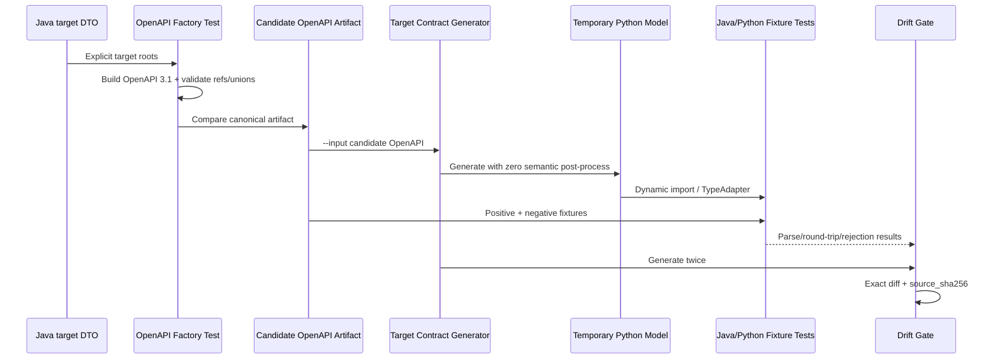

# D01 Agent 契约生成与治理 — L2 实施详细设计 v1.0

> 文档层级：L2 实施详细设计  
> 文档状态：已实施（D01 退出门禁通过）
> 上位文档：`Agent目标架构总览_v1.0.md`（L0）、`Agent契约与规划架构设计_v1.0.md`（L1）  
> 交付阶段：D01 契约生成与治理  
> 代码基线：`b56906c` 及其同源后续提交  
> 前置依赖：无  
> 后置交付：D02 Capability Kernel 实施详细设计、D04 Adapter Metadata 收敛、D03 Capability v2 原子切换  
> 适用模块：`agent-api`、`agent-runtime/scripts/target_contract`、`agent-runtime/tests/target_contract`  

---

## 0. Change List

| 修改日期 | 修改内容 | 原因 | 影响范围 |
|---|---|---|---|
| 2026-07-01 | 将 `RouteOutcome`、`PlanOutcome` 从 Java `sealed interface` 调整为由显式 `@JsonSubTypes`、OpenAPI `oneOf + discriminator`、严格反序列化与架构测试共同封闭的普通 interface；`AgentPlan`、`ClarificationArgs`、`RuntimeContextView` 继续使用 Java sealed | `ClarificationRequired` 同时实现位于 `route`、`plan` 两个包的 outcome；当前 `agent-api` 是未命名 Java 模块，Java 要求未命名模块中的 sealed 直接子类与父类型同包。原包结构与两个 outcome 同时 sealed 无法编译 | 仅修正 D01 L2 的 Java 表达方式；不改变 L0/L1 的封闭 union 不变量、JSON/OpenAPI 契约或包结构 |
| 2026-07-01 | 允许 `agent-api/pom.xml` 增加 test-scope Jakarta Validation provider，并纳入 D01 changed-path allowlist；FixtureTest 使用 provider 的 `ParameterMessageInterpolator`，不额外引入 EL 实现 | `jakarta.validation-api` 仅提供 API，无法执行验证；D01 negative fixture 和 Bean Validation 门禁需要实际 provider，而固定参数消息无需表达式语言 | 仅测试依赖与 D01 fixture tests；不进入生产运行时契约 |
| 2026-07-01 | Python 测试对 codegen 生成的固定 discriminator 使用 `Literal[str]` 值直接比较；共享多值枚举仍使用 enum `.value` | `datamodel-code-generator 0.33.0` 对 OpenAPI discriminator subtype 的单值 enum 正确生成为 `Literal`，不存在 `.value`；原测试伪代码会在真实零补丁产物上失败 | 仅修正 D01 Python 测试实现与本文代码块；不改变 JSON 值或生成链 |
| 2026-07-01 | 明确 `buildComponents` 在 Java 侧生成具名 enum component，并把 swagger-core 的 interface `allOf` 展开为独立 subtype object 后构造纯 `oneOf` union | `additionalProperties=false` 的 union base 与 subtype `allOf` 组合会拒绝 subtype 自有字段，并迫使 Python 生成后补丁；具名 enum component 还保证 Python 类型名稳定 | 生成逻辑仍只读取 Java enum、字段 schema 与 discriminator mapping；不增加第二契约源或 Python 语义处理 |
| 2026-07-01 | 将既有 `serviceCenter/mvnw` 的 Git mode 从 `100644` 修正为 `100755`，内容 byte-for-byte 不变，并纳入 D01 changed-path allowlist | Linux CI 统一入口必须直接执行 Maven Wrapper；无可执行位时真实 Linux checkout 无法启动该脚本 | 仅修复跨平台执行元数据；不修改 Maven Wrapper 内容、版本、构建逻辑或生产代码 |
| 2026-07-01 | 确认 D01 CI 门禁由 GitHub Actions 实现：恢复 active `.github/workflows/agent-contract.yml`，并新增窄 paths 的 `.github/workflows/d01-target-contract.yml` | GitHub 仓库内必须直接承载 D01 退出门禁；若把 D01 job 放入 broad active workflow，后续合法的 `agent-service`/adapter 变更会错误触发 D01 changed-path failure | GitHub push 仅覆盖与实际代码同源的 `master`/`codex`；target workflow 仍只调用唯一统一入口，不形成第二契约源，也不把不相关历史的默认 `main` 当作 D01 base |
| 2026-07-01 | changed-path 的 `git diff --name-only` 固定使用 `-c core.quotepath=false` | Linux Git 默认把中文文档路径输出为带引号的八进制转义文本，导致真实允许路径被误判为越界 | 只规范路径输出编码；不改变 merge-base、允许路径集合或隔离语义 |
| 2026-07-01 | 文档状态更新为“已实施（D01 退出门禁通过）”，记录 GitHub commit `22457a9` 的 Actions 证据：`Agent Contract CI` run `28499118055` 与 `D01 Target Contract Governance` run `28499118064` 全部 success | 16.6 的 16 项退出条件已有当前代码、artifact、本地 Linux 统一门禁及 GitHub Actions 成功证据；不再保留“待 CI”状态 | D01 可退出；后续仅允许按第 17 节进入 D02 实际产物基线复核，不代表 D03 协议已激活 |

---

## 1. 文档定位

### 1.1 目的

本文把 L0/L1 的跨 Java/Runtime 契约要求落实为可直接编码的 D01 详细设计，完整列出：

- 新增 Java 文件、类、枚举、字段、构造器和方法；
- OpenAPI 3.1 生成类、测试类和方法；
- positive/negative fixture 文件及断言；
- Python codegen、drift gate、动态加载测试的文件、函数和完整实现；
- D01 隔离边界、实施顺序、验证命令和退出条件；
- D03 激活时必须复用和删除的候选产物。

### 1.2 核心结论

D01 是“隔离的目标契约治理切片”，不是协议上线阶段：

```text
Java target DTO
  → candidate OpenAPI 3.1 artifact
      → temporary Python generated model
          → cross-language fixtures / drift gate

× 不接入当前 /plans/generate
× 不修改 agent-service 主流程、Handler Registry、权限、Turn 或数据库
× 不修改当前 agent-runtime app/contracts、graph、prompt 或 API
× 不删除 AgentIntent、PlanGenerateRequest/Response、Clarify Handler 等旧路径

D03
  → 在一个纵向原子提交中激活 Route/Plan 契约
  → 生成并切换 active Python model
  → 同步切换 Service/Runtime/Persistence/UI
  → 删除全部旧路径和 candidate 隔离目录
```

候选 Java DTO 和 candidate artifact 仅由 D01 contract tests/codegen 使用，不是第二个运行时 endpoint、兼容协议或事实来源。

### 1.3 范围

| D01 包含 | D01 明确不包含（归属） |
|---|---|
| 目标 Route/Plan/Clarification/RuntimeError Java DTO | Planning Service、PlanningResult（D02/D03） |
| Java 封闭 union、discriminator、Bean Validation | Capability Definition/Registration/Registry（D02） |
| candidate OpenAPI 3.1 及确定性 drift test | Capability Catalog、Policy、Context 持久化详细设计（D02），Canonical Domain/Adapter Metadata 收敛（D04），运行态原子接入（D03） |
| 零语义补丁 Python codegen | Runtime Route/Plan endpoint、graph、Prompt（D03） |
| 临时目录生成模型的双端 fixture 测试 | agent-service、数据库、UI 编译或行为适配（D03） |
| build/CI gate、provenance hash | 旧契约和旧路径删除（D03） |

`CapabilityContextEnvelope` 不是 D01 Runtime HTTP 契约：当前 L1 明确禁止把完整 Context Envelope 发给 Runtime，D01 只定义其最小只读 `RuntimeContextView` 投影。Envelope/Snapshot/View、Repository、持久化字段、owner/version/write、TTL、CAS 和事务接入由 D02 详细设计冻结，并在 D03 原子接入；D04 只负责 Canonical Domain/Adapter Metadata 收敛。在本文重复定义这些内容会越过上级边界并形成第二套 Context 契约。

### 1.4 当前基线

- 设计审计基线：`b56906c`；允许在其同源后续提交上实施，但必须重新执行 changed-path、drift 和 active stack regression 门禁。
- `agent-api/src/main/java` 当前有 36 个 Java 文件。
- `agent-service/src/main/java` 有 22 个文件引用 `AgentIntent`；D01 不修改这些文件。
- `agent-runtime/app` 有 7 个 Python 文件引用 `AgentIntent`；D01 不修改这些文件。
- 当前 active Runtime 仍使用 `/plans/generate`、`app/contracts/generated_models.py` 和旧 Prompt；D01 保持其可运行。

**上级治理状态已闭合（2026-06-30）**：L0 与契约规划、能力执行内核、元数据及上下文安全三份现有单 Agent L1 均已完成最终跨文档评审；D01 的直接架构前置和 D02 的两项 L1 架构前置均已闭合。D01 仍须先按第 15 节实施并逐项满足第 16.6 节退出条件；“已评审”不等于“已实施”。D01 未通过退出门禁前，D02 只允许进行不生效的文档内容预评审，不得宣布 D02 阶段开始/完成、不得实施代码；D01 退出后还须依据实际生成产物完成 D02 基线复核，复核通过才进入 D02 生效门禁。

---

## 2. L0/L1 约束映射

| 上位约束 | D01 落实 | 验证 |
|---|---|---|
| AD-01 capabilityId 是选择主键 | RouteDecision 只选择 capabilityId；PlanOutcome 不回显 capabilityId 作为身份源 | Java/Python fixture |
| AD-02 Java 单一结构契约源 | Java DTO→candidate OpenAPI→临时 Python model | OpenAPI drift + Python codegen test |
| AD-03 事实与投影分离 | Runtime DTO 明确命名为请求投影；不保存 Definition/Profile/Policy | Architecture test |
| AD-04 Planning/Lifecycle/Core 分离 | D01 只定义 HTTP contract，不实现 Planning/Lifecycle/Core | 禁止依赖搜索 |
| AD-05 类型桥只在 Registration | D01 不定义 Handler、Validated Plan 或类型桥 | 禁止依赖搜索 |
| AD-06 Runtime 不可信 | Outcome 是候选；Java union/validation 可拒绝未知值和越界字段 | negative fixtures |
| AD-07 D03 纵向原子切换 | D01 candidate 不被运行时代码 import，不删除旧协议 | isolation gate |
| AD-08 CHAT/TASK 复用 | Request 仅使用中性 requestId/deadline 和安全 Profile 投影，不定义 Chat/Task 两套协议 | contract review |
| AD-09 Route/Plan 两阶段 | 独立 RouteRequest/Outcome 与 PlanRequest/Outcome；Route 无 Context View | schema tests |
| AD-10 absolute deadline | Route/Plan 请求共用 `absoluteDeadline`；operation metadata 记录终止原因 | fixture + schema test |
| CP-03 Descriptor 事实/投影 | DTO 名为 RuntimeCapabilityRoutingDescriptor，仅为 Available Capability 投影 | class name + javadoc |
| CP-05 封闭 union | AgentPlan、ClarificationArgs、RuntimeContextView 为 Java sealed union；跨包 RouteOutcome、PlanOutcome 由显式 Jackson subtype、OpenAPI oneOf/discriminator 与严格测试封闭 | reflection + annotation + schema test |
| CP-06 Java 生成最终问题 | ClarificationRequired 无 question 字段 | forbidden-field test |
| CP-11 无双运行协议 | candidate 路径不被生产代码引用，无 endpoint/controller | isolation gate |
| CP-14 无隐式重试 | D01 contract 不定义 retryCount；只定义 providerAttempts/repairAttempts | schema test |
| CP-15 ExecutablePlanningResult 单链绑定 | D01 不定义 PlanningResult、Authorization/Context Snapshot 或授权证据字段；Runtime contract 只返回候选 outcome，D02/D03 负责从同一 Route 前证据链冻结 Snapshot 并绑定内部结果 | forbidden-field + boundary review |
| CP-16 PlanOutcome 不回显身份 | ExecutablePlan 只有 requestId、plan、metadata | reflection/schema test |
| L1 §6.5 单一 contract generation | `AgentRuntimeContract.VERSION` 唯一标识整套 Route/Plan 契约，不增加平行版本轴 | OpenAPI + Route/Plan chain test |
| L1 §11.1 内部服务身份 | OpenAPI 两个 operation 只声明 `X-Agent-Runtime-Key` apiKey security scheme | security schema test |

本文没有发现需要修改 L0/L1 的问题；若实施与本表冲突，必须先暂停并提交 ADR，不得在 D01 增加临时兼容层。

---

## 3. D01 交付物与目录

### 3.1 新增目录与修改文件

```text
agent-api/
├─ pom.xml                                      # 现有文件：增加 test-scope Validator provider
├─ src/main/java/com/dylan/agent/api/contract/runtime/
│  ├─ common/
│  │  ├─ AgentPlanKind.java
│  │  ├─ AgentRuntimeContract.java
│  │  ├─ AgentDomainMode.java
│  │  ├─ RuntimeOperationType.java
│  │  ├─ RuntimeOutcomeType.java
│  │  ├─ RuntimeTerminationReason.java
│  │  ├─ RuntimeOperationMetadata.java
│  │  ├─ RuntimeTurnRole.java
│  │  ├─ RuntimeTurnProjection.java
│  │  ├─ RuntimeProfileBehaviorProjection.java
│  │  ├─ RuntimeCapabilityRoutingDescriptor.java
│  │  ├─ RuntimeDomainRoutingProjection.java
│  │  ├─ RuntimeDomainFieldSchema.java
│  │  ├─ RuntimeDomainSchema.java
│  │  ├─ RuntimeContextType.java
│  │  ├─ RuntimeContextView.java
│  │  ├─ RuntimeQueryContextView.java
│  │  └─ RuntimeAggregateContextView.java
│  ├─ clarification/
│  │  ├─ ClarificationReasonCode.java
│  │  ├─ ClarificationArgType.java
│  │  ├─ ClarificationArgs.java
│  │  ├─ CapabilityChoiceArgs.java
│  │  ├─ DomainChoiceArgs.java
│  │  ├─ FieldChoiceArgs.java
│  │  ├─ ValueChoiceArgs.java
│  │  └─ ClarificationRequired.java
│  ├─ route/
│  │  ├─ RouteRequest.java
│  │  ├─ RouteOutcome.java
│  │  └─ RouteDecision.java
│  ├─ plan/
│  │  ├─ PlanRequest.java
│  │  ├─ PlanOutcome.java
│  │  ├─ AgentPlan.java
│  │  ├─ QueryAgentPlan.java
│  │  ├─ AggregateAgentPlan.java
│  │  └─ ExecutablePlan.java
│  └─ error/
│     ├─ RuntimeErrorCode.java
│     └─ RuntimeErrorResponse.java
├─ src/test/java/com/dylan/agent/api/contract/
│  ├─ AgentRuntimeContractOpenApiFactory.java
│  ├─ AgentRuntimeContractOpenApiGenerationTest.java
│  ├─ AgentRuntimeContractFixtureTest.java
│  └─ AgentRuntimeContractArchitectureTest.java
└─ src/test/resources/contract/candidate/
   ├─ openapi/agent-runtime-openapi.json
   └─ fixtures/
      ├─ route-request.json
      ├─ route-decision.json
      ├─ route-clarification.json
      ├─ plan-request.json
      ├─ query-plan.json
      ├─ aggregate-plan.json
      ├─ plan-clarification.json
      ├─ runtime-error.json
      └─ negative/
         ├─ unknown-plan-kind.json
         ├─ unknown-operator.json
         ├─ extra-field.json
         ├─ missing-query.json
         └─ discriminator-mismatch.json

agent-runtime/
├─ scripts/target_contract/
│  ├─ generate_contract_models.py
│  └─ check_contract_drift.py
└─ tests/target_contract/
   ├─ conftest.py
   ├─ test_positive_fixtures.py
   ├─ test_negative_fixtures.py
   └─ test_generated_contract.py

scripts/
└─ verify-d01-contract.ps1

.github/workflows/
├─ agent-contract.yml                       # 恢复的 active Java/Python checks
└─ d01-target-contract.yml                  # 窄 paths + D01 target job

serviceCenter/
└─ mvnw                                     # 现有文件：仅 Git mode 100644→100755
```

新增 Java 文件合计 41 个（37 个 main contract/version 文件 + 4 个 test 文件）；另复用且不修改第 3.2 节 9 个 Java 结构类。

### 3.2 复用且不修改的 Java 结构契约

D01 的 Query/Aggregate Plan 复用下列已有 Java 类；它们仍属于 Java 单契约源，不是 legacy converter 或第二份 DTO：

```text
agent-api/src/main/java/com/dylan/agent/api/
├─ plan/
│  ├─ AgentFilter.java
│  ├─ AgentQuerySpec.java
│  ├─ AgentAggregateSpec.java
│  ├─ AggregateMetricSpec.java
│  └─ AggregateOrderSpec.java
└─ enums/
   ├─ AgentFieldType.java
   ├─ AgentOperator.java
   ├─ AggregateFunction.java
   └─ QueryContextMode.java
```

这 9 个文件不在 D01 changed-path allowlist 内；其完整字段、方法和语义在第 5.8 节冻结。若实施时发现其不能满足目标契约，必须先修订本 L2 并重做 drift/fixture 评审，不得在 Python 生成后修补。

### 3.3 配置文件

D01 修改现有 `agent-api/pom.xml`，恢复 `.github/workflows/agent-contract.yml`，新增 `.github/workflows/d01-target-contract.yml`，并只修正既有 `serviceCenter/mvnw` 的 Git executable mode：POM 增加 test-scope Jakarta Validation provider；active workflow 保持 broad checks，target workflow 仅在 `master`/`codex` push 和 PR 的 D01 路径变更时运行。D01 job 只调用跨平台统一入口，不在 YAML 内复制 target 命令清单。

其余现有配置文件不修改：

- `agent-api/pom.xml` 保留现有 Jakarta Validation API、Jackson test、Swagger annotations/core test 和 Surefire，并增加 test-scope Jakarta Validation provider；FixtureTest 使用 `ParameterMessageInterpolator`，不增加 EL 依赖。禁止把 provider 放入生产 compile/runtime scope。
- 父 POM 当前固定 Java 25、swagger-core/annotations 2.2.31；D01 不另建版本来源。
- `agent-runtime/requirements.txt` 当前固定 Pydantic 2.13.4，`requirements-dev.txt` 固定 datamodel-code-generator 0.33.0；D01 使用现有版本，不修改依赖文件。
- 根 `.gitignore` 已包含全局 `target/`，自动覆盖 `agent-runtime/target/contract-models/`。
- `agent-contract.yml` 恢复 active Java/Python checks；`d01-target-contract.yml` 使用 GitHub 托管的 `ubuntu-latest`，通过 `actions/setup-java` 固定 Java 25、`actions/setup-python` 固定 Python 3.12，安装现有 `requirements-dev.txt` 后只调用 `scripts/verify-d01-contract.ps1`。
- target workflow 的 paths 只含 D01 allowlist、本文和自身；不得放入 broad active workflow，避免后续 D02/adapter 合法变更被 D01 isolation gate 误拒绝。
- push 使用 `github.event.before`；PR fetch `GITHUB_BASE_REF` 后使用真实 `origin/<base>`；全零新分支 SHA 才回退 `HEAD^`。`fetch-depth: 0` 保证 merge-base 可证明。
- `serviceCenter/mvnw` 只把 Git mode 修正为 `100755`；blob hash 和文本内容必须保持不变，使同一 wrapper 可在 Linux checkout 直接执行。

### 3.4 D01 禁止修改清单

以下路径必须保持 byte-for-byte 不变；若确需修改，工作必须转入 D03 L2：

- `agent-service/**`
- `agent-runtime/app/**`
- `agent-runtime/app/prompts/**`
- `agent-runtime/scripts/generate_contract_models.py`
- `agent-runtime/scripts/check_contract_drift.py`
- `agent-api` 旧 `AgentIntent`、`PlanGenerateRequest/Response` 及旧 Plan DTO
- 数据库 SQL、`agent.html`、部署配置

---

## 4. Java 契约通用编码规则

### 4.1 包和依赖

- 所有 target DTO 位于 `com.dylan.agent.api.contract.runtime` 子包。
- 只能依赖 JDK、Jackson annotations、Jakarta Validation、Swagger annotations，以及第 3.2/5.8 节冻结的 9 个已有 Java 结构类。
- 禁止依赖 `agent-service`、Spring Bean、Handler、Registry、Policy、Persistence 或 Runtime Python 实现。

### 4.2 DTO 约定

每个 D01 新建的普通 target DTO 必须：

1. 提供 public 无参构造器。
2. 每个字段提供标准 `getX()/setX()`；只有 primitive `boolean` 使用 `isX()`，`Boolean` wrapper 使用 `getX()`。
3. 使用 `@Schema(additionalProperties = FALSE)` 或 OpenAPI factory 的统一覆盖，确保 Python 生成 `extra='forbid'`。
4. required 字段同时使用 `@NotNull/@NotBlank/@NotEmpty` 与 `requiredMode=REQUIRED`。
5. List 字段在构造时初始化为空列表，不返回 null；set 方法执行 defensive copy。
6. 不实现业务授权、默认 capability、自动降级、Context merge 或 retry。
7. 不包含 `planVersion`、`strategyVersion`、最终 clarification question、JWT、权限表达式、mask 或凭据。

第 5.8 节复用类保持现有 Java 实现；它们的 nullable/list 语义以该节和 Java 注解为准，不伪称已具备 defensive copy。严格 unknown-field 拒绝由 OpenAPI schema 统一覆盖和 Java FixtureTest 的 strict ObjectMapper 保证。

### 4.3 封闭 union 约定

| Union | discriminator | 合法 subtype |
|---|---|---|
| `RouteOutcome`（跨包封闭 interface） | `outcomeType` | `RouteDecision`、`ClarificationRequired` |
| `PlanOutcome`（跨包封闭 interface） | `outcomeType` | `ExecutablePlan`、`ClarificationRequired` |
| `AgentPlan` | `planKind` | `QueryAgentPlan`、`AggregateAgentPlan` |
| `ClarificationArgs` | `argType` | `CapabilityChoiceArgs`、`DomainChoiceArgs`、`FieldChoiceArgs`、`ValueChoiceArgs` |
| `RuntimeContextView` | `contextType` | `RuntimeQueryContextView`、`RuntimeAggregateContextView` |

五个 union 同时配置 Jackson `@JsonTypeInfo(use = NAME, include = EXISTING_PROPERTY, visible = true)`、`@JsonSubTypes`、subtype `@JsonTypeName` 和 OpenAPI `oneOf + discriminatorProperty`。未知 discriminator、缺失 subtype required 字段和额外字段必须双端拒绝。

`AgentPlan`、`ClarificationArgs`、`RuntimeContextView` 使用 Java `sealed interface`，其 permitted concrete subtype 全部声明为 `final`。`RouteOutcome`、`PlanOutcome` 因未命名模块的跨包限制使用普通 interface，但必须由架构测试锁定精确 `@JsonSubTypes` 集合，且 target package 内不得出现未登记实现类；`ClarificationRequired` 是一个 final class，同时实现两个 outcome。禁止使用 `non-sealed` 扩展点或开放 subtype 扫描，否则 union 不再封闭。

### 4.4 枚举 JSON 规则

- Java enum 常量使用大写下划线。
- JSON 值与常量名完全一致，不增加 lowercase alias、兼容 alias 或 Python 手写映射。
- Python 业务代码在 D03 激活后使用 codegen 产生的 enum member；D01 tests 不添加 facade。

---

## 5. Common 契约类详细规格

### 5.1 契约世代与枚举

`AgentRuntimeContract.java` 是不可实例化的 final 工具类：只定义 `public static final String VERSION = "1.0.0"` 和 private 构造器。`VERSION` 唯一标识整套 Route/Plan Runtime contract generation；OpenAPI `info.version` 和 D03 Planning Service 直接引用该常量，RouteRequest/PlanRequest fixture 由 Java 测试对该常量做一致性校验。它不是 `planVersion`、`strategyVersion` 或 Python schema version。

其余公共枚举如下：

| 文件/枚举 | 枚举值 | 禁止语义 |
|---|---|---|
| `AgentPlanKind` | `QUERY`, `AGGREGATE` | 不含 `CLARIFY`；不作为 Handler/权限/审计主键 |
| `AgentDomainMode` | `NONE`, `OPTIONAL`, `REQUIRED` | 禁止 boolean 替代 |
| `RuntimeOperationType` | `ROUTE`, `PLAN` | 不表达 graph node |
| `RuntimeOutcomeType` | `DECISION`, `EXECUTABLE`, `CLARIFICATION` | 仅作 Route/Plan 封闭 union discriminator；各 union 只允许自己的子集 |
| `RuntimeTerminationReason` | `COMPLETED`, `CLARIFICATION`, `VALIDATION_REJECTED`, `REPAIR_EXHAUSTED`, `DEADLINE_EXCEEDED`, `CANCELLED`, `PROVIDER_UNAVAILABLE`, `AUTHENTICATION_REJECTED`, `INTERNAL_ERROR` | 不包含 provider 原始错误 |
| `RuntimeTurnRole` | `USER`, `ASSISTANT` | 不包含 SYSTEM/TOOL，避免历史提升为指令 |
| `RuntimeContextType` | `QUERY`, `AGGREGATE` | 不作为持久化 Context Registry |

每个 enum 只包含隐式 `values()`、`valueOf(String)`；不新增 `fromLegacy()`、alias map 或容错解析方法。

### 5.2 `RuntimeOperationMetadata`

**文件**：`common/RuntimeOperationMetadata.java`

| 字段 | Java 类型 | 约束 |
|---|---|---|
| `operation` | `RuntimeOperationType` | required |
| `providerAttempts` | `Integer` | `@NotNull @Min(0)`；所有 provider 调用计数 |
| `repairAttempts` | `Integer` | `@NotNull @Min(0)`；不得大于 `max(providerAttempts-1, 0)`（语义测试） |
| `repairDurationMs` | `Long` | `@NotNull @Min(0)` |
| `totalDurationMs` | `Long` | `@NotNull @Min(0)`；不得小于 repairDurationMs（语义测试） |
| `terminationReason` | `RuntimeTerminationReason` | required |
| `deadlineReached` | `Boolean` | `@NotNull` |
| `repairLimitReached` | `Boolean` | `@NotNull` |

**方法**：无参构造器；上述 8 个字段的 getter/setter；不提供 retry 推断方法。无合法 Runtime 响应时的 `NOT_REPORTED` 由 Java Planning failure metadata 定义，不伪造为此 Runtime response DTO。

### 5.3 `RuntimeTurnProjection`

**字段**：`RuntimeTurnRole role`（required）、`String content`（`@NotBlank @Size(max=4000)`）。  
**方法**：无参构造器、`getRole/setRole/getContent/setContent`。  
**边界**：content 是过滤后的会话文本，不包含 Capability Context、结构化结果、权限事实或系统指令。

### 5.4 `RuntimeProfileBehaviorProjection`

**字段**：`List<String> instructions`（required，最多 20 项，每项 1～500 字符）、`String locale`（nullable，BCP-47）。  
**方法**：无参构造器、`getInstructions/setInstructions/getLocale/setLocale`。  
**边界**：只包含已评审行为规则，不包含 Profile ID、capability 清单、权限或预算事实。

### 5.5 `RuntimeCapabilityRoutingDescriptor`

该 DTO 是 Capability Definition Descriptor 与 Available Capability 的请求投影，不是静态事实源。

| 字段 | 类型 | 约束 |
|---|---|---|
| `capabilityId` | `String` | required、1～128；开放数据值 |
| `planKind` | `AgentPlanKind` | required；只表达 Plan 结构 |
| `description` | `String` | required、1～1000；作为数据而非指令 |
| `applicability` | `List<String>` | required、最多 20 项 |
| `exclusions` | `List<String>` | required、最多 20 项 |
| `domainMode` | `AgentDomainMode` | required |
| `allowedDomains` | `List<String>` | required、去重；NONE 时为空，REQUIRED 时非空 |

**方法**：无参构造器及 7 组 getter/setter。  
**禁止字段**：enabled、permissions、roles、Handler/Adapter 类名、Context payload、ContractRef、risk override。

### 5.6 Domain 投影

#### `RuntimeDomainRoutingProjection`

字段：`String domain`、`List<String> aliases`、`String description`，全部 required；方法为无参构造器和 3 组 getter/setter。不得出现 fields/operators/functions/mask。

#### `RuntimeDomainFieldSchema`

字段：

- `String field`（required）；
- `List<String> aliases`（required）；
- `AgentFieldType type`（required）；
- `List<AgentOperator> operators`（required、非空）；
- `List<AggregateFunction> aggregateFunctions`（required，可空列表）；
- `String formatHint`（nullable、仅安全格式说明）。

方法：无参构造器及 6 组 getter/setter。

#### `RuntimeDomainSchema`

字段：`String domain`、`List<RuntimeDomainFieldSchema> fields`（required、field 唯一）、`List<String> defaultSelectFields`（required）、`Integer defaultSize`（nullable、`@Min(1)`）、`Integer maxSize`（nullable、`@Min(1)`）。  
方法：无参构造器和 5 组 getter/setter。  
禁止字段：mask、数据库列名、Adapter 实现、未授权字段、完整 Catalog。

### 5.7 Context View union

#### `RuntimeContextView`

sealed interface，方法：`RuntimeContextType getContextType()`、`String getSourceInvocationId()`。

#### `RuntimeQueryContextView`

字段：固定 `contextType=QUERY`、`String sourceInvocationId`、`List<AgentFilter> filters`、`List<String> selectFields`、`Integer page`、`Integer size`。sourceInvocationId required；List 非 null；page/size `@NotNull @Min(1)`。不包含 domain，domain 由 PlanRequest 唯一提供。  
方法：无参构造器、只读 `getContextType()`、其余 5 个字段 getter/setter。

#### `RuntimeAggregateContextView`

字段：固定 `contextType=AGGREGATE`、`String sourceInvocationId`、`List<AgentFilter> filters`、`List<AggregateMetricSpec> metrics`、`List<String> groupByFields`、`Integer maxRows`。约束同上，metrics 非空，maxRows `@NotNull @Min(1)`。  
方法：无参构造器、只读 `getContextType()`、其余 5 个字段 getter/setter。

Context View 是 PlanRequest 的只读最小投影，不包含持久化 Envelope、Owner、write 权限、TTL 或完整结果。

### 5.8 复用 Java 结构类完整规格

下列类为第 3.2 节已有文件，D01 不修改，但它们会作为 target OpenAPI 的传递 schema，因而必须纳入契约和 fixture 门禁。

| 类/枚举 | 字段或枚举值 | public 方法 |
|---|---|---|
| `AgentFilter` | `String field`, `AgentOperator operator`, nullable `String value`, nullable `List<String> values` | 无参构造器；`getField/setField`、`getOperator/setOperator`、`getValue/setValue`、`getValues/setValues` |
| `AgentQuerySpec` | nullable `List<AgentFilter> filters`, `QueryContextMode contextMode`, `List<String> removeFields`, `List<String> selectFields`, `Integer page`, `Integer size` | 无参构造器；`getFilters/setFilters`、`getContextMode/setContextMode`、`getRemoveFields/setRemoveFields`、`getSelectFields/setSelectFields`、`getPage/setPage`、`getSize/setSize` |
| `AgentAggregateSpec` | nullable `List<AgentFilter> filters`, required `List<AggregateMetricSpec> metrics`, nullable `List<String> groupByFields`, `List<AggregateOrderSpec> orderBy`, `Integer maxRows` | 无参构造器；`getFilters/setFilters`、`getMetrics/setMetrics`、`getGroupByFields/setGroupByFields`、`getOrderBy/setOrderBy`、`getMaxRows/setMaxRows` |
| `AggregateMetricSpec` | required `String alias`, required `AggregateFunction function`, nullable `String field` | 无参构造器；`getAlias/setAlias`、`getFunction/setFunction`、`getField/setField` |
| `AggregateOrderSpec` | required `String field`, required `String direction`（`ASC`/`DESC`） | 无参构造器；`getField/setField`、`getDirection/setDirection` |
| `AgentFieldType` | `STRING`, `DECIMAL`, `INSTANT` | 仅枚举隐式方法 |
| `AgentOperator` | `EQ`, `CONTAINS`, `CONTAINS_ANY`, `STARTS_WITH`, `STARTS_WITH_ANY`, `IN`, `GT`, `LT` | 仅枚举隐式方法 |
| `AggregateFunction` | `COUNT`, `SUM`, `AVG`, `MIN`, `MAX` | 仅枚举隐式方法 |
| `QueryContextMode` | `REPLACE`, `MERGE` | 仅枚举隐式方法 |

Java FixtureTest 必须补足 Bean Validation 之外的绑定语义：filter 的 field/operator/value(s) 必须在 Runtime Domain Schema 授权范围内；`MERGE` 才允许 `removeFields`；aggregate metric/function/field、groupBy 与 orderBy 必须来自同一请求投影。OpenAPI factory 对这些传递 object schema 一并强制 `additionalProperties=false`；不通过 Python 后处理补齐。

---

## 6. Clarification 契约详细规格

### 6.1 枚举

| 枚举 | 值 |
|---|---|
| `ClarificationReasonCode` | `CAPABILITY_AMBIGUOUS`, `DOMAIN_REQUIRED`, `DOMAIN_AMBIGUOUS`, `FIELD_REQUIRED`, `VALUE_REQUIRED`, `VALUE_AMBIGUOUS` |
| `ClarificationArgType` | `CAPABILITY_CHOICES`, `DOMAIN_CHOICES`, `FIELD_CHOICES`, `VALUE_CHOICES` |

reasonCode/argType 不允许包含 capabilityId、domain 或业务服务专用枚举值。新增同 Plan Kind capability 不增加专用澄清类型。

合法绑定固定为：

| reasonCode | args subtype | 允许 operation |
|---|---|---|
| `CAPABILITY_AMBIGUOUS` | `CapabilityChoiceArgs` | ROUTE |
| `DOMAIN_REQUIRED` | `DomainChoiceArgs` | ROUTE |
| `DOMAIN_AMBIGUOUS` | `DomainChoiceArgs` | ROUTE |
| `FIELD_REQUIRED` | `FieldChoiceArgs` | PLAN |
| `VALUE_REQUIRED` | `ValueChoiceArgs` | PLAN |
| `VALUE_AMBIGUOUS` | `ValueChoiceArgs` | PLAN |

任何其他 reason/args/operation 组合必须由 Java/Python contract tests 拒绝；不得由 Runtime 自由解释。

### 6.2 `ClarificationArgs` union

sealed interface，方法：`ClarificationArgType getArgType()`。

| subtype | 固定 argType | 字段 | 方法 |
|---|---|---|---|
| `CapabilityChoiceArgs` | `CAPABILITY_CHOICES` | `List<String> capabilityIds`（2～20、去重） | 无参构造器、`getArgType()`、`getCapabilityIds/setCapabilityIds` |
| `DomainChoiceArgs` | `DOMAIN_CHOICES` | `List<String> domains`（1～20、去重） | 无参构造器、`getArgType()`、`getDomains/setDomains` |
| `FieldChoiceArgs` | `FIELD_CHOICES` | `List<String> fields`（1～50、去重） | 无参构造器、`getArgType()`、`getFields/setFields` |
| `ValueChoiceArgs` | `VALUE_CHOICES` | `String field`、required `List<String> values`（0～50） | 无参构造器、`getArgType()`、`getField/setField`、`getValues/setValues` |

绑定语义还必须校验候选基数：`CAPABILITY_AMBIGUOUS`、`DOMAIN_AMBIGUOUS`、`VALUE_AMBIGUOUS` 至少 2 个候选；`DOMAIN_REQUIRED`、`FIELD_REQUIRED` 至少 1 个候选；`VALUE_REQUIRED` 允许空 values，以表达需要用户输入任意字段值。

### 6.3 `ClarificationRequired`

**实现**：同时 `implements RouteOutcome, PlanOutcome`。  
**固定 discriminator**：`outcomeType=CLARIFICATION`；在 RouteOutcome/PlanOutcome 中映射到同一 schema。  
**字段**：

- `String requestId`（required）；
- `ClarificationReasonCode reasonCode`（required）；
- `ClarificationArgs args`（required、`@Valid`）；
- `RuntimeOperationMetadata metadata`（required、`@Valid`）。

**方法**：无参构造器、只读 `getOutcomeType()`、其余 4 个字段 getter/setter。  
**禁止字段**：question、freeTextReason、chainOfThought、Prompt、未授权候选。最终 question 由 Java Planning Service 在 D03 使用安全模板生成。

---

## 7. Route 契约详细规格

### 7.1 `RouteOutcome`

`RouteOutcome` 是跨包封闭 interface，合法实现固定为 `RouteDecision`、`ClarificationRequired`，方法：`RuntimeOutcomeType getOutcomeType()`、`String getRequestId()`、`RuntimeOperationMetadata getMetadata()`。虽然公共 enum 还包含 EXECUTABLE，RouteOutcome 的 Jackson/OpenAPI mapping 只接受 DECISION/CLARIFICATION；架构测试锁定实现类集合和 annotation mapping。

### 7.2 `RouteRequest`

| 字段 | 类型 | 约束 |
|---|---|---|
| `requestId` | `String` | required、不透明、1～128 |
| `contractVersion` | `String` | required；`@NotBlank` + `@Schema(allowableValues = AgentRuntimeContract.VERSION)`，必须等于唯一常量 |
| `message` | `String` | required、1～8000 |
| `history` | `List<RuntimeTurnProjection>` | required、最多 20 条 |
| `profileBehavior` | `RuntimeProfileBehaviorProjection` | required |
| `capabilities` | `List<RuntimeCapabilityRoutingDescriptor>` | required、非空、capabilityId 唯一 |
| `domains` | `List<RuntimeDomainRoutingProjection>` | required、domain 唯一 |
| `absoluteDeadline` | `Instant` | required、OpenAPI `date-time` |
| `repairLimit` | `Integer` | `@NotNull @Min(0) @Max(3)`；部署上限可进一步收紧 |

**方法**：无参构造器及 9 组 getter/setter。  
**禁止字段**：Context View、完整 Domain Schema、Plan schema、Authorization Snapshot、JWT、Handler/Adapter。

### 7.3 `RouteDecision`

字段：固定 `outcomeType=DECISION`、`String requestId`、`String capabilityId`、nullable `String domain`、`RuntimeOperationMetadata metadata`。  
方法：无参构造器、只读 `getOutcomeType()`、其余 4 组 getter/setter。  
禁止字段：planKind、AgentPlan、Context、权限表达式、自由推理文本。

### 7.4 Route Java 语义校验

D01 只在 `AgentRuntimeContractFixtureTest` 中提供以下 private contract assertion 方法：

- `assertRouteRequestWellFormed(RouteRequest request)`：contractVersion 等于唯一 Java 常量、capabilityId/domain 唯一、Domain Mode 与 allowedDomains 一致、每个 allowed domain 有对应 Domain Routing Projection、每个 projection 至少被一个 capability 引用、deadline 未缺失；
- `assertRouteOutcomeBound(RouteRequest request, RouteOutcome outcome)`：requestId 一致；decision capability/domain 必须来自请求投影；domain 空值必须符合所选 Descriptor 的 NONE/OPTIONAL/REQUIRED 语义；
- `assertMetadata(RuntimeOperationMetadata metadata, RuntimeOperationType expected)`：operation、attempt、duration、termination flag 一致。
- `assertClarificationBinding(ClarificationRequired clarification, RuntimeOperationType expected)`：reason/args/metadata.operation 必须满足第 6.1 节固定映射。

该 helper 只用于 contract tests；D03 的 Planning Service 必须重新实现可信 Java 校验，不能依赖 test helper。

---

## 8. Plan 契约详细规格

### 8.1 `PlanOutcome`

`PlanOutcome` 是跨包封闭 interface，合法实现固定为 `ExecutablePlan`、`ClarificationRequired`，方法：`RuntimeOutcomeType getOutcomeType()`、`String getRequestId()`、`RuntimeOperationMetadata getMetadata()`。其 Jackson/OpenAPI mapping 只接受 EXECUTABLE/CLARIFICATION；架构测试锁定实现类集合和 annotation mapping。

### 8.2 `PlanRequest`

| 字段 | 类型 | 约束 |
|---|---|---|
| `requestId` | `String` | required；与 Route 使用同一 correlation |
| `contractVersion` | `String` | required；`@NotBlank` + `@Schema(allowableValues = AgentRuntimeContract.VERSION)`，与 Route 相同 |
| `message` | `String` | required、1～8000 |
| `history` | `List<RuntimeTurnProjection>` | required、最多 20 条；继续禁止 Context/结果旁路 |
| `capabilityId` | `String` | required；Java 已校验 RouteDecision 后附着 |
| `planKind` | `AgentPlanKind` | required；来自 Resolved Registration |
| `capability` | `RuntimeCapabilityRoutingDescriptor` | required；必须与 capabilityId/planKind 一致且仅含已选单项 |
| `inputSchemaRef` | `String` | required；必须匹配 candidate OpenAPI 内部 `#/components/schemas/{SchemaName}` 引用 |
| `domain` | `String` | nullable；NONE 必须空、REQUIRED 必须非空 |
| `domainSchema` | `RuntimeDomainSchema` | nullable；非空时 domain 必须一致 |
| `contextViews` | `List<RuntimeContextView>` | required，可空；contextType 唯一 |
| `absoluteDeadline` | `Instant` | required；与 Route 相同且不可延长 |
| `repairLimit` | `Integer` | `@NotNull @Min(0) @Max(3)` |

**方法**：无参构造器及 13 组 getter/setter。  
**禁止字段**：其他 capability descriptor、完整 Context Envelope、Authorization Snapshot、ResultRef payload、Handler/Adapter、最终执行授权。

### 8.3 `AgentPlan` union

#### `AgentPlan`

sealed interface，permits `QueryAgentPlan`、`AggregateAgentPlan`，方法：`AgentPlanKind getPlanKind()`。没有 `planVersion`、capabilityId、domain、clarify 字段。

#### `QueryAgentPlan`

字段：固定 `planKind=QUERY`、`AgentQuerySpec query`（required、`@Valid`）。  
方法：无参构造器、只读 `getPlanKind()`、`getQuery/setQuery`。

#### `AggregateAgentPlan`

字段：固定 `planKind=AGGREGATE`、`AgentAggregateSpec aggregate`（required、`@Valid`）。  
方法：无参构造器、只读 `getPlanKind()`、`getAggregate/setAggregate`。

不存在 `ClarifyAgentPlan`。澄清只能通过 `ClarificationRequired` outcome 表达。

### 8.4 `ExecutablePlan`

字段：固定 `outcomeType=EXECUTABLE`、`String requestId`、`AgentPlan plan`、`RuntimeOperationMetadata metadata`，后三者 required。  
方法：无参构造器、只读 `getOutcomeType()`、其余 3 组 getter/setter。  
禁止字段：顶层 capabilityId、独立 planKind、domain、Validated Plan、最终授权、业务结果。

### 8.5 Plan Java 语义校验

`AgentRuntimeContractFixtureTest` 中的 private 方法：

- `assertPlanRequestWellFormed(PlanRequest request)`：contractVersion 等于唯一 Java 常量、单 Descriptor 绑定、Domain Mode、schemaRef、Context type 唯一、deadline 一致性；Route/Plan 两个请求间的同值约束由链路测试验证；
- `assertPlanOutcomeBound(PlanRequest request, PlanOutcome outcome)`：requestId 一致；Executable subtype 与 request.planKind 一致；Plan 内允许的字段/operator/domain 引用不超出投影；
- `assertPlanClarificationAuthorized(PlanRequest request, ClarificationRequired clarification)`：字段/值候选必须来自已选 Domain Schema/Context 投影且不越权。

Planning Service 在 D03 执行确定性 Context merge/replace 后仍只形成 Raw Plan；最终 Raw→Validated 转换属于 Execution Core/Registration，不在 D01 contract helper 中实现。

---

## 9. Runtime Error 契约

### 9.1 `RuntimeErrorCode`

枚举值：

- `CONTRACT_INVALID`
- `AUTHENTICATION_FAILED`
- `PROVIDER_UNAVAILABLE`
- `DEADLINE_EXCEEDED`
- `OUTPUT_REPAIR_EXHAUSTED`
- `INTERNAL_ERROR`

不定义 capability/domain/Plan Kind 专用错误码，不包含可重试建议；重试策略不属于 Runtime error。

合法 code/terminationReason 绑定：

| code | terminationReason |
|---|---|
| `CONTRACT_INVALID` | `VALIDATION_REJECTED` |
| `AUTHENTICATION_FAILED` | `AUTHENTICATION_REJECTED` |
| `PROVIDER_UNAVAILABLE` | `PROVIDER_UNAVAILABLE` |
| `DEADLINE_EXCEEDED` | `DEADLINE_EXCEEDED` |
| `OUTPUT_REPAIR_EXHAUSTED` | `REPAIR_EXHAUSTED` |
| `INTERNAL_ERROR` | `INTERNAL_ERROR` |

Java FixtureTest 和 Python generated-contract test 必须验证该绑定；未知组合 fail closed。

HTTP status 绑定：400=`CONTRACT_INVALID`（请求解析），401=`AUTHENTICATION_FAILED`，422=`CONTRACT_INVALID`（语义）或 `OUTPUT_REPAIR_EXHAUSTED`，503=`PROVIDER_UNAVAILABLE`，504=`DEADLINE_EXCEEDED`，500=`INTERNAL_ERROR`。同一 status 下仍以 typed code 区分；不得返回 200 + error body。

### 9.2 `RuntimeErrorResponse`

字段：`String requestId`（nullable，仅请求解析后可得）、`RuntimeErrorCode code`（required）、`String message`（required、安全固定摘要）、`RuntimeOperationMetadata metadata`（required）、`String diagnosticId`（required、不透明）。  
方法：无参构造器及 5 组 getter/setter。  
禁止字段：provider 原始响应、Prompt、栈、凭据、Context、权限表达式、retryAfter。

认证或结构解析在 provider 调用前失败时，metadata 必须使用 `providerAttempts=0`、`repairAttempts=0` 和对应 terminationReason；网络中断导致没有合法 RuntimeErrorResponse 时，由 Java Planning failure channel 记录本地可观测 metadata，不伪造本 DTO。

### 9.3 Java 生产契约方法索引

第 5～9 节的字段表决定类型和约束；下表给出新增生产类的完整方法名清单。表中“构造器”均指 public 无参构造器；未列出的 builder、factory、容错解析或业务方法一律不存在。

| 类/接口 | 完整方法清单 |
|---|---|
| `AgentRuntimeContract` | private `AgentRuntimeContract()`；无 public 方法 |
| `RuntimeOperationMetadata` | 构造器；`getOperation/setOperation`、`getProviderAttempts/setProviderAttempts`、`getRepairAttempts/setRepairAttempts`、`getRepairDurationMs/setRepairDurationMs`、`getTotalDurationMs/setTotalDurationMs`、`getTerminationReason/setTerminationReason`、`getDeadlineReached/setDeadlineReached`、`getRepairLimitReached/setRepairLimitReached` |
| `RuntimeTurnProjection` | 构造器；`getRole/setRole`、`getContent/setContent` |
| `RuntimeProfileBehaviorProjection` | 构造器；`getInstructions/setInstructions`、`getLocale/setLocale` |
| `RuntimeCapabilityRoutingDescriptor` | 构造器；`getCapabilityId/setCapabilityId`、`getPlanKind/setPlanKind`、`getDescription/setDescription`、`getApplicability/setApplicability`、`getExclusions/setExclusions`、`getDomainMode/setDomainMode`、`getAllowedDomains/setAllowedDomains` |
| `RuntimeDomainRoutingProjection` | 构造器；`getDomain/setDomain`、`getAliases/setAliases`、`getDescription/setDescription` |
| `RuntimeDomainFieldSchema` | 构造器；`getField/setField`、`getAliases/setAliases`、`getType/setType`、`getOperators/setOperators`、`getAggregateFunctions/setAggregateFunctions`、`getFormatHint/setFormatHint` |
| `RuntimeDomainSchema` | 构造器；`getDomain/setDomain`、`getFields/setFields`、`getDefaultSelectFields/setDefaultSelectFields`、`getDefaultSize/setDefaultSize`、`getMaxSize/setMaxSize` |
| `RuntimeContextView` | `getContextType`、`getSourceInvocationId` |
| `RuntimeQueryContextView` | 构造器；只读 `getContextType`；`getSourceInvocationId/setSourceInvocationId`、`getFilters/setFilters`、`getSelectFields/setSelectFields`、`getPage/setPage`、`getSize/setSize` |
| `RuntimeAggregateContextView` | 构造器；只读 `getContextType`；`getSourceInvocationId/setSourceInvocationId`、`getFilters/setFilters`、`getMetrics/setMetrics`、`getGroupByFields/setGroupByFields`、`getMaxRows/setMaxRows` |
| `ClarificationArgs` | `getArgType` |
| `CapabilityChoiceArgs` | 构造器；只读 `getArgType`；`getCapabilityIds/setCapabilityIds` |
| `DomainChoiceArgs` | 构造器；只读 `getArgType`；`getDomains/setDomains` |
| `FieldChoiceArgs` | 构造器；只读 `getArgType`；`getFields/setFields` |
| `ValueChoiceArgs` | 构造器；只读 `getArgType`；`getField/setField`、`getValues/setValues` |
| `ClarificationRequired` | 构造器；只读 `getOutcomeType`；`getRequestId/setRequestId`、`getReasonCode/setReasonCode`、`getArgs/setArgs`、`getMetadata/setMetadata` |
| `RouteOutcome` | `getOutcomeType`、`getRequestId`、`getMetadata` |
| `RouteRequest` | 构造器；`getRequestId/setRequestId`、`getContractVersion/setContractVersion`、`getMessage/setMessage`、`getHistory/setHistory`、`getProfileBehavior/setProfileBehavior`、`getCapabilities/setCapabilities`、`getDomains/setDomains`、`getAbsoluteDeadline/setAbsoluteDeadline`、`getRepairLimit/setRepairLimit` |
| `RouteDecision` | 构造器；只读 `getOutcomeType`；`getRequestId/setRequestId`、`getCapabilityId/setCapabilityId`、`getDomain/setDomain`、`getMetadata/setMetadata` |
| `PlanOutcome` | `getOutcomeType`、`getRequestId`、`getMetadata` |
| `PlanRequest` | 构造器；`getRequestId/setRequestId`、`getContractVersion/setContractVersion`、`getMessage/setMessage`、`getHistory/setHistory`、`getCapabilityId/setCapabilityId`、`getPlanKind/setPlanKind`、`getCapability/setCapability`、`getInputSchemaRef/setInputSchemaRef`、`getDomain/setDomain`、`getDomainSchema/setDomainSchema`、`getContextViews/setContextViews`、`getAbsoluteDeadline/setAbsoluteDeadline`、`getRepairLimit/setRepairLimit` |
| `AgentPlan` | `getPlanKind` |
| `QueryAgentPlan` | 构造器；只读 `getPlanKind`；`getQuery/setQuery` |
| `AggregateAgentPlan` | 构造器；只读 `getPlanKind`；`getAggregate/setAggregate` |
| `ExecutablePlan` | 构造器；只读 `getOutcomeType`；`getRequestId/setRequestId`、`getPlan/setPlan`、`getMetadata/setMetadata` |
| `RuntimeErrorResponse` | 构造器；`getRequestId/setRequestId`、`getCode/setCode`、`getMessage/setMessage`、`getMetadata/setMetadata`、`getDiagnosticId/setDiagnosticId` |

`AgentPlanKind`、`AgentDomainMode`、`RuntimeOperationType`、`RuntimeOutcomeType`、`RuntimeTerminationReason`、`RuntimeTurnRole`、`RuntimeContextType`、`ClarificationReasonCode`、`ClarificationArgType`、`RuntimeErrorCode` 及第 5.8 节复用枚举均只有 Java 枚举隐式 `values()` 和 `valueOf(String)`；禁止添加 alias/fromLegacy 方法。

---

## 10. OpenAPI 3.1 生成详细设计

### 10.1 `AgentRuntimeContractOpenApiFactory`

**文件**：`agent-api/src/test/java/com/dylan/agent/api/contract/AgentRuntimeContractOpenApiFactory.java`。该类是构建测试工具，不是 Controller。

**常量**：

```java
static final String ROUTE_PATH = "/runtime/route";
static final String PLAN_PATH = "/runtime/plan";
static final String INTERNAL_AUTH = "InternalServiceAuth";
static final Path ARTIFACT = Path.of(
    "src/test/resources/contract/candidate/openapi/agent-runtime-openapi.json");
```

**方法完整清单**：

| 方法 | 返回值 | 逻辑 |
|---|---|---|
| `OpenAPI build()` | OpenAPI | 创建 3.1.0 文档、Info、components、两个 paths |
| `Components buildComponents(ModelConverters converters)` | Components | 只注册第 3.1 节 target roots 及其传递依赖；生成具名 Java enum component；把 interface `allOf` 展开为独立 subtype object，再构造纯 `oneOf` union；将两个 request 的 contractVersion 固化为 `AgentRuntimeContract.VERSION` 单值 enum |
| `SecurityScheme buildInternalServiceSecurity()` | SecurityScheme | `type=APIKEY`、`in=HEADER`、`name=X-Agent-Runtime-Key` |
| `PathItem buildRoutePath()` | PathItem | POST RouteRequest→RouteOutcome；400/401/422/500/503/504→RuntimeErrorResponse |
| `PathItem buildPlanPath()` | PathItem | POST PlanRequest→PlanOutcome；错误响应同上 |
| `Operation operation(String id, Schema<?> request, Schema<?> success)` | Operation | 统一 requestBody、response media type、operationId，并引用 InternalServiceAuth |
| `Schema<?> ref(String schemaName)` | Schema | 返回 `#/components/schemas/{name}` 引用 |
| `String canonicalJson(OpenAPI api)` | String | 使用排序 key/property 的 ObjectMapper 输出 LF、末尾单换行 |
| `void validateNoDanglingRefs(OpenAPI api)` | void | 遍历 `$ref`，不存在时抛 IllegalStateException |

`buildComponents` 的显式 root：`RouteRequest`、`RouteOutcome`、`PlanRequest`、`PlanOutcome`、`AgentPlan`、`ClarificationArgs`、`RuntimeContextView`、`RuntimeErrorResponse`。具体 subtype 只通过上述封闭 mapping 传递注册。禁止扫描整个 `agent-api` 包，以免把 legacy DTO 放入 candidate artifact。

所有 enum component 的名称和值直接来自 Java enum 类；所有 subtype discriminator 单值直接来自 union mapping。factory 只消除 swagger-core 对 Java interface 产生的结构性 `allOf`，不得新增、删除或重命名业务字段、枚举值或 subtype。该 Java 侧 schema 组装属于唯一契约生成过程，不是生成后修补。

`build()` 的 OpenAPI `info.version` 必须直接引用 `AgentRuntimeContract.VERSION`；Java FixtureTest 必须校验 fixture 中的版本值与该常量一致，Python 只校验 Route/Plan 使用同一世代，不另建版本常量。

D01 不生成 JSON Schema Bundle：当前 Python codegen 和双端测试都直接消费 OpenAPI，没有独立 JSON Schema 消费者；新增该产物必须先给出命名消费者并更新 L1 评审。

### 10.2 `AgentRuntimeContractOpenApiGenerationTest`

**方法完整清单**：

| 测试方法 | 断言 |
|---|---|
| `shouldBuildOpenApi31WithExactlyTwoPaths()` | openapi=3.1.0；只有 `/runtime/route`、`/runtime/plan` |
| `shouldUseSingleContractGenerationVersion()` | `info.version` 等于常量；RouteRequest/PlanRequest `contractVersion` 都是同一 single-value enum 且 required |
| `shouldExposeClosedDiscriminatedUnions()` | 五个 union 均有 oneOf/discriminator/required discriminator |
| `shouldRejectAdditionalProperties()` | 所有 object schema additionalProperties=false |
| `shouldMarkRequiredFieldsNonNullable()` | request/outcome/metadata/error 的 required 集合完整，required primitive 使用 wrapper + @NotNull |
| `shouldResolveEveryReference()` | 所有内部 `$ref` 可解析 |
| `shouldExcludeLegacyContracts()` | schemas 不含 AgentIntent、PlanGenerateRequest/Response、ClarifyAgentPlan、PlanVersion |
| `shouldRequireInternalServiceAuthentication()` | 两个 operation 都要求 `X-Agent-Runtime-Key`，且不存在 bearer/JWT security scheme |
| `shouldExposeTypedRuntimeErrorsForAllFailureStatuses()` | 400/401/422/500/503/504 都引用 RuntimeErrorResponse，成功响应不混入 error |
| `shouldMatchCommittedCandidateArtifact()` | fresh canonical JSON 与 candidate artifact byte-equivalent；仅 `-Dagent.contract.update=true` 可写入 |
| `shouldBeDeterministicAcrossTwoBuilds()` | 同进程两次 build 输出完全一致 |

private helper：`isUpdateEnabled()`（`Boolean.getBoolean("agent.contract.update")`）、`readArtifact()`、`updateArtifactAtomically(String)`、`assertDiscriminator(String, String, Set<String>)`、`objectSchemas(OpenAPI)`。update helper 使用同目录临时文件和 `Files.move(temp, ARTIFACT, ATOMIC_MOVE, REPLACE_EXISTING)`；不支持原子移动时直接失败，不降级为非原子覆盖。

更新模式必须先写临时文件再原子替换 artifact；普通 test 永不修改工作区。

### 10.3 `AgentRuntimeContractArchitectureTest`

**方法完整清单**：

- `targetContractMustNotDependOnSpringOrServicePackages()`；
- `planKindMustContainOnlyQueryAndAggregate()`；
- `clarificationMustNotImplementAgentPlan()`；
- `routeRequestMustNotExposeContextOrDomainFieldSchema()`；
- `executablePlanMustNotExposeCapabilityIdPlanKindOrDomain()`；
- `targetDtosMustNotDeclarePlanVersionOrStrategyVersion()`；
- `candidatePackageMustNotBeReferencedByProductionCodeOutsideAgentApi()`：扫描 `agent-service/src/main` 与 `agent-runtime/app`，任何引用均失败。
- `routeAndPlanOutcomesMustRemainClosedByAnnotations()`：断言两个 outcome 的 `@JsonSubTypes`/`@JsonTypeInfo` 精确锁定各自两个合法实现；扫描 target package 不得存在未登记实现类。

private helper：`locateRepoRoot()`（向上查找同时包含 `agent-api`、`agent-runtime`、`agent-service` 的目录，找不到即失败）、`javaFields(Class<?>)`、`assertNoFieldNamed(Class<?>, Set<String>)`、`scanText(Path, Pattern)`。禁止写死 `D:\codex`，保证 CI/本地一致。

### 10.4 D01 changed-path isolation gate

CI 使用 merge-base 后的 changed-path allowlist，而不是维护易漂移的文件 hash 清单。允许路径仅为第 3.1 节交付树；第 3.2 节复用类不得出现在 diff 中。以下命令出现输出即失败：

```powershell
$base = git merge-base HEAD origin/master
$changed = git -c core.quotepath=false diff --name-only $base HEAD
$changed | Where-Object {
  $_ -notmatch '^agent-api/src/main/java/com/dylan/agent/api/contract/runtime/' -and
  $_ -notmatch '^agent-api/src/test/java/com/dylan/agent/api/contract/' -and
  $_ -notmatch '^agent-api/src/test/resources/contract/candidate/' -and
  $_ -notmatch '^agent-runtime/(scripts|tests)/target_contract/' -and
  $_ -notin @(
    'agent-api/pom.xml',
    'scripts/verify-d01-contract.ps1',
    '.github/workflows/agent-contract.yml',
    '.github/workflows/d01-target-contract.yml',
    'serviceCenter/mvnw',
    'docs/design/D01_Agent契约生成与治理_L2实施详细设计_v1.0.md'
  )
}
```

---

## 11. Golden Fixtures

### 11.1 公共 metadata 片段

所有合法 outcome 使用：

```json
{
  "operation": "ROUTE",
  "providerAttempts": 1,
  "repairAttempts": 0,
  "repairDurationMs": 0,
  "totalDurationMs": 120,
  "terminationReason": "COMPLETED",
  "deadlineReached": false,
  "repairLimitReached": false
}
```

Plan fixture 把 operation 改为 `PLAN`；澄清把 terminationReason 改为 `CLARIFICATION`。

### 11.2 八个 positive fixtures

#### `route-request.json`

```json
{
  "requestId": "flow-001",
  "contractVersion": "1.0.0",
  "message": "查询姓名包含张的员工",
  "history": [{"role": "USER", "content": "查询员工"}],
  "profileBehavior": {"instructions": ["信息不足时请求澄清"], "locale": "zh-CN"},
  "capabilities": [{
    "capabilityId": "query.search",
    "planKind": "QUERY",
    "description": "查询结构化业务记录",
    "applicability": ["用户要求检索记录"],
    "exclusions": ["不执行写操作"],
    "domainMode": "REQUIRED",
    "allowedDomains": ["employee", "transaction"]
  }],
  "domains": [{
    "domain": "employee",
    "aliases": ["员工"],
    "description": "员工主数据"
  }, {
    "domain": "transaction",
    "aliases": ["交易"],
    "description": "交易记录"
  }],
  "absoluteDeadline": "2099-01-01T00:00:00Z",
  "repairLimit": 1
}
```

#### `route-decision.json`

```json
{
  "outcomeType": "DECISION",
  "requestId": "flow-001",
  "capabilityId": "query.search",
  "domain": "employee",
  "metadata": {
    "operation": "ROUTE", "providerAttempts": 1, "repairAttempts": 0,
    "repairDurationMs": 0, "totalDurationMs": 120,
    "terminationReason": "COMPLETED",
    "deadlineReached": false, "repairLimitReached": false
  }
}
```

#### `route-clarification.json`

```json
{
  "outcomeType": "CLARIFICATION",
  "requestId": "flow-001",
  "reasonCode": "DOMAIN_AMBIGUOUS",
  "args": {"argType": "DOMAIN_CHOICES", "domains": ["employee", "transaction"]},
  "metadata": {
    "operation": "ROUTE", "providerAttempts": 1, "repairAttempts": 0,
    "repairDurationMs": 0, "totalDurationMs": 110,
    "terminationReason": "CLARIFICATION",
    "deadlineReached": false, "repairLimitReached": false
  }
}
```

#### `plan-request.json`

```json
{
  "requestId": "flow-001",
  "contractVersion": "1.0.0",
  "message": "查询姓名包含张的员工",
  "history": [{"role": "USER", "content": "查询员工"}],
  "capabilityId": "query.search",
  "planKind": "QUERY",
  "capability": {
    "capabilityId": "query.search",
    "planKind": "QUERY",
    "description": "查询结构化业务记录",
    "applicability": ["用户要求检索记录"],
    "exclusions": ["不执行写操作"],
    "domainMode": "REQUIRED",
    "allowedDomains": ["employee", "transaction"]
  },
  "inputSchemaRef": "#/components/schemas/QueryAgentPlan",
  "domain": "employee",
  "domainSchema": {
    "domain": "employee",
    "fields": [{
      "field": "name",
      "aliases": ["姓名"],
      "type": "STRING",
      "operators": ["EQ", "CONTAINS"],
      "aggregateFunctions": [],
      "formatHint": null
    }],
    "defaultSelectFields": ["employeeId", "name"],
    "defaultSize": 20,
    "maxSize": 100
  },
  "contextViews": [{
    "contextType": "QUERY",
    "sourceInvocationId": "inv-prev-001",
    "filters": [],
    "selectFields": ["employeeId", "name"],
    "page": 1,
    "size": 20
  }],
  "absoluteDeadline": "2099-01-01T00:00:00Z",
  "repairLimit": 1
}
```

#### `query-plan.json`

```json
{
  "outcomeType": "EXECUTABLE",
  "requestId": "flow-001",
  "plan": {
    "planKind": "QUERY",
    "query": {
      "filters": [{"field": "name", "operator": "CONTAINS", "value": "张", "values": null}],
      "selectFields": ["employeeId", "name"],
      "page": 1,
      "size": 20,
      "contextMode": "REPLACE",
      "removeFields": []
    }
  },
  "metadata": {
    "operation": "PLAN", "providerAttempts": 1, "repairAttempts": 0,
    "repairDurationMs": 0, "totalDurationMs": 210,
    "terminationReason": "COMPLETED",
    "deadlineReached": false, "repairLimitReached": false
  }
}
```

#### `aggregate-plan.json`

```json
{
  "outcomeType": "EXECUTABLE",
  "requestId": "plan-002",
  "plan": {
    "planKind": "AGGREGATE",
    "aggregate": {
      "filters": [],
      "metrics": [{"alias": "count", "function": "COUNT", "field": null}],
      "groupByFields": ["department"],
      "orderBy": [],
      "maxRows": 100
    }
  },
  "metadata": {
    "operation": "PLAN", "providerAttempts": 1, "repairAttempts": 0,
    "repairDurationMs": 0, "totalDurationMs": 230,
    "terminationReason": "COMPLETED",
    "deadlineReached": false, "repairLimitReached": false
  }
}
```

#### `plan-clarification.json`

```json
{
  "outcomeType": "CLARIFICATION",
  "requestId": "flow-001",
  "reasonCode": "FIELD_REQUIRED",
  "args": {"argType": "FIELD_CHOICES", "fields": ["name"]},
  "metadata": {
    "operation": "PLAN", "providerAttempts": 1, "repairAttempts": 0,
    "repairDurationMs": 0, "totalDurationMs": 160,
    "terminationReason": "CLARIFICATION",
    "deadlineReached": false, "repairLimitReached": false
  }
}
```

#### `runtime-error.json`

```json
{
  "requestId": "plan-error-001",
  "code": "PROVIDER_UNAVAILABLE",
  "message": "Runtime provider is unavailable",
  "metadata": {
    "operation": "PLAN", "providerAttempts": 1, "repairAttempts": 0,
    "repairDurationMs": 0, "totalDurationMs": 80,
    "terminationReason": "PROVIDER_UNAVAILABLE",
    "deadlineReached": false, "repairLimitReached": false
  },
  "diagnosticId": "diag-001"
}
```

### 11.3 五个 negative fixtures

每个 fixture 只引入一个失败原因，公共 envelope/metadata 保持合法：

| 文件 | 唯一变更 | 必须命中的错误位置 |
|---|---|---|
| `unknown-plan-kind.json` | query-plan 的 `planKind="UPDATE"` | `planKind` |
| `unknown-operator.json` | filter `operator="REGEX"` | `operator` |
| `extra-field.json` | QueryAgentPlan 增加 `extraField` | `extraField` |
| `missing-query.json` | 删除 QueryAgentPlan.query | `query` required |
| `discriminator-mismatch.json` | `planKind=QUERY` 但 payload 只有 aggregate | `aggregate` extra / `query` missing |

negative fixtures 不包含 `planVersion`、顶层 capabilityId 或 ClarifyAgentPlan，避免用已被上级文档禁止的结构测试错误路径。

#### `negative/unknown-plan-kind.json`

```json
{
  "outcomeType": "EXECUTABLE", "requestId": "neg-001",
  "plan": {
    "planKind": "UPDATE",
    "query": {"filters": [], "selectFields": [], "page": 1, "size": 20,
      "contextMode": "REPLACE", "removeFields": []}
  },
  "metadata": {"operation": "PLAN", "providerAttempts": 1, "repairAttempts": 0,
    "repairDurationMs": 0, "totalDurationMs": 10, "terminationReason": "COMPLETED",
    "deadlineReached": false, "repairLimitReached": false}
}
```

#### `negative/unknown-operator.json`

```json
{
  "outcomeType": "EXECUTABLE", "requestId": "neg-002",
  "plan": {
    "planKind": "QUERY",
    "query": {"filters": [{"field": "name", "operator": "REGEX",
      "value": "张", "values": null}], "selectFields": [], "page": 1,
      "size": 20, "contextMode": "REPLACE", "removeFields": []}
  },
  "metadata": {"operation": "PLAN", "providerAttempts": 1, "repairAttempts": 0,
    "repairDurationMs": 0, "totalDurationMs": 10, "terminationReason": "COMPLETED",
    "deadlineReached": false, "repairLimitReached": false}
}
```

#### `negative/extra-field.json`

```json
{
  "outcomeType": "EXECUTABLE", "requestId": "neg-003",
  "plan": {
    "planKind": "QUERY", "extraField": "unexpected",
    "query": {"filters": [], "selectFields": [], "page": 1, "size": 20,
      "contextMode": "REPLACE", "removeFields": []}
  },
  "metadata": {"operation": "PLAN", "providerAttempts": 1, "repairAttempts": 0,
    "repairDurationMs": 0, "totalDurationMs": 10, "terminationReason": "COMPLETED",
    "deadlineReached": false, "repairLimitReached": false}
}
```

#### `negative/missing-query.json`

```json
{
  "outcomeType": "EXECUTABLE", "requestId": "neg-004",
  "plan": {"planKind": "QUERY"},
  "metadata": {"operation": "PLAN", "providerAttempts": 1, "repairAttempts": 0,
    "repairDurationMs": 0, "totalDurationMs": 10, "terminationReason": "COMPLETED",
    "deadlineReached": false, "repairLimitReached": false}
}
```

#### `negative/discriminator-mismatch.json`

```json
{
  "outcomeType": "EXECUTABLE", "requestId": "neg-005",
  "plan": {
    "planKind": "QUERY",
    "aggregate": {"filters": [], "metrics": [{"alias": "count",
      "function": "COUNT", "field": null}], "groupByFields": [],
      "orderBy": [], "maxRows": 100}
  },
  "metadata": {"operation": "PLAN", "providerAttempts": 1, "repairAttempts": 0,
    "repairDurationMs": 0, "totalDurationMs": 10, "terminationReason": "COMPLETED",
    "deadlineReached": false, "repairLimitReached": false}
}
```

### 11.4 `AgentRuntimeContractFixtureTest`

**方法完整清单**：

- `shouldRoundTripRouteRequest()`；
- `shouldRoundTripRouteDecision()`；
- `shouldRoundTripRouteClarification()`；
- `shouldRoundTripPlanRequest()`；
- `shouldRoundTripQueryPlan()`；
- `shouldRoundTripAggregatePlan()`；
- `shouldRoundTripPlanClarification()`；
- `shouldRoundTripRuntimeError()`；
- `shouldValidateEveryClarificationBinding()`；
- `shouldRejectUnknownPlanKind()`；
- `shouldRejectUnknownOperator()`；
- `shouldRejectExtraField()`；
- `shouldRejectMissingQuery()`；
- `shouldRejectDiscriminatorMismatch()`；
- `shouldValidateRouteToPlanFixtureChain()`。

private helper：`readFixture(String)`、`strictMapper()`、`validateBean(Object)`、`assertRouteRequestWellFormed(RouteRequest)`、`assertRouteOutcomeBound(RouteRequest, RouteOutcome)`、`assertPlanRequestWellFormed(PlanRequest)`、`assertPlanOutcomeBound(PlanRequest, PlanOutcome)`、`assertClarificationBinding(ClarificationRequired, RuntimeOperationType)`、`assertPlanClarificationAuthorized(PlanRequest, ClarificationRequired)`、`assertMetadata(RuntimeOperationMetadata, RuntimeOperationType)`、`assertRuntimeErrorBinding(RuntimeErrorResponse)`。

`strictMapper()` 注册 `JavaTimeModule`，启用 `FAIL_ON_UNKNOWN_PROPERTIES`、`FAIL_ON_INVALID_SUBTYPE`、`FAIL_ON_NULL_FOR_PRIMITIVES`；`validateBean()` 使用 Jakarta Validator 和 test-scope provider 的 `ParameterMessageInterpolator`，并把所有 property path/message 汇总到断言输出。

`shouldValidateRouteToPlanFixtureChain()` 必须同时断言 requestId、contractVersion、absoluteDeadline、capabilityId、domain 和 planKind/subtype 六类绑定，不得只验证两份 JSON 能分别反序列化。

`shouldValidateEveryClarificationBinding()` 在内存中构造 6 个 reason/args/operation 合法组合，逐个验证成功，再分别改成错误 operation、错误 args subtype 和不足的 ambiguous choices，必须全部拒绝。

positive test 执行 Jackson strict deserialize→Bean Validation→serialize→JSON tree equality；negative test 必须断言目标 path/error code，禁止只断言“抛任意异常”。

---

## 12. Python 零补丁生成链

### 12.1 隔离规则

- D01 新脚本位于 `agent-runtime/scripts/target_contract/`，不覆盖当前 active 脚本。
- `--output` 必填；禁止默认写入 `app/contracts/generated_models.py`。
- CI 输出到临时目录或 `agent-runtime/target/contract-models/`（已 gitignore）。
- D01 不提交 generated Python model；candidate OpenAPI 是 target pipeline 唯一提交的跨语言生成输入；当前 active OpenAPI 只供旧运行链使用，不参与 target codegen。
- D03 原子切换时复用本脚本写入 active 路径，并删除 legacy/target_contract 隔离结构。

### 12.2 `generate_contract_models.py`

**文件**：`agent-runtime/scripts/target_contract/generate_contract_models.py`

**函数清单**：`parse_args`、`run_codegen`、`compute_source_hash`、`strip_codegen_preamble`、`add_header`、`main`。

**完整目标实现**：

```python
#!/usr/bin/env python3
"""Generate candidate Runtime Pydantic models with zero semantic post-processing."""
from __future__ import annotations

import argparse
import hashlib
import subprocess
import sys
import tempfile
from pathlib import Path

RUNTIME_ROOT = Path(__file__).resolve().parents[2]
REPO_ROOT = RUNTIME_ROOT.parent
OPENAPI_SPEC = (
    REPO_ROOT / "agent-api" / "src" / "test" / "resources"
    / "contract" / "candidate" / "openapi" / "agent-runtime-openapi.json"
)
PYTHON = sys.executable


def parse_args(argv: list[str] | None = None) -> argparse.Namespace:
    parser = argparse.ArgumentParser(description="Generate candidate Runtime contracts")
    parser.add_argument("--output", type=Path, required=True)
    return parser.parse_args(argv)


def run_codegen(output: Path) -> int:
    """Invoke datamodel-code-generator; return its exact process exit code."""
    output.parent.mkdir(parents=True, exist_ok=True)
    command = [
        PYTHON, "-m", "datamodel_code_generator",
        "--input", str(OPENAPI_SPEC),
        "--input-file-type", "openapi",
        "--output", str(output),
        "--output-model-type", "pydantic_v2.BaseModel",
        "--target-python-version", "3.12",
        "--snake-case-field",
        "--allow-population-by-field-name",
        "--use-schema-description",
        "--strict-nullable",
        "--use-subclass-enum",
        "--collapse-root-models",
        "--field-constraints",
    ]
    return subprocess.run(command, cwd=RUNTIME_ROOT, check=False).returncode


def compute_source_hash(spec: Path = OPENAPI_SPEC) -> str:
    """Return full SHA-256 of the exact candidate OpenAPI bytes."""
    return hashlib.sha256(spec.read_bytes()).hexdigest()


def strip_codegen_preamble(text: str) -> str:
    """Remove only datamodel-codegen's volatile leading comments/blank lines.

    This function must never rewrite classes, fields, aliases, enum values,
    unions, validators or imports.
    """
    lines = text.lstrip("\ufeff").splitlines(keepends=True)
    while lines and (not lines[0].strip() or lines[0].startswith("#")):
        lines.pop(0)
    return "".join(lines).lstrip("\n")


def add_header(text: str, source_hash: str) -> str:
    header = (
        "# Auto-generated from candidate agent-runtime OpenAPI. DO NOT EDIT.\n"
        "# Source: agent-api/src/test/resources/contract/candidate/openapi/"
        "agent-runtime-openapi.json\n"
        f"# source_sha256: {source_hash}\n"
        "# Generator: scripts/target_contract/generate_contract_models.py\n\n"
    )
    return header + strip_codegen_preamble(text).rstrip() + "\n"


def main(argv: list[str] | None = None) -> int:
    args = parse_args(argv)
    target = args.output.resolve()
    if not OPENAPI_SPEC.is_file():
        print(f"ERROR: candidate OpenAPI not found: {OPENAPI_SPEC}", file=sys.stderr)
        return 1

    target.parent.mkdir(parents=True, exist_ok=True)
    with tempfile.TemporaryDirectory(
        prefix=".candidate-contract-codegen-", dir=target.parent
    ) as temp_dir:
        raw_output = Path(temp_dir) / "generated_models.py"
        result = run_codegen(raw_output)
        if result != 0:
            print("ERROR: datamodel-code-generator failed", file=sys.stderr)
            return result
        try:
            generated = raw_output.read_text(encoding="utf-8")
            final_text = add_header(generated, compute_source_hash())
            raw_output.write_text(final_text, encoding="utf-8", newline="\n")
            raw_output.replace(target)
        except OSError as exc:
            print(f"ERROR: cannot finalize generated model: {exc}", file=sys.stderr)
            return 1

    print(f"Generated candidate contract model: {target}")
    return 0


if __name__ == "__main__":
    raise SystemExit(main())
```

禁止出现：`merge_duplicate_enums`、`deduplicate_aliased_enums`、`remove_root_model_wrappers`、`fix_alias_patterns`、`add_upper_enum_aliases`、regex 字段/enum/union 替换。`strip_codegen_preamble` 和 header 注入仅处理非语义注释。

### 12.3 `check_contract_drift.py`

**文件**：`agent-runtime/scripts/target_contract/check_contract_drift.py`

**函数清单**：`verify_source_hash`、`generate_once`、`main`。

**完整目标实现**：

```python
#!/usr/bin/env python3
"""Verify candidate Python codegen reproducibility and OpenAPI provenance."""
from __future__ import annotations

import hashlib
import re
import subprocess
import sys
import tempfile
from pathlib import Path

RUNTIME_ROOT = Path(__file__).resolve().parents[2]
REPO_ROOT = RUNTIME_ROOT.parent
GENERATOR = Path(__file__).resolve().parent / "generate_contract_models.py"
OPENAPI_SPEC = (
    REPO_ROOT / "agent-api" / "src" / "test" / "resources"
    / "contract" / "candidate" / "openapi" / "agent-runtime-openapi.json"
)
PYTHON = sys.executable
HASH_PATTERN = re.compile(r"(?m)^# source_sha256: ([a-f0-9]{64})$")


def verify_source_hash(generated_text: str, spec_path: Path) -> list[str]:
    """Return precise provenance errors; empty means the full hash matches."""
    if not spec_path.is_file():
        return [f"ERROR: OpenAPI spec not found: {spec_path}"]
    match = HASH_PATTERN.search(generated_text)
    if match is None:
        return ["ERROR: generated model has no valid source_sha256 header"]
    expected = hashlib.sha256(spec_path.read_bytes()).hexdigest()
    if match.group(1) != expected:
        return [
            "ERROR: source hash mismatch\n"
            f"  generated: {match.group(1)}\n"
            f"  expected:  {expected}"
        ]
    return []


def generate_once(output: Path) -> int:
    completed = subprocess.run(
        [PYTHON, str(GENERATOR), "--output", str(output)],
        cwd=RUNTIME_ROOT,
        check=False,
    )
    return completed.returncode


def main() -> int:
    for required in (GENERATOR, OPENAPI_SPEC):
        if not required.is_file():
            print(f"ERROR: required file not found: {required}", file=sys.stderr)
            return 1

    with tempfile.TemporaryDirectory(prefix="candidate-contract-drift-") as temp_dir:
        first = Path(temp_dir) / "first.py"
        second = Path(temp_dir) / "second.py"
        for output in (first, second):
            code = generate_once(output)
            if code != 0:
                print(f"ERROR: generation failed for {output.name}", file=sys.stderr)
                return code

        try:
            first_text = first.read_text(encoding="utf-8")
            second_text = second.read_text(encoding="utf-8")
        except OSError as exc:
            print(f"ERROR: cannot read generated model: {exc}", file=sys.stderr)
            return 1

        errors = verify_source_hash(first_text, OPENAPI_SPEC)
        errors.extend(verify_source_hash(second_text, OPENAPI_SPEC))
        if first_text != second_text:
            errors.append("ERROR: two generations from the same OpenAPI are not identical")

    if errors:
        for error in errors:
            print(error, file=sys.stderr)
        return 1
    print("OK: candidate Python codegen is reproducible and provenance is valid")
    return 0


if __name__ == "__main__":
    raise SystemExit(main())
```

D01 不比较当前 active legacy model。D03 激活后由其 L2 增加 active committed-model diff，并在同一原子提交中替换旧 drift 脚本。

---

## 13. Python contract tests

### 13.1 `conftest.py`

**文件**：`agent-runtime/tests/target_contract/conftest.py`

**函数**：`candidate_models`、`candidate_fixture_dir`，均为 session-scoped pytest fixture。

```python
from __future__ import annotations

import importlib.util
import subprocess
import sys
from pathlib import Path
from types import ModuleType

import pytest

RUNTIME_ROOT = Path(__file__).resolve().parents[2]
REPO_ROOT = RUNTIME_ROOT.parent
GENERATOR = RUNTIME_ROOT / "scripts" / "target_contract" / "generate_contract_models.py"
FIXTURE_DIR = (
    REPO_ROOT / "agent-api" / "src" / "test" / "resources"
    / "contract" / "candidate" / "fixtures"
)


@pytest.fixture(scope="session")
def candidate_models(tmp_path_factory: pytest.TempPathFactory) -> ModuleType:
    output = tmp_path_factory.mktemp("candidate-contract") / "generated_models.py"
    completed = subprocess.run(
        [sys.executable, str(GENERATOR), "--output", str(output)],
        cwd=RUNTIME_ROOT,
        check=False,
        capture_output=True,
        text=True,
    )
    assert completed.returncode == 0, completed.stdout + completed.stderr
    spec = importlib.util.spec_from_file_location("candidate_generated_models", output)
    assert spec is not None and spec.loader is not None
    module = importlib.util.module_from_spec(spec)
    sys.modules[spec.name] = module
    spec.loader.exec_module(module)
    return module


@pytest.fixture(scope="session")
def candidate_fixture_dir() -> Path:
    assert FIXTURE_DIR.is_dir(), f"fixture directory not found: {FIXTURE_DIR}"
    return FIXTURE_DIR
```

### 13.2 `test_positive_fixtures.py`

**函数**：`test_positive_fixture_round_trip`、`test_route_to_plan_fixture_chain`；后者内部局部函数 `load`。

```python
from __future__ import annotations

import json
from pathlib import Path
from types import ModuleType

import pytest
from pydantic import TypeAdapter


@pytest.mark.parametrize(
    ("fixture", "root_model"),
    [
        ("route-request.json", "RouteRequest"),
        ("route-decision.json", "RouteOutcome"),
        ("route-clarification.json", "RouteOutcome"),
        ("plan-request.json", "PlanRequest"),
        ("query-plan.json", "PlanOutcome"),
        ("aggregate-plan.json", "PlanOutcome"),
        ("plan-clarification.json", "PlanOutcome"),
        ("runtime-error.json", "RuntimeErrorResponse"),
    ],
)
def test_positive_fixture_round_trip(
    candidate_models: ModuleType,
    candidate_fixture_dir: Path,
    fixture: str,
    root_model: str,
) -> None:
    payload = json.loads((candidate_fixture_dir / fixture).read_text(encoding="utf-8"))
    model_type = getattr(candidate_models, root_model)
    adapter = TypeAdapter(model_type)
    parsed = adapter.validate_python(payload)
    dumped = adapter.dump_python(
        parsed, by_alias=True, mode="json", exclude_none=False, exclude_unset=True
    )
    assert dumped == payload


def test_route_to_plan_fixture_chain(
    candidate_models: ModuleType, candidate_fixture_dir: Path
) -> None:
    def load(name: str) -> dict:
        return json.loads((candidate_fixture_dir / name).read_text(encoding="utf-8"))

    route_request = candidate_models.RouteRequest.model_validate(load("route-request.json"))
    route_outcome = TypeAdapter(candidate_models.RouteOutcome).validate_python(
        load("route-decision.json")
    )
    route_decision = getattr(route_outcome, "root", route_outcome)
    plan_request = candidate_models.PlanRequest.model_validate(load("plan-request.json"))
    plan_outcome = TypeAdapter(candidate_models.PlanOutcome).validate_python(
        load("query-plan.json")
    )
    executable = getattr(plan_outcome, "root", plan_outcome)

    assert {route_request.request_id, route_decision.request_id,
            plan_request.request_id, executable.request_id} == {"flow-001"}
    assert route_request.contract_version == plan_request.contract_version
    assert route_request.contract_version
    assert route_request.absolute_deadline == plan_request.absolute_deadline
    assert route_decision.capability_id == plan_request.capability_id
    assert plan_request.capability.capability_id == plan_request.capability_id
    assert plan_request.plan_kind.value == executable.plan.plan_kind == "QUERY"
    assert route_decision.domain == plan_request.domain == plan_request.domain_schema.domain
```

### 13.3 `test_negative_fixtures.py`

**函数**：`_load`、`_assert_rejected`、`test_unknown_plan_kind_rejected`、`test_unknown_operator_rejected`、`test_extra_field_rejected`、`test_missing_query_rejected`、`test_discriminator_mismatch_rejected`。

```python
from __future__ import annotations

import json
from pathlib import Path
from types import ModuleType
from typing import Any

import pytest
from pydantic import TypeAdapter, ValidationError


def _load(directory: Path, name: str) -> dict[str, Any]:
    fixture = directory / "negative" / name
    if not fixture.is_file():
        pytest.fail(f"negative fixture not found: {fixture}")
    return json.loads(fixture.read_text(encoding="utf-8"))


def _assert_rejected(
    models: ModuleType,
    directory: Path,
    fixture: str,
    expected_token: str,
) -> None:
    with pytest.raises(ValidationError) as raised:
        TypeAdapter(models.PlanOutcome).validate_python(_load(directory, fixture))
    details = json.dumps(raised.value.errors(), ensure_ascii=False, default=str)
    assert expected_token in details, (
        f"{fixture} failed for an unrelated reason: {raised.value.errors()}"
    )


def test_unknown_plan_kind_rejected(
    candidate_models: ModuleType, candidate_fixture_dir: Path
) -> None:
    _assert_rejected(
        candidate_models, candidate_fixture_dir, "unknown-plan-kind.json", "planKind"
    )


def test_unknown_operator_rejected(
    candidate_models: ModuleType, candidate_fixture_dir: Path
) -> None:
    _assert_rejected(
        candidate_models, candidate_fixture_dir, "unknown-operator.json", "operator"
    )


def test_extra_field_rejected(
    candidate_models: ModuleType, candidate_fixture_dir: Path
) -> None:
    _assert_rejected(
        candidate_models, candidate_fixture_dir, "extra-field.json", "extraField"
    )


def test_missing_query_rejected(
    candidate_models: ModuleType, candidate_fixture_dir: Path
) -> None:
    _assert_rejected(
        candidate_models, candidate_fixture_dir, "missing-query.json", "query"
    )


def test_discriminator_mismatch_rejected(
    candidate_models: ModuleType, candidate_fixture_dir: Path
) -> None:
    payload = _load(candidate_fixture_dir, "discriminator-mismatch.json")
    with pytest.raises(ValidationError) as raised:
        TypeAdapter(candidate_models.PlanOutcome).validate_python(payload)
    details = json.dumps(raised.value.errors(), ensure_ascii=False, default=str)
    assert "aggregate" in details or "query" in details, raised.value.errors()
```

### 13.4 `test_generated_contract.py`

**函数**：`_assert_clarification_binding`、`_assert_runtime_error_binding`、`test_plan_kind_has_no_clarify`、`test_clarification_has_no_question`、`test_executable_plan_has_no_identity_echo`、`test_no_parallel_version_axis`、`test_route_request_has_no_context`、`test_requests_share_single_contract_generation`、`test_clarification_reason_arg_operation_binding`、`test_runtime_error_code_termination_binding`。

```python
from __future__ import annotations

import json
from pathlib import Path
from types import ModuleType

import pytest
from pydantic import TypeAdapter


CLARIFICATION_BINDINGS = {
    "CAPABILITY_AMBIGUOUS": ("CAPABILITY_CHOICES", "ROUTE"),
    "DOMAIN_REQUIRED": ("DOMAIN_CHOICES", "ROUTE"),
    "DOMAIN_AMBIGUOUS": ("DOMAIN_CHOICES", "ROUTE"),
    "FIELD_REQUIRED": ("FIELD_CHOICES", "PLAN"),
    "VALUE_REQUIRED": ("VALUE_CHOICES", "PLAN"),
    "VALUE_AMBIGUOUS": ("VALUE_CHOICES", "PLAN"),
}
CHOICE_FIELDS = {
    "CAPABILITY_CHOICES": "capability_ids",
    "DOMAIN_CHOICES": "domains",
    "FIELD_CHOICES": "fields",
    "VALUE_CHOICES": "values",
}
MIN_CHOICES = {
    "CAPABILITY_AMBIGUOUS": 2,
    "DOMAIN_REQUIRED": 1,
    "DOMAIN_AMBIGUOUS": 2,
    "FIELD_REQUIRED": 1,
    "VALUE_REQUIRED": 0,
    "VALUE_AMBIGUOUS": 2,
}
WRONG_REASON_BY_ARG_TYPE = {
    "CAPABILITY_CHOICES": "DOMAIN_REQUIRED",
    "DOMAIN_CHOICES": "CAPABILITY_AMBIGUOUS",
    "FIELD_CHOICES": "VALUE_REQUIRED",
    "VALUE_CHOICES": "FIELD_REQUIRED",
}
ERROR_BINDINGS = {
    "CONTRACT_INVALID": "VALIDATION_REJECTED",
    "AUTHENTICATION_FAILED": "AUTHENTICATION_REJECTED",
    "PROVIDER_UNAVAILABLE": "PROVIDER_UNAVAILABLE",
    "DEADLINE_EXCEEDED": "DEADLINE_EXCEEDED",
    "OUTPUT_REPAIR_EXHAUSTED": "REPAIR_EXHAUSTED",
    "INTERNAL_ERROR": "INTERNAL_ERROR",
}


def _assert_clarification_binding(clarification: object) -> None:
    reason = clarification.reason_code.value
    actual = (
        clarification.args.arg_type,
        clarification.metadata.operation.value,
    )
    arg_type = actual[0] if isinstance(actual[0], str) else actual[0].value
    expected = CLARIFICATION_BINDINGS[reason]
    if (arg_type, actual[1]) != expected:
        raise ValueError(f"invalid clarification binding: {reason} -> {actual}")
    choices = getattr(clarification.args, CHOICE_FIELDS[arg_type])
    if len(set(choices)) != len(choices):
        raise ValueError(f"duplicate clarification choices: {reason}")
    if len(set(choices)) < MIN_CHOICES[reason]:
        raise ValueError(f"invalid clarification choice count: {reason}")


def _assert_runtime_error_binding(error: object) -> None:
    expected = ERROR_BINDINGS[error.code.value]
    actual = error.metadata.termination_reason.value
    if actual != expected:
        raise ValueError(f"invalid Runtime error binding: {error.code.value} -> {actual}")


def test_plan_kind_has_no_clarify(candidate_models: ModuleType) -> None:
    assert {item.value for item in candidate_models.AgentPlanKind} == {"QUERY", "AGGREGATE"}


def test_clarification_has_no_question(candidate_models: ModuleType) -> None:
    assert "question" not in candidate_models.ClarificationRequired.model_fields


def test_executable_plan_has_no_identity_echo(candidate_models: ModuleType) -> None:
    fields = set(candidate_models.ExecutablePlan.model_fields)
    assert fields.isdisjoint({"capability_id", "capabilityId", "plan_kind", "domain"})


def test_no_parallel_version_axis(candidate_models: ModuleType) -> None:
    assert not hasattr(candidate_models, "PlanVersion")
    for name in dir(candidate_models):
        model = getattr(candidate_models, name)
        fields = getattr(model, "model_fields", {})
        assert "plan_version" not in fields and "strategy_version" not in fields


def test_route_request_has_no_context(candidate_models: ModuleType) -> None:
    fields = set(candidate_models.RouteRequest.model_fields)
    assert fields.isdisjoint({"context", "context_view", "context_views", "domain_schema"})


def test_requests_share_single_contract_generation(
    candidate_models: ModuleType, candidate_fixture_dir: Path
) -> None:
    route_payload = json.loads(
        (candidate_fixture_dir / "route-request.json").read_text(encoding="utf-8")
    )
    plan_payload = json.loads(
        (candidate_fixture_dir / "plan-request.json").read_text(encoding="utf-8")
    )
    route = candidate_models.RouteRequest.model_validate(route_payload)
    plan = candidate_models.PlanRequest.model_validate(plan_payload)
    assert route.contract_version == plan.contract_version
    assert route.contract_version
    plan_payload["contractVersion"] = "9.9.9"
    with pytest.raises(ValueError):
        candidate_models.PlanRequest.model_validate(plan_payload)


@pytest.mark.parametrize(
    ("reason", "args_payload", "operation", "root_model"),
    [
        (
            "CAPABILITY_AMBIGUOUS",
            {"argType": "CAPABILITY_CHOICES", "capabilityIds": ["query", "aggregate"]},
            "ROUTE",
            "RouteOutcome",
        ),
        (
            "DOMAIN_REQUIRED",
            {"argType": "DOMAIN_CHOICES", "domains": ["employee"]},
            "ROUTE",
            "RouteOutcome",
        ),
        (
            "DOMAIN_AMBIGUOUS",
            {"argType": "DOMAIN_CHOICES", "domains": ["employee", "transaction"]},
            "ROUTE",
            "RouteOutcome",
        ),
        (
            "FIELD_REQUIRED",
            {"argType": "FIELD_CHOICES", "fields": ["name"]},
            "PLAN",
            "PlanOutcome",
        ),
        (
            "VALUE_REQUIRED",
            {"argType": "VALUE_CHOICES", "field": "name", "values": []},
            "PLAN",
            "PlanOutcome",
        ),
        (
            "VALUE_AMBIGUOUS",
            {"argType": "VALUE_CHOICES", "field": "name", "values": ["张", "章"]},
            "PLAN",
            "PlanOutcome",
        ),
    ],
)
def test_clarification_reason_arg_operation_binding(
    candidate_models: ModuleType,
    reason: str,
    args_payload: dict[str, object],
    operation: str,
    root_model: str,
) -> None:
    payload = {
        "outcomeType": "CLARIFICATION",
        "requestId": f"binding-{reason.lower()}",
        "reasonCode": reason,
        "args": args_payload,
        "metadata": {
            "operation": operation,
            "providerAttempts": 1,
            "repairAttempts": 0,
            "repairDurationMs": 0,
            "totalDurationMs": 1,
            "terminationReason": "CLARIFICATION",
            "deadlineReached": False,
            "repairLimitReached": False,
        },
    }
    parsed = TypeAdapter(getattr(candidate_models, root_model)).validate_python(payload)
    root = getattr(parsed, "root", parsed)
    _assert_clarification_binding(root)

    original_operation = root.metadata.operation
    opposite = "PLAN" if root.metadata.operation.value == "ROUTE" else "ROUTE"
    root.metadata.operation = next(
        item for item in candidate_models.RuntimeOperationType if item.value == opposite
    )
    with pytest.raises(ValueError, match="invalid clarification binding"):
        _assert_clarification_binding(root)

    root.metadata.operation = original_operation
    original_reason = root.reason_code
    arg_type = root.args.arg_type
    arg_type_value = arg_type if isinstance(arg_type, str) else arg_type.value
    wrong_reason = WRONG_REASON_BY_ARG_TYPE[arg_type_value]
    root.reason_code = next(
        item for item in candidate_models.ClarificationReasonCode
        if item.value == wrong_reason
    )
    with pytest.raises(ValueError, match="invalid clarification binding"):
        _assert_clarification_binding(root)

    root.reason_code = original_reason
    choice_field = CHOICE_FIELDS[arg_type_value]
    original_choices = list(getattr(root.args, choice_field))
    if original_choices:
        setattr(root.args, choice_field, [original_choices[0], original_choices[0]])
        with pytest.raises(ValueError, match="duplicate clarification choices"):
            _assert_clarification_binding(root)
        setattr(root.args, choice_field, original_choices)
    if MIN_CHOICES[reason] >= 2:
        setattr(root.args, choice_field, getattr(root.args, choice_field)[:1])
        with pytest.raises(ValueError, match="invalid clarification choice count"):
            _assert_clarification_binding(root)


def test_runtime_error_code_termination_binding(
    candidate_models: ModuleType, candidate_fixture_dir: Path
) -> None:
    payload = json.loads(
        (candidate_fixture_dir / "runtime-error.json").read_text(encoding="utf-8")
    )
    for code, termination in ERROR_BINDINGS.items():
        candidate = json.loads(json.dumps(payload, ensure_ascii=False))
        candidate["code"] = code
        candidate["metadata"]["terminationReason"] = termination
        error = candidate_models.RuntimeErrorResponse.model_validate(candidate)
        _assert_runtime_error_binding(error)

    error = candidate_models.RuntimeErrorResponse.model_validate(payload)
    error.metadata.termination_reason = next(
        item
        for item in candidate_models.RuntimeTerminationReason
        if item.value == "INTERNAL_ERROR"
    )
    with pytest.raises(ValueError, match="invalid Runtime error binding"):
        _assert_runtime_error_binding(error)
```

这些测试只 import 临时生成模块，禁止 import `app.contracts.generated_models` 或 `app.contracts.models`；因此 D01 不改变当前 Runtime 的 active model。

---

## 14. D01 调用链和失败闭环

### 14.1 构建调用链



### 14.2 失败矩阵

| 失败点 | 后续动作 | 工作区影响 | Gate 结果 |
|---|---|---|---|
| Java compile/validation 失败 | 不生成 artifact | 无 | fail |
| OpenAPI dangling ref/legacy schema 泄漏 | 不允许 update artifact | 无 | fail |
| 普通测试发现 artifact drift | 输出 diff，不写文件 | 无 | fail |
| update 模式写入失败 | 临时文件清理，旧 artifact 保留 | 无半文件 | fail |
| datamodel-codegen 失败 | 临时目录清理 | 不写 active model | fail |
| 两次 Python 生成不一致 | 输出 deterministic error | 临时文件清理 | fail |
| source hash 缺失/不匹配 | 输出 provenance error | 临时文件清理 | fail |
| positive fixture 解析失败 | 不进入 D02/D03 | 无 | fail |
| negative fixture 被接受 | 不进入 D02/D03 | 无 | fail |
| production path 引用 candidate | 阻止合并 | 无运行时激活 | fail |

### 14.3 与未来运行调用链的衔接

D01 只证明以下 contract seam，不实现运行链：

```text
D03 Planning Service
  → capture immutable authorization evidence/version chain before Route
  → RouteRequest → RouteOutcome / RuntimeErrorResponse
  → Java validate RouteDecision
  → load capability-scoped Context + Domain projection
  → PlanRequest → PlanOutcome / RuntimeErrorResponse
  → Java validate / deterministic merge
  → freeze capability-scoped Authorization Snapshot from the same captured evidence or fail closed
  → ExecutablePlanningResult or ResolvedClarification
  → Execution Lifecycle
```

`ExecutablePlanningResult`、Resolved Registration、Authorization/Context Snapshot、Lifecycle checkpoint 和 Execution Core 由 D02/D03 详细设计；D01 不复制其 Java 类型。

---

## 15. 分阶段实施顺序

### Phase 1：隔离和依赖门禁

1. 创建第 3.1 节目录。
2. 确认根 `.gitignore` 的既有 `target/` 规则覆盖临时输出，不修改配置。
3. 恢复 active `agent-contract.yml`，将跨平台统一验证入口接入窄 paths 的 `d01-target-contract.yml`，并建立 changed-path allowlist。
4. 运行当前 `agent-api`、`agent-runtime`、`agent-service` 基线验证并保存结果。

门禁：production path 无 D01 变更；基线测试通过。

### Phase 2：Common/Clarification DTO

1. 实现第 5 节 18 个 common 文件（含唯一 contract generation 常量类）。
2. 实现第 6 节 8 个 clarification 文件。
3. 编译并执行 `AgentRuntimeContractArchitectureTest` 的无 Spring/Service 依赖检查。

门禁：在 `serviceCenter` 执行 `.\mvnw.cmd -pl ../agent-api test -Dtest=AgentRuntimeContractArchitectureTest`；Linux 使用 `./mvnw`。

### Phase 3：Route/Plan/Error DTO

1. 实现 3 个 Route 文件。
2. 实现 6 个 Plan 文件。
3. 实现 2 个 Error 文件。
4. 验证三个 Java sealed union、两个跨包封闭 outcome 和全部 discriminator。

门禁：target DTO compile + reflection tests；不存在 ClarifyAgentPlan、planVersion 或身份回显。

### Phase 4：OpenAPI candidate

1. 实现 OpenAPI factory 的 9 个方法。
2. 实现 generation test 的 11 个方法。
3. 首次用 update flag 写入 candidate artifact。
4. 普通模式再次运行，证明零 drift。

门禁：OpenAPI 3.1、exactly two paths、无 legacy schemas、全 `$ref` 闭合。

### Phase 5：Fixtures 与 Java 双端验证

1. 创建 8 个 positive、5 个 negative fixture。
2. 实现 FixtureTest 15 个 test + 11 个 private helper。
3. 验证 strict Jackson + Bean Validation。

门禁：positive 全部 round-trip；negative 按预期 path 拒绝。

### Phase 6：Python codegen/drift

1. 实现 generator 的 6 个函数。
2. 实现 drift checker 的 3 个函数。
3. 运行 AST/ruff（若仓库已启用）和两次生成一致性校验。

门禁：无语义 post-process；full source SHA-256 正确；两次输出 byte-equivalent。

### Phase 7：Python contract tests

1. 实现 `conftest.py` 两个 session fixture。
2. 实现 positive 参数化测试。
3. 实现 negative helper + 5 个明确 test。
4. 实现 generated contract 8 个不变量 test（含 contract generation、clarification/error 绑定）。

门禁：只动态 import 临时 target model；不 import active app model。

### Phase 8：回归和交付

1. 执行第 16 节所有命令。
2. 核对第 18 节追踪矩阵。
3. 确认 git diff 只包含 allowlist 路径。
4. 评审与退出门禁均通过后，才允许 D02 文档完成实际产物基线复核并进入生效门禁；此前的 D02 内容预评审不构成阶段开始。D01 不做任何 Runtime 激活。

---

## 16. 验证命令和退出门禁

### 16.1 Java contract

```powershell
Set-Location D:\codex\serviceCenter
.\mvnw.cmd -pl ../agent-api test --batch-mode

# 只有显式更新 candidate artifact 时使用一次
.\mvnw.cmd -pl ../agent-api test --batch-mode `
  -Dagent.contract.update=true `
  -Dtest=AgentRuntimeContractOpenApiGenerationTest

# 更新后必须回到只读模式再验证
.\mvnw.cmd -pl ../agent-api test --batch-mode `
  '-Dtest=AgentRuntimeContractOpenApiGenerationTest,AgentRuntimeContractFixtureTest,AgentRuntimeContractArchitectureTest'
```

### 16.2 Python candidate contract

```powershell
Set-Location D:\codex\agent-runtime
$python = '.\.venv\Scripts\python.exe'

& $python scripts\target_contract\generate_contract_models.py `
  --output target\contract-models\generated_models.py
& $python scripts\target_contract\check_contract_drift.py
& $python -m pytest tests\target_contract -q
```

### 16.3 active stack regression

这些命令证明 D01 没有破坏当前 active 协议，不代表 target contract 已上线：

```powershell
Set-Location D:\codex\agent-runtime
.\.venv\Scripts\python.exe -m pytest -q

Set-Location D:\codex\serviceCenter
.\mvnw.cmd -pl ../agent-service -am test --batch-mode
```

### 16.4 静态边界检查

```powershell
Set-Location D:\codex

# candidate 不得进入 production consumers
rg -n 'com\.dylan\.agent\.api\.contract\.runtime' `
  agent-service\src\main agent-runtime\app

# D01 target 不允许旧概念/双版本轴
rg -n 'AgentIntent|ClarifyAgentPlan|planVersion|strategyVersion' `
  agent-api\src\main\java\com\dylan\agent\api\contract\runtime `
  agent-api\src\test\resources\contract\candidate\openapi `
  agent-api\src\test\resources\contract\candidate\fixtures

# target generator 不允许语义补丁
rg -n 'merge_duplicate_enums|deduplicate_aliased_enums|remove_root_model_wrappers|fix_alias_patterns|add_upper_enum_aliases|fix_discriminator_bases|model_rebuild' `
  agent-runtime\scripts\target_contract

# target tests 不得 import active models
rg -n 'app\.contracts\.(generated_models|models)' `
  agent-runtime\tests\target_contract
```

以上四组 `rg` 必须均无输出。

### 16.5 统一验证脚本

**文件**：`scripts/verify-d01-contract.ps1`  
**函数**：`Invoke-Checked`、`Assert-NoMatches`、`Assert-AllowedPaths`；脚本主流程按 Java target→Python target→active regression→静态边界顺序执行。

```powershell
param(
  [Parameter(Mandatory)] [string]$BaseRef
)

$ErrorActionPreference = 'Stop'
$RepoRoot = (Resolve-Path (Join-Path $PSScriptRoot '..')).Path
$ServiceCenter = Join-Path $RepoRoot 'serviceCenter'
$RuntimeRoot = Join-Path $RepoRoot 'agent-runtime'

if ($PSVersionTable.PSEdition -ne 'Core') {
  throw 'PowerShell 7+ (pwsh) is required.'
}

$VenvPython = if ($IsWindows) {
  Join-Path $RuntimeRoot '.venv\Scripts\python.exe'
} else {
  Join-Path $RuntimeRoot '.venv/bin/python'
}
$PythonCommand = Get-Command python -ErrorAction SilentlyContinue
$Python = if (Test-Path -LiteralPath $VenvPython) {
  $VenvPython
} elseif ($null -ne $PythonCommand) {
  $PythonCommand.Source
} else {
  throw 'Python runtime not found in .venv or PATH.'
}
$Maven = if ($IsWindows) {
  Join-Path $ServiceCenter 'mvnw.cmd'
} else {
  Join-Path $ServiceCenter 'mvnw'
}

function Invoke-Checked {
  param(
    [Parameter(Mandatory)] [string]$WorkingDirectory,
    [Parameter(Mandatory)] [string]$FilePath,
    [Parameter(Mandatory)] [string[]]$Arguments
  )
  Push-Location $WorkingDirectory
  try {
    & $FilePath @Arguments
    if ($LASTEXITCODE -ne 0) {
      throw "command failed ($LASTEXITCODE): $FilePath $($Arguments -join ' ')"
    }
  } finally {
    Pop-Location
  }
}

function Assert-NoMatches {
  param(
    [Parameter(Mandatory)] [string]$Pattern,
    [Parameter(Mandatory)] [string[]]$Paths
  )
  $files = foreach ($path in $Paths) {
    $absolute = Join-Path $RepoRoot $path
    if (-not (Test-Path -LiteralPath $absolute)) {
      throw "static-check path not found: $absolute"
    }
    $item = Get-Item -LiteralPath $absolute
    if ($item.PSIsContainer) {
      Get-ChildItem -LiteralPath $absolute -Recurse -File | Where-Object {
        $_.Extension -in @('.java', '.py', '.json', '.yaml', '.yml', '.md', '.ps1')
      }
    } else {
      $item
    }
  }
  $matches = @($files | Select-String -Pattern $Pattern)
  if ($matches.Count -gt 0) {
    $sample = $matches | Select-Object -First 20 | Out-String
    throw "forbidden pattern found: $Pattern`n$sample"
  }
}

function Assert-AllowedPaths {
  param([Parameter(Mandatory)] [string]$CompareRef)
  Push-Location $RepoRoot
  try {
    $base = (& git merge-base HEAD $CompareRef).Trim()
    if ($LASTEXITCODE -ne 0 -or -not $base) {
      throw "cannot resolve merge-base for $CompareRef"
    }
    $allowedFiles = @(
      'agent-api/pom.xml',
      'scripts/verify-d01-contract.ps1',
      '.github/workflows/agent-contract.yml',
      '.github/workflows/d01-target-contract.yml',
      'serviceCenter/mvnw',
      'docs/design/D01_Agent契约生成与治理_L2实施详细设计_v1.0.md'
    )
    $violations = & git -c core.quotepath=false diff --name-only $base HEAD | Where-Object {
      $_ -notmatch '^agent-api/src/main/java/com/dylan/agent/api/contract/runtime/' -and
      $_ -notmatch '^agent-api/src/test/java/com/dylan/agent/api/contract/' -and
      $_ -notmatch '^agent-api/src/test/resources/contract/candidate/' -and
      $_ -notmatch '^agent-runtime/(scripts|tests)/target_contract/' -and
      $_ -notin $allowedFiles
    }
    if ($violations) {
      throw "D01 changed-path violations:`n$($violations -join "`n")"
    }
  } finally {
    Pop-Location
  }
}

if (-not (Test-Path -LiteralPath $Maven)) {
  throw "Maven wrapper not found: $Maven"
}
Invoke-Checked $ServiceCenter $Maven @(
  '-pl', '../agent-api', 'test', '--batch-mode'
)
Invoke-Checked $RuntimeRoot $Python @(
  'scripts/target_contract/check_contract_drift.py'
)
Invoke-Checked $RuntimeRoot $Python @(
  '-m', 'pytest', 'tests/target_contract', '-q'
)
Invoke-Checked $RuntimeRoot $Python @('-m', 'pytest', '-q')
Invoke-Checked $ServiceCenter $Maven @(
  '-pl', '../agent-service', '-am', 'test', '--batch-mode'
)

Assert-NoMatches -Pattern 'com\.dylan\.agent\.api\.contract\.runtime' -Paths @(
  'agent-service/src/main', 'agent-runtime/app'
)
Assert-NoMatches -Pattern 'AgentIntent|ClarifyAgentPlan|planVersion|strategyVersion' -Paths @(
    'agent-api/src/main/java/com/dylan/agent/api/contract/runtime',
    'agent-api/src/test/resources/contract/candidate/openapi',
    'agent-api/src/test/resources/contract/candidate/fixtures'
)
Assert-NoMatches -Pattern 'merge_duplicate_enums|deduplicate_aliased_enums|remove_root_model_wrappers|fix_alias_patterns|add_upper_enum_aliases|fix_discriminator_bases|model_rebuild' -Paths @(
  'agent-runtime/scripts/target_contract'
)
Assert-NoMatches -Pattern 'app\.contracts\.(generated_models|models)' -Paths @(
  'agent-runtime/tests/target_contract'
)

Assert-AllowedPaths $BaseRef

Write-Host 'D01 contract governance verification passed.'
```

**GitHub Actions 修改**：`.github/workflows/agent-contract.yml` 只恢复 broad active Java/Python jobs；`.github/workflows/d01-target-contract.yml` 在 `master`、`codex` 的 push/pull_request 上使用窄 D01 paths。下列是 target job 的完整定义；不得在 job 内复制统一脚本的 Java/Python 命令。

```yaml
d01-target-contract:
  name: D01 Target Contract Governance
  runs-on: ubuntu-latest
  steps:
    - uses: actions/checkout@v4
      with:
        fetch-depth: 0
    - name: Set up JDK 25
      uses: actions/setup-java@v4
      with:
        java-version: '25'
        distribution: temurin
        cache: maven
    - name: Set up Python 3.12
      uses: actions/setup-python@v5
      with:
        python-version: '3.12'
        cache: pip
        cache-dependency-path: agent-runtime/requirements-dev.txt
    - name: Install Python contract dependencies
      run: python -m pip install -r agent-runtime/requirements-dev.txt
    - name: Run D01 unified gate
      shell: pwsh
      env:
        EVENT_BEFORE: ${{ github.event.before }}
      run: |-
        if ($env:GITHUB_EVENT_NAME -eq 'pull_request') {
          & git fetch origin $env:GITHUB_BASE_REF --no-tags
          if ($LASTEXITCODE -ne 0) { throw 'cannot fetch PR base ref' }
          $baseRef = "origin/$env:GITHUB_BASE_REF"
        } else {
          $baseRef = $env:EVENT_BEFORE
          if ([string]::IsNullOrWhiteSpace($baseRef) -or $baseRef -match '^0+$') {
            $baseRef = 'HEAD^'
          }
        }
        & ./scripts/verify-d01-contract.ps1 -BaseRef $baseRef
        if ($LASTEXITCODE -ne 0) { exit $LASTEXITCODE }
```

`actions/checkout` 必须使用 `fetch-depth: 0`。push 使用 `github.event.before`；仅新分支全零 SHA 回退 `HEAD^`。PR 显式 fetch `GITHUB_BASE_REF` 并使用真实 `origin/<base>`，使统一脚本自行计算 merge-base。

脚本必须先在 PowerShell 7 解析通过（Windows 本地和 Linux CI 使用同一文件）：

```powershell
$errors = $null
[System.Management.Automation.Language.Parser]::ParseFile(
  (Resolve-Path (Join-Path (Get-Location) 'scripts/verify-d01-contract.ps1')).Path,
  [ref]$null,
  [ref]$errors
) | Out-Null
if ($errors.Count -gt 0) { throw ($errors | Out-String) }
```

完整执行：

```powershell
Set-Location D:\codex
pwsh -File .\scripts\verify-d01-contract.ps1 -BaseRef origin/master
```

### 16.6 D01 退出条件

| # | 条件 | 权威证据 |
|---|---|---|
| 1 | Java target DTO 全部编译 | agent-api test exit=0 |
| 2 | OpenAPI 3.1 只有 Route/Plan 两个 path | GenerationTest |
| 3 | 三个 Java sealed union 与两个跨包封闭 outcome 均闭合且 discriminator 正确 | ArchitectureTest + schema assertions |
| 4 | candidate artifact 与 Java fresh build 无 drift | read-only generation test |
| 5 | 所有 `$ref` 闭合、object 禁止 extra | GenerationTest |
| 6 | 8 positive Java/Python 都可解析 | FixtureTest + pytest |
| 7 | 5 negative Java/Python 按目标字段拒绝 | FixtureTest + pytest |
| 8 | Python 生成无语义 post-process | 静态搜索 + script review |
| 9 | 两次 Python 生成一致，source_sha256 正确 | check_contract_drift exit=0 |
| 10 | target model 未提交、未被 active Runtime import | git status + static search |
| 11 | agent-service/DB/Prompt/UI 无变更 | changed-path gate |
| 12 | 当前 active Runtime/Service 回归通过 | 16.3 命令 |
| 13 | 无 planKind→Handler/权限/审计临时桥 | production path 无修改 + target architecture test |
| 14 | 无 Clarify Plan、planVersion、身份回显 | static + reflection tests |
| 15 | Route/Plan 使用同一 Java contract generation 版本 | Java constant + OpenAPI + chain fixture |
| 16 | GitHub Actions Linux job 真实执行同一 D01 统一入口 | `d01-target-contract` job success |

任一条件缺失都不得把 D01 标记完成，也不得以“D03 会补”为理由豁免 D01 自身门禁。

---

## 17. D03 交接清单

D03 L2 必须显式接收以下 D01 输出：

- candidate Java DTO 包；
- candidate OpenAPI artifact；
- target generator/drift scripts；
- 13 个 fixtures；
- Java/Python contract tests。

D03 原子提交必须：

1. 让 Planning Service 和 Runtime endpoint 使用 target DTO。
2. 用同一 generator 写入 `app/contracts/generated_models.py`。
3. 将 target contract tests 纳入 active tests。
4. 同步切换 Lifecycle、Execution、Persistence、API/UI。
5. 删除旧 `/plans/generate`、AgentIntent/Clarify Handler/legacy generated model/facade。
6. 删除 `src/test/resources/contract/candidate`、`scripts/target_contract`、`tests/target_contract` 的阶段性隔离层，或在同一提交中无语义地提升为 final 路径。
7. 将 GitHub Actions `d01-target-contract` job 无缝提升为 active Route/Plan contract gate，不保留 candidate/active 两份 CI 真相。

禁止在 D01 与 D03 之间建立 converter、双 endpoint、feature flag 双协议或 planKind 临时业务路由。

---

## 18. 需求追踪矩阵

| 上位要求 | Java 设计 | Python/Artifact | 测试/Gate |
|---|---|---|---|
| Java 单一契约源 | 全部 target DTO | OpenAPI→temp model | source hash + no post-process |
| capabilityId 主键 | RouteDecision.capabilityId | route fixture | 无 capability enum/Plan echo |
| planKind 只表达结构 | AgentPlanKind/AgentPlan union | generated enum/union | no Handler/permission path |
| Route/Plan 两阶段 | Route*、Plan* | two root unions | exactly two paths |
| Route 无 Context | RouteRequest 字段集 | generated field check | test_route_request_has_no_context |
| Plan 最小投影 | PlanRequest 单 descriptor/domain/context | target model | request assertion helper |
| Runtime 不可信 | 三个 sealed union、两个注解封闭 outcome + strict extra | Pydantic strict validation | 5 negative fixtures |
| 澄清不是 Plan | ClarificationRequired | Plan/Route common variant | no ClarifyAgentPlan/question |
| Java 最终 question | DTO 无 question | generated fields | forbidden-field test |
| operation metadata | RuntimeOperationMetadata | source hash fixtures | duration/attempt assertions |
| Runtime 内部认证 | OpenAPI InternalServiceAuth | 无用户 JWT 字段 | security schema test |
| 无隐式 retry | 无 retryCount/retry advice | generator无补丁 | metadata schema review |
| 单版本轴 | 无 planVersion/strategyVersion | no PlanVersion | architecture test |
| 同一 contract generation | `AgentRuntimeContract.VERSION` | OpenAPI info.version + request fields | Route/Plan chain fixture |
| 同一授权证据链 | D01 Runtime DTO 不定义 Snapshot/evidence 字段 | generated model 无权限证据副本 | forbidden-field + D02/D03 boundary review |
| 新 capability 不侵入 | descriptor 数据驱动 | no capability ID enum | static search |
| 新 Domain 不侵入 | route/domain schema projection | no domain ID enum | fixture/schema tests |
| Multi-Agent 可复用 | request 无 Chat/Task 专用类型 | same generated roots | architecture review |
| D01 可独立建立 CI gate | 跨平台统一入口 | Linux temp model | GitHub Actions target job |
| D03 原子切换 | candidate 隔离、不激活 | temp model only | changed-path + active regression |

---

## 19. 风险与处理

| 风险 | 发现方式 | 处理 |
|---|---|---|
| ClarificationRequired 同时实现两个 union 导致 codegen 歧义 | OpenAPI + Python import test | 修正 Java oneOf/discriminator；禁止 Python patch |
| datamodel-codegen 产生重复 enum/root wrapper | 两次生成/import test | 修正 OpenAPI schema name/ref；不得增加 post-process |
| candidate 被 production 代码误引用 | changed-path/import search | 立即回退引用，留待 D03 |
| GitHub 迁移后 workflow 缺失或只运行 active legacy gate | 两个 workflow 的职责/paths 检查 + 真实 push | 恢复 active workflow，并以窄 paths target workflow 调用同一跨平台入口；不复制命令、不误阻塞 D02 |
| 复用 AgentQuerySpec/AgentAggregateSpec 不能满足目标语义 | target fixture/schema review | 停止实施并先修订本 L2 的 Java 类清单；不得临时修改复用类或增加 Python facade |
| positive round-trip 因默认字段漂移 | exact JSON tree assertion | 统一 Java required/default/nullable，不放宽测试 |
| negative fixture 因无关错误通过 | error token/path assertion | 修正 fixture，仅保留单一错误 |
| OpenAPI 更新测试污染工作区 | temp + atomic replace | 普通测试只读，update flag 显式 |
| D01 candidate 长期未被 D03 激活 | 交接清单/里程碑 | D03 结束必须提升或删除隔离目录 |

如果风险暴露出 L0/L1 的结构冲突，立即停止对应实现并请求用户确认；不得在本 L2 自行修改上级架构。

---

## 20. 最终验收与维护规则

### 20.1 文档验收

1. 第 3 节列出的每个文件都有唯一职责。
2. 第 5～9 节覆盖全部 Java 类、枚举、字段和 public 方法。
3. 第 10～13 节覆盖全部测试类、Python 文件和函数，代码块均为完整实现。
4. 第 14 节覆盖成功、生成失败、drift、解析失败和越界引用闭环。
5. 第 15～17 节给出可执行顺序、命令、退出条件和 D03 交接。
6. 第 18 节逐项覆盖 L0/L1 核心约束。
7. active/target 两个 GitHub workflow 的职责边界、跨平台入口和 base-ref 算法已给出，不依赖仓库外手工 CI 配置。

### 20.2 实现验收

- D01 只产生隔离 target contract 和治理工具；当前 active 系统行为不变。
- Java→OpenAPI→Python 是唯一结构生成方向。
- Python 无手写 DTO/enum/union 和语义 post-process。
- candidate artifact、fixtures、Java/Python tests 对同一 Java 结构闭环。
- D01 不引入 capability/domain 分支、planKind 业务路由、Clarify Plan 或第二版本轴。
- 所有 16.6 条件均有当前证据后才允许进入 D02。

### 20.3 文档维护

- 新增/删除 target 类、字段、方法、fixture 或脚本函数，必须同步更新文件树、详细规格、测试和追踪矩阵。
- 不在本文追加 Planning、Execution、Metadata、Persistence 或 Multi-Agent 实现细节。
- candidate 隔离只是交付手段，不得演变为长期第二协议。
- 上级文档调整后先重新执行第 2、18 节差异审计，再修改本文。
- 本文评审通过不等于 target Runtime 已上线；只有 D03 原子切换验收通过才可宣称协议生效。

上级同步复审结论（2026-06-30）：已按最终 L0/L1 基线修正 D02/D04/D03 归属、授权证据链衔接和治理状态；D01 的 DTO、字段、文件清单、生成链、fixture、测试和退出门禁不变，并已明确区分“D02 不生效的内容预评审”与“D01 退出后的 D02 阶段生效”，当前无未决的上下位文档冲突或缺漏。
