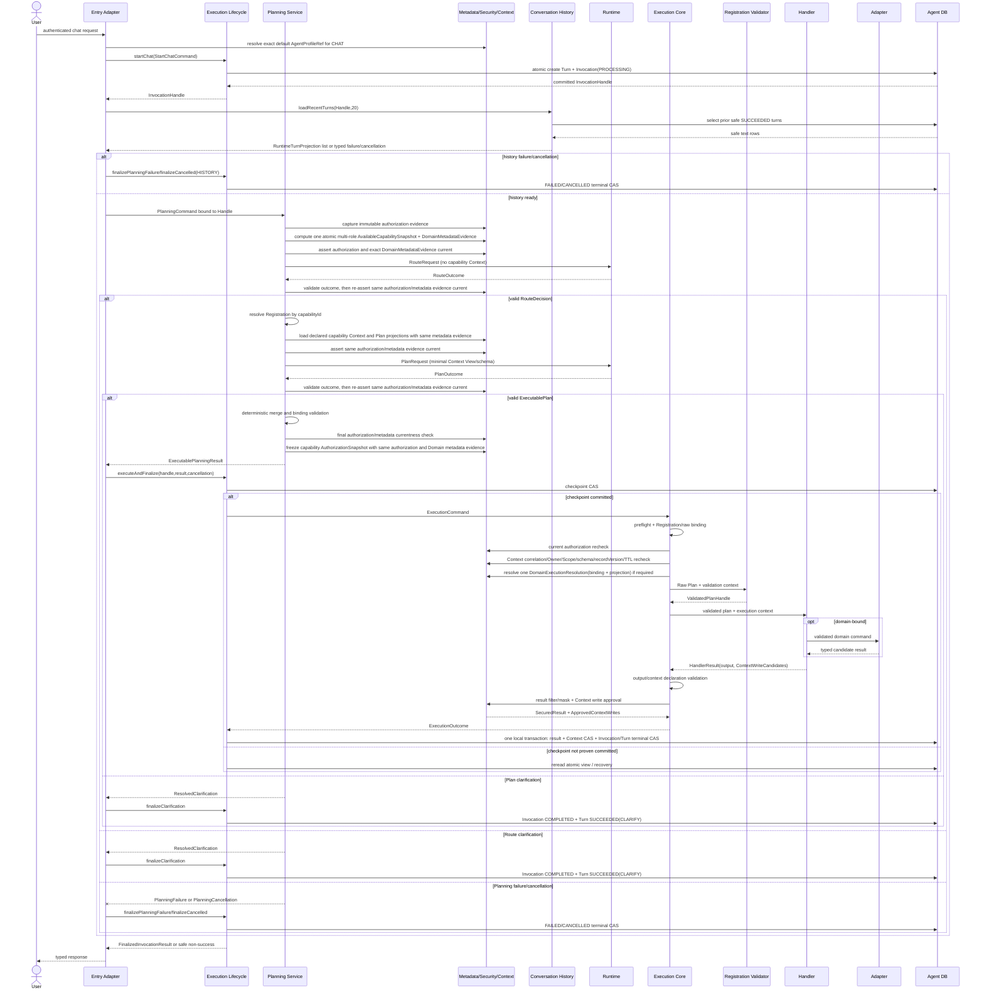

# D02 Capability Kernel 实施总览与集成门禁 — L2 v1.0

> 文档层级：L2 实施详细设计  
> 文档状态：已实施（D01 退出门禁通过，D02 基线复核完成，代码已提交；2026-07-04 已按授权补充多轮分页与权限拒绝提示门禁；2026-07-05 已补充 Runtime Plan 输出修复门禁）
> 上位文档：`Agent目标架构总览_v1.0.md`、`Agent契约与规划架构设计_v1.0.md`、`Agent能力执行内核架构设计_v1.0.md`、`Agent元数据与上下文安全架构设计_v1.0.md`  
> 关联 L2：`D01_Agent契约生成与治理_L2实施详细设计_v1.0.md`、`D02_01_Capability注册与可信执行内核_L2_v1.0.md`、`D02_02_Invocation生命周期与持久化_L2_v1.0.md`、`D02_03_元数据授权与Context安全_L2_v1.0.md`  
> 交付阶段：D02 详细设计评审门禁  
> 前置依赖：三份单 Agent L1 均已评审；D01 文档已评审但实施退出门禁尚未完成  
> 后置交付：D04 Adapter Metadata 收敛；D03 Capability v2 纵向原子切换  
> 适用代码基线：`4ce5ac3` 及其同源后续提交

---

## 0. 修改历史

| 序号 | 日期 | 位置 | 修改原因 | 修改内容 |
|---:|---|---|---|---|
| 1 | 2026-07-04 | 授权恢复 / 第 8～10 节 | 用户授权修订关联设计文档 | 在授权范围内补充 Agent 多轮分页、末页计算、`FIELD_FORBIDDEN`、`ExecutionFailure.safeMessage` 的集成门禁和验证命令。 |
| 2 | 2026-07-05 | 授权恢复 / 第 1、3、9～10 节 | UAT 修复后同步设计 | 补充 Runtime Plan `requestId` 绑定、bounded output repair、`OUTPUT_REPAIR_EXHAUSTED` 映射和集成验证门禁；明确该行为不是传输级重试。 |

---

## 1. 文档定位

### 1.1 目的

本文是 D02 的集成权威和内部 Planning 交接契约的唯一 L2 来源，负责：

1. 冻结四份 D02 文档的唯一所有权和依赖方向。
2. 定义 `PlanningCommand`、`PlanningResult`、`ExecutablePlanningResult`、`ResolvedClarification` 和 Planning 失败通道。
3. 闭合 D01 Runtime 候选契约到 Lifecycle、Execution Core、Metadata/Context 安全边界的调用链。
4. 冻结跨专项文档的方法签名，不复制专项内部实现。
5. 给出 D04 输入端口、D03 实施顺序、失败闭环和总体验收门禁。

### 1.2 D02 是设计门禁

D02 只产出经过评审的 L2 文档，不修改 Java、Python、SQL、配置或运行路径，不把 D01 candidate DTO 引入生产 classpath，不形成新旧双内核。本文及三个专项文档中列出的文件、命令和测试均是 D03/D04 的实施规格与验收计划。

四份D02文档可以在当前基线完成内容评审，但D01第16.6节退出门禁通过前，D02阶段不得声明完成、不得进入代码实施。D01完成后必须以实际D01产物执行一次字段/包名/generated model/drift gate复核；复核无漂移后，本套文档才成为D04/D03实施基线。随后还必须先完成D04，D03才可在一个纵向提交中实施Java、Runtime、Persistence、API/UI和旧路径删除。

### 1.3 唯一所有权

| 文档 | 唯一负责 | 明确不负责 |
|---|---|---|
| 本文 `D02_00` | 内部 Planning 交接类型、跨文档接口、全调用链、实施顺序、总门禁 | Registration/Core、Lifecycle、Authorization/Context 的内部实现 |
| `D02_01` | Definition、Registration、Registry、唯一类型桥、Validator、Handler、Execution Core、Execution Outcome | Lifecycle 状态机、持久化、权限公式、Context 存储 |
| `D02_02` | Invocation Handle/Record、Lifecycle、checkpoint、Turn/Result 持久化、finalization、CAS、recovery、deadline/cancel | Registration 类型桥、权限公式、Context 加密/CAS 实现 |
| `D02_03` | Profile、Policy、Permission、授权证据/Snapshot/Execution Scope、Catalog、D04 消费端口、Context、安全结果投影、配置 | Route/Plan Runtime 协议、Core 算法、Lifecycle 状态机、Canonical Domain/Adapter Metadata 实现 |
| D04 | Canonical Domain Field Catalog、Adapter Role/Registration、唯一装配来源及投影实现 | Planning/Core/Lifecycle/Context 状态机 |

每个类、方法、公式、表和配置只能在其所有者文档中完整定义。本文的跨文档接口表只登记调用签名和所有者，不复制字段正文。

### 1.4 L0 与契约规划约束映射

| 决策 | D02 落实 |
|---|---|
| AD-01 | capabilityId 只用于已选 Registration/审计；planKind 只表达结构 |
| AD-02 | D01 Java DTO、D02 Java内部类型和值对象是唯一结构来源，不产生Python/配置副本 |
| AD-03 | Registration/Profile/Policy/Context/Invocation等事实与请求级Snapshot/Projection分离 |
| AD-04 | Planning、Lifecycle、Core分别由D02_00、D02_02、D02_01冻结 |
| AD-05 | Raw→Validated→Handler桥只在D02_01 TypedRegistrationInvoker |
| AD-06 | Runtime候选必须经过Java绑定、授权、Context、Validator和结果安全 |
| AD-07 | D02只设计；D03纵向原子实施并删除旧路径 |
| AD-08 | Handle、PlanningCommand、Lifecycle/Core端口不区分CHAT/TASK协议 |
| AD-09 | Route前无Context；Route后按Registration加载Context |
| AD-10 | Handle中的absoluteDeadline贯穿Planning/Core/Adapter/Finalization |
| CP-01 | D01提供两个typed operation；PlanningService唯一编排Route→Plan |
| CP-02 | RouteDecision只建议capabilityId/domain；权威planKind来自ResolvedRegistration |
| CP-03 | D02_01 Definition持有typed descriptor，Catalog只形成D01安全投影 |
| CP-04 | PlanningService只在合法RouteDecision和Registration解析后加载Context |
| CP-05 | D01 Runtime union与D02内部PlanningResult均保持封闭，互不替代 |
| CP-06 | Runtime不返回question；ClarificationQuestionRenderer使用Java固定模板 |
| CP-07 | Runtime结构只走D01 Java→OpenAPI→Python单向生成，D02不新增Python模型 |
| CP-08 | Route/Plan只消费Handle absoluteDeadline，Runtime内部repair不得重置预算 |
| CP-09 | D03 Runtime仍按L1 Planning Strategy Registry实现；D02 Java Binder同样按planKind复用，同planKind新capability不改主流程 |
| CP-10 | Planning只返回PlanningResult/失败通道，不持久化或执行 |
| CP-11 | candidate不激活；D03不保留双协议 |
| CP-12 | PlanningResult携带ResolvedRegistration，Planning不持有执行类型桥 |
| CP-13 | CHAT/TASK复用同一PlanningCommand/PlanningResult |
| CP-14 | Planning不自动重试Route/Plan；Runtime output repair只能在D01 `repairLimit` 内发生，providerAttempts/repairAttempts只采用D01上报值 |
| CP-15 | ExecutablePlanningResult绑定同一次Route→Plan及同一授权和Domain metadata证据链 |
| CP-16 | 内部权威capabilityId/planKind来自RouteDecision+Registration，不接受PlanOutcome回显 |

### 1.5 EK/MS 决策唯一落点

| 决策 | 所有者 | 决策 | 所有者 |
|---|---|---|---|
| EK-01 | D02_01 Registration | MS-01 | D02_03 Profile Registry |
| EK-02 | D02_01 Registry | MS-02 | D02_03 Policy |
| EK-03 | D02_01 TypedRegistrationInvoker | MS-03 | D02_03 Effective Profile/Scope |
| EK-04 | D02_01 Validator | MS-04 | D02_03 Snapshot/recheck |
| EK-05 | D02_01 Handler | MS-05 | D02_03 Catalog |
| EK-06 | D02_02 Lifecycle | MS-06 | D02_03 不可用项不投影 |
| EK-07 | D02_02 本地事务 | MS-07 | D04唯一Canonical Catalog；D02只定义port |
| EK-08 | D02_01 Core禁止清单 | MS-08 | D04唯一AdapterRegistration；D02只消费 |
| EK-09 | D02_01安全输出+D02_02终结 | MS-09 | D02_03 Context read |
| EK-10 | D02_02新Invocation/recovery | MS-10 | D02_03 Owner/Scope/type隔离 |
| EK-11 | D02_01/D02_03 D04 seam | MS-11 | D02_03加密/TTL/CAS/cleanup |
| EK-12 | D02_02 typed Handle | MS-12 | D02_02 finalization+D02_03 participant |
| EK-13 | D02_01不预设写操作outbox | MS-13 | D02_03一次Binding |
| EK-14 | D01/D02 Java单来源 | MS-14 | D02_03 Result Security |
| EK-15 | D02_01 ExecutionCommand | MS-15 | D02_03 Snapshot/Projection非事实源 |
| EK-16 | D02_03 Binding port | MS-16 | D02_01/D02_03扩展测试 |
| EK-17 | D02_02 CAS/commit unknown | MS-17 | D02_02/D02_03 CHAT/TASK复用 |
| EK-18 | D02_02 recovery | MS-18 | 全部逻辑边界进程内 |
| EK-19 | D02_01步骤5+D02_03 currentness | MS-19 | D02_03 execution revalidate |

---

## 2. D01 与 D02 的契约边界

### 2.1 D01 唯一输出

D01 唯一定义 Runtime HTTP 结构：

- `RouteRequest`、`RouteOutcome`；
- `PlanRequest`、`PlanOutcome`；
- `RouteDecision`、`ExecutablePlan`、`ClarificationRequired`；
- `AgentPlan` 及其 subtype；
- `RuntimeOperationMetadata`；
- `RuntimeCapabilityRoutingDescriptor`、`RuntimeDomainRoutingProjection`、`RuntimeDomainSchema`、`RuntimeContextView`；
- typed Runtime error。

这些 DTO 是 Runtime 候选输入/输出，不是内部 PlanningResult、授权事实、Context Snapshot、Validated Plan 或执行结论。

### 2.2 禁止替换关系

以下替换全部禁止：

| 错误做法 | 原因 |
|---|---|
| 用 D01 `ExecutablePlan` 代替 `ExecutablePlanningResult` | 缺少 Resolved Registration、Authorization/Context Snapshot、correlation 和绝对 deadline |
| 把 `ContextSnapshot`/Envelope 发给 Runtime | 破坏两阶段隔离和安全边界 |
| 在 D02 再定义 Runtime Domain/Context DTO | 形成 Java 双契约源 |
| 在 D02 激活 candidate endpoint/model | 形成 D01/D03 之间的半运行态 |

---

## 3. 内部 Planning 交接契约

本节类型由本文唯一负责，计划在 D03 创建于 `agent-service/src/main/java/com/dylan/agent/planning/model/`。它们不是 HTTP DTO，不生成 Python model。

纯引用`AgentProfileRef`由本文创建于`com.dylan.agent.shared.ref`，字段为agentId和可选expectedVersion；只有规范化构造器和只读访问器。Profile Registry、InvocationHandle和PlanningCommand共同消费此唯一类型。

`PlanningService`位于`com.dylan.agent.planning`，唯一公开方法为`PlanningResult plan(PlanningCommand command, CancellationToken cancellation)`。它按契约规划L1执行两阶段流程；失败抛出只携带`PlanningFailure`的`PlanningFailureException`，取消由同一CancellationToken传播。Entry只调用此方法，不复制Route/Plan编排。

构造器只注入：`AuthorizationPlanningPort`、`ProfileBehaviorProjectionBoundary`、`CapabilityCatalog`、`CapabilityRegistry`、`ContractRegistry`、`ContextPlanningPort`、`DomainMetadataPort`、`AgentRuntimeClient`、`DeterministicPlanBinder`、`ClarificationQuestionRenderer`和唯一UTC `Clock`。这些是同一进程内边界/内部helper，不新增微服务、通用组装层或事实源。

`AgentRuntimeClient`在D03替换为两个typed方法：`RouteOutcome route(RouteRequest request, CancellationToken token)`、`PlanOutcome plan(PlanRequest request, CancellationToken token)`；两者使用D01固定路径、Handle absolute deadline与同一token。合法非2xx `RuntimeErrorResponse`或无合法响应时抛`RuntimeOperationException`，字段为operation、`RuntimeCallFailureKind`、可选typed error、localDurationMs、diagnosticId；禁止把transport/protocol未知provider/repair次数伪造为0。`RuntimeCallFailureKind`只有`RUNTIME_ERROR`、`TRANSPORT_FAILURE`、`PROTOCOL_FAILURE`、`CANCELLED`、`DEADLINE_EXCEEDED`；只有RUNTIME_ERROR必须携带已通过D01校验的typed error，其余必须为空。Client在调用前后检查同一token/deadline，取消/到期保留本地duration并由Planning映射到独立取消通道；异常cause只用于内部日志且不得进入PlanningFailure/API。

### 3.1 `PlanningCommand.java`

| 字段 | 类型 | 来源与约束 |
|---|---|---|
| `handle` | `InvocationHandle` | Lifecycle Start 提交后返回；主体、Owner、Scope、correlation、deadline 只能从此读取 |
| `userMessage` | `String` | 规范化后的当前消息，非空 |
| `history` | `List<RuntimeTurnProjection>` | D01 安全历史投影；不含 Context、完整业务结果、权限事实 |
| `agentProfileRef` | `AgentProfileRef` | 必须等于Handle在Start时绑定的目标Profile，不可替换 |
| `delegationConstraintRef` | `DelegationConstraintRef` | CHAT 使用 `none()` 中性值，TASK 使用稳定引用 |

公开方法：全参构造器、五个只读访问器。构造器必须确认`agentProfileRef`等于Handle绑定Profile，且`handle.absoluteDeadline()`未被外部字段覆盖；不存在Chat/Task两套Command。

### 3.2 `PlanningResult.java`

```java
public sealed interface PlanningResult
        permits ExecutablePlanningResult, ResolvedClarification {
    String requestCorrelationId();
    Instant absoluteDeadline();
}
```

Planning 异常和取消不作为第三个 variant，通过 `PlanningFailure`/cancellation 通道交给 Lifecycle。

### 3.3 `ExecutablePlanningResult.java`

| 字段 | 类型 | 不变量 |
|---|---|---|
| `requestCorrelationId` | `String` | 与 Handle、Route、Plan 相同 |
| `capabilityId` | `String` | 来自已校验 RouteDecision |
| `domain` | `Optional<String>` | 来自已校验RouteDecision并与PlanRequest一致；D01 Raw Plan不重复domain |
| `planKind` | `AgentPlanKind` | 来自 Resolved Registration，不接受 Runtime 顶层回显 |
| `resolvedRegistration` | `ResolvedRegistration` | 同一次 Planning 解析的不可变 Registration 引用 |
| `rawPlan` | `AgentPlan` | D01 Runtime 候选，经 Java merge/binding 校验，尚未进入最终 Validator |
| `authorizationSnapshot` | `AuthorizationSnapshot` | capability 确定后从 Route 前同一授权证据链冻结 |
| `contextSnapshots` | `List<ContextSnapshot>` | capability确定后按每个read declaration加载，contextType唯一；可空列表，不发送Runtime |
| `routeAudit` | `PlanningOperationAudit` | 包含D01 Route metadata及Java本地耗时，状态必须REPORTED |
| `planAudit` | `PlanningOperationAudit` | 包含D01 Plan metadata及Java本地耗时，状态必须REPORTED |
| `absoluteDeadline` | `Instant` | 必须等于 Handle deadline，不能延长 |

公开方法：全参构造器和十一组只读访问器。构造器执行非业务结构校验：所有correlation一致；capabilityId/planKind与Registration一致；每个Snapshot主体/Owner/Scope与Handle一致且contextType不重复；raw subtype与planKind一致。它不调用Validator、Handler、Adapter或持久化。

### 3.4 `ResolvedClarification.java`

| 字段 | 类型 | 说明 |
|---|---|---|
| `requestCorrelationId` | `String` | 与 Handle 一致 |
| `stage` | `ClarificationStage` | `ROUTE` 或 `PLAN` |
| `reasonCode` | `ClarificationReasonCode` | D01 Java enum |
| `args` | `ClarificationArgs` | D01 typed union，已校验 |
| `safeQuestion` | `String` | Java 模板生成，不接受 Runtime 自由 question |
| `capabilityId`/`domain` | `Optional<String>` | Route 澄清为空；Plan 澄清可有 |
| `registrationIdentity` | `Optional<String>` | 仅 Plan 澄清可有 |
| `authorizationEvidenceRef` | `String` | 安全版本引用，不是完整权限 |
| `domainMetadataEvidenceRef` | `String` | 同一Available Snapshot的安全digest引用，不暴露Catalog正文 |
| `contextSnapshotRefs` | `List<String>` | 已加载Context的安全引用，可空 |
| `routeAudit`/`planAudit` | `PlanningOperationAudit`/`Optional<PlanningOperationAudit>` | 已执行 operation 的安全审计；Route澄清无Plan audit |
| `absoluteDeadline` | `Instant` | 与 Handle 一致 |

公开方法：全参构造器、只读访问器。`ClarificationStage` 是两个值的 enum。

### 3.5 `PlanningFailure.java`

`PlanningFailure` 是内部不可变错误值，不是 Runtime response：

| 字段 | 类型 | 约束 |
|---|---|---|
| `requestCorrelationId` | `String` | 与Handle一致 |
| `stage` | `PlanningStage` | 精确失败阶段 |
| `errorCode` | `KernelErrorCode`（安全内部enum） | 不接受自由字符串 |
| `diagnosticId` | `String` | 不透明安全引用 |
| `authorizationEvidenceRef` | `Optional<String>` | capture成功后必须存在，之前为空 |
| `domainMetadataEvidenceRef` | `Optional<String>` | Catalog成功后必须存在，之前为空 |
| `operationAudits` | `List<PlanningOperationAudit>` | 0～2项，严格按ROUTE、PLAN排序；进入Runtime前失败为空 |

`PlanningStage` 包含 `HISTORY`、`PROFILE_POLICY`、`CATALOG`、`ROUTE`、`REGISTRATION`、`CONTEXT`、`PLAN`、`SNAPSHOT_FREEZE`，由Failure和Cancellation共用，不表达终态。`HISTORY`只表示Start提交后、PlanningService调用前的安全历史投影；该阶段尚无authorization/domain evidence或operation audit。取消只通过CancellationToken/独立取消通道，不伪装成PlanningFailure。入口适配者只能调用Lifecycle的`finalizePlanningFailure`或`finalizeCancelled`，不能直接写Turn/Invocation。

`PlanningFailure.historyProjection(requestCorrelationId,errorCode,diagnosticId)`只允许`PERSISTENCE_FAILED`或`INTERNAL_ERROR`，固定stage=`HISTORY`且两类evidence ref与audits均为空。`PlanningCancellation.beforePlanning(requestCorrelationId,errorCode)`只允许`CANCELLED`或`DEADLINE_EXCEEDED`，固定stage=`HISTORY`且refs/audits为空。它们是Start后历史投影失败的唯一构造入口，禁止Entry自由伪造其他Planning阶段结果。

`PlanningFailureException`构造器只接受PlanningFailure，公开`PlanningFailure failure()`；异常message不拼接Runtime原文、权限事实或payload。

`PlanningCancellation`是独立不可变值，字段为requestCorrelationId、`PlanningStage stage`、仅允许CANCELLED/DEADLINE_EXCEEDED的KernelErrorCode、optional authorization/domain metadata evidence refs、按ROUTE/PLAN排序的`List<PlanningOperationAudit>`；capture/Catalog成功后对应ref必须存在，domain ref存在时authorization ref也必须存在。它不是PlanningResult或PlanningFailure。`PlanningCancellationException`构造器只接受该值并公开`cancellation()`。PlanningService在边界检查token，或把Client的CANCELLED/DEADLINE_EXCEEDED映射为NOT_REPORTED audit后抛此异常；Entry只能把它交给Lifecycle。

若收到合法D01 `RuntimeErrorResponse`且code/metadata绑定为DEADLINE_EXCEEDED，Planning生成REPORTED `RUNTIME_ERROR_RECEIVED` audit后走`PlanningCancellation`；caller cancellation只由本地token产生。其他typed Runtime error映射PlanningFailure。禁止仅凭HTTP 504或异常消息猜测取消原因。

Runtime→Kernel映射固定为：`CONTRACT_INVALID→RUNTIME_CONTRACT_INVALID`、`AUTHENTICATION_FAILED→RUNTIME_AUTHENTICATION_FAILED`、`PROVIDER_UNAVAILABLE/INTERNAL_ERROR→RUNTIME_UNAVAILABLE`、`OUTPUT_REPAIR_EXHAUSTED→RUNTIME_OUTPUT_INVALID`、`DEADLINE_EXCEEDED→PlanningCancellation(DEADLINE_EXCEEDED)`；transport failure→`RUNTIME_UNAVAILABLE`，protocol failure→`RUNTIME_CONTRACT_INVALID`。映射使用穷尽switch，未知enum组合编译/测试失败，不从HTTP message推断。

Runtime Plan output repair 是同一次 Plan operation 内的结构修复，不是 PlanningService 的 Route/Plan 重试。Runtime 可以在返回前对已解析 PlanOutcome 的 envelope `requestId` 归一化为当前 PlanRequest 标识，但不得改写 capabilityId、domain、planKind、filters、selectFields、groupBy、metrics 等业务语义字段。修复耗尽时必须返回 typed `OUTPUT_REPAIR_EXHAUSTED`，Java 只能按上表映射为 `RUNTIME_OUTPUT_INVALID`，不得从原始LLM输出或HTTP文本推断新的错误语义。

### 3.6 Operation Audit 与确定性绑定

`PlanningOperationAudit`字段为`RuntimeOperationType operation`、`RuntimeMetadataStatus metadataStatus`、可选D01 `RuntimeOperationMetadata runtimeMetadata`、`long localDurationMs`、`PlanningOperationTermination termination`。`RuntimeMetadataStatus`只有`REPORTED`、`NOT_REPORTED`；termination只有`OUTCOME_RECEIVED`、`RUNTIME_ERROR_RECEIVED`、`TRANSPORT_FAILURE`、`PROTOCOL_REJECTED`、`DEADLINE_EXCEEDED`、`CANCELLED`。

公开工厂：`reported(RuntimeOperationMetadata,long,PlanningOperationTermination)`与`notReported(RuntimeOperationType,long,PlanningOperationTermination)`。REPORTED只允许`OUTCOME_RECEIVED`或`RUNTIME_ERROR_RECEIVED`；NOT_REPORTED只允许其余termination。构造器同时强制metadata存在性与operation一致；NOT_REPORTED不得出现providerAttempts/repairAttempts替代值。Executable/Clarification/Failure和Invocation审计统一消费该类型，不建立第二套Runtime metadata DTO。

`DeterministicPlanBinder.bindAndMerge(ResolvedRegistration,AgentPlan,List<ContextSnapshot>,Optional<RuntimeDomainSchema>)`按D01封闭`AgentPlan` subtype作穷尽分派：QUERY调用`QueryPlanBindingStrategy.bind(QueryAgentPlan,List<ContextSnapshot>,Optional<RuntimeDomainSchema>)`执行Context MERGE/REPLACE并返回新的`QueryAgentPlan`，AGGREGATE调用`AggregatePlanBindingStrategy.bind(AggregateAgentPlan,List<ContextSnapshot>,Optional<RuntimeDomainSchema>)`完成防御性复制和绑定校验。QUERY策略唯一调用`QueryMergeEngine.merge(AgentQuerySpec proposed, QueryCapabilityContextPayload previous)`，该方法按contextMode/removeFields对raw Java值确定性合并并返回新`AgentQuerySpec`，不读取AgentProperties/D04/权限、不产生ValidatedFilter。策略只消费typed Snapshot payload和当前Plan schema，不做最终字段授权/业务校验；Core仍必须调用Registration Validator。新增同planKind capability或新domain不修改Binder；只有新增D01 `AgentPlanKind`时才新增策略并更新穷尽编译门禁。

QUERY规则固定为：REPLACE禁止removeFields并返回防御性副本；MERGE必须存在唯一QUERY Snapshot且domain与PlanRequest一致，不存在时失败而非降级。MERGE按field/operator结构应用remove与replace/range合并，criteria变化重置page=1，未提供的selectFields/size继承Snapshot；输出必须改写为完整`contextMode=REPLACE`、空removeFields的新Raw Query，供Core Validator从零复检。AGGREGATE没有隐式继承模式，始终输出Runtime给出的完整防御性副本；Snapshot只作为Plan提示，不在Java静默补字段。

`ClarificationQuestionRenderer.render(ClarificationReasonCode,ClarificationArgs)`只使用Java固定模板和已授权typed args，返回非空安全问题；不接受Runtime自由文本、Prompt或权限表达式。

`AgentChatResponseAssembler.toApi(FinalizedInvocationResult)`是Entry唯一CHAT响应映射：先要求result.origin为`ChatInvocationOrigin`并从中取得conversationId/turnId；SUCCESS固定API type=RESULT并直接设置StoredInvocationResult中的filtered `AgentResultPayload`，CLARIFY使用CLARIFY和safe question，FAILURE/CANCELLED统一映射ERROR及穷尽KernelErrorCode安全映射。它不按payload subtype/capabilityId/domain/planKind分支、不调用Result projector、不读取未过滤结果。未来TASK使用其独立响应Assembler消费`TaskInvocationOrigin`，不修改Lifecycle/Core或复用Chat DTO。

### 3.7 `PlanningService` 唯一算法

1. 校验Command/Handle/Profile/correlation、future deadline和同一CancellationToken；创建空operation audit列表。
2. 以Handle绑定值调用`AuthorizationPlanningPort.capture`，得到包含同一absoluteDeadline的单一`PlanningAuthorizationEvidence`。
3. 以同一evidence调用`ProfileBehaviorProjectionBoundary.project(evidence)`和`CapabilityCatalog.available(evidence)`；前者要求bundleVersion/digest相同，后者对全部AdapterRole只取得一次原子`DomainAvailabilitySnapshot`，返回含同一`DomainMetadataEvidence`的Available Snapshot。capabilities为空时以CATALOG安全失败终结，不构造违反D01非空约束的RouteRequest。
4. 以行为投影和Available Snapshot构造最小Route capability/domain projections；在发送前依次`AuthorizationPlanningPort.assertCurrent`和`DomainMetadataPort.assertCurrent`，再调用`AgentRuntimeClient.route`并记录REPORTED或NOT_REPORTED Route audit。
5. 对合法Route outcome校验D01 union、request/correlation、metadata、available capability/domain；消费outcome前再次复检同一authorization/domain evidence。Route clarification通过Java renderer形成绑定authorization/domain evidence安全digest的`ResolvedClarification`并返回。
6. 对RouteDecision仅按capabilityId调用`CapabilityRegistry.resolve`，确认Registration identity、planKind和DomainMode与Available Snapshot闭合；D01 Raw Plan/Runtime不决定Registration。
7. 逐个Registration read declaration调用`ContextPlanningPort.load`，按contextType去重，并由同一port的`toRuntimeView`生成最小View；同时使用同一DomainMetadataEvidence构造选定domain的Plan schema。任何必需Context/投影失败都停止。
8. 通过`ContractRegistry.runtimeSchemaRef(resolvedRegistration.registration().definition().inputContract())`取得已验证D01 component ref，以Registration、Context Views、Plan schema和Handle deadline构造最小PlanRequest；发送前再次复检同一authorization/domain evidence，调用`AgentRuntimeClient.plan`并追加REPORTED或NOT_REPORTED Plan audit。
9. 对合法Plan outcome校验D01 union、request/correlation、metadata、planKind、schema/Context引用；消费outcome前再次复检同一authorization/domain evidence。Plan clarification形成带两类evidence refs及Route+Plan audit的`ResolvedClarification`并返回。
10. 对ExecutablePlan调用`DeterministicPlanBinder`形成新的merged Raw Plan，并复核subtype/planKind及所有绑定；不得调用最终Validator。
11. freeze前最后复检同一authorization/domain evidence，以ResolvedRegistration、选定domain、Context Snapshot references和同一DomainMetadataEvidence构造`CapabilityScopeSelection`，调用`freezeCapabilityScope`。
12. 构造`ExecutablePlanningResult`，同时绑定Handle、ResolvedRegistration、merged Raw Plan、Authorization/Context Snapshots、两个operation audits和同一deadline。
13. 任一步骤的已知非取消失败映射为带已完成operation audits的`PlanningFailureException`；取消/到期由同一token或边界返回的typed `DEADLINE_EXCEEDED`触发，并映射为带已完成audits的`PlanningCancellationException`。其中User Permission非deadline失败固定为`PROFILE_POLICY/PERMISSION_UNAVAILABLE`，deadline进入`PROFILE_POLICY/DEADLINE_EXCEEDED`且audits为空。不得自动重试Route/Plan、切换capability/domain、重新捕获证据或直接终结Invocation。

### 3.8 文件清单

| 文件 | 动作 | 所有者 |
|---|---|---|
| `planning/model/PlanningCommand.java` | NEW（D03） | D02_00 |
| `planning/model/PlanningResult.java` | NEW（D03） | D02_00 |
| `planning/model/ExecutablePlanningResult.java` | NEW（D03） | D02_00 |
| `planning/model/ResolvedClarification.java` | NEW（D03） | D02_00 |
| `planning/model/ClarificationStage.java` | NEW（D03） | D02_00 |
| `planning/model/PlanningFailure.java` | NEW（D03） | D02_00 |
| `planning/model/PlanningStage.java` | NEW（D03） | D02_00 |
| `planning/model/PlanningCancellation.java` | NEW（D03） | D02_00 |
| `planning/model/PlanningOperationAudit.java` | NEW（D03） | D02_00 |
| `planning/model/RuntimeMetadataStatus.java` | NEW（D03） | D02_00 |
| `planning/model/PlanningOperationTermination.java` | NEW（D03） | D02_00 |
| `planning/PlanningService.java` | NEW（D03） | D02_00 |
| `planning/PlanningFailureException.java` | NEW（D03） | D02_00 |
| `planning/PlanningCancellationException.java` | NEW（D03） | D02_00 |
| `planning/DeterministicPlanBinder.java` | NEW（D03） | D02_00 |
| `planning/QueryPlanBindingStrategy.java` | NEW（D03） | D02_00 |
| `planning/AggregatePlanBindingStrategy.java` | NEW（D03） | D02_00 |
| `planning/filter/QueryMergeEngine.java` | MODIFY（D03） | D02_00 |
| `planning/ClarificationQuestionRenderer.java` | NEW（D03） | D02_00 |
| `application/AgentChatResponseAssembler.java` | NEW（D03） | D02_00 |
| `client/AgentRuntimeClient.java` | MODIFY（D03） | D02_00 |
| `client/RuntimeOperationException.java` | NEW（D03） | D02_00 |
| `client/RuntimeCallFailureKind.java` | NEW（D03） | D02_00 |
| `shared/ref/AgentProfileRef.java` | NEW（D03） | D02_00 |
| `PlanningServiceTest.java`、`PlanningOperationAuditTest.java`、`DeterministicPlanBinderTest.java`、`AgentRuntimeClientContractTest.java`、`ClarificationQuestionRendererTest.java`、`AgentChatResponseAssemblerTest.java` | NEW（D03 test） | D02_00 |
| `planning/filter/QueryMergeEngineTest.java` | MODIFY（D03 test） | D02_00 |

---

## 4. 包依赖与跨文档接口

### 4.1 依赖方向

```text
planning.model → invocation.model + registration.model + metadata.authorization.model/request + metadata.context.model/request + D01 Java DTO
invocation.model → shared.ref (AgentProfileRef only)
lifecycle.model → invocation.model + planning.model + agent-api Java value types
kernel.* → invocation.model + planning.model + kernel.port + metadata.authorization.model + metadata.context.model（不依赖request/internal）
lifecycle.service → invocation.model + lifecycle.model + planning.model + kernel.core port + persistence ports
metadata/security/context implementations → kernel.port + registration read model
D04 implementations → D02 DomainMetadataPort + agent-adapter-api

禁止：
kernel.core ×→ lifecycle.service / persistence implementation
kernel.core ×→ metadata/security/context implementation
metadata/context ×→ lifecycle state transition
D04 ×→ Planning/Core/Lifecycle orchestration
invocation.model ×→ planning.model / lifecycle.model / kernel / metadata
```

`kernel.*`可以消费由D02_03所有、放在稳定`kernel.port.model`、`metadata.authorization.model`、`metadata.context.model`包中的不可变值对象，但不得依赖`metadata.*.internal`、具体`@Component`、Mapper、Repository或配置实现。

### 4.2 跨文档方法登记

| 调用方 | 方法 | 返回 | 唯一所有者 |
|---|---|---|---|
| Planning | `CapabilityRegistry.resolve(String)` | `ResolvedRegistration` | D02_01 |
| Planning | `ContractRegistry.runtimeSchemaRef(ContractRef)` | `String` | D02_01 |
| Startup | `DomainMetadataPort.knownRoles()` | `Set<AdapterRole>` | D02_03定义消费契约，D04实现 |
| Planning | `AuthorizationPlanningPort.capture(PlanningSecurityRequest)` | `PlanningAuthorizationEvidence` | D02_03 |
| Authorization | `UserPermissionAuthorityPort.resolveCurrent(ExecutionSubjectRef,Instant)` | `UserPermission`/typed authority failure | D02_03定义消费SPI；生产Adapter由外部权限权威集成提供 |
| Planning | `ProfileBehaviorProjectionBoundary.project(PlanningAuthorizationEvidence)` | `RuntimeProfileBehaviorProjection` | D02_03 |
| Planning | `AuthorizationPlanningPort.assertCurrent(evidence)` | `void`/安全异常 | D02_03 |
| Planning | `CapabilityCatalog.available(evidence)` | `AvailableCapabilitySnapshot` | D02_03 |
| Metadata reload | `DomainMetadataPort.validateReferences(DomainMetadataReferenceSet,Instant)` | `DomainMetadataEvidence` | D02_03定义消费契约，D04实现；同版本校验field/operator/function引用 |
| Planning/Execution | `DomainMetadataPort.assertCurrent(evidence, deadline)` | `void`/安全异常 | D02_03定义消费契约，D04实现 |
| Planning | `ContextPlanningPort.load(ContextReadRequest)` | `Optional<ContextSnapshot>` | D02_03 |
| Planning | `ContextPlanningPort.toRuntimeView(ContextSnapshot,ContextReadDeclaration,PlanningAuthorizationEvidence)` | `RuntimeContextView` | D02_03 |
| Planning | `AuthorizationPlanningPort.freezeCapabilityScope(PlanningAuthorizationEvidence,CapabilityScopeSelection)` | `AuthorizationSnapshot` | D02_03 |
| Entry | `ExecutionLifecycleService.startChat(StartChatCommand)` | `InvocationHandle` | D02_02 |
| Entry | `AgentProfileRegistry.defaultRef()` | `AgentProfileRef` | D02_03；仅CHAT |
| Entry | `ConversationService.loadRecentTurns(InvocationHandle,int)` | `List<RuntimeTurnProjection>` | D02_02 |
| Entry | `ExecutionLifecycleService.executeAndFinalize(handle, result, cancellation)` | `FinalizedInvocationResult` | D02_02 |
| Entry | `ExecutionLifecycleService.finalizeClarification(InvocationHandle,ResolvedClarification)` | `FinalizedInvocationResult` | D02_02 |
| Entry | `ExecutionLifecycleService.finalizePlanningFailure(InvocationHandle,PlanningFailure)` | `FinalizedInvocationResult` | D02_02 |
| Entry | `ExecutionLifecycleService.finalizeCancelled(InvocationHandle,PlanningCancellation)` | `FinalizedInvocationResult` | D02_02 |
| Lifecycle | `ExecutionCore.execute(ExecutionCommand)` | `ExecutionOutcome` | D02_01 |
| Core | `AuthorizationExecutionPort.recheck(snapshot, handle)` | `ExecutionScope` | D02_03 |
| Core | `ContextExecutionPort.revalidateAll(snapshots, handle, registration, scope)` | `void`/安全异常 | D02_03 |
| Core | `DomainExecutionPort.resolve(request)` | `DomainExecutionResolution`（domainless路径不调用） | D02_03/D04 seam |
| Core | `ContextApprovalPort.approve(candidates, request)` | `List<ApprovedContextWrite>` | D02_03 |
| Core | `ResultSecurityPort.secure(candidate, contractRef, scope)` | `SecuredResult` | D02_03 |
| Lifecycle | `ContextFinalizationParticipant.persist(writes)` | `void`/CAS 异常 | 接口 D02_02；实现 D02_03 |
| Conversation cleanup | `ContextScopeRetirementParticipant.retire(ConversationScope,Instant)` | `void`/安全异常 | 接口D02_02；实现D02_03，独立提交不可读状态后才物理级联删除 |

方法参数和字段只在所有者专项文档中完整定义。

---

## 5. 完整调用链



### 5.1 顺序不变量

1. Start 事务提交后才能加载安全历史和进入 Planning；历史读取失败必须立即走Lifecycle终结，不等待recovery兜底。
2. Route 前捕获授权证据并计算 Catalog，不读取 capability Context。
3. 只有合法 RouteDecision 且按 capabilityId 解析 Registration 后才能加载 Context/Plan schema。
4. Authorization Snapshot 只能从 Route 前同一证据链冻结，不能混入新版本。
5. checkpoint 提交可证明后才进入 Core。
6. Core 在 Validator 前依次完成授权、Context 当前性和 Adapter Binding 复检。
7. Handler 只接收 Validated Plan；Adapter 只接收 validated domain command。
8. 结果过滤和 Context write 审批先于持久化。
9. SUCCESS 只能在同一本地事务提交结果、Context、Invocation、Turn 后返回。
10. commit unknown 不重执行业务，只重读权威原子视图；无法证明成功时返回安全非成功并交给 recovery。

---

## 6. 失败闭环

| 失败点 | 禁止继续 | 权威处理 |
|---|---|---|
| Lifecycle Start rollback/commit unknown | Planning | 仅完整同值Start原子视图可返回Handle；否则安全非成功/recovery |
| 安全历史投影/读取 | PlanningService/Route | typed failure/cancellation→Lifecycle FAILED/CANCELLED；不得留下PROCESSING等待定时恢复 |
| Profile/Policy/Permission/Catalog | Route | 非deadline错误：PlanningFailure→FAILED；typed deadline/caller cancel：PlanningCancellation→CANCELLED |
| Route/Registration/Context/Plan projection | 后续 Runtime operation/Core | FAILED 或 CLARIFY |
| Snapshot freeze | Core | FAILED/CANCELLED |
| checkpoint rollback/unknown | Core | 保持 PROCESSING；重读/recovery |
| authorization/Context currentness/binding | Validator/Handler | Execution failure→Lifecycle |
| Validator | Handler | FAILED |
| Handler/Adapter | output/context commit | FAILED/CANCELLED |
| result security/Context approval | 持久化和响应 | FAILED |
| result/Context/Turn/Invocation finalization | SUCCESS response | 整体回滚；重读/recovery |
| cancellation/deadline | 后续阶段和迟到提交 | CANCELLED；丢弃迟到 candidate |

---

## 7. D04 边界

D02 只冻结 `DomainMetadataPort`/`DomainExecutionPort` 的消费契约、D01 投影 DTO 的使用方式和 `AdapterExecutionBinding` 安全值对象。以下内容必须留给 D04：

- Canonical Domain Field Catalog 的存储/装配来源；
- `AdapterRole` 与 `(role, domain, port)` Registration 的唯一绑定；
- `agent-adapter-api`中的`AgentAdapterPort`稳定marker，以及现有Queryable/Aggregatable端口对它的继承；
- 具体 domain/field/operator/function 数据；
- Adapter 自报、配置和 Java 常量中的重复事实清理；
- Route/Plan/Validation/Binding 投影实现及 coverage gate。

D02 不创建 `CanonicalDomainFieldCatalog`、`DomainFieldCatalog` 或具体 `AdapterRegistration` 实现文件。

---

## 8. D03 实施顺序

### 8.1 当前代码替换与删除台账

该台账是D03/D04 L2必须接收的最小范围，防止旧路径与新内核并存：

| 当前路径 | 目标动作 | 所有者/原因 |
|---|---|---|
| `application/AgentOrchestrator.java` | MODIFY为薄Entry Adapter | D03；只调用Lifecycle+Planning，不保留路由/执行/终结逻辑 |
| `controller/AgentChatController.java`、`client/AgentRuntimeClient.java` | MODIFY | D03；typed response及Route/Plan双operation；client签名见§3 |
| `agent-api/.../AgentChatResponse.java`、`AgentResponseType.java`及新增sealed Result payload | MODIFY/NEW | D03；SUCCESS统一RESULT，结果形状由Java discriminator扩展，删除query/aggregate并列响应字段 |
| `exception/AgentRuntimeException.java` | DELETE | D03；由typed `RuntimeOperationException`区分合法RuntimeError与NOT_REPORTED transport/protocol failure |
| `capability/CapabilityRouter.java`、`CapabilityRouteResolver.java` | DELETE | D03；Planning+Registry替代 |
| `capability/AgentCapabilityHandlerRegistry.java`、`AgentCapabilityHandler.java` | DELETE | D03；CapabilityRegistration/Handler替代 |
| `capability/CapabilityExecutionContext.java`、`CapabilityExecutionResult.java`、`CapabilityValidationContext.java` | DELETE | D03；D02_01模型替代 |
| `capability/CapabilityDescriptorFactory.java` | DELETE | D03；Definition内typed Routing Descriptor+Catalog投影替代 |
| `capability/clarify/ClarifyPlanValidator.java`、`ClarifyCapabilityHandler.java` | DELETE | D03；Clarification不再是Capability |
| `capability/model/ValidatedClarifyPlan.java` | DELETE | D03 |
| `capability/query/QueryPlanValidator.java`、`QueryCapabilityHandler.java`、`capability/aggregate/AggregatePlanValidator.java`、`AggregateCapabilityHandler.java` | MODIFY实现新Validator/Handler | D03；业务逻辑保留，不复制共享路由/授权 |
| `capability/query/QueryMessages.java`、`capability/aggregate/AggregateMessages.java` | DELETE或迁入对应ResultSecurityProjector后删除旧类 | D03；message/summary只能从过滤后结果生成 |
| `capability/query/QueryParameterMapper.java`、`OperatorSemantics.java`、`FilterNormalizer.java`、`FieldFilterSet.java`、`FieldConstraintValidator.java` | MODIFY为Registration绑定Validator/Handler内部工具 | D03；只消费ExecutionValidationProjection，不保存权限/Catalog事实或形成共享capability分支 |
| `planning/filter/QueryMergeEngine.java` | MODIFY并仅由`QueryPlanBindingStrategy`调用 | D03；在Planning形成merged Raw Plan，Validator只对merged结果执行最终复检；QUERY MERGE必须继承上一轮filters/selectFields/page/size，并使用上一轮totalExact/totalPages完成末页和页码边界校验 |
| `capability/model/ValidatedQueryPlan.java`、`ValidatedAggregatePlan.java` | MODIFY为不可伪造不可变ValidatedPlan | D03 |
| `capability/model/ValidatedCapabilityPlan.java` | DELETE | D03；D02_01 `ValidatedPlan`唯一marker替代 |
| `capability/query/QueryRuntimeContextFactory.java` | DELETE | D03；ContextBoundary+Planning Context View替代 |
| `security/AgentPermissionService.java` | DELETE | D03；UserPermission/Authorization边界替代 |
| `security/AgentUserContextResolver.java` | MODIFY并仅保留认证主体解析 | D03；不能作Capability/field授权结论 |
| 外部 User Permission 生产 Adapter | NEW（具体路径由已评审外部协议决定） | D03投产前置；实现D02_03 `UserPermissionAuthorityPort`，禁止以JWT role或旧本地角色配置替代 |
| `result/AgentResultProcessor.java`、`AggregateResultProcessor.java` | DELETE或无语义迁移到ResultSecurityProjector后删除旧类 | D03；禁止双过滤路径 |
| `config/AgentPropertiesValidator.java` | MODIFY为纯旧运行参数校验 | D03；metadata校验由AgentMetadataPropertiesValidator负责 |
| `agent-service/pom.xml` | MODIFY | D03；增加ArchUnit 1.4.2 test dependency，复用已有Testcontainers/MySQL |
| `conversation/ConversationService.java`、`ConversationCleanupJob.java`、Turn/Conversation Mapper/Entity | MODIFY | D02_02/D03；Lifecycle与级联清理替代旧completion/query context |
| `adapter/QueryableAdapterRegistry.java`、`AggregatableAdapterRegistry.java` | DELETE | D04；唯一AdapterRegistration替代 |
| `planning/RuntimeDomainSchemaFactory.java` | DELETE | D04；Canonical Domain port投影实现替代 |
| `agent-api/src/main/java/com/dylan/agent/api/enums/AgentIntent.java`及旧PlanGenerate/Clarify契约 | DELETE | D03；以D01 target contract为准 |
| `agent-runtime`旧单operation graph/model/prompt、`static/agent.html`旧字段适配 | DELETE/MODIFY | D03 L2完整列出并原子切换 |

对标记“DELETE或迁移后删除”的类，D03最终提交中旧类名必须消失；不得保留facade、converter、feature flag或双Registry。具体业务方法迁移由D03 L2逐文件展开，但不得缩减本表范围。

### 8.2 单提交内部顺序

```text
1. 建立共享内部 Planning/invocation/security/context 值对象与端口，并接入恰好一个外部User Permission生产Adapter
2. 实现 Registration/Registry/唯一类型桥和 Core
3. 实现 Profile/Policy/Authorization/Catalog/Context/Result Security
4. 接入 D04 Canonical Domain/Adapter Metadata 实现
5. 实现 Lifecycle、Invocation/Result/Context 持久化和 recovery
6. 实现 Planning Service 与 Runtime Route/Plan
7. 纵向切换 API/UI，并删除 intent/旧 Context/旧 Handler/旧 completion 路径
8. 执行全量门禁，不保留 candidate/active 双来源
```

这是 D03 的单提交内部实施顺序，不允许按步骤发布半链。

---

## 9. D02 总体验收矩阵

| # | D02 设计验收条件 | 权威证据 |
|---|---|---|
| 1 | D01 Runtime `ExecutablePlan` 与内部 `ExecutablePlanningResult` 明确分离 | 本文第 2、3 节 |
| 2 | PlanningResult/失败/澄清、REPORTED/NOT_REPORTED审计到Lifecycle接口完整 | 本文第 3～6 节、D02_02 |
| 3 | AD-01～10、CP-01～16、EK-01～19、MS-01～19均有唯一落点 | 四份D02追踪矩阵 |
| 4 | Core 13 步包含授权、Context 当前性、Binding、Validator、Handler、结果/Context 安全 | D02_01 |
| 5 | Invocation/Turn/Result/Context 可在同一 Agent DB 本地事务闭环 | D02_02、D02_03 |
| 6 | commit unknown/CAS 输家/recovery 能重建权威终态且不重执行业务 | D02_02 |
| 7 | Profile/Policy/Permission/Delegation 公式唯一，两阶段授权证据不混版本 | D02_03 |
| 8 | Context 读取、当前性、加密、TTL、expected-version CAS、scope cleanup 完整 | D02_03 |
| 9 | D02 不侵入 D04 Canonical Metadata 实现 | 本文第 7 节、D02_03 |
| 10 | 新意图/capability/domain/profile/context type 不修改共享主流程算法；不得恢复AgentIntent主分支 | D02_01/D02_03 扩展测试设计 |
| 11 | 所有计划文件、类、方法、配置、SQL、测试和命令有唯一所有者 | 四份文件清单与方法索引 |
| 12 | D02 仅为设计门禁，无代码/配置/数据库运行态修改 | Git diff 仅包含四份 D02 文档 |
| 13 | D01实施退出后对实际Java/OpenAPI/Python产物完成基线复核，无包名/字段/生成物漂移 | D01第16.6节证据+D02契约引用复核记录 |
| 14 | 外部User Permission有且仅有一个生产SPI实现；稳定主体可在CHAT/TASK解析，权威源失败不回退JWT/本地角色配置 | D02_03第4.3、14.1、15节及D03启动/契约测试 |
| 15 | QUERY Context 支持多轮分页与末页计算；Runtime只接收最小Context View，Java负责MERGE后复检 | D02_01 `QueryPlanValidator`/`QueryMergeEngine`、D02_03 `QueryCapabilityContextPayload`/`RuntimeQueryContextView` |
| 16 | 存在但未授权字段必须映射为`FIELD_FORBIDDEN`，外部响应为`AGENT_FIELD_FORBIDDEN`，不得降级为`AGENT_PLAN_INVALID` | D02_01异常归一化、D02_02 `KernelErrorCode`/Lifecycle映射、D02_03安全错误码 |
| 17 | 执行失败的安全提示由`ExecutionFailure.safeMessage`进入Lifecycle终结；为空时才使用通用兜底提示 | D02_01 `ExecutionFailure`、D02_02 `FinalizationTxService.commitExecutionFailure` |
| 18 | Runtime Plan 输出修复受D01 `repairLimit`、deadline和metadata约束；`requestId`只允许归一化当前envelope绑定字段；`OUTPUT_REPAIR_EXHAUSTED`稳定映射为`RUNTIME_OUTPUT_INVALID` | D01 Runtime contract、D02_00 Runtime→Kernel映射、agent-runtime Plan parser/repair tests、agent-service PlanningService error mapping |

### 9.1 D03 预定验证命令

以下命令在 D03 实施后执行，D02 不伪称已经通过：

```powershell
Push-Location serviceCenter
.\mvnw.cmd -pl ../agent-api,../agent-adapter-api,../agent-service -am test
.\mvnw.cmd -pl ../agent-service -am `
  '-Dtest=PlanningServiceTest,PlanningOperationAuditTest,DeterministicPlanBinderTest,AgentRuntimeClientContractTest,ClarificationQuestionRendererTest,AgentChatResponseAssemblerTest,QueryMergeEngineTest,QueryPlanValidatorTest' `
  test
.\mvnw.cmd -pl ../agent-service -am `
  '-Dtest=AgentResultPayloadContractTest,AgentExecutionContractsTest,CapabilityRegistryTest,ExecutionCoreTest,KernelArchitectureTest,CapabilityExtensionTest,AgentChatResponseAssemblerTest' `
  test
.\mvnw.cmd -pl ../agent-service -am `
  '-Dtest=ExecutionLifecycleServiceTest,FinalizationTxServiceIT,FinalizationTxServiceTest,InvocationRecoveryServiceIT,AgentStateCleanupServiceIT,InvocationSchemaIT,InvocationAuditJsonCodecTest,DeadlineCancellationTest,LifecycleArchitectureTest' `
  test
.\mvnw.cmd -pl ../agent-service -am `
  '-Dtest=AgentProfileRegistryTest,ProfileBehaviorProjectionBoundaryTest,AgentPolicyConfigurationTest,AgentSecuritySettingsRegistryTest,AgentMetadataReloadTest,AuthorizationPlanningPortTest,AuthorizationExecutionPortTest,UserPermissionBoundaryTest,UserPermissionAuthorityWiringTest,UserPermissionAuthorityContractTest,CapabilityCatalogTest,DomainMetadataPortContractTest,ContextBoundaryTest,ContextRuntimeViewTest,ContextRepositoryIT,ContextFinalizationIT,ContextCleanupIT,ContextMigrationRegistryTest,ProtectedPayloadCodecTest,PayloadKeyProviderTest,PayloadJsonCodecTest,QueryCapabilityContextPayloadCompatibilityTest,ResultSecurityBoundaryTest,MetadataArchitectureTest,MetadataExtensionTest' `
  test
Pop-Location

rg -n "AgentIntent|ClarifyCapabilityHandler|query_context_json|CapabilityRouter" agent-service\src\main agent-runtime\app
rg -n "switch.*capabilityId|switch.*domain|if.*capabilityId" agent-service\src\main\java\com\dylan\agent\kernel agent-service\src\main\java\com\dylan\agent\metadata
rg -n '@SuppressWarnings\("unchecked"\)' agent-service\src\main\java
rg -n "OUTPUT_REPAIR_EXHAUSTED|repairAttempts|repairLimit|requestId" agent-runtime agent-api agent-service docs/design
git diff --check
```

预期：旧路径搜索为空；unchecked搜索只命中`TypedRegistrationInvoker`。D04 Canonical实现的唯一包和来源由D04 L2门禁单独验证。任一测试、静态检查或SQL集成测试失败，D03不得宣称原子切换完成。

---

## 10. 文档维护与最终评审结论

- 修改共享 Planning 交接类型先改本文，再同步专项文档。
- 修改专项内部类型只改其所有者文档，并更新本文接口登记和验收矩阵。
- 若实施证明上级决策不可行，先暂停并通过 ADR 修订 L0/L1，不得在 D03 形成旁路。
- 四份 D02 的状态必须一致；任一专项待评审时，D02 总体不得标记完成。
- Runtime output repair 或 `requestId` 归一化规则如需突破D01契约、增加传输级重试或修改attempt预算，必须先修订D01/ADR；D02不得单独放宽。

最终评审结论（2026-06-30）：本文已对照L0、三份单Agent L1、D01和三个D02专项完成所有权、契约、调用链、失败闭环、D04/D03边界及可落地性复审；当前文档基线下无未决冲突、侵入、缺漏或重复权威定义。D01实施退出后的产物复核、D04实现和唯一外部User Permission生产Adapter均是已显式定义的后续生效/投产门禁，不代表D02当前已进入实施或阶段完成，也不构成隐藏设计缺口。
