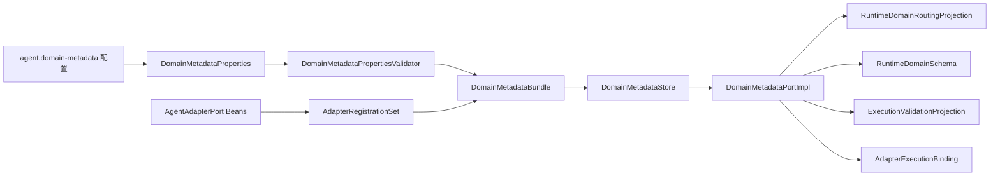

# D04 Agent Adapter 与 Domain Metadata 收敛 — L2 v1.0

> 文档状态：已实施并通过退出门禁
> 编写日期：2026-07-02
> 状态更新：2026-07-02
> 实施提交：`f594ad7 Implement D04 domain metadata convergence`
> 当前基线：`76400d6 Update legacy runtime contract model`
> 上位依据：`Agent目标架构总览_v1.0.md`、`Agent目标架构与演进设计_v1.0.md`、`Agent契约与规划架构设计_v1.0.md`、`Agent能力执行内核架构设计_v1.0.md`、`Agent元数据与上下文安全架构设计_v1.0.md`
> 关联 L2：`D01_Agent契约生成与治理_L2实施详细设计_v1.0.md`、`D02_00_CapabilityKernel实施总览与集成门禁_L2_v1.0.md`、`D02_01_Capability注册与可信执行内核_L2_v1.0.md`、`D02_03_元数据授权与Context安全_L2_v1.0.md`
> 后置交付：D03 Capability v2 纵向原子切换

---

## 0. Change List

| 日期 | 内容 | 原因 |
|---|---|---|
| 2026-07-02 | 起草 D04 L2，冻结 Canonical Domain Field Catalog、Adapter Role/Registration、`DomainMetadataPort` 实现、旧 metadata 双来源删除台账与门禁 | D03 前必须先提供唯一 Domain 执行事实来源 |
| 2026-07-02 | 更新 D04 实施状态、替换台账、门禁结果与实施后复核结论 | D04 已完成编码、审计、提交和推送；文档需与当前实现基线对齐 |

---

## 1. 目标与非目标

### 1.1 目标

D04 的目标是在 D03 前独立收敛 Agent Domain 执行 metadata：

1. 建立唯一 Canonical Domain Field Catalog，作为 Domain field/operator/function、字段类型、别名和稳定规划语义的唯一事实来源。
2. 建立唯一 Adapter Role 与 Adapter Registration 装配，负责 `(AdapterRole, domain)` 到 `AgentAdapterPort` 的静态绑定。
3. 实现 D02_03 冻结的 `DomainMetadataPort`，为 Capability Catalog、Planning、Execution Validator 和 Handler Binding 提供请求级安全投影。
4. 删除当前 `AgentProperties.domains`、Adapter 自报清单、`FieldCatalog` 常量和 `RuntimeDomainSchemaFactory` 中的 Domain metadata 事实副本。
5. 为 D03 提供可验证、可独立合并的 Domain metadata 基线。

### 1.2 非目标

D04 不做以下事情：

- 不新增或修改 D01 Runtime HTTP DTO、OpenAPI、Python generated model、Prompt、Runtime graph 或 endpoint。
- 不切换 D03 的 Route/Plan 双 operation，不创建 v1/v2 兼容层。
- 不修改 Planning Service、Execution Core、Lifecycle 状态机、Context 生命周期、Result Security 或 API/UI 响应形状。
- 不实现外部 `UserPermissionAuthorityPort` 生产 Adapter；该项仍是 D03 投产前置。
- 不把用户权限、mask、Profile、Policy、部署策略或下游凭据写入 Canonical Catalog 或 Adapter Registration。
- 不按 capabilityId、domain 或业务场景增加 Planning/Core/Handler 主流程分支。

---

## 2. 上位约束追踪

| 来源 | D04 必须满足的约束 | 本文落点 |
|---|---|---|
| L0：Java 是唯一契约源 | D04 只能投影到 D01 Java DTO，不生成第二 Runtime 契约源 | 第 7、13 节 |
| L0：Domain metadata 唯一来源 | 每个 Domain 只有一个 Canonical Domain Field Catalog | 第 4、5 节 |
| L0：新增 Domain 不侵入主流程 | 新 Domain 只增加 Catalog、Adapter Registration、Adapter、Policy 和装配 | 第 11、14 节 |
| 契约与规划 L1 | Route 阶段只接收最小 Domain Routing Projection；Plan 阶段只接收选定 domain schema | 第 7.5、7.6 节 |
| 能力执行内核 L1 | Core 通过 metadata 边界一次解析 Adapter Execution Binding，Handler 不二次路由 | 第 7.8、8 节 |
| 元数据与上下文安全 L1 | Catalog/Registration 是静态事实；availability、projection、binding 是请求级投影 | 第 4～8 节 |
| D01 | `RuntimeDomainRoutingProjection`、`RuntimeDomainSchema`、`AgentFieldType`、`AgentOperator` 由 Java 契约定义 | 第 5、7、13 节 |
| D02_00 | D04 必须接收 Adapter metadata 删除台账，D03 不得临时补 D04 | 第 10、15 节 |
| D02_01 | `AgentAdapterPort` marker、`AdapterRole` 和 typed port 绑定由 D04 提供 | 第 6、8 节 |
| D02_03 | `DomainMetadataPort` 签名、Evidence、Projection、Binding 语义已冻结 | 第 7 节 |

---

## 3. 实施前问题与收敛原则

D04 实施前，代码中 Domain 执行事实分散在多个来源：

- `agent-service/src/main/resources/application.yml` 的 `agent.domains.*` 保存字段、类型、operator、alias、角色和 mask。
- `EmployeeFieldCatalog`、`TransactionFieldCatalog` 保存 Adapter 自报字段清单。
- `QueryableAdapter.domain/supportedFields`、`AggregatableAdapter.domain/supportedAggregateFields/supportedFunctions` 形成 SPI 自报 metadata。
- `QueryableAdapterRegistry`、`AggregatableAdapterRegistry` 按 domain 二次注册和查找 Adapter。
- `RuntimeDomainSchemaFactory` 从旧配置与 Adapter registry 拼装 Runtime schema。

D04 收敛后只有一个事实来源：

```text
agent.domain-metadata 配置
  → DomainMetadataProperties
  → CanonicalDomainCatalog + AdapterRegistrationSet
  → DomainMetadataPortImpl
  → D01 Route/Plan DTO projection + ExecutionValidationProjection + AdapterExecutionBinding
```

Adapter 内部仍允许保留下游字段映射代码，但该映射代码不得作为规划、授权、可用性或启动门禁的 metadata 来源。覆盖关系通过 D04 contract tests 证明。

---

## 4. D04 总体架构



边界规则：

- `agent-adapter-api` 只放稳定 Java port 类型和值对象，不依赖 Spring、agent-service 或具体 domain。
- `agent-service.metadata.domain` 拥有 Catalog、Registration、projection、availability 和 `DomainMetadataPort` 实现。
- `agent-adapter-employee`、`agent-adapter-transaction` 只实现 typed adapter port 与下游映射，不再声明 metadata 清单。
- D04 输出的 Route/Plan 投影必须使用 D01 Java DTO，不能复制 DTO 或增加 Python/JSON schema。
- D04 输出的 Execution 投影必须使用 D02_03 `ExecutionValidationProjection`/`ExecutionFieldRule`，不能让 Validator 读取配置或 Adapter 自报。

---

## 5. Canonical Domain Field Catalog

### 5.1 配置来源

D04 首个实现使用独立配置前缀：

```yaml
agent:
  domain-metadata:
    catalog-version: "catalog-2026-07-02"
    adapter-registration-version: "adapter-reg-2026-07-02"
    domains: {}
    registrations: []
```

禁止复用或扩展旧 `agent.domains`。D04 已删除旧 `agent.domains` 中的 canonical 字段、类型、operator、alias 事实；访问、mask 等安全限制迁入 D02_03 的 `agent.metadata.domain-security`。D03 不得重新引入第二 metadata 事实源。

### 5.2 Domain 定义

`CanonicalDomainDefinition` 字段：

| 字段 | 说明 |
|---|---|
| `domain` | 稳定小写 domainId，唯一 |
| `aliases` | 可安全暴露给 Runtime Route 的别名，去重、非空 |
| `description` | 可安全暴露的简短业务描述，非空 |
| `defaultSelectFieldsByRole` | 按 AdapterRole 的默认展示字段；只表达稳定规划语义，不表达用户权限 |
| `fields` | `Map<String,CanonicalFieldDefinition>`，fieldId 唯一 |
| `roleCapabilities` | `Map<AdapterRole,CanonicalRoleCapability>`，声明该 role 可执行字段/operator/function |

Catalog 不保存：

- 用户角色、用户权限、filter/display 授权、mask；
- Adapter bean name、endpoint、凭据；
- 数据库列名、下游 API 路径；
- Prompt 文本或 Runtime repair 策略。

### 5.3 Field 定义

`CanonicalFieldDefinition` 字段：

| 字段 | 说明 |
|---|---|
| `field` | canonical fieldId，唯一、非空 |
| `aliases` | 可安全暴露的别名 |
| `description` | 可安全暴露的字段描述 |
| `type` | D01 `AgentFieldType` |
| `unit` | 可选显示单位 |
| `valueFormat` | 可选格式提示，例如 ISO-8601 或 decimal 约束 |
| `maxLength` | STRING 可选长度上限 |
| `precision` / `scale` | DECIMAL 可选精度/小数位 |

字段类型只能引用 D01 Java enum。新增字段类型必须先修改 Java 契约并通过 D01 drift/fixture 门禁，不能在 D04 配置中引入自由字符串类型。

### 5.4 Role Capability

`CanonicalRoleCapability` 字段：

| 字段 | 说明 |
|---|---|
| `role` | `AdapterRole` |
| `fields` | 该 role 可映射的 canonical field 集合 |
| `operatorsByField` | `Map<field,Set<AgentOperator>>` |
| `functionsByField` | `Map<field,Set<String>>`，用于 aggregate 或 future function |
| `maxPageSize` | Query role 上限 |
| `maxResultRows` | Aggregate role 上限 |

约束：

- `operatorsByField` 和 `functionsByField` 的 key 必须包含在 `fields`。
- 所有 operator 必须是 D01 `AgentOperator`。
- functionId 只允许 `[a-z][a-z0-9_]{0,63}`，含义由 Adapter Role 语义和 contract test 证明；不得使用用户可见自由文本。
- capability/domain 的可用性不由 Catalog 授权，仍要与 Profile、Policy、UserPermission 和 availability 求交。

---

## 6. Adapter Role 与 Adapter Registration

### 6.1 `AgentAdapterPort`

`agent-adapter-api` 中保留：

- `AgentAdapterPort` marker；
- `AdapterRole` 稳定值对象；
- `QueryableAdapter extends AgentAdapterPort`；
- `AggregatableAdapter extends AgentAdapterPort`。

D04 修改现有 SPI，删除 Adapter 自报 metadata 方法：

| 接口 | 保留 | 删除 |
|---|---|---|
| `QueryableAdapter` | `AdapterQueryResult query(ValidatedQuery query)` | `domain()`、`supportedFields()` |
| `AggregatableAdapter` | `AdapterAggregateResult aggregate(ValidatedAggregateQuery query)` | `domain()`、`supportedAggregateFields()`、`supportedFunctions(String)` |

删除原因：domain、field、operator、function 只能来自 Canonical Catalog 和 Adapter Registration；Adapter 只执行已验证命令。

### 6.2 Adapter Registration

`AdapterRegistration` 字段：

| 字段 | 说明 |
|---|---|
| `registrationId` | 稳定唯一 ID |
| `role` | `AdapterRole` |
| `domain` | canonical domainId |
| `portType` | `Class<? extends AgentAdapterPort>` |
| `portBeanName` | Spring bean 名称，仅 composition root 使用 |
| `catalogVersion` | 绑定的 catalog version |
| `registrationVersion` | 绑定的 registration version |

Registration 不保存 field/operator/function 清单，不保存权限结论，不保存 endpoint 或凭据。一个 `(role, domain)` 在同一 `adapterRegistrationVersion` 内必须唯一。一个物理 Adapter bean 可以注册多个 role/domain 组合，但每个逻辑组合必须显式声明。

### 6.3 Role 到 port type 的固定映射

首版固定映射：

| AdapterRole | portType |
|---|---|
| `QUERYABLE` | `QueryableAdapter.class` |
| `AGGREGATABLE` | `AggregatableAdapter.class` |

新增 AdapterRole 时，只允许增加新的 typed `AgentAdapterPort` 子接口、Registration、Catalog role capability 和测试；不得修改 Planning/Core/Handler 主流程。

---

## 7. `DomainMetadataPort` 实现

`DomainMetadataPortImpl` 实现 D02_03 冻结接口，不改变签名。

### 7.1 版本快照与 Evidence

`DomainMetadataBundle` 字段：

- `CanonicalDomainCatalog catalog`
- `AdapterRegistrationSet registrations`
- `AdapterAvailabilitySnapshot availability`
- `DomainMetadataEvidence evidence`

`DomainMetadataEvidence.catalogVersion` 来自 `catalog-version`。
`adapterRegistrationVersion` 来自 `adapter-registration-version`。
`availabilityDigest` 由 D04 对全局 `(role,domain,registrationId,healthState)` 按 key 排序后 SHA-256 计算。
`capturedAt` 使用 UTC Clock。

除 `availability` 和 `validateReferences` 外，所有 port 方法都必须比较完整 expected evidence。版本不一致时 fail closed，不自动切到新版本。

### 7.2 `knownRoles()`

返回当前 registration set 中已知 role 的不可变集合，并必须包含 role/port type 映射中已启用的 role。

启动时 CapabilityRegistry 使用该集合校验 Capability Definition 中声明的 AdapterRole。未知 role 直接启动失败。

### 7.3 `validateReferences(references, deadline)`

算法：

1. 检查 deadline 未过期。
2. 从同一 `DomainMetadataBundle` 读取 Catalog 和 Registration。
3. 对每个 `CanonicalFieldRef` 校验 domain 和 field 存在。
4. 对每个 `CanonicalOperatorRef` 校验 field 存在，且该 operator 至少被对应 domain 的一个 role capability 支持。
5. 对每个 `CanonicalFunctionRef` 校验 field 存在，且该 function 至少被对应 domain 的一个 role capability 支持。
6. 任一引用悬空、跨 domain 不闭合或 deadline 过期均 fail closed。
7. 返回同一 bundle 的 `DomainMetadataEvidence`。

该方法只验证引用存在性和闭合性，不读取 Profile/UserPermission，也不计算请求级授权。

### 7.4 `availability(roles, scope, deadline)`

算法：

1. 检查 roles 非 null，deadline 未过期。
2. 从同一 bundle 读取 registration 和 availability。
3. 对输入 roles 精确构造 `Map<AdapterRole,Set<String>>`，不得缺项或额外项。
4. 对每个 role，候选 domain 必须同时满足：
   - Catalog 中存在该 role capability；
   - Registration 中存在唯一 `(role,domain)`；
   - port bean 存在且类型兼容；
   - availability 标记为 available；
   - `PlanningEffectiveScope` 允许该 domain。
5. 返回 `DomainAvailabilitySnapshot(evidence, map)`。

该方法不授予权限，只提供 Capability Catalog 的请求级可用性输入。

### 7.5 `routeProjection(domains, scope, expected, authorizationEvidenceDigest, deadline)`

输出 D01 `RuntimeDomainRoutingProjection`：

- 只包含 domain、aliases、description；
- 不包含 field schema、operator、function、mask、权限正文、Adapter 信息；
- 输出 domains 必须是 `availability` 已给出的合法 domain 子集；
- 对每个 domain，再按 `PlanningEffectiveScope` 做当前 field/domain 可见性确认；
- expected evidence 不一致时 fail closed。

### 7.6 `planSchema(role, domain, scope, expected, deadline)`

输出 D01 `RuntimeDomainSchema`：

- 只面向已选 capability/domain；
- fields 来自 Catalog role capability 与 `PlanningEffectiveScope` 的交集；
- 每个 field 输出 D01 `RuntimeDomainFieldSchema`，字段类型和 operator 直接使用 D01 Java enum；
- `defaultSelectFields` 必须是 allowed fields 子集；
- `maxSize` 使用 Catalog role 上限与 Planning scope 上限的最小值；
- 不输出 mask、数据库列名、Adapter 实现、未授权字段或完整 Catalog。

### 7.7 `executionProjection(role, domain, scope, expected, deadline)`

输出 D02_03 `ExecutionValidationProjection`：

- `adapterRole/domain` 必须同时存在；
- `fieldRules` 来自 Catalog role capability 与 `ExecutionScope` allowed field/operator/function 的交集；
- `defaultSelectFields` 必须是 fieldRules 子集；
- `maxPageSize/maxResultRows` 使用 Catalog、ExecutionScope 和全局运行参数的最小值；
- projectionVersion 使用 `catalogVersion + ":" + adapterRegistrationVersion` 的稳定形式；
- 不读取 `AgentProperties.domains` 或 Adapter 自报清单。

### 7.8 `bind(role, domain, scope, expected, deadline)`

算法：

1. 检查 expected evidence 当前有效。
2. 查找唯一 `(role,domain)` registration。
3. 校验 registration `portType` 与 role 固定映射一致。
4. 从 Spring 容器按 `portBeanName` 获取 `AgentAdapterPort` bean，并校验 `portType.isInstance(port)`。
5. 校验 `ExecutionScope` 仍允许 domain。
6. 返回 `AdapterExecutionBinding(role, domain, portType, port, adapterRegistrationVersion, resolvedAt)`。

禁止 Handler 或 Core 再按 domain 查询 Registry。Binding 只在当前 Invocation 内有效，不跨请求缓存。

---

## 8. 启动与 reload 门禁

D04 首版使用启动期不可变 bundle，不实现动态 reload。未来若要 reload，必须复用 D02_03 的原子快照、版本保留和 CAS 发布规则，不得逐字段更新。

启动门禁：

1. `catalogVersion`、`adapterRegistrationVersion` 非空。
2. domainId 小写唯一；aliases 非空且同 domain 内去重。
3. fieldId 在 domain 内唯一；field type 必须是 D01 `AgentFieldType`。
4. role capability 引用的 field/operator/function 闭合。
5. `(role,domain)` registration 唯一。
6. registration role 必须存在于 role/port type 映射。
7. registration domain 必须存在于 Catalog。
8. port bean 必须存在且类型兼容。
9. 每个 registration 必须引用 Catalog 中对应 role capability。
10. Catalog 中未部署的 role capability 可以保留为静态事实，但不得进入 availability。若部署策略显式要求某 role/domain 必须启用而缺失 registration，则启动失败。
11. Adapter coverage contract tests 必须证明 mapper 支持 Catalog 对已注册 role/domain 声明的全部 field/operator/function。
12. 旧 `agent.domains` 若仍包含 canonical 字段事实，启动失败。

任一失败必须拒绝启动，不允许回退到 Adapter 自报或旧 YAML。

---

## 9. Adapter coverage contract

由于 Adapter 不再自报 field/operator/function，D04 通过测试证明下游映射覆盖。

每个 adapter module 必须提供继承式测试或等价测试：

- `EmployeeAdapterMetadataCoverageTest`
- `TransactionAdapterMetadataCoverageTest`

覆盖项：

1. 对已注册 domain 中 `QUERYABLE` role 声明的每个 field/operator，mapper 能构造合法下游查询。
2. 对已注册 domain 中 `AGGREGATABLE` role 声明的每个 function/field，mapper 能构造合法下游聚合。
3. 对 Catalog 未声明的 field/operator/function，mapper fail closed。
4. Adapter 返回结果字段必须是 Catalog field 子集或内部元数据字段；内部字段不得进入 Result Security 之前的安全输出。
5. 测试不得从 Adapter 的 `supportedFields()` 之类自报方法读取期望。

---

## 10. D04 替换台账与实施结果

| 当前路径 | D04 目标动作 | 实施结果 | 原因 |
|---|---|---|---|
| `agent-adapter-api/.../AgentAdapterPort.java` | KEEP，由 D04 拥有 | 已保留 | 稳定 marker |
| `agent-adapter-api/.../AdapterRole.java` | KEEP，由 D04 拥有 | 已保留 | 稳定 role 值对象 |
| `agent-adapter-api/.../QueryableAdapter.java` | MODIFY，删除 domain/supportedFields | 已完成 | Adapter 不再自报 metadata |
| `agent-adapter-api/.../AggregatableAdapter.java` | MODIFY，删除 domain/supportedAggregateFields/supportedFunctions | 已完成 | Adapter 不再自报 metadata |
| `agent-service/.../adapter/QueryableAdapterRegistry.java` | DELETE | 已删除 | AdapterRegistrationSet 替代 |
| `agent-service/.../adapter/AggregatableAdapterRegistry.java` | DELETE | 已删除 | AdapterRegistrationSet 替代 |
| `agent-service/.../planning/RuntimeDomainSchemaFactory.java` | DELETE | 已删除 | `DomainMetadataPort.planSchema` 替代 |
| `agent-service/.../config/AgentProperties.java` | MODIFY，删除 `domains` 中 canonical metadata；运行参数保留 | 已完成 | 防止 YAML 第二事实源 |
| `agent-service/.../config/AgentPropertiesValidator.java` | MODIFY，不再校验 domain metadata；只校验旧运行参数 | 已完成 | metadata 校验交给 D04 validator |
| `agent-service/src/main/resources/application.yml` | MODIFY，删除 `agent.domains`，新增 `agent.domain-metadata` | 已完成 | 唯一配置来源 |
| `agent-adapter-employee/.../EmployeeFieldCatalog.java` | DELETE 或降级为 mapper 私有测试 fixture，不能被生产 metadata 读取 | 已退出生产 metadata 路径，并由 coverage test 校验 | 删除 field 常量事实副本 |
| `agent-adapter-transaction/.../TransactionFieldCatalog.java` | DELETE 或降级为 mapper 私有测试 fixture，不能被生产 metadata 读取 | 已退出生产 metadata 路径，并由 coverage test 校验 | 删除 field 常量事实副本 |
| `EmployeeAgentAdapter`、`TransactionAgentAdapter` | MODIFY，移除自报方法，只保留 typed execution | 已完成 | Adapter 执行职责收敛 |
| `CapabilityDescriptorFactory` 当前旧链消费者 | D04 不改变其路由/编排职责；若删除旧 Registry 或旧 schema factory 导致该 D03-owned 旧链无法编译，必须暂停并确认是否把对应重连移入 D03 原子切换 | 未纳入 D04 扩大范围；D03 仍负责 Capability v2 原子切换 | D02_00 将旧 capability 切换归 D03，D04 不扩大到 Planning/旧编排 |

过渡期说明：D04 只提供 `DomainMetadataPort` 与 Adapter Registration 基线，不新增旧链适配层。旧链消费者不得继续读取旧配置形成第二事实源；如果当前代码无法在不修改 D03-owned 旧链的情况下删除旧 Registry/`RuntimeDomainSchemaFactory`，D04 实施必须暂停，并由用户确认是否调整 D04/D03 切分。D04 不得新增 Runtime endpoint、Python model 或协议转换层。

---

## 11. 新增/修改文件清单

### 11.1 `agent-adapter-api`

| 文件 | 动作 |
|---|---|
| `com/dylan/agent/adapter/api/AgentAdapterPort.java` | KEEP |
| `com/dylan/agent/adapter/api/AdapterRole.java` | KEEP |
| `com/dylan/agent/adapter/api/QueryableAdapter.java` | MODIFY |
| `com/dylan/agent/adapter/api/AggregatableAdapter.java` | MODIFY |

### 11.2 `agent-service`

新增包：`com.dylan.agent.metadata.domain.internal`

| 文件 | 动作 |
|---|---|
| `DomainMetadataProperties.java` | NEW |
| `DomainMetadataPropertiesValidator.java` | NEW |
| `CanonicalDomainCatalog.java` | NEW |
| `CanonicalDomainDefinition.java` | NEW |
| `CanonicalFieldDefinition.java` | NEW |
| `CanonicalRoleCapability.java` | NEW |
| `AdapterRegistration.java` | NEW |
| `AdapterRegistrationSet.java` | NEW |
| `AdapterRolePortTypes.java` | NEW |
| `AdapterAvailabilitySnapshot.java` | NEW |
| `AdapterAvailabilityProvider.java` | NEW |
| `DomainMetadataBundle.java` | NEW |
| `DomainMetadataStore.java` | NEW |
| `DomainMetadataConfiguration.java` | NEW |
| `DomainMetadataPortImpl.java` | NEW |

修改：

- `AgentServiceApplication.java`：注册 `DomainMetadataProperties`。
- `application.yml`：迁移 `agent.domains` 到 `agent.domain-metadata`，删除旧 canonical 事实。
- `AgentProperties.java`、`AgentPropertiesValidator.java`：移除 domain metadata 职责。

### 11.3 Adapter modules

- `agent-adapter-employee`：删除生产 metadata 自报，保留 mapper；增加 coverage test。
- `agent-adapter-transaction`：删除生产 metadata 自报，保留 mapper；增加 coverage test。

---

## 12. 错误处理与观测

D04 失败全部 fail closed：

| 场景 | 行为 |
|---|---|
| 配置结构非法 | 启动失败 |
| role/domain 重复 | 启动失败 |
| port bean 缺失或类型不兼容 | 启动失败 |
| Catalog 引用不闭合 | 启动失败或 reload 拒绝 |
| expected evidence 过期 | port 方法抛安全异常 |
| availability 不可确认 | 不投影该 `(role,domain)` 或 Execution fail closed |
| deadline 过期 | 抛 deadline 类安全异常 |

日志/指标不得包含完整 Catalog 正文、权限正文、下游凭据或 Adapter endpoint。允许输出：

- catalogVersion；
- adapterRegistrationVersion；
- availabilityDigest；
- role/domain；
- diagnosticId；
- 失败类别。

---

## 13. D01 契约边界

D04 只消费 D01 Java 类型：

- `RuntimeDomainRoutingProjection`
- `RuntimeDomainSchema`
- `RuntimeDomainFieldSchema`
- `AgentFieldType`
- `AgentOperator`

D04 禁止：

- 新增平行 DTO；
- 生成 Python model；
- 修改 OpenAPI factory；
- 修改 `AgentRuntimeContract.VERSION`；
- 把完整 Catalog 或 Adapter Registration 发给 Runtime；
- 让 Runtime 返回 D04 metadata 事实。

如果 D04 发现 D01 DTO 无法表达必要 domain schema，必须暂停并先申请修改 D01/L1；不得在 D04 内增加旁路字段或自定义 JSON。

---

## 14. 新 Domain / 新 Role 扩展规则

新增 Domain 只允许增加：

- `agent.domain-metadata.domains.<domain>`；
- 对应 `AdapterRegistration`；
- 对应 `AgentAdapterPort` 实现；
- mapper coverage test；
- Policy/UserPermission 外部引用。

不得修改：

- Planning Service 主流程；
- Capability Catalog 算法；
- Execution Core；
- 已有 Handler；
- 已有 Plan Validator；
- Runtime Prompt/core graph。

新增 Role 只允许在执行端口语义确实不同且现有 `QueryableAdapter`/`AggregatableAdapter` 无法表达时进行。新增 Role 必须同步增加：

- typed `AgentAdapterPort` 子接口；
- `AdapterRolePortTypes` 映射；
- Catalog role capability；
- AdapterRegistration；
- coverage tests。

---

## 15. 验证命令与退出门禁

### 15.1 必跑命令

```powershell
cd D:\codex\serviceCenter
.\mvnw.cmd -pl ../agent-adapter-api test --batch-mode
.\mvnw.cmd -pl ../agent-service -am test --batch-mode

cd D:\codex\agent-runtime
.\.venv\Scripts\python.exe scripts\target_contract\check_contract_drift.py
.\.venv\Scripts\python.exe -m pytest tests\target_contract -q
.\.venv\Scripts\python.exe -m pytest -q
```

### 15.2 静态搜索门禁

以下搜索在 D04 完成后必须为空或只命中测试/文档允许项：

```powershell
rg -n "agent\\.domains|supportedFields\\(|supportedAggregateFields\\(|supportedFunctions\\(|class .*FieldCatalog|QueryableAdapterRegistry|AggregatableAdapterRegistry|RuntimeDomainSchemaFactory" agent-service agent-adapter-employee agent-adapter-transaction agent-adapter-api
```

允许项：

- D04 coverage test fixture；
- D04 文档；
- D03 删除台账。

### 15.3 架构测试

新增 `DomainMetadataArchitectureTest` 覆盖：

1. `DomainMetadataPortImpl` 是 `DomainMetadataPort` 唯一生产实现。
2. `metadata.domain.internal` 不依赖 Planning/Core/Lifecycle/Context 内部实现。
3. Adapter module 不依赖 `agent-service`。
4. `QueryableAdapter`/`AggregatableAdapter` 不包含 metadata 自报方法。
5. 生产代码不引用旧 `FieldCatalog` 常量作为 metadata。

### 15.4 功能测试

新增或修改：

- `DomainMetadataPropertiesValidatorTest`
- `DomainMetadataPortImplTest`
- `AdapterRegistrationSetTest`
- `DomainAvailabilitySnapshotTest`
- `DomainMetadataProjectionTest`
- `EmployeeAdapterMetadataCoverageTest`
- `TransactionAdapterMetadataCoverageTest`

### 15.5 退出条件

D04 完成必须同时满足：

1. 唯一 Canonical Catalog 配置源存在。
2. `AgentProperties.domains` 不再承载 canonical metadata。
3. Adapter SPI 不再自报 domain/field/operator/function。
4. `QueryableAdapterRegistry`、`AggregatableAdapterRegistry`、`RuntimeDomainSchemaFactory` 被删除或不再作为生产事实来源。
5. `DomainMetadataPort` 全方法由 D04 实现并受测试覆盖。
6. `DomainMetadataEvidence` 版本一致性和 availability digest 门禁通过。
7. Route/Plan/Execution projection 均来自同一 expected evidence。
8. Adapter binding 只通过 AdapterRegistration，一次解析，Handler 不二次路由。
9. D01 drift/Python contract 测试无变化或通过。
10. D03 未开始 Runtime/API/UI/旧 intent 原子切换。

### 15.6 实际门禁执行结果

截至当前基线 `76400d6`，D04 已完成实现并通过退出门禁。

Java 验证：

```powershell
cd D:\codex\serviceCenter
.\mvnw.cmd -pl ../agent-service -am test --batch-mode
```

结果：

- 344 tests passed。
- 无失败。
- 存在 Mockito / ByteBuddy 动态 agent 未来 JDK warning，不影响当前结果。

Python Runtime 验证：

```powershell
cd D:\codex\agent-runtime
.\.venv\Scripts\python.exe -m pytest -q
```

结果：

- 142 passed。
- 2 warnings：
  - LangChainPendingDeprecationWarning。
  - StarletteDeprecationWarning。

D01/D04 contract gate：

- legacy contract drift：通过。
- target contract drift：通过。
- `tests/test_contracts.py`：21 passed。
- `tests/test_planning.py`：48 passed。
- `tests/test_prompt_contract.py`：14 passed。
- `tests/target_contract`：27 passed。
- GitHub Actions `Agent Contract CI` 已通过：
  - Java Contract Checks：success。
  - Python Contract Checks：success。

D04 专项测试已纳入 `agent-service` 测试集：

- `DomainMetadataArchitectureTest`
- `DomainMetadataPropertiesValidatorTest`
- `DomainMetadataPortImplTest`
- `AdapterRegistrationSetTest`
- `DomainAvailabilitySnapshotTest`
- `DomainMetadataProjectionTest`
- `EmployeeAdapterMetadataCoverageTest`
- `TransactionAdapterMetadataCoverageTest`

---

## 16. 自审结论

设计阶段按 L0、三份 L1、D01、D02_00、D02_01、D02_03 逐项复核：

- D04 只定义 Canonical Domain Field Catalog、Adapter Role/Registration、`DomainMetadataPort` 实现和旧 metadata 双来源删除。
- 未定义 Runtime DTO、Python model、Planning/Core/Lifecycle/Context 状态机。
- 未改变 D02_03 `DomainMetadataPort`、`DomainMetadataEvidence`、`ExecutionValidationProjection`、`AdapterExecutionBinding` 等消费契约。
- 未把 UserPermission 生产 Adapter 纳入 D04 范围。
- 已明确 D03 前置、D04 退出门禁和需要暂停确认的 D01/L1 变更条件。

实施后复核结论：

- D04 已建立 `agent.domain-metadata` 作为 Domain metadata 唯一生产配置源。
- `DomainMetadataPortImpl` 已成为 `DomainMetadataPort` 的生产实现，并输出 Route、Plan、Execution、Binding 所需请求级投影。
- Adapter SPI 已移除 domain/field/operator/function 自报职责，Adapter 只保留 typed execution。
- 旧 `QueryableAdapterRegistry`、`AggregatableAdapterRegistry`、`RuntimeDomainSchemaFactory` 已退出生产事实来源。
- Adapter coverage tests 已覆盖 employee 与 transaction 两个现有 domain 的 mapper 支持面。
- D04 未修改 D01 Runtime HTTP DTO、OpenAPI、Python generated model、Prompt、Runtime graph 或 endpoint。
- D04 未开始 D03 Capability v2 纵向原子切换；D03 仍需先补充独立 L2 详细设计，再进行一次原子切换。
- 外部 `UserPermissionAuthorityPort` 生产 Adapter 仍未实现，继续作为 D03 投产 / 原子切换完成前置。

当前未发现与上位或关联文档冲突的实施项。
