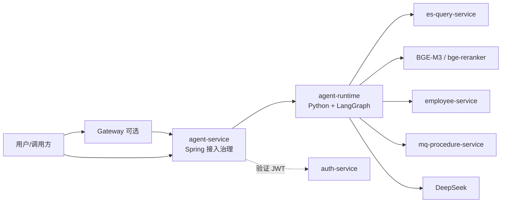
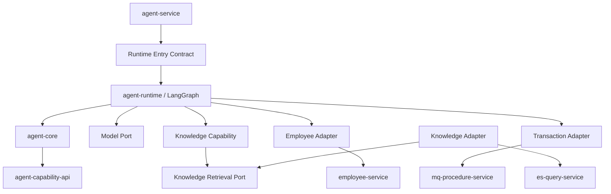

# [L0_00] 单体 Agent 查询能力总体架构

> 文档层级：L0
> 文档状态：Approved

## 1. 文档信息

| 项目 | 内容 |
|---|---|
| 文档编号 | `L0_00` |
| 文档层级 | L0 总体架构 |
| 文档状态 | Approved |
| 当前版本 | v1.0 |
| 日期 | 2026-08-21 |
| 权威范围 | 单体 Agent 查询系统的全局边界、模块划分、依赖方向、关键不变量、跨域安全策略和 L1 治理 |
| 需求基线 | [`REQ_00` 单体 Agent 查询能力建设需求说明](../REQ_00_SINGLE_AGENT_QUERY_REQUIREMENTS.md) v1.3 |
| 来源文档 | [L0_00 v0.13 归档版](历史文档/2026-08-21-v0-baseline/L0_00_SINGLE_AGENT_ARCHITECTURE.md) |
| 下位文档 | [`L1_00`](L1_00_SINGLE_AGENT_CORE_RUNTIME_ARCHITECTURE.md)、[`L1_01`](L1_01_SINGLE_AGENT_KNOWLEDGE_QUERY_ARCHITECTURE.md)、[`L1_02`](L1_02_SINGLE_AGENT_BUSINESS_QUERY_ADAPTER_ARCHITECTURE.md) |
| 实施状态 | 当前个人研发交付范围已实现并完成主要非生产验证；默认模型 Provider 仍为 stub，未形成目标环境部署或生产生效结论 |

> 本文是 v1.0 新基线，不继承旧版修改、评审和实验流水。旧版仅作为来源与审计证据；当前架构以本文及其下位 v1.0 文档为准。

## 2. 阅读导航

首次阅读应依次关注：

1. [系统边界与非目标](#4-系统边界与非目标)：确认本期做什么、明确不做什么。
2. [目标架构](#5-目标架构)：理解一个逻辑 Agent、双进程和唯一编排权威。
3. [全局不变量](#7-全局不变量)：这些规则不得被 L1、L2 或代码弱化。
4. [关键流程](#8-关键流程)：理解知识查询与业务查询为何采用不同的能力内部结构。
5. [安全与数据边界](#10-安全与数据边界)：理解 JWT、业务最终授权和模型出域控制。
6. [当前结论与后续边界](#14-当前结论与后续边界)：区分已完成主链、效果结论、可选实验和未生效事项。

## 3. 来源与取舍

### 3.1 来源

本版以 `REQ_00`、归档版 L0、当前三份 L1/十份 L2、现有代码与测试为输入。权威顺序为：

```text
REQ_00 → L0_00 → L1_* → L2_* → 代码、配置、测试与运行证据
```

代码和运行证据只用于核实实现现状，不能反向改写需求或架构权威。

### 3.2 保留的有效决策

- 一个逻辑 Agent，由 Spring 接入治理进程和 Python LangGraph 运行时进程组成。
- LangGraph 是唯一 Agent 编排权威；Spring 不选择动作、不推进图状态、不调用 Adapter。
- 一个请求最多执行一个已注册且启用的查询动作。
- Knowledge、Employee、Transaction 通过统一能力契约和组合根接入，新增能力不得向 Core 增加业务域分支。
- Knowledge 是 Agent 内部能力，不新建独立 `knowledge-service`；确定性检索复用 `es-query-service`。
- Employee/Transaction 通过独立 Adapter 调用业务服务，业务服务执行最终角色授权。
- 模型输出不可信；业务动作参数由本地域 Resolver 确定性解析，模型只选择能力 ID。
- 配置只能启停或收紧代码和业务契约定义的范围，不能扩权或形成动态执行平台。
- 外部模型出域默认拒绝；Knowledge 使用三层只收紧策略，业务结果使用授权结果、动作结果字段和出域字段交集。

### 3.3 废弃或简化的内容

| 旧版内容 | v1.0 处理 | 原因 |
|---|---|---|
| 逐版本修订史、逐轮评审记录 | 仅保留在归档版 | 不属于当前架构规则 |
| candidate、run ID、HEAD、manifest、SHA-256 等运行资产 | 从主文档移除，由历史资产和测试目录保留 | 运行证据不可成为架构入口或可复用授权 |
| 已解决门禁的完整过程 | 收敛为当前状态或删除 | 避免门禁治理反向主导架构 |
| 重复的实现清单和端口细节 | 下沉 L1/L2 | 保持 L0 只治理系统级边界 |
| Employee/Transaction 真实结果模型稳定性试验 | 定义为可选、默认关闭的扩展实验 | 非第一阶段主链验收条件 |

### 3.4 本版本变更记录

| 版本 | 日期 | 变更原因 | 变更内容 |
|---|---|---|---|
| v1.0 | 2026-08-21 | 建立清晰、稳定、可评审的大版本基线 | 从归档版提取现行架构决策，重新组织边界、流程、安全、L1 治理与当前结论；不继承旧版修订流水 |

## 4. 系统边界与非目标

### 4.1 目标

建设一个用于个人学习和技术验证的单体 Agent，使用户可通过自然语言完成：

- 税务政策与法律知识查询；
- Employee 域有限只读查询；
- Transaction 域有限只读查询。

系统优先证明架构完整、能力生成与调用可运行、三条链路打通，并保留最小必要的认证、授权、契约、安全和验证边界。

### 4.2 范围内

- 单逻辑 Agent 与请求级 LangGraph 编排；
- 能力选择、确定性参数校验、能力注册和结果语义；
- `knowledge.query`、`employee.detail`、`transaction.search` 三个首期动作；
- Knowledge 问题改写、多逻辑知识域、多路召回与重排、证据化摘要；
- 用户 JWT 验证与透传、业务域最终授权；
- 强类型收紧配置、最小日志、错误分类和测试接缝。

### 4.3 范围外

- Multi-Agent、Agent 间通信和分布式任务；
- 跨业务域聚合、工作流、业务写入、审批和状态变更；
- 文档录入、切分、文档侧向量化和索引生命周期管理；
- 任意 SQL、任意 Elasticsearch DSL、动态 URL 或动态插件执行；
- 持久会话、业务数据缓存和跨系统事务；
- 配置热更新、生产级高可用、复杂审计平台和企业级交接流程。

## 5. 目标架构

### 5.1 系统上下文



Gateway 是可选接入路径，不能替代 Agent 和业务服务自身的认证授权。Capability 和 Adapter 均随 `agent-runtime` 部署，不独立形成微服务。

### 5.2 逻辑模块

| 模块 | 唯一职责 | 明确不负责 |
|---|---|---|
| `agent-service` | 外部 HTTP 接入、JWT 认证、关联标识、请求时限、协议治理 | 动作选择、图编排、语义重试、Adapter 调用 |
| `agent-runtime` | LangGraph 唯一编排、组合根、请求级生命周期 | 业务域最终授权、长期状态 |
| `agent-core` | 单动作约束、候选校验、能力执行和统一结果约束 | 业务规则、外部协议、第二套编排状态机 |
| `agent-capability-api` | 稳定的能力描述、请求、结果和执行上下文语义 | 具体框架、业务 DTO、URL、角色规则 |
| Knowledge Capability | `knowledge.query` 内的问题改写、域选择、召回编排、融合重排、证据与摘要 | ES 协议、索引管理、供应商 SDK |
| Knowledge Adapter | 逻辑知识域到稳定 Profile 映射、类型化检索转换、候选标准化 | 物理索引解析、任意 DSL、写入与知识策略 |
| Employee Adapter | `employee.detail` 参数/协议转换、JWT 透传、结果归一化 | Employee 业务规则、角色判断、DB/ES 直连 |
| Transaction Adapter | `transaction.search` 参数/协议转换、JWT 透传、结果归一化 | 聚合、写入、角色判断、DB/ES 直连 |
| 模型端口 | 能力 ID 选择与受控回答生成 | 业务参数生成、授权判断、工具执行 |
| 能力注册运行时 | 启动时汇总、校验并冻结启用能力 | 拥有各域配置、运行时动态加载代码 |

### 5.3 依赖方向



只有 `agent-runtime` 组合根知道所有具体实现。Core、Capability 和 Adapter 不得反向依赖 Spring 接入层，也不得相互绕过稳定端口。

## 6. 能力与所有权

| 能力/动作 | 决策与编排所有者 | 执行边界 | 数据权威 | 关键限制 |
|---|---|---|---|---|
| `knowledge.query` | LangGraph + Knowledge Capability | Knowledge Adapter → `es-query-service` / 本地 BGE / 受控模型端口 | 知识源与文档策略由项目维护者管理；ES 为派生检索快照 | 单动作内可多知识域、多路召回，不构成跨业务域聚合 |
| `employee.detail` | LangGraph + Employee Resolver | Employee Adapter → `employee-service` | `employee-service` | 仅详情只读动作；最终授权在业务服务 |
| `transaction.search` | LangGraph + Transaction Resolver | Transaction Adapter → `mq-procedure-service` | `mq-procedure-service` | 仅受控查询；排除 Date、聚合、写入和管理动作 |

Knowledge 与业务查询的内部结构不同是有意设计：Knowledge 自身包含检索策略和多阶段证据处理，因此需要 Capability 层；业务查询的规则和数据权威均在业务服务，Adapter 只做受控协议适配，不复制业务能力层。

## 7. 全局不变量

| ID | 不变量 | 下位验证要求 |
|---|---|---|
| `SA-C-001` | 一个逻辑 Agent、一个 LangGraph 编排权威；双进程不构成 Multi-Agent | 启动拓扑和调用方向测试 |
| `SA-C-002` | 一个请求最多执行一个已注册且启用的查询动作 | 图状态与执行计数测试 |
| `SA-C-003` | Agent/Adapter 不直连 Employee/Transaction DB 或业务域 ES | 依赖与调用路径检查 |
| `SA-C-004` | Employee/Transaction 最终角色授权由各业务服务执行 | 真实或受控 401/403 角色矩阵 |
| `SA-C-005` | 模型输出始终是不可信输入；模型不得生成业务执行参数 | exact ID 解码、Resolver 和 validator 测试 |
| `SA-C-006` | 强类型配置只能收紧代码、公共契约和授权范围 | 启动失败与越界配置测试 |
| `SA-C-007` | 三类查询都要求有效用户 JWT；不得回退服务身份 | 缺失、错误、service-token 拒绝测试 |
| `SA-C-008` | Agent 不持久化知识副本、业务数据或会话状态 | 存储依赖和生命周期检查 |
| `SA-C-009` | 无结果、失败或不完整数据不得生成肯定事实 | 失败注入和 grounding 测试 |
| `SA-C-010` | 新能力经实现、Adapter、配置和组合根接入，不修改已有能力实现 | 模拟能力扩展测试 |
| `SA-C-011` | 日志和模型输入不得包含完整 JWT、密钥或非必要敏感数据 | 泄漏扫描和 model spy |
| `SA-C-012` | 不兼容外部契约变化必须同步 Adapter 与契约测试，不能只改配置 | 调用方与契约回归 |
| `SA-C-013` | 聚合、写入、索引管理入口不得注册为首期动作 | 注册表和禁止端点测试 |
| `SA-C-014` | 框架与供应商置于端口之后，不进入能力公共契约 | 依赖方向检查 |
| `SA-C-015` | Knowledge 必须包含改写、多域、多路召回+重排和证据摘要，具体算法下沉 L2 | 阶段与效果验证 |
| `SA-C-016` | 模型和 Agent 请求不可指定物理索引、DSL 或管理操作 | Profile 映射与非法输入拒绝测试 |
| `SA-C-017` | `es-query-service` 只提供类型化、只读、确定性检索；知识策略留在 Agent | API 与依赖检查 |
| `SA-C-018` | Knowledge 答案只能来自本次授权证据；证据不足时 `no_result` 或拒答 | 引用、子串与无证据测试 |
| `SA-C-019` | Spring 只治理接入；动作、工具顺序、语义失败和终止由 LangGraph 决定 | 双重编排反证 |
| `SA-C-020` | 业务模型字段默认拒绝，出域字段不得超过授权结果、动作字段和配置交集 | 零调用、字段交集和脱敏测试 |
| `SA-C-021` | Knowledge 出域按全局规则 ∩ 逻辑域默认策略 ∩ 文档级收紧策略；缺失或冲突失败关闭 | 三层策略与零调用测试 |
| `SA-C-022` | Employee/Transaction 参数由本地域 Resolver 确定性生成；歧义和冲突不得回退模型猜参 | 域解析、冲突和模型零调用测试 |

## 8. 关键流程

### 8.1 通用请求流程

```text
用户请求 + JWT
  → agent-service 认证并建立 correlation/deadline
  → agent-runtime / LangGraph 选择一个动作
  → agent-core 依据注册表和 validator 重校验
  → Capability 或 Adapter 执行
  → 统一结果语义
  → 本地规则或受控模型生成回答
  → agent-service 返回协议响应
```

Spring 不得重放已超时请求。任何校验失败都必须在调用下游前终止；`401/403` 不得换身份或跨域重试。

### 8.2 Knowledge 查询

```text
原问题
  → 问题改写
  → 已注册逻辑知识域选择
  → 关键词 + 向量多路召回
  → 去重与融合
  → 受控重排
  → 证据选择与出域判定
  → 基于证据的摘要 / no_result / model_egress_denied
```

Knowledge Adapter 只接收代码绑定的稳定 Profile；`es-query-service` 独占 Profile 到物理索引、别名、字段和过滤规则的映射。

### 8.3 Employee/Transaction 查询

```text
原问题
  → 域内 Resolver 确定性识别动作和参数（模型零调用）
  → Core/注册项 validator 重校验
  → Adapter 进行动作级收紧并透传原始用户 JWT
  → 业务服务执行最终授权与查询
  → Adapter 归一化结果
  → 本地结果或受控回答生成
```

若业务结果没有明确允许的安全模型载荷，则不得调用外部模型。首期主链可以使用确定性回答或 stub 模型完成系统闭环。

## 9. 统一结果与失败语义

下位契约至少保持以下状态可区分：

| 状态 | 语义 | 关键行为 |
|---|---|---|
| `success` | 调用成功且存在可用结果 | 仅输出允许字段与有依据事实 |
| `no_result` | 调用成功但无符合条件结果 | 不伪造事实 |
| `unsupported` | 没有唯一可执行动作 | 不调用下游 |
| `invalid_argument` | 参数或动作边界不满足 | 不调用下游 |
| `unauthenticated` | 用户身份缺失或无效 | 不调用能力 |
| `forbidden` | 目标服务拒绝当前用户 | 不重试、不换身份 |
| `timeout` | 请求或下游超过绝对时限 | 取消剩余工作，拒绝迟到结果 |
| `downstream_failure` | 下游非权限类失败 | 不跨域补偿 |
| `model_egress_denied` | 数据不允许发送至外部模型 | 模型调用必须为 0 |
| `internal_failure` | Agent 内部未分类失败 | 记录安全原因码，不泄漏内部细节 |

## 10. 安全与数据边界

### 10.1 身份与授权

- `auth-service` 签发用户 JWT；`common-security` 统一把 `role` 转换为 `ROLE_ADMIN`、`ROLE_VIEWER`。
- `dylan` 是用户主体，不是角色；当前其业务角色为 exact uppercase `ADMIN`。
- Agent 入口验证签名、有效期、主体和 `token_type=user`，并向下游透传原始 JWT。
- Employee 与 Transaction 分别基于 Authority 执行最终授权；Adapter 不保存角色白名单。
- Knowledge Provider 的读取授权同样在提供方执行；读取权限不等于模型出域权限。

### 10.2 模型出域

| 数据类型 | 默认 | 允许条件 | 拒绝行为 |
|---|---|---|---|
| 用户问题 | 拒绝敏感或未知输入 | 通过本地问题分类和最小化 | 模型零调用 |
| Knowledge 证据 | 拒绝 | 三层策略交集允许，且证据/引用通过严格校验 | `model_egress_denied` |
| Employee/Transaction 结果 | 拒绝 | 业务授权成功、动作字段允许、配置字段允许、有限转换完成 | 模型零调用或确定性结果 |

文档正文、原始业务响应、JWT、密钥、凭证和未分类字段不得进入模型日志或持久化证据。

## 11. 运行与质量约束

| 维度 | 架构要求 |
|---|---|
| 时限与取消 | Spring 拥有外部绝对时限；LangGraph 在剩余预算内分配模型/工具时限；取消后不接受迟到结果 |
| 重试 | 首期不自动重试业务动作；认证、授权、参数和策略拒绝永不重试 |
| 一致性 | 全部动作只读，无分布式事务、补偿或业务数据缓存 |
| 启动 | 注册、动作配置、Profile、字段策略或 Provider 配置无效时失败关闭 |
| 容量 | 分页、知识域、召回路数、候选数、重排数和模型上下文均有上限 |
| 日志 | 记录 correlation、能力/动作、目标域、状态、有限失败码和耗时；禁止敏感正文 |
| 可用性 | 单实例、双进程，故障通过受控重启恢复；不建设集群和复杂熔断平台 |
| 回滚 | 停止逻辑 Agent、禁用单动作或恢复 stub Provider；不涉及业务数据回滚 |

## 12. 核心架构决策

| ID | 决策 | 主要理由 | 代价/约束 |
|---|---|---|---|
| `SA-AD-001` | 一个逻辑 Agent，Spring 与 Python 双进程 | 复用 Spring 治理和 LangGraph 原生编排 | 增加受控内部 HTTP 边界 |
| `SA-AD-002` | 统一能力契约与启动时只读注册表 | 新能力不侵入 Core | 公共契约必须保持窄且稳定 |
| `SA-AD-003` | 每请求至多一个动作 | 明确排除聚合和工作流 | 复杂问题需用户拆分 |
| `SA-AD-004` | 三个 Adapter 保持独立模块边界 | 隔离外部契约和业务域 | 接受少量协议代码重复 |
| `SA-AD-005` | 代码绑定动作，配置只收紧 | 防止动态执行和配置扩权 | 动作变化需改代码与测试 |
| `SA-AD-006` | 业务服务执行最终角色授权 | 服从业务域权限所有权 | Agent 不能预判最终授权 |
| `SA-AD-007` | DeepSeek 置于模型端口之后 | 隔离供应商协议与失败 | 真实 Provider 必须显式启用 |
| `SA-AD-008` | 三份 L1：核心运行、Knowledge、业务适配 | 与三类责任一致并控制文档数量 | L1 不得越界替代 L2 |
| `SA-AD-009` | 不持久化会话或业务数据 | 降低一致性与权限复杂度 | 不支持跨请求记忆 |
| `SA-AD-010` | 不新建 `knowledge-service` | 当前单消费者且已有检索基础设施 | 达到独立生命周期/多消费者条件后再评估 |
| `SA-AD-011` | LangGraph 是唯一编排权威 | 避免双状态机和重复调用 | Spring 只可调用运行时入口 |
| `SA-AD-012` | 本地业务 Resolver 优先，模型仅选 ID | 防止敏感参数出域并提高确定性 | 有限语法需显式维护 |
| `SA-AD-013` | 实施、验证、发布/生效状态分离 | 个人项目仍需避免虚假完成结论 | 每份 L2 必须说明证据边界 |
| `SA-AD-014` | 历史运行资产与现行设计权威分离 | 避免测试治理形成第二套架构 | 精确证据只在归档/测试资产保存 |

## 13. L1 治理

| L1 | 权威范围 | 必须承接 | 明确不负责 |
|---|---|---|---|
| [`L1_00`](L1_00_SINGLE_AGENT_CORE_RUNTIME_ARCHITECTURE.md) | Spring 接入、Runtime、Core、能力契约、注册、模型端口、Authority Converter | `SA-C-001/002/005/007～014/019/022` | Knowledge 检索策略、业务协议与业务授权规则 |
| [`L1_01`](L1_01_SINGLE_AGENT_KNOWLEDGE_QUERY_ARCHITECTURE.md) | Knowledge Capability/Adapter、检索与本地模型消费、证据与效果 | `SA-C-005～012/014～019/021` | Employee/Transaction 规则、检索提供方内部实现 |
| [`L1_02`](L1_02_SINGLE_AGENT_BUSINESS_QUERY_ADAPTER_ARCHITECTURE.md) | Business 公共约束、两个 Resolver/Adapter、业务 Provider 与字段出域 | `SA-C-002～014/019/020/022` | 业务数据所有权、业务角色配置、Knowledge 策略 |

三份 L1 完整覆盖当前架构；本期不新增第四份 L1。只有出现独立演进权威、多消费者或独立部署生命周期时，才重新评估模块拆分。

## 14. 当前结论与后续边界

### 14.1 当前结论

- Core、Access、模型 Runtime、三类 Provider、Knowledge 真实检索、Employee/Transaction 受控只读查询以及真实 Provider + 默认 stub 模型的系统 E2E 已有实现与验证证据。
- Knowledge 真实出域和 live P5 已完成；P5 的有效结论为 `ineffective`。这证明评估可执行，不证明知识回答效果达标。
- Employee/Transaction 真实结果进入外部模型不是第一阶段主链完成条件，当前保持默认关闭；若未来启用，必须先完成各域独立安全验证。
- 当前结论不代表目标环境默认启用、生产部署、生产可用或生产安全认证。

### 14.2 当前保护条件

| 保护条件 | 状态 | 控制动作 | 关闭/满足要求 |
|---|---|---|---|
| Knowledge 快照变更复核 | 按变更触发 | 新 Profile、索引、策略或任务版本进入真实模型 | 重新验证读取授权、快照一致性、出域策略和 grounding |
| Employee 真实结果模型出域 | 默认关闭 | 真实 Employee facts 进入外部模型 | 至少一次受控允许路径及字段交集、零调用负向、泄漏检查通过 |
| Transaction 真实结果模型出域 | 默认关闭 | 真实 Transaction facts 进入外部模型 | 至少一次受控允许路径及 Decimal、字段交集、零调用负向、泄漏检查通过 |
| 目标环境生效 | 未完成 | 声明默认启用或部署生效 | 目标配置、版本、依赖、健康、权限和回滚检查通过 |

这些条件只阻塞对应动作，不回退已经完成的本地实现、真实 Provider 查询或 stub 系统 E2E。

### 14.3 主要风险

| 风险 | 触发场景 | 影响 | 控制方式 |
|---|---|---|---|
| 模型或 catalog 漂移 | Provider、模型、Prompt 或能力目录变化 | 能力误选 | exact ID 解码；版本变化重新验证 |
| Resolver 覆盖不足 | 用户表述超出有限语法 | `unsupported/invalid_argument` | 失败关闭，基于真实样本扩展，不回退模型猜参 |
| 外部契约漂移 | 业务服务或 ES 类型化接口不兼容变化 | 调用失败或误映射 | 契约测试、启动校验、同步修改 Adapter |
| 策略/快照漂移 | Knowledge 策略与索引快照不一致 | 错误外发或错误拒绝 | 版本绑定、三层只收紧、变更触发复核 |
| 文档再次膨胀 | 将每次试验过程提升为新架构规则 | 权威混乱、阅读困难 | 主文档只保留稳定规则，实验明细归档 |

## 15. 需求追踪

| 需求 | L0 落点 | 下位责任 |
|---|---|---|
| `FR-01` 单体 Agent | 5、7、8；`SA-C-001/002/019` | `L1_00` |
| `FR-02` Knowledge | 6、8.2、10.2；`SA-C-015～018/021` | `L1_01` |
| `FR-03/04` Employee/Transaction | 6、8.3；`SA-C-003/004/020/022` | `L1_02` |
| `FR-05` Adapter | 5.2、5.3；`SA-AD-004` | `L1_01`、`L1_02` |
| `FR-06` 有限动作 | 7；`SA-C-002/005/006/013/016` | 三份 L1 |
| `CFG-01～04` | 7、11；`SA-C-006/012` | 三份 L1/L2 |
| `SEC-01～05` | 10；`SA-C-004/007/011/020/021` | `L1_00`、`L1_01`、`L1_02` |
| `EXT-01～03` | 5.3、7；`SA-C-010/014` | `L1_00` |
| 异常、日志、测试 | 9、11 | 对应 L1/L2 |

## 16. v1.0 评审记录

| 轮次 | 类型 | 结论 | 状态 |
|---:|---|---|---|
| 1 | 作者内审 | 范围、权威和来源一致；总索引旧版状态已同步修正 | Passed |
| 2 | 作者内审 | 核心决策、质量属性、安全边界和下位责任一致 | Passed |
| 3 | 作者内审 | 层次、重点、链接和历史隔离检查通过 | Passed |
| 4 | 独立设计评审 | `REV-L0-001` 已修复并复评；无执行阻断、无未关闭 S0/S1/S2，可治理 L1 | Passed |
