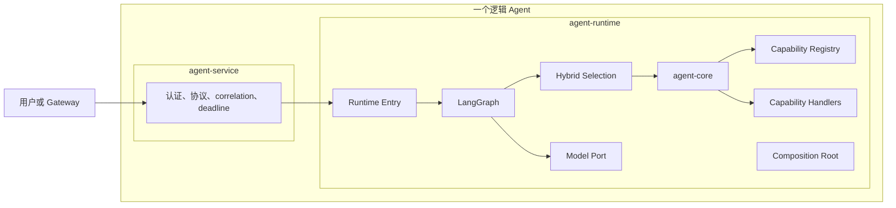
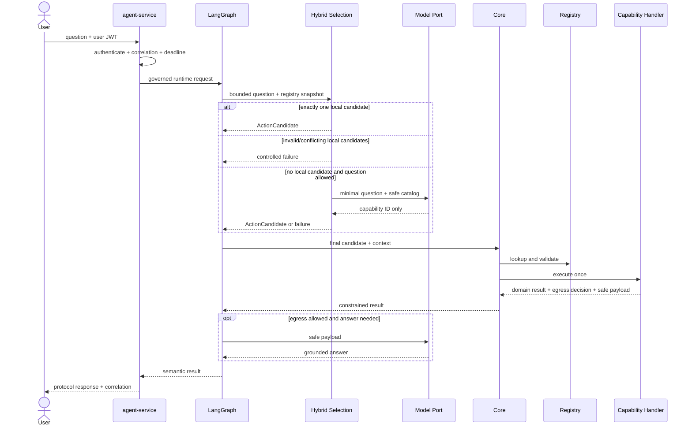

# [L1_00] 单体 Agent 核心与运行架构

> 文档层级：L1
> 文档状态：Approved

## 1. 文档信息

| 项目 | 内容 |
|---|---|
| 文档编号 | `L1_00` |
| 文档层级 | L1 模块架构 |
| 文档状态 | Approved |
| 当前版本 | v1.0 |
| 日期 | 2026-08-21 |
| 权威范围 | Spring 接入、Python Runtime、LangGraph、Core、能力契约与注册、模型端口、共享 Authority Converter |
| 上位文档 | [`L0_00` v1.0](L0_00_SINGLE_AGENT_ARCHITECTURE.md) |
| 来源文档 | [L1_00 v0.8 归档版](历史文档/2026-08-21-v0-baseline/L1_00_SINGLE_AGENT_CORE_RUNTIME_ARCHITECTURE.md) |
| 关联文档 | [`L1_01`](L1_01_SINGLE_AGENT_KNOWLEDGE_QUERY_ARCHITECTURE.md)、[`L1_02`](L1_02_SINGLE_AGENT_BUSINESS_QUERY_ADAPTER_ARCHITECTURE.md) |
| 下位文档 | [`L2_00_00`](L2_00_00_SINGLE_AGENT_SPRING_ACCESS_RUNTIME_COORDINATION_DETAILED_DESIGN.md)、[`L2_00_01`](L2_00_01_SINGLE_AGENT_CORE_EXECUTION_CAPABILITY_REGISTRATION_DETAILED_DESIGN.md)、[`L2_00_02`](L2_00_02_SINGLE_AGENT_DEEPSEEK_MODEL_ACCESS_CONTROLLED_GENERATION_DETAILED_DESIGN.md)、[`L2_00_03`](L2_00_03_SINGLE_AGENT_USER_ROLE_AUTHORITY_CONVERTER_DETAILED_DESIGN.md) |
| 实施状态 | 核心运行切片和默认 stub 系统 E2E 已有证据；未形成目标环境部署或生产生效结论 |

## 2. 阅读导航

重点顺序：

1. [唯一职责与边界](#5-唯一职责与边界)；
2. [内部架构与依赖](#6-内部架构与依赖)；
3. [核心契约](#7-核心契约)；
4. [请求与失败流程](#9-请求与失败流程)；
5. [L2 交付边界](#13-l2-交付边界)。

## 3. 来源与取舍

### 3.1 保留的设计

- 一个逻辑 Agent 由 `agent-service` 与 `agent-runtime` 两个进程组成。
- LangGraph 唯一拥有动作选择、图状态、调用顺序、语义重试和终止决策。
- `agent-core` 只拥有确定性执行约束，不形成第二套编排。
- 能力通过稳定 API 和启动期只读注册表接入；组合根是唯一知道具体实现集合的位置。
- 能力处理器允许两种形态：Knowledge 使用 Capability → Port ← Adapter；Employee/Transaction Adapter 可直接实现能力 API。
- 本地 Resolver 优先生成业务参数；零本地匹配时模型仅返回能力 ID。
- 领域结果与模型安全载荷分离；Core 不计算或扩大领域出域策略。
- Spring 拥有外部总时限与接入治理，Runtime 消耗剩余预算；Spring 不重放完整 Agent 请求。
- Authority claim 转换由共享安全组件统一提供，业务服务仍执行最终授权。

### 3.2 简化内容

旧版的逐轮评审、PoC 运行、candidate/hash、已关闭门禁过程和重复实施状态已移入归档。本版只保留稳定契约、当前保护条件和 L2 约束。

### 3.3 本版本变更记录

| 版本 | 日期 | 变更原因 | 变更内容 |
|---|---|---|---|
| v1.0 | 2026-08-21 | 建立新的可读架构基线 | 重组核心责任、契约、状态、流程和 L2 治理；不继承旧版修订流水 |

## 4. 目标、范围与上位约束

### 4.1 目标

为 Knowledge 和业务查询能力提供一个不包含领域规则的公共运行底座，使任一能力能够在单一编排、单动作、统一身份、统一时限和统一失败语义下注册和执行。

### 4.2 范围内

- Spring 对外接入及 Spring→Python 内部协同；
- LangGraph 请求编排与请求状态；
- Provider-neutral 动作解析、Core 执行闸门、能力 API 和注册运行时；
- DeepSeek 端口、问题输入闸门、能力 ID 选择和受控回答生成；
- 用户 JWT 上下文、共享 Authority Converter、取消、日志和双进程生命周期。

### 4.3 范围外

- Knowledge 的检索、证据、策略和效果规则；
- Employee/Transaction 动作语法、DTO、字段和业务授权规则；
- Multi-Agent、工作流、跨域聚合、写入、持久会话和生产级高可用；
- 具体 HTTP 字段、类、函数、配置键和数值预算，这些由 L2 固化。

### 4.4 L0 约束映射

| L0 约束 | 本文落实 |
|---|---|
| `SA-C-001/019` | 双进程组成一个逻辑 Agent，LangGraph 唯一编排，Spring 仅接入治理 |
| `SA-C-002` | Core 维护请求级单动作提交闸门 |
| `SA-C-005/022` | Resolver 优先；模型只返回能力 ID；最终候选再次确定性校验 |
| `SA-C-007/011` | 用户 JWT 必需且受控传递；日志和模型输入最小化 |
| `SA-C-008/009` | 仅请求级状态；失败/无结果不提升为事实 |
| `SA-C-010/012/014` | 能力 API、注册、端口和组合根构成最小扩展缝隙 |
| `SA-C-018/020/021` | Core 消费但不拥有领域证据与出域结论；拒绝时模型调用为 0 |

`SA-C-003/004/006/013/015～017` 的具体落实分别由 Knowledge 或 Business L1 负责；本文只保证公共运行层不绕过其边界。

## 5. 唯一职责与边界

本文唯一负责公共接入、编排、执行、注册、模型和 Authority 转换的模块架构；Knowledge 与 Business 领域规则由关联 L1 独立拥有。

| 责任 | 所有者 | 输入 | 输出 | 明确不负责 |
|---|---|---|---|---|
| 外部接入治理 | `agent-service` | 用户请求、JWT | 已认证的内部请求 | 动作选择、图状态、Adapter 调用 |
| Agent 编排 | LangGraph | 内部请求、选择/Resolver/能力结果 | 请求状态与最终语义结果 | 外部协议、业务授权、领域规则 |
| 动作解析 | Hybrid Action Selection | 有界问题、Resolver 集合、安全能力目录 | 一个最终候选或固定失败 | 执行动作、访问下游、角色判断 |
| 确定性执行 | `agent-core` | 最终候选、执行上下文 | 统一能力结果或拒绝 | 文本理解、领域参数生成、第二状态机 |
| 公共能力语义 | `agent-capability-api` | 能力描述/请求/结果类型 | 稳定跨能力契约 | 业务 DTO、URL、供应商协议 |
| 能力注册 | 注册运行时 | 代码绑定描述与处理器 | 启动后冻结的只读集合 | 动态加载、热更新、领域配置所有权 |
| 模型访问 | 模型端口与 Provider | 通过闸门的任务和载荷 | ID 决定或候选回答 | 动作执行、业务参数、出域策略判定 |
| 角色转换 | `common-security` | JWT `role` claim | Spring Authority | 用户分配、业务动作授权 |
| 具体查询 | 对应能力处理器 | 受控请求与上下文 | 统一结果、出域判定、可选安全载荷 | LangGraph 状态和最终业务授权 |

## 6. 内部架构与依赖

### 6.1 运行视图



`agent-runtime` 是部署与组合边界，不是单一职责模块。组合根只在启动期创建、校验和连接对象，不进入请求期业务路径。

### 6.2 两种能力处理器形态

```text
Knowledge:
  Core → Knowledge Capability → Retrieval Port ← Knowledge Adapter → 检索基础设施

Employee / Transaction:
  Core → Business Adapter（同时实现能力处理器）→ 业务服务
```

是否增加独立 Capability/Port 由“是否存在独立策略责任、是否需要隔离外部协议变化”决定，不按能力名称追求结构对称。

### 6.3 允许与禁止依赖

| 调用方 | 允许依赖 | 禁止路径 |
|---|---|---|
| `agent-service` | Runtime Entry Contract | LangGraph 内部节点、Core、Registry、Capability、Adapter |
| LangGraph | Hybrid Selection、Core、Model Port | 业务客户端、ES 客户端、共享可变注册对象 |
| Core | Capability API、Registry | 具体能力、业务 DTO、模型 SDK、领域分支 |
| Capability Handler | Capability API；按需领域 Port | Core 实现、LangGraph 状态、其他能力实现 |
| Adapter | 对应稳定 Port/API 与外部契约 | Core、LangGraph、其他业务域 Adapter |
| Composition Root | 所有具体实现（仅启动装配） | 请求期旁路 Core 或直接执行业务动作 |

### 6.4 同层协作边界

| 关联 L1 | 对方所有权 | 本文提供 | 本文不得定义 |
|---|---|---|---|
| `L1_01` Knowledge | 查询策略、检索、证据、Knowledge 出域 | 能力 API、执行上下文、模型端口、统一状态 | 逻辑域、Profile、召回、重排和文档策略 |
| `L1_02` Business | 两个 Resolver/Adapter、业务契约、字段与授权联调 | 注册、单动作执行、JWT 上下文、统一状态 | 业务参数语法、角色矩阵、字段策略和 DTO |

## 7. 核心契约

### 7.1 Spring→Runtime 契约

语义上只传递：

- 原始问题；
- 原始用户 JWT；
- correlation ID；
- 绝对 deadline 或可无歧义转换的剩余预算；
- 可选客户端请求标识及取消信号。

不得传递候选动作、模型决定、图状态或 Adapter 参数。协议字段、错误码和版本由 `L2_00_00` 定义。

### 7.2 能力注册契约

- 组合根在启动期提交稳定能力 ID、模型安全描述、参数 Schema、validator 与处理器。
- 重复 ID、描述/ID 不对齐、缺失处理器、无效启用状态或不安全目录必须启动失败。
- 注册完成后集合不可变；配置变化通过重启生成新快照。
- Registry 只查找并返回处理器，不主动执行能力。

### 7.3 动作解析契约

1. 按 canonical 顺序运行本地 Resolver。
2. 恰好一个合法本地候选：直接形成候选，模型选择调用为 0。
3. 多个、冲突或非法本地候选：固定失败，模型和下游调用均为 0。
4. 零本地候选：先执行问题输入分类和最小化；允许后才向模型发送安全能力目录。
5. 模型只返回一个能力 ID；只允许为空参数 Schema 的动作绑定 `{}`。
6. 最终候选始终交由 Core、Registry 和注册项 validator 复核。

### 7.4 能力执行与结果契约

能力处理器接收受控能力请求和执行上下文，返回至少包含：

- L0 定义的统一状态；
- 领域结果或无结果/失败信息；
- 模型出域判定：允许、拒绝或不适用；
- 仅在允许时存在的模型安全载荷；
- 有界的非敏感诊断元数据。

领域结果可供本地回答使用，不代表可进入模型。Core 只校验状态、出域判定和安全载荷组合是否合法，不从领域结果重新生成模型载荷。

### 7.5 模型端口

| 任务 | 输入边界 | 输出边界 | 禁止事项 |
|---|---|---|---|
| Action selection | 最小化问题 + 启用能力的安全 ID/描述 | exact 单能力 ID | 参数生成、工具调用、未知 ID |
| Knowledge rewrite/summary | Knowledge L1 已允许的任务载荷 | 严格任务结果 | 扩展证据、越过引用集合 |
| Answer generation | 对应能力明确允许的安全 facts | 受 grounding 约束的回答 | 原始领域响应、JWT、禁止字段 |

供应商 HTTP、JSON Output、模型名和错误转换只存在于 `L2_00_02` 及 Provider 实现。

### 7.6 Authority Converter 契约

- `auth-service` 拥有用户、角色分配和 claim 签发。
- `common-security` 提供具名 Servlet/Reactive Converter，把有限 role claim 稳定映射为 `ROLE_ADMIN`、`ROLE_VIEWER`。
- 缺失、空白、未知或格式错误 role 失败关闭。
- 业务服务基于 Authority 进行动作级最终授权；Converter 不拥有允许角色矩阵。

## 8. 状态与生命周期

| 状态/资源 | 所有者 | 生命周期 | 不变量 |
|---|---|---|---|
| Spring 接入状态 | `agent-service` | 单请求 | 认证、correlation、deadline、响应映射 |
| Agent 图状态 | LangGraph | 单请求、非持久 | 唯一可写编排状态 |
| 单动作闸门 | Core 执行上下文 | 单请求 | 合法提交最多一次 |
| 能力集合 | Registry | Python 进程 | 启动构建、运行只读 |
| 模型 Client | 组合根/Runtime lifespan | 进程 | 一个受管生命周期，关闭后不可复用 |
| JWT | 认证系统签发，Agent 只读 | 单请求 | 不修改、不持久化、不记录 |
| 领域结果/模型载荷 | 对应能力 | 单请求 | 两者分离，拒绝载荷不外发 |

本期不建设 Agent 数据库、缓存、队列、图持久检查点或自动续跑。进程退出时在途请求失败；重启只恢复新请求服务。

## 9. 请求与失败流程

### 9.1 启动

1. Spring 与 Python 分别加载配置和安全组件。
2. Python 组合根创建模型 Provider、Graph、Core、Registry 和能力处理器。
3. Registry 校验并冻结能力集合。
4. Runtime Entry 绑定受管 lifespan；Python 就绪要求组合根、注册表和必需配置有效。
5. Spring 就绪要求自身安全配置有效且 Runtime Entry 可达。

### 9.2 请求



### 9.3 失败与取消

| 触发 | 所有者 | 终态 | 必须行为 |
|---|---|---|---|
| JWT 缺失/无效 | Spring | `unauthenticated` | Runtime 调用为 0；不回退服务身份 |
| 本地候选冲突/非法 | Hybrid Selection | `invalid_argument` | 模型和下游调用为 0 |
| 无支持动作 | Hybrid Selection/Core | `unsupported` | 不跨域猜测或执行多个动作 |
| 模型结构/ID 非法 | 模型 Adapter + Hybrid Selection | `invalid_argument/internal_failure` | 不构造候选；不补充业务参数 |
| Registry/validator 拒绝 | Core | `unsupported/invalid_argument` | 处理器调用为 0 |
| 领域无结果/拒绝 | 对应能力 | `no_result/forbidden` | 保持状态，不改写成成功事实 |
| 出域拒绝 | 对应能力 | `model_egress_denied` 或确定性结果 | 基于该载荷的模型调用为 0 |
| deadline/取消 | Spring + LangGraph | `timeout` | 停止安排新调用并拒绝迟到结果 |
| 进程退出 | 对应进程 | `downstream_failure/internal_failure` | 不自动续跑；重启后接受新请求 |

## 10. 安全、可靠性与观测

### 10.1 安全

- Runtime 内部入口必须避免成为绕过 Spring 的公开入口。
- 用户问题、模型输出、检索内容和业务响应均为不可信输入。
- 问题在首次模型调用前分类、最小化；敏感或未知输入失败关闭。
- 完整 JWT、密钥、原始领域响应、完整 Prompt 和不必要正文不进入日志。
- 领域出域拒绝不影响本地授权结果的语义，但禁止该载荷进入模型。

### 10.2 时限、取消与重试

- Spring 建立一个外部绝对 deadline；Runtime 只能在剩余预算内分配节点预算。
- Spring 不因超时、断连或 5xx 自动重放整个 Agent 请求。
- 首期业务动作无自动重试；`401/403`、参数、策略和业务拒绝永不重试。
- 取消停止新工作；已发出的只读调用不承诺物理中断，但迟到结果不得提交。

### 10.3 可观测性

最低记录：correlation、能力/动作 ID、目标域、阶段、结果状态、有限失败码、下游和总耗时、Runtime/Registry 实例标识。日志复用现有设施，不建设独立追踪平台。

### 10.4 部署与回滚

- 两个进程分别存活/就绪检查，可由本地脚本或 Compose 一起启停。
- Capability/Adapter 随 Python Runtime 部署，不形成独立服务。
- Config Server/Eureka/Gateway 可选；直连与发现模式必须保持相同安全语义。
- 回滚优先停止逻辑 Agent、禁用单能力或恢复 stub Provider；没有业务数据迁移。

## 11. 质量属性

| 维度 | 承诺 | 验证 |
|---|---|---|
| 编排唯一性 | Spring/Core/Adapter 均无第二状态机；每请求最多一个动作 | 调用链、第二动作拒绝、依赖扫描 |
| 事实正确性 | 统一状态不能被协议层或模型改义 | 无结果、失败、grounding 测试 |
| 安全 | 用户 JWT 必需；问题和领域结果分别经过输入/出域闸门 | 401/403、零调用、泄漏扫描 |
| 有界执行 | 请求、能力目录、模型上下文、结果和时限均有上限 | 边界、超时、取消、并发测试 |
| 可恢复 | 单实例通过重启恢复新请求 | 进程启停与资源关闭测试 |
| 扩展 | 新能力只新增处理器、必要配置、装配和测试 | 模拟能力与依赖方向测试 |
| 兼容 | 公共契约变更同步全部消费者与契约测试 | Java/Python/OpenAPI fixture 校验 |

## 12. 架构决策

| ID | 决策 | 理由 | 约束 |
|---|---|---|---|
| `CR-AD-001` | Spring/Python 双进程组成一个逻辑 Agent | 复用各自成熟能力 | 内部协议必须有界且可取消 |
| `CR-AD-002` | LangGraph 编排，Core 只做确定性约束 | 防止双重决策 | Core 不拥有图状态 |
| `CR-AD-003` | 稳定能力 API + 启动冻结 Registry | 简单且可扩展 | 不演化为动态插件平台 |
| `CR-AD-004` | Spring 拥有总时限且不重放 | 避免重复执行 | Runtime 必须传播剩余预算 |
| `CR-AD-005` | DeepSeek 经 Provider-neutral 模型端口接入 | 隔离供应商和不可信输出 | 默认 stub；真实 Provider 显式配置 |
| `CR-AD-006` | 不持久化会话和图状态 | 当前单次只读查询无需持久化 | 进程退出丢失在途请求 |
| `CR-AD-007` | 配置启动校验、运行只读、重启生效 | 降低一致性复杂度 | 无热更新 |
| `CR-AD-008` | 能力 API 统一执行语义，不强制统一内部形态 | 保持 Knowledge 策略层与业务 Adapter 简洁性 | Core 不按处理器形态分支 |
| `CR-AD-009` | Resolver 优先、模型只选 ID、最终候选稳定 | 参数确定性与敏感输入最小化 | 业务语法需域内维护 |

## 13. L2 交付边界

| L2 | 唯一权威 | 必须固化 | 明确不负责 |
|---|---|---|---|
| [`L2_00_00`](L2_00_00_SINGLE_AGENT_SPRING_ACCESS_RUNTIME_COORDINATION_DETAILED_DESIGN.md) | Public/Internal OpenAPI、JWT 入口、deadline/取消、协议映射、双进程生命周期 | Java/Python字段、错误映射、健康和契约测试 | 图节点、能力契约、模型供应商协议 |
| [`L2_00_01`](L2_00_01_SINGLE_AGENT_CORE_EXECUTION_CAPABILITY_REGISTRATION_DETAILED_DESIGN.md) | 图状态、Hybrid Selection、Core、能力类型、Registry、组合根 | 公共类型、候选/结果、执行闸门、注册校验和测试 | 域内语法、外部 Provider 协议 |
| [`L2_00_02`](L2_00_02_SINGLE_AGENT_DEEPSEEK_MODEL_ACCESS_CONTROLLED_GENERATION_DETAILED_DESIGN.md) | 公共模型任务机制、action/answer 任务、DeepSeek transport、严格解码、生命周期、问题闸门 | Provider-neutral task/gateway、action/answer、配置和失败映射；Knowledge rewrite/summary 仅消费该公共机制 | Knowledge rewrite/summary 的领域任务定义与出域策略、业务参数 |
| [`L2_00_03`](L2_00_03_SINGLE_AGENT_USER_ROLE_AUTHORITY_CONVERTER_DETAILED_DESIGN.md) | role claim→Authority 共享契约及 Servlet/Reactive 装配 | Bean、自动配置、失败关闭和消费测试 | 用户角色分配、业务动作授权 |

L2 不得新增第五个公共运行权威，不能把实现便利提升为跨层契约。

## 14. 当前状态与保护条件

### 14.1 当前事实

- Core、Access、模型本地接缝、共享 Converter、Provider-neutral Hybrid Selection、两个业务 Resolver 和受控模型 Runtime 已有实现/行为证据。
- Knowledge/Employee/Transaction 真实 Provider + 默认 stub 模型的 Spring→Runtime 系统 E2E 已完成。
- 默认模型 Provider 仍为 stub；真实模型只允许显式配置。
- Knowledge 当前冻结切片的真实出域已验证；Employee/Transaction 真实结果出域仍默认关闭。
- 正式目标环境装配、默认启用和生产生效未完成。

### 14.2 保护条件

| 条件 | 控制动作 | 当前状态 |
|---|---|---|
| 问题输入安全 | 用户问题进入真实模型 | 已有验证；规则/模型变化需回归 |
| Knowledge 证据出域 | 当前冻结证据进入模型 | 当前切片已验证；快照/策略变化重新验证 |
| Employee/Transaction 结果出域 | 真实业务 facts 进入模型 | 默认关闭，不阻塞 Provider 查询或 stub E2E |
| 目标环境生效 | 声明默认启用/已部署 | 未完成 |

## 15. 风险与追踪

### 15.1 风险

| 风险 | 触发场景 | 影响 | 控制 |
|---|---|---|---|
| 双重编排 | Spring/Adapter 重试、选动作或旁路 Core | 重复调用、状态分裂 | 单入口、依赖检查、故障测试 |
| 跨语言契约漂移 | Java/Python 手写结构不一致 | 身份、deadline、错误丢失 | OpenAPI/fixture 契约测试 |
| 能力 API 过宽 | 为未来场景加入通用执行字段 | 领域泄漏和耦合 | 只保留三类查询共同语义 |
| Registry/配置权威混淆 | Core 拥有域内可变配置 | 配置扩权和运行不确定 | 能力自有配置，Registry 只读最小描述 |
| 处理器形态被强制统一 | 为业务 Adapter 增加无意义层次 | 过度设计 | 采用 `CR-AD-008` 判断标准 |
| 模型/catalog 漂移 | 模型、Prompt 或目录变化 | ID 误选 | exact 解码、默认 stub、变更回归 |
| Resolver 覆盖不足 | 新表述未匹配或冲突 | 明确拒绝 | 失败关闭，按域增量扩展 |

### 15.2 追踪

| 需求 | 本文落点 | L2 |
|---|---|---|
| `FR-01` | 5～9 | `L2_00_00/01` |
| `FR-06` | 7.2～7.4 | `L2_00_01` |
| `CFG-01/03/04` | 7.2、8 | `L2_00_01/02` |
| `SEC-01/02/04/05` | 7.1、7.6、10.1 | `L2_00_00/03` |
| `EXT-01～03` | 6、12 | `L2_00_01` |
| 异常与日志 | 9.3、10 | `L2_00_00/01/02` |

## 16. v1.0 评审记录

| 轮次 | 类型 | 结论 | 状态 |
|---:|---|---|---|
| 1 | 作者内审 | 范围、责任、上位权威和 L2 分工一致 | Passed |
| 2 | 作者内审 | 单编排、单动作、身份、失败和模型边界一致 | Passed |
| 3 | 作者内审 | 可读性、追踪、链接和历史隔离检查通过 | Passed |
| 4 | 独立设计评审 | `REV-L1-00-001` 已修复并复评；无执行阻断、无未关闭 S0/S1/S2，可治理四份 L2 | Passed |
