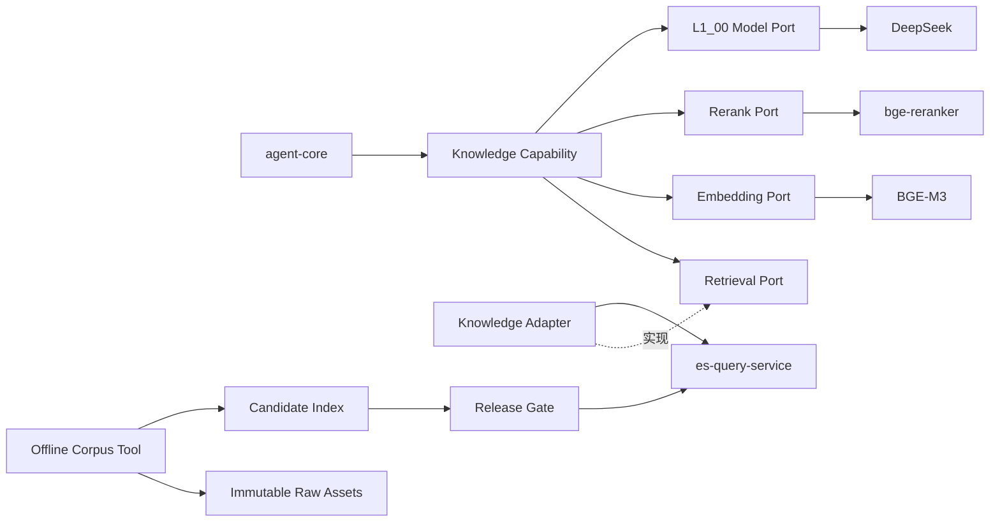

# [L1_01] 单体 Agent 知识查询能力架构

> 文档层级：L1
> 文档状态：Approved

## 1. 文档信息

| 项目 | 内容 |
|---|---|
| 文档编号 | `L1_01` |
| 文档层级 | L1 能力架构 |
| 文档状态 | Approved |
| 当前版本 | v1.17 |
| 日期 | 2026-09-04 |
| 权威范围 | Knowledge 在线查询，以及阶段 A 离线语料审计、版本化处理、候选索引与受控发布边界 |
| 上位文档 | [`L0_00` v2.8](L0_00_SINGLE_AGENT_ARCHITECTURE.md) |
| 来源文档 | [L1_01 v0.7 归档版](历史文档/2026-08-21-v0-baseline/L1_01_SINGLE_AGENT_KNOWLEDGE_QUERY_ARCHITECTURE.md) |
| 关联 L1 | [`L1_00`](L1_00_SINGLE_AGENT_CORE_RUNTIME_ARCHITECTURE.md)、[`L1_02`](L1_02_SINGLE_AGENT_BUSINESS_QUERY_ADAPTER_ARCHITECTURE.md) |
| 下位文档 | [`L2_01_00`](L2_01_00_SINGLE_AGENT_KNOWLEDGE_QUERY_FLOW_CONFIGURATION_DETAILED_DESIGN.md)、[`L2_01_01`](L2_01_01_SINGLE_AGENT_KNOWLEDGE_RETRIEVAL_LOCAL_MODEL_DETAILED_DESIGN.md)、[`L2_01_02`](L2_01_02_SINGLE_AGENT_KNOWLEDGE_EVIDENCE_EGRESS_SUMMARY_EFFECTIVENESS_DETAILED_DESIGN.md) |
| 实施状态 | 在线生产接线、Rewrite V3、Summary V4、阶段 B 有界检索及阶段 A 离线语料处理均已实施；新链路 non-live 通过，阶段 B 真实 UAT 尚未执行；具体 Gate/UAT 证据由 P3/UAT_01 管理 |

## 2. 阅读导航

重点顺序：

1. [能力边界](#5-能力边界)；
2. [模块与两级映射](#6-模块与两级映射)；
3. [知识查询契约](#7-知识查询契约)；
4. [失败优先级](#9-流程与失败优先级)；
5. [L2 交付边界](#13-l2-交付边界)；
6. [效果结论](#14-当前状态与效果结论)。

## 3. 来源与取舍

### 3.1 保留的设计

- 四项必备能力位于一个 `knowledge.query` 动作内：问题改写、多逻辑知识域、多路召回+重排、证据化摘要。
- Knowledge 使用 Capability → Retrieval Port ← Adapter；不新建独立 `knowledge-service`。
- Capability 拥有查询策略；Adapter 只拥有逻辑域→稳定 Profile 映射；`es-query-service` 独占 Profile→物理资源映射。
- 候选正文必须在 Retrieval Provider 边界完成当前用户读取授权后才可进入 Agent、融合或 BGE Rerank。
- 关键词与向量等路径返回统一候选；融合不直接比较异构原始分数。
- 领域结果、证据上下文和模型安全载荷是三个不同视图。
- Knowledge 出域采用全局 ∩ 逻辑域默认 ∩ 文档级收紧策略，缺失、未知或冲突失败关闭。
- 整域授权拒绝和读取权威失败优先于其他域成功；仅技术性单路失败允许在证据充分时受控继续。
- P5 结论可以是 `effective`、`partially_effective`、`ineffective` 或 `invalid_run`；最新有效效果等级为 `partially_effective`，不等于整体效果达标。候选和运行明细只由 UAT_01/evidence 保存。
- 安全负例以“模型零调用”验收，不能同时作为摘要有效完成率的失败样本；显式 `gold_issue` 必须由独立数据质量门禁约束，不能混入模型忠实度或可用性归因。普通 `no_result`、`insufficient_evidence`、技术失败和超时仍保留在各自适用的效果分母中。

### 3.2 简化内容

移除旧版逐次门禁、candidate/manifest/hash、评审流水、已解决外部前提和重复状态。历史细节见归档；当前文档只治理稳定流程、契约、安全和效果结论含义。

### 3.3 本版本变更记录

| 版本 | 日期 | 变更原因 | 变更内容 |
|---|---|---|---|
| v1.0 | 2026-08-21 | 建立新的可读能力架构基线 | 合并重复检索/授权/出域描述，突出四项能力、两级映射、失败优先级与 P5 结论 |
| v1.9 | 2026-08-28 | 稳定权威与效果收口纠偏 | 保留生产流程、Summary V4、效果口径和最新有效效果等级；移除候选、Gate、哈希、预算及逐次运行流水，明确有效测量与效果等级相互独立 |
| v1.10 | 2026-09-02 | 改写输出合同纠偏 | 生产改写任务升级为 Rewrite V2，向模型明确唯一 JSON 结构、候选数量和语义保持边界；V1 与历史运行保持不可变 |
| v1.11 | 2026-09-02 | 阶段 A 语料完整性 | 增加与在线查询隔离的离线 Corpus Build Plane、不可变资产、候选索引、发布/回滚和策略快照迁移边界；不改变 `knowledge.query`、公共 DTO 或阶段 B 算法 |
| v1.12 | 2026-09-02 | 审计事实模型修复 | 将现行索引库存、官方来源可达性与正文完整性拆分；来源不可达不推断正文缺失，P0/P1 只接受人工核验的官方替代来源 |
| v1.13 | 2026-09-02 | 阶段 A 实施收口 | 同步版本化资产、candidate a2、策略目录 v2、14/14 专项 UAT 与受控 alias 发布事实；阶段 B 仍独立治理 |
| v1.14 | 2026-09-03 | 阶段 A 结构完整性复评 | 正式复核发现旧 DOC 扁平解析未形成条款关系；改用结构化 legacy DOC 解析并发布 candidate a4，保留旧 candidate/索引且在线算法不变 |
| v1.15 | 2026-09-03 | 阶段 A 可复现发布收口 | 将单资产网络/容器解析异常收敛为有限失败；以匹配最终工具源码的 candidate a5 完成新快照、14/14 UAT 和 a4→a5→a4→a5 发布/回滚演练，a4 及更早资产保持不变 |

## 4. 目标、范围与上位约束

### 4.1 目标

在一个只读动作中，把用户问题转换为可追踪的知识证据和受证据约束的回答；模型、检索基础设施或任一局部失败均不得扩大权限、访问物理资源或生成无依据事实。

### 4.2 范围内

- `knowledge.query` 描述、配置和请求级阶段；
- 问题改写、逻辑知识域选择、检索计划、多路召回、融合与重排；
- Knowledge Adapter、`es-query-service` 类型化只读消费、本地 BGE 消费；
- 读取授权、证据、三层出域、摘要和 P5 效果验证。
- 官方公开正文/附件的只读审计、离线受控获取、解析/OCR、结构化切片、embedding、候选索引及受控 alias 发布。

### 4.3 范围外

- 在线文档录入、用户上传、内容编辑、通用内容管理平台；
- 图谱、语料再导入、索引重建与公共 DTO/公开枚举变更；
- 知识图谱、图数据库和第二套 Knowledge 在线链路；
- BGE 服务内部实现，以及 `es-query-service` 既有类型化检索合同之外的内部治理；
- Employee/Transaction、业务角色和业务字段出域；
- 公共 Runtime、DeepSeek transport、HTTP 协议字段和通用错误码；
- 独立 Knowledge 服务、持久工作流和生产级检索平台。

### 4.4 L0 约束映射

| L0 约束 | 本文落实 |
|---|---|
| `SA-C-002/015` | 只注册一个 `knowledge.query`，内部完整实现四项能力 |
| `SA-C-005/009/018` | 模型结果不可信；肯定内容必须由本次证据支撑 |
| `SA-C-006/010/012/014` | 强类型配置只收紧；端口隔离检索和模型；契约变化同步测试 |
| `SA-C-007/011` | 用户 JWT 必需；敏感问题、正文、向量、密钥不进入日志或未授权模型输入 |
| `SA-C-008` | 计划、候选、证据、摘要均为请求级，不持久化知识副本 |
| `SA-C-016/017` | 模型不可指定物理资源；ES 只提供类型化只读原子检索 |
| `SA-C-019` | Knowledge 只编排动作内部阶段，不取得 LangGraph 的跨动作权威 |
| `SA-C-021` | 三层只收紧出域，任何未知或冲突拒绝 |

`SA-C-003/004/013/020/022` 属于业务查询边界，不在本文重定义。

### 4.5 阶段 B 方案与架构决策

依据 `REQ-KQUALITY-001～004`，采用“安全原问题驱动的一次性语义域计划 + 每域有界检索 + 确定性召回锚点保留”。生产仍只有一个 Knowledge Capability；新 Rewrite 任务同时产生允许域及每域一个检索表达，不增加额外模型轮次。模型负责语义，本地负责精确结构、域白名单、条件保护和预算。旧 Rewrite/Selector 仅保留历史兼容，不作为新任务失败后的旁路。

| 方案 | 支持范围与主要问题 | 安全/成本/兼容性 | 结论 |
|---|---|---|---|
| 仅改 Prompt | 能改善表达，不能纠正向量窗口实际少返、域词面选择与重排后的证据丢失 | 成本低，但无法形成完整修复 | 不采用为完整方案 |
| 仅增 topK | 不解决语义和截断标记；更多长正文增加重排/出域压力 | 可能越过既有每路20合同 | 不采用；不扩大既有窗口 |
| 根因分层最小修复 | 语义域计划、修复既有窗口、保留每域检索锚点、有限失败原因 | 每域1次 embedding、2次 search；总域≤2；公共 DTO 与索引不变 | 推荐，先评审再实施和对比 |

`KQ-AD-013`：一次 Rewrite 模型调用生成不可变域计划。原问题始终保留并作为最终回答边界；检索表达只是搜索数据，不是分类、税率或时效事实。未知域、重复域、条件增补/遗漏、非法输出、模型失败及超时失败关闭，不执行检索。没有可靠计划时不启用本地 Selector 后备。

`KQ-AD-014`：每个选中域各用一个表达执行 keyword/vector，读取授权先于正文返回。最多4路、80条原始候选；RRF不变，请求内按域顺序串行、每域最多一次BGE重排，跨域只比较域内排名而非不同query的裸分数。最多为每域保留一个关键词首位与一个重排首位的不同候选，再按域内排名轮转填充；最终20条、Evidence8条和32768字节上限不变；阶段B质量策略每文档最多3条，历史策略仍为2条。此保护不保证答案充分，摘要仍必须拒绝缺失证据。

锚点后的域内填充使用关键词排名与rerank排名交错去重（每轮keyword项在前、rerank项在后），再按目录域序轮转；不能让rerank独占余下候选而再次丢失关键词高位原文。该策略只在已有候选内排序，不增加召回或Evidence预算，不保证答案充分。原始BGE分数仅作域内排序信号，不跨域比较。

`KQ-AD-015`：Knowledge产生有限内部原因，公共接入只渲染既有状态/字段。缺少决定单一适用结论的条件时允许 `no_result + clarification_required`；描述性分类/法律原文查询不机械要求纳税人信息。不得增加公开状态或补造条件。Core不负责税务判断。

`KQ-AD-016`：阶段 B 不修改 Summary V4、读取策略、三层出域、原文子串或引用校验；不能利用未知时效元数据认定当前有效。功能与专项质量验收独立于历史 P5 运行，不能用新算法改判旧结果。

当前生产绑定为 Rewrite V3 语义计划与有界域内排序，已通过 non-live 验证；不继承历史真实效果通过结论。实现入口、代码复核和专项验收状态只在 P3/UAT_01 记录。

## 5. 能力边界

本文唯一负责 Knowledge 查询策略、检索消费、证据和知识出域；不拥有知识内容真相、物理资源、读取规则、模型供应商协议或公共 Runtime。

### 5.1 一个动作、五个可观测阶段

需求中的四项能力在运行中表现为五个可观测阶段：

```text
问题改写
  → 逻辑知识域选择
  → 多路召回
  → 融合与重排
  → 证据化摘要
```

“多路召回+重排”拆为召回和重排两个阶段，便于失败分类和效果评估；不是新增第五项需求，也不是多个 Agent 动作。

### 5.2 所有权

| 对象 | 唯一权威 | Knowledge 使用方式 |
|---|---|---|
| 知识正文、来源、读取规则 | 知识内容/读取权威 | 通过类型化只读 Provider 消费，不复制规则 |
| 原始正文/附件与解析产物 | 阶段 A 离线语料工具 + manifest | 只从批准官方来源生成不可变版本；在线 Runtime 不加载原始资产库 |
| 候选索引、mapping 与 alias 发布 | `es-query-service`/ES 维护边界 | 离线工具只写精确候选索引；发布由门禁后原子 alias 操作完成 |
| 文档级模型出域策略 | 知识策略权威 | 读取带版本快照并参与只收紧交集 |
| 逻辑知识域目录 | Knowledge Capability | 启动校验并冻结 |
| 逻辑域→稳定 Profile | Knowledge Adapter | 代码绑定或强类型收紧映射 |
| Profile→索引/别名/字段/过滤 | `es-query-service` | Agent 不可见且请求不可覆盖 |
| ES 检索快照与向量 | 检索基础设施 | 只读、派生、按快照版本使用 |
| 查询计划、候选、证据、摘要 | Knowledge Capability | 单请求创建、使用和释放 |
| LangGraph 状态与总时限 | `L1_00` | 消费上下文，不复制所有权 |

## 6. 模块与两级映射

### 6.1 模块职责

| 模块 | 核心职责 | 明确不负责 |
|---|---|---|
| Knowledge Capability | 统筹五阶段、失败优先级和请求级状态 | ES 协议、物理资源、供应商 SDK |
| Rewrite | 生成保持原意的受控检索表达 | 改变主体、时间、条件、否定或法律含义 |
| Domain Catalog/Selector | 提供并选择已启用逻辑域 | 动态创建域、保存物理索引 |
| Retrieval Planner | 为域生成有限关键词/向量计划 | 拼接 DSL、管理索引 |
| Retrieval Port | 类型化只读检索与统一候选/失败语义 | ES JSON、动态 URL、管理动作 |
| Knowledge Adapter | 域→Profile、协议转换、JWT/读取上下文传递、候选标准化 | Profile 物理解析、读取规则、查询策略 |
| Fusion | 去重、保留分数来源、形成有界候选 | 把异构原始分数视为统一相关度 |
| Embedding/Rerank Port | 查询向量化、对已授权有界候选重排 | 域选择、读取授权、补充候选 |
| Evidence Builder | 复核授权依据、来源和策略快照，构建最小证据 | 首次实施读取授权、持久化正文 |
| Egress Policy | 计算三层交集并形成独立决定 | 以“用户可读”替代“允许外发” |
| Summary | 仅依据允许证据生成摘要 | 使用模型常识补充事实 |
| Offline Corpus Tool | 审计、下载、解析/OCR、切片、embedding、候选索引、质量报告 | 在线请求、域选择、排序、业务授权或公共 API |
| Corpus Manifest | 来源、asset 版本/hash、父子关系、解析/质量/时效/索引快照 | 保存密钥、原始运行日志或替代原始附件 |

离线审计同时维护三个独立事实：现行索引库存、官方来源可达性、可核验正文/附件完整性。来源页面 `403/404/timeout` 只改变可达性状态，不得反推已索引正文缺失；P0/P1 的旧 URL 只能通过人工证明的官方替代来源继续处理，禁止自动转用第三方副本。

### 6.2 依赖与两级映射



```text
逻辑知识域 --Knowledge Adapter--> 稳定检索 Profile
稳定检索 Profile --es-query-service--> 物理只读资源
```

模型、Capability、Runtime 请求均不可指定 Profile 或物理资源；Profile 只能由代码绑定域映射选择。

离线构建平面与在线查询平面只通过“已发布只读 alias + 版本化 Profile/策略快照”相交。离线工具不是新服务，不注册 Capability，不接受用户请求；Agent 仍不能看见或切换物理索引。

### 6.3 同层协作边界

| 关联 L1 | 对方权威 | 本文消费 | 本文不得改变 |
|---|---|---|---|
| `L1_00` | 能力 API、JWT 上下文、总预算、公共状态、模型端口 | 执行上下文、模型调用、统一结果 | 单动作闸门、供应商协议、通用输入治理 |
| `L1_02` | Employee/Transaction 查询 | 无共享领域配置 | 业务动作、角色、字段与 Adapter |

## 7. 知识查询契约

### 7.1 `knowledge.query`

| 契约项 | 语义 |
|---|---|
| ID | 代码绑定 `knowledge.query`，不得通过配置改名或派生动态动作 |
| 前置 | 有效用户上下文、剩余预算、能力启用、至少一个有效逻辑域 |
| 输入 | 动作参数为 exact 空对象；原问题、用户读取上下文、deadline/取消均由 Runtime 执行上下文提供；不得含物理索引、DSL、URL 或 Provider 参数 |
| 领域结果 | 统一状态、证据引用、覆盖信息、可选本地摘要 |
| 出域结果 | 与领域结果分离的决定、策略版本和可选最小模型载荷 |
| 后置 | 所有肯定内容可追踪；无写副作用、长期状态或第二动作 |

### 7.2 问题改写

- 改写只提升检索表达，不改变问题语义。
- 原问题和采用的改写在请求内关联；不得记录无必要完整文本。
- 调用 DeepSeek 前必须经过 `L1_00` 问题分类与最小化。
- 模型给出候选，确定性组件校验格式、数量、长度与语义边界。
- 阶段 B 新计划任务失败时停止，不能使用未验证原问题触发本地选域；原问题回退仅属于 V1/V2 历史合同，不进入新生产绑定。

### 7.3 逻辑知识域

- 首批内容为税务政策和法律，但内容分类不等同于物理索引结构。
- Selector 只可从冻结目录选零到多个已启用域。
- 未注册、禁用或非法域拒绝；模型和请求不得临时创建域。
- 无匹配域返回 `no_result`；启动时无有效域则能力不可执行，不能在请求内伪装为无结果。
- 多域验证必须覆盖至少两个已注册域或受控替身的单域、多域、零域和非法域路径。
- `tax-domain-catalog-v2` 对有税务锚点但无明确法律信号的问题默认只选 `tax.policy`；显式法律名称/法条优先形成 `tax.law`，只有同时存在独立政策信号时才多选。该规则不判断文档是否真实存在，虚构文件的 `no_result` 仍由检索结果决定。

### 7.4 Retrieval Port

至少表达关键词与向量两类只读原子检索。请求只包含逻辑域、受控查询表达、注册检索类型、用户读取上下文和有界限制；禁止：

- 物理索引、别名、字段或 ES DSL；
- 聚合、脚本、写入、删除、批量、刷新、重建和管理动作；
- 动态 URL、HTTP 方法、模型地址或 Provider 参数。

Provider 必须在候选正文返回前完成读取授权，仅返回当前用户可读的统一候选，或明确的无结果、拒绝、超时、依赖失败。不得先返回正文再由 Capability 补授权。

### 7.5 统一候选、融合与重排

统一候选至少表达：稳定文档/片段身份、逻辑域、召回路径、来源定位、受控证据内容、分数来源、读取授权依据、策略/快照版本。

- 去重使用稳定身份，不以文本相似猜测权威身份。
- 不同路径原始分数不可直接比较；融合算法由 L2 固化。
- 只有已证明当前用户可读的有界候选可进入 Fusion 和 Rerank。
- BGE 不接收 JWT、读取策略内部信息或完整文档。
- Rerank 输出必须校验身份、数量、顺序、有限数值和完整性。

### 7.6 证据与出域

证据上下文至少关联原问题/改写、逻辑域、召回路径、重排顺序、来源、读取依据、策略和快照版本。

```text
允许进入外部模型的证据
  = 全局规则
    ∩ 逻辑知识域默认策略
    ∩ 文档级收紧策略
    ∩ 当前用户可读且本次实际采用的证据
```

任一层拒绝、缺失、未知、冲突或版本不可追踪时，返回 `model_egress_denied`，不构造证据载荷，摘要模型调用为 0。读取权限只允许本地使用，不自动授予外发权限。

### 7.7 摘要与 grounding

- 只发送回答所需的最小允许证据，不发送全部候选或策略内部信息。
- 每个肯定事实和引用必须能映射到本次证据。
- 摘要不得增加证据外的主体、规则、数值、时间或结论。
- Summary V4 继承 V3 的唯一引用、连续子串和最多 5 个 point 约束；当问题显式包含多个独立条件/子问题，或输入中的直接证据跨越多个已选择逻辑域时，必须覆盖每个有直接证据支持的要点和适用域。任一显式要点或适用域缺少直接证据时输出 `insufficient_evidence`，不得给出部分肯定答案；单条证据足以覆盖全部问题时仍只使用一个引用。
- 输出结构或引用校验失败时丢弃草稿；不得返回未经验证的答案。
- 最终对话格式化仍服从 `L1_00`，不能形成第二个知识推理阶段。

## 8. 状态模型、数据一致性与配置

### 8.1 请求状态

```text
accepted → rewritten → domains_selected → retrieved
  → fused → reranked → evidence_ready → egress_checked
  → summarized / terminal_failure
```

状态仅用于动作内部观测和失败控制，不是持久工作流。取消或 deadline 到达后停止安排新调用并拒绝迟到结果。

### 8.2 配置所有权

| 配置 | 所有者 | 允许 | 禁止 |
|---|---|---|---|
| 能力/域/阶段配置 | Capability | 启停、允许路径、候选/阶段上限、策略引用 | 动态代码、URL、物理索引、权限 |
| 域→Profile | Adapter | 代码绑定稳定映射 | 请求/模型覆盖、物理资源 |
| Profile→物理资源 | `es-query-service` | 索引/只读别名、字段和过滤规则 | Agent 覆盖、写别名、管理接口 |
| BGE Provider | Provider | 模型、地址、维度、长度、超时、健康 | 模型输出覆盖配置 |
| 出域规则 | 安全/知识策略权威 | 全局与版本化收紧规则 | 下层放宽上层禁止 |
| 语料 manifest | 离线语料工具 | 来源、hash、关系、解析/切片/embedding/质量版本 | 运行期热改、权限表达、物理查询 DSL |
| alias 发布绑定 | `es-query-service`/维护者 | 精确旧目标、新候选、mapping/UUID/snapshot 与回滚目标 | Agent/模型/请求覆盖 |

全部配置在启动期校验并冻结；缺失映射、未知枚举、模型/维度不兼容或策略冲突时失败关闭。本期无热更新。

## 9. 流程与失败优先级

### 9.1 正常流程

1. Core 在单动作闸门后执行 `knowledge.query`。
2. Capability 校验身份、配置快照、deadline 和取消。
3. 改写并从冻结目录选择域。
4. 为各域形成有限关键词/向量计划；向量路径经 Embedding Port。
5. Adapter 调用类型化只读 Provider；Provider 先授权再返回候选。
6. Capability 校验候选和授权依据，执行去重、融合与 Rerank。
7. Evidence Builder 复核来源、授权、策略和充分性。
8. Egress Policy 计算三层交集。
9. 允许时生成并校验摘要；拒绝时模型调用为 0。
10. 返回统一状态、领域结果、出域决定和可选安全载荷。

### 9.2 失败矩阵

| 场景 | 结果 | 是否可继续 | 禁止行为 |
|---|---|---|---|
| 身份/参数无效 | `unauthenticated/invalid_argument` | 否 | 调用任何下游 |
| 无匹配域 | `no_result` | 否 | 猜索引或动态创建域 |
| 整域/请求被读取权威拒绝 | `forbidden` | 否，优先于其他域成功 | 用其他域成功掩盖拒绝 |
| 单文档明确不可读 | 排除；全部不可读时 `no_result` | 可在不泄漏存在性的前提下继续 | 正文进入 Agent/BGE |
| 读取依据缺失/不可验证/权威失败 | `timeout/downstream_failure` | 否 | 映射为 `no_result` |
| Embedding 或技术单路失败 | 带覆盖信息的继续或 `downstream_failure` | 仅证据充分时 | 宣称完整检索 |
| 所有路径无候选 | `no_result` | 否 | 用模型常识回答 |
| 所有路径失败 | `timeout/downstream_failure` | 否 | 映射为无结果 |
| Rerank 失败/非法 | `downstream_failure` | 否 | 静默使用未验证排序 |
| 证据不足 | `no_result` 或非肯定结果 | 否 | 补充未召回事实 |
| 出域缺失/冲突/拒绝 | `model_egress_denied` | 可返回受控本地结果 | 构造模型载荷 |
| 摘要非法/越界 | `downstream_failure` | 否 | 返回模型草稿 |
| deadline/取消 | `timeout` | 否 | 继续后台生成可见结果 |

优先级：身份/参数 → 整域授权拒绝 → 读取不可验证/权威失败 → 整体检索/Rerank失败 → 出域拒绝 → 无结果。只有技术性单路失败存在受控部分成功路径。

## 10. 安全、可靠性与观测

### 10.1 安全

- JWT 只向读取授权 Provider 透传，不进入 BGE、Prompt、候选或日志。
- Knowledge 不定义 `admin/viewer` 白名单；读取规则由知识读取权威决定。
- Prompt injection 只作为不可信正文，不能修改系统指令、动作、域、策略或调用次数。
- Embedding/Rerank 输出同样不可信，必须验证维度、数值、身份和数量。
- Candidate 与 Evidence 不得包含无必要完整正文或策略内部细节。

### 10.2 预算与取消

- Knowledge 消费 Runtime 总预算，并为改写、Embedding、各检索路径、Rerank 和摘要分配有界子预算。
- 域数、路径数、候选数、文本长度、证据数、模型调用数和并发均由 L2 数值化。
- 首期不建设生产熔断和分布式重试；Port 可装饰，但重试所有权必须唯一且消耗同一 deadline。

### 10.3 可观测性

至少记录 correlation、动作、逻辑域、配置/策略/快照版本、各阶段状态/耗时、候选数量、覆盖不完整标记和有限失败码。禁止记录 JWT、密钥、向量、完整正文、完整 Prompt、原始模型响应和原始 ES JSON。

## 11. 质量属性

| 维度 | 不变量 | 验证 |
|---|---|---|
| 单动作 | Core 提交 `knowledge.query` 为 0 或 1 次 | 图/调用计数测试 |
| 只读 | 物理资源、DSL、写入和管理接口可达为 0 | 白名单、契约和禁止端点测试 |
| 读取隔离 | 未授权/不可验证候选正文进入 Agent/BGE 为 0 | Provider spy 与存在性泄漏测试 |
| 证据一致 | 肯定事实和引用均可追踪 | grounding、子串与无证据测试 |
| 出域失败关闭 | 拒绝载荷的摘要模型调用为 0 | 策略矩阵与 model spy |
| 多域 | 至少两个域/替身覆盖单域、多域、零域、非法域和跨域失败 | 目录与集成测试 |
| 故障可区分 | 拒绝、不可验证、无结果、单路/整体失败、Rerank 和出域不混淆 | 故障注入和优先级测试 |
| 可替换 | ES/BGE/DeepSeek 可用 fake 替代，Capability 无供应商依赖 | 依赖检查与 fake 集成 |
| 效果可评估 | 改写、检索、重排、证据和摘要可分别测量 | P5 成对运行与人工 rubric |
| 语料可追溯 | P0/P1 资产可从索引片段追溯到官方父文档及附件 hash | manifest、关系、抽样和直接 typed retrieval |
| 发布可回滚 | 当前索引不原地修改，alias 切换失败可恢复精确旧目标 | 候选完整性、原子切换与回滚演练 |

## 12. 架构决策

| ID | 决策 | 理由 | 代价/约束 |
|---|---|---|---|
| `KQ-AD-001` | 四项能力封装在一个 `knowledge.query` | 保持单动作并形成完整链路 | 动作内部状态较丰富 |
| `KQ-AD-002` | Capability → Port ← Adapter，不建 Knowledge 服务 | 单消费者、同进程即可保护职责 | 依赖纪律需测试保障 |
| `KQ-AD-003` | 域→Profile 与 Profile→物理资源分属两级权威 | 隐藏物理资源并避免重复所有权 | 新域/Profile 需契约协调 |
| `KQ-AD-004` | ES 只提供类型化只读候选/失败 | 防止原始 DSL/JSON 泄漏 | 提供方契约需保持稳定 |
| `KQ-AD-005` | 多路标准化/融合后用本地 BGE 重排 | 满足需求并控制数据出域 | 需定义融合与失败语义 |
| `KQ-AD-006` | 领域结果、证据、模型载荷分离 | 支持授权、追踪和最小化 | 需要明确映射和不变量 |
| `KQ-AD-007` | 三层只收紧出域，拒绝优先 | 分离读取与外发权限 | 依赖策略版本与快照同步 |
| `KQ-AD-008` | Embedding/Rerank/DeepSeek 均经 Port | 隔离供应商并便于 fake 验证 | 增加少量适配代码 |
| `KQ-AD-009` | 技术单路失败可在证据充分时继续 | 兼顾多路容错与可信性 | 必须显式标记覆盖不完整 |
| `KQ-AD-010` | 三份 L2 分别治理流程、检索、证据效果 | 控制文档数量并保持边界 | 需避免重复定义公共类型 |
| `KQ-AD-011` | 阶段 A 使用独立离线 Corpus Build Plane，不新增在线服务 | 语料写入与用户查询隔离，保持一个 `knowledge.query` | 工具链和资产 workspace 需显式版本化 |
| `KQ-AD-012` | 仅新建候选索引并经发布门禁原子切换 alias | 避免破坏现行索引并提供确定回滚 | 新快照必须同步 Profile 和出域目录 |

## 13. L2 交付边界

| L2 | 唯一权威 | 必须固化 | 明确不负责 |
|---|---|---|---|
| [`L2_01_00`](L2_01_00_SINGLE_AGENT_KNOWLEDGE_QUERY_FLOW_CONFIGURATION_DETAILED_DESIGN.md) | 动作、阶段状态、改写、逻辑域、检索计划、配置、组合根、失败优先级 | Python 类型/函数、配置键、至少两域测试、流程状态与错误映射 | ES/BGE 协议、融合算法、证据/出域字段 |
| [`L2_01_01`](L2_01_01_SINGLE_AGENT_KNOWLEDGE_RETRIEVAL_LOCAL_MODEL_DETAILED_DESIGN.md) | Retrieval Port/Adapter、两级 Profile、读取授权，以及阶段 A 离线资产/解析/切片/候选索引/alias 生命周期 | Python/Java 契约、离线工具合同、mapping/Profile、发布回滚和禁止接口测试 | 逻辑域语义、文档出域策略、摘要、Employee/Transaction 查询 |
| [`L2_01_02`](L2_01_02_SINGLE_AGENT_KNOWLEDGE_EVIDENCE_EGRESS_SUMMARY_EFFECTIVENESS_DETAILED_DESIGN.md) | Evidence、三层出域、摘要、严格引用和 P5 | 证据/策略类型、语料来源兼容、任务、validator、代表性数据集、指标与效果结论 | 首次读取授权、语料解析、通用模型 Provider |

建议依赖顺序：`L2_01_00` 固定阶段/域语义；`L2_01_01` 固定候选；`L2_01_02` 消费候选形成证据和效果。实现可以按直接依赖并行，不要求人工按文档全串行。

## 14. 当前状态与效果结论

### 14.1 当前事实

- 三份 L2 的本地实现切片、共享 Authority Converter 和 ES Knowledge Provider 已存在。
- 当前冻结 Profile/索引快照的真实 JWT、ES、BGE-M3、Rerank 多域多路链已验证。
- 问题输入安全、文档策略目录/快照、summary v2 真实出域和 post-consumption 校验已形成证据。
- 历史有效效果等级及对应不可变运行资产由 UAT_01/evidence 管理；当前最新有效效果等级为 `partially_effective`，不得改述为整体效果达标。
- 阶段 A 离线 Corpus Build Plane 已完成 audit v3、官方附件版本化处理、结构化条款切片、candidate a5、14/14 专项 UAT 和原子 alias 发布；在线链路只消费发布后的只读 Profile/policy snapshot。a4 作为正式评审前的中间候选保留，旧 a1～a3 及原索引同样保持不可变且未删除。
- 默认 Runtime 未启用真实 Knowledge Provider/DeepSeek 作为生产配置；当前显式启用路径已唯一绑定 Rewrite V3 与 Summary V4。Rewrite V1/V2、Summary V1～V3 仅承担历史兼容和哈希追溯。

### 14.2 目标生产接线

Knowledge 不获得独立 Runtime 或第二套 Registry。默认启动入口先读取 `AGENT_KNOWLEDGE_ENABLED`：

- `false`：不注册 `knowledge.query`、不加载 Knowledge task/policy/retrieval 配置、不创建 ES/BGE client；Business 三动作保持原对象图；
- `true`：当前实现在同一 Model Gateway 唯一注册 Rewrite V3、Summary V4，在同一 Registry 唯一追加 `knowledge.query`；V1/V2 不作为自动后备。当前实施进度由 P3 管理，尚未完成的目标不得标为已接线。
- `true` 与生产 `AGENT_MODEL_PROVIDER=stub` 的组合启动失败；non-live 只能通过测试组合入口显式注入 fake transport，不能静默得到空 Registry；
- 启动前冻结逻辑域、Profile、Embedding 维度、Rerank 模型、策略目录和 task version；缺失、重复或不一致均失败关闭；
- 顶层组合根拥有 es-query-service、Embedding、Rerank client，并在取消/关闭时释放；Capability/Adapter 不自行管理进程生命周期。

Business QueryPlan 只治理三个 Business action；`knowledge.query` 继续通过普通 capability selection 产生 exact-empty ActionCandidate。Business 失败不得回退 Knowledge，Knowledge 失败也不得选择或执行 Business。

### 14.3 功能验收与效果验收

功能验收覆盖 Spring→Runtime、读取授权、双路检索、Evidence、出域、当前 Summary 任务、失败优先级和零调用；它可以由 fake Model、真实生产对象图、Java 安全链与契约测试组合完成。历史 P5 成对运行及原评估口径保持不可变；阶段 B 使用 UAT_01 独立预冻结问题集和人工原文 rubric，不要求重复旧 P5 或图谱联合运行。功能、安全和效果分别给出结论；核心 P0 缺口仍阻塞阶段 B 收口。任务与配置版本必须进入运行快照。

新效果运行只能在功能验收通过、根因诊断明确、最小优化形成新版本且 non-live 回归通过后准备。具体 run、manifest、授权和预算由 UAT_01/P3/evidence 管理；未经一次性精确授权不得产生真实模型 outbound。

### 14.4 效果结论的含义

`ineffective` 表示有效运行少于两个效果问题达标；`partially_effective` 表示至少两个但并非全部 Q1～Q4 达标。当前最新有效等级属于后者，不能改述为整体效果达标。两种结论均：

- 不等于流程、门禁或评估运行失败；
- 不允许改判为效果达标；
- 不自动触发无限调参或再次付费运行；
- 是后续改写、召回、重排或摘要改进的事实输入；
- 不能外推为生产效果结论。

效果口径 v2 下，摘要有效完成率只统计允许进入 Summary 的非安全负例；安全负例由强制零调用安全校验单独判定。answerable case 若人工明确标记 `gold_issue`，从 faithfulness/usefulness 模型质量分母排除，但必须显式计数；有效质量样本须不少于原 answerable 集合的 90%，否则整次运行 `invalid_run`。阈值仍为 Q3≥0.95、Q4 completion≥0.90 且 usefulness≥0.80，不因口径纠偏降低。

一次完整、合同有效的效果运行关闭“已测量”责任，其四类效果等级是输出而不是项目硬门禁。`effective` 是后续质量改进目标；非 effective 结果不得自动触发新候选或阻塞已通过的架构、功能 UAT 和实现收口。`invalid_run` 表示未形成有效测量，只能如实记录并作为独立后续目标处理，不能自动重跑。

### 14.5 变更触发保护

逻辑域、Profile、索引快照、读取/出域策略、Embedding/Rerank 模型、summary task/Prompt 或 dataset/gold 任一变化后，旧真实出域和 P5 证据不得直接复用；新真实调用前必须重新绑定版本并验证。

## 15. 风险与追踪

### 15.1 风险

| 风险 | 触发 | 影响 | 控制 |
|---|---|---|---|
| 改写语义漂移 | 改变否定、时间或适用条件 | 错误召回 | 原问题关联、确定性校验、ablation |
| 多路分数不可比 | 直接混合原始分数 | 排序失真 | 保留来源、RRF/确定性融合 |
| 授权与无结果混淆 | 读取失败被映射为无结果 | 掩盖故障/越权 | 类型化读取结果与优先级 |
| 单路失败误报完整成功 | 缺少覆盖标记 | 过度肯定 | 充分性判定和覆盖信息 |
| Prompt injection | 正文含指令文本 | 模型绕过控制 | 证据数据化、系统指令隔离、严格输出 |
| 策略/快照漂移 | 版本不一致 | 错误外发或错误拒绝 | 版本绑定、启动校验、变更重验 |
| 附件缺失或误解析 | 页面只有附件名、扫描件或表格被静默丢弃 | 必要直接证据无法召回或引用 | 不可变 asset、类型解析、OCR/表格标记、隔离与 P0/P1 质量门禁 |
| 候选发布破坏现行检索 | 原地覆盖或 alias 目标不确定 | 在线查询不可用或快照混合 | 新索引、精确前置检查、原子 alias 切换、冒烟失败回滚 |
| 效果结论被误读 | 把有效运行等同效果达标 | 错误验收 | 明确保留 `ineffective` 语义 |

### 15.2 追踪

| 需求 | 本文落点 | L2 |
|---|---|---|
| `FR-02` | 5～9、14 | 三份 Knowledge L2 |
| `FR-05` | 6.2 | `L2_01_01` |
| `FR-06` | 7.1/7.3/7.4 | `L2_01_00/01` |
| `CFG-01～04` | 8.2 | `L2_01_00/01/02` |
| `SEC-01/02/05` | 7.4、10.1 | `L2_01_01` |
| 知识测试与效果 | 11、14 | `L2_01_02` |
| `REQ-KCORPUS-001～006` | 4～6、8、11～15 | `L2_01_01` 为主，`L2_01_00/02` 消费版本化快照 |

## 16. 评审记录

| 轮次 | 类型 | 结论 | 状态 |
|---:|---|---|---|
| 1 | 作者内审 | 单动作、五阶段、三份 L2 权威和范围一致 | Passed |
| 2 | 作者内审 | 授权、Profile、证据出域、失败和 P5 结论一致 | Passed |
| 3 | 作者内审 | 可读性、追踪、链接和历史隔离检查通过 | Passed |
| 4 | 独立设计评审 | `REV-L1-01-001` 已修复并复评；无执行阻断、无未关闭 S0/S1/S2，可治理三份 Knowledge L2 | Passed |
| 5 | 独立聚焦评审与复评 | 首轮发现 production-stub 歧义和同步工厂半成品清理过度要求两项 S2；最小修复后复评默认关闭、共享 Core、生命周期、UAT 与门禁无环，无 S0/S1/未处理 S2 | Passed |
| 6 | v1.9 三轮内审 | 运行流水下沉、效果测量/等级分离、权威边界、DAG 和无能力扩张检查完成；修复 P3 状态表与自引用关闭条件 | Passed |
| 7 | v1.9 独立评审 | 生产代码、L0/L1/L2/P3/UAT 跨层核对通过；S0=0、S1=0、未处理 S2=0 | Passed |
| 8 | v1.10 聚焦内审与独立评审 | Rewrite V2 精确 JSON 输出合同、V1 历史隔离、失败关闭和单一生产任务绑定一致；S0=0、S1=0、未处理 S2=0 | Passed |
| 9 | v1.12 三轮内审 | 第1轮发现来源不可达与正文缺失混淆；修复三层事实、官方替代来源和发布阻塞语义，第2～3轮无新增问题 | Passed |
| 10 | v1.12 独立评审与复评 | 首轮发现上游语料要求未逐项进入 L2 追踪及 P3 Audit→Design 依赖会阻碍 audit tool 实施；最小修复后复评在线/离线职责、三层事实、Gate、授权与非阶段 B 边界一致，S0=0、S1=0、未处理 S2=0 | Passed |
| 11 | v1.13 实施对照复评 | audit/asset/parser/chunk/candidate/policy/alias 与 Approved 边界一致；14/14 专项 UAT、回滚演练及旧索引/历史资产保护通过，S0=0、S1=0、未处理 S2=0 | Passed |
| 12 | v1.14 结构完整性复评 | 首轮发现 legacy DOC 被整体扁平化、条款关系为 0 的一项 S1；最小修复为结构化 block 解析、55 个条款引用、a4 新候选和新快照，复评 S0=0、S1=0、未处理 S2=0 | Passed |
| 13 | v1.15 可复现发布复评 | 代码/数据评审发现网络异常会中止整批处理、损坏容器异常未统一隔离，以及 a4 构建源码哈希早于最终修复；最小修复后重建 a5，工具源码哈希、索引清单、快照、14/14 UAT 与三步 alias 演练一致，复评 S0=0、S1=0、未处理 S2=0 | Passed |
