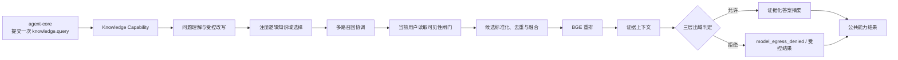
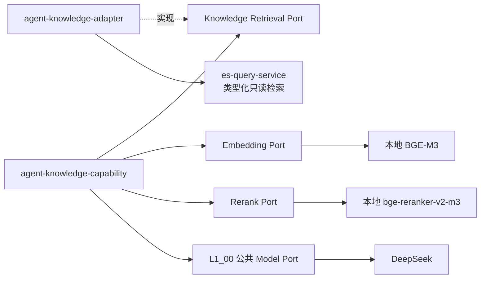

# [L1_01] 单体 Agent 知识查询能力架构 L1

> 文档层级：L1
> 文档状态：已评审

## 1. 文档治理信息

| 项目 | 内容 |
|---|---|
| 文档标识 | `SA-L1-KNOWLEDGE-001` |
| 文档编号 | `L1_01` |
| 文档层级 | L1 分域/模块架构 |
| 权威范围 | `agent-knowledge-capability`、`agent-knowledge-adapter`、Knowledge 能力描述与配置、逻辑知识域、问题改写、多路召回、候选融合与重排、证据上下文、知识证据出域、答案摘要，以及 `es-query-service`/本地 BGE 的消费与集成边界 |
| 文档状态 | 已评审 |
| 评审状态 | 已通过 |
| 实施状态 | 未实施 |
| 生效状态 | 未生效 |
| 当前版本 | v0.3 |
| 适用基线 | [`REQ_00`](../REQ_00_SINGLE_AGENT_QUERY_REQUIREMENTS.md) v1.3；[`L0_00`](L0_00_SINGLE_AGENT_ARCHITECTURE.md) v0.5（`SA-GATE-001` 已关闭）；[`L1_00`](L1_00_SINGLE_AGENT_CORE_RUNTIME_ARCHITECTURE.md) v0.2 |
| 维护责任人 | 项目维护者（个人开发者，姓名未在需求中指定） |
| 目标文档位置 | `docs/design/L1_01_SINGLE_AGENT_KNOWLEDGE_QUERY_ARCHITECTURE.md` |
| 上位 L0 | [`L0_00`《单体 Agent 查询能力 L0 总体架构设计》](L0_00_SINGLE_AGENT_ARCHITECTURE.md) v0.5 |
| 关联 L1 | [`L1_00`《单体 Agent 核心与运行架构 L1》](L1_00_SINGLE_AGENT_CORE_RUNTIME_ARCHITECTURE.md) v0.2；[`L1_02`《单体 Agent 业务查询适配架构 L1》](L1_02_SINGLE_AGENT_BUSINESS_QUERY_ADAPTER_ARCHITECTURE.md) v0.2（已评审/已通过，`BQ-GATE-001` 已关闭） |
| 治理的 L2 | `L2_01_00` Knowledge 查询流程与配置（v0.3 Approved）；`L2_01_01` Knowledge 检索与本地模型接入（v0.2 Approved）；`L2_01_02` Knowledge 证据、出域、摘要与效果验证（v0.2 Approved） |
| 外部契约 | L1_00 能力执行与公共模型端口语义；`es-query-service` 类型化只读检索契约；本地 BGE-M3 Embedding 与 `BAAI/bge-reranker-v2-m3` Rerank 契约；知识内容、读取可见性及文档级出域元数据权威 |
| 替代关系 | 新建基线；现有 `es-query-*` 实现和历史 Agent/Knowledge 代码只作为现状与迁移输入，不自动成为目标架构 |

> 本文是 P2 第二份 L1 架构基线。v0.3 在 v0.2 五轮评审基线上完成 Knowledge 两级受控映射的针对性复核，`REV-KQ-001`～`REV-KQ-009` 均已关闭且无未关闭 S0/S1；`KQ-GATE-001` 保持关闭。该结论只允许本文治理的三份 L2 继续，不表示代码实施已开始、真实检索/模型链路已获准或知识效果已经验证。

## 2. 修订历史

| 序号 | 日期 | 文档位置 | 修改内容 | 修改原因 |
|---:|---|---|---|---|
| 1 | 2026-07-25 | 全文 | 创建单体 Agent 知识查询能力 L1 草稿，落实知识查询四项能力/五个处理阶段、Capability/Port/Adapter、受控检索、本地 BGE、证据和三层出域边界，并分解三份 L2 | 承接 REQ_00、L0_00 和 L1_00，形成可正式评审的 Knowledge 下位设计基线 |
| 2 | 2026-07-25 | 13.1、13.3、16 | 澄清 `es-query-service` 类型化只读契约只服务 Knowledge 检索，并将必要的最小提供方公开接口改造设计纳入 `L2_01_01` | 排除将 Employee/Transaction 结构化查询错误导向 `es-query-service` 的歧义，同时为 Knowledge 真实集成明确详细设计责任 |
| 3 | 2026-07-25 | 16 | 将未决外部前提与已识别设计风险分开，移除本地服务点测和效果阈值尚未实测两项正常阶段工作 | 避免把 L2/P4/P5 的自然验证活动误记为当前架构问题或 L1 评审阻塞项 |
| 4 | 2026-07-25 | 5.3、6、7.4～7.6、9、10.1、11、13、14、16～17 | 第 1 轮评审修复：将当前用户读取可见性闸门前移到候选返回、融合和 BGE 重排之前，并拆分读取授权与 DeepSeek 出域的前提、L2 责任及门禁 | 关闭 `REV-KQ-001`（S1），防止不可读候选正文先进入 Agent 或本地 Rerank Provider |
| 5 | 2026-07-25 | 13.2、14.1～14.2 | 第 2 轮评审修复：将 Knowledge 实施门禁改为按对应 L2 责任切片逐次判定，并补齐门禁的适用切片、责任方、最晚阶段、开放行为和 L2 承接 | 关闭 `REV-KQ-002`（S1）和 `REV-KQ-003`（S2），消除三份 L2 人工串行及门禁阻塞范围不明 |
| 6 | 2026-07-25 | 7.1、7.3～7.5、9.2、11、13、16～17 | 第 3 轮评审修复：拆分明确不可读、读取判定不可验证和技术路径部分失败，固定多域授权拒绝优先级及部分成功覆盖语义 | 关闭 `REV-KQ-004`（S1），防止授权依赖故障被误报为无结果或整域拒绝被其他域成功掩盖 |
| 7 | 2026-07-25 | 4.2～4.3、5.1 | 第 4 轮评审修复：补充 Knowledge 直接承接的 L0 架构决策映射，并将本地模型具体 HTTP 路径移出 L1 事实表、声明现状事实不构成目标契约 | 关闭 `REV-KQ-005`、`REV-KQ-006`（S2），消除上位决策追踪依赖推断及提供方实现细节被误认作 L1 权威的风险 |
| 8 | 2026-07-25 | 2、3.5、4.2、5.1、5.4、7.3、11、13、15～17 | 第 5 轮评审修复：区分首批知识内容范围与逻辑域划分，要求 L2 固化首批目录并以至少两个注册域或受控替身验证单域/多域/零域路径；同步补齐上位决策适用性并校正读取字段现状和阶段术语 | 关闭 `REV-KQ-007`（S1）和 `REV-KQ-008`（S2），防止单域实现误通过多域需求并消除追踪、事实和术语漂移 |
| 9 | 2026-07-25 | 1、14.2、17.3、18.2 | 记录五轮正式评审通过，将文档更新为 v0.2 已评审/已通过并关闭 `KQ-GATE-001` | 形成可供三份 Knowledge L2 编写的治理基线；不改变未实施、未生效及其余门禁开放状态 |
| 10 | 2026-07-25 | 文档治理、权威关系、非职责和同层一致性 | 原子同步已创建的业务查询适配 L1 v0.1 链接、草稿状态和 `BQ-GATE-001` 开放状态 | 保持 Knowledge 与业务查询同层隔离及治理状态一致；不改变本文 v0.2 架构决策、评审、实施、生效或 `KQ-GATE-001` 结论 |
| 11 | 2026-07-25 | 文档治理、权威关系和同层一致性 | 原子同步业务查询适配 L1 v0.2 已评审/已通过状态及 `BQ-GATE-001` 关闭结果 | 保持 Knowledge 与业务查询同层隔离及治理状态一致；不改变本文 v0.2 架构决策、评审、实施、生效或 `KQ-GATE-001` 结论 |
| 12 | 2026-07-31 | 5～8、10、12～18 | 第三批 L2 独立评审原子补正：把逻辑域到物理资源的单层表述拆为 Adapter 的“逻辑域→稳定检索 Profile”与 `es-query-service` 的“Profile→物理资源”两级权威，并完成针对性复核 | 关闭 `REV-KQ-009`，消除消费方/提供方重复拥有物理映射，同时保持物理资源不进入 Agent 请求及 `SA-GATE-003` 失败关闭 |
| 13 | 2026-07-31 | 文档治理信息 | 原子同步 `L2_01_01` v0.2 Approved/五轮评审通过状态，并保留 `L2_01_02` 待创建 | 保持 L1→L2 当前状态可追踪；不改变本文 v0.3 架构语义、`KQ-GATE-001` 或任何实施/集成门禁 |
| 14 | 2026-08-01 | 文档治理信息 | 原子同步 `L2_01_00` v0.3 与 `L2_01_02` v0.2 Approved、五轮评审通过状态；三份 Knowledge L2 均已完成设计评审 | 关闭“第四批文档未创建”的治理状态，不改变本文 v0.3 架构语义、`KQ-GATE-001` 或任何实施/集成/效果门禁 |

## 3. 文档定位与权威关系

### 3.1 架构目标

本文将 L0 已确认的知识查询边界落实为可继续详细设计的模块架构，重点解决：

1. 四项必备能力如何在一个 `knowledge.query` 动作内形成完整流水线。
2. Knowledge Capability、Knowledge Adapter、`es-query-service` 和本地 BGE 分别拥有什么责任。
3. 逻辑知识域、多路召回、候选融合与重排如何保持受控且可替换。
4. 检索结果如何转化为可追踪证据，并在证据不足或失败时禁止肯定结论。
5. 文档读取权限与外部模型出域权限如何分离并失败关闭。
6. 哪些内容属于 L1 稳定边界，哪些字段、协议、算法、参数和测试矩阵下沉 L2。

### 3.2 权威关系

```text
REQ_00 已确认需求
  → L0_00 单体 Agent 总体架构
      → L1_00 核心与运行：能力执行、LangGraph、公共模型端口、通用状态
      → 本文 L1_01 Knowledge：知识策略、检索消费、证据与知识出域
          → L2_01_00 查询流程与配置
          → L2_01_01 检索与本地模型接入
          → L2_01_02 证据、出域、摘要与效果验证
      → L1_02 业务查询适配：Employee/Transaction（v0.2 已评审/已通过）
```

- L0 对单逻辑 Agent、单动作、模型不可信、检索只读、证据约束和三层出域具有上位权威。
- L1_00 对能力执行入口、公共状态、公共 DeepSeek 模型端口和请求级总预算具有同层公共权威。
- 本文唯一拥有 Knowledge 查询策略和消费侧语义，不得反向修改 L1_00 的通用运行契约。
- `es-query-service` 和本地 BGE 的提供方内部实现不由本文治理；本文只定义 Knowledge 所需的消费语义、禁止边界和集成门禁。
- L2 可固化字段、协议、算法、数值、类和测试，但不得扩大本文或上位文档的权限与能力范围。

### 3.3 本文唯一负责

- `knowledge.query` 能力描述、启停条件和单动作内部阶段边界。
- 问题改写、逻辑知识域选择、受控检索计划和多路召回协调。
- Knowledge 只读检索 Port 及 Knowledge Adapter 的依赖方向和语义边界。
- 统一候选、去重、融合、BGE 重排、证据上下文和证据化摘要的架构语义。
- Knowledge 对 Embedding、Rerank 和公共生成模型端口的消费边界。
- 全局规则、逻辑知识域默认策略、文档级收紧策略的交集判定。
- Knowledge 运行期状态、错误映射、观测要求、质量预算和 L2 分解。

### 3.4 本文明确不负责

| 非职责内容 | 唯一负责方 | 本文使用方式 |
|---|---|---|
| Spring 接入、LangGraph 图、能力注册运行时、公共状态和请求总预算 | L1_00 及其 L2 | 作为已定义的执行上下文和公共契约使用 |
| DeepSeek 提供方协议、鉴权、连接参数和通用模型输入治理 | L1_00 的 `L2_00_02` | 通过公共模型 Port 使用，不直接依赖供应商 SDK |
| Elasticsearch 集群、物理索引生命周期、文档录入、切分、批量写入、删除和重建 | `es-query-service`/索引建设流程 | 只消费经类型化只读契约暴露的派生检索快照 |
| `es-query-service` 内部类、ES DSL、查询优化和模型服务内部部署 | 对应提供方详细设计 | 只约束 Knowledge 所需语义和禁止接口 |
| 知识内容真相、文档读取权限和文档级出域元数据真相 | 知识内容及策略权威 | 消费带版本的读取/出域判定依据，不复制所有权 |
| Employee/Transaction 动作、Adapter、业务授权和字段出域 | [`L1_02`](L1_02_SINGLE_AGENT_BUSINESS_QUERY_ADAPTER_ARCHITECTURE.md) | 不在 Knowledge 配置或流程内注册 |
| 聚合、工作流、写入、持久会话、Multi-Agent 和生产级高可用 | 未来重新立项 | 本期不实现，也不建立通用平台 |

### 3.5 适用范围与简化原则

本文适用于个人学习和技术验证环境中的首批税务政策与法律知识内容；该内容范围不预先等同于一个或两个逻辑知识域。设计以完整打通、边界清晰、可验证为优先，不引入独立 `knowledge-service`、动态插件平台、规则引擎、检索编排微服务或持久工作流；个人项目的简化不弱化 JWT、只读检索、模型不可信、证据约束和出域失败关闭。

## 4. 上位约束映射

### 4.1 L0 约束逐项映射

| L0 约束 ID | 本文落实方式 | 本文章节 | 下位验证证据 | 偏差/说明 |
|---|---|---|---|---|
| `SA-C-001` | Knowledge 作为同一 Python 运行时内的能力模块执行，不建立第二 Agent、第二图或独立服务 | 5、6、10 | 部署清单、依赖扫描 | 无 |
| `SA-C-002` | 对核心只注册一个 `knowledge.query`；多知识域、多路召回和多次受控调用均是该动作内部阶段 | 5、7、9 | 单动作和第二动作拒绝测试 | 无 |
| `SA-C-003` | 该约束专属于 Employee/Transaction 数据访问 | — | — | 不适用；Knowledge 的等价只读边界由 `SA-C-016/017` 约束 |
| `SA-C-004` | 该约束专属于业务服务最终角色授权 | — | — | 不适用；本文不复制业务角色规则 |
| `SA-C-005` | 模型产生的改写、域候选和摘要均视为不可信，必须受注册域、证据和出域闸门约束 | 7、9、10 | 非法域、越界内容和无证据回答测试 | 无 |
| `SA-C-006` | Knowledge 强类型配置只能启停或收紧域、路径、候选和出域边界，不能新增协议、物理索引或权限 | 6、7、10 | 启动校验、越界配置测试 | 无 |
| `SA-C-007` | 缺少原始用户 JWT 或认证上下文时不得执行改写、检索、重排或摘要，也不得使用 Agent 服务身份回退 | 7、9、10 | 无 JWT、服务身份回退测试 | 无 |
| `SA-C-008` | 查询计划、候选、证据和摘要仅存在于请求内；Agent 不保存知识内容真相或长期会话 | 8、10 | 存储依赖扫描、重启测试 | 无 |
| `SA-C-009` | 无结果、阶段失败或不完整证据不会被转换为肯定事实 | 7、9、11 | 无结果、故障注入和拒答测试 | 无 |
| `SA-C-010` | Knowledge 通过能力实现、Port、Adapter、配置和组合根接入，不向核心增加知识域分支 | 6、10、12 | 依赖扫描、模拟能力扩展测试 | 无 |
| `SA-C-011` | 日志只记录阶段、逻辑域、路径、数量、状态和耗时，不记录 JWT、向量、完整正文或完整提示词 | 10、11 | 日志字段与敏感内容断言 | 无 |
| `SA-C-012` | 检索或模型公共契约不兼容变化必须同步 Adapter/Provider 代码和契约测试，不能只改配置 | 7、13、14 | 契约版本与兼容性测试 | 无 |
| `SA-C-013` | 该约束专属于业务域动作注册 | — | — | 不适用；索引管理和写操作由 `SA-C-016/017` 明确禁止 |
| `SA-C-014` | ES、BGE 和 DeepSeek 均置于 Port/Adapter 后，供应商类型不进入 Knowledge 能力契约 | 6、7、10 | 依赖方向和替身测试 | 无 |
| `SA-C-015` | 将四项必备能力展开为问题改写、域选择、多路召回、重排、证据化摘要五个处理阶段；算法和参数下沉 L2 | 5、7、9、13 | 分阶段单元测试和效果记录 | 无 |
| `SA-C-016` | 模型只能从已启用逻辑域中选择；Capability 不接受物理索引、原始 DSL 或管理动作 | 6、7、10 | 非法域、索引、DSL 和管理接口拒绝测试 | 无 |
| `SA-C-017` | `es-query-service` 只提供类型化、只读、确定性检索原子能力和统一候选/失败语义 | 6、7、14 | Provider 契约测试和接口可达性测试 | 当前实现存在契约差距，由 `SA-GATE-003` 阻断真实集成 |
| `SA-C-018` | 肯定事实必须可回溯到本次允许证据；整体召回、重排或证据充分性失败时不生成肯定摘要 | 7、9、11 | 证据追踪、拒答和故障注入测试 | 无 |
| `SA-C-019` | Knowledge 只执行核心提交的一次动作；不接管 LangGraph 图推进、跨动作重试、降级或终止权威 | 6、9、10 | 调用链、重试边界和单动作测试 | 无 |
| `SA-C-020` | 该约束专属于 Employee/Transaction 业务字段出域 | — | — | 不适用 |
| `SA-C-021` | 外部模型可见证据必须满足全局、逻辑域默认和文档级收紧策略交集；缺失或冲突返回 `model_egress_denied` | 7、9、10 | 三层策略、冲突、未分类和外部模型零调用测试 | 无 |

### 4.2 L0 关键架构决策承接

| L0 决策 | 本文承接方式 | 本地决策/章节 | 偏差 |
|---|---|---|---|
| `SA-AD-002`、`SA-AD-003` 统一能力 API、每请求至多一个查询动作 | 仅注册一个 `knowledge.query`，多域、多路和多次出站均封装在动作内部 | `KQ-AD-001`；5、7、9 | 无 |
| `SA-AD-005` 动作代码绑定、强类型配置只收紧 | 稳定动作和逻辑域由代码/强类型配置约束，配置不能创建协议、索引或权限 | `KQ-AD-003`；6.3、7.3 | 无 |
| `SA-AD-007` DeepSeek 通过模型端口接入 | Knowledge 只消费 L1_00 公共模型 Port，供应商字段不进入能力契约 | `KQ-AD-008`；7.2、7.7～7.8 | 无 |
| `SA-AD-008` 三份 L1 且 Knowledge 承接检索消费边界 | 本文同时治理知识策略、Agent 侧适配和 ES/BGE 消费语义，并收敛为三份 Knowledge L2 | `KQ-AD-004`、`KQ-AD-010`；3、13 | 无 |
| `SA-AD-011` 不建设独立 `knowledge-service` | Capability 与 Adapter 随 `agent-runtime` 同进程部署，以 Port 保持职责分离 | `KQ-AD-002`；3.5、6.2、10.5 | 无 |
| `SA-AD-012` 四项知识能力分层治理 | L1 固定五个可观测处理阶段及失败边界，算法、参数和类下沉 L2 | `KQ-AD-001`、`KQ-AD-005`、`KQ-AD-010`；5、7、13 | 无 |
| `SA-AD-013` LangGraph 是唯一编排权威 | Knowledge 只执行核心提交的一个动作并管理动作内部策略，不取得图推进、跨动作重试、降级或终止权威 | `KQ-AD-001`；6.1、6.4、9 | 无 |
| `SA-AD-014` Employee/Transaction 既有只读动作及强类型配置 | 不适用；本文不治理业务动作、业务 Adapter、角色或业务字段出域 | 3.4、4.1 `SA-C-020`、15.2 | 不适用 |
| `SA-AD-015` 三层知识证据出域 | 领域结果、证据上下文和模型载荷分离，三层只收紧且拒绝优先 | `KQ-AD-006`、`KQ-AD-007`；7.6～7.7、10.1～10.2 | 无 |

其余 L0 决策属于核心运行、业务查询或全局部署主责；本文通过 4.1 的适用约束及 4.3 的公共契约消费其边界，不复制同层权威。

### 4.3 与 L1_00 的公共契约对齐

| L1_00 公共边界 | 本文消费方式 | 本文不得改变 |
|---|---|---|
| 能力执行契约 | `knowledge.query` 作为注册能力处理器，接收请求上下文并返回公共状态、受控领域结果、出域判定和可选模型安全载荷 | 动作选择、单动作闸门、公共状态集合 |
| 请求身份和预算 | 使用原始用户 JWT、关联标识、截止时间和取消信号 | 入口认证权威、总超时所有权 |
| 公共 DeepSeek 模型 Port | 用于受控问题改写和证据化摘要 | 供应商协议、全局输入闸门、通用重试/超时语义 |
| 模型结果不可信 | 改写、域候选和摘要均经过确定性校验 | 不得将模型输出直接作为动作、索引、DSL 或事实 |
| 领域结果与模型载荷隔离 | 本地可读结果、外部模型出域判定和最小模型载荷分别构造 | 核心不得从领域结果自行推导模型载荷 |
| 组合根 | 注入 Knowledge Capability、Adapter、检索 Port 和 BGE Provider | 不在运行期动态装载或热替换能力 |

## 5. 背景、现状与目标

### 5.1 已核实现状

| 事实 ID | 当前事实 | 架构含义 |
|---|---|---|
| `KQ-FACT-001` | 当前工作区不存在目标 `agent-knowledge-capability` 或 `agent-knowledge-adapter` 实现 | 本文是新能力架构，不以历史 Agent 实现为目标基线 |
| `KQ-FACT-002` | `es-query-service` 当前公开原始 DSL 搜索、调用方指定物理索引的向量搜索，以及写入、删除、批量和重建入口 | 现有接口不能直接作为 Agent 目标契约，真实集成须先关闭 `SA-GATE-003` |
| `KQ-FACT-003` | 现有向量请求允许调用方提供向量字段、查询向量、过滤条件和候选参数，响应为原始 ES JSON | Knowledge 需要类型化只读请求、统一候选和统一失败契约，不能透传现有原始结构 |
| `KQ-FACT-004` | `es-query-api` 中存在未被当前控制器采用的搜索 DTO，但尚无已验证的关键词/向量统一候选契约 | DTO 存在不等于目标契约已具备，详细接口仍由 L2 与提供方核实 |
| `KQ-FACT-005` | 2026-07-25 只读复核确认 ES `9200` 可用、税务知识索引及只读/写入别名存在，当前复核快照的向量维度为 1024 | 税务域和向量维度可作为 L2 当前输入；真实联调仍须使用受控只读别名并核实快照版本 |
| `KQ-FACT-006` | 2026-07-25 只读复核确认 Embedding `8908` 与 Rerank `8909` 健康并分别完成最小功能点测；Embedding 输出为 1024 维，Rerank 返回已确认模型的有序结果 | 本地 BGE 选型具备点测证据，但具体路径、接口限制、超时、失败和契约测试仍未固化 |
| `KQ-FACT-007` | 2026-07-25 复核时 `es-query-service` `9201` 未监听，且当前公开代码仍是原始/混合读写接口 | 无法形成 Agent 到检索服务的真实只读链路，`SA-GATE-003` 保持开启 |
| `KQ-FACT-008` | 2026-07-25 只读复核确认当前 ES 映射存在 ACL/可见性候选字段，但其语义、读取判定权威、版本有效性及 ES 快照同步机制尚未形成已验证契约；文档级模型出域元数据仍未固化 | 字段存在不等于读取/出域闭环；真实检索和真实知识证据外发仍分别受 `SA-GATE-003/006` 控制 |

以上事实是带日期的实现与运行证据快照，不是目标接口契约；端口以外的路径、字段、模型请求/响应和限制均由 L2/提供方契约固化，后续漂移不得反向修改本文架构边界。

### 5.2 核心问题

当前只有检索基础设施原子能力，缺少面向 Agent 的受控知识查询流水线。若直接把现有 ES 接口暴露给模型或核心，将产生以下问题：

- 模型能够指定物理索引、字段或 DSL，突破有限查询动作边界。
- 关键词和向量候选无法使用统一语义进行融合、去重、重排和失败判断。
- 检索结果与可发送给外部模型的内容混为一体，无法落实三层出域策略。
- 无结果、单路失败、整体失败和证据不足容易被生成模型掩盖。
- ES/BGE/DeepSeek 协议侵入能力代码，未来替换需要修改核心流程。

### 5.3 目标状态

#### 5.3.1 逻辑处理链



该链在核心看来始终是一个动作。需求中的“四项能力”在流程中把“多路召回 + 重排”拆为两个可独立观测阶段，因此形成五个处理阶段；这不是新增第五项需求。逻辑知识域数量、召回路径数量和内部模型调用次数不能被解释为第二个 Agent 动作或跨域聚合。

#### 5.3.2 端口与外部依赖



- 实线表示运行期调用方向，虚线表示实现/装配关系。
- Capability 依赖抽象 Port，不依赖 Adapter 或供应商 SDK。
- Adapter、BGE Provider 和公共模型 Provider 在组合根装配；运行期注册表不负责动态创建它们。

### 5.4 达成标准

1. `knowledge.query` 的五段语义、输入输出和失败边界完整。
2. 模型只能选择注册且启用的逻辑知识域，不能接触物理索引或 DSL。
3. 关键词/向量等召回路径返回统一候选，融合与重排不依赖原始 ES JSON。
4. 每个肯定事实能够回溯到当前请求内的允许证据。
5. 三层出域不满足时，知识证据的外部摘要调用为零。
6. 新增逻辑域、召回实现或模型 Provider 不需要修改 `agent-core`。
7. 三份 L2 的权威范围无重叠且足以支持实施设计。
8. 逻辑域选择以至少两个已注册且启用的域或受控测试替身证明单域、多域、零匹配和非法域路径；首批真实域清单及物理映射由 L2 核实，不由 L1 猜测。

## 6. 模块、职责与配置边界

### 6.1 内部模块

| 模块 | 核心职责 | 明确不负责 |
|---|---|---|
| Knowledge 能力描述 | 声明稳定动作 ID、请求/结果类型、启用状态和所需上下文 | 不描述物理索引、HTTP 路径或任意工具 |
| Knowledge Capability | 在一个动作内协调改写、域选择、召回、融合、重排、证据、出域和摘要 | 不访问 ES 协议，不拥有图编排或供应商连接 |
| 问题理解与改写组件 | 在原问题语义边界内生成受控检索表达，并保留原问题用于追踪 | 不扩大问题意图，不生成动作或物理查询 |
| 逻辑知识域目录 | 提供代码绑定、已启用域及其允许召回路径和默认策略引用 | 不保存物理索引名，不接受模型动态创建域 |
| 检索计划与协调组件 | 将已选逻辑域转为有限检索意图，协调零到多次受控原子检索 | 不拼接 DSL，不管理索引 |
| Knowledge Retrieval Port | 表达关键词、向量等类型化只读检索语义，只返回已由读取权威判定为当前用户可读的统一候选/失败结果 | 不暴露 ES JSON、物理索引、写入或管理动作，不把读取规则交给调用方猜测 |
| Knowledge Adapter | 实现 Retrieval Port，完成逻辑域到代码绑定稳定检索 Profile 的映射、用户读取上下文传递和提供方协议转换 | 不解析 Profile 对应物理索引/别名/字段，不拥有读取授权规则、知识策略、内容真相、域选择或答案生成 |
| 候选融合组件 | 标准化分数来源、去重并形成有界候选集 | 不把不可比较的原始分数直接解释为统一相关度 |
| Embedding Port/Provider | 表达并实现查询向量化消费语义 | 不决定域、召回策略或物理向量字段 |
| Rerank Port/Provider | 仅对已证明当前用户可读的有界、最小候选执行受控相关性重排 | 不接收 JWT，不补充候选外事实，不决定读取或出域 |
| 证据上下文构建器 | 复核读取判定依据后构造可追踪、最小化、带来源和策略快照的请求级证据 | 不持久化知识内容，不自行授权 |
| 出域策略判定器 | 计算全局、域默认和文档级策略交集，产生独立出域决定和最小载荷 | 不以“用户可读”替代“允许外发” |
| 证据摘要组件 | 仅基于允许证据形成摘要或受控拒答 | 不使用模型常识补充事实 |

### 6.2 Capability 与 Adapter 边界

```text
Knowledge Capability → Knowledge Retrieval Port ← Knowledge Adapter → es-query-service
```

- Capability 拥有“查什么、查哪些逻辑域、使用哪些允许路径、如何融合和何时停止”。
- Adapter 拥有“如何把受控意图映射为提供方类型化请求、如何隐藏物理资源、如何标准化响应与错误”。
- 二者可以位于同一 Python 包、构建单元和部署进程，但必须保持单向依赖和独立测试边界。
- 未来增加重试、熔断、指标或缓存等横切机制时，可在 Port 装饰器或 Provider 边界增加；本期只验证缝隙，不实施生产级韧性框架。

### 6.3 配置所有权

| 配置类别 | 所有者 | 允许内容 | 禁止内容 |
|---|---|---|---|
| Knowledge 能力配置 | Knowledge Capability | 启停动作、启用逻辑域、允许召回路径、候选和阶段上限、策略引用 | 动态动作代码、URL、类名、脚本或任意请求模板 |
| 逻辑知识域目录 | Knowledge Capability | 稳定域 ID、描述、启用状态、允许路径、默认出域策略引用 | 物理索引、任意 DSL、运行期模型创建域 |
| 检索消费映射 | Knowledge Adapter | 逻辑域到稳定检索 Profile 的代码绑定或强类型映射 | 物理索引、别名、字段、任意 Profile 或调用方覆盖 |
| 检索提供方映射 | `es-query-service` | 稳定 Profile 到受控索引/只读别名、字段和过滤规则的强类型映射 | Agent 请求覆盖物理资源、写别名或管理接口 |
| BGE Provider 配置 | 对应 Provider | 模型标识、受控地址、维度/输入限制、超时和健康检查 | 由模型输出覆盖地址、模型或限制 |
| 全局知识出域规则 | Agent 安全配置权威 | 全局默认拒绝及允许的策略版本 | 域或文档放宽全局限制 |
| 文档级读取/出域元数据 | 知识内容及策略权威 | 带版本的读取与出域收紧信息 | Agent 配置覆盖或放宽文档策略 |

所有配置在启动期完成强类型校验并形成不可变运行快照。缺失映射、未知枚举、策略冲突、能力与 Provider 不兼容时，相关域或能力必须失败关闭；本期不建设热更新或配置控制台。

### 6.4 依赖方向不变量

1. `agent-core` 只依赖能力 API，不依赖 Knowledge 内部模块。
2. Knowledge Capability 只依赖公共模型 Port、Embedding/Rerank Port 和 Retrieval Port。
3. Knowledge Adapter 实现 Retrieval Port，但 Capability 不反向依赖 Adapter。
4. Provider/Adapter 可依赖外部协议客户端，领域组件不得依赖供应商 SDK。
5. `es-query-service` 不回调 Agent，也不承担问题改写、域选择、融合、重排编排或摘要。
6. 知识内容和策略权威不依赖 Agent 的请求级数据结构。

## 7. 语义契约

### 7.1 `knowledge.query` 能力契约

| 契约项 | L1 语义 |
|---|---|
| 动作标识 | 稳定、代码绑定的 `knowledge.query`；运行时只能启停，不得通过配置改名或新增变体 |
| 前置条件 | 有效用户认证上下文、未耗尽的请求预算、能力及至少一个逻辑域启用 |
| 输入 | 原始问题、核心传入的请求上下文及可选受控查询约束；不接受物理索引、DSL、任意 URL 或模型名 |
| 领域结果 | 受控的知识查询状态、证据引用、覆盖/降级信息和可选证据摘要；技术路径部分失败后继续时必须明确“证据充分但覆盖不完整”，不得暴露原始 ES 响应 |
| 出域结果 | 与领域结果分离的允许/拒绝决定、策略版本与最小模型安全载荷 |
| 公共状态 | 复用 L1_00：`success`、`no_result`、`unsupported`、`invalid_argument`、`unauthenticated`、`forbidden`、`timeout`、`downstream_failure`、`model_egress_denied`、`internal_failure` |
| 后置条件 | 所有肯定内容可追踪到本次证据；无长期状态、副作用或第二动作 |

完整 DTO 和字段级校验由 L2 定义。核心不得从领域结果正文重新构造模型载荷，也不得把内部降级标记改写为完整成功。

### 7.2 问题改写契约

- 改写目标是提高检索可用性，不改变用户问题的主体、时间、条件、否定关系或法律语义。
- 原始问题与选定改写在请求内关联，用于审计和效果对照；日志不记录不必要的完整文本。
- 使用 DeepSeek 改写时必须通过 L1_00 的公共模型 Port 和用户问题输入闸门。
- 模型可返回候选改写，但确定性组件负责格式、数量、长度、语义约束和是否采用。
- 改写失败时，仅允许使用经确定性校验的原问题最小检索表达作为配置化回退；无法证明语义保持时返回受控失败，不猜测替代问题。

### 7.3 逻辑知识域契约

- 首批知识内容范围为税务政策和法律；具体划分为一个或多个逻辑域由 `L2_01_00` 根据内容语义固化，不得直接以物理索引、别名或尚未验证的字段值代替域定义。
- 模型只可从当前能力快照中的已启用域 ID 集合选择零到多个域。
- 未注册、禁用或格式非法的域候选一律丢弃并记录受控原因；不能由模型或请求临时创建。
- Capability 拥有逻辑域语义；Adapter 独占逻辑域到稳定检索 Profile 的消费映射；`es-query-service` 独占 Profile 到受控只读物理资源的提供方解析。两者只通过 Profile ID/版本契约连接，不复制物理配置。
- 当前请求在已启用域集合中无匹配域时统一返回 `no_result`。
- 能力未注册或未启用由核心返回 `unsupported`；启动快照没有任何有效域时能力不得注册为可执行，不在请求内伪装为领域无结果。
- 多域能力的实现证据必须覆盖至少两个已注册且启用的逻辑域；若首批真实内容尚不能形成两个经确认的域，可在 P3 使用受控测试域/Adapter 替身验证选择与合并语义，但不得据此声明真实多域映射或 P4 集成已完成。

### 7.4 检索计划与只读 Port 契约

Retrieval Port 至少表达关键词与向量两类确定性原子检索，允许同一动作对一个或多个逻辑域发起有界调用。每次调用只包含逻辑域、受控查询表达、已注册检索类型及有界限制，不包含以下内容：

- 物理索引、别名或向量字段。
- Elasticsearch DSL、脚本、聚合或任意过滤表达式。
- 写入、删除、批量、刷新、重建、任务或索引管理动作。
- 调用方自定义 URL、HTTP 方法、模型地址或 Provider 参数。

Retrieval Port 的提供方边界必须基于当前用户读取上下文调用读取权威，并在返回候选正文前排除不可读文档；Adapter 只传递原始用户 JWT 或等价受控读取上下文并映射权威判定，不在本地复制角色或文档读取规则。明确拒绝、读取判定缺失/不可验证、读取权威超时/失败必须是可区分的类型化结果；后两类失败关闭为 `timeout`/`downstream_failure`，不得伪装成 `no_result`，也不得先返回正文再由 Capability 补做授权。

Provider 必须只返回当前用户可读的统一候选、明确无结果、明确拒绝或明确技术失败，不得把原始 ES JSON 作为公共结果。统一候选至少在语义上支持文档/片段稳定标识、逻辑域、召回路径、内容证据、来源定位、分数来源、读取判定依据及出域策略快照；具体字段、读取权威交互、类型化授权结果和防存在性泄漏语义由 L2 与提供方契约共同固化。

### 7.5 候选融合与重排契约

- 不同召回路径的原始分数不假定可直接比较；融合前必须保留分数来源并执行确定性标准化。
- 去重优先使用稳定文档/片段身份，不以文本相似猜测替代权威标识。
- 融合只在各路径返回的有界候选集合内工作，不补充未召回文档。
- Capability 只接受带可追踪“当前用户允许读取”判定的候选进入融合；缺失、拒绝或不可验证候选不得进入 BGE Rerank。
- BGE Rerank 只对融合后的当前用户可读、有界且最小化候选重排，输入输出均经长度、数量、身份和分数校验；本地 BGE 不接收 JWT 或读取策略内部信息。
- 精确融合算法、权重、候选数量、阈值和并发方式由 `L2_01_01` 定义，L1 不固化。
- 整体召回无候选返回 `no_result`；Rerank 失败或输出无法验证时不得生成肯定摘要。
- 仅技术性单路失败可在剩余路径满足 L2 证据充分性条件时继续；结果必须携带覆盖不完整、失败路径及充分性判定，最终回答不得呈现为完整检索。整域读取 `forbidden`、读取判定不可验证或读取权威失败不适用该部分成功规则。

### 7.6 证据上下文契约

证据上下文是当前请求内的派生对象，至少在语义上包含：

- 原问题与采用的受控检索表达之间的关联。
- 逻辑域、召回路径和重排顺序。
- 可追踪的文档/片段身份及来源定位。
- 经 Retrieval Port 在候选返回前形成、并由证据构建器复核的用户读取可见性判定依据。
- 全局、域默认和文档级出域策略的版本化快照。
- 被允许进入外部模型的最小证据内容。

本地用户可见领域结果、证据上下文和外部模型载荷是三个不同视图。文档可读只说明可以用于本地查询判断，不自动允许其正文发送给 DeepSeek。

### 7.7 三层出域与摘要契约

```text
外部模型可见证据
  = 全局规则
    ∩ 逻辑知识域默认策略
    ∩ 每一文档的收紧策略
    ∩ 当前用户可读且本次实际采用的证据
```

- 任一层拒绝、缺失、未知、版本不可追踪或发生冲突时，“拒绝”优先。
- 拒绝时返回 `model_egress_denied`，不构造证据模型载荷，证据摘要对应的 DeepSeek 调用次数必须为零。
- “零调用”仅针对被拒绝的知识证据摘要/回答生成载荷；若动作选择或问题改写在更早阶段已依法调用公共模型，不得错误宣称整请求外部模型调用为零。
- 允许时只发送回答所需的最小证据，不发送完整索引文档、无关候选、读取策略内部信息或未采用片段。
- 摘要中的肯定事实必须能够映射到证据；无法支持的内容删除或转为明确的不确定/无结果表达。
- Capability 拥有知识证据摘要及其证据关联；最终对话呈现仍服从 L1_00 的回答治理。核心若使用公共模型进行最终格式化，只能消费本文已经判定安全的载荷，不得重新检索、扩写未获证据支持的知识事实或形成第二个知识推理阶段。

### 7.8 Provider 契约边界

| Provider | 本文要求的语义 | 下沉内容 |
|---|---|---|
| `es-query-service` | 类型化、只读、确定性检索；统一候选/无结果/失败；隐藏物理资源和管理接口 | 路径、DTO、认证、错误码、分页、超时和兼容版本进入 `L2_01_01` |
| BGE-M3 Embedding | 对受控查询文本生成与目标快照兼容的向量；输出维度和有限数值可验证 | HTTP/SDK 协议、批量、长度、维度、超时和失败进入 `L2_01_01` |
| BGE Rerank | 对有界候选按查询相关性返回可验证顺序/分数 | 模型协议、候选上限、长度、超时和错误进入 `L2_01_01` |
| DeepSeek | 通过 L1_00 公共模型 Port 执行受控改写和证据摘要 | 提供方协议归 `L2_00_02`；Knowledge 提示、输出约束和证据使用归 `L2_01_00/02` |

## 8. 数据、状态与运行所有权

| 数据或状态 | 权威所有者 | Knowledge 中的生命周期 | 可持久化 |
|---|---|---|---|
| 知识正文、来源和读取规则 | 知识内容权威 | 通过检索快照只读消费 | Agent 否 |
| 文档级出域策略 | 知识策略权威 | 读取带版本快照并参与交集判定 | Agent 否 |
| ES 索引、别名和向量 | 检索基础设施 | `es-query-service` 隐藏物理资源并只读访问，Adapter 只消费 Profile | Agent 否 |
| 逻辑知识域目录 | Knowledge Capability 代码/强类型配置 | 启动时校验并冻结 | 仅配置源 |
| 域到稳定检索 Profile 的消费映射 | Knowledge Adapter 代码/强类型配置 | 启动时校验并冻结 | 仅配置源 |
| Profile 到物理资源的提供方映射 | `es-query-service` 强类型配置 | 启动时校验并冻结，Agent 请求不能覆盖 | 仅提供方配置源 |
| 问题改写、检索计划、候选、证据、摘要 | Knowledge Capability | 单请求内创建、使用和释放 | 否 |
| LangGraph 请求状态、截止时间和取消 | L1_00 运行时 | 只消费，不复制长期状态 | 否 |
| 模型/检索健康状态 | 对应 Provider/治理层 | 可读取瞬时状态，不作为知识事实 | 否 |

Knowledge 不新增数据库、缓存、消息队列或持久检查点。为效果验证保存的离线问题集和脱敏结果记录属于测试资产，由 L2/P5 管理，不进入在线请求状态。

## 9. 关键流程与失败语义

### 9.1 正常流程

1. `agent-core` 在 L1_00 的单动作闸门后调用 `knowledge.query`。
2. Capability 验证用户上下文、能力快照、截止时间和取消状态。
3. 问题组件在输入出域允许时通过公共模型 Port 生成受控改写，否则按允许的确定性路径处理。
4. 域选择组件只能从已启用逻辑域目录选择域。
5. 检索协调组件为每个域生成有限关键词/向量召回计划；向量路径通过 Embedding Port 取得受控查询向量。
6. Knowledge Adapter 将逻辑请求和受控读取上下文映射到 `es-query-service` 类型化只读请求；提供方边界在返回正文前依据读取权威排除不可读文档，只返回带可追踪允许判定的统一候选，或返回无结果/拒绝/失败。
7. Capability 再校验候选读取判定依据，仅将当前用户可读的候选标准化、去重、融合并发送给 Rerank Port。
8. 证据构建器复核读取判定、来源、策略快照和证据充分性。
9. 出域判定器计算三层交集；拒绝则停止证据外发。
10. 允许时摘要组件仅以最小证据通过公共模型 Port 生成受控摘要。
11. Capability 返回公共状态、领域结果、独立出域决定和可选模型安全载荷；核心完成该唯一动作。

### 9.2 失败与降级矩阵

| 场景 | 必须行为 | 公共结果方向 | 禁止行为 |
|---|---|---|---|
| 缺少/无效用户上下文 | 动作执行前终止 | `unauthenticated` | 使用 Agent 服务身份调用任何下游 |
| 问题为空或越界 | 确定性拒绝 | `invalid_argument` | 让模型补全用户意图 |
| 改写模型失败 | 仅在配置允许且原问题可确定性验证时使用最小原问题回退，否则失败 | `downstream_failure` 或继续 | 静默采用语义漂移的改写 |
| 已启用域集合中无匹配域 | 不访问任意物理索引 | `no_result` | 模型创建域或猜测索引 |
| 能力未注册/未启用或启动时无有效域 | 不进入 Knowledge 领域执行；无有效域时启动校验失败或能力不注册 | `unsupported`/启动失败 | 在请求内伪装为 `no_result` |
| Embedding 失败 | 向量路径失败；是否可凭其他路径继续由有界策略判断 | 继续并标记不完整，或 `downstream_failure` | 伪造向量或掩盖路径失败 |
| 技术性单一路径失败 | 记录失败；仅当剩余路径证据达到 L2 明确的充分性条件时继续 | `success` 必须携带覆盖不完整、失败路径和充分性判定，否则 `downstream_failure` | 把部分覆盖宣称为完整检索，或将授权拒绝纳入技术降级 |
| 所有路径无候选 | 明确无结果 | `no_result` | 依赖模型常识回答 |
| 所有路径失败 | 明确下游失败 | `downstream_failure`/`timeout` | 转换为无结果或肯定事实 |
| Rerank 失败/输出非法 | 停止肯定摘要 | `downstream_failure` | 以未验证排序替代必备重排并静默成功 |
| 文档被读取权威明确判定不可读 | 在候选正文越过 Retrieval Port 或进入融合/Rerank 前排除；全部候选均明确不可读时返回 `no_result` 以避免泄漏其存在；读取权威明确拒绝任一已选整域/请求时终止整个动作 | `no_result`/`forbidden` | 先返回正文再授权、把不可读候选发送给 BGE，或用其他域成功掩盖整域 `forbidden` |
| 读取判定缺失、不可验证或读取权威失败 | 不返回候选正文，不进入融合/Rerank；保留超时与非超时失败区别 | `timeout`/`downstream_failure` | 转换为 `no_result`、按明确不可读处理或使用其他域静默继续 |
| 证据不足 | 返回无充分证据的受控结果 | `no_result` 或受控非肯定结果 | 补充未召回事实 |
| 出域拒绝/缺失/冲突 | 不构造证据模型载荷，停止证据摘要调用 | `model_egress_denied` | 因用户可读而允许外发 |
| 摘要模型失败或摘要越界 | 丢弃不可信摘要，保留受控失败/证据结果 | `downstream_failure` | 返回未经证据校验的草稿 |
| 截止时间耗尽/取消 | 停止新调用并向下游传播剩余预算/取消 | `timeout` | 在超时后继续后台生成回答 |

失败优先级为：身份/参数拒绝在任何下游前终止；任一已选整域的读取 `forbidden` 终止整个动作；读取判定不可验证、读取权威失败、整体召回失败或 Rerank 失败不能降为 `no_result`；只有技术性单路失败可在证据充分时返回带强制覆盖标记的 `success`。该继续执行属于 Knowledge 动作内部的语义决策，不是 Spring 接入层降级，也不是第二个动作。具体充分性阈值、非敏感失败路径表达和错误映射由 L2 固化。

### 9.3 幂等与副作用

- Knowledge 全链路只读，不产生业务或索引副作用。
- 同一问题重复执行可以因索引快照或模型版本变化返回不同排序，但每次结果必须携带可追踪版本信息。
- 本文不承诺跨请求结果强一致，也不引入幂等存储。
- 超时或取消后的晚到结果必须丢弃，不能更新已结束请求或触发第二次摘要。

## 10. 横切机制

### 10.1 认证与读取边界

- Capability 执行前必须收到 L1_00 已验证的用户上下文和原始用户 JWT。
- JWT 只按受控契约向需要执行读取授权的下游透传，不写入日志、提示词、候选或模型载荷。
- Knowledge 不定义 `admin`、`viewer` 等业务角色规则，也不以本地角色白名单替代知识读取权威。
- 本地 BGE 属于独立的检索 Provider 边界而非读取授权权威；只能接收已经证明当前用户可读且为重排最小化后的候选文本，不接收 JWT、完整文档或读取策略内部信息。
- 无法在候选正文返回、融合和 Rerank 前证明其对当前用户可读时失败关闭；证据构建阶段必须复核而不是首次授权。

### 10.2 输入与模型安全

- 原始问题进入 DeepSeek 前服从 L1_00 的全局输入闸门。
- 逻辑域、召回类型、候选身份和摘要结构均由代码/强类型契约校验。
- Prompt injection 文本只作为不可信知识内容处理，不能修改动作、域目录、出域策略或系统指令。
- BGE 输出同样不可信；必须验证维度、有限数值、候选身份和返回数量。

### 10.3 超时、取消和资源边界

- Knowledge 消费 L1_00 传入的请求总预算，为改写、Embedding、各召回路径、Rerank 和摘要分配有界子预算。
- 所有候选数量、域数量、路径数量、文本长度和模型调用次数必须有上限；具体数值进入 L2。
- 取消和截止时间沿所有 Port 传播，Provider 不得脱离请求继续生成可见结果。
- 本期不实现生产级熔断、分布式重试或降级平台，但 Port/Provider 可被装饰且核心流程不感知具体机制。

### 10.4 可观测性

每次 Knowledge 动作至少记录：

- 关联标识、动作 ID、逻辑域 ID 和配置/策略版本。
- 改写、域选择、各召回路径、融合、重排、证据、出域和摘要的状态与耗时。
- 各路径候选数、去重后数量、重排前后数量和最终证据数。
- 单路失败、整体无结果、下游失败、出域拒绝和取消分类。
- 模型/Provider 类型及受控版本标识，不记录密钥或完整请求正文。

禁止记录完整 JWT、API Key、查询向量、无必要的文档正文、完整提示词、模型安全载荷和原始 ES 响应。效果评估所需文本使用独立、脱敏、访问受控的测试记录。

### 10.5 启动与组合根

组合根按以下顺序装配并校验：

1. 加载 Knowledge 能力、逻辑域、检索边界和策略配置。
2. 创建公共模型 Port 引用、Embedding/Rerank Provider 和 Knowledge Adapter。
3. 将 Adapter 绑定到 Retrieval Port，将 Provider 绑定到对应模型 Port。
4. 创建 Knowledge Capability 并注册唯一 `knowledge.query` 描述。
5. 校验动作 ID 唯一、域/映射完整、只读别名、模型兼容性和策略引用。
6. 冻结运行快照后才允许接收请求。

任一必需依赖或映射校验失败时，能力保持禁用或进程启动失败；选择规则由 L2 根据可诊断性固定，不允许带着半有效配置运行。

## 11. 质量属性与验证预算

| 质量属性 | L1 预算/不变量 | 验证方式 |
|---|---|---|
| 单动作 | 每请求核心提交 Knowledge 动作为 0 或 1 次 | 图与能力调用测试 |
| 只读安全 | 物理索引、DSL、写入、删除、批量、重建和管理接口可达次数为 0 | 契约测试、接口白名单和依赖扫描 |
| 证据一致性 | 所有肯定事实均可关联至少一条本次允许证据 | 证据追踪和无证据拒答测试 |
| 出域失败关闭 | 出域拒绝的证据摘要/回答生成外部模型调用为 0 | Provider spy/计数断言 |
| 身份 | 缺少用户 JWT 时全部 Knowledge 下游调用为 0 | 认证负向测试 |
| 读取隔离 | 不可读或读取依据不可验证的候选正文进入 Capability 或 BGE 的次数为 0 | Retrieval 契约、Provider spy 和存在性泄漏负向测试 |
| 有界资源 | 域、路径、候选、文本、调用次数和阶段耗时均有明确上限 | 配置校验和边界测试 |
| 故障可区分 | 明确不可读、读取判定不可验证、无结果、技术单路失败、整体失败、Rerank 失败、出域拒绝和超时不混淆 | 授权/故障注入和状态优先级测试 |
| 多域可验证 | 至少两个注册且启用的逻辑域或受控替身覆盖单域、多域、零匹配、非法域和跨域失败优先级 | 域目录、选择、合并及失败路径测试 |
| 可替换性 | ES/BGE/DeepSeek Provider 可由测试替身替换，Capability 无供应商依赖 | 依赖扫描和替身测试 |
| 可观测性 | 每个必备阶段有状态、数量和耗时，不暴露敏感正文 | 日志/指标断言 |
| 效果可评估 | 改写、域选择、各召回路径、融合、重排、证据和摘要分别可测 | P5 代表性问题集与阶段对照 |

精确延迟、候选数量、召回/排序指标和效果通过阈值由 L2/P5 根据本地环境实测确定。L1 不以未经测量的数值制造“已满足”结论。

## 12. 架构决策

| 决策 ID | 决策 | 主要替代方案 | 理由 | 影响/代价 |
|---|---|---|---|---|
| `KQ-AD-001` | 四项知识能力在一个 `knowledge.query` 动作内完成 | 每阶段注册独立工具或工作流 | 保持单动作约束并避免隐式聚合 | 动作内部状态较丰富，需请求级阶段模型 |
| `KQ-AD-002` | 使用 Capability → Retrieval Port ← Adapter，不建设 `knowledge-service` | 新增 Knowledge 微服务；Capability 直接调 ES | 当前单一消费者无需新服务，且需隔离协议 | 同进程模块纪律依赖测试保证 |
| `KQ-AD-003` | 逻辑域由代码和强类型配置注册；Adapter 只映射到稳定检索 Profile，物理资源只由 `es-query-service` 解析 | 模型或 Agent 配置直接指定索引；Adapter/服务同时持有物理映射 | 防止模型越过受控边界，消除重复权威，并允许物理索引在 Profile 契约不变时独立替换 | 新增域/Profile 需双方契约协调；物理资源变化只改提供方配置并验证 |
| `KQ-AD-004` | `es-query-service` 只暴露类型化只读原子能力和统一候选/失败 | 直接复用原始 DSL/JSON | 保持确定性、可测试和最小权限 | 当前提供方存在契约改造前置条件 |
| `KQ-AD-005` | 关键词/向量等路径先标准化和融合，再使用本地 BGE Rerank | 只用向量；直接比较原始分数；让 LLM 重排 | 满足多路召回与重排要求，并避免外部模型处理全部候选 | 需固定融合与模型失败语义 |
| `KQ-AD-006` | 证据上下文是请求级派生对象，领域结果与模型载荷隔离 | 把检索响应直接作为 Prompt | 支持证据追踪、最小化和出域判定 | 需要额外映射和证据身份契约 |
| `KQ-AD-007` | 知识出域采用三层只收紧交集，拒绝优先 | 文档可读即允许外发；单全局开关 | 区分读取与外发，符合 L0 安全边界 | 依赖策略元数据权威和版本同步 |
| `KQ-AD-008` | Embedding、Rerank 和 DeepSeek 均通过独立 Port | Capability 直接依赖 HTTP/SDK | 保留模型替换与测试缝隙 | 需要 Provider 契约和装配校验 |
| `KQ-AD-009` | 单路失败可在证据充分时受控继续；整体召回或 Rerank 失败不生成肯定摘要 | 任一路失败即全失败；无条件降级成功 | 兼顾多路容错和证据可信 | L2 必须给出充分性条件和覆盖标记 |
| `KQ-AD-010` | 将实施细节收敛为三份 L2 | 每个组件一份 L2；全部放一份大文档 | 在安全边界清晰的前提下控制个人项目文档数量 | 三份 L2 需严格防止职责交叉 |

## 13. L2 分解与交付边界

### 13.1 下位文档

| 文档编号与名称 | 唯一权威范围 | 主要输入 | 主要输出/验证 | 明确不负责 |
|---|---|---|---|---|
| `L2_01_00` Knowledge 查询流程与配置详细设计 | `knowledge.query` 描述、请求级阶段状态、问题改写、首批逻辑域目录/选择、检索计划、配置结构、组合根、跨域失败优先级和阶段错误映射 | 本文、L1_00 能力契约、已确认知识内容范围 | DTO/类/配置键、首批逻辑域清单、状态机，以及至少两个注册域或受控替身的单域/多域/零域/非法域和状态优先级测试 | 物理域映射、ES/BGE 协议、证据出域字段 |
| `L2_01_01` Knowledge 检索与本地模型接入详细设计 | Retrieval Port/Adapter、逻辑域到稳定检索 Profile 的消费映射、Profile 到物理资源的提供方映射、当前用户读取上下文及候选返回前授权契约、`es-query-service` 面向 Knowledge 的类型化只读契约、统一候选/失败、必要的最小提供方公开接口改造设计、Embedding/Rerank Provider、融合/去重/重排算法和运行限制 | 本文、`L2_01_00` 的逻辑域目录、外部提供方现状、知识读取权威 | 接口/字段、Profile/域映射、明确拒绝/判定不可验证/权威失败的类型化结果、兼容策略、双方映射及最小改造触点、授权先于正文返回/BGE 的负向测试、超时、候选上限、契约测试和管理接口不可达测试 | 逻辑域语义、读取规则所有权、Employee/Transaction 结构化查询、`es-query-service` 全面重构、DeepSeek 通用协议和出域策略决定 |
| `L2_01_02` Knowledge 证据、出域、摘要与效果验证详细设计 | 读取判定依据复核、证据上下文、三层出域、最小模型载荷、证据化摘要、负向零调用测试和 P5 指标/记录结构 | 本文、L1_00 模型边界、知识读取/出域策略权威 | 字段/策略矩阵、提示与校验、证据追踪、代表性问题集和效果判定 | 首次读取授权、文档录入、外部模型 Provider 通用实现 |

### 13.2 依赖顺序

1. `L2_01_00` 先固定动作、阶段、域和请求级状态语义。
2. `L2_01_01` 可在第 1 份核心语义稳定后并行核实检索/BGE 外部契约；未关闭 `SA-GATE-003` 时仍可使用测试替身设计。
3. `L2_01_02` 依赖统一候选/证据身份语义，并消费 `L2_00_02` 的公共模型契约；真实证据联调仍受 `SA-GATE-006` 约束。
4. 每份 L2 达到可实施状态后，只允许关闭其唯一负责代码切片对应的 `KQ-GATE-002` 实例；端到端 Knowledge 切片及跨 L2 联调须等待全部直接依赖的 L2 均可实施。

### 13.3 防重叠规则

- `L2_01_00` 决定何时调用检索/模型，不定义提供方协议。
- `L2_01_01` 定义 Knowledge 如何调用 ES/BGE、如何在候选正文返回和 BGE 重排前取得读取权威的可追踪允许判定、如何得到排序候选，以及契约差距确需补齐时 `es-query-api`/`es-query-service` 的最小公开接口改造设计；它不拥有读取规则，不接管 Employee/Transaction 查询，不重构检索提供方全部内部能力，也不决定证据能否外发。
- `L2_01_02` 复核候选读取判定并决定哪些候选成为证据、哪些证据可外发及如何摘要，不首次实施读取授权，也不重新实现检索或模型传输。
- DeepSeek 通用 Provider 只归 `L2_00_02`；Knowledge L2 只定义场景提示、最小载荷和输出校验。

## 14. 演进、门禁与迁移

### 14.1 阶段路径

| 阶段 | 目标 | 允许产出 | 禁止越过 |
|---|---|---|---|
| P2-L1 | 固定 Knowledge L1 边界 | 本文草稿、正式评审和修订 | 不声明实现可用 |
| P2-L2 | 固化三份详细设计 | 接口、配置、算法、失败、测试和门禁证据设计 | 不因文档完成而关闭真实集成门禁 |
| P3 | 按已评审 L2 使用替身逐片完成模型无关实现 | Capability、Port、Adapter、Provider 框架和单元/契约测试 | 未满足对应 `KQ-GATE-002` 的代码切片不得开始；不调用未受控的原始 ES 或真实外部模型数据 |
| P4 | 真实检索与模型联调 | 税务域 ES/BGE 集成、授权/出域负向验证 | `SA-GATE-003/006` 未关闭时不启用真实链路 |
| P5 | 效果验证 | 代表性问题集、阶段指标和证据答案结论 | 无证据不得声明效果达标 |

### 14.2 门禁

| 门禁 ID | 类型 | 适用阶段/模块切片 | 控制动作 | 关闭条件/证据类别 | 责任方/外部提供方 | 最晚关闭阶段 | 未关闭时允许/禁止动作 | L2 承接 |
|---|---|---|---|---|---|---|---|---|
| `KQ-GATE-001` | `design_decomposition` | 本 L1 → Knowledge L2 | 开始本文治理的三份 L2 | **已满足并保持关闭**：v0.2 完成五轮独立评审—修订—复核；v0.3 针对性复核关闭 `REV-KQ-009`，`REV-KQ-001`～`REV-KQ-009` 均关闭且无未关闭 S0/S1 | 项目维护者、独立评审方 | 任一 Knowledge L2 开始前 | 已关闭；允许开始三份 Knowledge L2；禁止据此开始代码实施、声明 L2 已定版或绕过其余开放门禁 | 三份 Knowledge L2 |
| `KQ-GATE-002` | `slice_implementation` | `L2_01_00`、`L2_01_01` 或 `L2_01_02` 唯一负责的代码切片，按切片分别判定 | 开始对应 Knowledge 代码切片 | 对应 L2 已评审且可实施；其直接依赖契约、测试追踪和回滚范围明确；若控制动作包含跨 L2 联调，所需直接依赖均已满足 | 项目维护者；涉及公开契约时包含对应提供方 | 对应 P3 代码切片开始前 | 允许其他已解锁 L2/切片及隔离 PoC；禁止开始或宣称完成当前未解锁代码切片 | 与受控代码切片对应的 Knowledge L2 |
| `CR-GATE-003` | `integration`（继承 L1_00） | 用户问题进入 DeepSeek | 将原始或改写后的用户问题发送 DeepSeek | L1_00 规定的输入分类、最小化、零调用负向测试和 Provider 契约完成 | 项目维护者、模型提供方 | 首次敏感问题联调前 | 只允许本地替身或不外发问题；禁止默认发送敏感文本 | `L2_00_02`、`L2_01_00` |
| `SA-GATE-003` | `integration`（继承 L0） | Knowledge 真实检索 | 接入真实 ES 税务索引和本地 BGE | 类型化只读检索、候选正文返回前的当前用户读取授权、统一候选/失败、受控映射、模型/维度兼容、Rerank 契约、不可读候选对 Agent/BGE 零暴露、管理接口不可达和契约测试均通过，并重新核实服务可用性 | 项目维护者、知识读取权威、`es-query-service` 与本地 BGE 提供方 | Knowledge P4 联调前 | 允许受控测试替身；禁止启用真实 Knowledge 检索链路 | `L2_01_01` |
| `SA-GATE-006` | `integration`（继承 L0） | 真实知识证据进入 DeepSeek | 将真实知识证据发送 DeepSeek | 三层策略、文档元数据权威/版本/快照追踪和外部模型零调用负向测试完成 | 项目维护者、知识策略权威、模型提供方 | 首次真实知识证据联调前 | 只允许非敏感测试证据或本地替身；禁止外发真实未获准证据 | `L2_01_02`、`L2_00_02` |
| `SA-GATE-007` | `closure`（继承 L0） | P5 知识效果验证 | 声明知识库效果验证完成 | 代表性问题集、分阶段指标、证据答案标准和结果记录完成 | 项目维护者 | P5 结束前 | 允许声明链路状态；禁止声明效果已验证 | `L2_01_02` 及 P5 记录 |

`KQ-GATE-001` 已关闭且只解锁下位设计。`KQ-GATE-002` 是同一门禁规则在三个 L2 责任切片上的独立判定，不要求等待无直接依赖的 L2 才开始某一代码切片，也不允许用单个切片通过替代端到端依赖关闭。`SA-GATE-003/006/007` 分别控制真实检索、真实证据外发和效果结论，不能互相替代。

### 14.3 当前实现迁移规则

- 现有原始 DSL、物理索引向量搜索和原始 JSON 响应只能作为提供方现状，不得被新 Agent 直接封装后宣称满足目标契约。
- 若既有 `es-query-api` DTO 可复用，必须先证明其语义、调用方、错误和兼容性满足 `L2_01_01`；名称相似不构成复用证据。
- 检索提供方如需新增或修改公开接口，须单独向项目维护者确认后实施；本文不授权代码或外部契约变更。
- 历史 Agent/ES 代码可以迁移算法或测试样例，但必须经过当前 REQ_00 → L0_00 → 本文的边界核验。

## 15. 一致性与追踪

### 15.1 需求追踪

| 需求 | 本文落实 | 下位证据 | 当前结论 |
|---|---|---|---|
| FR-02 知识库查询 | 单一 `knowledge.query` 完成改写、多域、多路召回重排和证据摘要；内容范围与逻辑域目录分离 | 三份 Knowledge L2、至少两个注册域或受控替身的选择测试、单元/契约/集成/效果测试 | 已设计，未实施 |
| FR-05 Adapter 模块 | Capability → Port ← Adapter，逻辑域映射隐藏物理资源 | 依赖扫描、Adapter 契约测试 | 已设计 |
| FR-06 有限查询动作 | 单动作、注册域、类型化只读检索、禁止索引/DSL/管理动作 | 非法域/DSL/接口不可达测试 | 已设计 |
| CFG-01 至 CFG-04 | 代码绑定、强类型配置只启停/收紧、启动冻结 | 配置结构、启动失败和越界配置测试 | 已设计，字段待 L2 |
| SEC-01/02 用户 JWT | 缺少用户身份零下游调用；按读取契约透传 | 认证负向和读取授权测试 | 已设计，外部读取契约待核实 |
| SEC-05 服务身份 | 不使用 Agent 服务身份回退 | 服务令牌回退负向测试 | 已设计 |
| EXT-01/02 可扩展 | 新域/路径/Provider 通过能力内部模块和组合根扩展，不侵入核心 | 模拟扩展与依赖测试 | 已设计 |
| 异常处理 | 区分无结果、单路/整体失败、Rerank、出域和超时 | 故障注入与状态映射测试 | 已设计 |
| 知识证据出域 | 三层交集、缺失/冲突失败关闭、证据载荷零调用 | 策略矩阵和 Provider spy 测试 | 已设计，元数据权威待核实 |
| P5 效果验证 | 每阶段可测，最后形成代表性问题集结论 | `L2_01_02` 与效果记录 | 未实施 |

### 15.2 同层一致性

- 与 L1_00 一致：只注册一个动作，公共状态不新增，领域结果/出域决定/模型载荷分离。
- 与 L1_00 一致：DeepSeek 只通过公共模型 Port；Knowledge 只拥有场景语义和 BGE 消费 Port。
- 与 [`L1_02`](L1_02_SINGLE_AGENT_BUSINESS_QUERY_ADAPTER_ARCHITECTURE.md) 隔离：Knowledge 不复用业务 Adapter、业务动作配置、角色规则或业务字段脱敏策略；`L1_02` v0.2 已评审/已通过且只关闭其 L1→L2 分解门禁。
- 与 L0 一致：不新增 `knowledge-service`，不把 Adapter 独立部署，不把 `es-query-service` 扩张为知识编排或生成平台。

## 16. 风险、待确认项与影响

### 16.1 未决外部前提

| 未决前提 | 缺失内容 | 影响 | 当前处理 | 阻塞范围 |
|---|---|---|---|---|
| Knowledge 检索所需的 `es-query-service` 类型化只读契约未具备 | 当前可用公开实现仍是原始 DSL、物理索引或原始 JSON 等接口；不涉及 Employee/Transaction 结构化查询，后者始终调用各自业务服务 | 模型越界、适配脆弱、管理接口误用；若边界不清还可能绕过业务服务的数据与授权权威 | `SA-GATE-003` 失败关闭；`L2_01_01` 定义 Knowledge 消费契约及必要的最小提供方公开接口改造设计，实际修改公开契约和代码仍须另行授权 | Knowledge 真实 ES 集成 |
| 文档读取可见性权威未固化 | ACL/可见性候选字段已存在，但读取判定语义、版本有效性、权威来源及 ES 快照同步契约未确认 | 候选正文可能在授权前进入 Agent/BGE，或 L2 自行推定读取规则 | `SA-GATE-003` 失败关闭；`L2_01_01` 固化候选返回前授权、上下文传递、判定依据和防存在性泄漏契约 | 真实 Knowledge 候选检索、融合与 Rerank |
| 文档出域元数据权威未固化 | 缺失出域字段、版本、权威来源或 ES 快照同步语义 | L2 无法执行三层出域交集，可能导致证据外泄 | `SA-GATE-006` 失败关闭；`L2_01_02` 固化策略矩阵、版本和追踪契约 | 真实知识证据进入 DeepSeek |

以上前提不阻塞本文草稿和正式评审，只阻塞最早依赖它们的真实集成动作。若核实结果要求改变公开契约、内容策略权威或上位约束，必须先获得相应文档或契约修改授权。

### 16.2 已识别设计风险

| 风险 | 触发场景 | 影响 | 控制措施 | 下位落实 |
|---|---|---|---|---|
| 改写造成法律语义漂移 | 模型改变否定、时间或适用条件 | 召回错误、答案误导 | 原问题关联、确定性校验、受控回退和效果对照 | `L2_01_00`、`L2_01_02` |
| 多路分数不可比或去重不稳 | 直接合并 ES/BGE 分数或缺少稳定片段 ID | 排序失真、证据重复 | 统一候选、分数来源和稳定身份契约 | `L2_01_01` |
| 单路失败被误报完整成功 | 部分路径不可用但无覆盖标记 | 形成过度肯定答案 | 充分性条件、覆盖信息和故障注入 | `L2_01_00`、`L2_01_01` |
| 授权失败与无结果混淆 | 读取判定缺失、权威不可用或整域拒绝被映射为无结果/部分成功 | 掩盖故障、返回不完整答案或绕过失败关闭 | 类型化读取结果、整域拒绝优先和状态优先级测试 | `L2_01_00`、`L2_01_01` |
| Prompt injection 进入证据 | 文档正文包含工具/策略指令 | 模型绕过控制 | 内容数据化、系统指令隔离、结构校验和最小载荷 | `L2_01_02` |

以上风险不是待确认条件，也不阻塞 L1/L2 文档编写；对应 L2 必须把控制措施转化为可验证设计，并在 P3/P4/P5 产生测试或效果证据。服务可用性复核和效果阈值实测属于既有阶段路径与 `SA-GATE-003/007` 的正常活动，不在本章重复列为架构问题。

## 17. 评审与完成条件

### 17.1 正式评审重点

1. 四项必备能力是否完整且仍属于一个动作；多域是否以至少两个注册域或受控替身覆盖单域、多域和零域路径，而非仅保留集合字段。
2. Capability/Port/Adapter 与 `es-query-service` 提供方边界是否清晰。
3. 逻辑域、物理资源和模型输出之间是否存在越权通道。
4. 明确不可读、读取判定不可验证、整域拒绝、技术单路失败、整体失败、无结果、Rerank 失败和证据不足是否可区分且优先级唯一。
5. 读取可见性是否在候选正文返回、融合和 BGE 重排前完成，且与模型出域、用户可见结果保持三种不同语义。
6. 三份 L2 是否足够实施且无权威重叠。
7. 当前契约差距是否被门禁控制，而非被草稿状态掩盖。

### 17.2 L1 完成条件

- 上位适用约束逐项映射，无隐式偏差。
- 模块责任、依赖方向、语义契约、状态所有权和失败边界完整。
- 质量预算、风险、门禁、需求追踪和 L2 分解可验证。
- 独立正式评审无未关闭 S0/S1，项目维护者确认结论。
- L0_00、L1_00 和 `ARCHITECTURE.md` 中的链接、版本、状态与门禁引用一致。

### 17.3 正式评审记录

以下记录对应本次已授权的五轮独立评审—修订—复核；它只证明本文的 L1→L2 分解已通过，不替代 L2 评审、实现验证、真实集成或效果证据。

| 日期 | 评审范围 | 结论 | 未关闭 S0/S1 | 确认人 |
|---|---|---|---|---|
| 2026-07-25 | L1→L2 独立评审（五轮评审—修订—复核） | 通过 | 无；`REV-KQ-001`～`REV-KQ-008` 均已关闭 | 项目维护者（本轮用户授权）、独立评审方 |
| 2026-07-31 | v0.3 Knowledge 映射边界针对性复核 | 通过 | 无；`REV-KQ-009` 已关闭，Profile 两级映射不改变 Capability、读取权威或真实集成门禁 | 项目维护者（本轮用户授权）、独立评审方 |

## 18. 附录

### 18.1 术语

| 术语 | 含义 |
|---|---|
| 逻辑知识域 | 面向能力和模型的稳定、受控知识范围标识，不等同于物理索引 |
| 稳定检索 Profile | Adapter 代码绑定、`es-query-service` 解析的非物理契约标识；不能由模型或请求任意指定，不等同于索引、别名、字段或 DSL |
| 召回路径 | 经注册的关键词、向量等类型化只读检索方式 |
| 统一候选 | 隐藏 ES 原始响应、保留身份/来源/分数出处/策略快照的受控候选 |
| 证据上下文 | 当前请求中由允许候选构造、可支持答案并可追踪的最小证据集合 |
| 领域结果 | 可供核心消费的受控 Knowledge 结果，不等同于外部模型载荷 |
| 模型安全载荷 | 通过读取与三层出域判定后，可发送给外部模型的最小证据视图 |
| 失败关闭 | 缺失、未知、冲突或不可验证时拒绝继续敏感动作，而不是默认放行 |

### 18.2 当前状态声明

- 本文版本：v0.3。
- 文档状态：已评审。
- 评审状态：已通过。
- 实施状态：未实施。
- 生效状态：未生效。
- `KQ-GATE-001` 已关闭，只允许开始 `L2_01_00`～`L2_01_02`。
- `L2_01_00` v0.3、`L2_01_01` v0.2、`L2_01_02` v0.2 均为 Approved；这只表示三份详细设计已完成评审。
- `KQ-GATE-002`、`CR-GATE-003`、`SA-GATE-003/006/007` 仍保持开启。
- 本文未授权修改 `es-query-service`、BGE 服务、Agent 代码、配置、测试或外部契约。
