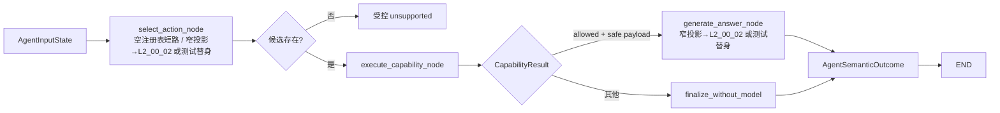

# [L2_00_01] 单体 Agent 核心执行与能力注册详细设计 L2

> 文档层级：L2
> 文档状态：Approved

## 1. 文档信息

| 项目 | 内容 |
|---|---|
| 文档名称 | 单体 Agent 核心执行与能力注册详细设计 |
| 文档标识 | `SA-L2-CORE-EXECUTION-001` |
| 文档编号 | `L2_00_01` |
| 文档路径 | `docs/design/L2_00_01_SINGLE_AGENT_CORE_EXECUTION_CAPABILITY_REGISTRATION_DETAILED_DESIGN.md` |
| 文档层级 | L2 详细设计 |
| 文档状态 | Approved |
| 评审状态 | v0.3 五轮已通过；v0.4 原始问题上下文补正针对性复评已通过；`L2_02_00` v0.4 Core JSON 边界定向检查符合，未发现新的 S0/S1/S2 |
| 当前版本 | v0.4 |
| 日期 | 2026-07-25 |
| 适用范围 | Python `agent-runtime` 内的 LangGraph 请求状态、`agent-core` 确定性执行、`agent-capability-api`、进程内能力注册运行时、组合根及模型无关测试替身 |
| 上位文档 | [`L1_00`《单体 Agent 核心与运行架构 L1》](L1_00_SINGLE_AGENT_CORE_RUNTIME_ARCHITECTURE.md) v0.2（已评审/已通过，`CR-GATE-001` 已关闭） |
| 来源文档 | [`REQ_00`《单体 Agent 查询能力建设需求说明》](../REQ_00_SINGLE_AGENT_QUERY_REQUIREMENTS.md) v1.3；[`L0_00`《单体 Agent 查询能力 L0 总体架构设计》](L0_00_SINGLE_AGENT_ARCHITECTURE.md) v0.5 |
| 关联文档/契约 | [`L1_01` Knowledge L1](L1_01_SINGLE_AGENT_KNOWLEDGE_QUERY_ARCHITECTURE.md) v0.3；[`L1_02` 业务查询 L1](L1_02_SINGLE_AGENT_BUSINESS_QUERY_ADAPTER_ARCHITECTURE.md) v0.2；[`L2_00_00` Spring 接入与运行协同](L2_00_00_SINGLE_AGENT_SPRING_ACCESS_RUNTIME_COORDINATION_DETAILED_DESIGN.md) v0.2 Approved；[`L2_00_02` DeepSeek 模型接入与受控生成](L2_00_02_SINGLE_AGENT_DEEPSEEK_MODEL_ACCESS_CONTROLLED_GENERATION_DETAILED_DESIGN.md) v0.4 Approved；[`L2_01_00` Knowledge 查询流程与配置](L2_01_00_SINGLE_AGENT_KNOWLEDGE_QUERY_FLOW_CONFIGURATION_DETAILED_DESIGN.md) v0.2 Approved；[`L2_02_00` 业务查询公共约束、配置与出域](L2_02_00_SINGLE_AGENT_BUSINESS_QUERY_COMMON_CONSTRAINTS_CONFIGURATION_EGRESS_DETAILED_DESIGN.md) v0.4 Approved（业务 wire 私有 `ExactDecimal`，不进入本文 Core `JsonObject`，定向边界检查已通过） |
| 实现基线 | 当前工作区不存在目标 `agent-runtime`、`agent-service`、`agent-core`、`agent-capability-api` 或 Python 源码/测试工程；本机只读核实 Python 为 3.12.4 |
| 技术基线 | Python `>=3.12,<3.13`；`langgraph==1.2.9`；使用 `StateGraph`、`TypedDict` 状态和 `context_schema` 运行上下文，不配置 checkpointer 或 store |
| 是否可作为实现依据 | 否 |
| 实施依据说明 | v0.4 已评审通过，但 `CR-GATE-002` 仍为 Open，且尚未获得目标代码/测试实施授权 |
| 当前允许实施范围 | 不允许目标生产代码实施；仅允许本文评审、契约样例推演及不进入目标模块的隔离测试验证 |
| 当前禁止动作 | 新建或修改 Agent 代码、测试、配置、公共接口、外部契约；启用真实模型或真实业务/知识数据；关闭 `CR-GATE-002` 或声明实现完成 |
| 修改权限 | 本轮用户已授权定向边界检查、相关文档原子同步及 Git commit/push；代码、测试、配置、Schema 和外部契约未获修改授权 |
| 维护责任人 | 项目维护者（个人开发者，姓名未在需求中指定） |

> 本文只完成批次 1 的核心执行与能力注册详细设计。v0.3 已完成五轮独立评审—修订—复核，`REV-L2-001`～`REV-L2-009` 全部关闭；第二批 Knowledge L2 编写时发现处理器无法取得权威原始问题，v0.4 以最小方式补充 `CapabilityExecutionContext.original_question` 及同源校验，针对性复评确认该补正不让核心理解 Knowledge、不扩大模型出域且不破坏单动作/状态边界，`REV-L2-010` 已关闭。本文仍不定义 Spring→Python 传输协议、DeepSeek 供应商契约、Knowledge 流水线、Employee/Transaction 动作、领域字段出域策略或生产级韧性机制，也不表示任何实现、集成或生效状态已经改变。

## 2. 修改历史

| 序号 | 日期 | 位置 | 修改原因 | 修改内容 |
|---:|---|---|---|---|
| 1 | 2026-07-25 | 全文 | 执行 L2 编写批次 1 | 新建核心执行与能力注册 Draft，固化公共契约、请求状态、单动作闸门、启动冻结注册、组合根、实现落点、测试追踪和阶段门禁 |
| 2 | 2026-07-25 | 4、7～11、13～16、18～21 | 三轮作者自检与严格校验 | 补齐强类型输入绑定、运行上下文与 state 隔离、取消竞态、出域拒绝分支、失败/输出契约、当前图无语义重试及实现追踪；修复全部校验错误和告警 |
| 3 | 2026-07-25 | 3.5～3.6、7、15～16、19～21 | 对齐最新版详细设计技能的实现就绪细节要求 | 在不穷举普通私有辅助方法的前提下，补齐适用实施剖面、Python 公共类型位置、边界关键函数签名、入参/出参、同步/异步、错误转换、状态副作用、直接消费者以及测试/验证前置和充分性 |
| 4 | 2026-07-25 | 9.4、11.2、15.3、16.2、18.2 | 第 1 轮独立评审修复 | 增加空注册表的 selector 零调用短路；把模型无关核心切片实施门禁与 L2_00_00 双进程联调前提拆开，关闭 `REV-L2-001/002` |
| 5 | 2026-07-25 | 8.5～8.7、10.2～10.3、11.1、15～16 | 第 2 轮独立评审修复 | 固定取消/截止时间竞态优先级和 runtime cancel latch 终态；补齐全部合法结果组合的最终映射，关闭 `REV-L2-003/004` |
| 6 | 2026-07-25 | 7.1、8.1、11、15～16 | 第 3 轮独立评审修复 | 将模型 Protocol 输出收窄为候选/答案/有限失败决定，wrapper 独占 graph state update 与确定性状态映射，关闭 `REV-L2-005` |
| 7 | 2026-07-25 | 8.7、11.1、14.2～14.3、15～16 | 第 4 轮独立评审修复 | 删除公共失败自由文本；固定安全诊断指纹输入并补充敏感异常测试，关闭 `REV-L2-006/007` |
| 8 | 2026-07-25 | 4.2、8.3、10.1、11.1、15～16、18～21 | 第 5 轮独立评审修复及状态同步 | 明确 latch 是唯一一次执行权威；去除模型失败冗余 code 并固定 claim 前后 ID 锚定；完成追踪复核、v0.3 Approved 状态和直接索引同步，关闭 `REV-L2-008/009` |
| 9 | 2026-07-25 | 1～4、8.1、8.5、10.1、11.1、15～21 | 第二批 Knowledge L2 发现直接契约缺口并获授权原子同步 | 增加只读 `original_question`、图输入同源校验及对应实现/测试追踪；不改变外部 HTTP、候选参数或领域职责；版本升为 v0.4、状态回到 In Review，并新增待针对性复评项 `REV-L2-010` |
| 10 | 2026-07-25 | 1～2、5.1、16.3、18.3、21 | 第二批 L2 原子状态同步 | 将已建立的四份第二批 L2 从规划引用更新为 v0.1 Draft 只读依赖，并把后续动作收敛为独立评审；修正文案与本轮实际同步范围，不改变 v0.4 契约或评审状态 |
| 11 | 2026-07-25 | 1～2、16.3、18～21 | v0.4 原始问题补正针对性独立复评 | 复核确认只读原始问题及精确同源闸门未引入 Knowledge 分支、未扩大模型出域且未破坏单动作/状态隔离；关闭 `REV-L2-010`，状态恢复 Approved；`CR-GATE-002` 仍保持 Open |
| 12 | 2026-07-25 | 1、5.1 | 第二批 L2 终审状态原子同步 | 同步四份第二批 L2 的最终 Approved 版本；仅更新只读关联元数据，不改变核心契约、评审结论或开放门禁 |
| 13 | 2026-07-31 | 1、5.1 | 第三批 L2 终审原子同步 | 同步 `REQ_00` v1.3、`L0_00` v0.5、`L1_01` v0.3 与 `L2_02_00` v0.3 当前引用；核对两级检索映射和业务 codec 请求关联均不改变核心能力 API、执行上下文或本文 v0.4 评审结论 |
| 14 | 2026-08-01 | 1、5.1 | `L2_02_00` v0.4 精确十进制修订原子同步 | 明确 `ExactDecimal/BusinessWireJsonObject` 只属于业务传输私有契约，Core `JsonObject` 仍禁止 Decimal/自定义对象；不改变本文 v0.4 Approved 状态、能力 API 或执行语义 |
| 15 | 2026-08-01 | 1、18～21章 | 公共 v0.4 Core JSON 边界定向检查 | 确认精确十进制只在 validator 后的私有 `TInput` 和业务 wire 内存在，Core 候选、状态、结果和模型载荷仍使用原 `JsonObject` 白名单；未发现新的 S0/S1/S2，保持 v0.4 Approved |

## 3. 背景、目标与范围

### 3.1 背景与问题

L1_00 已确认 LangGraph 是唯一 Agent 编排权威，`agent-core` 只承担确定性执行约束，并通过稳定能力 API 和启动期冻结的进程内注册表连接 Knowledge、Employee、Transaction。当前工作区尚无目标 Python 实现，若直接进入能力开发，三个能力容易分别定义动作描述、执行上下文、结果状态、注册方式或模型载荷，最终造成核心业务分支、状态分裂和跨能力契约漂移。

本设计先固定模型无关的最小公共核心，使后续 L2 可以依赖同一语义，同时不强制不同能力采用相同内部结构。

### 3.2 目标与验收行为

| 需求编号 | 目标或用户可观察行为 | 验收标准 | 来源 |
|---|---|---|---|
| `REQ-CORE-001` | 每个请求最多执行一个已注册且启用的查询动作 | 非法候选可在能力调用前被拒绝；首个合法动作一旦提交，任意第二次提交均被拒绝，处理器调用总数不超过 1 | REQ_00 FR-01/FR-06；L1_00 `SA-C-002` |
| `REQ-CORE-002` | 能力集合在启动期显式注册、校验并冻结 | 重复 ID、非法描述、版本不匹配、启用但缺少处理器等情况阻止就绪；冻结后不能增删替换 | REQ_00 CFG-01/04；L1_00 `CR-AD-003/007` |
| `REQ-CORE-003` | 三类查询能力使用同一公共执行契约，但内部形态可以不同 | 独立 Capability→Port←Adapter 和 Adapter 直接实现处理器两种测试替身均可注册、执行和替换 | REQ_00 EXT-01/02；L1_00 `CR-AD-008` |
| `REQ-CORE-004` | 公共结果保持状态、领域结果、模型出域判定和模型安全载荷相互分离 | 核心不能从领域结果生成或扩大模型载荷；非法组合转换为 `internal_failure` 且原始载荷不外泄 | L1_00 7.3；L1_01/02 公共契约对齐 |
| `REQ-CORE-005` | LangGraph 请求状态、用户执行上下文、截止时间和取消语义有唯一所有者 | 状态只在当前请求内存在，不启用持久化；取消或超时后不再安排新调用，迟到结果不进入最终状态 | L1_00 `CR-AD-002/004/006` |
| `REQ-CORE-006` | 新增能力不侵入核心和已有能力 | 新增模拟能力只增加处理器、配置提供方、组合根装配和测试；核心包无领域导入或条件分支 | REQ_00 EXT-01/02/03 |
| `REQ-CORE-007` | 参数、状态和执行失败具有稳定、可观测且不泄密的语义 | `unsupported`、`invalid_argument`、`timeout`、`internal_failure` 等可区分；日志不含完整 JWT、问题、领域结果或模型载荷 | REQ_00 异常与最小日志要求 |
| `REQ-CORE-008` | 公共结构有界且配置错误失败关闭 | 能力数、描述、问题、参数、领域结果、安全载荷和嵌套深度均有启动或运行边界；越界不调用下游或模型 | L1_00 10.3、11 |
| `REQ-CORE-009` | 领域处理器可取得与图输入同源、未经模型改写的原始问题 | Runtime 在请求开始时把同一已校验问题写入图输入与不可变执行上下文；两者不一致时模型和 handler 调用均为零 | REQ_00 FR-02；L1_01 7.1～7.2 |

### 3.3 范围内

- `agent-capability-api` 的 Python 内部类型、枚举、协议和不变量。
- 代码绑定能力描述、参数校验器、异步处理器和注册候选。
- 能力注册构建、启动校验、冻结、快照标识、只读描述列表和处理器查找。
- `agent-core` 的上下文校验、候选校验、单动作闸门、处理器调用、截止时间、取消、结果约束和异常转换。
- LangGraph 的核心请求状态字段、输入/内部/输出 Schema、能力执行节点及模型节点协作边界。
- 显式组合根、强类型核心限制配置和模型无关测试替身。
- 并发、无持久化、无重放、日志脱敏、回滚和测试追踪。

### 3.4 范围外

- Spring `agent-service`、外部 HTTP API、JWT 验签和 Spring→Python 传输 DTO；归 `L2_00_00`。
- DeepSeek 请求/响应、问题最小化、动作选择 Provider、回答生成、模型重试和真实模型 PoC；归 `L2_00_02`。
- Knowledge 的问题改写、逻辑域、检索、BGE、证据、摘要和出域策略；归 L1_01 及其 L2。
- Employee/Transaction 的精确动作、字段、Adapter 客户端、权限和出域策略；归 L1_02 及其 L2。
- 业务最终授权、业务 DTO、数据库、业务域 ES 和外部服务契约。
- 动态插件、热更新、Multi-Agent、工作流、跨域聚合、写入、持久记忆、LangGraph checkpoint/store。
- 生产级重试、熔断、缓存降级、分布式注册中心、复杂审计和 HA。

### 3.5 适用技术剖面

| 剖面 | 适用性 | 说明 |
|---|---|---|
| Python | 适用 | 核心、注册、LangGraph 状态、组合根和测试均为新增 Python 模块 |
| 内部代码契约 | 适用 | 能力 API 是同进程稳定代码契约，不是 HTTP/RPC 服务 |
| 配置 | 适用 | 仅核心资源限制和能力启用快照；启动校验、运行只读、重启生效 |
| 状态与并发 | 适用 | 请求级 LangGraph 状态、一次性动作闸门及并发提交保护 |
| 安全与审计 | 适用 | 原始用户 JWT 受控传递、模型载荷隔离和最小安全日志 |
| Java/API | 不适用 | 本文不修改 Java 或跨进程传输契约 |
| 工程脚本 | 不适用 | 本文不新增产品运行脚本；文档校验脚本属于外部作者工具，服务启动入口归 `L2_00_00` |
| 测试 | 适用 | 建议新增 Python 单元、契约、架构和模型无关集成测试 |
| 数据库/索引/缓存/消息 | 不适用 | 核心不持久化、不写业务数据，也不新增基础设施 |
| 前端 | 不适用 | 无用户界面和前端字段契约 |

### 3.6 完成判定

本文达到“可进入独立正式评审”的条件为：

1. 所有范围内需求和上位约束均追踪到设计规则、实现落点、测试和验证。
2. 公共契约字段、空值、枚举、错误、版本和兼容性语义明确。
3. 单动作闸门的校验顺序、并发行为、失败后状态和迟到结果处理明确。
4. 两种处理器形态能够通过同一契约验证，且核心不按形态或领域分支。
5. 注册、冻结、空注册表、禁用、重复和版本冲突行为明确。
6. 领域结果与模型安全载荷的合法组合、大小边界和失败关闭明确。
7. 所有实施路径标记为“建议新增”，没有把不存在的实现描述为事实。
8. 公共/共享类型和边界关键函数具有建议路径、签名、入参/出参、异步、错误、状态副作用及直接消费者；普通私有辅助方法不被无必要固化。
9. 内部自检无遗留 Blocker/Major，严格文档校验通过。

## 4. 上位约束与追踪关系

### 4.1 上位与同层约束

| 约束编号 | 上位文档/契约位置 | 约束内容 | 本设计落实方式 | 偏离情况 |
|---|---|---|---|---|
| `CON-CORE-001` | L1_00 `CR-AD-002`、6.2 | LangGraph 唯一编排；核心不得形成第二状态机或语义重试 | `DR-CORE-001/002/008` | 无 |
| `CON-CORE-002` | L1_00 `SA-C-002/019` | 一个请求最多执行一个 Agent 动作；Knowledge 内部零到多次出站仍是一个动作 | `DR-CORE-002/007/009` | 无 |
| `CON-CORE-003` | L1_00 `CR-AD-003` | 使用稳定能力 API 和启动冻结的进程内注册表，不采用核心业务分支或动态插件 | `DR-CORE-003/006/010` | 无 |
| `CON-CORE-004` | L1_00 `CR-AD-006`、8 | 请求状态不持久化，不建立 checkpoint、store、会话或恢复续跑 | `DR-CORE-008/009` | 无 |
| `CON-CORE-005` | L1_00 7.3、L1_01/02 4.3 | 公共状态、领域结果、出域判定和模型安全载荷必须分离 | `DR-CORE-005/011` | 无 |
| `CON-CORE-006` | L1_00 `CR-AD-008` | 能力 API 注册统一处理器，但不强制统一内部 Capability/Port/Adapter 形态 | `DR-CORE-007/010` | 无 |
| `CON-CORE-007` | L1_00 `CR-AD-007` | 配置启动校验、运行只读、重启生效 | `DR-CORE-006/010/011` | 无 |
| `CON-CORE-008` | L1_00 `SA-C-007/011` | 原始用户 JWT 只受控传递；缺失身份失败关闭；敏感值不入日志 | `DR-CORE-004/012` | 无 |
| `CON-CORE-009` | L1_00 `CR-AD-004`、9.3、10.1 | 消费绝对截止时间和取消，不自动重放、重试或跨能力降级 | `DR-CORE-004/009/011` | 无 |
| `CON-CORE-010` | L1_00 6.4、10.7 | 核心只依赖能力 API/注册表；组合根是唯一了解具体实现集合的位置 | `DR-CORE-003/010/013` | 无 |
| `CON-CORE-011` | L1_01/02 公共契约对齐 | Knowledge/业务能力拥有领域校验、结果语义和出域策略，核心只验证公共不变量 | `DR-CORE-005/007` | 无 |
| `CON-CORE-012` | L1_00 14.1 | `CR-GATE-001` 仅允许 L2 编写；代码实施仍受 `CR-GATE-002` 控制 | `DR-CORE-013` | 无 |
| `CON-CORE-013` | L1_01 7.1～7.2 | Knowledge 必须关联原始问题与受控改写，不能把模型回填文本当作原始问题权威 | `DR-CORE-004/014` | 无 |

### 4.2 端到端追踪矩阵

| REQ/CON | 适用阶段/模块切片 | 设计规则 | 责任主体 | 契约/数据/状态影响 | 实现落点 | 测试 | 验证 |
|---|---|---|---|---|---|---|---|
| `REQ-CORE-001` | P3 核心执行 | `DR-CORE-001/002/008` | LangGraph、执行核心 | 请求级一次性动作提交 | `IMPL-CORE-004/005/006` | `TEST-CORE-003/004/005` | `VAL-CORE-002/003` |
| `REQ-CORE-002` | 启动与注册 | `DR-CORE-003/006/010` | 注册表、组合根 | 进程级不可变注册快照 | `IMPL-CORE-002/003/007` | `TEST-CORE-001/002` | `VAL-CORE-002/003` |
| `REQ-CORE-003` | 能力接入 | `DR-CORE-003/004/005/007` | 能力 API、处理器 | 统一内部契约 | `IMPL-CORE-002/003/004` | `TEST-CORE-001/006` | `VAL-CORE-002/003` |
| `REQ-CORE-004` | 结果约束 | `DR-CORE-005/011` | 能力、执行核心 | 领域结果/安全载荷隔离 | `IMPL-CORE-002/004` | `TEST-CORE-001/003` | `VAL-CORE-002` |
| `REQ-CORE-005` | 请求状态 | `DR-CORE-001/004/008/009` | LangGraph、执行核心 | 请求级短生命周期状态 | `IMPL-CORE-004`、`IMPL-CORE-005`、`IMPL-CORE-006`、`IMPL-CORE-009` | `TEST-CORE-003/004/005/009` | `VAL-CORE-002/003` |
| `REQ-CORE-006` | 扩展验证 | `DR-CORE-007/010/013` | 能力提供方、组合根 | 只增加装配，不修改核心 | `IMPL-CORE-003/007` | `TEST-CORE-006/007/009` | `VAL-CORE-003`、`VAL-CORE-005` |
| `REQ-CORE-007` | 失败与观测 | `DR-CORE-009/012` | 执行核心、图节点 | 稳定状态和安全事件 | `IMPL-CORE-004/006` | `TEST-CORE-003/005/008` | `VAL-CORE-002/003` |
| `REQ-CORE-008` | 资源边界 | `DR-CORE-006`、`DR-CORE-010`、`DR-CORE-011`、`DR-CORE-013` | 设置、注册表、执行核心 | 有界描述/参数/结果 | `IMPL-CORE-001/003/008` | `TEST-CORE-002/008` | `VAL-CORE-002`、`VAL-CORE-004` |
| `REQ-CORE-009` | 原始问题同源 | `DR-CORE-004`、`DR-CORE-014` | Runtime、执行上下文 | 图输入/处理器上下文共享同一已校验值 | `IMPL-CORE-002/009` | `TEST-CORE-001/005/010` | `VAL-CORE-002/003/005` |
| `CON-CORE-001` | 核心图 | `DR-CORE-001/002/008` | LangGraph、执行核心 | 单一图状态和确定性闸门 | `IMPL-CORE-004/005/006` | `TEST-CORE-004/005` | `VAL-CORE-003` |
| `CON-CORE-002` | 能力调用 | `DR-CORE-002/007/009` | 执行核心、处理器 | 一次 Agent 动作/多次内部出站 | `IMPL-CORE-004` | `TEST-CORE-004/006` | `VAL-CORE-002/003` |
| `CON-CORE-003` | 能力 API/注册 | `DR-CORE-003/006/010` | 注册表、组合根 | 显式代码绑定注册 | `IMPL-CORE-002/003/007` | `TEST-CORE-001/002/007` | `VAL-CORE-002/005` |
| `CON-CORE-004` | 请求生命周期 | `DR-CORE-008/009` | LangGraph、执行核心 | 无持久化、无恢复续跑 | `IMPL-CORE-005/007` | `TEST-CORE-005/009` | `VAL-CORE-003/005` |
| `CON-CORE-005` | 结果契约 | `DR-CORE-005/011` | 能力 API、核心 | 公共结果不变量 | `IMPL-CORE-002/004` | `TEST-CORE-001/003/008` | `VAL-CORE-002` |
| `CON-CORE-006` | 处理器形态 | `DR-CORE-007/010` | 处理器、组合根 | 同一注册契约、不同内部结构 | `IMPL-CORE-002/007` | `TEST-CORE-006/007` | `VAL-CORE-003/005` |
| `CON-CORE-007` | 启动配置 | `DR-CORE-006/010/011` | 设置、注册表、组合根 | 启动快照、运行只读 | `IMPL-CORE-003/007/008` | `TEST-CORE-002/008` | `VAL-CORE-002/004` |
| `CON-CORE-008` | 安全上下文 | `DR-CORE-004`、`DR-CORE-012` | 执行上下文、日志边界 | JWT 受控透传、不泄密 | `IMPL-CORE-002/004/006` | `TEST-CORE-003/008` | `VAL-CORE-002/003` |
| `CON-CORE-009` | 超时/取消 | `DR-CORE-004/009/011` | 执行核心 | 绝对截止时间、无重放 | `IMPL-CORE-004/006/008` | `TEST-CORE-003/004/005` | `VAL-CORE-002/003` |
| `CON-CORE-010` | 依赖方向 | `DR-CORE-003`、`DR-CORE-010`、`DR-CORE-013` | 核心、组合根 | 无领域反向依赖 | `IMPL-CORE-002/003/004/007` | `TEST-CORE-007/009` | `VAL-CORE-003/005` |
| `CON-CORE-011` | 同层分权 | `DR-CORE-005/007` | 核心、领域能力 | 核心不拥有领域策略 | `IMPL-CORE-002/004` | `TEST-CORE-001/006` | `VAL-CORE-003` |
| `CON-CORE-012` | P2→P3 门禁 | `DR-CORE-013` | 项目维护者 | 文档状态与实施授权分离 | `IMPL-CORE-001/007` | `TEST-CORE-009` | `VAL-CORE-001`、`VAL-CORE-005` |
| `CON-CORE-013` | Knowledge 原始问题 | `DR-CORE-004`、`DR-CORE-014` | Runtime、能力 API | 原问题不由模型候选重建 | `IMPL-CORE-002/009` | `TEST-CORE-005/010` | `VAL-CORE-003/005` |

## 5. 关联资源与责任边界

### 5.1 资源分类

| 资源 | 角色 | 本文职责 | 对方职责 | 交互契约 | 数据/状态所有权 | 修改权限 |
|---|---|---|---|---|---|---|
| REQ_00 v1.3 | parent | 落实单动作、统一注册、扩展、错误和测试要求 | 定义已确认需求 | 需求约束 | 需求权威 | 只读 |
| L0_00 v0.5 | parent | 不弱化单体 Agent、LangGraph 权威和失败关闭 | 定义总体架构 | `SA-C-*`、`SA-AD-*` | 架构权威 | 只读 |
| L1_00 v0.2 | parent | 细化 L2_00_01 唯一范围 | 定义核心运行模块边界和门禁 | `CR-AD-*`、统一状态 | 直接上位权威 | 只读 |
| L1_01 v0.3 | peer | 提供公共能力契约，供 Knowledge 未来实现 | 拥有 Knowledge 流程、领域结果和出域策略 | `knowledge.query` 处理器 | Knowledge 状态/配置 | 只读 |
| L1_02 v0.2 | peer | 提供公共能力契约，供业务 Adapter 未来实现 | 拥有业务动作、领域结果、权限和出域策略 | 业务动作处理器 | 业务动作/配置 | 只读 |
| `L2_00_00` v0.2 Approved | peer | 定义 Python 内部执行上下文的消费语义 | 定义 Spring→Python 传输、JWT 验证、截止时间换算和外部映射 | `ExecutionContext` 构造边界 | 跨进程接入状态 | 只读 |
| `L2_00_02` v0.4 Approved | peer | 提供模型节点读取/写入的核心状态字段和安全调用前提 | 定义模型端口、候选动作、输入闸门和回答生成 | `ActionCandidate`、安全载荷 | 模型调用状态 | 只读 |
| `L2_01_00` v0.2 Approved | peer/consumer | 提供公共能力执行上下文和结果契约 | 定义 Knowledge 单动作流程、配置和阶段端口 | `CapabilityExecutionContext.original_question`、`CapabilityResult` | Knowledge 请求级状态 | 只读 |
| `L2_02_00` v0.4 Approved | peer/consumer | 提供公共能力契约和 JWT wrapper | 定义业务查询公共约束、配置、出域及 business wire 私有精确十进制；不得把其类型写回 Core JSON | `OpaqueUserToken`、`CapabilityResult`、safe payload；`ExactDecimal` 不跨入本文契约 | 业务查询公共状态 | 只读；Core JSON 边界定向检查通过 |
| 当前仓库代码 | implementation_baseline | 仅证明目标 Python 模块不存在 | 现有 Java 业务/基础设施继续独立演进 | 无目标调用链 | 现有系统所有者 | 只读 |
| Python 3.12.4 本机环境 | implementation_baseline | 作为首期 Python 运行基线 | 不证明部署或依赖已安装 | CPython | 本地工具环境 | 只读 |
| LangGraph 官方包与文档 | external_contract | 固定 `langgraph==1.2.9`，使用 `StateGraph`、`TypedDict`、`context_schema` 和无 checkpointer/store 编译 | 提供框架行为 | Python 库 API | 框架实现 | 外部只读 |

LangGraph 版本和 Python 支持依据当前 [PyPI 项目页](https://pypi.org/project/langgraph/)；`StateGraph`、`TypedDict` 及输入/输出 Schema 依据 [官方 Graph API](https://docs.langchain.com/oss/python/langgraph/graph-api)；运行上下文使用官方 [`StateGraph.context_schema`/`Runtime`](https://reference.langchain.com/python/langgraph/graph/state/StateGraph)；checkpointer/store 的持久化语义依据 [官方 Persistence 文档](https://docs.langchain.com/oss/python/langgraph/persistence)。

### 5.2 唯一责任边界

| 主体 | 唯一负责 | 明确不负责 |
|---|---|---|
| LangGraph | 请求状态、节点顺序、模型调用时机、语义澄清、降级和终止 | 注册校验、领域参数校验、业务授权 |
| `agent-core` | 上下文/候选公共校验、注册查找、一次性动作闸门、调用时限和公共结果约束 | 动作选择、领域规则、Prompt、字段出域决策 |
| `agent-capability-api` | 公共类型、枚举、处理器/校验器协议和跨能力不变量 | 业务 DTO、URL、角色、供应商字段 |
| 能力注册运行时 | 启动注册、校验、冻结、快照和只读查找 | 动态发现、域内配置、处理器调用、热更新 |
| 具体能力处理器 | 领域参数验证、零到多次内部出站、领域结果和出域判定 | 图状态、第二动作、公共状态改义 |
| 组合根 | 创建具体对象、收集注册候选、冻结注册表、构建图 | 请求期业务调用、动态插件加载 |

## 6. 当前实现基线与最小变更方案

### 6.1 已核实当前实现

| 事实编号 | 当前事实 | 证据 | 设计含义 |
|---|---|---|---|
| `FACT-CORE-001` | 工作区不存在 `agent-runtime`、`agent-service`、`agent-core`、`agent-capability-api` 目录 | 2026-07-25 路径核实 | 全部实现落点必须标记为建议新增 |
| `FACT-CORE-002` | 工作区目标范围内没有 Python 源码、Python 项目清单或 Python 测试 | 2026-07-25 文件扫描 | 不能复用不存在的 Python 分层或测试约定 |
| `FACT-CORE-003` | 当前本机 `python --version` 为 3.12.4 | 2026-07-25 只读命令 | 首期按 Python 3.12 固定，减少多版本验证 |
| `FACT-CORE-004` | PyPI 当前稳定 LangGraph 为 1.2.9，支持 Python 3.12 | 2026-07-25 外部权威核实 | Python 项目清单固定精确版本，避免 Graph API 漂移 |
| `FACT-CORE-005` | 现有 Java 业务服务和历史实验代码不构成目标 Agent 核心 | L1_00 5.1、替代关系 | 不从 Java/历史 Agent 复制核心边界或 DTO |

### 6.2 当前问题与设计根因

- 当前没有公共能力类型和注册入口，后续三个能力可能产生互不兼容的请求/结果。
- 若只依赖 LangGraph 图结构约束单动作，意外循环、并发边或未来节点修改仍可能重复调用处理器。
- 若注册表运行时可写，配置热变更或动态加载会使模型看到的能力集合与实际执行集合不一致。
- 若核心接收任意对象或原始 JSON，业务 DTO、供应商字段和敏感数据会渗入公共契约。
- 若领域结果与模型载荷共用字段，核心或模型节点可能绕过领域出域策略。
- 若通过扫描、反射或插件入口注册，为个人项目引入的复杂度和安全面超过当前收益。

### 6.3 最小变更方案

| 变更项 | 必要性 | 复用内容 | 新增/修改原因 | 不采用的方案及原因 |
|---|---|---|---|---|
| 新建单一 `agent-runtime` Python 工程 | 承载 LangGraph 和同进程能力模块 | 本机 Python 3.12 | 当前无目标 Python 工程 | 不拆多个 Python 服务，避免违反单体边界 |
| 新建窄能力 API | 三类能力共同接入 | L1 统一状态和执行上下文语义 | 当前无公共契约 | 不使用任意字典/动态方法名，避免协议漂移 |
| 新建冻结注册表 | 有限发现、重复校验和执行查找 | Python 不可变数据结构 | 当前无注册机制 | 不使用插件扫描/远程注册中心，避免过度设计 |
| 新建一次性动作闸门 | 防图循环和并发重复调用 | `asyncio.Lock` | 仅靠图拓扑不足以形成确定性保护 | 不新增完整核心状态机，只保留请求级 latch |
| 使用 LangGraph `TypedDict` state 和 `context_schema` | 明确唯一图状态并隔离运行依赖 | LangGraph 1.2.9 | 当前无图 | 不把 token/scope 放入共享 state；不引入 Pydantic 状态和额外运行开销 |
| 显式组合根 | 新能力不侵入核心 | 代码绑定 provider 列表 | 当前无装配入口 | 不使用反射、entry point 或动态 import |
| 使用测试替身验证两种处理器形态 | 提前证明扩展缝隙 | pytest | 真实能力 L2 尚未实施 | 不创建临时生产 Capability/Adapter 层 |

## 7. 职责、分层与依赖设计

### 7.1 责任分解

| 组件/类型 | 状态 | 唯一职责 | 明确不负责 | 变化原因 | 输入/输出 |
|---|---|---|---|---|---|
| `CapabilityDescriptor` | 建议新增 | 描述稳定能力 ID、模型可见最小语义和参数 Schema | 处理器、URL、领域配置、供应商字段 | 公共能力描述变化 | 代码绑定不可变描述 |
| `CapabilityArgumentValidator[TInput]` | 建议新增 | 将候选 JSON 校验并解析为能力代码定义的不可变强类型输入 | 动作选择、下游调用 | 领域输入约束变化 | 原始参数→`TInput` 或失败 |
| `CapabilityHandler[TInput]` | 建议新增 | 异步执行一个已提交查询动作 | 图推进、第二动作、核心注册 | 能力业务语义变化 | `TInput`+上下文→公共结果 |
| `CapabilityRegistrationCandidate[TInput]` | 建议新增 | 将描述、启用状态、同类型校验器和处理器代码绑定 | 动态实例化、配置脚本 | 启动装配变化 | 单个注册候选 |
| `CapabilityRegistryBuilder` | 建议新增 | 收集候选、执行全量校验、生成冻结快照 | 请求期查找、处理器调用 | 注册规则变化 | 候选集合→冻结注册表 |
| `FrozenCapabilityRegistry` | 建议新增 | 提供有序描述快照和按 ID 只读查找 | 运行期写入、热更新 | 可执行集合变化仅发生在重启 | ID→已注册能力 |
| `RequestExecutionScope` | 建议新增 | 保存受控执行上下文和一次性动作 latch | 图阶段状态、领域状态 | 单请求创建/释放 | 上下文+claim/finish |
| `CapabilityExecutionCore` | 建议新增 | 按固定顺序校验、claim、调用并约束结果 | 推理、领域策略、语义重试 | 公共执行规则变化 | 候选+scope→公共结果 |
| `AgentInputState`/`AgentRequestState`/`AgentOutputState` | 建议新增 | 定义 LangGraph 输入、内部和输出字段 | 身份上下文、持久化、领域流水线状态 | 图公共状态变化 | 请求状态 |
| `GraphRunContext` | 建议新增 | 通过 LangGraph `context_schema` 向唯一能力执行节点提供请求执行 scope | 图业务字段、模型输入、持久状态 | 运行依赖变化 | 调用期上下文 |
| `ActionSelectionNode`/`AnswerGenerationNode` | 建议新增 | 定义核心图面对模型 L2 的窄异步 Protocol，只返回候选/答案/有限失败决定 | graph state update、最终 status、capability ID、用户结果、Provider DTO、Prompt、模型重试和领域出域策略 | 图与模型 L2 边界变化 | 窄输入→窄决定 |
| `select_action_node`/`generate_answer_node` | 建议新增 | 从共享 state 确定性投影窄输入、调用注入 Protocol，并由 wrapper 独占 graph update 与最终状态映射 | 供应商调用、核心执行、领域结果解释 | 模型节点输入投影或确定性映射变化 | state→窄输入→窄决定→state update |
| `execute_capability_node` | 建议新增 | 从图状态调用核心并写入唯一能力结果 | 选择动作、回答生成 | 图与核心协作变化 | state→state update |
| `route_after_capability`/`finalize_without_model` | 建议新增 | 按公共 result/egress 确定路由并生成固定非模型终态 | 领域出域判定、模型生成和 HTTP 映射 | 公共结果分支变化 | state→路由/终态 update |
| `CoreRuntimeSettings` | 建议新增 | 提供核心资源边界和启动校验 | 域内配置、服务地址、模型配置 | 本地容量边界变化 | 强类型不可变设置 |
| `RuntimeCompositionRoot` | 建议新增 | 显式装配设置、注册候选、注册表、核心和图 | 请求期调用、动态发现 | 具体实现集合变化 | 依赖→运行时对象图 |
| `AgentRuntimeInvoker` | 建议新增 | 校验 Python 入口问题和上下文，并通过 `context=` 调用已编译图 | Spring 协议、模型输入最小化、图内编排 | 运行入口契约变化 | question+scope→`AgentSemanticOutcome` |

### 7.2 允许依赖方向

```text
agent_runtime.runtime
  → agent_runtime.graph + agent_runtime.capability_api.contracts

agent_runtime.graph
  → agent_runtime.core.execution
      → agent_runtime.core.registry
          → agent_runtime.capability_api.contracts
      → agent_runtime.capability_api.contracts

Knowledge Capability / Employee Adapter / Transaction Adapter
  → agent_runtime.capability_api.contracts

L2_00_02 model node implementation
  → agent_runtime.graph narrow node Protocol/state types
  → model port/provider implementation

agent_runtime.bootstrap
  → graph + core + registry + 具体注册候选
```

依赖规则：

1. `capability_api` 不得依赖 LangGraph、核心、具体能力、外部客户端或配置框架。
2. `core` 不得导入 `knowledge`、`employee`、`transaction`、DeepSeek SDK 或业务客户端。
3. `graph` 可以依赖核心、公共契约和自身窄 node Protocol；模型实现由组合根注入，`graph` 不得导入 DeepSeek SDK/Provider、直接查注册表或调用具体处理器。
4. 具体能力只依赖能力 API及其领域 Port/客户端，不得依赖 `agent-core` 或 LangGraph。
5. 组合根是唯一允许同时依赖抽象和具体实现的模块。
6. `AgentRuntimeInvoker` 只依赖编译图、公共输入/输出和核心设置，不得解析 Spring 传输 DTO 或调用具体能力。
7. 禁止循环依赖、Service Locator、全局可变注册表、运行期 import 和按能力名称分支。

### 7.3 内聚与耦合判断

- 能力公共类型聚合在 `capability_api`，因为它们只因跨能力执行语义变化而改变。
- 注册和执行分开：注册表只拥有进程级不可变集合，执行核心只拥有请求级确定性调用；二者生命周期和变化原因不同。
- 一次性 latch 放入请求执行 scope，并通过 LangGraph 运行上下文而非图 state 传递，既能抵抗并发重复提交，又不形成持久或跨请求状态机。
- 领域参数校验器与同类型处理器由同一个泛型注册候选代码绑定；冻结注册项在内部擦除具体类型，核心只持有 opaque 已校验调用，不理解或转换业务 DTO。
- 组合根显式列出 provider，新增能力需要一次可审计装配变更，但不修改核心业务逻辑；这是当前最小且安全的扩展方式。

## 8. 公共能力契约设计

### 8.1 设计规则目录

| 规则编号 | 规则 | 责任主体 | 触发条件 | 输出/状态效果 |
|---|---|---|---|---|
| `DR-CORE-001` | LangGraph wrapper 是唯一请求流程和 state update 权威；核心函数不返回下一节点或图命令，注入的模型 Protocol 不返回 graph update 或最终 outcome | LangGraph、执行核心 | 每次请求 | 防止第二编排和模型层改写确定性状态 |
| `DR-CORE-002` | 仅首个通过上下文、候选、注册和参数校验的动作可以原子 claim；claim 后任意第二次提交均拒绝 | `RequestExecutionScope` | 核心执行 | 处理器调用次数≤1 |
| `DR-CORE-003` | 能力通过版本化、供应商无关的公共契约和显式注册候选接入 | 能力 API | 启动/执行 | 核心不含领域分支 |
| `DR-CORE-004` | 执行上下文只包含同源原始问题、受控主体、opaque 用户 JWT、关联标识、单调截止时间和取消信号，并通过 LangGraph 运行上下文而非 state 传递 | 能力 API、运行入口 | 请求创建 | 原问题/身份/预算不被处理器改写或持久化 |
| `DR-CORE-005` | 公共结果严格校验状态、领域结果、失败详情、出域判定和安全载荷组合；核心不得推导领域策略 | 能力 API、执行核心 | 处理器返回 | 非法结果失败关闭 |
| `DR-CORE-006` | 注册候选全量校验后一次冻结；描述列表有序、处理器只由核心查找、运行期不可写 | 注册表 | 启动 | 模型可见集合与执行集合一致 |
| `DR-CORE-007` | 注册表只识别 `CapabilityHandler`，不识别独立 Capability 或直接 Adapter 的内部形态 | 能力 API、注册表 | 注册/执行 | 两种形态等价接入 |
| `DR-CORE-008` | LangGraph 使用显式 input/internal/output Schema 和 `context_schema`；身份 scope 仅在运行上下文中，不配置 checkpointer/store | 图状态、组合根 | 图构建 | 单请求短生命周期且敏感上下文不入 state |
| `DR-CORE-009` | 核心不重试、不换动作、不换身份；超时/取消后丢弃迟到结果，未知异常转 `internal_failure` | 执行核心 | 失败/取消 | 明确终态、无隐式重放 |
| `DR-CORE-010` | 组合根显式收集 provider 并装配；禁止扫描、反射、entry point、动态 import 和运行期替换 | 组合根 | 启动 | 扩展可审计、无插件平台 |
| `DR-CORE-011` | 描述、参数、结果和安全载荷只接受有界 JSON 值；非有限数值、二进制和任意对象拒绝 | 公共契约、设置 | 注册/执行 | 控制内存和序列化 |
| `DR-CORE-012` | 日志只记录安全元数据；token wrapper 的字符串表示固定脱敏，结果正文不记录 | 全部核心模块 | 日志/异常 | 防止敏感数据泄露 |
| `DR-CORE-013` | API 破坏性变化必须提升主版本并同步全部处理器/测试；Draft 和 Open 门禁不得被当作实施授权 | 项目维护者、组合根 | 契约演进/阶段切换 | 兼容性和治理一致 |
| `DR-CORE-014` | Runtime 必须以同一个已校验字符串构造 `AgentInputState.question` 与 `CapabilityExecutionContext.original_question`；调用图前做精确相等校验，不一致固定返回 `invalid_argument/core.question_context_mismatch`，模型、validator 和 handler 调用均为零 | 运行入口、能力 API | 每次 `ainvoke` | 能力取得权威原问题且不信任模型回填 |

### 8.2 `CapabilityDescriptor`

`CapabilityDescriptor` 使用冻结 dataclass，字段如下：

| 字段 | 类型 | 必填/空值 | 约束 | 所有者 |
|---|---|---|---|---|
| `capability_id` | `str` | 必填、非空 | 规范为 `namespace.action`；小写 ASCII；正则 `[a-z][a-z0-9_-]*(\.[a-z][a-z0-9_-]*)+`；最长 80 | 具体能力代码 |
| `api_version` | `int` | 必填 | 当前只能为 `1` | 能力 API |
| `kind` | `CapabilityKind` | 必填 | 本期唯一值 `query`；未知值启动失败 | 能力 API |
| `display_name` | `str` | 必填、非空 | 1～80 字符；只用于展示，不参与执行 | 具体能力 |
| `description` | `str` | 必填、非空 | 1～512 字符；不得包含秘密、URL、物理索引或执行指令 | 具体能力 |
| `aliases` | `tuple[str, ...]` | 可为空 | 最多 8 个、单项 1～64 字符、全局不重复；仅供模型理解，不能作为可执行 ID | 具体能力/领域配置 |
| `argument_schema` | 冻结 `JsonObject` | 必填 | 顶层必须为 object；采用受控 JSON Schema 子集；序列化后受大小限制 | 具体能力代码 |

能力 ID 是唯一执行键。模型或调用方返回 alias 时，核心按未注册 ID 返回 `unsupported`，不得隐式转换，以避免别名冲突改变实际动作。

`argument_schema` 只允许以下供应商无关关键字：

- `type`、`properties`、`required`、`additionalProperties=false`
- `description`、`enum`
- `minimum`、`maximum`
- `minLength`、`maxLength`
- `minItems`、`maxItems`、`items`

禁止 `$ref`、`oneOf`、`anyOf`、`allOf`、可执行扩展、默认表达式和供应商字段。Schema 用于动作选择描述；真正的运行参数由同一注册候选绑定的 `CapabilityArgumentValidator` 再次确定性校验。Schema 与校验器的一致性由各能力契约测试负责。

### 8.3 注册与处理器协议

```text
CapabilityRegistrationCandidate[TInput]
  ├─ descriptor: CapabilityDescriptor
  ├─ enabled: bool
  ├─ argument_validator: CapabilityArgumentValidator[TInput] | None
  └─ handler: CapabilityHandler[TInput] | None
```

| 协议 | 方法语义 | 输入 | 输出 | 异常要求 |
|---|---|---|---|---|
| `CapabilityArgumentValidator[TInput]` | `validate(arguments)` | 有界 `JsonObject` | 能力代码定义的冻结 `TInput` | 仅抛出受控 `InvalidCapabilityArguments`；不得调用下游 |
| `CapabilityHandler[TInput]` | `async handle(input, context)` | 已验证强类型 `TInput`、不可变 `CapabilityExecutionContext` | `CapabilityResult` | 领域异常应先标准化；未知异常由核心兜底 |
| `CapabilityRegistrationProvider` | `registrations()` | 启动期领域配置和依赖 | 有限注册候选序列 | 不读取模型输出，不动态加载模块 |

启用候选必须同时具有同一 `TInput` 的 validator 和 handler。`TInput` 必须是对应能力代码定义的冻结 dataclass 或等价不可变值对象，不属于公共 JSON 契约，也不得包含 JWT、客户端、连接、流或可变领域实体。禁用候选可以不创建外部客户端，因此 validator/handler 可为空，但描述、启用值和全局 ID/alias 仍须校验；禁用候选不进入冻结执行集合。

注册表在冻结时把泛型配对包装为内部 `RegisteredCapability`：其 `validate(arguments)` 返回只可交回同一注册项的 opaque `ValidatedCapabilityCall`，`invoke(validated_call, context)` 再调用对应强类型 handler。核心不得读取、cast 或重新构造其中的 `TInput`；注册项必须拒绝来自其他能力或其他注册快照的 opaque call。该 call 只是私有类型绑定载体，不是可复用执行许可，也不维护第二个“已消费”状态；请求级唯一执行权威始终是 `RequestExecutionScope` 中的 latch。这样，模型侧保持供应商无关 JSON，领域入口仍保持强类型，类型擦除只发生在已绑定 validator/handler 的私有执行边界。

### 8.4 JSON 值契约

公共 JSON 值只允许：

- `None`
- `bool`
- UTF-8 `str`
- 有限 `int`
- 有限 `float`，禁止 `NaN`、`Infinity`
- 上述类型组成的有界 tuple
- key 为字符串的有界只读 mapping

禁止 `bytes`、文件、流、生成器、datetime、Decimal、客户端对象、异常对象、Pydantic/ORM 实体或任意自定义对象直接进入候选、描述和公共结果。8.3 中只在 validator 与 handler 之间存在的 `TInput` 是强类型内部值，不得回写 LangGraph state、日志或公共结果。具体能力必须把输出转换为显式 JSON 语义；核心在注册和结果边界执行深复制/冻结及 canonical JSON 字节计数，防止处理器返回后继续修改。

### 8.5 `CapabilityExecutionContext`

| 字段 | 类型 | 必填/空值 | 语义 | 安全边界 |
|---|---|---|---|---|
| `request_id` | `str` | 必填、非空 | 单次运行请求标识；1～128 个可打印 ASCII 字符 | 不作为去重键 |
| `correlation_id` | `str` | 必填、非空 | Spring 创建的跨进程关联标识；1～128 个可打印 ASCII 字符 | 可进入安全日志 |
| `original_question` | `str` | 必填、非空 | 与本次 `AgentInputState.question` 精确相同的已校验原始问题；1～`max_question_chars` 字符 | 可由能力处理器用于领域改写/追踪；不得记录、直接出域或由候选参数覆盖 |
| `subject_id` | `str` | 必填、非空 | 已认证用户主体；UTF-8 后最多 256 bytes | 日志默认哈希或省略 |
| `subject_type` | `SubjectType` | 必填 | 本期只能为 `user` | 非 user 直接 `unauthenticated` |
| `user_token` | `OpaqueUserToken` | 必填 | 非空且最多 16384 bytes 的原始用户 JWT，只供需要透传的处理器使用 | `repr/str` 固定为 `<redacted>`；仅显式 `reveal_for_outbound()` 取得值 |
| `deadline_monotonic` | `float` | 必填 | Python 入口根据上游剩余预算换算的本进程单调时钟绝对截止点 | 不跨进程反向序列化 |
| `cancellation` | `CancellationSignal` | 必填 | 请求断开、上游取消或运行时停止信号 | 只读查询，不承诺中断已发出的下游请求 |

`L2_00_00` 负责验签、跨进程字段、原始问题同源构造和截止时间换算；本文消费构造完成的上下文，并做防御性非空、类型、问题同源、取消和截止时间检查。角色声明不进入核心授权逻辑。`original_question` 是能力内部的请求事实，不是模型安全载荷；任何模型调用仍须经过 `L2_00_02` 输入/出域闸门。

`CancellationSignal` 是请求级、只读、首个来源获胜的一次性信号，至少提供同步 `is_cancelled() -> bool`、异步 `wait_cancelled() -> CancellationSource` 和稳定来源枚举 `client_disconnect/upstream_cancel/runtime_shutdown`。`wait_cancelled()` 一旦完成，此后同一 scope 的 `is_cancelled()` 必须恒为真，后续调用必须返回同一个首个来源；多个来源竞争时不得覆盖已发布来源。只有前两类映射为请求取消；`runtime_shutdown` 触发的 `CancelledError` 向运行入口传播。handler/Adapter 必须传播 `CancelledError`，不得屏蔽或转成 success；Python 取消是协作式的，核心保证取消后不接纳结果，但不承诺强制终止违反协议的阻塞代码。

`RequestExecutionScope` 在上述不可变上下文外增加私有 `ActionExecutionLatch`，但传给处理器的仍只是 `CapabilityExecutionContext`，处理器不能读取或修改 latch。

### 8.6 候选动作契约

| 字段 | 类型 | 必填/空值 | 校验顺序 |
|---|---|---|---|
| `capability_id` | `str` | 必填、非空 | 先按 ID 语法校验，再查冻结注册表 |
| `arguments` | `JsonObject` | 必填，可为空对象 | 先做公共大小/深度校验，再调用注册项 validator |

`ActionCandidate` 是模型端口或本地测试替身的供应商无关输出。它不包含 URL、HTTP 方法、类名、方法名、物理索引、SQL、ES DSL、角色、令牌或下游服务选择。

### 8.7 统一状态与结果契约

`CapabilityStatus` 固定为：

- `success`
- `no_result`
- `unsupported`
- `invalid_argument`
- `unauthenticated`
- `forbidden`
- `timeout`
- `downstream_failure`
- `model_egress_denied`
- `internal_failure`

未知状态不得兼容为 `success`。

`EgressDisposition` 固定为：

- `allowed`
- `denied`
- `not_applicable`

`CapabilityResult` 字段：

| 字段 | 类型 | 必填/空值 | 语义 |
|---|---|---|---|
| `status` | `CapabilityStatus` | 必填 | 确定性结果状态 |
| `domain_result` | `JsonObject \| None` | 可空 | 能力已约束的本地领域结果；不自动允许外发 |
| `egress` | `ModelEgressResult` | 必填 | 独立出域判定 |
| `failure` | `FailureDetail \| None` | 可空 | 只含稳定安全错误码和来源；不含自由文本、原始异常或下游正文 |

`FailureDetail` 字段：

| 字段 | 类型 | 必填/空值 | 约束 |
|---|---|---|---|
| `code` | `str` | 必填、非空 | 稳定小写点分错误码，正则 `[a-z][a-z0-9_-]*(\.[a-z][a-z0-9_-]*)+`，最长 128 |
| `source` | `FailureSource` | 必填 | 固定枚举 `core/capability/downstream/policy`；未知值拒绝 |

`FailureDetail` 不提供 `safe_message`、任意 detail mapping 或嵌套 cause。能力和下游不能通过“裁剪”“摘要”或哈希原始异常/响应来构造用户文本；截短不等于脱敏。最终固定文本只由图 wrapper/运行入口根据公共 status 和核心代码拥有的有限错误码映射产生；未登记的领域错误码使用对应 status 的通用固定文本，不把领域文本提升为公共契约。

`ModelEgressResult` 字段：

| 字段 | 类型 | 必填/空值 | 语义 |
|---|---|---|---|
| `disposition` | `EgressDisposition` | 必填 | 允许、拒绝或不适用 |
| `policy_version` | `str \| None` | `allowed/denied` 必填 | 领域策略快照标识；核心不解释内容 |
| `safe_payload` | `JsonObject \| None` | 仅 `allowed` 必填且非空 | 对应能力生成的最小模型安全载荷 |
| `reason_code` | `str \| None` | `denied` 必填 | 安全拒绝原因码，不含敏感数据 |

结果组合不变量：

| 状态 | `domain_result` | `egress` | `safe_payload` | `failure` |
|---|---|---|---|---|
| `success` | 必填 | 三种均可 | 仅 allowed 时必填 | 必须为空 |
| `no_result` | 为空或仅含不敏感覆盖元数据 | 必须 not_applicable | 必须为空 | 必须为空 |
| `unsupported/invalid_argument/unauthenticated/forbidden/timeout/downstream_failure/internal_failure` | 必须为空 | 必须 not_applicable | 必须为空 | 必填 |
| `model_egress_denied` | 可保留受控本地结果 | 必须 denied | 必须为空 | 必填 |

补充约束：

1. `allowed` 只可与 `success` 组合，且安全载荷必须通过独立大小和 JSON 校验。
2. `success + denied` 只用于查询已成功且领域 L2 明确允许直接向当前用户返回受控 `domain_result`、但禁止将其送入模型的场景；回答生成模型调用为零。
3. `success + not_applicable` 只用于能力已形成领域 L2 明确授权的确定性用户结果、且该结果无需外部模型生成回答的场景；回答生成模型调用为零，不能把“策略未建立”解释为“不适用”。
4. `no_result` 的可选 `domain_result` 只允许放置领域 L2 明确声明为用户可见且不敏感的覆盖、截断或查询范围元数据；不得包含命中记录、原始查询、策略正文或内部诊断。
5. `model_egress_denied` 用于领域结果既不得送入模型、又未获准作为确定性用户结果输出的场景；核心可在当前调用栈内保留该结果供能力完成判定，但 LangGraph 构造 `AgentSemanticOutcome` 时必须丢弃它并返回固定安全拒绝。
6. 核心只校验组合，不改变 `domain_result` 字段、不计算 `policy_version`、不创建 `safe_payload`；是否满足第 2～5 条由领域 L2 决定。
7. 处理器返回非法枚举、非法对象、越界内容或矛盾组合时，核心丢弃全部载荷并返回 `internal_failure/core.invalid_result`。
8. 原始异常、下游响应和堆栈不得进入 `FailureDetail` 或普通日志；自由文本删除发生在 v0.2 Draft 评审期间，正式 API v1 从一开始即不包含该字段。

### 8.8 契约版本与兼容性

- `CAPABILITY_API_VERSION = 1` 是代码常量，不可由配置修改。
- 同一进程内所有启用处理器必须使用同一主版本；不匹配时启动失败。
- 新增可选描述字段只有在旧消费者忽略它且默认语义不扩权时才可保持版本 1。
- 删除字段、改变必填/空值、修改状态语义、改变 egress 组合或 handler 签名属于破坏性变化，必须提升主版本并同步核心、全部能力、测试和文档。
- 注册表快照不用于跨版本迁移；进程重启一次性构建同版本对象图，不支持新旧 API 在同一进程混跑。
- DeepSeek 供应商 Tool Schema 由 `L2_00_02` 从 `CapabilityDescriptor` 显式投影，供应商字段不得回写公共描述。

## 9. 能力注册与冻结设计

### 9.1 启动流程

```text
加载 CoreRuntimeSettings
  → 组合根显式创建 CapabilityRegistrationProvider
    → 收集有限候选
      → 校验所有候选及全局唯一性
        → 过滤 disabled
          → 按 capability_id 排序
            → 计算 registry_snapshot_id
              → 创建 FrozenCapabilityRegistry
                → 构建核心和 LangGraph
                  → agent-runtime 就绪
```

### 9.2 校验顺序

1. 候选集合必须是有限序列，数量不得超过 `max_capabilities`。
2. 每个 `enabled` 必须是严格 bool，不能把字符串 `"false"` 解释为 false。
3. 校验 `capability_id`、版本、kind、名称、描述、alias 和参数 Schema。
4. 在启用与禁用候选的全集上校验 ID 和 alias 唯一性。
5. 启用候选必须绑定 validator 和 async handler；禁用候选不得进入执行集合。
6. 校验描述总字节数、Schema 深度、字段数和单能力大小。
7. 按规范化 ID 排序并生成冻结条目。
8. 使用排序后 descriptor 的 canonical JSON 计算 SHA-256，完整值作为 `registry_snapshot_id`；日志只记录前 12 位。
9. 冻结完成后拒绝任何 register、remove、replace、enable 或 disable 操作。

`registry_snapshot_id` 只标识本次启用描述集合及公共 API 版本，不是 handler 构建产物指纹，也不能替代代码版本、配置版本或发布审计标识。

### 9.3 注册失败

| 失败码 | 触发条件 | 行为 | 是否就绪 |
|---|---|---|---|
| `registry.too_many_candidates` | 候选数超限 | 启动失败 | 否 |
| `registry.invalid_enabled` | 启用值不是 bool | 启动失败 | 否 |
| `registry.invalid_descriptor` | ID、描述、alias 或 kind 非法 | 启动失败 | 否 |
| `registry.unsupported_api_version` | 版本不为 1 | 启动失败 | 否 |
| `registry.invalid_argument_schema` | Schema 非法或超界 | 启动失败 | 否 |
| `registry.duplicate_id` | ID 重复 | 启动失败 | 否 |
| `registry.duplicate_alias` | alias 重复或与其他 canonical ID 冲突 | 启动失败 | 否 |
| `registry.enabled_binding_missing` | 启用但缺 validator/handler | 启动失败 | 否 |

错误信息可以包含安全的 capability ID 和失败码，不得包含完整 Schema、配置正文或处理器对象表示。

### 9.4 冻结注册表行为

`FrozenCapabilityRegistry` 只暴露：

- `snapshot_id: str`
- `descriptors() -> tuple[CapabilityDescriptor, ...]`
- `resolve(capability_id) -> RegisteredCapability | None`
- `contains(capability_id) -> bool`

只有 `CapabilityExecutionCore` 可以接收包含 validator/handler 私有配对的 `RegisteredCapability`。`RegisteredCapability` 对核心只暴露 `validate(arguments)` 和 `invoke(validated_call, context)`，不会公开强类型 `TInput` 或原始 handler。LangGraph 和模型节点只接收 descriptors 的只读投影，不能获取注册项、校验器或处理器对象。

空启用集合是合法冻结状态：

- 运行时可以就绪，便于独立验证接入和错误路径。
- `select_action_node` 必须先检查注入的只读 `descriptors`；为空时由 wrapper 直接产生 `unsupported/core.no_enabled_capability`，不得调用 `ActionSelectionNode`。
- 该短路发生在任何动作选择模型输入构造之前，因此动作选择模型和 handler 调用均为零。
- 空集合不等于第一阶段能力验收完成。

## 10. 核心处理流程与执行设计

### 10.1 固定校验和调用顺序

```text
1. 校验 CapabilityExecutionContext，并在 Runtime 调图前校验 `question == context.original_question`
2. 检查取消与 deadline
3. 校验 ActionCandidate 公共结构/大小
4. 从冻结注册表按 canonical ID 查找
5. 由注册项调用代码绑定的 argument_validator，得到 opaque validated call
6. 原子 claim 一次性动作 latch
7. 在剩余 deadline 内异步调用 handler
8. 再次检查取消/deadline，丢弃迟到结果
9. 深冻结并校验 CapabilityResult
10. 标记 latch finished，返回受控结果
```

顺序不允许调整：

- 身份/预算校验先于能力枚举，避免无效身份探测能力集合。
- 未注册、禁用或参数非法的候选尚未调用处理器，不消耗一次合法动作 claim。为保持首期图和 state 单写，本设计在当前请求内直接终止为 `unsupported/invalid_argument`，由用户修正后发起新请求；未来若 L2_00_02 证明需要请求内语义重试，必须先修订图/state 设计，但无需改变核心 latch 语义。
- claim 必须发生在 handler 调用前；一旦 claim，处理器成功、拒绝、超时或失败都消耗本请求唯一动作机会。
- validated call 只能作为本次 `execute` 栈上的局部值交回产生它的注册项；不得缓存、跨请求复用、暴露给图节点或当作独立执行许可。单次执行由同一 scope 的 latch 和核心固定调用点保证，不在 call 内再增加消费状态。
- 核心不对 handler 重试，也不在失败后选择另一个能力。

### 10.2 一次性动作 latch

`ActionExecutionLatch` 只有三个内部状态：

```text
OPEN → CLAIMED → FINISHED
```

- `OPEN → CLAIMED` 通过 `asyncio.Lock` 内的原子 `claim(capability_id)` 完成。
- 已处于 `CLAIMED` 或 `FINISHED` 时再次 claim，返回 `invalid_argument/core.second_action_not_allowed`。
- `CLAIMED` 记录 canonical capability ID 和开始单调时间，不记录参数、JWT 或领域数据。
- `FINISHED` 只记录 `CapabilityStatus` 或内部终止原因 `runtime_cancelled`；运行时取消传播也必须终结 latch，但不得伪造公共 `CapabilityResult`；任何失败都不会回退到 `OPEN`。
- latch 是确定性一次性保护，不决定图边、重试、降级或最终回答，因此不构成第二编排状态机。
- 核心不得在持有 lock 时调用 handler，避免长时间锁和死锁；锁仅保护 claim/finish 元数据。

并发提交时，最多一个协程取得 claim，其他协程在进入处理器前失败。测试必须使用屏障同时发起至少两个调用并断言处理器总调用数为 1。

### 10.3 截止时间、取消和迟到结果

- `deadline_monotonic` 使用当前事件循环单调时钟比较，禁止使用系统墙钟计算剩余时限。
- 在调用 handler 前计算 `remaining = deadline - loop.time()`；`remaining <= 0` 返回 `timeout/core.deadline_exhausted`。
- handler 调用创建一个 handler task 和一个 `wait_cancelled()` task，并在 `asyncio.timeout_at(deadline_monotonic)` 内以 `FIRST_COMPLETED` 等待；不得为每个阶段重新生成相对超时。
- handler 必须是非阻塞异步实现，不得在事件循环线程执行同步网络、文件或长时间 CPU 操作；若领域 Adapter 必须桥接同步库，其有界执行器、取消限制和资源上限由对应领域 L2 定义。
- 若 `cancellation.is_cancelled()` 在调用前为真，返回 `timeout/core.request_cancelled`，处理器调用为零。
- `FIRST_COMPLETED` 返回后必须按“已发布取消来源 → 当前绝对截止时间 → handler 结果”的固定顺序仲裁；若 cancellation waiter 与 handler 同时完成，或 waiter 已完成且 handler 也在 done 集合中，取消优先；若结果处理时已达到 deadline，deadline 优先。
- 只有取消未发布且 `loop.time() < deadline_monotonic` 时才可接纳已完成的 handler 结果；随后取消并回收 cancellation waiter，再执行公共结果校验。
- `client_disconnect/upstream_cancel` 先完成时取消 handler task、等待其传播 `CancelledError`，标记 latch finished，并映射为 `timeout/core.request_cancelled`；所有辅助 task 必须在 `finally` 回收，不允许遗留后台 task。
- `runtime_shutdown` 先完成时取消并回收 handler task，以内部原因 `runtime_cancelled` 标记 latch finished，随后向运行入口传播 `CancelledError`，不生成普通 `CapabilityResult`。
- 外层任务取消或其他未标记为请求取消的 `CancelledError` 必须在 `finally` 回收 handler/cancellation waiter、以 `runtime_cancelled` 终结已 claim 的 latch 后向上传播，不能伪装为普通业务超时。
- handler 违反协议、吞掉一次取消但随后返回时，核心在结果接纳前再次检查取消和时间；结果丢弃并返回 timeout。持续屏蔽取消的阻塞代码不在核心可强制终止能力内，属于处理器缺陷并阻塞实现验收。
- 已发出的外部只读请求可能无法物理中断；处理器和 Adapter 必须继续遵守其领域 L2 的超时和取消设计。

### 10.4 异常和调用方可见语义

| 失败类型 | 触发条件 | 内部错误码 | 公共状态 | 处理器调用 | 重试性 | 安全日志 |
|---|---|---|---|---:|---|---|
| 身份上下文缺失 | subject/token 缺失或非 user | `core.user_identity_required` | `unauthenticated` | 0 | 不重试 | request/correlation/status |
| 请求已取消 | 调用前取消 | `core.request_cancelled` | `timeout` | 0 | 核心不重试 | 取消来源 |
| 截止时间耗尽 | 调用前或调用中超时 | `core.deadline_exhausted` | `timeout` | 0 或 1 | 核心不重试 | 阶段和耗时 |
| 候选结构非法 | ID/arguments 类型、大小或深度非法 | `core.invalid_candidate` | `invalid_argument` | 0 | 本图不重试 | 不记录参数 |
| 能力未注册/禁用 | resolve 为空 | `core.unsupported_capability` | `unsupported` | 0 | 本图不重试 | 安全 ID |
| 领域参数非法 | validator 拒绝 | `core.invalid_arguments` | `invalid_argument` | 0 | 本图不重试 | 原因码，不记录值 |
| 第二动作 | latch 非 OPEN | `core.second_action_not_allowed` | `invalid_argument` | 0（本次） | 永不重试 | 首个/第二 ID |
| 领域标准失败 | handler 返回合法失败结果 | 由能力提供 | 保持能力状态 | 1 | 核心不重试 | 状态、领域标识 |
| handler 超时 | timeout context 触发 | `core.handler_timeout` | `timeout` | 1 | 核心不重试 | 能力 ID、耗时 |
| handler 未知异常 | 抛出非受控 Exception | `core.handler_exception` | `internal_failure` | 1 | 核心不重试 | 异常类型，不记录 message |
| 非法结果 | 结果类型/组合/大小不合法 | `core.invalid_result` | `internal_failure` | 1 | 核心不重试 | 规则码，不记录载荷 |
| 图状态缺失/非法 | wrapper 缺少必需字段、收到矛盾 update 或分支前提不成立 | `core.invalid_graph_state` | `internal_failure` | 0 或 1 | 本图不重试 | 节点名、缺失/矛盾规则码，不记录 state |

核心边界可以捕获普通 `Exception` 以防请求进程崩溃，但不得捕获进程退出类 `BaseException`；已知取消按 10.3 处理。所有异常转换都丢弃原始 handler 结果和模型安全载荷。

## 11. LangGraph 请求状态与节点设计

### 11.1 状态 Schema

使用三个 state Schema、三个单节点 update Schema、两个模型节点窄输入、两个模型节点窄决定和一个运行上下文 Schema，避免内部身份和执行对象进入图 state、模型层取得状态写入权、checkpoint 候选面或输出：

| Schema | 字段 | 写入者 | 约束 |
|---|---|---|---|
| `AgentInputState` | `question` | 运行时入口 | question 有界但仍不可信；不得携带身份、token 或执行对象 |
| `AgentRequestState` | 输入字段，加 `action_candidate`、`capability_result`、`final_outcome` | 各唯一节点 | 每个可选字段至多由一个节点写入一次，无 reducer 合并 |
| `AgentOutputState` | `final_outcome` | 终止节点 | 不包含 question、JWT、scope、候选或原始领域对象引用 |
| `GraphRunContext` | `execution_scope` | 运行时入口通过 `context=` 注入 | 冻结 dataclass；不属于 state，不被节点返回；仅能力执行节点可消费 |
| `ActionCandidateStateUpdate` | `action_candidate` 或 `final_outcome` | `select_action_node` | 二选一，不能同时写入；禁止附带任意模型/供应商对象 |
| `CapabilityExecutionStateUpdate` | `capability_result` | `execute_capability_node` | 唯一字段，禁止写 question/candidate/outcome |
| `FinalOutcomeStateUpdate` | `final_outcome` | 回答或固定终态节点 | 唯一字段；写入后直接 END |
| `ActionSelectionInput` | `question`、`descriptors` | `select_action_node` 确定性投影 | 冻结 dataclass，不含 Runtime、scope、domain result 或整个 state |
| `AnswerGenerationInput` | 有界 question、`capability_id`、`safe_payload` | `generate_answer_node` 确定性投影 | 冻结 dataclass；不含 domain result、failure、Runtime、scope 或整个 state；问题最小化仍由 L2_00_02 执行 |
| `ActionSelectionDecision` | `kind`、可选 `candidate/failure` | `ActionSelectionNode` | 只能表达候选、无支持动作或有限模型失败；不能包含 graph update、最终 outcome 或供应商对象 |
| `AnswerGenerationDecision` | `kind`、可选 `answer_text/failure` | `AnswerGenerationNode` | 只能表达经 L2_00_02 校验的答案文本或有限模型失败；不能包含 status、capability ID、用户结果或 graph update |

字段语义：

| 字段 | 类型 | 初始值 | 写入规则 |
|---|---|---|---|
| `question` | `str` | 必填 | 运行时入口写一次；按 `max_question_chars` 校验；不直接进入日志或模型，模型输入由 L2_00_02 投影 |
| `action_candidate` | `ActionCandidate` | 未设置 | 动作选择节点写一次；核心不能修改 |
| `capability_result` | `CapabilityResult` | 未设置 | 能力执行节点写一次；第二次写入视为内部错误 |
| `final_outcome` | `AgentSemanticOutcome` | 未设置 | 终止/回答节点写一次；一旦存在直接 END |

Python 运行入口在调用图前对 `question` 和 `scope.context.original_question` 做防御性校验：二者都必须是非空字符串、不得仅含空白、字符数不超过 `max_question_chars`，并且精确相等。普通非法值返回 `invalid_argument/core.invalid_question`；同源不一致返回 `invalid_argument/core.question_context_mismatch`；两类失败下模型、validator 和 handler 调用均为零。入口不得静默截断、改写或用其中一份覆盖另一份。输入最小化、敏感分类及是否允许发送到 DeepSeek 仍归 L2_00_02。

`StateGraph` 必须以 `context_schema=GraphRunContext` 构建，并以 `graph.ainvoke(input, context=GraphRunContext(...))` 或等价异步 API 调用。`execute_capability_node(state, runtime: Runtime[GraphRunContext])` 是唯一允许读取 `runtime.context.execution_scope` 的图节点；动作选择、回答和路由节点不得声明 `Runtime` 参数，也不得导入 `GraphRunContext`、`RequestExecutionScope` 或 `OpaqueUserToken`。该限制由依赖/签名架构测试验证。运行上下文不是安全沙箱，但它把敏感依赖从共享 state 和未来误加的 checkpointer 序列化面中移除，并将可访问点收敛到一个节点。

`AgentSemanticOutcome` 是供应商无关的运行时输出：

| 字段 | 类型 | 必填/空值 | 约束 |
|---|---|---|---|
| `status` | `CapabilityStatus` | 必填 | 保持确定性结果状态；LangGraph 不得改义 |
| `capability_id` | `str \| None` | 动作 claim 成功后必填 | 只允许 canonical ID；调用前拒绝可为空 |
| `answer_text` | `str \| None` | 可空 | 仅受控固定文本或 L2_00_02 校验后的模型答案；最长值由 L2_00_02 收紧 |
| `user_result` | `JsonObject \| None` | 可空 | 仅领域 L2 明确授权的确定性用户结果；不得由 `safe_payload` 反推 |
| `failure` | `FailureDetail \| None` | 失败状态必填 | 与 `CapabilityResult` 相同的 code/source-only 安全契约 |

`AgentSemanticOutcome` 不含 `safe_payload`、`policy_version`、JWT、scope、候选、Prompt 或原始异常。`success + denied` 只可把已获领域授权的 `domain_result` 原样作为 `user_result`；`model_egress_denied` 必须丢弃 `domain_result` 并使用固定安全文本。外部 HTTP 状态与序列化归 L2_00_00；回答生成、答案事实校验和文本上限归 L2_00_02/领域 L2。

从已校验 `CapabilityResult` 到最终语义输出的映射固定如下，图 wrapper 不得自行选择其他组合：

| 能力结果 | 回答生成模型调用 | `AgentSemanticOutcome` |
|---|---:|---|
| `success + allowed + safe_payload` | 1 | 保持 canonical `capability_id` 和 `success`；只接纳 L2_00_02 校验后的答案文本，不把 `safe_payload` 复制到输出 |
| `success + denied` | 0 | 保持 `success`，把已由领域 L2 授权的 `domain_result` 原样深冻结为 `user_result`，使用固定非模型说明 |
| `success + not_applicable` | 0 | 保持 `success`，把已由领域 L2 授权且无需模型的 `domain_result` 原样深冻结为 `user_result`，使用固定非模型说明 |
| `no_result + not_applicable` | 0 | 保持 `no_result`；若存在 8.7 允许的用户可见覆盖元数据则原样深冻结为 `user_result`，否则为空；使用固定无结果文本 |
| `model_egress_denied + denied` | 0 | 保持 `model_egress_denied`，丢弃 `domain_result`，保留安全 failure，使用固定安全拒绝文本 |
| 其他合法失败 + not_applicable | 0 | 保持确定性 status/failure，`user_result` 为空，使用按稳定错误码映射的固定安全文本 |

固定文本只按稳定 status 和核心代码拥有的有限 error code 映射；未知领域 code 回退到 status 通用固定文本。映射不得读取领域正文、`safe_payload`、原始异常或下游响应。任一未落入该表的组合视为 `core.invalid_result`，不能由图节点猜测兼容。

模型节点返回值不是 graph state update。`ModelNodeFailureKind` 固定为 `input_denied/provider_timeout/provider_failure/invalid_output`；`ModelNodeFailure` 只含该枚举，不再携带可变 code、status、capability ID、领域结果、安全载荷、供应商正文或异常 message。公共 code/source 由 wrapper 按下表固定生成：

| 模型决定 | wrapper 产生的确定性结果 | 约束 |
|---|---|---|
| 动作选择 `candidate` | 仅写 `action_candidate` | candidate 后续仍须经过核心全部校验；模型不能声明其已获授权或已执行 |
| 动作选择 `unsupported` | `unsupported/core.no_supported_capability_candidate` | selector 不提供自定义 status/failure |
| 任一阶段 `input_denied` | `model_egress_denied/model.input_denied`，source=`policy` | 立即 END；能力结果或领域数据不得复制到 outcome |
| 任一阶段 `provider_timeout` | `timeout/model.provider_timeout`，source=`downstream` | 不重试、不执行第二动作 |
| 任一阶段 `provider_failure` | `downstream_failure/model.provider_failure`，source=`downstream` | 不暴露提供方正文 |
| 任一阶段 `invalid_output` | `downstream_failure/model.invalid_output`，source=`downstream` | 不把非法模型对象写入 state |
| 回答生成 `answer` | 由 wrapper 保持已校验能力结果的 `success` 和 canonical `capability_id`，只写经校验 `answer_text` | 模型节点无权返回或覆盖 status、ID、`user_result`、failure |
| 决定对象字段矛盾、未知枚举或越界 | `internal_failure/core.invalid_model_node_decision`，source=`core` | 丢弃整个决定和任何载荷 |

上表中发生在动作选择阶段的终止均处于 claim 之前，`AgentSemanticOutcome.capability_id` 必须为空；发生在回答生成阶段的终止处于能力成功之后，wrapper 必须保留 state 中已确认的 canonical `capability_id`，但丢弃 `domain_result`、`safe_payload` 和模型决定正文。任何模型返回值都不能自行提供、删除或替换该 ID。

回答生成阶段的有限模型失败是当前请求在后置生成阶段新增的确定性失败：wrapper 只能按上表把此前 `success` 降为对应失败，绝不能把任何能力失败提升为 success，也不能修改能力已经确定的领域事实。具体 DeepSeek 错误到 `ModelNodeFailureKind` 的映射、答案文本校验和长度上限由 `L2_00_02` 固化。

### 11.2 核心图协作



约束：

1. 图只有一个能力执行节点，不存在返回该节点的边。
2. `select_action_node` 和 `generate_answer_node` 是核心图 wrapper；前者先对冻结 descriptor tuple 执行空集合确定性短路，非空时才构造 11.1 的窄输入并调用注入的 `ActionSelectionNode`，后者只在允许分支构造窄输入并调用 `AnswerGenerationNode`。两个 Protocol 只返回 11.1 的窄决定，wrapper 是 `action_candidate/final_outcome` 的唯一写入者并执行固定状态映射；具体模型端口归 L2_00_02，本文测试使用纯本地替身。
3. `execute_capability_node` 从 state 读取 candidate、从 `Runtime[GraphRunContext]` 读取 scope，调用核心并只写 `capability_result`，不选择下一动作。
4. 分支路由只读取公共状态和 egress 合法组合；不能读取领域正文推断出域；任何模型节点都不能直接接收整个 `AgentRequestState`。
5. `allowed` 且 `safe_payload` 存在才可进入回答生成节点；其余分支回答生成模型调用为零。
6. `final_outcome` 存在时必须 END，不能追加能力或模型节点。
7. 使用 `StateGraph` 显式 input/internal/output/context Schema；图编译时不传 checkpointer 和 store。
8. 禁止使用 `MessagesState` 累积跨轮消息，禁止 `thread_id`、checkpoint 恢复和跨请求状态复用。

### 11.3 图与核心的双层保护

- 图拓扑提供正常路径的一次执行。
- 核心 latch 提供对未来图修改、并发边、测试误用或重复节点调用的确定性保护。
- 两层不重复编排：图决定“是否/何时调用”，核心只判断“该提交是否仍满足不可违反的执行约束”。
- 单动作内部的 Knowledge 多路召回或多次模型调用发生在 handler 内部，不回写第二个 `action_candidate`，也不增加核心 claim 次数。

## 12. 状态、并发、一致性与韧性边界

### 12.1 状态所有权与生命周期

| 状态 | 所有者 | 生命周期 | 并发规则 | 持久化 |
|---|---|---|---|---|
| LangGraph 请求字段 | 当前图实例 | 单请求 | 单写字段，不使用合并 reducer | 否 |
| LangGraph 运行上下文 | 当前图调用 | 单请求 | 冻结对象，仅能力执行节点读取 | 否，不进入 state |
| 动作 latch | `RequestExecutionScope` | 单请求 | `asyncio.Lock` 原子 claim/finish | 否 |
| 注册候选 | 组合根/Builder | 启动阶段 | 单线程构建 | 否 |
| 冻结注册表 | `agent-runtime` | 进程生命周期 | 只读，可并发查找 | 否 |
| handler 内部状态 | 对应能力 | 单动作 | 由领域 L2 约束 | 否 |
| 领域结果/安全载荷 | 当前请求 | 处理器返回至请求结束 | 深冻结，不共享可变引用 | 否 |

### 12.2 事务与一致性

- 不适用数据库事务：核心不写数据库、索引、缓存或消息。
- 不适用分布式事务/补偿：所有本期能力只读。
- 注册表和 descriptors/handlers 来自同一次冻结，确保模型可见能力与实际处理器一致。
- 图开始后始终持有同一个 `FrozenCapabilityRegistry`；配置重启不会影响在途请求，因为本期不支持热更新。
- 进程退出时在途状态丢失，调用方获得明确失败后才可发起新请求。

### 12.3 幂等、重试与重放

- `request_id` 和 `correlation_id` 只用于关联，不提供幂等或去重。
- 同一外部请求重复到达视为新请求；Spring 不自动重放，精确接收语义由 L2_00_00 定义。
- 核心、注册表和能力执行节点不重试 handler。
- `401/403`、参数错误、第二动作、领域拒绝和出域拒绝永不重试。
- 本期不定义熔断或降级实现；未来可在稳定 handler/Port 外增加装饰器，但必须另行设计所有者和总预算。

## 13. 配置、容量与运行限制

### 13.1 `CoreRuntimeSettings`

设置对象使用冻结 dataclass，由组合根在启动时创建。外部配置键、环境变量和 Config Server 映射归 L2_00_00；本文固定字段语义和安全范围。

| 字段 | 默认值 | 允许范围 | 使用边界 | 非法行为 |
|---|---:|---:|---|---|
| `max_capabilities` | 32 | 1～128 | 注册候选总数 | 启动失败 |
| `max_descriptor_bytes` | 8192 | 1024～32768 | 单 descriptor canonical JSON | 启动失败 |
| `max_question_chars` | 4096 | 256～16384 | 单请求原始问题字符数 | 调用模型或能力前 `invalid_argument` |
| `max_argument_bytes` | 16384 | 1024～65536 | 单候选 arguments | `invalid_argument` |
| `max_domain_result_bytes` | 262144 | 16384～1048576 | 单领域结果 | `internal_failure/core.invalid_result` |
| `max_model_payload_bytes` | 65536 | 4096～262144 | 单模型安全载荷 | `internal_failure/core.invalid_result` |
| `max_json_depth` | 8 | 2～16 | Schema、arguments、result、payload | 注册或运行失败关闭 |
| `max_collection_items` | 256 | 16～2048 | 单对象字段或单数组项 | 注册或运行失败关闭 |

数值依据首期本地学习验证的有界需要，不是生产 SLO。领域能力只能采用更小的限制，不得通过域配置放宽核心上限。

### 13.2 依赖与构建

- Python 固定 `>=3.12,<3.13`，与当前本机 3.12.4 对齐。
- 生产依赖固定 `langgraph==1.2.9`；升级前必须执行图状态、节点、取消和无持久化回归。
- 直接使用标准库 `dataclasses`、`enum`、`typing`、`asyncio`、`hashlib` 和 `json`。
- 不引入 Pydantic、动态插件框架、注册中心、数据库、缓存或 checkpointer 包作为核心必需依赖。
- 测试使用 pytest 及其异步测试能力，并以 mypy strict 检查泛型 validator/handler 绑定；精确开发依赖在实施时写入 dev extra 并锁定，不进入公共契约。

### 13.3 配置变更与回滚

- 设置启动校验后冻结，运行期无 setter、reload 或管理接口。
- 任意设置变化需要重启 `agent-runtime` 并生成新 registry snapshot。
- 配置错误阻止就绪，不采用宽松默认值覆盖用户显式非法值。
- 回滚通过恢复前一版代码/配置并重启完成；无数据迁移或状态恢复。

## 14. 权限、安全、审计与可观测性设计

### 14.1 身份与权限边界

- Spring 是 JWT 验证权威；核心只验证构造后的用户上下文完整性，不解析角色或执行最终业务授权。
- `OpaqueUserToken` 不能进入 LangGraph state、checkpoint/store、equality 日志、hash 日志或图输出；只有具体出站 Adapter 可以显式取值。
- 注册表、descriptor、参数 Schema和模型动作描述均不得包含 JWT、主体角色或业务权限。
- 具体业务 `401/403` 由处理器映射并原样保留公共语义，核心不能换身份、换能力或改为 success。
- 领域结果和安全载荷均视为不可信处理器输出，先经过公共 JSON/大小/组合校验。
- 模型节点只能读取 `ModelEgressResult.safe_payload`，禁止接收 LangGraph `Runtime`、读取执行 scope，或从 `domain_result`、failure、运行上下文或整个 state 自动序列化 Prompt。

### 14.2 安全日志和最小审计

本期不建设独立审计平台。至少产生以下结构化事件：

| 事件 | 触发点 | 允许字段 | 禁止字段 |
|---|---|---|---|
| `capability_registry_frozen` | 注册表冻结 | snapshot 前 12 位、启用数量、禁用数量、API 版本 | 完整 Schema、handler repr、配置正文 |
| `capability_execution_rejected` | 调用前拒绝 | correlation、canonical ID、安全原因码、阶段、耗时 | arguments、question、JWT、角色 |
| `capability_execution_completed` | 处理器完成 | correlation、capability ID、status、耗时、是否超时/取消、是否允许出域 | domain_result、safe_payload、FailureDetail 以外的错误正文或任意 exception message |
| `capability_result_invalid` | 非法结果 | correlation、capability ID、违反规则码 | 原始结果和异常正文 |

普通日志不得包含完整 JWT、用户问题、模型提示、领域结果、安全载荷、ES 查询、业务 DTO、外部错误正文或 stack trace。未知异常只记录异常类型、稳定诊断指纹和 correlation：诊断指纹只能由“异常完全限定类型名 + 代码固定执行阶段 + 稳定规则码”做 canonical 拼接后计算 SHA-256 并截取前 12 个十六进制字符；禁止把 `str/repr/args`、stack、请求、响应、参数、主体或任何领域值作为指纹输入。调试环境若需堆栈必须显式开启、完成脱敏且不得用于常规运行；核心结构化事件本身始终不记录堆栈。若日志框架自动格式化对象，测试必须证明 token wrapper 始终脱敏。

### 14.3 指标与诊断

第一阶段复用各运行入口基础技术栈自带的日志能力：Java 侧使用 Spring Boot 既有日志体系，Python 侧优先使用标准库日志能力；不为本切片新增独立日志平台、指标平台或监控依赖。若具体部署入口已具备指标采集能力，可按以下稳定语义投影指标；否则仅输出 14.2 定义的结构化日志：

- `agent_registry_enabled_capabilities`
- `agent_core_execution_total{capability_id,status}`
- `agent_core_execution_duration_ms{capability_id}`
- `agent_core_rejection_total{reason}`

指标标签不得包含 subject、request 参数、failure message 或高基数原始关联标识。

## 15. 实现落点清单

以下路径均为建议新增，不表示代码已经存在或获准实施。

| 实现编号 | 状态 | 类型 | 路径 | 符号/配置项 | 责任 | 必要性 | 设计规则 |
|---|---|---|---|---|---|---|---|
| `IMPL-CORE-001` | 建议新增 | Python 构建 | `agent-runtime/pyproject.toml` | Python `>=3.12,<3.13`、`langgraph==1.2.9`、test extra | 建立最小 Python 工程和锁定依赖 | 当前无目标工程 | `DR-CORE-008/013` |
| `IMPL-CORE-002` | 建议新增 | Python 契约 | `agent-runtime/src/agent_runtime/capability_api/contracts.py` | descriptor、含 `original_question` 的 context、candidate、result、validator/handler/provider Protocol、JSON 冻结与不变量 | 唯一公共能力语义 | 防止三类能力各自定义契约 | `DR-CORE-003/004/005/007/011/012/013/014` |
| `IMPL-CORE-003` | 建议新增 | Python 核心 | `agent-runtime/src/agent_runtime/core/registry.py` | `CapabilityRegistryBuilder`、`FrozenCapabilityRegistry`、注册错误 | 启动校验、冻结、快照和只读查找 | 有限发现与一致执行集合 | `DR-CORE-003/006/007/010/011/013` |
| `IMPL-CORE-004` | 建议新增 | Python 核心 | `agent-runtime/src/agent_runtime/core/execution.py` | `RequestExecutionScope`、`ActionExecutionLatch`、`CapabilityExecutionCore` | 固定校验、单动作 claim、deadline、调用和结果约束 | 核心确定性边界 | `DR-CORE-001/002/004/005/009/011/012` |
| `IMPL-CORE-005` | 建议新增 | LangGraph Schema | `agent-runtime/src/agent_runtime/graph/state.py` | input/internal/output/update TypedDict、模型节点窄输入、`GraphRunContext`、`AgentSemanticOutcome` | 请求级唯一 state、节点最小输入和运行上下文 Schema | 防内部身份及领域结果进入错误 state/output/模型节点 | `DR-CORE-001/004/005/008/012` |
| `IMPL-CORE-006` | 建议新增 | LangGraph 节点 | `agent-runtime/src/agent_runtime/graph/nodes.py` | action/answer Protocol 和投影 wrapper、`execute_capability_node`、公共路由、固定终态 | 图与核心及相邻模型 L2 的最小协作 | 防图直接调用处理器/注册表，防模型节点接收整个 state | `DR-CORE-001/002/005/008/009/012` |
| `IMPL-CORE-007` | 建议新增 | Python 装配 | `agent-runtime/src/agent_runtime/bootstrap.py` | `RuntimeCompositionRoot`、显式 provider 列表、无 checkpointer/store 图编译 | 唯一具体装配点 | 新能力不侵入核心 | `DR-CORE-006/007/008/010/013` |
| `IMPL-CORE-008` | 建议新增 | Python 配置 | `agent-runtime/src/agent_runtime/settings.py` | `CoreRuntimeSettings` | 核心限制强类型绑定、范围校验和冻结 | 有界执行与失败关闭 | `DR-CORE-006/009/011/013` |
| `IMPL-CORE-009` | 建议新增 | Python 运行入口 | `agent-runtime/src/agent_runtime/runtime.py` | `AgentRuntimeInvoker` | 防御性校验 question/context 及原始问题同源，以 `context=` 调用已编译图并返回语义结果 | 防敏感 scope 进入 state，阻止问题漂移或越界问题到达模型 | `DR-CORE-004/008/011/012/014` |

### 15.1 适用实施剖面与细节边界

| 实施剖面 | 适用性 | 本文必须落实 | 本文明确不落实 |
|---|---|---|---|
| Python 公共/共享契约 | 适用 | 精确建议模块、类型、边界关键函数签名、输入输出、异步、错误和消费者 | 普通私有 JSON 遍历、字符串裁剪、日志格式化等辅助函数签名 |
| LangGraph state/node | 适用 | state/context/update 类型和唯一能力执行节点、路由、固定结果节点签名 | DeepSeek Provider、Prompt、供应商 Tool Schema 和模型重试实现 |
| Python 配置/构建 | 适用 | `CoreRuntimeSettings` 字段、默认值、范围、冻结及 Python/LangGraph 版本 | Spring Config Server 键、环境变量名、服务启动参数；归 `L2_00_00` |
| Python 测试 | 适用 | 测试路径、fixture/动作、关键断言、失败信号和验证命令 | 为普通私有辅助函数逐一固定测试函数名 |
| Java | 不适用 | 无 | Java 类路径和方法签名归 `L2_00_00` 或对应业务域 L2；不得写入本文伪造跨语言契约 |
| 产品脚本 | 不适用 | 无 | 不新增启动、迁移、运维或数据脚本；文档 validator 不是目标产品脚本 |

以下所有 Python 路径和签名均为 `建议新增`，因为当前工作区不存在目标 Python 工程；它们是目标设计，不得描述为已存在实现。完整性以“边界关键规则可以直接编码和测试”为准，不以穷举所有私有方法为准。

### 15.2 Python 公共类型与状态类型定位

| 路径 | 建议类型/声明 | 精确结构权威 | 可变性与序列化 | 直接消费者 |
|---|---|---|---|---|
| `agent-runtime/src/agent_runtime/capability_api/contracts.py` | `JsonScalar`、`JsonValue`、`JsonObject` 类型别名 | 8.4 JSON 白名单和 13.1 大小/深度限制 | 输入先复制并深度冻结；只按 canonical JSON 计数；禁止任意对象 | descriptor、candidate、result、registry、核心和模型安全载荷投影 |
| 同上 | `CapabilityKind`、`SubjectType`、`CapabilityStatus`、`EgressDisposition`、`FailureSource`、`CancellationSource`，均为 `StrEnum` | 8.2、8.5、8.7 的有限枚举 | 未知值失败关闭；不做宽松字符串回退 | 所有能力、核心、图节点和测试 |
| 同上 | `CapabilityDescriptor`、`ActionCandidate`、`FailureDetail`、`ModelEgressResult`、`CapabilityResult`、`CapabilityExecutionContext` | 8.2、8.5～8.7 的字段、必填/空值和组合矩阵 | `@dataclass(frozen=True, slots=True, kw_only=True)`；构造后不可变；公共 JSON 字段先冻结 | 组合根、模型节点、能力处理器、核心、L2_00_00 |
| 同上 | `OpaqueUserToken` | 8.5 的非空、16384 bytes 和脱敏规则 | 使用 slots wrapper；`repr/str` 固定脱敏，禁用值相等比较和 hash，不进入 state 序列化 | L2_00_00 构造；需要用户身份透传的具体 handler/Adapter 读取 |
| 同上 | `CapabilityArgumentValidator[TInput]`、`CapabilityHandler[TInput]`、`CapabilityRegistrationProvider` Protocol；`CapabilityRegistrationCandidate[TInput]` | 8.3 的同类型绑定和启用规则 | candidate 为 keyword-only 冻结 dataclass；Protocol 无运行状态 | 具体 Knowledge/Employee/Transaction 提供方、注册 Builder 和核心 |
| 同上 | `InvalidExecutionContext`、`InvalidCapabilityArguments` | 8.3、8.5、10.4 的受控边界失败 | typed exception 仅含稳定 code，不含自由文本、原始值或嵌套异常 | Python 运行入口、registered capability、核心错误转换 |
| `agent-runtime/src/agent_runtime/core/registry.py` | `ValidatedCapabilityCall`、`RegisteredCapability`、`FrozenCapabilityRegistry` | 8.3、9.2～9.4 | 前两者仅模块/核心可见；call 绑定 registry snapshot 和 capability ID、只作当前 execute 栈局部值且无消费状态；冻结注册表进程内只读 | `CapabilityExecutionCore`；descriptor 只读投影供组合根/模型节点 |
| 同上 | `CapabilityRegistryError`、`InvalidValidatedCall` | 9.3、10.1 | typed exception 只带稳定 code/安全 capability ID；不得携带 Schema 或 handler repr | 组合根启动失败、核心内部错误转换 |
| `agent-runtime/src/agent_runtime/core/execution.py` | `RequestExecutionScope`、`ActionExecutionLatch`、`CapabilityExecutionCore` | 8.5、10、12 | scope 只允许替换禁止、内部 latch 可变；latch 由 `asyncio.Lock` 保护；均不持久化 | `AgentRuntimeInvoker`、能力执行节点 |
| 同上 | `ActionAlreadyClaimed`、`InvalidLatchTransition`；内部完成值 `CapabilityStatus \| Literal["runtime_cancelled"]` | 10.2～10.4 | 模块内部 typed exception/完成值；由核心转换或记录，不越过能力 API | `CapabilityExecutionCore`、并发与取消测试 |
| `agent-runtime/src/agent_runtime/graph/state.py` | `AgentInputState`、`AgentRequestState(AgentInputState, total=False)`、`AgentOutputState`、`ActionCandidateStateUpdate`、`CapabilityExecutionStateUpdate`、`FinalOutcomeStateUpdate` | 11.1 字段及单写约束 | 使用 `TypedDict`；question 继承为必填，其他内部字段可选；update 类型只暴露本节点可写字段；不使用 reducer | LangGraph、节点 Protocol、图测试 |
| 同上 | `ActionSelectionInput`、`AnswerGenerationInput`；`ModelNodeFailureKind`、`ModelNodeFailure`、`ActionSelectionDecisionKind`、`ActionSelectionDecision`、`AnswerGenerationDecisionKind`、`AnswerGenerationDecision` | 11.1～11.2 的模型节点最小输入、窄决定和固定失败映射 | keyword-only 冻结 dataclass/有限 `StrEnum`；不是共享 graph state；决定对象不能携带 status、最终 outcome、领域结果或供应商对象 | 核心图 wrapper、L2_00_02 提供的节点实现和本地 stub |
| 同上 | `GraphRunContext`、`AgentSemanticOutcome` | 11.1 | keyword-only 冻结 dataclass；context 不进入 state/output；outcome 不含 safe payload、JWT 或 Prompt | `AgentRuntimeInvoker`、唯一能力执行节点、L2_00_00 |
| `agent-runtime/src/agent_runtime/settings.py` | `CoreRuntimeSettings` | 13.1 全部字段、默认值和允许范围 | `@dataclass(frozen=True, slots=True, kw_only=True)`；`__post_init__` 启动校验；无 reload/setter | registry、core、runtime、组合根 |

`ActionCandidateStateUpdate` 只能由 wrapper 写 `action_candidate` 或 `final_outcome` 二者之一；`CapabilityExecutionStateUpdate` 只能写 `capability_result`；`FinalOutcomeStateUpdate` 只能由回答/固定终态 wrapper 写 `final_outcome`。`ActionSelectionInput` 只含有界 question 和冻结 descriptor tuple；`AnswerGenerationInput` 只含有界 question、canonical capability ID 和 `safe_payload`。二者均不得包含 `domain_result`、failure、JWT、scope 或整个 state。这里的 question 是图面对 L2_00_02 的输入，不等于可直接发送给 DeepSeek；具体问题分类、最小化及 Provider DTO 仍由 `L2_00_02` 定义。

| 类型 | 精确字段 |
|---|---|
| `ActionSelectionInput` | `question: str`；`descriptors: tuple[CapabilityDescriptor, ...]` |
| `AnswerGenerationInput` | `question: str`；`capability_id: str`；`safe_payload: JsonObject` |
| `ModelNodeFailure` | `kind: ModelNodeFailureKind`；无其他字段，公共 code/source 由 wrapper 固定生成 |
| `ActionSelectionDecision` | `kind: ActionSelectionDecisionKind`，枚举固定为 `candidate/unsupported/failure`；candidate 分支仅 `candidate: ActionCandidate`；failure 分支仅 `failure: ModelNodeFailure`；unsupported 分支二者均空 |
| `AnswerGenerationDecision` | `kind: AnswerGenerationDecisionKind`，枚举固定为 `answer/failure`；answer 分支仅 `answer_text: str`；failure 分支仅 `failure: ModelNodeFailure` |
| `ActionCandidateStateUpdate(total=False)` | `action_candidate: ActionCandidate`；`final_outcome: AgentSemanticOutcome`，运行时必须二选一 |
| `CapabilityExecutionStateUpdate` | `capability_result: CapabilityResult` |
| `FinalOutcomeStateUpdate` | `final_outcome: AgentSemanticOutcome` |

### 15.3 Python 边界关键函数签名

| 路径/符号 | 建议签名 | 输入与校验边界 | 输出、错误与转换责任 | 状态/副作用 | 直接调用方与验证 |
|---|---|---|---|---|---|
| 建议新增：`agent-runtime/src/agent_runtime/capability_api/contracts.py` `OpaqueUserToken.from_raw` | `@classmethod def from_raw(cls, raw: str) -> Self` | 非空、UTF-8≤16384 bytes；调用方不得预裁剪 | 返回脱敏 wrapper；非法值抛 `InvalidExecutionContext`，由 Python 运行入口映射 `unauthenticated` | 无外部副作用 | L2_00_00 Python 入站构造；`TEST-CORE-001/008`、`VAL-CORE-002` |
| 建议新增：同上 `OpaqueUserToken.reveal_for_outbound` | `def reveal_for_outbound(self) -> str` | 仅具体 handler/Adapter 在既定下游调用点显式调用 | 返回原始 JWT；不捕获调用方错误 | 不修改 token；不得记录返回值 | 具体能力；`TEST-CORE-001/008` |
| 建议新增：同上 `CancellationSignal` | `def is_cancelled(self) -> bool`；`async def wait_cancelled(self) -> CancellationSource` | 信号由 L2_00_00 构造；来源只能取 8.5 有限枚举 | 返回当前取消状态/首个来源；runtime shutdown 不转换为普通结果 | 只读观察，不主动取消外部请求 | `CapabilityExecutionCore.execute`；`TEST-CORE-003/005` |
| 建议新增：同上 `CapabilityArgumentValidator[TInput].validate` | `def validate(self, arguments: JsonObject) -> TInput` | 公共 JSON 大小/深度校验后执行；同步、确定性、不得访问下游 | 返回冻结强类型输入；仅抛 `InvalidCapabilityArguments`，由核心映射 `invalid_argument` | 无 I/O、日志正文或共享状态写入 | `RegisteredCapability.validate`；`TEST-CORE-001/003/006` |
| 建议新增：同上 `CapabilityHandler[TInput].handle` | `async def handle(self, input: TInput, context: CapabilityExecutionContext) -> CapabilityResult` | 只接收同一 candidate validator 产生的 `TInput` 和不可变 context | 返回 8.7 结果；领域已知失败先标准化；未知异常、超时和取消由核心转换 | 可执行本动作内部零到多次只读出站；不得写图状态或提交第二动作 | `RegisteredCapability.invoke`；`TEST-CORE-003/004/006` |
| 建议新增：同上 `CapabilityRegistrationProvider.registrations` | `def registrations(self) -> tuple[CapabilityRegistrationCandidate[Any], ...]` | 仅启动期；依赖和已校验领域配置已由组合根注入；必须返回有限 tuple | 返回候选；构造/配置错误传播到组合根并阻止就绪 | 无外部 I/O；不得创建/调用客户端、模型或业务查询 | `RuntimeCompositionRoot.build`；`TEST-CORE-002/006/007` |
| 建议新增：`agent-runtime/src/agent_runtime/core/registry.py` `CapabilityRegistryBuilder` | `def __init__(self, settings: CoreRuntimeSettings) -> None`；`def build(self, candidates: Sequence[CapabilityRegistrationCandidate[Any]]) -> FrozenCapabilityRegistry` | 构造时保存冻结 settings；`build` 按 9.2 一次性全量校验 | 返回冻结快照；任一错误抛含稳定 code 的 `CapabilityRegistryError`，由组合根阻止启动 | 仅构建内存对象；不修改候选或外部配置 | 组合根；`TEST-CORE-002`、`VAL-CORE-002` |
| 建议新增：同上 `FrozenCapabilityRegistry` | `def descriptors(self) -> tuple[CapabilityDescriptor, ...]`；`def resolve(self, capability_id: str) -> RegisteredCapability \| None`；`def contains(self, capability_id: str) -> bool` | 仅 canonical ID；不接受 alias 执行 | 有序只读描述、注册项或缺失；缺失不抛异常 | 纯只读；不得暴露可写集合 | 模型描述投影、核心；`TEST-CORE-002/009` |
| 建议新增：同上 `RegisteredCapability.validate` | `def validate(self, arguments: JsonObject) -> ValidatedCapabilityCall` | 只调用绑定 validator；验证 call 的 snapshot/capability 所有权 | 返回 opaque call；参数错误原样交核心转换 | 不 claim、不调用 handler | `CapabilityExecutionCore.execute`；`TEST-CORE-001/003` |
| 建议新增：同上 `RegisteredCapability.invoke` | `async def invoke(self, call: ValidatedCapabilityCall, context: CapabilityExecutionContext) -> CapabilityResult` | call 必须由本注册项和当前 snapshot 产生，且只允许核心在已 claim 的当前 execute 栈调用；call 自身不充当一次性令牌 | 返回 handler result；错配抛 `InvalidValidatedCall`；handler 异常交核心转换 | 每次受权核心调用只调用 handler 一次；自身不重试、不改 latch、不维护消费状态 | `CapabilityExecutionCore.execute`；`TEST-CORE-001/003/004` |
| 建议新增：`agent-runtime/src/agent_runtime/core/execution.py` `ActionExecutionLatch.claim` | `async def claim(self, capability_id: str) -> None` | capability ID 已通过注册/参数校验；在 `asyncio.Lock` 内检查 OPEN | 成功无返回；非 OPEN 抛 `ActionAlreadyClaimed`，由核心映射 `core.second_action_not_allowed` | `OPEN→CLAIMED`，记录安全 ID/单调时间 | `CapabilityExecutionCore.execute`；`TEST-CORE-004` |
| 建议新增：同上 `ActionExecutionLatch.finish` | `async def finish(self, completion: CapabilityStatus \| Literal["runtime_cancelled"]) -> None` | 只能从 CLAIMED 调用；公共结果使用已标准化 status，向上传播的运行时取消使用唯一内部值 | 成功无返回；非法迁移抛 `InvalidLatchTransition` 并由核心视为内部缺陷；内部值不得转换为公共 status | `CLAIMED→FINISHED`；不得回到 OPEN | `CapabilityExecutionCore.execute`；`TEST-CORE-003/004/005` |
| 建议新增：同上 `CapabilityExecutionCore` | `def __init__(self, registry: FrozenCapabilityRegistry, settings: CoreRuntimeSettings) -> None`；`async def execute(self, *, candidate: ActionCandidate, scope: RequestExecutionScope) -> CapabilityResult` | 构造器只接收冻结依赖；`execute` 严格按 10.1 校验、validate、claim、invoke | 除 runtime shutdown `CancelledError` 外均返回合法 `CapabilityResult`；公共错误转换唯一所有者 | 最多调用一个 handler；修改本 scope latch；不推进图、不重试 | `execute_capability_node`；`TEST-CORE-003/004/005/006`、`VAL-CORE-002/003` |
| 建议新增：`agent-runtime/src/agent_runtime/graph/nodes.py` `ActionSelectionNode.__call__` | `async def __call__(self, input: ActionSelectionInput) -> ActionSelectionDecision` | 只接收有界 question 和 descriptor tuple；不得接收 Runtime 或整个 state | 只返回 candidate/unsupported/有限 failure 决定；DeepSeek 映射归 L2_00_02；不得构造 state update 或最终 outcome | 不写 graph state，不调用能力 | `select_action_node`；`TEST-CORE-005/009`；供应商验证归 L2_00_02 |
| 建议新增：同上 `select_action_node` | `async def select_action_node(state: AgentInputState, *, descriptors: tuple[CapabilityDescriptor, ...], selector: ActionSelectionNode) -> ActionCandidateStateUpdate` | 先检查冻结 descriptors；为空时不得构造模型输入或调用 selector；非空时从 state 投影 question；descriptors/selector 由 `functools.partial` 绑定 | 空集合返回固定 `unsupported/core.no_enabled_capability`；否则校验窄 decision，并按 11.1 唯一映射为 candidate 或 final outcome；非法决定转固定 `internal_failure` | wrapper 独占本节点 state update；不接收 Runtime，不调用能力；空集合下 selector 调用为零 | LangGraph；`TEST-CORE-005/009` |
| 建议新增：同上 `execute_capability_node` | `async def execute_capability_node(state: AgentRequestState, runtime: Runtime[GraphRunContext], *, core: CapabilityExecutionCore) -> CapabilityExecutionStateUpdate` | 必须存在 candidate；scope 只从 runtime context 读取；`core` 由 `functools.partial` 绑定 | 只返回 `capability_result` update；缺字段生成 `internal_failure/core.invalid_graph_state`；shutdown cancel 传播 | 不直接查 registry/handler，不写其他 state 字段 | LangGraph；`TEST-CORE-005/009` |
| 建议新增：同上 `route_after_capability` | `def route_after_capability(state: AgentRequestState) -> Literal[\"answer\", \"fixed\"]` | 只读 status、egress disposition 和 safe payload 是否存在 | 仅合法 allowed+payload 返回 answer；其他及非法组合返回 fixed | 纯函数，无模型/能力调用 | LangGraph conditional edge；`TEST-CORE-005/008` |
| 建议新增：同上 `AnswerGenerationNode.__call__` | `async def __call__(self, input: AnswerGenerationInput) -> AnswerGenerationDecision` | 不接收 Runtime/domain_result；只接收 15.2 窄输入；模型前置闸门归 L2_00_02 | 只返回已校验答案文本或有限 failure 决定；供应商错误、答案校验及文本上限归 L2_00_02；不得返回最终 status/outcome | 可调用模型，不写 graph state、不调用能力 | `generate_answer_node`；本地 stub 由 `TEST-CORE-005` 验证，真实模型验证归 L2_00_02 |
| 建议新增：同上 `generate_answer_node` | `async def generate_answer_node(state: AgentRequestState, *, answer_generator: AnswerGenerationNode) -> FinalOutcomeStateUpdate` | 仅在 route=answer 后执行；确定性投影 question、capability ID 和 safe payload | 构造窄 `AnswerGenerationInput`；校验 decision 并按 11.1 锚定或失败映射；缺失/非法字段转 `internal_failure/core.invalid_graph_state`，非法决定转 `core.invalid_model_node_decision` | wrapper 独占最终 outcome 写入；不把整个 state 或 domain result 交给模型节点 | LangGraph；`TEST-CORE-005/008/009` |
| 建议新增：同上 `finalize_without_model` | `def finalize_without_model(state: AgentRequestState) -> FinalOutcomeStateUpdate` | 只读已校验公共 result；严格按 11.1 终态映射表处理 `success + denied/not_applicable`、`no_result`、出域拒绝和其他失败 | 产生无模型 `AgentSemanticOutcome`；只在明确用户可见组合中原样深冻结 `domain_result` 为 `user_result`；`model_egress_denied` 和失败均丢弃领域结果；未知组合转 `core.invalid_result` | 纯函数，模型调用为零 | LangGraph fixed 分支；`TEST-CORE-003/005/008` |
| 建议新增：`agent-runtime/src/agent_runtime/bootstrap.py` `RuntimeCompositionRoot.build` | `@staticmethod def build(*, settings: CoreRuntimeSettings, providers: Sequence[CapabilityRegistrationProvider], action_selector: ActionSelectionNode, answer_generator: AnswerGenerationNode) -> AgentRuntimeInvoker` | 仅启动期；显式 provider 顺序；先设置/注册校验；再把 descriptors/selector、core、answer generator 分别绑定到三个 wrapper 节点并编译无 store/checkpointer 图 | 返回完整运行入口；设置/注册/图校验错误阻止就绪，不转换为请求结果 | 创建对象图和冻结快照；不进入请求调用链 | Python 进程启动入口；`TEST-CORE-002/005/007/009`、`VAL-CORE-003/004` |
| 建议新增：`agent-runtime/src/agent_runtime/runtime.py` `AgentRuntimeInvoker.ainvoke` | `async def ainvoke(self, *, question: str, scope: RequestExecutionScope) -> AgentSemanticOutcome` | 按 11.1 校验 question/context，并要求 `question == scope.context.original_question`；以 `context=GraphRunContext(execution_scope=scope)` 调用图 | 非法问题/不同源分别返回固定 `invalid_argument`；否则返回唯一语义结果；普通图异常转 `internal_failure`；runtime shutdown cancel 传播 | 每次调用新建单请求图运行；不同源时图调用为零；不缓存、重放或持久化 | L2_00_00 Python 入站处理器；`TEST-CORE-005/008/009/010`、`VAL-CORE-003` |

补充约束：

1. 表中 `RuntimeCompositionRoot.build`、`ActionSelectionNode` 和 `AnswerGenerationNode` 只固定核心图面对相邻 L2 的窄接口；DeepSeek Provider DTO、Prompt 和外部错误仍由 `L2_00_02` 拥有。
2. Python 入站如何接收 Spring 请求、构造 `RequestExecutionScope` 和把 `AgentSemanticOutcome` 映射为跨进程响应由 `L2_00_00` 拥有；本文只固定 `AgentRuntimeInvoker.ainvoke` 的 Python 消费边界。
3. `RuntimeCompositionRoot.build` 的 `providers` 参数是显式装配和测试接缝，不是配置化插件入口；生产 provider tuple 必须在 `IMPL-CORE-007` 指定的组合根内代码绑定并构造，外部请求、模型、环境变量或任意类名不得决定其成员。
4. 未列出的私有函数可以在不改变上述签名、不变量、依赖方向、错误语义和测试接缝的前提下由实现阶段决定；不得借此新增领域分支、动态插件、第二编排或敏感数据旁路。

### 15.4 实施顺序

1. 建议新增 `agent-runtime/pyproject.toml` 和空包结构。
2. 实现公共契约、JSON 边界和结果不变量。
3. 实现注册 Builder/Frozen Registry 及测试。
4. 实现执行 scope、latch 和核心执行及测试。
5. 实现 LangGraph 状态/节点和模型无关测试图。
6. 实现设置、显式组合根和 `AgentRuntimeInvoker`。
7. 完成双处理器形态、替换/装饰、并发、依赖和日志测试。

该顺序是未来 `CR-GATE-002` 关闭后的建议代码顺序，不构成本次代码实施授权。

## 16. 测试与验证设计

### 16.1 测试定义

| 测试编号 | 状态 | 设计规则 | 测试层级 | 路径/用例 | Fixture、动作 | 测试意图 | 关键断言 | 失败信号 |
|---|---|---|---|---|---|---|---|---|
| `TEST-CORE-001` | 建议新增 | `DR-CORE-003/004/005/007/011/013` | Unit/Contract | `agent-runtime/tests/unit/capability_api/test_contracts.py` | 构造合法/非法 descriptor、context、candidate/result 和两个不同 typed binding；执行构造、validate、跨注册项 invoke | 验证公共类型、签名、强类型绑定、JSON 和结果组合 | Schema/validator 接受拒绝样例一致；不同注册项 opaque call 不能互换；非法 ID/version/NaN/egress 组合拒绝；token repr 脱敏 | 类型错配、非法对象被接受或载荷泄露 |
| `TEST-CORE-002` | 建议新增 | `DR-CORE-003/006/010/011` | Unit | `agent-runtime/tests/unit/core/test_registry.py` | 使用启用/禁用、重复、缺 binding、乱序和空候选 tuple 调用 Builder；重复读取快照 | 验证注册、禁用、重复、空集合、冻结和快照 | 重复/缺 binding 启动失败；disabled 不可执行；排序和 hash 稳定；冻结后无写 API | 注册集合可变或描述/处理器不一致 |
| `TEST-CORE-003` | 建议新增 | `DR-CORE-002/004/005/009/011/012` | Unit | `agent-runtime/tests/unit/core/test_execution.py` | 注入计数 validator/handler、合法/非法 context、受控失败、抛异常 handler，以及 handler/取消/截止时间同时完成的可控 future；调用 `execute` | 验证固定校验顺序、状态、签名、异常转换和竞态仲裁 | 无身份/非法参数下游 0；标准失败保持；取消优先于同时完成结果、截止时间优先于接纳结果；未知异常/非法结果无载荷；shutdown cancel 传播 | 状态改义、竞态结果被接纳、处理器误调用或原始异常泄露 |
| `TEST-CORE-004` | 建议新增 | `DR-CORE-002/009` | Concurrency | `agent-runtime/tests/unit/core/test_action_latch.py` | 用 barrier 同时提交同一 scope 两个合法 candidate，并覆盖 handler 失败和 runtime cancel 后的再次 claim | 验证并发、第二动作和所有 claim 路径的终态 | 同时两次提交仅一次进入 handler；失败和 runtime cancel 后 latch 均为 FINISHED 且不重开；非法 finish 被识别 | 调用次数>1、取消后停在 CLAIMED 或 latch 回退 OPEN |
| `TEST-CORE-005` | 建议新增 | `DR-CORE-001/004/008/009` | Unit/Integration | `agent-runtime/tests/integration/test_core_graph_with_stubs.py` | 用返回窄 decision 的 action/answer spy、fake handler、稳定一次性取消信号和短 deadline 由组合根构图并 `ainvoke`；注入尝试伪造 status/ID/outcome 的非法决定对象 | 验证 state/context/窄模型输入输出隔离、超时、取消、END、终态映射和无持久化 | scope/token/domain result 不进入模型节点或输出；模型决定不能写 status/ID/user_result/failure；选择阶段终止 ID 为空、回答阶段失败保留已 claim ID 并丢弃数据；只有 wrapper 写 state；迟到结果丢弃；`success + denied/not_applicable`、`no_result`、出域拒绝按 11.1 映射；无 checkpointer/store | 第二动作、模型节点拿到整个 state、模型改写确定性结果、ID 锚定错误、迟到写入、状态/结果错误映射或敏感输出 |
| `TEST-CORE-006` | 建议新增 | `DR-CORE-003/007` | Contract | `agent-runtime/tests/contract/test_handler_shapes.py` | 注册 Knowledge 风格 fake Capability→Port←Adapter 和直接业务 Adapter handler；执行相同公共用例 | 验证两种合法处理器形态 | Knowledge handler 可多次 fake port 调用；业务 Adapter 可直接处理；核心签名和行为相同 | 核心按形态分支或 Knowledge 被计为多动作 |
| `TEST-CORE-007` | 建议新增 | `DR-CORE-007/010/013` | Contract/Architecture | `agent-runtime/tests/architecture/test_extensibility.py` | 用 provider/root fixture 新增模拟域，并分别绑定替身和计数装饰器；检查核心源码未改 | 验证替换、装饰和新增模拟域 | 只改 provider/root fixture 即可新增；核心源码无领域分支 | 需要修改 core 或其他能力 |
| `TEST-CORE-008` | 建议新增 | `DR-CORE-005/011/012` | Unit | `agent-runtime/tests/unit/test_limits_and_logging.py` | 参数化边界±1、深度、集合数、NaN、自定义对象；构造含秘密的异常 message/args/response；用 caplog 捕获 token/question/result/payload 并比较同类型同阶段异常指纹 | 验证容量、code/source-only 错误契约、指纹输入安全性和日志脱敏 | `FailureDetail` 无自由文本字段；超界失败关闭；不同秘密正文但同类型/阶段/规则码产生同一安全指纹；日志无秘密正文或 stack trace；指标标签有界 | 自由文本进入契约、敏感值影响指纹或日志、超界成功 |
| `TEST-CORE-009` | 建议新增 | `DR-CORE-008/010/013` | Architecture | `agent-runtime/tests/architecture/test_dependency_rules.py` | AST/import 图和签名检查：限制 Runtime、领域包、插件/持久化依赖及 bootstrap 具体装配所有权；检查两个模型 Protocol 的返回类型；检查 registry 私有执行类型的导入者 | 验证包依赖、边界签名、运行上下文访问、模型无 state 写权、opaque call/registered capability 不形成旁路、无动态插件和无持久化 | capability_api/core 无领域/SDK/LangGraph 反向依赖；模型 Protocol 不接收 Runtime/全 state，且不返回 state update/`AgentSemanticOutcome`；仅执行核心可导入/接收 `ValidatedCapabilityCall`、`RegisteredCapability` 或调用 `resolve`；bootstrap 外无具体集合 | 出现禁止 import、签名漂移、Runtime 越权访问、模型直接写 state、注册项旁路、扫描或持久化 |
| `TEST-CORE-010` | 建议新增 | `DR-CORE-004/014` | Unit/Integration | `agent-runtime/tests/unit/test_request_question_binding.py` | 参数化相同、不同、空白、超长问题；用 selector/validator/handler spies 调用 `AgentRuntimeInvoker.ainvoke` | 验证图输入与处理器原始问题同源且失败关闭 | 相同值时 handler 读取值与入站问题精确相同；不同/非法值返回固定 `invalid_argument`，graph/selector/validator/handler 均为 0 次；日志无问题正文 | 问题被静默覆盖、信任模型参数、调用下游或泄露正文 |

### 16.2 关键场景矩阵

| 场景 | 前置 | 动作 | 关键断言 |
|---|---|---|---|
| 空注册表 | 所有候选 disabled；selector/handler 均为计数替身 | 构建图并请求 | 运行时可就绪；`select_action_node` 在模型输入构造前短路；selector/handler 调用均为 0；返回 `unsupported/core.no_enabled_capability` |
| 非法候选后新请求 | 首个请求 latch OPEN | 首次参数非法；用户修正后使用新 scope 发起第二请求 | 首请求不 claim 且直接终止；第二请求合法候选只执行一次；同请求无模型语义重试 |
| 合法动作失败后第二动作 | 首个 handler 返回 downstream_failure | 再提交另一 ID | 第二 handler 调用 0；返回 second_action_not_allowed |
| 并发重复提交 | 同一 scope | 两协程同时 execute | 只一个 handler 调用，另一个确定性拒绝 |
| Knowledge 风格内部多路 | 一个 `knowledge.query` stub | handler 内调用 fake port 两次 | latch claim 一次；内部调用可为 2；公共结果一次 |
| 业务 Adapter 风格 | 一个业务 stub | handler 直接调用 fake service | 无额外 Capability/Port 要求 |
| 出域拒绝 | handler 返回本地结果+denied | 图路由 | 回答生成模型 stub 调用 0；`success` 仅返回领域授权 user_result，`model_egress_denied` 丢弃领域结果 |
| 无需模型的成功结果 | handler 返回 `success + not_applicable` 及明确授权的用户结果 | 图路由 | 回答生成模型 stub 调用 0；保持 success；`user_result` 只等于原始受控领域结果 |
| 无结果与覆盖元数据 | handler 返回 `no_result + not_applicable`，分别带/不带允许元数据 | 图路由 | 回答生成模型 stub 调用 0；保持 no_result；只保留允许元数据，不产生 success |
| 取消与结果竞态 | cancellation waiter 与 handler future 同轮完成 | 执行核心仲裁并回收 task | 取消来源稳定且优先；handler 结果不接纳；latch FINISHED；无后台 task |
| 运行时取消传播 | handler 已开始且外层 task 或 signal 触发 runtime shutdown | 取消并等待 handler 后传播 `CancelledError` | 不生成普通结果；latch 以 `runtime_cancelled` FINISHED；辅助 task 全部回收 |
| 模型决定越权 | selector/answer stub 返回含自定义 status、capability ID、`user_result` 或完整 outcome 的对象 | wrapper 校验模型决定 | 非法决定整体丢弃并返回 `internal_failure/core.invalid_model_node_decision`；能力或模型不发生后续调用；越权字段不进入 state/output |
| 原始问题同源 | 入站 question 与 scope context 分别设置相同/不同值 | 调用 Runtime invoker | 相同值时 Knowledge 风格 handler 可读取同一原问题；不同值时 graph/模型/validator/handler 全部零调用并返回 `invalid_argument/core.question_context_mismatch` |
| 模型失败的 ID 锚定 | selector 在 claim 前失败；另一路 handler 成功后 answer stub 失败 | 分别执行两条图路径 | 选择阶段 outcome ID 为空；回答阶段 outcome 保留已执行 canonical ID；两条路径均按 failure kind 使用固定 code/source，领域结果和安全载荷不进入输出 |
| 非法 allowed 结果 | allowed 但 payload 缺失 | handler 返回 | 全部载荷丢弃，internal_failure |
| 取消/超时迟到 | handler 延迟或吞取消 | deadline 到达 | 迟到结果不写 state，不安排后续模型节点 |
| 处理器替换/装饰 | 测试组合根绑定替身/计数装饰器 | 启动与执行 | 不修改 core/API/其他处理器，结果语义不变 |

### 16.3 验证定义

| 验证编号 | 工作目录/前置 | 命令或人工步骤 | 验证范围与充分性 | 预期结果 | 更广回归 | 当前执行状态 |
|---|---|---|---|---|---|---|
| `VAL-CORE-001` | `D:\codex`；目标文档和 validator 可读 | `python C:\Users\zhoud\.agents\skills\detailed-design-document\scripts\validate_detailed_design.py --file D:\codex\docs\design\L2_00_01_SINGLE_AGENT_CORE_EXECUTION_CAPABILITY_REGISTRATION_DETAILED_DESIGN.md --root D:\codex --strict` | 校验本文结构、逐行追踪、状态、引用和质量信号；只能证明确定性文档规则，不替代语义/独立评审 | 0 errors、0 warnings | 不需要其他文档 validator；关联文档保持只读 | 已执行：0 errors、0 warnings（2026-07-25） |
| `VAL-CORE-002` | `D:\codex\agent-runtime`；未来代码、test extra 和本地 stub 已创建 | `python -m pytest tests/unit -q` | 覆盖公共契约、注册、执行、并发、限制和日志；足以定位单模块规则，但不证明包依赖和图协作 | 全部通过 | 共享能力 API 同时执行 `VAL-CORE-003/004` | 未执行：代码尚未获准创建 |
| `VAL-CORE-003` | `D:\codex\agent-runtime`；未来 contract/architecture/integration tests 和模型无关 stubs 已创建 | `python -m pytest tests/contract tests/architecture tests/integration -q` | 覆盖双处理器形态、边界签名、扩展、依赖、state/context 隔离和模型无关图；不证明真实模型或业务集成 | 全部通过 | 真实模型/数据另受 `SA-GATE-002/006`、`CR-GATE-003` | 未执行：代码尚未获准创建 |
| `VAL-CORE-004` | `D:\codex\agent-runtime`；未来源码、测试和锁定开发依赖已创建 | 依次执行 `python -m compileall -q src tests`、`python -m mypy --strict src tests`、`python -m pip check` | 证明语法、本文建议签名/泛型绑定和依赖一致；不证明运行行为 | 三条命令均无错误 | 与 `VAL-CORE-002/003` 联合才构成核心实现验证 | 未执行：工程尚不存在 |
| `VAL-CORE-005` | `D:\codex`；本文独立评审记录、依赖报告和门禁材料可用 | 人工核对依赖图、建议签名、注册快照规则、状态/权限边界及每个开放门禁 | 证明设计结论和实施授权证据未被 validator/本地测试替代 | v0.4 补正不得让核心理解 Knowledge、扩大模型出域或破坏单动作/状态边界 | 后续语义变化需重新评审；实现仍受门禁和单独授权控制 | 已执行：针对性复评无 S0/S1/S2，`REV-L2-010` Closed；`CR-GATE-002` 保持 Open |

## 17. 发布、迁移与回滚

### 17.1 发布与迁移

- 本文设计全部为新增 Python 模块，无数据库、索引、缓存或消息迁移。
- 核心模块必须与全部能力处理器按同一 API 版本一起构建和部署，不支持混合版本。
- 第一次实现仅装配测试替身；真实能力的默认启用由后续能力 L2 和相应门禁决定。
- 注册配置变化通过重启生效；启动失败时不得保留旧进程和新配置混合提供服务。
- `agent-runtime` 就绪只证明图/注册/核心配置有效，不证明真实模型、Knowledge 或业务系统可用。

### 17.2 回滚

- 代码回滚：整体恢复前一版 `agent-runtime` 构建产物和配置并重启。
- 配置回滚：恢复前一有效配置，重新生成注册快照。
- 单能力回滚：在对应能力配置中禁用并重启；不得运行期删除注册项。
- 框架升级回滚：恢复 `langgraph==1.2.9` 锁定版本并重新运行全部图/状态/取消测试。
- 无持久状态和业务写入，因此不需要数据补偿；在途请求明确失败并由调用方决定是否新建请求。

## 18. 风险、待确认事项与授权需求

### 18.1 风险与待确认事项

| 编号 | 类型 | 证据缺口或风险 | 触发场景 | 影响 | 建议 | 是否阻塞/需授权 |
|---|---|---|---|---|---|---|
| `RISK-CORE-001` | 契约漂移 | descriptor Schema 与 argument validator 不一致 | 模型看到允许字段但 validator 拒绝，或反之 | 误拒绝或参数扩权 | 每个能力必须提供接受/拒绝样例契约测试；不以配置生成 Schema | 不阻塞本文；阻塞对应能力实施门禁 |
| `RISK-CORE-002` | 敏感数据 | JWT 或结果对象被 LangGraph/日志自动序列化 | scope 误入 state、模型节点读取 Runtime 或对象 repr 被记录 | 身份/数据泄露 | `context_schema` 隔离、Runtime 访问架构测试、token wrapper、日志捕获断言 | 不阻塞本文；阻塞 `CR-GATE-002` |
| `RISK-CORE-003` | 并发 | 图误配置并发边或重复节点调用 | 同一 scope 并发提交 | 重复下游查询 | 原子 latch 和并发测试 | 不阻塞本文；阻塞 `CR-GATE-002` |
| `RISK-CORE-004` | 结果污染 | handler 返回可变、超界或自定义对象 | 处理器复用业务/ORM模型 | 序列化失败、泄露或迟后修改 | JSON 白名单、深冻结、字节/深度限制 | 不阻塞本文；阻塞 `CR-GATE-002` |
| `RISK-CORE-005` | 持久化漂移 | 后续为调试启用 checkpointer/store | 问题、候选或领域结果等请求 state 被保存 | 违反无会话与数据生命周期边界 | 组合根和依赖测试明确禁止；需上位重审才可引入 | 不阻塞本文；引入时需上位授权 |
| `RISK-CORE-006` | 过度扩展 | 为新增能力采用扫描/插件或通用领域字段 | 组合根显式改动被视为“不够动态” | 扩大攻击面和复杂度 | 保持显式 provider 列表；真实需求出现再评估 | 不阻塞 |
| `RISK-CORE-007` | 框架版本 | LangGraph 升级改变 StateGraph/取消语义 | 修改依赖锁定版本 | 图行为漂移 | 当前固定 1.2.9；升级单独评审并全量回归 | 不阻塞本文；升级需变更授权 |
| `RISK-CORE-008` | 外部契约 | Spring→Python 传输和截止时间换算尚由 L2_00_00 设计 | 进入双进程联调 | context 构造不一致 | 本文只固定 Python 消费语义；等待 L2_00_00 对齐 | 不阻塞模型无关核心设计；阻塞双进程实施/联调 |
| `RISK-CORE-009` | 模型协作 | 动作候选和最终回答节点由 L2_00_02 定义 | 接入真实 DeepSeek | Schema 映射或结果路由不一致 | 使用本地替身验证核心；真实模型受 `SA-GATE-002/CR-GATE-003` | 不阻塞模型无关核心设计；阻塞真实模型 |
| `RISK-CORE-010` | 原始问题漂移 | 图输入与处理器上下文由不同值构造，或能力信任模型回填问题 | Runtime/Knowledge 装配错误 | 改写失去原问题权威、检索与回答无法追踪 | 单源构造、精确相等闸门和零调用负向测试 | 设计复评已关闭；相关测试未实施前仍阻塞 `CR-GATE-002` |

### 18.2 阶段门禁与外部证据

| 门禁 ID | 类型 | 阶段/模块切片 | 控制动作 | 关闭条件 | 证据/权威来源 | 内部责任人/外部提供方 | 最晚关闭阶段 | 验证者与方法 | 状态 | 未关闭时允许/禁止动作 | 模拟或替代路径 |
|---|---|---|---|---|---|---|---|---|---|---|---|
| `CR-GATE-001` | `design_decomposition` | L1_00→三份核心 L2 | 开始本文编写 | L1_00 v0.2 正式评审通过 | L1_00 14.1、17.3 | 项目维护者/独立评审方 | P2-L2 前 | 核对正式评审记录 | Closed | 允许本文编写；不授权代码 | 不适用 |
| `CR-GATE-002` | `slice_implementation` | `agent-runtime` 模型无关的核心执行、能力 API、注册、图 wrapper 与本地替身测试切片 | 开始该目标生产代码和测试实施 | v0.4 针对性复评通过且本文可实施；本切片契约、失败、测试、回滚范围明确；项目维护者明确授权 | 本文正式复评记录、追踪矩阵和验证清单 | 项目维护者 | P3 核心实现前 | 独立设计复评、追踪和验证清单 | Open | 允许文档/契约样例/隔离推演；禁止目标代码实施和完成声明 | 本文中的纯文档场景及未来本地 stub |
| `SA-GATE-002` | `slice_implementation` | DeepSeek 模型切片 | 定版模型 L2和真实模型实现 | Provider 契约、结构化动作 PoC 和运行限制完成 | L2_00_02/模型提供方 | 项目维护者/DeepSeek | 模型 L2 定版前 | Provider 契约测试和 PoC | Open | 不阻塞本文模型无关核心；禁止真实模型实现 | 本地动作选择/回答替身 |
| `CR-GATE-003` | `integration` | 用户问题模型输入 | 外发可能敏感的原始/改写问题 | 输入分类、最小化、拒绝零调用测试完成 | L2_00_02 | 项目维护者/模型提供方 | 首次敏感问题联调前 | 模型 spy/负向测试 | Open | 只允许非敏感测试问题或本地替身 | 本地选择器 |
| `SA-GATE-006` | `integration` | 领域真实数据模型输入 | 将知识证据或业务结果外发 | 关联出域 L2、失败关闭和零调用证据完成 | 关联能力 L2、L2_00_02 | 项目维护者/领域/模型方 | 首次真实数据联调前 | 出域矩阵和 Provider spy | Open | 只允许非敏感测试载荷或本地替身 | 合成安全载荷 |

`CR-GATE-002` 在本文只控制模型无关的 Python 核心切片；`L2_00_00` 是 Spring→Python 传输、入口上下文构造和双进程联调的直接设计依据，不是开始本地核心切片的前置证据。未来实施若包含运行入口适配或双进程联调，必须另行确认 `L2_00_00` 已评审可实施并满足其对应门禁，不能用本文评审结论替代。

### 18.3 需要后续授权的动作

- 明确关闭 `CR-GATE-002`，并创建或修改 `agent-runtime` 代码、测试、配置或依赖。
- 在相应门禁关闭后申请双进程与真实模型/数据联调授权；任一直接依赖后续发生语义变更时，先完成对应范围的独立复评。
- 修改 Spring、认证、模型或领域能力契约。
- 其他后续语义变更仍需另行授权并重新评审；不得以本次针对性复评覆盖新变更。

## 19. 评审记录

### 19.1 作者内部自检

内部自检只用于作者质量控制，不构成独立正式评审、Approved 状态或 `CR-GATE-002` 关闭证据。

| 轮次 | 日期 | Blocker | Major | Minor | 已修复 | 遗留 | 停止原因 |
|---:|---|---:|---:|---:|---:|---|---|
| 1 | 2026-07-25 | 0 | 1 | 6 | 7 | 无 | 强类型参数边界及首轮严格校验问题全部关闭 |
| 2 | 2026-07-25 | 0 | 3 | 2 | 5 | 无 | 运行上下文隔离、取消竞态、出域分支及字段契约问题全部关闭 |
| 3 | 2026-07-25 | 0 | 1 | 2 | 3 | 无 | 当前图重试/单写冲突和实现追踪问题全部关闭；连续一轮无遗留 Blocker/Major |
| 4 | 2026-07-25 | 0 | 2 | 2 | 4 | 无 | 最新技能要求的边界关键签名、窄模型输入、测试证据和验证上下文缺口全部关闭 |
| 5 | 2026-07-25 | 0 | 0 | 2 | 2 | 无 | 修正版本/验证状态与跨节签名一致性；复核无遗留 Blocker/Major，达到本文累计五轮上限 |

### 19.2 五轮独立正式评审

以下记录是本轮独立评审—修订—复核证据；严重度使用 S0/S1/S2。每轮均在冻结发现后才进入授权修订，并在修订后重新执行语义复核和严格校验。

| 轮次 | 冻结发现 | 严重度 | 修复与复核结论 |
|---:|---|---|---|
| 1 | `REV-L2-001` 空注册表缺少可实现的模型零调用分支；`REV-L2-002` 核心本地切片被错误绑定到 L2_00_00 | S1×2 | 已增加 wrapper 前置短路并拆分本地核心/双进程门禁；复核关闭 |
| 2 | `REV-L2-003` 取消竞态与 latch 终态不完整；`REV-L2-004` 非模型结果到最终 outcome 的映射不完整 | S1×2 | 已固定取消/截止时间/结果仲裁及所有合法结果组合；复核关闭 |
| 3 | `REV-L2-005` 模型 Protocol 可直接返回 state update/outcome 并改写确定性状态 | S1×1 | 已引入窄 decision，wrapper 独占 state 写入及固定失败映射；复核关闭 |
| 4 | `REV-L2-006` 自由错误文本可通过“裁剪”泄露；`REV-L2-007` 诊断指纹输入可能包含敏感异常内容 | S1×2 | 已收敛为 code/source-only，并固定非敏感指纹输入；复核关闭 |
| 5 | `REV-L2-008` opaque call 被误述为第二个一次性令牌；`REV-L2-009` 模型失败 kind/code 与 claim 前后 ID 语义不一致 | S2×2 | 已确认 latch 唯一权威、删除冗余 code 并锚定 capability ID；复核关闭 |

最终结论：0 个未关闭 S0、0 个未关闭 S1、0 个未关闭 S2；v0.3 详细设计评审通过并进入 Approved。该结论证明本文模型无关核心切片的详细设计已完备，可作为申请关闭 `CR-GATE-002` 的输入；在门禁关闭前仍不是当前代码实施依据，也不等于实现完成、跨进程契约定版或真实模型/数据集成通过。

### 19.3 v0.4 针对性复评结论

| 复评项 | 来源 | 变更 | 当前状态 | 关闭条件 |
|---|---|---|---|---|
| `REV-L2-010` | 编写 `L2_01_00` 时发现 L1_01 原始问题契约无法由 v0.3 handler 输入满足 | 在 `CapabilityExecutionContext` 增加 `original_question`，并在 Runtime 调图前校验其与 `AgentInputState.question` 精确相同；同步实现/测试追踪 | Closed；针对性复评无 S0/S1/S2 | 已确认字段为只读请求事实，核心不解释 Knowledge 语义；模型仍只能接收窄投影并受 `L2_00_02` 闸门控制；不同源在图、模型、validator、handler 前失败；单动作 latch 和 state 单写边界不变 |

针对性复评结论：v0.4 相比已通过的 v0.3 仅补齐执行上下文中的权威原始问题和
入口同源闸门。该变化没有引入领域依赖、模型旁路、第二动作或新增持久状态，相关
IMPL/TEST/VAL 追踪闭合，`REV-L2-010` 关闭，本文恢复 Approved。此结论只证明设计
可作为后续实施申请的输入，不关闭 `CR-GATE-002`，也不证明测试或代码已经存在。

### 19.4 `L2_02_00` v0.4 Core JSON 边界定向检查

| 检查项 | 当前证据 | 结论 |
|---|---|---|
| Core 输入边界 | 模型候选 `arguments` 仍为 `JsonObject`；Transaction 金额在该边界只允许规范十进制字符串 | 符合 |
| 强类型内部边界 | 同一注册项的 validator 可把字符串转换为私有冻结 `TInput` 中的 `Decimal`；Core 不读取、转换或回写该对象 | 符合 |
| Core 输出与状态边界 | 候选、描述、LangGraph state、公共结果和模型载荷继续禁止 `Decimal`、`ExactDecimal` 及其他自定义对象 | 符合 |
| 业务 wire 隔离 | `ExactDecimal`、`BusinessWireJsonObject`、`CanonicalBusinessJsonBody` 只属于 Adapter 到业务服务的私有传输契约 | 符合 |

定向检查未发现新的 S0/S1/S2。`L2_02_00` v0.4 没有扩大本文 8.4 的 Core `JsonObject`，也没有改变能力 API、执行语义或单动作边界；本文保持 v0.4 Approved，`CR-GATE-002` 仍为 Open。

## 20. 实施前检查

- [x] 目标、范围、非目标和文档修改权限明确。
- [x] 所有范围内 REQ/CON 已映射到 DR。
- [x] 所有重要 DR 已映射到 IMPL、TEST 和 VAL。
- [x] 责任、非责任、依赖方向和禁止路径明确。
- [x] 公共契约字段、状态、空值、版本和失败组合明确。
- [x] 请求状态、并发 latch、超时、取消、迟到结果和无持久化边界明确。
- [x] 建议新增落点均说明必要性，未虚构现有实现。
- [x] 适用实施剖面已明确；Java 类/方法和生产工程脚本在本文切片中标记为不适用。
- [x] 公共/共享契约及边界关键函数均记录建议路径、符号/签名、输入输出、校验、错误归属、副作用和直接消费者；未穷举普通私有辅助函数。
- [x] 模型节点只接收确定性投影后的窄输入，不得读取 Runtime、完整 graph state 或原始领域结果。
- [x] 测试项已包含 fixture/setup、动作、断言与失败条件；验证项已包含工作目录、前置、充分性和未执行原因。
- [x] 每个开放门禁均说明控制动作、关闭证据、责任方和 fail-closed 行为。
- [x] 作者内部自检完成且无遗留 Blocker/Major。
- [x] `validate_detailed_design.py --strict` 通过。
- [x] v0.3 五轮独立正式评审通过，`REV-L2-001`～`REV-L2-009` 全部关闭且无未关闭 S0/S1。
- [x] v0.4 针对性独立复评关闭 `REV-L2-010`，无未关闭 S0/S1/S2。
- [x] `L2_02_00` v0.4 Core JSON 边界定向检查符合，未发现新的 S0/S1/S2。
- [ ] 项目维护者明确关闭 `CR-GATE-002` 并授权代码实施。

## 21. 当前结论

- 本文版本：v0.4。
- 文档状态：Approved。
- 评审状态：v0.3 五轮已通过；v0.4 `REV-L2-010` 针对性复评已通过并关闭；`L2_02_00` v0.4 Core JSON 边界定向检查符合。
- 实施状态：未实施。
- 生效状态：未生效。
- 是否可作为实现依据：否；v0.4 设计已评审可实施，但 `CR-GATE-002` 仍未关闭，且尚未获得目标代码/测试实施授权。
- `CR-GATE-002` 尚未获得代码实施授权，当前仍不允许创建或修改目标代码、测试、配置和依赖。
- `CR-GATE-001` 已关闭；`CR-GATE-002`、`SA-GATE-002`、`CR-GATE-003`、`SA-GATE-006` 保持 Open。
- 本轮仅原子同步相关设计文档并按用户授权提交、推送；未修改或授权任何代码、测试、配置、公共接口或外部契约。
