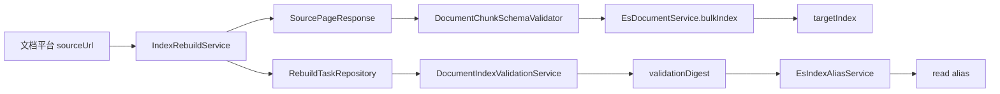
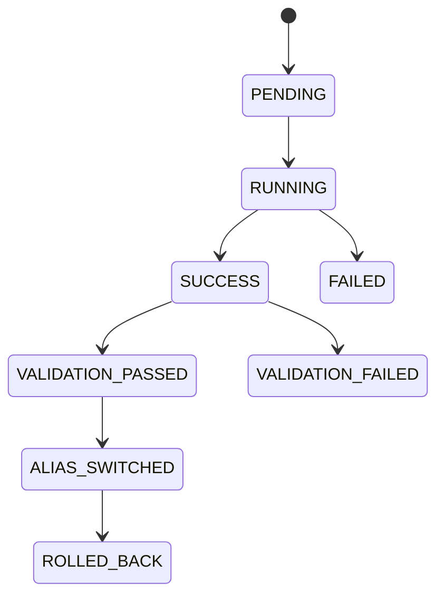

# 文档语料接入与索引治理能力 L2 实施详细设计 v1.0

## 1. 文档信息

| 项目 | 内容 |
|---|---|
| 文档名称 | 文档语料接入与索引治理能力 L2 实施详细设计 |
| 文档路径 | `docs/design/P2/01_文档语料接入与索引治理能力_L2实施详细设计_v1.0.md` |
| 文档状态 | Draft |
| 当前版本 | v1.0 |
| 作者 | Codex |
| 创建日期 | 2026-07-06 |
| 最后更新日期 | 2026-07-06 |
| 适用范围 | `es-query-api`、`es-query-service`、文档平台 sourceUrl 接入、文档 chunk 写入、索引重建、索引校验、读取 alias 切换 |
| 上级文档 | `docs/design/Agent目标架构总览_v1.0.md`、`docs/design/Agent契约与规划架构设计_v1.0.md`、`docs/design/Agent能力执行内核架构设计_v1.0.md`、`docs/design/Agent元数据与上下文安全架构设计_v1.0.md` |
| 关联文档 | `docs/design/P1` 下现存全部 L2 详细设计文档；`docs/design/P2/00_文档能力目标模式与实施路线图_L2实施详细设计_v1.0.md` |
| 是否可作为实现依据 | 是；但外部文档平台接口、生产任务持久化和目标环境 ES 验证仍需实施前确认 |

## 2. 修改历史

| 序号 | 日期 | 位置 | 修改原因 | 修改内容 |
|---:|---|---|---|---|
| 1 | 2026-07-06 | 全文 | 初始化文档语料接入与索引治理详设 | 新建语料接入、chunk schema、mapping、rebuild、validation、alias 和测试落点设计 |
| 2 | 2026-07-06 | 第 1、7 章 | 逐份设计品审修复 | 明确关联文档为 P1 L2 与 P2 上一个详设 `00_文档能力目标模式与实施路线图_L2实施详细设计_v1.0.md` |
| 3 | 2026-07-06 | 第 10、11、14、15、19、20、21、22、23、24 章 | 01 单文档设计品审修复 | 修正 `es.query` 配置前缀、`AliasSwitchRequest.taskId` 字段名，补充 sourceUrl allowlist、空页死循环保护、validation digest 语义边界和本次品审报告落点 |

## 3. 文档状态说明

| 状态 | 含义 | 是否可作为开发依据 |
|---|---|---:|
| Draft | 草稿，内容尚未完成完整评审 | 否 |
| In Review | 评审中，内容可能继续调整 | 否 |
| Approved | 已评审通过，可作为实现依据 | 是 |
| Implementing | 已进入实现阶段 | 是 |
| Implemented | 已完成实现，并已与设计对齐 | 是 |
| Deprecated | 已废弃，不再作为实现依据 | 否 |

当前状态：Draft。

## 4. 背景与目标

当前仓库已有 `EsDocumentService`、`IndexRebuildService`、`DocumentChunkSchemaValidator`、`DocumentIndexDefinitionValidator`、`DocumentIndexValidationService`、`EsIndexAliasService` 和 `RebuildTaskRepository`，已经形成文档索引本地门禁：文档索引前缀识别、chunk 必填字段校验、mapping 校验、rebuild 预校验、local validation digest 和 alias 切换校验。

仍未闭合的目标模式包括：文档平台真实 sourceUrl 契约、生产级 rebuild task 持久化、索引 validation 的真实 ES 查询与 ACL 正反例验证、三类 corpus 的索引命名和 alias 管理、运行审计和回滚记录。

本设计目标是把文档语料从文档平台接入 ES 文档索引，并在切换读取 alias 前完成可审计、可回滚、可验证的索引治理闭环。

## 5. 设计范围

### 5.1 范围内

| 范围项 | 说明 |
|---|---|
| 文档平台分页接入 | 通过 `RebuildRequest.sourceUrl` 拉取 `SourcePageResponse` |
| 文档 chunk schema | 校验 `tenantId/corpusId/documentId/chunkId/aclRef/aclVersion/visibility/status/indexVersion/contentHash` 等字段 |
| indexDefinition 校验 | 校验文档索引 mapping 必含字段和 `embedding` dense_vector 维度 |
| 全量/增量重建 | 保留 full/incremental rebuild 任务模型，明确 targetIndex、cursor、batchSize |
| validation digest | 将 validation 状态写入 rebuild task，作为 alias switch 门禁 |
| alias 切换和回滚 | 基于 `expectedPreviousIndex`、`targetIndex`、`validationDigest` 执行受控切换 |

### 5.2 范围外

| 范围外项 | 原因 |
|---|---|
| 文档 ACL 权威模型 | 由 `03_权限感知检索能力` 定义 |
| 检索排序和 RRF | 由 `04_关键词向量混合检索能力` 定义 |
| LLM/Embedding Provider | 由 `07_LLM与EmbeddingProvider接入能力` 定义 |
| 运行监控、审计和撤权 SLA 全量治理 | 由 `08_验证回滚审计观测与撤权保障能力` 汇总 |
| 修改 P1 L2 或 L1 文档 | 当前任务未授权 |

## 6. 上级文档约束

| 上级文档 | 关键约束 | 本文承接方式 |
|---|---|---|
| `Agent目标架构总览_v1.0.md` | 新 Domain 只增加 Catalog、Adapter、Policy、下游 API 和装配，不修改主流程 | 索引治理只服务文档 domain/corpus，不引入 Agent 主流程分支 |
| `Agent契约与规划架构设计_v1.0.md` | Runtime 不持有 Domain 事实源 | 索引字段和 corpus 事实不进入 Prompt 固定清单 |
| `Agent能力执行内核架构设计_v1.0.md` | Adapter 通过公开 API 访问下游，不直连业务数据库 | 语料接入通过文档平台 HTTP sourceUrl，不要求 Agent Adapter 直连文档库 |
| `Agent元数据与上下文安全架构设计_v1.0.md` | Canonical Domain Field Catalog 是 domain 事实源，ResultSecurity 不信任下游自由文本 | 索引写入必须保留字段、ACL、安全投影所需元数据 |

## 7. 关联文档与边界

| 关联文档集合 | 本文职责 | 对方职责 | 边界说明 |
|---|---|---|---|
| P2 上一个详设：`00_文档能力目标模式与实施路线图_L2实施详细设计_v1.0.md` | 承接 00 定义的 8 能力顺序、目标业务域和逐份品审门禁 | 维护 P2 目标模式和链式管理基线 | 本文作为 01，只定义语料接入与索引治理，不覆盖 02～08 职责 |
| D01 契约生成与治理 | 引用 Java 契约源规则 | 维护 Runtime/OpenAPI/Python 生成链 | 本文新增 `es-query-api` DTO 不生成 Runtime 契约 |
| D02 Capability Kernel 系列 | 不修改内核，只提供下游索引能力 | 维护 Capability 执行、Context、ResultSecurity | 索引任务不写 Agent Context |
| D03 Capability v2 系列 | 不修改权限权威源接口 | 维护 capability-first 执行链 | 文档索引治理属于 ES 查询侧服务 |
| D04 Adapter 与 Domain Metadata 收敛 | 为 `DOCUMENT_RETRIEVABLE` 提供可索引字段基础 | 维护 Canonical Domain Metadata | mapping 字段必须能被 02 文档配置引用 |
| D05 Capability 扩展验证 | 遵守新增 Domain 不改主流程 | 证明扩展不变量 | 语料接入不新增 Planning/Core 分支 |

## 8. 设计边界与约束

1. 索引命名必须受 `EsQueryProperties.documentIndexPrefixes` 约束，默认允许 `agent-doc-`。
2. `corpusId` 必须与 Agent document domain 对齐，例如 `company_policy`、`knowledge_base`、`literature`。
3. `visibility=PUBLIC` 只代表同 tenant、同 corpus 内公开，不代表跨租户公开。
4. 文档写入必须 fail closed：缺必填字段、visibility 与投影字段不匹配、mapping 不完整时拒绝写入。
5. alias 切换必须以已通过 validation 的 rebuild task 为前置，且请求 digest 必须与任务 digest 一致。
6. 当前 `RebuildTaskRepository` 是内存实现；生产目标必须替换为持久化 repository。

## 9. 总体设计

主流程：

1. 管理端提交 full/incremental rebuild。
2. `IndexRebuildService.validateRequest(...)` 检查 sourceUrl、batchSize、idField、indexDefinition 和 document index 前缀。
3. full rebuild 先 `recreateIndex(targetIndex, indexDefinition)`，并由 `DocumentIndexDefinitionValidator` 校验 mapping。
4. `pullAndIndex(...)` 分页调用文档平台 `sourceUrl`，对每个 chunk 执行 `DocumentChunkSchemaValidator`，再 `bulkIndex`。
5. rebuild 成功后进入 `DocumentIndexValidationService.validateSuccessfulTask(taskId)`。
6. validation 通过后写入 `PASSED + validationDigest`。
7. 管理端使用 digest 调用 alias switch；服务校验 task、targetIndex、expectedPreviousIndex 和 digest 后切换。

## 10. 详细功能设计

### 10.1 文档平台分页接入

#### 10.1.1 输入与输出

| 输入 | 类型 | 说明 |
|---|---|---|
| sourceUrl | String | 文档平台分页 API 基础地址 |
| cursor | String | 上一页返回的游标，可空 |
| batchSize | Integer | 每页拉取数量 |

输出使用 `SourcePageResponse`，包含 `documents`、`nextCursor`、`hasMore`。

#### 10.1.2 业务规则

1. `sourceUrl` 必填且必须通过 `DocumentSourceUrlPolicy.validate(...)` 校验，校验内容包括 scheme、host allowlist、禁止 userinfo、禁止未授权内网/IP literal、禁止 file/jar 等非 HTTP(S) scheme。
2. allowlist 配置使用 `es.query.document-source-allowed-hosts`，为空时生产环境必须启动失败；本地闭环可使用 mock server host 显式配置。
3. `batchSize` 必须大于 0，并受 `es.query.rebuild-max-batch-size` 配置上限限制。
4. `sourceParams` 只允许追加到查询参数，不允许覆盖 `batchSize`、`cursor`、`since` 三个保留参数。
5. 文档平台返回空页且 `hasMore=true` 时任务失败，避免死循环。

### 10.2 文档 chunk 写入校验

#### 10.2.1 必填字段

| 字段 | 说明 |
|---|---|
| tenantId | 租户隔离字段 |
| corpusId | 对齐 Agent document domain |
| documentId/documentVersion | 文档身份与版本 |
| chunkId/chunkIndex | chunk 身份与顺序 |
| charStart/charEnd | 原文字符位置 |
| title/content/snippet | 展示和检索字段 |
| aclRef/aclVersion/visibility | 权限投影 |
| status/indexVersion/contentHash | 状态、索引版本、幂等校验 |

#### 10.2.2 visibility 规则

| visibility | 必须字段 |
|---|---|
| PUBLIC | 无额外字段，但仍受 tenant/corpus/status 约束 |
| TENANT | `tenantId` |
| USER | `userIds` 非空 |
| DEPARTMENT | `departmentIds` 非空 |
| ROLE | `roleIds` 非空 |
| ATTRIBUTE | `attributeKeys` 非空 |

### 10.3 索引定义校验

`DocumentIndexDefinitionValidator.validate(String index, Map<String, Object> indexDefinition)` 必须检查：

1. `mappings.properties` 存在。
2. 文档必填字段存在。
3. `embedding` 如存在必须为 `dense_vector` 且 `dims > 0`。
4. `tenantId/corpusId/documentId/chunkId/aclRef/aclVersion/status` 必须可用于 filter。

### 10.4 rebuild 任务治理

#### 10.4.1 状态

| 状态 | 说明 | 允许流转 |
|---|---|---|
| PENDING | 已创建未执行 | RUNNING/FAILED |
| RUNNING | 正在拉取并写入 | SUCCESS/FAILED |
| SUCCESS | 写入完成 | validation PASSED/FAILED |
| FAILED | 任务失败 | 终态 |

#### 10.4.2 validation 状态

| 状态 | 说明 |
|---|---|
| PENDING | 任务尚未校验 |
| PASSED | 校验通过，可作为 alias 切换输入 |
| SKIPPED | 非文档索引任务跳过 |
| FAILED | 校验失败，不允许 alias 切换 |

`PASSED` 必须记录 validation version。当前本地闭环允许 `LOCAL_DOCUMENT_INDEX_VALIDATION_V1`，该 digest 只证明 task 元数据与 alias switch 请求绑定，不证明 ES 中真实文档、count、sample query 或 ACL 正反例已经通过。生产 alias 切换必须升级为真实 ES validation 版本，或由 08 文档定义的生产门禁显式阻断。

### 10.5 alias 切换和回滚

1. `AliasSwitchRequest.taskId`、`targetIndex`、`expectedPreviousIndex`、`validationDigest`、`operatorRef` 必填。
2. `targetIndex`、`expectedPreviousIndex` 必须匹配文档索引前缀。
3. 当前 alias 指向必须包含 `expectedPreviousIndex`。
4. `rebuildTask.targetIndex` 必须等于请求 `targetIndex`。
5. `rebuildTask.validationStatus` 必须为 `PASSED`。
6. 请求 digest 必须等于任务 digest。
7. 服务不得接受任意非空 digest 作为切换凭证；digest 必须来自同一持久化 task 的 validation 结果，并与 taskId、targetIndex、validation version 一起进入审计。

## 11. 接口设计

| 接口 | 方法 | 路径 | 说明 |
|---|---|---|---|
| full rebuild | POST | `/indexes/{index}/rebuild/full` | 提交全量重建任务 |
| incremental rebuild | POST | `/indexes/{index}/rebuild/incremental` | 提交增量重建任务 |
| task detail | GET | `/rebuild/tasks/{taskId}` | 查询重建任务 |
| task list | GET | `/rebuild/tasks` | 查询任务列表 |
| switch read alias | POST | `/indexes/{index}/aliases/read/switch` | 切换读取 alias |
| rollback read alias | POST | `/indexes/{index}/aliases/read/rollback` | 回滚读取 alias |

请求/响应 DTO：

| DTO | 路径 | 关键字段 |
|---|---|---|
| `RebuildRequest` | `es-query-api/src/main/java/com/dylan/esquery/api/model/RebuildRequest.java` | `sourceUrl`、`targetIndex`、`idField`、`batchSize`、`indexDefinition` |
| `RebuildTask` | `es-query-api/src/main/java/com/dylan/esquery/api/model/RebuildTask.java` | `taskId`、`status`、`totalIndexed`、`lastCursor`、`validationStatus`、`validationDigest` |
| `AliasSwitchRequest` | `es-query-api/src/main/java/com/dylan/esquery/api/model/AliasSwitchRequest.java` | `taskId`、`targetIndex`、`expectedPreviousIndex`、`validationDigest`、`operatorRef` |

## 12. 数据设计

### 12.1 文档 chunk 结构

| 字段 | 类型 | 必填 | 说明 |
|---|---|---:|---|
| tenantId | keyword/String | 是 | 租户 |
| corpusId | keyword/String | 是 | 文档域 |
| documentId | keyword/String | 是 | 文档 ID |
| documentVersion | keyword/String | 是 | 文档版本 |
| chunkId | keyword/String | 是 | chunk ID |
| chunkIndex | integer | 是 | chunk 顺序 |
| charStart/charEnd | integer | 是 | 原文范围 |
| title/content/snippet | text/String | 是 | 检索和证据展示 |
| sourceUri | keyword/String | 否 | 来源链接 |
| aclRef/aclVersion | keyword/String | 是 | ACL 快照引用 |
| visibility | keyword/String | 是 | 可见性 |
| departmentIds/roleIds/userIds/attributeKeys | keyword[] | 按 visibility | ACL 投影 |
| status | keyword/String | 是 | 只允许 ACTIVE/REVOKED/DELETED 等受控值 |
| embedding | dense_vector | 否 | 向量检索字段 |
| indexVersion/contentHash | keyword/String | 是 | 幂等与追踪 |

### 12.2 生产任务持久化建议

| 表 | 字段 | 说明 |
|---|---|---|
| document_rebuild_task | task_id, index_name, target_index, type, status, total_indexed, last_cursor, validation_status, validation_digest, created_at, updated_at | 替代当前内存 `RebuildTaskRepository` |

## 13. 状态流转设计

非法流转：

1. `FAILED` 不允许 alias 切换。
2. `SUCCESS` 但 validation 未通过不允许 alias 切换。
3. `ALIAS_SWITCHED` 后回滚必须再次校验 expected previous/current target。

## 14. 幂等、事务与一致性设计

| 场景 | 设计 |
|---|---|
| 重复 rebuild 提交 | 允许生成新 task；生产可增加幂等键 `index + targetIndex + contentHash` |
| chunk 重复写入 | 使用 `idField=chunkId`，同一 chunk 覆盖写入 |
| full rebuild | targetIndex 独立写入，成功 validation 后才切 alias |
| alias 切换 | 使用 ES `_aliases` 原子 remove/add，并校验 current alias |
| validation digest | 本地 digest 绑定 taskId、index、targetIndex、type、status、totalIndexed、lastCursor 和 validation version；生产 digest 还必须绑定 ES count、sample query、ACL 正反例等验证证据 |
| commit unknown | 以 ES alias 当前状态和持久化 task 状态为权威，不在内存中伪造成功 |

## 15. 权限、风控与审计设计

1. rebuild、alias switch、rollback 仅允许内部管理端或受控服务 token 调用。
2. 审计字段至少包含 `operator/serviceId`、`taskId`、`index`、`targetIndex`、`expectedPreviousIndex`、`validationDigest`、`result`、`diagnosticId`。
3. alias switch 属高风险操作，必须要求 expected previous index 和 validation digest。
4. sourceUrl 必须受 allowlist 约束，禁止任意 SSRF。
5. validation digest 不是外部授权凭证；只作为同一 rebuild task 的防误切绑定证据，不能替代服务 token、操作者审计和真实索引验证。

## 16. 性能与容量设计

| 项目 | 设计 |
|---|---|
| batchSize | 默认 100～500，受配置上限约束 |
| bulk body | 限制单批字节数，避免 ES HTTP body 过大 |
| rebuild 并发 | 同一 alias/corpus 同时只允许一个 active rebuild |
| validation | 首版本地 digest；生产补 ES sample query、count、ACL 正反例 |
| alias switch | O(当前 alias 目标数)，预期低频 |

## 17. 兼容性与扩展性设计

1. 新 corpus 只需新增 domain/corpus 配置和 index/alias 命名，不改 `EsDocumentService` 主流程。
2. 新 chunk 字段必须先进入 mapping validator，再进入 02 的 Domain Metadata。
3. 当前内存 `RebuildTaskRepository` 与生产持久化 repository 的接口保持一致，降低替换范围。

## 18. 日志、监控与告警

| 类型 | 内容 |
|---|---|
| 日志 | task 创建、分页拉取、批量写入、validation、alias switch/rollback |
| 指标 | rebuild duration、indexed count、failed count、validation failure、alias switch failure |
| 告警 | rebuild 长时间 RUNNING、validation FAILED、alias current mismatch、sourceUrl 失败率高 |
| 禁止 | 记录完整文档正文、embedding 向量、权限表达式和用户敏感字段 |

## 19. 实现落点清单

### 19.1 Java 实现落点

| 序号 | 类型 | 路径 | 类名 | 方法名 | 入参类型 | 返回类型 | 新增/修改 | 说明 |
|---:|---|---|---|---|---|---|---|---|
| 1 | Controller | `es-query-service/src/main/java/com/dylan/esquery/controller/EsQueryController.java` | `com.dylan.esquery.controller.EsQueryController` | `fullRebuild` | `String index, RebuildRequest request` | `RebuildTask` | 修改 | 提交全量任务 |
| 2 | Controller | 同上 | 同上 | `incrementalRebuild` | `String index, RebuildRequest request` | `RebuildTask` | 修改 | 提交增量任务 |
| 3 | Controller | 同上 | 同上 | `switchReadAlias` | `String index, AliasSwitchRequest request` | `void` | 修改 | 受控切换 alias |
| 4 | Service | `es-query-service/src/main/java/com/dylan/esquery/service/IndexRebuildService.java` | `com.dylan.esquery.service.IndexRebuildService` | `submitFullRebuild` | `String index, RebuildRequest request` | `RebuildTask` | 修改 | 创建 full task 并异步执行 |
| 5 | Service | 同上 | 同上 | `submitIncrementalRebuild` | `String index, RebuildRequest request` | `RebuildTask` | 修改 | 创建 incremental task 并异步执行 |
| 6 | Service | 同上 | 同上 | `validateRequest` | `String index, RebuildRequest request, boolean fullRebuild` | `void` | 修改 | 校验 sourceUrl、batchSize 上限、保留 sourceParams、idField、indexDefinition |
| 7 | Service | `es-query-service/src/main/java/com/dylan/esquery/service/EsDocumentService.java` | `com.dylan.esquery.service.EsDocumentService` | `indexDocument` | `String index, String id, Map<String,Object> document` | `String` | 修改 | 文档索引写入校验 |
| 8 | Service | 同上 | 同上 | `bulkIndex` | `String index, String idField, List<Map<String,Object>> documents` | `String` | 修改 | 批量写入 chunk |
| 9 | Service | 同上 | 同上 | `recreateIndex` | `String index, Map<String,Object> indexDefinition` | `void` | 修改 | 文档索引 mapping 校验 |
| 10 | Validator | `es-query-service/src/main/java/com/dylan/esquery/service/DocumentChunkSchemaValidator.java` | `com.dylan.esquery.service.DocumentChunkSchemaValidator` | `validate` | `String index, Map<String,Object> document` | `void` | 修改 | chunk 必填字段和 visibility 校验 |
| 11 | Validator | `es-query-service/src/main/java/com/dylan/esquery/service/DocumentIndexDefinitionValidator.java` | `com.dylan.esquery.service.DocumentIndexDefinitionValidator` | `validate` | `String index, Map<String,Object> indexDefinition` | `void` | 修改 | mapping 校验 |
| 12 | Service | `es-query-service/src/main/java/com/dylan/esquery/service/DocumentIndexValidationService.java` | `com.dylan.esquery.service.DocumentIndexValidationService` | `validateSuccessfulTask` | `String taskId` | `void` | 修改 | 写入 validation digest |
| 13 | Repository | `es-query-service/src/main/java/com/dylan/esquery/service/RebuildTaskRepository.java` | `com.dylan.esquery.service.RebuildTaskRepository` | `markValidationPassed` | `String taskId, String digest, String message` | `void` | 修改 | 标记 validation 通过 |
| 14 | Policy | `es-query-service/src/main/java/com/dylan/esquery/service/DocumentSourceUrlPolicy.java` | `com.dylan.esquery.service.DocumentSourceUrlPolicy` | `validate` | `String sourceUrl` | `void` | 新增 | sourceUrl scheme/host allowlist 和 SSRF fail closed |
| 15 | Service | `es-query-service/src/main/java/com/dylan/esquery/service/IndexRebuildService.java` | `com.dylan.esquery.service.IndexRebuildService` | `validateSourcePage` | `SourcePageResponse page` | `void` | 新增 | 拒绝空响应、空页且 `hasMore=true` |
| 16 | Repository | `es-query-service/src/main/java/com/dylan/esquery/service/PersistentRebuildTaskRepository.java` | `com.dylan.esquery.service.PersistentRebuildTaskRepository` | `findById` | `String taskId` | `RebuildTask` | 新增 | 替代内存 repository |
| 17 | Service | `es-query-service/src/main/java/com/dylan/esquery/service/EsIndexAliasService.java` | `com.dylan.esquery.service.EsIndexAliasService` | `switchReadAlias` | `String alias, AliasSwitchRequest request` | `void` | 修改 | digest 门禁和 ES `_aliases` 切换 |
| 18 | DTO | `es-query-api/src/main/java/com/dylan/esquery/api/model/RebuildTask.java` | `com.dylan.esquery.api.model.RebuildTask` | getter/setter | `validationStatus, validationDigest, validatedAt, validationMessage` | JavaBean | 修改 | 任务 validation 字段 |
| 19 | DTO | `es-query-api/src/main/java/com/dylan/esquery/api/model/AliasSwitchRequest.java` | `com.dylan.esquery.api.model.AliasSwitchRequest` | getter/setter | `taskId, targetIndex, expectedPreviousIndex, validationDigest, operatorRef` | JavaBean | 修改 | alias 门禁请求 |

### 19.2 Python 实现落点

本文不涉及 Python Runtime 实现。

### 19.3 脚本与配置落点

| 序号 | 类型 | 路径 | 文件名 | 脚本 / 配置项 | 入参 / 参数 | 输出 / 效果 | 新增/修改 | 说明 |
|---:|---|---|---|---|---|---|---|---|
| 1 | YAML | `es-query-service/src/main/resources/application.yml` | `application.yml` | `es.query.document-index-prefixes` | `List<String>` | 限制文档索引前缀 | 修改 | 默认 `agent-doc-`，与 `EsQueryProperties(prefix = "es.query")` 对齐 |
| 2 | YAML | 同上 | `application.yml` | `es.query.document-source-allowed-hosts` | `List<String>` | 限制 rebuild sourceUrl host | 新增 | 生产不能为空，本地 mock 显式配置 |
| 3 | YAML | 同上 | `application.yml` | `es.query.rebuild-max-batch-size` | `Integer` | 限制分页批量上限 | 新增 | 防止上游一次返回过大 |
| 4 | SQL | `es-query-service/src/main/resources/db/migration` | `V*_create_document_rebuild_task.sql` | DDL | 无 | 创建生产任务表 | 新增 | 当前仓库尚无持久化 task |
| 5 | Fixture | `es-query-service/src/test/resources/fixtures/document` | `valid-document-index-definition.json` | mapping fixture | 无 | 校验 mapping | 新增 | 支持测试 |
| 6 | Fixture | 同上 | `valid-document-chunk.json` | chunk fixture | 无 | 校验 chunk | 新增 | 支持测试 |

### 19.4 测试落点

| 序号 | 测试类型 | 路径 | 测试类 / 文件 | 测试方法 / 用例 | 验证目标 | 新增/修改 |
|---:|---|---|---|---|---|---|
| 1 | Unit | `es-query-service/src/test/java/com/dylan/esquery/service/DocumentChunkSchemaValidatorTest.java` | `DocumentChunkSchemaValidatorTest` | `rejectsMissingAclVersion`、`rejectsInvalidVisibilityProjection` | chunk schema fail closed | 修改 |
| 2 | Unit | `es-query-service/src/test/java/com/dylan/esquery/service/DocumentIndexDefinitionValidatorTest.java` | `DocumentIndexDefinitionValidatorTest` | `rejectsMissingAclVersionMapping`、`rejectsInvalidEmbeddingDims` | mapping 校验 | 修改 |
| 3 | Unit | `es-query-service/src/test/java/com/dylan/esquery/service/DocumentSourceUrlPolicyTest.java` | `DocumentSourceUrlPolicyTest` | `rejectsNonAllowlistedHost`、`rejectsUrlWithUserInfo`、`acceptsConfiguredMockHost` | sourceUrl allowlist 和 SSRF fail closed | 新增 |
| 4 | Unit | `es-query-service/src/test/java/com/dylan/esquery/service/IndexRebuildServiceTest.java` | `IndexRebuildServiceTest` | `rejectsDocumentFullRebuildWithoutIdFieldOrIndexDefinitionBeforeSubmittingTask`、`rejectsEmptyPageWithHasMore`、`rejectsSourceParamsOverridingReservedParams`、`localValidationWritesDigestForSuccessfulDocumentTask` | rebuild 预校验、分页保护和 validation | 修改 |
| 5 | Unit | `es-query-service/src/test/java/com/dylan/esquery/service/EsIndexAliasServiceTest.java` | `EsIndexAliasServiceTest` | `rejectsAliasSwitchBeforeTaskValidationPasses`、`rejectsAliasSwitchWhenValidationDigestDoesNotMatchTask`、`rejectsAliasSwitchWhenCurrentAliasIsMissing`、`rejectsAliasSwitchWithDigestFromDifferentTask` | alias 门禁 | 修改 |
| 6 | Integration | `es-query-service/src/test/java/com/dylan/esquery/service/DocumentIndexRebuildIT.java` | `DocumentIndexRebuildIT` | `fullRebuildValidatesAndSwitchesAlias` | ES 真实 alias 切换 | 新增 |
| 7 | 文档品审 | `docs/design/P2/01_文档语料接入与索引治理能力_设计文档品审报告.md` | 品审报告 | 01 单文档审查 | 确认 01 继承 L1、关联 P1 L2 和 P2 00，无越界且配置/风险落点闭环 | 新增 |

## 20. 测试设计

| 测试类型 | 验证内容 |
|---|---|
| 单元测试 | schema、mapping、rebuild validation、alias request 校验 |
| 集成测试 | 使用测试 ES 验证 rebuild→validation→alias switch→rollback |
| 契约测试 | `RebuildRequest/RebuildTask/AliasSwitchRequest` 字段兼容 |
| 异常测试 | sourceUrl allowlist 拒绝、sourceParams 保留参数覆盖、空页循环、ES 写入失败、validation failed |
| 权限测试 | 管理接口无服务 token 时拒绝 |
| 幂等测试 | 重复 chunk 写入、重复 alias 请求不破坏当前 alias |
| 并发测试 | 同一 alias 并发 switch 只有一个成功 |
| 性能测试 | 大批量 chunk bulk 写入和 validation 延迟 |
| 回归测试 | 现有普通 ES search/index 不受 document index 前缀门禁影响 |

## 21. 风险与待确认事项

| 序号 | 类型 | 内容 | 影响 | 建议处理方式 | 是否阻塞 |
|---:|---|---|---|---|---|
| 1 | 外部契约 | 文档平台 `sourceUrl` 分页 API 尚未以正式契约冻结 | 真实平台联调可能与本地 mock 不一致 | 编码阶段先使用 mock fixture 完成本地闭环；生产联调前冻结接口契约 | 否，阻塞生产联调 |
| 2 | 生产持久化 | 当前 `RebuildTaskRepository` 是内存实现 | 服务重启后 task 和 digest 丢失 | 本能力编码内实施生产表和 repository | 否，属于本能力编码项 |
| 3 | validation 深度 | 当前 local digest 不验证真实 ES 文档和 ACL 正反例 | alias 可能切到数据不完整索引 | 本能力先明确 local digest 边界；生产切换前按 08 文档补 ES 查询验证 | 否，阻塞生产切换 |
| 4 | SSRF | `sourceUrl` 若不受控可能访问任意内网地址 | 安全风险 | 本能力编码内增加 `DocumentSourceUrlPolicy`、allowlist 配置和服务身份校验 | 否，属于本能力编码项；未完成前不得对外启用 |

## 22. 评审记录

| 轮次 | 日期 | 评审结论 | 发现问题数 | 修正问题数 | 遗留问题 | 说明 |
|---:|---|---|---:|---:|---|---|
| 1 | 2026-07-06 | 需要修正 | 3 | 3 | 0 | 补充生产持久化、sourceUrl 安全、validation 深度风险 |
| 2 | 2026-07-06 | 通过 | 0 | 0 | 0 | 已覆盖上级约束、关联边界、接口、数据、状态、幂等、审计和测试落点 |
| 3 | 2026-07-06 | 通过 | 4 | 4 | 0 | design-doc-review 发现配置 key 不匹配、`AliasSwitchRequest.taskId` 字段名错位、sourceUrl 安全落点不足、local digest 语义边界不够硬；已修复并复审通过 |

## 23. 实施对齐检查

| 检查项 | 设计要求 | 实现位置 | 是否满足 | 说明 |
|---|---|---|---|---|
| chunk 必填字段 | 写入前 fail closed | `DocumentChunkSchemaValidator.validate` | 部分满足 | 已有本地校验，需补 fixture 和生产样例 |
| mapping 校验 | full rebuild 必须带 indexDefinition | `DocumentIndexDefinitionValidator.validate`、`IndexRebuildService.validateRequest` | 部分满足 | 已有校验，需目标 ES 集成 |
| sourceUrl 安全 | 必须受 allowlist 和服务身份约束 | `DocumentSourceUrlPolicy.validate`、`IndexRebuildService.validateRequest` | 未满足 | 需按本设计新增，未完成前不得对外启用 |
| validation digest | alias switch 前校验 `PASSED + digest` | `DocumentIndexValidationService`、`EsIndexAliasService.assertValidatedTask` | 部分满足 | local digest 已有；生产切换不得把 local digest 当作真实 ES validation |
| 任务持久化 | 任务状态不可因重启丢失 | `PersistentRebuildTaskRepository` | 未满足 | 生产新增 |
| alias 回滚 | expected previous/current 防误切 | `EsIndexAliasService.rollbackReadAlias` | 部分满足 | 已有门禁，需集成测试 |
| 品审报告 | 01 单文档设计品审 | `docs/design/P2/01_文档语料接入与索引治理能力_设计文档品审报告.md` | 已满足 | 本次报告已生成 |

## 24. 完成摘要

| 项目 | 内容 |
|---|---|
| 目标文档 | `docs/design/P2/01_文档语料接入与索引治理能力_L2实施详细设计_v1.0.md` |
| 文档状态 | Draft |
| 是否可作为实现依据 | 是，可进入本地闭环编码；生产联调/切换前必须完成 sourceUrl 契约冻结、持久化 repository 和真实 ES validation |
| 评审轮次 | 3 |
| 主要修改内容 | 新建文档语料接入、chunk schema、mapping、rebuild、validation、alias、持久化和测试设计；本次修正配置 key、DTO 字段名、sourceUrl 安全落点、空页保护和 local digest 边界 |
| 是否已追加修改历史 | 是 |
| 是否已补充实现落点清单 | 是 |
| 是否存在阻塞问题 | 否；但第 21 章风险未关闭前不得生产启用 alias 切换 |
| 是否存在遗留风险 | 是 |
| 是否需要用户进一步授权 | 否，除非需要修改文档平台或 P1/L1 契约 |
| 建议下一步 | 可进入 01 本地闭环编码；并继续编制 02 文档领域元数据详设 |
