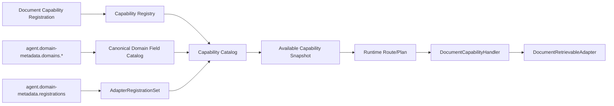
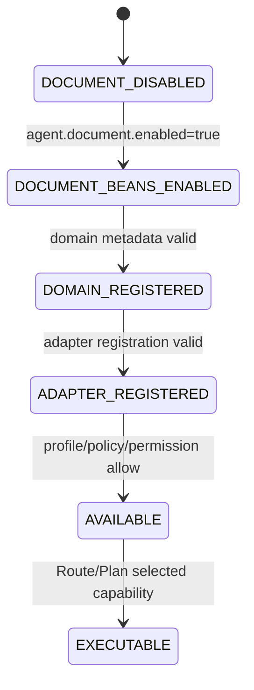

# 文档领域元数据与 Capability 配置能力 L2 实施详细设计 v1.0

## 1. 文档信息

| 项目 | 内容 |
|---|---|
| 文档名称 | 文档领域元数据与 Capability 配置能力 L2 实施详细设计 |
| 文档路径 | `docs/design/P2/02_文档领域元数据与Capability配置能力_L2实施详细设计_v1.0.md` |
| 文档状态 | Draft |
| 当前版本 | v1.0 |
| 作者 | Codex |
| 创建日期 | 2026-07-06 |
| 最后更新日期 | 2026-07-06 |
| 适用范围 | `agent-api` 文档 Plan/Result 契约、`agent-service` 文档 capability 注册、`DOCUMENT_RETRIEVABLE` Domain Metadata、三类 corpus 配置、`agent-adapter-document` 装配 |
| 上级文档 | `docs/design/Agent目标架构总览_v1.0.md`、`docs/design/Agent契约与规划架构设计_v1.0.md`、`docs/design/Agent能力执行内核架构设计_v1.0.md`、`docs/design/Agent元数据与上下文安全架构设计_v1.0.md` |
| 关联文档 | `docs/design/P1` 下现存全部 L2 详细设计文档；P2 下编号小于 02 的 `00_文档能力目标模式与实施路线图_L2实施详细设计_v1.0.md`、`00_文档能力目标模式与实施路线图_设计文档品审报告.md`、`01_文档语料接入与索引治理能力_L2实施详细设计_v1.0.md`、`01_文档语料接入与索引治理能力_设计文档品审报告.md` |
| 是否可作为实现依据 | 是；但需在本能力编码中补齐三类 corpus 的字段配置、索引 alias 映射、Adapter fail-closed 门禁和启用策略测试 |

## 2. 修改历史

| 序号 | 日期 | 位置 | 修改原因 | 修改内容 |
|---:|---|---|---|---|
| 1 | 2026-07-06 | 全文 | 初始化文档领域元数据与 Capability 配置详设 | 新建三类文档 domain、Capability 注册、配置开关、Runtime 契约和测试设计 |
| 2 | 2026-07-06 | 第 1、7 章 | 逐份设计品审修复 | 明确关联文档为 P1 L2 与 P2 上一个详设 `01_文档语料接入与索引治理能力_L2实施详细设计_v1.0.md` |
| 3 | 2026-07-06 | 第 1、7、10、11、12、17、19、20、21、22、23、24 章 | 02 单文档设计品审修复 | 补齐 P2 小于 02 的关联基线；修正不支持的 `DATE/INTEGER` 字段类型、`contentSnippet` 字段名、文档 adapter 索引映射配置落点和本次品审报告 |

## 3. 文档状态说明

| 状态 | 含义 | 是否可作为开发依据 |
|---|---|---:|
| Draft | 草稿，内容尚未完成完整评审 | 否 |
| In Review | 评审中，内容可能继续调整 | 否 |
| Approved | 已评审通过，可作为实现依据 | 是 |
| Implementing | 已进入实现阶段 | 是 |
| Implemented | 已完成实现，并已与设计对齐 | 是 |
| Deprecated | 已废弃，不再作为实现依据 | 否 |

当前状态：Draft。

## 4. 背景与目标

当前代码已经具备文档能力契约和通用骨架：

1. `agent-api` 已存在 `DocumentAgentPlan`、`AgentDocumentSpec`、`DocumentPlanOperation`、`DocumentCapabilityContextPayload`、`DocumentAgentResultPayload`。
2. `agent-service` 已存在 `DocumentCapabilityConfiguration`，可注册 `document.search`、`document.answer`、`document.summarize`。
3. `agent-adapter-api` 已存在 `AdapterRole.DOCUMENT_RETRIEVABLE` 与 `DocumentRetrievableAdapter`。
4. `DomainMetadataPropertiesValidator`、`DomainMetadataPortImpl` 和 `AdapterRolePortTypes` 已识别 `DOCUMENT_RETRIEVABLE`。
5. `DefaultAgentMetadataBootstrap` 已在 `agent.document.enabled=true` 时要求存在 `DOCUMENT_RETRIEVABLE` domain metadata 和 adapter registration。

当前差距是：生产 `application.yml` 中 `agent.document.enabled=false`，且只有 `employee`、`transaction` domain；尚未注册 `company_policy`、`knowledge_base`、`literature` 三类文档 domain，也未配置文档 Adapter 的 domain→index 映射。

本设计目标是完成文档领域元数据和 capability 配置闭环，使三类文档 corpus 能够通过 D04 Domain Metadata 和 Capability Kernel 进入 Available Capability，而不修改 Planning/Core 主流程。

## 5. 设计范围

### 5.1 范围内

| 范围项 | 说明 |
|---|---|
| 文档 capability 注册 | `document.search`、`document.answer`、`document.summarize` 均使用 `AgentPlanKind.DOCUMENT` |
| `DOCUMENT_RETRIEVABLE` domain metadata | 三类业务域配置 fields、sortFields、operators、role limit |
| Adapter registration | 三类 domain 均绑定 `DocumentRetrievableAdapter` bean |
| Profile/Policy 配置 | 文档能力默认关闭，显式启用后进入 Profile/Policy/UserPermission 交集 |
| Runtime 契约生成 | 复用 Java 契约源，确认 Python generated model 已有 DOCUMENT plan |
| 启动门禁 | 启用文档能力但缺 domain/adapter 时 fail closed |

### 5.2 范围外

| 范围外项 | 原因 |
|---|---|
| chunk schema 和索引重建 | 由 01 文档负责 |
| ACL scope 和文档级权限过滤 | 由 03 文档负责 |
| 检索算法和 RRF | 由 04 文档负责 |
| 生成式回答和摘要语义 | 由 05、06 文档负责 |
| Provider 接入 | 由 07 文档负责 |

## 6. 上级文档约束

| 上级文档 | 关键约束 | 本文承接方式 |
|---|---|---|
| `Agent目标架构总览_v1.0.md` | 新增 Domain 不修改 Agent 主流程；`capabilityId` 与 `planKind` 分离 | 三个 corpus 是 domain，不新增 planKind；三种能力是 capabilityId |
| `Agent契约与规划架构设计_v1.0.md` | Runtime 通过请求级 descriptor/schema 获取能力和 domain 投影 | 文档 domain 通过 D04 metadata 投影，不写死 Prompt |
| `Agent能力执行内核架构设计_v1.0.md` | Registration 是最小执行单元；Handler 不二次选择 Adapter | 文档能力通过 `DocumentCapabilityConfiguration` 注册，并由 execution binding 绑定 Adapter |
| `Agent元数据与上下文安全架构设计_v1.0.md` | Canonical Domain Field Catalog 是 domain 事实源 | 三类文档 domain 的字段、sort、operator 只在 `agent.domain-metadata` 声明 |

## 7. 关联文档与边界

| 关联文档集合 | 本文职责 | 对方职责 | 边界说明 |
|---|---|---|---|
| P2 目标路线图：`00_文档能力目标模式与实施路线图_L2实施详细设计_v1.0.md` 及 00 品审报告 | 承接 00 定义的第 2 项能力、三类目标业务域和逐份品审门禁 | 维护 P2 总体目标模式和链式管理基线 | 本文不得改变 00 的能力顺序、L1/P1 边界和“不修改上级/关联文档”规则 |
| P2 上一个详设：`01_文档语料接入与索引治理能力_L2实施详细设计_v1.0.md` | 将 01 定义的 corpus/index/mapping 目标纳入 domain metadata 和 capability 配置 | 维护文档语料接入、chunk schema、index alias 与 validation 前提 | 本文只定义 Agent 领域元数据、Capability 和 Adapter registration，不重复索引治理 |
| P2 上一个详设品审报告：`01_文档语料接入与索引治理能力_设计文档品审报告.md` | 承接 01 品审后确认的 sourceUrl 安全、local digest 边界和字段映射风险 | 维护 01 单文档品审证据 | 本文不得把 01 的 local validation digest 误用为 metadata 或 alias 生产门禁 |
| D01 契约治理 | 确认 DOCUMENT Plan/Result 从 Java 生成 | 维护生成链和 drift gate | 不手写 Python schema |
| D02 Capability Kernel | 新增/启用文档 Registration | 维护 Registry/Core/Lifecycle | 不修改 Core、Registry 算法 |
| D02_03 元数据安全 | 配置 domain 和 policy 约束 | 维护 Profile/Policy/Authorization/Catalog | 不新增第二 metadata 源 |
| D04 Adapter Metadata | 使用 `DOCUMENT_RETRIEVABLE` role | 维护 Adapter Role/Registration 类型约束 | 本文只新增 domain 数据和 registration 配置 |
| D05 扩展验证 | 遵守新增 capability/domain 不改主流程 | 维护扩展不变量 | 文档能力按相同扩展方式接入 |

## 8. 设计边界与约束

1. `company_policy`、`knowledge_base`、`literature` 是 Agent domain，同时映射 ES `corpusId`。
2. 文档能力默认不启用；`agent.document.enabled=true` 只是开启 bean，仍需 Profile/Policy/UserPermission 交集允许。
3. `document.search/answer/summarize` 都使用 `AgentPlanKind.DOCUMENT`，不得新增 `POLICY`、`KNOWLEDGE`、`LITERATURE` plan kind。
4. Domain Metadata 不保存 ES index 细节；domain→read alias 映射属于 `agent.document-adapter.index-by-domain`，并替代当前 `indexPrefix + domain` 的隐式拼接方式。
5. Domain fields 只描述可规划、可过滤、可排序、可展示字段，不保存 ACL 权限表达式。

## 9. 总体设计



## 10. 详细功能设计

### 10.1 Capability 注册

| capabilityId | planKind | operation | domainMode | adapterRole | 输出 |
|---|---|---|---|---|---|
| `document.search` | `DOCUMENT` | `SEARCH` | `REQUIRED` | `DOCUMENT_RETRIEVABLE` | 命中、引用、检索参数、安全摘要 |
| `document.answer` | `DOCUMENT` | `ANSWER` | `REQUIRED` | `DOCUMENT_RETRIEVABLE` | 基于证据的回答、引用、校验状态 |
| `document.summarize` | `DOCUMENT` | `SUMMARIZE` | `REQUIRED` | `DOCUMENT_RETRIEVABLE` | 摘要文本、摘要要点、引用、覆盖范围 |

业务规则：

1. `DocumentPlanValidator.validateCapability(...)` 必须校验 operation 与 capabilityId 一致。
2. `DocumentCapabilityConfiguration` 只在 `agent.document.enabled=true` 时注册。
3. 三个 capability 共享 `DocumentAgentPlan`，由 `DocumentPlanOperation` 区分操作语义。

### 10.2 三类 domain 配置

| domain | displayName | read alias | 关键字段 |
|---|---|---|---|
| `company_policy` | 公司政策文档 | `agent-doc-company-policy` | `title`、`sourceType`、`effectiveDate`、`tags`、`section`、`page`、`sourceUri`、`snippet` |
| `knowledge_base` | 知识库文档 | `agent-doc-knowledge-base` | `title`、`sourceType`、`category`、`tags`、`section`、`updatedAt`、`sourceUri`、`snippet` |
| `literature` | 文献/文学资料 | `agent-doc-literature` | `title`、`author`、`publishedAt`、`publication`、`section`、`page`、`sourceUri`、`snippet` |

### 10.3 Domain Metadata 字段规则

| 字段类别 | 要求 |
|---|---|
| 展示字段 | 必须进入 `default-select-fields-by-role.DOCUMENT_RETRIEVABLE` |
| 过滤字段 | 必须存在于 `role-capabilities.DOCUMENT_RETRIEVABLE.fields` 且配置 operators |
| 排序字段 | 仅允许低基数或日期字段，例如 `effectiveDate`、`updatedAt`、`publishedAt`、`title` |
| 证据字段 | `documentId`、`chunkId`、`title`、`section`、`page`、`sourceUri`、`snippet`、`content` 必须与 01 chunk schema 和 `DocumentEvidenceMapper` 对齐 |
| 安全字段 | `tenantId`、`corpusId`、`aclRef`、`aclVersion`、`visibility` 不作为 Runtime 展示字段，但索引和检索 filter 必须存在 |

### 10.4 启动门禁

`DefaultAgentMetadataBootstrap` 必须保持以下门禁：

1. `agent.document.enabled=false` 时不注册文档 capability，不要求文档 domain。
2. `agent.document.enabled=true` 时，至少存在一个 `DOCUMENT_RETRIEVABLE` domain 和一个 `DOCUMENT_RETRIEVABLE` adapter registration。
3. role 对应端口必须是 `DocumentRetrievableAdapter`。
4. `DomainMetadataPortImpl.isPageRole(...)` 必须把 `DOCUMENT_RETRIEVABLE` 视为 page-size 类 role，而不是 aggregate 类 role。

## 11. 接口设计

本文不新增外部 HTTP API。内部配置契约如下：

| 配置项 | 类型 | 说明 |
|---|---|---|
| `agent.document.enabled` | boolean | 是否启用文档能力 bean |
| `agent.domain-metadata.domains.<domain>` | object | 文档 domain 元数据 |
| `agent.domain-metadata.domains.<domain>.role-capabilities.DOCUMENT_RETRIEVABLE` | object | 文档可检索字段、排序和 operator |
| `agent.domain-metadata.registrations[*].role` | string | 必须为 `DOCUMENT_RETRIEVABLE` |
| `agent.document-adapter.index-by-domain.<domain>` | string | domain 到 ES read alias 的映射 |
| `agent.document-adapter.index-prefix` | string | 仅作为本地默认前缀，不得在生产替代显式 `index-by-domain` |

## 12. 数据设计

### 12.1 Domain Metadata 示例

```yaml
agent:
  document:
    enabled: true
  domain-metadata:
    domains:
      company_policy:
        domain: company_policy
        display-name: 公司政策文档
        fields:
          title: { type: STRING, display-name: 标题 }
          sourceType: { type: STRING, display-name: 来源类型 }
          effectiveDate: { type: INSTANT, display-name: 生效日期, value-format: ISO-8601 datetime with timezone }
          tags: { type: STRING, display-name: 标签 }
          section: { type: STRING, display-name: 章节 }
          page: { type: DECIMAL, display-name: 页码, precision: 10, scale: 0 }
          sourceUri: { type: STRING, display-name: 来源链接 }
          snippet: { type: STRING, display-name: 摘要片段 }
        default-select-fields-by-role:
          DOCUMENT_RETRIEVABLE: [title, sourceType, effectiveDate, tags, section, page, sourceUri, snippet]
        role-capabilities:
          DOCUMENT_RETRIEVABLE:
            fields: [title, sourceType, effectiveDate, tags, section, page, sourceUri, snippet]
            sort-fields: [effectiveDate, title]
            operators-by-field:
              title: [CONTAINS, CONTAINS_ANY]
              sourceType: [EQ, IN]
              tags: [EQ, IN, CONTAINS_ANY]
              effectiveDate: [GT, LT, EQ]
            max-page-size: 20
    registrations:
      - registration-id: company-policy-document
        role: DOCUMENT_RETRIEVABLE
        domain: company_policy
        port-type: com.dylan.agent.adapter.api.DocumentRetrievableAdapter
        port-bean-name: documentAgentAdapter
```

### 12.2 Java 契约结构

| 类型 | 路径 | 说明 |
|---|---|---|
| `DocumentAgentPlan` | `agent-api/src/main/java/com/dylan/agent/api/contract/runtime/plan/DocumentAgentPlan.java` | DOCUMENT plan subtype |
| `AgentDocumentSpec` | `agent-api/src/main/java/com/dylan/agent/api/plan/AgentDocumentSpec.java` | 文档操作、domain、query、filters、options |
| `DocumentAgentResultPayload` | `agent-api/src/main/java/com/dylan/agent/api/response/DocumentAgentResultPayload.java` | 文档能力输出 payload |
| `DocumentCapabilityContextPayload` | `agent-api/src/main/java/com/dylan/agent/api/context/DocumentCapabilityContextPayload.java` | 最小 document context |

## 13. 状态流转设计



非法状态：

1. enabled=true 但无 domain/adapter，启动失败。
2. Profile/Policy 未授权时 capability 不进入 Available Snapshot。
3. Runtime 选择未投影的文档 domain，Planning fail closed。

## 14. 幂等、事务与一致性设计

| 场景 | 设计 |
|---|---|
| metadata reload | 使用 D04/D02 已有 bundle digest 和 CAS 语义 |
| 配置重复 registration | 启动 fail closed |
| domain 字段变更 | 必须同步索引 mapping、Domain Metadata、ResultSecurity 测试 |
| capability 启用 | Profile、Policy、UserPermission 三方交集决定可用性，不因单方启用而执行 |

## 15. 权限、风控与审计设计

1. capability 权限仍由 UserPermission、Profile、Policy 交集决定。
2. domain/corpus 权限由 Domain Metadata 投影和 ACL 检索双层约束，本文只定义 domain 可用性。
3. 审计必须记录 `capabilityId`、`domain`、`adapterRole`、metadata version、registration version。
4. 未配置或不可用 domain 不应出现在 Runtime descriptor 中。

## 16. 性能与容量设计

| 项目 | 设计 |
|---|---|
| domain 数量 | 首版 3 个，配置扩展到低双位数 |
| page size | `DOCUMENT_RETRIEVABLE.max-page-size` 受 `agent.document.max-size/max-evidence-count` 收紧 |
| metadata reload | 复用 D04 原子发布；文档 domain 配置错误 fail closed |
| Runtime prompt | 不复制字段清单，仅下发当前请求投影 |

## 17. 兼容性与扩展性设计

1. 新增 corpus 只新增 domain metadata、adapter registration 和 index-by-domain 映射。
2. 新增文档 operation 必须先评估是否新增 capabilityId；只有结构无法表达时才新增 planKind。
3. 当前 `DOCUMENT_RETRIEVABLE` 是 `AdapterRole` value object，不需要 enum 迁移。
4. 生产环境不得依赖 `indexPrefix + domain` 推导 read alias；缺少 `index-by-domain` 映射时 `DocumentAgentAdapter` 必须 fail closed。

## 18. 日志、监控与告警

| 类型 | 内容 |
|---|---|
| 启动日志 | document enabled 状态、domain 数量、registration 数量 |
| 指标 | document available capability 数量、domain projection failure、adapter registration missing |
| 告警 | enabled=true 但 document domain 不可用、registration 端口类型不匹配 |
| 禁止 | 日志输出完整字段权限、ACL 表达式或文档正文 |

## 19. 实现落点清单

### 19.1 Java 实现落点

| 序号 | 类型 | 路径 | 类名 | 方法名 | 入参类型 | 返回类型 | 新增/修改 | 说明 |
|---:|---|---|---|---|---|---|---|---|
| 1 | Contract | `agent-api/src/main/java/com/dylan/agent/api/contract/runtime/common/AgentPlanKind.java` | `AgentPlanKind` | enum value | `DOCUMENT` | enum | 修改 | 已有，确认覆盖 |
| 2 | Contract | `agent-api/src/main/java/com/dylan/agent/api/contract/runtime/plan/DocumentAgentPlan.java` | `DocumentAgentPlan` | getter/setter | `AgentDocumentSpec document` | JavaBean | 修改 | DOCUMENT plan |
| 3 | Config | `agent-service/src/main/java/com/dylan/agent/capability/document/DocumentCapabilityConfiguration.java` | `DocumentCapabilityConfiguration` | `documentSearchRegistration` | `DocumentPlanValidator validator, DocumentCapabilityHandler handler` | `CapabilityRegistration<DocumentAgentPlan, ValidatedDocumentPlan, DocumentAgentResultPayload>` | 修改 | 注册 `document.search` |
| 4 | Config | 同上 | 同上 | `documentAnswerRegistration` | 同上 | 同上 | 修改 | 注册 `document.answer` |
| 5 | Config | 同上 | 同上 | `documentSummarizeRegistration` | 同上 | 同上 | 修改 | 注册 `document.summarize` |
| 6 | Metadata | `agent-adapter-api/src/main/java/com/dylan/agent/adapter/api/AdapterRole.java` | `AdapterRole` | `of` | `String value` | `AdapterRole` | 修改 | 识别 `DOCUMENT_RETRIEVABLE` |
| 7 | Metadata | `agent-service/src/main/java/com/dylan/agent/metadata/domain/internal/AdapterRolePortTypes.java` | `AdapterRolePortTypes` | `requirePortType` | `AdapterRole role` | `Class<? extends AgentAdapterPort>` | 修改 | DOCUMENT role 映射到 `DocumentRetrievableAdapter` |
| 8 | Metadata | `agent-service/src/main/java/com/dylan/agent/metadata/domain/internal/DomainMetadataPropertiesValidator.java` | `DomainMetadataPropertiesValidator` | `validate` | `DomainMetadataProperties properties` | `DomainMetadataBundle` | 修改 | 接受 `DOCUMENT_RETRIEVABLE` sort/page 配置 |
| 9 | Metadata | `agent-service/src/main/java/com/dylan/agent/metadata/domain/internal/DomainMetadataPortImpl.java` | `DomainMetadataPortImpl` | `isPageRole` | `AdapterRole role` | `boolean` | 修改 | DOCUMENT role 走 page-size |
| 10 | Bootstrap | `agent-service/src/main/java/com/dylan/agent/metadata/config/DefaultAgentMetadataBootstrap.java` | `DefaultAgentMetadataBootstrap` | `bootstrap` | 无 | `AgentMetadataBundle` | 修改 | enabled=true 时要求文档 domain/adapter |
| 11 | Adapter | `agent-adapter-document/src/main/java/com/dylan/agent/adapter/document/DocumentAdapterProperties.java` | `DocumentAdapterProperties` | getter/setter | `indexByDomain, indexPrefix` | JavaBean | 修改 | domain 到 index/alias 映射；`indexPrefix` 仅保留本地默认 |
| 12 | Adapter | `agent-adapter-document/src/main/java/com/dylan/agent/adapter/document/DocumentAgentAdapter.java` | `DocumentAgentAdapter` | `resolveIndex` | `String domain` | `String` | 修改 | 优先使用 `indexByDomain`，生产缺映射 fail closed |

### 19.2 Python 实现落点

| 序号 | 类型 | 路径 | 文件名 | 函数 / 类名 | 入参类型 | 返回类型 | 新增/修改 | 说明 |
|---:|---|---|---|---|---|---|---|---|
| 1 | Generated Model | `agent-runtime/app/contracts/generated_models.py` | `generated_models.py` | `DocumentAgentPlan`、`AgentDocumentSpec` | OpenAPI 生成 | Pydantic model | 修改 | 由 Java 生成，不手写 |
| 2 | Prompt/Test | `agent-runtime/tests/test_contracts.py` | `test_contracts.py` | document plan schema tests | 无 | pytest | 修改 | 确认 DOCUMENT plan 生成链无 drift |

### 19.3 脚本与配置落点

| 序号 | 类型 | 路径 | 文件名 | 脚本 / 配置项 | 入参 / 参数 | 输出 / 效果 | 新增/修改 | 说明 |
|---:|---|---|---|---|---|---|---|---|
| 1 | YAML | `agent-service/src/main/resources/application.yml` | `application.yml` | `agent.document.enabled` | boolean | 开启文档能力 bean | 修改 | 默认仍 false |
| 2 | YAML | 同上 | 同上 | `agent.domain-metadata.domains.company_policy` | object | 注册公司政策 domain | 新增 |
| 3 | YAML | 同上 | 同上 | `agent.domain-metadata.domains.knowledge_base` | object | 注册知识库 domain | 新增 |
| 4 | YAML | 同上 | 同上 | `agent.domain-metadata.domains.literature` | object | 注册文献/文学资料 domain | 新增 |
| 5 | YAML | 同上 | 同上 | `agent.domain-metadata.registrations[*].role=DOCUMENT_RETRIEVABLE` | object | 绑定文档 Adapter | 新增 |
| 6 | YAML | `agent-service/src/main/resources/application.yml` | `application.yml` | `agent.document-adapter.index-by-domain` | map | domain 到 ES alias 映射 | 新增 |

### 19.4 测试落点

| 序号 | 测试类型 | 路径 | 测试类 / 文件 | 测试方法 / 用例 | 验证目标 | 新增/修改 |
|---:|---|---|---|---|---|---|
| 1 | Unit | `agent-service/src/test/java/com/dylan/agent/metadata/domain/DomainMetadataPropertiesValidatorTest.java` | `DomainMetadataPropertiesValidatorTest` | `acceptsDocumentRetrievableDomain` | 文档 role 配置合法 | 修改 |
| 2 | Unit | `agent-service/src/test/java/com/dylan/agent/metadata/domain/DomainMetadataPortImplTest.java` | `DomainMetadataPortImplTest` | `documentRetrievableUsesPageSizeLimit` | DOCUMENT role 不落入 aggregate 分支 | 修改 |
| 3 | Unit | `agent-service/src/test/java/com/dylan/agent/metadata/config/AgentMetadataProductionBootstrapTest.java` | `AgentMetadataProductionBootstrapTest` | `documentEnabledRequiresDomainAndAdapterRegistration` | 启动门禁 | 修改 |
| 4 | Unit | `agent-service/src/test/java/com/dylan/agent/capability/document/DocumentPlanValidatorTest.java` | `DocumentPlanValidatorTest` | `requiresDocumentRetrievableDomain` | domain 必须可用 | 修改 |
| 5 | Contract | `agent-api/src/test/java/com/dylan/agent/api/contract/AgentRuntimeContractFixtureTest.java` | `AgentRuntimeContractFixtureTest` | `documentPlanFixtureMatchesOpenApi` | Java→OpenAPI→Python 契约 | 修改 |
| 6 | Unit | `agent-adapter-document/src/test/java/com/dylan/agent/adapter/document/DocumentAgentAdapterTest.java` | `DocumentAgentAdapterTest` | `usesConfiguredIndexByDomain`、`rejectsMissingIndexByDomainWhenDocumentEnabled` | domain 到 ES alias 映射 fail closed | 修改 |
| 7 | Unit | `agent-service/src/test/java/com/dylan/agent/metadata/domain/DomainMetadataPropertiesValidatorTest.java` | `DomainMetadataPropertiesValidatorTest` | `documentDomainRejectsUnsupportedFieldTypeFixture` | 防止 `DATE/INTEGER/contentSnippet` 等无效示例回归 | 修改 |
| 8 | 文档品审 | `docs/design/P2/02_文档领域元数据与Capability配置能力_设计文档品审报告.md` | 品审报告 | 02 单文档审查 | 确认 02 继承 L1、关联 P1 L2 与 P2 00/01，且配置契约可编码 | 新增 |

## 20. 测试设计

| 测试类型 | 验证内容 |
|---|---|
| 单元测试 | domain metadata、role type、page-size、capability registration |
| 契约测试 | DOCUMENT plan/result/context Java 契约与 Python generated model 一致 |
| 异常测试 | enabled=true 缺 domain/registration 启动失败 |
| 配置测试 | 文档 domain 只使用 `STRING/DECIMAL/INSTANT`；`index-by-domain` 缺失时 fail closed |
| 权限测试 | Profile/Policy/UserPermission 未允许时 capability 不投影 |
| 回归测试 | employee/transaction 现有 QUERYABLE/AGGREGATABLE domain 不受影响 |

## 21. 风险与待确认事项

| 序号 | 类型 | 内容 | 影响 | 建议处理方式 | 是否阻塞 |
|---:|---|---|---|---|---|
| 1 | 配置启用策略 | 三类文档 domain 是否默认进入演示 profile 未确认 | 影响默认可用性 | 默认关闭，提供 profile 显式启用样例 | 否 |
| 2 | 字段清单 | 三类 corpus 的过滤/排序字段需与真实索引 mapping 对齐 | 影响 Runtime schema 和检索 | 与 01 mapping fixture 联合校验，禁止 `DATE/INTEGER/contentSnippet` 回归 | 否，属于本能力编码项 |
| 3 | Adapter 索引映射 | 当前代码仍使用 `indexPrefix + domain` 隐式拼接 | 可能路由到错误 read alias | 本能力编码内补 `indexByDomain` 和 fail-closed 测试 | 否，属于本能力编码项 |

## 22. 评审记录

| 轮次 | 日期 | 评审结论 | 发现问题数 | 修正问题数 | 遗留问题 | 说明 |
|---:|---|---|---:|---:|---|---|
| 1 | 2026-07-06 | 需要修正 | 2 | 2 | 0 | 补充默认关闭和三类字段与索引 mapping 对齐风险 |
| 2 | 2026-07-06 | 通过 | 0 | 0 | 0 | 已覆盖 Capability、Domain Metadata、Adapter registration、配置和测试落点 |
| 3 | 2026-07-06 | 通过 | 5 | 5 | 0 | design-doc-review 发现 P2 关联基线不足、字段类型不受支持、`contentSnippet` 与 01 schema 不一致、adapter 索引映射落点错误、阻塞状态过度保守；已修复并复审通过 |

## 23. 实施对齐检查

| 检查项 | 设计要求 | 实现位置 | 是否满足 | 说明 |
|---|---|---|---|---|
| DOCUMENT plan | Java 契约存在并生成 Python | `DocumentAgentPlan`、`generated_models.py` | 部分满足 | 已有生成物，需 drift 验证 |
| Capability 注册 | 三个文档 capability 条件注册 | `DocumentCapabilityConfiguration` | 部分满足 | 已有骨架，需 profile/policy/domain 配置 |
| 三类 domain | `company_policy/knowledge_base/literature` | `application.yml` | 未满足 | 生产配置待补；字段类型必须限定为 `STRING/DECIMAL/INSTANT` |
| Adapter registration | `DOCUMENT_RETRIEVABLE` 绑定 document adapter | `agent.domain-metadata.registrations` | 未满足 | 待补 |
| Adapter 索引映射 | domain 到 read alias 显式映射 | `agent.document-adapter.index-by-domain` | 未满足 | 需替换当前隐式 `indexPrefix + domain` |
| 默认关闭 | `agent.document.enabled=false` | `application.yml` | 已满足 | 当前配置默认关闭 |
| 品审报告 | 02 单文档设计品审 | `docs/design/P2/02_文档领域元数据与Capability配置能力_设计文档品审报告.md` | 已满足 | 本次报告已生成 |

## 24. 完成摘要

| 项目 | 内容 |
|---|---|
| 目标文档 | `docs/design/P2/02_文档领域元数据与Capability配置能力_L2实施详细设计_v1.0.md` |
| 文档状态 | Draft |
| 是否可作为实现依据 | 是，可进入本地闭环编码；生产启用前必须补齐三类 domain 配置、`index-by-domain`、Profile/Policy/UserPermission 投影验证和契约 drift 验证 |
| 评审轮次 | 3 |
| 主要修改内容 | 新建文档 capability、domain metadata、adapter registration、配置、契约和测试设计；本次修正 P2 关联基线、字段类型、snippet 命名、adapter 索引映射和品审报告 |
| 是否已追加修改历史 | 是 |
| 是否已补充实现落点清单 | 是 |
| 是否存在阻塞问题 | 否；但第 21 章风险未关闭前不得生产启用文档能力 |
| 是否存在遗留风险 | 是 |
| 是否需要用户进一步授权 | 否 |
| 建议下一步 | 可进入 02 本地闭环编码；并继续编制 03 权限感知检索详设 |
