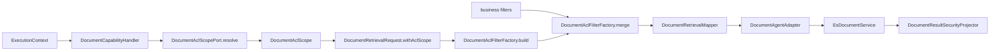
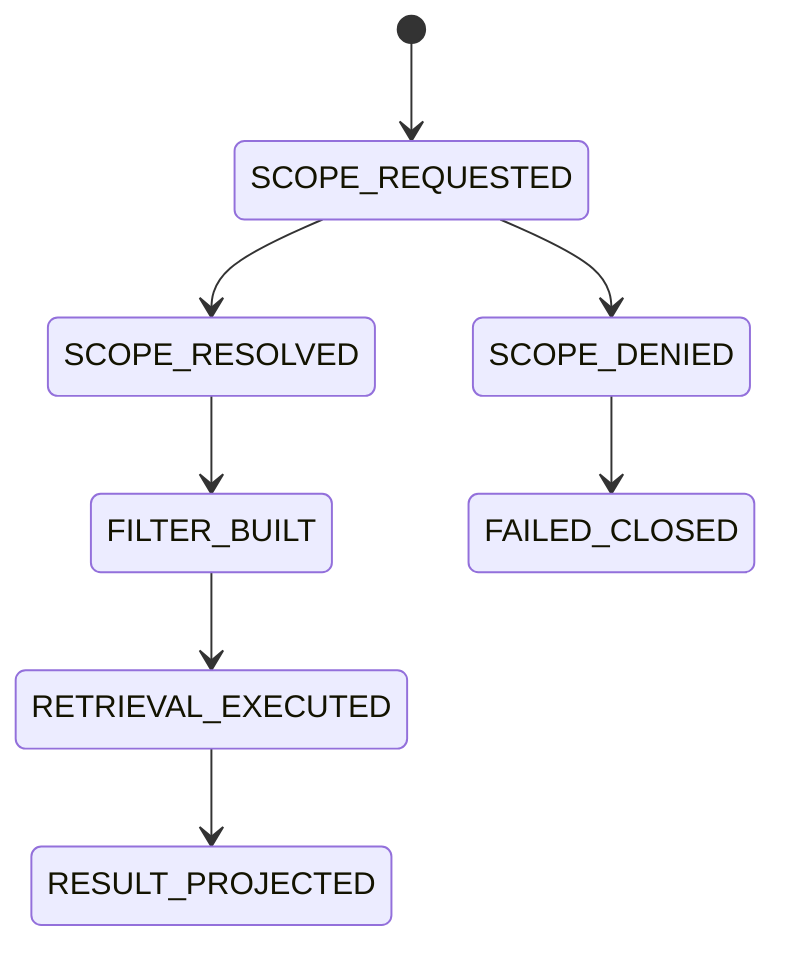

# 权限感知检索能力 L2 实施详细设计 v1.0

## 1. 文档信息

| 项目 | 内容 |
|---|---|
| 文档名称 | 权限感知检索能力 L2 实施详细设计 |
| 文档路径 | `docs/design/P2/03_权限感知检索能力_L2实施详细设计_v1.0.md` |
| 文档状态 | Draft |
| 当前版本 | v1.0 |
| 作者 | Codex |
| 创建日期 | 2026-07-06 |
| 最后更新日期 | 2026-07-06 |
| 适用范围 | 文档 ACL scope 解析、检索 filter 生成、ES filter 门禁、结果安全投影、撤权基础 |
| 上级文档 | `docs/design/Agent目标架构总览_v1.0.md`、`docs/design/Agent契约与规划架构设计_v1.0.md`、`docs/design/Agent能力执行内核架构设计_v1.0.md`、`docs/design/Agent元数据与上下文安全架构设计_v1.0.md` |
| 关联文档 | `docs/design/P1` 下现存全部 L2 详细设计文档；P2 下编号小于 03 的 00、01、02 详设及对应品审报告 |
| 是否可作为实现依据 | 是，可进入本地闭环编码；生产启用前必须冻结真实文档 ACL 权威源契约、撤权 SLA 和 08 运行门禁 |

## 2. 修改历史

| 序号 | 日期 | 位置 | 修改原因 | 修改内容 |
|---:|---|---|---|---|
| 1 | 2026-07-06 | 全文 | 初始化权限感知检索详设 | 新建 ACL scope、filter、fail closed、结果投影和撤权基础设计 |
| 2 | 2026-07-06 | 第 1、7 章 | 逐份设计品审修复 | 明确关联文档为 P1 L2 与 P2 上一个详设 `02_文档领域元数据与Capability配置能力_L2实施详细设计_v1.0.md` |
| 3 | 2026-07-06 | 第 1、4、7、8、10、11、12、16、19、20、21、22、23、24 章 | 03 单文档设计品审修复 | 补齐 P2 小于 03 的关联基线；修正 ACL scope request 为 `subjectRef/permissionEvidenceId/permissionVersion/deadline`；对齐 128 terms 门禁；区分本地编码前提与生产启用前提；补充本次品审报告 |

## 3. 文档状态说明

| 状态 | 含义 | 是否可作为开发依据 |
|---|---|---:|
| Draft | 草稿，内容尚未完成完整评审 | 否 |
| In Review | 评审中，内容可能继续调整 | 否 |
| Approved | 已评审通过，可作为实现依据 | 是 |
| Implementing | 已进入实现阶段 | 是 |
| Implemented | 已完成实现，并已与设计对齐 | 是 |
| Deprecated | 已废弃，不再作为实现依据 | 否 |

当前状态：Draft。

## 4. 背景与目标

当前代码已经具备本地 ACL 过滤骨架：

1. `DocumentAclScope` 表达 tenant、user、department、role、attribute、aclSnapshotVersion 和 expiresAt。
2. `DocumentRetrievalRequest` 已增加 `aclScope` 和 `withAclScope(...)`。
3. `DocumentCapabilityHandler` 通过 `DocumentAclScopePort` 解析 scope，并把 scope 注入检索请求。
4. `DocumentAclFilterFactory` 生成 `tenantId + corpusId + status + visibility` filter。
5. `DocumentAgentAdapter` 在 ACL scope 缺失时 fail closed。
6. `EsDocumentService` 对 document vector/hybrid 搜索缺失 filter 的请求 fail closed。
7. `DocumentResultSecurityProjector` 对文档结果执行字段过滤、引用校验和 fallback。

当前差距是：真实 ACL 权威源生产契约、撤权传播、ACL 正反例 validation、文档平台 ACL snapshot 版本治理尚未闭环；这些不阻塞本地闭环编码，但阻塞生产启用。

## 5. 设计范围

### 5.1 范围内

| 范围项 | 说明 |
|---|---|
| ACL scope 解析 | 通过 `DocumentAclScopePort` 从文档 ACL 权威源获得当前用户可见范围 |
| ACL filter 生成 | 将 scope 转为 ES bool.filter，必须包含 tenant、corpus、status、visibility |
| 业务 filter 合并 | 业务过滤条件与 ACL filter 合并到同一 `bool.filter` |
| ES 检索门禁 | document vector/hybrid 必须携带 ACL filter |
| 结果安全投影 | 命中、引用、候选答案/摘要必须经过 ResultSecurity |
| 撤权基础 | ACL snapshot 过期、撤权后 REVOKED/DELETED 不可检索 |

### 5.2 范围外

| 范围外项 | 原因 |
|---|---|
| 文档 chunk 写入 schema | 由 01 文档负责 |
| Domain Metadata 配置 | 由 02 文档负责 |
| 混合检索算法 | 由 04 文档负责 |
| 生成式回答/摘要 | 由 05、06 文档负责 |
| 完整撤权 SLA 监控 | 由 08 文档负责 |

## 6. 上级文档约束

| 上级文档 | 关键约束 | 本文承接方式 |
|---|---|---|
| `Agent目标架构总览_v1.0.md` | Runtime 不可信，Agent Service 是最终授权和审计边界 | ACL scope 不暴露给 Runtime；检索前由 Java 注入 |
| `Agent契约与规划架构设计_v1.0.md` | Runtime 不接收权限表达式、凭据、mask 规则 | PlanRequest 只含 domain/schema，不含 ACL scope |
| `Agent能力执行内核架构设计_v1.0.md` | Handler 不做最终权限决策，但必须只调用已验证 Adapter | Handler 只解析 ACL scope 并构造检索请求，结果仍经 ResultSecurity |
| `Agent元数据与上下文安全架构设计_v1.0.md` | Execution 当前复检和 ResultSecurity 统一 fail closed | ACL filter 缺失、过期或不匹配时拒绝执行 |

## 7. 关联文档与边界

| 关联文档集合 | 本文职责 | 对方职责 | 边界说明 |
|---|---|---|---|
| P2 00：`00_文档能力目标模式与实施路线图_L2实施详细设计_v1.0.md` | 承接公司政策、知识库、文学文献三类文档能力目标中的强 ACL 要求 | 定义 P2 目标模式、分层路线和 01～08 编排 | 本文只落实 03 权限感知检索，不扩大目标模式 |
| P2 00 品审报告：`00_文档能力目标模式与实施路线图_设计文档品审报告.md` | 继承 00 已确认的能力拆分、前后置关系和评审规则 | 记录 00 的审查结论 | 本文不修改 00 |
| P2 01：`01_文档语料接入与索引治理能力_L2实施详细设计_v1.0.md` | 使用 01 的 chunk ACL 字段、index alias 和 local validation 边界 | 维护语料接入、chunk schema、索引治理和 alias 切换 | 本文不重新定义 chunk 写入 schema |
| P2 01 品审报告：`01_文档语料接入与索引治理能力_设计文档品审报告.md` | 继承 `LOCAL_DOCUMENT_INDEX_VALIDATION_V1` 非生产真实 validation 的边界 | 记录 01 已关闭的配置 key、alias request 和 digest 风险 | 本文仅消费 01 的索引/ACL 字段结论 |
| P2 02：`02_文档领域元数据与Capability配置能力_L2实施详细设计_v1.0.md` | 基于 02 的 document domain、AdapterRole 和 capability 配置补充 ACL scope/filter | 维护三类 document domain、adapter registration 与开关 | 本文不新增 domain/capability，只定义权限感知检索 |
| P2 02 品审报告：`02_文档领域元数据与Capability配置能力_设计文档品审报告.md` | 继承 `DOCUMENT_RETRIEVABLE`、`snippet/content`、`index-by-domain` 和生产启用门禁结论 | 记录 02 已关闭的字段类型、证据字段和 adapter 映射风险 | 本文不修改 02 |
| D02_03 元数据授权与 Context 安全 | 文档 ACL 是检索层细粒度过滤 | 维护 capability/domain/field/result 权限 | 文档 ACL 不替代 Agent Authorization Snapshot |
| D03_01 UserPermissionAuthority | 复用用户主体和 capability/domain 权限边界 | 维护通用 Agent 权限投影 | 不修改 auth-service 契约 |
| D04 Adapter Metadata | 复用 `DOCUMENT_RETRIEVABLE` domain 投影 | 维护 Canonical Domain Metadata | ACL 权限表达式不进入 Domain Metadata |
| ResultSecurity mask 专项 | 文档结果仍需统一 ResultSecurity | 维护值级脱敏和字段过滤 | 不在 Adapter 端绕过 ResultSecurity |

## 8. 设计边界与约束

1. Agent Authorization 负责 capability/domain/field/result 级权限；文档 ACL 负责文档/section/chunk 可见性。
2. ACL scope 必须绑定 tenant、user、corpus/domain、aclSnapshotVersion 和 expiresAt。
3. scope 过期、缺失、过大、无 snapshotVersion 时 fail closed。
4. `visibility=PUBLIC` 仍必须叠加 tenant、corpus、status 过滤。
5. 业务 filter 不得覆盖或删除 ACL filter。
6. Adapter 和 ES 查询服务都要有 filter 缺失门禁，形成双层防线。
7. ACL scope request 必须沿用 P1/D02_03 的稳定主体模型：`subjectRef`、`permissionEvidenceId`、`permissionVersion`、`invocationId`、`deadline`，不得新增独立的 JWT、role 表达式或用户权限副本。

## 9. 总体设计



## 10. 详细功能设计

### 10.1 ACL scope 解析

| 输入 | 类型 | 说明 |
|---|---|---|
| invocationId | String | 当前 Invocation 审计关联 |
| subjectRef | String | P1/D02_03 定义的稳定执行主体引用 |
| domain | String | 文档 domain/corpus |
| permissionEvidenceId | String | Agent 授权证据 |
| permissionVersion | String | 当前权限版本 |
| deadline | Instant | 当前 Invocation absolute deadline |

输出 `DocumentAclScope`：

| 字段 | 说明 |
|---|---|
| tenantId/userId | 基础隔离 |
| departmentIds/roleIds/attributeKeys | 可见性匹配集合 |
| aclSnapshotVersion | ACL 快照版本 |
| expiresAt | scope 过期时间 |

业务规则：

1. `DisabledDocumentAclScopePort` 只用于未配置真实 ACL 权威源时 fail closed，不允许生产默认放行。
2. `HttpDocumentAclScopeClient` 必须校验请求的 `subjectRef/domain/permissionEvidenceId/permissionVersion/deadline` 非空；回包中的 `tenantId/userId/aclSnapshotVersion/expiresAt` 必须非空且可解析。
3. 若 ACL 权威源回包包含 `subjectRef` 或 `domain`，必须与请求一致；不一致时 fail closed。
4. scope 中 visibility terms 总量超过当前本地门禁 128 时拒绝，避免 ES terms 过大；生产若需放宽上限，必须先配置化并补充性能门禁。

### 10.2 ACL filter 生成

filter 必须至少包含：

```json
{
  "bool": {
    "filter": [
      { "term": { "tenantId": "tenant-1" } },
      { "term": { "corpusId": "company_policy" } },
      { "term": { "status": "ACTIVE" } },
      {
        "bool": {
          "should": [
            { "term": { "visibility": "PUBLIC" } },
            { "terms": { "userIds": ["u1"] } },
            { "terms": { "departmentIds": ["d1"] } },
            { "terms": { "roleIds": ["r1"] } },
            { "terms": { "attributeKeys": ["a1"] } }
          ],
          "minimum_should_match": 1
        }
      }
    ]
  }
}
```

### 10.3 业务 filter 合并

1. `DocumentRetrievalMapper` 先把 `ValidatedFilter` 转为 ES DSL。
2. `DocumentAclFilterFactory.merge(businessFilter, aclFilter)` 合并为一个 `bool.filter`。
3. 合并后 filter 为空时抛出异常。
4. 业务 filter 中出现 `tenantId/corpusId/status/visibility/userIds/departmentIds/roleIds/attributeKeys` 时必须拒绝或由 Validator 禁止，避免用户覆盖 ACL 字段。

### 10.4 结果安全投影

`DocumentResultSecurityProjector.filter(...)` 必须：

1. 校验 domain 在当前 `ExecutionScope.allowedDomains` 中。
2. 过滤不可展示的 hit/citation 字段。
3. 对候选 answer/summary 执行 citation id 校验。
4. 校验失败时清除 candidate text，回退到基于过滤后 citation 的安全文本。

## 11. 接口设计

| 接口 | 方法 | 路径 | 说明 |
|---|---|---|---|
| ACL scope resolve | POST | base URL: `agent.document.acl.scope-url`；path: `/internal/document-acl/scope/resolve` | 外部文档 ACL 权威源，返回当前主体文档可见范围 |

请求体：

| 字段 | 类型 | 必填 | 说明 |
|---|---|---:|---|
| requestId | String | 是 | 取 `invocationId` |
| subjectRef | String | 是 | 稳定执行主体引用 |
| domain | String | 是 | 文档 domain/corpus |
| permissionEvidenceId | String | 是 | 当前 Agent 授权证据 |
| permissionVersion | String | 是 | 当前权限版本 |
| deadline | String | 是 | ISO-8601 absolute deadline |

响应体：

| 字段 | 类型 | 必填 | 说明 |
|---|---|---:|---|
| tenantId | String | 是 | 文档平台租户隔离键 |
| userId | String | 是 | 文档平台用户标识 |
| departmentIds | String[] | 否 | 部门可见性投影 |
| roleIds | String[] | 否 | 角色可见性投影 |
| attributeKeys | String[] | 否 | 属性可见性投影 |
| aclSnapshotVersion | String | 是 | 文档 ACL 快照版本 |
| expiresAt | String | 是 | ISO-8601 过期时间 |
| subjectRef | String | 否 | 若返回，必须等于请求 subjectRef |
| domain | String | 否 | 若返回，必须等于请求 domain |

内部 Port：

| Port | 方法 | 入参 | 返回 |
|---|---|---|---|
| `DocumentAclScopePort` | `resolve` | `DocumentAclScopeRequest request` | `DocumentAclScope` |

配置：

| 配置项 | 类型 | 说明 |
|---|---|---|
| `agent.document.acl.enabled` | boolean | 是否启用 ACL scope 解析 |
| `agent.document.acl.scope-url` | String | ACL 权威源地址 |
| `agent.document.acl.timeout` | Duration | ACL 请求超时 |

## 12. 数据设计

| 类型 | 路径 | 关键字段 |
|---|---|---|
| `DocumentAclScope` | `agent-adapter-api/src/main/java/com/dylan/agent/adapter/api/document/DocumentAclScope.java` | `tenantId`、`userId`、`departmentIds`、`roleIds`、`attributeKeys`、`aclSnapshotVersion`、`expiresAt` |
| `DocumentAclScopeRequest` | `agent-service/src/main/java/com/dylan/agent/capability/document/acl/DocumentAclScopeRequest.java` | `invocationId`、`subjectRef`、`domain`、`permissionEvidenceId`、`permissionVersion`、`deadline` |
| chunk ACL fields | ES document | `tenantId`、`corpusId`、`aclRef`、`aclVersion`、`visibility`、`userIds`、`departmentIds`、`roleIds`、`attributeKeys`、`status` |

## 13. 状态流转设计



过期或撤权路径：

1. `DocumentAclScope.isExpiredAt(now)=true` 时不构建 filter。
2. ES chunk `status != ACTIVE` 不进入结果。
3. ACL snapshotVersion 与文档平台撤权版本不一致时由 08 触发重建或关闭 corpus。

## 14. 幂等、事务与一致性设计

| 场景 | 设计 |
|---|---|
| ACL resolve 重试 | 单次 invocation 内不做不可见自动重试；失败即 fail closed |
| scope 缓存 | 不跨 invocation 缓存；scope 只在当前执行链使用 |
| 撤权一致性 | 检索依赖 ES ACL 投影最终一致；Execution 当前复检只能覆盖 capability/domain/field |
| 结果写 Context | 只写 citationIds 等最小 context，不写 ACL scope 或权限表达式 |

## 15. 权限、风控与审计设计

1. ACL 权威源调用使用内部服务身份，不转发用户 JWT。
2. 审计记录 `permissionEvidenceId`、`aclSnapshotVersion`、scope term count、domain、invocationId、diagnosticId。
3. 不记录完整 userIds/departmentIds/roleIds 大列表和权限表达式。
4. scope 过大、过期、为空、tenant/domain 不匹配均为高风险拒绝。

## 16. 性能与容量设计

| 项目 | 设计 |
|---|---|
| scope term 上限 | 当前本地门禁不超过 128，超过 fail closed |
| ACL 请求超时 | 默认 2s，遵守 absolute deadline |
| ES filter | 使用 `bool.filter`，不参与评分 |
| 大部门可见性 | 建议由文档平台预投影属性或分层 ACL，避免超大 terms |

## 17. 兼容性与扩展性设计

1. 后续新增 ACL 维度只能扩展 `DocumentAclScope` 和 `DocumentAclFilterFactory`，并补 ES mapping。
2. 不允许将 ACL 权限表达式放入 Runtime Prompt 或 Agent Context。
3. 若某 corpus 不支持文档级 ACL，必须显式标记为仅 tenant/public 模式，不可默认放行。

## 18. 日志、监控与告警

| 类型 | 内容 |
|---|---|
| 日志 | ACL resolve 成功/失败、scope 过期、filter 缺失、ES document filter 拒绝 |
| 指标 | acl_resolve_latency、acl_resolve_failure、acl_scope_expired、document_filter_missing |
| 告警 | ACL 权威源失败率升高、scope 过大、撤权后仍命中 REVOKED 文档 |
| 禁止 | 记录完整 ACL scope、用户角色表达式、文档正文 |

## 19. 实现落点清单

### 19.1 Java 实现落点

| 序号 | 类型 | 路径 | 类名 | 方法名 | 入参类型 | 返回类型 | 新增/修改 | 说明 |
|---:|---|---|---|---|---|---|---|---|
| 1 | DTO | `agent-adapter-api/src/main/java/com/dylan/agent/adapter/api/document/DocumentAclScope.java` | `DocumentAclScope` | constructor | `String tenantId, String userId, List<String> departmentIds, List<String> roleIds, List<String> attributeKeys, String aclSnapshotVersion, Instant expiresAt` | `DocumentAclScope` | 修改 | ACL scope 值对象 |
| 2 | DTO | `agent-adapter-api/src/main/java/com/dylan/agent/adapter/api/document/DocumentRetrievalRequest.java` | `DocumentRetrievalRequest` | `withAclScope` | `DocumentAclScope aclScope` | `DocumentRetrievalRequest` | 修改 | 注入 ACL scope |
| 3 | Port | `agent-service/src/main/java/com/dylan/agent/capability/document/acl/DocumentAclScopePort.java` | `DocumentAclScopePort` | `resolve` | `DocumentAclScopeRequest request` | `DocumentAclScope` | 修改 | ACL 权威源端口 |
| 4 | Client | `agent-service/src/main/java/com/dylan/agent/capability/document/acl/HttpDocumentAclScopeClient.java` | `HttpDocumentAclScopeClient` | `resolve` | `DocumentAclScopeRequest request` | `DocumentAclScope` | 修改 | HTTP ACL client |
| 5 | Handler | `agent-service/src/main/java/com/dylan/agent/capability/document/DocumentCapabilityHandler.java` | `DocumentCapabilityHandler` | `withAclScope` | `DocumentRetrievalRequest request, ExecutionContext context` | `DocumentRetrievalRequest` | 修改 | 解析并注入 scope |
| 6 | Factory | `agent-adapter-document/src/main/java/com/dylan/agent/adapter/document/DocumentAclFilterFactory.java` | `DocumentAclFilterFactory` | `build` | `String domain, DocumentAclScope scope` | `Map<String,Object>` | 修改 | 生成 ACL filter |
| 7 | Factory | 同上 | 同上 | `merge` | `Map<String,Object> businessFilter, Map<String,Object> aclFilter` | `Map<String,Object>` | 修改 | 合并 filter |
| 8 | Mapper | `agent-adapter-document/src/main/java/com/dylan/agent/adapter/document/DocumentRetrievalMapper.java` | `DocumentRetrievalMapper` | `filterDsl` | `DocumentRetrievalRequest request` | `Map<String,Object>` | 修改 | 业务 filter + ACL filter |
| 9 | Adapter | `agent-adapter-document/src/main/java/com/dylan/agent/adapter/document/DocumentAgentAdapter.java` | `DocumentAgentAdapter` | `retrieve` | `DocumentRetrievalRequest request` | `AdapterDocumentResult` | 修改 | scope 缺失 fail closed |
| 10 | Service | `es-query-service/src/main/java/com/dylan/esquery/service/EsDocumentService.java` | `EsDocumentService` | `vectorSearchBody` | `String index, VectorSearchRequest request` | `Map<String,Object>` | 修改 | 文档向量检索必须带 filter |
| 11 | Service | 同上 | 同上 | `validateHybridRequest` | `String index, HybridSearchRequest request` | `void` | 修改 | 文档混合检索必须带 filters |
| 12 | Projector | `agent-service/src/main/java/com/dylan/agent/metadata/result/DocumentResultSecurityProjector.java` | `DocumentResultSecurityProjector` | `filter` | `DocumentAgentResultPayload candidate, ExecutionScope scope` | `FilteredResult<DocumentAgentResultPayload>` | 修改 | 结果安全投影，显式校验 `allowedDomains` 与可展示字段 |
| 13 | Validator | `agent-service/src/main/java/com/dylan/agent/capability/document/DocumentPlanValidator.java` | `DocumentPlanValidator` | `validate` | `DocumentAgentPlan rawPlan, ExecutionValidationContext context` | `ValidatedDocumentPlan` | 修改 | 通过 Domain Metadata/FieldConstraintValidator 禁止用户业务 filter 使用 ACL 保护字段 |

### 19.2 Python 实现落点

本文不新增 Python 结构；Runtime 不接收 ACL scope。

### 19.3 脚本与配置落点

| 序号 | 类型 | 路径 | 文件名 | 脚本 / 配置项 | 入参 / 参数 | 输出 / 效果 | 新增/修改 | 说明 |
|---:|---|---|---|---|---|---|---|---|
| 1 | YAML | `agent-service/src/main/resources/application.yml` | `application.yml` | `agent.document.acl.enabled` | boolean | ACL 开关 | 修改 |
| 2 | YAML | 同上 | 同上 | `agent.document.acl.scope-url` | URL | ACL 权威源 | 修改 |
| 3 | YAML | 同上 | 同上 | `agent.document.acl.timeout` | Duration | ACL 超时 | 修改 |
| 4 | Fixture | `agent-adapter-document/src/test/resources/document-acl` | `acl-scope.json` | 测试数据 | 无 | ACL filter 测试 | 新增 |

### 19.4 测试落点

| 序号 | 测试类型 | 路径 | 测试类 / 文件 | 测试方法 / 用例 | 验证目标 | 新增/修改 |
|---:|---|---|---|---|---|---|
| 1 | Unit | `agent-service/src/test/java/com/dylan/agent/capability/document/DocumentAclScopePortTest.java` | `DocumentAclScopePortTest` | `disabledPortFailsClosed`、`httpClientRejectsMissingPermissionEvidenceId` | ACL port fail closed | 修改 |
| 2 | Unit | `agent-adapter-document/src/test/java/com/dylan/agent/adapter/document/DocumentAclFilterFactoryTest.java` | `DocumentAclFilterFactoryTest` | `buildsFailClosedAclFilterWithTenantCorpusAndVisibility`、`rejectsExpiredAclScope`、`rejectsAclScopeWithTooManyVisibilityTerms` | filter 必含安全条件，128 terms 门禁生效 | 修改 |
| 3 | Unit | `agent-adapter-document/src/test/java/com/dylan/agent/adapter/document/DocumentRetrievalMapperTest.java` | `DocumentRetrievalMapperTest` | `mergesBusinessAndAclFiltersForHybrid` | filter 合并 | 修改 |
| 4 | Unit | `agent-adapter-document/src/test/java/com/dylan/agent/adapter/document/DocumentAgentAdapterTest.java` | `DocumentAgentAdapterTest` | `failsClosedWhenAclScopeMissing` | Adapter 双层门禁 | 修改 |
| 5 | Unit | `es-query-service/src/test/java/com/dylan/esquery/service/EsDocumentServiceTest.java` | `EsDocumentServiceTest` | `vectorSearchRejectsMissingFilterForDocumentIndex`、`hybridSearchRejectsMissingFiltersForDocumentIndex` | ES 查询门禁 | 修改 |
| 6 | Unit | `agent-service/src/test/java/com/dylan/agent/metadata/result/DocumentResultSecurityProjectorTest.java` | `DocumentResultSecurityProjectorTest` | `rejectsCandidateTextWithUnknownCitation`、`rejectsDomainOutsideExecutionScope` | 结果安全投影 | 修改 |
| 7 | Unit | `agent-service/src/test/java/com/dylan/agent/capability/document/DocumentAclScopePortTest.java` | `DocumentAclScopePortTest` | `httpClientRejectsMismatchedReturnedSubjectOrDomain` | ACL source 回包主体/domain 不匹配 fail closed | 修改 |
| 8 | Unit | `agent-service/src/test/java/com/dylan/agent/capability/document/DocumentPlanValidatorTest.java` | `DocumentPlanValidatorTest` | `rejectsAclProtectedFieldsInBusinessFilters` | 用户业务 filter 不得使用 ACL 保护字段 | 修改 |
| 9 | 文档品审 | `docs/design/P2/03_权限感知检索能力_设计文档品审报告.md` | 品审报告 | 03 单文档审查 | 确认 03 继承 L1、P1 L2 与 P2 00/01/02，且 ACL 契约可本地编码 | 新增 |

## 20. 测试设计

| 测试类型 | 验证内容 |
|---|---|
| 单元测试 | ACL scope 校验、filter build/merge、Adapter fail closed |
| 契约测试 | ACL scope request/response 内部字段完整性 |
| 权限测试 | 无 scope、过期 scope、tenant/domain 不匹配均拒绝 |
| 异常测试 | ACL 权威源超时、返回空 scope、返回过大 terms |
| 契约回归 | `DocumentAclScopeRequest` 使用 `subjectRef/permissionEvidenceId/permissionVersion/deadline`，不得回退到 JWT、role 或 `tenantId/userId` 请求模型 |
| 集成测试 | ACL 正例命中文档，负例不命中 |
| 回归测试 | 非文档 index search 不受文档 ACL filter 门禁影响 |

## 21. 风险与待确认事项

| 序号 | 类型 | 内容 | 影响 | 建议处理方式 | 是否阻塞 |
|---:|---|---|---|---|---|
| 1 | 外部契约 | 文档 ACL 权威源生产 request/response 未冻结 | 无法保证生产 HTTP client 与文档平台长期兼容 | 本地闭环按本文请求/响应结构和 mock server 先实现；生产启用前冻结契约并补 contract test | 否，本地编码不阻塞；生产启用阻塞 |
| 2 | 撤权时效 | ES ACL 投影更新存在延迟 | 撤权后短时间可能命中旧 chunk | 08 文档定义 SLA、告警和关闭 corpus 策略 | 否 |
| 3 | 超大权限集合 | 大部门/大角色 terms 可能超过 128 本地门禁 | ES 查询变慢或失败，或本地直接 fail closed | 优先使用属性化 ACL；如需提高上限，先配置化并补性能测试 | 否 |

## 22. 评审记录

| 轮次 | 日期 | 评审结论 | 发现问题数 | 修正问题数 | 遗留问题 | 说明 |
|---:|---|---|---:|---:|---|---|
| 1 | 2026-07-06 | 需要修正 | 2 | 2 | 0 | 补充真实 ACL 权威源和撤权延迟风险 |
| 2 | 2026-07-06 | 通过 | 0 | 0 | 0 | 已覆盖 ACL scope、filter、ES 门禁、ResultSecurity 和测试落点 |
| 3 | 2026-07-06 | 通过 | 7 | 7 | 0 | design-doc-review 发现 P2 关联基线不足、ACL request 字段与代码/P1 不一致、HTTP path 表述不清、term 上限不一致、本地编码与生产启用阻塞混淆、ACL 保护字段和 ResultSecurity domain 测试落点不足；已修复并复审通过 |

## 23. 实施对齐检查

| 检查项 | 设计要求 | 实现位置 | 是否满足 | 说明 |
|---|---|---|---|---|
| scope 值对象 | 表达 tenant/user/visibility terms/version/expiry | `DocumentAclScope` | 部分满足 | 已有骨架 |
| scope 请求契约 | 使用 subjectRef/domain/permissionEvidenceId/permissionVersion/deadline | `DocumentAclScopeRequest`、`HttpDocumentAclScopeClient` | 部分满足 | 已有骨架，需补回包 subject/domain 不匹配测试 |
| ACL filter | 必含 tenant/corpus/status/visibility，terms 超过 128 fail closed | `DocumentAclFilterFactory.build` | 部分满足 | 已有本地测试，需集成 |
| 业务 filter 保护 | 用户 filter 不得覆盖 ACL 字段 | `DocumentPlanValidator`、Domain Metadata | 部分满足 | 依赖 02 不投影 ACL 字段，需补回归测试 |
| Adapter fail closed | 缺 scope 不检索 | `DocumentAgentAdapter.retrieve` | 已满足 | 已有测试 |
| ES 门禁 | document vector/hybrid 缺 filter 拒绝 | `EsDocumentService` | 部分满足 | 已有本地测试 |
| ResultSecurity domain 门禁 | 文档结果 domain 必须在当前 `ExecutionScope.allowedDomains` | `DocumentResultSecurityProjector` | 部分满足 | 需补 `rejectsDomainOutsideExecutionScope` |
| 真实 ACL 源 | HTTP 权威源生产契约 | `HttpDocumentAclScopeClient` | 部分满足 | 本地 client 已有骨架；生产外部契约待冻结 |
| 品审报告 | 03 单文档设计品审 | `docs/design/P2/03_权限感知检索能力_设计文档品审报告.md` | 已满足 | 本次报告已生成 |

## 24. 完成摘要

| 项目 | 内容 |
|---|---|
| 目标文档 | `docs/design/P2/03_权限感知检索能力_L2实施详细设计_v1.0.md` |
| 文档状态 | Draft |
| 是否可作为实现依据 | 是，可进入本地闭环编码；真实 ACL 权威源契约、撤权 SLA 和 08 运行门禁是生产启用前置 |
| 评审轮次 | 2 |
| 主要修改内容 | 新建 ACL scope、filter、ES 门禁、结果安全投影、撤权基础和测试设计 |
| 是否已追加修改历史 | 是 |
| 是否已补充实现落点清单 | 是 |
| 是否存在阻塞问题 | 否；生产启用前仍需冻结 ACL 权威源契约 |
| 是否存在遗留风险 | 是 |
| 是否需要用户进一步授权 | 否 |
| 建议下一步 | 进入 03 本地编码与测试闭环，优先补 HTTP client 回包校验、ACL 保护字段回归测试和 mock contract test |
