# 关键词 / 向量 / 混合检索能力 L2 实施详细设计 v1.0

## 1. 文档基本信息

| 项目 | 内容 |
| --- | --- |
| 文档名称 | 关键词 / 向量 / 混合检索能力 L2 实施详细设计 |
| 文档路径 | `docs/design/P2/04_关键词向量混合检索能力_L2实施详细设计_v1.0.md` |
| 文档状态 | Draft |
| 版本 | v1.0 |
| 编写日期 | 2026-07-06 |
| 最近修订 | 2026-07-07 |
| 所属阶段 | P2 |
| 适用范围 | 文档型能力的 KEYWORD、VECTOR、HYBRID 检索请求映射、ES 查询、融合排序与结果诊断 |
| 上级文档 | `docs/design/Agent目标架构总览_v1.0.md`；`docs/design/Agent能力执行内核架构设计_v1.0.md`；`docs/design/Agent契约与规划架构设计_v1.0.md`；`docs/design/Agent元数据与上下文安全架构设计_v1.0.md` |
| 关联文档 | `docs/design/P1` 下现存全部 L2 详细设计文档；`docs/design/P2` 下编号小于 04 的 00、01、02、03 详设及对应品审报告 |
| 前置详设 | `docs/design/P2/00_文档能力目标模式与实施路线图_L2实施详细设计_v1.0.md`；`docs/design/P2/01_文档语料接入与索引治理能力_L2实施详细设计_v1.0.md`；`docs/design/P2/02_文档领域元数据与Capability配置能力_L2实施详细设计_v1.0.md`；`docs/design/P2/03_权限感知检索能力_L2实施详细设计_v1.0.md` |
| 品审报告 | `docs/design/P2/04_关键词向量混合检索能力_设计文档品审报告.md` |

## 2. 修改历史

| 序号 | 日期 | 章节 | 修改说明 | 备注 |
| --- | --- | --- | --- | --- |
| 1 | 2026-07-06 | 全文 | 初始化关键词 / 向量 / 混合检索详设 | 基于当前仓库 `agent-adapter-document`、`es-query-api`、`es-query-service` 已有骨架补充实施边界 |
| 2 | 2026-07-06 | 第 1、7 章 | 逐份设计品审修复 | 明确关联文档为 P1 L2 与 P2 上一个详设 `03_权限感知检索能力_L2实施详细设计_v1.0.md` |
| 3 | 2026-07-07 | 第 1、3、7、8、10、12、15、19、20、21、23、24 章 | 04 设计品审修复 | 补齐 P2 小于 04 的基线，修正 ACL 字段名，明确 `index-by-domain`、`sourceExcludes`、诊断契约门禁和本地/生产启用边界 |

## 3. 文档状态说明

本文为 P2 文档检索通道实施详设，状态为 Draft。本文可作为代码实施依据，但实施前必须确认：

1. 01 索引治理详设中的 document chunk mapping 已覆盖 `tenantId`、`corpusId`、`documentId`、`chunkId`、`chunkIndex`、`title`、`content`、`snippet`、`section`、`aclRef`、`aclVersion`、`visibility`、`departmentIds`、`roleIds`、`userIds`、`attributeKeys`、`status`，并在启用向量检索时校验 `embedding` dense_vector 维度；`contextBefore`、`contextAfter` 属于可选增强字段，不作为 01 必填字段。
2. 03 权限感知检索详设中的 ACL filter 已在 adapter 侧合并到 keyword、vector、hybrid 请求。
3. 07 Provider 详设中的 embedding 维度、模型和超时配置是 VECTOR/HYBRID 生产启用门禁；在本地闭环中，未启用 embedding 时只允许验证 KEYWORD 和 HYBRID 降级到 KEYWORD 的路径，VECTOR 必须 fail closed。

## 4. 背景与目标

当前仓库已经具备文档检索模式枚举、文档检索请求、adapter 映射、ES keyword/vector/hybrid 查询接口和 RRF 融合器：

1. `DocumentRetrievalMode` 支持 `KEYWORD`、`VECTOR`、`HYBRID`。
2. `DocumentCapabilityHandler.withQueryVectorIfNeeded(...)` 能在 embedding 关闭时把 HYBRID 降级为 KEYWORD，并在 VECTOR 模式下 fail closed。
3. `DocumentRetrievalMapper` 能把 `DocumentRetrievalRequest` 转换为 keyword DSL、`VectorSearchRequest` 和 `HybridSearchRequest`。
4. `EsDocumentService` 已提供 `vectorSearch(...)`、`hybridSearch(...)`、`vectorSearchBody(...)`。
5. `HybridSearchMerger` 已用 RRF 生成稳定排序。

本文目标是把上述骨架收敛为三类文档目标的统一检索实施方案：

1. 公司政策查询或总结：以 keyword 精准过滤和可解释 citation 为主，必要时启用 hybrid。
2. 知识库查阅或总结：以 hybrid 为默认目标，兼顾术语精确匹配和语义召回。
3. 文献/文学资料查阅或总结：以 vector/hybrid 增强语义召回，但仍必须返回 citation 和出处。

## 5. 范围说明

| 类型 | 范围内 | 范围外 |
| --- | --- | --- |
| 请求模式 | KEYWORD、VECTOR、HYBRID 的请求映射、默认参数、降级策略 | LLM 生成、摘要组织 |
| 查询执行 | ES keyword DSL、knn/vector 查询、hybrid 双通道查询 | 文档平台抓取、索引重建 |
| 排序融合 | RRF 分数、channel、rank、稳定 tie-break | 业务推荐排序或个性化排序 |
| 安全输入 | 复用 ACL filter 和字段约束 | ACL 权威源设计 |
| 结果输出 | hit/citation 所需字段、contextBefore/contextAfter、diagnostic 字段 | 前端展示样式 |

## 6. 上级文档约束继承

| 上级约束 | 本文继承方式 |
| --- | --- |
| capabilityId 是鉴权、路由、执行和审计主键 | 检索模式只能是 `document.search`、`document.answer`、`document.summarize` 下的执行参数，不新增 capabilityId |
| Java 是契约源，Python runtime 不可信 | `DocumentRetrievalOptions`、`VectorSearchRequest`、`HybridSearchRequest` 以 Java 源定义为准 |
| Adapter 是业务域公开边界 | `DocumentAgentAdapter` 调用 `es-query-service`，Agent Core 不直接拼 ES DSL |
| Context 只在 capability 选择后加载 | 检索通道不读取跨 capability 上下文，只接收 validated plan 和 execution scope |
| ResultSecurity 是统一输出安全边界 | 检索命中先作为候选结果，再由 `DocumentResultSecurityProjector` 投影 |

## 7. 关联文档与边界

本任务的关联文档固定为 `docs/design/P1` 下现存全部 L2 详细设计文档，以及 P2 下编号小于 04 的 00、01、02、03 详设和对应品审报告。本文只引用其已落地能力和评审结论，不修改其内容。

| 关联文档集合 | 本文职责 | 对方职责 | 边界说明 |
| --- | --- | --- | --- |
| P2 00 详设：`00_文档能力目标模式与实施路线图_L2实施详细设计_v1.0.md` | 继承 00 的能力拆分、实施顺序和进入编码门禁 | 维护 00-08 能力路线图和评审规则 | 本文只落地 04，不调整能力拆分 |
| P2 00 品审报告：`00_文档能力目标模式与实施路线图_设计文档品审报告.md` | 继承 00 已通过的能力路线与评审闭环结论 | 记录 00 的审查结论 | 本文不修改 00 |
| P2 01 详设：`01_文档语料接入与索引治理能力_L2实施详细设计_v1.0.md` | 继承 chunk schema、mapping 校验、alias/read index 和 embedding 维度门禁 | 维护语料接入、chunk 必填字段、索引定义校验和 rebuild/alias 治理 | 本文不重新设计写入和索引治理 |
| P2 01 品审报告：`01_文档语料接入与索引治理能力_设计文档品审报告.md` | 继承 01 已关闭的 sourceUrl、AliasSwitchRequest、validation digest 和生产启用风险结论 | 记录 01 的审查结论 | 本文不修改 01 |
| P2 02 详设：`02_文档领域元数据与Capability配置能力_L2实施详细设计_v1.0.md` | 继承 `DOCUMENT_RETRIEVABLE`、文档 domain metadata、`snippet/content` 证据字段和 `agent.document-adapter.index-by-domain` | 维护三类文档 domain、Capability 配置和 adapter read alias 映射 | 本文不得继续依赖生产 `indexPrefix + domain` 隐式拼接 |
| P2 02 品审报告：`02_文档领域元数据与Capability配置能力_设计文档品审报告.md` | 继承 02 已关闭的字段类型、证据字段和 adapter 索引映射风险 | 记录 02 的审查结论 | 本文不修改 02 |
| P2 03 详设：`03_权限感知检索能力_L2实施详细设计_v1.0.md` | 基于 03 的 ACL scope/filter 约束设计 keyword/vector/hybrid 三通道检索 | 维护 ACL 权威源、filter 合并、fail closed 和撤权基础 | 本文不重新定义权限模型，三通道必须复用 03 输出的 filter |
| P2 03 品审报告：`03_权限感知检索能力_设计文档品审报告.md` | 继承 03 已关闭的 ACL request、HTTP 权限接口、term 上限、本地/生产门禁和 ResultSecurity 测试结论 | 记录 03 的审查结论 | 本文不修改 03 |
| P1 L2 关联文档集合 | 继承契约治理、Capability Kernel、元数据授权、ResultSecurity、Adapter Metadata、扩展验证和安全专项约束 | 维护 P1 主链和治理能力 | 本文不修改 P1 文档 |
| D01 契约生成与治理 | 明确新增/变更的 Java 契约落点 | 维护 OpenAPI、Python generated model、drift gate | 检索参数变更必须从 Java contract 开始 |
| D02 Capability Kernel 系列 | 复用 validator/handler/adapter 执行链 | 维护可信执行内核、生命周期和上下文 finalization | 不新增并行执行内核 |
| D03 Capability v2 系列 | 保持 capability-first 原子切换 | 维护 capability 注册、权限权威源、回滚门禁 | 检索模式不是 capability 选择依据 |
| D04 Adapter 与 Domain Metadata 收敛 | 复用 domain field catalog 和 AdapterRegistration | 维护领域字段、角色、adapter 唯一事实源 | keyword filter/sort 字段来自 metadata |
| D05 Capability 扩展验证与遗留清理 | 证明新增文档检索不改主流程 | 维护扩展不变量和遗留清理清单 | 不修改 Core/Planning 主流程 |
| 安全专项 L2 | 复用密钥、ResultSecurity、分页与拒绝提示规则 | 维护通用安全工具 | 不新增平行脱敏或鉴权路径 |

## 8. 设计边界与不变量

1. 检索通道只处理召回和排序，不决定用户是否可访问文档；权限由 03 的 ACL scope 和 filter 输入决定。
2. `VECTOR` 必须存在非空 `queryVector`，且维度与 `agent.document.embedding.dimension` 一致；否则 fail closed。
3. `HYBRID` 在 embedding 不可用或异常时可降级为 `KEYWORD`，但必须在结果参数或日志中保留降级诊断。
4. keyword、vector、hybrid 都必须使用同一组业务 filter 与 ACL filter。
5. hybrid 融合采用 RRF，排序必须稳定：`rrfScore desc`、`score desc`、`documentId asc`、`chunkIndex asc`。
6. ES 返回命中必须保留 citation 所需字段，不能只返回 `_score` 和摘要文本。
7. 检索请求的 `topK`、`page`、`size` 不得突破 `AgentProperties.DocumentProperties`、domain metadata、execution scope 的较小上限。
8. 检索实现不得绕过 `DocumentRetrievableAdapter`，Agent Core 不直接依赖 ES client。
9. 文档索引解析必须继承 02 的 `agent.document-adapter.index-by-domain` 显式 read alias 映射；生产环境不得继续以 `indexPrefix + domain` 推导索引，缺少映射时 fail closed。
10. keyword、vector、hybrid 返回 `_source` 和 `metadata` 时必须排除 `embedding`；日志、诊断和响应不得记录或返回完整 `queryVector`。
11. HYBRID 降级诊断优先使用 `AdapterDocumentRetrievalDiagnostics`、`HybridRetrievalDiagnostics` 和结构化日志。若要把 `effectiveRetrievalMode`、`fallbackReason` 暴露到公共 API 响应，必须按 D01 修改 Java 契约、OpenAPI 和 Python generated model，不能在 04 编码中绕过契约治理。

## 9. 总体方案

```mermaid
flowchart LR
    A["DocumentPlanValidator"] --> B["ValidatedDocumentPlan"]
    B --> C["DocumentCapabilityHandler"]
    C --> D{"retrievalMode"}
    D -->|KEYWORD| E["DocumentRetrievalRequest queryText"]
    D -->|VECTOR/HYBRID| F["DocumentEmbeddingPort"]
    F --> G["queryVector"]
    G --> H["DocumentAgentAdapter"]
    E --> H
    H --> I["DocumentRetrievalMapper"]
    I --> J["keyword DSL"]
    I --> K["VectorSearchRequest"]
    I --> L["HybridSearchRequest"]
    J --> M["DocumentSearchClient.search"]
    K --> N["DocumentSearchClient.vectorSearch"]
    L --> O["DocumentSearchClient.hybridSearch"]
    O --> P["EsDocumentService.hybridSearch"]
    P --> Q["HybridSearchMerger"]
    M --> R["DocumentEvidenceMapper"]
    N --> R
    Q --> R
    R --> S["AdapterDocumentResult"]
```

## 10. 详细功能设计

### 10.1 KEYWORD 检索

KEYWORD 是默认能力，适用于政策条款、知识库标题、文档编号、章节名等精确或半精确查询。

处理规则：

1. `DocumentPlanValidator` 归一化 queryText、filters、sorts、topK/page/size。
2. `DocumentRetrievalMapper.toSearchDsl(...)` 生成 `bool.must`。
3. queryText 非空时使用 `multi_match`，字段权重固定为 `title^2`、`content`、`snippet`、`section`。
4. 业务 filter 与 ACL filter 合并到 `bool.filter`。
5. DSL 必须设置 `_source.excludes=["embedding"]`，避免 keyword 路径把向量字段带入 raw response、metadata 或日志。
6. sort 仅允许 domain metadata 暴露的 sort fields。

### 10.2 VECTOR 检索

VECTOR 适用于语义召回强、关键词不足的文档查询。

处理规则：

1. `DocumentCapabilityHandler.withQueryVectorIfNeeded(...)` 在 VECTOR 模式调用 `DocumentEmbeddingPort.embed(...)`。
2. embedding 未启用、返回空向量、维度不匹配时抛出异常，不返回 keyword fallback。
3. `DocumentRetrievalMapper.toVectorRequest(...)` 填充 `queryVector`、`filterDsl`、`k`、`numCandidates`。
4. `EsDocumentService.vectorSearchBody(...)` 必须校验文档索引存在 filterDsl，避免未带 ACL filter 的 knn 查询。
5. 返回 hit 必须携带 `_source` 中的 citation 字段和上下文窗口字段。

### 10.3 HYBRID 检索

HYBRID 适用于知识库和文献/文学资料类查询的默认目标模式。

处理规则：

1. 若 embedding 正常，adapter 发送 `HybridSearchRequest`。
2. 若 embedding 未启用或调用异常，handler 将 mode 改为 KEYWORD，保持请求可用。
3. `HybridSearchRequest.keywordDsl` 不带 filter 的 query 主体由 `toKeywordDslMap(...)` 生成，`filters` 单独传入，确保 keyword/vector 共享同一过滤条件。
4. `DocumentRetrievalMapper.toHybridRequest(...)` 必须设置 `sourceExcludes=["embedding"]`，`EsDocumentService.keywordSearchBody(...)` 必须应用该排除规则，避免 hybrid keyword 分支把向量字段带入 `_source` 和 `metadata`。
5. `EsDocumentService.hybridSearch(...)` 分别执行 keyword 和 vector 请求。
6. `HybridSearchMerger.merge(...)` 用 RRF 聚合，保留 `retrievalChannels`、`keywordRank`、`vectorRank`、`rrfScore`。

### 10.4 上下文窗口

`DocumentContextOptions` 通过 `DocumentRetrievalMapper.toContextWindow(...)` 转换为 `HybridContextWindow`，用于在 ES 层补充前后 chunk。窗口只能影响 evidence 上下文，不得扩大 ACL 可见范围。

### 10.5 降级诊断

当前代码已经具备 HYBRID 到 KEYWORD 的降级行为，并已存在 adapter/ES 层诊断对象：

1. `AdapterDocumentRetrievalDiagnostics` 可表达 `retrievalMode`、hit count、`fusionStrategy`、`degraded`、`degradationReason`。
2. `HybridRetrievalDiagnostics` 可表达 hybrid 双通道召回数量、返回数量、RRF 策略和降级状态。
3. 04 本地编码只要求把 HYBRID 降级原因保留在 adapter 诊断或结构化日志中，并保证不记录 `queryVector`、完整 content、完整 ACL subject/group 列表。
4. 若后续确需在公共响应中新增 `effectiveRetrievalMode`、`fallbackReason`，只能按 D01 从 `agent-api` Java 源契约开始更新，并同步 OpenAPI、Python generated model 和 contract drift test。未经该授权，04 不修改 `AgentDocumentParameters` 或 `AgentDocumentResult` 公共结构。

## 11. API 与契约设计

### 11.1 Agent plan 输入

| 字段 | 所属类 | 规则 |
| --- | --- | --- |
| `document.retrievalOptions.retrievalMode` | `DocumentRetrievalOptions` | 默认 `KEYWORD`；可选 `VECTOR`、`HYBRID` |
| `document.retrievalOptions.topK` | `DocumentRetrievalOptions` | 受 `maxEvidenceCount`、`maxSize`、domain `maxPageSize`、scope `maxResultRows` 约束 |
| `document.retrievalOptions.keywordK` | `DocumentRetrievalOptions` | HYBRID keyword 召回数量，默认 `agent.document.hybrid.keyword-k` |
| `document.retrievalOptions.vectorK` | `DocumentRetrievalOptions` | HYBRID vector 召回数量，默认 `agent.document.hybrid.vector-k` |
| `document.retrievalOptions.rrfK` | `DocumentRetrievalOptions` | RRF 参数，默认 `agent.document.hybrid.rrf-k` |
| `document.retrievalOptions.numCandidates` | `DocumentRetrievalOptions` | vector candidates，默认 `agent.document.hybrid.num-candidates` |

### 11.2 es-query-service API

| API | 方法 | 路径 | 请求 | 响应 |
| --- | --- | --- | --- | --- |
| keyword search | POST | `/indexes/{index}/search` | ES DSL JSON string | ES raw response |
| vector search | POST | `/indexes/{index}/vector-search` | `VectorSearchRequest` | ES raw response |
| hybrid search | POST | `/indexes/{index}/hybrid-search` | `HybridSearchRequest` | `HybridSearchResponse` |

### 11.3 响应契约

`HybridSearchHit` 必须保留以下字段：

| 字段 | 用途 |
| --- | --- |
| `documentId`、`chunkId`、`chunkIndex` | citation id、排序稳定性、上下文定位 |
| `charStart`、`charEnd` | chunk 内字符范围，辅助 citation 定位 |
| `title`、`sourceType`、`section`、`page`、`sourceUri` | 用户可解释出处 |
| `snippet`、`content` | evidence 和摘要输入 |
| `contextBefore`、`contextAfter` | 上下文窗口 |
| `score`、`rrfScore`、`keywordRank`、`vectorRank`、`retrievalChannels` | 检索诊断 |
| `metadata` | 保留索引源字段，但不得包含 `embedding` 或完整 `queryVector`，进入 Agent 输出前必须经过 ResultSecurity |

## 12. 数据模型与字段映射

| ES 字段 | 类型目标 | 来源 | 备注 |
| --- | --- | --- | --- |
| `documentId` | keyword | 文档平台 | 文档级唯一标识 |
| `chunkId` | keyword | chunk 切分器 | citation 优先 ID |
| `chunkIndex` | integer | chunk 切分器 | 稳定排序和上下文窗口 |
| `title` | text + keyword | 文档平台 | keyword 权重字段 |
| `content` | text | chunk 文本 | keyword/vector evidence |
| `snippet` | text | 摘要片段 | fallback evidence |
| `section` | text + keyword | 文档结构 | keyword 权重字段 |
| `embedding` | dense_vector | embedding provider | VECTOR/HYBRID 必需 |
| `tenantId`、`corpusId`、`status` | keyword | 01/03 ACL 与索引治理 | 三通道 filter 必填基础字段 |
| `aclRef`、`aclVersion`、`visibility` | keyword | 01/03 ACL 投影 | 权限快照和可见性字段 |
| `userIds`、`departmentIds`、`roleIds`、`attributeKeys` | keyword[] | 01/03 ACL 投影 | 按 `visibility` 条件必填，业务 filter 禁止覆盖 |
| `contextBefore`、`contextAfter` | keyword/text array | 索引增强 | 可选上下文窗口，不属于 01 必填字段 |

## 13. 状态流转

| 状态 | 触发条件 | 处理 |
| --- | --- | --- |
| `PLANNED_KEYWORD` | plan 未指定 mode 或指定 KEYWORD | 直接 keyword 检索 |
| `PLANNED_VECTOR` | plan 指定 VECTOR | 必须生成 queryVector |
| `PLANNED_HYBRID` | plan 指定 HYBRID | 尝试生成 queryVector |
| `EFFECTIVE_KEYWORD` | KEYWORD 或 HYBRID 降级 | keyword DSL 请求 |
| `EFFECTIVE_VECTOR` | VECTOR 且 embedding 成功 | vector 请求 |
| `EFFECTIVE_HYBRID` | HYBRID 且 embedding 成功 | hybrid 请求 |
| `FAILED_CLOSED` | VECTOR 缺少 embedding、维度不匹配、ACL filter 缺失 | 抛错，进入统一失败处理 |

## 14. 幂等、并发与一致性

1. 同一 plan、同一 queryVector、同一 alias 指向下，检索结果应保持排序稳定。
2. hybrid 融合对同一 `chunkId` 去重；缺少 `chunkId` 时使用 `documentId` 或 hit `_id`。
3. alias 切换期间，检索只使用 02 配置的 `index-by-domain` read alias，不直接访问写入中的物理索引，也不得以 `indexPrefix + domain` 替代生产映射。
4. 降级行为只影响当前 invocation，不写入全局状态。
5. 并发检索不共享 mutable request 实例；mapper 生成独立请求对象。

## 15. 权限、安全与审计

1. 文档索引的 vector 查询必须要求 filterDsl；`EsDocumentService.vectorSearchBody(index, request)` 对 document index 缺少 filter 的请求 fail closed。
2. HYBRID 的 keyword/vector 两个通道必须使用同一份 filterDsl。
3. ES `_source`、adapter evidence metadata 和用户响应 metadata 均不得包含 `embedding`；`HybridSearchRequest.sourceExcludes` 必须被 keyword 分支和 vector 分支同时尊重。
4. 检索日志不得输出完整 queryVector、完整 content、完整 ACL subject/group 列表或未脱敏 metadata。
5. 允许记录 `retrievalMode`、内部 effective mode、`topK`、`keywordK`、`vectorK`、`rrfK`、hit count、降级原因。
6. 检索输出进入用户响应前必须经过 `DocumentResultSecurityProjector`。

## 16. 性能与容量

| 项目 | 目标 |
| --- | --- |
| 默认 topK | `agent.document.default-size=5` |
| 最大 evidence | `agent.document.max-evidence-count=8` |
| 默认 keywordK | `agent.document.hybrid.keyword-k=20` |
| 默认 vectorK | `agent.document.hybrid.vector-k=20` |
| 默认 rrfK | `agent.document.hybrid.rrf-k=60` |
| 默认 numCandidates | `agent.document.hybrid.num-candidates=100` |
| queryText 上限 | `agent.document.max-query-text-length=500` |
| 大字段控制 | ES `_source` 返回必须排除 `embedding` 并避免无界 metadata 扩散，用户响应由 ResultSecurity 截断 |

## 17. 兼容性设计

1. 默认 `agent.document.enabled=false`，不影响现有员工/交易 capability。
2. 未启用 embedding 时，已有 KEYWORD 路径仍可工作。
3. HYBRID 降级到 KEYWORD 是向后兼容行为；VECTOR fail closed 是安全行为。
4. 如果新增公共响应诊断字段，必须作为 D01 Java 契约变更处理，并保持字段可选、向后兼容；04 本地闭环默认只使用 adapter 诊断和日志。
5. 不改变 `QueryableAdapter`、`AggregatableAdapter` 既有契约。

## 18. 日志、观测与诊断

| 类型 | 字段 |
| --- | --- |
| 结构化日志 | `invocationId`、`capabilityId`、`domain`、`retrievalMode`、内部 effective mode、`topK`、`hitCount`、`degradationReason` |
| 指标 | keyword/vector/hybrid 请求数、vector 失败数、hybrid 降级数、空结果数、ES 调用耗时 |
| 诊断 | rrf 参数、channel 分布、ACL filter 是否存在、embedding 维度 |
| 禁止记录 | queryVector 完整数组、完整 content、完整 ACL subject/group 列表、`embedding`、未脱敏 metadata |

## 19. 实现落点清单

| 序号 | 类型 | 文件路径 | 类/接口 | 方法/字段 | 入参 | 出参 | 动作 | 说明 |
| --- | --- | --- | --- | --- | --- | --- | --- | --- |
| 1 | Contract | `agent-api/src/main/java/com/dylan/agent/api/plan/DocumentRetrievalMode.java` | `DocumentRetrievalMode` | enum | 无 | enum | 已存在/校验 | KEYWORD/VECTOR/HYBRID |
| 2 | Contract | `agent-api/src/main/java/com/dylan/agent/api/plan/DocumentRetrievalOptions.java` | `DocumentRetrievalOptions` | `retrievalMode`、`keywordK`、`vectorK`、`rrfK`、`numCandidates` | plan JSON | options | 已存在/校验 | 检索参数 |
| 3 | Contract | `agent-adapter-api/src/main/java/com/dylan/agent/adapter/api/document/AdapterDocumentRetrievalDiagnostics.java` | `AdapterDocumentRetrievalDiagnostics` | `retrievalMode`、`degraded`、`degradationReason` | adapter result | diagnostics | 已存在/校验 | 04 内部诊断优先复用，不新增公共响应字段 |
| 4 | Validator | `agent-service/src/main/java/com/dylan/agent/capability/document/DocumentPlanValidator.java` | `DocumentPlanValidator` | `hybridOptions` | `DocumentRetrievalOptions` | `DocumentHybridOptions` | 修改 | 参数边界与默认值 |
| 5 | Handler | `agent-service/src/main/java/com/dylan/agent/capability/document/DocumentCapabilityHandler.java` | `DocumentCapabilityHandler` | `withQueryVectorIfNeeded` | `ValidatedDocumentPlan, ExecutionContext` | `DocumentRetrievalRequest` | 修改 | embedding、HYBRID 降级、VECTOR fail closed 和维度校验 |
| 6 | Handler | 同上 | `DocumentCapabilityHandler` | `copyRequest` | request/mode/vector | request | 修改 | 降级时保留内部诊断或日志；公共响应契约变更需转 D01 |
| 7 | Config | `agent-adapter-document/src/main/java/com/dylan/agent/adapter/document/DocumentAdapterProperties.java` | `DocumentAdapterProperties` | `indexByDomain` | YAML map | alias map | 修改 | 继承 02，支持 `agent.document-adapter.index-by-domain` 显式 read alias |
| 8 | Adapter | `agent-adapter-document/src/main/java/com/dylan/agent/adapter/document/DocumentAgentAdapter.java` | `DocumentAgentAdapter` | `retrieve`、`resolveIndex` | `DocumentRetrievalRequest` | `AdapterDocumentResult` | 修改 | ACL scope 缺失 fail closed；按 mode 选择 ES API；缺少 index-by-domain 时 fail closed |
| 9 | Mapper | `agent-adapter-document/src/main/java/com/dylan/agent/adapter/document/DocumentRetrievalMapper.java` | `DocumentRetrievalMapper` | `toSearchDsl` | request | JSON string | 修改 | keyword DSL 必须合并业务 filter、ACL filter，并设置 `_source.excludes=["embedding"]` |
| 10 | Mapper | 同上 | `DocumentRetrievalMapper` | `toVectorRequest` | request | `VectorSearchRequest` | 修改 | vector request 携带 `filterDsl`、`k`、`numCandidates` |
| 11 | Mapper | 同上 | `DocumentRetrievalMapper` | `toHybridRequest` | request | `HybridSearchRequest` | 修改 | hybrid request 携带 `filters`、`contextWindow`、`sourceExcludes=["embedding"]` |
| 12 | Client | `agent-adapter-document/src/main/java/com/dylan/agent/adapter/document/DocumentSearchClient.java` | `DocumentSearchClient` | `search`/`vectorSearch`/`hybridSearch` | index/request | ES/hybrid response | 已存在/校验 | 下游 API 路径保持 `/indexes/{index}/...` |
| 13 | Mapper | `agent-adapter-document/src/main/java/com/dylan/agent/adapter/document/DocumentEvidenceMapper.java` | `DocumentEvidenceMapper` | `toAdapterResult` | ES raw/hybrid response | `AdapterDocumentResult` | 修改 | 映射 diagnostics；metadata 输出前剔除 `embedding` |
| 14 | API | `es-query-api/src/main/java/com/dylan/esquery/api/model/VectorSearchRequest.java` | `VectorSearchRequest` | fields | queryVector/filterDsl/k/numCandidates | DTO | 已存在/校验 | vector 请求模型 |
| 15 | API | `es-query-api/src/main/java/com/dylan/esquery/api/model/HybridSearchRequest.java` | `HybridSearchRequest` | `sourceExcludes` 等字段 | keywordDsl/filters/queryVector/topK/options | DTO | 已存在/校验 | hybrid 请求模型已具备 `sourceExcludes` |
| 16 | API | `es-query-api/src/main/java/com/dylan/esquery/api/model/HybridSearchHit.java` | `HybridSearchHit` | citation/rank/metadata fields | ES hit | DTO | 已存在/校验 | 包含 `charStart`、`charEnd`、rank、channel 和 metadata |
| 17 | Controller | `es-query-service/src/main/java/com/dylan/esquery/controller/EsQueryController.java` | `EsQueryController` | `vectorSearch`/`hybridSearch` | index/request | response | 已存在/校验 | API 入口 |
| 18 | Service | `es-query-service/src/main/java/com/dylan/esquery/service/EsDocumentService.java` | `EsDocumentService` | `vectorSearchBody` | index/request | Map | 修改 | knn body、ACL filter 门禁、`_source.excludes` |
| 19 | Service | 同上 | `EsDocumentService` | `keywordSearchBody` | `HybridSearchRequest` | Map | 修改 | HYBRID keyword 分支必须合并 filters 并应用 `sourceExcludes` |
| 20 | Service | 同上 | `EsDocumentService` | `hybridSearch`、`validateHybridRequest` | index/request | `HybridSearchResponse` | 修改 | 双通道共享 filters，document index 缺少 filters fail closed |
| 21 | Service | `es-query-service/src/main/java/com/dylan/esquery/service/HybridSearchMerger.java` | `HybridSearchMerger` | `merge` | keywordHits/vectorHits/request | `List<HybridSearchHit>` | 修改 | RRF 融合、去重、tie-break；metadata 不带 `embedding` |
| 22 | Config | `agent-service/src/main/java/com/dylan/agent/config/AgentProperties.java` | `DocumentProperties.HybridProperties` | `keywordK`、`vectorK`、`rrfK`、`numCandidates` | YAML | properties | 已存在/校验 | 默认参数 |
| 23 | Config | `agent-service/src/main/resources/application.yml` | `agent.document.hybrid`、`agent.document-adapter.index-by-domain` | 配置项 | YAML | properties | 修改 | HYBRID 默认值和三类文档 domain read alias 映射 |

## 20. 测试设计

| 序号 | 类型 | 文件路径 | 测试类 | 测试点 | 预期 |
| --- | --- | --- | --- | --- | --- |
| 1 | Unit | `agent-service/src/test/java/com/dylan/agent/capability/document/DocumentPlanValidatorTest.java` | `DocumentPlanValidatorTest` | HYBRID 参数默认值和上限 | 超限拒绝，默认值正确 |
| 2 | Unit | `agent-service/src/test/java/com/dylan/agent/kernel/core/DocumentCapabilityHandlerTest.java` | `DocumentCapabilityHandlerTest` | HYBRID embedding 失败降级 KEYWORD | 不抛错并走 keyword |
| 3 | Unit | 同上 | `DocumentCapabilityHandlerTest` | VECTOR embedding 未启用 | fail closed |
| 4 | Unit | 同上 | `DocumentCapabilityHandlerTest` | VECTOR/HYBRID embedding 维度不匹配 | fail closed，不降级绕过维度问题 |
| 5 | Unit | `agent-adapter-document/src/test/java/com/dylan/agent/adapter/document/DocumentAgentAdapterTest.java` | `DocumentAgentAdapterTest` | 三种 mode 使用 `index-by-domain` | 缺少 domain alias 时 fail closed，不使用生产 `indexPrefix + domain` |
| 6 | Unit | `agent-adapter-document/src/test/java/com/dylan/agent/adapter/document/DocumentRetrievalMapperTest.java` | `DocumentRetrievalMapperTest` | KEYWORD 合并业务 filter 和 ACL filter | DSL 包含 filter，且 `_source.excludes` 包含 `embedding` |
| 7 | Unit | 同上 | `DocumentRetrievalMapperTest` | VECTOR/HYBRID filter 与 `sourceExcludes` | `VectorSearchRequest.filterDsl` 非空；`HybridSearchRequest.filters` 非空且 `sourceExcludes` 包含 `embedding` |
| 8 | Unit | `agent-adapter-document/src/test/java/com/dylan/agent/adapter/document/DocumentEvidenceMapperTest.java` | `DocumentEvidenceMapperTest` | hybrid diagnostics 和 metadata 安全映射 | `degraded/degradationReason` 可映射；metadata 不含 `embedding` |
| 9 | Unit | `es-query-service/src/test/java/com/dylan/esquery/service/EsDocumentServiceTest.java` | `EsDocumentServiceTest` | document vector 缺少 filter | fail closed |
| 10 | Unit | 同上 | `EsDocumentServiceTest` | document hybrid 缺少 filters | fail closed |
| 11 | Unit | 同上 | `EsDocumentServiceTest` | `keywordSearchBody` 应用 `sourceExcludes` | HYBRID keyword 分支 `_source.excludes` 包含 `embedding` |
| 12 | Unit | `es-query-service/src/test/java/com/dylan/esquery/service/HybridSearchMergerTest.java` | `HybridSearchMergerTest` | RRF 排序、去重、tie-break、缺少 `chunkId` fallback | 稳定输出；排序为 `rrfScore desc`、`score desc`、`documentId asc`、`chunkIndex asc` |
| 13 | Contract | `agent-api/src/test/java/com/dylan/agent/api/contract/AgentRuntimeContractOpenApiGenerationTest.java` | `AgentRuntimeContractOpenApiGenerationTest` | 仅当新增公共诊断字段时执行契约漂移验证 | OpenAPI 与 Java 源一致；Python generated model 由 OpenAPI 生成 |
| 14 | Integration | `agent-adapter-document/src/test/java/com/dylan/agent/adapter/document/DocumentHybridRetrievalIntegrationTest.java` | `DocumentHybridRetrievalIntegrationTest` | ES keyword/vector/hybrid 端到端 | ACL filter 生效、citation 字段完整、metadata 不含 `embedding` |

## 21. 风险与阻塞项

| 序号 | 类型 | 风险 | 触发场景 | 处理建议 | 是否阻塞实施 |
| --- | --- | --- | --- | --- | --- |
| 1 | Mapping/Provider | `embedding` 字段缺失、维度不一致或 Provider 未启用 | VECTOR/HYBRID 查询生产索引 | 01 mapping 校验、07 provider 维度配置和启动门禁同时满足后才启用 VECTOR/HYBRID | 否，本地 KEYWORD 与 HYBRID 降级不阻塞；生产 VECTOR/HYBRID 启用阻塞 |
| 2 | 安全 | vector/hybrid 查询缺少 ACL filter | 直接调用 es-query API 或 adapter 漏传 scope/filter | `EsDocumentService.vectorSearchBody`、`validateHybridRequest` 对 document index fail closed，并补单元测试 | 是，编码完成门禁 |
| 3 | 安全/容量 | `embedding` 通过 keyword/hybrid `_source` 或 metadata 泄露 | HYBRID keyword 分支不应用 `sourceExcludes`，或 evidence mapper 原样透传 `_source` | mapper 设置 `sourceExcludes`，ES keyword/vector 分支都应用 `_source.excludes`，evidence metadata 二次剔除 | 是，编码完成门禁 |
| 4 | 索引路由 | 继续使用 `indexPrefix + domain` 访问生产索引 | 三类文档 domain read alias 与物理索引命名不一致 | 继承 02，新增 `index-by-domain` 显式映射，缺失时 fail closed | 是，编码完成门禁 |
| 5 | 诊断契约 | 为展示降级原因直接修改公共响应字段 | 未按 D01 同步 OpenAPI/Python generated model | 04 仅保留 adapter 诊断和日志；公共字段变更转 D01 | 否 |
| 6 | 性能 | keywordK/vectorK/numCandidates 过大 | 高并发文档问答 | validator 上限、domain 默认值、指标告警 | 否 |
| 7 | 排序 | 缺少 `chunkId` 导致去重不稳定 | 文档平台未提供 `chunkId` 或旧索引未补齐字段 | 01 强制 `chunkId` 必填；merger fallback 到 `documentId/_id` 只能作为兼容保护并补测试 | 否，本地可测试；生产索引准入阻塞 |

## 22. 评审记录

| 轮次 | 日期 | 结论 | S0 | S1 | 主要问题 | 修复情况 |
| --- | --- | --- | --- | --- | --- | --- |
| 1 | 2026-07-06 | 通过 | 0 | 0 | 无 | 已按 `detailed-design-document` 检查章节完整性、L1/P1 边界、实现落点和测试设计 |
| 2 | 2026-07-07 | 通过 | 0 | 0 | 初审发现关联基线、ACL 字段、sourceExcludes、index-by-domain、诊断契约和本地/生产门禁描述不完整 | 已修复并生成 `04_关键词向量混合检索能力_设计文档品审报告.md` |

## 23. 实现对齐检查

| 检查项 | 目标 | 当前仓库落点 | 状态 | 备注 |
| --- | --- | --- | --- | --- |
| KEYWORD 检索 | 默认可用，带 ACL filter 和 `_source.excludes` | `DocumentRetrievalMapper.toSearchDsl`、`DocumentAgentAdapter.retrieve` | 部分满足 | 当前需补 `_source.excludes=["embedding"]` 和 P2 domain 配置 |
| VECTOR 检索 | embedding 可用时启用，缺 filter fail closed | `DocumentEmbeddingPort`、`VectorSearchRequest`、`EsDocumentService.vectorSearchBody` | 部分满足 | Provider 默认关闭；filter 门禁已有基础 |
| HYBRID 检索 | keyword/vector 融合，双分支共享 filters 和 source excludes | `HybridSearchRequest`、`EsDocumentService.hybridSearch`、`HybridSearchMerger` | 部分满足 | 需补 `sourceExcludes` 传递与端到端集成测试 |
| ACL filter | 三通道一致 | `DocumentAclFilterFactory.merge`、`EsDocumentService.validateHybridRequest` | 部分满足 | 03 已定义权威源前提，需补 hybrid/vector 缺失 filter 测试 |
| index-by-domain | 文档 domain 显式 read alias | `DocumentAgentAdapter`、`DocumentAdapterProperties` | 未满足 | 当前代码仍有 `indexPrefix + domain`，04 编码需继承 02 修复 |
| metadata 安全 | metadata 不含 `embedding`、queryVector 不外泄 | `DocumentRetrievalMapper`、`EsDocumentService`、`DocumentEvidenceMapper` | 未满足 | 需补 source excludes 和 mapper/evidence 测试 |
| RRF 排序 | 稳定可解释 | `HybridSearchMerger.merge` | 部分满足 | 需补复杂 tie-break、缺少 `chunkId` fallback 测试 |
| 诊断字段 | 内部可判断降级，公共字段 D01 门禁 | `AdapterDocumentRetrievalDiagnostics`、`HybridRetrievalDiagnostics` | 部分满足 | 不在 04 默认新增公共响应字段 |
| 公共契约 | Java/OpenAPI/Python 一致 | `AgentRuntimeContractOpenApiGenerationTest` | 未变更 | 只有新增公共诊断字段时才触发 D01 契约生成 |

## 24. 完成摘要

| 项目 | 结论 |
| --- | --- |
| 目标文档 | `docs/design/P2/04_关键词向量混合检索能力_L2实施详细设计_v1.0.md` |
| 文档状态 | Draft |
| 是否可作为实现依据 | 是，可进入 04 本地编码与测试闭环；生产启用前必须满足 01 mapping、02 index-by-domain、03 ACL、07 Provider 和 08 验证/回滚门禁 |
| 主要修改内容 | 定义 KEYWORD、VECTOR、HYBRID 检索模式、请求映射、ES 查询、RRF 融合、内部降级诊断、metadata 安全和测试策略 |
| 是否修改上级/关联文档 | 否 |
| 是否已补充实现落点清单 | 是 |
| 是否已执行内部评审 | 是，2 轮 |
| 是否存在 S0/S1 遗留 | 否 |
| 是否需要用户进一步授权 | 否，除非实施时新增公共响应诊断字段、修改 P1/L1 契约或扩大到 07/08 实施范围 |
