# 证据绑定回答能力 L2 实施详细设计 v1.0

## 1. 文档基本信息

| 项目 | 内容 |
| --- | --- |
| 文档名称 | 证据绑定回答能力 L2 实施详细设计 |
| 文档路径 | `docs/design/P2/05_证据绑定回答能力_L2实施详细设计_v1.0.md` |
| 文档状态 | Draft |
| 版本 | v1.0 |
| 编写日期 | 2026-07-06 |
| 最近修订 | 2026-07-07 |
| 所属阶段 | P2 |
| 适用范围 | 文档型 ANSWER 能力的 evidence 打包、生成调用、引用校验、fallback/refuse 和 ResultSecurity 投影 |
| 上级文档 | `docs/design/Agent目标架构总览_v1.0.md`；`docs/design/Agent能力执行内核架构设计_v1.0.md`；`docs/design/Agent契约与规划架构设计_v1.0.md`；`docs/design/Agent元数据与上下文安全架构设计_v1.0.md` |
| 关联文档 | `docs/design/P1` 下现存全部 L2 详细设计文档；`docs/design/P2` 下编号小于 05 的 00、01、02、03、04 详设及对应品审报告 |
| 前置详设 | `docs/design/P2/00_文档能力目标模式与实施路线图_L2实施详细设计_v1.0.md`；`docs/design/P2/01_文档语料接入与索引治理能力_L2实施详细设计_v1.0.md`；`docs/design/P2/02_文档领域元数据与Capability配置能力_L2实施详细设计_v1.0.md`；`docs/design/P2/03_权限感知检索能力_L2实施详细设计_v1.0.md`；`docs/design/P2/04_关键词向量混合检索能力_L2实施详细设计_v1.0.md` |
| 后续生产启用依赖 | `docs/design/P2/07_LLM与EmbeddingProvider接入能力_L2实施详细设计_v1.0.md`；07 不是本次 05 的已评审前置基线，只作为 generation provider 生产启用门禁登记 |
| 品审报告 | `docs/design/P2/05_证据绑定回答能力_设计文档品审报告.md` |

## 2. 修改历史

| 序号 | 日期 | 章节 | 修改说明 | 备注 |
| --- | --- | --- | --- | --- |
| 1 | 2026-07-06 | 全文 | 初始化证据绑定回答详设 | 基于当前仓库 `DocumentCapabilityHandler`、`DocumentEvidenceContextPacker`、`DocumentCitationVerifier`、`DocumentResultSecurityProjector` 已有骨架 |
| 2 | 2026-07-06 | 第 1、7 章 | 逐份设计品审修复 | 明确关联文档为 P1 L2 与 P2 上一个详设 `04_关键词向量混合检索能力_L2实施详细设计_v1.0.md` |
| 3 | 2026-07-07 | 第 1、3、7、8、10、11、12、15、17、19、20、21、23、24 章 | 05 设计品审修复 | 补齐 P2 小于 05 的基线，修正 07 依赖位置、`answerText/candidateAnswerText` 契约、`citationBindings` 模型、inline 引用校验和 `sourceUri` 净化要求 |

## 3. 文档状态说明

本文为 P2 文档证据绑定回答能力实施详设，状态为 Draft。本文可作为 `document.answer` 实施依据，但实现必须满足：

1. ANSWER 输出不得出现无 citation 的事实性断言。
2. LLM 只消费经 ACL 和 ResultSecurity 前置过滤后的 evidence package。
3. citation 校验失败时，不得把 candidate answer 直接返回给用户。
4. 生成服务不可用时，按 `DocumentGenerationFailurePolicy` fallback 或 refuse。
5. `answerText` 是当前公共响应契约中的用户可见字段；`candidateAnswerText`、`candidateSummaryText`、`candidateSummaryBullets` 是 `@JsonIgnore` 候选字段，只能由 `DocumentResultSecurityProjector` 在 `SUCCEEDED + VERIFIED + citations` 条件下投影为最终输出。
6. 07 Provider 详设未完成前，05 本地闭环只允许使用 `DisabledDocumentGenerationPort` 或测试替身验证生成链路；生产启用真实 generation provider 必须等待 07 和 08 门禁闭合。

## 4. 背景与目标

文档回答能力面向“公司政策查询”“知识库问答”“文献/文学资料查阅问答”等场景。与普通检索不同，ANSWER 需要在召回 evidence 后生成自然语言回答，但回答必须绑定来源、可审计、可拒绝。

当前仓库已有关键骨架：

1. `DocumentPlanValidator` 强制 ANSWER/SUMMARIZE `citationRequired=true`。
2. `DocumentCapabilityHandler.applyGenerationIfEnabled(...)` 已在检索后调用 generation port。
3. `DocumentEvidencePreSecurityFilter` 可在打包前过滤 evidence。
4. `DocumentEvidenceContextPacker` 生成 `EvidenceContextPackage` 和 digest。
5. `DocumentCitationVerifier` 校验 LLM 返回的 `citationBindings` 是否只引用 evidence package 内 citation。
6. `DocumentResultSecurityProjector` 对候选文本中的 inline citation 标记、citation、fallback 文本做最终安全投影。

本文目标是把 ANSWER 能力定义为“先召回、再基于证据生成、再引用校验、最后安全投影”的闭环。

## 5. 范围说明

| 类型 | 范围内 | 范围外 |
| --- | --- | --- |
| 能力 | `document.answer` | `document.search`、摘要批处理 |
| 输入 | queryText、filters、retrievalOptions、generationOptions | UI 表单设计 |
| evidence | citation 列表、上下文窗口、digest、预算 | 文档切分算法 |
| 生成 | generation port 调用、失败策略、输出字段 | LLM provider 内部实现 |
| 安全 | evidence 前置过滤、引用校验、ResultSecurity 投影 | auth-service 权限模型修改 |

## 6. 上级文档约束继承

| 上级约束 | 本文继承方式 |
| --- | --- |
| capabilityId 是主键 | ANSWER 使用 `document.answer`，不以 queryText 或 domain 临时分支 |
| Runtime 不可信 | LLM 生成结果视为 candidate，必须经过 Java 校验和 ResultSecurity |
| Adapter 是领域公开边界 | ANSWER 先通过 `DocumentRetrievableAdapter` 获取 evidence |
| Context 安全 | evidence 写入 context 前必须是 citation id 摘要，不写入全文 |
| ResultSecurity 统一输出边界 | answerText/summary/citations 最终由 `DocumentResultSecurityProjector` 过滤 |

## 7. 关联文档与边界

本任务的关联文档固定为 `docs/design/P1` 下现存全部 L2 详细设计文档，以及 P2 下编号小于 05 的 00、01、02、03、04 详设和对应品审报告。本文只引用其已落地能力和评审结论，不修改其内容。`07_LLM与EmbeddingProvider接入能力` 是后续生产启用依赖，不作为本文已评审前置事实来源。

| 关联文档集合 | 本文职责 | 对方职责 | 边界说明 |
| --- | --- | --- | --- |
| P2 00 详设：`00_文档能力目标模式与实施路线图_L2实施详细设计_v1.0.md` | 继承 00 的能力拆分、实施顺序和进入编码门禁 | 维护 00-08 能力路线图和评审规则 | 本文只落地 05，不调整能力拆分 |
| P2 00 品审报告：`00_文档能力目标模式与实施路线图_设计文档品审报告.md` | 继承 00 已通过的能力路线和文档治理结论 | 记录 00 的审查结论 | 本文不修改 00 |
| P2 01 详设：`01_文档语料接入与索引治理能力_L2实施详细设计_v1.0.md` | 继承 chunk schema、citation 字段、sourceUrl/sourceUri 安全边界和索引治理门禁 | 维护文档接入、chunk 必填字段、mapping 和 alias 治理 | 本文不重新设计语料写入 |
| P2 01 品审报告：`01_文档语料接入与索引治理能力_设计文档品审报告.md` | 继承 01 已关闭的 sourceUrl、AliasSwitchRequest 和 validation digest 风险结论 | 记录 01 的审查结论 | 本文不修改 01 |
| P2 02 详设：`02_文档领域元数据与Capability配置能力_L2实施详细设计_v1.0.md` | 继承 `DOCUMENT_RETRIEVABLE`、文档 domain、证据字段和 `index-by-domain` | 维护三类文档 domain、Capability 配置和 adapter 映射 | 本文不在 handler 中硬编码业务域 |
| P2 02 品审报告：`02_文档领域元数据与Capability配置能力_设计文档品审报告.md` | 继承 02 已关闭的字段类型、证据字段和 adapter 索引映射结论 | 记录 02 的审查结论 | 本文不修改 02 |
| P2 03 详设：`03_权限感知检索能力_L2实施详细设计_v1.0.md` | 继承 ACL scope/filter、ResultSecurity 前置约束和撤权基础 | 维护 ACL 权威源、filter 合并和 fail closed | 本文不重新定义权限模型 |
| P2 03 品审报告：`03_权限感知检索能力_设计文档品审报告.md` | 继承 03 已关闭的 ACL request、term 上限、本地/生产门禁和 ResultSecurity 测试结论 | 记录 03 的审查结论 | 本文不修改 03 |
| P2 04 详设：`04_关键词向量混合检索能力_L2实施详细设计_v1.0.md` | 基于 04 的检索模式、RRF、citation 字段、metadata 安全和降级诊断设计 evidence package 与回答生成 | 维护 keyword/vector/hybrid 检索、融合排序和检索 metadata 安全 | 本文不重新定义召回排序，只消费检索 evidence |
| P2 04 品审报告：`04_关键词向量混合检索能力_设计文档品审报告.md` | 继承 04 已关闭的 `embedding` 排除、`index-by-domain`、ACL 字段和公共诊断契约门禁结论 | 记录 04 的审查结论 | 本文不修改 04 |
| P1 L2 关联文档集合 | 继承契约治理、Capability Kernel、元数据授权、ResultSecurity、Adapter Metadata、扩展验证和安全专项约束 | 维护 P1 主链和治理能力 | 本文不修改 P1 文档 |
| D01 契约生成与治理 | 定义 answer 输出字段的 Java 源契约 | 维护 OpenAPI/Python generated model | 若新增字段必须走契约生成 |
| D02 Capability Kernel 系列 | 复用 handler 返回 `HandlerResult` 和 context write | 维护执行生命周期 | 不新增独立问答执行链 |
| D03 Capability v2 系列 | 复用 capability-first 切换和权限权威源 | 维护授权、原子切换和回滚 | 不修改权限服务契约 |
| D04 Adapter 与 Domain Metadata 收敛 | 使用 document domain 和 adapter registration | 维护 domain metadata 唯一事实源 | 不在 handler 中硬编码业务域 |
| 安全专项 L2 | 复用 ResultSecurity、mask、拒绝提示规则 | 维护统一安全输出 | 不绕过 mask 与 projector |

## 8. 设计边界与不变量

1. `document.answer` 必须先检索 evidence，不能直接让 LLM 基于 queryText 回答。
2. 进入 LLM 的 evidence 必须已通过 ACL scope 和 `DocumentEvidencePreSecurityFilter`。
3. LLM 返回的 citation id 必须是 evidence package 内的 citation id。
4. citation 校验失败时只允许 fallback/refuse，不允许输出未校验 candidate answer。
5. `candidateAnswerText` 只是候选字段，真正用户可见输出由 `DocumentResultSecurityProjector` 决定。
6. answer generation 不得扩大检索结果数量，只能在检索得到的 evidence 范围内组织回答。
7. answer 失败不得影响已授权的 citations 返回；但必须标记 `generationStatus`。
8. 日志不得记录完整 evidence 正文和完整 answer candidate。
9. 首版引用校验只保证 `citationBindings` 和候选文本 inline citation 标记引用本次 evidence package 内 citation id；不声明已具备 claim 级事实一致性证明，claim 级语义校验属于后续增强。
10. `sourceUri` 进入 generation request 前必须剥离 query、fragment 和签名/token 参数，或直接不进入 `EvidenceContextPackage` metadata；日志和审计只允许记录规范化后的安全 URI。
11. `DocumentGenerationPort` 真实 provider 未完成 07 设计和生产门禁前默认不可启用；本地测试可用 fake port 覆盖成功、fallback、refuse 路径。

## 9. 总体方案

```mermaid
flowchart LR
    A["DocumentPlanValidator"] --> B["ValidatedDocumentPlan"]
    B --> C["DocumentCapabilityHandler.execute"]
    C --> D["DocumentRetrievableAdapter.retrieve"]
    D --> E["AdapterDocumentResult"]
    E --> F["resolvedCitations"]
    F --> G["DocumentEvidencePreSecurityFilter"]
    G --> H{"evidence empty?"}
    H -->|yes| I["generationStatus=SKIPPED"]
    H -->|no| J["DocumentEvidenceContextPacker"]
    J --> K["EvidenceContextPackage"]
    K --> L["DocumentGenerationPort.generate"]
    L --> M["DocumentCitationVerifier.verify"]
    M --> N{"valid citations?"}
    N -->|yes| O["candidateAnswerText + SUCCEEDED"]
    N -->|no| P["fallbackOrFail"]
    O --> Q["DocumentResultSecurityProjector"]
    P --> Q
```

## 10. 详细功能设计

### 10.1 输入校验

`DocumentPlanValidator` 对 ANSWER 执行以下校验：

1. capabilityId 必须为 `document.answer`。
2. `document.operation` 必须为 `ANSWER`。
3. queryText 非空且不超过 `agent.document.max-query-text-length`。
4. `citationRequired=false` 时拒绝。
5. `generationOptions.maxOutputChars` 不得超过 `agent.document.generation.max-output-chars`。
6. `generationOptions.failurePolicy` 为空时填充 `FALLBACK_EXTRACTIVE`。

### 10.2 evidence 获取

ANSWER 复用 04 的检索链路。adapter 返回：

1. `hits`：候选命中，用于展示和 fallback。
2. `citations`：生成和引用绑定依据；为空时回退到 `hits`。
3. `candidateAnswerText`：下游 adapter 可选候选答案，但必须经过 projector。
4. `partial`、coverage 字段：用于提示结果不完整。

### 10.3 evidence 前置安全过滤

`DocumentEvidencePreSecurityFilter.filter(...)` 负责在 LLM 打包前再次过滤 evidence。过滤依据：

1. `ExecutionScope` 的可读字段和权限证据。
2. document domain。
3. evidence 的 `citationId`、`snippet/content` 是否存在。
4. 进入打包阶段前不得携带自由扩展 metadata、`embedding`、ACL 投影字段或带 token 的 `sourceUri`；需要保留出处时只保留规范化后的 safe sourceUri。

如果过滤后为空，`DocumentCapabilityHandler.applyGenerationIfEnabled(...)` 设置 `generationStatus=SKIPPED`，不调用 LLM。

### 10.4 evidence 打包

`DocumentEvidenceContextPacker.pack(...)` 生成 `EvidenceContextPackage`：

1. 按 `rrfScore desc`、`score desc`、`chunkIndex asc` 排序。
2. citation id 优先使用 `chunkId`，否则使用 `documentId`。
3. 对每条 evidence 使用 `maxEvidenceChars` 截断。
4. 总上下文不超过 `maxContextChars`。
5. evidence 条数不超过 `maxEvidenceCount`。
6. `DocumentEvidenceContextItem.metadata` 只能包含 `documentId`、`title`、`section`、`page`、`chunkIndex` 和规范化后的 safe sourceUri；不得包含 `embedding`、ACL 字段、完整 metadata 或 sourceUri query/fragment。
7. 输出 package digest，用于审计和防串包；digest 必须基于 citation id 与进入 provider 的文本计算。

### 10.5 生成调用

`DocumentGenerationPort.generate(...)` 输入 `DocumentGenerationRequest`：

| 字段 | 来源 | 说明 |
| --- | --- | --- |
| `operation` | `DocumentRetrievalRequest.operation` | ANSWER |
| `queryText` | plan | 用户问题 |
| `contextPackage` | packer | 已过滤 evidence |
| `maxOutputChars` | options/config | 输出长度上限 |
| `deadline` | `ExecutionContext.absoluteDeadline` | 端到端截止时间 |

生成服务返回 `DocumentGenerationResult`，包括 `answerText`、`summaryText`、`summaryBullets`、`citationBindings` 和 `finishReason`。`citationBindings` 是 provider 声明的片段/claim 到 citation id 的绑定集合，首版只校验引用 id 归属，不把 provider 自报 binding 视为事实正确性证明。

### 10.6 引用校验

`DocumentCitationVerifier.verify(result, package)` 必须检查：

1. `DocumentGenerationResult.citationBindings[*].citationIds` 均属于 package citation set。
2. `citationBindings` 为空时，视为 `GroundingStatus.PARTIAL`，需要 fallback/refuse，不能把 candidate answer 作为最终可见回答。
3. 引用不存在时记录 `invalidCitationIds`，状态为 `UNVERIFIED`。
4. `DocumentCitationVerifier` 不做 claim 级语义判断；`removedClaimCount` 首版仅用于记录 invalid citation 或后续增强的剔除数量。

校验通过后，handler 可以写入 `candidateAnswerText` 并设置 `generationStatus=SUCCEEDED`、`groundingStatus=VERIFIED`。随后 `DocumentResultSecurityProjector.candidateCitationsValid(...)` 还必须检查候选 answer/summary 文本中的 inline citation 标记，例如 `[chunk-1]`，确保文本至少引用一个最终可见 citation，且全部引用 id 都属于过滤后的 citation set。

### 10.7 fallback/refuse

`DocumentGenerationFailurePolicy`：

| 策略 | 触发结果 |
| --- | --- |
| `FALLBACK_EXTRACTIVE` | 设置 `generationStatus=FALLBACK`，不输出未校验 candidate answer，由 projector 组合 extractive 文本 |
| `REFUSE` | 设置 `generationStatus=FAILED`，返回拒绝/失败状态和 citations |

fallback/refuse 不得删除已授权 citations，但不得输出无依据回答。

### 10.8 输出投影

`DocumentResultSecurityProjector.filter(...)` 负责：

1. 校验 candidate answer/summary 文本中的 inline citation 引用。
2. 对不可读字段、敏感值执行 mask。
3. 在 `generationStatus=SUCCEEDED`、`groundingStatus=VERIFIED` 且 inline citation 校验通过时，将 `candidateAnswerText` 投影为公共 `answerText`。
4. 在 fallback 时使用 `DocumentSafeTextComposer` 从 citations 生成 extractive safe text。
5. 清空 `candidateAnswerText`、`candidateSummaryText`、`candidateSummaryBullets`，确保候选字段不会进入 API response 或持久化 final result。

## 11. API 与契约设计

### 11.1 Plan 契约

| 字段 | 类型 | 规则 |
| --- | --- | --- |
| `capabilityId` | String | 必须为 `document.answer` |
| `document.operation` | `DocumentPlanOperation` | 必须为 `ANSWER` |
| `document.queryText` | String | 非空 |
| `document.citationRequired` | Boolean | ANSWER 下不可为 false |
| `document.retrievalOptions` | `DocumentRetrievalOptions` | 控制召回 |
| `document.generationOptions.enabled` | Boolean | 显式请求生成 |
| `document.generationOptions.failurePolicy` | enum | 默认 `FALLBACK_EXTRACTIVE` |

### 11.2 Handler 输出契约

| 字段 | 所属类 | 说明 |
| --- | --- | --- |
| `parameters` | `DocumentAgentResultPayload` | domain、operation、queryText、filters、sorts、topK |
| `documentResult.hits` | `AgentDocumentResult` | 检索命中 |
| `documentResult.citations` | `AgentDocumentResult` | 回答引用 |
| `documentResult.answerText` | `AgentDocumentResult` | 用户可见回答，只有通过 ResultSecurity 后才写入 |
| `documentResult.candidateAnswerText` | `AgentDocumentResult` | `@JsonIgnore` 候选回答，最终输出需经过 projector 且投影后必须清空 |
| `documentResult.generationStatus` | `AgentDocumentResult` | DISABLED/SKIPPED/SUCCEEDED/FALLBACK/FAILED |
| `documentResult.citationVerification` | `AgentDocumentResult` | 引用校验结果 |
| `documentResult.groundingStatus` | `AgentDocumentResult` | 证据绑定状态 |
| `documentResult.coverage` | `AgentDocumentResult` | evidence 覆盖信息 |

## 12. 数据模型与字段映射

| 模型 | 字段 | 用途 |
| --- | --- | --- |
| `AdapterDocumentEvidence` | `documentId`、`chunkId`、`title`、`section`、`page`、`sourceUri` | citation |
| `AdapterDocumentEvidence` | `snippet`、`content`、`contextBefore`、`contextAfter` | LLM context |
| `EvidenceContextPackage` | `citationIds`、`digest`、`items` | 生成输入和审计 |
| `DocumentGenerationResult` | `answerText`、`summaryText`、`summaryBullets`、`citationBindings`、`finishReason` | provider 候选输出 |
| `CitationBinding` | `text`、`citationIds` | 片段/claim 到 citation id 的 provider 自报绑定 |
| `AgentDocumentCitationVerification` | `invalidCitationIds`、`fallbackReason` | 安全决策 |

## 13. 状态流转

| 状态 | 触发条件 | 处理 |
| --- | --- | --- |
| `DISABLED` | generation 全局未启用或未请求 | 只返回 evidence |
| `SKIPPED` | operation=SEARCH 或 evidence 为空 | 不调用 LLM |
| `SUCCEEDED` | LLM 返回且 `citationBindings` 归属校验通过 | 写入 candidate answer，最终是否可见仍由 ResultSecurity inline citation 校验决定 |
| `FALLBACK` | LLM 异常、`citationBindings` 校验失败或 ResultSecurity inline citation 校验失败，策略为 fallback | 使用 extractive 安全文本 |
| `FAILED` | LLM 异常或引用校验失败，策略为 refuse | 不输出回答 |

## 14. 幂等、并发与一致性

1. 同一 evidence package digest 和 queryText 下，生成调用可重试，但不能跨 invocation 复用未验证 candidate。
2. evidence package 不写全局状态，避免并发串包。
3. deadline 从 `ExecutionContext.absoluteDeadline` 传递到 provider，防止生成调用拖垮内核。
4. citation 校验使用 package 内部 citation set，不读取外部可变状态。
5. fallback/refuse 是本次结果状态，不影响索引或 ACL。

## 15. 权限、安全与审计

1. LLM 不可信，生成结果必须经过 citation verifier 和 ResultSecurity。
2. evidence package 只能包含已授权 evidence。
3. 审计记录建议包含 `invocationId`、`capabilityId`、`domain`、`evidenceDigest`、`citationCount`、`generationStatus`、`fallbackReason`。
4. 禁止日志记录完整 evidence、完整 answer、完整 sourceUri token 参数。
5. 如果 `citationRequired=false`，validator 必须拒绝。
6. `EvidenceContextPackage` 发送给 provider 前必须剥离 `sourceUri` query/fragment，禁止把签名 URL、下载 token、ACL 字段、`embedding` 或 adapter 原始 metadata 传给 LLM。

## 16. 性能与容量

| 项目 | 目标 |
| --- | --- |
| evidence 条数 | 不超过 `agent.document.max-evidence-count` |
| 单条 evidence 文本 | 不超过 `agent.document.generation.max-evidence-chars` |
| 总上下文 | 不超过 `agent.document.generation.max-context-chars` |
| 输出文本 | 不超过 `generationOptions.maxOutputChars` 和全局上限 |
| 生成超时 | `agent.document.generation.timeout`，且受 invocation deadline 约束 |

## 17. 兼容性设计

1. generation 默认关闭，不影响现有检索。
2. generation 关闭时，ANSWER 仍可返回 citations 和 extractive evidence。
3. `candidateAnswerText` 保持候选字段语义，最终可见文本由 projector 决定。
4. `answerText`、`summaryText`、`summaryBullets` 已是当前公共响应契约字段；若新增新的公共诊断或回答字段，必须作为可选字段并执行 D01 契约生成。
5. 不修改 query/aggregate capability。
6. 真实 generation provider 生产启用依赖 07；07 未完成前，05 只能合入 disabled/fake provider 下的本地闭环。

## 18. 日志、观测与诊断

| 类型 | 字段 |
| --- | --- |
| 日志 | `invocationId`、`capabilityId`、`domain`、`evidenceDigest`、`generationStatus`、`fallbackReason` |
| 指标 | answer 请求数、generation 成功率、fallback 数、refuse 数、citation 校验失败数、平均 evidence 数 |
| 告警 | citation 校验失败率升高、provider 超时率升高、evidence 为空率升高 |
| 禁止记录 | 完整 evidence、完整 candidate answer、sourceUri query/fragment、签名 token、ACL 字段、`embedding` |

## 19. 实现落点清单

| 序号 | 类型 | 文件路径 | 类/接口 | 方法/字段 | 入参 | 出参 | 动作 | 说明 |
| --- | --- | --- | --- | --- | --- | --- | --- | --- |
| 1 | Contract | `agent-api/src/main/java/com/dylan/agent/api/plan/DocumentPlanOperation.java` | `DocumentPlanOperation` | `ANSWER` | 无 | enum | 已存在/校验 | 回答操作 |
| 2 | Contract | `agent-api/src/main/java/com/dylan/agent/api/plan/DocumentGenerationOptions.java` | `DocumentGenerationOptions` | `enabled`、`maxOutputChars`、`failurePolicy` | plan | options | 修改 | 生成参数 |
| 3 | Validator | `agent-service/src/main/java/com/dylan/agent/capability/document/DocumentPlanValidator.java` | `DocumentPlanValidator` | `validateCapability` | operation/capabilityId | void | 已存在/校验 | ANSWER 匹配 `document.answer` |
| 4 | Validator | 同上 | `DocumentPlanValidator` | `validateGenerationOptions` | options | options | 修改 | 输出长度与失败策略 |
| 5 | Handler | `agent-service/src/main/java/com/dylan/agent/capability/document/DocumentCapabilityHandler.java` | `DocumentCapabilityHandler` | `applyGenerationIfEnabled` | plan/request/adapterResult/result/context | void | 修改 | 生成主链 |
| 6 | Filter | `agent-service/src/main/java/com/dylan/agent/capability/document/generation/DocumentEvidencePreSecurityFilter.java` | `DocumentEvidencePreSecurityFilter` | `filter` | evidence/scope/domain | evidence | 修改 | LLM 前置安全过滤 |
| 7 | Packer | `agent-service/src/main/java/com/dylan/agent/capability/document/generation/DocumentEvidenceContextPacker.java` | `DocumentEvidenceContextPacker` | `pack` | `DocumentContextPackRequest` | `EvidenceContextPackage` | 修改 | evidence package |
| 8 | Packer | 同上 | `DocumentEvidenceContextPacker` | `safeMetadata` | `AdapterDocumentEvidence` | `Map<String,Object>` | 修改 | 剥离 `sourceUri` query/fragment，禁止 `embedding`、ACL 字段和完整 metadata 进入 provider |
| 9 | DTO | `agent-service/src/main/java/com/dylan/agent/capability/document/generation/DocumentGenerationResult.java` | `DocumentGenerationResult` | `answerText`、`summaryText`、`summaryBullets`、`citationBindings`、`finishReason` | provider response | record | 已存在/校验 | provider 候选输出 |
| 10 | DTO | `agent-service/src/main/java/com/dylan/agent/capability/document/generation/CitationBinding.java` | `CitationBinding` | `text`、`citationIds` | provider response | record | 已存在/校验 | 首版只做 citation id 归属校验 |
| 11 | Port | `agent-service/src/main/java/com/dylan/agent/capability/document/generation/DocumentGenerationPort.java` | `DocumentGenerationPort` | `generate` | `DocumentGenerationRequest` | `DocumentGenerationResult` | 已存在/校验 | 生成端口 |
| 12 | Client | `agent-service/src/main/java/com/dylan/agent/capability/document/generation/HttpDocumentGenerationClient.java` | `HttpDocumentGenerationClient` | `generate` | request | result | 修改 | HTTP provider；真实生产启用等待 07 |
| 13 | Verifier | `agent-service/src/main/java/com/dylan/agent/capability/document/generation/DocumentCitationVerifier.java` | `DocumentCitationVerifier` | `verify` | result/package | `CitationVerificationResult` | 修改 | 校验 `citationBindings` 引用 id 归属；空 bindings 标记 PARTIAL |
| 14 | Projector | `agent-service/src/main/java/com/dylan/agent/metadata/result/DocumentResultSecurityProjector.java` | `DocumentResultSecurityProjector` | `filter`、`applyVerifiedCandidate`、`candidateCitationsValid` | candidate/scope | filtered | 修改 | `answerText` 投影、inline citation 校验和候选字段清空 |
| 15 | Composer | `agent-service/src/main/java/com/dylan/agent/metadata/result/DocumentSafeTextComposer.java` | `DocumentSafeTextComposer` | `compose` | operation/result/limit | text | 修改 | fallback extractive 文本 |
| 16 | Config | `agent-service/src/main/java/com/dylan/agent/config/AgentProperties.java` | `GenerationProperties` | fields | YAML | properties | 已存在/校验 | 生成预算 |
| 17 | Config | `agent-service/src/main/resources/application.yml` | `agent.document.generation` | `enabled`、`base-url`、`model`、预算、timeout、failure-policy | YAML | properties | 已存在/校验 | 默认关闭；真实 provider 等待 07 |

## 20. 测试设计

| 序号 | 类型 | 文件路径 | 测试类 | 测试点 | 预期 |
| --- | --- | --- | --- | --- | --- |
| 1 | Unit | `agent-service/src/test/java/com/dylan/agent/capability/document/DocumentPlanValidatorTest.java` | `DocumentPlanValidatorTest` | ANSWER 禁止 `citationRequired=false` | 拒绝 |
| 2 | Unit | `agent-service/src/test/java/com/dylan/agent/kernel/core/DocumentCapabilityHandlerTest.java` | `DocumentCapabilityHandlerTest` | 生成成功并写入 candidate answer | `generationStatus=SUCCEEDED` |
| 3 | Unit | 同上 | `DocumentCapabilityHandlerTest` | provider 异常 fallback | `generationStatus=FALLBACK` |
| 4 | Unit | 同上 | `DocumentCapabilityHandlerTest` | provider 异常 refuse | `generationStatus=FAILED` |
| 5 | Unit | `agent-service/src/test/java/com/dylan/agent/capability/document/generation/DocumentEvidenceContextPackerTest.java` | `DocumentEvidenceContextPackerTest` | evidence 排序、截断、digest | package 正确 |
| 6 | Unit | 同上 | `DocumentEvidenceContextPackerTest` | metadata 安全 | package metadata 不含 `embedding`、ACL 字段、sourceUri query/fragment |
| 7 | Unit | `agent-service/src/test/java/com/dylan/agent/capability/document/generation/DocumentCitationVerifierTest.java` | `DocumentCitationVerifierTest` | 非法 citation | 返回 invalid ids，`GroundingStatus.UNVERIFIED` |
| 8 | Unit | 同上 | `DocumentCitationVerifierTest` | 空 `citationBindings` | 返回 `GroundingStatus.PARTIAL`，触发 fallback/refuse |
| 9 | Unit | `agent-service/src/test/java/com/dylan/agent/metadata/result/DocumentResultSecurityProjectorTest.java` | `DocumentResultSecurityProjectorTest` | verified candidate 进入 `answerText` | `answerText` 有值，candidate 字段被清空 |
| 10 | Unit | 同上 | `DocumentResultSecurityProjectorTest` | candidate 无 inline citation 或引用缺失 citation | fallback，最终回答来自 `DocumentSafeTextComposer` |
| 11 | Unit | 同上 | `DocumentResultSecurityProjectorTest` | citation 过滤后 candidate 引用不可见 citation | fallback，不输出原 candidate |
| 12 | Integration | `agent-service/src/test/java/com/dylan/agent/capability/document/DocumentAnswerFlowIntegrationTest.java` | `DocumentAnswerFlowIntegrationTest` | 检索到 fake generation 到投影 | 无未绑定回答；真实 provider 不参与本地闭环 |
| 13 | Static | `agent-service/src/test/java/com/dylan/agent/metadata/result/DocumentResultSecurityProjectorTest.java` 或架构测试 | `DocumentResultSecurityProjectorTest` | `candidateAnswerText` 不进入 JSON | `@JsonIgnore` 生效或序列化结果不含 candidate 字段 |

## 21. 风险与阻塞项

| 序号 | 类型 | 风险 | 触发场景 | 处理建议 | 是否阻塞实施 |
| --- | --- | --- | --- | --- | --- |
| 1 | 安全 | LLM 生成无引用回答 | provider 不返回 `citationBindings`、candidate 文本无 `[citationId]` 或返回伪造 citation | verifier 校验 bindings；projector 校验 inline citation；失败 fallback/refuse | 是，编码完成门禁 |
| 2 | 安全 | `sourceUri` token、ACL 字段或 `embedding` 进入 generation provider | packer 原样携带 adapter metadata 或带签名参数的 URI | `safeMetadata` 白名单、URI query/fragment 剥离和测试门禁 | 是，编码完成门禁 |
| 3 | 契约 | 误把 `candidateAnswerText` 当用户可见响应 | 前端或 API 消费 candidate 字段 | 维持 `@JsonIgnore`，用户可见只使用 `answerText`；如新增字段转 D01 | 否 |
| 4 | 数据泄漏 | evidence package 包含未授权片段 | ACL filter 或 pre-security 失效 | 03 ACL、04 metadata 安全、pre-security 和 projector 双层测试 | 是，编码完成门禁 |
| 5 | 可靠性 | provider 超时或 07 未完成时误启用真实 generation | LLM 服务慢或配置指向未治理 provider | generation 默认关闭；本地 fake port；生产启用等待 07/08 | 否，本地编码不阻塞；生产启用阻塞 |
| 6 | 可追溯 | evidence digest 未进入统一审计 | 争议回答无法追踪 | 05 先生成 digest，08 统一审计落地 | 否 |
| 7 | 能力边界 | 文档声称支持 claim 级事实校验 | 首版 verifier 只校验引用 id 归属 | 明确 claim 级语义校验为后续增强，不作为 05 本地验收项 | 否 |

## 22. 评审记录

| 轮次 | 日期 | 结论 | S0 | S1 | 主要问题 | 修复情况 |
| --- | --- | --- | --- | --- | --- | --- |
| 1 | 2026-07-06 | 通过 | 0 | 0 | 无 | 已按 `detailed-design-document` 检查章节完整性、上级/关联边界、证据绑定不变量、实现落点和测试设计 |
| 2 | 2026-07-07 | 通过 | 0 | 0 | 初审发现关联基线、07 前置关系、公共响应字段、`citationBindings`、inline 引用校验、`sourceUri` 净化和本地/生产门禁描述不完整 | 已修复并生成 `05_证据绑定回答能力_设计文档品审报告.md` |

## 23. 实现对齐检查

| 检查项 | 目标 | 当前仓库落点 | 状态 | 备注 |
| --- | --- | --- | --- | --- |
| ANSWER capability | `document.answer` | `DocumentCapabilityConfiguration`、`DocumentCapabilityIds` | 部分满足 | 需生产 domain metadata |
| citation required | ANSWER 不可关闭 citation | `DocumentPlanValidator` | 已满足 | 已有校验 |
| evidence package | 已过滤 evidence 打包，metadata 安全 | `DocumentEvidenceContextPacker` | 部分满足 | 需补 sourceUri 净化、metadata 白名单和测试 |
| generation | provider 可配置 | `DocumentGenerationPort`、`HttpDocumentGenerationClient` | 部分满足 | 07 详设落地前默认关闭，本地用 fake port |
| citation verifier | bindings 引用 id 归属校验 | `DocumentCitationVerifier` | 部分满足 | 已有非法 citation 测试，需补空 bindings/PARTIAL 测试 |
| final projector | candidate 最终过滤 | `DocumentResultSecurityProjector` | 部分满足 | 已有成功/缺失引用测试，需补引用被过滤后 fallback |
| public answer | `answerText` 为唯一用户可见回答字段 | `AgentDocumentResult.answerText`、`candidateAnswerText @JsonIgnore` | 部分满足 | 需补序列化或契约测试证明 candidate 不外露 |

## 24. 完成摘要

| 项目 | 结论 |
| --- | --- |
| 目标文档 | `docs/design/P2/05_证据绑定回答能力_L2实施详细设计_v1.0.md` |
| 文档状态 | Draft |
| 是否可作为实现依据 | 是，可进入 05 本地编码与测试闭环；生产启用真实 generation provider 前必须完成 07 Provider 与 08 验证/回滚审计门禁 |
| 主要修改内容 | 定义 ANSWER evidence 打包、fake/provider 生成调用、`citationBindings` 引用归属校验、inline citation 二次校验、fallback/refuse、ResultSecurity 投影和测试策略 |
| 是否修改上级/关联文档 | 否 |
| 是否已补充实现落点清单 | 是 |
| 是否已执行内部评审 | 是，2 轮 |
| 是否存在 S0/S1 遗留 | 否 |
| 是否需要用户进一步授权 | 否，除非新增公共响应字段、修改 P1/L1 契约或扩大到 07/08 实施范围 |
