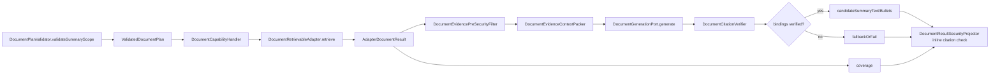

# 摘要能力 L2 实施详细设计 v1.0

## 1. 文档基本信息

| 项目 | 内容 |
| --- | --- |
| 文档名称 | 摘要能力 L2 实施详细设计 |
| 文档路径 | `docs/design/P2/06_摘要能力_L2实施详细设计_v1.0.md` |
| 文档状态 | Draft |
| 版本 | v1.0 |
| 编写日期 | 2026-07-06 |
| 最近修订 | 2026-07-07 |
| 所属阶段 | P2 |
| 适用范围 | 文档型 SUMMARIZE 能力的摘要范围、检索输入、生成摘要、引用绑定、extractive fallback 和安全投影 |
| 上级文档 | `docs/design/Agent目标架构总览_v1.0.md`；`docs/design/Agent能力执行内核架构设计_v1.0.md`；`docs/design/Agent契约与规划架构设计_v1.0.md`；`docs/design/Agent元数据与上下文安全架构设计_v1.0.md` |
| 关联文档 | `docs/design/P1` 下现存全部 L2 详细设计文档；`docs/design/P2` 下编号小于 06 的 00、01、02、03、04、05 详设及对应品审报告 |
| 前置详设 | `docs/design/P2/00_文档能力目标模式与实施路线图_L2实施详细设计_v1.0.md`；`docs/design/P2/01_文档语料接入与索引治理能力_L2实施详细设计_v1.0.md`；`docs/design/P2/02_文档领域元数据与Capability配置能力_L2实施详细设计_v1.0.md`；`docs/design/P2/03_权限感知检索能力_L2实施详细设计_v1.0.md`；`docs/design/P2/04_关键词向量混合检索能力_L2实施详细设计_v1.0.md`；`docs/design/P2/05_证据绑定回答能力_L2实施详细设计_v1.0.md` |
| 后续生产启用依赖 | `docs/design/P2/07_LLM与EmbeddingProvider接入能力_L2实施详细设计_v1.0.md`；`docs/design/P2/08_验证回滚审计观测与撤权保障能力_L2实施详细设计_v1.0.md`；07/08 不是本次 06 的已评审前置基线，只作为真实 provider 生产启用门禁登记 |
| 品审报告 | `docs/design/P2/06_摘要能力_设计文档品审报告.md` |

## 2. 修改历史

| 序号 | 日期 | 章节 | 修改说明 | 备注 |
| --- | --- | --- | --- | --- |
| 1 | 2026-07-06 | 全文 | 初始化摘要能力详设 | 基于当前仓库 `DocumentSummaryScope`、`DocumentPlanValidator`、`DocumentCapabilityHandler`、`DocumentSafeTextComposer` |
| 2 | 2026-07-06 | 第 1、7 章 | 逐份设计品审修复 | 明确关联文档为 P1 L2 与 P2 上一个详设 `05_证据绑定回答能力_L2实施详细设计_v1.0.md` |
| 3 | 2026-07-07 | 第 1、3、7、8、10、11、12、13、15、17、19、20、21、23、24 章 | 06 设计品审修复 | 补齐 P2 小于 06 的基线，修正 `summaryText/candidateSummaryText` 契约、`documentIds` 过滤合并、`citationBindings` 与 inline 引用校验、状态枚举和 provider 输入安全要求 |

## 3. 文档状态说明

本文为 P2 文档摘要能力实施详设，状态为 Draft。本文可作为 `document.summarize` 本地编码与测试闭环依据，但实现必须满足：

1. 摘要只能来自已授权、已召回或明确指定的文档证据。
2. 摘要输出必须携带 citations 或 coverage，不允许生成无来源总结。
3. 生成式摘要失败、引用校验失败或 ResultSecurity inline citation 校验失败时，只能返回 extractive fallback 或 refuse 状态，不输出未校验 candidate。
4. 多文档摘要必须保留覆盖率与被截断状态。
5. `summaryText`、`summaryBullets` 是当前公共响应契约中的用户可见字段；`candidateSummaryText`、`candidateSummaryBullets` 是 `@JsonIgnore` 候选字段，只能由 `DocumentResultSecurityProjector` 在 `SUCCEEDED + VERIFIED + citations` 且 inline citation 校验通过后投影为最终输出。
6. 07 Provider 和 08 验证/回滚/审计详设未完成前，06 本地闭环只允许使用 generation disabled 或测试替身验证生成链路；生产启用真实 generation provider 必须等待 07 和 08 门禁闭合。

## 4. 背景与目标

摘要能力覆盖三类目标：

1. 公司政策总结：按政策文档、章节、发布日期或主题总结。
2. 知识库总结：按知识条目、解决方案集合或 FAQ 范围总结。
3. 文献/文学资料查阅或总结：按资料、作品、章节、主题或人物相关片段总结。

当前仓库已有：

1. `DocumentSummaryScope` 契约，包含 `documentIds` 与 `maxSummaryChars`。
2. `DocumentPlanValidator.validateSummaryScope(...)` 范围校验。
3. `DocumentCapabilityHandler.applyGenerationIfEnabled(...)` 的 SUMMARIZE 生成链路。
4. `DocumentGenerationResult.summaryText`、`summaryBullets` 和 `citationBindings`。
5. `DocumentCitationVerifier` 对 provider 返回 `citationBindings` 的引用归属校验。
6. `DocumentResultSecurityProjector` 对候选摘要文本 inline citation 的最终校验与候选字段清空。
7. `DocumentSafeTextComposer` 对 SUMMARY fallback 的安全文本组合。
8. `AgentDocumentCoverage` 记录请求覆盖、实际覆盖、evidence 数和截断标记。

本文目标是把摘要能力落实为“摘要范围校验、检索 evidence、生成或 fallback、引用归属校验、inline 引用校验、安全投影”的标准链。

## 5. 范围说明

| 类型 | 范围内 | 范围外 |
| --- | --- | --- |
| 摘要类型 | 单文档摘要、多文档摘要、主题检索后摘要 | 长文档离线预生成摘要 |
| 输入范围 | `summaryScope.documentIds`、`maxSummaryChars`、queryText、filters | 文档平台 UI 选择器 |
| 生成 | LLM 摘要、bullet 摘要、extractive fallback | LLM provider 内部 prompt 工程 |
| 安全 | citation required、ACL、ResultSecurity、provider 输入净化 | 权限权威源新增接口 |
| 覆盖率 | requested/covered/evidence/truncated | 复杂评价指标 |

## 6. 上级文档约束继承

| 上级约束 | 本文继承方式 |
| --- | --- |
| capabilityId 是执行主键 | 摘要使用 `document.summarize` |
| Java 契约为源 | `DocumentSummaryScope`、`DocumentGenerationOptions`、`AgentDocumentResult` 从 Java 契约治理 |
| Adapter 是领域公开边界 | 摘要证据来自 `DocumentRetrievableAdapter` |
| Runtime 不可信 | 生成摘要必须先经过 citation 校验和 ResultSecurity |
| ResultSecurity 是输出边界 | `summaryText`、`summaryBullets`、citations 由 projector 过滤后对外可见 |

## 7. 关联文档与边界

本任务的关联文档固定为 `docs/design/P1` 下现存全部 L2 详细设计文档，以及 P2 下编号小于 06 的 00、01、02、03、04、05 详设和对应品审报告。本文只引用其已落地能力和评审结论，不修改其内容。`07_LLM与EmbeddingProvider接入能力` 与 `08_验证回滚审计观测与撤权保障能力` 是后续生产启用依赖，不作为本文已评审前置事实来源。

| 关联文档集合 | 本文职责 | 对方职责 | 边界说明 |
| --- | --- | --- | --- |
| P2 00 详设：`00_文档能力目标模式与实施路线图_L2实施详细设计_v1.0.md` | 继承 00 的能力拆分、实施顺序和进入编码门禁 | 维护 00-08 能力路线图和评审规则 | 本文只落地 06，不调整能力拆分 |
| P2 00 品审报告：`00_文档能力目标模式与实施路线图_设计文档品审报告.md` | 继承 00 已通过的能力路线和文档治理结论 | 记录 00 的审查结论 | 本文不修改 00 |
| P2 01 详设：`01_文档语料接入与索引治理能力_L2实施详细设计_v1.0.md` | 继承 chunk schema、citation 字段、sourceUrl/sourceUri 安全边界和索引治理门禁 | 维护文档接入、chunk 必填字段、mapping 和 alias 治理 | 本文不重新设计语料写入 |
| P2 01 品审报告：`01_文档语料接入与索引治理能力_设计文档品审报告.md` | 继承 01 已关闭的 sourceUrl、AliasSwitchRequest 和 validation digest 风险结论 | 记录 01 的审查结论 | 本文不修改 01 |
| P2 02 详设：`02_文档领域元数据与Capability配置能力_L2实施详细设计_v1.0.md` | 继承 `DOCUMENT_RETRIEVABLE`、文档 domain、证据字段和 `index-by-domain` | 维护三类文档 domain、Capability 配置和 adapter 映射 | 本文不在 handler 中硬编码业务域 |
| P2 02 品审报告：`02_文档领域元数据与Capability配置能力_设计文档品审报告.md` | 继承 02 已关闭的字段类型、证据字段和 adapter 索引映射结论 | 记录 02 的审查结论 | 本文不修改 02 |
| P2 03 详设：`03_权限感知检索能力_L2实施详细设计_v1.0.md` | 继承 ACL scope/filter、ResultSecurity 前置约束和撤权基础 | 维护 ACL 权威源、filter 合并和 fail closed | 本文不重新定义权限模型 |
| P2 03 品审报告：`03_权限感知检索能力_设计文档品审报告.md` | 继承 03 已关闭的 ACL request、term 上限、本地/生产门禁和 ResultSecurity 测试结论 | 记录 03 的审查结论 | 本文不修改 03 |
| P2 04 详设：`04_关键词向量混合检索能力_L2实施详细设计_v1.0.md` | 基于 04 的检索模式、RRF、citation 字段、metadata 安全和降级诊断获取摘要 evidence | 维护 keyword/vector/hybrid 检索、融合排序和检索 metadata 安全 | 本文不重新定义召回排序，只消费检索 evidence |
| P2 04 品审报告：`04_关键词向量混合检索能力_设计文档品审报告.md` | 继承 04 已关闭的 `embedding` 排除、`index-by-domain`、ACL 字段和公共诊断契约门禁结论 | 记录 04 的审查结论 | 本文不修改 04 |
| P2 05 详设：`05_证据绑定回答能力_L2实施详细设计_v1.0.md` | 复用 05 的 evidence package、`citationBindings`、inline citation 校验、fallback/refuse、ResultSecurity 和 provider 输入安全边界 | 维护证据绑定回答和生成安全边界 | 本文只定义 SUMMARIZE 范围、coverage 和摘要输出，不改变 ANSWER 能力 |
| P2 05 品审报告：`05_证据绑定回答能力_设计文档品审报告.md` | 继承 05 已关闭的 provider 输出模型、candidate 字段、sourceUri 净化和本地/生产门禁结论 | 记录 05 的审查结论 | 本文不修改 05 |
| P1 L2 关联文档集合 | 继承契约治理、Capability Kernel、元数据授权、ResultSecurity、Adapter Metadata、扩展验证和安全专项约束 | 维护 P1 主链和治理能力 | 本文不修改 P1 文档 |
| D01 契约生成与治理 | 定义摘要输入和输出字段的 Java 源契约 | 维护 OpenAPI/Python generated model | 新增公共字段必须走契约生成；内部 filter 合并不需要 D01 公共字段变更 |
| D02 Capability Kernel 系列 | 复用 validator/handler/context write | 维护可信执行内核 | 不新增摘要专用执行内核 |
| D03 Capability v2 系列 | 复用 capability-first 和权限权威源 | 维护原子切换 | 不修改权限服务契约 |
| D04 Adapter 与 Domain Metadata 收敛 | 使用 document domain 和 metadata fields | 维护 domain 元数据 | 不硬编码业务域 |
| 安全专项 L2 | 复用 ResultSecurity、mask、拒绝提示 | 维护统一安全输出 | 不绕过安全投影 |

## 8. 设计边界与不变量

1. `document.summarize` 必须带 `summaryScope`。
2. `summaryScope.documentIds` 不得超过 `agent.document.max-evidence-count`。
3. `summaryScope.maxSummaryChars` 不得超过 `agent.document.max-summary-chars`。
4. SUMMARIZE 不允许 `citationRequired=false`。
5. 若 `summaryScope.documentIds` 存在，必须在 Java 可信链路中合并为受保护的文档 ID 检索约束，并与用户 filters、ACL filters 取 AND；用户业务 filter 不得覆盖或放宽该约束。
6. 指定 `documentIds` 不等于授权，未授权文档必须被 ACL/filter 和 ResultSecurity 过滤。
7. 若 `summaryScope.documentIds` 为空，则基于 queryText/filters 检索 evidence 后总结。
8. `DocumentCitationVerifier` 只校验 provider 返回 `citationBindings` 引用 id 属于本次 evidence package；`DocumentResultSecurityProjector` 还必须校验候选摘要文本和 bullets 中的 inline `[citationId]` 标记。
9. `summaryText`、`summaryBullets` 只能由 projector 产出；`candidateSummaryText`、`candidateSummaryBullets` 必须保持 `@JsonIgnore` 并在投影后清空。
10. fallback 摘要只能从 citations/hits 中 extractive 组合，不生成新事实。
11. 进入 provider 的 evidence package 必须继承 05 的安全边界，不得携带 `embedding`、ACL 字段、完整 adapter metadata 或带 query/fragment/token 的 `sourceUri`。
12. 真实 provider 生产启用依赖 07/08；06 本地验收只验证 disabled/fake provider 下的闭环。

## 9. 总体方案

## 10. 详细功能设计

### 10.1 摘要范围

`DocumentSummaryScope` 用于描述摘要边界：

| 字段 | 规则 |
| --- | --- |
| `documentIds` | 可选；存在时限定摘要文档集合，不得超过 `maxEvidenceCount` |
| `maxSummaryChars` | 可选；不得超过 `agent.document.max-summary-chars` |
| 其他扩展字段 | 必须先从 Java 契约定义，不允许 runtime 自行扩展 |

实施时，如果 `documentIds` 存在，需要将其合并为受保护的文档 ID 检索约束。该合并属于 Java 内部可信执行模型，不需要新增 D01 公共契约字段；只有新增 `DocumentSummaryScope` 或公共响应字段时，才需要走 D01 契约生成。合并后的约束必须与用户 filters、ACL filters 取 AND，并且必须防止用户 filters 再次指定 `documentId` 来覆盖、扩大或绕过 `summaryScope.documentIds`。

### 10.2 检索输入

摘要检索支持两种路径：

1. 指定文档集合：queryText 可作为摘要要求，`summaryScope.documentIds` 限定证据范围。
2. 主题检索摘要：queryText/filters 先召回 topK evidence，再对召回证据总结。

两种路径都必须经过：

1. domain metadata 字段校验。
2. ACL scope/filter。
3. 检索上限控制。
4. ResultSecurity 前置和后置边界。

### 10.3 coverage 计算

`AgentDocumentCoverage` 必须表达：

| 字段 | 计算方式 |
| --- | --- |
| `requestedDocumentCount` | 指定 `documentIds` 时为去重后的请求文档数；未指定时为 topK 或 adapter 可表达的请求范围 |
| `coveredDocumentCount` | 最终可见 citations 覆盖的 distinct documentId 数，只统计授权后可见 evidence |
| `evidenceCount` | 最终可见 citations 数 |
| `truncated` | adapter partial、候选 evidence 超过 topK、安全过滤后被截断或 context budget 截断任一发生时为 true |

coverage 不得暴露未授权 documentId 或未授权文档是否存在。指定 `documentIds` 且部分无权时，用户只能看到授权 evidence 的 coverage 结果，不能通过 coverage 推断被过滤文档明细。

### 10.4 生成式摘要

当 `generationOptions.enabled=true` 且全局 generation enabled：

1. 过滤 evidence。
2. 按摘要预算打包 evidence context。
3. 调用 `DocumentGenerationPort.generate(...)`，operation 为 `SUMMARIZE`。
4. 使用 `DocumentCitationVerifier` 校验 `DocumentGenerationResult.citationBindings[*].citationIds` 均属于本次 evidence package。
5. bindings 校验通过后，handler 可以写入 `candidateSummaryText`、`candidateSummaryBullets`，并设置生成状态和 grounding 状态。
6. 只有 `groundingStatus=VERIFIED` 且 projector 的 inline citation 校验通过时，candidate 摘要才能成为公共 `summaryText`、`summaryBullets`。

如果 provider 返回空 `citationBindings`，verifier 应标记 `GroundingStatus.PARTIAL`；即使 handler 暂存 candidate，ResultSecurity 也不得把它投影为最终摘要，必须 fallback 或 refuse。

### 10.5 extractive fallback

当 generation disabled、provider 异常、bindings 校验失败、inline citation 校验失败且策略为 `FALLBACK_EXTRACTIVE`：

1. `DocumentSafeTextComposer.compose(SUMMARIZE, result, limit)` 从最终可见 citations 组合安全摘要。
2. 组合文本不得超过 `summaryScope.maxSummaryChars` 和 `agent.document.max-summary-chars`。
3. fallback 文本必须保持 citation 可追踪，建议按 `[citationId] snippet` 形式输出，不得生成新事实。
4. fallback bullets 数量应有稳定上限，避免多文档摘要输出失控。

### 10.6 refuse

当策略为 `REFUSE` 且 provider 异常或引用校验失败：

1. `generationStatus=FAILED`。
2. 不输出 candidate 摘要，不把未验证摘要写入公共 `summaryText`/`summaryBullets`。
3. 输出已授权 citations、coverage 与失败诊断，便于用户调整检索范围。

当 evidence 为空时，生成链路应 `SKIPPED`，不调用 LLM；是否返回空摘要或拒绝提示由 ResultSecurity 和上层响应策略决定，但不得伪造摘要。

## 11. API 与契约设计

### 11.1 Plan 契约

| 字段 | 类型 | 规则 |
| --- | --- | --- |
| `capabilityId` | String | `document.summarize` |
| `document.operation` | enum | `SUMMARIZE` |
| `document.queryText` | String | 摘要要求或主题 |
| `document.summaryScope` | `DocumentSummaryScope` | 必填 |
| `document.citationRequired` | Boolean | 不可为 false |
| `document.generationOptions` | `DocumentGenerationOptions` | 可选，默认 fallback 策略 |

### 11.2 输出契约

| 字段 | 类型 | 说明 |
| --- | --- | --- |
| `summaryText` | String | 用户可见摘要，只有通过 ResultSecurity 后才写入 |
| `summaryBullets` | List<String> | 用户可见摘要要点，只有通过 ResultSecurity 后才写入 |
| `candidateSummaryText` | String | `@JsonIgnore` 候选摘要，只能内部暂存，投影后必须清空 |
| `candidateSummaryBullets` | List<String> | `@JsonIgnore` 候选要点，只能内部暂存，投影后必须清空 |
| `citations` | List | 摘要依据 |
| `coverage` | Object | 覆盖率 |
| `generationStatus` | `DocumentGenerationStatus` | 生成状态 |
| `groundingStatus` | `GroundingStatus` | 摘要证据绑定状态 |
| `citationVerification` | Object | 引用校验结果 |

## 12. 数据模型与字段映射

| 模型 | 字段 | 用途 |
| --- | --- | --- |
| `DocumentSummaryScope` | `documentIds` | 限定摘要文档 |
| `DocumentSummaryScope` | `maxSummaryChars` | 摘要长度控制 |
| `DocumentRetrievalRequest` | `summaryScope` | handler/adapter 传递摘要范围 |
| `AdapterDocumentEvidence` | `documentId`、`chunkId`、`content`、`snippet` | 摘要证据 |
| `DocumentGenerationResult` | `summaryText`、`summaryBullets`、`citationBindings`、`finishReason` | provider 候选摘要输出 |
| `CitationBinding` | `text`、`citationIds` | 片段/claim 到 citation id 的 provider 自报绑定 |
| `AgentDocumentResult` | `summaryText`、`summaryBullets` | 最终用户可见摘要 |
| `AgentDocumentResult` | `candidateSummaryText`、`candidateSummaryBullets` | `@JsonIgnore` 候选摘要字段 |
| `AgentDocumentCoverage` | requested/covered/evidence/truncated | 覆盖率 |

## 13. 状态流转

状态流转使用当前 `DocumentGenerationStatus` 与 `GroundingStatus`，不得在实现中新增只存在于文档的状态名。

| 状态 | 触发条件 | 处理 |
| --- | --- | --- |
| `DISABLED` | generation 全局未启用或未请求 | 只返回 citations/coverage，并由 projector 生成 extractive fallback |
| `SKIPPED` | operation=SEARCH 或 summary evidence 为空 | 不调用 LLM；SUMMARIZE 不得生成无证据摘要 |
| `PACKED`、`GENERATING` | 已进入上下文打包或 provider 调用阶段 | 可作为内部过程状态或观测事件；若未落库实现，不作为公共最终状态依赖 |
| `SUCCEEDED` | provider 返回且 `citationBindings` 归属校验通过 | 可暂存 candidate；最终是否可见仍由 `groundingStatus` 和 ResultSecurity inline citation 校验决定 |
| `FALLBACK` | provider 异常、bindings 校验失败、inline citation 校验失败或 grounding 未达 VERIFIED，策略为 fallback | 使用 extractive 安全文本 |
| `FAILED` | provider 异常或引用校验失败，策略为 refuse | 不输出候选摘要 |
| `GroundingStatus.VERIFIED` | bindings 和最终可见 citation 约束均满足 | candidate 可进入最终投影 |
| `GroundingStatus.PARTIAL` / `UNVERIFIED` / `NO_EVIDENCE` | bindings 为空、非法引用、无证据或证据不足 | fallback/refuse，不输出 candidate |

## 14. 幂等、并发与一致性

1. 指定 documentIds 的摘要必须对同一 documentIds 集合保持稳定排序。
2. summaryScope 合并到 filter 后不能改变用户原始 filter 的收窄语义，只能增加受保护约束。
3. 同一 evidence digest 下的 fallback 摘要是确定性的。
4. 并发摘要请求互不共享 evidence package。
5. alias 切换期间只访问 read alias，避免总结写入中的索引。

## 15. 权限、安全与审计

1. 摘要 evidence 必须先经过 ACL filter。
2. 指定 documentIds 不代表授权；未授权文档必须被过滤。
3. 摘要输出不得泄漏被过滤文档的存在性；coverage 中不得显示未授权 documentId。
4. 进入 provider 的 `EvidenceContextPackage` 只能包含白名单 metadata：`documentId`、`title`、`section`、`page`、`chunkIndex` 和规范化后的 safe sourceUri。
5. `sourceUri` 进入 provider 前必须剥离 query、fragment、签名参数、下载 token；也可以不进入 provider metadata。
6. 禁止把 `embedding`、ACL 字段、完整 adapter metadata、原始全文权限投影字段发送给 provider。
7. 审计建议记录 `summaryScopeHash`、`evidenceDigest`、`coveredDocumentCount`、`generationStatus`、`groundingStatus`。
8. 禁止日志记录完整摘要候选、完整 evidence、sourceUri query/fragment、签名 token 和 ACL 字段。

## 16. 性能与容量

| 项目 | 目标 |
| --- | --- |
| documentIds 数量 | 不超过 `agent.document.max-evidence-count` |
| evidence 数量 | 不超过 `agent.document.max-evidence-count` |
| 单条 evidence | 不超过 generation `maxEvidenceChars` |
| 总上下文 | 不超过 generation `maxContextChars` |
| 摘要长度 | 不超过 `summaryScope.maxSummaryChars` 和 `agent.document.max-summary-chars` |

## 17. 兼容性设计

1. generation 默认关闭时，摘要能力仍可通过 extractive fallback 提供受限摘要。
2. `summaryScope` 当前必填，避免把 SUMMARIZE 退化成无边界问答。
3. `summaryText`、`summaryBullets`、`candidateSummaryText`、`candidateSummaryBullets` 已是当前响应模型语义的一部分；新增公共摘要字段必须保持可选并走 D01 契约生成。
4. `summaryScope.documentIds` 合并到受保护内部 filter 不需要新增公共契约字段。
5. 不修改 search/answer 的 capabilityId。
6. 真实 generation provider 生产启用依赖 07/08；07/08 未完成前，06 只能合入 disabled/fake provider 下的本地闭环。

## 18. 日志、观测与诊断

| 类型 | 字段 |
| --- | --- |
| 日志 | `invocationId`、`capabilityId`、`domain`、`summaryScopeHash`、`evidenceDigest`、`generationStatus`、`groundingStatus` |
| 指标 | summarize 请求数、平均 coveredDocumentCount、fallback 数、refuse 数、空 evidence 数、inline citation 校验失败数 |
| 告警 | 空 evidence 占比升高、coverage 下降、citation 校验失败、provider 超时 |
| 禁止记录 | 完整 evidence、完整 candidate summary、sourceUri query/fragment、签名 token、ACL 字段、`embedding` |

## 19. 实现落点清单

| 序号 | 类型 | 文件路径 | 类/接口 | 方法/字段 | 入参 | 出参 | 动作 | 说明 |
| --- | --- | --- | --- | --- | --- | --- | --- | --- |
| 1 | Contract | `agent-api/src/main/java/com/dylan/agent/api/plan/DocumentSummaryScope.java` | `DocumentSummaryScope` | `documentIds`、`maxSummaryChars` | plan JSON | DTO | 已存在/校验 | 摘要范围字段已存在，需补校验和测试 |
| 2 | Validator | `agent-service/src/main/java/com/dylan/agent/capability/document/DocumentPlanValidator.java` | `DocumentPlanValidator` | `validateSummaryScope` | operation/scope | void | 修改 | scope 必填、数量和长度边界 |
| 3 | Validator | 同上 | `DocumentPlanValidator` | scope/filter 合并逻辑 | scope/documentIds/filters | protected filters | 新增/修改 | 将 `documentIds` 合并为不可被用户 filter 放宽的内部约束 |
| 4 | Handler | `agent-service/src/main/java/com/dylan/agent/capability/document/DocumentCapabilityHandler.java` | `DocumentCapabilityHandler` | `toParameters` | plan | parameters | 修改 | 输出 summaryScope 与摘要参数诊断 |
| 5 | Handler | 同上 | `DocumentCapabilityHandler` | `toResult` | request/adapterResult | `AgentDocumentResult` | 修改 | coverage 按 summaryScope、授权 citations 和截断状态计算 |
| 6 | Handler | 同上 | `DocumentCapabilityHandler` | `applyGenerationIfEnabled` | plan/request/result/context | void | 修改 | SUMMARIZE 生成、fallback/refuse 和 grounding 状态 |
| 7 | Filter | `agent-service/src/main/java/com/dylan/agent/capability/document/generation/DocumentEvidencePreSecurityFilter.java` | `DocumentEvidencePreSecurityFilter` | `filter` | evidence/scope/domain | evidence | 修改 | LLM 前置安全过滤 |
| 8 | Packer | `agent-service/src/main/java/com/dylan/agent/capability/document/generation/DocumentEvidenceContextPacker.java` | `DocumentEvidenceContextPacker` | `pack`、`safeMetadata` | request | package | 修改 | 摘要 evidence 打包；剥离 `sourceUri` query/fragment，禁止 `embedding`、ACL 字段和完整 metadata |
| 9 | DTO | `agent-service/src/main/java/com/dylan/agent/capability/document/generation/DocumentGenerationResult.java` | `DocumentGenerationResult` | `summaryText`、`summaryBullets`、`citationBindings`、`finishReason` | provider response | record | 已存在/校验 | provider 候选摘要输出 |
| 10 | DTO | `agent-service/src/main/java/com/dylan/agent/capability/document/generation/CitationBinding.java` | `CitationBinding` | `text`、`citationIds` | provider response | record | 已存在/校验 | 首版只做 citation id 归属校验 |
| 11 | Verifier | `agent-service/src/main/java/com/dylan/agent/capability/document/generation/DocumentCitationVerifier.java` | `DocumentCitationVerifier` | `verify` | result/package | `CitationVerificationResult` | 修改 | 校验 `citationBindings`，空 bindings 标记 PARTIAL |
| 12 | Projector | `agent-service/src/main/java/com/dylan/agent/metadata/result/DocumentResultSecurityProjector.java` | `DocumentResultSecurityProjector` | `filter`、`applyVerifiedCandidate`、`candidateCitationsValid` | candidate/scope | filtered | 修改 | `summaryText`/`summaryBullets` 投影、inline citation 校验和候选字段清空 |
| 13 | Composer | `agent-service/src/main/java/com/dylan/agent/metadata/result/DocumentSafeTextComposer.java` | `DocumentSafeTextComposer` | `compose` | operation/result/limit | text | 修改 | extractive 摘要 |
| 14 | Response | `agent-api/src/main/java/com/dylan/agent/api/response/AgentDocumentResult.java` | `AgentDocumentResult` | `summaryText`、`summaryBullets`、`candidateSummaryText`、`candidateSummaryBullets` | result | DTO | 已存在/校验 | 公共字段与候选字段语义校验 |
| 15 | Response | `agent-api/src/main/java/com/dylan/agent/api/response/AgentDocumentCoverage.java` | `AgentDocumentCoverage` | fields | result | DTO | 已存在/校验 | 覆盖率 |
| 16 | Config | `agent-service/src/main/java/com/dylan/agent/config/AgentProperties.java` | `DocumentProperties` | `maxSummaryChars` | YAML | properties | 已存在/校验 | 摘要上限 |

## 20. 测试设计

| 序号 | 类型 | 文件路径 | 测试类 | 测试点 | 预期 |
| --- | --- | --- | --- | --- | --- |
| 1 | Unit | `agent-service/src/test/java/com/dylan/agent/capability/document/DocumentPlanValidatorTest.java` | `DocumentPlanValidatorTest` | SUMMARIZE 缺少 summaryScope | 拒绝 |
| 2 | Unit | 同上 | `DocumentPlanValidatorTest` | documentIds 超上限 | 拒绝 |
| 3 | Unit | 同上 | `DocumentPlanValidatorTest` | maxSummaryChars 超上限 | 拒绝 |
| 4 | Unit | 同上 | `DocumentPlanValidatorTest` | `summaryScope.documentIds` 与用户 filters 合并 | 只能收窄，不能被用户 filter 放宽 |
| 5 | Unit | `agent-service/src/test/java/com/dylan/agent/kernel/core/DocumentCapabilityHandlerTest.java` | `DocumentCapabilityHandlerTest` | SUMMARIZE 生成成功 | 写入 candidate summary，`generationStatus=SUCCEEDED` |
| 6 | Unit | 同上 | `DocumentCapabilityHandlerTest` | 指定 documentIds coverage | requested/covered/evidence/truncated 不泄漏未授权文档 |
| 7 | Unit | 同上 | `DocumentCapabilityHandlerTest` | provider 异常 fallback/refuse | 分别返回 `FALLBACK`/`FAILED` |
| 8 | Unit | `agent-service/src/test/java/com/dylan/agent/capability/document/generation/DocumentEvidenceContextPackerTest.java` | `DocumentEvidenceContextPackerTest` | 摘要预算截断 | 不超过限制，truncated 可诊断 |
| 9 | Unit | 同上 | `DocumentEvidenceContextPackerTest` | metadata 安全 | package metadata 不含 `embedding`、ACL 字段、sourceUri query/fragment |
| 10 | Unit | `agent-service/src/test/java/com/dylan/agent/capability/document/generation/DocumentCitationVerifierTest.java` | `DocumentCitationVerifierTest` | 非法 citation | 返回 invalid ids，`GroundingStatus.UNVERIFIED` |
| 11 | Unit | 同上 | `DocumentCitationVerifierTest` | 空 `citationBindings` | 返回 `GroundingStatus.PARTIAL`，触发 fallback/refuse |
| 12 | Unit | `agent-service/src/test/java/com/dylan/agent/metadata/result/DocumentResultSecurityProjectorTest.java` | `DocumentResultSecurityProjectorTest` | verified candidate 进入 `summaryText`/`summaryBullets` | 公共摘要有值，candidate 字段被清空 |
| 13 | Unit | 同上 | `DocumentResultSecurityProjectorTest` | candidate summary/bullet 无 inline citation | fallback，最终摘要来自 `DocumentSafeTextComposer` |
| 14 | Unit | 同上 | `DocumentResultSecurityProjectorTest` | candidate 引用被过滤 citation | fallback，不输出原 candidate |
| 15 | Static | 同上或序列化测试 | `DocumentResultSecurityProjectorTest` | candidate summary 不进入 JSON | `@JsonIgnore` 生效或序列化结果不含 candidate 字段 |
| 16 | Integration | `agent-service/src/test/java/com/dylan/agent/capability/document/DocumentSummarizeFlowIntegrationTest.java` | `DocumentSummarizeFlowIntegrationTest` | 指定 documentIds 摘要端到端 | 未授权文档不可见；真实 provider 不参与本地闭环 |

## 21. 风险与阻塞项

| 序号 | 类型 | 风险 | 触发场景 | 处理建议 | 是否阻塞实施 |
| --- | --- | --- | --- | --- | --- |
| 1 | 范围 | `summaryScope.documentIds` 指定文档未合并到受保护 filter | 总结越界文档 | validator/plan 构建阶段合并 documentIds filter，并覆盖用户 filter 不能放宽的测试 | 是，编码完成门禁 |
| 2 | 安全 | coverage 暴露未授权文档数量或存在性 | 指定 documentIds 包含无权文档 | coverage 只按授权可见 evidence 计算，不返回未授权明细 | 是，编码完成门禁 |
| 3 | 安全 | provider bindings 通过但摘要文本无 inline citation | provider 返回 `citationBindings`，但 `summaryText`/bullet 未含 `[citationId]` | ResultSecurity 二次校验 inline citation，失败 fallback/refuse | 是，编码完成门禁 |
| 4 | 安全 | `sourceUri` token、ACL 字段或 `embedding` 进入 generation provider | packer 原样携带 adapter metadata 或带签名参数的 URI | `safeMetadata` 白名单、URI query/fragment 剥离和测试门禁 | 是，编码完成门禁 |
| 5 | 质量 | fallback 摘要过于机械 | generation 关闭 | 明确 fallback 是 extractive，并保留 citations | 否 |
| 6 | 契约 | summaryScope 扩展字段不一致 | runtime 输出新字段 | 按 D01 走 Java 契约生成；当前 documentIds 内部 filter 合并不需要公共字段变更 | 否 |
| 7 | 可靠性 | 07/08 未完成时误启用真实 generation provider | 配置指向未治理 provider 或审计/回滚未闭合 | generation 默认关闭；本地 fake port；生产启用等待 07/08 | 否，本地编码不阻塞；生产启用阻塞 |

## 22. 评审记录

| 轮次 | 日期 | 结论 | S0 | S1 | 主要问题 | 修复情况 |
| --- | --- | --- | --- | --- | --- | --- |
| 1 | 2026-07-06 | 通过 | 0 | 0 | 无 | 已按 `detailed-design-document` 检查章节完整性、摘要范围不变量、上级/关联边界、实现落点和测试设计 |
| 2 | 2026-07-07 | 通过 | 0 | 0 | 初审发现关联基线、07/08 依赖定位、公共摘要字段、`documentIds` 过滤合并、`citationBindings`、inline 引用校验、状态枚举、provider 输入安全和测试落点描述不完整 | 已修复并生成 `06_摘要能力_设计文档品审报告.md` |

## 23. 实现对齐检查

| 检查项 | 目标 | 当前仓库落点 | 状态 | 备注 |
| --- | --- | --- | --- | --- |
| SUMMARIZE capability | `document.summarize` | `DocumentCapabilityIds`、`DocumentCapabilityConfiguration` | 部分满足 | 需生产 domain metadata |
| summaryScope 必填 | validator 拒绝缺失 | `DocumentPlanValidator.validateSummaryScope` | 已满足 | 已有基础校验 |
| documentIds 限定 | scope 合并到受保护 filter | `DocumentPlanValidator`/plan 构建链路 | 未满足 | 实施重点，编码完成门禁 |
| 生成式摘要 | provider 可用时生成 | `DocumentCapabilityHandler.applyGenerationIfEnabled` | 部分满足 | 真实 provider 依赖 07/08，本地用 fake/disabled |
| citation verifier | bindings 引用 id 归属校验 | `DocumentCitationVerifier` | 部分满足 | 需补空 bindings/PARTIAL 测试 |
| inline citation projector | candidate 摘要最终过滤 | `DocumentResultSecurityProjector` | 部分满足 | 需补 summary/bullet 成功、缺失引用和引用被过滤测试 |
| fallback 摘要 | extractive safe text | `DocumentSafeTextComposer` | 部分满足 | 需测试覆盖长度、bullet 和 citation 可追踪 |
| coverage | 覆盖率输出 | `AgentDocumentCoverage` | 部分满足 | 需按指定 documentIds、授权 citations 和截断完善 |
| provider 输入安全 | metadata 白名单和 sourceUri 净化 | `DocumentEvidenceContextPacker.safeMetadata` | 部分满足 | 需补 sourceUri query/fragment 剥离 |

## 24. 完成摘要

| 项目 | 结论 |
| --- | --- |
| 目标文档 | `docs/design/P2/06_摘要能力_L2实施详细设计_v1.0.md` |
| 文档状态 | Draft |
| 是否可作为实现依据 | 是，可进入 06 本地编码与测试闭环；生产启用真实 generation provider 前必须完成 07 Provider 与 08 验证/回滚审计门禁 |
| 主要修改内容 | 定义 SUMMARIZE 摘要范围、`documentIds` 受保护 filter 合并、检索输入、coverage、生成式摘要、`citationBindings` 引用校验、inline citation 二次校验、extractive fallback、ResultSecurity 投影和测试策略 |
| 是否修改上级/关联文档 | 否 |
| 是否已补充实现落点清单 | 是 |
| 是否已执行内部评审 | 是，2 轮 |
| 是否存在 S0/S1 遗留 | 否 |
| 是否需要用户进一步授权 | 否，除非新增 summaryScope 公共字段、修改 P1/L1 契约、扩大到 07/08 实施范围或启用真实 provider |
