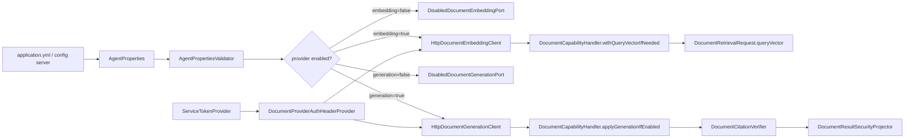

# LLM / Embedding Provider 接入能力 L2 实施详细设计 v1.0

## 1. 文档基本信息

| 项目 | 内容 |
| --- | --- |
| 文档名称 | LLM / Embedding Provider 接入能力 L2 实施详细设计 |
| 文档路径 | `docs/design/P2/07_LLM与EmbeddingProvider接入能力_L2实施详细设计_v1.0.md` |
| 文档状态 | Draft |
| 版本 | v1.0 |
| 编写日期 | 2026-07-06 |
| 最近修订 | 2026-07-07 |
| 所属阶段 | P2 |
| 适用范围 | 文档型能力的 embedding provider、generation provider、内部 HTTP 契约、服务 token 认证、配置校验、超时、失败策略和安全调用边界 |
| 上级文档 | `docs/design/Agent目标架构总览_v1.0.md`；`docs/design/Agent能力执行内核架构设计_v1.0.md`；`docs/design/Agent契约与规划架构设计_v1.0.md`；`docs/design/Agent元数据与上下文安全架构设计_v1.0.md` |
| 关联文档 | `docs/design/P1` 下现存全部 L2 详细设计文档；`docs/design/P2` 下编号小于 07 的 00、01、02、03、04、05、06 详设及对应品审报告 |
| 前置详设 | `docs/design/P2/00_文档能力目标模式与实施路线图_L2实施详细设计_v1.0.md`；`docs/design/P2/01_文档语料接入与索引治理能力_L2实施详细设计_v1.0.md`；`docs/design/P2/02_文档领域元数据与Capability配置能力_L2实施详细设计_v1.0.md`；`docs/design/P2/03_权限感知检索能力_L2实施详细设计_v1.0.md`；`docs/design/P2/04_关键词向量混合检索能力_L2实施详细设计_v1.0.md`；`docs/design/P2/05_证据绑定回答能力_L2实施详细设计_v1.0.md`；`docs/design/P2/06_摘要能力_L2实施详细设计_v1.0.md` |
| 后续生产发布依赖 | `docs/design/P2/08_验证回滚审计观测与撤权保障能力_L2实施详细设计_v1.0.md`；08 不是本次 07 的已评审前置基线，只作为真实 provider 生产发布、回滚和审计门禁登记 |
| 品审报告 | `docs/design/P2/07_LLM与EmbeddingProvider接入能力_设计文档品审报告.md` |

## 2. 修改历史

| 序号 | 日期 | 章节 | 修改说明 | 备注 |
| --- | --- | --- | --- | --- |
| 1 | 2026-07-06 | 全文 | 初始化 LLM / Embedding Provider 接入详设 | 基于当前仓库 `DocumentEmbeddingPort`、`HttpDocumentEmbeddingClient`、`DocumentGenerationPort`、`HttpDocumentGenerationClient`、`AgentPropertiesValidator` |
| 2 | 2026-07-06 | 第 1、7 章 | 逐份设计品审修复 | 明确关联文档为 P1 L2 与 P2 上一个详设 `06_摘要能力_L2实施详细设计_v1.0.md` |
| 3 | 2026-07-07 | 第 1、3、7、8、10、11、12、13、15、17、19、20、21、23、24 章 | 07 设计品审修复 | 补齐 P2 小于 07 的基线，修正 provider 内部 HTTP 契约、`requestId`/`citationBindings` 字段、服务 token 认证、model 启动校验、deadline/header、日志脱敏和外部 vendor key 边界 |

## 3. 文档状态说明

本文为 P2 Provider 接入能力实施详设，状态为 Draft。当前仓库默认配置为：

1. `agent.document.enabled=false`。
2. `agent.document.embedding.enabled=false`，`base-url` 空，`model` 空，`dimension=0`。
3. `agent.document.generation.enabled=false`，`base-url` 空，`model` 空。
4. `common.security.service-token.scopes` 当前只包含 `agent.permission.resolve`，尚未包含 provider 调用专用 scope。

因此 Provider 接入必须以显式启用、显式配置、服务 token scope、启动校验和失败策略为前提，不得在默认状态下发起外部 LLM/embedding 调用。本文首版只设计 agent-service 调用内部 provider 服务的 HTTP 契约和服务 token 认证；直接调用外部厂商 API key、Vault/KMS SDK 或供应商 SDK 不在本次默认实现范围内，若需要必须另行授权并补充密钥用途设计。

## 4. 背景与目标

文档检索和问答能力依赖两个外部能力：

1. Embedding Provider：把 queryText 转换为 queryVector，支撑 VECTOR/HYBRID 检索。
2. Generation Provider：基于 evidence package 生成回答或摘要候选。

当前仓库已具备端口和默认禁用实现：

1. `DocumentEmbeddingPort`、`HttpDocumentEmbeddingClient`、`DisabledDocumentEmbeddingPort`。
2. `DocumentGenerationPort`、`HttpDocumentGenerationClient`、`DisabledDocumentGenerationPort`。
3. `DocumentCapabilityConfiguration` 根据配置启用或禁用 provider。
4. `AgentPropertiesValidator` 已对 embedding/generation 配置执行基础校验。
5. `DocumentEmbeddingRequest` 当前字段为 `requestId`、`queryText`、`domain`、`model`、`deadline`。
6. `DocumentGenerationResult` 当前字段为 `answerText`、`summaryText`、`summaryBullets`、`citationBindings`、`finishReason`。

本文目标是把 Provider 接入设计为可配置、可观测、可降级、可审计且不破坏内核可信边界的能力。

## 5. 范围说明

| 类型 | 范围内 | 范围外 |
| --- | --- | --- |
| Embedding | queryText embedding、模型/维度校验、超时、HYBRID 降级、VECTOR fail closed | 文档入库时的离线 embedding 生成 |
| Generation | evidence package 生成回答/摘要、`citationBindings` 响应、失败策略、deadline | LLM 训练、模型评测平台、prompt 工程细节 |
| Provider API | agent-service 到内部 provider 服务的 `/embeddings`、`/document-generation` HTTP 契约 | 对外公开 OpenAPI 或外部厂商 SDK |
| 配置 | `agent.document.embedding.*`、`agent.document.generation.*`、`common.security.service-token.scopes` | 新增全局密钥框架或真实 Vault/KMS SDK |
| 安全 | 服务 token、header/body 脱敏、ResultSecurity 前后边界 | Provider 服务内部权限模型 |
| 观测 | 调用耗时、失败率、fallback/refuse、dimension mismatch | 复杂质量评测平台 |

## 6. 上级文档约束继承

| 上级约束 | 本文继承方式 |
| --- | --- |
| Runtime/外部生成不可信 | Provider 返回结果均为候选，必须经 Java 校验、citation verifier 和 ResultSecurity |
| capabilityId 是审计主键 | Provider 调用记录必须关联 requestId、invocationId/capabilityId/domain |
| Java 契约源 | Provider request/response 的 agent-service 内部结构由 Java record/class 定义 |
| 统一密钥与安全配置 | 首版复用 `ServiceTokenProvider`；不新增 provider API key 密钥用途 |
| ResultSecurity 统一输出 | LLM 输出不直接返回用户 |
| 全链 deadline | Provider 调用必须消费当前 invocation 剩余预算，迟到响应不得覆盖终态 |

## 7. 关联文档与边界

本任务的关联文档固定为 `docs/design/P1` 下现存全部 L2 详细设计文档，以及 P2 下编号小于 07 的 00、01、02、03、04、05、06 详设和对应品审报告。本文只引用其已落地能力和评审结论，不修改其内容。`08_验证回滚审计观测与撤权保障能力` 是后续生产发布依赖，不作为本文已评审前置事实来源。

| 关联文档集合 | 本文职责 | 对方职责 | 边界说明 |
| --- | --- | --- | --- |
| P2 00 详设及品审报告 | 继承能力拆分、实施顺序和进入编码门禁 | 维护 00-08 能力路线图和评审规则 | 本文只落地 07，不调整能力拆分 |
| P2 01 详设及品审报告 | 继承 chunk schema、embedding/model/dimension 与 alias validation 风险结论 | 维护文档接入、chunk 字段、mapping 和 alias 治理 | 本文不生成离线文档向量 |
| P2 02 详设及品审报告 | 继承 document domain、`DOCUMENT_RETRIEVABLE`、adapter registration 和 metadata 字段 | 维护三类文档 domain 与 Capability 配置 | Provider 不成为新的 domain metadata 事实源 |
| P2 03 详设及品审报告 | 继承 ACL scope/filter、fail closed 和 ResultSecurity 边界 | 维护 ACL 权威源和撤权基础 | Provider 只能消费已授权 evidence |
| P2 04 详设及品审报告 | 继承 VECTOR/HYBRID 检索、dimension mismatch、embedding 排除和降级诊断 | 维护检索融合与召回安全 | 本文只提供 query embedding，不重写检索排序 |
| P2 05 详设及品审报告 | 继承 evidence package、`citationBindings`、inline citation 校验和 provider 输入安全边界 | 维护证据绑定回答能力 | 本文提供 generation provider 接入，不改变 ANSWER 投影规则 |
| P2 06 详设及品审报告 | 继承摘要生成、fallback/refuse、coverage 与真实 provider 启用门禁 | 维护摘要能力 | 本文为 06 补齐真实 provider 接入前提 |
| P1 统一密钥管理与多注入源支持 | 复用服务 token 和密钥脱敏规则 | 维护 JWT/payload 密钥用途、`ServiceTokenProvider`、Actuator 脱敏 | 本文不新增外部 vendor API key secret purpose |
| D01 契约生成与治理 | 判定 provider 内部 DTO 是否需要公共契约生成 | 维护 Java/OpenAPI/Python 单向生成 | provider 内部 HTTP API 不进入公共 Runtime OpenAPI；若公开必须走 D01 |
| D02 Capability Kernel 系列 | 使用 deadline、handler、audit context 和可信执行边界 | 维护执行生命周期 | Provider 不绕过内核调用 |
| D03 Capability v2 系列 | 保持 provider 为 capability 内部依赖 | 维护 capability 原子切换和服务 token 认证 | Provider 切换不改变 capabilityId |
| D04 Adapter 与 Domain Metadata 收敛 | 使用 document domain 和 adapter binding | 维护 domain metadata 唯一事实源 | Provider 不维护 domain/field/operator 清单 |
| 安全专项 L2 | 复用 ResultSecurity、mask、拒绝提示 | 维护统一安全输出 | 不输出未投影 LLM 文本 |

## 8. 设计边界与不变量

1. Provider 默认禁用，只有显式 `enabled=true` 且配置完整时才创建 HTTP client。
2. Embedding enabled 时，`base-url`、`model`、`dimension>0`、`timeout>0` 必须全部满足启动校验。
3. Generation enabled 时，`base-url`、`model`、文本预算、`timeout>0`、`failure-policy` 必须全部满足启动校验。
4. 首版 provider 认证只支持内部服务 token；不得转发用户 JWT 给 provider。
5. 若 provider enabled，`common.security.service-token.scopes` 必须包含 `agent.document.provider.invoke`，否则启动失败或 provider bean 创建失败。
6. Embedding 的返回维度必须等于配置维度；返回模型存在时必须与配置 model 一致，否则 fail closed。
7. HYBRID embedding provider 调用异常可降级 KEYWORD；VECTOR embedding 调用异常、空向量、维度不匹配或模型不匹配均 fail closed。
8. Generation provider 返回结果只写入 candidate 字段，并必须经过 `DocumentCitationVerifier` 和 `DocumentResultSecurityProjector`。
9. Provider request 只能包含已授权、已过滤、预算内 evidence；不得包含 `embedding`、ACL 字段、完整 adapter metadata 或带 query/fragment/token 的 `sourceUri`。
10. Provider request/response 日志必须脱敏，不记录全文 evidence、完整 answer/summary、queryVector、Authorization header 或 token。
11. Provider 调用必须携带 requestId/deadline 诊断信息，并在 deadline 已过或调用后已过期时 fail closed。
12. 08 完成前，07 可完成本地编码和 contract/mock 测试，但不得宣称真实 provider 已满足生产发布、回滚和审计闭环。

## 9. 总体方案



## 10. 详细功能设计

### 10.1 Provider 启用模式

Provider 分为三种运行状态：

| 状态 | 条件 | 行为 |
| --- | --- | --- |
| Disabled | `enabled=false` | 注入 disabled port；Embedding VECTOR fail closed，HYBRID 降级 KEYWORD，Generation 标记 `DISABLED` |
| Internal HTTP | `enabled=true` 且内部 provider 配置完整 | 使用 `RestClient` 调内部 provider，并携带服务 token |
| External vendor | 需要厂商 API key 或 SDK | 不在首版默认实现范围；必须另行授权并补充 P1 密钥用途或 vendor credential 设计 |

### 10.2 Embedding Provider 配置

| 配置项 | 默认值 | 启用时规则 |
| --- | --- | --- |
| `agent.document.embedding.enabled` | false | true 时启用 HTTP client |
| `agent.document.embedding.base-url` | 空 | enabled=true 时必填 |
| `agent.document.embedding.model` | 空 | enabled=true 时必填；必须与索引向量模型治理信息一致 |
| `agent.document.embedding.dimension` | 0 | enabled=true 时必须 >0；必须与当前 read alias/index mapping 维度一致 |
| `agent.document.embedding.timeout` | 5s | 必须 >0，且不得超过 invocation 剩余 deadline |

`AgentPropertiesValidator` 当前只校验 base-url、dimension、timeout。实施时必须补充 model 必填校验；如果后续允许 provider default model，必须在本章节补充显式策略和审计字段，不得依赖 provider 隐式默认。

### 10.3 Embedding HTTP 契约

首版内部 provider 使用：

```text
POST /embeddings
Authorization: Bearer <service-token>
X-Agent-Request-Id: <DocumentEmbeddingRequest.requestId>
X-Agent-Deadline: <ISO-8601 instant>
Content-Type: application/json
```

请求体：

| 字段 | 类型 | 来源 | 说明 |
| --- | --- | --- | --- |
| `requestId` | String | `ExecutionContext.invocationId()` | 当前 invocation/request 诊断标识 |
| `input` | String | `DocumentEmbeddingRequest.queryText` | 已由 validator 限长后的查询文本 |
| `domain` | String | `DocumentEmbeddingRequest.domain` | 只用于 provider 侧模型路由，不改变授权范围 |
| `model` | String | `agent.document.embedding.model` | 必填 |
| `deadline` | Instant | `ExecutionContext.absoluteDeadline` | provider 必须在 deadline 前完成 |

响应体：

| 字段 | 类型 | 规则 |
| --- | --- | --- |
| `queryVector` | List<Double> | 必填、非空、元素必须为有限数值 |
| `embeddingModel` | String | 必填或默认回显配置 model；若与配置 model 不一致则 fail closed |
| `dimension` | int | 必须等于配置 dimension，也必须等于 `queryVector.size()` |
| `digest` | String | 可选；用于审计，不得由 digest 推导原始向量 |

HTTP client 必须把非 2xx、超时、空 body、空向量、非数值元素包装为脱敏异常。异常消息不得包含 queryText、queryVector、Authorization header 或原始响应 body。

### 10.4 Generation Provider 配置

| 配置项 | 默认值 | 启用时规则 |
| --- | --- | --- |
| `agent.document.generation.enabled` | false | true 时启用 HTTP client |
| `agent.document.generation.base-url` | 空 | enabled=true 时必填 |
| `agent.document.generation.model` | 空 | enabled=true 时必填；必须进入 request 或 header |
| `agent.document.generation.max-context-chars` | 8000 | 必须 >0 |
| `agent.document.generation.max-evidence-chars` | 1200 | 必须 >0 且 <= max-context-chars |
| `agent.document.generation.max-output-chars` | 2000 | 必须 >0 |
| `agent.document.generation.timeout` | 15s | 必须 >0，且受 invocation deadline 约束 |
| `agent.document.generation.failure-policy` | FALLBACK_EXTRACTIVE | 只允许 `FALLBACK_EXTRACTIVE` 或 `REFUSE` |

`DocumentGenerationRequest` 需要补充 `requestId` 和 `model` 字段，或由等价内部 request context 传递给 HTTP client。为避免 provider 侧隐式默认模型，并保证 generation HTTP header 可关联 invocation，首选修改 Java record 增加 `String requestId`、`String model`，并由 `DocumentCapabilityHandler.applyGenerationIfEnabled(...)` 传入。

### 10.5 Generation HTTP 契约

首版内部 provider 使用：

```text
POST /document-generation
Authorization: Bearer <service-token>
X-Agent-Request-Id: <invocationId>
X-Agent-Deadline: <ISO-8601 instant>
Content-Type: application/json
```

请求体：

| 字段 | 类型 | 来源 | 说明 |
| --- | --- | --- | --- |
| `requestId` | String | `ExecutionContext.invocationId()` | 当前 invocation/request 诊断标识 |
| `operation` | `DocumentPlanOperation` | request | 只允许 `ANSWER` 或 `SUMMARIZE` |
| `queryText` | String | request | 用户问题或摘要要求 |
| `model` | String | `agent.document.generation.model` | 必填 |
| `contextPackage` | `EvidenceContextPackage` | packer | 已 ACL、pre-security 和预算过滤 |
| `maxOutputChars` | int | options/config | 输出上限 |
| `deadline` | Instant | `ExecutionContext.absoluteDeadline` | provider 必须在 deadline 前完成 |

响应体：

| 字段 | 类型 | 规则 |
| --- | --- | --- |
| `answerText` | String | ANSWER 候选输出，可为空 |
| `summaryText` | String | SUMMARIZE 候选输出，可为空 |
| `summaryBullets` | List<String> | SUMMARIZE 候选要点，可为空 |
| `citationBindings` | List<CitationBinding> | 必须只引用本次 evidence package 内 citation id；空列表触发 PARTIAL/fallback |
| `finishReason` | String | 只作为诊断，不作为安全证明 |

文档不得再使用 `DocumentGenerationResult.citationIds` 描述 provider 响应；当前 Java record 的实际字段是 `citationBindings`。

### 10.6 Provider 认证与密钥边界

首版 provider 认证复用 `common-security` 的 `ServiceTokenProvider`：

1. `DocumentProviderAuthHeaderProvider` 负责从 `ServiceTokenProvider.token()` 获取短时 Bearer token。
2. Provider enabled 时必须要求 `common.security.service-token.scopes` 包含 `agent.document.provider.invoke`。
3. HTTP client 只设置 `Authorization: Bearer <token>`，不得把用户 JWT、权限表达式或完整 `ExecutionScope` 发给 provider。
4. 日志、异常、指标 label 均不得包含 token 原文。
5. 外部 vendor API key 不使用现有 JWT/payload secret purpose 暗中承载；如需 API key，应新增明确的 provider credential 设计并经用户授权。

### 10.7 失败策略

| 场景 | VECTOR | HYBRID | ANSWER/SUMMARIZE Generation |
| --- | --- | --- | --- |
| provider disabled | fail closed | 降级 KEYWORD | `generationStatus=DISABLED` |
| provider timeout | fail closed | 降级 KEYWORD | fallback/refuse |
| provider empty vector | fail closed | 降级 KEYWORD | 不适用 |
| provider model mismatch | fail closed | fail closed | fallback/refuse |
| dimension mismatch | fail closed | fail closed | 不适用 |
| provider non 2xx / empty body | fail closed | 降级 KEYWORD | fallback/refuse |
| provider `citationBindings` invalid | 不适用 | 不适用 | fallback/refuse |
| deadline exceeded | fail closed | 降级 KEYWORD | fallback/refuse，迟到响应丢弃 |

维度不匹配和模型不匹配代表配置、索引或 provider 版本错误，HYBRID 也必须 fail closed，避免错误向量语义污染排序。

### 10.8 Deadline 与超时

1. 调用前检查 `ExecutionContext.absoluteDeadline`，已过期则不调用 provider。
2. HTTP client 使用配置 timeout 作为网络上限，同时把 absolute deadline 通过 body/header 传给 provider。
3. 如果 provider 响应返回时当前时间已超过 deadline，agent-service 必须丢弃响应并按失败策略处理。
4. Provider 侧应返回 deadline 类错误，但 agent-service 不依赖 provider 自报作为唯一控制。

### 10.9 日志、异常与脱敏

允许记录：

1. requestId、capabilityId、domain、providerType、model、durationMs、status、failureCategory。
2. queryVector dimension、embeddingModel、generation finishReason。
3. evidenceDigest、citation count、provider HTTP status category。

禁止记录：

1. Authorization header、token、密钥配置值。
2. 完整 queryVector。
3. 完整 evidence、完整 answer/summary、完整 provider request/response body。
4. sourceUri query/fragment、签名 token、ACL 字段。

## 11. API 与契约设计

| 契约 | 字段 | 说明 |
| --- | --- | --- |
| `DocumentEmbeddingRequest` | `requestId`、`queryText`、`domain`、`model`、`deadline` | embedding 输入；`requestId` 对应 invocationId |
| `DocumentEmbeddingResult` | `queryVector`、`embeddingModel`、`dimension`、`digest` | embedding 输出；不记录向量原值 |
| `DocumentGenerationRequest` | `requestId`、`operation`、`queryText`、`model`、`contextPackage`、`maxOutputChars`、`deadline` | generation 输入；需新增/补齐 requestId 和 model |
| `DocumentGenerationResult` | `answerText`、`summaryText`、`summaryBullets`、`citationBindings`、`finishReason` | generation 候选输出 |
| `CitationBinding` | `text`、`citationIds` | provider 自报片段/claim 到 citation id 的绑定 |
| `AgentProperties.DocumentProperties` | embedding/generation/hybrid/acl | 配置源 |
| `ServiceTokenProvider` | `token()` | 内部 provider Bearer token 来源 |

Provider HTTP API 是 agent-service 与内部 provider 服务之间的内部契约，首版不纳入 Runtime 公共 OpenAPI；如果未来需要公开或跨语言生成，必须按 D01 走 Java 契约源和 OpenAPI 生成。

## 12. 数据模型与字段映射

| 模型 | 字段 | 处理 |
| --- | --- | --- |
| `DocumentEmbeddingRequest.requestId` | 当前 invocation id | 进入 header/body，便于 provider 日志关联 |
| `DocumentEmbeddingRequest.queryText` | 用户查询 | 可发送 provider，日志只允许截断或 hash |
| `DocumentEmbeddingRequest.model` | 配置模型 | provider 必须使用并回显 |
| `DocumentEmbeddingResult.queryVector` | 向量数组 | 不记录完整值，只校验维度、有限数值和 digest |
| `DocumentEmbeddingResult.embeddingModel` | provider 实际模型 | 必须与配置 model 一致 |
| `EvidenceContextPackage.items` | evidence 文本 | 可发送 generation provider，但必须已授权、截断、净化 |
| `EvidenceContextPackage.digest` | SHA-256 | 记录审计 |
| `DocumentGenerationRequest.requestId` | 当前 invocation id | 进入 header/body，便于 provider 日志关联 |
| `DocumentGenerationRequest.model` | 配置模型 | 进入 request 或 header，避免 provider 默认模型漂移 |
| `DocumentGenerationResult.citationBindings` | provider 自报引用绑定 | citation verifier 校验后才能进入 candidate 安全投影 |
| `DocumentGenerationResult.answerText/summaryText/summaryBullets` | candidate 文本 | ResultSecurity 后再输出 |

## 13. 状态流转

Provider 接入不新增公共状态枚举；以下状态用于实现分支、日志或指标。Generation 的最终用户可见状态仍使用 `DocumentGenerationStatus`。

| 状态 | 触发条件 | 处理 |
| --- | --- | --- |
| `provider.disabled` | enabled=false | 注入 disabled port，不发起 HTTP 调用 |
| `provider.ready` | 配置完整且启动校验通过 | 创建 HTTP client |
| `embedding.succeeded` | 返回非空向量、模型和维度匹配 | 进入 VECTOR/HYBRID |
| `embedding.failed` | timeout/异常/空向量 | VECTOR fail closed，HYBRID 降级 KEYWORD |
| `embedding.invalid_model_or_dimension` | 模型或维度不匹配 | VECTOR/HYBRID 均 fail closed |
| `generation.succeeded` | provider 返回且 `citationBindings` 归属校验通过 | 写入 candidate，最终是否可见仍由 ResultSecurity 决定 |
| `generation.fallback` | provider 异常、引用失败、inline citation 失败且策略为 fallback | extractive fallback |
| `generation.failed` | provider 异常或引用失败且策略为 refuse | 不输出候选文本 |

## 14. 幂等、并发与一致性

1. Provider 调用本身不写数据库；失败不需要事务回滚。
2. 多次相同 queryText embedding 可能因模型版本变化不同，必须在审计中记录 configured model、returned model 和 vector digest。
3. 并发调用必须使用线程安全 RestClient 或无共享 mutable request。
4. Generation 不得跨 invocation 缓存 candidate answer/summary，避免 evidence 串包。
5. deadline 传播保证 provider 调用不超过外层 invocation 生命周期。
6. Embedding model/dimension 与 read alias/index 的 model/dimension 校验必须在生产启用前闭合；否则 VECTOR/HYBRID 只能保持禁用。

## 15. 权限、安全与审计

1. Provider 认证使用服务 token，不转发用户 JWT。
2. Provider 请求只能发送已授权 evidence。
3. LLM 输出按 candidate 处理，不直接信任。
4. Embedding provider 只接收 queryText、domain、model、deadline，不接收 ACL scope 或用户权限详情。
5. Generation provider 只接收净化后的 `EvidenceContextPackage`，不得接收完整 adapter metadata、ACL 字段、`embedding` 或带 token 的 sourceUri。
6. 日志中 queryText 可按长度截断或 hash，evidence 只记录 digest，queryVector 只记录 dimension。
7. 审计建议记录 provider type、base-url host hash、model、dimension、timeout、status、duration、failureCategory、evidenceDigest、requestId。
8. 服务 token scope 缺失、token bean 缺失、provider auth header 无法生成时 fail closed。

## 16. 性能与容量

| 项目 | 目标 |
| --- | --- |
| embedding timeout | 默认 5s，受 deadline 约束 |
| generation timeout | 默认 15s，受 deadline 约束 |
| max context | 默认 8000 chars |
| max evidence chars | 默认 1200 chars |
| max output | 默认 2000 chars |
| 并发保护 | provider client 应配置连接池、超时和熔断指标 |
| 请求体上限 | generation request 不得超过 context budget；provider body 不进入日志 |

## 17. 兼容性设计

1. 默认禁用 provider，不影响现有 agent 能力。
2. 启用 embedding 只影响文档 VECTOR/HYBRID。
3. 启用 generation 只影响显式请求 generation 的 ANSWER/SUMMARIZE。
4. Provider 配置错误应在启动时失败，而不是运行时隐式降级。
5. 不修改 existing runtime route/plan API。
6. 不把 provider 内部 HTTP 契约纳入公共 OpenAPI，除非后续按 D01 授权。
7. 外部 vendor API key 不复用 JWT/payload secret purpose；需要时另行设计。

## 18. 日志、观测与诊断

| 类型 | 字段 |
| --- | --- |
| 日志 | `requestId`、`capabilityId`、`domain`、`providerType`、`model`、`durationMs`、`status`、`failureCategory` |
| 指标 | embedding 调用数、embedding 失败率、model mismatch、dimension mismatch、generation 调用数、fallback/refuse 数 |
| 告警 | provider 超时率、空向量率、citation invalid 率、服务 token 缺失率 |
| 禁止 | Authorization header、完整 queryVector、完整 evidence、完整 answer/summary、token、baseUrl 中敏感参数 |

## 19. 实现落点清单

| 序号 | 类型 | 文件路径 | 类/接口 | 方法/字段 | 入参 | 出参 | 动作 | 说明 |
| --- | --- | --- | --- | --- | --- | --- | --- | --- |
| 1 | Config | `agent-service/src/main/java/com/dylan/agent/config/AgentProperties.java` | `EmbeddingProperties` | `enabled`、`baseUrl`、`model`、`dimension`、`timeout` | YAML | properties | 已存在/校验 | model 启用时必填 |
| 2 | Config | 同上 | `GenerationProperties` | `enabled`、`baseUrl`、`model`、预算、`timeout`、`failurePolicy` | YAML | properties | 已存在/校验 | model 启用时必填 |
| 3 | Validator | `agent-service/src/main/java/com/dylan/agent/config/AgentPropertiesValidator.java` | `AgentPropertiesValidator` | document provider 校验 | properties | void | 修改 | 补 model 必填、预算和 failure-policy 校验 |
| 4 | Auth | `agent-service/src/main/java/com/dylan/agent/capability/document/provider/DocumentProviderAuthHeaderProvider.java` | `DocumentProviderAuthHeaderProvider` | `authorizationHeader` | 无 | header value | 新增 | 从 `ServiceTokenProvider` 生成 provider Bearer token |
| 5 | Validator | `agent-service/src/main/java/com/dylan/agent/capability/document/provider/DocumentProviderSecurityValidator.java` | `DocumentProviderSecurityValidator` | `afterPropertiesSet` | `AgentProperties`、`ServiceTokenProperties` | void | 新增 | provider enabled 时校验 `agent.document.provider.invoke` scope |
| 6 | Configuration | `agent-service/src/main/java/com/dylan/agent/capability/document/DocumentCapabilityConfiguration.java` | `DocumentCapabilityConfiguration` | `documentEmbeddingPort` | properties/auth | port | 修改 | 创建 disabled/http port 并注入 auth header provider |
| 7 | Configuration | 同上 | `DocumentCapabilityConfiguration` | `documentGenerationPort` | properties/auth | port | 修改 | 创建 disabled/http port 并注入 auth header provider |
| 8 | Port | `agent-service/src/main/java/com/dylan/agent/capability/document/embedding/DocumentEmbeddingPort.java` | `DocumentEmbeddingPort` | `embed` | request | result | 已存在/校验 | embedding 端口 |
| 9 | DTO | `agent-service/src/main/java/com/dylan/agent/capability/document/embedding/DocumentEmbeddingRequest.java` | `DocumentEmbeddingRequest` | `requestId`、`queryText`、`domain`、`model`、`deadline` | request | record | 已存在/校验 | 不改名为 invocationId |
| 10 | DTO | `agent-service/src/main/java/com/dylan/agent/capability/document/embedding/DocumentEmbeddingResult.java` | `DocumentEmbeddingResult` | `queryVector`、`embeddingModel`、`dimension`、`digest` | provider response | record | 已存在/校验 | 增加有限数值、模型和维度校验 |
| 11 | Client | `agent-service/src/main/java/com/dylan/agent/capability/document/embedding/HttpDocumentEmbeddingClient.java` | `HttpDocumentEmbeddingClient` | `embed` | request | result | 修改 | HTTP 调用、认证 header、deadline header、异常脱敏 |
| 12 | Port | `agent-service/src/main/java/com/dylan/agent/capability/document/generation/DocumentGenerationPort.java` | `DocumentGenerationPort` | `generate` | request | result | 已存在/校验 | generation 端口 |
| 13 | DTO | `agent-service/src/main/java/com/dylan/agent/capability/document/generation/DocumentGenerationRequest.java` | `DocumentGenerationRequest` | `requestId`、`model` | request | record | 修改 | 增加 requestId 和 model，支持 header 关联和模型固定 |
| 14 | DTO | `agent-service/src/main/java/com/dylan/agent/capability/document/generation/DocumentGenerationResult.java` | `DocumentGenerationResult` | `answerText`、`summaryText`、`summaryBullets`、`citationBindings`、`finishReason` | provider response | record | 已存在/校验 | 不使用 `citationIds` 顶层字段 |
| 15 | Client | `agent-service/src/main/java/com/dylan/agent/capability/document/generation/HttpDocumentGenerationClient.java` | `HttpDocumentGenerationClient` | `generate` | request | result | 修改 | HTTP 调用、认证 header、deadline header、异常脱敏 |
| 16 | Handler | `agent-service/src/main/java/com/dylan/agent/capability/document/DocumentCapabilityHandler.java` | `DocumentCapabilityHandler` | `embedOrFallback` | plan/context | embedding | 修改 | 校验模型/维度并按模式失败或降级 |
| 17 | Handler | 同上 | `DocumentCapabilityHandler` | `applyGenerationIfEnabled` | plan/request/result/context | void | 修改 | 传入 requestId 和 generation model，并维持 fallback/refuse |
| 18 | Config | `agent-service/src/main/resources/application.yml` | `common.security.service-token.scopes` | YAML | 配置 | 配置 | 修改 | 增加 `agent.document.provider.invoke` 或提供测试 profile 覆盖 |
| 19 | Config | `common-security/src/main/java/com/dylan/common/security/SecretSanitizingConfiguration.java` | `SecretSanitizingConfiguration` | `shouldSanitize` | config key | boolean | 已存在/校验 | 当前已覆盖 token/key/secret；需测试 provider 配置不泄漏 |

## 20. 测试设计

| 序号 | 类型 | 文件路径 | 测试类 | 测试点 | 预期 |
| --- | --- | --- | --- | --- | --- |
| 1 | Unit | `agent-service/src/test/java/com/dylan/agent/config/AgentPropertiesValidatorTest.java` | `AgentPropertiesValidatorTest` | embedding enabled 缺 base-url/model/dimension | 启动校验失败 |
| 2 | Unit | 同上 | `AgentPropertiesValidatorTest` | generation enabled 缺 base-url/model 或 budget 非法 | 启动校验失败 |
| 3 | Unit | 同上 | `AgentPropertiesValidatorTest` | provider enabled 但 service-token scope 缺失 | 启动校验失败或 provider auth bean fail closed |
| 4 | Unit | `agent-service/src/test/java/com/dylan/agent/capability/document/provider/DocumentProviderAuthHeaderProviderTest.java` | `DocumentProviderAuthHeaderProviderTest` | token header 生成和空 token | 正常返回 Bearer；空 token fail closed |
| 5 | Unit | `agent-service/src/test/java/com/dylan/agent/capability/document/provider/DocumentProviderSecurityValidatorTest.java` | `DocumentProviderSecurityValidatorTest` | provider enabled 但缺 `agent.document.provider.invoke` scope | 启动校验失败 |
| 6 | Unit | `agent-service/src/test/java/com/dylan/agent/kernel/core/DocumentCapabilityHandlerTest.java` | `DocumentCapabilityHandlerTest` | VECTOR disabled | fail closed |
| 7 | Unit | 同上 | `DocumentCapabilityHandlerTest` | HYBRID provider 异常 | 降级 KEYWORD |
| 8 | Unit | 同上 | `DocumentCapabilityHandlerTest` | dimension/model mismatch | fail closed |
| 9 | Unit | 同上 | `DocumentCapabilityHandlerTest` | generation request 携带 requestId/model/deadline | provider 收到指定 requestId、model、deadline |
| 10 | Unit | `agent-service/src/test/java/com/dylan/agent/capability/document/embedding/HttpDocumentEmbeddingClientTest.java` | `HttpDocumentEmbeddingClientTest` | headers/body | 发送 Authorization、requestId、deadline、model，不发送用户 JWT |
| 11 | Unit | 同上 | `HttpDocumentEmbeddingClientTest` | 非 2xx/空 body/非数值向量 | 抛脱敏异常且不泄漏请求/响应 body |
| 12 | Unit | `agent-service/src/test/java/com/dylan/agent/capability/document/generation/HttpDocumentGenerationClientTest.java` | `HttpDocumentGenerationClientTest` | headers/body | 发送 Authorization、requestId、deadline、model 和 contextPackage digest |
| 13 | Unit | 同上 | `HttpDocumentGenerationClientTest` | 非 2xx/空 body | 抛脱敏异常，fallback/refuse 由 handler 接管 |
| 14 | Unit | `agent-service/src/test/java/com/dylan/agent/capability/document/generation/DocumentCitationVerifierTest.java` | `DocumentCitationVerifierTest` | `citationBindings` 非法或为空 | invalid/PARTIAL，触发 fallback/refuse |
| 15 | Unit | `common-security/src/test/java/com/dylan/common/security/SecretSanitizingConfigurationTest.java` | `SecretSanitizingConfigurationTest` | provider token/key 配置名 | env/configprops 脱敏 |
| 16 | Integration | `agent-service/src/test/java/com/dylan/agent/capability/document/DocumentProviderDisabledStartupTest.java` | `DocumentProviderDisabledStartupTest` | 默认配置启动 | 不创建真实 HTTP provider 调用 |
| 17 | Integration | `agent-service/src/test/java/com/dylan/agent/capability/document/DocumentProviderInternalContractTest.java` | `DocumentProviderInternalContractTest` | mock provider 端到端 | embedding/generation HTTP 契约、认证 header、deadline 和脱敏闭环 |

## 21. 风险与阻塞项

| 序号 | 类型 | 风险 | 触发场景 | 处理建议 | 是否阻塞实施 |
| --- | --- | --- | --- | --- | --- |
| 1 | 契约 | 文档或代码使用 `citationIds` 顶层字段 | generation provider 返回当前 Java 不存在的字段 | 统一为 `citationBindings` 并补契约测试 | 是，编码完成门禁 |
| 2 | 安全 | provider 调用未带服务 token 或转发用户 JWT | HTTP client 直接调用 provider | 新增 `DocumentProviderAuthHeaderProvider`，只使用服务 token | 是，编码完成门禁 |
| 3 | 配置 | model 未强制配置 | provider 默认模型变化 | 启动校验要求 model，并校验 provider 回显模型 | 是，编码完成门禁 |
| 4 | 一致性 | embedding 维度/模型与索引不一致 | 切换模型后未重建索引 | 启动校验 + 01 alias validation 记录维度/模型；不闭合则禁用 VECTOR/HYBRID | 是，生产启用门禁 |
| 5 | 安全 | provider 日志泄漏 evidence、queryVector 或 token | HTTP client 异常包含 body/header | 包装异常，禁止输出 body/token/queryVector | 是，编码完成门禁 |
| 6 | 可用性 | generation provider 慢 | 高并发问答/摘要 | timeout/deadline/fallback/refuse/指标 | 否 |
| 7 | 范围 | 直接接外部厂商 API key | 需要 vendor key、SDK 或网关签名 | 另行授权并补充 provider credential 设计；07 首版不暗中扩展 P1 密钥用途 | 否，本地编码不阻塞；外部 vendor 启用阻塞 |
| 8 | 发布 | 08 未完成时宣称生产闭环 | 无回滚、审计或撤权验证 | 07 只完成本地 provider 接入；生产发布等待 08 | 否，本地编码不阻塞；生产发布阻塞 |

## 22. 评审记录

| 轮次 | 日期 | 结论 | S0 | S1 | 主要问题 | 修复情况 |
| --- | --- | --- | --- | --- | --- | --- |
| 1 | 2026-07-06 | 通过 | 0 | 0 | 无 | 已按 `detailed-design-document` 检查配置门禁、Provider 边界、失败策略、实现落点和测试设计 |
| 2 | 2026-07-07 | 通过 | 0 | 0 | 初审发现关联基线、provider 内部 HTTP 契约、服务 token 认证、`requestId`/`citationBindings` 字段、model 校验、deadline/header、日志脱敏、08 生产门禁和外部 vendor key 边界描述不完整 | 已修复并生成 `07_LLM与EmbeddingProvider接入能力_设计文档品审报告.md` |

## 23. 实现对齐检查

| 检查项 | 目标 | 当前仓库落点 | 状态 | 备注 |
| --- | --- | --- | --- | --- |
| embedding port | disabled/http 双实现 | `DocumentEmbeddingPort`、`HttpDocumentEmbeddingClient` | 部分满足 | 需补认证 header、deadline header、异常脱敏、模型回显校验 |
| generation port | disabled/http 双实现 | `DocumentGenerationPort`、`HttpDocumentGenerationClient` | 部分满足 | 需补认证 header、deadline header、异常脱敏、requestId/model 字段 |
| 配置校验 | enabled 时 fail fast | `AgentPropertiesValidator`、待新增 `DocumentProviderSecurityValidator` | 部分满足 | base-url/dimension/budget 已有基础校验，需补 model 与 provider scope |
| provider auth | 服务 token Bearer | `ServiceTokenProvider` 已存在 | 未满足 | 需新增 provider auth header provider，并配置 scope |
| deadline | provider request 携带 deadline | request records 已有 deadline | 部分满足 | HTTP header/precheck/迟到响应丢弃待补 |
| generation response | `citationBindings` | `DocumentGenerationResult` | 已满足 | 文档已修正为当前字段 |
| 敏感日志 | 不泄漏正文/vector/token | HTTP clients 待补 | 未满足 | 实施重点 |
| 外部 vendor key | 不作为首版默认 | P1 secret purpose 仅 JWT/PAYLOAD | 已明确边界 | 需要时另行授权 |

## 24. 完成摘要

| 项目 | 结论 |
| --- | --- |
| 目标文档 | `docs/design/P2/07_LLM与EmbeddingProvider接入能力_L2实施详细设计_v1.0.md` |
| 文档状态 | Draft |
| 是否可作为实现依据 | 是，可进入 07 本地编码与测试闭环；真实 provider 生产发布前必须完成 08 验证/回滚/审计门禁 |
| 主要修改内容 | 定义 embedding/generation provider 配置、内部 HTTP 契约、服务 token 认证、model/dimension 校验、deadline、失败策略、日志脱敏、实现落点和测试策略 |
| 是否修改上级/关联文档 | 否 |
| 是否已补充实现落点清单 | 是 |
| 是否已执行内部评审 | 是，2 轮 |
| 是否存在 S0/S1 遗留 | 否 |
| 是否需要用户进一步授权 | 否，除非需要外部 vendor API key、修改 P1 密钥用途、公开 provider OpenAPI、扩大到 08 生产发布门禁或修改上级文档 |
