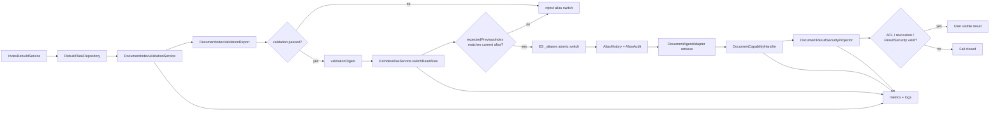

# 验证、回滚、审计、观测与撤权保障能力 L2 实施详细设计 v1.0

## 1. 文档基本信息

| 项目 | 内容 |
| --- | --- |
| 文档名称 | 验证、回滚、审计、观测与撤权保障能力 L2 实施详细设计 |
| 文档路径 | `docs/design/P2/08_验证回滚审计观测与撤权保障能力_L2实施详细设计_v1.0.md` |
| 文档状态 | Draft |
| 版本 | v1.0 |
| 编写日期 | 2026-07-06 |
| 最近修订 | 2026-07-07 |
| 所属阶段 | P2 |
| 适用范围 | 文档型能力的索引 validation、read alias switch/rollback、执行审计、观测指标、撤权失效、应急禁用和生产发布门禁 |
| 上级文档 | `docs/design/Agent目标架构总览_v1.0.md`；`docs/design/Agent能力执行内核架构设计_v1.0.md`；`docs/design/Agent契约与规划架构设计_v1.0.md`；`docs/design/Agent元数据与上下文安全架构设计_v1.0.md` |
| 关联文档 | `docs/design/P1` 下现存全部 L2 详细设计文档；`docs/design/P2` 下编号小于 08 的 00、01、02、03、04、05、06、07 详设及对应品审报告 |
| 前置详设 | `docs/design/P2/00_文档能力目标模式与实施路线图_L2实施详细设计_v1.0.md`；`docs/design/P2/01_文档语料接入与索引治理能力_L2实施详细设计_v1.0.md`；`docs/design/P2/02_文档领域元数据与Capability配置能力_L2实施详细设计_v1.0.md`；`docs/design/P2/03_权限感知检索能力_L2实施详细设计_v1.0.md`；`docs/design/P2/04_关键词向量混合检索能力_L2实施详细设计_v1.0.md`；`docs/design/P2/05_证据绑定回答能力_L2实施详细设计_v1.0.md`；`docs/design/P2/06_摘要能力_L2实施详细设计_v1.0.md`；`docs/design/P2/07_LLM与EmbeddingProvider接入能力_L2实施详细设计_v1.0.md` |
| 品审报告 | `docs/design/P2/08_验证回滚审计观测与撤权保障能力_设计文档品审报告.md` |

## 2. 修改历史

| 序号 | 日期 | 章节 | 修改说明 | 备注 |
| --- | --- | --- | --- | --- |
| 1 | 2026-07-06 | 全文 | 初始化验证、回滚、审计、观测与撤权保障详设 | 基于当前仓库 `DocumentIndexValidationService`、`EsIndexAliasService`、`RebuildTaskRepository`、`DocumentResultSecurityProjector`、emergency revocation 模型 |
| 2 | 2026-07-06 | 第 1、7 章 | 逐份设计品审修复 | 明确关联文档为 P1 L2 与 P2 上一个详设 `07_LLM与EmbeddingProvider接入能力_L2实施详细设计_v1.0.md` |
| 3 | 2026-07-07 | 第 1、3、7、8、10、11、12、13、17、19、20、21、23、24 章 | 08 设计品审修复 | 补齐 P2 00-07 基线和品审报告；对齐当前 `AliasSwitchRequest.expectedPreviousIndex`、`RebuildTask.status=SUCCESS`、本地 validation digest 与生产 validation report 边界；明确生产持久化、alias history、审计、观测和撤权实现前提 |

## 3. 文档状态说明

本文为 P2 文档能力保障面实施详设，状态为 Draft。本文不是单独面向用户的查询、问答或摘要能力，而是 P2 01-07 能力从本地闭环进入生产启用前必须闭合的运行保障层。

当前仓库已经具备本地闭环基础：

1. `DocumentIndexValidationService.validateSuccessfulTask(String taskId)` 会在文档重建任务 `SUCCESS` 后生成本地 digest，并写入 `RebuildTask.validationStatus/validationDigest/validatedAt`。
2. `AliasSwitchRequest` 当前字段为 `taskId`、`targetIndex`、`expectedPreviousIndex`、`validationDigest`、`operatorRef`。
3. `EsIndexAliasService.switchReadAlias(...)` 已校验 task、targetIndex、validationStatus、validationDigest 和 alias 当前指向。
4. `EsIndexAliasService.rollbackReadAlias(...)` 当前复用 `AliasSwitchRequest`，语义上把 `targetIndex` 作为 rollback target，把 `expectedPreviousIndex` 作为当前 alias 预期指向。
5. `DocumentCapabilityHandler.withAclScope(...)` 已在检索前解析 `DocumentAclScope` 并检查 `expiresAt`。
6. `DocumentResultSecurityProjector` 是文档结果输出安全边界。
7. `AgentPolicySnapshot.emergencyRevocations`、`EmergencyRevocation`、`EmergencyRevocationTarget` 已存在，但当前 target 枚举仅覆盖 `PROFILE`、`POLICY`、`PERMISSION`、`CAPABILITY`。

生产启用仍需闭合以下门禁：

1. validationDigest 不能只是任意非空值，也不能只是本地进度 digest；生产必须由真实 validation report 生成并持久化。
2. validation report 必须绑定 `taskId`、`targetIndex`、mappingHash、sampleHash、ACL probe、embedding model/dimension、validatorVersion 和 validationDigest。
3. read alias switch 必须校验 `taskId + targetIndex + validationDigest + expectedPreviousIndex` 与持久化 task/report 一致，并具备幂等审计。
4. rollback 必须只能回到 alias history 中已验证、未撤销、未污染的物理索引，不能仅凭调用方传入目标索引。
5. 生产 `RebuildTaskRepository` 和 validation report 必须持久化；当前内存仓库只允许本地测试和开发闭环。
6. ACL 撤权、permission version 变化、policy emergency revocation 和文档本地 blocklist 必须在检索和输出两层 fail closed。
7. 观测必须覆盖索引、validation、alias、检索、Provider、生成、ResultSecurity、撤权和应急禁用，且指标标签必须低基数。

本文可作为 08 本地编码与测试闭环依据。若编码阶段要落地生产持久化表、DB migration、公开管理 API 字段变更或扩展 `EmergencyRevocationTarget` 枚举，需要按用户确认范围另行授权。

## 4. 背景与目标

P2 00-07 已分别定义文档能力目标模式、语料接入、领域 metadata、权限感知检索、混合检索、证据绑定回答、摘要能力和 Provider 接入。生产运行还需要统一回答以下问题：

1. 新建物理索引是否满足文档 chunk schema、ACL 字段、citation 字段和 embedding 维度要求。
2. read alias 是否只能在验证通过后切换，且能防并发误切。
3. alias rollback 是否能回到可信历史版本，而不是任意目标索引。
4. 文档检索、回答、摘要、Provider 调用、ResultSecurity 和拒绝原因是否可审计。
5. 空结果、HYBRID 降级、provider 失败、citation 校验失败和撤权命中是否可观测。
6. 权限撤销、索引污染、provider 风险或策略紧急禁用时，系统能否快速 fail closed。

本文目标是为 01-07 建立可编码的验证、回滚、审计、观测和撤权保障闭环，同时保持 L1/P1 的架构边界：Runtime 不可信，Agent Service 是最终授权、执行、状态和审计边界，ResultSecurity 是统一输出安全边界。

## 5. 范围说明

| 类型 | 范围内 | 范围外 |
| --- | --- | --- |
| 验证 | rebuild task、mapping、sample、ACL probe、embedding model/dimension、citation 字段、validation report/digest | 文档内容质量人工审核、ES 集群级健康巡检 |
| 回滚 | read alias switch、rollback、expected alias target、防并发误切、alias history | ES 集群灾备方案、跨机房复制 |
| 审计 | invocation、rebuild、validation、alias、provider、ResultSecurity、revocation decision | 企业级 SIEM 平台实现 |
| 观测 | 指标、结构化日志、告警字段、低基数标签 | 前端监控面板、指标平台选型 |
| 撤权 | ACL scope 过期、permission version 变化、policy emergency revocation、本地索引/域 blocklist | auth-service 权限模型新增 |
| 应急 | document capability、domain、indexVersion、generation、embedding/vector 开关 | 业务文档平台治理流程 |

## 6. 上级文档约束继承

| 上级约束 | 本文继承方式 |
| --- | --- |
| Agent Service 是最终授权、验证、执行、状态和审计边界 | validation、alias 管理、ResultSecurity、撤权门禁均在 Java 服务侧执行 |
| Runtime 不可信 | Runtime 不接收 validation report、权限表达式、ACL scope 或撤权规则，也不决定切换/回滚 |
| capabilityId 是授权、执行和审计归因主键 | 文档运行审计关联 `document.search`、`document.answer`、`document.summarize` |
| Adapter/Domain metadata 是边界 | 文档保障层记录 adapter/domain/index/alias 事实，不让 Core 直连 ES |
| Authorization Snapshot 与 Execution 复检分离 | Planning 证据不替代执行阶段当前权限和撤权复检 |
| ResultSecurity 是统一输出安全边界 | 检索命中和 generation candidate 均必须经过 `DocumentResultSecurityProjector` |
| 日志和指标不得记录敏感 payload | 审计和观测只记录 id、digest、count、status、version、duration、diagnosticId |
| deadline/cancel 后不得提交迟到结果 | Provider、检索和安全拒绝必须遵守 invocation absolute deadline |

## 7. 关联文档与边界

本任务的关联文档固定为 `docs/design/P1` 下现存全部 L2 详细设计文档，以及 P2 下编号小于 08 的 00-07 详设和对应品审报告。本文只引用其已评审结论，不修改其内容。

| 关联文档集合 | 本文职责 | 对方职责 | 边界说明 |
| --- | --- | --- | --- |
| P2 00 详设及品审报告 | 继承 8 项能力拆分、实施顺序和目标模式 | 维护 P2 路线图和进入编码门禁 | 本文只落地 08，不重新拆分能力 |
| P2 01 详设及品审报告 | 继承 chunk schema、mapping、embedding model/dimension、rebuild/alias 治理 | 维护语料接入和索引治理 | validation 使用 01 的索引事实，不修改 01 |
| P2 02 详设及品审报告 | 继承三类文档 domain、`DOCUMENT_RETRIEVABLE`、adapter registration、`index-by-domain` | 维护文档领域 metadata 和 capability 配置 | 保障层不硬编码 domain 或 field 清单 |
| P2 03 详设及品审报告 | 继承 ACL scope/filter、fail closed、scope expired 和撤权延迟风险 | 维护权限感知检索 | 本文定义撤权观测和生产门禁，不新增 auth-service 契约 |
| P2 04 详设及品审报告 | 继承 KEYWORD/VECTOR/HYBRID、dimension mismatch、HYBRID 降级、`embedding` 排除 | 维护混合检索 | validation/observability 覆盖 04 的模型和维度风险 |
| P2 05 详设及品审报告 | 继承 evidence package、citation binding、sourceUri 净化、provider 输入安全 | 维护证据绑定回答 | 本文审计 evidenceDigest，不记录全文 |
| P2 06 详设及品审报告 | 继承摘要 generation、fallback/refuse、coverage 和候选文本安全 | 维护摘要能力 | 本文观测 generation/citation/ResultSecurity 状态 |
| P2 07 详设及品审报告 | 继承内部 provider、服务 token、model/dimension、deadline、异常脱敏 | 维护 LLM/Embedding Provider 接入 | 本文把 07 生产启用纳入 validation/observability/revocation 门禁 |
| P1 D02 Invocation 生命周期与持久化 | 复用 invocation record、checkpoint audit 和 finalization 语义 | 维护通用生命周期和审计持久化 | 不新增第二套 invocation 表 |
| P1 D03 权限权威源与原子切换 | 使用 currentPermissionEvidenceId/version 和服务 token边界 | 维护 UserPermission authority 和 capability v2 切换 | 不修改 auth-service 内部权限 API |
| P1 D04 Adapter 与 Domain Metadata | 审计 domain/adapter registration/version | 维护 domain metadata 和 adapter registration | 不在保障层维护 metadata 事实源 |
| P1 D05 Capability 扩展验证 | 把文档能力作为代表性扩展验证项 | 维护通用扩展不变量 | 本文增加文档专项门禁 |
| P1 ResultSecurity/Mask/分页与拒绝提示专项 | 复用结果投影、mask 和安全提示 | 维护通用安全输出 | 不新增平行 projector 或拒绝语义 |
| P1 统一密钥管理 | 继承 token/key 脱敏和服务 token 边界 | 维护密钥注入和脱敏 | 本文不新增外部 vendor key secret purpose |

## 8. 设计边界与不变量

1. validationDigest 不是自由口令，也不是授权 token；它只能由 validation service 对持久化 validation report 计算得出。
2. 生产 alias switch 必须验证 task、targetIndex、validationStatus、validationDigest、validatorVersion、expected alias target 和 operatorRef。
3. 当前 `AliasSwitchRequest.expectedPreviousIndex` 在代码中表示“alias 当前预期指向”；本文不要求本次重命名，避免扩大公共 API 影响。若后续重命名为 `expectedCurrentIndex`，必须走 API 兼容性评审。
4. 本地 `DocumentIndexValidationService` digest 可证明 task 绑定闭环，但不能替代生产 mapping/sample/ACL/vector validation report。
5. rollback 不能接受任意 target index；rollback target 必须来自 alias history 或验证通过且未撤销的候选集合。
6. 生产 rebuild task、validation report、alias history 和 alias audit 必须持久化；内存 `RebuildTaskRepository` 只允许本地测试。
7. ACL scope 过期、permission version 变化、policy emergency revocation 或本地 document blocklist 命中时，检索和输出均 fail closed。
8. 当前 `EmergencyRevocationTarget` 只支持 profile/policy/permission/capability。细粒度 domain/index/documentId 撤权不得伪装成现有 target；首版使用现有 target 加文档本地 blocklist，若扩展枚举需另行授权。
9. 审计和观测不得记录全文 evidence、完整 queryVector、完整 answer/summary、ACL 大列表、权限表达式、token、密钥或带签名参数的 sourceUri。
10. 所有指标标签必须低基数；禁止使用 userId、documentId、chunkId、queryText、sourceUri、validationDigest 全量值作为 label。

## 9. 总体方案

## 10. 详细功能设计

### 10.1 索引 validation

生产 validation 由 `DocumentIndexValidationService.validateSuccessfulTask(String taskId)` 触发。当前代码已经在 `IndexRebuildService` 成功路径调用该方法；实施时需要把本地 digest 扩展为真实 validation report。

| 检查项 | 规则 | 当前状态 | 生产要求 |
| --- | --- | --- | --- |
| task 状态 | `RebuildTask.status` 必须为当前代码使用的 `SUCCESS` | 已校验 | 若后续枚举化，需同步 task/status 测试 |
| targetIndex | request target 与 task target 一致 | alias service 已校验 | validation report 也必须记录 targetIndex |
| mapping | 必须包含 01 定义的必填字段、ACL 字段、citation 字段和 embedding 字段 | 未真实检查 | 读取 ES mapping 并计算 mappingHash |
| sample | 抽样 chunk 必须包含 `documentId`、`chunkId`、content/snippet、citation 字段 | 未真实检查 | 按配置抽样，记录 sampleHash 和 sample count |
| ACL probe | 使用公开、私有、未授权样本验证 filter 语义 | 未真实检查 | 复用 03 ACL filter 规则做探针 |
| vector | embedding 维度和模型必须与 01/07 配置一致 | 未真实检查 | 记录 `embeddingModel`、`embeddingDimension`、vector field |
| provider | 07 enabled 时 model/dimension 与 read alias 一致 | 未真实检查 | 不一致禁止 alias switch |
| digest | digest 包含 task/report 关键事实 | 本地 task digest | 由不可变 report canonical JSON 计算 |

`DocumentIndexValidationReport` 至少包含：

| 字段 | 说明 |
| --- | --- |
| `validationReportId` | 内部 report 主键 |
| `taskId` | rebuild task |
| `alias` | read alias |
| `targetIndex` | 待切换物理索引 |
| `validatorVersion` | validation 规则版本 |
| `mappingHash` | mapping canonical hash |
| `sampleHash` | 抽样验证摘要 hash |
| `aclProbeHash` | ACL 探针摘要 hash |
| `embeddingModel` / `embeddingDimension` | 向量模型和维度 |
| `citationFieldStatus` | citation 字段验证结果 |
| `status` | `PASSED` / `FAILED` |
| `validationDigest` | report canonical digest |
| `createdAt` | 验证时间 |

validation report 不保存全文 content、完整向量、权限表达式或 ACL 大列表。

### 10.2 validationDigest 生成与校验

生产 digest 生成规则：

1. 对 validation report 中的稳定字段做 canonical JSON。
2. 字段顺序固定，空值显式序列化。
3. digest 使用 SHA-256。
4. digest 输入包含 `validatorVersion`，validation 规则升级后旧 digest 不应自动复用。
5. digest 只用于完整性比对和审计关联，不作为访问授权凭证。

alias switch 校验规则：

1. `request.validationDigest` 必须等于 task/report 持久化 digest。
2. task 必须为 `SUCCESS`，validationStatus 必须为 `PASSED`。
3. request `targetIndex` 必须等于 task/report `targetIndex`。
4. validation report 的 alias 必须等于当前 API path 中的 alias。
5. report 不得处于撤销、过期或 validatorVersion 禁用状态。

### 10.3 alias switch

`EsIndexAliasService.switchReadAlias(String alias, AliasSwitchRequest request)` 生产实现必须保留当前本地门禁并补齐审计。

| 步骤 | 规则 |
| --- | --- |
| 请求校验 | alias、taskId、targetIndex、expectedPreviousIndex、validationDigest、operatorRef 均非空 |
| 文档索引限制 | alias、targetIndex、expectedPreviousIndex 均必须被 `DocumentIndexPolicy.isDocumentIndex(...)` 判定为文档索引 |
| task 校验 | repository 根据 taskId 找到 `SUCCESS` task |
| report 校验 | validationStatus=`PASSED` 且 validationDigest 匹配 |
| 当前 alias 校验 | ES 当前 alias 指向必须包含 `expectedPreviousIndex` |
| 原子切换 | 使用 ES `_aliases` remove 当前全部 index、add targetIndex |
| 幂等处理 | 若 alias 已指向 targetIndex 且无其他 index，且 task/report 匹配，可记录 idempotent success；若混合指向不一致则 fail closed |
| 审计 | 写 alias audit，包含 fromIndexes、toIndex、taskId、digestPrefix、operatorRef、result、failureReason、duration |

当前代码已覆盖非空校验、文档索引限制、task/report digest 基础校验和 ES 当前 alias 校验；生产还需补 idempotent success、alias audit、validation report 持久化和并发/锁策略。

### 10.4 rollback

当前 `rollbackReadAlias(String alias, AliasSwitchRequest request)` 复用 `AliasSwitchRequest`。为避免扩大 API 影响，本地闭环可以继续复用该 DTO，但必须明确语义：

| 字段 | rollback 语义 |
| --- | --- |
| `taskId` | 产生 rollback target 或最近一次通过 validation 的 task |
| `targetIndex` | rollback target index |
| `expectedPreviousIndex` | 当前 alias 预期指向，也就是要从哪个 index 回滚 |
| `validationDigest` | rollback target 对应 validation report digest |
| `operatorRef` | 操作人或内部服务主体 |

生产 rollback 必须额外满足：

1. rollback target 必须在 alias history 中出现过，且当时 validationStatus=`PASSED`。
2. rollback target 未被本地 blocklist 或 emergency revocation 禁用。
3. 当前 alias 指向必须匹配 `expectedPreviousIndex`。
4. 若 rollback target 的 validatorVersion 已被禁用，则拒绝回滚，除非用户授权紧急手工流程。
5. rollback 写独立 audit，operation=`ROLLBACK`。

如果后续要新增 `AliasRollbackRequest` 或公开 `expectedCurrentIndex` 字段，应先评估调用方兼容性并按 API 契约变更授权执行。

### 10.5 运行审计

文档 capability 执行审计优先进入既有 invocation audit/checkpoint 模型，不建立第二套 invocation 事实源。`InvocationAuditJsonCodec` 当前只序列化 planning checkpoint；文档运行审计可以作为 finalization/result audit 的附加安全 DTO 扩展，但不得写 raw plan、权限正文、完整 evidence 或完整 LLM 输出。

| 字段 | 说明 |
| --- | --- |
| `invocationId` | 单次调用 |
| `capabilityId` | `document.search` / `document.answer` / `document.summarize` |
| `domain` | `company_policy` / `knowledge_base` / `literature` |
| `retrievalMode` / `effectiveRetrievalMode` | 计划模式与实际模式 |
| `indexAlias` / `indexVersion` | 读 alias 和索引版本 |
| `permissionEvidenceId` / `permissionVersion` | 当前执行权限证据 |
| `aclSnapshotVersion` | 文档 ACL scope 版本 |
| `evidenceDigest` | evidence package digest |
| `generationStatus` | 生成状态 |
| `citationVerificationStatus` | 引用校验状态 |
| `resultSecurityDecision` | 通过、mask、fallback、fail closed |
| `revocationDecision` | 未命中、capability、policy、permission、本地 blocklist |
| `diagnosticId` | 脱敏诊断 ID |

如需新增数据库表保存 alias audit、validation report 或 invocation 附加审计，编码前需确认 DB migration 范围。

### 10.6 观测指标

指标命名建议采用低基数标签，首版可按 Micrometer 计数器/计时器实现。

| 指标 | 类型 | 标签 | 说明 |
| --- | --- | --- | --- |
| `agent_document_rebuild_total` | counter | `result`、`type` | rebuild 成功/失败 |
| `agent_document_validation_total` | counter | `result`、`validatorVersion` | validation 通过/失败/跳过 |
| `agent_document_validation_duration` | timer | `result` | validation 耗时 |
| `agent_document_alias_switch_total` | counter | `operation`、`result` | switch/rollback 结果 |
| `agent_document_retrieval_total` | counter | `domain`、`mode`、`result` | 文档检索结果 |
| `agent_document_retrieval_duration` | timer | `domain`、`mode` | adapter 检索耗时 |
| `agent_document_provider_total` | counter | `providerType`、`operation`、`result` | embedding/generation 调用结果 |
| `agent_document_result_security_total` | counter | `decision` | ResultSecurity 决策 |
| `agent_document_revocation_hit_total` | counter | `target`、`source` | 撤权命中 |

禁止作为标签：userId、subjectRef、documentId、chunkId、queryText、sourceUri、validationDigest、完整 permissionEvidenceId、完整 taskId。需要关联时使用日志中的 diagnosticId 或 digestPrefix。

### 10.7 撤权保障

撤权保障分三层：

1. 权限权威源：Execution 阶段使用当前 `ExecutionScope.currentPermissionEvidenceId/currentPermissionVersion/currentPolicyVersion`，不得复用 Planning 时旧结论。
2. 检索层：`DocumentCapabilityHandler.withAclScope(...)` 调用 `DocumentAclScopePort.resolve(...)` 并检查 `DocumentAclScope.expiresAt`，过期时 fail closed；adapter 必须把 ACL scope 转 ES filter。
3. 输出层：`DocumentResultSecurityProjector.filter(...)` 基于 `ExecutionScope.allowedFields` 和 ResultSecurity 规则过滤候选结果；generation candidate 只有在 citation 与可见 evidence 均有效时才可见。

撤权触发场景：

| 场景 | 处理 |
| --- | --- |
| ACL scope expired | 检索前拒绝，不调用 adapter |
| currentPermissionVersion 变化 | Execution recheck 结果只允许保持或收紧；旧 evidence 不得继承 |
| `EmergencyRevocationTarget.CAPABILITY` 命中文档 capability | document capabilities fail closed |
| `EmergencyRevocationTarget.POLICY` 或 `PERMISSION` 命中当前版本 | 当前 invocation fail closed |
| 本地 document index/domain blocklist 命中 | 检索和输出均 fail closed |
| ACL 权威源不可用 | 按 03 设计 fail closed，不猜测恢复授权 |

细粒度 domain/index/documentId 撤权首版通过本地 document blocklist 表达，不修改 auth-service 权限模型，也不扩展 `EmergencyRevocationTarget`。如需把 domain/index/documentId 纳入统一 policy emergency revocation，需先授权修改 P1/元数据模型和相关测试。

### 10.8 应急禁用

| 目标 | 处理 | 当前落点 |
| --- | --- | --- |
| 整体文档能力 | `agent.document.enabled=false` 或 capability policy disabled | `AgentProperties.document.enabled`、Capability Catalog |
| 单 capability | policy emergency revocation target=`CAPABILITY` | `AgentPolicySnapshot.emergencyRevocations` |
| 单 domain | domain metadata 下线或本地 document blocklist | D04 metadata / 08 blocklist |
| 单索引版本 | alias rollback 或 blocklist indexVersion | `EsIndexAliasService` / 08 blocklist |
| generation | `agent.document.generation.enabled=false` | 07 Provider 配置 |
| embedding/vector | `agent.document.embedding.enabled=false`，HYBRID 降级 KEYWORD，VECTOR fail closed | 04/07 Provider 配置 |

## 11. API 与契约设计

| 契约 | 字段 | 规则 |
| --- | --- | --- |
| `RebuildTask` | `taskId`、`index`、`targetIndex`、`status`、`validationStatus`、`validationDigest`、`validatedAt`、`validationMessage` | 当前代码已存在；生产建议补 `validationReportId` 或把 `validationMessage` 从 version/report 语义中拆出 |
| `DocumentIndexValidationReport` | `validationReportId`、`taskId`、`alias`、`targetIndex`、`validatorVersion`、hash/status/digest | 新增内部模型；不进入公共 Runtime OpenAPI |
| `AliasSwitchRequest` | `taskId`、`targetIndex`、`expectedPreviousIndex`、`validationDigest`、`operatorRef` | 当前代码字段；`expectedPreviousIndex` 表示当前 alias 预期指向 |
| `AliasOperationAudit` | alias、operation、fromIndexes、toIndex、taskId、digestPrefix、operatorRef、result、failureReason、createdAt | 新增内部审计模型或结构化日志 |
| `DocumentAclScope` | tenant/user/department/role/attribute、aclSnapshotVersion、expiresAt | 当前 adapter-api 已存在 |
| `ExecutionScope` | currentPermissionEvidenceId、currentPermissionVersion、currentPolicyVersion、allowedDomains、allowedFields | 当前 agent-service 已存在 |
| `EmergencyRevocation` | target、targetId、version、revokedAt | 当前 policy model 已存在；不表达 domain/index/documentId |
| `DocumentRevocationDecision` | source、target、version、decision、diagnosticId | 新增内部决策 DTO，不进入 Runtime |

## 12. 数据模型与字段映射

| 数据 | 字段 | 存储建议 | 说明 |
| --- | --- | --- | --- |
| rebuild task | taskId、index、targetIndex、status、cursor、validationStatus、validationDigest、validatedAt | 本地内存；生产 `document_rebuild_task` | 生产持久化需 DB migration 授权 |
| validation report | reportId、taskId、targetIndex、validatorVersion、mappingHash、sampleHash、aclProbeHash、digest、status | `document_index_validation_report` | digest 的权威来源 |
| alias history | alias、fromIndexes、toIndex、operation、taskId、validationDigest、createdAt | `document_alias_history` | rollback target 白名单 |
| alias audit | alias、operation、operatorRef、result、failureReason、duration | 审计表或结构化日志 | 不记录完整 digest |
| invocation audit | invocationId、capabilityId、domain、indexAlias、evidenceDigest、securityDecision | 复用 invocation audit/result audit | 不建立第二套 invocation fact |
| document blocklist | targetType、targetId、version、reason、effectiveAt | 内部配置或表 | 首版用于 domain/indexVersion 本地应急禁用 |

## 13. 状态流转

以下状态为内部 task/operation 状态，不新增公共 Runtime 枚举。

| 状态 | 触发条件 | 处理 |
| --- | --- | --- |
| `REBUILD_SUBMITTED` | 创建 rebuild task | 写 task |
| `REBUILD_RUNNING` | rebuild 开始 | 更新进度 |
| `REBUILD_SUCCESS` | 批量写入完成 | 触发 validation |
| `VALIDATION_FAILED` | mapping/sample/ACL/vector 任一失败 | 写 report，禁止 alias switch |
| `VALIDATION_PASSED` | validation 通过 | 写 report 和 digest |
| `ALIAS_SWITCH_REJECTED` | task/report/expected alias 校验失败 | 不调用 ES `_aliases`，写 audit |
| `ALIAS_SWITCHED` | digest 和 expected alias 校验通过 | 原子切换 read alias，写 history/audit |
| `ROLLBACK_REJECTED` | rollback target 不在可信 history 或 expected 不匹配 | 不调用 ES `_aliases` |
| `ROLLBACK_DONE` | rollback 校验通过 | alias 回退，写 history/audit |
| `REVOCATION_ACTIVE` | ACL/policy/blocklist 命中 | 检索/输出 fail closed |

## 14. 幂等、并发与一致性

1. validation 对同一 task 可重复执行，输入事实不变时 digest 必须稳定。
2. 同一 task/report 的 alias switch 可幂等重试；ES alias 已正确指向 target 且无多余 index 时记录 idempotent success。
3. alias switch 使用 `expectedPreviousIndex` 防并发误切；当前 alias 不匹配时拒绝。
4. rollback 使用 expected current 和 alias history 防误回滚。
5. rebuild task、validation report、alias history 生产必须持久化，服务重启后可恢复。
6. audit 写入失败不得掩盖安全拒绝；alias 已切换但 audit 写失败时必须记录 diagnosticId 并进入补偿/告警。
7. revocation 生效后，新请求必须 fail closed；已返回响应不追溯修改，但审计可追踪。
8. Provider deadline 到期后的迟到 generation/embedding 结果不得进入 candidate/result。

## 15. 权限、安全与审计

1. rebuild、validation、alias switch、rollback 只允许内部管理端或受控 service token。
2. alias 操作不得接受用户 JWT 作为唯一授权凭据。
3. validation report 不记录全文 content、完整 embedding、权限表达式或 ACL 大列表。
4. audit 只记录 digestPrefix、count、status、version、duration、diagnosticId。
5. 撤权命中时用户响应使用安全拒绝或空结果策略，不泄漏被撤权文档存在性。
6. Provider 和 ES 下游异常不得把敏感请求体、Authorization header、queryVector、sourceUri token 带入日志。
7. ResultSecurity 前不得把 generation candidate 作为用户可见文本。
8. 新增 DB 表、公开管理 API 字段或 policy target 枚举扩展必须在编码前确认授权范围。

## 16. 性能与容量

| 项目 | 目标 |
| --- | --- |
| validation sample | 按配置抽样；默认小样本用于本地，生产按索引规模配置 |
| alias switch | ES `_aliases` 原子操作，秒级完成 |
| rollback | 依赖 alias history 和 ES `_aliases`，不扫描全量文档 |
| audit | 安全拒绝同步生效；审计写入可异步补偿但必须可告警 |
| metrics | 低基数字段，禁止 documentId/userId 作为 label |
| revocation | 新请求实时可见；缓存 TTL 必须小于撤权 SLA |

## 17. 兼容性设计

1. 默认 document disabled，不影响现有 Query/Aggregate 能力。
2. 当前 `AliasSwitchRequest.expectedPreviousIndex` 字段保持不变，避免破坏现有本地测试和 API 调用。
3. alias API 从“本地 digest 骨架”升级为“持久化 report digest”后，旧任意 digest 请求会被拒绝，这是安全兼容性变更。
4. 内存 `RebuildTaskRepository` 保留测试用途；生产持久化实现通过 profile/bean 替换。
5. 指标和审计字段新增为内部信息，不改变用户响应主结构。
6. 本地 blocklist 不改变 auth-service 权限模型；若需要统一 policy target 扩展，另行评审。

## 18. 日志、观测与诊断

| 类型 | 允许字段 |
| --- | --- |
| 索引日志 | taskId prefix、index、targetIndex、validationStatus、digestPrefix、duration、diagnosticId |
| alias 日志 | alias、fromIndex count、toIndex、taskId prefix、operatorRef hash、result、failureCategory |
| 执行日志 | invocationId、capabilityId、domain、effectiveRetrievalMode、hitCount、generationStatus |
| 安全日志 | permissionVersion、aclSnapshotVersion、scopeExpired、revocationTarget、projectorDecision |
| Provider 日志 | providerType、operation、model、duration、failureCategory、requestId |
| 禁止字段 | full content、full answer/summary、full queryVector、Authorization header、token、权限表达式、sourceUri query/fragment |

## 19. 实现落点清单

| 序号 | 类型 | 文件路径 | 类/接口 | 方法/字段 | 入参 | 出参 | 动作 | 说明 |
| --- | --- | --- | --- | --- | --- | --- | --- | --- |
| 1 | Service | `es-query-service/src/main/java/com/dylan/esquery/service/DocumentIndexValidationService.java` | `DocumentIndexValidationService` | `validateSuccessfulTask` | taskId | void/report | 修改 | 从本地 digest 扩展为 mapping/sample/ACL/vector validation report |
| 2 | Model | `es-query-service/src/main/java/com/dylan/esquery/service/DocumentIndexValidationReport.java` | `DocumentIndexValidationReport` | report fields | validation facts | report | 新增 | 内部不可变 validation 结果 |
| 3 | API Model | `es-query-api/src/main/java/com/dylan/esquery/api/model/RebuildTask.java` | `RebuildTask` | `validationReportId` 或等价字段 | task | task | 修改/可选 | 生产建议拆出 report 引用；本地可继续使用 validationMessage |
| 4 | Repository | `es-query-service/src/main/java/com/dylan/esquery/service/RebuildTaskRepository.java` | `RebuildTaskRepository` | CRUD/validation methods | taskId/report | task | 修改 | 当前内存实现保留；生产需持久化替换 |
| 5 | Repository | `es-query-service/src/main/java/com/dylan/esquery/service/PersistentRebuildTaskRepository.java` | `PersistentRebuildTaskRepository` | CRUD | task/report | task | 新增/需授权 | DB migration 确认后实施 |
| 6 | API | `es-query-api/src/main/java/com/dylan/esquery/api/model/AliasSwitchRequest.java` | `AliasSwitchRequest` | `taskId`、`targetIndex`、`expectedPreviousIndex`、`validationDigest`、`operatorRef` | JSON | DTO | 保持/校验 | 字段与当前代码一致，不在 08 中强行重命名 |
| 7 | Service | `es-query-service/src/main/java/com/dylan/esquery/service/EsIndexAliasService.java` | `EsIndexAliasService` | `switchReadAlias` | alias/request | void | 修改 | 补 idempotent success、report 校验、audit |
| 8 | Service | 同上 | `EsIndexAliasService` | `rollbackReadAlias` | alias/request | void | 修改 | 校验 alias history 和 rollback target |
| 9 | Model | `es-query-service/src/main/java/com/dylan/esquery/service/AliasOperationAudit.java` | `AliasOperationAudit` | operation fields | alias operation | audit | 新增 | 结构化审计 DTO |
| 10 | Controller | `es-query-service/src/main/java/com/dylan/esquery/controller/EsQueryController.java` | `EsQueryController` | alias endpoints | index/request | 204/error | 修改 | 管理 API 保持内部受控 |
| 11 | Handler | `agent-service/src/main/java/com/dylan/agent/capability/document/DocumentCapabilityHandler.java` | `DocumentCapabilityHandler` | `withAclScope` | request/context | request | 修改/补测 | 保持 scope expired fail closed，建议注入 clock 便于测试 |
| 12 | Security | `agent-service/src/main/java/com/dylan/agent/capability/document/security/DocumentRevocationGuard.java` | `DocumentRevocationGuard` | `evaluate` | context/domain/index | decision | 新增 | 汇总 emergency revocation 与本地 blocklist |
| 13 | Projector | `agent-service/src/main/java/com/dylan/agent/metadata/result/DocumentResultSecurityProjector.java` | `DocumentResultSecurityProjector` | `filter` | candidate/scope | filtered | 修改/补测 | 输出层按 revocation decision fail closed |
| 14 | Audit | `agent-service/src/main/java/com/dylan/agent/lifecycle/InvocationAuditJsonCodec.java` | `InvocationAuditJsonCodec` | document audit DTO | invocation/result | JSON | 修改/可选 | 若接入 invocation audit，使用专用安全 DTO |
| 15 | Config | `agent-service/src/main/resources/application.yml` | `agent.document.*` | enabled/generation/embedding/blocklist | YAML | properties | 修改 | 应急开关与本地 blocklist |
| 16 | Observability | `agent-service/src/main/java/com/dylan/agent/capability/document/DocumentObservabilitySupport.java` | `DocumentObservabilitySupport` | record methods | event | void | 新增 | 低基数指标和脱敏日志封装 |

## 20. 测试设计

| 序号 | 类型 | 文件路径 | 测试类 | 测试点 | 预期 |
| --- | --- | --- | --- | --- | --- |
| 1 | Unit | `es-query-service/src/test/java/com/dylan/esquery/service/IndexRebuildServiceTest.java` | `IndexRebuildServiceTest` | 本地 validation digest 写入 task | task status/validationStatus/digest 正确 |
| 2 | Unit | `es-query-service/src/test/java/com/dylan/esquery/service/DocumentIndexValidationServiceTest.java` | `DocumentIndexValidationServiceTest` | mapping/sample/ACL/vector validation | 任一失败则 validation failed |
| 3 | Unit | `es-query-service/src/test/java/com/dylan/esquery/service/EsIndexAliasServiceTest.java` | `EsIndexAliasServiceTest` | digest 与 task/report 不匹配 | 拒绝 alias switch |
| 4 | Unit | 同上 | `EsIndexAliasServiceTest` | `expectedPreviousIndex` 不匹配当前 alias | 拒绝 switch/rollback |
| 5 | Unit | 同上 | `EsIndexAliasServiceTest` | alias 已指向 target 的幂等重试 | idempotent success 或安全拒绝符合设计 |
| 6 | Unit | 同上 | `EsIndexAliasServiceTest` | rollback target 不在 alias history | 拒绝 rollback |
| 7 | Unit | `agent-service/src/test/java/com/dylan/agent/kernel/core/DocumentCapabilityHandlerTest.java` | `DocumentCapabilityHandlerTest` | ACL scope expired | fail closed |
| 8 | Unit | `agent-service/src/test/java/com/dylan/agent/capability/document/security/DocumentRevocationGuardTest.java` | `DocumentRevocationGuardTest` | capability/policy/permission emergency revocation | 命中 fail closed |
| 9 | Unit | `agent-service/src/test/java/com/dylan/agent/metadata/result/DocumentResultSecurityProjectorTest.java` | `DocumentResultSecurityProjectorTest` | revocation decision 命中 | 不输出 evidence/candidate |
| 10 | Unit | `agent-service/src/test/java/com/dylan/agent/capability/document/DocumentObservabilitySupportTest.java` | `DocumentObservabilitySupportTest` | 指标 label 和日志字段 | 不含 userId/documentId/queryText/token |
| 11 | Unit | `agent-service/src/test/java/com/dylan/agent/lifecycle/InvocationAuditJsonCodecTest.java` | `InvocationAuditJsonCodecTest` | document audit DTO 序列化 | 不含 raw plan、权限正文、全文 evidence |
| 12 | Integration | `es-query-service/src/test/java/com/dylan/esquery/service/DocumentAliasSwitchIntegrationTest.java` | `DocumentAliasSwitchIntegrationTest` | rebuild -> validation -> switch -> rollback | 成功且可回滚 |
| 13 | Integration | `agent-service/src/test/java/com/dylan/agent/capability/document/DocumentRevocationIntegrationTest.java` | `DocumentRevocationIntegrationTest` | 撤权后检索和输出 | fail closed |
| 14 | Static | `docs/design/P2/08_验证回滚审计观测与撤权保障能力_设计文档品审报告.md` | 品审报告 | 08 单文档审查 | S0/S1 关闭 |

## 21. 风险与阻塞项

| 序号 | 类型 | 风险 | 触发场景 | 处理建议 | 是否阻塞 |
| --- | --- | --- | --- | --- | --- |
| 1 | 安全 | validationDigest 被当作自由口令 | 调用方伪造 digest 调 alias API | digest 必须绑定持久化 task/report，并校验 validatorVersion | 阻塞生产 |
| 2 | 可靠性 | task/report 内存存储丢失 | es-query-service 重启 | 生产持久化 repository 和 validation report | 阻塞生产；不阻塞本地闭环 |
| 3 | 一致性 | rollback 到污染或未验证索引 | 只按请求 targetIndex 回滚 | alias history + blocklist + validation report 校验 | 阻塞生产 |
| 4 | 安全 | 撤权后缓存或候选结果继续可见 | ACL scope TTL 过长或 projector 不感知 | scope expired、permissionVersion、revocation guard、ResultSecurity | 阻塞生产 |
| 5 | 可观测 | 只记录成功，不记录拒绝原因 | 生产排障困难 | 指标、结构化日志和审计 DTO | 编码完成门禁 |
| 6 | 数据泄漏 | audit/log 记录全文、向量、token | 异常打印 body/header | 脱敏封装和日志测试 | 编码完成门禁 |
| 7 | 范围 | 扩展 `EmergencyRevocationTarget` 到 domain/index/document | 试图把细粒度文档撤权纳入统一 policy | 先授权修改 P1/元数据模型；首版使用本地 blocklist | 阻塞对应扩展 |
| 8 | 契约 | 将 `expectedPreviousIndex` 强行重命名 | API 调用方和测试不兼容 | 本次保持字段，后续按兼容变更处理 | 阻塞重命名 |

## 22. 评审记录

| 轮次 | 日期 | 结论 | S0 | S1 | 主要问题 | 修复情况 |
| --- | --- | --- | --- | --- | --- | --- |
| 1 | 2026-07-06 | 通过 | 0 | 0 | 无 | 已按 `detailed-design-document` 检查 validation、alias、审计、观测、撤权、安全日志和实现落点 |
| 2 | 2026-07-07 | 通过 | 0 | 0 | 初审发现关联基线不完整、代码字段/状态不一致、validationDigest 生产语义不足、rollback 缺少 alias history、持久化门禁边界不清、emergency revocation target 表述过度、观测和测试落点不够具体 | 已修复并生成 `08_验证回滚审计观测与撤权保障能力_设计文档品审报告.md` |

## 23. 实现对齐检查

| 检查项 | 目标 | 当前仓库落点 | 状态 | 备注 |
| --- | --- | --- | --- | --- |
| validation digest | task/report 绑定 digest | `DocumentIndexValidationService`、`RebuildTaskRepository` | 部分满足 | 本地 task digest 已有；真实 mapping/sample/ACL/vector validation 待补 |
| alias switch | 校验 task/digest/expected alias | `EsIndexAliasService.switchReadAlias` | 部分满足 | 当前已防任意 digest；audit/idempotent/report 持久化待补 |
| rollback | expected 防误切 + alias history | `EsIndexAliasService.rollbackReadAlias` | 部分满足 | 当前复用 switch 校验；history 和污染阻断待补 |
| task/report 持久化 | 重启不丢状态 | 当前内存 `RebuildTaskRepository` | 未满足 | 生产阻塞，需要 DB migration 授权 |
| ACL scope expired | 检索前 fail closed | `DocumentCapabilityHandler.withAclScope` | 已满足/需补测 | 当前检查 `expiresAt`，建议注入 clock |
| revocation | policy/local blocklist 命中 fail closed | `EmergencyRevocation`、`DocumentResultSecurityProjector` | 部分满足 | 模型存在；guard/projector 联动待补 |
| observability | 低基数指标和脱敏日志 | 分散 | 未满足 | 需新增封装和测试 |
| invocation audit | 复用既有生命周期审计 | `InvocationAuditJsonCodec` | 部分满足 | checkpoint 已有；document result audit 扩展待定 |

## 24. 完成摘要

| 项目 | 结论 |
| --- | --- |
| 目标文档 | `docs/design/P2/08_验证回滚审计观测与撤权保障能力_L2实施详细设计_v1.0.md` |
| 文档状态 | Draft |
| 是否可作为实现依据 | 是，可进入 08 本地编码与测试闭环；生产启用仍依赖持久化 task/report、真实 validation、alias history、撤权联动和观测闭合 |
| 主要修改内容 | 定义 validation report/digest、alias switch/rollback、运行审计、观测指标、撤权保障、应急禁用、实现落点和测试策略 |
| 是否修改上级/关联文档 | 否 |
| 是否已补充实现落点清单 | 是 |
| 是否已执行内部评审 | 是，2 轮 |
| 是否存在 S0/S1 遗留 | 否 |
| 是否需要用户进一步授权 | 否；除非编码阶段要新增生产 DB migration、修改公开 API 字段、扩展 `EmergencyRevocationTarget`、修改 P1/L1 文档或接入外部审计平台 |
