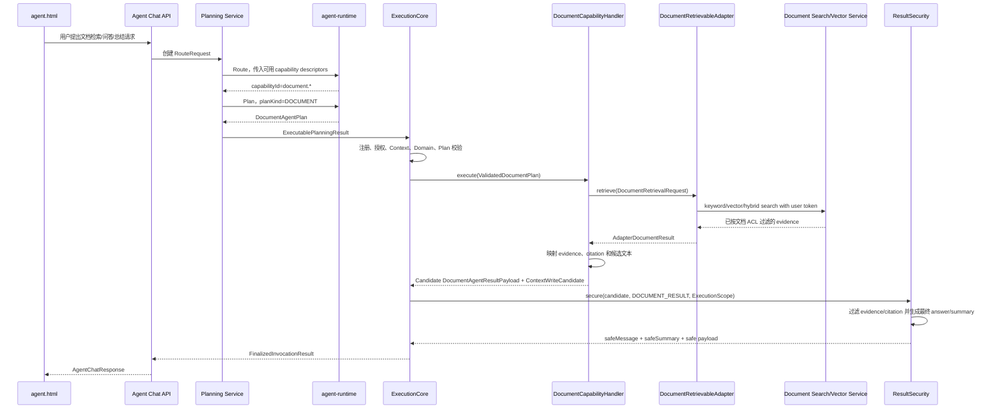

# Agent文档型检索与总结能力 L2 实施详细设计 v1.0

## 1. 文档信息

| 项目 | 内容 |
|---|---|
| 文档名称 | Agent文档型检索与总结能力 L2 实施详细设计 |
| 文档路径 | `docs/design/P2/Agent文档型检索与总结能力_L2实施详细设计_v1.0.md` |
| 文档版本 | v1.0 |
| 文档状态 | Draft |
| 创建日期 | 2026-07-06 |
| 最后更新日期 | 2026-07-06 |
| 输出语言 | 简体中文 |
| 文件编码 | UTF-8 |
| 适用范围 | Agent 在既有 capability-first 架构下新增文档型检索、问答和总结能力 |

## 2. 修改历史

| 序号 | 日期 | 位置 | 修改原因 | 修改内容 |
|---:|---|---|---|---|
| 1 | 2026-07-06 | 全文 | 新建 P2 L2 详细设计 | 基于既有 L0/L1/P1 设计和当前代码结构，创建文档型检索与总结能力的实施详细设计 |
| 2 | 2026-07-06 | 第 7、10、12、17、19 章 | 第 1 轮内部评审发现 PlanKind、AdapterRole 和 sealed union 影响未充分闭合 | 补充 `DOCUMENT` PlanKind、`DOCUMENT_RETRIEVABLE` AdapterRole、Java/OpenAPI/Python 契约生成和 ResultSecurity 联动落点 |
| 3 | 2026-07-06 | 第 8、13、15、21 章 | 第 2 轮内部评审发现文档级 ACL 与总结证据边界不够明确 | 补充 corpus/domain 级权限、文档级 ACL 下游过滤、证据引用、摘要安全投影和自然语言越权防护 |
| 4 | 2026-07-06 | 第 19、20、23 章 | 第 3 轮内部评审发现实现落点和验证项需要进一步可执行 | 补充 Java、Python、配置、OpenAPI、测试、脚本和实施对齐检查项 |
| 5 | 2026-07-06 | 第 10、18 章 | 第 4 轮内部评审发现接口、性能容量、兼容扩展、日志监控告警需要显式设计 | 补充接口设计、性能和容量设计、兼容性与扩展性设计、日志监控和告警设计 |
| 6 | 2026-07-06 | 第 4、5、8、9、10、11、12、13、18、19、20、22、23、24 章 | 正式设计文档品审第 1 轮发现 ResultSecurity 文本边界、默认启用策略、Domain Metadata 配置和下游接口契约仍需收敛 | 明确 Handler 只产生候选结果，ResultSecurity 基于过滤后 evidence 生成最终 answer/summary；补充默认关闭、动态 Profile/Policy 注入、document domain metadata 配置形态和下游 HTTP 契约 |
| 7 | 2026-07-06 | 第 3、24 章 | 同步正式设计文档品审后的文档状态 | 明确当前状态为 Draft、自动品审有条件通过、可作为 Agent 侧编码输入、未 Approved、未进入 Implementing |

## 3. 文档状态说明

| 状态 | 当前取值 | 说明 |
|---|---|---|
| Draft | 是 | 已完成内部评审和自动品审，结论为有条件通过；可作为 Agent 侧编码输入，但仍需用户或项目负责人确认后才能升级为 Approved |
| In Review | 否 | 已完成自动品审，但未进入人工正式评审流；自动品审不等同于人工正式评审状态 |
| Approved | 否 | 未获得用户或项目负责人批准，且 R1/R2 仍需在联调、灰度或生产启用前确认，不能标记为 Approved |
| Implementing | 否 | 本文档未对应已开始的代码实施 |
| Implemented | 否 | 本文档未对应已完成实现 |
| Deprecated | 否 | 文档仍有效 |

当前状态摘要：`Draft / 自动品审有条件通过 / 可作为 Agent 侧编码输入 / 未 Approved / 未 Implementing`。

## 4. 上级文档约束

| 上级文档 | 约束摘录 | 本设计遵循方式 |
|---|---|---|
| `docs/design/Agent目标架构总览_v1.0.md` | `capabilityId` 是能力注册、授权、路由、执行和审计归因主键；`planKind` 只表达结构化 Plan 类型 | 新增 `document.search`、`document.answer`、`document.summarize` 三个 capability；新增 `DOCUMENT` 仅作为文档型 Plan 结构类型，不作为 Handler 或权限主键 |
| `docs/design/Agent目标架构总览_v1.0.md` | 只有现有 Plan 结构无法表达时才新增 Plan Kind | 文档型需求需要表达 corpus、queryText、retrievalOptions、citationRequired、summaryScope、evidenceLimit，`QUERY`/`AGGREGATE` 无法覆盖，因此新增 `DOCUMENT` |
| `docs/design/Agent目标架构总览_v1.0.md` | Runtime 不可信，不决定权限、字段范围、最终脱敏；自然语言 summary 不能绕过结构化结果权限 | Runtime 只产出 `DocumentAgentPlan`；执行前由 Java Validator 复检；结果由 `DocumentResultSecurityProjector` 过滤证据、引用、答案和摘要 |
| `docs/design/Agent契约与规划架构设计_v1.0.md` | Java 是跨 Runtime 结构契约源，Python generated model 禁止手工编辑 | 新增 Java DTO 后重新生成 `agent-runtime-openapi.json` 和 `agent-runtime/app/contracts/generated_models.py`，不手改 generated model |
| `docs/design/Agent契约与规划架构设计_v1.0.md` | Route Prompt 不维护 capability/domain 清单，新增同 planKind capability 不增加 Route graph 节点 | Route 继续读取请求级 Capability Routing Descriptor；新增 `DOCUMENT` 只增加 Plan Strategy，不增加 Route graph 分支 |
| `docs/design/Agent能力执行内核架构设计_v1.0.md` | `ExecutionCore` 不按 capabilityId/domain/planKind 分支 | 文档能力通过新的 `CapabilityRegistration`、Validator、Handler、Adapter 和 ResultSecurity 接入，不修改核心 13 步执行算法 |
| `docs/design/Agent元数据与上下文安全架构设计_v1.0.md` | Profile/Policy/Permission/Domain/Context 是请求级安全投影，不扩大用户权限 | 文档能力只在 Profile/Policy/Permission/Domain 同时允许时可见；文档级 ACL 由下游文档检索服务在用户身份下过滤 |

## 5. 关联文档边界

| 关联文档 | 关联内容 | 本文负责 | 本文不负责 |
|---|---|---|---|
| `docs/design/P1/D01_Agent契约生成与治理_L2实施详细设计_v1.0.md` | Java DTO、OpenAPI、Python generated model、fixture 治理 | 指明新增契约和生成命令 | 修改 D01 规则 |
| `docs/design/P1/D02_00_CapabilityKernel实施总览与集成门禁_L2_v1.0.md` | Capability Kernel 集成门禁 | 指明新增能力必须通过既有门禁 | 修改门禁定义 |
| `docs/design/P1/D02_01_Capability注册与可信执行内核_L2_v1.0.md` | Registration、Validator、Handler、ExecutionCore | 新增文档能力 Registration、Validator、Handler | 修改 ExecutionCore 算法 |
| `docs/design/P1/D02_02_Invocation生命周期与持久化_L2_v1.0.md` | Invocation 生命周期和终结持久化 | 使用既有 Invocation 终结和 ResultSecurity 存储 | 新增异步任务、Task、ResultRef |
| `docs/design/P1/D02_03_元数据授权与Context安全_L2_v1.0.md` | Profile、Policy、Authorization、Context、ResultSecurity | 新增 `DOCUMENT` Context、Profile/Policy 可配置启用项、结果安全投影 | 改写权限权威源模型 |
| `docs/design/P1/D04_Agent Adapter与Domain Metadata收敛_L2实施详细设计_v1.0.md` | AdapterRole、DomainMetadata、Adapter 绑定 | 新增 `DOCUMENT_RETRIEVABLE` 角色和 document domain/corpus 配置 | 重构现有 employee/transaction adapter |
| `docs/design/P1/D05_Capability扩展验证与遗留清理_L2实施详细设计_v1.0.md` | 新 capability 扩展验证 | 复用扩展验证模式并补充文档能力测试 | 修改 D05 文档 |
| `docs/design/P1/Agent_ResultSecurity值级Mask脱敏接入_L2实施详细设计_v1.0.md` | ResultSecurity 值级脱敏 | 增加文档证据、引用、答案和摘要投影 | 修改既有 query/aggregate 脱敏语义 |

## 6. 设计结论

### 6.1 是否需要先做 L1 设计

本次可直接进入 P2 L2 详细设计，不需要先修改 L1，理由如下：

1. 本设计不改变 capability-first、Route/Plan 两阶段、Java 契约源、ExecutionCore 可信执行、ResultSecurity 终态输出等 L1 不变量。
2. 新增 `DOCUMENT` PlanKind 属于 L1 已允许的扩展场景，即现有 Plan 结构无法表达新能力时新增 PlanKind。
3. 文档能力通过新增契约、注册、Adapter、ResultSecurity、Context、Runtime Strategy 和 UI 渲染横向接入。
4. 文档录入、索引构建、文档权限权威源、异步多 Agent 任务和生成式执行后总结均不纳入本设计。

需要另起 L1 或 ADR 的触发条件：

| 触发条件 | 原因 | 本文处理 |
|---|---|---|
| Runtime 在执行后直接读取文档证据并生成摘要 | 会改变 Runtime 只负责规划的边界 | 不纳入 |
| Agent 内部建设文档录入、切分、向量化、索引流水线 | 会引入新的文档平台职责和状态所有权 | 不纳入 |
| 新增文档级权限权威源或改写 `UserPermissionAuthorityPort` | 会改变权限模型和授权快照结构 | 不纳入 |
| 引入异步长任务、Task Graph、ResultRef 跨任务汇总 | 会进入 Multi-Agent/Task 设计域 | 不纳入 |
| 需要 abstractive LLM 总结且不能由下游文档服务提供 | 会要求新增执行后 LLM 能力边界 | 需 L1/ADR |

### 6.2 对既有功能的影响程度

| 既有能力 | 影响程度 | 说明 |
|---|---|---|
| `query.search` | 低 | 不修改 Query Plan、Validator、Handler、Adapter 调用链；仅共享枚举、sealed union、OpenAPI 生成物变更 |
| `query.preview` | 低 | 不修改预览逻辑；ResultPayload sealed union 扩展需要编译检查 |
| `aggregate.compute` | 低 | 不修改 Aggregate Plan、Validator、Handler；Runtime plan prompt 选择逻辑增加 `DOCUMENT` 分支 |
| ExecutionCore | 无算法侵入 | 不新增 capabilityId/domain/planKind 分支 |
| DomainMetadata | 中 | 需要注册新 AdapterRole 并修正非 `QUERYABLE`/`AGGREGATABLE` 角色的 max size、sort 校验分支 |
| ResultSecurity | 中 | 新增文档 projector，不改变既有 projector |
| Runtime | 中 | 新增 `document_system.md` 与 `DOCUMENT` Planning Strategy；Route Prompt 从硬编码 query/aggregate 规则修正为 descriptor-driven |
| UI | 中 | `agent.html` 增加 `DOCUMENT` resultKind 渲染，不影响现有表格结果 |

## 7. 设计范围

### 7.1 范围内

| 范围 | 内容 |
|---|---|
| 能力定义 | 新增 `document.search`、`document.answer`、`document.summarize` |
| 契约 | 新增 `DocumentAgentPlan`、`AgentDocumentSpec`、`DocumentAgentResultPayload`、`DocumentCapabilityContextPayload` |
| Runtime | 新增 `DOCUMENT` PlanKind 的 Strategy 和 Prompt；Route 使用 descriptor 选择新 capability |
| 执行 | 新增文档能力 Validator、Handler、ResultSecurityProjector、Context write |
| Adapter | 新增 `DocumentRetrievableAdapter` 和文档检索 adapter 模块 |
| 元数据 | 新增 `DOCUMENT_RETRIEVABLE` AdapterRole、document domain/corpus 元数据、Profile/Policy 可配置启用项；默认不启用文档能力 |
| UI | 渲染文档搜索命中、摘要、引用、证据片段和授权提示 |
| 测试 | 补充契约、Runtime、Kernel、Adapter、ResultSecurity、UI 和配置测试 |

### 7.2 范围外

| 范围外事项 | 原因 | 后续入口 |
|---|---|---|
| 文档上传、切分、清洗、索引重建 | 属于文档平台或 ES/向量索引平台 | 独立文档平台设计 |
| 文档级 ACL 写入和权限权威源改造 | 当前 Agent 权限模型没有 documentId 级授权快照 | 权限源与文档录入设计 |
| Runtime 执行后读取证据并生成总结 | 违反 Runtime 只规划、不执行的边界 | L1/ADR |
| 多轮长文档批量总结任务 | 需要异步 Task/ResultRef/Run 设计 | Multi-Agent/Task 设计 |
| 修改 employee/transaction 业务适配器 | 与文档能力无关 | 不处理 |

## 8. 总体方案

### 8.1 能力模型

| capabilityId | planKind | operation | domainMode | adapterRole | 输出 |
|---|---|---|---|---|---|
| `document.search` | `DOCUMENT` | `SEARCH` | `REQUIRED` | `DOCUMENT_RETRIEVABLE` | 命中文档、片段、引用、检索参数 |
| `document.answer` | `DOCUMENT` | `ANSWER` | `REQUIRED` | `DOCUMENT_RETRIEVABLE` | 基于证据的答案、引用、证据片段 |
| `document.summarize` | `DOCUMENT` | `SUMMARIZE` | `REQUIRED` | `DOCUMENT_RETRIEVABLE` | 基于证据的摘要、引用、覆盖范围 |

`domain` 在本文中表示文档 corpus 的 Agent 可路由域，例如 `company_policy`、`knowledge_base`、`literature`。文档级 `documentId` ACL 不进入 Runtime，也不进入 Agent Domain Schema；由下游文档检索服务在当前用户身份下过滤。

### 8.2 调用链



### 8.3 摘要生成边界

首版摘要必须是 evidence-bound，最终可展示文本只能由 ResultSecurity 基于过滤后的证据片段生成或确认：

1. `document.search` 不生成最终总结，只返回命中、引用、证据和可选 `safeSummary`。
2. `document.answer` 的最终 `answerText` 由 `DocumentResultSecurityProjector` 基于过滤后 evidence 生成或校验；每个事实句必须映射到至少一条过滤后仍存在的 `citationId`。
3. `document.summarize` 的最终 `summaryText/summaryBullets` 由 `DocumentResultSecurityProjector` 基于过滤后 evidence 生成或裁剪，默认按标题、段落、发布日期和相关度组织。
4. Handler、Adapter 或下游服务返回的 `candidateAnswerText/candidateSummaryText` 只能作为候选文本，不能绕过 ResultSecurity 直接进入最终响应或 StoredResult。
5. 不允许把未过滤全文、完整文档、权限表达式、mask 规则或内部诊断写入摘要。
6. 需要 LLM abstractive summary 时，应由下游文档服务在其权限边界内提供候选 `summaryText` 和引用；Agent 仍必须执行 ResultSecurity，并在引用被过滤后删除或重算对应文本。

## 9. 功能详细设计

### 9.1 文档搜索

| 项目 | 设计 |
|---|---|
| 输入 | 用户自然语言、可选 corpus/domain、关键词、文档类型、时间范围、作者、标题、标签 |
| Runtime 输出 | `DocumentAgentPlan.document.operation=SEARCH` |
| Java 校验 | 校验 operation 与 capabilityId 匹配；校验 queryText 非空；校验 filters/sorts 字段在 domain projection 中可见 |
| Adapter 行为 | 执行关键词召回和可配置向量召回，合并去重后返回已授权 evidence |
| 输出 | `DocumentAgentResultPayload.documentResult.hits`、`citations`、`partial`、`safeSummary` |
| Context | 保存最近一次文档检索的 corpus、queryText、filters、topK、citationIds，不保存正文 |

### 9.2 文档问答

| 项目 | 设计 |
|---|---|
| 输入 | 用户问题、可选 corpus/domain、可选限定文档或时间范围 |
| Runtime 输出 | `DocumentAgentPlan.document.operation=ANSWER` |
| Java 校验 | `citationRequired=true`；`topK` 不超过 `agent.document.max-evidence-count` |
| Adapter 行为 | 返回与问题相关的证据片段和引用；若证据为空，Handler 返回空候选结果，由 ResultSecurity 生成最终安全提示 |
| 输出 | `answerText`、`citations`、`evidence`、`coverage`；其中 `answerText` 是 ResultSecurity 过滤后生成或确认的最终文本 |
| 安全规则 | `answerText` 中每个事实句必须引用至少一个过滤后 `citationId`；无引用句由 `DocumentResultSecurityProjector` 删除或降级为“未找到可引用证据” |

### 9.3 文档总结

| 项目 | 设计 |
|---|---|
| 输入 | 总结目标、summaryScope、可选文档集合、时间范围、摘要长度 |
| Runtime 输出 | `DocumentAgentPlan.document.operation=SUMMARIZE` |
| Java 校验 | `summaryScope` 必填；`maxSummaryChars` 不超过配置；限定文档数量不超过配置 |
| Adapter 行为 | 检索 summaryScope 覆盖的证据片段；返回 coverage 和 partial 标记 |
| 输出 | `summaryText`、`summaryBullets`、`citations`、`coverage`、`partial`；其中 summary 字段是 ResultSecurity 过滤后生成或确认的最终文本 |
| 安全规则 | 摘要只基于授权证据片段；证据过滤后为空时不输出候选摘要 |

## 10. 契约设计

### 10.1 Runtime Plan 契约

| 文件 | 类型 | 操作 | 关键字段或方法 |
|---|---|---|---|
| `agent-api/src/main/java/com/dylan/agent/api/contract/runtime/common/AgentPlanKind.java` | 现有 | 修改 | 新增 `DOCUMENT` |
| `agent-api/src/main/java/com/dylan/agent/api/contract/runtime/plan/AgentPlan.java` | 现有 | 修改 | `oneOf`、`@DiscriminatorMapping`、`@JsonSubTypes`、`permits` 增加 `DocumentAgentPlan` |
| `agent-api/src/main/java/com/dylan/agent/api/contract/runtime/plan/DocumentAgentPlan.java` | 新增 | 创建 | `getPlanKind(): AgentPlanKind` 返回 `DOCUMENT`；字段 `AgentDocumentSpec document` |
| `agent-api/src/main/java/com/dylan/agent/api/plan/AgentDocumentSpec.java` | 新增 | 创建 | `operation`、`queryText`、`filters`、`sorts`、`retrievalOptions`、`summaryScope`、`citationRequired` |
| `agent-api/src/main/java/com/dylan/agent/api/plan/DocumentPlanOperation.java` | 新增 | 创建 | `SEARCH`、`ANSWER`、`SUMMARIZE` |
| `agent-api/src/main/java/com/dylan/agent/api/plan/DocumentRetrievalOptions.java` | 新增 | 创建 | `topK`、`keywordWeight`、`vectorWeight`、`minScore`、`page`、`size` |
| `agent-api/src/main/java/com/dylan/agent/api/plan/DocumentSummaryScope.java` | 新增 | 创建 | `documentIds`、`timeRange`、`sectionHints`、`maxSummaryChars` |

`AgentDocumentSpec` 校验规则：

| 字段 | 类型 | 必填 | 规则 |
|---|---|---:|---|
| `operation` | `DocumentPlanOperation` | 是 | 必须与 capabilityId 映射一致 |
| `queryText` | `String` | 是 | 1 到 `agent.document.max-query-text-length` 字符 |
| `filters` | `List<AgentFilter>` | 否 | 字段必须存在于 `DOCUMENT_RETRIEVABLE` domain projection |
| `sorts` | `List<AgentSortSpec>` | 否 | 仅允许配置的 sort fields |
| `retrievalOptions.topK` | `Integer` | 否 | 1 到 `agent.document.max-evidence-count` |
| `retrievalOptions.keywordWeight` | `BigDecimal` | 否 | 0 到 1 |
| `retrievalOptions.vectorWeight` | `BigDecimal` | 否 | 0 到 1 |
| `summaryScope` | `DocumentSummaryScope` | `SUMMARIZE` 必填 | 文档数量和摘要字符数受配置限制 |
| `citationRequired` | `Boolean` | 否 | `ANSWER` 和 `SUMMARIZE` 固定为 true |

### 10.2 结果契约

| 文件 | 类型 | 操作 | 关键字段或方法 |
|---|---|---|---|
| `agent-api/src/main/java/com/dylan/agent/api/enums/AgentResultKind.java` | 现有 | 修改 | 新增 `DOCUMENT` |
| `agent-api/src/main/java/com/dylan/agent/api/response/AgentResultPayload.java` | 现有 | 修改 | sealed permits 增加 `DocumentAgentResultPayload` |
| `agent-api/src/main/java/com/dylan/agent/api/response/DocumentAgentResultPayload.java` | 新增 | 创建 | `getResultKind(): AgentResultKind` 返回 `DOCUMENT`；字段 `documentParameters`、`documentResult` |
| `agent-api/src/main/java/com/dylan/agent/api/response/AgentDocumentParameters.java` | 新增 | 创建 | 展示已执行的 corpus、operation、queryText、filters、topK、summaryScope |
| `agent-api/src/main/java/com/dylan/agent/api/response/AgentDocumentResult.java` | 新增 | 创建 | `answerText`、`summaryText`、`summaryBullets`、`hits`、`citations`、`partial`、`coverage` |
| `agent-api/src/main/java/com/dylan/agent/api/response/AgentDocumentHit.java` | 新增 | 创建 | `documentId`、`title`、`sourceType`、`snippet`、`score`、`citationIds` |
| `agent-api/src/main/java/com/dylan/agent/api/response/AgentDocumentCitation.java` | 新增 | 创建 | `citationId`、`documentId`、`title`、`section`、`page`、`sourceUri`、`snippet` |
| `agent-api/src/main/java/com/dylan/agent/api/response/AgentDocumentCoverage.java` | 新增 | 创建 | `requestedDocumentCount`、`coveredDocumentCount`、`evidenceCount`、`truncated` |

`AgentDocumentResult.answerText`、`summaryText` 和 `summaryBullets` 代表最终安全输出字段，只能由 ResultSecurity 过滤后写入 StoredResult 和 Chat Response。若 Adapter 或 Handler 需要携带下游候选文本，字段命名必须使用 `candidateAnswerText`、`candidateSummaryText` 或等价内部 DTO 字段，禁止复用最终响应字段名表达未过滤文本。

### 10.3 Context 契约

| 文件 | 类型 | 操作 | 关键字段或方法 |
|---|---|---|---|
| `agent-api/src/main/java/com/dylan/agent/api/contract/runtime/common/RuntimeContextType.java` | 现有 | 修改 | 新增 `DOCUMENT` |
| `agent-api/src/main/java/com/dylan/agent/api/context/CapabilityContextPayload.java` | 现有 | 修改 | sealed permits 增加 `DocumentCapabilityContextPayload` |
| `agent-api/src/main/java/com/dylan/agent/api/context/DocumentCapabilityContextPayload.java` | 新增 | 创建 | `contextType(): RuntimeContextType` 返回 `DOCUMENT`；字段 `operation`、`domain`、`queryText`、`filters`、`citationIds`、`topK` |

Context 禁止保存：

| 禁止项 | 原因 |
|---|---|
| 完整文档正文 | 超出最小化上下文边界 |
| 未脱敏片段 | 会绕过 ResultSecurity |
| 文档权限表达式 | Runtime 和 Context 不应持有权限规则 |
| ES DSL 或向量原文 | 不是能力级稳定上下文 |

### 10.4 接口设计

| 接口类别 | 接口或方法 | 入参 | 出参 | 兼容性要求 |
|---|---|---|---|---|
| Agent Chat HTTP | 既有 Chat 接口 | 用户自然语言、conversationId 等既有参数 | `AgentChatResponse`，其中 `result.resultKind=DOCUMENT` | 不新增 Chat 顶层字段；通过 `AgentResultPayload` 扩展 |
| Runtime Route HTTP | 既有 `/runtime/v1/route` | `RouteRequest`，包含文档 capability descriptor 和 document domain routing projection | `RouteDecision` 或 `ClarificationRequired` | Route 不新增 endpoint，不硬编码文档 capability |
| Runtime Plan HTTP | 既有 `/runtime/v1/plan` | `PlanRequest.planKind=DOCUMENT` | `ExecutablePlan.plan=DocumentAgentPlan` 或 `ClarificationRequired` | 通过 OpenAPI discriminator 增加子类型 |
| Kernel SPI | `CapabilityPlanValidator.validate` | `DocumentAgentPlan rawPlan`、`ExecutionValidationContext context` | `ValidatedDocumentPlan` | 复用既有 Validator SPI |
| Kernel SPI | `CapabilityHandler.execute` | `ValidatedDocumentPlan plan`、`ExecutionContext context` | `HandlerResult<DocumentAgentResultPayload>` | 复用既有 Handler SPI |
| Adapter SPI | `DocumentRetrievableAdapter.retrieve` | `DocumentRetrievalRequest request` | `AdapterDocumentResult` | 新增 SPI，不改变 `QueryableAdapter`、`AggregatableAdapter` |
| 下游检索 HTTP | `DocumentSearchClient.search/vectorSearch` | index、下游检索请求 | 下游检索响应 | Adapter 内部接口，不暴露给 Runtime 或 UI |

下游 HTTP 契约在 Adapter 内部封装，不进入 Agent Runtime 契约：

| 方法 | URI | 请求头 | 请求体 | 响应映射 | 错误映射 |
|---|---|---|---|---|---|
| `POST` | `/es/indexes/{index}/search` | 透传当前执行主体的受控认证上下文；不得向 Runtime 暴露 Token | Adapter 根据 domain projection 和白名单字段构造的关键词 DSL | 命中映射为 `AdapterDocumentEvidence`，仅保留第 14.2 节字段 | 401/403 转权限不可用并 fail closed；4xx 配置或字段错误转 `PLAN_VALIDATION_FAILED` 或安全下游失败；5xx/IO 转 `DOWNSTREAM_FAILED`，不记录响应 body |
| `POST` | `/es/indexes/{index}/vector-search` | 同上 | `VectorSearchRequest`；仅在 `agent.document-adapter.vector-enabled=true` 且已获得 queryVector 时发送 | 向量命中与关键词命中合并去重后映射 evidence | queryVector 缺失时不调用；其余错误同关键词检索 |

## 11. Adapter 与下游检索设计

### 11.1 Adapter SPI

| 文件 | 类型 | 操作 | 关键字段或方法 |
|---|---|---|---|
| `agent-adapter-api/src/main/java/com/dylan/agent/adapter/api/AdapterRole.java` | 现有 | 修改 | 新增常量 `DOCUMENT_RETRIEVABLE = new AdapterRole("DOCUMENT_RETRIEVABLE")`；`of(String)` 识别该常量 |
| `agent-adapter-api/src/main/java/com/dylan/agent/adapter/api/DocumentRetrievableAdapter.java` | 新增 | 创建 | `AdapterDocumentResult retrieve(DocumentRetrievalRequest request)` |
| `agent-adapter-api/src/main/java/com/dylan/agent/adapter/api/document/DocumentRetrievalRequest.java` | 新增 | 创建 | `operation`、`domain`、`queryText`、`filters`、`sorts`、`topK`、`page`、`size`、`summaryScope` |
| `agent-adapter-api/src/main/java/com/dylan/agent/adapter/api/document/AdapterDocumentResult.java` | 新增 | 创建 | `hits`、`citations`、`candidateAnswerText`、`candidateSummaryText`、`candidateSummaryBullets`、`partial`、`coverage`；候选文本不得直接作为最终响应 |
| `agent-adapter-api/src/main/java/com/dylan/agent/adapter/api/document/AdapterDocumentEvidence.java` | 新增 | 创建 | `documentId`、`chunkId`、`title`、`section`、`page`、`snippet`、`score`、`sourceUri`、`metadata` |

### 11.2 文档 Adapter 模块

| 模块或文件 | 类型 | 操作 | 说明 |
|---|---|---|---|
| `agent-adapter-document/pom.xml` | 新增 | 创建 | 依赖 `agent-adapter-api`、`es-query-api`、`common-security`、Spring Cloud OpenFeign |
| `agent-adapter-document/src/main/java/com/dylan/agent/adapter/document/DocumentAgentAdapter.java` | 新增 | 创建 | 实现 `DocumentRetrievableAdapter.retrieve(DocumentRetrievalRequest request): AdapterDocumentResult` |
| `agent-adapter-document/src/main/java/com/dylan/agent/adapter/document/DocumentSearchClient.java` | 新增 | 创建 | OpenFeign client，调用文档检索或 ES/向量检索服务 |
| `agent-adapter-document/src/main/java/com/dylan/agent/adapter/document/DocumentRetrievalMapper.java` | 新增 | 创建 | 将 `DocumentRetrievalRequest` 映射为下游搜索请求 |
| `agent-adapter-document/src/main/java/com/dylan/agent/adapter/document/DocumentEvidenceMapper.java` | 新增 | 创建 | 将下游命中映射为 `AdapterDocumentEvidence` |
| `agent-adapter-document/src/main/java/com/dylan/agent/adapter/document/DocumentAdapterProperties.java` | 新增 | 创建 | 绑定 `agent.document-adapter.*` 配置 |

### 11.3 下游检索服务接入

首版可复用现有 `es-query-api`/`es-query-service` 的关键词和向量检索基础能力，但 Agent 不直接暴露 ES DSL：

| 下游能力 | 现有落点 | Agent Adapter 使用方式 |
|---|---|---|
| 关键词检索 | `es-query-service/src/main/java/com/dylan/esquery/controller/EsQueryController.java` 的 `/es/indexes/{index}/search` | Adapter 构造白名单 DSL，禁止 Runtime 传入 DSL |
| 向量检索 | `/es/indexes/{index}/vector-search` 和 `VectorSearchRequest` | Adapter 在 `agent.document-adapter.vector-enabled=true` 且可获得 queryVector 时启用 |
| 语义检索请求模型 | `es-query-api/src/main/java/com/dylan/esquery/api/model/SemanticSearchRequest.java` | 仅作为后续扩展输入模型；若 controller 未暴露，不作为首版必需路径 |
| 文档 ACL | 文档索引字段或下游文档服务 | 下游服务必须在当前用户 Token 下过滤；Agent 不接收未授权命中 |

如果项目要求真正的 hybrid retrieval，必须满足以下前置条件：

| 条件 | 说明 | 不满足时行为 |
|---|---|---|
| 文档索引包含 `corpusId`、`documentId`、`chunkId`、`title`、`sourceUri`、`aclRef`、`contentSnippet`、`embedding` 字段 | Agent 引用、权限、证据展示依赖这些字段 | Adapter 启动校验失败或该 corpus 不注册 |
| 可获得 query vector | 可由下游服务生成，也可由 Adapter 调用受控 embedding 服务生成 | 关闭 vector channel，只执行关键词检索 |
| 下游服务按用户身份过滤文档 ACL | 保证 Agent 不接收未授权证据 | fail closed，返回权限不可用或无授权证据 |

### 11.4 文档 Domain Metadata 配置形态

文档 corpus 必须通过既有 `agent.domain-metadata` 配置进入 Canonical Domain Field Catalog，不在 Prompt、Adapter 自报清单或 Runtime 侧维护平行字段事实源。首版示例 domain `company_policy` 的最小配置形态如下：

| 配置项 | 要求 |
|---|---|
| `agent.domain-metadata.domains.company_policy.domain` | `company_policy` |
| `agent.domain-metadata.domains.company_policy.display-name` | `公司政策文档` |
| `agent.domain-metadata.domains.company_policy.default-select-fields-by-role.DOCUMENT_RETRIEVABLE` | `title`、`sourceType`、`effectiveDate`、`tags`、`section`、`page` |
| `agent.domain-metadata.domains.company_policy.role-capabilities.DOCUMENT_RETRIEVABLE.fields` | 至少包含 `title`、`sourceType`、`effectiveDate`、`tags`、`section`、`page`、`sourceUri`、`contentSnippet` |
| `agent.domain-metadata.domains.company_policy.sort-fields` | `effectiveDate`、`title`；禁止未配置字段排序 |
| `agent.domain-metadata.domains.company_policy.operators-by-field` | `title/tags/sourceType` 支持文本或等值过滤；`effectiveDate` 支持范围过滤 |
| `agent.domain-metadata.domains.company_policy.max-page-size` | 不大于 `agent.document.max-size` |
| `agent.domain-metadata.registrations[*]` | 绑定 `role=DOCUMENT_RETRIEVABLE`、`domain=company_policy` 和 `DocumentRetrievableAdapter` bean |

`DomainMetadataPortImpl` 不得继续使用 `role == QUERYABLE ? maxPageSize : maxResultRows` 的二分逻辑处理新增角色。实施时必须增加显式角色限制策略，例如 `AdapterRoleLimitPolicy`：

| role | limitKind | planSchema 使用 | executionProjection 使用 |
|---|---|---|---|
| `QUERYABLE` | `PAGE_SIZE` | `maxPageSize` | `min(capability.maxPageSize, scope.maxResultRows)` |
| `DOCUMENT_RETRIEVABLE` | `PAGE_SIZE` | `maxPageSize`，且受 `agent.document.max-size/max-evidence-count` 收紧 | `min(capability.maxPageSize, scope.maxResultRows, agent.document.max-evidence-count)` |
| `AGGREGATABLE` | `RESULT_ROWS` | `maxResultRows` | `min(capability.maxResultRows, scope.maxResultRows)` |

`DomainMetadataPropertiesValidator` 必须允许 `DOCUMENT_RETRIEVABLE` role 配置 sort fields、default select fields 和 page-size 限制；未配置 role capabilities、未注册 Adapter 或字段超出白名单时启动失败。

## 12. Capability Kernel 实施设计

### 12.1 注册

| 文件 | 类型 | 操作 | 方法或 Bean | 说明 |
|---|---|---|---|---|
| `agent-service/src/main/java/com/dylan/agent/capability/document/DocumentCapabilityConfiguration.java` | 新增 | 创建 | `documentSearchRegistration(DocumentPlanValidator, DocumentCapabilityHandler): CapabilityRegistration<DocumentAgentPlan, ValidatedDocumentPlan, DocumentAgentResultPayload>` | 注册 `document.search` |
| 同上 | 新增 | 创建 | `documentAnswerRegistration(...)` | 注册 `document.answer` |
| 同上 | 新增 | 创建 | `documentSummarizeRegistration(...)` | 注册 `document.summarize` |
| `agent-service/src/main/java/com/dylan/agent/capability/document/DocumentCapabilityIds.java` | 新增 | 创建 | 常量 `DOCUMENT_SEARCH`、`DOCUMENT_ANSWER`、`DOCUMENT_SUMMARIZE` | 避免 capabilityId 字符串散落 |

三项 Registration 共同配置：

| 项目 | 取值 |
|---|---|
| `planKind` | `AgentPlanKind.DOCUMENT` |
| `domainMode` | `AgentDomainMode.REQUIRED` |
| `adapterRole` | `AdapterRole.DOCUMENT_RETRIEVABLE` |
| `riskLevel` | `READ_ONLY` |
| `executionMode` | `IMMEDIATE` |
| `inputContract` | `AgentExecutionContracts.DOCUMENT_PLAN` |
| `outputContract` | `AgentExecutionContracts.DOCUMENT_RESULT` |
| `contextAccess` | 读写 `RuntimeContextType.DOCUMENT`，TTL 7 天，字段白名单为 `operation/domain/queryText/filters/citationIds/topK` |

### 12.2 Validator

| 文件 | 类型 | 操作 | 方法 | 参数 | 返回 |
|---|---|---|---|---|---|
| `agent-service/src/main/java/com/dylan/agent/capability/document/DocumentPlanValidator.java` | 新增 | 创建 | `validate(DocumentAgentPlan rawPlan, ExecutionValidationContext context)` | `DocumentAgentPlan`、`ExecutionValidationContext` | `ValidatedDocumentPlan` |
| `agent-service/src/main/java/com/dylan/agent/capability/document/ValidatedDocumentPlan.java` | 新增 | 创建 | record 构造器 | `capabilityId`、`domain`、`DocumentRetrievalRequest` | `ValidatedPlan` |
| `agent-service/src/main/java/com/dylan/agent/capability/document/DocumentPlanMapper.java` | 新增 | 创建 | `toRetrievalRequest(DocumentAgentPlan, ExecutionValidationContext, String domain)` | 原始 Plan、校验上下文、domain | `DocumentRetrievalRequest` |

Validator 规则：

1. `context.capabilityId()` 必须是三项文档 capability 之一。
2. `rawPlan.getDocument().getOperation()` 必须与 capabilityId 映射一致。
3. `domainProjection.domain()` 必须存在。
4. `queryText` 非空，长度不超过 `agent.document.max-query-text-length`。
5. `filters`、`sorts` 字段必须在 `DOCUMENT_RETRIEVABLE` domain projection 中存在。
6. `topK`、`page`、`size`、`maxSummaryChars` 必须同时受 `AgentProperties.DocumentProperties`、domain projection 和 `ExecutionScope` 预算约束。
7. `ANSWER` 和 `SUMMARIZE` 必须强制 `citationRequired=true`。
8. Context merge 首版只支持 `REPLACE`，不支持基于旧证据追加全文总结。

### 12.3 Handler

| 文件 | 类型 | 操作 | 方法 | 参数 | 返回 |
|---|---|---|---|---|---|
| `agent-service/src/main/java/com/dylan/agent/capability/document/DocumentCapabilityHandler.java` | 新增 | 创建 | `execute(ValidatedDocumentPlan plan, ExecutionContext context)` | `ValidatedDocumentPlan`、`ExecutionContext` | `HandlerResult<DocumentAgentResultPayload>` |
| `agent-service/src/main/java/com/dylan/agent/capability/document/DocumentResultMapper.java` | 新增 | 创建 | `toPayload(ValidatedDocumentPlan, AdapterDocumentResult)` | 已校验 Plan、Adapter 结果 | `DocumentAgentResultPayload` |
| `agent-service/src/main/java/com/dylan/agent/capability/document/DocumentCandidateTextMapper.java` | 新增 | 创建 | `mapCandidateText(ValidatedDocumentPlan, AdapterDocumentResult)` | 已校验 Plan、Adapter 结果 | `DocumentCandidateText` |
| `agent-service/src/main/java/com/dylan/agent/capability/document/DocumentContextWriteMapper.java` | 新增 | 创建 | `toContextWrite(ValidatedDocumentPlan, DocumentAgentResultPayload)` | 已校验 Plan、输出 payload | `ContextWriteCandidate` |

Handler 规则：

1. 使用 `context.requireAdapter(DocumentRetrievableAdapter.class)` 获取 adapter。
2. Adapter 异常按现有 `AgentAdapterException` 模式转换为 `DOWNSTREAM_FAILED` 或 `HANDLER_FAILED`，日志不得输出响应正文。
3. Handler 只负责调用 Adapter、映射 evidence/citation、规范化下游候选文本和生成 ContextWriteCandidate，不生成最终 `answerText`、`summaryText` 或 `summaryBullets`。
4. `DocumentCandidateTextMapper` 只使用 Adapter 返回的 evidence 和候选文本，不读取 Runtime、不调用 LLM、不读取数据库；其输出字段必须标记为 candidate。
5. 输出 payload 先包含完整 adapter 结果候选，再交由 ResultSecurity 过滤和重算最终文本。
6. Context 只写最小引用信息，不写完整 snippet 列表。

## 13. 权限、风控和审计设计

### 13.1 权限分层

| 层级 | 权限对象 | 执行位置 | 失败策略 |
|---|---|---|---|
| capability 权限 | `document.search`、`document.answer`、`document.summarize` | `AuthorizationPlanningPort` 与 `AuthorizationExecutionPort` | 不投影或执行前 fail closed |
| corpus/domain 权限 | `company_policy`、`knowledge_base`、`literature` 等 document domain | `DomainMetadataPort.availability/planSchema/executionProjection` | 不投影或执行前 fail closed |
| 字段权限 | title、sourceType、effectiveDate、tags、snippet 等 metadata 字段 | Domain projection、Validator、ResultSecurity | 字段不可规划、不可输出 |
| 文档级 ACL | documentId、aclRef、owner、department、classification | 下游文档检索服务 | 下游不返回未授权证据 |
| 片段级输出安全 | snippet、summary、answer、citation | `DocumentResultSecurityProjector` | 删除未授权片段，重新计算 safeSummary、answerText 和 summaryText |

### 13.2 风控规则

| 风险 | 规则 | 落点 |
|---|---|---|
| 越权摘要 | 摘要只允许引用过滤后 evidence；过滤后为空则不输出摘要 | `DocumentResultSecurityProjector` |
| 文档全文泄漏 | 单条 snippet 长度受 `agent.document.max-snippet-chars` 限制；不返回 fullText | Adapter mapper、ResultSecurity |
| 过大结果 | `maxResultRows`、`maxResultBytes`、`maxEvidenceCount` 三者共同限制 | Validator、Adapter、ResultSecurity |
| 提示注入 | 文档片段作为不可信数据处理，不允许修改系统规则 | `document_system.md`、`DocumentResultSecurityProjector` |
| 伪造引用 | `citationId` 由 Handler 基于 evidence 生成，不接受 Runtime 提供 | Handler |
| 下游权限不可用 | 文档检索服务无法确认 ACL 时 fail closed | Adapter |

### 13.3 审计字段

| 审计字段 | 来源 | 说明 |
|---|---|---|
| `invocationId` | ExecutionContext | 请求级审计主键 |
| `capabilityId` | Registration | 三项文档能力之一 |
| `planKind` | Registration | `DOCUMENT` |
| `domain` | PlanningResult | 文档 corpus/domain |
| `permissionEvidenceId` | ExecutionScope | 当前权限证据 |
| `documentEvidenceDigest` | AdapterDocumentResult | evidence 元数据摘要，不包含正文 |
| `citationCount` | Handler | 输出引用数量 |
| `partial` | Adapter/ResultSecurity | 检索或安全过滤是否截断 |

日志不得记录 `snippet` 全文、`summaryText` 全文、`answerText` 全文、document ACL 表达式、用户 Token、ES DSL、query vector。

### 13.4 ResultSecurity 文本重算规则

`DocumentResultSecurityProjector` 是最终自然语言输出边界，必须在 evidence、citation、字段 mask 和长度裁剪完成后再生成或确认可展示文本：

| operation | 输入候选 | 最终输出规则 | 空证据行为 |
|---|---|---|---|
| `SEARCH` | hits、citations、evidence、可选 candidate summary | 只返回过滤后 hits/citations；`safeSummary` 只能描述过滤后数量、domain、partial 状态，不复述未授权内容 | 返回安全空结果和无授权证据提示 |
| `ANSWER` | evidence、citations、可选 `candidateAnswerText` | 删除引用不存在或引用已被过滤的句子；剩余句子超过长度时按句裁剪；无法证明引用时改为无可引用证据提示 | 不输出候选答案 |
| `SUMMARIZE` | evidence、citations、可选 `candidateSummaryText/candidateSummaryBullets` | 对每个 bullet 或句子校验至少一个过滤后 citation；未通过校验的句子删除；必要时基于过滤后 evidence 生成摘录式摘要 | 不输出候选摘要 |

如果候选文本来自下游文档服务，ResultSecurity 仍必须把它视为不可信候选值。任何 candidate 字段不得进入审计全文、日志全文、Context payload 或未经过滤的 StoredResult。

## 14. 数据设计

### 14.1 Agent 数据库

本设计不新增 Agent 业务表。理由：

1. Invocation、Turn、StoredResult、Context 已由 P1 生命周期和 Context 设计承载。
2. 文档检索结果作为 `DocumentAgentResultPayload` 进入既有安全结果存储。
3. 文档 Context 作为 `RuntimeContextType.DOCUMENT` payload 进入既有 Context 存储。
4. 文档索引、向量、ACL、重建任务属于下游文档/ES 服务。

需检查项：

| 检查项 | 位置 | 动作 |
|---|---|---|
| 如果数据库约束限制 context type 枚举 | Agent migration 目录 | 增加 `DOCUMENT` 允许值 |
| 如果结果 payload 类型有枚举约束 | Agent migration 目录 | 增加 `DOCUMENT` 允许值 |
| 如果无数据库枚举约束 | 无 | 不新增 migration |

### 14.2 文档索引字段要求

| 字段 | 必填 | 用途 |
|---|---:|---|
| `corpusId` | 是 | 映射 Agent domain |
| `documentId` | 是 | 引用和 ACL 过滤 |
| `chunkId` | 是 | 片段级引用 |
| `title` | 是 | 展示和引用 |
| `sourceType` | 是 | 政策、知识库、文学资料等类型区分 |
| `sourceUri` | 否 | 可点击引用 |
| `section` | 否 | 引用定位 |
| `page` | 否 | 页码定位 |
| `effectiveDate` | 否 | 政策生效日期 |
| `tags` | 否 | 过滤 |
| `contentSnippet` | 是 | Agent 输出证据 |
| `embedding` | 向量检索启用时必填 | 向量召回 |
| `aclRef` | 是 | 下游文档服务 ACL 过滤 |

## 15. 状态流转、幂等、事务和一致性

### 15.1 状态流转

| 阶段 | 状态事实 | 所有者 |
|---|---|---|
| Route | 选择 `document.*` capability | Runtime 建议，Java 校验 |
| Plan | 生成 `DocumentAgentPlan` | Runtime 生成，Java 契约校验 |
| Execution preflight | Registration/Auth/Context/Domain 校验 | ExecutionCore |
| Plan validation | `DocumentAgentPlan` 转 `ValidatedDocumentPlan` | DocumentPlanValidator |
| Handler | 文档检索、evidence/citation 映射和候选文本规范化 | DocumentCapabilityHandler |
| ResultSecurity | 输出过滤、脱敏、safeSummary 生成 | DocumentResultSecurityProjector |
| Context approval | 最小上下文写入审批 | ContextApprovalPort |
| Finalization | 结果终结与响应组装 | Invocation lifecycle |

### 15.2 幂等设计

| 操作 | 幂等键 | 规则 |
|---|---|---|
| 文档检索 | `invocationId + capabilityId + domain + canonicalPlanDigest` | Handler 不重试写状态；下游检索可安全重试 |
| Context 写入 | Invocation 终结事务和 Context 审批 | 使用既有 Context approval，重复提交按既有规则拒绝或覆盖 |
| ResultSecurity | `candidate payload + outputContract + scope` | 同一输入输出确定，不依赖外部状态 |
| Adapter 调用 | 不写下游状态 | 只读调用，允许 HTTP 客户端按既有策略有限重试 |

### 15.3 事务和一致性

1. Agent 本地事务边界不扩大，仍由 Invocation 生命周期负责终结结果和 Context。
2. 文档检索是只读下游调用，不参与 Agent 本地事务。
3. 权限一致性采用双检查：Planning 时投影、Execution 前复检、下游文档 ACL 再过滤。
4. 下游索引是最终一致时，Adapter 必须返回 `partial=true` 或 `indexFreshness` 元数据；Agent 不补偿索引延迟。
5. deadline 到期或客户端取消后，不提交迟到结果或 Context。

## 16. 异常处理

| 场景 | 处理 | 对外表现 |
|---|---|---|
| 无可用文档 capability | Route 返回澄清或无匹配 | `CLARIFY` |
| domain/corpus 缺失 | Route 返回 `DOMAIN_REQUIRED` | `CLARIFY` |
| 字段不可见 | Validator 抛出 `FIELD_FORBIDDEN` 或 `PLAN_VALIDATION_FAILED` | 安全提示 |
| 下游权限不可用 | Adapter 抛出权限不可用异常 | `AGENT_FIELD_FORBIDDEN` 或 `AGENT_QUERY_FAILED` |
| 下游检索失败 | Adapter 转换为安全异常，不泄漏 body | `AGENT_QUERY_FAILED` |
| 证据为空 | Handler 返回空结果和 safeMessage | `RESULT`，提示无可引用证据 |
| ResultSecurity 删除全部证据 | Projector 返回空安全 payload | `RESULT`，提示无授权证据 |
| Runtime 输出未知 `DOCUMENT` 字段 | Java 契约校验失败或 repair | `AGENT_PLAN_INVALID` |

## 17. Runtime 和 Prompt 设计

| 文件 | 类型 | 操作 | 方法或内容 |
|---|---|---|---|
| `agent-runtime/app/core/runtime_planning.py` | 现有 | 修改 | `RuntimePlanPlanner.plan` 增加 `DOCUMENT -> document_system.md` prompt 选择，未知 planKind fail closed |
| `agent-runtime/app/prompts/document_system.md` | 新增 | 创建 | 只指导生成 `DocumentAgentPlan`，不生成答案、摘要、ES DSL 或引用 |
| `agent-runtime/app/prompts/route_system.md` | 现有 | 修改 | 移除 query/aggregate 专用硬编码规则，改为按 `capabilities[].routingDescriptor` 选择 |
| `agent-runtime/app/contracts/generated_models.py` | 生成 | 更新 | 由 OpenAPI 生成脚本更新，不手工编辑 |
| `agent-runtime/app/contracts/models.py` | 现有 | 检查 | 确认导出新增 generated model 或仍由 wildcard/alias 覆盖 |

`document_system.md` 必须包含的规则：

1. 只能输出 JSON。
2. 只能使用 request 中的 `planKind=DOCUMENT`、domain schema、Context view 和 contract schema。
3. 不得生成答案、摘要、citation 或 evidence。
4. 不得生成 ES DSL、SQL、向量、权限表达式。
5. 对文档问答和总结必须设置 `citationRequired=true`。
6. 无法确定 corpus、summaryScope 或 queryText 时返回 typed clarification。

## 18. 配置设计

| 文件 | 类型 | 操作 | 配置 key | 默认值 |
|---|---|---|---|---|
| `agent-service/src/main/java/com/dylan/agent/config/AgentProperties.java` | 现有 | 修改 | `agent.document.enabled` | `false` |
| `agent-service/src/main/java/com/dylan/agent/config/AgentProperties.java` | 现有 | 修改 | `agent.document.default-size` | `5` |
| 同上 | 现有 | 修改 | `agent.document.max-size` | `20` |
| 同上 | 现有 | 修改 | `agent.document.max-evidence-count` | `8` |
| 同上 | 现有 | 修改 | `agent.document.max-query-text-length` | `500` |
| 同上 | 现有 | 修改 | `agent.document.max-snippet-chars` | `500` |
| 同上 | 现有 | 修改 | `agent.document.max-summary-chars` | `2000` |
| `agent-service/src/main/resources/application.yml` | 现有 | 修改 | `agent.domain-metadata.domains.company_policy` | 首版示例 corpus |
| 同上 | 现有 | 修改 | `agent.domain-metadata.registrations[*].role=DOCUMENT_RETRIEVABLE` | 文档 adapter 注册 |
| `agent-adapter-document/src/main/java/com/dylan/agent/adapter/document/DocumentAdapterProperties.java` | 新增 | 创建 | `agent.document-adapter.base-url` | `http://es-query-service` |
| 同上 | 新增 | 创建 | `agent.document-adapter.index-by-domain` | 由 corpus 映射 |
| 同上 | 新增 | 创建 | `agent.document-adapter.vector-enabled` | `false` |

默认启用策略：

1. 首版必须默认 `agent.document.enabled=false`，避免下游文档索引、ACL 或 Adapter 未就绪时影响现有 query/aggregate。
2. `DefaultAgentMetadataBootstrap` 不得直接把三项文档 capability 静态写入 `DEFAULT_CAPABILITY_IDS`；必须通过 `defaultCapabilityIds(AgentProperties properties)`、`readableContextTypes(properties)`、`writableContextTypes(properties)` 或等价私有方法按配置动态追加。
3. `agent.document.enabled=false` 时，默认 Profile/Policy 不包含 `document.search`、`document.answer`、`document.summarize`，也不声明 `RuntimeContextType.DOCUMENT` 读写权限。
4. `agent.document.enabled=true` 但缺少 `DOCUMENT_RETRIEVABLE` domain metadata、Adapter registration、ResultSecurity projector 或文档 Adapter bean 时，启动必须 fail closed，不允许降级为 query/aggregate。
5. 文档能力启用只扩大部署级可用 capability 集合；最终可见性仍由 Profile、Policy、用户权限、domain projection 和 Execution 当前复检共同收紧。

### 18.1 性能和容量设计

| 指标 | 目标或限制 | 控制点 |
|---|---|---|
| 单次检索证据数 | 默认 5，最大 8 | `agent.document.default-size`、`agent.document.max-evidence-count`、Validator |
| 单条 snippet 长度 | 最大 500 字符 | `agent.document.max-snippet-chars`、Adapter mapper、ResultSecurity |
| 单次摘要长度 | 最大 2000 字符 | `agent.document.max-summary-chars`、Validator、ResultSecurity |
| Runtime 规划耗时 | 复用 `agent.runtime.read-timeout` | Planning Service、Runtime client |
| 下游检索耗时 | 不超过 Invocation absolute deadline | Adapter 调用前检查 deadline，下游 Feign 超时小于剩余 deadline |
| 结果体大小 | 不超过 `ExecutionScope.maxResultBytes` | Handler 候选结果和 ResultSecurity 过滤后结果双重检查 |
| 向量召回候选 | 默认关闭；启用时 `numCandidates` 受配置限制 | `agent.document-adapter.vector-enabled`、Adapter properties |

性能退化策略：

1. 下游返回过多 evidence 时，Adapter 先按 score 和去重规则裁剪到 `max-evidence-count`。
2. ResultSecurity 过滤后如果 evidence 数为 0，返回安全空结果，不再次扩大检索范围。
3. `partial=true` 必须透出到 `AgentDocumentCoverage.truncated` 或 `AgentDocumentResult.partial`，UI 展示截断状态。
4. 文档能力不引入缓存；如后续需要缓存，只能缓存已过滤、已脱敏且带权限证据版本的结果。

### 18.2 兼容性与扩展性设计

| 维度 | 设计 |
|---|---|
| Chat API 兼容 | 不修改 `AgentChatResponse` 顶层字段；客户端通过 `resultKind=DOCUMENT` 分支渲染 |
| Runtime 兼容 | 系统尚未投产，按现有 D01 规则更新 OpenAPI 和 generated model，不保留旧 generated model |
| 既有能力兼容 | `query.search`、`query.preview`、`aggregate.compute` 的 Plan、Handler、Adapter 不修改 |
| Adapter 扩展 | `AdapterRole` 已是 value object；新增 `DOCUMENT_RETRIEVABLE` 不要求枚举迁移 |
| Corpus 扩展 | 新增 corpus 通过 `agent.domain-metadata.domains.*` 和 registrations 配置，不修改 Runtime Prompt |
| Summary 扩展 | 首版 evidence-bound 摘录式摘要；未来 abstractive summary 只能由下游文档服务提供或另起 L1/ADR |
| 文档权限扩展 | 首版不扩展 `ExecutionScope` 到 documentId；未来若要 Agent 持有文档 ACL，需要修改权限 L1/L2 |

### 18.3 日志、监控和告警设计

| 类型 | 指标或日志字段 | 要求 |
|---|---|---|
| 日志 | `invocationId`、`capabilityId`、`planKind`、`domain`、`documentEvidenceDigest`、`citationCount`、`partial` | 允许记录 |
| 禁止日志 | `snippet` 全文、`answerText` 全文、`summaryText` 全文、用户 Token、ACL 表达式、ES DSL、query vector | 严禁记录 |
| 指标 | `agent_document_retrieval_total{capability,domain,result}` | 统计成功、无证据、权限失败、下游失败 |
| 指标 | `agent_document_retrieval_duration_ms{capability,domain}` | 记录 Adapter 调用耗时 |
| 指标 | `agent_document_evidence_count{capability,domain}` | 记录过滤后证据数量 |
| 指标 | `agent_document_result_filtered_total{reason}` | 记录 ResultSecurity 删除证据或摘要的次数 |
| 告警 | 下游失败率超过阈值 | 触发文档检索服务不可用告警 |
| 告警 | ResultSecurity 删除全部证据比例异常升高 | 触发权限或索引字段异常排查 |

## 19. 实现落点清单

### 19.1 Java 契约与响应

| 操作 | 文件 | 类或方法 | 参数 | 返回 |
|---|---|---|---|---|
| 修改 | `agent-api/src/main/java/com/dylan/agent/api/contract/runtime/common/AgentPlanKind.java` | enum `DOCUMENT` | 无 | 无 |
| 修改 | `agent-api/src/main/java/com/dylan/agent/api/contract/runtime/common/RuntimeContextType.java` | enum `DOCUMENT` | 无 | 无 |
| 修改 | `agent-api/src/main/java/com/dylan/agent/api/contract/runtime/plan/AgentPlan.java` | sealed union metadata | 无 | 无 |
| 新增 | `agent-api/src/main/java/com/dylan/agent/api/contract/runtime/plan/DocumentAgentPlan.java` | `getPlanKind()` | 无 | `AgentPlanKind.DOCUMENT` |
| 新增 | `agent-api/src/main/java/com/dylan/agent/api/plan/AgentDocumentSpec.java` | getter/setter | `operation/queryText/filters/sorts/retrievalOptions/summaryScope/citationRequired` | DTO |
| 新增 | `agent-api/src/main/java/com/dylan/agent/api/response/DocumentAgentResultPayload.java` | `getResultKind()` | 无 | `AgentResultKind.DOCUMENT` |
| 修改 | `agent-api/src/main/java/com/dylan/agent/api/response/AgentResultPayload.java` | sealed permits | 无 | 无 |
| 新增 | `agent-api/src/main/java/com/dylan/agent/api/context/DocumentCapabilityContextPayload.java` | `contextType()` | 无 | `RuntimeContextType.DOCUMENT` |
| 修改 | `agent-api/src/main/java/com/dylan/agent/api/contract/common/AgentExecutionContracts.java` | 常量 | 无 | `DOCUMENT_PLAN`、`DOCUMENT_RESULT`、`DOCUMENT_CONTEXT` |

### 19.2 Adapter API 和文档 Adapter

| 操作 | 文件 | 类或方法 | 参数 | 返回 |
|---|---|---|---|---|
| 修改 | `agent-adapter-api/src/main/java/com/dylan/agent/adapter/api/AdapterRole.java` | `DOCUMENT_RETRIEVABLE`、`of(String)` | `String value` | `AdapterRole` |
| 新增 | `agent-adapter-api/src/main/java/com/dylan/agent/adapter/api/DocumentRetrievableAdapter.java` | `retrieve` | `DocumentRetrievalRequest request` | `AdapterDocumentResult` |
| 新增 | `agent-adapter-api/src/main/java/com/dylan/agent/adapter/api/document/DocumentRetrievalRequest.java` | record/class | 见第 11 章 | DTO |
| 新增 | `agent-adapter-document/src/main/java/com/dylan/agent/adapter/document/DocumentAgentAdapter.java` | `retrieve` | `DocumentRetrievalRequest request` | `AdapterDocumentResult` |
| 新增 | `agent-adapter-document/src/main/java/com/dylan/agent/adapter/document/DocumentSearchClient.java` | `search`、`vectorSearch` | index、request | 下游 JSON 或 DTO |
| 新增 | `agent-adapter-document/src/main/java/com/dylan/agent/adapter/document/DocumentRetrievalMapper.java` | `toKeywordRequest`、`toVectorRequest` | `DocumentRetrievalRequest` | 下游请求 |
| 新增 | `agent-adapter-document/src/main/java/com/dylan/agent/adapter/document/DocumentEvidenceMapper.java` | `toAdapterResult` | 下游响应 | `AdapterDocumentResult` |

### 19.3 Agent Service 能力实现

| 操作 | 文件 | 类或方法 | 参数 | 返回 |
|---|---|---|---|---|
| 新增 | `agent-service/src/main/java/com/dylan/agent/capability/document/DocumentCapabilityConfiguration.java` | `documentSearchRegistration` | `DocumentPlanValidator`、`DocumentCapabilityHandler` | `CapabilityRegistration<DocumentAgentPlan, ValidatedDocumentPlan, DocumentAgentResultPayload>` |
| 新增 | 同上 | `documentAnswerRegistration` | 同上 | 同上 |
| 新增 | 同上 | `documentSummarizeRegistration` | 同上 | 同上 |
| 新增 | `agent-service/src/main/java/com/dylan/agent/capability/document/DocumentPlanValidator.java` | `validate` | `DocumentAgentPlan rawPlan`、`ExecutionValidationContext context` | `ValidatedDocumentPlan` |
| 新增 | `agent-service/src/main/java/com/dylan/agent/capability/document/DocumentCapabilityHandler.java` | `execute` | `ValidatedDocumentPlan plan`、`ExecutionContext context` | `HandlerResult<DocumentAgentResultPayload>` |
| 新增 | `agent-service/src/main/java/com/dylan/agent/metadata/result/DocumentResultSecurityProjector.java` | `filter` | `DocumentAgentResultPayload candidate`、`ExecutionScope scope` | `FilteredResult<DocumentAgentResultPayload>` |
| 新增 | `agent-service/src/main/java/com/dylan/agent/metadata/result/DocumentSafeTextComposer.java` | `composeAnswer`、`composeSummary` | 过滤后 evidence/citations、候选文本、长度限制 | 最终安全 answer/summary |
| 修改 | `agent-service/src/main/java/com/dylan/agent/metadata/config/AgentMetadataSecurityConfiguration.java` | `documentResultSecurityProjector` bean | `ResultValueMaskingSupport` | `DocumentResultSecurityProjector` |
| 修改 | `agent-service/src/main/java/com/dylan/agent/config/AgentProperties.java` | `DocumentProperties` | `enabled/defaultSize/maxSize/maxEvidenceCount/maxQueryTextLength/maxSnippetChars/maxSummaryChars` | 文档能力配置 |
| 修改 | `agent-service/src/main/java/com/dylan/agent/metadata/config/DefaultAgentMetadataBootstrap.java` | `defaultCapabilityIds(properties)`、`readableContextTypes(properties)`、`writableContextTypes(properties)` | `AgentProperties` | `agent.document.enabled=true` 时才追加 document capability/context |
| 修改 | `agent-service/src/main/java/com/dylan/agent/metadata/domain/internal/AdapterRolePortTypes.java` | `TYPES` | 无 | 增加 `DOCUMENT_RETRIEVABLE -> DocumentRetrievableAdapter.class` |
| 修改 | `agent-service/src/main/java/com/dylan/agent/metadata/domain/internal/DomainMetadataPortImpl.java` | `planSchema`、`executionProjection`、`AdapterRoleLimitPolicy` 或等价方法 | role/domain/scope/evidence/deadline | 按第 11.4 节显式 role limit kind 支持 document role 的 page size 和 evidence count |
| 修改 | `agent-service/src/main/java/com/dylan/agent/metadata/domain/internal/DomainMetadataPropertiesValidator.java` | role 校验 | `DomainMetadataProperties` | 允许 document role 的 sort fields、default select fields 和 max page size；缺失 role capabilities 时 fail closed |

### 19.4 Runtime、OpenAPI 和脚本

| 操作 | 文件 | 类或函数 | 参数 | 返回 |
|---|---|---|---|---|
| 修改 | `agent-runtime/app/core/runtime_planning.py` | `RuntimePlanPlanner.plan` | `PlanRequest request` | `ExecutablePlan` 或 `ClarificationRequired` |
| 新增 | `agent-runtime/app/prompts/document_system.md` | Prompt | request payload | JSON Plan |
| 修改 | `agent-runtime/app/prompts/route_system.md` | Prompt | request payload | JSON Route |
| 生成 | `agent-api/src/main/resources/openapi/agent-runtime-openapi.json` | OpenAPI artifact | Java contract | JSON |
| 生成 | `agent-api/src/test/resources/contract/openapi/agent-runtime-openapi.json` | Test OpenAPI artifact | Java contract | JSON |
| 生成 | `agent-runtime/app/contracts/generated_models.py` | generated model | OpenAPI | Python models |
| 使用 | `agent-runtime/scripts/generate_contract_models.py` | CLI | 无 | 更新 generated model |
| 使用 | `agent-runtime/scripts/check_contract_drift.py` | CLI | 无 | 校验生成一致性 |

### 19.5 UI

| 操作 | 文件 | 函数或区域 | 说明 |
|---|---|---|---|
| 修改 | `agent-service/src/main/resources/static/agent.html` | result render switch | 增加 `resultKind === 'DOCUMENT'` 分支 |
| 修改 | 同上 | summary render | 展示 `response.summary` 和 `documentResult.summaryText/answerText` |
| 修改 | 同上 | citations render | 展示标题、章节、页码、sourceUri 和 snippet |
| 修改 | 同上 | empty evidence state | 展示“未找到可引用证据”或“无授权证据” |

## 20. 测试设计

| 测试层级 | 文件 | 用例 |
|---|---|---|
| Java 契约 | `agent-api/src/test/java/com/dylan/agent/api/contract/AgentRuntimeContractFixtureTest.java` | `document-plan.json` 可反序列化为 `DocumentAgentPlan` |
| Java 契约 | `agent-api/src/test/java/com/dylan/agent/api/contract/AgentRuntimeContractOpenApiGenerationTest.java` | OpenAPI 包含 `DOCUMENT` discriminator |
| Java 契约 | `agent-api/src/test/java/com/dylan/agent/api/AgentExecutionContractsTest.java` | `DOCUMENT_PLAN`、`DOCUMENT_RESULT`、`DOCUMENT_CONTEXT` 注册正确 |
| Runtime | `agent-runtime/tests/test_contracts.py` | generated model 包含 `DocumentAgentPlan` |
| Runtime | `agent-runtime/tests/test_planning.py` | `DOCUMENT` 使用 `document_system.md` |
| Runtime | `agent-runtime/tests/test_prompt_contract.py` | Prompt 示例不含未生成字段、不写答案和 citation |
| Kernel | `agent-service/src/test/java/com/dylan/agent/kernel/CapabilityExtensionTest.java` | 新增三个 capability 后 Registry 可解析 |
| Validator | `agent-service/src/test/java/com/dylan/agent/kernel/core/DocumentPlanValidatorTest.java` | operation/capability 不匹配、字段越权、topK 越界 fail |
| Handler | `agent-service/src/test/java/com/dylan/agent/kernel/core/DocumentCapabilityHandlerTest.java` | 调用 `DocumentRetrievableAdapter` 并写最小 Context；不生成最终 answer/summary |
| ResultSecurity | `agent-service/src/test/java/com/dylan/agent/metadata/result/DocumentResultSecurityProjectorTest.java` | 删除无权字段和无引用摘要句；基于过滤后 evidence 生成最终 answer/summary |
| Metadata | `agent-service/src/test/java/com/dylan/agent/metadata/domain/DomainMetadataPropertiesValidatorTest.java` | 接受 `DOCUMENT_RETRIEVABLE` role；校验 sort/default-select/page-size 和缺失 role capabilities fail closed |
| Metadata | `agent-service/src/test/java/com/dylan/agent/metadata/domain/DomainMetadataPortImplTest.java` | `DOCUMENT_RETRIEVABLE` 使用 page-size/evidence-count limit kind，不落入 aggregate maxResultRows 分支 |
| 配置 | `agent-service/src/test/java/com/dylan/agent/metadata/config/DefaultAgentMetadataBootstrapTest.java` | `agent.document.enabled=false` 时默认 Profile/Policy/Context 不包含 document；启用且依赖缺失时启动失败 |
| Adapter | `agent-adapter-document/src/test/java/com/dylan/agent/adapter/document/DocumentAgentAdapterTest.java` | 下游异常不泄漏 body；ACL 不可用 fail closed |
| UI | `agent-service/src/test/java` 或前端轻量测试 | DOCUMENT payload 渲染摘要、引用和空证据状态 |

建议执行命令：

```powershell
./mvnw -pl agent-api test -Dtest=AgentRuntimeContractFixtureTest,AgentRuntimeContractOpenApiGenerationTest,AgentExecutionContractsTest
./mvnw -pl agent-service test -Dtest=DocumentPlanValidatorTest,DocumentCapabilityHandlerTest,DocumentResultSecurityProjectorTest,CapabilityExtensionTest,DomainMetadataPortImplTest,DefaultAgentMetadataBootstrapTest
./mvnw -pl agent-adapter-document test
cd agent-runtime; python -m pytest tests/test_contracts.py tests/test_planning.py tests/test_prompt_contract.py
cd agent-runtime; python scripts/check_contract_drift.py
```

## 21. 风险与待确认事项

| 编号 | 风险或待确认事项 | 级别 | 触发场景 | 建议处理 |
|---|---|---|---|---|
| R1 | 下游文档服务是否已实现 documentId 级 ACL 过滤未在当前 Agent 代码中验证 | 高 | 文档索引返回未授权片段 | Agent 侧可先用 mock/stub 编码；联调、灰度或生产启用前必须确认下游 ACL 契约，未确认时 `agent.document.enabled=false` |
| R2 | `es-query-service` 当前 controller 暴露 vector-search，但未看到基于 queryText 的语义检索 endpoint | 中 | 需要 hybrid retrieval 且 Adapter 无法生成 queryVector | 首版 vector channel 默认关闭；有 embedding 服务后开启；关键词检索路径不受阻塞 |
| R3 | `DomainMetadataPortImpl` 当前对 `QUERYABLE` 和非 `QUERYABLE` 使用二分 max size 逻辑 | 中 | 新增 `DOCUMENT_RETRIEVABLE` 后被误判为 aggregate 类角色 | 已在第 11.4、19.3、20 章要求按 role limit kind 改造和测试 |
| R4 | Route Prompt 当前包含 query/aggregate 硬编码 | 中 | Runtime 无法稳定选择 document capability | 改为 descriptor-driven 并用 prompt contract test 固化 |
| R5 | Abstractive LLM 总结不在首版 Agent 边界内 | 中 | 用户期待长文档自然语言归纳 | 首版提供 evidence-bound 摘录式摘要；需要生成式总结时走 L1/ADR 或下游文档服务 |
| R6 | P1 曾存在 `docs/design/P1/D05_Capability扩展验证与遗留清理_设计文档品审报告.md` 引用但仓库未发现对应文件 | 低 | 追溯 D05 品审结论 | 不阻塞本文；正式评审时补齐或删除引用 |

## 22. 内部评审-修正记录

| 轮次 | 日期 | 评审结论 | 发现问题数 | 修正问题数 | 遗留问题 | 说明 |
|---:|---|---|---:|---:|---|---|
| 1 | 2026-07-06 | 需要修正 | 3 | 3 | 无 | 补齐 `DOCUMENT` PlanKind、sealed union、OpenAPI/Python 生成链路和 `DOCUMENT_RETRIEVABLE` role 影响 |
| 2 | 2026-07-06 | 需要修正 | 3 | 3 | 无 | 补齐文档级 ACL、证据引用、摘要安全投影、Runtime 不执行后总结的边界 |
| 3 | 2026-07-06 | 需要修正 | 2 | 2 | 无 | 补齐实现落点、测试清单、配置和待确认事项 |
| 4 | 2026-07-06 | 通过，保留风险 | 3 | 3 | R1-R6 | 补齐接口设计、性能容量、兼容扩展、日志监控告警设计 |
| 5 | 2026-07-06 | 需要修正 | 4 | 4 | R1-R6 | 正式设计文档品审第 1 轮；修正 ResultSecurity 最终文本边界、默认启用策略、Domain Metadata 配置形态和下游 HTTP 契约 |

前 4 轮为详细设计编写阶段内部评审，第 5 轮为本次 design_doc_review 正式品审修正。剩余 R1-R6 均为外部契约、上线策略或追溯性确认，不要求修改上级文档；其中 R1/R2 不阻断 Agent 侧编码，但阻断文档能力联调、灰度或生产启用。

## 23. 实施对齐检查

| 检查项 | 设计要求 | 实现位置 | 是否满足 | 说明 |
|---|---|---|---|---|
| PlanKind | 新增 `DOCUMENT` 且只表达结构 | `AgentPlanKind.java` | 待实现 | 不作为权限或 Handler 主键 |
| 能力注册 | 三个 capability 分别注册 | `DocumentCapabilityConfiguration.java` | 待实现 | capabilityId 区分业务意图 |
| Runtime | `DOCUMENT` 使用独立 plan prompt | `runtime_planning.py`、`document_system.md` | 待实现 | Route 仍 descriptor-driven |
| Adapter | 新增 `DocumentRetrievableAdapter` | `agent-adapter-api`、`agent-adapter-document` | 待实现 | 不改 query/aggregate adapter |
| 权限 | capability/domain/field 由 Agent 复检，document ACL 由下游过滤 | `Authorization*`、`DocumentAgentAdapter` | 待实现 | 不把 ACL 表达式传 Runtime |
| ResultSecurity | 摘要、答案和引用基于过滤后 evidence 生成或确认 | `DocumentResultSecurityProjector.java`、`DocumentSafeTextComposer.java` | 待实现 | 防止自然语言越权 |
| 默认启用 | 文档能力默认关闭，启用后才注入默认 Profile/Policy/Context | `AgentProperties.java`、`DefaultAgentMetadataBootstrap.java` | 待实现 | 避免下游未就绪时影响既有能力 |
| Domain Metadata | `DOCUMENT_RETRIEVABLE` 使用显式 role limit kind | `DomainMetadataPortImpl.java`、`DomainMetadataPropertiesValidator.java` | 待实现 | 不落入 aggregate 分支 |
| Context | 只保存最小引用状态 | `DocumentCapabilityContextPayload.java` | 待实现 | 不保存正文 |
| UI | DOCUMENT payload 可展示 | `agent.html` | 待实现 | 包含 citations 和空证据状态 |
| 测试 | 契约、Runtime、Kernel、Adapter、ResultSecurity、UI 覆盖 | 第 20 章列出的测试文件 | 待实现 | 编码完成后执行 |

## 24. 任务完成摘要

| 项目 | 内容 |
|---|---|
| 目标文档 | `docs/design/P2/Agent文档型检索与总结能力_L2实施详细设计_v1.0.md` |
| 文档状态 | Draft；自动品审有条件通过，未 Approved，未进入 Implementing |
| 是否可作为实现依据 | 是；R1/R2 不阻断 Agent 侧编码，但下游联调、灰度或生产启用前必须确认文档 ACL 和向量查询输入来源 |
| 评审轮次 | 文档编写阶段内部评审 4 轮；正式设计文档品审 2 轮，未发现 S0/S1，详见品审报告 |
| 主要修改内容 | 新建文档型检索、问答、总结能力的 L2 实施详细设计，覆盖契约、Runtime、Kernel、Adapter、ResultSecurity、Context、配置、UI 和测试 |
| 是否已追加修改历史 | 是 |
| 是否已补充实现落点清单 | 是 |
| 是否存在阻塞问题 | 否 |
| 是否存在遗留风险 | 是，见第 21 章 |
| 品审报告 | `docs/design/P2/Agent文档型检索与总结能力_设计文档品审报告.md` |
| 是否需要用户进一步授权 | 暂不需要；若要把 abstractive LLM 总结、文档录入/索引或文档权限权威源纳入范围，需要另行授权并可能先补 L1/ADR |
| 是否使用 YAML 参数输入或参数收集模式 | 否，基于用户自然语言授权和上一轮结论执行 |
| 建议下一步 | 由用户或项目负责人确认是否升级为 Approved；若先进入 Agent 侧编码，应保持默认关闭并按第 19、20 章实施与验证 |
