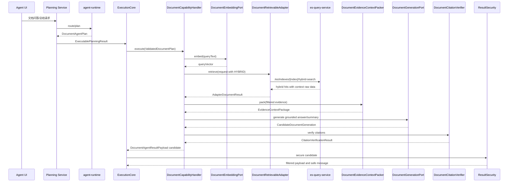

# Agent文档型生成式问答与总结能力 L2 实施详细设计 v1.0

## 1. 文档信息

| 项目 | 内容 |
|---|---|
| 文档名称 | Agent文档型生成式问答与总结能力 L2 实施详细设计 |
| 文档路径 | `docs/design/P2/Agent文档型生成式问答与总结能力_L2实施详细设计_v1.0.md` |
| 文档状态 | Approved |
| 当前版本 | v1.0 |
| 作者 |  |
| 创建日期 | 2026-07-06 |
| 最后更新日期 | 2026-07-06 |
| 适用范围 | 在既有 Agent 文档型检索首版基础上，补充向量/混合检索、证据上下文打包、执行后 LLM 生成和引用校验能力 |
| 上级文档 | `docs/design/Agent目标架构总览_v1.0.md`；`docs/design/Agent契约与规划架构设计_v1.0.md`；`docs/design/Agent能力执行内核架构设计_v1.0.md`；`docs/design/Agent元数据与上下文安全架构设计_v1.0.md` |
| 关联文档 | `docs/design/P2/Agent文档型检索与总结能力_L2实施详细设计_v1.0.md`；`docs/design/P2/Agent文档型检索与总结能力_设计文档品审报告.md`；`AGENTS.md` |
| 是否可作为实现依据 | 是；本文已通过正式设计文档品审，可作为编码实现依据。provider、ACL 和 ES mapping 确认项不阻断代码实施，但阻断联调、灰度和生产启用 |

## 2. 修改历史

| 序号 | 日期 | 位置 | 修改原因 | 修改内容 |
|---:|---|---|---|---|
| 1 | 2026-07-06 | 全文 | 新建生成式问答与总结 L2 详细设计 | 基于既有文档检索首版、代码现状和用户确认的六项决策，创建生成式问答与总结详细设计 |
| 2 | 2026-07-06 | 第 6、9、10、11、12 章 | 第 1 轮内部评审发现混合检索和 queryVector 来源需要落成可实现契约 | 明确 queryVector 由 Agent 侧 embedding port 生成，es-query 只消费向量；首版混合检索使用双路召回加 RRF，rerank 作为可选后续增强 |
| 3 | 2026-07-06 | 第 8、10、15、18 章 | 第 2 轮内部评审发现执行后 LLM 生成可能绕过结果安全边界 | 新增证据预安全过滤、上下文打包、生成服务、引用校验和 ResultSecurity 二次校验链路 |
| 4 | 2026-07-06 | 第 11、12、19、20 章 | 第 3 轮内部评审发现接口、数据结构和实现落点需要进一步具体化 | 补充 es-query、agent-api、agent-adapter-api、agent-service、agent-runtime、配置、测试和契约落点 |
| 5 | 2026-07-06 | 第 13、14、16、17、21、23 章 | 第 4 轮内部评审发现状态、幂等、性能、兼容和风险说明不完整 | 补充生成状态流转、事务一致性、性能容量、灰度回滚、剩余风险和实施对齐检查 |
| 6 | 2026-07-06 | 第 1、19、22、24 章 | 第 5 轮内部评审发现 Draft 状态与“实现依据”口径不一致，且部分 DTO/fallback 实现落点未列出 | 修正文档状态口径，补充 `AgentDocumentSpec`、`AgentDocumentCitation`、`DocumentSafeTextComposer` 和 `validateDocumentConfig` 落点 |
| 7 | 2026-07-06 | 第 1、3、11、19、22、24 章 | 正式设计文档品审发现状态、接口契约、实现落点和测试路径仍需收敛 | 补充 hybrid search 接口 header、权限、审计和幂等约束，补齐生成 DTO 落点，修正测试路径，同步文档状态为 `Approved` |

## 3. 文档状态说明

| 状态 | 含义 | 是否可作为开发依据 |
|---|---|---:|
| Draft | 草稿，内容尚未完成用户正式批准 | 否 |
| In Review | 评审中，内容可能继续调整 | 否 |
| Approved | 已评审通过，可作为实现依据 | 是 |
| Implementing | 已进入实现阶段 | 是 |
| Implemented | 已完成实现，并已与设计对齐 | 是 |
| Deprecated | 已废弃，不再作为实现依据 | 否 |

当前状态：Approved。

状态说明：本文已完成自动内部评审-修正循环和正式设计文档品审，未修改上级文档、关联文档、代码、测试或配置。当前结论为通过，可作为编码实现依据；第 21 章列出的 provider、ACL 和 ES mapping 确认项不阻断本地代码实施，但阻断联调、灰度和生产启用。

## 4. 背景与目标

既有 `Agent文档型检索与总结能力_L2实施详细设计_v1.0.md` 已完成文档型检索、问答和总结首版设计与编码基础，当前能力以关键词 ES 检索和抽取式 `answerText/summaryText` 为主。现状满足“返回原始证据、引用和抽取式文本”的首版目标，但不满足用户期望的生成式文档问答与总结。

本次详细设计目标如下：

1. 在 `es-query-service` 中补齐向量/混合检索首版能力，首版策略为关键词召回和向量召回双路检索后使用 RRF 融合。
2. 在 `agent-adapter-document` 中接入 vector/hybrid retrieval，保持文档检索服务只负责 evidence 检索，不负责 LLM 生成。
3. 在 `agent-service` 中新增证据上下文打包、执行后 LLM 生成、引用校验和安全降级链路。
4. 保持 `agent-runtime` 的 `route/plan` 规划职责不变，不复用现有 `/runtime/v1/route` 或 `/runtime/v1/plan` 承担执行后生成。
5. 保证 LLM 输入只包含已授权、已脱敏、已裁剪的证据上下文，生成文本必须通过引用校验和 ResultSecurity 二次过滤。
6. 所有生成式能力默认关闭，支持灰度启用和快速回滚到抽取式首版行为。

## 5. 设计范围

### 5.1 范围内

| 序号 | 范围 | 内容 |
|---:|---|---|
| 1 | 向量检索接入 | Agent 侧生成 queryVector，通过 adapter 调用 es-query vector/hybrid 检索 |
| 2 | 混合检索 | es-query 新增 hybrid search，首版使用 keyword topN + vector topN + RRF 融合 |
| 3 | 证据上下文打包 | Agent 侧对 evidence 进行预安全过滤、去重、排序、预算裁剪、上下文窗口拼装 |
| 4 | 执行后 LLM 生成 | Agent 侧新增文档生成端口，在 Handler 内完成 grounded answer/summary 候选生成 |
| 5 | 引用校验 | Agent 侧校验生成文本中的 citation id、证据覆盖和未引用句，失败时降级或拒答 |
| 6 | 契约扩展 | 扩展 `agent-api`、`agent-adapter-api`、`es-query-api` 中相关 DTO 和 OpenAPI |
| 7 | 安全与审计 | 明确 prompt 输入、生成输出、引用校验、日志、指标和审计摘要边界 |
| 8 | 测试设计 | 补充契约、adapter、service、es-query、runtime prompt、权限、安全、降级和回归测试 |

### 5.2 范围外

| 序号 | 范围外事项 | 原因 | 后续入口 |
|---:|---|---|---|
| 1 | 文档上传、清洗、切分、索引构建 | 属于文档语料接入与索引平台，不属于 Agent 执行链路 | 独立文档语料接入设计 |
| 2 | 文档级 ACL 权威源建设 | 当前 Agent 权限模型不持有 documentId 级 ACL 表达式 | 权限权威源或文档平台设计 |
| 3 | es-query 内部生成 queryVector | es-query 当前定位为通用 ES 查询服务，不持有 embedding provider 配置和模型治理 | 如确需纳入，需另行设计 es-query 语义检索能力 |
| 4 | 复用 runtime route/plan 做执行后生成 | 会改变 Runtime 只负责规划的边界 | 若要做，需先补 L1/ADR |
| 5 | rerank 模型首版接入 | rerank 是二阶段增强，不是首版生成式闭环的必要条件 | 后续可插拔 rerank 设计 |
| 6 | 长文档异步批量总结 | 需要 Task、ResultRef、Run 状态和异步调度 | Multi-Agent/Task 设计 |
| 7 | 生产开关启用 | 需要 provider、ACL、mapping、监控和回滚演练确认 | 灰度上线方案 |

## 6. 上级文档约束

| 约束类型 | 上级文档约束 | 本文遵循方式 |
|---|---|---|
| capability 与 planKind | `capabilityId` 是能力注册、授权、执行和审计主键，`planKind` 只表达结构类型 | 继续沿用 `document.search`、`document.answer`、`document.summarize`；不新增新的 planKind，仍使用 `DOCUMENT` |
| Runtime 边界 | Runtime 是不可信规划方，不决定权限，不执行业务，不调用 Handler/Adapter | `agent-runtime` 只继续生成 `DocumentAgentPlan`；执行后生成放在 `agent-service` |
| Java 契约源 | Java DTO 是 OpenAPI 和 Python generated model 的唯一来源 | 所有新增请求、结果和生成元数据字段先在 `agent-api` 定义，再生成 OpenAPI/Python |
| ExecutionCore | Core 不按 capabilityId/domain/planKind 写分支，不调用 Runtime，不持久化业务状态 | 新增 Handler 内部编排，不修改 `ExecutionCore` 算法 |
| ResultSecurity | 最终结果必须按当前有效范围过滤和 mask，自然语言 summary 不能绕过结构化权限 | 生成文本先作为候选，最终由 `DocumentResultSecurityProjector` 执行引用校验和安全投影 |
| Context | Context 只保存小型、类型化、版本化规划状态，不保存完整业务结果 | `DocumentCapabilityContextPayload` 只保留 query、domain、filters、citationIds 和生成摘要状态摘要，不保存正文或 prompt |
| Deadline | Route、Plan、Execution、Adapter 和下游共享 absolute deadline | embedding、hybrid retrieval、LLM generation、citation verification 均只使用剩余预算 |
| 日志与审计 | 不记录凭据、完整权限表达式、Context payload、Prompt、完整业务结果 | 只记录 invocationId、capabilityId、domain、证据数量、token 预算、hash/digest、状态和耗时 |

## 7. 关联文档与边界

| 关联文档 | 关联内容 | 本文档职责 | 对方职责 | 边界说明 |
|---|---|---|---|---|
| `docs/design/P2/Agent文档型检索与总结能力_L2实施详细设计_v1.0.md` | 文档能力首版检索、抽取式回答和总结 | 在首版基础上设计生成式增强 | 仍作为文档能力基础契约和抽取式 fallback 依据 | 本文不回写旧文档，不改变其已完成首版边界 |
| `docs/design/P2/Agent文档型检索与总结能力_设计文档品审报告.md` | 首版设计风险和评审结论 | 继承 R1/R2/R5 风险并给出生成式能力收敛策略 | 记录首版评审事实 | 本文不修改品审报告 |
| `AGENTS.md` | 工作原则、修改边界、测试和输出要求 | 遵守最小修改、权限、审计、契约一致性和验证要求 | 项目级协作约束 | 仓库根目录未发现 `AGENTS.md` 文件，本文使用用户在对话中提供的规则 |

## 8. 设计边界与约束

| 边界 | 设计约束 |
|---|---|
| 业务边界 | 仅覆盖公司政策、知识库、文学资料等文档类 corpus 的检索增强和生成式回答/总结 |
| 系统边界 | `es-query-service` 只做检索和融合；`agent-service` 做执行后生成、安全和引用校验；`agent-runtime` 继续只做规划 |
| 模块边界 | 不修改 query/aggregate 的 Plan、Validator、Handler 和 Adapter 行为 |
| 数据边界 | Agent 不持有文档全文、文档 ACL 权威表或索引构建状态 |
| 权限边界 | LLM 输入必须先经过下游 ACL、Agent domain/field 过滤、snippet 截断和上下文预算裁剪 |
| 状态边界 | 生成过程不新增持久化状态；结果仍由 Invocation finalization 统一提交 |
| 外部系统边界 | embedding provider 与 LLM provider 是可配置外部依赖；不可用时 fail closed 或回退抽取式 |
| 当前假设 | 下游文档索引已包含 `documentId/chunkId/content/snippet/embedding/aclRef/chunkIndex` 等字段 |
| 当前限制 | 首版不实现 rerank；不支持跨文档长任务分批总结；不保证生成文本与证据逐字一致，只保证 citation 可验证 |

## 9. 总体设计

### 9.1 模块职责

| 模块 | 职责 | 禁止 |
|---|---|---|
| `agent-runtime` | 继续根据 descriptor 和 schema 生成 `DocumentAgentPlan` | 调用 ES、读取证据、生成回答、校验引用 |
| `agent-service` | 生成 queryVector、执行文档能力 Handler、打包上下文、调用 LLM、校验引用、执行 ResultSecurity | 保存文档全文、绕过 ExecutionCore、绕过 ResultSecurity |
| `agent-adapter-document` | 将 `DocumentRetrievalRequest` 映射为 es-query keyword/vector/hybrid 请求，返回标准 evidence | 生成自然语言答案、决定最终权限 |
| `es-query-service` | 执行 keyword/vector/hybrid 检索，按请求过滤和 RRF 融合，返回 hits/context 原料 | 生成 queryVector、调用 LLM、持有 Agent 权限公式 |
| embedding provider | 将 queryText 转换为 queryVector | 直接访问 Agent Invocation 或权限上下文 |
| LLM provider | 基于 Agent 提供的已过滤证据生成候选回答/总结 JSON | 直接访问下游文档服务、获取未过滤证据 |

### 9.2 关键流程



### 9.3 首版核心决策

| 编号 | 决策 | 说明 |
|---|---|---|
| D1 | queryVector 由 `agent-service` 通过 `DocumentEmbeddingPort` 生成 | es-query 只消费 queryVector，不持有 embedding 模型和密钥 |
| D2 | 混合检索首版采用双路召回 + RRF | keyword topN 和 vector topN 分别召回，es-query 负责 RRF 融合、去重和 topK 截断 |
| D3 | rerank 作为后续可插拔增强 | 首版不强依赖 rerank；预留 `rerankEnabled/rerankScore` 字段 |
| D4 | 执行后 LLM 生成归属 `agent-service` | 不复用 runtime route/plan 规划接口 |
| D5 | LLM 输入只使用已授权、已脱敏、已裁剪证据 | Handler 内新增预安全过滤，ResultSecurity 末端二次过滤 |
| D6 | 引用校验失败默认降级 | 可配置为拒答；首版默认删除未引用句，严重不一致时回退抽取式回答 |

## 10. 详细功能设计

### 10.1 queryVector 生成

#### 10.1.1 功能说明

`agent-service` 在执行阶段根据 `DocumentRetrievalOptions.retrievalMode` 判断是否需要 queryVector。`VECTOR` 和 `HYBRID` 模式需要调用 `DocumentEmbeddingPort.embed(DocumentEmbeddingRequest request)` 生成向量。

#### 10.1.2 输入与输出

| 输入 | 字段 | 说明 |
|---|---|---|
| `DocumentRetrievalRequest` | `queryText` | 用户查询或总结目标 |
| `DocumentRetrievalRequest` | `domain` | 文档 corpus/domain |
| `DocumentHybridOptions` | `embeddingModel` | 可选模型标识，默认取配置 |
| `ExecutionContext` | `deadline` | 剩余时间预算 |

| 输出 | 字段 | 说明 |
|---|---|---|
| `DocumentEmbeddingResult` | `queryVector` | `List<Double>`，不得写日志 |
| `DocumentEmbeddingResult` | `embeddingModel` | 实际使用模型 |
| `DocumentEmbeddingResult` | `dimension` | 向量维度 |
| `DocumentEmbeddingResult` | `digest` | 向量摘要，用于审计，不可反推向量 |

#### 10.1.3 处理流程

1. `DocumentPlanValidator` 校验 retrieval mode、topK、hybrid 参数上限。
2. `DocumentCapabilityHandler` 判断 mode 是否为 `VECTOR` 或 `HYBRID`。
3. 若 `agent.document.embedding.enabled=false`，则 `VECTOR` fail closed，`HYBRID` 降级为 `KEYWORD` 并记录 `retrievalDiagnostics.degraded=true`。
4. 通过 `DocumentEmbeddingPort` 调用外部 embedding provider。
5. 验证向量非空、维度等于配置 `agent.document.embedding.dimension`。
6. 将 queryVector 放入 adapter 请求，不写 Context，不写日志，不返回前端。

#### 10.1.4 异常处理

| 异常 | 处理 |
|---|---|
| provider 超时 | `VECTOR` 返回安全失败；`HYBRID` 按配置回退关键词或失败 |
| 维度不匹配 | fail closed，不调用 es-query |
| queryText 超长 | 由 Validator 按 `max-query-text-length` 拒绝 |
| provider 返回空向量 | fail closed 或关键词降级，取决于 retrieval mode |

### 10.2 混合检索

#### 10.2.1 功能说明

`es-query-service` 新增 hybrid search，负责在同一个 index 内执行关键词召回和向量召回，并使用 RRF 融合为统一排序。首版不使用 rerank。

#### 10.2.2 输入与输出

| 输入字段 | 类型 | 说明 |
|---|---|---|
| `queryText` | `String` | 关键词召回文本 |
| `queryVector` | `List<Double>` | 向量召回输入 |
| `keywordDsl` | `Map<String,Object>` | Agent adapter 生成的 keyword bool query |
| `embeddingField` | `String` | 默认 `embedding` |
| `keywordK` | `Integer` | 关键词召回候选数 |
| `vectorK` | `Integer` | 向量召回候选数 |
| `topK` | `Integer` | 融合后返回数 |
| `rrfK` | `Integer` | RRF 平滑常量，默认 60 |
| `filters` | `Map<String,Object>` | domain metadata 允许的过滤条件 |
| `contextWindow` | `HybridContextWindow` | chunk 前后窗口配置 |

| 输出字段 | 类型 | 说明 |
|---|---|---|
| `hits` | `List<HybridSearchHit>` | 已融合、去重、截断的 evidence |
| `retrievalDiagnostics` | `HybridRetrievalDiagnostics` | keyword/vector 命中数、融合策略、是否降级 |
| `partial` | `boolean` | 任一路召回失败但按配置降级时为 true |

#### 10.2.3 RRF 规则

RRF 分数计算：

```text
rrfScore = 1 / (rrfK + keywordRank) + 1 / (rrfK + vectorRank)
```

规则：

1. 同一 `chunkId` 同时出现在 keyword 和 vector 结果中，只保留一条，合并 `retrievalChannels`。
2. 只在 keyword 中出现时，`vectorRank=null`；只在 vector 中出现时，`keywordRank=null`。
3. 排序优先级：`rrfScore desc`、`maxSourceScore desc`、`documentId asc`、`chunkIndex asc`。
4. `scoreNormalize` 字段仅作为后续扩展，不作为首版默认融合策略。
5. `rerankScore` 字段预留，首版为空。

#### 10.2.4 边界条件

| 场景 | 处理 |
|---|---|
| `HYBRID` 缺 queryVector | 返回 400；Agent 侧应提前拦截 |
| keyword 召回为空 | 使用 vector 结果返回，`retrievalDiagnostics.keywordHitCount=0` |
| vector 召回为空 | 使用 keyword 结果返回，`retrievalDiagnostics.vectorHitCount=0` |
| 两路均为空 | 返回空 hits，Agent 侧生成“未找到可引用证据” |
| ES KNN 不可用 | 返回结构化错误，不拼接下游错误正文 |

### 10.3 证据上下文打包

#### 10.3.1 功能说明

`DocumentEvidenceContextPacker` 将 adapter 返回的 evidence 转换为 LLM 可消费的 `EvidenceContextPackage`。该步骤在 Handler 内执行，必须发生在 LLM 调用之前。

#### 10.3.2 打包规则

| 规则 | 说明 |
|---|---|
| 预安全过滤 | 调用 `DocumentEvidencePreSecurityFilter` 删除无权 domain、空 citationId、空 snippet/content、超限片段 |
| 去重 | 按 `citationId` 去重，保留 RRF 分数更高或原始 rank 更靠前的 evidence |
| 排序 | 默认 `rrfScore desc`，同文档内保留 `chunkIndex asc` 的邻接顺序 |
| 预算 | 总字符数不超过 `agent.document.generation.max-context-chars` |
| 单片段限制 | 单 evidence 不超过 `agent.document.generation.max-evidence-chars` |
| 上下文窗口 | 只允许使用下游返回的 `contextBefore/contextAfter`，不由 Agent 再查全文 |
| 引用标识 | 打包文本必须使用稳定 `citationId`，格式为 `[citationId]` |
| prompt 注入防护 | evidence 文本作为 JSON 数据传入，不拼接为系统指令 |

#### 10.3.3 输出结构

| 字段 | 类型 | 说明 |
|---|---|---|
| `requestId` | `String` | invocation/request 关联标识 |
| `operation` | `DocumentPlanOperation` | `ANSWER` 或 `SUMMARIZE` |
| `queryText` | `String` | 已裁剪后的查询文本 |
| `evidenceItems` | `List<DocumentEvidenceContextItem>` | LLM 输入证据 |
| `citationIds` | `Set<String>` | 允许引用集合 |
| `budget` | `DocumentContextBudget` | 字符数、token 估算、裁剪标记 |
| `digest` | `String` | 上下文摘要 hash，用于审计 |

### 10.4 执行后 LLM 生成

#### 10.4.1 功能说明

`DocumentGenerativeAnswerService` 在 `document.answer` 和 `document.summarize` 中调用 `DocumentGenerationPort`，基于 `EvidenceContextPackage` 生成候选回答或摘要。

#### 10.4.2 生成规则

1. `agent.document.generation.enabled=false` 时不调用 LLM，回退到既有 `DocumentSafeTextComposer` 抽取式行为。
2. LLM 必须返回结构化 JSON，不接收自由格式最终文本。
3. 输出必须包含 `answerText` 或 `summaryText`、`summaryBullets`、`citationBindings`、`unsupportedClaims`。
4. LLM 不允许使用证据外知识；prompt 明确要求无法从证据得出时回答“未找到可引用证据”。
5. LLM provider 原始响应不写日志、不写 Context、不暴露给前端。
6. LLM 失败、超时、返回非 JSON、引用非法时，按配置降级为抽取式或安全拒答。

#### 10.4.3 生成输入信任边界

LLM 输入只允许包含：

| 允许输入 | 说明 |
|---|---|
| `operation` | `ANSWER` 或 `SUMMARIZE` |
| `queryText` | 用户问题，按长度裁剪 |
| `evidenceItems[].citationId` | 稳定引用标识 |
| `evidenceItems[].title/section/page/sourceUri` | 已授权元数据 |
| `evidenceItems[].snippet/context` | 已裁剪证据文本 |
| `budget` | 预算信息 |

LLM 输入禁止包含：

| 禁止输入 | 原因 |
|---|---|
| 用户 JWT、服务凭据、runtime shared key | 凭据泄露风险 |
| 完整权限表达式、mask 规则、ACL 表达式 | 权限边界泄露风险 |
| 未授权 evidence、全文、原始 ES DSL、queryVector | 数据泄露和提示注入风险 |
| Context 明文 payload、Invocation 内部错误栈 | 内部状态泄露风险 |

### 10.5 引用校验

#### 10.5.1 功能说明

`DocumentCitationVerifier` 对候选生成结果执行 deterministic 校验，确保最终自然语言输出不包含无证据或越权引用。

#### 10.5.2 校验规则

| 规则 | 说明 |
|---|---|
| 引用存在性 | 每个引用 id 必须存在于 `EvidenceContextPackage.citationIds` |
| 引用可见性 | 被引用 evidence 必须仍在 ResultSecurity 过滤后结果中 |
| 事实句覆盖 | `answerText` 每个事实句至少包含一个合法 citation |
| 摘要 bullet 覆盖 | 每条 `summaryBullets` 至少包含一个合法 citation |
| 禁止裸结论 | 不允许“根据政策规定”等无 citation 的事实性总结 |
| unsupported claims | LLM 返回的 `unsupportedClaims` 不进入最终输出 |
| 空证据 | 不调用 LLM 或不接受 LLM 输出，返回安全空证据提示 |

#### 10.5.3 校验失败处理

| 失败类型 | 默认处理 | 可配置处理 |
|---|---|---|
| 引用 id 不存在 | 删除对应句子或 bullet | 拒答 |
| 全部句子无合法引用 | 回退抽取式 `DocumentSafeTextComposer` | 拒答 |
| LLM 输出非 JSON | 回退抽取式 | 拒答 |
| evidence 过滤后为空 | 返回“未找到可引用证据” | 同默认 |
| 引用过多或重复 | 去重并保留首个合法引用 | 同默认 |

### 10.6 ResultSecurity 二次投影

`DocumentResultSecurityProjector` 必须保留最终控制权：

1. 过滤 `hits`、`citations` 和 evidence metadata。
2. 对生成文本再次执行引用存在性校验。
3. 删除过滤后 citation 不存在的句子或 bullet。
4. 截断 `answerText/summaryText/summaryBullets`。
5. 生成 `safeMessage` 和 `safeSummary`。
6. 生成失败时回退抽取式安全文本，不使用未校验候选文本。

## 11. 接口设计

### 11.1 es-query hybrid search 接口

| 接口 | 方法 | 路径 | 说明 |
|---|---|---|---|
| Hybrid Search | POST | `/es/indexes/{index}/hybrid-search` | 在指定 ES index 内执行 keyword + vector 双路召回和 RRF 融合 |
| Vector Search | POST | `/es/indexes/{index}/vector-search` | 保留现有纯 KNN 检索接口 |
| Keyword Search | POST | `/es/indexes/{index}/search` | 保留现有原始 ES DSL 查询接口 |

接口约束：

| 项目 | 设计要求 |
|---|---|
| 请求头 | `Content-Type: application/json`；如部署环境启用服务间认证，应使用现有网关或服务间凭据，不透传用户 JWT、Cookie 或完整权限表达式 |
| 权限输入 | `keywordDsl` 和 `filters` 必须由 `agent-adapter-document` 基于当前授权、domain metadata 和下游 ACL 约束构造；`es-query-service` 不解释 Agent 权限公式 |
| 幂等性 | `POST /hybrid-search` 为只读检索接口，不写业务状态；相同 index、DSL、queryVector、filters 和参数下应返回确定性排序，允许受 ES 索引刷新影响 |
| 审计 | 只记录 requestId、index、topK、keywordK、vectorK、rrfK、hitCount、partial、耗时和 queryVector digest，不记录 queryVector 原值、原始 ES DSL、全文 evidence 或用户凭据 |
| 错误响应 | 下游错误必须映射为安全错误码和诊断 id，不把 ES 原始异常 body 返回给 Agent、Runtime 或 UI |

`HybridSearchRequest`：

| 字段 | 类型 | 必填 | 说明 |
|---|---|---:|---|
| `queryText` | `String` | 是 | 关键词文本 |
| `keywordDsl` | `Map<String,Object>` | 是 | Agent adapter 生成的关键词 DSL |
| `queryVector` | `List<Double>` | 是 | 查询向量 |
| `embeddingField` | `String` | 否 | 默认 `embedding` |
| `keywordK` | `Integer` | 否 | 默认 20 |
| `vectorK` | `Integer` | 否 | 默认 20 |
| `topK` | `Integer` | 否 | 默认 8 |
| `numCandidates` | `Integer` | 否 | 默认 100 |
| `rrfK` | `Integer` | 否 | 默认 60 |
| `sourceExcludes` | `List<String>` | 否 | 默认排除 embedding 字段 |
| `contextWindow` | `HybridContextWindow` | 否 | 上下文窗口配置 |
| `trackTotalHits` | `Integer` | 否 | 总数统计阈值 |

`HybridSearchResponse`：

| 字段 | 类型 | 说明 |
|---|---|---|
| `hits` | `List<HybridSearchHit>` | 融合后结果 |
| `diagnostics` | `HybridRetrievalDiagnostics` | 召回、融合、降级诊断 |
| `partial` | `boolean` | 是否部分成功 |

错误处理：

| HTTP 状态 | 场景 | Agent 处理 |
|---|---|---|
| 400 | 请求字段缺失、向量为空、k 超限 | Adapter 抛出 `AgentAdapterException`，不降级 |
| 408/504 | ES 超时 | `HYBRID` 可按配置回退 keyword；`VECTOR` fail closed |
| 500 | ES 内部错误 | fail closed，不泄露下游 body |

### 11.2 agent-adapter-api 契约

新增或修改 DTO：

| 类型 | 字段或方法 | 说明 |
|---|---|---|
| `DocumentRetrievalRequest` | `retrievalMode` | `KEYWORD/VECTOR/HYBRID` |
| `DocumentRetrievalRequest` | `queryVector` | Agent 侧生成后传入 adapter |
| `DocumentRetrievalRequest` | `hybridOptions` | RRF、keywordK、vectorK、numCandidates 等 |
| `DocumentRetrievalRequest` | `contextOptions` | before/after chunk、maxContextChars |
| `AdapterDocumentEvidence` | `content` | 可选完整 chunk 文本，进入 LLM 前必须裁剪 |
| `AdapterDocumentEvidence` | `contextBefore/contextAfter` | 下游返回的邻接上下文 |
| `AdapterDocumentEvidence` | `chunkIndex/charStart/charEnd` | 上下文排序与引用定位 |
| `AdapterDocumentEvidence` | `keywordRank/vectorRank/rrfScore/retrievalChannels` | 混合检索诊断 |
| `AdapterDocumentResult` | `retrievalDiagnostics` | 检索模式、召回数、降级原因 |

### 11.3 agent-api 契约

新增或修改 DTO：

| 类型 | 字段 | 说明 |
|---|---|---|
| `DocumentRetrievalOptions` | `retrievalMode` | `KEYWORD/VECTOR/HYBRID`，默认 `KEYWORD` |
| `DocumentRetrievalOptions` | `keywordK/vectorK/rrfK/numCandidates` | 混合检索参数 |
| `AgentDocumentSpec` | `generationOptions` | 是否请求生成式回答、最大输出长度、失败策略 |
| `AgentDocumentResult` | `generationStatus` | `DISABLED/SKIPPED/SUCCEEDED/FALLBACK/FAILED` |
| `AgentDocumentResult` | `groundingStatus` | `VERIFIED/PARTIAL/UNVERIFIED/NO_EVIDENCE` |
| `AgentDocumentResult` | `citationVerification` | 引用校验摘要 |
| `AgentDocumentCitation` | `chunkIndex/charStart/charEnd` | 引用定位字段 |

兼容规则：

1. 保留既有 `answerText/summaryText/summaryBullets/hits/citations/partial/coverage` 字段。
2. 新增字段均为 nullable 或有默认值，不破坏既有 UI 和测试。
3. Python generated model 必须从 OpenAPI 重新生成，不手工修改。

### 11.4 agent-service LLM 生成端口

`DocumentGenerationPort` 是 `agent-service` 内部端口，不是外部 API。

| 方法 | 入参类型 | 返回类型 | 说明 |
|---|---|---|---|
| `generate` | `DocumentGenerationRequest request` | `DocumentGenerationResult` | 基于 evidence context 生成候选回答或摘要 |

`DocumentGenerationRequest` 关键字段：

| 字段 | 类型 | 说明 |
|---|---|---|
| `operation` | `DocumentPlanOperation` | `ANSWER/SUMMARIZE` |
| `queryText` | `String` | 查询或总结目标 |
| `contextPackage` | `EvidenceContextPackage` | 已授权、已裁剪证据 |
| `maxOutputChars` | `int` | 输出长度上限 |
| `deadline` | `Instant` | 剩余 deadline |

## 12. 数据设计

### 12.1 es-query 数据结构

| 对象 | 字段 | 类型 | 必填 | 说明 |
|---|---|---|---:|---|
| `HybridSearchHit` | `documentId` | `String` | 是 | 文档标识 |
| `HybridSearchHit` | `chunkId` | `String` | 是 | chunk/citation 标识 |
| `HybridSearchHit` | `chunkIndex` | `Integer` | 否 | 文档内顺序 |
| `HybridSearchHit` | `title` | `String` | 否 | 标题 |
| `HybridSearchHit` | `section` | `String` | 否 | 章节 |
| `HybridSearchHit` | `page` | `Integer` | 否 | 页码 |
| `HybridSearchHit` | `sourceUri` | `String` | 否 | 来源链接 |
| `HybridSearchHit` | `snippet` | `String` | 否 | 展示片段 |
| `HybridSearchHit` | `content` | `String` | 否 | chunk 内容，Agent 侧会二次裁剪 |
| `HybridSearchHit` | `contextBefore/contextAfter` | `List<String>` | 否 | 邻接上下文 |
| `HybridSearchHit` | `keywordRank/vectorRank` | `Integer` | 否 | 双路排名 |
| `HybridSearchHit` | `rrfScore` | `BigDecimal` | 否 | RRF 分数 |
| `HybridSearchHit` | `retrievalChannels` | `List<String>` | 否 | `KEYWORD/VECTOR` |

### 12.2 Agent 生成结构

| 对象 | 字段 | 类型 | 必填 | 说明 |
|---|---|---|---:|---|
| `EvidenceContextPackage` | `evidenceItems` | `List<DocumentEvidenceContextItem>` | 是 | LLM 输入证据 |
| `EvidenceContextPackage` | `citationIds` | `Set<String>` | 是 | 合法引用集合 |
| `EvidenceContextPackage` | `digest` | `String` | 是 | 审计摘要 |
| `DocumentEvidenceContextItem` | `citationId` | `String` | 是 | 引用 id |
| `DocumentEvidenceContextItem` | `text` | `String` | 是 | 已裁剪证据文本 |
| `DocumentEvidenceContextItem` | `metadata` | `Map<String,Object>` | 否 | 已授权元数据 |
| `DocumentGenerationResult` | `answerText` | `String` | 否 | 候选答案 |
| `DocumentGenerationResult` | `summaryText` | `String` | 否 | 候选摘要 |
| `DocumentGenerationResult` | `summaryBullets` | `List<String>` | 否 | 候选要点 |
| `DocumentGenerationResult` | `citationBindings` | `List<CitationBinding>` | 是 | 句子或 bullet 到 citation 的绑定 |
| `CitationVerificationResult` | `status` | `GroundingStatus` | 是 | 校验状态 |
| `CitationVerificationResult` | `removedClaimCount` | `int` | 是 | 删除无引用句数量 |

### 12.3 数据生命周期

| 数据 | 是否持久化 | 生命周期 |
|---|---:|---|
| `queryVector` | 否 | 单次 Handler 调用内存中使用 |
| `EvidenceContextPackage` | 否 | 单次 LLM 调用内存中使用 |
| LLM 原始响应 | 否 | 解析后立即丢弃 |
| `DocumentAgentResultPayload` | 是 | 作为既有 Invocation 结果经 ResultSecurity 过滤后持久化 |
| `DocumentCapabilityContextPayload` | 是 | 只保存 citationIds、queryText 摘要、domain 和 topK 等最小规划上下文 |
| 审计 digest | 是或日志 | 可保存到安全日志或 invocation metadata，不能反推正文 |

### 12.4 SQL 和迁移

首版不新增数据库表，不新增 migration 文件，不修改 `db/agent-p0.sql`。若后续需要持久化 generation trace、prompt digest 明细或 provider attempt 表，必须另起详细设计并补充 SQL migration。

## 13. 状态流转设计

### 13.1 生成状态

| 状态 | 进入条件 | 终态 | 说明 |
|---|---|---:|---|
| `DISABLED` | `agent.document.generation.enabled=false` | 是 | 不调用 LLM，使用抽取式文本 |
| `SKIPPED` | `SEARCH` 操作或 evidence 为空 | 是 | 不调用 LLM |
| `EMBEDDING_FAILED` | embedding 失败且不能降级 | 是 | 返回安全失败或抽取式降级 |
| `RETRIEVAL_PARTIAL` | keyword/vector 一路失败但可降级 | 否 | 继续 context pack |
| `PACKED` | evidence 已打包 | 否 | 可进入 LLM 生成 |
| `GENERATING` | 调用 LLM provider | 否 | 受 deadline 和 timeout 约束 |
| `SUCCEEDED` | LLM 输出合法且引用校验通过 | 是 | 可进入 ResultSecurity |
| `FALLBACK` | LLM 或引用校验失败但允许降级 | 是 | 使用抽取式安全文本 |
| `FAILED` | LLM 或引用校验失败且配置为拒答 | 是 | 返回安全失败或无证据提示 |

### 13.2 非法状态流转

| 非法流转 | 处理 |
|---|---|
| evidence 未预过滤直接进入 LLM | 单元测试和代码评审阻断 |
| LLM 原始文本直接进入最终响应 | ResultSecurity 和 contract test 阻断 |
| citation 校验失败仍标记 `VERIFIED` | 单元测试阻断 |
| deadline 已到期后继续调用 embedding/LLM | Handler 检查并 fail closed |
| finalization 失败后重执行 LLM | 禁止，遵循 Execution Lifecycle 既有恢复规则 |

## 14. 幂等、事务与一致性设计

| 主题 | 设计 |
|---|---|
| 幂等性 | 本次新增链路无外部写副作用；同一 invocation 不允许并发执行多个 Handler；LLM 输出可能非完全确定，因此不得在 finalization 失败后重执行补写 |
| 幂等键 | 不新增业务幂等键；使用现有 invocationId 作为审计关联标识 |
| 事务边界 | 不扩大 Agent 本地事务；结果和 Context 仍由 Invocation finalization 统一提交 |
| 跨服务一致性 | es-query、embedding、LLM 均为只读调用，无分布式事务；失败时不产生 Context |
| retry | 不允许不可见自动重试；如 provider SDK 有默认 retry，必须关闭或显式计入 providerAttempts |
| commit unknown | 遵循既有 Lifecycle 规则重读权威状态，不重执行 embedding、retrieval 或 generation |
| 降级一致性 | 降级结果必须标记 `generationStatus=FALLBACK`、`groundingStatus=PARTIAL` 或 `NO_EVIDENCE` |

## 15. 权限、风控与审计设计

### 15.1 权限规则

| 权限层 | 规则 |
|---|---|
| capability 权限 | `document.answer`、`document.summarize` 必须在 Planning 和 Execution 当前复检中均允许 |
| domain 权限 | 文档 corpus/domain 必须在 Effective Scope 中可见 |
| field 权限 | title、section、sourceUri、snippet、content 等展示字段必须经 Agent 侧白名单过滤 |
| documentId ACL | 下游文档检索服务必须在当前用户身份或 ACL token 下过滤，Agent 不持有 ACL 表达式 |
| LLM 输入权限 | 只能使用通过 ACL 和 Agent 过滤后的 evidence |
| ResultSecurity | 最终文本必须基于过滤后 citations 二次校验 |

### 15.2 风控规则

| 风险 | 控制 |
|---|---|
| prompt injection | evidence 以结构化 JSON 数据传入，不作为系统指令 |
| 越权生成 | LLM 输入前过滤，输出后引用校验和 ResultSecurity 二次过滤 |
| 证据不足 | 返回无证据提示，不使用外部知识补全 |
| provider 泄露 | 不向 provider 发送权限表达式、queryVector、JWT、内部错误 |
| 成本失控 | 配置 max evidence、max context chars、max output chars、timeout、QPS 限制 |
| 误导性答案 | 生成结果标记 groundingStatus，引用失败降级 |

### 15.3 审计内容

允许记录：

| 字段 | 说明 |
|---|---|
| `invocationId` | 调用关联 |
| `capabilityId/domain/operation` | 能力和 corpus |
| `retrievalMode` | `KEYWORD/VECTOR/HYBRID` |
| `keywordHitCount/vectorHitCount/finalEvidenceCount` | 计数 |
| `contextDigest` | 上下文摘要 hash |
| `generationStatus/groundingStatus` | 生成和校验状态 |
| `durationMs/providerAttempts/fallbackReason` | 性能和降级 |

禁止记录：

| 字段 | 原因 |
|---|---|
| queryVector 原值 | 可泄露语义信息 |
| evidence 全文、prompt、LLM 原始响应 | 数据泄露 |
| ACL 表达式、权限表达式、mask 规则 | 权限泄露 |
| provider key、runtime shared key、JWT | 凭据泄露 |

## 16. 性能与容量设计

| 项目 | 首版目标 |
|---|---|
| 默认 evidence 数 | `agent.document.max-evidence-count=8` |
| keywordK/vectorK | 默认 20/20，上限 100/100 |
| context 字符预算 | 默认 12000，上限 30000 |
| 单 evidence 字符预算 | 默认 1500，上限 4000 |
| 生成输出字符预算 | 默认 2000，上限 6000 |
| embedding 超时 | 默认 2s |
| es-query 超时 | 复用 Feign `es-query-service` read-timeout，建议 10s 内 |
| LLM 生成超时 | 默认 20s，不得超过 invocation 剩余 deadline |
| 降级策略 | embedding/vector 失败可降级 keyword；LLM 失败降级抽取式 |
| 限流 | 首版依赖 provider 侧限流；Agent 记录 provider failure count |

性能约束：

1. Handler 在每个外部调用前检查 remaining deadline。
2. `HYBRID` 模式中 keyword 和 vector 两路检索可以由 es-query 内部串行或并行实现，首版优先串行确定性，后续可优化并行。
3. context packer 不做全文回查，只使用 adapter 返回内容，避免 N+1。
4. LLM 生成默认 temperature=0，减少结果波动。

## 17. 兼容性与扩展性设计

| 维度 | 设计 |
|---|---|
| 既有 query/aggregate | 不修改既有 Plan、Handler、Adapter 和 ResultSecurity |
| 既有 document 首版 | 保留 `KEYWORD` 和抽取式 fallback；生成式字段新增且可空 |
| OpenAPI/Python | 通过 Java 生成，新增字段保持向后兼容 |
| 配置兼容 | `agent.document.generation.enabled=false`、`agent.document.embedding.enabled=false` 默认关闭 |
| 灰度 | 可按环境、profile、capability、domain 配置启用 |
| 回滚 | 关闭 generation 和 hybrid 配置即可回退关键词抽取式 |
| rerank 扩展 | 预留 `DocumentRerankPort`、`rerankScore` 和 `rerankEnabled`，首版不实现 |
| 多 provider | `DocumentEmbeddingPort` 和 `DocumentGenerationPort` 抽象支持替换 provider |

## 18. 日志、监控与告警

### 18.1 日志

| 日志点 | 内容 |
|---|---|
| retrieval start/end | invocationId、domain、retrievalMode、topK、耗时 |
| embedding result | dimension、digest、耗时、状态，不记录向量 |
| hybrid diagnostics | keywordHitCount、vectorHitCount、finalHitCount、partial |
| context packing | evidenceCount、contextChars、truncated、digest |
| generation result | generationStatus、groundingStatus、removedClaimCount、耗时 |
| fallback | fallbackReason、operation、domain |

### 18.2 指标

| 指标 | 标签 |
|---|---|
| `agent_document_retrieval_total` | capabilityId、domain、mode、status |
| `agent_document_generation_total` | operation、status、fallbackReason |
| `agent_document_grounding_total` | status、domain |
| `agent_document_context_chars` | domain、operation |
| `agent_document_provider_latency_ms` | providerType、status |

指标标签禁止使用 userId、queryText、documentId、chunkId、citationId、权限表达式和高基数 sourceUri。

### 18.3 告警

| 告警条件 | 处理 |
|---|---|
| LLM generation failure rate 连续 5 分钟超过 20% | 自动建议关闭 generation 开关 |
| grounding failure rate 连续 5 分钟超过 10% | 检查 prompt、证据质量和 citation parser |
| hybrid vector failure rate 连续 5 分钟超过 20% | 降级 keyword，检查 embedding/ES KNN |
| provider latency p95 超过配置 2 倍 | 收紧 max context 或关闭生成 |

## 19. 实现落点清单

### 19.1 Java 实现落点

| 序号 | 类型 | 路径 | 类名 | 方法名 | 入参类型 | 返回类型 | 新增/修改 | 说明 |
|---:|---|---|---|---|---|---|---|---|
| 1 | DTO | `es-query-api/src/main/java/com/dylan/esquery/api/model/HybridSearchRequest.java` | `com.dylan.esquery.api.model.HybridSearchRequest` | getter/setter | 字段见第 11.1 节 | DTO | 新增 | hybrid search 请求 |
| 2 | DTO | `es-query-api/src/main/java/com/dylan/esquery/api/model/HybridSearchResponse.java` | `com.dylan.esquery.api.model.HybridSearchResponse` | getter/setter | `hits/diagnostics/partial` | DTO | 新增 | hybrid search 响应 |
| 3 | DTO | `es-query-api/src/main/java/com/dylan/esquery/api/model/HybridSearchHit.java` | `com.dylan.esquery.api.model.HybridSearchHit` | getter/setter | 字段见第 12.1 节 | DTO | 新增 | 融合命中 |
| 4 | Controller | `es-query-service/src/main/java/com/dylan/esquery/controller/EsQueryController.java` | `com.dylan.esquery.controller.EsQueryController` | `hybridSearch` | `String index, HybridSearchRequest request` | `ResponseEntity<HybridSearchResponse>` | 修改 | 新增 `/hybrid-search` |
| 5 | Service | `es-query-service/src/main/java/com/dylan/esquery/service/EsDocumentService.java` | `com.dylan.esquery.service.EsDocumentService` | `hybridSearch` | `String index, HybridSearchRequest request` | `HybridSearchResponse` | 修改 | 双路召回和 RRF 融合 |
| 6 | Service | `es-query-service/src/main/java/com/dylan/esquery/service/HybridSearchMerger.java` | `com.dylan.esquery.service.HybridSearchMerger` | `merge` | `List<JsonNode> keywordHits, List<JsonNode> vectorHits, HybridSearchRequest request` | `List<HybridSearchHit>` | 新增 | RRF、去重、排序 |
| 7 | Enum | `agent-api/src/main/java/com/dylan/agent/api/plan/DocumentRetrievalMode.java` | `com.dylan.agent.api.plan.DocumentRetrievalMode` | enum | `KEYWORD/VECTOR/HYBRID` | enum | 新增 | 检索模式 |
| 8 | DTO | `agent-api/src/main/java/com/dylan/agent/api/plan/DocumentRetrievalOptions.java` | `com.dylan.agent.api.plan.DocumentRetrievalOptions` | getter/setter | `retrievalMode/keywordK/vectorK/rrfK/numCandidates` | DTO | 修改 | 扩展 hybrid 参数 |
| 9 | DTO | `agent-api/src/main/java/com/dylan/agent/api/plan/DocumentGenerationOptions.java` | `com.dylan.agent.api.plan.DocumentGenerationOptions` | getter/setter | `enabled/maxOutputChars/failurePolicy` | DTO | 新增 | 生成选项 |
| 10 | DTO | `agent-api/src/main/java/com/dylan/agent/api/plan/AgentDocumentSpec.java` | `com.dylan.agent.api.plan.AgentDocumentSpec` | `getGenerationOptions`、`setGenerationOptions` | `DocumentGenerationOptions generationOptions` | `DocumentGenerationOptions` / `void` | 修改 | 在 Document plan 中承载生成配置 |
| 11 | DTO | `agent-api/src/main/java/com/dylan/agent/api/response/AgentDocumentResult.java` | `com.dylan.agent.api.response.AgentDocumentResult` | getter/setter | `generationStatus/groundingStatus/citationVerification` | DTO | 修改 | 生成和校验状态 |
| 12 | DTO | `agent-api/src/main/java/com/dylan/agent/api/response/AgentDocumentCitation.java` | `com.dylan.agent.api.response.AgentDocumentCitation` | getter/setter | `chunkIndex/charStart/charEnd` | DTO | 修改 | 引用定位 |
| 13 | DTO | `agent-adapter-api/src/main/java/com/dylan/agent/adapter/api/document/DocumentRetrievalRequest.java` | `com.dylan.agent.adapter.api.document.DocumentRetrievalRequest` | constructor/getter | `retrievalMode/queryVector/hybridOptions/contextOptions` | DTO | 修改 | Adapter 请求扩展 |
| 14 | DTO | `agent-adapter-api/src/main/java/com/dylan/agent/adapter/api/document/AdapterDocumentEvidence.java` | `com.dylan.agent.adapter.api.document.AdapterDocumentEvidence` | getter/setter | `content/contextBefore/contextAfter/chunkIndex/rrfScore` | DTO | 修改 | 证据上下文字段 |
| 15 | Client | `agent-adapter-document/src/main/java/com/dylan/agent/adapter/document/DocumentSearchClient.java` | `com.dylan.agent.adapter.document.DocumentSearchClient` | `hybridSearch` | `String index, HybridSearchRequest request` | `HybridSearchResponse` | 修改 | 调用 es-query hybrid |
| 16 | Mapper | `agent-adapter-document/src/main/java/com/dylan/agent/adapter/document/DocumentRetrievalMapper.java` | `com.dylan.agent.adapter.document.DocumentRetrievalMapper` | `toHybridRequest` | `DocumentRetrievalRequest request` | `HybridSearchRequest` | 修改 | 生成 hybrid 请求 |
| 17 | Mapper | `agent-adapter-document/src/main/java/com/dylan/agent/adapter/document/DocumentEvidenceMapper.java` | `com.dylan.agent.adapter.document.DocumentEvidenceMapper` | `toAdapterResult` | `HybridSearchResponse response, int requestedCount` | `AdapterDocumentResult` | 修改 | 映射 hybrid 响应 |
| 18 | Validator | `agent-service/src/main/java/com/dylan/agent/capability/document/DocumentPlanValidator.java` | `com.dylan.agent.capability.document.DocumentPlanValidator` | `validate` | `DocumentAgentPlan rawPlan, ExecutionValidationContext context` | `ValidatedDocumentPlan` | 修改 | 校验 retrieval/generation options |
| 19 | Service | `agent-service/src/main/java/com/dylan/agent/capability/document/DocumentCapabilityHandler.java` | `com.dylan.agent.capability.document.DocumentCapabilityHandler` | `execute` | `ValidatedDocumentPlan plan, ExecutionContext context` | `HandlerResult<DocumentAgentResultPayload>` | 修改 | 编排 embedding、检索、打包、生成、校验 |
| 20 | Port | `agent-service/src/main/java/com/dylan/agent/capability/document/embedding/DocumentEmbeddingPort.java` | `com.dylan.agent.capability.document.embedding.DocumentEmbeddingPort` | `embed` | `DocumentEmbeddingRequest request` | `DocumentEmbeddingResult` | 新增 | queryVector 生成端口 |
| 21 | Client | `agent-service/src/main/java/com/dylan/agent/capability/document/embedding/HttpDocumentEmbeddingClient.java` | `com.dylan.agent.capability.document.embedding.HttpDocumentEmbeddingClient` | `embed` | `DocumentEmbeddingRequest request` | `DocumentEmbeddingResult` | 新增 | HTTP embedding provider |
| 22 | Service | `agent-service/src/main/java/com/dylan/agent/capability/document/generation/DocumentEvidencePreSecurityFilter.java` | `com.dylan.agent.capability.document.generation.DocumentEvidencePreSecurityFilter` | `filter` | `List<AdapterDocumentEvidence> evidence, ExecutionScope scope, String domain` | `List<AdapterDocumentEvidence>` | 新增 | LLM 输入前安全过滤 |
| 23 | Service | `agent-service/src/main/java/com/dylan/agent/capability/document/generation/DocumentEvidenceContextPacker.java` | `com.dylan.agent.capability.document.generation.DocumentEvidenceContextPacker` | `pack` | `DocumentContextPackRequest request` | `EvidenceContextPackage` | 新增 | 上下文打包 |
| 24 | Port | `agent-service/src/main/java/com/dylan/agent/capability/document/generation/DocumentGenerationPort.java` | `com.dylan.agent.capability.document.generation.DocumentGenerationPort` | `generate` | `DocumentGenerationRequest request` | `DocumentGenerationResult` | 新增 | LLM 生成端口 |
| 25 | Client | `agent-service/src/main/java/com/dylan/agent/capability/document/generation/HttpDocumentGenerationClient.java` | `com.dylan.agent.capability.document.generation.HttpDocumentGenerationClient` | `generate` | `DocumentGenerationRequest request` | `DocumentGenerationResult` | 新增 | HTTP LLM provider |
| 26 | Service | `agent-service/src/main/java/com/dylan/agent/capability/document/generation/DocumentCitationVerifier.java` | `com.dylan.agent.capability.document.generation.DocumentCitationVerifier` | `verify` | `DocumentGenerationResult result, EvidenceContextPackage context` | `CitationVerificationResult` | 新增 | 引用校验 |
| 27 | Service | `agent-service/src/main/java/com/dylan/agent/metadata/result/DocumentResultSecurityProjector.java` | `com.dylan.agent.metadata.result.DocumentResultSecurityProjector` | `filter` | `DocumentAgentResultPayload candidate, ExecutionScope scope` | `FilteredResult<DocumentAgentResultPayload>` | 修改 | 二次过滤生成文本和 citations |
| 28 | Service | `agent-service/src/main/java/com/dylan/agent/metadata/result/DocumentSafeTextComposer.java` | `com.dylan.agent.metadata.result.DocumentSafeTextComposer` | `compose` | `DocumentPlanOperation operation, AgentDocumentResult result, int maxSummaryChars` | `void` | 修改 | 作为 LLM 失败或关闭时的抽取式 fallback |
| 29 | Config | `agent-service/src/main/java/com/dylan/agent/config/AgentProperties.java` | `com.dylan.agent.config.AgentProperties.DocumentProperties` | getter/setter | `embedding/generation/hybrid` 配置组 | 配置对象 | 修改 | 新增默认关闭配置 |
| 30 | Config | `agent-service/src/main/java/com/dylan/agent/config/AgentPropertiesValidator.java` | `com.dylan.agent.config.AgentPropertiesValidator` | `validateDocumentConfig` | 无 | `void` | 修改 | 校验预算、维度、超时 |
| 31 | DTO | `agent-service/src/main/java/com/dylan/agent/capability/document/embedding/DocumentEmbeddingRequest.java` | `com.dylan.agent.capability.document.embedding.DocumentEmbeddingRequest` | constructor/getter | `String requestId, String queryText, String domain, String model, Instant deadline` | DTO | 新增 | embedding provider 请求 |
| 32 | DTO | `agent-service/src/main/java/com/dylan/agent/capability/document/embedding/DocumentEmbeddingResult.java` | `com.dylan.agent.capability.document.embedding.DocumentEmbeddingResult` | constructor/getter | `List<Double> queryVector, String embeddingModel, int dimension, String digest` | DTO | 新增 | queryVector 结果，禁止日志记录原值 |
| 33 | DTO | `agent-service/src/main/java/com/dylan/agent/capability/document/generation/DocumentContextPackRequest.java` | `com.dylan.agent.capability.document.generation.DocumentContextPackRequest` | constructor/getter | `ValidatedDocumentPlan plan, List<AdapterDocumentEvidence> evidence, ExecutionContext context, DocumentContextBudget budget` | DTO | 新增 | 上下文打包请求 |
| 34 | DTO | `agent-service/src/main/java/com/dylan/agent/capability/document/generation/EvidenceContextPackage.java` | `com.dylan.agent.capability.document.generation.EvidenceContextPackage` | constructor/getter | `String requestId, DocumentPlanOperation operation, String queryText, List<DocumentEvidenceContextItem> evidenceItems, Set<String> citationIds, DocumentContextBudget budget, String digest` | DTO | 新增 | LLM 输入证据包 |
| 35 | DTO | `agent-service/src/main/java/com/dylan/agent/capability/document/generation/DocumentGenerationRequest.java` | `com.dylan.agent.capability.document.generation.DocumentGenerationRequest` | constructor/getter | `DocumentPlanOperation operation, String queryText, EvidenceContextPackage contextPackage, int maxOutputChars, Instant deadline` | DTO | 新增 | LLM 生成请求 |
| 36 | DTO | `agent-service/src/main/java/com/dylan/agent/capability/document/generation/DocumentGenerationResult.java` | `com.dylan.agent.capability.document.generation.DocumentGenerationResult` | constructor/getter | `String answerText, String summaryText, List<String> summaryBullets, List<CitationBinding> citationBindings, String finishReason` | DTO | 新增 | LLM 生成候选结果 |
| 37 | DTO | `agent-service/src/main/java/com/dylan/agent/capability/document/generation/CitationVerificationResult.java` | `com.dylan.agent.capability.document.generation.CitationVerificationResult` | constructor/getter | `GroundingStatus status, int removedClaimCount, List<String> invalidCitationIds, String fallbackReason` | DTO | 新增 | 引用校验结果 |
| 38 | DTO | `agent-service/src/main/java/com/dylan/agent/capability/document/generation/DocumentContextBudget.java` | `com.dylan.agent.capability.document.generation.DocumentContextBudget` | constructor/getter | `int maxContextChars, int maxEvidenceChars, int maxEvidenceCount, int maxOutputChars` | DTO | 新增 | 上下文和输出预算 |

### 19.2 Python 实现落点

| 序号 | 类型 | 路径 | 文件名 | 函数 / 类名 | 入参类型 | 返回类型 | 新增/修改 | 说明 |
|---:|---|---|---|---|---|---|---|---|
| 1 | Contract | `agent-runtime/app/contracts/generated_models.py` | `generated_models.py` | 生成模型 | OpenAPI | Python model | 修改 | 由 Java/OpenAPI 生成，禁止手改 |
| 2 | Contract | `agent-runtime/app/contracts/models.py` | `models.py` | `validate_plan_outcome` | `payload: object` | `PlanOutcome` | 修改 | 若新增 DTO 字段，保持校验可解析 |
| 3 | Prompt | `agent-runtime/app/prompts/document_system.md` | `document_system.md` | Prompt | `PlanRequest` JSON | `DocumentAgentPlan` JSON | 修改 | 规划 retrieval/generation options，但不生成答案 |
| 4 | Test | `agent-runtime/tests/test_contracts.py` | `test_contracts.py` | `test_document_generation_options_contract` | 无 | 无 | 新增 | 验证 generated model 包含新增字段 |
| 5 | Test | `agent-runtime/tests/test_prompt_contract.py` | `test_prompt_contract.py` | `test_document_prompt_does_not_generate_answer` | 无 | 无 | 修改 | 确保 prompt 不要求 Runtime 生成 answer/summary |
| 6 | Script | `agent-runtime/scripts/check_contract_drift.py` | `check_contract_drift.py` | `main` | 无 | exit code | 修改 | 如 OpenAPI 变更，drift gate 覆盖新增字段 |

### 19.3 脚本与配置落点

| 序号 | 类型 | 路径 | 文件名 | 脚本 / 配置项 | 入参 / 参数 | 输出 / 效果 | 新增/修改 | 说明 |
|---:|---|---|---|---|---|---|---|---|
| 1 | YAML | `agent-service/src/main/resources/application.yml` | `application.yml` | `agent.document.embedding.enabled` | boolean | 默认 false | 修改 | embedding 开关 |
| 2 | YAML | 同上 | `application.yml` | `agent.document.embedding.base-url/model/dimension/timeout` | provider 配置 | embedding client 配置 | 修改 | 不记录 key 原值 |
| 3 | YAML | 同上 | `application.yml` | `agent.document.generation.enabled` | boolean | 默认 false | 修改 | 生成式能力开关 |
| 4 | YAML | 同上 | `application.yml` | `agent.document.generation.base-url/model/max-context-chars/max-output-chars/timeout/failure-policy` | provider 配置 | LLM client 配置 | 修改 | 默认回退抽取式 |
| 5 | YAML | 同上 | `application.yml` | `agent.document.hybrid.keyword-k/vector-k/rrf-k/num-candidates` | hybrid 参数 | 默认 RRF 配置 | 修改 | 支持灰度 |
| 6 | YAML | `agent-service/src/test/resources/application-test.yml` | `application-test.yml` | 同生产配置测试默认值 | test profile | 测试默认关闭 | 修改 | 防止测试误调外部 provider |
| 7 | OpenAPI | `agent-api/src/main/resources/openapi/agent-runtime-openapi.json` | `agent-runtime-openapi.json` | OpenAPI 生成物 | Java DTO | Runtime codegen 输入 | 修改 | 由测试生成 |
| 8 | Fixture | `agent-api/src/test/resources/contract/fixtures/document-plan.json` | `document-plan.json` | Contract fixture | DOCUMENT plan | Java/Python 双端解析 | 新增/修改 | 覆盖新增字段 |
| 9 | SQL | 不涉及 | 不涉及 | 不新增 migration | 无 | 无数据库结构变更 | 无 | 若后续持久化 generation trace，另起设计 |

### 19.4 测试落点

| 序号 | 测试类型 | 路径 | 测试类 / 文件 | 测试方法 / 用例 | 验证目标 | 新增/修改 |
|---:|---|---|---|---|---|---|
| 1 | Unit | `es-query-service/src/test/java/com/dylan/esquery/service/HybridSearchMergerTest.java` | `HybridSearchMergerTest` | `mergesKeywordAndVectorHitsByRrf` | RRF 融合、去重、排序 | 新增 |
| 2 | Unit | `es-query-service/src/test/java/com/dylan/esquery/service/EsDocumentServiceTest.java` | `EsDocumentServiceTest` | `hybridSearchRejectsMissingVector` | hybrid 参数校验 | 修改 |
| 3 | Unit | `agent-adapter-document/src/test/java/com/dylan/agent/adapter/document/DocumentRetrievalMapperTest.java` | `DocumentRetrievalMapperTest` | `mapsHybridRequestWithKeywordDslAndVector` | adapter hybrid 请求映射 | 修改 |
| 4 | Unit | `agent-adapter-document/src/test/java/com/dylan/agent/adapter/document/DocumentEvidenceMapperTest.java` | `DocumentEvidenceMapperTest` | `mapsHybridHitsWithContextAndScores` | context、score、rank 映射 | 修改 |
| 5 | Unit | `agent-service/src/test/java/com/dylan/agent/capability/document/DocumentPlanValidatorTest.java` | `DocumentPlanValidatorTest` | `rejectsHybridOptionsOutOfBounds` | retrieval/generation options 校验 | 修改 |
| 6 | Unit | `agent-service/src/test/java/com/dylan/agent/capability/document/generation/DocumentEvidenceContextPackerTest.java` | `DocumentEvidenceContextPackerTest` | `packsOnlyFilteredEvidenceWithinBudget` | LLM 输入预算和过滤 | 新增 |
| 7 | Unit | `agent-service/src/test/java/com/dylan/agent/capability/document/generation/DocumentCitationVerifierTest.java` | `DocumentCitationVerifierTest` | `removesUnsupportedClaimsWithoutValidCitation` | 引用校验和降级 | 新增 |
| 8 | Unit | `agent-service/src/test/java/com/dylan/agent/kernel/core/DocumentCapabilityHandlerTest.java` | `DocumentCapabilityHandlerTest` | `generatesAnswerAfterHybridRetrievalWhenEnabled` | Handler 编排顺序；沿用当前 Handler 经 ExecutionCore 测试的既有路径，避免重复新建平行测试类 | 修改 |
| 9 | Security | `agent-service/src/test/java/com/dylan/agent/metadata/result/DocumentResultSecurityProjectorTest.java` | `DocumentResultSecurityProjectorTest` | `dropsGeneratedSentencesWhenCitationFilteredOut` | ResultSecurity 二次过滤 | 修改 |
| 10 | Contract | `agent-api/src/test/java/com/dylan/agent/api/contract/AgentRuntimeContractOpenApiGenerationTest.java` | `AgentRuntimeContractOpenApiGenerationTest` | existing | OpenAPI drift | 修改 |
| 11 | Runtime | `agent-runtime/tests/test_prompt_contract.py` | `test_prompt_contract.py` | `test_document_prompt_does_not_generate_answer` | Runtime 不执行后生成 | 修改 |
| 12 | UI | `agent-service/src/test/java/com/dylan/agent/application/AgentHtmlContractTest.java` | `AgentHtmlContractTest` | `rendersDocumentGenerationStatusAndCitations` | UI 字段展示 | 修改 |

## 20. 测试设计

### 20.1 最小验证命令

```powershell
.\mvnw -pl ../es-query-api,../es-query-service -am test
.\mvnw -pl ../agent-api,../agent-adapter-api,../agent-adapter-document,../agent-service -am test
cd ..\agent-runtime; .\.venv\Scripts\python.exe -m pytest tests\test_contracts.py tests\test_planning.py tests\test_prompt_contract.py
cd ..\agent-runtime; .\.venv\Scripts\python.exe scripts\check_contract_drift.py
```

### 20.2 测试矩阵

| 测试维度 | 必测场景 |
|---|---|
| 功能正确性 | `KEYWORD/VECTOR/HYBRID` 三种检索模式；`ANSWER/SUMMARIZE` 生成式输出 |
| 契约一致性 | Java DTO、OpenAPI、Python generated model、fixture 同步 |
| 权限安全 | LLM 输入不包含未授权 evidence；ResultSecurity 删除过滤后引用 |
| 引用校验 | 合法引用、非法引用、无引用句、unsupported claims、空证据 |
| 降级路径 | embedding 失败、vector 失败、LLM 超时、非 JSON 输出、引用校验失败 |
| 性能预算 | max evidence、context chars、output chars、deadline 到期 |
| 兼容性 | generation disabled 时保持抽取式结果；query/aggregate 测试不受影响 |
| 审计与日志 | 不记录 queryVector、prompt、原始 evidence、LLM 原始响应 |

## 21. 风险与待确认事项

| 序号 | 类型 | 内容 | 影响 | 建议处理方式 | 是否阻塞 |
|---:|---|---|---|---|---|
| 1 | 外部依赖 | embedding provider 的模型、维度、endpoint、密钥管理尚未确认 | 阻塞 `VECTOR/HYBRID` 实际启用 | 代码可先按 port/stub 实施，生产前确认 provider | 不阻塞编码，阻塞生产启用 |
| 2 | 外部依赖 | LLM provider 的 endpoint、模型、响应 JSON schema 和超时尚未确认 | 阻塞生成式能力真实联调 | 以 `DocumentGenerationPort` 和 mock 测试先闭环 | 不阻塞编码，阻塞联调 |
| 3 | 权限 | 下游文档级 ACL 是否已在 es-query 或文档服务侧强制过滤未验证 | 若未过滤，LLM 输入可能越权 | 生产启用前必须完成 ACL 联调和安全测试 | 阻塞生产启用 |
| 4 | 索引 | ES index mapping 是否包含 `dense_vector`、`chunkIndex`、`content`、`aclRef` 未确认 | 阻塞 vector/hybrid 和上下文窗口 | 补充 mapping 验证脚本或联调清单 | 阻塞联调 |
| 5 | 质量 | RRF 首版可能排序质量不足 | LLM 证据质量受影响 | 预留 rerank 插件，首版记录 diagnostics | 不阻塞 |
| 6 | 架构 | 若后续要求 runtime 承担执行后生成，会改变 Runtime 边界 | 需要修改 L1/ADR | 当前设计不纳入；另起架构决策 | 阻塞该替代方案 |

## 22. 评审记录

| 轮次 | 日期 | 评审结论 | 发现问题数 | 修正问题数 | 遗留问题 | 说明 |
|---:|---|---|---:|---:|---|---|
| 1 | 2026-07-06 | 需要修正 | 3 | 3 | 无 | 补齐 queryVector 来源、RRF 融合接口和 es-query/adapter 契约 |
| 2 | 2026-07-06 | 需要修正 | 3 | 3 | 无 | 补齐 LLM 输入预安全过滤、上下文打包和 ResultSecurity 二次校验 |
| 3 | 2026-07-06 | 需要修正 | 4 | 4 | 无 | 补齐 Java/Python/配置/OpenAPI/测试实现落点 |
| 4 | 2026-07-06 | 需要修正 | 2 | 2 | 无 | 补齐状态流转、幂等事务、性能容量、风险和实施对齐检查 |
| 5 | 2026-07-06 | 有条件通过 | 2 | 2 | R1-R6 | 修正 Draft 与实现依据口径不一致问题，补齐漏列 DTO/fallback 落点 |
| 6 | 2026-07-06 | 需要修正 | 4 | 4 | 无 | 正式 design-doc-review 第 1 轮；补齐 hybrid search 接口 header、权限、审计、幂等约束，补齐生成 DTO 落点，修正测试路径 |
| 7 | 2026-07-06 | 通过 | 0 | 0 | R1-R6 | 正式 design-doc-review 第 2 轮；未发现 S0/S1，剩余项均为联调、灰度或生产启用前确认事项 |

## 23. 实施对齐检查

| 检查项 | 设计要求 | 实现位置 | 是否满足 | 说明 |
|---|---|---|---|---|
| Runtime 边界 | Runtime 只生成 plan，不生成 answer/summary | `agent-runtime/app/prompts/document_system.md` | 待实现 | prompt contract 必须覆盖 |
| queryVector 来源 | Agent 侧 `DocumentEmbeddingPort` 生成，es-query 不生成 | `agent-service/.../embedding` | 待实现 | provider 默认关闭 |
| 混合检索 | es-query 实现 keyword + vector + RRF | `es-query-service/.../EsDocumentService.java`、`HybridSearchMerger.java` | 待实现 | 首版不做 rerank |
| LLM 输入安全 | evidence 进入 LLM 前必须过滤、裁剪、打包 | `DocumentEvidencePreSecurityFilter.java`、`DocumentEvidenceContextPacker.java` | 待实现 | 不允许直接传 adapter 原始结果 |
| 引用校验 | 生成文本必须引用过滤后存在的 citation | `DocumentCitationVerifier.java`、`DocumentResultSecurityProjector.java` | 待实现 | 失败时降级或拒答 |
| ResultSecurity | 最终输出由 ResultSecurity 二次过滤和安全摘要 | `DocumentResultSecurityProjector.java` | 待实现 | 不信任 Handler 候选文本 |
| 默认关闭 | generation、embedding 默认 false | `application.yml`、`AgentProperties.java` | 待实现 | 支持回滚 |
| Context 最小化 | 不保存正文、prompt、queryVector、LLM 原始响应 | `DocumentCapabilityContextPayload.java` | 待实现 | 只保存 citationIds 和参数摘要 |
| 测试覆盖 | 覆盖 hybrid、generation、citation、安全和 drift | 第 19.4、20 章 | 待实现 | 编码完成后执行 |

## 24. 任务完成摘要

| 项目 | 内容 |
|---|---|
| 目标文档 | `docs/design/P2/Agent文档型生成式问答与总结能力_L2实施详细设计_v1.0.md` |
| 文档状态 | Approved |
| 是否可作为实现依据 | 是；本文已通过正式设计文档品审，可作为代码实施依据。第 21 章 provider、ACL 和 ES mapping 确认项不阻断本地编码，但阻断联调、灰度和生产启用 |
| 评审轮次 | 文档编写阶段内部评审 5 轮；正式 design-doc-review 执行 2 轮，第 2 轮未发现 S0/S1，按无新增可处理问题提前停止 |
| 主要修改内容 | 新建生成式问答与总结 L2 详细设计，覆盖 hybrid retrieval、queryVector、证据打包、LLM 生成、引用校验、ResultSecurity、实现落点和测试 |
| 是否已追加修改历史 | 是 |
| 是否已补充实现落点清单 | 是 |
| 是否存在阻塞问题 | 对编码无阻塞；对联调、灰度、生产启用存在 provider、ACL、mapping 确认项 |
| 是否存在遗留风险 | 是，详见第 21 章 |
| 是否需要用户进一步授权 | 暂不需要；若要修改上级 L1、让 runtime 承担执行后生成、或纳入文档录入/ACL 权威源，需要另行授权 |
| 是否使用 YAML 参数输入或参数收集模式 | 是，使用用户提交的 YAML 参数执行 |
| 品审报告 | `docs/design/P2/Agent文档型生成式问答与总结能力_设计文档品审报告.md` |
| 建议下一步 | 可按第 19、20 章进入代码实施准备；联调、灰度或生产启用前必须关闭第 21 章的 provider、ACL 和 ES mapping 确认项 |
