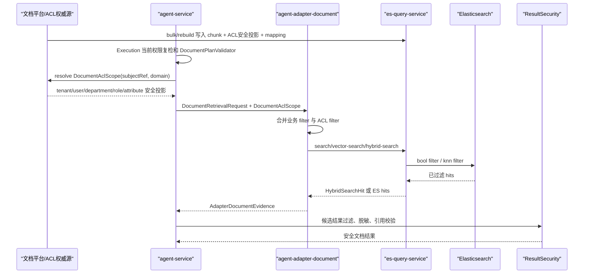

# 文档ACL与索引模型 L2 实施详细设计 v1.0

## 1. 文档信息

| 项目 | 内容 |
|---|---|
| 文档名称 | 文档ACL与索引模型 L2 实施详细设计 |
| 文档路径 | `docs/design/P2/文档ACL与索引模型_L2实施详细设计_v1.0.md` |
| 文档状态 | Approved |
| 当前版本 | v1.0 |
| 作者 | Codex |
| 创建日期 | 2026-07-06 |
| 最后更新日期 | 2026-07-06 |
| 适用范围 | Agent 文档型检索、生成式问答和总结能力在联调、灰度、生产启用前依赖的文档 ACL、ES 索引字段、mapping、filter DSL、录入写入、重建回滚和验证门禁 |
| 上级文档 | `docs/design/Agent目标架构总览_v1.0.md`；`docs/design/Agent能力执行内核架构设计_v1.0.md`；`docs/design/Agent元数据与上下文安全架构设计_v1.0.md` |
| 关联文档 | `docs/design/P2/Agent文档型检索与总结能力_L2实施详细设计_v1.0.md`；`docs/design/P2/Agent文档型检索与总结能力_设计文档品审报告.md`；`docs/design/P2/Agent文档型生成式问答与总结能力_L2实施详细设计_v1.0.md`；`docs/design/P2/Agent文档型生成式问答与总结能力_设计文档品审报告.md`；`docs/design/P2/文档ACL与索引模型_L2实施详细设计_交接文件.md` |
| 是否可作为实现依据 | 是。本文已完成正式设计文档品审，可作为本地编码、mock/stub 联调和契约测试依据；ACL 权威源、身份字段、embedding 维度、撤权 SLA、RebuildTask 持久化和真实索引门禁仍阻断真实联调、灰度和生产启用 |

## 2. 修改历史

| 序号 | 日期 | 位置 | 修改原因 | 修改内容 |
|---:|---|---|---|---|
| 1 | 2026-07-06 | 全文 | 初始化目标 L2 文档 | 基于交接文件、既有 P2 文档、父级架构约束和当前代码现状，新建文档 ACL 与索引模型详细设计 |
| 2 | 2026-07-06 | 第 6、7、8 章 | 第 1 轮内部评审发现文档边界与关联 P2 文档容易重复 | 明确本文只补齐下游 ACL、mapping、索引构建和权限过滤契约，不重写 Agent 检索或生成式能力 |
| 3 | 2026-07-06 | 第 10、11、12 章 | 第 2 轮内部评审发现 ACL 权威源与 ES 可检索投影边界需要收敛 | 补充外部文档 ACL 权威源、chunk 继承规则、安全投影字段和禁止写入完整 ACL 表达式的规则 |
| 4 | 2026-07-06 | 第 11、14、15 章 | 第 3 轮内部评审发现 vector/hybrid 检索阶段 fail closed 规则不够具体 | 补充 `HybridSearchRequest.filters`、`VectorSearchRequest.filterDsl`、KNN filter、关键词 DSL 合并和缺失 ACL filter 的失败策略 |
| 5 | 2026-07-06 | 第 14、16、18、20 章 | 第 4 轮内部评审发现索引重建、撤权、回滚和验证门禁不足以支撑联调 | 补充 versioned index、read alias、增量更新、撤权最大延迟、mapping 校验和生产启用门禁 |
| 6 | 2026-07-06 | 第 19、20、22、23、24 章 | 第 5 轮内部评审发现实现落点和检查清单需要更贴近当前仓库 | 补齐 Java、配置、脚本、契约、测试落点、评审记录和实施对齐检查 |
| 7 | 2026-07-06 | 第 1、3、10、11、12、13、19、20、21、22、23、24 章 | 正式设计文档品审发现接口兼容、filter 合并、文档索引识别、必填字段校验、alias 切换和枚举定义需要闭合 | 保留 `DocumentRetrievalRequest` 既有构造兼容，补充 keyword/hybrid filter 合并算法、document index guard、chunk schema 校验、alias 切换/回滚落点、`visibility/status` 枚举和测试项，并同步文档状态 |

## 3. 文档状态说明

| 状态 | 含义 | 是否可作为开发依据 |
|---|---|---:|
| Draft | 草稿，内容尚未完成完整评审 | 否 |
| In Review | 评审中，内容可能继续调整 | 否 |
| Approved | 已评审通过，可作为实现依据 | 是 |
| Implementing | 已进入实现阶段 | 是 |
| Implemented | 已完成实现，并已与设计对齐 | 是 |
| Deprecated | 已废弃，不再作为实现依据 | 否 |

当前状态：Approved。

状态说明：本文只创建和修改目标 L2 文档，未修改上级文档、关联文档、代码、测试或配置。正式品审未发现需要修改 L0/L1 或既有 P2 文档的问题；本文可作为本地编码和契约测试基线。由于 ACL 权威源、subject ACL projection 字段命名、ES dense_vector 维度、撤权 SLA、RebuildTask 持久化和真实索引门禁仍需业务侧确认，相关能力在确认前不得进入真实联调、灰度或生产启用。

## 4. 背景与目标

既有 `Agent文档型检索与总结能力` 已完成 Agent 侧文档检索、问答、总结能力的 capability、Plan、Adapter、ResultSecurity 和 Context 设计。既有 `Agent文档型生成式问答与总结能力` 已进一步补齐 queryVector、hybrid retrieval、证据上下文打包、LLM 候选生成和引用校验。

两份 P2 文档均明确：文档上传、清洗、切分、索引构建、文档级 ACL 权威源和 ES mapping 不属于 Agent 执行链路本身，但这些内容会阻塞联调、灰度和生产启用。如果文档索引缺少 ACL 投影字段、chunk 定位字段、dense_vector 字段或撤权更新策略，Agent 即使完成 ResultSecurity，也无法证明召回证据和 LLM 输入只来自授权内容。

本文目标如下：

1. 定义文档 ACL 权威模型、继承规则和可检索安全投影字段。
2. 定义 document、section、chunk 的索引字段模型与 ES mapping。
3. 定义 `agent-adapter-document`、`es-query-service` 和文档平台之间的 ACL filter DSL 契约。
4. 定义录入、清洗、脱敏、embedding、bulk index、重建、回滚、撤权更新和验证门禁。
5. 定义联调、灰度、生产启用前必须通过的安全和契约验证项。

## 5. 设计范围

### 5.1 范围内

| 序号 | 范围 | 说明 |
|---:|---|---|
| 1 | 文档 ACL 权威模型 | tenant、corpus、document、section、chunk 的可见性、继承和撤权规则 |
| 2 | ACL 可检索投影字段 | `aclRef`、`aclVersion`、`visibility`、`tenantId`、`departmentIds`、`roleIds`、`userIds`、`attributeKeys` 等字段 |
| 3 | 文档索引字段模型 | `documentId`、`chunkId`、`chunkIndex`、`charStart`、`charEnd`、`content`、`snippet`、`contextBefore`、`contextAfter` 等字段 |
| 4 | ES mapping | keyword、text、date、integer、boolean、flattened/object、dense_vector、metadata 和 source excludes |
| 5 | ACL filter DSL 契约 | Agent/adapter/es-query 如何生成、合并和执行受控 filter DSL |
| 6 | 录入写入契约 | 文档平台或 source 服务向 `es-query-service` bulk/rebuild 返回的文档 JSON 必填字段、幂等键和脱敏要求 |
| 7 | 权限变更与索引更新 | 授权变更、撤权、文档删除、全量重建、增量重建、版本切换和回滚策略 |
| 8 | 安全、审计与日志 | 禁止记录 JWT、完整 ACL 表达式、原始全文、queryVector、prompt、LLM 原始响应和 ES 原始错误正文 |
| 9 | 验证门禁 | mapping 校验、ACL 正反例、撤权延迟、hybrid/vector ACL filter、LLM 输入授权证明 |

### 5.2 范围外

| 序号 | 范围外事项 | 原因 | 后续入口 |
|---:|---|---|---|
| 1 | 重写 Agent 文档型检索、问答或总结能力 | 既有 P2 文档已覆盖 capability、Plan、Handler、ResultSecurity 和 Context | 关联 P2 文档 |
| 2 | 修改 Runtime route/plan 职责 | 父级架构明确 Runtime 不可信，只做规划 | 需 L1/ADR 授权 |
| 3 | 在 `agent-service` 中持久化文档全文或 documentId 级 ACL 权威表 | 会突破 Agent 数据边界和权限所有权 | 文档平台或 ACL 服务设计 |
| 4 | 实现完整文档平台 UI | 本文只定义后端 ACL、索引和检索安全契约 | 文档平台产品设计 |
| 5 | 启用生产开关 | 生产启用需要 provider、ACL、mapping、撤权演练和监控通过 | 灰度上线方案 |
| 6 | 引入 rerank、长文档异步总结或多 Agent 任务 | 超出交接文件授权范围 | 另起 L1/ADR 或专项 L2 |

## 6. 上级文档约束

| 上级文档 | 关键约束 | 本文承接方式 |
|---|---|---|
| `docs/design/Agent目标架构总览_v1.0.md` | Runtime 不可信，不决定权限、字段范围、最终脱敏；Agent Service 是最终授权、验证、执行、状态和审计边界 | 本文不让 Runtime 接触 ACL 表达式、ES DSL、queryVector、JWT 或未授权 metadata；ACL filter 在 Java 执行链路和文档平台边界内形成 |
| `docs/design/Agent目标架构总览_v1.0.md` | `capabilityId` 是授权、执行和审计主键，`planKind` 只表达结构类型 | 本文不新增 planKind；继续使用 `document.search`、`document.answer`、`document.summarize` 和 `DOCUMENT` plan kind |
| `docs/design/Agent能力执行内核架构设计_v1.0.md` | ExecutionCore 不按 capabilityId/domain/planKind 分支，Handler 只接收 Validated Plan，Adapter 只接收 validated command | ACL filter 通过 Document capability 的 Validator/Handler/Adapter 扩展，不修改 Core/Lifecycle 主流程 |
| `docs/design/Agent能力执行内核架构设计_v1.0.md` | Handler/Adapter 不能声明“已经授权”而绕过 ResultSecurity | 检索阶段 ACL filter 是第一道门禁，ResultSecurity 仍必须二次过滤 evidence、citation 和自然语言文本 |
| `docs/design/Agent元数据与上下文安全架构设计_v1.0.md` | Profile/Policy/Permission/Domain/Context 是请求级安全投影，不扩大用户权限 | 文档 ACL 权威源在外部文档平台或 ACL 服务；Agent 只消费当前主体的安全投影，不持有完整 ACL 规则 |
| `docs/design/Agent元数据与上下文安全架构设计_v1.0.md` | Context 最小化、加密、TTL、成功终结事务写入；自然语言 summary 不能绕过结构化权限 | 文档 Context 继续只保存 query、domain、filters、citationIds、topK 等最小信息，不保存正文、snippet、ACL 表达式、ES DSL 或 LLM 输入 |

## 7. 关联文档与边界

| 关联文档 | 关联内容 | 本文档职责 | 对方职责 | 边界说明 |
|---|---|---|---|---|
| `Agent文档型检索与总结能力_L2实施详细设计_v1.0.md` | 文档 capability、Plan、Adapter、ResultSecurity、Context 首版 | 补齐下游 ACL、索引字段、mapping、权限过滤和重建门禁 | 定义 Agent 侧 capability 和抽取式结果安全链路 | 不修改该文档；本文只关闭其 R1/R2 中 ACL 和索引字段风险 |
| `Agent文档型检索与总结能力_设计文档品审报告.md` | 首版风险 R1/R2/R5 | 继承 R1 下游 ACL 风险和索引字段确认要求 | 记录首版品审事实 | 不改报告 |
| `Agent文档型生成式问答与总结能力_L2实施详细设计_v1.0.md` | hybrid retrieval、queryVector、LLM 输入和引用校验 | 定义 hybrid/vector 的 ACL filter 和 mapping 前置 | 定义生成式链路、embedding port、context packer、citation verifier | 本文不重写 LLM 生成或引用校验 |
| `Agent文档型生成式问答与总结能力_设计文档品审报告.md` | provider、ACL、ES mapping 阻断项 | 补齐 ACL 和 ES mapping 详细设计 | 记录生成式文档品审事实 | 不改报告 |
| `文档ACL与索引模型_L2实施详细设计_交接文件.md` | 本文的任务范围和建议结构 | 作为本文直接输入 | 交接上下文 | 本文完成后该交接文件不再作为正式设计基线 |
| 当前代码 `agent-adapter-document` | `DocumentRetrievalMapper`、`DocumentSearchClient`、`DocumentEvidenceMapper` | 明确这些类需合并 ACL filter、映射索引字段和 fail closed | 已实现检索请求和 evidence 映射基础 | 本文只列实现落点，不直接改代码 |
| 当前代码 `es-query-service` | `/search`、`/vector-search`、`/hybrid-search`、`/bulk`、`/rebuild/full`、`/rebuild/incremental` | 明确 mapping、filter、rebuild 和 alias 切换契约 | 继续提供通用 ES 操作，不持有 Agent 权限公式 | 不把 es-query 升级为 ACL 权威服务 |

## 8. 设计边界与约束

| 边界类型 | 设计约束 |
|---|---|
| 业务边界 | 本文处理文档语料进入 Agent 检索链路前的 ACL、索引和验证闭环，不处理文档管理 UI、审批流或知识库运营 |
| 系统边界 | 文档平台或 ACL 服务是 document ACL 权威源；`es-query-service` 是通用 ES 操作服务；`agent-service` 是 Agent 执行和 ResultSecurity 边界 |
| 模块边界 | `agent-service` 可生成当前请求的 ACL filter 输入和 fail closed，不持久化 document ACL 表；`agent-adapter-document` 负责把受控 filter 合并到 es-query 请求 |
| 数据边界 | ES chunk 文档可以保存 ACL 安全投影字段，但不得保存完整 ACL 表达式、审批链、权限计算规则或 JWT |
| 状态边界 | 文档录入、索引版本、重建任务和 ACL 变更状态归属文档平台或 `es-query-service` 重建任务；Agent Invocation/Context 状态仍由既有 Agent 生命周期负责 |
| 权限边界 | capability/domain/field 权限由 Agent Profile/Policy/Permission/Domain projection 复检；documentId/chunk 级 ACL 由文档 ACL 权威源和 ES filter 共同保证 |
| 外部系统边界 | embedding provider、LLM provider、文档 ACL authority 和 sourceUrl 数据源都属于外部依赖，不可用时不得绕过 ACL 或发送未授权 evidence |
| 当前设计假设 | 当前仓库已有 document capability、hybrid/vector search、DocumentResultSecurityProjector、IndexRebuildService 和 RebuildRequest.indexDefinition 基础能力 |
| 当前设计限制 | `ExecutionScope` 当前未暴露 departmentIds、roleIds、userIds 等 ACL subject claims；本文新增 `DocumentAclScopePort` 作为文档能力专用投影入口，避免修改父级权限模型 |

## 9. 总体设计

### 9.1 模块职责

| 模块 | 负责 | 不负责 |
|---|---|---|
| 文档平台 / ACL 权威源 | 文档 ACL 事实、授权继承、ACL 投影生成、撤权事件、文档录入状态、sourceUrl 数据源 | Agent capability、Runtime plan、ResultSecurity |
| `agent-service` | 当前主体复检、文档能力 Handler、`DocumentAclScopePort` 调用、queryVector 生成、LLM 输入预过滤、ResultSecurity 二次投影 | 保存全文、保存 ACL 权威表、生成 ES mapping |
| `agent-adapter-document` | 将 `DocumentRetrievalRequest` 映射为 keyword/vector/hybrid 请求，合并业务 filter 与 ACL filter，映射 evidence | 决定最终权限、调用 LLM、持久化 Agent Context |
| `es-query-api` | 提供通用 DTO：`VectorSearchRequest`、`HybridSearchRequest`、`RebuildRequest`、`RebuildTask` | 定义业务 ACL 权威模型 |
| `es-query-service` | 执行 ES search、KNN filter、hybrid RRF、bulk index、rebuild、mapping 创建和任务状态 | 解释 Agent 权限公式、调用 ACL 服务、生成 queryVector |
| ResultSecurity | 按当前 Effective Execution Scope 过滤 evidence/citation/自然语言输出 | 代替检索阶段 ACL filter |

### 9.2 核心调用链



### 9.3 首版核心决策

| 决策编号 | 决策 | 理由 |
|---|---|---|
| D1 | ACL 权威源在外部文档平台或 ACL 服务，Agent 只消费当前主体的安全投影 | 避免在 `agent-service` 中复制 documentId 级 ACL 权威表 |
| D2 | 首版 ACL 粒度为 document 级继承到 chunk，预留 chunk override | 能覆盖首版检索安全，保留更细粒度扩展 |
| D3 | ES 中保存可检索 ACL 安全投影字段，同时保留 `aclRef` 和 `aclVersion` 追溯 | vector/hybrid 检索必须在 ES 查询阶段过滤，不能事后过滤 |
| D4 | `agent-doc-{domain}` 作为当前 Adapter 读取 alias，物理索引使用 versioned index | 兼容 `DocumentAdapterProperties.indexPrefix + domain`，支持蓝绿重建和回滚 |
| D5 | `VectorSearchRequest.filterDsl` 和 `HybridSearchRequest.filters` 必须包含 ACL filter；缺失时 fail closed | KNN 不带 filter 会先召回未授权 chunk，不能依赖 ResultSecurity 兜底 |
| D6 | 文档录入阶段生成脱敏 `snippet` 和可裁剪 `content`，检索返回前和 ResultSecurity 再裁剪 | 防止原始全文和敏感片段进入 LLM 或日志 |

## 10. 详细功能设计

### 10.1 文档 ACL 权威模型

#### 10.1.1 功能说明

文档 ACL 权威模型定义文档可见性的事实来源和继承规则。本文只定义 Agent 文档能力消费所需的稳定投影，不定义文档平台内部权限表结构。

#### 10.1.2 ACL 对象层级

| 层级 | 标识字段 | 权限来源 | 首版规则 |
|---|---|---|---|
| tenant | `tenantId` | 外部租户/身份系统 | 所有文档检索必须带 tenant filter；tenant 不匹配直接不可见 |
| corpus | `corpusId` / Agent domain | Agent Domain Metadata + 文档平台 corpus 配置 | corpus/domain 权限由 Agent 复检；ES filter 仍必须限制 `corpusId` |
| document | `documentId` | 文档 ACL 权威源 | 首版 ACL 权威粒度；document ACL 继承到全部 chunk |
| section | `sectionId` | 文档结构解析 | 首版不单独授权，只用于定位和展示 |
| chunk | `chunkId` | document 继承，预留 override | 默认继承 document ACL；若 `chunkAclOverride=true` 必须写完整安全投影并提高校验级别 |

#### 10.1.3 业务规则

1. 文档 ACL 权威源必须能输出 `aclRef`、`aclVersion`、`visibility` 和可检索安全投影字段。
2. `aclRef` 只用于追溯，不得作为唯一过滤条件；ES 查询必须能直接用安全投影字段完成初筛。
3. 首版 `chunk` 默认继承 `document` ACL；不允许 section/chunk 只写 `aclRef` 而缺少展开投影。
4. ACL 不可用、投影缺失、版本不可确认、tenant 缺失或 filter 生成失败时，检索 fail closed。
5. `visibility=PUBLIC` 仍受 tenant/corpus/domain/status 约束，不代表跨租户公开。

### 10.2 文档与 chunk 索引字段模型

#### 10.2.1 必填字段

| 字段 | 类型 | 是否必填 | 数据归属 | 用途 |
|---|---|---:|---|---|
| `tenantId` | keyword | 是 | 文档平台/ACL 权威源 | 租户隔离 |
| `corpusId` | keyword | 是 | 文档平台 | 对齐 Agent document domain |
| `documentId` | keyword | 是 | 文档平台 | 文档引用、撤权、删除和追溯 |
| `documentVersion` | keyword | 是 | 文档平台 | 幂等、重建和变更追踪 |
| `sectionId` | keyword | 否 | 文档解析 | 章节定位 |
| `chunkId` | keyword | 是 | 文档切分器 | citationId、去重、chunk 定位 |
| `chunkIndex` | integer | 是 | 文档切分器 | 文档内排序和 context window |
| `charStart` | integer | 是 | 文档切分器 | 引用定位 |
| `charEnd` | integer | 是 | 文档切分器 | 引用定位 |
| `title` | text + keyword | 是 | 文档平台 | 检索和展示 |
| `content` | text | 是 | 清洗/脱敏输出 | keyword 搜索和 LLM 输入候选 |
| `snippet` | text | 是 | 清洗/脱敏输出 | Agent 展示和 fallback |
| `aclRef` | keyword | 是 | ACL 权威源 | ACL 追溯 |
| `aclVersion` | keyword | 是 | ACL 权威源 | 撤权和审计 |
| `visibility` | keyword | 是 | ACL 权威源 | 可见性分类 |
| `status` | keyword | 是 | 文档平台 | `ACTIVE/REVOKED/DELETED/EXPIRED/BLOCKED` |
| `indexVersion` | keyword | 是 | 索引构建器 | 蓝绿重建和回滚 |
| `contentHash` | keyword | 是 | 清洗/切分器 | 幂等、重复写入检测 |

#### 10.2.2 可选字段

| 字段 | 类型 | 是否必填 | 用途 |
|---|---|---:|---|
| `departmentIds` | keyword array | 条件必填 | 部门可见 ACL 投影 |
| `roleIds` | keyword array | 条件必填 | 角色可见 ACL 投影 |
| `userIds` | keyword array | 条件必填 | 指定用户可见 ACL 投影 |
| `attributeKeys` | keyword array | 条件必填 | 业务属性 ABAC 投影，例如 `region:CN` |
| `classification` | keyword | 否 | 安全等级、脱敏策略 |
| `sourceType` | keyword | 否 | 文档来源分类 |
| `sourceUri` | keyword | 否 | 展示链接，必须已脱敏 |
| `page` | integer | 否 | PDF/分页文档定位 |
| `section` | text + keyword | 否 | 章节展示和检索 |
| `effectiveAt` | date | 否 | ACL 或文档生效时间，启用时必须进入 range 白名单 |
| `expiresAt` | date | 否 | ACL 或文档过期时间，启用时必须进入 range 白名单 |
| `chunkAclOverride` | boolean | 否 | 是否存在 chunk 级 ACL override；为 true 时必须写完整安全投影 |
| `contextBefore` | text array | 否 | 下游返回的前文窗口，Agent 不再查全文 |
| `contextAfter` | text array | 否 | 下游返回的后文窗口，Agent 不再查全文 |
| `embedding` | dense_vector | 向量检索启用时必填 | vector/hybrid 检索 |
| `embeddingModel` | keyword | 向量检索启用时必填 | 模型追溯 |
| `embeddingDimension` | integer | 向量检索启用时必填 | mapping/provider 校验 |
| `embeddingVersion` | keyword | 向量检索启用时必填 | embedding 版本追踪 |
| `metadata` | flattened | 否 | 已授权、低敏扩展元数据 |

#### 10.2.3 枚举与条件字段

| 字段 | 允许值 | 条件约束 |
|---|---|---|
| `visibility` | `TENANT`、`USER`、`DEPARTMENT`、`ROLE`、`ATTRIBUTE`、`PUBLIC` | `PUBLIC` 只在同一 tenant/corpus 内公开；`USER/DEPARTMENT/ROLE/ATTRIBUTE` 必须分别带非空 `userIds/departmentIds/roleIds/attributeKeys` |
| `status` | `ACTIVE`、`REVOKED`、`DELETED`、`EXPIRED`、`BLOCKED` | Agent 查询只允许 `ACTIVE`；其他状态必须被 ACL filter 或 status filter 排除 |
| `chunkAclOverride` | `true`、`false` | `true` 时 chunk 文档不得只写 `aclRef`，必须写展开后的 ACL 安全投影字段 |

### 10.3 ES mapping 设计

#### 10.3.1 index 命名

| 名称 | 规则 | 说明 |
|---|---|---|
| 读取 alias | `agent-doc-{domain}` | 与当前 `DocumentAdapterProperties.indexPrefix=agent-doc-` 兼容 |
| 物理索引 | `agent-doc-{domain}-v{yyyyMMddHHmmss}` | 全量重建生成新版本 |
| 回滚 alias | `agent-doc-{domain}-rollback-{version}` | 可选，仅用于演练和人工回滚 |

#### 10.3.2 mapping 摘要

```json
{
  "settings": {
    "index": {
      "number_of_shards": 3,
      "number_of_replicas": 1
    }
  },
  "mappings": {
    "dynamic": "strict",
    "properties": {
      "tenantId": { "type": "keyword" },
      "corpusId": { "type": "keyword" },
      "documentId": { "type": "keyword" },
      "documentVersion": { "type": "keyword" },
      "sectionId": { "type": "keyword" },
      "chunkId": { "type": "keyword" },
      "chunkIndex": { "type": "integer" },
      "charStart": { "type": "integer" },
      "charEnd": { "type": "integer" },
      "title": {
        "type": "text",
        "fields": { "keyword": { "type": "keyword", "ignore_above": 256 } }
      },
      "section": {
        "type": "text",
        "fields": { "keyword": { "type": "keyword", "ignore_above": 256 } }
      },
      "content": { "type": "text" },
      "snippet": { "type": "text" },
      "contextBefore": { "type": "text" },
      "contextAfter": { "type": "text" },
      "aclRef": { "type": "keyword" },
      "aclVersion": { "type": "keyword" },
      "visibility": { "type": "keyword" },
      "departmentIds": { "type": "keyword" },
      "roleIds": { "type": "keyword" },
      "userIds": { "type": "keyword" },
      "attributeKeys": { "type": "keyword" },
      "classification": { "type": "keyword" },
      "sourceType": { "type": "keyword" },
      "sourceUri": { "type": "keyword", "ignore_above": 1024 },
      "page": { "type": "integer" },
      "effectiveAt": { "type": "date" },
      "expiresAt": { "type": "date" },
      "chunkAclOverride": { "type": "boolean" },
      "status": { "type": "keyword" },
      "indexVersion": { "type": "keyword" },
      "contentHash": { "type": "keyword" },
      "embedding": {
        "type": "dense_vector",
        "dims": 1536,
        "index": true,
        "similarity": "cosine"
      },
      "embeddingModel": { "type": "keyword" },
      "embeddingDimension": { "type": "integer" },
      "embeddingVersion": { "type": "keyword" },
      "metadata": { "type": "flattened" }
    }
  }
}
```

说明：

1. `embedding.dims=1536` 是示例值；生产值必须与 `agent.document.embedding.dimension` 和 provider 输出一致。
2. `dynamic=strict` 是生产建议；联调阶段若需要兼容扩展字段，必须通过 `metadata` 承载，不允许把未知字段动态变成可过滤字段。
3. `embedding` 必须从 `_source` 返回中排除；当前 `EsDocumentService.vectorSearchBody` 已默认排除 embedding 字段。
4. `es-query-service` 必须通过配置化 `documentIndexPrefixes` 或等价 `DocumentIndexPolicy` 识别文档索引，首版默认包含 `agent-doc-`；只有识别为文档索引时才强制文档 ACL filter、mapping 和 chunk schema 校验，避免破坏通用 ES 查询服务。

### 10.4 ACL filter DSL 生成

#### 10.4.1 输入与输出

| 输入 | 来源 | 说明 |
|---|---|---|
| `domain` | `ValidatedDocumentPlan` / `DocumentRetrievalRequest` | 对应 `corpusId` 和读取 alias |
| `subjectRef` | `ExecutionContext.subject()` / `ExecutionScope.subjectRef()` | 当前执行主体引用 |
| `tenantId` | `DocumentAclScopePort` | 当前主体租户 |
| `userId` | `DocumentAclScopePort` | 当前用户稳定 ID，不一定等于 subjectRef |
| `departmentIds` | `DocumentAclScopePort` | 当前主体部门集合 |
| `roleIds` | `DocumentAclScopePort` | 当前主体角色集合 |
| `attributeKeys` | `DocumentAclScopePort` | 当前主体 ABAC 属性投影 |
| `aclSnapshotVersion` | `DocumentAclScopePort` | 权限投影版本，用于审计 |

输出为 `Map<String,Object>` 形式的 ES bool filter，写入 `HybridSearchRequest.filters` 和 `VectorSearchRequest.filterDsl`，并合并到 keyword search DSL。

兼容与合并规则：

1. `DocumentRetrievalRequest` 必须保留当前已存在的构造方法签名；新增 `aclScope` 字段时使用新增重载、builder 或 `withAclScope(DocumentAclScope scope)` 返回新实例，避免破坏 `DocumentPlanValidator`、既有测试和非文档 ACL 初始化路径的编译兼容。
2. `DocumentPlanValidator` 仍只负责 Plan、domain、field、filter、sort、topK 和 retrieval mode 校验，不访问外部 ACL 服务；`DocumentCapabilityHandler` 在执行阶段解析 `DocumentAclScope` 后，把带 ACL scope 的请求交给 Adapter。
3. `DocumentAclFilterFactory.build(domain, scope)` 只生成 ACL/status/tenant/corpus filter；业务 filter 由 `DocumentRetrievalMapper` 从 `ValidatedFilter` 生成，二者通过 `DocumentAclFilterFactory.merge(businessFilter, aclFilter)` 合并为同一 `bool.filter`。
4. keyword DSL 的 `bool.must` 只承载全文检索查询；业务 filter 与 ACL filter 必须落入 `bool.filter`，不得继续放在 `must` 中影响评分或被 hybrid keyword 分支漏用。
5. `HybridSearchRequest.filters` 是 keyword 和 vector 共用过滤条件；`EsDocumentService.keywordSearchBody` 必须把 `request.filters` 合并进 keyword DSL，`vectorSearchBody` 必须把同一 filter 写入 `knn.filter`。不能假设 `keywordDsl` 已经自带 ACL filter。
6. `VectorSearchRequest.filterDsl` 和 `HybridSearchRequest.filters` 为空时，若 `DocumentIndexPolicy` 判定 index/alias 是文档索引，`es-query-service` 返回 400 安全错误；非文档索引保持通用接口兼容。

#### 10.4.2 DSL 示例

```json
{
  "bool": {
    "filter": [
      { "term": { "tenantId": "tenant-001" } },
      { "term": { "corpusId": "company_policy" } },
      { "term": { "status": "ACTIVE" } },
      {
        "bool": {
          "should": [
            { "term": { "visibility": "TENANT" } },
            { "terms": { "userIds": ["u-1001"] } },
            { "terms": { "departmentIds": ["dept-01", "dept-02"] } },
            { "terms": { "roleIds": ["role-hr"] } },
            { "terms": { "attributeKeys": ["region:CN"] } }
          ],
          "minimum_should_match": 1
        }
      }
    ]
  }
}
```

#### 10.4.3 DSL 白名单

| DSL 元素 | 是否允许 | 使用范围 | 说明 |
|---|---:|---|---|
| `bool.filter` | 是 | ACL、状态、租户、corpus | 必须用于非评分过滤 |
| `bool.should` + `minimum_should_match=1` | 是 | 多种可见性条件 OR | 仅允许在 ACL 可见性内部使用 |
| `term` | 是 | keyword 字段 | 单值匹配 |
| `terms` | 是 | keyword array 字段 | 多值匹配 |
| `range` | 受限 | `expiresAt`、`effectiveAt` 等 date 字段 | 首版非必需，必须白名单 |
| `exists` | 受限 | mapping 校验和诊断 | 不作为生产 ACL 主 filter |
| `script` | 否 | 无 | 禁止脚本权限判断 |
| `query_string` | 否 | 无 | 禁止用户输入拼接 |
| `regexp` / `wildcard` | 否 | 无 | 禁止高成本和不可审计 ACL filter |

#### 10.4.4 fail closed 规则

1. `DocumentAclScopePort` 返回空、超时、版本不可确认或缺少 `tenantId` 时，不调用 `DocumentSearchClient`。
2. `DocumentAclFilterFactory` 生成空 filter、filter 不含 `tenantId`、filter 不含 `corpusId` 或 filter 不含可见性 should 条件时，抛出安全异常。
3. `HybridSearchRequest.filters` 或 `VectorSearchRequest.filterDsl` 为空时，`agent-adapter-document` 在文档能力启用场景必须 fail closed。
4. `es-query-service` 收到文档索引的 vector/hybrid 请求且过滤字段缺失时，应返回 400 安全错误；不得自动补 `match_all`。
5. `DocumentAclFilterFactory` 生成的 filter 只能包含第 10.4.3 节白名单元素；如果业务 filter 含非白名单 DSL，必须在 Adapter 层拒绝，而不是透传到 ES。

### 10.5 文档录入与索引构建

#### 10.5.1 主流程

1. 文档平台接收上传或同步事件，生成 `documentId` 和 `documentVersion`。
2. 清洗服务提取文本、结构、页码、章节和来源链接。
3. 脱敏服务生成可展示 `snippet` 和可裁剪 `content`，记录 `contentHash`。
4. 切分器生成稳定 `chunkId`、`chunkIndex`、`charStart`、`charEnd`、`contextBefore`、`contextAfter`。
5. ACL 权威源根据 document ACL 生成 chunk 级安全投影字段。
6. embedding provider 根据已脱敏 chunk 生成 `embedding`、`embeddingModel`、`embeddingVersion` 和 `embeddingDimension`。
7. source 服务按 `RebuildRequest.sourceUrl` 协议分页返回 chunk JSON。
8. `es-query-service` 通过 `/bulk` 或 `/rebuild/full` 写入目标物理索引。
9. mapping、ACL 正反例、检索验证通过后切换 `agent-doc-{domain}` alias。

#### 10.5.2 sourceUrl 响应契约

```json
{
  "documents": [
    {
      "tenantId": "tenant-001",
      "corpusId": "company_policy",
      "documentId": "doc-001",
      "documentVersion": "v3",
      "chunkId": "doc-001-v3-0001",
      "chunkIndex": 1,
      "charStart": 0,
      "charEnd": 720,
      "title": "员工手册",
      "content": "已清洗和脱敏的 chunk 文本",
      "snippet": "可展示片段",
      "aclRef": "acl-doc-001",
      "aclVersion": "acl-v5",
      "visibility": "DEPARTMENT",
      "departmentIds": ["dept-hr"],
      "status": "ACTIVE",
      "effectiveAt": "2026-07-01T00:00:00Z",
      "expiresAt": "2026-12-31T23:59:59Z",
      "chunkAclOverride": false,
      "indexVersion": "idx-20260706180000",
      "contentHash": "sha256:...",
      "embedding": [0.01, 0.02],
      "embeddingModel": "embedding-model-name",
      "embeddingDimension": 1536,
      "embeddingVersion": "emb-v1"
    }
  ],
  "hasMore": false,
  "nextCursor": null
}
```

#### 10.5.3 写入规则

1. `idField` 推荐使用 `chunkId`；重复写入同一 `chunkId` 必须覆盖为相同 chunk 版本。
2. 同一 `documentId + documentVersion + chunkIndex` 必须只对应一个 `chunkId`。
3. `status != ACTIVE` 的 chunk 不得被 Agent 查询返回；保留 tombstone 时必须被 filter 排除。
4. 不允许把原始全文、未脱敏附件内容、完整 ACL 表达式、JWT、审批链、prompt 或 LLM 原始响应写入 ES。
5. source 服务分页必须稳定；同一 `cursor` 重试不得返回不同版本混合数据。
6. `es-query-service` 写入文档索引时必须执行 `DocumentChunkSchemaValidator` 或等价校验；ES mapping 不会强制必填字段，因此不能只依赖 `dynamic=strict`。
7. `DocumentChunkSchemaValidator` 至少校验第 10.2.1 节必填字段、`visibility` 条件字段、`status` 枚举、`chunkAclOverride=true` 时完整 ACL 投影、`embeddingDimension` 与 mapping dims 一致。

### 10.6 权限变更、删除、重建和回滚

| 场景 | 处理策略 | fail closed / 回滚要求 |
|---|---|---|
| 新授权 | 增量更新对应 document/chunk ACL 投影，或进入下一次全量重建 | 生效前不扩大可见范围 |
| 撤权 | 优先增量覆盖 `departmentIds/roleIds/userIds/attributeKeys/aclVersion`；无法增量时触发高优先级重建 | 撤权最大延迟需配置和监控；超 SLA 时关闭文档能力或相关 corpus |
| 文档删除 | 写 `status=DELETED` tombstone 并在下一次重建物理删除 | 查询 filter 必须排除非 ACTIVE |
| mapping 变更 | 新建物理索引，重放 sourceUrl，全量校验后 alias 切换 | 旧 alias 保留到验证窗口结束 |
| embedding 维度变更 | 必须新建物理索引，不能原地修改 dense_vector dims | 旧索引继续服务 keyword 或关闭 vector channel |
| 重建失败 | `RebuildTask.status=FAILED`，alias 不切换 | 继续使用上一已验证 alias |
| 回滚 | alias 切回上一物理索引；禁止复用失败索引 | 回滚后执行 ACL 正反例验证 |

alias 切换规则：

1. `IndexRebuildService.submitFullRebuild` 只负责创建目标物理索引并写入数据，不在后台任务成功时自动切换读取 alias。
2. 读取 alias 切换必须通过受控的 `EsIndexAliasService.switchReadAlias` 或运维脚本执行，前置条件是 `RebuildTask.status=SUCCESS`、mapping 校验通过、chunk schema 抽样校验通过、ACL 正反例通过。
3. 回滚必须调用 `EsIndexAliasService.rollbackReadAlias` 或等价脚本把 `agent-doc-{domain}` 指回上一已验证物理索引，并再次执行 ACL 反例验证。
4. alias 操作日志只记录 alias、oldIndex、newIndex、taskId、operatorRef 和验证摘要，不记录文档正文、完整 DSL 或 sourceUrl 密钥。

## 11. 接口设计

### 11.1 ACL subject projection 接口

该接口是文档能力消费外部 ACL 权威源或权限服务的最小投影接口。它不返回完整 ACL 表达式，不返回文档列表，不返回 JWT。

| 接口 | 方法 | 路径 | 说明 |
|---|---|---|---|
| Resolve Document ACL Scope | POST | `/internal/document-acl/scope/resolve` | 根据当前 subject、tenant/domain 和权限证据返回可用于 ES filter 的主体安全投影 |

请求：

```json
{
  "requestId": "invocation-id",
  "subjectRef": "subject-001",
  "domain": "company_policy",
  "permissionEvidenceId": "perm-evidence-001",
  "permissionVersion": "perm-v10",
  "deadline": "2026-07-06T10:00:00Z"
}
```

响应：

```json
{
  "tenantId": "tenant-001",
  "userId": "u-1001",
  "departmentIds": ["dept-01"],
  "roleIds": ["role-hr"],
  "attributeKeys": ["region:CN"],
  "aclSnapshotVersion": "acl-subject-v8",
  "expiresAt": "2026-07-06T10:05:00Z"
}
```

错误规则：

| 场景 | 处理 |
|---|---|
| 401/403 | fail closed，不调用 es-query |
| 404 subject/domain 不存在 | fail closed |
| 408/504 | fail closed；不得回退为无 ACL filter |
| 5xx | fail closed，记录 diagnosticId，不记录响应 body |
| 返回空 tenant 或空版本 | fail closed |

### 11.2 es-query 检索接口

| 接口 | 方法 | 路径 | 当前代码落点 | ACL 要求 |
|---|---|---|---|---|
| Keyword Search | POST | `/es/indexes/{index}/search` | `EsQueryController.search`、`EsDocumentService.search` | 请求 DSL 必须已包含 ACL filter |
| Vector Search | POST | `/es/indexes/{index}/vector-search` | `EsQueryController.vectorSearch`、`EsDocumentService.vectorSearchBody` | `VectorSearchRequest.filterDsl` 必须包含 ACL filter |
| Hybrid Search | POST | `/es/indexes/{index}/hybrid-search` | `EsQueryController.hybridSearch`、`EsDocumentService.hybridSearch` | `HybridSearchRequest.filters` 必须同时作用于 keyword 和 vector 召回 |

### 11.3 es-query 写入和重建接口

| 接口 | 方法 | 路径 | 当前代码落点 | 本文补充要求 |
|---|---|---|---|---|
| Index Document | PUT | `/es/indexes/{index}/documents` | `EsQueryController.indexDocument` | 写入前应通过 mapping/必填字段校验 |
| Bulk Index | POST | `/es/indexes/{index}/bulk` | `EsQueryController.bulkIndex`、`EsDocumentService.bulkIndex` | `idField=chunkId`，文档字段必须满足第 10.2 节 |
| Full Rebuild | POST | `/es/indexes/{index}/rebuild/full` | `IndexRebuildService.submitFullRebuild` | `indexDefinition` 必须包含 ACL/mapping/dense_vector 字段 |
| Incremental Rebuild | POST | `/es/indexes/{index}/rebuild/incremental` | `IndexRebuildService.submitIncrementalRebuild` | 只允许覆盖同一 `chunkId` 的最新安全投影 |
| Rebuild Task Query | GET | `/es/rebuild/tasks/{taskId}` | `RebuildTaskRepository.findById` | 生产需持久化任务状态；当前内存实现只能用于本地或联调 |
| Switch Read Alias | POST | `/es/indexes/{index}/aliases/read/switch` | `EsQueryController.switchReadAlias`、`EsIndexAliasService.switchReadAlias` | 仅文档索引使用；必须带 `taskId/targetIndex/expectedPreviousIndex/validationDigest/operatorRef` |
| Rollback Read Alias | POST | `/es/indexes/{index}/aliases/read/rollback` | `EsQueryController.rollbackReadAlias`、`EsIndexAliasService.rollbackReadAlias` | 仅允许回滚到上一已验证物理索引；回滚后必须执行 ACL 反例验证 |

## 12. 数据设计

### 12.1 ACL 安全投影对象

| 字段 | 类型 | 是否必填 | 说明 |
|---|---|---:|---|
| `tenantId` | String | 是 | 租户隔离主键 |
| `userId` | String | 是 | 当前用户稳定 ID |
| `departmentIds` | List<String> | 否 | 部门集合，空集合不参与 OR |
| `roleIds` | List<String> | 否 | 角色集合，空集合不参与 OR |
| `attributeKeys` | List<String> | 否 | ABAC 属性集合，空集合不参与 OR |
| `aclSnapshotVersion` | String | 是 | 当前 ACL subject projection 版本 |
| `expiresAt` | Instant | 是 | 投影过期时间，超时不可复用 |

### 12.2 ES chunk 文档对象

ES chunk 文档以 sourceUrl 返回的 JSON 为权威输入。`es-query-service` 不生成业务字段，只执行 mapping 校验、bulk 写入和检索。

字段约束：

1. 所有 ID 字段必须是不可变字符串，不允许使用标题、路径或自然语言文本作为主键。
2. `metadata` 仅保存低敏展示字段；任何字段进入 `metadata` 不代表自动可过滤。
3. `content` 和 `snippet` 必须来自清洗/脱敏输出；如果无法脱敏，文档不得进入 `ACTIVE` 状态。
4. `embeddingDimension` 必须等于 mapping dims；不一致时拒绝写入或拒绝切 alias。
5. 文档索引写入必须先经过 `DocumentChunkSchemaValidator`；缺少 `tenantId/corpusId/documentId/chunkId/aclRef/aclVersion/visibility/status/indexVersion/contentHash` 等必填字段时拒绝写入。
6. `visibility=USER/DEPARTMENT/ROLE/ATTRIBUTE` 时，对应投影数组为空必须拒绝写入；不得写入一个只能由 ResultSecurity 事后兜底的半成品 chunk。

### 12.3 不新增 Agent 数据库表

本文不新增 `agent-service` 数据库表。Agent 侧继续使用既有 Invocation、StoredResult 和 Context 存储。文档索引状态、ACL 权威状态和重建状态归属文档平台或 `es-query-service`。

若生产要求 `RebuildTask` 持久化，需要另行在 `es-query-service` 设计持久化表或任务存储；本文只记录该风险，不直接修改数据库。

## 13. 状态流转设计

### 13.1 文档索引生命周期

| 状态 | 进入条件 | 可检索 | 说明 |
|---|---|---:|---|
| `RECEIVED` | 文档上传或同步到达 | 否 | 尚未清洗 |
| `CLEANED` | 文本和结构解析完成 | 否 | 尚未切分和脱敏 |
| `CHUNKED` | chunkId、chunkIndex、charStart、charEnd 生成 | 否 | 尚未生成 ACL 投影和 embedding |
| `PROJECTED` | ACL 安全投影生成 | 否 | 已具备权限过滤字段 |
| `EMBEDDED` | embedding 字段生成或确认 keyword-only | 否 | hybrid/vector 前置完成 |
| `INDEXED` | 写入物理索引 | 否 | 尚未通过门禁 |
| `ACTIVE` | mapping、ACL、检索验证通过且 alias 切换 | 是 | Agent 可检索 |
| `REVOKED` | 权限撤销处理中或撤权 tombstone 已写入 | 否 | 必须被 filter 排除或从索引更新 |
| `DELETED` | 文档删除或硬删除完成 | 否 | tombstone 或物理删除 |

### 13.2 RebuildTask 状态

当前代码 `RebuildTaskRepository` 使用以下状态：`SUBMITTED`、`RUNNING`、`SUCCESS`、`FAILED`。

本文补充规则：

1. 只有 `SUCCESS` 且验证门禁通过后，才允许切换读取 alias。
2. `FAILED` 不得影响当前 alias。
3. `RUNNING` 超过任务 SLA 时必须告警；不得由 Agent 自动切到目标索引。
4. 当前内存仓库重启后丢失状态，生产启用前需确认是否补持久化任务存储。

### 13.3 非法状态流转

| 非法流转 | 风险 | 处理 |
|---|---|---|
| `INDEXED` 未验证直接 `ACTIVE` | mapping 或 ACL 错误导致越权召回 | 禁止切 alias |
| `REVOKED` 继续可检索 | 撤权后证据泄露 | 关闭 corpus 或触发紧急重建 |
| dense_vector 维度变化后复用旧索引 | ES 查询失败或召回异常 | 必须新建物理索引 |
| `FAILED` 重建任务切 alias | 读取半成品索引 | 拒绝 alias 操作并告警 |

## 14. 幂等、事务与一致性设计

| 操作 | 幂等键 | 事务边界 | 一致性策略 |
|---|---|---|---|
| chunk 写入 | `chunkId` | 单条 ES index | 同一 chunkId 覆盖最新同版本内容 |
| bulk 写入 | `chunkId` + `indexVersion` | 单批 ES bulk | 允许重试；失败批次重新拉取 |
| full rebuild | `targetIndex` + `indexVersion` | 物理索引级 | 新索引验证通过后 alias 原子切换 |
| incremental rebuild | `chunkId` + `documentVersion` + `aclVersion` | 单批 ES bulk | 最终一致；撤权场景必须满足 SLA |
| ACL scope resolve | `subjectRef` + `domain` + `permissionVersion` | 单次外部读 | 请求级投影，不跨 Invocation 复用 |
| Agent 检索 | `invocationId` + `capabilityId` + `domain` + `canonicalPlanDigest` | Agent Invocation | 只读下游调用，失败不写 Context |

一致性规则：

1. Agent 本地事务不扩大到 ES 或文档平台。
2. ES 索引更新与 ACL 权威源之间采用最终一致；撤权必须有最大延迟和监控。
3. full rebuild 使用新物理索引和 alias 切换避免半成品可见。
4. keyword/vector/hybrid 必须使用同一 ACL filter；不能 keyword 带 ACL、vector 不带 ACL。
5. LLM 输入只基于当前请求返回且已过滤的 evidence，不缓存跨请求 evidence。

## 15. 权限、风控与审计设计

### 15.1 权限分层

| 层级 | 执行位置 | 失败策略 |
|---|---|---|
| capability 权限 | Agent Authorization Planning/Execution | 不投影或执行前 fail closed |
| domain/corpus 权限 | Agent Domain Metadata Projection | 不投影或执行前 fail closed |
| field 权限 | Validator + ResultSecurity | 字段不可规划、不可输出 |
| subject ACL projection | `DocumentAclScopePort` | 不返回 projection 则 fail closed |
| document/chunk ACL | ES ACL filter + 文档平台投影字段 | filter 缺失或字段缺失则 fail closed |
| 输出安全 | `DocumentResultSecurityProjector` | 删除未授权 evidence，候选文本不可信 |

### 15.2 风控规则

| 风险 | 规则 | 触发处理 |
|---|---|---|
| 未授权 chunk 进入召回 | KNN、keyword、hybrid 都必须带 ACL filter | 请求失败并记录安全诊断 |
| 文档全文泄露 | `_source` 排除 `embedding`，日志禁止 `content/snippet` 全文 | 代码评审和测试阻断 |
| ACL 表达式泄露 | 不记录完整 ACL DSL、JWT、权限表达式 | 日志扫描和审计阻断 |
| LLM 输入越权 | LLM 输入只来自已过滤 evidence 和安全 metadata | 预安全过滤和 ResultSecurity 双测试 |
| 撤权延迟 | 生产必须配置撤权最大延迟和告警 | 超 SLA 关闭 corpus 或文档能力 |
| mapping 漂移 | 启动或切 alias 前校验 mapping | mapping 不匹配拒绝启用 |

### 15.3 审计字段

| 字段 | 来源 | 是否可记录 | 说明 |
|---|---|---:|---|
| `invocationId` | Agent ExecutionContext | 是 | 请求级关联 |
| `capabilityId` | Execution Core | 是 | `document.search/answer/summarize` |
| `domain` / `corpusId` | ValidatedDocumentPlan | 是 | 低基数标签 |
| `aclSnapshotVersion` | DocumentAclScope | 是 | 不包含 ACL 表达式 |
| `aclFilterDigest` | DocumentAclFilterFactory | 是 | filter 摘要，不可反推完整内容 |
| `indexVersion` | ES hit metadata | 是 | 版本追踪 |
| `queryVectorDigest` | Embedding Result | 是 | 不记录原向量 |
| `evidenceCount` | ResultSecurity | 是 | 计数 |
| `documentId/chunkId` | ES hit | 受限 | 审计明细可记录，指标标签禁止高基数 |
| JWT / Cookie / 凭据 | 请求上下文 | 否 | 禁止 |
| 完整 ACL DSL / ES DSL | Adapter | 否 | 禁止 |
| `content` / `snippet` 全文 | ES hit | 否 | 禁止 |
| prompt / LLM 原始响应 | Generation Port | 否 | 禁止 |

## 16. 性能与容量设计

| 维度 | 首版目标 | 说明 |
|---|---|---|
| 单次 topK | 默认 5，最大受 `agent.document.max-evidence-count` 和 domain maxPageSize 限制 | 当前 `AgentProperties.DocumentProperties` 已有默认值 |
| ACL filter 复杂度 | should 分支不超过 128 个 terms 值 | 过大投影应由 ACL authority 压缩为 attributeKeys |
| vector candidates | 默认 `numCandidates=100` | 当前 `agent.document.hybrid.num-candidates` |
| snippet 长度 | 默认 500 字符 | `agent.document.max-snippet-chars` |
| LLM context | 默认 8000 字符 | `agent.document.generation.max-context-chars` |
| rebuild batch | 默认 500 | 当前 `IndexRebuildService.DEFAULT_BATCH_SIZE` |
| alias 切换 | 秒级 | 只在验证通过后人工或受控任务执行 |
| 撤权 SLA | 生产前确认，建议 P95 小于 5 分钟 | 超 SLA 触发关闭文档能力或 corpus |

性能约束：

1. ACL filter 必须使用 keyword 字段，禁止脚本和 wildcard。
2. `documentId/chunkId/citationId` 不得作为指标标签。
3. `HybridSearchMerger` 排序应保持确定性：`rrfScore desc`、score、documentId、chunkIndex。
4. `contextBefore/contextAfter` 控制在固定窗口内，Agent 不反查全文。

## 17. 兼容性与扩展性设计

| 维度 | 设计 |
|---|---|
| 对既有 Agent 能力 | `agent.document.enabled=false` 时不影响 query/aggregate；本文新增 filter 和 mapping 仅在 document capability 启用时生效 |
| 对既有 es-query 接口 | 保留 `/search`、`/vector-search`、`/hybrid-search`；补充文档场景的校验和测试，不改变通用服务定位 |
| 对索引字段扩展 | 新字段进入 `metadata` 或新物理索引 mapping；禁止动态字段直接参与 ACL |
| 对 ACL 粒度扩展 | 首版 document 级继承到 chunk；未来 chunk override 需要 `chunkAclOverride=true` 和完整投影字段 |
| 对 embedding 模型扩展 | 新模型或新维度必须新建物理索引并切 alias |
| 对回滚 | alias 切回上一物理索引；关闭 `agent.document.embedding.enabled` 可回退 keyword |
| 对多租户 | `tenantId` 必须是所有 ACL filter 的第一层 filter；不允许跨租户 PUBLIC |

## 18. 日志、监控与告警

### 18.1 日志

| 日志点 | 允许内容 | 禁止内容 |
|---|---|---|
| ACL projection resolve | invocationId、domain、aclSnapshotVersion、耗时、状态 | JWT、完整角色表达式、完整 ACL 规则 |
| ACL filter build | aclFilterDigest、filter 字段计数、是否 fail closed | 完整 ES DSL |
| es-query request | requestId、index/alias、topK、retrievalMode、耗时 | queryVector 原值、content/snippet 全文 |
| rebuild task | taskId、sourceUrl host、targetIndex、status、totalIndexed | sourceUrl 密钥、文档正文 |
| ResultSecurity | evidenceCount、filteredCount、generationStatus | answerText/summaryText 全文 |

### 18.2 指标

| 指标 | 标签 | 说明 |
|---|---|---|
| `agent_document_acl_scope_resolve_total` | `domain,result` | ACL subject projection 成功/失败 |
| `agent_document_acl_filter_fail_closed_total` | `domain,reason` | ACL filter 失败关闭 |
| `agent_document_retrieval_total` | `domain,mode,result` | 文档检索结果 |
| `es_document_rebuild_task_total` | `index,type,status` | 重建任务状态 |
| `es_document_acl_positive_case_total` | `domain,result` | ACL 正例验证 |
| `es_document_acl_negative_case_total` | `domain,result` | ACL 反例验证 |
| `agent_document_result_filtered_total` | `domain,reason` | ResultSecurity 删除 evidence 或文本 |

指标标签禁止使用 `userId`、`documentId`、`chunkId`、`citationId`、`queryText`、完整权限表达式或 sourceUri。

### 18.3 告警

| 告警条件 | 处理 |
|---|---|
| ACL projection resolve 失败率 5 分钟超过 5% | 自动 fail closed，并建议关闭 document capability |
| ACL negative case 出现命中 | 立即阻断联调/灰度/生产启用 |
| 撤权传播超过 SLA | 关闭对应 corpus 或 document capability |
| mapping 校验失败 | 拒绝切 alias |
| hybrid/vector 请求无 filter | 视为安全缺陷，阻断发布 |
| rebuild FAILED 或 RUNNING 超时 | 保持旧 alias 并告警 |

## 19. 实现落点清单

### 19.1 Java 实现落点

| 序号 | 类型 | 路径 | 类名 | 方法名 | 入参类型 | 返回类型 | 新增/修改 | 说明 |
|---:|---|---|---|---|---|---|---|---|
| 1 | DTO | `agent-adapter-api/src/main/java/com/dylan/agent/adapter/api/document/DocumentAclScope.java` | `com.dylan.agent.adapter.api.document.DocumentAclScope` | constructor/getter | `String tenantId, String userId, List<String> departmentIds, List<String> roleIds, List<String> attributeKeys, String aclSnapshotVersion, Instant expiresAt` | DTO | 新增 | 当前主体 ACL 安全投影，不保存完整 ACL |
| 2 | DTO | `agent-adapter-api/src/main/java/com/dylan/agent/adapter/api/document/DocumentRetrievalRequest.java` | `com.dylan.agent.adapter.api.document.DocumentRetrievalRequest` | constructor/getter/`withAclScope` | 新增 `DocumentAclScope aclScope`，保留现有构造签名 | `DocumentAclScope` | 修改 | 文档检索请求携带 ACL 投影；`DocumentPlanValidator` 仍可构造未带 ACL 的 validated request，Handler 执行阶段复制为带 ACL scope 的新实例 |
| 3 | Port | `agent-service/src/main/java/com/dylan/agent/capability/document/acl/DocumentAclScopePort.java` | `com.dylan.agent.capability.document.acl.DocumentAclScopePort` | `resolve` | `DocumentAclScopeRequest request` | `DocumentAclScope` | 新增 | 调外部 ACL/权限服务获取 subject projection |
| 4 | DTO | `agent-service/src/main/java/com/dylan/agent/capability/document/acl/DocumentAclScopeRequest.java` | `com.dylan.agent.capability.document.acl.DocumentAclScopeRequest` | constructor/getter | `String invocationId, String subjectRef, String domain, String permissionEvidenceId, String permissionVersion, Instant deadline` | DTO | 新增 | ACL scope resolve 请求 |
| 5 | Client | `agent-service/src/main/java/com/dylan/agent/capability/document/acl/HttpDocumentAclScopeClient.java` | `com.dylan.agent.capability.document.acl.HttpDocumentAclScopeClient` | `resolve` | `DocumentAclScopeRequest request` | `DocumentAclScope` | 新增 | HTTP 实现，错误 fail closed |
| 6 | Handler | `agent-service/src/main/java/com/dylan/agent/capability/document/DocumentCapabilityHandler.java` | `com.dylan.agent.capability.document.DocumentCapabilityHandler` | `execute` | `ValidatedDocumentPlan plan, ExecutionContext context` | `HandlerResult<DocumentAgentResultPayload>` | 修改 | 检索前 resolve ACL scope，并复制到 DocumentRetrievalRequest |
| 7 | Factory | `agent-adapter-document/src/main/java/com/dylan/agent/adapter/document/DocumentAclFilterFactory.java` | `com.dylan.agent.adapter.document.DocumentAclFilterFactory` | `build` | `String domain, DocumentAclScope scope` | `Map<String,Object>` | 新增 | 生成白名单 ACL filter DSL |
| 8 | Factory | `agent-adapter-document/src/main/java/com/dylan/agent/adapter/document/DocumentAclFilterFactory.java` | 同上 | `merge` | `Map<String,Object> businessFilter, Map<String,Object> aclFilter` | `Map<String,Object>` | 新增 | 合并业务 filter 与 ACL filter |
| 9 | Mapper | `agent-adapter-document/src/main/java/com/dylan/agent/adapter/document/DocumentRetrievalMapper.java` | `com.dylan.agent.adapter.document.DocumentRetrievalMapper` | `toSearchDsl` | `DocumentRetrievalRequest request` | `String` | 修改 | keyword DSL 合并 ACL filter |
| 10 | Mapper | `agent-adapter-document/src/main/java/com/dylan/agent/adapter/document/DocumentRetrievalMapper.java` | 同上 | `toHybridRequest` | `DocumentRetrievalRequest request` | `HybridSearchRequest` | 修改 | `filters` 必须包含 ACL filter |
| 11 | Mapper | `agent-adapter-document/src/main/java/com/dylan/agent/adapter/document/DocumentRetrievalMapper.java` | 同上 | `toVectorRequest` | `DocumentRetrievalRequest request` | `VectorSearchRequest` | 修改 | `filterDsl` 必须包含 ACL filter |
| 12 | Adapter | `agent-adapter-document/src/main/java/com/dylan/agent/adapter/document/DocumentAgentAdapter.java` | `com.dylan.agent.adapter.document.DocumentAgentAdapter` | `retrieve` | `DocumentRetrievalRequest request` | `AdapterDocumentResult` | 修改 | ACL filter 缺失时 fail closed，不调用 Feign |
| 13 | DTO | `es-query-api/src/main/java/com/dylan/esquery/api/model/HybridSearchRequest.java` | `com.dylan.esquery.api.model.HybridSearchRequest` | getter/setter | `filters` | `Map<String,Object>` | 修改 | 明确 filters 为 keyword/vector 共用过滤条件 |
| 14 | DTO | `es-query-api/src/main/java/com/dylan/esquery/api/model/VectorSearchRequest.java` | `com.dylan.esquery.api.model.VectorSearchRequest` | getter/setter | `filterDsl` | `Map<String,Object>` | 修改 | 明确 document 场景必填 |
| 15 | Service | `es-query-service/src/main/java/com/dylan/esquery/service/EsDocumentService.java` | `com.dylan.esquery.service.EsDocumentService` | `keywordSearchBody` | `HybridSearchRequest request` | `Map<String,Object>` | 修改 | 既有方法需合并 `request.filters` 到 keyword DSL 的 `bool.filter` |
| 16 | Service | `es-query-service/src/main/java/com/dylan/esquery/service/EsDocumentService.java` | 同上 | `vectorSearchBody` | `VectorSearchRequest request` | `Map<String,Object>` | 修改 | 文档索引上无 filter 时返回 400；非文档索引保持通用兼容 |
| 17 | Validator | `es-query-service/src/main/java/com/dylan/esquery/service/DocumentIndexDefinitionValidator.java` | `com.dylan.esquery.service.DocumentIndexDefinitionValidator` | `validate` | `String index, Map<String,Object> indexDefinition` | `void` | 新增 | 校验 mapping 必填字段和 dense_vector dims |
| 18 | Service | `es-query-service/src/main/java/com/dylan/esquery/service/IndexRebuildService.java` | `com.dylan.esquery.service.IndexRebuildService` | `validateRequest` | `RebuildRequest request` | `void` | 修改 | 校验 sourceUrl、idField、indexDefinition 和 batchSize |
| 19 | DTO | `es-query-api/src/main/java/com/dylan/esquery/api/model/RebuildRequest.java` | `com.dylan.esquery.api.model.RebuildRequest` | getter/setter | `indexDefinition/sourceParams/idField` | DTO | 修改 | 在 JavaDoc 和测试中明确文档索引必填字段 |
| 20 | Projector | `agent-service/src/main/java/com/dylan/agent/metadata/result/DocumentResultSecurityProjector.java` | `com.dylan.agent.metadata.result.DocumentResultSecurityProjector` | `filter` | `DocumentAgentResultPayload candidate, ExecutionScope scope` | `FilteredResult<DocumentAgentResultPayload>` | 修改 | 验证结果中的 `aclSnapshotVersion/indexVersion` 低敏 metadata 只可审计，不输出敏感字段 |
| 21 | Policy | `es-query-service/src/main/java/com/dylan/esquery/service/DocumentIndexPolicy.java` | `com.dylan.esquery.service.DocumentIndexPolicy` | `isDocumentIndex` | `String indexOrAlias` | `boolean` | 新增 | 根据配置化前缀识别文档索引，首版默认 `agent-doc-` |
| 22 | Validator | `es-query-service/src/main/java/com/dylan/esquery/service/DocumentChunkSchemaValidator.java` | `com.dylan.esquery.service.DocumentChunkSchemaValidator` | `validate` | `String index, Map<String,Object> document` | `void` | 新增 | bulk/rebuild 写入前校验必填字段、枚举、visibility 条件字段和 embedding 维度 |
| 23 | Service | `es-query-service/src/main/java/com/dylan/esquery/service/EsIndexAliasService.java` | `com.dylan.esquery.service.EsIndexAliasService` | `switchReadAlias` | `AliasSwitchRequest request` | `void` | 新增 | 验证通过后原子切换 `agent-doc-{domain}` alias |
| 24 | Service | `es-query-service/src/main/java/com/dylan/esquery/service/EsIndexAliasService.java` | 同上 | `rollbackReadAlias` | `AliasSwitchRequest request` | `void` | 新增 | 回滚到上一已验证物理索引 |
| 25 | DTO | `es-query-api/src/main/java/com/dylan/esquery/api/model/AliasSwitchRequest.java` | `com.dylan.esquery.api.model.AliasSwitchRequest` | getter/setter | `taskId,targetIndex,expectedPreviousIndex,validationDigest,operatorRef` | DTO | 新增 | alias 切换和回滚请求，不包含正文或 ACL DSL |
| 26 | Controller | `es-query-service/src/main/java/com/dylan/esquery/controller/EsQueryController.java` | `com.dylan.esquery.controller.EsQueryController` | `switchReadAlias/rollbackReadAlias` | `String index, AliasSwitchRequest request` | `ResponseEntity<Void>` | 修改 | 暴露受控 alias 切换和回滚接口 |

### 19.2 Python 实现落点

| 序号 | 类型 | 路径 | 文件名 | 函数 / 类名 | 入参类型 | 返回类型 | 新增/修改 | 说明 |
|---:|---|---|---|---|---|---|---|---|
| 1 | Prompt / Runtime | `agent-runtime/app/prompts/document_system.md` | `document_system.md` | 不适用 | 不适用 | 不适用 | 不修改 | 本文不修改 Runtime prompt；继续禁止 Runtime 生成 ACL、ES DSL 或权限表达式 |
| 2 | Runtime Planner | `agent-runtime/app/core/runtime_planning.py` | `runtime_planning.py` | `RuntimePlanPlanner.plan` | 既有 Route/Plan 输入 | 既有 Plan 输出 | 不修改 | ACL filter 不进入 Runtime |

### 19.3 脚本与配置落点

| 序号 | 类型 | 路径 | 文件名 | 脚本 / 配置项 | 入参 / 参数 | 输出 / 效果 | 新增/修改 | 说明 |
|---:|---|---|---|---|---|---|---|---|
| 1 | YAML | `agent-service/src/main/resources/application.yml` | `application.yml` | `agent.document.enabled` | boolean | 默认 false | 不修改 | 文档能力仍默认关闭 |
| 2 | YAML | `agent-service/src/main/resources/application.yml` | `application.yml` | `agent.document.acl.enabled` | boolean | 默认 true when document enabled | 新增 | 文档启用时 ACL filter 必须启用 |
| 3 | YAML | `agent-service/src/main/resources/application.yml` | `application.yml` | `agent.document.acl.scope-url/timeout` | URL / Duration | ACL scope client 配置 | 新增 | 不记录密钥原值 |
| 4 | YAML | `agent-service/src/main/resources/application.yml` | `application.yml` | `agent.document.embedding.dimension` | int | mapping dims 校验输入 | 修改 | 与 ES mapping 对齐 |
| 5 | YAML | `agent-service/src/main/resources/application.yml` | `application.yml` | `agent.document.hybrid.keyword-k/vector-k/rrf-k/num-candidates` | int | hybrid 参数 | 已有 | 校验上限 |
| 6 | YAML | `agent-service/src/main/resources/application-test.yml` | `application-test.yml` | `agent.document.acl.*` | test profile | 使用 mock ACL scope | 新增 | 避免测试访问外部服务 |
| 7 | JSON Fixture | `es-query-service/src/test/resources/fixtures/document-index-mapping.json` | `document-index-mapping.json` | ES indexDefinition | mapping JSON | mapping 校验 fixture | 新增 | 覆盖 ACL 和 dense_vector 字段 |
| 8 | JSON Fixture | `es-query-service/src/test/resources/fixtures/document-source-page.json` | `document-source-page.json` | SourcePageResponse | chunk JSON | rebuild source fixture | 新增 | 覆盖必填字段 |
| 9 | Script | `scripts/verify-document-index.ps1` | `verify-document-index.ps1` | `-BaseUrl -Index -TenantId -Domain` | 环境参数 | 输出 mapping、ACL 正反例、hybrid/vector filter 检查结果 | 新增 | 联调和灰度门禁脚本 |
| 10 | OpenAPI / Contract | `agent-api/src/test/resources/contract/openapi/agent-runtime-openapi.json` | `agent-runtime-openapi.json` | Runtime contract | generated artifact | 不包含 ACL DSL | 不修改 | 确保 ACL 不进入 Runtime |
| 11 | YAML | `es-query-service/src/main/resources/application.yml` | `application.yml` | `es-query.document-index-prefixes` | list | 文档索引识别前缀，默认 `agent-doc-` | 新增 | 只对文档索引启用 ACL filter 和 chunk schema 强校验 |

### 19.4 测试落点

| 序号 | 测试类型 | 路径 | 测试类 / 文件 | 测试方法 / 用例 | 验证目标 | 新增/修改 |
|---:|---|---|---|---|---|---|
| 1 | Unit | `agent-adapter-document/src/test/java/com/dylan/agent/adapter/document/DocumentAclFilterFactoryTest.java` | `DocumentAclFilterFactoryTest` | `buildsFailClosedAclFilterWithTenantCorpusAndVisibility` | ACL filter 必含 tenant/corpus/status/visibility | 新增 |
| 2 | Unit | `agent-adapter-document/src/test/java/com/dylan/agent/adapter/document/DocumentAclFilterFactoryTest.java` | 同上 | `rejectsMissingTenantOrAclSnapshotVersion` | ACL 投影缺失 fail closed | 新增 |
| 3 | Unit | `agent-adapter-document/src/test/java/com/dylan/agent/adapter/document/DocumentRetrievalMapperTest.java` | `DocumentRetrievalMapperTest` | `mapsHybridRequestWithBusinessAndAclFilters` | hybrid keyword/vector 共用 ACL filter | 修改 |
| 4 | Unit | `agent-adapter-document/src/test/java/com/dylan/agent/adapter/document/DocumentRetrievalMapperTest.java` | 同上 | `mapsVectorRequestWithAclFilterDsl` | KNN 请求带 filter | 修改 |
| 5 | Unit | `agent-adapter-document/src/test/java/com/dylan/agent/adapter/document/DocumentAgentAdapterTest.java` | `DocumentAgentAdapterTest` | `failsClosedWhenAclScopeMissing` | Adapter 不调用下游 | 新增 |
| 6 | Unit | `es-query-service/src/test/java/com/dylan/esquery/service/EsDocumentServiceTest.java` | `EsDocumentServiceTest` | `hybridKeywordBodyMergesRequestFilters` | hybrid keyword 召回带 ACL filter | 修改 |
| 7 | Unit | `es-query-service/src/test/java/com/dylan/esquery/service/EsDocumentServiceTest.java` | 同上 | `vectorSearchRejectsMissingFilterForDocumentIndex` | document vector 无 filter 失败 | 修改 |
| 8 | Unit | `es-query-service/src/test/java/com/dylan/esquery/service/DocumentIndexDefinitionValidatorTest.java` | `DocumentIndexDefinitionValidatorTest` | `rejectsMappingMissingAclFields` | mapping 必填 ACL 字段 | 新增 |
| 9 | Unit | `es-query-service/src/test/java/com/dylan/esquery/service/DocumentIndexDefinitionValidatorTest.java` | 同上 | `rejectsDenseVectorDimensionMismatch` | dense_vector dims 校验 | 新增 |
| 10 | Integration | `es-query-service/src/test/java/com/dylan/esquery/service/IndexRebuildServiceTest.java` | `IndexRebuildServiceTest` | `fullRebuildKeepsAliasUnchangedWhenValidationFails` | 重建失败不切 alias | 新增 |
| 11 | Security | `agent-service/src/test/java/com/dylan/agent/capability/document/DocumentAclScopePortTest.java` | `DocumentAclScopePortTest` | `mapsForbiddenToFailClosed` | ACL projection 错误映射 | 新增 |
| 12 | Security | `agent-service/src/test/java/com/dylan/agent/metadata/result/DocumentResultSecurityProjectorTest.java` | `DocumentResultSecurityProjectorTest` | `doesNotExposeAclMetadataOrCandidateText` | 输出不泄露 ACL metadata 和候选文本 | 修改 |
| 13 | Contract | `agent-api/src/test/java/com/dylan/agent/api/contract/AgentRuntimeContractArchitectureTest.java` | `AgentRuntimeContractArchitectureTest` | `runtimeContractDoesNotContainAclDsl` | Runtime 契约不包含 ACL DSL | 修改 |
| 14 | Script | `scripts/verify-document-index.ps1` | `verify-document-index.ps1` | `acl-positive-negative-cases` | 联调环境 ACL 正反例 | 新增 |
| 15 | Unit | `agent-adapter-api/src/test/java/com/dylan/agent/adapter/api/document/DocumentRetrievalRequestTest.java` | `DocumentRetrievalRequestTest` | `keepsExistingConstructorsAndCopiesAclScope` | 公共 DTO 构造兼容和 `withAclScope` 复制语义 | 新增 |
| 16 | Unit | `es-query-service/src/test/java/com/dylan/esquery/service/DocumentIndexPolicyTest.java` | `DocumentIndexPolicyTest` | `matchesConfiguredDocumentIndexPrefixes` | 只对文档索引启用安全强校验 | 新增 |
| 17 | Unit | `es-query-service/src/test/java/com/dylan/esquery/service/DocumentChunkSchemaValidatorTest.java` | `DocumentChunkSchemaValidatorTest` | `rejectsMissingAclProjectionAndInvalidVisibility` | bulk/rebuild 写入前拒绝半成品 chunk | 新增 |
| 18 | Unit | `es-query-service/src/test/java/com/dylan/esquery/service/EsIndexAliasServiceTest.java` | `EsIndexAliasServiceTest` | `switchesAliasOnlyAfterValidationDigestAndPreviousIndexMatch` | alias 切换和回滚前置条件 | 新增 |

## 20. 测试设计

### 20.1 最小验证命令

```powershell
mvn -pl agent-adapter-document test -Dtest=DocumentAclFilterFactoryTest,DocumentRetrievalMapperTest,DocumentAgentAdapterTest
mvn -pl agent-adapter-api test -Dtest=DocumentRetrievalRequestTest
mvn -pl es-query-service test -Dtest=EsDocumentServiceTest,DocumentIndexDefinitionValidatorTest,DocumentIndexPolicyTest,DocumentChunkSchemaValidatorTest,IndexRebuildServiceTest,EsIndexAliasServiceTest
mvn -pl agent-service test -Dtest=DocumentAclScopePortTest,DocumentResultSecurityProjectorTest
mvn -pl agent-api test -Dtest=AgentRuntimeContractArchitectureTest
```

如果仓库使用 wrapper，应替换为 `.\mvnw`。

### 20.2 测试矩阵

| 测试维度 | 必测场景 | 通过标准 |
|---|---|---|
| mapping | 必填字段存在、dense_vector dims 匹配、dynamic=strict | mapping 校验通过 |
| chunk schema | 必填字段、`visibility` 条件字段、`status` 枚举、`chunkAclOverride` 完整投影 | bulk/rebuild 写入前拒绝半成品 chunk |
| ACL 正例 | 用户属于授权部门/角色/用户/属性 | keyword/vector/hybrid 均能命中授权 chunk |
| ACL 反例 | 用户不属于任何授权投影 | keyword/vector/hybrid 均无命中 |
| 缺失 filter | `filters/filterDsl` 为空 | fail closed，不访问 ES 或 ES 返回 400 |
| 撤权 | 移除用户授权后增量更新 | SLA 内不再命中 |
| alias 回滚 | 新索引验证失败 | 旧 alias 保持可用 |
| alias 切换 | `expectedPreviousIndex`、`validationDigest`、task 状态与目标索引匹配 | alias 原子切换；不匹配时拒绝 |
| LLM 输入 | evidence 进入 LLM 前已过滤裁剪 | 不包含未授权 chunk、ACL 表达式、queryVector |
| 日志审计 | 正常、失败、撤权、重建 | 日志无正文、无 JWT、无完整 DSL |
| 兼容回归 | `agent.document.enabled=false` | query/aggregate 不受影响 |

### 20.3 人工验证门禁

| 门禁 | 验证方式 | 阻断条件 |
|---|---|---|
| ACL 权威源确认 | 文档平台提供 owner、department、role、user、attribute 正反例 | 无法提供反例数据 |
| mapping 与 provider 对齐 | 检查 dense_vector dims 与 embedding provider 输出 | 维度不一致 |
| 撤权演练 | 真实撤权或模拟撤权事件 | 超过撤权 SLA |
| 生产日志扫描 | 检索日志、异常日志、审计日志 | 出现正文、JWT、完整 ACL/ES DSL |
| 回滚演练 | alias 切回上一物理索引 | 回滚后 ACL 反例可命中 |

## 21. 风险与待确认事项

| 序号 | 类型 | 内容 | 影响 | 建议处理方式 | 是否阻塞 |
|---:|---|---|---|---|---|
| 1 | 外部契约 | `DocumentAclScopePort` 对接现有权限系统还是文档 ACL 服务尚未确认 | 影响 ACL filter 输入来源 | 由业务和权限负责人确认接口归属；确认前文档能力保持默认关闭 | 阻塞联调和生产启用 |
| 2 | 数据模型 | `tenantId/userId/departmentIds/roleIds/attributeKeys` 的权威字段命名需与身份系统对齐 | 字段不一致会导致 ACL 误判 | 在正式评审中冻结字段命名和版本 | 阻塞联调 |
| 3 | 索引 | dense_vector 维度和 embedding 模型未最终确认 | vector/hybrid 无法启用 | 以 keyword-only 联调，provider 确认后新建物理索引 | 阻塞 vector/hybrid 启用 |
| 4 | 生产能力 | `RebuildTaskRepository` 当前为内存实现 | 生产重启会丢失任务状态 | 生产启用前确认是否新增持久化任务表或外部任务系统 | 阻塞生产重建自动化 |
| 5 | 撤权 SLA | ACL 变更到 ES 投影更新的最大延迟未确认 | 撤权期间可能召回旧授权 chunk | 冻结 SLA、告警和关闭策略 | 阻塞灰度和生产启用 |
| 6 | 安全验证 | 当前代码尚未强制 hybrid keyword 召回合并 `HybridSearchRequest.filters` | hybrid keyword 分支可能未带 ACL | 按第 19、20 章补代码和测试 | 阻塞 hybrid 生产启用 |

## 22. 评审记录

| 轮次 | 日期 | 评审结论 | 发现问题数 | 修正问题数 | 遗留问题 | 说明 |
|---:|---|---|---:|---:|---|---|
| 1 | 2026-07-06 | 需要修正 | 3 | 3 | 无 | 明确本文边界，不重复 Agent 检索/生成式能力，不修改上级文档 |
| 2 | 2026-07-06 | 需要修正 | 3 | 3 | 无 | 补齐 ACL 权威源、继承规则、安全投影和禁止完整 ACL 表达式 |
| 3 | 2026-07-06 | 需要修正 | 4 | 4 | 无 | 补齐 vector/hybrid ACL filter、DSL 白名单和 fail closed |
| 4 | 2026-07-06 | 需要修正 | 4 | 4 | 无 | 补齐索引版本、重建、撤权、回滚和门禁 |
| 5 | 2026-07-06 | 通过，保留风险 | 3 | 3 | 外部启用风险和正式品审状态 | 补齐实现落点、测试矩阵、状态说明和剩余风险 |
| 6 | 2026-07-06 | 正式品审需要修正 | 7 | 7 | 无 S0/S1 | 修正接口兼容、filter 合并、document index guard、chunk schema、alias、枚举和测试落点 |
| 7 | 2026-07-06 | 正式品审通过，保留启用风险 | 0 | 0 | R1-R6 | 复审确认目标文档可作为本地编码和契约测试基线；外部确认项阻断真实联调、灰度和生产启用 |

编写阶段实际执行内部评审 5 轮，未达到最多 6 轮上限；正式 design-doc-review 执行 2 轮，未达到最多 5 轮上限。剩余 R1-R6 均已记录为外部契约或生产启用风险，不要求修改 L0/L1 或关联 P2 文档。

## 23. 实施对齐检查

| 检查项 | 设计要求 | 实现位置 | 是否满足 | 说明 |
|---|---|---|---|---|
| ACL 权威边界 | Agent 不保存 documentId 级 ACL 权威表，只消费安全投影 | `DocumentAclScopePort` | 待实现 | 不修改父级权限模型 |
| ACL filter 必填 | keyword/vector/hybrid 都必须带 tenant/corpus/status/visibility filter | `DocumentAclFilterFactory`、`DocumentRetrievalMapper`、`EsDocumentService` | 待实现 | 缺失时 fail closed |
| mapping 与 chunk 必填字段 | ES index 包含 ACL、chunk、embedding 和定位字段；bulk/rebuild 文档必须含必填字段和条件 ACL 投影 | `DocumentIndexDefinitionValidator`、`DocumentChunkSchemaValidator` | 待实现 | dense_vector dims 需确认 |
| 录入契约 | sourceUrl 返回 chunk JSON 必填字段和稳定 cursor | `RebuildRequest`、source 服务契约 | 待外部确认 | 文档平台负责 |
| 撤权 | ACL 变更 SLA 内更新 ES 投影 | 文档平台、`IndexRebuildService` | 待外部确认 | 超 SLA 关闭 corpus |
| ResultSecurity | 输出仍由 `DocumentResultSecurityProjector` 二次过滤 | `DocumentResultSecurityProjector.java` | 已有基础，需补 metadata 测试 | 不依赖事后过滤替代检索 ACL |
| Runtime 隔离 | Runtime 不接收 ACL DSL、JWT、ES DSL | `agent-api` Runtime contract tests | 待验证 | 契约测试补充 |
| 日志安全 | 不记录正文、完整 DSL、JWT、queryVector、prompt | Agent 和 es-query 日志测试/扫描 | 待验证 | 联调门禁 |
| 默认关闭 | 文档能力和生成式能力默认关闭 | `AgentProperties`、`application.yml` | 已有基础 | ACL 配置需补充 |
| 回滚 | alias 切换和回滚不影响旧索引 | `EsIndexAliasService` + 运维脚本 | 待实现 | 当前代码尚未实现 alias 切换封装 |

## 24. 任务完成摘要

| 项目 | 内容 |
|---|---|
| 目标文档 | `docs/design/P2/文档ACL与索引模型_L2实施详细设计_v1.0.md` |
| 文档状态 | Approved |
| 是否可作为实现依据 | 是。可作为本地编码、mock/stub 联调和契约测试依据；真实联调、灰度和生产启用需先关闭第 21 章外部确认风险 |
| 评审轮次 | 编写阶段内部评审 5 轮，正式 design-doc-review 2 轮 |
| 主要修改内容 | 新建文档 ACL、索引字段、ES mapping、ACL filter DSL、录入写入、撤权重建、回滚、验证门禁和实现落点设计 |
| 是否已追加修改历史 | 是 |
| 是否已补充实现落点清单 | 是 |
| 是否存在阻塞问题 | 对本地编码和契约测试无阻塞；对真实联调、灰度和生产启用存在 ACL 权威源、字段命名、embedding 维度、撤权 SLA 和重建持久化确认项 |
| 是否存在遗留风险 | 是，详见第 21 章 |
| 是否需要用户进一步授权 | 是。若要修改上级/关联文档、开始代码实施、或确认真实联调/灰度/生产启用，需要用户明确授权 |
| 建议下一步 | 按第 19、20 章进入本地编码和契约测试；真实联调、灰度或生产启用前，先组织 ACL 权威源、身份字段、mapping dims、撤权 SLA 和 RebuildTask 持久化评审 |
