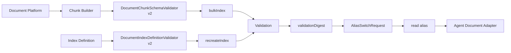

# 文档语料接入与 ES v2 索引治理能力 L2 实施详细设计 v2.0

## 1. 文档信息

| 项目 | 内容 |
|---|---|
| 文档名称 | 文档语料接入与 ES v2 索引治理能力 L2 实施详细设计 |
| 文档路径 | `docs/design/P2_V2/01_文档语料接入与ES_v2索引治理能力_L2实施详细设计_v2.0.md` |
| 文档状态 | Approved |
| 当前版本 | v2.0 |
| 作者 | Codex |
| 创建日期 | 2026-07-09 |
| 最后更新日期 | 2026-07-09 |
| 适用范围 | 文档语料接入、ES v2 mapping、analyzer、dense_vector、metadata overlay、chunk 策略标识、alias 灰度切换和回滚 |
| 上级文档 | `docs/design/Agent目标架构总览_v1.0.md`、`docs/design/Agent契约与规划架构设计_v1.0.md`、`docs/design/Agent元数据与上下文安全架构设计_v1.0.md` |
| 关联文档 | `docs/design/P2/01_文档语料接入与索引治理能力_L2实施详细设计_v1.0.md`、`docs/design/P2_V2/09_统一文档检索编排与多路召回_L2实施详细设计_v2.0.md` |
| 是否可作为实现依据 | 是；已通过 design-doc-review，可作为 ES v2 索引治理实现依据 |

## 2. 修改历史

| 序号 | 日期 | 位置 | 修改原因 | 修改内容 |
|---:|---|---|---|---|
| 1 | 2026-07-09 | 全文 | P2_V2 同步更新 | 在旧 P2 01 基础上补充 ES v2 mapping、资料域/资料类型字段、检索 profile 字段、chunk 策略和 alias 灰度门禁 |
| 2 | 2026-07-09 | 第 5、10、12、22、24 章 | design-doc-review 评审修复 | 统一 `retrievalProfile` 写入必填口径，明确源语料可缺省但入索引前必须由 Java/profile 归一化补齐；修正 rerank 关联边界和评审记录 |

## 3. 文档状态说明

| 状态 | 含义 | 是否可作为开发依据 |
|---|---|---:|
| Draft | 草稿，内容尚未完成完整评审 | 否 |
| In Review | 评审中，内容可能继续调整 | 否 |
| Approved | 已评审通过，可作为实现依据 | 是 |
| Implementing | 已进入实现阶段 | 是 |
| Implemented | 已完成实现，并已与设计对齐 | 是 |
| Deprecated | 已废弃，不再作为实现依据 | 否 |

当前状态：Approved。

## 4. 背景与目标

旧 P2 01 已覆盖文档 chunk schema、mapping 校验、rebuild、validation digest、read alias 切换和回滚。P2_V2 检索目标要求不同资料域和资料类型使用可配置 mapping、analyzer、dense_vector 字段、chunk 策略和检索 profile，因此索引治理必须从“通用 document chunk”升级为“ES v2 可检索语料模型”。

目标：

1. 为 `domain/materialType/retrievalProfile` 提供索引字段和校验门禁。
2. 支持 BM25、exact、phrase、dense_vector 多通道召回所需字段。
3. 支持资料域差异化 analyzer 和 chunk 策略标识。
4. 保持 alias 灰度切换、validation digest 和 rollback 机制。
5. 确保 ACL、安全投影、状态过滤字段在 v2 索引中仍为必填。

## 5. 设计范围

### 5.1 范围内

| 范围项 | 说明 |
|---|---|
| ES v2 mapping | 增加 `domain`、`materialType`、`retrievalProfile`、政策文号、机关、税种、有效性等字段 |
| analyzer | 设计按资料域/资料类型可扩展的 analyzer 命名和校验方式 |
| chunk 策略 | 增加 `chunkStrategy`、`chunkVersion`、`parentSectionId` 等诊断字段 |
| dense_vector | 校验 `embedding` 维度、字段名和 profile 绑定关系 |
| alias 灰度 | 使用 v2 read alias 与旧索引并行验证后切换 |
| validation | 增加 sample query、ACL 正反例、profile 字段完整性检查 |

### 5.2 范围外

| 范围外项 | 原因 |
|---|---|
| 检索通道执行 | 由 P2_V2 04 负责 |
| profile 选择逻辑 | 由 P2_V2 02 负责 |
| ACL 权威源 | 由 P2_V2 03 负责 |
| rerank Provider | 由 P2_V2 04 负责 |

## 6. 上级文档约束

| 约束 | 本文承接方式 |
|---|---|
| Java 是契约和执行权威 | mapping validator 使用 Java 代码校验，不依赖 Runtime 判断索引合法性 |
| Runtime 不可信 | Runtime 不接收 index alias、mapping、ACL 字段和 analyzer 细节 |
| Domain metadata 是字段事实源 | v2 mapping 字段必须能被 Domain Metadata/profile 引用 |
| 安全投影必须 fail closed | 缺 ACL/status/tenant/corpus 字段时拒绝写入和切换 |

## 7. 关联文档与边界

| 关联文档 | 关联内容 | 本文档职责 | 对方职责 | 边界说明 |
|---|---|---|---|---|
| P2 01 v1 | 旧索引治理基线 | 增量定义 v2 字段和验证 | 保留旧基线说明 | 不修改旧 P2 文件 |
| P2_V2 02 | profile 配置 | 提供可被 profile 引用的字段和 alias | 定义 profile 选择和字段权重 | mapping 不保存策略 |
| P2_V2 03 | ACL 检索 | 提供 ACL 字段和 validation | 定义 ACL filter | mapping 不保存权限表达式 |
| P2_V2 04 | 多路召回 | 提供 BM25/exact/phrase/vector 字段 | 定义查询 DSL 和 RRF | 索引治理不执行检索 |
| P2_V2 08 | 验证回滚 | 提供 validation 门禁输入 | 统一运行保障 | validation 结果进入 08 汇总 |

## 8. 设计边界与约束

1. 文档索引命名继续受 `EsQueryProperties.documentIndexPrefixes` 约束。
2. v2 物理索引不得被 Agent 直接访问，Agent 只访问 read alias。
3. v2 索引必须兼容多资料域，但不要求所有资料域使用相同 analyzer。
4. `embedding` 不得返回到 `_source` 用户响应、日志或诊断正文。
5. `validationDigest` 只证明 validation 结果和 alias switch 请求绑定，不替代权限或服务 token。

## 9. 总体设计

## 10. 详细功能设计

### 10.1 ES v2 mapping 校验

#### 10.1.1 输入与输出

| 输入 | 类型 | 说明 |
|---|---|---|
| `index` | String | 目标物理索引 |
| `indexDefinition` | Map | mappings/settings/analysis |

| 输出 | 类型 | 说明 |
|---|---|---|
| 无返回 | void | 校验失败抛出异常 |

#### 10.1.2 业务规则

1. 必填 keyword 字段：`tenantId`、`corpusId`、`domain`、`materialType`、`retrievalProfile`、`documentId`、`chunkId`、`aclRef`、`aclVersion`、`visibility`、`status`。
2. 必填排序/定位字段：`chunkIndex`、`indexVersion`、`contentHash`。
3. 检索字段：`title`、`content`、`snippet`、`section` 至少为 text；`title.keyword`、`section.keyword` 可用于 exact。
4. 政策类 metadata：`documentNo`、`issuer`、`taxType`、`effectiveDate`、`validityStatus`。
5. `embedding` 如存在必须为 `dense_vector` 且 `dims > 0`；启用 vector profile 时必须存在。
6. analyzer 名称必须在 allowlist 内，例如 `policy_text_analyzer`、`policy_phrase_analyzer`、`standard`。

### 10.2 chunk schema v2

#### 10.2.1 新增字段

| 字段 | 类型 | 必填 | 说明 |
|---|---|---:|---|
| `domain` | keyword/String | 是 | Agent domain |
| `materialType` | keyword/String | 是 | 资料类型 |
| `retrievalProfile` | keyword/String | 是 | 写入 v2 索引前必须为 Java/profile 归一化后的有效 profile；源语料可缺省但不能直接入索引 |
| `chunkStrategy` | keyword/String | 是 | chunk 策略标识 |
| `chunkVersion` | keyword/String | 是 | chunk 策略版本 |
| `parentSectionId` | keyword/String | 否 | 上级章节 |
| `documentNo` | keyword/String | 否 | 政策文号或法规编号 |
| `issuer` | keyword/String | 否 | 发布机关 |
| `taxType` | keyword/String | 否 | 税种 |
| `effectiveDate` | date/String | 否 | 生效日期 |
| `validityStatus` | keyword/String | 否 | 有效、废止、部分失效 |

#### 10.2.2 业务规则

1. `visibility=PUBLIC` 也必须携带 `tenantId/corpusId/status`。
2. `visibility=USER/DEPARTMENT/ROLE/ATTRIBUTE` 时必须携带对应投影字段。
3. 同一 `chunkId` 重复写入视为覆盖，必须保持幂等。
4. `domain/materialType` 必须与 rebuild task 的目标 corpus 一致。
5. 源语料缺少 `retrievalProfile` 时，Chunk Builder 或 Java profile resolver 必须在写入 ES 前补齐；归一化后仍缺失时 fail closed。

### 10.3 alias 灰度与回滚

1. v2 物理索引完成 rebuild 后必须先执行 validation。
2. validation 通过后才允许 `switchReadAlias`。
3. rollback 仍要求 `expectedPreviousIndex`、`targetIndex`、`validationDigest` 和 `operatorRef`。
4. alias 切换记录必须包含 `domain/materialType/indexVersion/profileVersion`。

## 11. 接口设计

| 接口 | 方法 | 路径 | 说明 |
|---|---|---|---|
| recreate index | PUT | `/es/indexes/{index}` 内部服务调用 | 创建 v2 index，触发 mapping validator |
| bulk index | POST | `/es/indexes/{index}/bulk` | 写入 v2 chunks |
| switch read alias | POST | `/es/indexes/{index}/aliases/read/switch` | 灰度切换 read alias |
| rollback read alias | POST | `/es/indexes/{index}/aliases/read/rollback` | 回滚 read alias |

接口沿用旧 P2 01，不新增外部公开 API。

## 12. 数据设计

### 12.1 v2 chunk 字段

| 字段 | ES 类型 | 是否必填 | 用途 |
|---|---|---:|---|
| `tenantId`、`corpusId`、`domain`、`materialType`、`retrievalProfile` | keyword | 是 | 租户、语料和 profile 路由 |
| `documentId`、`chunkId`、`chunkIndex` | keyword/integer | 是 | citation、去重、上下文窗口 |
| `title`、`content`、`snippet`、`section` | text + keyword 按需 | 是 | BM25/phrase/exact/evidence |
| `documentNo`、`issuer`、`taxType`、`validityStatus` | keyword | 否 | 政策/法规元数据过滤 |
| `effectiveDate` | date | 否 | 时间过滤 |
| `embedding` | dense_vector | vector profile 必需 | dense_vector 召回 |
| ACL 字段 | keyword/keyword[] | 是 | 权限过滤 |
| `chunkStrategy`、`chunkVersion`、`indexVersion` | keyword | 是 | 诊断和回滚 |

## 13. 状态流转设计

| 状态 | 进入条件 | 退出条件 |
|---|---|---|
| `INDEX_DEFINITION_READY` | v2 mapping 和 analyzer 已提交 | validator 通过 |
| `REBUILD_RUNNING` | rebuild task 启动 | 全量写入完成 |
| `VALIDATION_RUNNING` | chunk 写入完成 | validation 通过或失败 |
| `VALIDATION_PASSED` | 字段、ACL、sample query 通过 | alias switch |
| `ALIAS_SWITCHED` | read alias 指向 v2 | 稳定运行或 rollback |
| `ROLLED_BACK` | 触发回滚 | alias 回到旧索引 |

## 14. 幂等、事务与一致性设计

1. bulk 写入使用 `chunkId` 作为 `_id`，重复写入覆盖。
2. full rebuild 写入独立物理索引，成功 validation 后原子切 alias。
3. alias switch 以 ES `_aliases` 为原子边界。
4. task 状态和 ES alias 不一致时，以 ES alias 当前状态和持久化 audit 为排查入口。

## 15. 权限、风控与审计设计

1. rebuild、switch、rollback 仅允许内部管理端或服务 token 调用。
2. validation 必须覆盖 ACL 正反例。
3. alias switch 属高风险操作，必须记录 `operatorRef`、`taskId`、`validationDigest`、`expectedPreviousIndex`、`targetIndex`。
4. 审计不得记录正文、embedding 或完整 ACL 列表。

## 16. 性能与容量设计

| 项目 | 目标 |
|---|---|
| 单 chunk content | 建议 500～1200 字，按资料域可配置 |
| embedding dims | 与 Provider 配置一致 |
| rebuild 并发 | 同一 alias/corpus 同时一个 active rebuild |
| validation sample query | 每个资料域至少 10 条 gold query |
| alias switch | 低频操作，要求可回滚 |

## 17. 兼容性与扩展性设计

1. 旧 v1 read alias 不删除，v2 稳定后再考虑清理。
2. 新资料类型只增加 mapping 字段、profile 配置和 validation 样例。
3. analyzer 新增必须先进入 allowlist 和 fixture。
4. 未启用 vector profile 的资料域可以不强制写入 embedding，但 mapping 仍应支持后续扩展。

## 18. 日志、监控与告警

| 类型 | 字段 |
|---|---|
| 日志 | taskId、domain、materialType、targetIndex、alias、validationStatus |
| 指标 | rebuild duration、indexed count、validation failure、alias switch failure |
| 告警 | validation failed、alias current mismatch、rollback failed、gold query 命中率下降 |

## 19. 实现落点清单

### 19.1 Java 实现落点

| 序号 | 类型 | 路径 | 类名 | 方法名 | 入参类型 | 返回类型 | 新增/修改 | 说明 |
|---:|---|---|---|---|---|---|---|---|
| 1 | Validator | `es-query-service/src/main/java/com/dylan/esquery/service/DocumentChunkSchemaValidator.java` | `DocumentChunkSchemaValidator` | `validate` | `String index, Map<String,Object> document` | `void` | 修改 | 校验 v2 字段、资料类型、chunk 策略 |
| 2 | Validator | `es-query-service/src/main/java/com/dylan/esquery/service/DocumentIndexDefinitionValidator.java` | `DocumentIndexDefinitionValidator` | `validate` | `String index, Map<String,Object> indexDefinition` | `void` | 修改 | 校验 v2 mapping、analyzer、dense_vector |
| 3 | Service | `es-query-service/src/main/java/com/dylan/esquery/service/DocumentIndexValidationService.java` | `DocumentIndexValidationService` | `validateDocumentIndex` | `RebuildTask task` | `DocumentIndexValidationReport` | 修改 | 增加 profile 字段和 sample query 检查 |
| 4 | Service | `es-query-service/src/main/java/com/dylan/esquery/service/EsIndexAliasService.java` | `EsIndexAliasService` | `switchReadAlias` | `String alias, AliasSwitchRequest request` | `void` | 修改 | audit 增加 profileVersion/materialType |

### 19.2 Python 实现落点

本文不涉及 Python 运行时代码。

### 19.3 脚本与配置落点

| 序号 | 类型 | 路径 | 文件名 | 脚本 / 配置项 | 入参 / 参数 | 输出 / 效果 | 新增/修改 | 说明 |
|---:|---|---|---|---|---|---|---|---|
| 1 | Fixture | `es-query-service/src/test/resources/fixtures/document` | `valid-document-index-definition-v2.json` | v2 mapping | 无 | mapping 校验输入 | 新增 | 覆盖 v2 字段 |
| 2 | Fixture | `es-query-service/src/test/resources/fixtures/document` | `valid-document-chunk-v2.json` | v2 chunk | 无 | chunk 校验输入 | 新增 | 覆盖资料类型和 ACL |

### 19.4 测试落点

| 序号 | 测试类型 | 路径 | 测试类 / 文件 | 测试方法 / 用例 | 验证目标 | 新增/修改 |
|---:|---|---|---|---|---|---|
| 1 | Unit | `es-query-service/src/test/java/com/dylan/esquery/service/DocumentChunkSchemaValidatorTest.java` | `DocumentChunkSchemaValidatorTest` | `acceptsV2Chunk`、`rejectsMissingMaterialType` | v2 chunk schema | 修改 |
| 2 | Unit | `es-query-service/src/test/java/com/dylan/esquery/service/DocumentIndexDefinitionValidatorTest.java` | `DocumentIndexDefinitionValidatorTest` | `acceptsV2Mapping`、`rejectsUnknownAnalyzer` | v2 mapping | 修改 |
| 3 | Unit | `es-query-service/src/test/java/com/dylan/esquery/service/EsIndexAliasServiceTest.java` | `EsIndexAliasServiceTest` | `switchesV2AliasAfterValidation` | alias 灰度门禁 | 修改 |

## 20. 测试设计

| 测试类型 | 验证内容 |
|---|---|
| 单元测试 | v2 chunk/mapping/analyzer/dense_vector 校验 |
| 集成测试 | rebuild、validation、alias switch、rollback |
| 权限测试 | ACL 正反例 sample query |
| 回归测试 | 旧 v1 mapping fixture 不受影响 |

## 21. 风险与待确认事项

| 序号 | 类型 | 内容 | 影响 | 建议处理方式 | 是否阻塞 |
|---:|---|---|---|---|---|
| 1 | analyzer | 税务政策分词词典尚未确认 | 影响召回质量 | 先固定 analyzer allowlist，生产词典另行确认 | 否 |
| 2 | embedding | 各资料域 embedding 维度可能不同 | 影响 vector profile | profile 绑定 embeddingField/dims，validation fail closed | 否 |
| 3 | validation | gold query 样本尚未落库 | 影响质量度量 | 由 P2_V2 08 维护 gold query 清单 | 否 |

## 22. 评审记录

| 轮次 | 日期 | 评审结论 | 发现问题数 | 修正问题数 | 遗留问题 | 说明 |
|---:|---|---|---:|---:|---|---|
| 1 | 2026-07-09 | 通过 | 0 | 0 | 无 | 已完成 design-doc-review，评审报告见同目录 `_评审报告.md` |
| 2 | 2026-07-09 | 修正后通过 | 2 | 2 | 无 | 本轮修正 `retrievalProfile` 必填性前后不一致、rerank 关联边界表述不准确问题 |

## 23. 实施对齐检查

| 检查项 | 设计要求 | 实现位置 | 是否满足 | 说明 |
|---|---|---|---|---|
| ES v2 mapping | 必含 domain/materialType/profile/metadata/ACL/embedding | `DocumentIndexDefinitionValidator` | 待实现 | 代码阶段落实 |
| chunk v2 | 必含 chunk 策略和资料类型 | `DocumentChunkSchemaValidator` | 待实现 | 代码阶段落实 |
| alias 灰度 | validation 后 switch，可 rollback | `EsIndexAliasService` | 待实现 | 沿用旧机制增强 |
| validation | sample query 与 ACL 正反例 | `DocumentIndexValidationService` | 待实现 | 与 P2_V2 08 对齐 |

## 24. 完成摘要

| 项目 | 内容 |
|---|---|
| 目标文档 | `docs/design/P2_V2/01_文档语料接入与ES_v2索引治理能力_L2实施详细设计_v2.0.md` |
| 文档状态 | Approved |
| 是否可作为实现依据 | 是 |
| 评审轮次 | 2 |
| 主要修改内容 | 补充 ES v2 mapping、资料域/资料类型字段、chunk 策略、dense_vector、alias 灰度和 validation 门禁；本轮同步修正 profile 写入必填口径 |
| 是否已追加修改历史 | 是 |
| 是否已补充实现落点清单 | 是 |
| 是否存在阻塞问题 | 否 |
| 是否存在遗留风险 | 是 |
| 是否需要用户进一步授权 | 否 |
| 建议下一步 | 进入代码实现前，与 P2_V2 02/04/08 的 profile、召回与验证门禁保持字段一致 |
