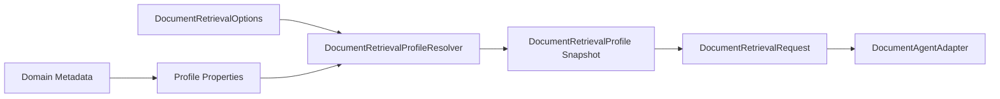

# 资料域资料类型 Profile 配置能力 L2 实施详细设计 v2.0

## 1. 文档信息

| 项目 | 内容 |
|---|---|
| 文档名称 | 资料域资料类型 Profile 配置能力 L2 实施详细设计 |
| 文档路径 | `docs/design/P2_V2/02_资料域资料类型Profile配置能力_L2实施详细设计_v2.0.md` |
| 文档状态 | Approved |
| 当前版本 | v2.0 |
| 作者 | Codex |
| 创建日期 | 2026-07-09 |
| 最后更新日期 | 2026-07-09 |
| 适用范围 | 文档资料域、资料类型、检索 profile、index alias、字段权重、召回通道、rerank 和去重配置 |
| 上级文档 | `docs/design/Agent目标架构总览_v1.0.md`、`docs/design/Agent元数据与上下文安全架构设计_v1.0.md` |
| 关联文档 | `docs/design/P2/02_文档领域元数据与Capability配置能力_L2实施详细设计_v1.0.md`、`docs/design/P2_V2/01_文档语料接入与ES_v2索引治理能力_L2实施详细设计_v2.0.md`、`docs/design/P2_V2/09_统一文档检索编排与多路召回_L2实施详细设计_v2.0.md` |
| 是否可作为实现依据 | 是；已通过 design-doc-review，可作为 profile 配置实现依据 |

## 2. 修改历史

| 序号 | 日期 | 位置 | 修改原因 | 修改内容 |
|---:|---|---|---|---|
| 1 | 2026-07-09 | 全文 | P2_V2 同步更新 | 在旧 P2 02 基础上补充 `domain + materialType + retrievalProfile + indexAlias` 配置模型 |
| 2 | 2026-07-09 | 第 10、12、19、20、22、24 章 | design-doc-review 评审修复 | 补充 `profileVersion` 派生和冻结规则，修正 profile 启动校验落点为 `AgentPropertiesValidator` |

## 3. 文档状态说明

| 状态 | 含义 | 是否可作为开发依据 |
|---|---|---:|
| Draft | 草稿，内容尚未完成完整评审 | 否 |
| In Review | 评审中，内容可能继续调整 | 否 |
| Approved | 已评审通过，可作为实现依据 | 是 |
| Implementing | 已进入实现阶段 | 是 |
| Implemented | 已完成实现，并已与设计对齐 | 是 |
| Deprecated | 已废弃，不再作为实现依据 | 否 |

当前状态：Approved。

## 4. 背景与目标

旧 P2 02 已定义 `DOCUMENT_RETRIEVABLE` domain metadata、capability 配置和 `index-by-domain`。P2_V2 要求同一 Java 检索入口支持税务政策、公司政策、国家法律、通知、办法、问答等资料类型，并通过配置承载不同 mapping、analyzer、dense_vector 字段、chunk 策略和召回策略。

目标：

1. 保持 Domain Metadata 为字段事实源。
2. 新增 retrieval profile 作为检索策略配置，不成为第二字段事实源。
3. 允许 `domain + materialType` 选择 profile。
4. 支持 profile 绑定 index alias、召回通道、字段权重、RRF、去重和 rerank。
5. 配置缺失时 fail closed。

## 5. 设计范围

### 5.1 范围内

| 范围项 | 说明 |
|---|---|
| 资料域 | `tax_policy`、`company_policy`、`law`、`knowledge_base` 等 domain |
| 资料类型 | `policy`、`notice`、`measure`、`faq`、`law` 等 materialType |
| profile | profile 名称、允许资料类型、index alias、通道和参数 |
| 启动校验 | enabled=true 时校验 profile、domain、adapter registration、alias |
| Java 解析 | `DocumentRetrievalProfileResolver` 冻结单次 invocation profile |

### 5.2 范围外

| 范围外项 | 原因 |
|---|---|
| ES DSL 生成 | 由 P2_V2 04 的 mapper 负责 |
| mapping 校验 | 由 P2_V2 01 负责 |
| ACL filter | 由 P2_V2 03 负责 |
| Runtime Prompt 硬编码资料类型 | 违反 Runtime 不可信和 descriptor-driven 规则 |

## 6. 上级文档约束

| 约束 | 本文承接方式 |
|---|---|
| 新 Domain 不修改 Agent 主流程 | 资料域和资料类型只通过 metadata/profile 配置增加 |
| Canonical Domain Field Catalog 是事实源 | profile 只引用字段，不重新声明字段含义和权限 |
| Policy/Profile 只能收紧权限 | retrieval profile 不扩大用户 capability/domain 权限 |
| Runtime 不可信 | Runtime 只接收安全投影，不决定 profile 和 alias |

## 7. 关联文档与边界

| 关联文档 | 关联内容 | 本文档职责 | 对方职责 | 边界说明 |
|---|---|---|---|---|
| P2 02 v1 | domain metadata 和 capability 配置 | 增量定义 retrieval profile | 旧配置基线 | 不修改旧文档 |
| P2_V2 01 | ES v2 字段和 alias | 引用 index alias 和字段 | 定义 mapping 和 validation | profile 不校验 ES 结构 |
| P2_V2 03 | ACL | 确保 profile 不绕过 ACL | 定义 ACL filter | profile 不保存权限表达式 |
| P2_V2 04 | 多路召回 | 提供策略配置 | 执行通道和融合 | profile 不执行检索 |

## 8. 设计边界与约束

1. `domain` 仍是 Agent domain，`materialType` 是该 domain 下的资料类型。
2. profile 可以绑定多个 materialType，但一个 `domain + materialType` 默认只能解析到一个 profile。
3. 显式请求 `retrievalProfile` 必须在该 domain 的 allowlist 内。
4. profile 的字段必须存在于 Domain Metadata 可检索字段或 ES v2 mapping 中。
5. profile 配置 reload 必须生成新版本，单次 invocation 使用冻结快照。

## 9. 总体设计



## 10. 详细功能设计

### 10.1 profile 配置模型

#### 10.1.1 配置示例

```yaml
agent:
  document:
    retrieval-profiles:
      tax_policy_default:
        domain: tax_policy
        material-types: [policy, notice, measure, faq]
        index-alias: agent-doc-tax-policy-read
        channels:
          - channel: EXACT
            size: 20
            fields: [documentNo.keyword, title.keyword, issuer.keyword]
            required: false
          - channel: PHRASE
            size: 20
            fields: [title^3, content, section]
            required: false
          - channel: BM25
            size: 40
            fields: [title^3, snippet^2, content, section]
            required: true
          - channel: DENSE_VECTOR
            size: 40
            embedding-field: embedding
            required: false
        rrf:
          k: 60
          top-k: 20
        dedup:
          document-level: true
          max-chunks-per-document: 1
        rerank:
          enabled: false
          candidate-size: 20
```

`profileVersion` 不要求人工配置，由 Java 在配置加载或 reload 时基于 profile 内容摘要、配置版本或 reload 序号派生。派生后的版本必须写入 `DocumentRetrievalProfile` 快照、检索诊断、gold query 验证和 alias/回滚审计。

### 10.2 profile 解析

#### 10.2.1 输入与输出

| 输入 | 类型 | 说明 |
|---|---|---|
| `domain` | String | 来自 execution domain projection |
| `materialType` | String | 来自 plan option 或 Java 规则抽取 |
| `requestedProfile` | String | 可选显式 profile |

| 输出 | 类型 | 说明 |
|---|---|---|
| `DocumentRetrievalProfile` | value object | 冻结后的 profile，必须携带 `profileVersion` |

#### 10.2.2 业务规则

1. `requestedProfile` 非空时，必须存在且 domain 匹配。
2. `materialType` 非空时，必须包含在 profile materialTypes 内。
3. 无匹配 profile 时抛出 `IllegalArgumentException`。
4. channel size、rrfK、topK、rerank candidateSize 必须在系统上限内。
5. 启用 DENSE_VECTOR 通道时，profile 必须声明 embeddingField。
6. 每次解析必须返回单次 invocation 冻结的 `profileVersion`；reload 后新请求使用新版本，已开始请求继续使用旧快照。

### 10.3 启动和 reload 校验

1. `agent.document.enabled=true` 时至少存在一个 document domain、adapter registration 和 retrieval profile。
2. 每个 profile 的 domain 必须存在于 Domain Metadata。
3. `indexAlias` 必须非空，并与 adapter 可访问 alias 配置一致。
4. profile 字段不存在时启动 fail closed。

## 11. 接口设计

本文不新增外部 HTTP API。内部配置契约如下：

| 配置项 | 类型 | 说明 |
|---|---|---|
| `agent.document.retrieval-profiles.<name>.domain` | String | profile 所属 domain |
| `agent.document.retrieval-profiles.<name>.material-types` | List | 支持资料类型 |
| `agent.document.retrieval-profiles.<name>.index-alias` | String | read alias |
| `agent.document.retrieval-profiles.<name>.channels` | List | 多路召回通道 |
| `agent.document.retrieval-profiles.<name>.rrf.k` | int | RRF 参数 |
| `agent.document.retrieval-profiles.<name>.dedup.document-level` | boolean | 是否文档级去重 |
| `agent.document.retrieval-profiles.<name>.rerank.enabled` | boolean | 是否启用 rerank |

## 12. 数据设计

| 类 | 字段 | 说明 |
|---|---|---|
| `RetrievalProfileProperties` | `domain/materialType/retrievalProfile/profileVersion/indexAlias/channels/channelWeights/keywordK/exactK/phraseK/vectorK/rrfK/maxChunksPerDocument/rerank` | 配置对象 |
| `DocumentRetrievalProfile` | `domain/materialType/retrievalProfile/profileVersion/indexAlias/hybridOptions` | 冻结快照 |
| `DocumentHybridOptions` | `channels/channelWeights/keywordK/exactK/phraseK/vectorK/rrfK/maxChunksPerDocument/embeddingField/rerankEnabled/rerankTopN` | 单次请求使用的通道、融合、去重和 rerank 配置 |

## 13. 状态流转设计

| 状态 | 进入条件 | 退出条件 |
|---|---|---|
| `PROFILE_CONFIG_LOADED` | 配置加载 | 校验通过 |
| `PROFILE_VALIDATED` | domain、fields、alias 校验通过 | 可用于请求 |
| `PROFILE_RESOLVED` | 请求解析到 profile | 注入 `DocumentRetrievalRequest` |
| `PROFILE_REJECTED` | 配置或请求不合法 | fail closed |

## 14. 幂等、事务与一致性设计

1. profile reload 以配置快照为单位，不在单次 invocation 内变更。
2. 同一 domain/materialType/profile 在同一版本下解析结果确定。
3. 不涉及数据库事务。

## 15. 权限、风控与审计设计

1. profile 只能收紧检索策略，不能授予 capability/domain 权限。
2. 不允许 profile 配置跳过 ACL filter。
3. 审计记录 profile 名称和版本，不记录完整字段权重细节。

## 16. 性能与容量设计

| 项目 | 目标 |
|---|---|
| profile 数量 | 首版低双位数 |
| channel 数量 | 每 profile 1～4 个 |
| 解析耗时 | 进程内 map 查找，低毫秒级 |
| reload | 配置变更时 fail fast |

## 17. 兼容性与扩展性设计

1. 旧请求不传 `materialType/retrievalProfile` 时使用 domain 默认 profile。
2. 新资料类型只新增 profile 配置。
3. 新通道类型先由 P2_V2 04 定义执行能力，再进入 profile allowlist。

## 18. 日志、监控与告警

| 类型 | 字段 |
|---|---|
| 日志 | domain、materialType、profile、profileVersion、channelCount |
| 指标 | profile resolve success/failure、missing profile、invalid field |
| 告警 | enabled=true 但无可用 profile、profile 字段失效 |

## 19. 实现落点清单

### 19.1 Java 实现落点

| 序号 | 类型 | 路径 | 类名 | 方法名 | 入参类型 | 返回类型 | 新增/修改 | 说明 |
|---:|---|---|---|---|---|---|---|---|
| 1 | Config | `agent-service/src/main/java/com/dylan/agent/config/AgentProperties.java` | `AgentProperties.DocumentProperties` | getter/setter | `Map<String, RetrievalProfileProperties> retrievalProfiles` | JavaBean | 修改 | profile 配置入口 |
| 2 | Config | 同上 | `RetrievalProfileProperties` | getter/setter | YAML fields | JavaBean | 新增 | profile 配置模型 |
| 3 | Service | `agent-service/src/main/java/com/dylan/agent/capability/document/DocumentRetrievalProfileResolver.java` | `DocumentRetrievalProfileResolver` | `resolve` | `String domain, String materialType, String requestedProfile` | `DocumentRetrievalProfile` | 新增 | 解析 profile |
| 4 | Validator | `agent-service/src/main/java/com/dylan/agent/config/AgentPropertiesValidator.java` | `AgentPropertiesValidator` | `afterPropertiesSet` | `AgentProperties properties` | `void` | 修改 | 启动校验 profile 与 document 配置；Domain Metadata 字段存在性由 metadata validator 提供事实源 |
| 5 | Validator | `agent-service/src/main/java/com/dylan/agent/capability/document/DocumentPlanValidator.java` | `DocumentPlanValidator` | `validate` | `DocumentAgentPlan rawPlan, ExecutionValidationContext context` | `ValidatedDocumentPlan` | 修改 | 将 profile snapshot 注入请求 |

### 19.2 Python 实现落点

| 序号 | 类型 | 路径 | 文件名 | 函数 / 类名 | 入参类型 | 返回类型 | 新增/修改 | 说明 |
|---:|---|---|---|---|---|---|---|---|
| 1 | Generated Model | `agent-runtime/app/contracts/generated_models.py` | `generated_models.py` | `DocumentRetrievalOptions` | generated | Pydantic model | 生成物更新 | 只由 Java/OpenAPI 生成 |

### 19.3 脚本与配置落点

| 序号 | 类型 | 路径 | 文件名 | 脚本 / 配置项 | 入参 / 参数 | 输出 / 效果 | 新增/修改 | 说明 |
|---:|---|---|---|---|---|---|---|---|
| 1 | YAML | `agent-service/src/main/resources/application.yml` | `application.yml` | `agent.document.retrieval-profiles` | profile map | 本地 profile | 修改 | 默认仍关闭文档能力 |

### 19.4 测试落点

| 序号 | 测试类型 | 路径 | 测试类 / 文件 | 测试方法 / 用例 | 验证目标 | 新增/修改 |
|---:|---|---|---|---|---|---|
| 1 | Unit | `agent-service/src/test/java/com/dylan/agent/capability/document/DocumentRetrievalProfileResolverTest.java` | `DocumentRetrievalProfileResolverTest` | `resolvesDomainMaterialTypeProfile` | profile 正常解析 | 新增 |
| 2 | Unit | 同上 | 同上 | `rejectsProfileOutsideDomain` | profile 越权拒绝 | 新增 |
| 3 | Unit | `agent-service/src/test/java/com/dylan/agent/capability/document/DocumentPlanValidatorTest.java` | `DocumentPlanValidatorTest` | `addsProfileSnapshotToRequest` | request 冻结 profile | 修改 |

## 20. 测试设计

| 测试类型 | 验证内容 |
|---|---|
| 单元测试 | profile 路由、`profileVersion` 冻结、字段校验、缺失配置 fail closed |
| 契约测试 | `DocumentRetrievalOptions` 可选字段兼容 |
| 配置测试 | enabled=true 时 profile/domain/adapter 完整性 |

## 21. 风险与待确认事项

| 序号 | 类型 | 内容 | 影响 | 建议处理方式 | 是否阻塞 |
|---:|---|---|---|---|---|
| 1 | 资料类型枚举 | 税务政策、通知、办法、问答的最终编码需确认 | 影响 profile 命名 | 首版使用配置字符串，后续可收敛枚举 | 否 |
| 2 | 字段权重 | 不同资料域字段权重需通过 gold query 调优 | 影响召回质量 | 由 P2_V2 08 验证闭环 | 否 |

## 22. 评审记录

| 轮次 | 日期 | 评审结论 | 发现问题数 | 修正问题数 | 遗留问题 | 说明 |
|---:|---|---|---:|---:|---|---|
| 1 | 2026-07-09 | 通过 | 0 | 0 | 无 | 已完成 design-doc-review，评审报告见同目录 `_评审报告.md` |
| 2 | 2026-07-09 | 修正后通过 | 2 | 2 | 无 | 本轮修正 `profileVersion` 未进入数据结构、启动校验类落点不准确问题 |

## 23. 实施对齐检查

| 检查项 | 设计要求 | 实现位置 | 是否满足 | 说明 |
|---|---|---|---|---|
| profile 配置 | domain/materialType/profile/indexAlias/channels | `AgentProperties.DocumentProperties` | 待实现 | 代码阶段落实 |
| profile 解析 | 请求级冻结快照 | `DocumentRetrievalProfileResolver` | 待实现 | 代码阶段落实 |
| Runtime 不可信 | Runtime 不选择 profile | `DocumentPlanValidator` | 待实现 | Java 侧解析 |

## 24. 完成摘要

| 项目 | 内容 |
|---|---|
| 目标文档 | `docs/design/P2_V2/02_资料域资料类型Profile配置能力_L2实施详细设计_v2.0.md` |
| 文档状态 | Approved |
| 是否可作为实现依据 | 是 |
| 评审轮次 | 2 |
| 主要修改内容 | 补充资料域、资料类型、retrievalProfile、indexAlias、召回通道和 rerank/去重配置设计；本轮补充 `profileVersion` 派生/冻结规则 |
| 是否已追加修改历史 | 是 |
| 是否已补充实现落点清单 | 是 |
| 是否存在阻塞问题 | 否 |
| 是否存在遗留风险 | 是 |
| 是否需要用户进一步授权 | 否 |
| 建议下一步 | 进入代码实现前，与 P2_V2 01/03/04/07/08 的字段、权限和诊断口径保持一致 |
