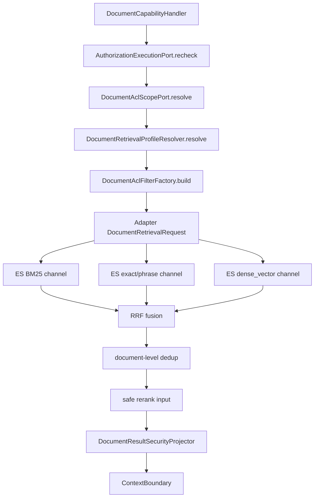

# 多通道权限感知检索能力 L2 实施详细设计 v2.0

## 1. 文档信息

| 项目 | 内容 |
|---|---|
| 文档名称 | 多通道权限感知检索能力 L2 实施详细设计 |
| 文档路径 | `docs/design/P2_V2/03_多通道权限感知检索能力_L2实施详细设计_v2.0.md` |
| 文档状态 | Approved |
| 当前版本 | v2.0 |
| 作者 | Codex |
| 创建日期 | 2026-07-09 |
| 最后更新日期 | 2026-07-09 |
| 适用范围 | 文档检索权限快照、ACL scope、ES 多通道召回过滤、融合后安全投影、rerank 输入安全约束、撤权复检 |
| 上级文档 | `docs/design/Agent目标架构总览_v1.0.md`、`docs/design/Agent契约与规划架构设计_v1.0.md`、`docs/design/Agent元数据与上下文安全架构设计_v1.0.md` |
| 关联文档 | `docs/design/P2/03_权限感知检索能力_L2实施详细设计_v1.0.md`、`docs/design/P2_V2/02_资料域资料类型Profile配置能力_L2实施详细设计_v2.0.md`、`docs/design/P2_V2/04_BM25_exact_phrase_dense_vector_RRF_rerank检索能力_L2实施详细设计_v2.0.md`、`docs/design/P2_V2/09_统一文档检索编排与多路召回_L2实施详细设计_v2.0.md` |
| 是否可作为实现依据 | 是 |

## 2. 修改历史

| 序号 | 日期 | 位置 | 修改原因 | 修改内容 |
|---:|---|---|---|---|
| 1 | 2026-07-09 | 全文 | P2_V2 同步更新 | 在旧 P2 03 基础上补充多通道召回、profile/indexAlias、RRF、rerank 和 document-level 去重下的权限边界 |
| 2 | 2026-07-09 | 第 8、10、19、20、22、24 章 | design-doc-review 评审修复 | 明确 rerank 前使用候选级安全投影，最终仍走 `DocumentResultSecurityProjector`；修正 `DocumentAclFilterFactory` 方法签名 |

## 3. 文档状态说明

| 状态 | 含义 | 是否可作为开发依据 |
|---|---|---:|
| Draft | 草稿，内容尚未完成完整评审 | 否 |
| In Review | 评审中，内容可能继续调整 | 否 |
| Approved | 已评审通过，可作为实现依据 | 是 |
| Implementing | 已进入实现阶段 | 是 |
| Implemented | 已完成实现，并已与设计对齐 | 是 |
| Deprecated | 已废弃，不再作为实现依据 | 否 |

当前状态：Approved。

## 4. 背景与目标

旧 P2 03 已定义执行阶段授权复检、ACL scope request、ES 过滤和 Context 安全写入。P2_V2 引入 BM25、exact/phrase、dense_vector 多通道召回、RRF 融合、document-level 去重和可选 rerank 后，权限过滤不能只停留在单一路径；每一路召回、融合输入、rerank 输入和最终返回都必须保持相同权限边界。

本文目标：

1. 明确 Java 是权限、ACL、安全投影和执行计划权威。
2. 明确 Runtime 不可信，不能生成权限过滤、索引选择、profile 选择或最终执行计划。
3. 明确多通道召回必须全部带同一份 Java 生成的 ACL filter。
4. 明确 RRF、去重和 rerank 只能处理已通过权限过滤的候选。
5. 明确撤权复检、审计和诊断字段在 P2_V2 中的新增口径。

## 5. 设计范围

| 范围 | 本文是否覆盖 | 说明 |
|---|---:|---|
| 执行阶段授权复检 | 是 | 沿用 `AuthorizationExecutionPort`，新增 profile/indexAlias 交叉校验 |
| ACL scope 解析 | 是 | 沿用 `DocumentAclScopePort`，输出不可扩权 |
| ES 多通道过滤 | 是 | BM25、exact/phrase、dense_vector 均必须带 ACL filter |
| RRF/去重权限边界 | 是 | 融合输入必须是已过滤候选，去重不得合并越权 chunk |
| rerank 权限边界 | 是 | rerank 仅接收安全投影字段，不接收全文或 ACL 明细 |
| Runtime LLM 改写 | 只定义边界 | 具体改写接入由 P2_V2 07 负责 |
| gold query 验证 | 只定义权限指标 | 样本和门禁由 P2_V2 08 负责 |

## 6. 上级文档约束

| 约束 | 落地方式 |
|---|---|
| Java 是契约、校验、权限、执行权威 | 权限快照、ACL filter、profile 和 indexAlias 均由 Java 生成 |
| Runtime 不可信 | Runtime 只能返回候选改写，不能返回 ES DSL、ACL filter 或执行计划 |
| 最小权限 | profile scope、domain scope、ACL scope 和 metadata filter 做交集 |
| 安全投影 | Context 和 rerank 输入只包含 citation-safe 字段 |
| 撤权可生效 | 执行阶段复检 permissionVersion 和 permissionEvidenceId |

## 7. 关联文档与边界

| 文档 | 本文依赖 | 本文不修改 |
|---|---|---|
| P2_V2 01 | v2 chunk 必含 ACL、domain、materialType、indexAlias 字段 | mapping/analyzer 细节 |
| P2_V2 02 | profile 解析结果和 indexAlias 白名单 | profile 配置模型 |
| P2_V2 04 | 多通道召回、RRF、rerank 调用点 | 算法和打分公式 |
| P2_V2 07 | LLM 改写候选不可信 | LLM/Embedding Provider 协议 |
| P2_V2 08 | 权限验证、撤权验证、审计指标 | gold query 样本管理 |

## 8. 设计边界与约束

1. ACL filter 必须由 Java 根据 `ExecutionScope`、`AuthorizationSnapshot`、`DocumentAclScopePort` 和 profile 交集生成。
2. `indexAlias` 只能来自 profile 解析结果，不接受 Runtime、用户自然语言或前端直传覆盖。
3. ES 服务只执行 Java 传入的 filter，不得在服务内扩大权限集合。
4. RRF 融合不得把不同权限证据或不同 alias 的命中合并为同一候选。
5. document-level 去重必须保留最高安全证据，并记录参与融合的 channel 诊断，不输出被过滤 chunk。
6. rerank 的输入必须先经过候选级安全投影，只允许 citation-safe 摘要、标题、chunk snippet、metadata 摘要和分数，不允许全文、ACL 明细、用户权限集合；rerank 后最终结果仍必须经过 ResultSecurity。
7. 所有审计和诊断不得记录完整 userIds/departments/documentIds 列表；只允许记录 hash、版本和计数。

## 9. 总体设计

## 10. 详细功能设计

### 10.1 权限快照复检

| 步骤 | 输入 | 输出 | 失败策略 |
|---|---|---|---|
| 规划快照读取 | `AuthorizationSnapshot` | 冻结权限证据 | 缺失则拒绝执行 |
| 执行阶段复检 | `InvocationHandle` | `ExecutionScope` | 当前权限不覆盖冻结范围则拒绝 |
| profile 交叉校验 | `domain/materialType/retrievalProfile` | profile scope | profile 不在权限域内则拒绝 |
| alias 绑定 | profile | `indexAlias` | 未配置或越权 alias 则拒绝 |

### 10.2 ACL filter 生成

`DocumentAclFilterFactory` 负责把权限交集转为 ES filter：

| filter 类型 | 来源 | 说明 |
|---|---|---|
| tenant/org | `ExecutionScope` | 必选 |
| domain/materialType | profile 与计划交集 | 必选 |
| aclRef/aclVersion | `DocumentAclScopePort` | 必选 |
| status/effectiveDate | Java 规则抽取和 profile 默认值 | 可选但由 Java 控制 |
| documentId/blocklist | 撤权和风控本地拦截 | 可选 |

### 10.3 多通道权限一致性

| 通道 | 必须携带 | 禁止行为 |
|---|---|---|
| BM25 | 相同 `filter`、`indexAlias`、`profileVersion` | 单独放宽字段范围 |
| exact/phrase | 相同 `filter`、`indexAlias`、`profileVersion` | 命中文号后绕过 ACL |
| dense_vector | 相同 `filter`、`indexAlias`、`profileVersion` | 先向量召回再 Java 过滤大量越权全文 |

### 10.4 融合、去重与 rerank 安全

1. RRF 输入必须是通道内已过滤候选。
2. 同一 document 多 chunk 去重时，只能合并相同 permissionEvidenceId、indexAlias、profileVersion 的候选。
3. rerank 输入必须由 `DocumentEvidencePreSecurityFilter` 或等价候选级安全投影构造，禁止把完整正文、ACL 明细或 queryVector 传入 rerank provider。
4. rerank 输出只能改变排序和分数解释，不能新增候选、扩大 topK 或修改 citation 内容。
5. rerank 后的最终用户响应和 Context 写入仍必须经过 `DocumentResultSecurityProjector`。

## 11. 接口设计

### 11.1 `DocumentRetrievalRequest` 权限字段

| 字段 | 类型 | 必填 | 来源 | 说明 |
|---|---|---:|---|---|
| `domain` | String | 是 | Java profile resolver | 资料域 |
| `materialType` | String | 否 | Java profile resolver | 资料类型 |
| `retrievalProfile` | String | 是 | Java profile resolver | 冻结 profile |
| `indexAlias` | String | 是 | Java profile resolver | 检索 alias |
| `profileVersion` | String | 是 | Java profile resolver | 配置版本 |
| `aclScope` | `DocumentAclScope` | 是 | Java ACL port | ACL 快照 |
| `filters` | Map | 是 | Java rules/profile | metadata filter |
| `permissionEvidenceId` | String | 是 | ExecutionScope | 审计关联 |

### 11.2 `HybridSearchRequest` 权限字段

ES API 接收 Adapter 转换后的只读权限字段：

| 字段 | 说明 |
|---|---|
| `filter` | Java 已生成的 bool filter |
| `channelFilters` | 可选；默认复用全局 filter，只允许收紧 |
| `diagnostics.permissionEvidenceId` | 审计用，不参与搜索 DSL 扩权 |
| `diagnostics.filterDigest` | 诊断用，不记录明文权限集合 |

## 12. 数据设计

| 数据项 | 保存位置 | 保留策略 |
|---|---|---|
| permissionEvidenceId | invocation audit、retrieval diagnostics | 可记录 |
| permissionVersion | invocation audit、retrieval diagnostics | 可记录 |
| aclScope digest | diagnostics | 可记录 hash |
| ACL 明细 | 不落日志 | 禁止记录 |
| 安全文本 snippet | result/context | 按 citation budget 保存 |

## 13. 状态流转设计

| 状态 | 进入条件 | 下一状态 |
|---|---|---|
| `PERMISSION_PENDING` | handler 开始执行 | `PERMISSION_RESOLVED` / `DENIED` |
| `PERMISSION_RESOLVED` | 复检和 ACL scope 成功 | `RETRIEVAL_READY` |
| `RETRIEVAL_READY` | filter 与 profile 冻结 | `RETRIEVAL_EXECUTED` |
| `RETRIEVAL_EXECUTED` | 多通道返回 | `FUSED_SAFE` |
| `FUSED_SAFE` | 融合去重完成 | `RERANK_SAFE` / `PROJECTED` |
| `PROJECTED` | 安全投影完成 | `CONTEXT_WRITTEN` |

## 14. 幂等、事务与一致性设计

1. 权限快照在单次 invocation 内只读，不在检索流程中修改。
2. `permissionEvidenceId + profileVersion + indexAlias + queryDigest` 可作为诊断幂等键。
3. alias 切换期间，已冻结请求继续使用请求内 alias；新请求按 profile 新版本解析。
4. 撤权复检 fail closed；不得退回到旧 snapshot 执行。

## 15. 权限、风控与审计设计

| 项目 | 要求 |
|---|---|
| 权限前置 | 所有召回通道都带 ACL filter |
| 权限后置 | 最终结果再次安全投影 |
| 风控 | blocklist、expired status、invalid effectiveDate 在 Java 规则内收紧 |
| 审计 | 记录 permissionEvidenceId、permissionVersion、profileVersion、indexAlias、channelCount、filterDigest |
| 禁止记录 | 用户权限全集、ACL 明细、完整正文、provider 原始 prompt |

## 16. 性能与容量设计

| 项目 | 设计 |
|---|---|
| filter 复用 | 同一次请求构建一次 filter，多通道复用 |
| filter digest | 大权限集合不进入日志，只记录摘要 |
| dense_vector 过滤 | 使用 filter + knn 组合，避免召回大量越权候选再后过滤 |
| rerank 输入 | 限制在 RRF TopN 且已安全投影 |

## 17. 兼容性与扩展性设计

1. 旧 `DocumentAclScope` 字段保持兼容，新增字段采用可选扩展。
2. 未配置 `materialType` 时按 profile 默认资料类型集合收紧。
3. 后续新增资料域只新增 profile 和 mapping，不新增权限执行分支。
4. Rerank provider 替换不影响 ACL filter 生成。

## 18. 日志、监控与告警

| 类型 | 字段 |
|---|---|
| 日志 | invocationId、domain、materialType、retrievalProfile、profileVersion、indexAlias、permissionVersion、filterDigest |
| 指标 | acl resolve latency、permission denied count、channel filter mismatch count、post projection drop count |
| 告警 | channel 未携带 filter、rerank 输入包含禁止字段、撤权复检失败率异常 |

## 19. 实现落点清单

### 19.1 Java 实现落点

| 序号 | 类型 | 路径 | 类名 | 方法名 | 入参类型 | 返回类型 | 新增/修改 | 说明 |
|---:|---|---|---|---|---|---|---|---|
| 1 | Handler | `agent-service/src/main/java/com/dylan/agent/capability/document/DocumentCapabilityHandler.java` | `DocumentCapabilityHandler` | `execute` | capability context | result payload | 修改 | 复检、profile、ACL、rerank 前安全投影编排 |
| 2 | Port | `agent-service/src/main/java/com/dylan/agent/kernel/port/AuthorizationExecutionPort.java` | `AuthorizationExecutionPort` | `recheck` | `AuthorizationSnapshot, InvocationHandle` | `ExecutionScope` | 复用 | 保持执行阶段权限权威 |
| 3 | ACL | `agent-service/src/main/java/com/dylan/agent/capability/document/acl/DocumentAclScopePort.java` | `DocumentAclScopePort` | `resolve` | `DocumentAclScopeRequest` | `DocumentAclScope` | 修改 | 增加 domain/materialType/profileVersion 输入 |
| 4 | ACL | `agent-adapter-document/src/main/java/com/dylan/agent/adapter/document/DocumentAclFilterFactory.java` | `DocumentAclFilterFactory` | `build` | `String domain, DocumentAclScope scope` | `Map<String,Object>` | 修改 | 生成多通道通用 filter |
| 5 | Pre-filter | `agent-service/src/main/java/com/dylan/agent/capability/document/generation/DocumentEvidencePreSecurityFilter.java` | `DocumentEvidencePreSecurityFilter` | `filter` | adapter result/evidence | safe candidates | 修改 | rerank 前移除正文、embedding、ACL 明细等禁止字段 |
| 6 | Projector | `agent-service/src/main/java/com/dylan/agent/metadata/result/DocumentResultSecurityProjector.java` | `DocumentResultSecurityProjector` | `project` | adapter result | safe result | 修改 | rerank 后最终响应和 Context 安全投影 |
| 7 | Guard | `agent-service/src/main/java/com/dylan/agent/capability/document/security/DocumentRevocationGuard.java` | `DocumentRevocationGuard` | `evaluate` | result/context | decision | 修改 | 增加 profile/indexAlias 维度 |

### 19.2 Python 实现落点

本文不新增 Python 权限逻辑；Runtime 只接收安全上下文，不生成权限过滤。

### 19.3 脚本与配置落点

| 序号 | 类型 | 路径 | 文件名 | 配置项 | 说明 |
|---:|---|---|---|---|---|
| 1 | YAML | `agent-service/src/main/resources/application.yml` | `application.yml` | `agent.document.acl.*` | 默认 fail closed |
| 2 | YAML | 同上 | `application.yml` | `agent.document.retrieval-profiles.*.allowed-scopes` | profile 级权限收紧 |

### 19.4 测试落点

| 序号 | 测试类型 | 路径 | 测试类 / 文件 | 测试方法 / 用例 | 验证目标 | 新增/修改 |
|---:|---|---|---|---|---|---|
| 1 | Unit | `agent-adapter-document/src/test/java/com/dylan/agent/adapter/document/DocumentAclFilterFactoryTest.java` | `DocumentAclFilterFactoryTest` | `buildsSharedFilterForAllChannels` | 多通道 filter 一致 | 修改 |
| 2 | Unit | `agent-service/src/test/java/com/dylan/agent/kernel/core/DocumentCapabilityHandlerTest.java` | `DocumentCapabilityHandlerTest` | `rejectsRuntimeProvidedAliasOrAcl` | Runtime 不可扩权 | 修改 |
| 3 | Unit | `agent-service/src/test/java/com/dylan/agent/capability/document/generation/DocumentEvidencePreSecurityFilterTest.java` | `DocumentEvidencePreSecurityFilterTest` | `removesUnsafeFieldsBeforeRerank` | rerank 输入安全 | 修改 |
| 4 | Unit | `agent-service/src/test/java/com/dylan/agent/metadata/result/DocumentResultSecurityProjectorTest.java` | `DocumentResultSecurityProjectorTest` | `projectsRerankedDocumentResult` | rerank 后最终投影 | 修改 |
| 5 | Unit | `agent-service/src/test/java/com/dylan/agent/capability/document/security/DocumentRevocationGuardTest.java` | `DocumentRevocationGuardTest` | `blocksRevokedProfileAliasEvidence` | 撤权复检 | 修改 |

## 20. 测试设计

| 测试类型 | 验证内容 |
|---|---|
| 单元测试 | ACL filter 构造、多通道 filter 复用、profile 越权拒绝 |
| 契约测试 | `DocumentRetrievalRequest` 新权限字段兼容 |
| 集成测试 | ES BM25/exact/vector 通道均应用 filter |
| 安全测试 | Runtime 伪造 alias/ACL/filter 被 Java 忽略或拒绝 |
| 回归测试 | 旧单通道/双通道检索权限行为不放宽 |

## 21. 风险与待确认事项

| 序号 | 类型 | 内容 | 影响 | 建议处理方式 | 是否阻塞 |
|---:|---|---|---|---|---|
| 1 | 大权限集合 | ACL filter 过大可能影响 ES 性能 | 召回延迟上升 | 使用 aclRef/aclVersion 与索引侧 ACL overlay，避免展开全集 | 否 |
| 2 | rerank provider | 外部 rerank 可能需要更多文本 | 数据泄露风险 | 仅允许安全 snippet，字段 allowlist 固化 | 否 |
| 3 | alias 切换 | 请求执行中 alias 版本变化 | 诊断混乱 | 请求冻结 indexAlias/profileVersion | 否 |

## 22. 评审记录

| 轮次 | 日期 | 评审结论 | 发现问题数 | 修正问题数 | 遗留问题 | 说明 |
|---:|---|---|---:|---:|---|---|
| 1 | 2026-07-09 | 通过 | 0 | 0 | 无 | 已完成 design-doc-review，评审报告见同目录 `_评审报告.md` |
| 2 | 2026-07-09 | 修正后通过 | 2 | 2 | 无 | 本轮修正 rerank 前/后安全投影职责混淆、ACL filter 工厂方法签名不一致问题 |

## 23. 实施对齐检查

| 检查项 | 设计要求 | 实现位置 | 是否满足 | 说明 |
|---|---|---|---|---|
| 权限权威 | Java 生成 ACL filter | `DocumentAclFilterFactory` | 待实现 | 代码阶段落实 |
| 多通道一致 | 每个 channel 同 filter | `DocumentRetrievalMapper` / ES request | 待实现 | 代码阶段落实 |
| Runtime 不可信 | Runtime 不能提交 ACL/alias | `DocumentPlanValidator` | 待实现 | 代码阶段落实 |
| rerank 安全 | rerank 只见候选级安全投影，最终响应仍走 ResultSecurity | `DocumentEvidencePreSecurityFilter`、`DocumentResultSecurityProjector` | 待实现 | 代码阶段落实 |

## 24. 完成摘要

| 项目 | 内容 |
|---|---|
| 目标文档 | `docs/design/P2_V2/03_多通道权限感知检索能力_L2实施详细设计_v2.0.md` |
| 文档状态 | Approved |
| 是否可作为实现依据 | 是 |
| 评审轮次 | 2 |
| 主要修改内容 | 补充多通道召回下的 ACL filter 一致性、profile/indexAlias 权限交集、RRF/去重/rerank 安全边界；本轮明确候选级安全投影与最终 ResultSecurity 的职责分工 |
| 是否已追加修改历史 | 是 |
| 是否已补充实现落点清单 | 是 |
| 是否存在阻塞问题 | 否 |
| 是否存在遗留风险 | 是 |
| 是否需要用户进一步授权 | 否 |
| 建议下一步 | 与 P2_V2 04 的通道诊断字段和 P2_V2 08 的权限 gold query 验证对齐 |
