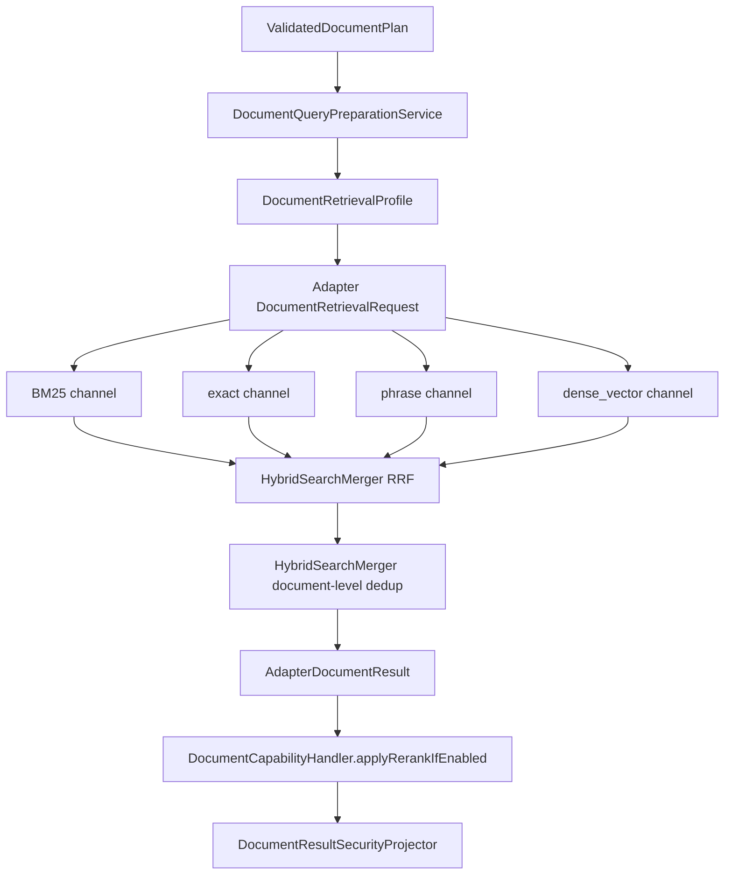

# BM25、exact/phrase、dense_vector、RRF、rerank 检索能力 L2 实施详细设计 v2.0

## 1. 文档信息

| 项目 | 内容 |
|---|---|
| 文档名称 | BM25、exact/phrase、dense_vector、RRF、rerank 检索能力 L2 实施详细设计 |
| 文档路径 | `docs/design/P2_V2/04_BM25_exact_phrase_dense_vector_RRF_rerank检索能力_L2实施详细设计_v2.0.md` |
| 文档状态 | Approved |
| 当前版本 | v2.0 |
| 作者 | Codex |
| 创建日期 | 2026-07-09 |
| 最后更新日期 | 2026-07-09 |
| 适用范围 | 文档 BM25、exact、phrase、dense_vector 多路召回，RRF 融合，document-level 去重，可选 rerank，检索诊断 |
| 上级文档 | `docs/design/Agent目标架构总览_v1.0.md`、`docs/design/Agent契约与规划架构设计_v1.0.md` |
| 关联文档 | `docs/design/P2/04_关键词向量混合检索能力_L2实施详细设计_v1.0.md`、`docs/design/P2_V2/01_文档语料接入与ES_v2索引治理能力_L2实施详细设计_v2.0.md`、`docs/design/P2_V2/02_资料域资料类型Profile配置能力_L2实施详细设计_v2.0.md`、`docs/design/P2_V2/03_多通道权限感知检索能力_L2实施详细设计_v2.0.md`、`docs/design/P2_V2/07_LLM改写候选与EmbeddingProvider接入能力_L2实施详细设计_v2.0.md`、`docs/design/P2_V2/08_gold_query验证回滚审计观测与撤权保障能力_L2实施详细设计_v2.0.md`、`docs/design/P2_V2/09_统一文档检索编排与多路召回_L2实施详细设计_v2.0.md` |
| 是否可作为实现依据 | 是 |

## 2. 修改历史

| 序号 | 日期 | 位置 | 修改原因 | 修改内容 |
|---:|---|---|---|---|
| 1 | 2026-07-09 | 全文 | P2_V2 同步更新 | 将旧 keyword + vector 双路 hybrid 升级为 BM25、exact/phrase、dense_vector 多路召回、RRF、文档级去重和 Java 侧 rerank |
| 2 | 2026-07-09 | 第 9、19、22、24 章 | design-doc-review 评审修复 | 将总体设计中的 `QueryRewriteNormalizer` 统一为 `DocumentQueryPreparationService`，明确文档级去重由 `HybridSearchMerger` 承担 |
| 3 | 2026-07-09 | 第 10、19 章 | rerank 接入实现同步 | 明确 Java 侧 `HttpDocumentRerankClient` 调用 `/rerank`，profile 开关依赖 provider 配置 |

## 3. 文档状态说明

| 状态 | 含义 | 是否可作为开发依据 |
|---|---|---:|
| Draft | 草稿，内容尚未完成完整评审 | 否 |
| In Review | 评审中，内容可能继续调整 | 否 |
| Approved | 已评审通过，可作为实现依据 | 是 |
| Implementing | 已进入实现阶段 | 是 |
| Implemented | 已完成实现，并已与设计对齐 | 是 |
| Deprecated | 已废弃，不再作为实现依据 | 否 |

当前状态：Approved。

## 4. 背景与目标

旧 P2 04 已具备 keyword/vector 双路 hybrid 与 RRF 雏形，但缺少资料域 profile、多索引、多策略、exact/phrase、文档级去重和 rerank 设计。P2_V2 要求检索体系至少包含 BM25、exact/phrase、dense_vector 三类召回，并通过 RRF 融合、document-level 去重和可选 rerank 提升 TopK 质量。

本文目标：

1. 定义多召回通道契约和诊断字段。
2. 定义 ES 多索引、多 profile 的查询执行方式。
3. 定义 N 路 RRF 融合和稳定排序规则。
4. 定义文档级去重，避免同一文档多个 chunk 占满 TopK。
5. 定义 rerank 的位置、开关、输入安全要求和失败降级。

## 5. 设计范围

| 范围 | 本文是否覆盖 | 说明 |
|---|---:|---|
| BM25 召回 | 是 | `multi_match` / field boost |
| exact 召回 | 是 | 文号、标题、机关、标准化字段精确命中 |
| phrase 召回 | 是 | `match_phrase` / slop |
| dense_vector 召回 | 是 | profile 绑定 embedding field/dims |
| RRF | 是 | N 路 rank fusion |
| document-level 去重 | 是 | 同一 document 多 chunk 聚合 |
| rerank | 是 | Java handler 中 RRF 后、最终返回前 |
| LLM 改写 | 只消费候选 | 由 P2_V2 07 定义 |
| 权限过滤 | 只定义接入点 | 由 P2_V2 03 定义 |

## 6. 上级文档约束

| 约束 | 落地方式 |
|---|---|
| Java 统一编排 | `DocumentCapabilityHandler` 负责 query variants、profile、召回、RRF 后 rerank 编排 |
| Runtime 不可信 | Runtime 不生成 ES DSL，不选择通道或索引 |
| 权限不能下放 Runtime | ACL filter 来自 Java，所有 channel 必带 |
| 资料域可配置 | channel、字段、indexAlias、embeddingField 来自 retrievalProfile |
| 最小影响 | 优先扩展现有 `HybridSearchRequest/Response` 和 `HybridSearchMerger` |

## 7. 关联文档与边界

| 文档 | 本文依赖 | 本文不修改 |
|---|---|---|
| P2_V2 01 | ES v2 mapping、analyzer、dense_vector 字段 | 索引治理门禁 |
| P2_V2 02 | retrievalProfile 配置 | profile 解析器实现细节 |
| P2_V2 03 | ACL filter | 权限快照和安全投影 |
| P2_V2 07 | query variants、embedding provider | LLM/Embedding 调用协议 |
| P2_V2 08 | gold query、诊断指标 | 验证样本和回滚门禁 |
| P2_V2 09 | Java 统一编排 | 总体流程 |

## 8. 设计边界与约束

1. ES 服务只执行 Java/Adapter 传入的结构化请求，不接收 Runtime 原始 DSL。
2. `retrievalProfile` 控制启用通道、字段权重、topK、RRF 参数、dedup 策略和 rerank 开关。
3. BM25、exact、phrase、dense_vector 都必须输出 `channel`、`rank`、`score`、`hitFields`、`chunkId`、`documentId`、`indexAlias`。
4. RRF 不直接使用 ES 原始 score 做跨通道加权，只使用通道内 rank 和 profile 权重。
5. 文档级去重发生在 RRF 之后、rerank 之前。
6. rerank 发生在 Java `DocumentCapabilityHandler` 中，输入为 Adapter 返回的安全候选；ES 服务不调用 rerank provider。
7. rerank 失败不得导致权限回退或扩大候选；按 RRF 排序降级返回。

## 9. 总体设计



## 10. 详细功能设计

### 10.1 召回通道定义

| 通道 | ES 查询策略 | 输入 | 输出诊断 | 适用场景 |
|---|---|---|---|---|
| `BM25` | `multi_match` + field boost | normalized query、keywords | title/content/summary hit fields | 语义相近但无需向量的文本检索 |
| `EXACT` | `term` / `terms` on normalized fields | 文号、机关、税种、标题关键词 | exact field、matched value digest | 文号、法规编号、固定名称 |
| `PHRASE` | `match_phrase` + slop | 原问题和改写短语 | phrase field、slop | 政策句式、通知标题、连续短语 |
| `DENSE_VECTOR` | kNN 或 script score | embedding vector | vector field、similarity | 业务语义、问答型查询 |

### 10.2 Query variants 输入

Java 侧生成并归一化以下输入：

| 输入 | 来源 | 可信等级 | 用途 |
|---|---|---|---|
| originalQuery | 用户问题 | 需校验 | BM25、phrase、embedding |
| ruleKeywords | Java 规则抽取 | 可信 | BM25、exact |
| metadataFilters | Java 规则抽取/profile | 可信 | 所有通道 filter |
| llmRewriteCandidates | Runtime | 不可信候选 | Java 校验后可进入 BM25/embedding |
| embeddingVector | EmbeddingProvider | 服务候选 | dense_vector |

### 10.3 RRF 融合

RRF 分数：

```text
rrfScore(documentChunk) = sum(channelWeight / (rrfK + rankInChannel))
```

| 参数 | 来源 | 默认策略 |
|---|---|---|
| `rrfK` | profile | 默认 60 |
| `channelWeight` | profile.channelWeights | 未配置为 1.0 |
| `rankInChannel` | 通道内排序 | 从 1 开始 |
| `tieBreaker` | 固定规则 | rrfScore desc、bestRank asc、channelCount desc、documentId asc、chunkId asc |

### 10.4 document-level 去重

去重聚合键：

```text
dedupKey = indexAlias + profileVersion + permissionEvidenceId + documentId
```

| 聚合项 | 策略 |
|---|---|
| document score | 取 top chunk 的 RRF score，可附加同文档 chunk 覆盖数 |
| representative chunk | 选择 rrfScore 最高、exact/phrase 命中优先的 chunk |
| supporting chunks | 限制每文档最多 `maxChunksPerDocument` |
| diagnostics | 保留 channel contribution、bestRank、dedupReason |

### 10.5 rerank

| 项目 | 设计 |
|---|---|
| 位置 | `DocumentCapabilityHandler.applyRerankIfEnabled`，RRF 去重后、最终投影前 |
| 开关 | profile 级 `rerank.enabled`，默认关闭 |
| Provider 开关 | `agent.document.rerank.enabled`，未开启时禁止 profile 打开 rerank |
| Provider 契约 | `POST /rerank`，请求 `query/documents/top_n/normalize`，响应 `results[index,score]` |
| 输入 | RRF TopN 的安全候选 |
| 输出 | rerankScore、rerankReasonCode、最终 rank |
| 失败策略 | 超时/异常按 RRF 排序返回，记录 `rerankSkippedReason` |
| 禁止行为 | 不新增候选、不绕过 ACL、不接收全文、不改变 citationId |

## 11. 接口设计

### 11.1 `DocumentRetrievalRequest` 新增/扩展字段

| 字段 | 类型 | 必填 | 说明 |
|---|---|---:|---|
| `domain` | String | 是 | 资料域 |
| `materialType` | String | 否 | 资料类型 |
| `retrievalProfile` | String | 是 | 检索 profile |
| `indexAlias` | String | 是 | profile 绑定 alias |
| `queryVariants` | Object | 是 | 原问题、规则关键词、LLM 改写候选 |
| `retrievalChannels` | List | 是 | 启用的 channel |
| `rrfOptions` | Object | 是 | rrfK、channelWeights、perChannelTopK |
| `dedupOptions` | Object | 是 | document-level 去重参数 |
| `rerankOptions` | Object | 否 | Java handler 使用，Adapter 透传诊断 |

### 11.2 `HybridSearchRequest` 扩展字段

| 字段 | 类型 | 说明 |
|---|---|---|
| `channels` | List<ChannelRequest> | BM25/exact/phrase/vector 通道请求 |
| `filter` | List<SearchFilter> | 全局权限和 metadata filter |
| `rrf` | RrfOptions | RRF 参数 |
| `dedup` | DedupOptions | 文档级去重参数 |
| `diagnosticsEnabled` | boolean | 是否返回通道诊断 |

### 11.3 `HybridSearchHit` 扩展字段

| 字段 | 类型 | 说明 |
|---|---|---|
| `documentId` | String | 文档级去重键 |
| `chunkId` | String | chunk 标识 |
| `channelScores` | Map | 各通道原始 score/rank |
| `rrfScore` | Double | 融合分 |
| `dedupGroupSize` | Integer | 同文档候选数 |
| `representativeChunk` | Boolean | 是否代表 chunk |
| `hitFields` | List | 命中字段 |

## 12. 数据设计

| 数据项 | 生产方 | 消费方 | 说明 |
|---|---|---|---|
| queryDigest | Java | ES/日志 | 不记录原文时用于关联 |
| channelDiagnostics | ES | Adapter/Agent | 召回诊断 |
| rrfScore | ES | Adapter/Agent | 融合排序 |
| rerankScore | Agent | API/Context | 可选重排分 |
| dedupReason | ES | Agent/诊断 | chunk 去重原因 |

## 13. 状态流转设计

| 状态 | 进入条件 | 下一状态 |
|---|---|---|
| `QUERY_PREPARED` | Java 完成规则抽取和改写归一化 | `CHANNEL_REQUEST_BUILT` |
| `CHANNEL_REQUEST_BUILT` | profile 和 ACL filter 冻结 | `CHANNEL_RECALLED` |
| `CHANNEL_RECALLED` | 至少一个通道返回 | `RRF_FUSED` |
| `RRF_FUSED` | N 路融合完成 | `DOCUMENT_DEDUPED` |
| `DOCUMENT_DEDUPED` | 文档级去重完成 | `RERANKED` / `RERANK_SKIPPED` |
| `RERANKED` | rerank 成功 | `FINAL_PROJECTED` |
| `RERANK_SKIPPED` | rerank 关闭或失败 | `FINAL_PROJECTED` |

## 14. 幂等、事务与一致性设计

1. 检索请求无写事务；幂等性由 `queryDigest + profileVersion + indexAlias + permissionEvidenceId` 保障诊断可比。
2. RRF 排序必须稳定；同分时按固定 tieBreaker 排序。
3. ES alias 切换期间请求使用已冻结 alias，不做运行中切换。
4. rerank 失败不重试跨 provider，不改变候选集合。

## 15. 权限、风控与审计设计

| 项目 | 要求 |
|---|---|
| ACL | 每个 channel 带同一份全局 filter |
| Runtime | 不接收/返回 ES DSL |
| rerank | 输入安全投影，输出只改变排序 |
| 审计 | 记录 channelCount、rrfK、enabledChannels、dedupCount、rerankStatus |
| 禁止记录 | 全文、ACL 明细、provider 完整请求体 |

## 16. 性能与容量设计

| 项目 | 设计 |
|---|---|
| perChannelTopK | profile 级配置，默认不超过最终 topK 的 3-5 倍 |
| vector 维度 | profile 绑定，validation 校验 |
| RRF | 内存内对通道 TopN 融合，限制候选上限 |
| dedup | 先按 documentId 分组，限制每文档 chunk 数 |
| rerank | 仅对去重后 TopN，设置超时和并发限制 |

## 17. 兼容性与扩展性设计

1. 保留旧 `KEYWORD/VECTOR/HYBRID` 语义，可映射为 BM25+dense_vector 的 profile。
2. 新增通道用枚举扩展，不新增新的 Handler。
3. `HybridSearchResponse` 增量添加诊断字段，不删除旧字段。
4. 新资料域通过 profile 新增字段权重和 channel 组合。

## 18. 日志、监控与告警

| 类型 | 字段 |
|---|---|
| 日志 | queryDigest、profileVersion、indexAlias、enabledChannels、rrfK、dedupCount、rerankStatus |
| 指标 | channel latency、channel empty rate、RRF topK overlap、dedup reduction ratio、rerank timeout |
| 告警 | all channels empty、dense_vector dims mismatch、RRF topK degraded、rerank failure rate high |

## 19. 实现落点清单

### 19.1 Java 实现落点

| 序号 | 类型 | 路径 | 类名 | 方法名 | 入参类型 | 返回类型 | 新增/修改 | 说明 |
|---:|---|---|---|---|---|---|---|---|
| 1 | Contract | `agent-adapter-api/src/main/java/com/dylan/agent/adapter/api/document/DocumentRetrievalRequest.java` | `DocumentRetrievalRequest` | getter/setter | 新字段 | JavaBean | 修改 | 增加 profile/channel/RRF/dedup/rerank 字段 |
| 2 | Contract | `es-query-api/src/main/java/com/dylan/esquery/api/model/HybridSearchRequest.java` | `HybridSearchRequest` | getter/setter | 新字段 | JavaBean | 修改 | 支持多 channel request |
| 3 | Contract | `es-query-api/src/main/java/com/dylan/esquery/api/model/HybridSearchHit.java` | `HybridSearchHit` | getter/setter | 新字段 | JavaBean | 修改 | 输出 channel/RRF/dedup 诊断 |
| 4 | Mapper | `agent-adapter-document/src/main/java/com/dylan/agent/adapter/document/DocumentRetrievalMapper.java` | `DocumentRetrievalMapper` | `toHybridRequest` | `DocumentRetrievalRequest` | `HybridSearchRequest` | 修改 | Adapter 请求转换 |
| 5 | Service | `es-query-service/src/main/java/com/dylan/esquery/service/EsDocumentService.java` | `EsDocumentService` | `hybridSearch` | `HybridSearchRequest` | `HybridSearchResponse` | 修改 | 编排 BM25/exact/phrase/vector 通道 |
| 6 | Service | `es-query-service/src/main/java/com/dylan/esquery/service/HybridSearchMerger.java` | `HybridSearchMerger` | `merge` | channel hits/request | response | 修改 | N 路 RRF 与 document dedup |
| 7 | Handler | `agent-service/src/main/java/com/dylan/agent/capability/document/DocumentCapabilityHandler.java` | `DocumentCapabilityHandler` | `applyRerankIfEnabled` | `AdapterDocumentResult, profile` | `AdapterDocumentResult` | 新增 | Java 侧可选 rerank |
| 8 | Port | `agent-service/src/main/java/com/dylan/agent/capability/document/rerank/DocumentRerankPort.java` | `DocumentRerankPort` | `rerank` | safe candidates | rerank result | 新增 | 可禁用 provider port |
| 9 | Provider Client | `agent-service/src/main/java/com/dylan/agent/capability/document/rerank/HttpDocumentRerankClient.java` | `HttpDocumentRerankClient` | `rerank` | safe candidates | rerank result | 新增 | 调用 `BAAI/bge-reranker-v2-m3` 服务 `/rerank` |

### 19.2 Python 实现落点

Runtime 不实现召回、RRF、rerank 或 ES DSL。仅因契约生成可能更新 `agent-runtime/app/contracts/generated_models.py`，但行为仍是候选改写。

### 19.3 脚本与配置落点

| 序号 | 类型 | 路径 | 文件名 | 配置项 | 说明 |
|---:|---|---|---|---|---|
| 1 | YAML | `agent-service/src/main/resources/application.yml` | `application.yml` | `agent.document.retrieval-profiles.*.channels` | 启用 BM25/exact/phrase/vector |
| 2 | YAML | 同上 | `application.yml` | `*.rrf.*` | RRF 参数 |
| 3 | YAML | 同上 | `application.yml` | `*.rerank.*` | rerank 开关和 TopN |
| 4 | YAML | 同上 | `application.yml` | `agent.document.rerank.*` | rerank provider 地址、路径、模型、超时和候选文本长度上限 |

### 19.4 测试落点

| 序号 | 测试类型 | 路径 | 测试类 / 文件 | 测试方法 / 用例 | 验证目标 | 新增/修改 |
|---:|---|---|---|---|---|---|
| 1 | Unit | `es-query-service/src/test/java/com/dylan/esquery/service/HybridSearchMergerTest.java` | `HybridSearchMergerTest` | `mergesNChannelsByRrf` | N 路 RRF | 修改 |
| 2 | Unit | 同上 | 同上 | `deduplicatesByDocumentId` | 文档级去重 | 修改 |
| 3 | Unit | `agent-adapter-document/src/test/java/com/dylan/agent/adapter/document/DocumentRetrievalMapperTest.java` | `DocumentRetrievalMapperTest` | `mapsProfileChannelsToHybridRequest` | Adapter 映射 | 修改 |
| 4 | Unit | `agent-service/src/test/java/com/dylan/agent/kernel/core/DocumentCapabilityHandlerTest.java` | `DocumentCapabilityHandlerTest` | `reranksAfterRrfDedup` | rerank 位置 | 修改 |
| 5 | Contract | `agent-adapter-api/src/test/java/com/dylan/agent/adapter/api/document/DocumentRetrievalRequestTest.java` | `DocumentRetrievalRequestTest` | `serializesV2RetrievalFields` | 契约兼容 | 修改 |

## 20. 测试设计

| 测试类型 | 验证内容 |
|---|---|
| 单元测试 | RRF 公式、tieBreaker、document dedup、rerank 降级 |
| 契约测试 | 新字段序列化兼容 |
| 集成测试 | BM25/exact/phrase/vector 通道均可返回诊断 |
| 权限测试 | 所有通道应用同一 ACL filter |
| gold query | 文号、税种、机关、日期、有效性、业务语义 TopK 命中 |

## 21. 风险与待确认事项

| 序号 | 类型 | 内容 | 影响 | 建议处理方式 | 是否阻塞 |
|---:|---|---|---|---|---|
| 1 | ES 版本能力 | kNN/filter 组合能力取决于部署版本 | vector 通道实现差异 | 实现前确认 ES 版本，必要时用 script_score 降级 | 否 |
| 2 | rerank 延迟 | provider 增加尾延迟 | 影响响应时间 | 默认关闭，按 profile 灰度启用 | 否 |
| 3 | exact 归一化 | 文号/机关标准化不一致 | exact 召回漏召 | Java 规则抽取和索引字段使用同一 normalize 规则 | 否 |

## 22. 评审记录

| 轮次 | 日期 | 评审结论 | 发现问题数 | 修正问题数 | 遗留问题 | 说明 |
|---:|---|---|---:|---:|---|---|
| 1 | 2026-07-09 | 通过 | 0 | 0 | 无 | 已完成 design-doc-review，评审报告见同目录 `_评审报告.md` |
| 2 | 2026-07-09 | 修正后通过 | 2 | 2 | 无 | 本轮修正总体设计中未落地的查询归一化类名、独立去重组件命名与实现落点不一致问题 |

## 23. 实施对齐检查

| 检查项 | 设计要求 | 实现位置 | 是否满足 | 说明 |
|---|---|---|---|---|
| 多通道召回 | BM25/exact/phrase/vector | `EsDocumentService` | 待实现 | 代码阶段落实 |
| RRF | N 路稳定融合 | `HybridSearchMerger` | 待实现 | 代码阶段落实 |
| 去重 | document-level dedup | `HybridSearchMerger` | 待实现 | 代码阶段落实 |
| rerank | Java handler 中 RRF 后执行 | `DocumentCapabilityHandler` | 待实现 | 代码阶段落实 |
| 诊断 | channel/RRF/dedup/rerank 字段 | API DTO | 待实现 | 代码阶段落实 |

## 24. 完成摘要

| 项目 | 内容 |
|---|---|
| 目标文档 | `docs/design/P2_V2/04_BM25_exact_phrase_dense_vector_RRF_rerank检索能力_L2实施详细设计_v2.0.md` |
| 文档状态 | Approved |
| 是否可作为实现依据 | 是 |
| 评审轮次 | 2 |
| 主要修改内容 | 补充 BM25、exact、phrase、dense_vector 多路召回、RRF、document-level 去重、Java 侧 rerank 和诊断字段；本轮统一查询准备与去重实现落点命名 |
| 是否已追加修改历史 | 是 |
| 是否已补充实现落点清单 | 是 |
| 是否存在阻塞问题 | 否 |
| 是否存在遗留风险 | 是 |
| 是否需要用户进一步授权 | 否 |
| 建议下一步 | 代码实现前确认 ES 版本对向量过滤能力的支持，并以 P2_V2 08 gold query 作为质量门禁 |
