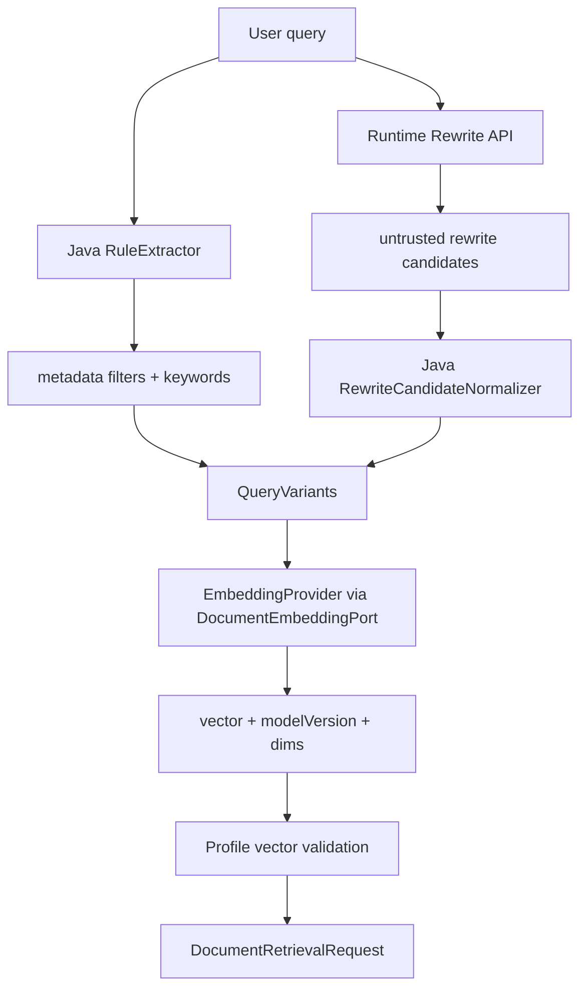

# LLM 改写候选与 EmbeddingProvider 接入能力 L2 实施详细设计 v2.0

## 1. 文档信息

| 项目 | 内容 |
|---|---|
| 文档名称 | LLM 改写候选与 EmbeddingProvider 接入能力 L2 实施详细设计 |
| 文档路径 | `docs/design/P2_V2/07_LLM改写候选与EmbeddingProvider接入能力_L2实施详细设计_v2.0.md` |
| 文档状态 | Approved |
| 当前版本 | v2.0 |
| 作者 | Codex |
| 创建日期 | 2026-07-09 |
| 最后更新日期 | 2026-07-09 |
| 适用范围 | 文档检索问题改写候选、Java 规则抽取与归一化、EmbeddingProvider 接入、向量字段/profile 校验、Runtime 不可信边界 |
| 上级文档 | `docs/design/Agent目标架构总览_v1.0.md`、`docs/design/Agent契约与规划架构设计_v1.0.md` |
| 关联文档 | `docs/design/P2/07_LLM与EmbeddingProvider接入能力_L2实施详细设计_v1.0.md`、`docs/design/P2_V2/02_资料域资料类型Profile配置能力_L2实施详细设计_v2.0.md`、`docs/design/P2_V2/04_BM25_exact_phrase_dense_vector_RRF_rerank检索能力_L2实施详细设计_v2.0.md`、`docs/design/P2_V2/09_统一文档检索编排与多路召回_L2实施详细设计_v2.0.md` |
| 是否可作为实现依据 | 是 |

## 2. 修改历史

| 序号 | 日期 | 位置 | 修改原因 | 修改内容 |
|---:|---|---|---|---|
| 1 | 2026-07-09 | 全文 | P2_V2 同步更新 | 明确 Runtime 只返回 LLM 改写候选，Java 负责规则抽取、候选校验、metadata filter、embedding profile 校验和 dense_vector 输入 |
| 2 | 2026-07-09 | 第 19、20、22、24 章 | design-doc-review 评审修复 | 补齐 Java rewrite/normalizer 落点完整路径，明确 Runtime endpoint 需在实现阶段落到确定 API 文件和契约测试 |

## 3. 文档状态说明

| 状态 | 含义 | 是否可作为开发依据 |
|---|---|---:|
| Draft | 草稿，内容尚未完成完整评审 | 否 |
| In Review | 评审中，内容可能继续调整 | 否 |
| Approved | 已评审通过，可作为实现依据 | 是 |
| Implementing | 已进入实现阶段 | 是 |
| Implemented | 已完成实现，并已与设计对齐 | 是 |
| Deprecated | 已废弃，不再作为实现依据 | 否 |

当前状态：Approved。

## 4. 背景与目标

旧 P2 07 已定义 LLM 与 EmbeddingProvider 接入边界。P2_V2 要求 Runtime 只参与 LLM 改写，其输出只能作为不可信候选，不能直接生成 ES DSL、权限过滤、索引选择或最终执行计划。同时 dense_vector 召回需要由 Java 根据 profile 调用 EmbeddingProvider，并校验模型、维度和向量字段。

本文目标：

1. 定义 Java 侧规则抽取、关键词增强和候选改写归一化流程。
2. 定义 Runtime LLM 改写请求和响应边界。
3. 定义 EmbeddingProvider 调用、超时、降级和 profile 校验。
4. 明确 Runtime/Provider 输出不能绕过 Java 权限、profile 和 ES 请求构造。
5. 明确日志、审计和安全脱敏要求。

## 5. 设计范围

| 范围 | 本文是否覆盖 | 说明 |
|---|---:|---|
| Java 规则抽取 | 是 | 文号、日期、机关、税种、有效性、关键词 |
| LLM 改写候选 | 是 | Runtime 只返回候选文本和解释性标签 |
| 候选归一化 | 是 | Java 校验、截断、去重、allowlist |
| EmbeddingProvider | 是 | Java port 调用 provider |
| dense_vector 输入 | 是 | profile 绑定 embeddingField/vectorDims |
| rerank provider | 否 | 由 P2_V2 04 定义 |
| ES 多通道执行 | 否 | 由 P2_V2 04 定义 |

## 6. 上级文档约束

| 约束 | 落地方式 |
|---|---|
| Java 是契约与执行权威 | 改写候选、embedding 向量和 profile 都由 Java 校验后进入请求 |
| Runtime 不可信 | Runtime 不返回 DSL/filter/indexAlias/profile |
| 权限不可下放 | LLM/Embedding 请求不携带 ACL 明细 |
| 最小可用降级 | LLM 或 embedding 失败时保留 BM25/exact/phrase |
| 契约稳定 | 新字段可选，旧检索不受影响 |

## 7. 关联文档与边界

| 文档 | 本文依赖 | 本文不修改 |
|---|---|---|
| P2_V2 02 | profile 中 embeddingProvider、model、dims、rewrite 开关 | profile 配置整体模型 |
| P2_V2 03 | provider 请求不能包含权限明细 | 权限执行 |
| P2_V2 04 | queryVariants 和 vector 输入消费方式 | RRF/rerank 实现 |
| P2_V2 08 | LLM/embedding 失败率和 quality 指标 | 验证和告警门禁 |
| P2_V2 09 | Java 统一编排流程 | 总体编排 |

## 8. 设计边界与约束

1. Runtime 返回值只能是 `rewriteCandidates`，字段不允许包含 ES DSL、filter、indexAlias、retrievalProfile、ACL、topK。
2. Java 对 Runtime 候选执行长度、字符集、重复、敏感字段、metadata hint allowlist 校验。
3. Java 规则抽取结果优先于 Runtime 候选；Runtime 不能覆盖文号、日期、机关、税种等结构化过滤。
4. EmbeddingProvider 只接收归一化 query 文本和模型标识，不接收用户权限集合、完整上下文或文档全文。
5. 向量维度、模型版本和 `embeddingField` 必须与 profile 匹配，不匹配则关闭 vector 通道。
6. LLM 改写失败不影响 exact/phrase/BM25；embedding 失败只影响 dense_vector 通道。

## 9. 总体设计

## 10. 详细功能设计

### 10.1 Java 规则抽取

| 抽取项 | 示例 | 产物 |
|---|---|---|
| 文号 | `国家税务总局公告2023年第1号` | `documentNumber` exact filter |
| 日期 | `2023年以后`、`2024-01-01` | effectiveDate range |
| 机关 | `财政部`、`税务总局` | issuingAuthority filter/boost |
| 税种 | `增值税`、`企业所得税` | taxType metadata filter |
| 有效性 | `现行有效`、`废止` | validityStatus filter |
| 关键词 | 业务名词、标题词 | BM25/phrase terms |

### 10.2 Runtime LLM 改写

Runtime 请求只包含最小必要字段：

| 字段 | 类型 | 说明 |
|---|---|---|
| `query` | String | 原始问题 |
| `domain` | String | Java 已解析资料域 |
| `materialType` | String | Java 已解析资料类型，可空 |
| `language` | String | 语言 |
| `maxCandidates` | Integer | 候选数量上限 |
| `timeoutMs` | Integer | 调用超时 |

Runtime 响应：

| 字段 | 类型 | 可信等级 | 说明 |
|---|---|---|---|
| `candidates[].text` | String | 不可信候选 | Java 校验后可用 |
| `candidates[].intentLabel` | String | 不可信候选 | 仅诊断 |
| `candidates[].confidence` | Double | 不可信候选 | 仅排序辅助，不做权限判断 |
| `diagnosticId` | String | 可记录 | 诊断关联 |

禁止字段：`dsl`、`filter`、`indexAlias`、`retrievalProfile`、`aclScope`、`topK`、`sort`。

### 10.3 候选归一化

| 校验 | 规则 |
|---|---|
| 长度 | 单候选最大长度由 profile 控制 |
| 数量 | 超过 `maxCandidates` 截断 |
| 重复 | 与 originalQuery 和 ruleKeywords 去重 |
| 字符 | 过滤控制字符和不可见字符 |
| metadata hint | 只允许 Java 可识别字段；不可识别 hint 丢弃 |
| 安全 | 发现 DSL/filter 形态内容时丢弃候选并记录 |

### 10.4 EmbeddingProvider

| 项目 | 设计 |
|---|---|
| 调用方 | Java `DocumentEmbeddingPort` |
| 输入 | normalized query variants、provider/model、timeout |
| 输出 | vector、dims、modelVersion、providerDiagnosticId |
| 校验 | dims/modelVersion 与 profile 匹配 |
| 失败策略 | 关闭 dense_vector 通道，保留其他通道 |
| 审计 | 记录 provider、modelVersion、dims、latency、failureCode，不记录完整 query |

## 11. 接口设计

### 11.1 `DocumentRewriteRequest`

| 字段 | 类型 | 必填 | 说明 |
|---|---|---:|---|
| `query` | String | 是 | 原始问题 |
| `domain` | String | 是 | Java 已解析资料域 |
| `materialType` | String | 否 | Java 已解析资料类型 |
| `maxCandidates` | Integer | 是 | 候选数量 |
| `timeoutMs` | Integer | 是 | 超时 |
| `requestId` | String | 是 | 诊断 ID |

### 11.2 `DocumentRewriteResponse`

| 字段 | 类型 | 必填 | 说明 |
|---|---|---:|---|
| `candidates` | List | 否 | 改写候选 |
| `diagnosticId` | String | 否 | Runtime 诊断 ID |
| `model` | String | 否 | 模型标识，仅诊断 |

### 11.3 `DocumentEmbeddingRequest`

| 字段 | 类型 | 必填 | 说明 |
|---|---|---:|---|
| `texts` | List<String> | 是 | 归一化文本 |
| `provider` | String | 是 | profile 指定 provider |
| `model` | String | 是 | profile 指定 model |
| `expectedDims` | Integer | 是 | profile 指定维度 |
| `timeoutMs` | Integer | 是 | 超时 |

## 12. 数据设计

| 数据项 | 位置 | 说明 |
|---|---|---|
| `queryDigest` | diagnostics/audit | 原问题摘要 |
| `rewriteCandidateDigest` | diagnostics | 改写候选摘要 |
| `embeddingModelVersion` | retrieval diagnostics | 向量模型版本 |
| `embeddingDims` | retrieval diagnostics | 向量维度 |
| `rewriteRejectedReason` | diagnostics | 候选被丢弃原因 |

## 13. 状态流转设计

| 状态 | 进入条件 | 下一状态 |
|---|---|---|
| `RULE_EXTRACTED` | Java 完成规则抽取 | `REWRITE_REQUESTED` / `REWRITE_SKIPPED` |
| `REWRITE_REQUESTED` | profile 启用 LLM 改写 | `REWRITE_NORMALIZED` / `REWRITE_FAILED` |
| `REWRITE_NORMALIZED` | Java 校验候选 | `EMBEDDING_REQUESTED` / `QUERY_VARIANTS_READY` |
| `EMBEDDING_REQUESTED` | vector 通道启用 | `VECTOR_READY` / `VECTOR_SKIPPED` |
| `QUERY_VARIANTS_READY` | variants 完成 | `RETRIEVAL_READY` |

## 14. 幂等、事务与一致性设计

1. LLM 改写和 embedding 调用均无本地写事务。
2. 可用 `queryDigest + profileVersion + provider + model` 作为诊断幂等键。
3. 同一请求内 query variants 冻结后不再被 Runtime 输出覆盖。
4. provider 失败只影响对应增强能力，不回滚已完成的规则抽取。

## 15. 权限、风控与审计设计

| 项目 | 要求 |
|---|---|
| Runtime 输入 | 不携带 ACL 明细、用户权限全集、indexAlias |
| Runtime 输出 | 不接收 DSL/filter/profile/alias |
| Embedding 输入 | 不携带文档全文和权限集合 |
| 审计 | 记录 queryDigest、rewriteCount、rejectedCount、embeddingDims、providerStatus |
| 脱敏 | 不记录完整 query、候选全文、provider prompt |

## 16. 性能与容量设计

| 项目 | 设计 |
|---|---|
| LLM 改写 | profile 级开关和超时，失败快速降级 |
| embedding | batch 调用，最大 texts 数由 profile 控制 |
| 缓存 | 可按 queryDigest/profileVersion/model 做短期缓存，必须不含权限数据 |
| 并发 | provider port 设置 bulkhead 和 timeout |

## 17. 兼容性与扩展性设计

1. 未启用 LLM 改写时只使用 originalQuery 和 Java ruleKeywords。
2. 未启用 vector 通道时不调用 EmbeddingProvider。
3. 新 provider 通过 `DocumentEmbeddingPort` 实现替换，不影响检索契约。
4. Runtime 协议新增字段必须可选，生成模型保持向后兼容。

## 18. 日志、监控与告警

| 类型 | 字段 |
|---|---|
| 日志 | queryDigest、rewriteEnabled、rewriteCandidateCount、rewriteRejectedCount、embeddingProvider、embeddingModelVersion |
| 指标 | rewrite latency、rewrite failure rate、candidate rejection rate、embedding latency、embedding dims mismatch |
| 告警 | Runtime 返回禁止字段、embedding dims mismatch、provider timeout rate high |

## 19. 实现落点清单

### 19.1 Java 实现落点

| 序号 | 类型 | 路径 | 类名 | 方法名 | 入参类型 | 返回类型 | 新增/修改 | 说明 |
|---:|---|---|---|---|---|---|---|---|
| 1 | Service | `agent-service/src/main/java/com/dylan/agent/capability/document/rewrite/DocumentQueryRewritePort.java` | `DocumentQueryRewritePort` | `rewrite` | `DocumentRewriteRequest` | `DocumentRewriteResponse` | 新增 | Java 调 Runtime 改写候选 |
| 2 | Service | `agent-service/src/main/java/com/dylan/agent/capability/document/rewrite/RuntimeDocumentQueryRewriteClient.java` | `RuntimeDocumentQueryRewriteClient` | `rewrite` | `DocumentRewriteRequest` | `DocumentRewriteResponse` | 新增 | HTTP client，超时和禁止字段校验 |
| 3 | Service | `agent-service/src/main/java/com/dylan/agent/capability/document/rewrite/RewriteCandidateNormalizer.java` | `RewriteCandidateNormalizer` | `normalize` | rewrite candidates/profile | `QueryVariants` | 新增 | 候选校验、去重和截断 |
| 4 | Service | `agent-service/src/main/java/com/dylan/agent/capability/document/DocumentRuleExtractor.java` | `DocumentRuleExtractor` | `extract` | query/profile | rule result | 新增 | 文号、日期、机关、税种抽取 |
| 5 | Port | `agent-service/src/main/java/com/dylan/agent/capability/document/embedding/DocumentEmbeddingPort.java` | `DocumentEmbeddingPort` | `embed` | `DocumentEmbeddingRequest` | `DocumentEmbeddingResult` | 修改 | 增加 expectedDims/modelVersion 校验 |
| 6 | Client | `agent-service/src/main/java/com/dylan/agent/capability/document/embedding/HttpDocumentEmbeddingClient.java` | `HttpDocumentEmbeddingClient` | `embed` | request | result | 修改 | provider 超时、脱敏、维度校验 |
| 7 | Handler | `agent-service/src/main/java/com/dylan/agent/capability/document/DocumentCapabilityHandler.java` | `DocumentCapabilityHandler` | `buildQueryVariants` | validated plan/profile | query variants | 新增 | 编排 rule + rewrite + embedding |

### 19.2 Python 实现落点

| 序号 | 类型 | 路径 | 文件名 | 函数 / 类名 | 新增/修改 | 说明 |
|---:|---|---|---|---|---|---|
| 1 | API | `agent-runtime/app/api/document_rewrite.py` | `document_rewrite.py` | document rewrite endpoint | 新增 | 建议新增专用 endpoint；若实现阶段发现已有等价 endpoint，必须在评审报告中记录替代路径，输出仍只能返回 rewrite candidates，不返回 DSL/filter |
| 2 | Model | `agent-runtime/app/contracts/generated_models.py` | `generated_models.py` | generated models | 生成物更新 | 由 Java/OpenAPI 生成 |

### 19.3 脚本与配置落点

| 序号 | 类型 | 路径 | 文件名 | 配置项 | 说明 |
|---:|---|---|---|---|---|
| 1 | YAML | `agent-service/src/main/resources/application.yml` | `application.yml` | `agent.document.rewrite.*` | Runtime 改写开关、超时、候选数 |
| 2 | YAML | 同上 | `application.yml` | `agent.document.embedding.*` | provider、model、dims、timeout |

### 19.4 测试落点

| 序号 | 测试类型 | 路径 | 测试类 / 文件 | 测试方法 / 用例 | 验证目标 | 新增/修改 |
|---:|---|---|---|---|---|---|
| 1 | Unit | `agent-service/src/test/java/com/dylan/agent/capability/document/rewrite/RewriteCandidateNormalizerTest.java` | `RewriteCandidateNormalizerTest` | `rejectsDslAndFilterCandidates` | Runtime 不可信 | 新增 |
| 2 | Unit | `agent-service/src/test/java/com/dylan/agent/capability/document/DocumentRuleExtractorTest.java` | `DocumentRuleExtractorTest` | `extractsDocumentNumberDateAuthorityTaxType` | 规则抽取 | 新增 |
| 3 | Unit | `agent-service/src/test/java/com/dylan/agent/capability/document/embedding/HttpDocumentEmbeddingClientTest.java` | `HttpDocumentEmbeddingClientTest` | `rejectsDimsMismatch` | 向量维度校验 | 修改 |
| 4 | Unit | `agent-service/src/test/java/com/dylan/agent/kernel/core/DocumentCapabilityHandlerTest.java` | `DocumentCapabilityHandlerTest` | `fallsBackWhenRewriteOrEmbeddingFails` | 降级路径 | 修改 |

## 20. 测试设计

| 测试类型 | 验证内容 |
|---|---|
| 单元测试 | 规则抽取、候选归一化、禁止字段拒绝、embedding 维度校验 |
| 契约测试 | Runtime rewrite request/response 不含 DSL/filter/alias/profile/topK/sort，未知禁止字段返回后必须被 Java 丢弃并记录原因 |
| 集成测试 | rewrite 失败保留 BM25/exact/phrase，embedding 失败关闭 vector |
| 安全测试 | prompt injection 候选不能覆盖 Java metadata filter |
| 观测测试 | 失败率、拒绝率、dims mismatch 指标 |

## 21. 风险与待确认事项

| 序号 | 类型 | 内容 | 影响 | 建议处理方式 | 是否阻塞 |
|---:|---|---|---|---|---|
| 1 | Runtime endpoint | 现有 Runtime 是否已有可复用 rewrite endpoint 待实现阶段确认 | 影响代码落点 | 若无则新增专用 endpoint，并保持输出受限 | 否 |
| 2 | 规则词典 | 税种、机关、文号 normalize 规则需要样本校准 | 影响 exact/phrase 召回 | 由 gold query 迭代 | 否 |
| 3 | embedding 模型 | 不同资料域可能使用不同模型维度 | 影响 profile 配置 | profile 绑定 provider/model/dims | 否 |

## 22. 评审记录

| 轮次 | 日期 | 评审结论 | 发现问题数 | 修正问题数 | 遗留问题 | 说明 |
|---:|---|---|---:|---:|---|---|
| 1 | 2026-07-09 | 通过 | 0 | 0 | 无 | 已完成 design-doc-review，评审报告见同目录 `_评审报告.md` |
| 2 | 2026-07-09 | 修正后通过 | 1 | 1 | 无 | 本轮补齐 rewrite client、normalizer 和 Runtime endpoint 建议路径，避免实现落点停留在“同目录/待确认” |

## 23. 实施对齐检查

| 检查项 | 设计要求 | 实现位置 | 是否满足 | 说明 |
|---|---|---|---|---|
| Runtime 不可信 | 只返回改写候选 | `DocumentQueryRewritePort` / Runtime endpoint | 待实现 | 代码阶段落实 |
| 规则抽取 | Java 抽取结构化过滤 | `DocumentRuleExtractor` | 待实现 | 代码阶段落实 |
| embedding 校验 | dims/model/profile 匹配 | `DocumentEmbeddingPort` | 待实现 | 代码阶段落实 |
| 降级 | provider 失败保留其他通道 | `DocumentCapabilityHandler` | 待实现 | 代码阶段落实 |

## 24. 完成摘要

| 项目 | 内容 |
|---|---|
| 目标文档 | `docs/design/P2_V2/07_LLM改写候选与EmbeddingProvider接入能力_L2实施详细设计_v2.0.md` |
| 文档状态 | Approved |
| 是否可作为实现依据 | 是 |
| 评审轮次 | 2 |
| 主要修改内容 | 补充 Runtime 只返回 LLM 改写候选、Java 规则抽取与候选归一化、EmbeddingProvider profile 校验和降级策略；本轮补齐 rewrite 相关实现落点路径 |
| 是否已追加修改历史 | 是 |
| 是否已补充实现落点清单 | 是 |
| 是否存在阻塞问题 | 否 |
| 是否存在遗留风险 | 是 |
| 是否需要用户进一步授权 | 否 |
| 建议下一步 | 实现阶段先确认 Runtime 是否已有可复用 endpoint，再按最小影响新增或复用 |
