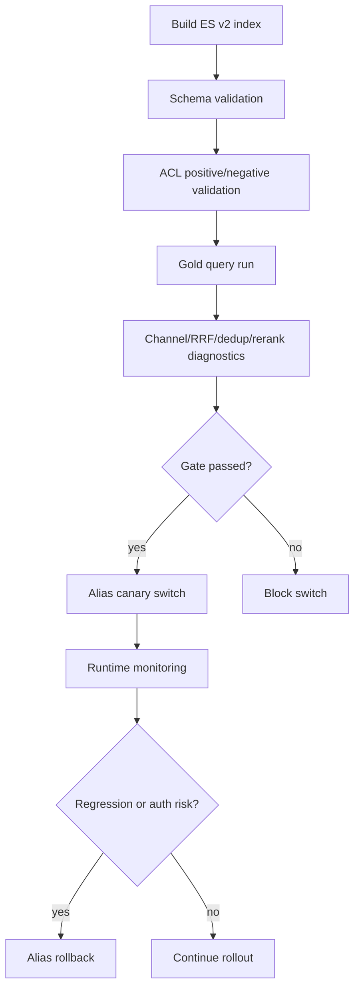

# gold query 验证、回滚、审计、观测与撤权保障能力 L2 实施详细设计 v2.0

## 1. 文档信息

| 项目 | 内容 |
|---|---|
| 文档名称 | gold query 验证、回滚、审计、观测与撤权保障能力 L2 实施详细设计 |
| 文档路径 | `docs/design/P2_V2/08_gold_query验证回滚审计观测与撤权保障能力_L2实施详细设计_v2.0.md` |
| 文档状态 | Approved |
| 当前版本 | v2.0 |
| 作者 | Codex |
| 创建日期 | 2026-07-09 |
| 最后更新日期 | 2026-07-09 |
| 适用范围 | ES v2 索引灰度验证、gold query、alias 切换回滚、检索质量诊断、权限撤权验证、审计和观测 |
| 上级文档 | `docs/design/Agent目标架构总览_v1.0.md`、`docs/design/Agent元数据与上下文安全架构设计_v1.0.md` |
| 关联文档 | `docs/design/P2/08_验证回滚审计观测与撤权保障能力_L2实施详细设计_v1.0.md`、`docs/design/P2_V2/01_文档语料接入与ES_v2索引治理能力_L2实施详细设计_v2.0.md`、`docs/design/P2_V2/02_资料域资料类型Profile配置能力_L2实施详细设计_v2.0.md`、`docs/design/P2_V2/03_多通道权限感知检索能力_L2实施详细设计_v2.0.md`、`docs/design/P2_V2/04_BM25_exact_phrase_dense_vector_RRF_rerank检索能力_L2实施详细设计_v2.0.md`、`docs/design/P2_V2/07_LLM改写候选与EmbeddingProvider接入能力_L2实施详细设计_v2.0.md`、`docs/design/P2_V2/09_统一文档检索编排与多路召回_L2实施详细设计_v2.0.md` |
| 是否可作为实现依据 | 是 |

## 2. 修改历史

| 序号 | 日期 | 位置 | 修改原因 | 修改内容 |
|---:|---|---|---|---|
| 1 | 2026-07-09 | 全文 | P2_V2 同步更新 | 在旧 P2 08 基础上补充 gold query、profileVersion 质量门禁、RRF/rerank 诊断、ES v2 alias 灰度和多通道撤权验证 |
| 2 | 2026-07-09 | 第 10、11、22、24 章 | design-doc-review 评审修复 | 补充 `goldSetVersion` 到 gold query 样本和 validation report，保证与幂等键、审计和回滚追踪一致 |

## 3. 文档状态说明

| 状态 | 含义 | 是否可作为开发依据 |
|---|---|---:|
| Draft | 草稿，内容尚未完成完整评审 | 否 |
| In Review | 评审中，内容可能继续调整 | 否 |
| Approved | 已评审通过，可作为实现依据 | 是 |
| Implementing | 已进入实现阶段 | 是 |
| Implemented | 已完成实现，并已与设计对齐 | 是 |
| Deprecated | 已废弃，不再作为实现依据 | 否 |

当前状态：Approved。

## 4. 背景与目标

旧 P2 08 已覆盖 index validation、alias switch/rollback、审计、观测和撤权保障。P2_V2 新增资料域/资料类型 profile、多路召回、RRF、文档级去重、rerank 和 Runtime 改写候选后，验证体系需要能回答两个问题：新 profile/索引是否可安全上线；多路召回和 rerank 是否真正提升 gold query 的 TopK 命中质量且没有放宽权限。

本文目标：

1. 定义 gold query 验证模型，覆盖文号、税种、机关、日期、有效性、业务语义、问答型和通知型查询。
2. 定义 ES v2 alias 灰度切换和快速回滚门禁。
3. 定义 BM25、exact/phrase、dense_vector、RRF、rerank 的可诊断指标。
4. 定义撤权、权限过滤和安全投影的验证项。
5. 定义审计、观测、告警和回归门禁。

## 5. 设计范围

| 范围 | 本文是否覆盖 | 说明 |
|---|---:|---|
| gold query 样本模型 | 是 | 查询、期望文档、期望资料域、权限场景 |
| profileVersion 门禁 | 是 | 每个 profile 独立验证 |
| alias 灰度和回滚 | 是 | 沿用 `EsIndexAliasService` 并补充 v2 字段 |
| 多路召回诊断 | 是 | channel、RRF、dedup、rerank 指标 |
| 撤权保障 | 是 | 执行前复检、结果投影、blocklist |
| 代码实现 | 否 | 后续实现阶段处理 |

## 6. 上级文档约束

| 约束 | 落地方式 |
|---|---|
| 权限安全优先 | 质量门禁不能绕过权限门禁 |
| Runtime 不可信 | Runtime 改写只作为候选，验证报告不采信 Runtime DSL |
| 可回滚 | alias switch 必须带 expected current 和 validation report |
| 可观测 | 召回、融合、rerank、撤权都有诊断字段 |
| 不泄露 | audit/metrics 不记录全文、ACL 明细或 provider prompt |

## 7. 关联文档与边界

| 文档 | 本文依赖 | 本文不修改 |
|---|---|---|
| P2_V2 01 | ES v2 validation、alias switch | mapping 细节 |
| P2_V2 02 | profileVersion、indexAlias、通道配置 | profile 模型 |
| P2_V2 03 | 权限过滤和撤权复检 | ACL 生成 |
| P2_V2 04 | 通道诊断、RRF、dedup、rerank | 检索算法 |
| P2_V2 07 | rewrite/embedding 失败诊断 | Provider 协议 |

## 8. 设计边界与约束

1. alias 切换前必须通过 schema validation、ACL 正反例、gold query 最小命中率和回滚 dry-run。
2. gold query 结果必须按 `domain + materialType + retrievalProfile + profileVersion + indexAlias` 归档。
3. RRF/rerank 质量提升不能以权限漏出为代价；权限验证失败直接阻断上线。
4. Runtime 改写候选只作为一个可诊断因素，不作为 validation 权威。
5. 观测和审计只记录 digest、count、version、latency、reasonCode，不记录正文和 ACL 明细。

## 9. 总体设计

## 10. 详细功能设计

### 10.1 gold query 样本模型

| 字段 | 类型 | 说明 |
|---|---|---|
| `queryId` | String | 稳定样本 ID |
| `domain` | String | 资料域 |
| `materialType` | String | 资料类型 |
| `retrievalProfile` | String | profile |
| `queryText` | String | 查询文本，可脱敏 |
| `goldSetVersion` | String | 样本集版本 |
| `expectedDocumentIds` | List | 期望命中文档 |
| `expectedMetadata` | Map | 文号、机关、税种、有效性等 |
| `permissionScenario` | Enum | allow/deny/revoked |
| `minimumTopK` | Integer | 命中门槛 |
| `requiredChannels` | List | 期望至少参与的通道 |

### 10.2 gold query 类型

| 类型 | 示例目标 | 验证重点 |
|---|---|---|
| 文号型 | 指定公告、法规编号 | exact 命中 |
| 税种型 | 增值税、企业所得税 | metadata filter + BM25 |
| 机关型 | 财政部、税务总局 | authority normalize |
| 日期型 | 某日期后有效政策 | effectiveDate/status |
| 有效性型 | 现行有效、废止 | validityStatus filter |
| 业务语义型 | 场景化问题 | dense_vector + BM25 |
| 问答型 | FAQ 知识 | dense_vector/rerank |
| 通知型 | 标题短语 | phrase/exact |

### 10.3 上线门禁

| 门禁 | 阻断条件 |
|---|---|
| schema validation | v2 必填字段、analyzer、dense_vector、ACL 字段缺失 |
| profile validation | profile 绑定 alias、channel、field、dims 不一致 |
| ACL validation | deny/revoked 样本有命中 |
| gold query quality | TopK 命中率低于 profile 门槛 |
| rollback validation | alias rollback dry-run 失败 |
| diagnostics completeness | channel/RRF/dedup/rerank 关键字段缺失 |

### 10.4 质量诊断

| 指标 | 说明 |
|---|---|
| `channelRecall@K` | 单通道命中率 |
| `rrfRecall@K` | RRF 后命中率 |
| `dedupReductionRatio` | 同文档 chunk 去重比例 |
| `rerankDelta@K` | rerank 前后命中差异 |
| `emptyChannelRate` | 通道空召回率 |
| `permissionLeakCount` | deny/revoked 样本误命中数 |

### 10.5 回滚策略

| 场景 | 动作 |
|---|---|
| alias canary 后质量下降 | 回滚 read alias 到上一版本 |
| 权限漏出 | 立即回滚，并冻结 profileVersion |
| rerank 失败率升高 | 关闭 profile rerank 开关，不必回滚索引 |
| vector dims mismatch | 关闭 dense_vector 通道或回滚 profile |
| Runtime rewrite 异常 | 关闭 rewrite 开关，保留规则和 BM25/exact/phrase |

## 11. 接口设计

### 11.1 `DocumentGoldQueryCase`

| 字段 | 类型 | 必填 | 说明 |
|---|---|---:|---|
| `queryId` | String | 是 | 样本 ID |
| `domain` | String | 是 | 资料域 |
| `materialType` | String | 否 | 资料类型 |
| `retrievalProfile` | String | 是 | profile |
| `profileVersion` | String | 是 | profile 版本 |
| `goldSetVersion` | String | 是 | 样本集版本 |
| `queryText` | String | 是 | 查询文本 |
| `expectedDocumentIds` | List<String> | 是 | 期望命中 |
| `permissionScenario` | String | 是 | allow/deny/revoked |

### 11.2 `DocumentRetrievalValidationReport`

| 字段 | 类型 | 说明 |
|---|---|---|
| `profileVersion` | String | 本次验证版本 |
| `goldSetVersion` | String | 本次使用的样本集版本 |
| `indexAlias` | String | 验证 alias |
| `schemaPassed` | boolean | schema 门禁 |
| `permissionPassed` | boolean | ACL 门禁 |
| `qualityPassed` | boolean | 质量门禁 |
| `rollbackReady` | boolean | 回滚门禁 |
| `metrics` | Map | 质量指标 |
| `blockingReasons` | List | 阻断原因 |

## 12. 数据设计

| 数据项 | 存储位置 | 说明 |
|---|---|---|
| gold query case | test resources 或管理表，首版建议 fixture | 样本可版本化 |
| validation report | es-query-service validation 输出 | alias switch 输入 |
| audit event | agent-service invocation audit | 检索执行审计 |
| metrics | 监控系统 | 聚合指标 |
| rollback record | alias service task | 回滚追踪 |

## 13. 状态流转设计

| 状态 | 进入条件 | 下一状态 |
|---|---|---|
| `INDEX_BUILT` | v2 索引构建完成 | `SCHEMA_VALIDATED` |
| `SCHEMA_VALIDATED` | schema 通过 | `ACL_VALIDATED` |
| `ACL_VALIDATED` | 权限样本通过 | `QUALITY_VALIDATED` |
| `QUALITY_VALIDATED` | gold query 通过 | `CANARY_SWITCHED` |
| `CANARY_SWITCHED` | alias 灰度切换 | `ROLLED_OUT` / `ROLLED_BACK` |
| `ROLLED_BACK` | 回滚完成 | `BLOCKED_FOR_FIX` |

## 14. 幂等、事务与一致性设计

1. validation report 使用 `indexVersion + profileVersion + goldSetVersion` 做幂等键。
2. alias switch 使用 expected current alias 防误切。
3. rollback 同样要求 expected current，避免并发切换覆盖。
4. audit event 与检索请求异步写入时必须包含 invocationId 和 profileVersion，便于追踪。

## 15. 权限、风控与审计设计

| 项目 | 要求 |
|---|---|
| 权限 gold query | 必含 allow、deny、revoked 三类 |
| 撤权验证 | revoked 样本在所有 channel、RRF、rerank 后都不得出现 |
| 审计字段 | invocationId、queryDigest、profileVersion、indexAlias、permissionEvidenceId、channelCount、rerankStatus |
| 禁止字段 | 全文、ACL 明细、用户权限全集、provider prompt |
| 风控动作 | 权限漏出直接阻断 alias switch 或触发 rollback |

## 16. 性能与容量设计

| 项目 | 设计 |
|---|---|
| gold query 执行 | 按 profile 分批执行，支持并发上限 |
| 指标采样 | 线上全量记录摘要指标，详细诊断按采样或 debug 开关 |
| validation 耗时 | alias switch 前离线执行，避免阻塞在线请求 |
| 回滚 | alias 原子切换，优先恢复读 alias |

## 17. 兼容性与扩展性设计

1. 旧 P2 validation report 可保留，P2_V2 新增字段可选。
2. 新资料域新增 gold query set，不复制 validation 流程。
3. rerank、rewrite、vector 通道可以独立关闭，不要求回滚整个索引。
4. profileVersion 是质量对比和回滚的基本单位。

## 18. 日志、监控与告警

| 类型 | 字段 |
|---|---|
| 日志 | validationId、profileVersion、indexAlias、goldSetVersion、blockingReasons |
| 指标 | recall@K、permissionLeakCount、dedupReductionRatio、rerankDelta@K、rollbackCount |
| 告警 | 权限漏出、TopK 命中率下降、全部通道空召回、alias rollback failed、rerank failure rate high |

## 19. 实现落点清单

### 19.1 Java 实现落点

| 序号 | 类型 | 路径 | 类名 | 方法名 | 入参类型 | 返回类型 | 新增/修改 | 说明 |
|---:|---|---|---|---|---|---|---|---|
| 1 | Service | `es-query-service/src/main/java/com/dylan/esquery/service/DocumentIndexValidationService.java` | `DocumentIndexValidationService` | `validateDocumentIndex` | validation request | validation report | 修改 | 增加 gold query/profile 门禁 |
| 2 | Service | `es-query-service/src/main/java/com/dylan/esquery/service/EsIndexAliasService.java` | `EsIndexAliasService` | `switchReadAlias` | alias switch request | void | 修改 | 要求 v2 validation report |
| 3 | Service | 同上 | `EsIndexAliasService` | `rollbackReadAlias` | rollback request | void | 修改 | profileVersion/indexAlias 审计 |
| 4 | Support | `agent-service/src/main/java/com/dylan/agent/capability/document/DocumentObservabilitySupport.java` | `DocumentObservabilitySupport` | `recordRetrievalDiagnostics` | diagnostics | void | 修改 | 多通道/RRF/rerank 指标 |
| 5 | Guard | `agent-service/src/main/java/com/dylan/agent/capability/document/security/DocumentRevocationGuard.java` | `DocumentRevocationGuard` | `evaluate` | result/context | decision | 修改 | 多通道撤权验证 |
| 6 | Model | `es-query-api/src/main/java/com/dylan/esquery/api/model/HybridRetrievalDiagnostics.java` | `HybridRetrievalDiagnostics` | getter/setter | diagnostic fields | JavaBean | 修改 | 新增 channel/RRF/dedup/rerank 字段 |

### 19.2 Python 实现落点

本文不新增 Python 运行时逻辑；Runtime 指标仅用于 rewrite candidate 失败率和 latency 观测，不参与质量门禁权威判断。

### 19.3 脚本与配置落点

| 序号 | 类型 | 路径 | 文件名 | 配置项/资源 | 说明 |
|---:|---|---|---|---|---|
| 1 | Fixture | `es-query-service/src/test/resources/fixtures/document/gold-query` | `*.json` | gold query case | 首版样本 |
| 2 | YAML | `agent-service/src/main/resources/application.yml` | `application.yml` | `agent.document.validation.*` | 门槛和采样配置 |
| 3 | YAML | 同上 | `application.yml` | `agent.document.observability.*` | 诊断采样配置 |

### 19.4 测试落点

| 序号 | 测试类型 | 路径 | 测试类 / 文件 | 测试方法 / 用例 | 验证目标 | 新增/修改 |
|---:|---|---|---|---|---|---|
| 1 | Unit | `es-query-service/src/test/java/com/dylan/esquery/service/DocumentIndexValidationServiceTest.java` | `DocumentIndexValidationServiceTest` | `blocksAliasSwitchWhenGoldQueryFails` | gold query 门禁 | 修改 |
| 2 | Unit | `es-query-service/src/test/java/com/dylan/esquery/service/EsIndexAliasServiceTest.java` | `EsIndexAliasServiceTest` | `switchesV2AliasOnlyAfterValidation` | alias 门禁 | 修改 |
| 3 | Unit | `agent-service/src/test/java/com/dylan/agent/capability/document/DocumentObservabilitySupportTest.java` | `DocumentObservabilitySupportTest` | `recordsChannelRrfRerankMetrics` | 观测字段 | 修改 |
| 4 | Unit | `agent-service/src/test/java/com/dylan/agent/capability/document/security/DocumentRevocationGuardTest.java` | `DocumentRevocationGuardTest` | `blocksRevokedCandidateAfterFusion` | 撤权保障 | 修改 |

## 20. 测试设计

| 测试类型 | 验证内容 |
|---|---|
| 单元测试 | 门禁判断、alias expected current、rollback、指标记录 |
| 集成测试 | ES v2 index validation 到 alias switch 流程 |
| 权限测试 | allow/deny/revoked gold query |
| 质量测试 | BM25/exact/phrase/vector/RRF/rerank 分阶段 TopK |
| 回归测试 | v1 索引和旧 hybrid 模式不被破坏 |

## 21. 风险与待确认事项

| 序号 | 类型 | 内容 | 影响 | 建议处理方式 | 是否阻塞 |
|---:|---|---|---|---|---|
| 1 | gold query 初始样本不足 | 难以证明召回质量提升 | 先覆盖税务政策核心样本，后续按资料域扩充 | 否 |
| 2 | 线上观测成本 | 详细诊断全量记录可能放大日志 | 默认摘要指标，全量诊断采样 | 否 |
| 3 | 回滚粒度 | rerank/profile 问题不一定需要索引回滚 | 区分关闭开关、回滚 profile、回滚 alias | 否 |

## 22. 评审记录

| 轮次 | 日期 | 评审结论 | 发现问题数 | 修正问题数 | 遗留问题 | 说明 |
|---:|---|---|---:|---:|---|---|
| 1 | 2026-07-09 | 通过 | 0 | 0 | 无 | 已完成 design-doc-review，评审报告见同目录 `_评审报告.md` |
| 2 | 2026-07-09 | 修正后通过 | 1 | 1 | 无 | 本轮补齐 `goldSetVersion` 字段，消除接口模型与幂等键/审计口径不一致 |

## 23. 实施对齐检查

| 检查项 | 设计要求 | 实现位置 | 是否满足 | 说明 |
|---|---|---|---|---|
| gold query | 覆盖文号/税种/机关/日期/有效性/语义/问答/通知 | validation fixture/service | 待实现 | 代码阶段落实 |
| alias 门禁 | validation pass 后才 switch | `EsIndexAliasService` | 待实现 | 代码阶段落实 |
| 权限漏出阻断 | deny/revoked 命中即 fail | `DocumentIndexValidationService` | 待实现 | 代码阶段落实 |
| 观测 | channel/RRF/dedup/rerank 指标 | `DocumentObservabilitySupport` | 待实现 | 代码阶段落实 |
| 回滚 | alias/profile/rerank 分级处理 | alias service/profile config | 待实现 | 代码阶段落实 |

## 24. 完成摘要

| 项目 | 内容 |
|---|---|
| 目标文档 | `docs/design/P2_V2/08_gold_query验证回滚审计观测与撤权保障能力_L2实施详细设计_v2.0.md` |
| 文档状态 | Approved |
| 是否可作为实现依据 | 是 |
| 评审轮次 | 2 |
| 主要修改内容 | 补充 gold query、profileVersion 门禁、RRF/rerank 质量诊断、ES v2 alias 灰度回滚和多通道撤权验证；本轮补齐 `goldSetVersion` 字段 |
| 是否已追加修改历史 | 是 |
| 是否已补充实现落点清单 | 是 |
| 是否存在阻塞问题 | 否 |
| 是否存在遗留风险 | 是 |
| 是否需要用户进一步授权 | 否 |
| 建议下一步 | 代码实现前先落税务政策首批 gold query fixture，作为 ES v2 和 retrievalProfile 灰度门禁 |
