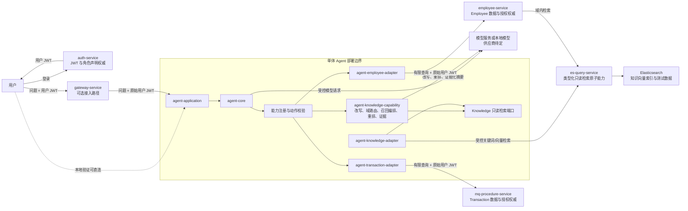
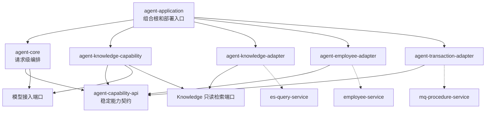
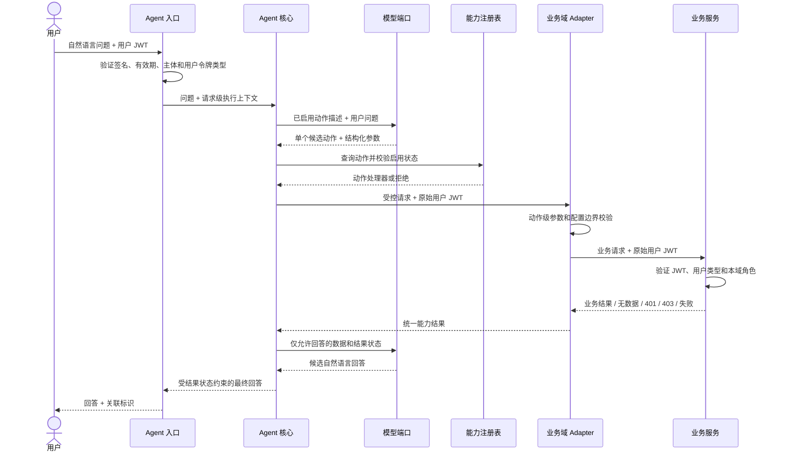

# 单体 Agent 查询能力 L0 总体架构设计

> 文档层级：L0
> 文档状态：已评审

## 1. 文档治理信息

| 项目 | 内容 |
|---|---|
| 文档标识 | SA-L0-001 |
| 文档层级 | L0 总体架构 |
| 权威范围 | 单体 Agent 查询系统的全局边界、模块划分、依赖方向、关键流程、质量约束和演进门禁 |
| 文档状态 | 已评审 |
| 评审状态 | 有条件通过 |
| 实施状态 | 未实施 |
| 生效状态 | 未生效 |
| 当前版本 | v0.3 |
| 适用基线 | `SINGLE_AGENT_QUERY_REQUIREMENTS.md` v1.2（2026-07-24，已确认）及 2026-07-24 工作区现状核实 |
| 维护责任人 | 项目维护者（个人开发者，姓名未在需求中指定） |
| 目标文档位置 | `docs/design/SINGLE_AGENT_ARCHITECTURE.md` |
| 上位架构文档 | 无 |
| 外部治理文档 | [单体 Agent 查询能力建设需求说明](../SINGLE_AGENT_QUERY_REQUIREMENTS.md) |
| 治理的 L1 文档 | 《单体 Agent 核心与运行架构 L1》《单体 Agent 知识查询能力架构 L1》《单体 Agent 业务查询适配架构 L1》（均待创建） |
| 外部契约 | `auth-service` JWT 契约；`es-query-service` 只读检索契约；Embedding/重排/生成模型契约；`employee-service` 查询契约；`mq-procedure-service` 查询契约 |
| 替代关系 | 新建基线；不继承已退出当前工作区的旧 Agent 架构设计 |

> 本文是 P1 总体架构产出。文档状态仅表示架构编制状态，不表示已评审、已实施或已生效。

## 2. 修订历史

| 序号 | 日期 | 文档位置 | 修改内容 | 修改原因 |
|---:|---|---|---|---|
| 1 | 2026-07-24 | 全文 | 创建单体 Agent 查询能力 L0 总体架构初稿 | 执行需求文档 P1 阶段，明确模块、依赖方向和演进边界 |
| 2 | 2026-07-24 | 知识查询相关章节 | 将知识查询由外部既有能力调整为 Agent 内部能力，明确问题改写、多知识域、多路召回与重排、证据化答案摘要的分层和所有权 | 当前仅具备 ES 向量检索基础设施及测试数据，需要补齐知识查询能力 |
| 3 | 2026-07-24 | 治理、模块、所有权、安全、门禁及追踪章节 | 完成五轮 L0 评审修订，修复迁移引用，拆清注册与配置所有权，统一 Knowledge 端口依赖，区分内容权威与检索快照，并补齐全查询认证和模型数据出域门禁 | 关闭 L0→L1 独立评审发现并形成可供项目维护者确认的 v0.3 基线 |

## 3. 文档定位

### 3.1 文档目标

本文建立第一阶段单体 Agent 查询系统的总体架构基线，回答以下问题：

1. 单体 Agent 的系统边界和内部模块如何划分。
2. 知识查询、Employee、Transaction 三类查询能力如何接入。
3. Agent、Adapter、认证系统和业务系统分别拥有什么责任。
4. 模型生成内容如何被约束为有限、可验证的查询动作。
5. 后续新增能力、聚合、工作流、写入和 Multi-Agent 时，哪些边界必须保持稳定。

### 3.2 权威范围

本文唯一负责：

- 单体 Agent 的目标系统上下文和一个部署单元约束。
- Agent 核心、知识查询能力、统一能力契约、能力注册和三类 Adapter 的职责边界。
- 问题改写、多知识域、多路召回与重排、答案摘要在 L0/L1/L2 中的治理边界。
- 全局依赖方向、身份透传、业务域授权、错误语义和可观测性原则。
- P1 至 P5 的架构演进路径及进入下一阶段的门禁。
- 下位 L1、L2 文档的治理范围。

### 3.3 非目标范围

本文不定义：

- API 路径、请求响应字段、类、方法、包、表、索引或 Elasticsearch DSL。
- Employee、Transaction 的最终动作清单、字段白名单和角色矩阵。
- 问题改写提示词、知识域配置结构、召回参数、融合公式、重排模型、证据 DTO 和答案模板。
- Agent 编程语言、编排框架、模型供应商和模型版本。
- 文档录入、索引建设、业务写入、跨域聚合、工作流或 Multi-Agent 实现。
- 生产级高可用、复杂审计平台、分布式任务或动态插件平台。

### 3.4 读者与使用方式

- P2 使用本文分解 L1 和实施详细设计。
- P3 使用本文校验代码模块和依赖方向。
- P4 使用本文校验身份、权限、契约和异常链路。
- P5 使用本文确认知识库效果验证边界。
- 任何下位设计不得弱化本文的安全、业务域所有权和有限动作约束。

### 3.5 文档权威顺序

```text
已确认需求
  → L0 总体架构
      → L1 分域/模块架构
          → L2 实施详细设计
              → 代码、配置、契约、测试和运行证据
```

| 文档或证据 | 关系角色 | 当前权限 | 说明 |
|---|---|---|---|
| `SINGLE_AGENT_QUERY_REQUIREMENTS.md` | external_contract | 本次按用户授权同步版本和 P2 分层表述 | 本文的需求权威，L0 不得反向弱化或自行改义 |
| [架构文档索引](../ARCHITECTURE.md) | repository_rule | 本次按用户授权原子同步 | 仓库架构入口索引，必须与本文位置、版本和评审状态一致 |
| 本文 | target | 可写 | 本次唯一目标文档 |
| 计划中的三份 L1 | governed_child | 只读/尚不存在 | 本文确认后创建 |
| 现有服务代码、配置和测试 | implementation_evidence | 只读 | 用于核实现状，不反向定义目标架构 |

## 4. 架构背景与驱动因素

### 4.1 业务背景

本项目用于个人学习和验证 Agent 技术。第一阶段只要求打通自然语言问题到知识库、Employee 和 Transaction 查询的完整链路，不追求产品化或生产级治理。设计优先级依次为：

1. 三类查询能力可以端到端运行。
2. 业务域、权限和数据所有权边界正确。
3. 新增能力不需要侵入已有能力实现。
4. 架构足以支持后续详细设计和验证。
5. 不为当前没有的场景建设复杂平台。

### 4.2 技术背景与当前基线

| 事实 ID | 已核实事实 | 证据 | 架构含义 |
|---|---|---|---|
| SA-FACT-001 | 当前工作区不存在新的 Agent 目标实现 | 根目录模块和 `serviceCenter/pom.xml` | Agent 作为新模块集合建设，不迁移旧 Agent 实现 |
| SA-FACT-002 | `auth-service` 签发包含 `sub`、`iat`、`exp`、`token_type=user` 和 `role` 的 JWT | `auth-service/.../JwtService.java` | 身份和角色声明来源可复用 |
| SA-FACT-003 | `common-security` 能完成 JWT 资源服务器认证，但当前未将 `role` 声明统一映射为 `GrantedAuthority` | `common-security` 资源服务器自动配置及仓库检索结果 | 认证基础可复用，RBAC 闭环尚未满足 |
| SA-FACT-004 | Employee 查询入口已存在，Employee ES 查询由 `employee-service` 内部调用 `es-query-service` | `EmployeeController`、`EmployeeEsController`、`EmployeeEsService` | Agent 只调用 Employee 对外接口，不直接调用 `es-query-service` 或 ES |
| SA-FACT-005 | Transaction 详情、条件和分页搜索入口已存在，同时也存在本期禁止的聚合及写入入口 | `TransactionController`、`TransactionService` | Adapter 只暴露经确认的查询动作，不能把整个控制器能力交给模型 |
| SA-FACT-006 | Employee、Transaction 当前能力守卫只校验用户令牌类型，未校验具体业务角色 | 两个 `CapabilityAccessGuard` | 真实集成前必须补齐业务域角色授权 |
| SA-FACT-007 | 现有通用 Feign 令牌转发在缺少用户令牌时可以回退到服务令牌 | `FeignTokenRelayAutoConfiguration` | Agent 用户查询链路必须禁用或绕开该回退行为 |
| SA-FACT-008 | 当前已有 `es-query-service`、Elasticsearch 向量索引和测试数据；支持原始 DSL 搜索及 KNN 向量搜索，但没有面向 Agent 的完整知识查询能力 | `EsQueryController`、`EsDocumentService`、`es-query-api` 及用户确认 | 复用检索基础设施，在 Agent 内补齐知识查询编排，不建设独立 `knowledge-service` |
| SA-FACT-009 | Eureka、Config Server、Gateway 等基础设施已经存在 | 根目录模块和相关配置 | 可按需复用，不作为 Agent 正确运行的业务权威 |
| SA-FACT-010 | 当前未发现问题改写、知识域注册与路由、多路召回融合、语义重排或证据化答案摘要实现 | 工作区代码和文档检索 | 四项能力均属于新增目标能力，不得宣称现状已具备 |

### 4.3 架构问题

| 编号 | 问题 | 影响 | 目标方向 |
|---|---|---|---|
| SA-PROBLEM-001 | 缺少统一 Agent 入口、编排和能力契约 | 三类能力无法由同一 Agent 调用 | 建立模块化单体和统一能力 API |
| SA-PROBLEM-002 | 模型输出天然不可信，业务接口能力范围又大于本期范围 | 可能产生任意参数、聚合或写入调用 | 代码绑定动作 + 强类型配置 + 启动校验 + 执行前校验 |
| SA-PROBLEM-003 | 业务系统已有认证，但具体角色授权未闭环 | 仅认证用户可能访问不应访问的数据 | 下游业务服务成为角色授权最终执行点 |
| SA-PROBLEM-004 | 只有 ES 检索原子能力，没有知识查询流水线和受控契约 | 无法完成问题改写、多知识域、多路召回与重排、证据化答案摘要 | 在 Agent 内建立知识查询能力，通过受控 Adapter 调用 `es-query-service` |
| SA-PROBLEM-005 | 新增能力若通过核心条件分支实现会持续增加耦合 | 后续聚合、工作流等能力容易侵入已有代码 | 使用稳定能力契约、注册入口和组合根 |
| SA-PROBLEM-006 | 下游失败或无数据容易被模型错误解释 | 可能生成虚假业务答案 | 统一结果状态并禁止失败数据进入事实回答路径 |

### 4.4 架构驱动因素

| 驱动因素 | 优先级 | 约束 | 验证方式 |
|---|---:|---|---|
| 端到端可运行 | P0 | 三类能力均能由自然语言触发 | P4 集成测试 |
| 业务域所有权 | P0 | Agent 不直接访问业务 DB/ES | 依赖检查和集成调用证据 |
| 权限失败关闭 | P0 | 用户 JWT 透传，业务域校验角色，禁止服务身份回退 | 401/403 负向测试 |
| 有限动作 | P0 | 模型只能选择注册且启用的动作 | 注册表、参数拒绝和未注册动作测试 |
| 可扩展而不侵入 | P1 | 新能力不修改已有能力业务实现 | 模拟能力扩展测试 |
| 最小复杂度 | P1 | 一个部署单元，无工作流、无动态插件、无持久 Agent 状态 | 模块和部署检查 |
| 可解释失败 | P1 | 无结果、参数错误、无权限和下游失败相互区分 | 错误路径测试 |
| 可观测 | P1 | 每次能力调用具有最小关联信息且不泄密 | 日志断言和人工检查 |
| 知识检索效果 | P1 | 问题改写、召回、重排和答案必须可分阶段比较，答案可追踪到证据 | P5 代表性问题和分阶段质量评估 |

### 4.5 假设与限制

1. 当前只有 ES 检索基础设施和测试数据，面向 Agent 的知识查询能力由本期新建。
2. 第一阶段每个用户请求最多执行一个 Agent 查询动作；`knowledge.query` 动作内部允许访问多个已注册知识域并执行多路召回，但不得扩展为 Employee、Transaction 跨业务域聚合。
3. Agent 不保存长期会话记忆和业务数据，执行上下文只在当前请求内存在。
4. Agent 框架、模型供应商和运行语言在 P2 对应模型接入 L2 定版前确定，但不得改变本文边界。
5. 现有业务接口是否足够支持最终有限动作清单，必须在各 Adapter 真实集成前核实。
6. 个人项目允许单实例和重启生效配置，但不允许以此绕过认证、授权或契约校验。

## 5. 架构目标与非目标

### 5.1 功能与能力目标

- 提供一个接收自然语言问题和用户 JWT 的 Agent 入口。
- 由 Agent 判断一个可用查询能力并生成结构化动作参数。
- 通过统一能力注册入口执行知识库、Employee 或 Transaction 查询。
- 知识查询完成问题改写、受控多知识域选择、多路召回与重排，并形成可追踪证据。
- Agent 只基于允许的检索证据生成答案摘要，证据不足时明确拒答或说明未找到。
- 通过独立 Adapter 完成协议转换、参数边界校验、JWT 透传和错误标准化。
- 将成功、无结果或失败状态整理为不夸大、不编造的自然语言回答。
- 在启动阶段加载并校验各 Adapter 的有限动作配置。

### 5.2 质量属性目标

| 质量属性 | 目标 | 适用范围 | 验证方式 |
|---|---|---|---|
| 安全性 | 三类查询缺少或无效 JWT 均返回 401；业务域无权限返回 403；禁止身份替换 | Agent 入口及全部查询链路 | 安全负向测试 |
| 边界完整性 | Agent 和 Adapter 不直接访问 Employee/Transaction DB 或 ES | 所有业务 Adapter | 依赖扫描、代码评审、集成调用记录 |
| 扩展性 | 新增模拟查询能力不修改已有能力实现，不向核心增加业务域分支 | 能力 API、注册表、组合根 | 扩展性测试 |
| 可靠性 | 参数错误不调用下游；无数据和失败可区分；失败不生成业务事实 | 核心与 Adapter | 单元和集成测试 |
| 配置安全 | 动作配置错误时对应应用启动失败，配置不能绑定动态可执行对象 | 所有 Adapter | 配置绑定测试 |
| 可观测性 | 每次能力调用记录关联标识、能力、动作、域、状态、失败类型和耗时 | Agent 运行时 | 日志测试 |
| 兼容性 | 公共契约不兼容变化必须修改 Adapter 代码和契约测试 | Adapter 与外部服务 | 契约测试 |
| 性能边界 | 每个动作具有分页、时间范围和调用超时上限，不允许无界查询 | Adapter 配置和调用链 | 边界测试、超时测试 |
| 可运维性 | 第一阶段可单实例运行，配置通过重启生效，失败原因可定位 | Agent 部署单元 | 启停和故障验证 |
| 检索质量 | 问题改写、各召回路径、融合、重排和答案效果能够分别测量，不能只验证最终回答 | 知识查询能力 | 分阶段对照评估 |
| 证据一致性 | 答案中的事实能够追踪到本次检索证据；无充分证据时不生成肯定结论 | 知识查询与答案生成 | 证据追踪和拒答测试 |

### 5.3 P1 成功标准

P1 只有在以下条件满足并由项目维护者确认后才完成：

1. 一个部署单元及其内部模块边界明确。
2. 知识查询能力和三类 Adapter 的责任及外部依赖明确。
3. 核心、能力契约和 Adapter 的依赖方向无环。
4. JWT 透传和业务域最终授权原则明确。
5. 有限动作、错误语义、配置归属和失败关闭原则明确。
6. 三份 L1 的治理范围和 P2 顺序明确。
7. 待确认契约只阻塞对应集成切片，不错误冻结全部设计。

### 5.4 非目标

- 不通过本期建设通用 Agent 平台。
- 不支持一个请求自动调用多个业务域。
- 不将单个 `knowledge.query` 动作内部的多知识域、多路检索视为跨业务域聚合或通用工作流。
- 不支持模型生成任意 URL、SQL、ES DSL、类名或方法名。
- 不允许 Agent 调用聚合、写入、更新、删除、审批或提交接口。
- 不建设插件市场、脚本执行器、动态代码加载或配置热更新。
- 不建设生产级集群、复杂容灾、复杂审计和长期会话记忆。

## 6. 当前架构、目标架构与差距

### 6.1 当前架构

当前系统具备认证服务、业务服务、ES 查询基础设施、服务发现、配置中心和网关，但缺少新的 Agent 运行单元及其统一能力边界。业务服务对外接口范围大于 Agent 本期允许范围，且业务角色授权尚未形成完整闭环。

### 6.2 目标系统上下文



图中 Gateway 是可复用的接入基础设施，不是业务授权最终执行点；Agent 即使经 Gateway 调用也必须自行验证用户已认证，下游业务系统必须再次验证并执行本域角色授权。

### 6.3 差距分析

| 维度 | 当前状态 | 目标状态 | 差距 | 处理阶段 |
|---|---|---|---|---|
| Agent 运行时 | 不存在 | 单体模块化部署单元 | 新建模块集合 | P2-P3 |
| 能力契约 | 不存在 | 统一请求、结果、执行上下文和能力描述 | 新建稳定能力 API | P2 |
| 能力选择 | 不存在 | 模型选择一个注册且启用的动作 | 新建核心编排与确定性校验 | P2-P3 |
| 知识查询编排 | 不存在 | Agent 内部知识查询能力完成改写、域路由、召回编排、融合重排和证据整理 | 新建 `agent-knowledge-capability` | P2-P3 |
| ES 检索接入 | 已有原始 DSL 和 KNN 接口，响应为 ES 原始结果 | Knowledge Adapter 只调用类型化、只读、受控的检索原子能力 | 补齐或封装只读检索契约和统一候选结果 | P2-P4 |
| 答案摘要 | 不存在 | Agent 基于检索证据生成可追踪答案，证据不足时拒答 | 新建证据上下文与答案约束 | P2-P5 |
| Employee 接入 | 多个查询及 ES 入口已存在 | 仅暴露经确认有限动作 | 动作清单、契约和角色矩阵待确认 | P2-P4 |
| Transaction 接入 | 查询、聚合、写入接口并存 | 只暴露经确认有限查询动作 | 动作隔离和角色矩阵待确认 | P2-P4 |
| 角色授权 | JWT 有角色声明，但无统一 Authority 映射，守卫只校验用户类型 | 业务系统按本域角色最终授权 | `common-security` 和业务域授权需补齐 | P2-P4 |
| 令牌透传 | 通用 Feign 可回退服务令牌 | 用户令牌缺失时失败关闭 | Agent 客户端策略需独立约束 | P2-P3 |
| 错误语义 | 各服务错误不统一 | Agent 统一区分无结果、参数、权限、超时和下游失败 | 新建语义映射 | P2-P3 |
| 观测 | 各服务日志分散 | Agent 能按一次能力调用关联 | 增加最小调用日志 | P2-P3 |

### 6.4 信任边界

| 边界 | 受信内容 | 不受信内容 | 必须执行的校验 |
|---|---|---|---|
| 用户 → Agent | 经验证 JWT 中的签名、有效期和主体 | 自然语言问题、客户端关联标识 | 身份验证、输入长度及请求约束 |
| 模型 → Agent 核心 | 无默认受信内容 | 能力选择、动作标识和参数 | 注册状态、动作白名单、强类型参数和配置边界 |
| 模型 → 知识查询能力 | 无默认受信内容 | 改写问题、域选择、重排结果和答案草稿 | 原问题语义约束、知识域注册表、候选集合边界和证据一致性 |
| Agent → 业务 Adapter | 已验证的执行上下文 | 模型生成参数 | Adapter 再执行动作级边界校验 |
| Adapter → 业务服务 | 原始用户 JWT 和受控请求 | 网络响应、状态码、数据内容 | 超时、契约和错误映射；下游执行授权 |
| Knowledge Adapter → `es-query-service` | 代码绑定的受控检索请求 | 模型生成的索引、DSL、过滤和管理操作 | 逻辑域映射、只读接口、查询边界和候选上限 |
| 知识证据/业务结果 → 模型 | 仅动作契约允许且回答所需的数据 | 检索内容中的指令性文本 | 内容仅作为数据，不得触发新动作或绕过注册表 |

## 7. 全局架构原则与不变量

| 约束 ID | 原则或不变量 | 适用范围 | 设计理由 | 验证方式 | ADR |
|---|---|---|---|---|---|
| SA-C-001 | 第一阶段只有一个 Agent 部署单元 | Agent 全局 | 控制复杂度并满足单体目标 | 部署清单 | 无 |
| SA-C-002 | 一个请求最多执行一个已注册且启用的查询动作 | Agent 核心 | 排除聚合、工作流和隐式多步执行 | 编排测试 | 无 |
| SA-C-003 | Agent 和 Adapter 不直接访问 Employee/Transaction DB 或 ES | 业务 Adapter | 保持业务域数据和规则所有权 | 依赖扫描 | 无 |
| SA-C-004 | Employee、Transaction 的角色授权由目标业务服务最终执行 | 安全边界 | Adapter 不掌握业务授权规则 | 401/403 集成测试 | 无 |
| SA-C-005 | 模型输出一律视为不可信输入 | 模型和能力边界 | 防止任意工具、参数和协议调用 | 动作与参数拒绝测试 | 无 |
| SA-C-006 | 动作处理器、请求响应类型和业务映射由代码确定，配置只能收紧或启停 | 能力配置 | 防止配置变成动态执行平台 | 启动校验和配置测试 | 无 |
| SA-C-007 | 缺少用户 JWT 时禁止执行 Knowledge、Employee 或 Transaction 查询，也禁止回退到 Agent 服务身份 | 全部查询链路 | 本期所有查询均基于已认证用户上下文 | 无 JWT 及客户端测试 | 无 |
| SA-C-008 | Agent 不持有知识内容或业务数据源真相，不保存长期业务或会话状态 | 数据与状态 | 避免复制数据所有权和状态复杂度 | 存储依赖检查 | 无 |
| SA-C-009 | 无数据、调用失败或不完整结果不得转换为肯定业务事实 | 回答生成 | 防止幻觉和错误决策 | 故障注入测试 | 无 |
| SA-C-010 | 新增能力通过能力实现、Adapter、配置和组合根接入，不向核心加入业务域分支 | 扩展边界 | 保持已有能力稳定 | 模拟能力扩展测试 | 无 |
| SA-C-011 | 日志不得记录完整 JWT、密钥、密码或不必要敏感业务数据 | 全链路 | 满足最小安全要求 | 日志断言和检查 | 无 |
| SA-C-012 | 不兼容公共契约变化必须同步 Adapter 代码和契约测试，不得只改配置伪装兼容 | 外部集成 | 保持契约真实性 | 契约变更检查 | 无 |
| SA-C-013 | 业务域现有聚合、写入和索引管理入口不得注册为本期动作 | 业务 Adapter | 严格遵守本期非范围 | 注册表检查 | 无 |
| SA-C-014 | 具体框架和供应商必须置于端口之后，不得成为能力契约的一部分 | Agent 核心 | 为高风险技术替换保留最小缝隙 | 依赖方向检查 | 待需要时创建 |
| SA-C-015 | 问题改写、多知识域、多路召回与重排、证据化答案摘要是知识查询的必备阶段，但具体算法和参数不得在 L0 固化 | 知识查询能力 | 确保能力完整，同时保持 L0/L1/L2 边界 | 下位约束映射和 P5 分阶段验证 | 无 |
| SA-C-016 | 模型只能选择已注册的逻辑知识域，不能指定物理索引、任意 ES DSL 或索引管理操作 | 知识查询与 ES 边界 | 防止模型越过受控检索边界 | 非法域、索引和 DSL 拒绝测试 | 无 |
| SA-C-017 | `es-query-service` 只提供类型化、只读、确定性的检索原子能力；知识查询策略和生成能力留在 Agent | Agent 与检索基础设施边界 | 避免将 ES 服务扩张为知识编排或生成平台 | 依赖和接口检查 | 无 |
| SA-C-018 | 知识答案必须由本次允许的检索证据支撑，证据不足、召回失败或重排失败不得生成肯定事实 | 知识查询和答案生成 | 保证可追踪和失败关闭 | 证据追踪、拒答和故障注入测试 | 无 |

## 8. 分域与模块架构

### 8.1 模块地图

以下名称是 L0 规定的逻辑和代码边界；是否映射为独立 Maven 子模块或等价工程单元，由 L1/L2 在不改变依赖方向的前提下确定。三个具体 Adapter 必须保持独立代码边界；为控制个人项目复杂度，`agent-knowledge-capability` 和 `agent-knowledge-adapter` 可以在 P2 决定是否共处一个构建模块，但依赖方向不得合并。

| 模块 | 唯一职责 | 不负责事项 | 数据或状态所有权 | 维护责任人 | 治理 L1 |
|---|---|---|---|---|---|
| `agent-application` | 单一部署入口、用户请求接入、认证集成、配置启动、模块装配和运行生命周期 | 不包含业务域规则，不定义具体动作语义 | 请求级入口状态和进程生命周期 | 项目维护者 | 核心与运行 L1 |
| `agent-core` | 问题编排、单动作决策、执行控制、结果到回答的协调及失败策略 | 不实现业务接口协议，不判断业务角色 | 请求级编排状态 | 项目维护者 | 核心与运行 L1 |
| `agent-capability-api` | 定义统一能力描述、请求、结果和执行上下文语义 | 不绑定具体框架、URL、业务 DTO 或角色规则 | 无运行时持久状态 | 项目维护者 | 核心与运行 L1 |
| `agent-knowledge-capability` | 在单个 `knowledge.query` 动作内编排问题改写、逻辑知识域选择、多路召回、候选融合与重排、证据整理和证据化答案摘要，并定义所需的只读检索端口 | 不访问 ES 协议，不管理索引，不依赖具体 Adapter 或供应商 SDK | 请求级知识查询计划、候选集、证据上下文和答案摘要 | 项目维护者 | 知识查询能力 L1 |
| `agent-knowledge-adapter` | 实现 Knowledge 只读检索端口，将逻辑知识域和受控检索计划转换为 `es-query-service` 的类型化请求并标准化候选结果 | 不接受模型指定的物理索引或 DSL，不调用写入、删除、批量或重建接口 | 知识域到受控索引或别名的配置映射；不拥有知识内容 | 项目维护者 | 知识查询能力 L1 |
| `agent-employee-adapter` | 将 Employee 有限动作映射到 `employee-service`，透传 JWT 并标准化结果 | 不访问 Employee DB/ES，不维护角色，不实现 Employee 业务规则 | Employee 动作配置；不拥有 Employee 数据 | 项目维护者 | 业务查询适配 L1 |
| `agent-transaction-adapter` | 将 Transaction 有限动作映射到 `mq-procedure-service`，透传 JWT 并标准化结果 | 不访问 Transaction DB/ES，不维护角色，不调用聚合或写入 | Transaction 动作配置；不拥有 Transaction 数据 | 项目维护者 | 业务查询适配 L1 |
| 模型接入端口及实现 | 提供结构化能力选择和回答生成所需的模型调用 | 不直接执行动作，不持有业务权限 | 无业务状态 | 项目维护者 | 核心与运行 L1 |
| Embedding 与重排端口及实现 | 为查询文本生成向量，并对受控候选集合执行语义重排 | 不选择知识域，不访问 ES，不生成最终答案 | 无业务持久状态 | 项目维护者 | 知识查询能力 L1 |
| 能力注册运行时 | 提供稳定注册入口，合并能力描述和启用状态，并在启动时校验后形成只读注册表 | 不拥有知识域、Employee 或 Transaction 的具体动作和边界配置，不动态加载代码 | `agent-application` 拥有进程内只读注册运行态 | 项目维护者 | 核心与运行 L1 |

### 8.2 内部模块与依赖方向



运行时由 `agent-application` 组合 Knowledge Capability 与具体 Adapter，`agent-core` 只依赖稳定能力契约，不反向依赖任何具体实现。Knowledge Capability 只依赖只读检索端口，Knowledge Adapter 实现该端口；具体 Adapter 不能依赖 `agent-core` 的编排实现。

### 8.3 模块边界

1. `agent-capability-api` 只表达能力语义，不承载业务服务 DTO。
2. `agent-core` 可以请求模型产生候选动作，但必须在注册表和 Adapter 校验通过后才能执行。
3. Adapter 拥有本域动作配置和协议转换，不能拥有本域角色白名单。
4. `agent-application` 是唯一允许知道所有具体模块的组合根。
5. 模型供应商实现只实现模型端口，不直接引用具体业务 Adapter。
6. 外部服务响应先经 Adapter 归一化，再进入回答生成；原始协议异常不泄漏为模型可自由解释的业务事实。
7. `agent-knowledge-capability` 拥有知识查询策略和证据语义，但不拥有物理索引、ES 协议或模型供应商实现。
8. `agent-knowledge-adapter` 只暴露 Knowledge L1 允许的只读检索端口；现有 ES 写入、删除、批量和重建能力对 Agent 不可见。
9. 多知识域、多路召回是单个知识查询动作的内部实现，不得被核心解释为多个业务能力调用。
10. Knowledge Capability 与 Knowledge Adapter 通过 Knowledge L1 定义的只读检索端口连接；应用组合根选择实现，能力实现不得直接引用具体 Adapter 类。
11. 核心与运行 L1 定义能力注册语义和注册运行时；Knowledge、Employee、Transaction 分别拥有本能力的描述、启用状态及边界配置，不得共同拥有一个可修改的配置对象。

### 8.4 依赖方向

| 调用方或消费者 | 提供方或权威方 | 依赖语义 | 允许方向 | 禁止事项 |
|---|---|---|---|---|
| `agent-application` | `agent-core`、具体 Adapter | 装配和启动 | 应用 → 内部模块 | 内部模块反向控制应用生命周期 |
| `agent-core` | `agent-capability-api` | 查询可用动作并执行统一能力 | 核心 → 抽象 | 核心直接调用业务 URL |
| Employee/Transaction Adapter | `agent-capability-api` | 实现统一业务查询能力 | Adapter → 抽象 | Adapter 依赖核心业务分支 |
| `agent-core` | 模型接入端口 | 动作候选和回答生成 | 核心 → 端口 | 模型实现直接执行工具 |
| Knowledge Capability | 模型、Embedding 与重排端口 | 问题改写、查询向量、受控候选重排和证据整理 | 知识能力 → 端口 | 模型端口直接访问 ES 或扩展知识域 |
| Knowledge Capability | Knowledge 只读检索端口 | 执行受控多域、多路检索计划 | 知识能力 → 端口 | Knowledge Capability 直接依赖 Adapter 或访问 ES |
| Knowledge Adapter | Knowledge 只读检索端口 | 实现检索协议转换和候选标准化 | Adapter → 端口抽象 | 端口抽象依赖 ES 客户端 |
| Knowledge Adapter | `es-query-service` | 类型化关键词/向量只读检索和候选返回 | Adapter → 检索基础设施 | 模型生成任意索引、DSL、写入、删除、批量或重建请求 |
| Employee Adapter | `employee-service` | Employee 有限查询 | Adapter → 业务服务 | Adapter → Employee DB、ES 或 `es-query-service` |
| Transaction Adapter | `mq-procedure-service` | Transaction 有限查询 | Adapter → 业务服务 | 聚合、写入、更新、删除或消息提交 |
| 业务服务 | `auth-service`/`common-security` | 验证 JWT 并取得 Authority | 业务服务 → 安全能力 | Adapter 替业务服务做最终授权 |

### 8.5 所有权冲突检查

| 检查项 | 结论 | 说明 |
|---|---|---|
| 重复职责 | 无 | Agent 核心编排、知识查询策略、ES 协议适配、业务适配和授权分别归属不同边界 |
| 无主职责 | 无 | 四项知识能力、三类查询、模型接入、注册、认证和最终授权均有归属 |
| 重复数据所有权 | 无 | Agent 不拥有知识内容、ES 索引、Employee 或 Transaction 数据 |
| 循环依赖 | 无 | 应用作为组合根，核心和 Adapter 通过能力 API 解耦 |
| 权限责任冲突 | 无目标态冲突 | Agent 负责入口认证，业务服务负责最终角色授权 |
| 当前实现差距 | 有 | 业务域角色校验尚未实现，按集成门禁关闭 |

## 9. 关键端到端流程

### 9.1 流程责任分配

| 流程 | 起点 | 决策责任 | 执行责任 | 状态或数据权威 | 失败与恢复 | 审计责任 |
|---|---|---|---|---|---|---|
| 知识查询 | 用户问题 | Agent 核心选择 `knowledge.query`；Knowledge Capability 决定改写、逻辑知识域和召回计划 | Knowledge Capability 通过只读检索端口编排，Knowledge Adapter 调用 `es-query-service` | 现有知识集是内容权威；当前 ES 测试索引是派生检索证据快照；Agent 只拥有请求级计划和证据 | 单路失败、整体无结果、重排失败分别处理；不扩展到业务域 | Agent 记录阶段、逻辑域、召回路径、候选数量、状态和耗时 |
| Employee 查询 | 用户问题 | Agent 核心选择 Employee 动作，Adapter 校验 | Employee Adapter 调用 `employee-service` | `employee-service` | 401/403 失败关闭；超时不扩展查询 | Agent 与 Employee 各记录本边界事件 |
| Transaction 查询 | 用户问题 | Agent 核心选择 Transaction 动作，Adapter 校验 | Transaction Adapter 调用 `mq-procedure-service` | `mq-procedure-service` | 401/403 失败关闭；不调用聚合或写入 | Agent 与 Transaction 各记录本边界事件 |
| 不支持或跨业务域问题 | 用户问题 | Agent 核心 | 不调用下游 | 无 | 明确不支持或请求缩小范围；知识动作内部多知识域不在此限制内 | Agent 记录 `unsupported` |
| 参数不合法 | 模型候选参数 | 注册表及 Adapter | 不调用下游 | 无 | 返回受控参数错误，可在当前请求内提示用户澄清 | Agent 记录 `invalid_argument` |
| 下游失败 | Adapter 调用 | Adapter 分类、核心决定回答类型 | 不进行身份替换或跨域补偿 | 下游服务 | 明确返回超时或不可用 | Agent 记录失败类型与耗时 |

### 9.2 知识查询主流程


L0 只规定上述阶段必须存在和责任边界，不规定提示词、查询变体数量、域选择算法、并发方式、融合公式、`topK`、重排模型或答案模板。Knowledge L1 负责定义阶段语义、组件关系、失败边界和质量预算；对应 L2 才能定义具体实现。

### 9.3 结构化查询主流程



若任何确定性校验失败，流程不得继续调用下游。`401/403` 不重试为其他身份，不自动调用其他能力。
无数据、无权限、参数错误和下游失败可以由核心按固定语义直接生成回答，不要求再次调用模型；即使调用模型润色，也不得向模型提供不存在的业务事实。

## 10. 数据、状态与契约所有权

### 10.1 数据所有权

| 数据 | 唯一权威 | Agent 使用方式 | Agent 是否持久化 |
|---|---|---|---|
| 用户身份和角色声明 | `auth-service` | 验证并透传 JWT | 否 |
| Employee 数据及其可见性 | `employee-service` | 通过有限动作只读查询 | 否 |
| Transaction 数据及其可见性 | `mq-procedure-service` | 通过有限动作只读查询 | 否 |
| 现有知识集 | 项目维护者；具体来源位置、版本和维护方式待 P2 确认 | 只通过检索证据使用，不由 Agent 修改 | 否 |
| 知识检索索引和测试向量 | `es-query-service` 与当前 Elasticsearch 测试环境 | 作为现有知识集的派生检索快照，通过 Knowledge Adapter 只读查询 | 否 |
| 知识查询计划、候选、证据上下文和答案摘要 | `agent-knowledge-capability` | 仅在当前请求内编排和使用 | 否 |
| Employee ES 索引 | Employee 域及其内部检索基础设施 | Agent 不直接访问 | 否 |
| 能力注册运行态 | `agent-application` | 启动时组合并校验，运行期只读 | 仅进程内运行态 |
| Knowledge 查询策略配置 | `agent-knowledge-capability` | 控制改写、域选择、召回、融合、重排和证据边界 | 仅进程内运行态 |
| Knowledge 检索映射与边界配置 | `agent-knowledge-adapter` | 映射逻辑域到受控索引或别名并限制检索 | 仅进程内运行态 |
| Employee 动作配置 | `agent-employee-adapter` | 定义本域已注册有限动作及边界 | 仅进程内运行态 |
| Transaction 动作配置 | `agent-transaction-adapter` | 定义本域已注册有限动作及边界 | 仅进程内运行态 |
| 调用日志元数据 | Agent 运行单元 | 故障定位和验证 | 按现有日志设施保存 |

### 10.2 状态所有权

- Agent 核心只拥有请求级执行状态，不建设持久化会话状态机。
- Knowledge Capability 只拥有当前请求的问题改写、域选择、召回候选、重排结果和证据上下文，不持久化知识副本。
- 一次请求只能处于接收、认证、决策、校验、执行、回答或失败等请求内状态。
- 业务查询不创建分布式事务，也不需要补偿事务。
- 配置在启动后视为只读；变更通过重启生成新的运行态。
- 下游业务状态、索引状态和知识库状态均不复制到 Agent。

### 10.3 外部契约与事实来源

| 契约或事实 | 权威来源 | 消费方 | 演进策略 | 当前兼容性 |
|---|---|---|---|---|
| 用户 JWT 声明 | `auth-service` | Agent、业务服务 | 兼容新增声明；删除或改义需契约变更 | 基础声明已存在 |
| `role` → `GrantedAuthority` 映射 | `common-security` | Employee、Transaction | 统一实现，不允许各服务自行字符串解析 | 当前缺失 |
| Employee 查询契约 | `employee-service` | Employee Adapter | 优先复用；不满足时经确认后新增 | 候选接口存在，动作范围待核实 |
| Transaction 查询契约 | `mq-procedure-service` | Transaction Adapter | 优先复用；不满足时经确认后新增 | `/txn/search` 等候选存在，范围待核实 |
| ES 类型化只读检索契约 | `es-query-service` / `es-query-api` | Knowledge Adapter | 复用底层关键词/KNN 检索实现并收敛为受控请求和统一候选结果；不得向 Agent 暴露原始 DSL、物理索引或管理接口 | 原始 DSL、KNN 和原始 ES 响应已存在，目标契约待 P2 核实 |
| 查询向量化契约 | 待选 Embedding 模型端口 | Knowledge Capability | 模型差异限制在端口实现，输入输出维度与目标索引一致 | 当前仅发现 Employee 专用向量化实现，Knowledge 契约待定义 |
| 候选重排契约 | 待选 Rerank 模型端口或确定性实现 | Knowledge Capability | 供应商和算法细节限制在端口实现 | 尚未选择 |
| 模型结构化与生成契约 | 待选模型或框架 | Agent 核心和 Knowledge Capability 使用的模型端口实现 | 供应商差异限制在端口实现 | 尚未选择 |
| Agent 对外查询契约 | Agent 应用 | 用户或调用方 | P2 定义，保持认证和错误语义稳定 | 尚未定义 |

## 11. 全局关键机制

### 11.1 一致性、事务、幂等与补偿

- 本期所有动作只读，不创建跨系统事务。
- Agent 不缓存业务事实，不承担业务数据一致性。
- 单次请求默认只执行一次下游动作；第一阶段不做自动业务重试。
- 超时后不得在同一请求中切换身份、切换业务域或升级为更宽查询。
- 若 P2 引入只读重试，必须由一个明确层级拥有重试，且总时限、次数和适用错误可验证；`401/403`、参数错误和业务拒绝永不重试。

### 11.2 安全、权限、隐私和审计

1. Agent 入口必须验证 JWT 签名、有效期、主体和 `token_type=user`。
2. Employee/Transaction Adapter 必须透传原始用户 JWT，不增删角色声明。
3. Employee、Transaction 分别维护本域角色规则并执行最终授权。
4. `common-security` 应统一完成 `role` 到 `GrantedAuthority` 的转换；缺失、空白或格式错误角色失败关闭。
5. Agent 和 Adapter 不保存业务角色白名单。
6. Agent 用户查询客户端不得使用现有服务令牌兜底。
7. 模型只能看到当前动作所需的数据；完整 JWT、密钥和密码不得进入提示词或日志。
8. 如使用外部模型，知识证据及 Employee/Transaction 真实敏感数据的出域范围必须在对应集成切片开始前明确；未明确时不得发送。
9. 检索内容和模型响应均作为不可信数据，不能扩展动作集合或触发第二次隐式调用。
10. 模型不得生成或覆盖物理索引名、任意 ES DSL、动态 URL、写入、删除、批量或重建请求；逻辑知识域必须由代码和强类型配置映射为只读检索目标。

### 11.3 性能、容量、限流与降级

- 每个动作由本域 Adapter 配置最大分页、最大时间范围和调用超时。
- `knowledge.query` 必须有端到端总时限，并对改写候选、知识域、召回路径、单路候选、融合候选、重排候选和答案上下文设置有界上限；具体数值由 L2 基于本地验证确定。
- 模型上下文只包含启用动作描述和回答所需结果，不传递全部业务接口定义。
- 下游不可用时直接返回明确失败，不降级为伪造数据或未授权的其他数据源。
- 第一阶段不设生产级吞吐和延迟 SLO；P2 根据本地验证环境给出可执行的超时与结果上限。
- Agent 不允许无边界列表、全库导出或模型自行扩大分页。

### 11.4 可用性、韧性、容灾与恢复

- 采用单实例部署，进程故障通过重启恢复。
- 配置校验失败时应用启动失败，不以缺省宽权限继续运行。
- 单个能力失败不影响其他能力在后续独立请求中使用。
- 本期不建设集群、主备、消息补偿或断点续跑。
- Adapter 可通过配置禁用存在契约或权限问题的动作，而不影响其他已验证动作。

### 11.5 日志、指标、追踪与告警

每次能力调用至少记录：

- 请求或调用关联标识。
- 能力标识和动作标识。
- 目标业务域。
- 调用结果状态和失败类型。
- 下游调用耗时及总耗时。

知识查询还应记录各阶段状态、逻辑知识域、召回路径、候选数量和重排前后数量；不得记录不必要的原始文档正文、查询向量或完整提示词。

不记录完整 JWT、密码、密钥、模型凭证或不必要敏感字段。第一阶段复用现有日志体系，不建设独立审计平台或复杂分布式追踪。

### 11.6 部署、运行时与运维边界

- `agent-application` 与全部内部模块构建为一个可运行部署单元。
- Adapter 不单独部署，不拥有独立数据库。
- `agent-knowledge-capability` 和 `agent-knowledge-adapter` 随 Agent 同进程部署，第一阶段不新增独立 `knowledge-service`。
- Agent 可复用 Config Server 和 Eureka，也可在本地通过受控地址配置直连；服务地址不能由模型生成。
- Gateway 可作为外部接入路径，但不能替代 Agent 和业务服务自身的认证授权。
- 配置变更通过重启生效，不支持热更新。
- Agent 编程语言、编排框架和模型供应商在 P2 决定；选择不得改变模块依赖和安全不变量。

### 11.7 兼容性、扩展性与技术债治理

- 新能力实现统一能力 API，通过组合根和稳定注册入口接入。
- 新能力可以新增独立 Adapter；不得修改其他 Adapter 的业务实现。
- 应用组合根允许增加模块依赖或启用配置，这是受控扩展点，不属于核心业务侵入。
- 公共能力 API 的不兼容变化必须评估全部实现并同步测试。
- `es-query-service` 的目标只读检索契约如需调整，必须同步 `es-query-api`、Knowledge Adapter 和契约测试；不得用任意 JSON 或动态配置绕过契约演进。
- Multi-Agent 只预留编排与能力实现边界、统一执行上下文和能力注册入口，不建设运行时。
- 聚合、工作流和写入未来必须作为新能力类型或新编排层设计，不能在现有查询 Adapter 中偷偷扩展。

## 12. 核心架构决策

| 决策 ID | 决策 | 备选方案 | 选择理由 | 影响范围 | 风险 | ADR |
|---|---|---|---|---|---|---|
| SA-AD-001 | 采用一个部署单元内的模块化单体 | 多微服务 Agent；单模块无边界代码 | 满足学习验证并控制运行复杂度，同时保留代码边界 | 全系统 | 组合根会知道所有模块，需保持只装配不写业务分支 | 无 |
| SA-AD-002 | 以统一能力 API 和注册表连接核心与 Adapter | 核心直接调用各业务客户端 | 新增能力不侵入核心，模型只能看到注册动作 | 核心、Adapter | 能力 API 过宽会泄漏业务细节 | 无 |
| SA-AD-003 | 每个请求同步执行至多一个查询动作 | 自动多工具链；工作流编排 | 明确排除跨域聚合和工作流，降低错误传播 | 编排流程 | 复杂问题需要用户拆分 | 无 |
| SA-AD-004 | Employee、Transaction 使用独立 Adapter 模块 | 通用动态 HTTP Adapter | 保留业务契约隔离，避免动态 URL 和字段映射 | 业务查询 | 存在少量重复协议代码，可接受 | 无 |
| SA-AD-005 | 动作由代码绑定，强类型配置只负责启停和边界收紧 | 全配置动态动作 | 防止配置变成脚本或任意接口平台 | 配置与注册 | 动作变化需要改代码和测试 | 无 |
| SA-AD-006 | Agent 认证用户，业务服务执行最终角色授权 | Adapter 统一授权；仅 Gateway 授权 | 服从业务域权限并避免角色规则复制 | 安全链路 | 当前业务服务尚未形成角色闭环 | 无 |
| SA-AD-007 | 模型通过端口接入，模型输出经确定性校验 | 核心直接依赖供应商 SDK | 供应商选择未定且模型输出不可信 | 模型集成 | 不同模型结构化能力差异需 PoC | 待选型时决定 |
| SA-AD-008 | 规划三份 L1：核心与运行、知识查询能力、业务查询适配 | 每个模块一份 L1；只写一份大 L1 | 将知识多阶段质量链路与通用核心、业务域适配分开，同时控制个人项目文档数量 | 下位设计 | 边界过细会增加维护成本，因此同类 L2 仍按能力链路合并 | 无 |
| SA-AD-009 | Agent 不建立持久会话或业务数据存储 | Agent 记忆库或缓存 | 当前能力不需要，避免一致性和权限复杂度 | 状态与部署 | 暂不支持跨请求上下文 | 无 |
| SA-AD-010 | 现有基础设施按需复用，不成为能力正确性的隐式前提 | 强制全部流量经 Gateway/Config/Eureka | 便于本地验证和故障定位 | 部署与集成 | 不同运行方式需保持同一安全语义 | 无 |
| SA-AD-011 | 第一阶段不建设独立 `knowledge-service`，知识策略归 Agent，确定性 ES 检索归 `es-query-service` | 新建统一知识服务；把全部知识逻辑放入 ES 服务 | 已有 ES 向量基础设施可复用，新增服务不能为当前单一消费者带来足够收益 | Knowledge、ES 集成和部署 | Agent 内部模块可能随能力增长变大，达到独立生命周期或多消费者条件后再评估拆分 | 无 |
| SA-AD-012 | 四项知识能力按 L0 必备能力、L1 流程契约、L2 实现细节分层治理 | 全部只写 L0；全部下沉 L2 | 防止 L0 固化算法，也防止下位设计遗漏明确需求 | L0/L1/L2 追踪 | 下位文档需保持约束追踪 | 无 |

## 13. L1 下位文档治理计划

| L1 文档 | 权威范围 | 必须承接的约束 | 关联 L1 | 下位 L2 | 顺序或前置 | 状态 |
|---|---|---|---|---|---|---|
| 《单体 Agent 核心与运行架构 L1》 | `agent-application`、`agent-core`、`agent-capability-api`、能力注册语义与运行时、模型生成端口、入口认证和请求级执行 | SA-C-001、002、005、007 至 012、014、018 | 知识查询能力 L1、业务查询适配 L1 | 核心执行、能力契约与注册运行时、生成模型接入、入口安全、错误与观测详细设计 | P1 确认后优先 | 待创建 |
| 《单体 Agent 知识查询能力架构 L1》 | `agent-knowledge-capability`、`agent-knowledge-adapter`、Knowledge 能力描述与配置、逻辑知识域、查询 Embedding/Rerank 端口及证据上下文 | SA-C-002、005、006、008 至 012、014 至 018 | 核心与运行 L1 | 问题理解与域选择、Knowledge 注册描述与配置、ES 只读检索适配、多路融合与重排、证据上下文与答案摘要详细设计 | 核心能力契约边界稳定；SA-GATE-003 的事实可并行核实 | 待创建 |
| 《单体 Agent 业务查询适配架构 L1》 | Employee/Transaction 能力描述与动作配置、两个业务 Adapter 及业务权限联调 | SA-C-002 至 014（其中 015 至 018 不适用） | 核心与运行 L1 | Employee/Transaction 注册描述与动作配置、Employee Adapter、Transaction Adapter、权限联调详细设计 | 核心能力契约边界稳定后 | 待创建 |

### 13.1 覆盖完整性

| L0 模块 | 治理 L1 | 是否覆盖 | 说明 |
|---|---|---|---|
| `agent-application` | 核心与运行 L1 | 是 | 入口、装配和生命周期 |
| `agent-core` | 核心与运行 L1 | 是 | 单动作编排与失败策略 |
| `agent-capability-api` | 核心与运行 L1 | 是 | 稳定能力语义 |
| 生成模型端口及实现 | 核心与运行 L1 | 是 | 供应商隔离、结构化动作和最终回答 |
| 能力注册运行时 | 核心与运行 L1 | 是 | 定义稳定注册语义、启动校验和运行期只读注册表 |
| Knowledge 能力描述与配置 | 知识查询能力 L1 | 是 | 定义知识能力注册描述、策略、域映射和检索边界 |
| Employee/Transaction 能力描述与配置 | 业务查询适配 L1 | 是 | 分别定义两个业务域的有限动作和边界 |
| Knowledge Capability | 知识查询能力 L1 | 是 | 问题改写、域选择、多路召回编排、融合重排和证据上下文 |
| Knowledge Adapter | 知识查询能力 L1 | 是 | 类型化、只读 ES 检索 |
| 查询 Embedding/Rerank 端口 | 知识查询能力 L1 | 是 | 模型或算法实现隔离 |
| Employee Adapter | 业务查询适配 L1 | 是 | Employee 有限查询 |
| Transaction Adapter | 业务查询适配 L1 | 是 | Transaction 有限查询 |

三份 L1 足以覆盖本期模块。知识查询单独设 L1，是因为它具有连续的多阶段处理、独立的检索质量目标和 Agent/ES 双边契约；这不是新增部署单元。只有当某个业务 Adapter 出现独立部署、显著不同的质量目标或大量独立契约时，才考虑继续拆分 L1。

### 13.2 四项知识能力分层治理

| 能力 | L0 治理内容 | L1 细化内容 | L2 实现内容 |
|---|---|---|---|
| 问题改写 | 必须存在；由 Knowledge Capability 负责；输出不得越过已注册知识域和动作边界 | 原问题与改写结果的阶段语义、输入输出契约、失败和回退边界、质量预算 | 提示词、改写候选数量、模型参数、缓存与类/接口设计、单元测试样例 |
| 多知识域 | 只允许选择已注册逻辑域；一项 `knowledge.query` 可覆盖多个知识域，但不得扩展为跨业务域聚合 | 逻辑域模型、选择规则边界、域映射所有权、无匹配/多匹配语义 | 域目录配置结构、映射字段、选择算法、阈值、DTO 和测试数据 |
| 多路召回与重排 | 必须支持至少关键词与向量等多路召回、融合和受控重排；ES 只提供确定性原子检索 | 召回端口、并发与部分失败语义、候选统一模型、去重/融合/重排职责和质量预算 | 检索请求字段、并发方案、融合算法或权重、`topK`、重排模型、超时和测试 |
| 答案摘要 | 只能基于本次允许的证据生成；证据不足时明确无结果或拒答 | 证据上下文契约、引用/追踪语义、生成失败和内容边界 | 上下文打包、答案提示词、模板、引用字段、长度参数和事实一致性测试 |

## 14. 演进、集成与回滚

### 14.1 阶段路径

| 阶段 | 输入 | 目标状态 | 关键动作 | 验证门禁 | 回滚边界 | 删除项 |
|---|---|---|---|---|---|---|
| P1 总体架构 | 已确认需求 | 模块、依赖、所有权和演进边界明确 | 完成本 L0 并确认 | SA-GATE-001 | 仅文档，可回退草稿 | 无 |
| P2 下位设计 | 已确认 L0 | 三份 L1 及核心、Knowledge、业务 Adapter、动作和权限 L2 可实施 | 选型、契约核实、知识质量边界、角色矩阵和详细设计 | SA-GATE-002 至 006 按切片 | 回退下位草稿，不影响业务系统 | 无 |
| P3 能力实现 | 可实施 L2 | 核心、模拟能力、Knowledge 能力与 Adapter、两个业务 Adapter 分模块通过测试 | 先核心与模拟能力，再按 Knowledge、Employee、Transaction 切片实现 | 对应 slice_implementation 门禁 | 禁用或移除单个新模块 | 无 |
| P4 集成验证 | 单模块测试通过 | 三条真实查询链路、权限和异常路径通过 | 按 Knowledge、Employee、Transaction 独立联调 | 对应 integration 门禁 | 禁用失败动作，不回退其他能力 | 无 |
| P5 效果验证 | 知识库链路可用 | 形成真实问题初步效果结论 | 执行代表性问题集 | SA-GATE-007 | 保留链路，回退评估结论 | 无 |

### 14.2 阶段门禁与外部证据治理

门禁只阻塞其“控制动作”和模块切片，不默认阻塞整个项目。

| 门禁 ID | 类型 | 适用阶段或模块切片 | 控制动作 | 关闭条件或证据类别 | 责任方或外部提供方 | 最晚关闭阶段 | 未关闭行为 | 下位承接 |
|---|---|---|---|---|---|---|---|---|
| SA-GATE-001 | design_decomposition | P1 → P2 | 开始三份 L1 编制 | L0 独立评审不存在未关闭的 S0/S1；项目维护者明确确认本 L0 的模块、依赖、三份 L1 分解、演进边界及 17.1 节关注点 | 项目维护者；独立评审方提供评审结论 | P2 开始前 | 允许继续阅读和事实核实；不宣称 P1 完成，不创建下位设计 | 三份 L1 |
| SA-GATE-002 | design_decomposition | Agent 核心模型接入 | 定版模型接入 L2 并进入真实模型实现 | 运行语言、Agent 框架和模型契约确定；完成一次受控结构化动作 PoC | 项目维护者/模型提供方 | 对应模型接入 L2 定版前 | 可编制模型无关 L1/L2 内容并使用测试替身；禁止模型接入 L2 定版和真实实现 | 核心与模型 L2 |
| SA-GATE-003 | integration | Knowledge 查询切片 | 接入当前 ES 知识索引 | 首批逻辑知识域及物理索引/别名映射已确认；类型化只读检索请求、候选响应、无结果和错误契约已核实；Embedding 维度与索引兼容；管理接口不可达；存在契约测试 | 项目维护者、`es-query-service` 维护方 | Knowledge P4 联调前 | 可使用受控测试替身编制和实现模型无关部分；真实知识动作保持禁用 | Knowledge 检索适配 L2 |
| SA-GATE-004 | integration | Employee Adapter | 接入 Employee 真实数据 | 有限动作及接口确认；角色矩阵确定；`role` 映射与业务域 401/403 测试通过 | `auth-service`、`common-security`、`employee-service` | Employee P4 联调前 | 可实现 Adapter 和契约测试；真实动作保持禁用并失败关闭 | Employee Adapter 与权限 L2 |
| SA-GATE-005 | integration | Transaction Adapter | 接入 Transaction 真实数据 | 有限动作及接口确认；角色矩阵确定；`role` 映射与业务域 401/403 测试通过 | `auth-service`、`common-security`、`mq-procedure-service` | Transaction P4 联调前 | 可实现 Adapter 和契约测试；真实动作保持禁用并失败关闭 | Transaction Adapter 与权限 L2 |
| SA-GATE-006 | integration | 真实或敏感数据进入外部模型 | 向外部模型发送知识证据或 Employee/Transaction 真实结果 | 模型部署边界确定；各类允许发送的数据范围、最小化及脱敏规则明确 | 项目维护者/模型提供方 | 对应能力首次真实数据联调前 | 只允许非敏感测试数据、脱敏数据或本地受控替身；不得外发未获准的知识证据或业务数据 | 模型接入、Knowledge 和业务 Adapter L2 |
| SA-GATE-007 | closure | P5 知识库效果验证 | 声明第一阶段效果验证完成 | 代表性问题集、问题改写/域选择/召回/重排阶段指标、证据化答案判断标准和结果记录完成 | 项目维护者 | P5 结束前 | 可声明链路可运行，不得声明知识库效果已验证 | Knowledge L2 测试设计和效果验证记录 |

### 14.3 回滚原则

- Agent 是新增部署单元，不修改业务数据所有权，整体可通过停止 Agent 回滚。
- 每个动作可独立禁用；单个 Adapter 失败不要求删除其他 Adapter。
- P3/P4 不做数据库迁移和双写，不存在业务数据回滚。
- 若公共业务接口需要新增，必须先获得单独确认；该接口的回滚由业务服务设计负责，不在本文内隐含授权。

## 15. 风险、权衡与待决事项

### 15.1 风险

| 风险 | 触发条件 | 影响 | 概率 | 缓解措施 | 责任人 |
|---|---|---|---|---|---|
| 模型不能稳定生成合法动作参数 | 结构化输出或工具调用能力不足 | 查询成功率低 | 中 | 模型端口隔离、参数校验、PoC 门禁和澄清路径 | 项目维护者 |
| 当前业务接口过宽 | Adapter 直接暴露通用查询 DTO | 聚合、敏感字段或超大查询被模型触发 | 中 | Adapter 定义有限动作输入，不透传模型任意 DTO | 项目维护者 |
| RBAC 闭环未补齐 | 业务系统只检查用户令牌类型 | 越权查询 | 高 | 统一角色映射、本域角色矩阵、401/403 测试，未通过时禁用真实动作 | 项目维护者 |
| ES 原始接口不能直接支撑受控候选契约 | 直接向 Agent 暴露原始 DSL、物理索引或原始 ES 响应 | 边界失控、适配脆弱或索引管理能力被误用 | 中 | SA-GATE-003、类型化只读契约、逻辑域映射和管理接口不可达测试 | 项目维护者 |
| 多路召回和重排质量不稳定 | 各路分值不可直接比较、候选不足或重排模型不适配 | 相关证据丢失，最终答案质量下降 | 中 | L1 定义候选语义与质量预算，L2 选择融合策略，P5 分阶段评估 | 项目维护者 |
| 知识答案脱离检索证据 | 生成模型补充未召回事实或证据上下文不足 | 产生不可追踪的错误结论 | 中 | SA-C-018、证据上下文约束、无证据拒答和事实一致性测试 | 项目维护者 |
| 知识证据或业务数据被发送到不合适的模型边界 | 使用外部模型且未限制内容或字段 | 数据泄露 | 中 | SA-GATE-006 失败关闭、结果最小化和日志脱敏 | 项目维护者 |
| 能力 API 设计过度通用 | 为未来 Multi-Agent、写入或工作流提前抽象 | P2/P3 复杂度增加 | 中 | 只包含本期统一请求、结果、上下文和注册语义 | 项目维护者 |
| Adapter 契约漂移 | 业务接口不兼容变化 | 运行失败或错误解释 | 中 | 契约测试；代码和配置同步变更 | 项目维护者 |
| 单实例故障 | Agent 进程退出 | 暂时不可用 | 低 | 本地重启；本期接受，不建设集群 | 项目维护者 |

### 15.2 待决事项

| 问题 | 影响 | 建议决策人 | 截止条件 | 是否阻塞 |
|---|---|---|---|---|
| Agent 运行语言、框架和模型供应商 | 模型端口实现和 L2 工程结构 | 项目维护者 | SA-GATE-002 | 只阻塞真实模型实现 |
| 首批逻辑知识域及 ES 索引/别名映射 | 域路由和 Knowledge Adapter 联调 | 项目维护者 | SA-GATE-003 | 只阻塞知识库真实集成 |
| ES 类型化只读请求、统一候选和错误契约 | 多路召回、融合重排和契约测试 | 项目维护者/`es-query-service` | SA-GATE-003 | 只阻塞知识库真实集成 |
| 查询 Embedding 与 Rerank 模型或实现及兼容性 | 向量召回、重排质量和 L2 参数 | 项目维护者/模型提供方 | SA-GATE-002/003 | 不阻塞模型无关 L1；阻塞对应真实实现 |
| Employee 最终有限动作和可复用接口 | Employee Adapter 契约 | 项目维护者/Employee 域 | SA-GATE-004 | 只阻塞 Employee 真实集成 |
| Transaction 最终有限动作和可复用接口 | Transaction Adapter 契约 | 项目维护者/Transaction 域 | SA-GATE-005 | 只阻塞 Transaction 真实集成 |
| Employee 和 Transaction 允许角色 | 业务域授权 | 对应业务域 | SA-GATE-004/005 | 只阻塞对应域真实集成 |
| 外部模型可接收的知识证据和业务字段范围 | 真实数据安全 | 项目维护者 | SA-GATE-006 | 只阻塞对应真实或敏感数据进入外部模型 |
| 知识库代表性问题、阶段指标和证据答案判断标准 | P5 效果结论 | 项目维护者 | SA-GATE-007 | 不阻塞 P2-P4 |

## 16. 约束追踪与验证

| 需求或约束 | L0 落点 | 适用 L1 | 下位验证证据 | 当前状态 |
|---|---|---|---|---|
| FR-01 单体 Agent | SA-C-001、002；模块地图 | 核心与运行 | 单部署清单、编排测试 | 已设计 |
| FR-02 知识库查询 | Knowledge Capability/Adapter；SA-C-015 至 018；SA-GATE-003/007 | 知识查询能力 | 分阶段单元/契约/故障测试，受控 ES 集成测试和效果记录 | 已设计，契约和选型待核实 |
| FR-03 Employee 查询 | SA-C-003、004、013；Employee Adapter | 业务查询适配 | Adapter 测试、依赖扫描、Employee 集成测试 | 已设计，动作待确认 |
| FR-04 Transaction 查询 | SA-C-003、004、013；Transaction Adapter | 业务查询适配 | Adapter 测试、依赖扫描、Transaction 集成测试 | 已设计，动作待确认 |
| FR-05 Adapter 模块 | SA-AD-004、011；模块地图 | 知识查询能力、业务查询适配 | 模块依赖和契约测试 | 已设计 |
| FR-06 有限查询动作 | SA-C-002、005、006、013、016 | 三份 L1 | 未注册/禁用/越界参数、非法知识域/索引/DSL 拒绝测试 | 已设计 |
| CFG-01 至 CFG-04 | SA-C-006、012、016；动作与知识域配置机制 | 知识查询能力、业务查询适配 | 强类型绑定、启动失败和兼容性测试 | 已设计 |
| SEC-01/02 用户 JWT | SA-C-007；安全机制 | 三份 L1 | 三类能力的 401、业务 JWT 透传和无服务令牌回退测试 | 已设计 |
| SEC-03/04 业务域授权与角色映射 | SA-C-004；SA-GATE-004/005 | 业务查询适配 | Authority 映射及角色允许/拒绝测试 | 已设计，当前实现未满足 |
| SEC-05 服务身份 | SA-C-007 | 三份 L1 | 三类能力缺少用户 JWT 均失败关闭的测试 | 已设计 |
| EXT-01/02 新增能力不侵入 | SA-C-010；SA-AD-002 | 三份 L1 | 新增模拟能力扩展测试 | 已设计 |
| EXT-03 Multi-Agent 预留 | SA-C-014；能力 API 和模型端口 | 核心与运行 | 架构依赖检查 | 已设计，不实施 Multi-Agent |
| 异常处理要求 | SA-C-009、018；关键流程 | 三份 L1 | 错误分类和故障注入测试 | 已设计 |
| 最小日志要求 | SA-C-011；可观测机制 | 核心与运行 | 日志字段和脱敏测试 | 已设计 |
| 测试要求 | 质量目标、门禁和各追踪项 | 三份 L1 | P2 测试设计及 P3/P4 结果 | 已分配 |
| 第一阶段验收标准 | P1-P5 阶段路径 | 三份 L1 | P4 集成与 P5 分阶段效果证据 | 待实施 |

## 17. 评审关注点与记录

### 17.1 P1 确认关注点

1. 是否接受一个部署单元，以及核心、Knowledge Capability、Knowledge Adapter 和独立业务 Adapter 的代码边界。
2. 是否接受一个请求最多执行一个查询动作。
3. 是否接受业务系统作为角色授权最终执行点，Agent 仅验证身份并透传 JWT。
4. 是否接受角色授权缺口只阻塞 Employee/Transaction 真实集成，不阻塞核心和 Adapter 设计。
5. 是否接受知识四项能力在 L0 作为必备能力和边界约束，在 Knowledge L1 定义流程契约，在 L2 定义算法、参数和类级实现。
6. 是否接受 P2 完成三份精简 L1，再形成实施详细设计；Knowledge L1 不代表新增独立服务。
7. 是否接受框架、模型供应商、知识域映射和具体动作清单在对应门禁前确定。

### 17.2 正式评审记录

独立评审可以形成证据化结论，但 `SA-GATE-001` 的正式关闭仍需项目维护者明确确认 17.1 节关注点。

| 日期 | 评审类型 | 结论 | 问题摘要 | 处理状态 |
|---|---|---|---|---|
| 2026-07-24 | L0→L1 独立评审（五轮评审—修订—复核） | 有条件通过 | 已关闭迁移治理、需求追踪、所有权与依赖、安全契约和质量门禁问题；无剩余 S0/S1 | 整改完成，待项目维护者确认 `SA-GATE-001` |

## 18. 附录

### 18.1 语义状态建议

下位设计应至少保持以下语义可区分，具体字段和错误码由 L2 定义：

- `success`：调用成功且有可用结果。
- `no_result`：调用成功但没有符合条件的数据。
- `unsupported`：没有可执行的单一已注册动作。
- `invalid_argument`：模型或用户参数不符合动作边界。
- `unauthenticated`：缺少或无效用户身份。
- `forbidden`：业务域拒绝当前用户角色。
- `timeout`：下游在动作时限内未完成。
- `downstream_failure`：下游不可用或返回非权限类失败。
- `internal_failure`：Agent 内部失败。

### 18.2 当前实现证据范围

本文只读核实了以下实现范围：

- `auth-service` 的 JWT 签发和用户角色配置。
- `common-security` 的 Servlet/Reactive JWT 资源服务器、令牌工具和 Feign 令牌转发。
- `employee-service` 的基础查询、ES 查询、能力守卫和 ES 内部调用。
- `mq-procedure-service` 的查询、聚合、写入入口、分页搜索和能力守卫。
- `es-query-service` 的原始 DSL、类型化向量 KNN、索引写入/删除/批量/重建入口，以及 Employee 专用向量化实现。
- `transaction-api`、`es-query-api` 的候选查询契约。
- Gateway、Config Server、Eureka 和根 Maven 聚合工程的存在性。

这些代码是 2026-07-24 的现状证据，不具有反向修改本文目标架构的权威。
