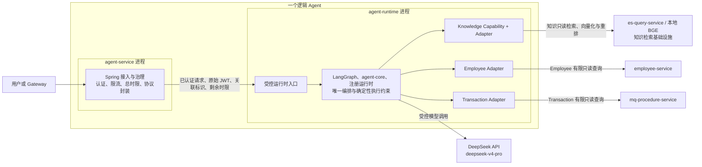
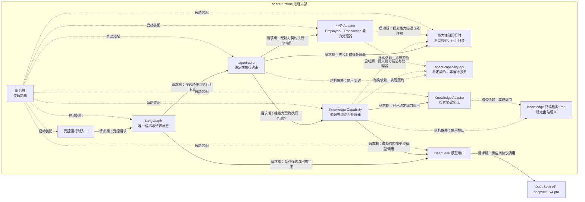
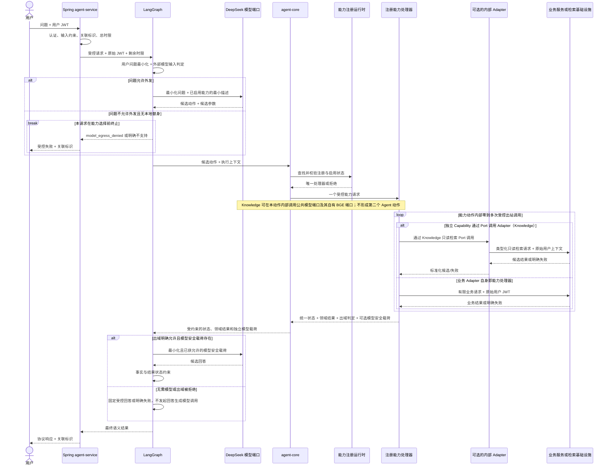

# 单体 Agent 核心与运行架构 L1

> 文档层级：L1
> 文档状态：已评审

## 1. 文档治理信息

| 项目 | 内容 |
|---|---|
| 文档标识 | `SA-L1-CORE-001` |
| 文档层级 | L1 分域/模块架构 |
| 权威范围 | Spring `agent-service`、Python `agent-runtime`、LangGraph 唯一编排、`agent-core`、`agent-capability-api`、能力注册运行时、DeepSeek 模型端口、入口认证和请求级执行 |
| 文档状态 | 已评审 |
| 评审状态 | 已通过 |
| 实施状态 | 未实施 |
| 生效状态 | 未生效 |
| 当前版本 | v0.2 |
| 适用基线 | `SINGLE_AGENT_QUERY_REQUIREMENTS.md` v1.2；`SINGLE_AGENT_ARCHITECTURE.md` v0.4（`SA-GATE-001` 已关闭） |
| 维护责任人 | 项目维护者（个人开发者，姓名未在需求中指定） |
| 目标文档位置 | `docs/design/SINGLE_AGENT_CORE_RUNTIME_ARCHITECTURE.md` |
| 上位 L0 | `docs/design/SINGLE_AGENT_ARCHITECTURE.md` v0.4 |
| 关联 L1 | 计划中的《单体 Agent 知识查询能力架构 L1》《单体 Agent 业务查询适配架构 L1》 |
| 治理的 L2 | Spring 接入与运行协同、Agent 核心执行与能力注册、DeepSeek 模型接入与受控生成详细设计 |
| 外部契约 | `auth-service` 用户 JWT 契约；Agent 对外查询契约；DeepSeek `deepseek-v4-pro` 模型契约 |
| 替代关系 | 新建基线；历史 Agent 实现及已退出工作区的旧设计不得反向定义本文 |

> 本文是 P2 第一份 L1 架构基线。v0.2 已完成五轮独立评审—修订—复核，无未关闭 S0/S1，项目维护者已授权按评审结论完成原子同步，`CR-GATE-001` 已关闭；这只允许开始本文治理的三份 L2，不表示 L2 已定版、实现已开始或任何模型/真实数据集成门禁已关闭。

## 2. 修订历史

| 序号 | 日期 | 文档位置 | 修改内容 | 修改原因 |
|---:|---|---|---|---|
| 1 | 2026-07-24 | 全文 | 创建单体 Agent 核心与运行 L1 架构初稿 | 承接 L0 v0.4，建立核心运行边界、语义契约、质量预算和 L2 分解 |
| 2 | 2026-07-24 | 5.3、6、7.1、9、10.6～10.7、11、13、17 | 澄清 `agent-runtime` 内部模块边界、Capability/Port/Adapter 依赖方向及 Adapter 可替换、可装饰扩展缝隙 | 防止将同进程部署误解为职责混合，并验证未来横切机制可在不侵入核心的前提下扩展 |
| 3 | 2026-07-24 | 5.3、6、7.1、9、10.6～10.7、11、13、17 | 第 1 轮评审修复：将公共结构收敛为注册能力处理器，恢复 Knowledge Capability/Port/Adapter 与业务 Adapter 的差异化边界，并允许单个能力动作内部零到多次受控出站调用 | 关闭 `REV-L1-001/002`，避免 L1 越过 L0 强制新增业务 Capability/Port，并防止通用流程误限 Knowledge 多路检索 |
| 4 | 2026-07-24 | 6.1、7.1～7.3、8、9.2、10.2、11、13 | 第 2 轮评审修复：拆分领域查询结果、模型出域判定与模型安全载荷，并在首次 DeepSeek 调用前增加用户问题输入闸门 | 关闭 `REV-L1-003/004`，防止用户可见结果被直接当作模型载荷，以及问题未经最小化和出域判定即外发 |
| 5 | 2026-07-24 | 5.3、6.2～6.3、7.2、9.2 | 第 3 轮评审修复：显式终止用户问题出域拒绝分支，并补回 Knowledge Capability 对公共模型端口及其自有 BGE 消费端口的合法调用边界 | 关闭 `REV-L1-005/006`，防止拒绝后继续执行，并保持 Knowledge 单动作内部改写、重排和摘要流程可落地 |
| 6 | 2026-07-24 | 4.1、11～13、16～17 | 第 4 轮评审修复：将两种合法能力处理器形态固化为 `CR-AD-008`，并补充双形态与单动作内部多次出站的下位验证 | 关闭 `REV-L1-007/008`，防止 L2 将所有能力错误统一为同一内部结构 |
| 7 | 2026-07-24 | 4.1、7.3、8、9.2～9.3、10.2、11、14.1、16.1、17.3、18.2 | 第 5 轮评审修复：区分“用户问题输入拒绝导致整请求外部模型零调用”与“领域结果出域拒绝导致该载荷不外发、回答生成调用为零”，随后更新为 v0.2、已评审/已通过并关闭 `CR-GATE-001` | 关闭 `REV-L1-009`，避免动作选择已调用模型却与领域结果零调用断言冲突；五轮评审后无执行阻塞、无未关闭 S0/S1 |

## 3. 文档定位与权威关系

### 3.1 架构目标

本文将 L0 已确认的运行拓扑落实为可继续详细设计的模块架构，重点解决：

1. Spring `agent-service` 与 Python `agent-runtime` 的职责、状态和失败边界。
2. LangGraph 唯一编排权威与 `agent-core` 确定性执行约束的分工。
3. 稳定能力契约、启动期注册和运行期只读发现机制。
4. DeepSeek 模型端口及模型输出不可信的控制边界。
5. 认证、总超时、取消、错误、观测和双进程运行的局部质量约束。
6. 为 Knowledge 和业务查询 L1 提供不含业务域规则的稳定上游边界。

### 3.2 上位与同层权威关系

```text
已确认需求 v1.2
  → 单体 Agent L0 v0.4
      → 本文：核心与运行 L1
          → 本文治理的核心与运行 L2
              → 实现与验证证据
      ↔ Knowledge L1：知识查询策略、Knowledge Capability/Adapter、检索与知识出域
      ↔ 业务查询 L1：Employee/Transaction 动作、Adapter、权限联调与业务字段出域
```

- L0 对全局边界、唯一编排权威和安全不变量具有上位权威，本文不得弱化。
- 本文定义三份 L1 共同依赖的核心运行语义，不定义 Knowledge、Employee 或 Transaction 的领域规则。
- 关联 L1 拥有具体能力描述和边界配置；本文只拥有注册机制及通用执行契约。
- L2 可以细化协议、字段、类、参数和测试，但不得改变本文的权威分配。

### 3.3 本文唯一负责

- 一个逻辑 Agent 内两个运行进程的职责、依赖方向和生命周期边界。
- LangGraph 请求级编排状态、`agent-core` 确定性约束及两者的唯一分工。
- `agent-capability-api` 的稳定语义和能力注册运行时的装配、校验、冻结、查找边界。
- DeepSeek 模型端口、供应商隔离、结构化动作候选及受控回答生成边界。
- 入口认证、原始用户 JWT 向运行时传递、请求总时限和取消传播边界。
- 核心错误状态、进程间失败映射、最小日志与双进程部署约束。
- 新增能力不侵入核心业务代码的组合根扩展方式。

### 3.4 本文明确不负责

| 非职责内容 | 唯一负责文档或模块 | 本文使用方式 |
|---|---|---|
| 问题改写、多知识域、多路召回与重排、证据化答案摘要 | Knowledge L1 / `agent-knowledge-capability` | 作为一个 `knowledge.query` 能力调用，不解释其内部阶段为多个 Agent 动作 |
| 逻辑知识域、ES/BGE 消费契约、Knowledge Adapter 和知识证据出域策略 | Knowledge L1 | 消费其能力描述、统一结果和出域判定，不定义检索或策略细节 |
| Employee/Transaction 动作、强类型配置、Adapter、字段脱敏和权限联调 | 业务查询 L1 | 通过统一能力契约调用并原样传递用户身份，不复制业务规则 |
| Employee/Transaction 最终角色授权与业务数据 | 对应业务服务 | 保留其 `401/403` 和业务结果权威，不在 Agent 内替代授权 |
| JWT 签发、用户角色分配及 Authority 映射 | `auth-service`、`common-security` | 依据外部契约验证和透传，不重新定义身份体系 |
| 完整 DTO、接口路径、传输协议、类、方法、配置键和数值参数 | 本文治理的 L2 或外部契约 | 本文仅定义语义、所有权和不可违反的边界 |
| Multi-Agent、工作流、跨域聚合、写入和持久会话 | 未来经上位架构重新立项 | 当前不实现，也不建立通用运行平台 |

### 3.5 适用范围与非目标

适用于第一阶段单实例、查询型单体 Agent 的本地学习和验证环境。本文不追求生产级高可用、动态插件、热更新、分布式注册中心、持久检查点、复杂审计平台或完整 SRE 体系；个人项目的简化不影响认证、授权、失败关闭、契约一致性和可验证性。

## 4. 上位约束映射

### 4.1 直接适用约束

| L0 约束 ID | 本文落实方式 | 本文章节 | 下位验证证据 | 偏差/ADR |
|---|---|---|---|---|
| `SA-C-001` | 两个进程共同组成一个逻辑 Agent；只有 LangGraph 拥有 Agent 编排状态和决策权 | 6、8、10 | 部署清单、依赖扫描、唯一状态所有者测试 | 无 |
| `SA-C-002` | 图在一次请求内最多提交一个已注册且启用的查询动作；核心执行闸门拒绝第二个动作 | 6、9、10 | 单动作、第二动作拒绝和跨域请求测试 | 无 |
| `SA-C-005` | 模型只产生候选；动作、参数、结果和回答均须经过确定性约束 | 7、9、10 | 非法动作、越界参数和无事实回答测试 | 无 |
| `SA-C-007` | Spring 入口验证用户 JWT，运行时保留原始 JWT；缺失身份时不进入能力执行，不使用服务令牌兜底 | 7、9、10 | 无 JWT、非用户令牌、透传及无服务身份回退测试 | 无 |
| `SA-C-008` | 仅保存请求级接入和图状态；不引入会话、业务数据或知识内容存储 | 8、10 | 存储依赖扫描、重启行为测试 | 无 |
| `SA-C-009` | 核心结果状态约束和回答闸门禁止把无结果、失败或不完整结果提升为事实 | 7、9、10 | 故障注入、无结果及不完整结果回答测试 | 无 |
| `SA-C-010` | 新能力通过注册能力处理器、必要的 Adapter/配置和组合根注册接入；核心无业务域条件分支；内部形态遵守 `CR-AD-008` | 6、10、12 | 两种处理器形态、单动作内部多次出站、模拟能力扩展及依赖扫描测试 | 无 |
| `SA-C-011` | JWT、密钥、提示词载荷和敏感结果不进入普通日志；只记录最小关联元数据 | 10、11 | 日志脱敏断言 | 无 |
| `SA-C-012` | 内部运行契约、能力 API 和模型端口的不兼容变化必须同步消费者及契约测试 | 7、10、13 | 兼容性检查和契约测试 | 无 |
| `SA-C-014` | LangGraph 和 DeepSeek 均位于运行/模型端口之后，不进入能力公共语义 | 6、7、12 | 依赖方向和供应商替换测试替身 | 无 |
| `SA-C-018` | 核心只接受 Knowledge 返回的证据充分性和出域状态，不得将失败或证据不足改写为肯定答案 | 7、9、10 | Knowledge 契约替身、拒答、证据载荷不外发和回答生成零调用测试 | 无 |
| `SA-C-019` | Spring 仅接入和治理；动作选择、图推进、工具顺序、语义重试、降级与终止仅由 LangGraph 决定 | 6、9、10、12 | 调用链、故障注入和双重编排拒绝测试 | 无 |

### 4.2 边界适用或由关联 L1 主责的约束

| L0 约束 ID | 适用结论 | 本文边界处理 | 主责下位文档 |
|---|---|---|---|
| `SA-C-003` | 边界适用 | 核心与运行模块不依赖 Employee/Transaction 数据访问实现；具体禁止项由业务 Adapter 落实 | 业务查询 L1 |
| `SA-C-004` | 边界适用 | Agent 不基于角色作最终授权，保持原始 JWT 和 `401/403` 语义 | 业务查询 L1、业务权限 L2 |
| `SA-C-006` | 边界适用 | 注册运行时只接受代码绑定的能力描述及启用状态，不拥有域内配置，也不允许配置生成处理器 | Knowledge L1、业务查询 L1 |
| `SA-C-013` | 边界适用 | 公共能力类别限于本期查询；具体聚合、写入和管理动作不得由关联 L1 注册 | 业务查询 L1 |
| `SA-C-015` | 非本文主责 | 核心将完整 Knowledge 流水线视为一个能力，不定义四阶段算法或流程 | Knowledge L1 |
| `SA-C-016` | 非本文主责 | 核心只路由稳定动作标识；逻辑知识域及 ES 禁止项由 Knowledge 边界校验 | Knowledge L1 |
| `SA-C-017` | 非本文主责 | 核心不依赖 `es-query-service`；只消费 Knowledge 能力结果 | Knowledge L1 |
| `SA-C-020` | 边界适用 | 模型端口只接收业务能力已完成字段收紧和脱敏的载荷；核心不拥有字段策略 | 业务查询 L1 |
| `SA-C-021` | 边界适用 | `model_egress_denied` 或未形成允许载荷时不得调用模型；核心不计算知识三层策略 | Knowledge L1 |

本文未发现需要偏离 L0 的约束，不需要新增 ADR 或修改上位文档。

## 5. 背景、当前基线与目标

### 5.1 背景与问题

当前工作区没有本架构定义的新 Agent 核心与双进程运行实现。现有 Spring Cloud 基础设施、业务服务和 ES 检索模块可作为集成事实来源，但历史 Agent 代码和旧设计不是目标基线。P2 首先需要稳定核心契约，否则 Knowledge 和业务查询 L1 会分别发明运行入口、注册方式、状态语义或模型调用方式，形成隐式耦合。

### 5.2 当前架构

- `auth-service`、Gateway、Config Server、Eureka 和业务服务已存在，但新 Agent 入口尚未建立。
- Python LangGraph 运行时、统一能力 API、注册运行时和 DeepSeek 模型端口尚未实现。
- 用户 JWT、业务域角色闭环、模型结构化动作及双进程失败语义仍需按门禁完成详细设计和验证。
- `LLM_API_KEY` 已由操作系统环境外置；本文和实现不得读取后写入配置、日志或文档。

### 5.3 目标架构

#### 5.3.1 逻辑与部署视图



“一个逻辑 Agent”是对外系统边界，不等于一个操作系统进程。它由 Spring `agent-service` 接入治理进程和 Python `agent-runtime` 编排进程共同组成。`agent-runtime` 是部署与组合边界，不是单一职责代码模块；Orchestration、Core、注册能力处理器、必要的 Outbound Port、Adapter 与 Composition Root 在 Python 进程内保持独立代码边界。Knowledge 按 L0 固定为 Capability → 只读检索 Port ← Adapter；Employee/Transaction Adapter 直接作为注册能力处理器实现能力契约，不强制增加同名 Capability 或 Port。全部 Capability 与 Adapter 都随 `agent-runtime` 同进程部署，不独立形成服务，也不构成外部 Agent；DeepSeek、知识检索基础设施和业务服务位于逻辑 Agent 边界之外。

#### 5.3.2 `agent-runtime` 内部协作视图



实线表示请求期调用，虚线表示启动装配、启动注册或契约依赖，具体语义由边上的标签限定。LangGraph 唯一负责 Agent 动作选择、图状态推进、能力调用顺序、语义重试、降级和终止；`agent-core` 只负责注册查找、单动作闸门、通用校验、调用协调和结果状态约束，不形成第二套编排。注册能力处理器实现 `agent-capability-api`：Knowledge 使用独立 Capability 表达知识查询语义，并通过只读检索 Port 调用 Knowledge Adapter；Employee/Transaction Adapter 直接承担各自业务查询能力处理器与协议适配。Knowledge Capability 在一次已获准的 `knowledge.query` 动作内部可以通过公共模型端口执行问题改写或证据摘要，并通过 Knowledge L1 自有的 BGE 消费端口完成查询向量化和候选重排；这些内部阶段不选择第二个 Agent 动作，也不取得 LangGraph 图状态所有权。Adapter 封装外部协议、客户端和协议失败转换，不拥有动作选择或编排状态。能力注册运行时只保存并返回启动后冻结的能力集合，不主动调用处理器。组合根只在启动期创建和连接具体实现，不进入请求链路。`agent-capability-api` 是代码契约而非独立运行服务。

### 5.4 差距分析

| 维度 | 当前状态 | 目标状态 | 差距 | 处理阶段 |
|---|---|---|---|---|
| 外部接入 | 无新 Agent 入口 | Spring 统一认证、治理和协议封装 | 新建 `agent-service` | 核心运行 L2、P3 |
| 编排运行时 | 无 | Python LangGraph 唯一编排 | 新建 `agent-runtime` 和图 | 核心运行 L2、P3 |
| 核心约束 | 无 | 单动作、注册、参数和结果确定性约束 | 新建无业务分支的 `agent-core` | 核心执行 L2、P3 |
| 能力契约 | 无 | 稳定能力描述、请求、结果和执行上下文 | 新建 `agent-capability-api` | 核心执行 L2、P3 |
| 注册发现 | 无 | 启动组合、校验、冻结和运行时查找 | 新建进程内注册运行时 | 核心执行 L2、P3 |
| 模型接入 | 供应商与入口已确认 | 端口隔离、结构化候选、受控生成 | 契约和 PoC 尚未完成 | DeepSeek L2、`SA-GATE-002` |
| 运行治理 | 基础设施可复用 | 双进程健康、总时限、取消和统一观测 | 语义已在本文定义，细节待设计 | Spring 协同 L2、P3 |

### 5.5 设计假设与限制

1. 第一阶段只运行一个逻辑 Agent 实例，允许 Spring 与 Python 各一个进程。
2. 每个请求最多执行一个注册查询动作；Knowledge 内部多域、多路召回不计作多个 Agent 动作。
3. 全部能力只读，不建立跨系统事务、补偿或持久检查点。
4. 配置在启动期绑定和校验，运行期只读，变更通过重启生效。
5. 内部传输协议、接口字段、超时数值和并发数由 L2 基于本地环境确定。
6. Gateway、Eureka、Config Server 可复用但不是能力正确性或权限正确性的唯一前提。

## 6. 职责与边界

### 6.1 核心职责

| 职责 | 输入 | 产出 | 所有权 | 不负责事项 |
|---|---|---|---|---|
| 外部接入治理 | 用户问题、用户 JWT、调用元数据 | 已认证且有界的运行时请求 | `agent-service` | 动作选择、图推进和 Adapter 调用 |
| 请求编排 | 受控运行时请求、模型候选、能力结果 | 请求级状态迁移和最终语义结果 | LangGraph | 外部协议、业务授权和领域规则 |
| 确定性执行约束 | 候选动作、参数、执行上下文 | 可执行调用或明确拒绝 | `agent-core` | 模型推理、业务规则和第二套流程 |
| 能力公共语义 | 能力描述、请求、结果、执行上下文 | 跨能力稳定契约 | `agent-capability-api` | 业务 DTO、URL、角色和供应商字段 |
| 能力注册运行态 | 代码绑定的能力提供者及启用信息 | 启动校验后的只读可执行集合 | `agent-runtime` | 动态加载、域内动作配置和热更新 |
| 注册能力处理 | 受控能力请求、执行上下文 | 领域边界约束后的统一能力结果，以及独立的模型出域判定和可选模型安全载荷 | 对应 Knowledge Capability 或业务 Adapter | 动作选择、图推进、最终业务授权和放宽出域范围 |
| 外部系统适配 | 受控查询请求、执行上下文 | 外部调用结果、统一能力结果或协议失败 | 对应 Adapter | 动作选择、图推进和最终业务授权 |
| 模型接入 | 受控提示语义和允许出域载荷 | 结构化候选或候选回答 | 模型端口及提供方实现 | 动作执行、出域策略判定和业务授权 |
| 运行治理 | 关联标识、总时限、取消、健康与日志元数据 | 可定位且有界的双进程运行 | Spring 与 Python 各自进程 | 生产级 HA 和复杂审计平台 |

### 6.2 模块内部逻辑组件

| 逻辑组件 | 架构职责 | 依赖 | 边界 | 扩展价值 |
|---|---|---|---|---|
| `agent-service` | 外部协议、JWT 验证、输入约束、限流、关联标识、总时限、取消和响应封装 | 安全契约、运行时入口 | 不包含 LangGraph 节点或业务 Adapter | 隔离 Spring Cloud 治理与 Python 编排 |
| 运行时入口 | 接收 Spring 已治理请求并绑定运行上下文 | 内部运行契约、LangGraph | 仅内部可达；不成为第二个外部 Agent | 允许内部协议独立演进 |
| LangGraph 图 | 唯一拥有动作选择、状态推进、工具顺序、语义重试、降级和终止决策 | 模型端口、`agent-core` | 不绕过核心执行闸门 | 为未来更换编排实现保留端口 |
| `agent-core` | 动作查找、通用参数约束、单动作闸门、调用协调和结果状态约束 | 注册运行时、能力 API | 无领域分支、无第二状态机 | 稳定已有能力 |
| `agent-capability-api` | 表达能力标识、描述、请求、结果和执行上下文语义 | 无具体实现依赖 | 不泄漏框架、供应商或业务协议 | 支持新增查询能力 |
| 能力注册运行时 | 组合能力描述与代码处理器，检测重复、缺失和非法启用状态后冻结 | 组合根、能力 API | 运行期不写、不动态加载 | 提供有限发现入口 |
| 注册能力处理器 | 实现能力 API 并执行一个受控查询动作；当前包括 Knowledge Capability、Employee Adapter 和 Transaction Adapter | 能力 API；需要时依赖领域 Port | 不依赖 `agent-core` 执行实现，不形成第二编排 | 不同能力形态通过同一执行契约接入 |
| Knowledge 只读检索 Port | 表达 Knowledge Capability 使用检索基础设施所需的最小稳定语义 | 无具体客户端依赖 | 不暴露 URL、SDK、物理索引或传输字段 | 允许替换 Knowledge Adapter 或测试替身 |
| Knowledge Adapter | 实现 Knowledge 只读检索 Port，完成检索协议映射、客户端调用和候选/失败标准化 | Knowledge Port、外部检索契约和客户端 | 不实现知识查询编排，不依赖 LangGraph 或 `agent-core` | 检索接入变化不侵入 Knowledge Capability 与核心 |
| Employee/Transaction Adapter | 直接实现能力 API，完成本域动作边界校验、协议映射、用户上下文透传、客户端调用和结果标准化 | 能力 API、对应业务契约和客户端 | 不依赖 LangGraph 或 `agent-core`，不选择动作、不实施最终业务授权 | 业务接口变化不侵入核心或其他 Adapter |
| DeepSeek 模型端口 | 隔离结构化动作、Knowledge 内部改写/证据摘要和最终回答生成所需的供应商语义 | 受控提供方实现 | 不接受未通过对应输入或出域边界的用户问题、业务结果或知识载荷；不拥有调用时机和领域 Prompt | 支持 LangGraph 与 Knowledge 的受控调用、测试替身和未来供应商替换 |
| 组合根 | 在启动期装配图、核心、注册表、模型实现、注册能力处理器及必要的 Port/Adapter | 全部内部模块 | 是唯一知道具体实现集合的地方；不进入请求链路 | 新能力、处理器替换或装饰只增加装配，不改核心业务逻辑 |

### 6.3 同层边界

| 关联 L1 | 对方权威范围 | 本文责任 | 交互语义 | 禁止侵入事项 |
|---|---|---|---|---|
| Knowledge L1 | `knowledge.query` 内部流水线、知识配置、Knowledge Adapter、BGE 消费端口、检索集成和知识出域 | 提供能力 API、注册、执行上下文、公共模型端口和通用结果语义 | 将 Knowledge 作为一个能力执行；允许其在单动作内部调用公共模型端口及自有 BGE 端口；接收其证据充分性及出域状态 | 核心不得定义知识域、索引、召回、重排、领域 Prompt 或文档策略 |
| 业务查询 L1 | Employee/Transaction 动作、Adapter、字段边界、脱敏和权限联调 | 提供能力 API、注册、JWT 上下文和通用失败语义 | 每次仅调用一个业务动作；保留业务服务最终授权结果 | 核心不得保存角色白名单、业务 DTO 或字段配置 |

### 6.4 依赖方向和循环检查

允许的主要方向为：

```text
agent-service
  → agent-runtime 入口
      → LangGraph
          → agent-core
              → 能力注册运行时
              → agent-capability-api
                  ← Knowledge Capability
                      → Knowledge 只读检索 Port
                          ← Knowledge Adapter
                  ← Employee / Transaction Adapter
          → DeepSeek 模型端口
              ← DeepSeek 提供方实现
```

- Spring 不依赖 LangGraph 图、核心实现、能力实现或 Adapter。
- 核心只依赖能力 API 与注册运行时，不依赖具体 Capability、Adapter、业务客户端或供应商 SDK。
- Knowledge Capability 依赖能力 API 与 Knowledge 只读检索 Port，不依赖核心执行实现或具体 Knowledge Adapter。
- Knowledge Adapter 实现 Knowledge 只读检索 Port；Employee/Transaction Adapter 直接实现能力 API。三者可依赖各自外部契约和客户端，但不得依赖 LangGraph 或 `agent-core`。
- 组合根可以知道具体实现以完成装配、替换或装饰，但请求期业务调用不得经组合根形成旁路。
- 当前依赖图无循环；若 L2 引入反向调用、回调式第二编排或共享可变注册对象，必须回到本文重新评审。

## 7. 语义契约与交互

### 7.1 入站与内部契约

| 契约/能力 | 提供方 | 调用方 | 语义 | 权限、失败与兼容性要求 |
|---|---|---|---|---|
| Agent 对外查询契约 | `agent-service` | 用户或 Gateway | 接收一个自然语言查询并返回回答或明确状态 | 必须有有效用户 JWT；输入有界；响应保留关联标识；字段和路径由 L2 定义 |
| Spring → LangGraph 运行契约 | `agent-runtime` | `agent-service` | 传递问题、原始用户 JWT、关联标识、剩余总时限和取消语义 | 不得携带候选动作或图状态；重复接收不等于可重复执行；协议由 L2 定义 |
| 能力注册契约 | 能力注册运行时 | 组合根和具体能力 | 在启动期提交代码绑定的稳定能力描述及处理器 | 重复标识、缺失处理器、非法类别或无效启用状态必须启动失败 |
| 能力执行契约 | 注册能力处理器 | `agent-core` | 接收受控请求和执行上下文，分别返回统一结果状态、受控领域结果、模型出域判定和可选模型安全载荷 | 处理器可以是独立 Capability 或业务 Adapter；必须保留 JWT 和总时限；模型安全载荷不得由核心从领域结果自行推导；不得暴露原始协议异常供模型自由解释 |
| Knowledge 出站端口契约 | Knowledge Adapter | Knowledge Capability | 以最小稳定语义访问知识检索基础设施并返回标准化候选/失败结果 | 不暴露动态 URL、物理索引、任意协议载荷或编排状态；字段和映射由 Knowledge L1/L2 定义 |
| 核心执行约束 | `agent-core` | LangGraph 节点 | 对候选动作执行查找、通用校验、单动作闸门和结果约束 | 拒绝不得被图绕过；核心不替代能力的领域校验 |

### 7.2 出站依赖

| 依赖 | 权威方 | 使用目的 | 失败语义 | 超时、重试与降级边界 |
|---|---|---|---|---|
| 用户 JWT 契约 | `auth-service` / `common-security` | 入口认证及原始身份透传 | 无效、过期、非用户令牌为 `unauthenticated` | 不重试，不回退服务身份 |
| DeepSeek 模型契约 | DeepSeek 提供方，经模型端口隔离 | 结构化动作候选、Knowledge 内部改写/证据摘要和受控最终回答生成 | 超时、无效结构或提供方失败必须与无结果区分 | 用户问题也属于外部模型载荷；每个调用方先完成其输入/出域闸门并消耗同一请求总预算；敏感问题受 `CR-GATE-003` 控制；默认不自动重试 |
| 关联能力执行契约 | Knowledge 或业务查询 L1 | 执行一个已注册查询动作 | 保留 `no_result`、`forbidden`、`model_egress_denied`、超时和下游失败 | 核心不跨能力降级；`401/403` 和参数拒绝永不重试 |
| 配置与服务发现 | 现有基础设施或本地受控配置 | 提供环境地址和非敏感运行参数 | 缺失关键配置时启动失败；发现失败为依赖不可用 | 服务地址不能由模型生成；不以宽松缺省继续 |

### 7.3 统一结果和失败语义

本文继承 L0 的 `success`、`no_result`、`unsupported`、`invalid_argument`、`unauthenticated`、`forbidden`、`timeout`、`downstream_failure`、`model_egress_denied` 和 `internal_failure` 语义。

- Spring 只将运行时语义映射为外部协议，不得把拒绝、失败或超时改写为成功。
- LangGraph 可以决定是否需要模型生成自然语言表达，但不得改变确定性结果状态。
- 统一能力结果必须将领域查询结果与模型安全载荷分离；用户或本地流程可使用某个领域结果，不代表该结果允许发送给 DeepSeek。
- 模型出域判定由对应能力按领域策略给出，至少在语义上区分允许、拒绝和不适用；只有“允许”且模型安全载荷存在时，LangGraph 才能调用模型端口。具体枚举、字段和序列化由关联 L1/L2 定义。
- `agent-core` 只校验出域判定与载荷存在性的组合是否合法，不拥有领域出域策略，也不得从领域结果补造、扩大或重新分类模型载荷。
- 无结果、无权限、参数错误和明确失败允许使用不含业务事实的固定受控回答，不强制再次调用模型。
- `model_egress_denied`、未分类或没有安全模型载荷时，该领域结果不得进入任何 DeepSeek 请求，基于该结果的回答生成调用必须为零；此前仅携带已通过输入闸门的最小化用户问题与能力描述的动作选择调用不在此计数内。
- 精确字段、错误码、HTTP 状态及跨语言序列化规则由 L2 定义。

### 7.4 契约演进

1. 能力 API 只包含三类查询共同需要的语义；新增单个能力不得推动无证据的通用字段。
2. 向后兼容扩展可按 L2 版本策略演进；删除、改义或收紧公共语义必须同步全部消费者和契约测试。
3. Spring/LangGraph 内部协议与能力 API 分别版本化，传输变化不得渗入能力契约。
4. DeepSeek 供应商字段只存在于模型端口实现；供应商变化不应修改能力实现。
5. 不允许用任意 JSON、动态类名、动态 URL 或配置脚本规避公共契约演进。

## 8. 数据、状态与运行时所有权

| 对象/状态/事实 | 权威方 | 写入边界 | 读取边界 | 一致性/生命周期 |
|---|---|---|---|---|
| 用户身份和角色声明 | `auth-service` | 仅认证体系签发 | Spring 验证；运行时和 Adapter 只读透传 | JWT 有效期内；Agent 不修改 |
| Spring 接入请求状态 | `agent-service` | 接收、认证、治理和响应期间 | Spring 进程 | 单请求、非持久；完成或断开后释放 |
| Agent 编排状态 | LangGraph | Python 请求执行期间 | LangGraph 节点及受控核心服务 | 单请求、非持久；LangGraph 唯一写入 |
| 单动作执行闸门 | `agent-core` 依附当前执行上下文 | 首次合法能力提交时 | 核心及图的受控节点 | 单请求；禁止第二次能力执行 |
| 能力公共语义 | `agent-capability-api` | 通过版本化代码变更 | 核心及全部能力实现 | 构建期稳定 |
| 当前可执行能力集合 | `agent-runtime` 注册运行时 | 启动期组合并冻结 | LangGraph 和核心只读查找 | 进程生命周期；重启重建 |
| 具体能力描述和边界配置 | 对应 Knowledge/业务能力 | 对应模块启动配置 | 注册运行时读取最小描述；能力执行时自用 | 运行期只读；本文不取得所有权 |
| 模型凭证 | 操作系统环境及模型端口实现 | 运维环境 | 仅提供方实现读取 | 不进入图状态、能力结果或日志 |
| 模型请求和响应 | 当前 LangGraph 请求 | 仅在受控模型调用期间 | 调用节点及必要校验 | 短生命周期；不持久化 |
| 业务或知识结果 | 对应权威系统/能力 | Agent 不写 | 当前请求在策略允许范围内使用 | 不缓存、不成为 Agent 事实源 |
| 模型出域判定和模型安全载荷 | 对应 Knowledge/业务能力 | 能力在回答生成模型调用前按本域策略计算；核心不得改写 | LangGraph 只在明确允许时读取并传给模型端口 | 当前请求内短生命周期；与领域结果分离；拒绝、缺失或冲突时该载荷不外发且回答生成调用为零 |
| 关联标识和耗时元数据 | Spring 创建并全链路传递 | 各边界追加本地观测 | 日志和本地指标 | 按现有日志生命周期保存，不含敏感正文 |

本文不建设数据库、缓存、会话存储、消息队列或 LangGraph 持久检查点。进程重启会终止在途请求，调用方获得明确失败后自行决定是否发起新请求。

## 9. 核心流程和失败闭环

### 9.1 启动与注册

1. 两个进程分别加载并校验本进程配置。
2. Python 组合根装配 LangGraph、核心、模型端口和已启用能力。
3. 各能力提交代码绑定的能力描述与处理器；注册运行时校验稳定标识、类别、重复、处理器和启用状态。
4. 注册集合冻结后 `agent-runtime` 才可就绪；运行期间不增加、替换或删除能力。
5. Spring 只有在运行时入口可达且自身安全配置有效时才对外就绪；外部模型短暂不可用不改变本地配置有效性，但调用时必须明确失败。

### 9.2 请求执行



### 9.3 失败、超时与取消

| 触发点 | 状态权威 | 必须行为 | 禁止行为 | 恢复方式 |
|---|---|---|---|---|
| JWT 无效或缺失 | Spring | 返回 `unauthenticated`，不调用运行时 | 服务身份回退 | 用户重新认证后发起新请求 |
| 无单一合法动作 | LangGraph + 核心闸门 | 返回 `unsupported` 或 `invalid_argument`，不调用能力 | 猜测 URL、执行多个动作或跨域兜底 | 用户缩小或修正问题 |
| 模型输出非法 | 核心 | 确定性拒绝；是否在剩余预算内重新澄清仅由 LangGraph 决定 | Spring 或 Adapter 重试模型 | 返回明确状态 |
| 能力返回无结果/拒绝 | 能力为事实权威，核心约束状态 | 保持 `no_result` 或 `forbidden` | 改写为成功事实、换身份或换能力 | 用户修改合法条件后新请求 |
| 模型出域拒绝 | 对应能力策略判定 | 返回 `model_egress_denied` 或受控非模型结果；该领域结果不外发，回答生成模型调用为零 | 核心扩大字段、忽略未知策略，或把此前动作选择调用误算为领域载荷已获准 | 修正策略/数据分类后新请求 |
| 运行时或下游超时 | Spring 总时限、LangGraph 剩余预算 | 传播取消，停止安排新节点，丢弃逾期结果 | Spring 重放整个 Agent 请求 | 调用方明确获知失败后决定新请求 |
| 任一进程退出 | 各进程生命周期 | 健康检查失败，在途请求明确失败 | 假定请求已成功或断点续跑 | 重启故障进程并重新发起请求 |

本期没有持久执行记录，因此不存在自动续跑。取消是停止后续工作和忽略逾期结果的边界，不承诺中断已经进入外部系统的只读调用；该限制不产生业务写入，但仍需通过总时限和并发上限控制资源。

### 9.4 新增能力

新增一个查询能力时，只允许：

1. 新增一个实现能力 API 的注册能力处理器；仅在能力语义与外部协议需要独立演进时增加对应 Port 和 Adapter。
2. 新增该能力自有的强类型配置。
3. 在组合根提交实现，并由注册运行时完成校验和冻结。
4. 增加契约、权限、失败路径及处理器替换测试；存在独立 Port/Adapter 时再增加 Adapter 替换测试。

不得修改 `agent-core` 增加业务域分支，不得修改其他能力实现，也不得扩展为动态插件平台。扩展性验证可以由组合根在能力 API 或已存在的领域 Port 边界绑定测试替身或测试装饰器；该验证只证明处理器或 Adapter 可替换、可装饰，不强制为简单业务 Adapter 新增 Port，也不引入或预先确定熔断、降级、重试等机制的归属与实现。

## 10. 关键架构机制

### 10.1 一致性、事务、幂等与补偿

- 全部动作只读，核心与运行时不创建分布式事务或补偿。
- 一个请求只允许一次能力执行提交；回答生成不是第二个能力动作。
- 第一阶段不做自动业务重试，也不在 Spring/运行时边界自动重放完整 Agent 请求。
- 客户端重复提交视为新请求；若未来需要去重或接受确认机制，必须由 L2 形成明确契约并回到本文评估。
- `401/403`、参数错误、业务拒绝和出域拒绝永不重试。
- 若 L2 提议模型传输重试，必须由 LangGraph 单独拥有、限定可重试错误并消耗同一总时限；不得形成语义双执行。

### 10.2 安全、权限、隐私与审计

- Spring 验证 JWT 签名、有效期、主体及 `token_type=user`；原始用户 JWT 只通过受控内部契约传递。
- `agent-runtime` 入口仅供 `agent-service` 调用，不对外形成可绕过 Spring 的第二入口；具体网络保护由 L2 定义。
- 核心和 Adapter 不保存角色白名单；业务服务仍是 Employee/Transaction 最终授权点。
- 模型输出、用户文本、检索内容和下游响应均是不可信输入，不能扩大动作、字段、URL、索引或调用次数。
- 用户原始问题在首次 DeepSeek 调用前必须执行最小化和外部模型输入边界检查；判定拒绝、缺失或冲突时外部模型零调用。`CR-GATE-003` 未关闭时只允许非敏感测试问题或本地测试替身，不得以“尚未查询业务数据”为由默认外发敏感文本。
- 模型端口只接收关联能力已完成出域收紧和脱敏的载荷；核心不重新判定或放宽领域策略。
- 完整 JWT、模型密钥、密码、未裁剪业务结果和不必要知识正文不得进入模型载荷或日志。
- 第一阶段只要求最小可追踪事件，不建设独立审计平台。

### 10.3 性能、容量、限流与降级

- Spring 拥有外部请求总时限、请求大小、入口速率和并发上限。
- LangGraph 只在剩余总时限内分配模型、核心和能力调用预算；所有子预算之和及保护余量不得超过总时限。
- 内部排队、模型上下文、动作描述数量和结果大小必须有界；具体数值由 L2 和本地验证确定。
- 下游或模型不可用时返回明确失败，不降级为伪造数据、服务身份、其他业务域或更宽查询。
- 本期不承诺生产级吞吐与延迟 SLO，但每个阶段必须能测量耗时并验证不会无界等待。

### 10.4 可用性、韧性、恢复与取消

- Spring 与 Python 进程分别提供存活和就绪语义；Python 就绪要求图、注册表和关键配置有效。
- 单实例故障通过重启恢复；不建设集群、主备、持久检查点或请求续跑。
- Spring 断开、总时限耗尽或主动取消时向运行时传播取消，运行时停止安排新的模型或能力调用。
- 单个能力在一次请求中失败不影响其他能力在后续独立请求中使用。
- 关键配置校验失败时对应进程启动失败，不使用宽松默认值。

### 10.5 日志、指标、追踪与告警

每个请求至少可关联以下信息：

- 关联标识、能力标识、动作标识和目标域。
- Spring 接入、运行时编排、模型和能力调用的状态与耗时。
- 最终结果状态、失败边界和取消/超时来源。
- 注册表版本或等价启动实例标识，以定位当前启用集合。

日志只记录必要元数据，不记录完整 JWT、密钥、完整提示词、原始查询向量或不必要敏感正文。第一阶段复用现有日志设施；跨进程使用同一关联标识即可，不强制建设复杂分布式追踪平台。

### 10.6 部署、运行时和运维边界

- `agent-service` 和 `agent-runtime` 是两个独立进程、一个逻辑 Agent 实例，可由同一本地脚本或 Compose 统一启停，但必须分别健康检查。
- `agent-service` 对外，`agent-runtime` 仅暴露受控内部入口；注册能力处理器、必要的领域 Port、Adapter 与组合根均为 Python 运行时内部代码模块并同进程部署，但保持 L0 规定的独立职责和单向依赖。
- 不新增 Agent 数据库、缓存、消息队列、独立注册中心或 `knowledge-service`。
- Config Server、Eureka 和 Gateway 可选复用；直连和服务发现模式必须保持相同认证和超时语义。
- 配置通过重启生效，不支持热更新；密钥只从受控环境注入。

### 10.7 兼容性与扩展点

- 稳定扩展点只有能力 API、已由领域架构明确需要的 Outbound Port、启动注册入口、模型端口和运行时入口契约。
- 组合根增加模块依赖、替换能力处理器/Adapter 或以装饰方式包装其稳定契约属于允许的装配变更，不属于核心业务侵入。
- 本阶段只验证上述扩展缝隙存在：替换或装饰处理器/Adapter 时不得修改 LangGraph、`agent-core`、能力 API 或其他能力实现；具体横切机制及其归属不在本文本次范围内。
- Multi-Agent 仅保留编排与能力实现分离、统一执行上下文和注册入口，不建设 Agent 间协议或分布式发现。
- 聚合、工作流和写入未来必须由上位架构新增能力类型或编排边界，不能混入现有查询核心。

## 11. 质量属性预算

| 质量属性 | L0 目标 | 本文预算/承诺 | 验证方式 | 不得弱化项 |
|---|---|---|---|---|
| 编排唯一性 | 一个逻辑 Agent、一个 LangGraph 权威 | Spring、核心和 Adapter 均不拥有第二状态机；每请求最多一个能力动作 | 依赖扫描、调用链和第二动作拒绝测试 | `SA-C-001/002/019` |
| 安全 | 全查询用户身份、业务最终授权、模型数据最小化 | 100% 请求须有用户 JWT；零服务身份回退；原始问题和领域结果分别经过输入/出域闸门；输入拒绝时整请求外部模型零调用；领域结果拒绝时该载荷不外发且回答生成调用为零 | 401/403、JWT 透传、输入闸门、结果/载荷隔离、分阶段零调用和日志脱敏测试 | 不得以个人项目为由跳过 |
| 事实正确性 | 失败和不完整结果不得成为事实 | 结果状态不可被 Spring/模型改义；无安全事实可使用固定失败回答 | 故障注入和回答断言 | `SA-C-009/018` |
| 有界执行 | 无界查询和等待不可接受 | 一项总时限、图内剩余预算、入口并发/大小和各依赖上限均须在 L2 数值化 | 超时、取消、容量边界测试 | Spring 不自动重放 |
| 可恢复性 | 单实例可重启恢复 | 进程分别健康检查；重启丢弃在途状态并恢复新请求服务 | 启停和故障测试 | 不宣称断点续跑或 HA |
| 可观测性 | 最小关联和失败定位 | 每请求一个关联标识；模型和能力边界均记录状态与耗时 | 日志/指标断言 | 不记录敏感载荷 |
| 扩展性 | 新能力不侵入现有能力 | 新增模拟能力只新增能力处理器、必要配置、装配和测试；只有领域架构明确分离能力语义与外部协议时才新增 Port/Adapter；处理器或 Adapter 可由测试替身替换/包装，不改核心业务分支 | 两种处理器形态、单动作内部多次出站、替换/装饰和依赖检查 | 不演化为动态插件平台，不强制统一内部形态或预设横切机制实现 |
| 兼容性 | 公共契约变化可验证 | 不兼容变化必须同步消费者与契约测试 | 跨语言、能力 API 和模型端口契约测试 | 不得仅靠配置掩盖不兼容 |

## 12. 核心架构决策

| 决策 ID | 决策 | 备选方案 | 选择理由 | 影响范围 | 风险 | ADR |
|---|---|---|---|---|---|---|
| `CR-AD-001` | Spring 与 Python 两个进程组成一个逻辑 Agent | 单 JVM/Python 嵌入；拆成多个 Agent 服务 | 复用 Spring Cloud 治理和 LangGraph 原生能力，同时保持单一 Agent 权威 | 部署、运行契约 | 新增进程边界和失败模式 | 无，承接 `SA-AD-001` |
| `CR-AD-002` | LangGraph 唯一编排，`agent-core` 只提供确定性无状态约束 | Spring 编排；核心自建状态机 | 避免双重决策、重复调用和状态分裂 | 核心流程 | 边界实现不清会出现隐式编排 | 无，承接 `SA-AD-013` |
| `CR-AD-003` | 使用稳定能力 API 和启动期冻结的进程内注册表 | 核心硬编码业务分支；动态插件注册 | 满足可扩展性并控制个人项目复杂度 | 能力接入 | API 过宽或配置所有权混淆 | 无，承接 `SA-AD-002/005` |
| `CR-AD-004` | Spring 拥有总时限与入口治理，LangGraph 消耗剩余预算且 Spring 不重放请求 | 各层独立超时和重试 | 防止超时放大、重复动作和责任不清 | 可靠性 | 内部协议需正确传播剩余时限和取消 | 无 |
| `CR-AD-005` | DeepSeek 经模型端口接入，候选输出始终经过确定性校验 | 核心直接依赖供应商 SDK | 隔离供应商协议和不可信模型输出 | 模型接入 | 结构化动作稳定性待 PoC | 无，承接 `SA-AD-007` |
| `CR-AD-006` | 不持久化会话、图状态或业务结果 | LangGraph 持久检查点、Agent 记忆库 | 本期单次只读查询不需要持久状态 | 状态与恢复 | 进程退出会丢失在途请求 | 无，承接 `SA-AD-009` |
| `CR-AD-007` | 配置启动校验、运行只读、重启生效 | 热更新和远程动态执行 | 降低状态一致性和安全复杂度 | 配置、运维 | 重启影响在途请求 | 无 |
| `CR-AD-008` | 能力 API 注册“可执行处理器”而不强制统一内部形态：Knowledge 使用独立 Capability → Port ← Adapter，Employee/Transaction Adapter 直接实现能力 API | 为三类能力统一增加 Capability/Port/Adapter；核心直接识别具体模块 | 继承 L0 `SA-AD-002/004/011`，保留 Knowledge 策略复杂度与业务 Adapter 简洁性，同时让核心只依赖同一执行契约 | 能力接入、组合根、关联 L1/L2 | 下位设计若按名称或结构类型分支会重新形成核心耦合 | 无 |

## 13. L2 下位交付拆分

| L2 文档/交付 | 负责范围 | 承接的 L0/L1 约束 | 前置依赖 | 验证门禁 | 不负责事项 |
|---|---|---|---|---|---|
| 《单体 Agent Spring 接入与运行协同 L2》 | 对外查询契约、JWT 入口、Spring→Python 内部协议、总时限、取消、协议错误映射、双进程健康/部署和跨进程观测 | `SA-C-001/007/011/012/019`；`CR-AD-001/004` | 本文正式评审；外部 JWT 契约 | `CR-GATE-001`；实现前 `CR-GATE-002` | 图节点、能力 API、领域 Adapter、模型供应商字段 |
| 《单体 Agent 核心执行与能力注册 L2》 | LangGraph 请求状态、核心确定性闸门、能力 API、执行上下文、统一结果、领域结果与模型安全载荷的公共隔离语义、组合根、注册校验与冻结；分别以“独立 Capability+Port+Adapter”和“Adapter 直接实现能力 API”测试替身验证注册执行、替换/装饰及单动作内部多次出站 | `SA-C-002/005/008/009/010/012/014/018/019`；`CR-AD-002/003/006/007/008` | 本文正式评审 | `CR-GATE-001`；实现前 `CR-GATE-002` | Knowledge 流水线、具体业务 Adapter、业务 DTO、领域出域策略、横切机制具体设计和供应商协议 |
| 《单体 Agent DeepSeek 模型接入与受控生成 L2》 | 模型端口、`deepseek-v4-pro` 契约、凭证映射、用户问题最小化与输入闸门、结构化动作 PoC、响应校验、模型预算/重试边界和领域出域调用闸门集成 | `SA-C-005/009/011/014/018`；`CR-AD-005` | 核心执行语义；关联 L1 的出域判定语义 | `CR-GATE-001`；定版与真实实现受 `SA-GATE-002` 控制；敏感问题受 `CR-GATE-003` 控制；领域真实数据受 `SA-GATE-006` 控制 | Knowledge/业务出域策略计算、领域 Prompt 和检索模型 |

### 13.1 覆盖与重叠检查

| 核心职责/机制 | 对应 L2 | 是否覆盖 | 是否重叠 | 说明 |
|---|---|---|---|---|
| 外部接入、认证、内部协议、总时限和取消 | Spring 接入与运行协同 | 是 | 否 | 该 L2 拥有协议与进程协同，核心 L2 只消费执行上下文 |
| LangGraph 状态与核心执行闸门 | 核心执行与能力注册 | 是 | 否 | Spring L2 不定义图状态 |
| 能力 API、注册、组合根、结果/模型载荷隔离语义和扩展缝隙验证 | 核心执行与能力注册 | 是 | 否 | 核心 L2 只定义公共隔离与合法组合；领域出域策略由关联 L1/L2 拥有；使用两种模拟处理器形态验证注册、替换、装饰和单动作计数，不能按具体形态在核心分支 |
| DeepSeek 端口、供应商协议和结构化 PoC | DeepSeek 模型接入与受控生成 | 是 | 否 | 核心 L2 定义调用语义，不定义供应商字段 |
| 跨进程错误与观测 | Spring 接入与运行协同 | 是 | 无实质重叠 | 核心 L2产生统一语义，Spring L2只做协议映射和传递 |
| 领域出域决策 | Knowledge/业务查询 L1/L2 | 是，由关联文档覆盖 | 否 | DeepSeek L2只校验调用前提，不计算领域策略 |

下位交付以三份 L2 为最小集合，不再拆分独立注册、错误、观测或部署文档。建议先稳定“核心执行与能力注册”语义，再并行细化 Spring 协同和 DeepSeek 接入；这不改变三份 L1 的文档顺序。

## 14. 演进、迁移、发布与回滚

| 阶段 | 目标状态 | 架构动作 | 验证门禁 | 回滚边界 | 临时项删除条件 |
|---|---|---|---|---|---|
| P2-L1 | 核心与运行边界已评审 | 完成本 L1 五轮评审并与 L0/索引同步 | `CR-GATE-001` 已关闭 | 回退至 v0.1 草稿并重新打开门禁 | 无 |
| P2-L2 | 三份核心运行 L2 可实施 | 固化内部契约、核心执行和模型接入细节 | `SA-GATE-002` 按动作控制 | 回退对应 L2，不影响业务服务 | PoC 测试替身在真实模型契约通过后可保留为回归替身 |
| P3-核心 | 双进程、核心、注册和模拟能力通过测试 | 按 L2 实现最小运行骨架 | `CR-GATE-002` | 停止两个新进程或回退新增模块 | 无 |
| P3/P4-能力 | 关联能力逐项接入 | 通过稳定能力契约装配 Knowledge/业务能力 | 各关联 L1 的切片门禁 | 独立禁用失败能力 | 临时模拟能力在三类真实能力验证后移出默认启用集合 |
| P4-真实模型/数据 | 受控模型链路通过 | 在输入与出域策略门禁关闭后使用真实允许数据 | `SA-GATE-002/006`、`CR-GATE-003` | 禁用模型生成，保留明确非模型失败语义 | 未获批准的测试数据不得转为真实载荷 |

### 14.1 阶段门禁与外部证据治理

| 门禁 ID | 类型 | 适用阶段/模块切片 | 控制动作 | 关闭条件/证据类别 | 责任方/外部提供方 | 最晚关闭阶段 | 未关闭时允许/禁止动作 | L2 承接 |
|---|---|---|---|---|---|---|---|---|
| `CR-GATE-001` | `design_decomposition` | 本 L1 → 核心运行 L2 | 开始本文治理的三份 L2 | **已满足（2026-07-24）**：v0.2 完成五轮独立评审—修订—复核，无未关闭 S0/S1；项目维护者已授权按评审结论同步职责、同层边界、能力契约和 L2 分解 | 项目维护者、独立评审方 | 核心运行 L2 开始前 | 已关闭；允许开始三份核心运行 L2；禁止据此开始代码实现、声明 L2 已定版或绕过 `SA-GATE-002`、`CR-GATE-002/003`、`SA-GATE-006` | 三份核心运行 L2 |
| `SA-GATE-002` | `design_decomposition` / `slice_implementation` | DeepSeek 接入 | 定版 DeepSeek L2 并进入真实模型实现 | Spring/LangGraph 内部契约、DeepSeek 契约和受控结构化动作 PoC 完成 | 项目维护者、模型提供方 | DeepSeek L2 定版前 | 允许模型无关 L2 和测试替身；禁止真实模型实现 | DeepSeek 模型接入与受控生成 L2 |
| `CR-GATE-002` | `slice_implementation` | 核心与运行模块 | 开始 `agent-service`、`agent-runtime`、核心、能力 API 和注册运行时实现 | 对应 L2 已评审可实施；跨语言契约、失败映射、测试追踪和回滚范围明确 | 项目维护者 | P3 核心实现前 | 允许 L2、契约样例和隔离 PoC；禁止实现宣称完成 | Spring 协同、核心执行 L2 |
| `CR-GATE-003` | `integration` | 用户问题进入 DeepSeek | 向外部模型发送可能含敏感信息的原始或改写问题 | DeepSeek L2 固化问题最小化、允许/拒绝边界和零调用测试；未分类时失败关闭 | 项目维护者、模型提供方 | 首次敏感问题联调前 | 只允许非敏感测试问题或本地替身；禁止默认外发敏感文本 | DeepSeek 模型接入与受控生成 L2 |
| `SA-GATE-006` | `integration` | 领域真实或敏感数据进入 DeepSeek | 使用知识证据或业务真实结果调用外部模型 | 关联能力出域 L2 完成、未分类/冲突失败关闭、拒绝载荷不外发及回答生成零调用测试通过 | 项目维护者、模型提供方、关联能力 | 首次真实数据联调前 | 只允许非敏感测试数据或本地替身；禁止真实未获准载荷外发 | DeepSeek L2 及关联能力 L2 |

门禁仅控制所列动作，不阻塞另外两份 L1 的事实核实和编写。`CR-GATE-001` 已关闭，Knowledge/业务查询 L1 可以引用本文的能力 API 架构语义，三份核心运行 L2 可以开始编写；字段级契约仍须由对应 L2 定义、评审并通过各自实施门禁后才能成为实现基线。

### 14.2 回滚原则

- 全部模块均为新增，无业务数据迁移；整体回滚可停止 `agent-service` 和 `agent-runtime`。
- 单个能力通过配置禁用时，注册表启动后不包含该能力；不得运行期修改注册集合。
- 模型链路失败可关闭模型调用并返回明确失败，不得旁路出域规则或改用未授权数据。
- 内部契约或能力 API 发生不兼容变更时，回滚必须同时覆盖生产者、消费者和契约测试，不能只回滚一侧。

## 15. 与上位/同层文档一致性检查

| 检查项 | 结论 | 证据/说明 |
|---|---|---|
| L0 约束承接完整 | 是 | 4.1 映射全部直接约束，4.2 对其余约束说明边界主责，没有静默遗漏 |
| 未侵入关联 L1 | 是 | Knowledge/业务动作、配置、出域和授权均保留给关联 L1 |
| 数据/状态所有权唯一 | 是 | Spring 只拥有接入状态，LangGraph 只拥有图状态，注册运行时只拥有进程内可执行集合 |
| L2 覆盖完整且不重叠 | 是 | 13.1 将协议协同、核心契约和供应商接入分开，并明确语义生产/协议映射边界 |
| 关键流程失败闭环 | 是 | 9.3 覆盖认证、动作、能力、出域、超时和进程退出 |
| 是否需要 ADR/上位修订 | 否 | 本文没有偏离 L0；传输协议等未决项可在既定边界内由 L2 决定 |

## 16. 风险与待决事项

### 16.1 风险

| 风险 | 触发条件 | 影响 | 缓解措施 | 责任人 |
|---|---|---|---|---|
| Spring 与 LangGraph 双重编排 | Spring 选择动作、重试完整请求或直接调用 Adapter | 重复调用、状态分裂、绕过核心约束 | 依赖扫描、单一运行时入口和故障注入测试 | 项目维护者 |
| 跨语言契约漂移 | Java/Python 仅靠手写结构且缺少契约测试 | 身份、时限或错误语义丢失 | L2 定义单一契约源及双端契约测试 | 项目维护者 |
| 能力 API 过度通用 | 为未来工作流或 Multi-Agent 提前加入通用执行模型 | 核心复杂、业务细节泄漏 | 只保留三类查询共同语义；新增字段需用例和兼容性评估 | 项目维护者 |
| 注册与能力配置所有权混淆 | 核心修改域内配置或多个模块共享可变对象 | 配置扩权、运行不确定 | 能力拥有配置，注册表只读最小描述，启动后冻结 | 项目维护者 |
| 能力处理器形态被错误统一 | L2 强制所有能力增加同一套 Capability/Port/Adapter，或核心按具体形态分支 | 越过关联 L1 所有权、增加无效层次或重新引入核心耦合 | `CR-AD-008`、双形态测试替身和依赖扫描 | 项目维护者 |
| 超时或取消造成隐式重放 | Spring 不确定运行时是否执行后自动重试 | 同一用户请求执行两次 | 第一阶段不重放；L2 明确接受和失败语义 | 项目维护者 |
| 模型结构化输出不稳定 | `deepseek-v4-pro` 不能稳定满足候选契约 | 动作误选或参数频繁拒绝 | `SA-GATE-002` PoC、确定性校验和测试替身 | 项目维护者 |
| 敏感数据进入模型或日志 | 用户问题未最小化、能力未完成出域裁剪，或模型端口/日志记录原始载荷 | 数据泄露 | 输入最小化、默认拒绝、模型调用前置闸门、输入拒绝整请求零调用、领域拒绝载荷不外发与回答生成零调用、日志脱敏测试 | 项目维护者、关联能力 |
| 单实例进程故障 | Spring 或 Python 退出 | 在途请求丢失、暂时不可用 | 分别健康检查、明确失败和本地重启；本期接受 | 项目维护者 |

### 16.2 待决事项

| 问题 | 影响 | 建议决策人 | 截止条件 | 是否阻塞 |
|---|---|---|---|---|
| Spring→Python 采用何种内部传输协议及契约源 | 跨语言兼容、取消和本地调试 | Spring 接入与运行协同 L2 / 项目维护者 | `CR-GATE-001` 后、该 L2 定版前 | 不阻塞本文；阻塞该 L2 定版 |
| 运行时请求接受、断连和重复提交的精确语义 | 防止不确定状态下重放 | Spring 接入与运行协同 L2 | `CR-GATE-002` 前 | 不阻塞本文 |
| `deepseek-v4-pro` 结构化动作契约与 PoC 结果 | 模型 L2 和真实实现可行性 | DeepSeek L2 / 模型提供方 | `SA-GATE-002` | 只阻塞模型 L2 定版和真实实现 |
| 总时限、图内预算、并发、请求和结果上限的数值 | 本地稳定性和可重复测试 | 对应三份 L2 / 项目维护者 | `CR-GATE-002` 前 | 不阻塞本文 |
| Agent 对外响应与 L0 状态的协议映射 | 调用方兼容性 | Spring 接入与运行协同 L2 | 外部契约定版前 | 不阻塞本文 |
| 关联 L1 的出域判定如何形成模型调用前提 | 模型端口集成而不复制领域策略 | Knowledge/业务查询 L1 与 DeepSeek L2 | `SA-GATE-006` 前 | 不阻塞模型无关核心；阻塞真实数据模型调用 |

## 17. 追踪与评审关注点

### 17.1 需求追踪

| 需求 | 本文落点 | 下位证据 | 当前状态 |
|---|---|---|---|
| FR-01 单体 Agent | 5.3、6、9 | 双进程启动、唯一编排和端到端模拟能力测试 | 已设计，未实施 |
| FR-06 有限查询动作 | 6.2、7.1、9.2 | 注册、禁用、非法动作和第二动作拒绝测试 | 已设计，未实施 |
| CFG-01/03/04 | 6.2、8、10.7 | 强类型注册、启动失败、运行只读和重启测试 | 已设计，域内配置由关联 L1 承接 |
| SEC-01/02/05 | 7、9.3、10.2 | JWT 验证、原令牌透传和无服务身份回退测试 | 已设计，未实施 |
| EXT-01/02/03 | 9.4、10.7、11、12 | 两种模拟能力处理器形态、按需 Port/Adapter、单动作内部多次出站、替换/装饰测试和依赖扫描 | 已设计，未实施 |
| 异常处理要求 | 7.3、9.3 | 错误映射、故障注入和模型事实约束测试 | 已设计，未实施 |
| 最小日志要求 | 10.5、11 | 关联字段和脱敏断言 | 已设计，未实施 |
| 第一阶段验收 1/5/11/12 | 9、11、13 | 运行、统一注册、明确失败和模拟扩展证据 | 已分配到 L2 |

### 17.2 正式评审关注点

正式评审至少确认：

1. 是否接受 LangGraph 是唯一编排权威，`agent-core` 只做确定性无状态约束。
2. 是否接受 Spring 只拥有外部认证、治理、总时限和协议映射，不自动重放 Agent 请求。
3. 是否接受能力 API 与域内配置分权，注册运行时只在启动期组合并冻结。
4. 是否接受 DeepSeek 模型端口只消费已获允许载荷，领域出域规则仍由关联 L1 拥有。
5. 是否接受能力 API 注册统一处理器契约，但不强制统一 Knowledge 与业务 Adapter 的内部形态。
6. 是否接受三份最小 L2 的覆盖和顺序，以及 `CR-GATE-001/002` 的阶段约束。
7. 是否接受第一阶段不持久化会话或图状态、单实例重启恢复和在途请求失败语义。

### 17.3 正式评审记录

正式评审记录只能根据独立评审或项目维护者明确结论填写。以下记录对应本次已授权的五轮独立评审—修订—复核；它不替代 L2 评审、实现验证或集成证据。

| 日期 | 评审类型 | 结论 | 问题摘要 | 处理状态 |
|---|---|---|---|---|
| 2026-07-24 | L1→L2 独立评审（五轮评审—修订—复核） | 通过 | 第 1～4 轮关闭 `REV-L1-001` 至 `REV-L1-008`；第 5 轮关闭 `REV-L1-009`；无执行阻塞、无未关闭 S0/S1 | 整改完成；项目维护者已授权原子同步，`CR-GATE-001` 已关闭 |

## 18. 附录

### 18.1 术语

- **一个逻辑 Agent**：一个对外 Agent 身份和一个编排权威，可以由两个协作进程承载，不等于 Multi-Agent。
- **编排**：动作选择、图状态推进、工具顺序、语义重试、降级与终止决策。
- **确定性执行约束**：对模型候选执行注册、启用、参数、单动作及结果状态检查，不包含推理流程。
- **能力注册运行时**：由组合根在启动期建立并冻结的进程内可执行能力集合，不是动态插件注册中心。
- **出域判定**：对应能力按领域规则决定哪些结果允许发送到外部模型；核心只消费判定结果，不拥有策略。

### 18.2 L1 完成边界

本文 v0.2 完成的是核心与运行模块 L1 架构基线，不表示：

- 三份 L2 已创建或可实施。
- Spring/Python 内部协议已选定。
- DeepSeek 结构化动作 PoC 已通过。
- 任何代码、配置或真实模型链路已经实现。
- 另外两份 L1 已完成或相关集成门禁已关闭。
