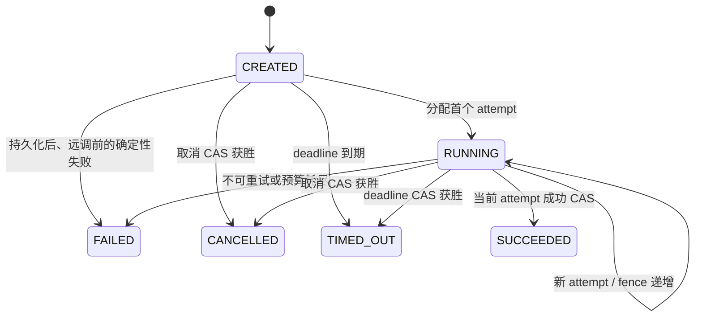

# 执行生命周期与持久状态 L2 实施详细设计 v0.1

## 1. 文档信息

| 项目 | 内容 |
|---|---|
| 文档名称 | 执行生命周期与持久状态 L2 实施详细设计 |
| 文档路径 | `docs/design/agent/L2/03_执行生命周期与持久状态_L2实施详细设计_v0.1.md` |
| 文档层级 | L2 实施详细设计 |
| 文档状态 | Draft |
| 当前版本 | v0.1 |
| 适用范围 | Java Agent 的 request/execution/attempt、持久状态机、短事务、deadline、取消、栅栏、幂等、重试、恢复、迟到结果与生命周期审计 |
| 上位文档 | `docs/design/agent/单体Agent智能体总体架构_L0_v1.0.md`；`docs/design/agent/单体Agent应用与能力架构_L1_v1.0.md`；`docs/design/agent/L2/00_单体Agent目标架构L2实施详细设计总览_v1.0.md` |
| 来源文档 | `docs/plans/M2-A-0_03-04-05共同输入确认记录.md`；`docs/plans/M2-A_03-04-05详细设计实施计划.md` |
| 关联文档/契约 | `docs/design/agent/L2/01_跨运行时契约与生成治理_L2实施详细设计_v1.0.md`；活动唯一 OpenAPI `agent-api/src/main/resources/openapi/agent-runtime-openapi.json` |
| 实现基线 | P0 固定报告为 `P0_VERIFIED`；目标 `agent-service` 仅有 M1 契约治理与严格解析代码，尚无生命周期或 MySQL 持久化实现 |
| 是否可作为实现依据 | 否；v0.1 完成编写期内审后可进入独立设计评审，正式实施仍需独立评审结论、数据库迁移执行责任闭合和单独代码/依赖/测试授权 |

本文是 03 的唯一目标详细设计候选。M2-A-0 临时记录中的生命周期语义迁入本文后，以本文后续独立评审通过的版本为准；当前 `Draft` 不代表语义已冻结、M2-A 已关闭或代码获准实施。

## 2. 修改历史

| 序号 | 日期 | 位置 | 修改原因 | 修改内容 |
|---:|---|---|---|---|
| 1 | 2026-07-21 | 全文 | 执行 P1，创建 03 v0.1 | 建立生命周期、持久状态、并发、恢复、实现落点与测试追踪初稿 |
| 2 | 2026-07-21 | 第 8.2、8.3、9.2、13 节 | 第 1 轮编写期内审修正 | 增加终态幂等摘要持久化，并区分正常失败重试与恢复抢占的 attempt 结束状态 |
| 3 | 2026-07-21 | 第 8.2、8.7、9.2、13 节 | 第 2 轮编写期内审修正 | 冻结 replay mode 的证据来源和默认失败关闭，并明确 execution/attempt/event 的终态原子提交 |
| 4 | 2026-07-21 | 第 7.1、8.5、9.2、9.3、10～14 节 | 第 3 轮编写期内审修正 | 以 MySQL UTC 时间统一持久终态判定，补齐恢复配置键、默认值、启动校验和测试要求 |
| 5 | 2026-07-21 | 第 11、14 节 | 完成编写期确定性校验 | 记录严格校验 0 error/0 warning 和目标隔离扫描结果，保持 Draft 并申请独立评审 |
| 6 | 2026-07-21 | 第 8.9、13 节 | 第 3 轮专项追踪补充检查 | 补齐已被追踪引用但缺少定义行的 DR-03-013～015，并重新执行完整校验 |

## 3. 背景、目标与范围

### 3.1 背景与根因

P0 已将历史 `agent-*`、`es-*` 隔离为 `*_alpha` 并建立绿地目标模块；01 M1 已建立唯一 OpenAPI、生成与严格契约校验，但没有业务 operation。当前目标 `agent-service` 不存在 execution 状态机、MyBatis/MySQL 持久化、attempt/fence、取消、恢复或迟到结果隔离实现。

如果 04、05、06～10 在缺少 03 的情况下各自推断生命周期，将形成多套状态、超时、重试和恢复语义。根因不是缺少一个通用流程类，而是尚未建立 Java/MySQL 单一事实源、短事务提交点、CAS 竞争裁决和跨运行时公共生命周期边界。

### 3.2 目标与验收行为

| 需求编号 | 目标或可观察行为 | 验收标准 | 来源 |
|---|---|---|---|
| REQ-03-001 | 固定 request→execution→attempt 关系 | 一个幂等作用域内同一 request 只对应一个 execution；重试只创建递增 attempt，不创建第二 request/execution | M2-A-0、计划 P1 |
| REQ-03-002 | 固定 execution 与 attempt 状态机 | 合法、非法、幂等转换可确定；execution 终态单调 | Agent L1 第 8、9 节 |
| REQ-03-003 | Java/MySQL 独占持久状态和终态 | Python、Runtime、Adapter、检索或回调不能直接提交终态 | L0 `AD-04`、`AD-18` |
| REQ-03-004 | 远程调用不持有本地事务或锁 | 事务提交后才允许发出远程调用；等待期间无数据库事务、行锁或不可重入上下文 | L0 `AD-10` |
| REQ-03-005 | 绝对 deadline 和预算不可延长 | 所有 execution attempt 与 dependency call 共用原始绝对 deadline 和总调用预算 | L0 第 9.3 节、M2-A-0 |
| REQ-03-006 | 取消、成功和超时竞争有唯一裁决 | 第一个满足前置并成功 CAS 的终态获胜；迟到结果不能覆盖 | L0 `AD-18`、计划 P1 |
| REQ-03-007 | attempt/fence 隔离旧世代 | 只有当前 attempt/fence 的结果、回调和后续 Tool 绑定可被接受 | M2-A-0 `CI-MIG-002` |
| REQ-03-008 | 幂等与重试不产生乘法调用 | execution attempt 与 dependency call retry 分离；每条依赖只有一个内部重试责任方 | Agent L1 第 9.3 节 |
| REQ-03-009 | Java 重启后可确定恢复 | 过期 deadline 终结为超时；仅可证明安全重放的工作创建新 attempt；未知副作用不猜测成功 | 计划 P1 |
| REQ-03-010 | 状态、错误和审计可诊断且不泄密 | 每个失败有稳定分类、状态影响、重试归属和安全审计；不记录正文、凭据或权限表达式 | L0 第 9.2 节 |
| REQ-03-011 | 为 04/05 和 01 提供唯一公共输入 | 输出 execution/attempt/deadline/cancellation/fence/terminal state 语义，不直接修改唯一 OpenAPI | L2 总览 M2-A、01 第 8.2.3 节 |

### 3.3 范围内

- Java Agent 内 request、execution、execution attempt 的标识、基数、状态和持久化责任。
- 创建、启动 attempt、预约远程调用预算、推进状态、提交终态和恢复认领的本地短事务。
- absolute deadline、取消、终态竞争、state version、fence 和迟到结果拒绝。
- execution 级幂等、dependency call 重试归属、总调用预算和恢复扫描。
- MySQL 逻辑表、约束、索引、审计事件和迁移/回滚边界。
- 后续 01 Schema 贡献所需的生命周期语义清单，但不实施契约变更。

### 3.4 范围外

- 模型准入、字段策略、权限组合和撤权语义，归 04。
- Runtime 固定身份、`capabilityId`、防重放和 Tool 白名单，归 05。
- Route/Plan、Adapter、DOCUMENT、检索和结果业务 Schema，归 06～10。
- 修改 OpenAPI、generated artifacts、fixture、contract lock、CI、代码、数据库、配置或测试。
- Runtime/Tool 监听、服务发现、流量、目标质量或生产批准。

### 3.5 非目标

- 不恢复 Python 图内状态，不引入 Python Checkpointer。
- 不建立分布式事务、全局锁、消息驱动长任务主链或通用工作流引擎。
- 不把历史 `agent-service_alpha` 的 Invocation 表、类、状态或 SQL 直接复制为目标设计。
- 不在 03 决定权限事实、模型目标、Tool 凭据载体或业务结果结构。

## 4. 上位约束与追踪关系

### 4.1 继承约束

| 约束编号 | 上位位置 | 约束内容 | 本设计落实方式 | 偏离情况 |
|---|---|---|---|---|
| CON-03-001 | L0 `AD-04` | Java/MySQL 是会话、任务、执行和引用唯一持久权威 | DR-03-001、DR-03-004 | 无 |
| CON-03-002 | L0 `AD-10` | Java 等待 Python 时不持有事务、锁或不可重入上下文 | DR-03-006 | 无 |
| CON-03-003 | L0 `AD-18` | 终态单调，栅栏拒绝迟到结果 | DR-03-003、DR-03-008 | 无 |
| CON-03-004 | L0 第 9.3 节 | 单一总 deadline；每条依赖一个内部重试方 | DR-03-007、DR-03-010 | 无 |
| CON-03-005 | Agent L1 第 8 节 | 状态至少覆盖六态，重试创建新 attempt/版本 | DR-03-002、DR-03-005 | 无 |
| CON-03-006 | Agent L1 第 9.3 节 | Java 传播 deadline/cancellation；Python 不承担跨重启恢复 | DR-03-007、DR-03-011 | 无 |
| CON-03-007 | Agent L1 第 10.1 节 | 仅本地短事务，不建立跨服务分布式事务 | DR-03-006 | 无 |
| CON-03-008 | M2-A-0 第 4、7 节 | 03 唯一承接公共生命周期、幂等、fence 和契约贡献边界 | DR-03-001～DR-03-013 | 无 |
| CON-03-009 | 01 `DR-01-007/008/011` | wire 结构归 01；03 只提交完整生命周期贡献清单 | DR-03-013 | 无 |
| CON-03-010 | 01 第 8.2.3 节 | 每批贡献需七项清单和单独 `IMPL-01-013` 授权 | DR-03-013 | 无 |
| CON-03-011 | P0 固定报告 | 目标与 `*_alpha` 隔离，历史资产只作迁移输入 | DR-03-014 | 无 |
| CON-03-012 | M2-A 计划全程不变量 | 不扩权、不持锁远调、不重复重试、不借设计放行代码/生产 | DR-03-006、DR-03-010、DR-03-015 | 无 |

### 4.2 端到端追踪矩阵

| REQ/CON | 设计规则 | 责任主体 | 契约/数据/状态影响 | 实现落点 | 测试 | 验证 |
|---|---|---|---|---|---|---|
| REQ-03-001、CON-03-008 | DR-03-001、DR-03-004 | Java Lifecycle | request/execution 唯一关系、幂等作用域 | IMPL-03-003、IMPL-03-007 | TEST-03-001、TEST-03-005 | VAL-03-002、VAL-03-003 |
| REQ-03-002、CON-03-005 | DR-03-002、DR-03-003、DR-03-005 | Java Domain + Lifecycle | execution/attempt 状态 | IMPL-03-002、IMPL-03-003、IMPL-03-008 | TEST-03-002、TEST-03-003 | VAL-03-002、VAL-03-003 |
| REQ-03-003、CON-03-001 | DR-03-001、DR-03-004 | Java/MySQL | 单一持久事实源 | IMPL-03-004～IMPL-03-008 | TEST-03-004、TEST-03-006 | VAL-03-003 |
| REQ-03-004、CON-03-002、CON-03-007 | DR-03-006 | Java Lifecycle | 事务外远调 | IMPL-03-003、IMPL-03-012 | TEST-03-007 | VAL-03-002、VAL-03-003 |
| REQ-03-005、CON-03-004 | DR-03-007、DR-03-009 | Java Lifecycle | deadline、调用预算 | IMPL-03-003、IMPL-03-007、IMPL-03-010 | TEST-03-008、TEST-03-009 | VAL-03-002、VAL-03-003 |
| REQ-03-006、CON-03-003 | DR-03-003、DR-03-008 | Java Domain + MySQL CAS | 终态竞争、迟到拒绝 | IMPL-03-002、IMPL-03-004、IMPL-03-005 | TEST-03-003、TEST-03-010 | VAL-03-003 |
| REQ-03-007 | DR-03-005、DR-03-008 | Java Lifecycle | attempt/fence | IMPL-03-003、IMPL-03-005 | TEST-03-003、TEST-03-010 | VAL-03-002、VAL-03-003 |
| REQ-03-008、CON-03-004 | DR-03-009、DR-03-010 | Java + dependency owner | 幂等、重试、调用预算 | IMPL-03-003、IMPL-03-010 | TEST-03-005、TEST-03-009 | VAL-03-002、VAL-03-003 |
| REQ-03-009、CON-03-006 | DR-03-011、DR-03-012 | Java Recovery | lease、恢复、未知副作用 | IMPL-03-009、IMPL-03-010 | TEST-03-011 | VAL-03-003 |
| REQ-03-010 | DR-03-012、DR-03-015 | Java Lifecycle + Audit | 错误、事件、指标 | IMPL-03-006、IMPL-03-011 | TEST-03-006、TEST-03-012 | VAL-03-002、VAL-03-003 |
| REQ-03-011、CON-03-009、CON-03-010 | DR-03-013 | 03 + 01 维护者 | 生命周期 Schema 贡献 | IMPL-03-013、IMPL-03-014 | TEST-03-012 | VAL-03-001、VAL-03-004 |
| CON-03-011 | DR-03-014 | 03 维护者 | 迁移分类，不复制历史 | IMPL-03-015 | TEST-03-012 | VAL-03-005 |
| CON-03-012 | DR-03-006、DR-03-010、DR-03-015 | 03 维护者 | 授权和生产边界 | IMPL-03-001、IMPL-03-015 | TEST-03-007、TEST-03-012 | VAL-03-001、VAL-03-005 |

## 5. 关联资源与责任边界

| 资源 | 角色 | 本文职责 | 对方职责 | 交互契约 | 数据/状态所有权 | 修改权限 |
|---|---|---|---|---|---|---|
| L0、Agent L1、L2 总览 | parent | 落实生命周期下位设计 | 定义架构不变量与门禁 | 文档约束 | 上位权威 | 只读 |
| M2-A-0 记录/实施计划 | source | 迁入 03 项并同步进度事实 | 临时追踪和执行顺序 | CI-MIG-001/002/003/010 | 非运行权威 | 获准原子同步 |
| 01 L2 / 唯一 OpenAPI | external_contract | 提供生命周期业务语义贡献 | 拥有 wire 源、生成、lock、fixture 和兼容治理 | 01 第 8.2.3 节 | wire 契约权威 | 只读；实施另行授权 |
| `agent-service` | implementation_baseline | 后续实现 Java 生命周期、MySQL 状态和恢复 | 当前只含 M1 契约治理代码 | Java 内部边界 | Java/MySQL 状态权威 | 本轮只读 |
| `agent-runtime` | peer consumer | 只消费 execution/attempt/deadline/cancellation/fence 投影 | 单次执行内临时编排 | 后续 generated OpenAPI model | 无持久状态权 | 本轮只读 |
| 04、05 | downstream peer | 引用本文公共生命周期，不重定义 | 分别拥有权限安全和 Runtime Tool 安全 | 文档引用及后续贡献 | 各自安全语义 | 尚未创建 |
| `agent-service_alpha` 与 P1_V2/02 | migration source | 只用于发现 CAS、Clock、Testcontainers 等候选机制 | 历史实现，不提供目标语义 | 无活动依赖 | 历史数据/代码 | 只读、禁止复制 |

## 6. 当前实现基线与最小变更方案

### 6.1 已确认实现事实

1. `agent-service/pom.xml` 当前只有 `agent-api`、Web、Actuator、Validation、JSON Schema validator 和测试依赖，没有 MyBatis、MySQL、迁移或 Testcontainers 依赖。
2. `agent-service/src/main/java/com/dylan/baseline/agent/` 当前只有应用入口及 `runtime` 契约校验/兼容类型，没有 `execution` 或持久化包。
3. 活动 OpenAPI 仅有 readiness 公共契约；`RuntimeError` 已允许在可信提取后携带 request/execution/attempt 关联信息，但不存在业务生命周期 operation。
4. 仓库其他当前模块已使用 MyBatis/MySQL；`mq-procedure-service` 已有 `@MybatisTest` + Testcontainers MySQL 8.0 的集成测试惯例，可作为工具链候选，不转移其业务代码。
5. 历史 `agent-service_alpha` 有 Invocation、row version CAS、`Clock` 和恢复测试，但其状态、表结构和职责属于隔离基线，不能直接复用。

### 6.2 当前问题与设计根因

| 问题 | 直接原因 | 设计根因 | 风险 |
|---|---|---|---|
| 无持久 execution | 目标模块为绿地骨架 | 03 尚未创建 | 04/05 各自猜测状态和失效 |
| 无终态竞争规则 | 没有状态机/CAS | Java/MySQL 权威未落实 | 取消、超时、成功互相覆盖 |
| 无重试预算 | 仅有 M1 契约错误 | execution attempt 与 call retry 未区分 | 乘法重试、deadline 延长 |
| 无恢复协议 | Python 不持久、Java 无 lease/fence | 崩溃后的所有权与副作用未知 | 重复执行或永不终结 |

### 6.3 最小变更方案

| 变更项 | 必要性 | 复用内容 | 新增/修改原因 | 不采用方案及原因 |
|---|---|---|---|---|
| Java execution 域与应用边界 | 承载单一状态机 | 复用 Spring Boot、`java.time.Clock` | 当前不存在目标实现 | 不复用 alpha 类型，避免历史语义回流 |
| MyBatis/MySQL 持久化 | 落实 Java/MySQL 权威和 CAS | 复用根 POM 管理版本和当前仓库 MyBatis 惯例 | `agent-service` 当前缺失 | 不用内存状态或 Python Checkpointer |
| 三表最小模型 | 分离 execution、attempt、审计事件 | 复用 MySQL InnoDB、row version | 支持终态、重试、恢复与审计 | 不引入消息/outbox/通用工作流表 |
| 生命周期契约贡献清单 | 让 01 后续生成一致模型 | 复用唯一 OpenAPI/fixture/lock 流程 | 当前没有业务 operation | 不在 03 修改 OpenAPI |
| MySQL 8.0 集成验证 | 证明 unique/CAS/lease 真实语义 | 复用仓库 Testcontainers 惯例 | H2 不能证明 MySQL 约束 | 不新增与目标无关的测试框架 |

## 7. 职责、分层与依赖设计

### 7.1 责任分解

| 组件/边界 | 状态 | 唯一职责 | 明确不负责 | 输入/输出 |
|---|---|---|---|---|
| `ExecutionStateMachine` | 建议新增 | 纯函数判定 execution/attempt 合法转换和终态竞争 | I/O、权限、重试、远程调用 | 当前快照 + command → decision |
| `ExecutionLifecycleService` | 建议新增 | 编排创建、attempt、预算、取消、终态和权威重读 | 业务计划、模型选择、Tool 授权 | lifecycle command → committed snapshot/result |
| `ExecutionRepository` / MyBatis mapper | 建议新增 | 执行条件更新、唯一约束、CAS 和有界查询 | 决定业务重试或权限 | persistence command → affected rows/snapshot |
| `ExecutionAttemptRunner` | 建议新增接口 | 在事务外执行一个已持久化 ACTIVE attempt | 持久状态、重试决策、终态提交 | immutable attempt context → typed outcome |
| `ExecutionRecoveryCoordinator` | 建议新增 | CAS 认领过期 execution 并按安全重放级别处理 | 猜测远端结果、恢复 Python 内存 | scan candidate → terminal/new attempt/no-op |
| `ExecutionAuditAppender` | 建议新增 | 在状态事务内追加无敏感正文的生命周期事件 | 外部日志投递、业务审计规则 | transition facts → persisted event |
| `java.time.Clock` | 已存在 JDK 能力 | 提供 Java 侧提前停止和可测试 wall clock；进程内耗时使用 monotonic source | 代替 MySQL 做最终 CAS 时间裁决、修改 deadline | instant/elapsed time |

### 7.2 依赖方向与禁止路径

| 调用方 | 被调用方/契约 | 允许原因 | 禁止绕过路径 | 失败语义 |
|---|---|---|---|---|
| API/能力入口 | `ExecutionLifecycleService` | 所有执行必须先持久化 | Controller→mapper/Runtime | 创建失败不调用远端 |
| Lifecycle | `ExecutionStateMachine` | 状态规则集中且可纯测试 | mapper 内散落状态判断 | 非法转换确定性拒绝 |
| Lifecycle | Repository + Audit | 同一短事务提交状态和事件 | 远程调用包裹事务 | 回滚保持原权威状态 |
| Lifecycle | `ExecutionAttemptRunner` | 事务提交后执行远端工作 | Runner 写数据库/终态 | typed outcome 返回 Java 裁决 |
| Recovery | Repository + Lifecycle | 通过 CAS/lease 取得唯一恢复权 | 多实例直接重放 | CAS 输家无副作用 |
| Python/Adapter/检索 | generated contract | 只读消费生命周期投影 | 直接访问 MySQL/mapper | 缺失或陈旧事实失败关闭 |

### 7.3 内聚与耦合判断

状态转换、CAS 前置、deadline、attempt/fence 和终态竞争都保护“Java/MySQL 生命周期权威”这一单一业务责任，因此聚合在 execution 域。`ExecutionAttemptRunner` 不是通用任务框架，只隔离“持久状态事务”和“远程工作”这一硬边界；能力实现仍归 06～10。Repository 不承载重试/权限规则，Runner 不写权威状态，避免一个类同时协调、持久化、调用和裁决。

## 8. 详细功能与流程设计

### 8.1 request、execution 与幂等创建

| 规则编号 | 规则 | 责任主体 | 触发条件 | 输出/状态效果 |
|---|---|---|---|---|
| DR-03-001 | 幂等作用域固定为可信 `tenantRef + subjectRef + capability + requestId`；同作用域同 `requestDigest` 返回同一 execution，不同 digest 返回 `EXECUTION_IDEMPOTENCY_CONFLICT` | Java Lifecycle | 接受入口请求 | 唯一 execution 或冲突 |
| DR-03-004 | 一个 request 只对应一个 execution；executionId 由 Java 生成并持久化，Python/下游只能回显 | Java Lifecycle | 创建成功 | `CREATED` execution |

创建顺序：

1. Java 在 04 提供的可信身份/能力上界内校验 requestId、deadline 和正数调用预算；不可信请求不创建 execution。
2. Java 计算不含明文正文的 canonical request digest。
3. 一个本地事务插入 execution 与 `EXECUTION_CREATED` 事件；唯一键冲突时重读现有 execution。
4. digest 相同返回现有 snapshot；digest 不同拒绝，二者均不调用 Runtime/Adapter/检索。
5. 事务提交后才允许分配 attempt。

requestId 不是 correlationId：前者承担幂等作用域，后者仅承担跨链路安全关联。若未来外部 API 不提供 requestId，入口必须先获得独立契约批准；不得把随机 correlationId 伪装成可重放幂等键。

### 8.2 execution 状态机与终态

| 规则编号 | 规则 | 责任主体 | 触发条件 | 输出/状态效果 |
|---|---|---|---|---|
| DR-03-002 | execution 状态仅 `CREATED/RUNNING/SUCCEEDED/FAILED/CANCELLED/TIMED_OUT`；未知值失败关闭 | State Machine | 任一读写 | 封闭状态 |
| DR-03-003 | 合法转换仅由下图和表定义；终态同值重复提交可幂等确认，不同终态或终态回退一律冲突 | State Machine + Repository | 状态推进 | 单调终态 |

| 当前状态 | 命令 | 允许结果 | 幂等规则 |
|---|---|---|---|
| `CREATED` | allocate attempt | `RUNNING` | 已有相同 current attempt 时重读确认 |
| `CREATED/RUNNING` | cancel | `CANCELLED` | 已是 CANCELLED 返回现有终态；其他终态冲突 |
| `CREATED/RUNNING` | expire | `TIMED_OUT` | 已是 TIMED_OUT 返回现有终态；其他终态冲突 |
| `RUNNING` | accept success | `SUCCEEDED` | 相同 result digest 幂等；不同 digest 冲突 |
| `CREATED/RUNNING` | fail | `FAILED` | 相同 failure code/digest 幂等；不同终态冲突 |
| 任一终态 | 任一不同推进 | 拒绝 | 返回权威终态，不修改数据 |

任何从 RUNNING 进入 execution 终态的事务，都必须在同一事务内把 current ACTIVE attempt 推进为对应 attempt 终态并追加事件：SUCCEEDED→SUCCEEDED、FAILED→FAILED、CANCELLED→CANCELLED、TIMED_OUT→TIMED_OUT。若 attempt 条件更新失败，整个 execution 终态事务回滚；不得留下“execution 已终结但 attempt 仍 ACTIVE”或相反状态。CREATED 直接终结时没有 attempt 行，事件必须明确 `attemptNo/fence` 为空。

### 8.3 execution attempt、dependency call 与 fence

| 规则编号 | 规则 | 责任主体 | 触发条件 | 输出/状态效果 |
|---|---|---|---|---|
| DR-03-005 | execution attempt 是端到端工作世代，attempt 从 1 递增；dependency call retry 只是该 attempt 内的调用计数，不能冒充新 attempt | Java Lifecycle | 首次执行、恢复或端到端重试 | currentAttempt/currentFence 单调递增 |
| DR-03-008 | 结果/回调必须同时匹配 executionId、current attempt、current fence、非终态和未过 deadline；任一不满足均拒绝 | Java Lifecycle | 接收候选结果/回调 | 接受或 `EXECUTION_STALE_RESULT` |

attempt 内部状态固定为 `ACTIVE/SUCCEEDED/FAILED/CANCELLED/TIMED_OUT/SUPERSEDED`。状态语义固定如下：正常完成使用 SUCCEEDED；收到 typed failure 后的可重试或不可重试结束均使用 FAILED，并由 outcomeCode 表达原因；取消和 deadline 分别使用 CANCELLED/TIMED_OUT；只有 owner 丢失、lease 过期且恢复 CAS 已获胜，或更高 fence 已正式替代旧世代时才使用 SUPERSEDED。SUPERSEDED 不能用来隐藏普通失败。

创建新 attempt 的同一短事务必须：按上述确定原因终结旧 ACTIVE attempt、递增 `currentAttempt` 和 `currentFence`、插入新 ACTIVE attempt、续设 lease 并追加事件。typed retryable failure 走 FAILED→新 ACTIVE；恢复抢占走 SUPERSEDED→新 ACTIVE。不能只改 execution 而漏建 attempt，也不能保留两个 ACTIVE attempt。

dependency call 前，Java 以 execution stateVersion/currentAttempt/currentFence 为条件原子预约一个总调用预算单位；预约成功后才允许离开事务发出调用。网络失败不返还预算，避免崩溃或 commit-unknown 导致超额调用。一次 execution attempt 可以包含多个获准 dependency call；其计数全部消耗同一个 execution 总预算。

### 8.4 短事务与远程调用

| 规则编号 | 规则 | 责任主体 | 触发条件 | 输出/状态效果 |
|---|---|---|---|---|
| DR-03-006 | 创建、attempt 分配、预算预约、状态推进、终态、取消和恢复认领各自使用本地短事务；任何 Runtime/Adapter/检索/模型调用均在事务提交后执行 | Java Lifecycle | 任一远程工作 | 无跨服务事务或持锁远调 |

标准 attempt 流程：

1. 短事务校验 execution 非终态、deadline 未到、attempt/budget 有余量，分配或确认 ACTIVE attempt；提交。
2. 短事务预约 dependency call 预算；提交。
3. 在无数据库事务、行锁和不可重入上下文下调用 `ExecutionAttemptRunner`。
4. Runner 返回 typed outcome，不写 MySQL、不决定是否重试。
5. Java 用 current attempt/fence/stateVersion/deadline 重新校验并在短事务内提交 attempt outcome、execution 终态或下一 attempt，以及审计事件。
6. commit 结果未知时必须重读权威原子单元；不得因客户端异常直接重放远程调用。

### 8.5 deadline、取消与并发裁决

| 规则编号 | 规则 | 责任主体 | 触发条件 | 输出/状态效果 |
|---|---|---|---|---|
| DR-03-007 | absolute deadline 由 Java 创建并持久化为 UTC instant；所有 attempt/retry 使用原值，只能缩短阶段预算，不能替换或延长；持久终态接受以 MySQL UTC 时间条件为最终裁决 | Java Lifecycle + MySQL | 创建/传播/重试/恢复/终态 | 同一 deadline |
| DR-03-009 | 每次远调使用 `min(absolute deadline 剩余时间, 当前阶段预算)`；进程内耗时用 monotonic clock，跨节点不以时钟偏差延长 deadline | Java/下游 | 预算计算 | 提前失败允许，超期放行禁止 |

取消来源至少区分调用方取消、Java 内部策略取消和可信撤权控制；来源必须在进入生命周期前完成鉴别。取消事务直接尝试把 `CREATED/RUNNING` 推进为 `CANCELLED`，递增 fence，并把 ACTIVE attempt 标记为 CANCELLED；下游 cancellation 传播是尽力清理，不影响 Java 终态正确性。

竞争规则：

- success 与 cancel：先成功提交 CAS 者获胜；success 获胜后 cancel 返回已终结，cancel 获胜后 success 作为迟到结果拒绝。
- success 与 timeout：Java `Clock` 先做提前拒绝，最终成功 CAS 必须同时满足 MySQL `UTC_TIMESTAMP(6) < deadline_at`；条件不满足时不得提交成功，必须重读并尝试 `TIMED_OUT`。扫描器未运行或 Java 节点时钟落后不构成放行理由。
- retry 与 cancel/timeout：分配新 attempt 的事务必须重新检查终态和 deadline；CAS 输家不发远调。
- 相同终态重复：只有终态类型及安全摘要 digest 相同才幂等确认；不同内容记录冲突，不覆盖。

### 8.6 幂等、重试和调用预算

| 规则编号 | 规则 | 责任主体 | 触发条件 | 输出/状态效果 |
|---|---|---|---|---|
| DR-03-010 | 默认不重试；只有 typed transient failure、可证明无调用方可见副作用、deadline/attempt/call budget 均有余量且当前层是唯一 owner 时才重试 | Java 或检索域唯一 owner | 依赖失败 | 新 call retry 或新 execution attempt |

| 依赖 | 唯一内部重试责任方 | 03 约束 | 禁止行为 |
|---|---|---|---|
| Python Runtime 服务入口 | Java Agent | 同 attempt 内有界重试；兼容门禁不放宽 | Runtime 再对入口自重试 |
| employee/transaction 服务入口 | Java Adapter | 只读且无可见副作用时有界重试 | Python 或业务服务上游重复重试 |
| `es-query-service` 查询入口 | Java Tool Gateway | 只对安全入口失败有界重试 | Tool Gateway 与查询服务重复重试同层入口 |
| Elasticsearch/Embedding | `es-query-service` | 其内部唯一负责并回传 attempts 诊断 | Java 重试内部 ES/Embedding |

重试退避消耗原 deadline，不暂停时钟；每次调用先预约预算。`maxAttempts` 和 `callBudgetLimit` 在 execution 创建时固化，后续策略变化只能收紧剩余量，不能增加已持久上限。未提供明确策略时使用安全基线 `maxAttempts=1`、`callBudgetLimit=1`。

### 8.7 恢复、lease 和未知副作用

| 规则编号 | 规则 | 责任主体 | 触发条件 | 输出/状态效果 |
|---|---|---|---|---|
| DR-03-011 | 多实例恢复通过 execution row 的 CAS lease 认领；扫描、认领、重放均有界，不持锁执行远程工作 | Recovery Coordinator | 实例重启、lease 过期 | 单一恢复 owner |
| DR-03-012 | 恢复先处理 deadline/取消，再按 `SAFE_REPLAY/NO_REPLAY` 决定新 attempt 或 `EXECUTION_RECOVERY_UNSAFE`；不猜测成功、不补写结果 | Recovery Coordinator | 认领成功 | TIMED_OUT/CANCELLED/new attempt/FAILED |

`replayMode` 不是调用方自由参数。默认固定为 `NO_REPLAY`；只有对应能力 L2 已评审确认该端到端工作全程只读或具有稳定幂等键、可查询幂等结果、无不可撤销调用方可见副作用，并提供版本化 `replayPolicyRef + replayEvidenceDigest` 时，Java 才能在 attempt 创建事务中固化 `SAFE_REPLAY`。Runtime、模型、Adapter、配置热更新和恢复任务不得把 `NO_REPLAY` 升级为 `SAFE_REPLAY`；策略变化只能让后续 attempt 更严格。

恢复顺序：

1. 按 `(status, nextRecoveryAt, executionId)` 稳定顺序扫描 `CREATED/RUNNING`，单批默认 100、硬上限 1000。
2. 以 stateVersion、非终态和 lease 已过期为条件 CAS 认领，lease 默认 60 秒；CAS 输家跳过。
3. `now >= deadline` 时提交 TIMED_OUT；存在可信取消事实时提交 CANCELLED。
4. 当前 attempt 为 `SAFE_REPLAY` 且预算充足时，在短事务内将旧 attempt SUPERSEDED，创建新 attempt/fence 后再事务外执行。
5. `NO_REPLAY`、副作用状态未知或预算不足时提交 FAILED/`EXECUTION_RECOVERY_UNSAFE`；不得调用远端查询结果来猜测成功，除非该依赖未来提供已评审的幂等查询契约。
6. 处理期间以短事务续租；续租失败立即停止发出新调用，已在途结果仍须通过 current fence。

### 8.8 生命周期错误与调用方语义

| 错误码 | 触发条件 | Java 可见结果 | 状态/事务影响 | 重试归属 | 日志/审计 |
|---|---|---|---|---|---|
| `EXECUTION_IDEMPOTENCY_CONFLICT` | 同作用域 requestId 的 digest 不同 | 409 语义候选 | 不创建/不修改 execution | 不可重试 | 记录 digest 前缀，不记正文 |
| `EXECUTION_STATE_CONFLICT` | 非法转换或不同终态竞争 | 返回权威 snapshot | CAS 无更新 | 调用方重读，不自动重试远调 | 记录 command/current state |
| `EXECUTION_ATTEMPT_STALE` | attempt 非 current | 拒绝 | 无状态变化 | 不可重试旧 attempt | 安全关联标识 |
| `EXECUTION_FENCE_MISMATCH` | fence 不匹配 | 拒绝 | 无状态变化 | 不可重试旧 fence | 安全告警 |
| `EXECUTION_STALE_RESULT` | 终态、取消、超时或旧世代结果 | 丢弃候选并返回权威终态 | 无结果写入 | 不可重试该结果 | 记录迟到原因，不记 payload |
| `EXECUTION_DEADLINE_EXCEEDED` | absolute deadline 已到 | TIMED_OUT | 终态 CAS | 不可延长重试 | 记录阶段和耗时 |
| `EXECUTION_CANCELLED` | 可信取消 CAS 获胜 | CANCELLED | 终态 CAS + fence 递增 | 不自动重试 | 记录安全来源 |
| `EXECUTION_RETRY_BUDGET_EXHAUSTED` | attempt/call budget 无余量 | FAILED | 终态 CAS | 不可重试 | 记录已用/上限 |
| `EXECUTION_RECOVERY_UNSAFE` | 恢复时副作用不可证明 | FAILED | 终态 CAS | 人工诊断，不自动重放 | 高优先级审计 |
| `EXECUTION_PERSISTENCE_FAILURE` | 本地事务确定失败 | 安全内部错误 | 回滚或保持原状态 | 仅本地命令可重试；远调不重放 | diagnosticId，不记 SQL/秘密 |
| `EXECUTION_COMMIT_UNKNOWN` | commit 结果未知 | 先重读 | 不伪造结果 | 根据权威重读决定 | 告警并关联事务阶段 |

错误码是 03 的拟议业务语义，不是当前活动 OpenAPI。HTTP 映射、Schema 和安全 message 必须随 01 第 8.2.3 节贡献另行评审。

### 8.9 契约贡献、历史隔离与授权边界

| 规则编号 | 规则 | 责任主体 | 触发条件 | 输出/状态效果 |
|---|---|---|---|---|
| DR-03-013 | 03 只在自身独立评审通过后向 01 提交第 8.2.3 节七项完整生命周期贡献；没有 `IMPL-01-013` 单独授权时不得修改 OpenAPI、lock、generated artifacts、fixture 或 CI | 03 维护者 + 01 维护者 | 生命周期 wire 贡献 | 完整 change set 或 `CONTRACT_CHANGE_UNGOVERNED` |
| DR-03-014 | `agent-service_alpha`、P1_V2/02 和其他历史资产只作迁移候选；任何机制必须重新证明符合当前 L0/L1/00/03，目标模块不得依赖、复制命名空间或把历史表/状态标为已存在 | 03 维护者 | 设计/实施盘点 | 受控迁移分类或 `TARGET_BASELINE_NOT_ISOLATED` |
| DR-03-015 | 本文 `Draft`、三轮内部自检、确定性校验、Git 提交或推送均不构成独立评审、代码/依赖/SQL/配置/测试授权、Runtime/Tool 流量或生产批准 | 03 维护者 | 任一状态同步或交付 | 保持未授权/未生效边界 |

## 9. 条件设计

### 9.1 接口与跨运行时契约贡献

03 向 01 提交但不直接实施的生命周期语义如下：

- requestId/executionId/correlationId 含义分离；requestId 必填且参与幂等，executionId 由 Java 生成。
- attempt 为 `>=1` 的整数；fence 为不可由下游生成或递增的世代值。
- absolute deadline 使用 RFC 3339 UTC 且带 `Z`；duration/remaining budget 使用整数毫秒。
- cancellation 必须区分请求、接受/拒绝结果和安全原因码；未知枚举拒绝。
- 结果/错误只在边界已可信提取时携带 request/execution/attempt，解析前失败允许省略。
- request/response/error object 默认封闭，unknown field/discriminator/enum 拒绝。
- fixture 必须覆盖正常、幂等重复、digest 冲突、unknown、超限、旧 attempt、fence mismatch、取消/成功竞争、timeout、迟到结果和预算耗尽。
- 版本、精确 fingerprint 配对、灰度和回滚遵循 01；任何贡献需单独 `IMPL-01-013` 授权。

### 9.2 数据与生命周期

#### 9.2.1 `agent_execution`

| 逻辑字段 | 建议 MySQL 类型 | 约束/语义 |
|---|---|---|
| `execution_id` | `VARCHAR(64)` | 主键，Java 生成 |
| `request_id` | `VARCHAR(128)` | 与 tenant/subject/capability 构成幂等唯一键 |
| `tenant_ref` / `subject_ref` | `VARCHAR(128)` | 可信安全引用；不存完整 claims |
| `capability_code` | `VARCHAR(64)` | 04/06 后续定义值域，03 只绑定 |
| `request_digest` | `CHAR(64)` | canonical SHA-256，不存正文 |
| `correlation_id` | `VARCHAR(64)` | 安全诊断关联，不承担幂等 |
| `status` | `VARCHAR(16)` | 六态封闭值 |
| `current_attempt` / `current_fence` | `INT` / `BIGINT` | 从 0 开始占位，分配 attempt 后单调递增 |
| `state_version` | `BIGINT` | CAS 版本，只增不减 |
| `deadline_at` | `DATETIME(6)` | UTC absolute deadline；所有持久判定使用 MySQL UTC 时间条件 |
| `max_attempts` / `call_budget_limit` / `call_budget_used` | `INT` | 正数上限；used 不得超过 limit |
| `lease_owner` / `lease_expires_at` / `next_recovery_at` | `VARCHAR(128)` / `DATETIME(6)` | 多实例恢复；非恢复状态允许空 |
| `terminal_code` / `terminal_digest` | `VARCHAR(64)` / `CHAR(64)` | 仅终态使用；digest 覆盖终态类型、安全 reason/result ref 与安全摘要，用于同终态幂等判定 |
| `result_ref` / `result_digest` | `VARCHAR(255)` / `CHAR(64)` | 仅 SUCCEEDED 允许；引用后续结果权威，不存业务 payload |
| `cancel_source` / `cancel_reason_code` | `VARCHAR(32/64)` | 仅安全枚举，不存任意文本 |
| `created_at` / `updated_at` / `terminal_at` | `DATETIME(6)` | UTC；terminalAt 仅终态非空 |

最小索引：主键；唯一 `(tenant_ref, subject_ref, capability_code, request_id)`；恢复索引 `(status, next_recovery_at, execution_id)`；诊断索引 `(correlation_id)`。不为正文 digest、错误码或高基数字段预建索引。

#### 9.2.2 `agent_execution_attempt`

| 逻辑字段 | 建议 MySQL 类型 | 约束/语义 |
|---|---|---|
| `execution_id` / `attempt_no` | `VARCHAR(64)` / `INT` | 联合主键，attemptNo >= 1 |
| `fence` | `BIGINT` | 与创建时 execution currentFence 相等 |
| `status` | `VARCHAR(16)` | 六个 attempt 状态 |
| `replay_mode` | `VARCHAR(16)` | `SAFE_REPLAY/NO_REPLAY`；默认 `NO_REPLAY`，创建后不可扩大 |
| `replay_policy_ref` / `replay_evidence_digest` | `VARCHAR(128)` / `CHAR(64)` | SAFE_REPLAY 必填，绑定已评审能力策略及其证据；NO_REPLAY 时为空 |
| `owner_instance` / `lease_expires_at` | `VARCHAR(128)` / `DATETIME(6)` | 当前执行 owner 和 lease |
| `started_at` / `finished_at` | `DATETIME(6)` | ACTIVE 时 finished 为空，终态非空 |
| `outcome_code` / `diagnostic_id` | `VARCHAR(64/128)` | 安全分类，不存 provider 文本 |

唯一 `(execution_id, fence)`；外键指向 execution。不能通过删除 attempt 复位 execution。

#### 9.2.3 `agent_execution_event`

字段固定为 eventId、executionId、attemptNo/fence（可空于创建前）、eventType、from/to state、reasonCode、safeRefs、occurredAt。事件与状态更新同事务追加，用于审计而非消息投递；不引入 delivery 状态、outbox 或异步发布。

#### 9.2.4 数据生命周期和迁移

- 新目标当前无 lifecycle 表或生产数据，因此首次迁移只创建新表，无历史回填。
- DDL 版本源建议放入 `agent-service/src/main/resources/db/migration/`；仓库当前未建立 agent-service 迁移执行器，执行责任必须在代码实施授权前闭合。
- 未承载流量前可回滚空表；一旦产生 execution，禁止通过降级或删表回滚，必须停止新执行、保留状态并前滚修复。
- retention 由 12A/审计政策量化；在其冻结前不得自动物理删除 execution/attempt/event。

### 9.3 状态、并发与一致性

- CAS 条件至少包含 executionId、expected stateVersion、允许的当前状态、currentAttempt/currentFence；affected rows 为 0 时必须权威重读。
- 成功、重试、预算预约和恢复新 attempt 的 CAS 必须由 MySQL 同时验证 `UTC_TIMESTAMP(6) < deadline_at`；超时终结使用相反条件。Java `Clock` 只允许更早停止，不能使数据库判定为过期的 execution 继续。
- 数据源连接建立后必须验证 MySQL session time zone 为 UTC（`+00:00` 或可证明等价）；不满足时 lifecycle readiness 失败，禁止执行状态读写。Java mapper 在 `Instant` 与 `DATETIME(6)` 间只按 UTC 转换。
- MySQL InnoDB 本地事务只覆盖同一 Agent DB 的 execution、attempt 和 event；不包含 Runtime、Adapter、检索、模型或外部审计系统。
- 不使用 `SELECT ... FOR UPDATE` 跨远程调用；短事务内若 mapper 为保证唯一分配使用行锁，必须在返回前释放且不得执行网络 I/O。
- dependency call 预算采用“先预约、后调用”，不因调用失败或进程崩溃返还。
- commit unknown 先按 executionId 重读 stateVersion、attempt、fence 和事件；只有证明未提交时才允许重做本地命令，不能据此重放远端调用。

### 9.4 权限、安全、风控与审计

03 不决定权限，但创建、重试、恢复和接受结果前都必须调用 04 后续提供的可信 continuation decision。有效撤权/策略取消映射 CANCELLED；安全事实缺失、冲突或不可验证映射 FAILED，均不得发出新远调。日志、事件和异常禁止记录用户正文、Prompt、模型输出、权限表达式、凭据、完整 subject/tenant claims 或 provider 原始错误。

### 9.5 性能、容量与资源预算

- 任何循环、扫描、attempt 和 call retry 均有上限；默认无重试。
- 恢复使用稳定索引和有界批次，禁止一次事务处理整批远调。
- `state_version/current_attempt/current_fence/call_budget_used` 使用单行 CAS，避免全局锁。
- 具体 TPS、延迟、表增长、retention 和告警阈值由 12/12A 量化；03 不将草案默认值解释为生产 SLO。

### 9.6 发布、迁移与回滚

1. 先完成 03 独立评审和代码/依赖授权，再建立 DDL 与 Java lifecycle 实现。
2. DDL 先于写代码部署；readiness 在表、索引和约束可验证前保持不就绪。
3. 生命周期实现先在无流量环境执行 MySQL 并发/恢复测试，再与后续 01 同 fingerprint 制品联调。
4. 灰度期间新旧实例不得同时对同一 execution 使用不同 fence/attempt 语义；不兼容变化必须隔离实例池。
5. 回滚只允许回滚到理解同一六态、attempt/fence 和表约束的版本；否则停止流量并前滚。

### 9.7 日志、监控与告警

低基数指标至少包括：`execution_created_total{result}`、`execution_transition_total{from,to,result}`、`execution_attempt_total{result}`、`execution_call_budget_total{result}`、`execution_stale_result_total{reason}`、`execution_recovery_total{result}`、`execution_active_age`。标签不得包含 requestId、executionId、subject、tenant、digest 或凭据。连续 recovery 失败、commit unknown、fence mismatch 和 ACTIVE 超过 deadline 必须产生告警；阈值由 12A 冻结。

### 9.8 配置语义

| 配置键 | 默认值 | 校验与生效语义 | 回滚/安全边界 |
|---|---:|---|---|
| `agent.execution.recovery.enabled` | `false` | 启动期读取；只有 03 实施验证完成并另获运行授权后才可设为 true | 回退 false 只停止新扫描，不修改已有状态 |
| `agent.execution.recovery.scan-interval` | `PT30S` | 正 duration；启动绑定，禁止热更新 | 不得用缩短间隔放宽 lease/fence |
| `agent.execution.recovery.batch-size` | `100` | `1..1000` | 超界启动失败，不静默截断 |
| `agent.execution.recovery.lease-duration` | `PT60S` | 正 duration | 变更只影响新 lease，不改历史 deadline |
| `agent.execution.recovery.renew-interval` | `PT20S` | 正 duration 且 `renewInterval <= leaseDuration/3` | 续租失败停止新调用 |
| `agent.execution.defaults.max-attempts` | `1` | v0.1 只允许 1；后续放宽需能力 L2、03 修订及代码授权 | 禁止运行时热增 |
| `agent.execution.defaults.call-budget-limit` | `1` | v0.1 只允许 1；后续多调用预算由能力 L2 提供并持久化 | 禁止运行时热增或返还 |

这些键不含秘密。缺失使用上述失败关闭默认值；格式错误、非正数、关系校验失败或尝试在 v0.1 把两个默认上限设为大于 1 时，lifecycle 组件启动失败。配置不启用 Runtime/Tool 监听或服务发现。

## 10. 实现落点清单

| 实现编号 | 状态 | 类型 | 路径/符号 | 唯一责任与必要性 | 设计规则 | 测试/验证 |
|---|---|---|---|---|---|---|
| IMPL-03-001 | 已存在 | Java module | `agent-service/pom.xml` | 当前目标服务边界；后续依赖变更源 | DR-03-015 | TEST-03-012 / VAL-03-005 |
| IMPL-03-002 | 建议新增 | Java domain | `agent-service/src/main/java/com/dylan/baseline/agent/execution/domain/` | execution/attempt 状态与纯决策 | DR-03-002、003、005、008 | TEST-03-002、003 / VAL-03-002 |
| IMPL-03-003 | 建议新增 | Java application | `.../execution/application/ExecutionLifecycleService.java` | 编排生命周期；建议类名，不冻结私有签名 | DR-03-001、004～010 | TEST-03-001～010 / VAL-03-002 |
| IMPL-03-004 | 建议新增 | Java persistence | `.../execution/persistence/ExecutionRepository.java` | 狭义持久化 Port，不含业务决策 | DR-03-001、003、006、008 | TEST-03-004、006、010 / VAL-03-003 |
| IMPL-03-005 | 建议新增 | MyBatis mapper | `.../execution/persistence/mybatis/` | CAS、预算预约、lease 和有界查询 | DR-03-003、005～012 | TEST-03-004、006、009～011 / VAL-03-003 |
| IMPL-03-006 | 建议新增 | Java audit | `.../execution/application/ExecutionAuditAppender.java` | 同事务追加安全事件 | DR-03-012、015 | TEST-03-006、012 / VAL-03-002、003 |
| IMPL-03-007 | 建议新增 | SQL source | `agent-service/src/main/resources/db/migration/` | 三表、约束和索引的版本源；具体版本号实施时分配 | DR-03-001～012 | TEST-03-004、006、011 / VAL-03-003 |
| IMPL-03-008 | 建议新增 | Java model | `.../execution/domain/ExecutionSnapshot.java` 等 | 不可变权威快照；名称为建议 | DR-03-002～005 | TEST-03-002、003 / VAL-03-002 |
| IMPL-03-009 | 建议新增 | Java recovery | `.../execution/application/ExecutionRecoveryCoordinator.java` | 有界扫描、CAS lease 与恢复裁决 | DR-03-011、012 | TEST-03-011 / VAL-03-003 |
| IMPL-03-010 | 建议新增 | Java port | `.../execution/application/ExecutionAttemptRunner.java` | 事务外执行一个 attempt；后续能力实现该边界 | DR-03-005～012 | TEST-03-007～011 / VAL-03-002 |
| IMPL-03-011 | 建议新增 | config | `agent-service/src/main/resources/application.yml` 的第 9.8 节固定键 | 扫描批次、lease 与安全默认值；不得启用流量 | DR-03-007、009～012、015 | TEST-03-008、011 / VAL-03-002 |
| IMPL-03-012 | 建议新增 | architecture test | `agent-service/src/test/java/com/dylan/baseline/agent/execution/ExecutionTransactionBoundaryTest.java` | 证明远调不在事务/锁内 | DR-03-006 | TEST-03-007 / VAL-03-002 |
| IMPL-03-013 | 待关联专题批准 | OpenAPI change set | 01 `IMPL-01-013` / 唯一 OpenAPI | 接收 03 七项贡献；当前未授权 | DR-03-013 | TEST-03-012 / VAL-03-004 |
| IMPL-03-014 | 待关联专题批准 | generated/fixtures | 01 生成物、同源 fixture、lock、CI | 由唯一 OpenAPI 确定性生成，禁止手改 | DR-03-013 | TEST-03-012 / VAL-03-004 |
| IMPL-03-015 | 已存在 | migration evidence | `agent-service_alpha`、P1_V2/02 | 只作候选机制盘点，禁止目标依赖 | DR-03-014、015 | TEST-03-012 / VAL-03-005 |

依赖影响：后续实施预计需要为 `agent-service` 增加仓库已使用的 MyBatis/MySQL 依赖，以及测试范围的 MyBatis Test/Testcontainers MySQL；这些均属于未来代码/依赖授权，不由本文或本次 Git 文档提交授权。

## 11. 测试与验证设计

### 11.1 测试清单

| 测试编号 | 设计规则 | 层级/建议路径 | 测试意图与关键断言 | 失败信号 |
|---|---|---|---|---|
| TEST-03-001 | DR-03-001、004 | Unit / `execution/application` | 同作用域同 digest 返回同 execution；不同 digest 冲突 | 创建第二 execution 或调用远端 |
| TEST-03-002 | DR-03-002、003 | Unit / `execution/domain` | 六态合法/非法/幂等转换全矩阵 | 终态回退、未知状态接受 |
| TEST-03-003 | DR-03-003、005、008 | Unit/concurrency | cancel/success/timeout、旧 attempt/fence 竞争只有一终态 | 多终态或迟到结果写入 |
| TEST-03-004 | DR-03-001、003、006 | MySQL integration | 唯一键、stateVersion CAS、execution+attempt+event 原子性 | H2-only、半提交或重复行 |
| TEST-03-005 | DR-03-001、010 | Unit/integration | request 幂等窗口与默认不重试 | digest 冲突被当成功、默认重试 |
| TEST-03-006 | DR-03-003、006、012、015 | MySQL integration | 状态与审计同事务，回滚不留孤儿事件 | 状态/事件不一致或泄密 |
| TEST-03-007 | DR-03-006 | Architecture/integration | 远调发生时 transaction synchronization inactive，mapper 锁已释放 | 事务内调用 Runner |
| TEST-03-008 | DR-03-007、009 | Unit + MySQL integration | deadline 原值跨 attempt；Java Clock 可提前停止但 MySQL UTC CAS 拒绝过期成功；session 非 UTC 时 readiness 失败 | 重试延长 deadline、时区漂移放行 |
| TEST-03-009 | DR-03-005、009、010 | Unit/concurrency | call budget 先预约、不返还、不超限；依赖 owner 唯一 | 预算超卖或乘法重试 |
| TEST-03-010 | DR-03-003、008 | MySQL concurrency | stale result/fence mismatch affected rows=0 并重读终态 | 覆盖当前结果 |
| TEST-03-011 | DR-03-011、012 | MySQL integration | 多实例 lease 只有一个 owner；SAFE_REPLAY 新 attempt，NO_REPLAY 失败 | 双重恢复或猜测成功 |
| TEST-03-012 | DR-03-013～015 | Contract/architecture | 七项贡献齐备前 OpenAPI 不变；目标依赖无 `_alpha` | 平行 OpenAPI、手改生成物或 alpha 依赖 |

### 11.2 验证清单

| 验证编号 | 命令或人工步骤 | 验证范围 | 预期结果 | 当前执行状态 |
|---|---|---|---|---|
| VAL-03-001 | `python C:/Users/zhoud/.agents/skills/detailed-design-document/scripts/validate_detailed_design.py --file docs/design/agent/L2/03_执行生命周期与持久状态_L2实施详细设计_v0.1.md --root D:/codex --strict` | 文档结构、引用、追踪 | 0 error、0 warning | 已执行：0 error、0 warning，退出码 0 |
| VAL-03-002 | `serviceCenter/mvnw.cmd -f agent-service/pom.xml --batch-mode --no-transfer-progress test` | Java unit/architecture tests | 相关测试全部通过 | 未实施，当前不可执行 |
| VAL-03-003 | `serviceCenter/mvnw.cmd -f agent-service/pom.xml --batch-mode --no-transfer-progress -Dtest=*Execution* test`（需 MySQL Testcontainers） | MySQL CAS、并发、恢复 | 真实 MySQL 8.0 相关测试通过且未跳过 | 未实施，当前不可执行 |
| VAL-03-004 | 01 change set 的 contract check/update、Java/Python 同源 fixture 与精确 fingerprint 验证 | 生命周期 wire 契约 | 双端一致、未知输入拒绝 | `IMPL-01-013` 未授权 |
| VAL-03-005 | `rg -n "agent-service_alpha|agent-runtime_alpha|agent-api_alpha|es-query-service_alpha|es-query-api_alpha|com\\.dylan\\.agent" agent-service agent-api agent-runtime es-query-service es-query-api -g '!target/**'` | 目标隔离 | 无活动 alpha 依赖或历史 namespace | 已执行：无匹配，退出码 1 表示未发现引用 |
| VAL-03-006 | 独立设计评审使用本追踪矩阵检查全部 REQ/CON/DR/IMPL/TEST/VAL | 正式评审 | 无 Blocker/Major，形成独立报告 | 本轮未授权独立评审 |

## 12. 风险、待确认事项与授权需求

| 编号 | 类型 | 证据缺口或风险 | 触发场景 | 影响 | 建议 | 是否阻塞/需授权 |
|---|---|---|---|---|---|---|
| RISK-03-001 | 迁移治理 | alpha Invocation 结构被直接复制 | 实施者把历史路径视为目标基线 | 状态/权限/契约回流 | 逐项迁移分类，默认重写 | 阻塞实施；不阻塞独立评审 |
| RISK-03-002 | 数据库 | agent-service 尚无迁移执行器和生产 DDL owner | 只提交 SQL 文件但无人执行/审计 | 环境漂移、启动失败 | 独立评审后、代码授权前冻结迁移执行责任和回滚清单 | 阻塞实施 |
| RISK-03-003 | 契约 | 03 生命周期 operation/Schema 尚未进入唯一 OpenAPI | 提前手写 DTO 或 Python model | 双权威和漂移 | 满足七项清单后申请 `IMPL-01-013` | 阻塞跨运行时实现 |
| RISK-03-004 | 安全联动 | 04 尚未定义 continuation decision 和撤权映射 | 重试/恢复跳过权限重验 | 撤权后继续执行 | 03 只冻结生命周期钩子；04 独立评审后联合收敛 | 阻塞 M2-A，不阻塞 03 评审 |
| RISK-03-005 | Tool 联动 | 05 尚未绑定 capabilityId 到 attempt/fence | 旧凭据在新 attempt 使用 | 越世代 Tool 调用 | 05 必须只读引用本文 attempt/fence | 阻塞 M2-A，不阻塞 03 评审 |
| RISK-03-006 | 运维 | retention、生产 SLO、告警阈值未量化 | 直接将草案默认值用于生产 | 表增长或误告警 | 由 12/12A 冻结并实测 | 阻塞生产，不阻塞设计/实现骨架 |
| RISK-03-007 | 授权 | 将三轮内审或本次提交视为代码批准 | 未经独立评审直接改代码/DB | 越权实施 | 保持 Draft；代码/依赖/测试另行授权 | 当前禁止代码实施 |

## 13. 编写期内部自检记录

| 轮次 | 日期 | Blocker | Major | Minor | 已修复 | 遗留 | 停止原因 |
|---:|---|---:|---:|---:|---|---|---|
| 0（初稿） | 2026-07-21 | 0 | 0 | 0 | 建立初始设计，尚未执行正式内审轮次 | RISK-03-001～007 | 进入用户要求的三轮内审-修改循环 |
| 1 | 2026-07-21 | 0 | 2 | 0 | 增加 `terminal_digest`；明确 FAILED 与 SUPERSEDED 的互斥触发及新 attempt 原子创建 | 无范围内 Blocker/Major 遗留 | 完成第 1 轮修正，进入第 2 轮全量复核 |
| 2 | 2026-07-21 | 0 | 1 | 1 | SAFE_REPLAY 改为默认禁止并绑定已评审策略/证据；补齐 attempt、execution、event 同事务终结 | 无范围内 Blocker/Major 遗留 | 完成第 2 轮修正，进入第 3 轮全量复核 |
| 3 | 2026-07-21 | 0 | 2 | 1 | 持久终态改由 MySQL UTC 条件最终裁决；补齐 7 个配置键；专项追踪检查补定义 DR-03-013～015 | RISK-03-002～006 按责任边界保留，均已说明阻塞范围 | 达到用户指定 3 轮；无范围内 Blocker/Major，进入最终严格校验 |

## 14. 实施前检查

- [x] 所有范围内 REQ/CON 已映射到 DR。
- [x] 所有重要 DR 已映射到 IMPL、TEST 和 VAL。
- [x] 责任和非责任边界明确。
- [x] 依赖方向和禁止路径明确。
- [x] request/execution/attempt、状态、deadline、取消、fence、重试和恢复语义明确。
- [x] 建议新增/修改项说明了必要性，历史路径未标为目标事实。
- [x] 待确认项已说明影响和阻塞性。
- [x] 已完成三轮编写期内审-修改，且无范围内 Blocker/Major 遗留。
- [x] 严格确定性文档校验已通过，0 error、0 warning。
- [ ] 尚未完成独立设计评审。
- [ ] 尚未获得代码、依赖、SQL、配置、测试或 `IMPL-01-013` 授权。

当前结论：本文为 `Draft` v0.1，已完成三轮编写期内审-修改且无范围内 Blocker/Major 遗留，严格文档校验为 0 error、0 warning，可以申请独立设计评审。独立评审通过前不冻结生命周期公共输入，不进入 P2，也不授权任何实现或生产动作。
