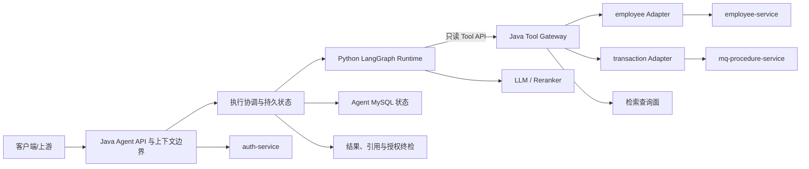
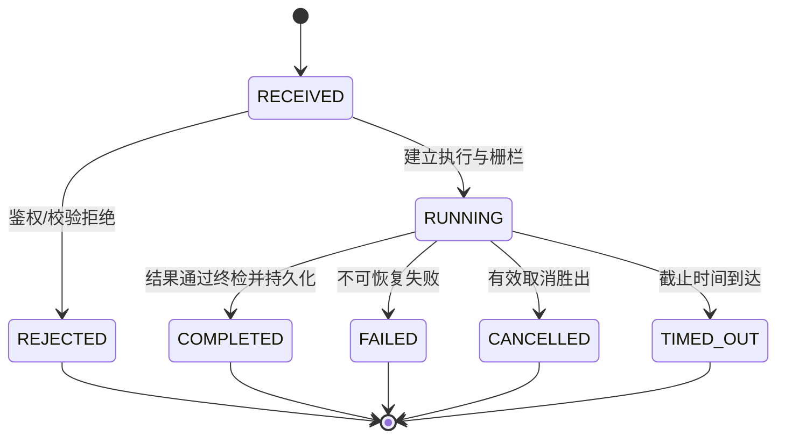

# 单体 Agent 应用与能力 L1 架构设计

> 文档层级：L1 分域/模块架构
>
> 文档状态：已评审 / 评审受阻 / 未实施 / 未生效

## 1. 文档治理信息

| 项目 | 内容 |
|---|---|
| 文档标识 | `AGENT-APP-L1-001` |
| 文档层级 | L1 分域/模块架构 |
| 权威范围 | 单体 Agent 的 Java 应用入口与控制面、Python LangGraph AI 编排、QUERY/AGGREGATE/DOCUMENT 能力、业务适配、执行与会话状态、跨运行时契约及结果安全 |
| 文档状态 | 已评审 |
| 评审状态 | 评审受阻；3 轮正式评审—修复循环已关闭全部文档发现。评审后已确认 DeepSeek 目标配置和维护人 Dylan，当前仍有 3 项决策/证据门禁未解除，需复评后才能改变结论 |
| 实施状态 | 未实施 |
| 生效状态 | 未生效 |
| 当前版本 | v0.1 |
| 适用基线 | 2026-07-16 已通过评审的 L0；不继承既有实验性 `agent-*`、`es-*` 项目及相关文档 |
| 维护责任人 | Dylan |
| 目标文档位置 | `docs/design/agent/单体Agent应用与能力架构_L1_v0.1.md` |
| 评审报告 | [单体 Agent 应用与能力 L1 架构设计评审报告](./单体Agent应用与能力架构_L1_v0.1_评审报告.md) |
| 上位 L0 | [单体 Agent 智能体 L0 总体架构设计](./单体Agent智能体总体架构_L0_v0.1.md)（`AGENT-L0-001`） |
| 关联 L1 | 规划中的“检索与索引基础设施架构 L1”；双方共同约束检索查询面语义，但不共享实现所有权 |
| 治理的 L2 | 跨运行时契约、执行生命周期、能力路由、QUERY/AGGREGATE、DOCUMENT 编排、业务适配、安全审计、持久化 SQL、韧性与可观测详细设计 |
| 外部契约 | Java 生成的 OpenAPI；`auth-service`；`employee-service`；`mq-procedure-service`；检索查询面；DeepSeek `deepseek-v4-flash`（API Base URL `https://api.deepseek.com`）与 Reranker 服务契约 |
| 替代关系 | 不替代或修订 L0、关联 L1、外部契约和既有实验性设计；新实现使用原项目名之前，旧项目须按 L0 要求完成隔离/重命名 |

## 2. 修订历史

| 序号 | 日期 | 文档位置 | 修改内容 | 修改原因 |
|---:|---|---|---|---|
| 1 | 2026-07-16 | 全文 | 创建 L1 架构初稿 | 承接 L0 并建立 Agent 应用与能力域架构基线 |
| 2 | 2026-07-16 | 第 3、17 节 | 明确架构目标及其可追踪结果，记录第 1 轮编写期自检 | 修复严格校验发现的目标信号不足 |
| 3 | 2026-07-16 | 第 15、17 节 | 补齐 L0 决策逐项追踪并记录第 2 轮编写期复评 | 补充追踪检查发现 `DEC-07` 仅由范围标识承接，自动追踪不能逐项证明覆盖 |
| 4 | 2026-07-16 | 第 17 节 | 记录第 3 轮编写期复评结论 | 验证决策逐项追踪修复并结束内部循环 |
| 5 | 2026-07-16 | 第 8、10、13 节 | 分离持久审计事实与遥测事件的所有权；补齐双运行时、实验资产隔离和服务收敛的 L2 追踪 | 修复正式第 1 轮评审的 `REV-L1-001`、`REV-L1-002` |
| 6 | 2026-07-16 | 第 13 节 | 将 L2 约束引用改为逐个完整稳定标识 | 修复正式第 2 轮复评新增的 `REV-L1-003` |
| 7 | 2026-07-16 | 文档治理信息、第 17 节 | 同步为已评审/评审受阻，关联评审报告并记录 3 轮正式循环 | 文档发现已全部关闭，但上位规定的正式评审前置输入仍缺失 |
| 8 | 2026-07-16 | 文档治理信息、第 5、7、16、17 节 | 同步 DeepSeek 目标配置、维护人 Dylan，并补充剩余评审门禁的定义与示例 | 根据用户后续确认关闭实名维护人阻塞，部分解除 LLM 选型阻塞 |

## 3. 文档定位与权威关系

### 3.1 文档目标与架构目标

本文在 L0 确定的系统边界内，回答以下 L1 问题：

- Java 与 Python 两个运行时如何组成一个逻辑单体 Agent；
- QUERY、AGGREGATE、DOCUMENT 如何被识别、编排、执行和校验；
- Agent、业务适配器、权限系统、业务服务与检索基础设施之间如何协作；
- 跨运行时契约、执行状态、会话、结果和引用由谁拥有；
- 如何以能力端口扩展提交、修改和工作流能力，又不把当前读能力改造成通用巨型流程；
- 如何为未来 multi-agent 演进保留可切分边界，而不在当前引入多智能体协议。

本文只做架构责任分配和语义约束，不定义完整 API 字段、数据库字段、SQL、类、方法、Graph State、节点实现、Prompt 或检索参数。

本文的架构目标是：

- **权威唯一**：Java 是跨运行时契约和 Agent 持久状态的唯一权威，Python 只维护单次执行临时态；
- **能力隔离**：QUERY、AGGREGATE、DOCUMENT 具有独立策略和验证门禁，新增能力不修改既有能力主流程；
- **授权不可扩张**：所有业务查询和文档召回在执行前携带机器可执行的授权上界，任何后置校验均不能替代前置硬过滤；
- **结果可追溯**：结构化查询可追踪至业务调用，DOCUMENT 事实性输出可追踪至当前可访问的来源版本和引用；
- **失败可闭环**：取消、超时、重试和迟到响应由 Java 终态栅栏统一裁决，不产生状态回退或越过终态的持久副作用；
- **演进低侵入**：业务域通过 Adapter、能力通过策略与 Tool 权限扩展；未来写能力和 multi-agent 演进必须通过独立设计门禁。

上述目标分别由第 8～11 节的所有权、流程、机制和质量预算约束，并由第 13 节 L2 交付形成验证证据。

### 3.2 上位与同层权威关系

```text
单体 Agent 智能体总体架构 L0（全局约束与模块权威）
  ├─ 本文：单体 Agent 应用与能力 L1
  │    └─ 本文第 13 节治理的 L2 详细设计
  └─ 检索与索引基础设施 L1（规划中，同层且独立）
       └─ 检索、索引、向量与 ES 运行机制的 L2 详细设计
```

权威冲突按“L0 > 各自 L1 > 各自 L2/实现”处理。同层 L1 不相互覆盖；涉及检索查询面的共享语义必须联合评审，任何一方均不得单独改变另一方的所有权。

### 3.3 本文唯一负责

- Java Agent 对外入口、请求上下文边界、执行控制和持久状态权威；
- Java 到 Python Runtime API、Python 到 Java Tool API 的语义与治理；
- Python LangGraph 内的能力路由、AI 推理和业务级编排边界；
- QUERY、AGGREGATE、DOCUMENT 的能力策略、流程和结果安全；
- employee、transaction 业务适配器的 Agent 侧端口和隔离原则；
- 会话、任务、执行、结果、引用的 Agent 侧生命周期；
- 未来新增能力的注册、隔离、策略分类和演进门禁。

### 3.4 本文明确不负责

| 非职责内容 | 唯一负责文档/模块 | 本文使用方式 |
|---|---|---|
| 用户、角色、权限规则与最终授权决策 | `auth-service` 及其契约 | Java 获取可信主体与授权决策；不得在 Agent 自建权限体系 |
| employee、transaction 业务事实和资源访问属性 | `employee-service`、`mq-procedure-service` | 通过适配器调用外部接口；不复制业务主数据权威 |
| BM25、Dense、可选 Sparse 的原子召回及其检索运行机制 | 检索与索引基础设施 L1 | DOCUMENT 通过 Java Tool 消费受约束的检索查询面 |
| 索引/向量 CRUD、Mapping、物理索引、Alias、技术版本、重建及 ES 韧性 | 检索与索引基础设施 L1 | 只消费查询能力与兼容性/就绪信息，不发起管理面写入 |
| 文档源主数据、稳定文档 ID、业务版本、资源访问属性和撤权事实 | 文档来源系统及其契约 | 作为检索过滤、引用和最终校验的权威输入 |
| Schema 迁移执行 | DB 责任方 | 本域仅交付前向、回滚和验证 SQL，不由应用启动时执行 |
| 指标/追踪后端、生产 HA 拓扑和最终 SLO 数值 | 后续运维架构/专项设计 | 当前仅保留稳定端口、上下文传播和 No-op 实现 |
| multi-agent 协议、协商、调度和独立 Planner 服务 | 未来 L0/L1 修订 | 当前只保留可拆分的契约、能力和状态边界 |

### 3.5 适用范围与非目标

适用范围是首期单体 Agent 的 QUERY、AGGREGATE、DOCUMENT 三类只读能力，以及 employee、transaction 两个业务域。首期默认同步请求与受控回调，不引入异步消息主链路、持久化 Python Checkpointer、Spring AI、LangSmith 或 multi-agent 框架。

提交、数据修改、工作流提交属于明确的后续扩展，不在本文定义具体行为。它们必须作为有副作用能力进入独立策略、契约、幂等、授权、审计和补偿设计，不得复用只读 Tool 的自动重试语义。

## 4. 上位约束映射

| L0 约束 ID | 上位来源 | 本文落实方式 | 本文章节 | 下位验证证据 | 偏差/ADR |
|---|---|---|---|---|---|
| AD-01 | 实验资产非基线 | 文档和实现均不得从旧 `agent-*`、`es-*` 推导目标架构；旧资产只可经显式评估后迁移 | 1、5、14 | 资产隔离清单、迁移评估 | 无 |
| AD-02 | 逻辑单体、双运行时 | Java 是入口/控制/状态面，Python 是 LangGraph AI 编排面；共同组成单体 Agent | 6、8、10 | 部署拓扑与职责测试 | 无 |
| AD-03 | Java 是跨运行时契约唯一来源 | Runtime API 与 Tool API 以 Java OpenAPI 为源，Python 同步生成/校验模型 | 7、10 | OpenAPI 生成与兼容门禁 | 无 |
| AD-04 | Java/MySQL 是唯一持久状态权威 | Python 图状态仅限单次执行，不使用持久 Checkpointer | 8、9 | 状态写入审计、重启测试 | 无 |
| AD-05 | Python 不直连业务、权限、DB、ES | Python 仅经 Java Tool 访问业务与检索；允许直连 LLM/Reranker AI 基础设施 | 6、7、10 | 网络策略和依赖扫描 | 无 |
| AD-06 | DOCUMENT 归 Agent | 问题理解、业务编排、融合、精排、上下文、生成和验证由本域负责；检索域仅提供原子能力 | 6、9、10 | DOCUMENT 流程与边界测试 | 无 |
| AD-07 | 不新建 `es-document-service` | 本文不设文档召回服务；只消费收敛后的检索查询面 | 3、6、14 | 模块清单与依赖检查 | 无 |
| AD-08 | 权限与用户管理外置 | 权限规则和决策归 `auth-service`；Java、适配器和检索链路执行授权约束 | 6、7、10 | 越权和撤权测试 | 无 |
| AD-09 | 检索前硬过滤 | 授权/业务硬过滤在召回前注入，生成后校验仅作纵深防御 | 9、10 | 无过滤查询拒绝测试 | 无 |
| AD-10 | 跨进程调用不持有本地上下文 | Java 调 Python 前结束 DB 事务，不持锁，不跨调用传播线程上下文 | 9、10 | 事务边界和阻塞检查 | 无 |
| AD-11 | 只读 Tool 幂等可重入 | QUERY、AGGREGATE、检索 Tool 按只读语义设计；写能力另立策略 | 7、10 | 重放、重试与并发测试 | 无 |
| AD-12 | SQL 交付、DB 执行迁移 | L2 仅产出前向/回滚/验证 SQL，应用无自动迁移依赖 | 10、13、14 | SQL 审核及启动检查 | 无 |
| AD-13 | 可观测端口先行 | 日志、指标、追踪端口与上下文稳定，当前允许 No-op 且不绑定后端 SDK | 10、11 | 端口替换和关联性测试 | 无 |
| AD-14 | 当前不引入 multi-agent | 以能力、适配器、运行时契约和状态边界支持未来切分，不实现 Agent 间协议 | 6、10、14 | 架构依赖检查 | 无 |
| AD-15 | ES 非文档/业务版本权威 | 本域仅使用来源方稳定 ID、业务版本和资源属性；Alias/技术版本由同层检索 L1 负责 | 3、7、8 | 引用版本与来源追踪测试 | 不适用部分：物理索引实现不属于本文 |
| AD-16 | AI 输出不可信 | Python 产出候选结果；Java 在返回和持久化前执行契约、授权、引用和安全校验 | 8、9、10 | 非法结果、伪引用测试 | 无 |
| AD-17 | 授权事实组合边界 | `auth-service` 决策与来源方资源属性共同形成约束；Java 只能收紧，检索执行 | 7、9、10 | 授权组合与非扩权测试 | 无 |
| AD-18 | 终态单调与栅栏 | Java 以执行版本/栅栏、截止时间和取消信号控制终态；迟到响应不得覆盖或产生持久副作用 | 8、9、10 | 取消、超时、迟到响应测试 | 无 |
| AD-19 | 内部契约兼容门禁 | Java、Python、检索查询面携带内部契约版本/指纹并发布就绪状态；不兼容实例不接流量 | 7、10、14 | 混合版本发布测试 | 无 |
| AD-20 | 查询面与管理面隔离 | Python Tool 仅暴露检索查询；索引写入只允许可信来源/运维入口 | 3、6、7、10 | 调用方能力凭证和网络策略测试 | 无 |

本文未修改任何 L0 约束。AD-15 的实现责任由关联 L1 承接，但其“业务版本不以 ES 为准”的消费约束对本文仍然有效。

## 5. 背景、当前基线与目标

### 5.1 背景与问题

目标系统需要用一个 Agent 统一提供结构化数据查询、聚合分析和文档问答，同时保持业务域隔离、授权正确和证据可追踪。若把 AI 编排、业务调用、检索实现、状态持久化混入同一技术模块，会造成契约多源、越权过滤滞后、状态竞争和后续能力侵入。

### 5.2 当前架构

本 L1 面向新建目标系统。已有 `agent-*`、`es-*` 及其设计/评审文档属于早期实验资产，只能用于风险发现，不能作为目标职责、接口或数据模型的依据。当前可复用的权威输入仅包括 L0、已确认的外部业务接口和测试机基础设施事实。

### 5.3 目标架构



Java 控制请求、身份上下文、契约、Tool、状态和最终结果；Python 控制单次 AI 推理图。能力路由选择 QUERY、AGGREGATE 或 DOCUMENT 的独立策略子图，能力之间共享稳定端口，不共享隐含业务规则。

### 5.4 差距分析

| 维度 | 当前状态 | 目标状态 | 差距 | 处理阶段 |
|---|---|---|---|---|
| 项目基线 | 旧实验资产不可继承 | 新项目、新契约、新状态模型 | 需先隔离旧项目并建立骨架 | 实施准备 |
| 跨运行时契约 | 尚无目标契约基线 | Java OpenAPI 单一来源、Python 自动同步 | 需 L2 定义分组、版本和生成门禁 | L2 |
| 执行状态 | 尚无目标状态模型 | Java/MySQL 唯一权威、终态单调 | 需状态机和并发语义 | L2 |
| 能力体系 | 需求已确认 | 三类只读能力策略隔离 | 需路由、策略和错误语义 | L2 |
| 业务接入 | 外部接口已存在 | 两个域经独立适配器接入 | 需确认契约、授权和分页能力 | L2/外部契约确认 |
| DOCUMENT | 流程需求已确认 | 完整证据化 RAG 编排 | 需评价集、阈值和检索查询面 | L2/联合门禁 |
| 可观测 | 后端本期不实现 | 稳定端口、上下文和可替换 No-op | 需定义最小事件语义 | L2 |
| 生产运行 | 本机测试基础设施可用 | 可发布、可回滚、可定容 | 缺生产 SLO、容量、网络和 HA 输入 | 生产评审前 |

### 5.5 设计假设与限制

- 首期执行以同步交互和受控 Tool 回调为主，不承诺长任务异步恢复。
- Java 使用 L0 选定技术栈；Python 使用 Python 3.12、LangGraph 1.x LTS、FastAPI、Pydantic 2.x、Uvicorn、httpx。
- 本机 MySQL 3306 及现有 Docker 中间件只作为测试环境，不等价于生产拓扑。
- LLM 目标配置已确认为 DeepSeek、模型 `deepseek-v4-flash`、API Base URL `https://api.deepseek.com`；数据处理边界、API 兼容性与效果 PoC 尚未确认。内部服务身份/短期能力凭据机制、DOCUMENT 评价集与阈值也尚未冻结；这 3 项仍阻塞 L1 正式通过。
- Sparse 召回是可选能力，未满足模型、索引、评价收益和运维门禁时不得成为必经链路。

## 6. 职责与边界

### 6.1 核心职责

| 职责 | 输入 | 产出 | 所有权 | 不负责事项 |
|---|---|---|---|---|
| 请求接入与上下文建立 | 用户请求、可信身份、会话标识 | 规范请求、执行标识、最小授权上下文 | Java Agent | 用户管理和权限规则维护 |
| 执行协调 | 规范请求、能力类型、截止时间 | 状态迁移、Runtime 调用、取消/超时控制 | Java Agent | AI 推理节点实现 |
| 能力理解与路由 | 当前问题、允许使用的最小历史上下文 | QUERY/AGGREGATE/DOCUMENT 策略选择及候选计划 | Python Runtime；Java 校验能力范围 | 最终授权决策 |
| QUERY | 结构化查询意图、域、过滤/分页/排序约束 | 可验证的数据查询结果与摘要 | Agent 能力域 + 对应适配器 | 业务数据事实维护 |
| AGGREGATE | 聚合意图、域、维度、指标、过滤约束 | 可验证的聚合结果与说明 | Agent 能力域 + 对应适配器 | 业务指标主数据治理 |
| DOCUMENT | 问题、授权过滤、检索原子结果 | 基于证据的答案、引用与完整性结论 | Agent 能力域 | 索引实现和文档主数据维护 |
| Tool 执行与约束 | Python Tool 请求、执行上下文 | 受授权、幂等、审计的业务/检索结果 | Java Tool Gateway | 自主扩大授权或绕开适配器 |
| 业务适配 | 规范化能力请求 | 外部业务接口请求/响应的语义适配 | 各域 Adapter | 跨域业务规则和通用 AI 编排 |
| 结果安全与持久化 | Python 候选结果、权威资源属性、执行栅栏 | 最终结果/引用或拒绝、终态 | Java Agent | 生成新的业务事实 |

### 6.2 模块内部逻辑组件

| 逻辑组件 | 架构职责 | 依赖 | 边界 | 扩展价值 |
|---|---|---|---|---|
| Java API 与上下文边界 | 鉴别调用、规范输入、建立执行和最小上下文 | auth-service、状态存储 | 唯一外部 Agent 入口 | 隔离渠道协议变化 |
| Java 执行协调器 | 生命周期、截止时间、取消、栅栏和 Runtime 调用 | 状态存储、Runtime Gateway | 唯一终态写入协调者 | 可替换同步/异步执行策略 |
| Java 契约权威与 Runtime Gateway | 发布 OpenAPI、校验版本/指纹、调用 Python | Python Runtime | 不承载业务编排 | 跨进程独立演进 |
| Java Tool Gateway | 校验能力、授权、执行归属和幂等语义 | Adapter、检索查询面 | Python 唯一业务/检索出口 | 新能力可按策略注册 |
| Java Adapter Registry | 解析域并选择独立适配器 | employee/transaction Adapter | 不含域内业务事实 | 新业务域插件式接入 |
| Java 结果与引用安全校验 | 契约、栅栏、授权、引用和敏感输出终检 | 状态、来源属性、候选结果 | 不调用 LLM 判定授权 | 统一输出安全门禁 |
| Java 状态存储端口 | 会话、任务、执行、结果、引用的权威读写 | MySQL | 不由 Python 直接访问 | 持久层可测、迁移可控 |
| Python Runtime 契约边界 | 接收规范请求并返回候选结果/事件 | Java Runtime API | 不接受外部用户直连 | 隔离 Web 框架和图实现 |
| Python 能力路由器 | 根据已允许能力选择策略子图 | 上下文理解、各能力子图 | 不决定授权范围 | 新能力可独立挂载 |
| Python 上下文理解 | 文本规范化、多轮补全、意图候选 | LLM、最小历史上下文 | 历史不是事实证据 | 可替换理解策略 |
| Python QUERY/AGGREGATE 编排 | 生成受约束计划、调用 Tool、组织候选结果 | Java Tool API、LLM | 不直连业务服务 | 跨域复用控制逻辑 |
| Python DOCUMENT 编排 | 多路召回编排、去重合并、RRF、精排、上下文、生成与证据检查 | Java Tool API、LLM/Reranker | 不实现索引和原子召回 | 检索策略可组合演进 |
| 遥测端口 | 结构化事件、指标、追踪上下文传播 | Java/Python 各运行时 | 不绑定具体后端 SDK | 后续无侵入接入后端 |

### 6.3 同层边界

| 关联 L1 | 对方权威范围 | 本文责任 | 交互语义 | 禁止侵入事项 |
|---|---|---|---|---|
| 检索与索引基础设施架构 L1（规划中） | 原子 BM25/Dense/可选 Sparse、检索执行、索引/向量 CRUD、Mapping、Alias、技术版本、重建和 ES 韧性 | 定义检索意图、授权硬过滤、召回组合、结果融合、业务排序、上下文和答案验证 | Java Tool 以检索查询面提交受约束请求并获取带稳定文档/分块标识、来源版本及得分语义的候选 | 本文不定义物理索引/打分实现；对方不实现问题理解、RRF、Reranker、会话、LLM 生成或业务规则 |

双方必须联合确认：过滤不可扩权语义、文档/分块稳定标识、版本与撤权传播、查询预算、错误与部分成功语义、契约版本/指纹和就绪门禁。关联 L1 尚未创建，因此这些内容只能作为本文的消费约束，不能被声明为对方已批准的契约。

### 6.4 依赖方向和循环检查

允许的主依赖方向为：外部入口 → Java Agent 控制面 → Python Runtime；Python Runtime → Java Tool Gateway → Adapter/检索查询面；Adapter → 业务服务；Java Agent → auth-service/MySQL。Python 仅可直连 LLM/Reranker。

禁止 Java Adapter 反向调用 Python、业务服务回调 Agent 内部组件、检索基础设施依赖 Agent 编排实现，以及 Python 绕过 Tool Gateway。受控 Tool 回调形成的是协议级请求—响应闭环，不得形成代码依赖或分布式事务闭环。

## 7. 语义契约与交互

### 7.1 入站契约

| 契约/能力 | 提供方 | 调用方 | 语义 | 权限/一致性/兼容性要求 |
|---|---|---|---|---|
| Agent API | Java Agent | 客户端/上游 | 提交问题、读取结果、取消执行；返回规范状态、答案、数据或错误 | 仅接受可信身份上下文；重复提交策略由 L2 明确；版本向后兼容 |
| Runtime API | Python Runtime | Java Agent | 在给定能力、最小上下文、截止时间和栅栏内执行单次 AI 编排并返回候选结果/事件 | Java OpenAPI 为唯一源；指纹不兼容不接流量；不得携带原始用户令牌 |
| Tool API | Java Tool Gateway | Python Runtime | 执行已注册的只读 QUERY、AGGREGATE 或检索操作 | 绑定 execution/step/tool-call、能力许可、授权过滤和截止时间；只读调用可重放 |
| Adapter Port | 各域 Adapter | Java Tool Gateway | 将规范 Agent 能力请求适配到具体业务域 | 域隔离；结果必须可追踪至外部调用；不得跨域拼装权限 |

Agent API 是唯一用户入站面；Runtime API 与 Tool API 都是内部契约，不得暴露为外部业务入口。

### 7.2 出站依赖

| 依赖 | 权威方 | 使用目的 | 失败语义 | 超时/重试/降级边界 |
|---|---|---|---|---|
| `auth-service` | 身份/权限域 | 获取可信主体、能力许可和授权决策 | 无法获得可信决策即拒绝，不允许默认放行 | 只在幂等且预算允许时有限重试；不可用不降级为匿名扩权 |
| `employee-service` | employee 域 | QUERY/AGGREGATE 业务数据 | 区分无数据、非法条件、权限拒绝和依赖失败 | 只读且外部契约允许时有限重试；不得以缓存扩大可见范围 |
| `mq-procedure-service` | transaction 域 | QUERY/AGGREGATE 业务数据 | 同上，并保持分页/聚合语义可验证 | 同上；无 Agent 所需语义时应显式失败而非猜测 |
| 检索查询面 | 检索与索引基础设施域 | 执行受授权硬过滤的原子召回 | 区分空召回、部分路失败、过滤拒绝、超时和版本不兼容 | 单路可按 DOCUMENT 策略降级；不得绕过硬过滤，管理面不可重试调用 |
| DeepSeek `deepseek-v4-flash`（API Base URL `https://api.deepseek.com`） | DeepSeek 外部 AI 服务；目标配置由用户确认 | 理解、规划、生成和候选判断 | 输出始终视为不可信；失败不产生最终成功状态；未批准的数据类别不得发送 | 受总截止时间/Token/调用次数约束；数据处理边界、API 兼容性、效果 PoC 和备选/降级策略须在 L2 前冻结 |
| Reranker | AI 基础设施提供方 | DOCUMENT 候选精排 | 不可用时按评价验证过的策略降级或明确失败 | 不得突破候选授权范围；受剩余预算约束 |
| MySQL | DB 责任方/Agent 状态域 | 保存 Agent 权威状态 | 写入失败不得返回已持久成功；状态冲突按栅栏拒绝 | 事务仅限 Java 本地短事务，不跨 Python/外部调用 |

### 7.3 契约演进

- Java 源 OpenAPI 分离外部 Agent API、Runtime API 和 Tool API 的治理范围，但保持一个 Java 权威源；Python 模型由契约生成/同步，不手工维护平行真相。
- 系统自有的 Java、Python 和检索查询面制品发布契约版本、指纹和就绪状态。启动兼容不等于接流量兼容；路由层仅向兼容实例分配请求。
- 兼容变更遵循先提供方兼容发布、再调用方消费、最后移除旧语义；破坏性变更须新增版本并经过混合版本验证。
- 外部业务契约不受本文定义。若 employee/transaction 现有接口无法提供 Agent 所需的分页、聚合、过滤或错误语义，应由对应契约责任方先决策，本文不得通过猜测补齐。
- 完整路径、字段、错误码、生成工具和兼容矩阵由“跨运行时契约与生成治理 L2”定义。

## 8. 数据、状态与运行时所有权

| 对象/状态/事实 | 权威方 | 写入边界 | 读取边界 | 一致性/生命周期 |
|---|---|---|---|---|
| 用户主体、角色、权限规则、授权决策 | `auth-service` | 仅权限域 | Java 按契约读取最小必要决策；Python 不接触原始凭证 | 不在 Agent 复制为新权威；按授权时效重新校验 |
| employee/transaction 业务事实 | 对应业务服务 | 仅业务域 | Adapter 按授权查询 | Agent 结果是执行快照，不转移主数据权威 |
| 文档内容、稳定 ID、业务版本、资源访问属性、撤权事实 | 文档来源系统 | 仅来源方/其可信同步链路 | Java/检索按契约使用，Python只接收已过滤必要内容 | 引用必须可回溯来源版本；ES 技术版本不是替代权威 |
| 会话与多轮上下文 | Java Agent/MySQL | Java 状态端口 | Java按最小化策略提供给 Runtime | 持久保留与删除策略由 L2 定义；历史只辅助理解，不作事实证据 |
| 任务/执行状态、截止时间、取消、栅栏 | Java Agent/MySQL | Java 执行协调器 | Java控制；Python接收当前执行上下文 | 终态单调；迟到事件只可审计，不可改写终态 |
| Python Graph State | 当前 Python 执行进程 | 单次图执行 | 仅当前执行节点 | 临时、可丢弃；不作为恢复或审计权威 |
| Tool 调用审计事实 | Java Agent/MySQL | Java Tool Gateway | 权限审计、安全追溯和执行诊断 | 强制持久且绑定执行、步骤和调用标识；保留/脱敏策略由安全与持久化 L2 共同落实 |
| 遥测派生事件 | 各运行时事件源；遥测后端不成为业务事实权威 | Java/Python 通过遥测端口发出 | 日志、指标、追踪适配器按配置消费 | 可丢失的指标/追踪投影不得承担状态恢复、授权判定或强制安全审计 |
| 候选答案、查询计划、聚合解释 | Python Runtime | 当前执行 | Java 校验前暂存/接收 | 不可信中间产物；未经门禁不得成为最终结果 |
| 最终答案、结构化结果、引用、完整性结论 | Java Agent/MySQL | Java 结果安全门禁后 | Agent API 按授权返回 | 与执行终态一致；权限变化后的再读取策略由 L2 定义 |
| 索引、向量、Mapping、Alias、技术版本 | 检索与索引基础设施域 | 仅可信来源/运维管理面 | 本文只读查询面就绪与结果 | 不由 Agent/Python 写入或作为业务版本权威 |
| 契约制品、版本和指纹 | Java 源及构建发布链 | Java 源生成，消费方只同步 | Java/Python/检索就绪门禁 | 制品可追溯；不兼容组合不可服务 |

## 9. 核心流程和失败闭环

### 9.1 统一执行状态



Java 是状态机唯一写入者。Python 和 Tool 只能报告候选事件；任何事件必须携带当前执行标识和栅栏。终态一旦提交，迟到的 Runtime/Tool 响应不得覆盖终态、写入最终结果或触发新的持久副作用。

### 9.2 流程总表

| 流程 | 入口 | 关键责任 | 状态权威 | 失败与恢复 | 审计/观测 |
|---|---|---|---|---|---|
| 请求接入 | Agent API | Java 校验输入和可信身份，建立会话/执行/截止时间，提交本地事务后调用 Python | Java/MySQL | 鉴权失败转 REJECTED；持久化失败不调用 Runtime | request/execution/subject/contract 指纹关联 |
| QUERY | 能力路由 | Python形成受约束查询计划；Java Tool 校验并选域 Adapter；业务响应经 Python组织、Java终检 | Java/MySQL | 非法计划拒绝；依赖超时在总预算内有限重试；无数据不伪造成失败 | 计划摘要、Tool 调用、域、耗时、结果规模 |
| AGGREGATE | 能力路由 | Python形成维度/指标/过滤计划；Adapter执行业务域聚合；Java验证结果契约 | Java/MySQL | 不支持的指标/维度显式拒绝；禁止在 Agent 内对无限明细兜底聚合 | 聚合语义、过滤摘要、调用结果和预算 |
| DOCUMENT | 能力路由 | 理解问题→前置硬过滤→多路召回→去重/合并→RRF→精排→业务校正→邻块/上下文→生成→终检 | Java/MySQL | 单路失败按策略降级；证据不足、授权不明、引用不一致时拒答/声明不足；不得用模型常识补证据 | 召回路、过滤摘要、候选变化、引用、校验结论 |
| 取消/超时 | Agent API/截止时间 | Java推进 CANCELLED/TIMED_OUT，传播取消；后续回调按栅栏丢弃 | Java/MySQL | 无法中断的外部调用可结束但结果仅审计；不得转成功 | 取消来源、胜出终态、迟到事件计数 |
| 结果读取 | Agent API | Java按当前授权与保留策略读取权威结果 | Java/MySQL | 权限撤销或资源不可见时拒绝/裁剪；不能仅信执行时权限 | 读取主体、授权结论、输出范围 |

### 9.3 DOCUMENT 编排责任链

1. Java 建立可信主体、能力许可、执行栅栏和最小会话上下文。
2. Python 完成文本规范化、多轮指代补全和问题理解；历史内容不得被标记为事实证据。
3. Java 根据 `auth-service` 决策和来源资源属性形成不可扩权的硬过滤；过滤缺失或不可表达时禁止召回。
4. Python 并行编排 BM25、Dense、可选 Sparse、关联文档等查询面调用；每路均携带同一授权上界和剩余预算。
5. Python 按稳定文档/分块标识完成文档级去重、相邻/重叠分块合并与候选规范化。
6. Python 使用确定性 RRF 融合，并保留每个候选的来源路与排名依据。
7. Python 调用 Reranker 精排；失败时仅能采用经评价集验证的降级策略。
8. Python 执行业务排序校正、多样性控制和必要的邻块补全，但不得重新引入已过滤资源。
9. Python 在 Token 与引用预算内组装上下文，生成候选答案和候选引用。
10. Python 执行证据一致性/覆盖性检查；Java再执行契约、栅栏、授权、引用可达性、敏感输出和完整性终检。
11. 只有终检通过且 Java 成功持久化后，执行才能进入 COMPLETED；证据不足必须拒答或明确声明不足。

RRF 输入输出约束、TopK、分块合并、Reranker、Token、引用和评价阈值属于 DOCUMENT L2，不在本 L1 固化数值。

## 10. 关键架构机制

### 10.1 一致性、事务、幂等与补偿

- Java 仅用本地短事务创建/推进执行、保存终检结果；事务不得跨越 Python、业务服务、检索或 AI 调用。
- 状态更新使用执行标识、期望前态和栅栏进行条件写；终态集合不可互相转换。
- 首期 Tool 均为只读，必须可重入；相同 tool-call 的重复回调不得产生不同授权上界或持久副作用。
- 外部依赖结果与最终持久化不存在分布式原子性。失败通过明确终态、可追踪调用记录和安全重试闭环处理，不构造分布式事务。
- 未来写能力必须独立定义业务幂等键、授权确认、人工/系统确认点、补偿、审计和不可重试错误；未经新 ADR/L2 不得接入现有只读策略。

### 10.2 安全、权限、隐私、风控与审计

- Java 接收并验证外部身份，只向 Python 传递最小主体引用、能力许可和受约束过滤，不传原始用户令牌。
- Java 组合授权决策时只能收紧范围；Adapter 和检索执行端继续强制过滤，不能依赖模型遵守自然语言权限说明。
- Tool Gateway 同时校验服务身份、契约兼容、执行栅栏、能力类型、域、操作和授权过滤。内部网络可达不等价于获权。
- Prompt、模型输出、检索文档和历史对话均为不可信输入；防提示注入不能替代权限硬过滤和结果终检。
- 日志与追踪不记录原始凭证；问题、文档、查询条件和模型输出按最小化/脱敏策略记录。具体分类和保留期由安全 L2 确定。
- 权限拒绝、过滤收紧、Tool 调用、终检拒绝、取消和迟到响应必须形成可关联审计事件。

### 10.3 性能、容量、限流与降级

- Java 设置端到端截止时间；Python 按剩余预算分配理解、Tool、召回、精排和生成阶段，禁止每层各自占满固定超时。
- 限流至少区分外部主体、能力类型、业务域、模型/检索依赖和并发执行；不得以全局单桶造成某域故障拖垮所有能力。
- QUERY/AGGREGATE 禁止以拉取无限明细后本地计算作为常规兜底。
- DOCUMENT 可降级项仅限评价验证过的可选召回路、Reranker 或上下文规模；授权过滤、引用校验和栅栏不可降级。
- 具体并发、Token、TopK、分页、超时和重试数值由 L2 在测试基线后确定。

### 10.4 可用性、韧性、恢复与取消

- 依赖失败按“调用方错误、授权拒绝、空结果、依赖不可用、超时、部分成功、契约不兼容”分类，禁止统一吞并为模型重试。
- 重试必须同时满足：操作幂等、错误可重试、截止时间有余额、执行栅栏仍有效、次数受限。
- Python 进程丢失时 Java 将执行推进为失败/超时；首期不依赖 Python 图恢复。需要长任务恢复时必须重新评审状态权威和执行模型。
- 取消是竞争操作；以 Java 条件写胜出的状态为准。对无法物理中断的调用，通过结果丢弃和禁止副作用保证语义取消。
- 熔断/隔离按依赖和能力配置，不能在 auth-service 不可用时放行，也不能在检索失败时生成无证据 DOCUMENT 答案。

### 10.5 日志、指标、追踪与告警

- Java/Python 定义稳定遥测端口和统一上下文：request、conversation、execution、step、tool-call、能力、域、契约版本/指纹、deadline/fence。
- 本期允许指标/追踪实现为 No-op，但结构化日志和上下文传播必须落地；业务代码只依赖端口，不依赖具体后端 SDK。
- No-op 只适用于指标/追踪后端；权限拒绝、过滤收紧、Tool 调用和终检拒绝等强制安全审计事实必须由 Java 持久化，不得因遥测后端缺席而丢失。
- 关键事件包括状态迁移、依赖调用、重试/降级、授权拒绝、DOCUMENT 候选阶段变化、终检、取消和迟到响应。
- 后续接入指标/追踪后端时仅替换适配实现和配置；若需改变业务接口或状态模型，视为不满足“不侵入”目标。

### 10.6 部署、运行时和运维边界

- Java Agent 与 Python Runtime 是两个可独立部署/伸缩的进程，但对外保持一个逻辑 Agent；Python 不直接暴露用户入口。
- Java 与 Python 发布物均必须带契约制品来源、版本和指纹；健康检查只表示进程存活，就绪检查还必须验证必要依赖和契约兼容。
- MySQL Schema 由 DB 责任方通过审核后的 SQL 执行。应用启动不得自动建表或升级 Schema。
- 当前测试机基础设施端口不写死进代码；配置按环境注入，秘密不得进入仓库。
- 新旧项目切换前，旧 `agent-*` 按 L0 追加 `_alpha` 等后缀隔离。回滚必须回到新系统上一兼容版本，不依赖旧实验系统承接正确性。

### 10.7 兼容性与扩展点

- 能力扩展以“能力描述 + 输入/输出语义 + Tool 权限 + 执行策略 + 结果验证策略”注册，路由器只选择策略，不吸收能力实现。
- 业务域扩展以独立 Adapter 实现规范端口；共享的仅是技术治理，不共享 employee/transaction 业务判断。
- 有副作用能力与只读能力分属不同策略族，避免重试、取消和确认语义交叉污染。
- 未来拆分 multi-agent 时，可沿能力策略或业务域 Adapter 边界拆出执行单元；Java 契约/状态权威是否保留或上移必须由新的 L0 决策，本文不预设协议。

## 11. 质量属性预算

| 质量属性 | L0 目标 | 本文预算/承诺 | 验证方式 | 不得弱化项 |
|---|---|---|---|---|
| 授权安全 | 权限前置且不可扩权 | 所有业务/检索调用均有机器可执行授权约束；无可信决策或过滤不可表达即拒绝 | 越权、撤权、提示注入、过滤篡改测试 | 不得后置过滤替代前置过滤；不得默认放行 |
| 状态一致性 | Java 唯一权威、终态单调 | 所有持久终态由 Java 条件写；迟到结果覆盖终态为零容忍 | 并发取消/超时/迟到回调测试 | Python 不持久化权威状态 |
| 契约兼容 | Java 单一来源、混合版本安全 | 系统自有跨进程调用均校验版本/指纹；不兼容实例接流量为零容忍 | 生成漂移和滚动升级测试 | 不得手写 Python 平行契约 |
| 结果可信 | AI 输出不可信、DOCUMENT 有证据 | 结构化结果通过契约校验；DOCUMENT 事实性输出必须有可达授权引用或明确证据不足 | 固定评价集、伪引用、无证据、引用撤权测试 | 不得用模型常识填补缺失证据 |
| 可追踪性 | 全链路关联 | 进入执行的请求均可用 execution ID 关联状态、Tool、依赖和终检事件 | 日志关联完整性测试 | No-op 仅适用于指标/追踪后端，不得取消结构化日志 |
| 性能与容量 | 有预算、可降级 | 全链路共享截止时间；每阶段消费剩余预算；量化 P95/P99、并发和 Token/TopK 门槛在 L2 基线测试后确定 | 压测、超时注入、预算耗尽测试 | 安全、状态和引用门禁不可为性能降级 |
| 可用性与恢复 | 故障隔离、可取消 | 依赖级隔离；只对幂等可重试错误有限重试；首期不承诺 Python 图恢复 | 故障注入、进程中断、取消测试 | auth 失败不得开放；取消后不得持久成功 |
| 可扩展性 | 新能力不侵入既有能力 | 新读能力通过独立策略/Adapter/Tool 注册；写能力通过独立策略族和新设计门禁 | 架构依赖、回归和扩展样例测试 | 不得修改既有能力核心流程以嵌入域规则 |
| 可运维性 | 后端可后接 | 业务代码仅依赖遥测端口；接入后端不改变能力契约和状态模型 | No-op/真实适配替换测试 | 不得提前绑定具体监控 SDK |

生产 SLO、容量和 DOCUMENT 质量的数值阈值尚无权威输入。它们必须在对应 L2 正式评审前形成测试基线，并在生产批准前由责任方签署；本文不伪造数值承诺。

## 12. 核心架构决策

| 决策 ID | 决策 | 备选方案 | 选择理由 | 影响范围 | 风险 | ADR |
|---|---|---|---|---|---|---|
| APP-DEC-01 | 一个逻辑 Agent 采用 Java 控制/状态面 + Python LangGraph AI 编排面 | 全 Java；全 Python | 继承 L0，兼顾企业契约治理与 AI 编排生态 | 部署、契约、状态 | 双运行时运维复杂度 | 不需要，继承 DEC-01 |
| APP-DEC-02 | Java 在调用 Runtime 前创建执行并作为唯一持久状态权威 | Python Checkpointer；双写 | 避免状态分叉和恢复歧义 | 生命周期、DB | Java 成为控制面瓶颈 | 不需要，继承 DEC-03/11 |
| APP-DEC-03 | Runtime/Tool 契约统一由 Java OpenAPI 生成，并以指纹控制就绪 | 双方手写；Python 为源 | 防止跨语言契约漂移 | 构建、发布、滚动升级 | 生成链故障阻塞发布 | 不需要，继承 DEC-02/12 |
| APP-DEC-04 | QUERY、AGGREGATE、DOCUMENT 使用独立策略子图，共享稳定端口 | 单一通用大图 | 隔离质量、权限、失败和扩展语义 | Python 编排、测试 | 公共逻辑可能重复 | 由 L2 评估是否需局部 ADR |
| APP-DEC-05 | Python 通过 Java 只读 Tool 访问业务和检索，仅直连 LLM/Reranker | Python 直连全部依赖 | 统一授权、审计、域适配和状态栅栏 | 网络、性能、安全 | 增加一次回调开销 | 不需要，继承 DEC-05 |
| APP-DEC-06 | employee 与 transaction 使用独立 Adapter | 通用动态 Adapter | 防止域规则泄漏并保留独立契约演进 | Java 业务接入 | 适配器数量增长 | 不需要 |
| APP-DEC-07 | DOCUMENT 的业务编排在 Agent；检索域只提供原子查询 | 独立文档服务；全部放入 ES 服务 | 保持问题、会话、业务排序和生成上下文统一 | Agent/检索边界 | 查询面联合契约不足会阻塞实现 | 不需要，继承 DEC-04/13 |
| APP-DEC-08 | Java 对 AI 候选结果执行确定性终检后再持久化/返回 | 直接返回 Python 输出 | AI 输出不能承担授权与事实权威 | 结果、引用、安全 | 终检规则需持续维护 | 不需要，继承 DEC-10/11 |
| APP-DEC-09 | 首期同步执行和受控回调，不引入消息主链与 Python 持久恢复 | 事件驱动长任务 | 当前能力可控，减少一致性和运维复杂度 | 超时、容量、恢复 | 长任务体验受限 | 需要变更时新建 ADR |
| APP-DEC-10 | 遥测采用稳定端口 + 结构化日志 + 可替换 No-op | 立即绑定监控后端 | 满足本期范围并保留无侵入接入 | Java/Python 横切能力 | 后端上线前指标不可用 | 不需要，继承 DEC-08 |
| APP-DEC-11 | 未来写/提交能力进入独立有副作用策略族 | 复用只读 Tool 策略 | 防止自动重试和取消造成重复副作用 | 能力框架、授权、审计 | 新能力接入成本更高 | 实施写能力前必须新建 ADR/L2 |

## 13. L2 下位交付拆分

| L2 文档/交付 | 负责范围 | 承接的 L0/L1 约束 | 前置依赖 | 验证门禁 | 不负责事项 |
|---|---|---|---|---|---|
| Agent 跨运行时契约与生成治理 L2 | Agent/Runtime/Tool 契约分组、版本、指纹、生成、错误和兼容矩阵 | AD-03、AD-05、AD-19；APP-DEC-03、APP-DEC-05 | Java 构建与 Python 生成工具选型 | 生成无漂移、混合版本、错误映射测试 | 能力业务流程 |
| Agent 执行生命周期与会话状态 L2 | 会话/任务/执行/结果/引用状态、终态栅栏、取消、超时、本地事务 | AD-04、AD-10、AD-18；APP-DEC-02、APP-DEC-09 | 状态存储需求、保留策略 | 并发状态机、迟到回调、重启测试 | AI 节点和检索实现 |
| Agent 能力路由与上下文理解 L2 | 规范化、多轮补全、能力判定、策略注册、历史最小化 | AD-02、AD-14、AD-16；APP-DEC-04 | LLM 契约与能力目录 | 路由准确性、上下文污染、扩展样例 | 域查询字段和 DOCUMENT 排序细节 |
| QUERY/AGGREGATE 与业务适配 L2 | 两类能力计划、Tool 语义、employee/transaction Adapter、分页/聚合/错误 | AD-08、AD-11；APP-DEC-04、APP-DEC-06 | 两个业务服务外部契约 | 契约、授权、分页、聚合、重试测试 | DOCUMENT 和业务主数据 |
| DOCUMENT 应用编排与证据 L2 | 预处理、多路编排、去重合并、RRF、精排、业务校正、上下文、生成、引用/事实/完整性校验 | AD-06、AD-09、AD-15、AD-16、AD-17、AD-20；APP-DEC-07、APP-DEC-08 | 检索查询面联合契约、文档源契约、评价集 | Recall/NDCG、答案质量、拒答、越权、引用测试 | 原子召回和索引实现 |
| Agent 权限、结果安全与审计 L2 | 主体/服务身份、能力授权、过滤收紧、结果终检、脱敏、强制审计事实的语义与保留规则 | AD-08、AD-09、AD-16、AD-17、AD-20；APP-DEC-08 | auth-service 与来源资源属性契约 | 越权、撤权、服务伪造、审计完整性、数据泄漏测试 | 用户和权限规则管理；审计事实的物理表结构 |
| Agent 持久化与 SQL 交付 L2 | 逻辑数据模型、状态与强制审计事实的持久端口、前向/回滚/验证 SQL、DB 执行交接 | AD-04、AD-12、AD-18；APP-DEC-02 | DB 规范、状态 L2、安全与审计 L2 | SQL 审核、前向/回滚/验证、审计持久化演练 | 执行 Schema 迁移；重新定义状态或审计业务语义 |
| Agent 韧性、可观测、部署与扩展验证 L2 | 截止时间、重试/隔离/降级、遥测端口、就绪、配置、部署、资产隔离和未来能力结构测试 | AD-01、AD-07、AD-10、AD-11、AD-13、AD-14、AD-19；APP-DEC-01、APP-DEC-09、APP-DEC-10、APP-DEC-11 | 环境、内部服务身份、SLO/容量输入 | 无 alpha 依赖与名称冲突、无 `es-document-service`、双运行时拓扑、故障注入、遥测替换、发布回滚、扩展样例 | 指标/追踪后端和生产 HA 专项设计 |

L2 名称表示计划交付，不表示文件已创建或评审通过。详细设计必须引用本文决策和约束；若需要改变本文责任边界，应先修订 L1 或形成适用 ADR。

### 13.1 覆盖与重叠检查

| 核心职责/机制 | 对应 L2 | 是否覆盖 | 是否重叠 | 说明 |
|---|---|---|---|---|
| 跨语言契约与发布兼容 | 跨运行时契约与生成治理 | 是 | 否 | 只治理契约，不承载状态/业务流程 |
| 会话、执行、结果、取消和终态 | 执行生命周期与会话状态 | 是 | 否 | SQL 物理由持久化 L2 承接，状态语义以本项为准 |
| 能力识别和扩展骨架 | 能力路由与上下文理解 | 是 | 否 | 不定义各能力内部策略 |
| QUERY/AGGREGATE 和两个 Adapter | QUERY/AGGREGATE 与业务适配 | 是 | 否 | 每域契约隔离 |
| DOCUMENT 全流程 | DOCUMENT 应用编排与证据 | 是 | 否 | 不含原子检索与索引机制 |
| 授权、结果安全、隐私和审计 | 权限、结果安全与审计 | 是 | 否 | 统一强制审计事实的业务语义和保留规则，不定义物理表结构 |
| 持久化实现和 SQL | 持久化与 SQL 交付 | 是 | 否 | 实现状态与强制审计事实的持久结构，不改变其业务语义 |
| 韧性、遥测、部署、未来扩展验证 | 韧性、可观测、部署与扩展验证 | 是 | 否 | 不建设指标/追踪后端 |

## 14. 演进、迁移、发布与回滚

| 阶段 | 目标状态 | 架构动作 | 验证门禁 | 回滚边界 | 临时项删除条件 |
|---|---|---|---|---|---|
| 0. 基线隔离 | 新旧资产不混淆 | 将现有 `agent-*` 重命名为 `_alpha` 等隔离名；建立新项目目录 | 名称、构建、配置、注册发现无冲突 | 恢复隔离动作但不让旧系统成为新基线 | 新系统稳定且旧资产完成归档/处置 |
| 1. 契约与骨架 | Java/Python 可做兼容握手 | 建立 Java Agent、Python Runtime、OpenAPI 生成、状态/遥测端口 | 生成漂移、指纹、就绪、基础状态测试 | 回滚到新系统上一兼容制品 | 手工同步契约完全消除 |
| 2. QUERY/AGGREGATE | 两域只读能力闭环 | 接入 Adapter、Tool、授权和结果终检 | 两域契约/越权/分页/聚合/故障测试 | 能力开关关闭对应域，不回退旧实验实现 | 临时模拟 Adapter 删除 |
| 3. DOCUMENT | 证据化问答闭环 | 联合检索查询面，落实完整 DOCUMENT 编排 | 固定评价集、权限、引用、拒答、故障降级门禁 | 关闭 DOCUMENT 能力；QUERY/AGGREGATE 不受影响 | 临时召回/模拟文档源删除 |
| 4. 生产准备 | 可容量评估、可观测、可回滚 | 确认 SLO/容量/网络/HA，接入选定遥测后端 | 压测、故障注入、滚动升级、SQL 回滚演练 | 回滚到上一兼容新版本和对应 DB 回滚方案 | No-op 遥测在生产配置中移除 |
| 5. 后续能力 | 写/提交/工作流隔离接入 | 新 ADR/L2、独立策略族、确认/幂等/补偿 | 副作用、权限、审计、补偿和兼容测试 | 单能力开关/业务补偿 | 临时兼容适配器满足退出条件后删除 |

发布单元可独立，但 Java、Python、检索查询面必须按契约兼容矩阵滚动。任何数据库变化只有在 DB 责任方执行并验证 SQL 后，应用版本才能启用相应能力。回滚不得依赖旧 `_alpha` 系统正确承接流量或数据。

## 15. 与上位/同层文档一致性检查

| 检查项 | 结论 | 证据/说明 |
|---|---|---|
| L0 约束承接完整 | 是 | 第 4 节逐项映射 AD-01～AD-20；第 12 节继承 DEC-01～DEC-13 的适用决策 |
| 未侵入关联 L1 | 是（本文侧） | 第 3.4、6.3、7.2 明确只消费检索查询面；物理索引、原子召回和管理面归对方。关联 L1 未创建，需后续联合复核 |
| 数据/状态所有权唯一 | 是 | 第 8 节区分 auth、业务源、文档源、Java/MySQL、Python 临时态和检索技术态 |
| L2 覆盖完整且不重叠 | 是 | 第 13 节按契约、状态、路由、能力、横切和持久化拆分，并给出重叠检查 |
| 是否需要 ADR/上位修订 | 否（当前） | 本文未偏离 L0；写能力、异步长任务或 multi-agent 启动时需新增 ADR 或修订上位文档 |
| 外部契约是否足以实施 | 不可验证 | 两个业务接口虽已存在，但具体分页/聚合/授权语义及文档源契约尚待 L2 核实 |

### 15.1 L0 核心决策继承检查

| L0 决策 | 本文承接 |
|---|---|
| DEC-01 | APP-DEC-01：一个逻辑 Agent 采用 Java 控制/状态面与 Python LangGraph AI 编排面 |
| DEC-02 | APP-DEC-03：Java OpenAPI 是 Java/Python 跨运行时契约唯一来源 |
| DEC-03 | APP-DEC-02：Java/MySQL 是会话、任务、执行、结果和引用的唯一持久状态权威 |
| DEC-04 | APP-DEC-07：DOCUMENT 业务编排归 Agent，检索域仅提供原子能力 |
| DEC-05 | APP-DEC-05：Python 仅经 Java Tool 访问业务服务和检索查询面 |
| DEC-06 | APP-DEC-09：首期采用同步执行和受控回调，不引入异步消息主链 |
| DEC-07 | 第 3.4、10.1、10.6、13、14 节：仅交付 SQL，由 DB 责任方执行 Schema 迁移 |
| DEC-08 | APP-DEC-10：稳定遥测端口、结构化日志和可替换 No-op，不实现指标/追踪后端 |
| DEC-09 | 第 3.5、10.7、14 节：当前不引入 multi-agent 框架，仅保留可拆分边界 |
| DEC-10 | 第 7～10 节：授权决策与来源资源属性形成上界，Java 只能收紧、执行端强制落实 |
| DEC-11 | APP-DEC-02、08：Java 单调终态、栅栏和候选结果终检 |
| DEC-12 | APP-DEC-03：系统自有制品以契约版本/指纹和就绪状态控制混合版本流量 |
| DEC-13 | APP-DEC-07：检索查询面与索引管理面隔离，Python Tool 不暴露管理写入 |

## 16. 风险与待决事项

### 16.1 风险

| 风险 | 触发条件 | 影响 | 缓解措施 | 责任人 |
|---|---|---|---|---|
| 双运行时回调放大延迟/故障面 | Tool 次数失控或各层独立重试 | 超时、线程/连接耗尽、重复调用 | 总截止时间、调用预算、有限重试、依赖隔离、压测 | Dylan |
| 授权过滤无法表达 | auth 决策与资源属性/检索字段不一致 | 越权或能力不可用 | 不可表达即拒绝；联合定义机器可执行过滤与撤权 SLA | Dylan（协调安全、检索、来源方） |
| 契约生成链不稳定 | Java 变更未生成或 Python 使用旧制品 | 运行时错误或错误语义漂移 | 指纹门禁、CI 漂移检查、混合版本测试 | Dylan |
| DOCUMENT 质量无客观门禁 | 没有固定评价集和阈值 | 调参不可比较、错误答案上线 | 建立分域评价集和 Recall/NDCG/答案/引用/拒答指标 | Dylan（协调 AI、检索和业务验收方） |
| DeepSeek 数据处理边界或兼容性未验证 | 将敏感问题、历史、业务结果或文档片段发送到外部 API，或模型协议/能力与端口假设不一致 | 数据泄漏、合规风险、错误降级或 L2 返工 | 冻结数据分类与发送规则；验证留存/训练/地域条款、API 契约和效果 PoC | Dylan / 安全 / Python AI 负责人 |
| 业务接口语义不足 | 外部接口不支持必要分页、聚合、过滤或错误分类 | Agent 本地补偿导致性能/正确性风险 | L2 先做契约差距评估；缺口交由接口权威方决策 | Dylan（协调业务服务责任方） |
| Java 控制面成为瓶颈 | 会话/状态/Tool/终检集中且容量不足 | 三类能力共同受影响 | 无状态扩展 Java 计算面、短事务、连接预算、依赖隔离 | Dylan |
| 迟到 AI/Tool 结果污染状态 | 取消/超时与返回竞争 | 已取消执行转成功或产生副作用 | 单调终态、栅栏条件写、结果丢弃、竞态测试 | Dylan |
| 新写能力误用只读重试 | 直接把提交注册为普通 Tool | 重复提交、无法补偿、审计缺失 | 独立策略族；新 ADR/L2 和副作用门禁 | Dylan（协调产品与业务责任方） |

### 16.2 待决事项

| 问题 | 影响 | 建议决策人 | 截止条件 | 是否阻塞 |
|---|---|---|---|---|
| DeepSeek 数据处理边界、API 兼容性与效果 PoC（供应商/模型/API 已确认） | 能力质量、Token、超时、数据安全和成本预算 | Dylan / AI 平台 / 安全负责人 | 本 L1 再次正式评审前 | 是；选型已完成，验证未完成 |
| 内部服务身份与能力凭证机制 | Runtime/Tool/检索管理面防伪和最小权限 | 安全/平台负责人 | 本 L1 正式评审前 | 是，阻塞正式评审 |
| DOCUMENT 固定评价集和 Recall/NDCG/答案/引用/拒答阈值 | DOCUMENT 方案选择和发布门禁 | AI/检索/业务负责人 | Agent 与检索 L1 正式评审前 | 是，阻塞两份 L1 正式评审 |
| 文档源稳定 ID、业务版本、资源访问属性和撤权契约 | 去重、引用、过滤和撤权正确性 | 文档来源/安全/检索负责人 | DOCUMENT L2 启动前，且检索 L1 正式评审前 | 是 |
| employee/transaction 接口的分页、聚合、过滤、错误和授权语义 | QUERY/AGGREGATE 是否可直接适配 | 两业务服务负责人 | 对应 L2 正式评审前 | 是（对应能力） |
| 端到端超时、并发、Token/TopK 及生产 SLO/容量/网络/HA | 量化质量预算和生产部署 | 产品/运维/架构负责人 | L2 性能基线前；生产批准前最终确认 | 否（草稿）；是（生产批准） |
| 会话、问题、结果、引用和审计的保留/删除策略 | 隐私、存储与再读取授权 | 安全/合规/产品负责人 | 状态/安全 L2 正式评审前 | 是（对应 L2） |

### 16.3 已确认事项

| 事项 | 已确认内容 | 权威来源 | 对评审门禁的影响 |
|---|---|---|---|
| LLM 目标配置 | 供应商 DeepSeek；模型 `deepseek-v4-flash`；API Base URL `https://api.deepseek.com` | 2026-07-16 用户明确确认 | 选型部分已完成；数据处理边界、兼容性与效果 PoC 仍未完成 |
| 文档及模块维护责任 | Dylan | 2026-07-16 用户明确确认 | 原“实名维护人未落实”阻塞已关闭；不改变外部系统各自的责任人 |

### 16.4 剩余评审门禁的定义与示例

#### 16.4.1 DeepSeek 数据处理边界

数据处理边界不是“API 地址能否调用”，而是明确哪些数据可以离开本系统、以何种形式发送给 DeepSeek，以及供应商收到数据后可以如何处理。至少要形成以下可审计规则：

| 维度 | 必须确认的内容 | 示例 |
|---|---|---|
| 数据分类 | 用户问题、会话历史、结构化查询结果、文档片段、个人信息、敏感业务数据分别属于什么等级 | 普通制度问答可发送最小问题与已授权片段；员工薪资、交易明细等敏感数据默认不得原文发送，除非安全责任方明确批准 |
| 最小化与脱敏 | 发送前删除哪些身份、权限、业务和文档字段 | 不向模型发送用户令牌、完整权限清单、无关历史；姓名/证件号可替换为占位符，只保留回答所需字段 |
| 供应商处理 | 请求/响应是否留存、是否用于训练、日志保留多久、是否有子处理方 | 必须以实际合同、服务条款或企业配置为证据；本文不假设 DeepSeek 默认不留存或不训练 |
| 地域与传输 | 数据处理地域、是否跨境、传输/静态加密和密钥责任 | 若敏感数据不能离开指定地域，则必须使用经批准的专用部署、网关脱敏或禁止该能力，而不能仅依赖 HTTPS |
| 删除与审计 | 如何删除供应商侧数据、如何关联请求、如何证明未发送禁止数据 | Java/Python 只记录脱敏后的 request/execution 关联信息；安全审计能追踪数据分类和模型调用，但不记录完整敏感正文 |

示例：用户询问“张三最近三个月的交易异常情况”。即使 Java 已确认用户有业务权限，也不能自动推导“可把张三姓名、交易明细和历史对话发送到外部 LLM”。必须先由数据分类规则决定是否允许外发；若只允许脱敏统计，则 Tool 应返回聚合后的风险摘要，Python 只把匿名化摘要发送给 DeepSeek。

解除该门禁的最小证据包括：数据分类/发送矩阵、脱敏规则、供应商留存与训练结论、地域与合规结论、禁止发送项、审计与删除方案，以及针对 `deepseek-v4-flash` 的 API 契约和效果 PoC。

#### 16.4.2 内部服务身份与短期能力凭据

“服务身份”回答“谁在调用”，“短期能力凭据”回答“该调用者在本次执行中被允许做什么”。二者不能只靠内网地址或一个长期共享 API Key 替代。

```text
用户 → Java Agent（验证用户身份和权限）
     → Python Runtime（验证 Python 服务身份）
       → Java Tool API（验证 Python 服务身份 + 本次执行的短期能力凭据）
         → Adapter / 检索查询面
```

可选实现示例是“mTLS 或受信工作负载身份 + Java 签发的短期签名 Token”。具体机制尚未冻结，但短期 Token 至少应绑定：`issuer`、`audience`、`executionId`、`fence`、允许的 capability/tool、用户/租户范围摘要、授权过滤摘要或哈希、`issuedAt`、`expiresAt`、唯一 `nonce/jti` 和内部契约指纹。

示例：Java 允许某次 DOCUMENT 执行在 2 分钟内调用 `document.search`，并把租户 A、文档范围过滤哈希和当前 fence 写入签名 Token。Python 请求 `employee.query`、修改租户范围、Token 过期、重复使用一次性 `jti`，或执行已取消导致 fence 变化时，Tool Gateway 必须拒绝并记录强制审计事实。这里的“2 分钟”只是说明短时性，不是本文冻结的最终 TTL。

解除该门禁需要确定：身份根和证书/密钥生命周期、Token 签发与验证方、Claim 语义、TTL、重放防护、撤销/fence 联动、密钥轮换、失败关闭、审计及本机测试环境的等价实现。

#### 16.4.3 DOCUMENT 评价集与质量阈值

“冻结评价集”不只是准备若干问题，而是对语料快照、问题、相关文档标注、参考答案、允许引用、权限条件、不可回答原因、指标公式和发布阈值统一版本化。评价集至少覆盖普通问答、多跳问题、多轮补全、同义词/关键词问题、时间或版本敏感问题、证据不足、无权限、撤权和提示注入场景。

| 指标 | 含义 | 示例计算/门禁（仅示例，尚未冻结） |
|---|---|---|
| Recall@K | 所有应召回相关文档中，有多少在前 K 个候选内被找到 | `Recall@50 ≥ 0.90`；权限过滤后的相关集作为分母 |
| NDCG@K | 相关文档是否按相关等级排在更靠前位置 | `NDCG@10 ≥ 0.80`，用于比较 RRF/Reranker 前后排序质量 |
| 回答正确性与完整性 | 答案事实是否被证据支持，要求的要点是否覆盖 | 事实支持率 `≥ 0.90`、关键要点覆盖率 `≥ 0.85`；人工标注与自动评估需抽样校准 |
| 引用精确率与覆盖率 | 引用是否真正支持对应陈述，事实性陈述是否都有引用 | 引用精确率 `≥ 0.98`、事实声明引用覆盖率 `≥ 0.90`；越权引用必须为 0 |
| 拒答召回率 | 对证据不足、无权限或问题不可回答的样本是否正确拒答 | 应拒答样本召回率 `≥ 0.95` |
| 错误拒答率 | 对有充分授权证据的问题是否错误拒答 | `≤ 0.05`，避免通过一味拒答获得表面安全 |

上述数字仅用于说明阈值形式，不是已批准指标。正式冻结时必须由产品、业务、安全、检索和 AI 责任方共同确认样本规模与分层、标注规范、指标公式、阈值、置信区间、回归容忍度和版本变更流程。发布门禁必须同时满足质量阈值与“越权泄漏为零”；总体平均分不能掩盖权限或拒答分层失败。

## 17. 评审关注点与记录

正式评审应重点检查：

1. Java/Python 双运行时是否保持单一契约与状态权威；
2. auth-service、Java、Adapter、检索与来源方的授权责任是否可执行且不扩权；
3. DOCUMENT 与检索基础设施的边界、查询面语义和评价门禁是否达成一致；
4. 终态栅栏、超时、取消、迟到回调和只读重试是否可验证；
5. 三类能力和两个业务域是否隔离，同时保留未来写能力和 multi-agent 的安全演进路径；
6. L2 拆分是否足以直接进入详细设计且不存在责任重叠。

| 日期 | 评审类型 | 结论 | 问题摘要 | 处理状态 |
|---|---|---|---|---|
| 2026-07-16 | 第 1 轮编写期内部自检（非正式评审） | 修复后通过 | 缺少显式“架构目标”信号，影响目标到质量预算的追踪和严格结构校验 | 已修复；不改变“未评审”状态 |
| 2026-07-16 | 第 2 轮编写期复评（非正式评审） | 需修复 | 严格结构校验通过，但补充逐项追踪发现 `DEC-07` 只出现在范围标识中，自动化证据不足 | 已将 `DEC-01～DEC-13` 逐项映射 |
| 2026-07-16 | 第 3 轮编写期复评（非正式评审） | 通过 | 复核 L0 约束/决策、同层边界、状态权威、失败闭环和 L2 覆盖，无新增实质问题 | 内部循环结束；文档仍为“未评审” |
| 2026-07-16 | 正式第 1 轮独立评审 | 无法完成评审 | `REV-L1-001`（S1）审计事实权威不唯一；`REV-L1-002`（S2）L2 追踪不完整；4 项上位前置输入缺失 | 两项文档发现已授权修复；执行阻塞待外部决策 |
| 2026-07-16 | 正式第 2 轮复评 | 无法完成评审 | `REV-L1-001`、`REV-L1-002` 已关闭；新增 `REV-L1-003`（S2）稳定 ID 使用缩写；4 项执行阻塞仍存在 | 新增发现已授权修复；执行阻塞待外部决策 |
| 2026-07-16 | 正式第 3 轮复评 | 无法完成评审 | `REV-L1-001～003` 全部关闭，无新增文档发现；LLM、内部服务身份、DOCUMENT 评价门禁、实名维护人仍未确认 | 文档状态更新为“已评审 / 评审受阻”，待解除阻塞后复评 |
| 2026-07-16 | 评审后信息同步（非复评） | 仍为评审受阻 | 已确认 DeepSeek `deepseek-v4-flash`、API Base URL `https://api.deepseek.com` 和维护人 Dylan；LLM 数据处理边界/兼容性/效果、内部服务身份机制、DOCUMENT 评价门禁仍待确认 | `EB-L1-004` 已关闭，`EB-L1-001` 部分解除；需后续正式复评 |

## 18. 附录

### 18.1 术语

| 术语 | 本文含义 |
|---|---|
| 逻辑单体 Agent | 对外一个 Agent 责任主体，内部由 Java 与 Python 两个进程协作；不等于单进程单部署物 |
| Runtime API | Java 调用 Python 启动/推进单次 AI 编排的内部契约 |
| Tool API | Python 通过 Java 调用业务和检索只读能力的内部契约 |
| 硬过滤 | 在数据查询/召回执行前，由机器执行且调用方不能放宽的授权/业务约束 |
| 栅栏 | 用于识别当前有效执行世代，阻止取消、超时或重试后的迟到结果写入权威状态 |
| 候选结果 | Python/AI 产生、尚未通过 Java 契约和安全终检的非权威输出 |
| 检索查询面 | 面向受信调用方提供的原子检索读取能力，不包含索引与向量管理操作 |

### 18.2 追踪标识

本文使用 `AD-*`、`DEC-*` 表示 L0 约束/决策，使用 `APP-DEC-*` 表示本文局部架构决策。L2 必须引用适用标识并提供测试、契约、配置或运行证据；无法满足时不得静默偏离。
