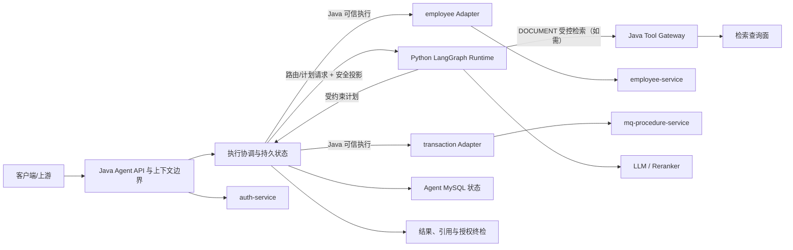
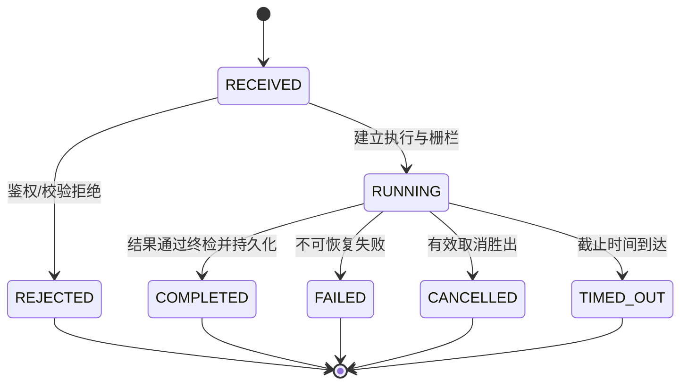

# 单体 Agent 应用与能力 L1 架构设计

> 文档层级：L1 分域/模块架构
>
> 文档状态：已评审 / 已通过 / 未实施 / 未生效

## 1. 文档治理信息

| 项目 | 内容 |
|---|---|
| 文档标识 | `AGENT-APP-L1-001` |
| 文档层级 | L1 分域/模块架构 |
| 权威范围 | 单体 Agent 的 Java 应用入口与控制面、Python LangGraph AI 编排、QUERY/AGGREGATE/DOCUMENT 能力、业务适配、执行与会话状态、跨运行时契约及结果安全 |
| 文档状态 | 已评审 |
| 评审状态 | 已通过；3轮历史正式评审—修复循环、`EB-L1-001～003`及`REV-L1-004`关闭记录继续有效。2026-07-17 新增 `AD-23～AD-24`、`DEC-17` 和 `APP-DEC-17` 为编写期同步，尚未改变历史通过结论，须与检索 L1 联合复评；文档仍未实施、未生效，各 L2 前置门禁不因历史 L1 通过而自动满足 |
| 实施状态 | 未实施 |
| 生效状态 | 未生效 |
| 当前版本 | v0.1 |
| 适用基线 | 2026-07-17 已完成正式复评的 L0（含 AD-22/DEC-16）；不继承既有实验性 `agent-*`、`es-*` 项目及相关文档 |
| 维护责任人 | Dylan |
| 目标文档位置 | `docs/design/agent/单体Agent应用与能力架构_L1_v0.1.md` |
| 评审报告 | [单体 Agent 应用与能力 L1 架构设计历史评审报告（截至2026-07-16）](./单体Agent应用与能力架构_L1_v0.1_评审报告.md)；本轮结论以第17节新增记录为准 |
| 上位 L0 | [单体 Agent 智能体 L0 总体架构设计](./单体Agent智能体总体架构_L0_v0.1.md)（`AGENT-L0-001`） |
| 关联 L1 | [检索与索引基础设施架构 L1](./检索与索引基础设施架构_L1_v0.1.md)（草稿/未评审）；双方共同约束检索查询面和文档源语义，但不共享实现所有权 |
| 治理的 L2 | 跨运行时契约、执行生命周期、能力路由、QUERY/AGGREGATE、DOCUMENT 编排、业务适配、安全审计、持久化 SQL、韧性与可观测详细设计 |
| 外部契约 | Java 生成的 OpenAPI；`auth-service` 身份、角色及 RBAC 授权投影；`employee-service`；`mq-procedure-service`；检索查询面；按业务域准入的外部或本地 LLM 推理服务；Reranker 服务契约 |
| 替代关系 | 不替代或修订 L0、关联 L1、外部契约和既有实验性设计；新实现使用原项目名之前，旧项目须按 L0 要求完成隔离/重命名 |

## 2. 修订历史

| 序号 | 日期 | 文档位置 | 修改内容 | 修改原因 |
|---:|---|---|---|---|
| 1 | 2026-07-16 | 全文 | 创建 L1 架构初稿 | 承接 L0 并建立 Agent 应用与能力域架构基线 |
| 2 | 2026-07-16 | 第 3、17 节 | 明确架构目标及其可追踪结果，记录第 1 轮编写期自检 | 修复严格校验发现的目标信号不足 |
| 3 | 2026-07-16 | 第 15、17 节 | 补齐 L0 决策逐项追踪并记录第 2 轮编写期复评 | 补充追踪检查发现 `DEC-07` 仅由范围标识承接，自动追踪不能逐项证明覆盖 |
| 4 | 2026-07-16 | 第 17 节 | 记录第 3 轮编写期复评结论 | 验证决策逐项追踪修复并结束内部循环 |
| 5 | 2026-07-16 | 第 8、10、13 节 | 分离持久审计事实与遥测事件的所有权；补齐双运行时、实验资产隔离和服务收敛的 L2 追踪 | 修复正式第 1 轮评审的 `REV-L1-001`、`REV-L1-002` |
| 6 | 2026-07-16 | 第 13 节 | 将 L2 约束引用改为逐个完整稳定标识 | 修复正式第 2 轮复评新增的 `REV-L1-003` |
| 7 | 2026-07-16 | 文档治理信息、第 17 节 | 同步为已评审/评审受阻，关联评审报告并记录 3 轮正式循环 | 文档发现已全部关闭，但上位规定的正式评审前置输入仍缺失 |
| 8 | 2026-07-16 | 文档治理信息、第 5、7、16、17 节 | 同步 DeepSeek 目标配置、维护人 Dylan，并补充剩余评审门禁的定义与示例 | 根据用户后续确认关闭实名维护人阻塞，部分解除 LLM 选型阻塞 |
| 9 | 2026-07-16 | 第 5～13、16～17 节 | 确认 Java 字段出域策略的执行顺序、白名单语义、默认拒绝和示例配置 | 落实应用侧数据处理边界，进一步收窄 `EB-L1-001` |
| 10 | 2026-07-16 | 文档治理信息、第 5、7、16～17 节 | 同步测试环境 LLM Provider 连通性通过并区分连通性、契约兼容性和效果验证 | 根据用户测试结论进一步收窄 `EB-L1-001`，不改变评审受阻状态 |
| 11 | 2026-07-16 | 文档治理信息、第 5、7～13、15～17 节 | 确认固定服务密钥与 Java 不透明短期执行凭据组合机制，并补充安全约束和 L2 交付 | 关闭 `EB-L1-002`，当前正式阻断由3项降为2项 |
| 12 | 2026-07-16 | 文档治理信息、第 5、11～13、16～17 节 | 确认 DOCUMENT 首期临时质量指标与阈值，并明确逐项门禁、分层报告和评价集工件要求 | 完成 `EB-L1-003` 的指标与阈值部分；评价集工件未冻结，当前正式阻断仍为2项 |
| 13 | 2026-07-16 | 第 16.4 节 | 删除配置、Header、TTL、存储等 L2 实施示例，收敛为架构不变量、下位交付和剩余门禁 | 恢复 L1/L2 层级边界，减少与第 10～13、16.1～16.3 节重复，不改变既有决策、阈值和阻断结论 |
| 14 | 2026-07-16 | 文档治理信息、第 5、7、16～17 节 | 同步 DeepSeek 公开服务条款及数据使用策略接受结论、API 契约实测和 L1 最小效果 PoC | 根据用户明确确认关闭 `EB-L1-001`；保留供应商政策变化与生产容量为后续风险，当前正式阻断由2项降为1项 |
| 15 | 2026-07-16 | 文档治理信息、第 5、13、16～17 节及评价证据目录 | 冻结 `EB-L1-003-DOCUMENT-EVAL` `1.0.0-synthetic` 评价包，补齐语料、样本、相关性/答案/权限标注、指标公式、报告 Schema 与校验和 | 根据用户授权完成版本化模拟评价集并关闭 `EB-L1-003`；当前执行阻塞归零，正式评审结论待复评 |
| 16 | 2026-07-16 | 文档治理信息、第 4～7、10～17 节 | 承接 L0 `AD-21`、`DEC-15`，将测试平台 API 与生产本地推理边界分离，新增 `APP-DEC-15`、生产公网调用/回退禁令、本地制品与契约复验门禁，并记录 `REV-L1-004` 关闭依据 | 根据用户确认的生产本地化部署事实修复平台 API 被误作生产依赖的问题；定向正式复评确认原前提不再适用并关闭 `REV-L1-004`，评审报告不在本次修改范围 |
| 17 | 2026-07-17 | 文档治理信息、第 4～17 节 | 承接 L0 `AD-22`、`DEC-16`，按业务域决定模型目标，复用既有字段权限生成实时安全上下文投影，并将 QUERY/AGGREGATE 改为 LLM 只产计划、Java 执行且结果不回传模型 | 落实用户确认的粗粒度控制方案，消除重复字段权限配置及旧 Tool 回调链路与当前实现不一致；本次为编写期更新，待正式复评 |
| 18 | 2026-07-17 | 文档治理信息、第 3～17 节 | 明确 `auth-service` 仅负责身份、角色和 RBAC 授权上界，Agent 是字段查询、展示、运算、脱敏、分类及模型安全投影策略的唯一权威；补充当前 Auth 字段投影的版本化迁移门禁 | 修复 `REV-AUTH-001` 所揭示的权限所有权偏差，防止 Auth 与 Agent 形成双重字段权威；本次为编写期修订，待正式复评 |
| 19 | 2026-07-17 | 文档治理信息、第 4～17 节 | 增加模型调用前 Java 权威 `ModelAccessDecision`，分离本地目标空 Key 配置检查、端点/网络门禁与 Serving 制品证明；同步 DOCUMENT 评价包 v2.0.0 并限定 Recall@50 的有效候选池前提 | 修复本轮第1次独立评审发现，关闭未分类输入先外发、配置证明混用、评价证据版本漂移和 Recall@50 失真风险 |
| 20 | 2026-07-17 | 文档治理信息、第 5、15～17 节 | 第2轮复评关闭全部实质问题，并发现第5.5节仍保留“须另行正式复评”的治理旧句 | 修复状态自相矛盾；不改变架构决策和外部门禁 |
| 21 | 2026-07-17 | 文档治理信息、第 17 节 | 回写第3轮独立复评通过结论 | 本轮问题全部关闭且无新增发现，L1可进入受各自前置门禁约束的L2详细设计阶段 |
| 22 | 2026-07-17 | 文档治理信息、第 4～17 节 | 承接 L0 `AD-23～AD-24`、`DEC-17`，同步首期受控文档源、单一语料库权限基线和未来“RBAC 有效权限投影+文档权限码”ACL 演进；修正关联检索 L1 已创建事实 | 落实用户确认的文档源与查询侧权限方案；新增决策待联合正式复评 |

## 3. 文档定位与权威关系

### 3.1 文档目标与架构目标

本文在 L0 确定的系统边界内，回答以下 L1 问题：

- Java 与 Python 两个运行时如何组成一个逻辑单体 Agent；
- QUERY、AGGREGATE、DOCUMENT 如何被识别、编排、执行和校验；
- Agent、业务适配器、权限系统、业务服务与检索基础设施之间如何协作；
- 跨运行时契约、执行状态、会话、结果和引用由谁拥有；
- 如何以能力端口扩展提交、修改和工作流能力，又不把当前读能力改造成通用巨型流程；
- 如何为未来 multi-agent 演进保留可切分边界，而不在当前引入多智能体协议。

本文只做架构责任分配和语义约束，不定义完整 API 字段、数据库字段、SQL、类、方法、Graph State、节点实现、Prompt 或检索参数。

本文的架构目标是：

- **权威唯一**：Java 是跨运行时契约和 Agent 持久状态的唯一权威，Python 只维护单次执行临时态；
- **能力隔离**：QUERY、AGGREGATE、DOCUMENT 具有独立策略和验证门禁，新增能力不修改既有能力主流程；
- **授权不可扩张**：所有业务查询和文档召回在执行前携带机器可执行的授权上界，任何后置校验均不能替代前置硬过滤；
- **结果可追溯**：结构化查询可追踪至业务调用，DOCUMENT 事实性输出可追踪至当前可访问的来源版本和引用；
- **失败可闭环**：取消、超时、重试和迟到响应由 Java 终态栅栏统一裁决，不产生状态回退或越过终态的持久副作用；
- **演进低侵入**：业务域通过 Adapter、能力通过策略与 Tool 权限扩展；未来写能力和 multi-agent 演进必须通过独立设计门禁。

上述目标分别由第 8～11 节的所有权、流程、机制和质量预算约束，并由第 13 节 L2 交付形成验证证据。

### 3.2 上位与同层权威关系

```text
单体 Agent 智能体总体架构 L0（全局约束与模块权威）
  ├─ 本文：单体 Agent 应用与能力 L1
  │    └─ 本文第 13 节治理的 L2 详细设计
  └─ 检索与索引基础设施 L1（已形成草稿，未正式评审，同层且独立）
       └─ 检索、索引、向量与 ES 运行机制的 L2 详细设计
```

权威冲突按“L0 > 各自 L1 > 各自 L2/实现”处理。同层 L1 不相互覆盖；涉及检索查询面的共享语义必须联合评审，任何一方均不得单独改变另一方的所有权。

### 3.3 本文唯一负责

- Java Agent 对外入口、请求上下文边界、执行控制和持久状态权威；
- Java 到 Python Runtime API、Python 到 Java Tool API 的语义与治理；
- Python LangGraph 内的能力路由、AI 推理和业务级编排边界；
- QUERY、AGGREGATE、DOCUMENT 的能力策略、流程和结果安全；
- employee、transaction 业务适配器的 Agent 侧端口和隔离原则；
- 会话、任务、执行、结果、引用的 Agent 侧生命周期；
- 未来新增能力的注册、隔离、策略分类和演进门禁。

### 3.4 本文明确不负责

| 非职责内容 | 唯一负责文档/模块 | 本文使用方式 |
|---|---|---|
| 用户/服务主体、角色关系与 RBAC 规则 | `auth-service` 及其契约 | Java 获取可信主体和能力/业务域/操作授权上界；不得在 Agent 复制用户、角色或 RBAC 规则。字段策略及 Agent 边界内最终约束组合由本文负责 |
| employee、transaction 业务事实和资源访问属性 | `employee-service`、`mq-procedure-service` | 通过适配器调用外部接口；不复制业务主数据权威 |
| BM25、Dense、可选 Sparse 的原子召回及其检索运行机制 | 检索与索引基础设施 L1 | DOCUMENT 通过 Java Tool 消费受约束的检索查询面 |
| 索引/向量 CRUD、Mapping、物理索引、Alias、技术版本、重建及 ES 韧性 | 检索与索引基础设施 L1 | 只消费查询能力与兼容性/就绪信息，不发起管理面写入 |
| 文档源主数据、稳定文档 ID、业务版本、资源访问属性和撤权事实 | 文档来源系统及其契约 | 作为检索过滤、引用和最终校验的权威输入 |
| Schema 迁移执行 | DB 责任方 | 本域仅交付前向、回滚和验证 SQL，不由应用启动时执行 |
| 指标/追踪后端、生产 HA 拓扑和最终 SLO 数值 | 后续运维架构/专项设计 | 当前仅保留稳定端口、上下文传播和 No-op 实现 |
| multi-agent 协议、协商、调度和独立 Planner 服务 | 未来 L0/L1 修订 | 当前只保留可拆分的契约、能力和状态边界 |

### 3.5 适用范围与非目标

适用范围是首期单体 Agent 的 QUERY、AGGREGATE、DOCUMENT 三类只读能力，以及 employee、transaction 两个业务域。首期默认同步请求与受控回调，不引入异步消息主链路、持久化 Python Checkpointer、Spring AI、LangSmith 或 multi-agent 框架。

提交、数据修改、工作流提交属于明确的后续扩展，不在本文定义具体行为。它们必须作为有副作用能力进入独立策略、契约、幂等、授权、审计和补偿设计，不得复用只读 Tool 的自动重试语义。

## 4. 上位约束映射

| L0 约束 ID | 上位来源 | 本文落实方式 | 本文章节 | 下位验证证据 | 偏差/ADR |
|---|---|---|---|---|---|
| AD-01 | 实验资产非基线 | 文档和实现均不得从旧 `agent-*`、`es-*` 推导目标架构；旧资产只可经显式评估后迁移 | 1、5、14 | 资产隔离清单、迁移评估 | 无 |
| AD-02 | 逻辑单体、双运行时 | Java 是入口/控制/状态面，Python 是 LangGraph AI 编排面；共同组成单体 Agent | 6、8、10 | 部署拓扑与职责测试 | 无 |
| AD-03 | Java 是跨运行时契约唯一来源 | Runtime API 与 Tool API 以 Java OpenAPI 为源，Python 同步生成/校验模型 | 7、10 | OpenAPI 生成与兼容门禁 | 无 |
| AD-04 | Java/MySQL 是唯一持久状态权威 | Python 图状态仅限单次执行，不使用持久 Checkpointer | 8、9 | 状态写入审计、重启测试 | 无 |
| AD-05 | Python 不直连业务、权限、DB、ES | Python 仅经 Java Tool 访问业务与检索；允许直连 LLM/Reranker AI 基础设施 | 6、7、10 | 网络策略和依赖扫描 | 无 |
| AD-06 | DOCUMENT 归 Agent | 问题理解、业务编排、融合、精排、上下文、生成和验证由本域负责；检索域仅提供原子能力 | 6、9、10 | DOCUMENT 流程与边界测试 | 无 |
| AD-07 | 不新建 `es-document-service` | 本文不设文档召回服务；只消费收敛后的检索查询面 | 3、6、14 | 模块清单与依赖检查 | 无 |
| AD-08 | RBAC 与字段策略权威分离 | 身份、角色和 RBAC 归 `auth-service`；字段查询/展示/运算/分类/脱敏及模型投影策略归 Agent；Adapter/检索只执行不可扩权约束 | 6～10 | RBAC 越权、字段策略和撤权测试 | 无 |
| AD-09 | 检索前硬过滤 | 授权/业务硬过滤在召回前注入，生成后校验仅作纵深防御 | 9、10 | 无过滤查询拒绝测试 | 无 |
| AD-10 | 跨进程调用不持有本地上下文 | Java 调 Python 前结束 DB 事务，不持锁，不跨调用传播线程上下文 | 9、10 | 事务边界和阻塞检查 | 无 |
| AD-11 | 只读执行幂等可重入 | QUERY/AGGREGATE 由 Java 按只读语义执行；DOCUMENT 检索 Tool 按只读语义设计；写能力另立策略 | 7、10 | 重放、重试与并发测试 | 无 |
| AD-12 | SQL 交付、DB 执行迁移 | L2 仅产出前向/回滚/验证 SQL，应用无自动迁移依赖 | 10、13、14 | SQL 审核及启动检查 | 无 |
| AD-13 | 可观测端口先行 | 日志、指标、追踪端口与上下文稳定，当前允许 No-op 且不绑定后端 SDK | 10、11 | 端口替换和关联性测试 | 无 |
| AD-14 | 当前不引入 multi-agent | 以能力、适配器、运行时契约和状态边界支持未来切分，不实现 Agent 间协议 | 6、10、14 | 架构依赖检查 | 无 |
| AD-15 | ES 非文档/业务版本权威 | 本域仅使用来源方稳定 ID、业务版本和资源属性；Alias/技术版本由同层检索 L1 负责 | 3、7、8 | 引用版本与来源追踪测试 | 不适用部分：物理索引实现不属于本文 |
| AD-16 | AI 输出不可信 | Python 产出候选结果；Java 在返回和持久化前执行契约、授权、引用和安全校验 | 8、9、10 | 非法结果、伪引用测试 | 无 |
| AD-17 | 授权事实组合边界 | `auth-service` RBAC 上界、Agent 字段策略和来源资源属性由 Java 组合为最终可执行约束；组合只能收紧，Adapter/检索执行 | 7～10 | 三类版本绑定、授权组合与非扩权测试 | 无 |
| AD-18 | 终态单调与栅栏 | Java 以执行版本/栅栏、截止时间和取消信号控制终态；迟到响应不得覆盖或产生持久副作用 | 8、9、10 | 取消、超时、迟到响应测试 | 无 |
| AD-19 | 内部契约兼容门禁 | Java、Python、检索查询面携带内部契约版本/指纹并发布就绪状态；不兼容实例不接流量 | 7、10、14 | 混合版本发布测试 | 无 |
| AD-20 | 查询面与管理面隔离 | Python Tool 仅暴露检索查询；索引写入只允许可信来源/运维入口 | 3、6、7、10 | 调用方能力凭证和网络策略测试 | 无 |
| AD-21（已被 AD-22 替代） | 原测试平台/生产本地环境隔离规则保留为历史映射，不再作为统一模型准入条件 | 由 AD-22 按业务域、数据分类和权限安全投影治理 | 4、12、15～17 | 替代关系和历史评审记录可追踪 | 无 |
| AD-22 | 业务域模型准入、Agent 字段策略统一投影与计划/执行隔离 | Java 在任何模型发送前依据受信业务上下文形成 `ModelAccessDecision`；未分类/混合输入只允许本地高信任分类或拒绝，不调用公共模型判域。Java 再将 `auth-service` RBAC 上界、Agent 唯一字段策略和来源资源属性组合，实时生成 `message/history/context` 安全投影；QUERY/AGGREGATE Runtime 只返回计划，Java 执行且结果不回传模型 | 5～14、16 | 未分类/混合输入公共模型零调用、域—模型目标准入矩阵、目标配置/端点/Serving 证明分层、RBAC/字段策略组合、自由文本敏感实体、撤权后上下文、计划/执行隔离和结果不回传测试 | 当前 Auth 字段投影须版本化迁移 |
| AD-23 | 受控脚本文档源与可重建权威 | 本域不维护文档主数据；只消费受控原始存储和版本化录入清单提供的稳定 ID、单调业务版本、录入批次/快照和状态，并要求管理写入具备独立服务身份与可审计操作人 | 3、6～10、13～16 | 来源/版本/引用追踪、管理身份、重复/乱序、重建与审计测试 | 物理存储和清单字段由检索 L2 冻结 |
| AD-24 | 首期单一语料库权限与 ACL 演进 | Java 从可信主体/租户和 `auth-service` RBAC 投影出发，叠加 DOCUMENT 能力和语料库访问权限形成最终约束；首期不支持文档级差异化 ACL。未来优先消费稳定有效权限投影并匹配文档权限码，少量资源列表只作例外授权 | 6～10、12～16 | 语料库越权、缺失权限、撤权重算、未来权限码/资源例外兼容测试 | 启用文档级 ACL 前须联合修订两份 L1 和外部契约 |

本文承接 L0 `AD-22～AD-24`，`AD-21` 仅保留为被替代的历史决策，不再作为统一模型准入条件。AD-15、AD-23 的物理实现责任由关联 L1 承接，但其“业务版本不以 ES 为准”和“原始存储/录入清单为权威”的消费约束对本文仍然有效。

## 5. 背景、当前基线与目标

### 5.1 背景与问题

目标系统需要用一个 Agent 统一提供结构化数据查询、聚合分析和文档问答，同时保持业务域隔离、授权正确和证据可追踪。若把 AI 编排、业务调用、检索实现、状态持久化混入同一技术模块，会造成契约多源、越权过滤滞后、状态竞争和后续能力侵入。

### 5.2 当前架构

本 L1 面向新建目标系统。已有 `agent-*`、`es-*` 及其设计/评审文档属于早期实验资产，只能用于风险发现，不能作为目标职责、接口或数据模型的依据。当前可复用的权威输入仅包括 L0、已确认的外部业务接口和测试机基础设施事实。

### 5.3 目标架构



Java 控制请求、业务域模型准入、权限安全投影、计划校验、业务执行、状态和最终结果；Python 控制单次 AI 路由与规划。QUERY/AGGREGATE 的业务结果不返回 Python/LLM；DOCUMENT 如需受控检索 Tool，仍由 Java 掌握授权与执行权威。三类能力共享稳定端口，不共享隐含业务规则。

### 5.4 差距分析

| 维度 | 当前状态 | 目标状态 | 差距 | 处理阶段 |
|---|---|---|---|---|
| 项目基线 | 旧实验资产不可继承 | 新项目、新契约、新状态模型 | 需先隔离旧项目并建立骨架 | 实施准备 |
| 跨运行时契约 | 尚无目标契约基线 | Java OpenAPI 单一来源、Python 自动同步 | 需 L2 定义分组、版本和生成门禁 | L2 |
| 执行状态 | 尚无目标状态模型 | Java/MySQL 唯一权威、终态单调 | 需状态机和并发语义 | L2 |
| 能力体系 | 需求已确认 | 三类只读能力策略隔离 | 需路由、策略和错误语义 | L2 |
| 业务接入 | 外部接口已存在 | 两个域经独立适配器接入 | 需确认契约、授权和分页能力 | L2/外部契约确认 |
| DOCUMENT | 流程需求已确认 | 完整证据化 RAG 编排 | 固定模拟评价包 `2.0.0-synthetic` 及可重算报告契约已形成；仍需补足 Recall@50 有效候选池、检索查询面及 L2 实际跑分 | L2/联合门禁 |
| LLM 目标治理 | DeepSeek 平台 API 契约与合成数据 PoC 已验证 | 按业务域和数据分类准入公共或本地模型目标；每个获批目标的许可、契约、容量和回滚独立可验证 | 尚未冻结各业务域准入矩阵和对应模型目标的专项证据 | 安全/上下文 L2、部署 L2及对应业务域启用前 |
| 权限契约与字段权威 | 当前 `auth-service` 权限投影包含可查询/可展示字段及操作符/函数，Java 又与 Agent 本地字段策略求交 | `auth-service` 仅返回身份、角色和 RBAC 上界；Agent 字段策略是字段级规则与模型投影的唯一权威 | 现有契约、配置和实现形成双重字段权威，需版本化兼容迁移并删除 Auth 字段规则依赖 | 权限/安全 L2；目标实现验收前完成 |
| 可观测 | 后端本期不实现 | 稳定端口、上下文和可替换 No-op | 需定义最小事件语义 | L2 |
| 生产运行 | 本机测试基础设施可用 | 可发布、可回滚、可定容 | 缺生产 SLO、容量、网络和 HA 输入 | 生产评审前 |

### 5.5 设计假设与限制

- 首期执行以同步“规划—Java 可信执行”为主；QUERY/AGGREGATE 不使用 Tool 回调，DOCUMENT 可按受控检索需要使用只读 Tool，不承诺长任务异步恢复。
- Java 使用 L0 选定技术栈；Python 使用 Python 3.12、LangGraph 1.x LTS、FastAPI、Pydantic 2.x、Uvicorn、httpx。
- 本机 MySQL 3306 及现有 Docker 中间件只作为测试环境，不等价于生产拓扑。
- LLM 模型目标按业务域和数据分类准入。Java 必须在任何模型发送前依据受信入口元数据、已批准业务上下文或确定性规则形成 `ModelAccessDecision`；用户自由文本中的自称域只可作为候选。税务政策、法律法规、官方通知等公开资料域可使用获批准公共服务；公司制度、内部文件等内部资料域仅允许本地模型或完成专项安全、合规、合同和技术评估的受信公共服务。未分类、跨域混合或冲突输入只能使用获准处理最高敏感等级的本地分类目标并采用最严格安全投影，或拒绝/要求澄清；不得调用公共模型完成前置判域。`auth-service` 只提供身份、角色和 RBAC 授权上界；Agent 字段策略是字段查询、展示、运算、分类、脱敏及模型安全投影的唯一事实来源。`message/history/contextViews` 每次发送前按 RBAC 上界、来源资源属性和当前 Agent 字段策略重新生成。DeepSeek 平台既有条款接受和 PoC 只作为目标能力证据，不构成业务域自动准入。`REV-L1-004` 历史关闭记录保留；本次新增决策已通过2026-07-17正式复评，运行证据仍由对应L2提供。
- Sparse 召回是可选能力，未满足模型、索引、评价收益和运维门禁时不得成为必经链路。

## 6. 职责与边界

### 6.1 核心职责

| 职责 | 输入 | 产出 | 所有权 | 不负责事项 |
|---|---|---|---|---|
| 请求接入、模型访问裁决与上下文建立 | 用户请求、可信身份、RBAC 上界、会话标识、受信路由/业务上下文；用户声明的业务域仅作候选 | 规范请求、执行标识、不可变 `ModelAccessDecision`、按 Agent 字段策略生成的最小安全上下文；未分类/混合输入本地高信任分类或拒绝 | Java Agent | 用户/角色/RBAC 规则维护；不得让公共模型决定自身是否获准接收输入 |
| 执行协调 | 规范请求、能力类型、截止时间 | 状态迁移、Runtime 调用、取消/超时控制 | Java Agent | AI 推理节点实现 |
| 能力理解与路由 | 当前问题、允许使用的最小历史上下文 | QUERY/AGGREGATE/DOCUMENT 策略选择及候选计划 | Python Runtime；Java 按 RBAC 和 Agent 字段策略校验能力范围 | 授权规则或字段策略决策 |
| QUERY | LLM 生成的结构化查询计划、域、过滤/分页/排序约束 | Java 执行并直接形成可验证的数据查询结果 | Java Agent + 对应适配器 | LLM 执行业务调用、接收查询结果或维护业务事实 |
| AGGREGATE | LLM 生成的聚合计划、域、维度、指标、过滤约束 | Java 执行并直接形成可验证的聚合结果 | Java Agent + 对应适配器 | LLM 执行业务调用、接收聚合结果或维护指标事实 |
| DOCUMENT | 问题、授权过滤、检索原子结果 | 基于证据的答案、引用与完整性结论 | Agent 能力域 | 索引实现和文档主数据维护 |
| Tool 执行与约束 | DOCUMENT 的 Python 检索 Tool 请求、执行上下文 | 受授权、幂等、审计的检索结果 | Java Tool Gateway | 执行 QUERY/AGGREGATE、扩大授权或绕开检索边界 |
| 业务适配 | 规范化能力请求 | 外部业务接口请求/响应的语义适配 | 各域 Adapter | 跨域业务规则和通用 AI 编排 |
| 结果安全与持久化 | Java 业务执行结果或 DOCUMENT 候选结果、权威资源属性、执行栅栏 | 最终结果/引用或拒绝、终态 | Java Agent | 将 QUERY/AGGREGATE 结果回传 LLM 或生成新的业务事实 |

### 6.2 模块内部逻辑组件

| 逻辑组件 | 架构职责 | 依赖 | 边界 | 扩展价值 |
|---|---|---|---|---|
| Java API、模型访问决策与上下文边界 | 鉴别调用，依据受信元数据/业务上下文和确定性规则形成 `ModelAccessDecision`，选择获准模型目标，并依据 RBAC 上界与 Agent 字段策略生成最小安全上下文 | auth-service、Agent 字段策略、业务域模型准入策略、目标注册表、状态存储 | 唯一外部 Agent 入口；用户自称域不构成授权事实；未分类/混合输入不得先发公共模型，授权/策略缺失和不匹配目标失败关闭 | 隔离渠道协议变化和模型目标扩展 |
| Java 执行协调器 | 生命周期、截止时间、取消、栅栏和 Runtime 调用 | 状态存储、Runtime Gateway | 唯一终态写入协调者 | 可替换同步/异步执行策略 |
| Java 契约权威与 Runtime Gateway | 发布 OpenAPI、校验版本/指纹、调用 Python | Python Runtime | 不承载业务编排 | 跨进程独立演进 |
| Java 计划校验与可信执行 | 按 RBAC 上界、Agent 字段策略和资源属性校验 QUERY/AGGREGATE 计划，选择 Adapter 并直接处理结果 | auth-service、Agent 字段策略、Adapter、业务域服务、结果安全校验 | 不调用 Runtime 组织业务结果；执行结果不得进入模型上下文 | 新业务域通过 Adapter 和字段策略接入 |
| Java Tool Gateway | 校验 DOCUMENT 检索能力、授权、执行归属和幂等语义 | 检索查询面 | Python 唯一受控检索出口；不执行 QUERY/AGGREGATE | DOCUMENT 检索策略可扩展 |
| Java Adapter Registry | 解析域并选择独立适配器 | employee/transaction Adapter | 不含域内业务事实 | 新业务域插件式接入 |
| Java 字段策略、模型准入与安全投影 | 维护字段查询/展示/操作符/函数/分类/脱敏/模型处理用途策略；在发送前生成绑定业务域/数据分类、目标引用/信任等级、决策依据和策略版本的 `ModelAccessDecision`，再将 RBAC 上界、来源资源属性与 Agent 字段策略组合为 `message/history/contextViews` 安全投影 | auth RBAC 投影、来源资源属性、受信业务域上下文、Agent 字段策略、模型目标注册表与信任基线 | Agent 是字段策略和单次模型访问裁决权威；未分类/混合输入只允许本地高信任分类或拒绝，公共模型不得参与前置判域；自由文本无法安全转换或任一必要约束不完整时拒绝发送 | 新业务域和模型目标通过准入矩阵、目标注册表与 Agent 字段策略扩展，不修改 Auth RBAC 权威 |
| Java 结果与引用安全校验 | 契约、栅栏、授权、引用和敏感输出终检 | 状态、来源属性、候选结果 | 不调用 LLM 判定授权 | 统一输出安全门禁 |
| Java 状态存储端口 | 会话、任务、执行、结果、引用的权威读写 | MySQL | 不由 Python 直接访问 | 持久层可测、迁移可控 |
| Python Runtime 契约边界 | 接收规范请求并返回候选结果/事件 | Java Runtime API | 不接受外部用户直连 | 隔离 Web 框架和图实现 |
| Python 能力路由器 | 根据已允许能力选择策略子图 | 上下文理解、各能力子图 | 不决定授权范围 | 新能力可独立挂载 |
| Python 上下文理解 | 基于 Java 安全投影进行文本规范化、多轮补全和意图候选 | LLM、最小历史上下文 | 不接收原始权限数据；历史不是事实证据 | 可替换理解策略 |
| Python QUERY/AGGREGATE 规划 | 生成受约束计划并返回 Java | LLM、Runtime API | 不调用 Tool、不直连业务服务、不接收或组织业务结果 | 跨域复用规划逻辑 |
| Python DOCUMENT 编排 | 多路召回编排、去重合并、RRF、精排、上下文、生成与证据检查 | Java Tool API、LLM/Reranker | 不实现索引和原子召回 | 检索策略可组合演进 |
| 遥测端口 | 结构化事件、指标、追踪上下文传播 | Java/Python 各运行时 | 不绑定具体后端 SDK | 后续无侵入接入后端 |

### 6.3 同层边界

| 关联 L1 | 对方权威范围 | 本文责任 | 交互语义 | 禁止侵入事项 |
|---|---|---|---|---|
| 检索与索引基础设施架构 L1（草稿/未评审） | 原子 BM25/Dense/可选 Sparse、受控文档源管理、检索执行、索引/向量 CRUD、Mapping、Alias、技术版本、重建和 ES 韧性 | 定义检索意图，将可信主体/租户、RBAC、DOCUMENT 能力和语料库访问权限组合为授权硬过滤，负责召回组合、结果融合、业务排序、上下文和答案验证 | Java Tool 以检索查询面提交单一语料库受约束请求并获取带稳定文档/分块标识、来源版本及得分语义的候选 | 本文不定义物理索引/打分实现；对方不维护用户/角色/RBAC，不实现问题理解、RRF、Reranker、会话、LLM 生成或业务规则 |

双方已联合冻结首期架构语义：受控原始存储/版本化录入清单为文档权威；首期一个预配置逻辑语料库、统一数据安全等级和语料库级访问策略；Java 形成不可扩大过滤，检索只执行；撤权围栏全局可见后才确认删除、停用或访问收窄成功。字段级契约、查询预算、错误/部分成功、版本/指纹和就绪门禁仍由双方 L2 联合冻结；检索 L1 尚未正式评审，不得把本次同步表述为对方已批准。

### 6.4 依赖方向和循环检查

允许的主依赖方向为：外部入口 → Java Agent 控制面 → Python Runtime → 返回计划 → Java 计划校验/可信执行 → Adapter → 业务服务；DOCUMENT 如需受控检索，可由 Python Runtime → Java Tool Gateway → 检索查询面；Java Agent → auth-service/MySQL。Python 仅可直连获当前业务域批准的 LLM/Reranker。

禁止 Java Adapter 反向调用 Python、业务服务回调 Agent 内部组件、检索基础设施依赖 Agent 编排实现、Python 绕过 Tool Gateway，以及 QUERY/AGGREGATE 业务执行结果回传 Runtime。DOCUMENT 受控 Tool 回调形成的是协议级请求—响应闭环，不得形成代码依赖或分布式事务闭环。

## 7. 语义契约与交互

### 7.1 入站契约

| 契约/能力 | 提供方 | 调用方 | 语义 | 权限/一致性/兼容性要求 |
|---|---|---|---|---|
| Agent API | Java Agent | 客户端/上游 | 提交问题、读取结果、取消执行；返回规范状态、答案、数据或错误 | 仅接受可信身份上下文；重复提交策略由 L2 明确；版本向后兼容 |
| Runtime API | Python Runtime | Java Agent | 在获准模型目标、最小安全上下文、截止时间和栅栏内完成路由/规划；QUERY/AGGREGATE 只返回受约束计划 | Java OpenAPI 为唯一源；指纹不兼容不接流量；不得携带原始用户令牌或业务执行结果 |
| Tool API | Java Tool Gateway | Python Runtime | 执行 DOCUMENT 已注册的只读检索操作 | 同时携带固定 Runtime 服务密钥与 Java 签发的不透明短期 `capabilityId`；服务端绑定 execution/fence/tool/租户或用户范围/过滤摘要/截止时间并失败关闭；不得承载 QUERY/AGGREGATE 结果回传 |
| Adapter Port | 各域 Adapter | Java 计划校验与可信执行 | 将已验证的 Agent 计划适配到具体业务域 | 域隔离；结果必须可追踪至外部调用；不得跨域拼装权限或回传 Runtime |

Agent API 是唯一用户入站面；Runtime API 与 Tool API 都是内部契约，不得暴露为外部业务入口。

### 7.2 出站依赖

| 依赖 | 权威方 | 使用目的 | 失败语义 | 超时/重试/降级边界 |
|---|---|---|---|---|
| `auth-service` | 身份、角色与 RBAC 域 | 获取可信主体、当前租户、稳定角色以及能力/业务域/操作授权上界；首期据此判断 DOCUMENT 和单一语料库访问，未来文档 ACL 优先消费由 RBAC 派生的稳定有效权限投影 | 无法获得可信且绑定当前主体/租户的 RBAC 投影即拒绝，不允许默认放行 | 只在幂等且预算允许时有限重试；不可用不降级为匿名扩权；不消费 Auth 字段规则。当前仅有角色投影时，角色绑定只可作为版本化过渡，不得在 Agent 复制用户角色关系 |
| `employee-service` | employee 域 | QUERY/AGGREGATE 业务数据 | 区分无数据、非法条件、权限拒绝和依赖失败 | 只读且外部契约允许时有限重试；不得以缓存扩大可见范围 |
| `mq-procedure-service` | transaction 域 | QUERY/AGGREGATE 业务数据 | 同上，并保持分页/聚合语义可验证 | 同上；无 Agent 所需语义时应显式失败而非猜测 |
| 检索查询面 | 检索与索引基础设施域 | 执行受授权硬过滤的原子召回 | 区分空召回、部分路失败、过滤拒绝、超时和版本不兼容 | 单路可按 DOCUMENT 策略降级；不得绕过硬过滤，管理面不可重试调用 |
| LLM 推理服务 | 各经批准的公共或本地模型目标；业务/安全方拥有域—目标准入基线 | 理解、规划、DOCUMENT 生成和候选判断 | 输出始终视为不可信；目标不满足当前业务域信任等级、权限安全投影缺失或发生跨信任等级自动回退时失败关闭 | DeepSeek 平台基本调用链、JSON、Tool、上下文和错误语义已验证，但只证明该目标能力；每个公共或本地目标须独立验证许可、协议、输出 Schema、效果、容量、故障、升级和回滚 |
| Reranker | AI 基础设施提供方 | DOCUMENT 候选精排 | 不可用时按评价验证过的策略降级或明确失败 | 不得突破候选授权范围；受剩余预算约束 |
| MySQL | DB 责任方/Agent 状态域 | 保存 Agent 权威状态 | 写入失败不得返回已持久成功；状态冲突按栅栏拒绝 | 事务仅限 Java 本地短事务，不跨 Python/外部调用 |

### 7.3 契约演进

- Java 源 OpenAPI 分离外部 Agent API、Runtime API 和 Tool API 的治理范围，但保持一个 Java 权威源；Python 模型由契约生成/同步，不手工维护平行真相。
- 系统自有的 Java、Python 和检索查询面制品发布契约版本、指纹和就绪状态。启动兼容不等于接流量兼容；路由层仅向兼容实例分配请求。
- 兼容变更遵循先提供方兼容发布、再调用方消费、最后移除旧语义；破坏性变更须新增版本并经过混合版本验证。
- 外部业务契约不受本文定义。若 employee/transaction 现有接口无法提供 Agent 所需的分页、聚合、过滤或错误语义，应由对应契约责任方先决策，本文不得通过猜测补齐。
- 完整路径、字段、错误码、生成工具和兼容矩阵由“跨运行时契约与生成治理 L2”定义。

## 8. 数据、状态与运行时所有权

| 对象/状态/事实 | 权威方 | 写入边界 | 读取边界 | 一致性/生命周期 |
|---|---|---|---|---|
| 用户/服务主体、角色关系、RBAC 规则与授权上界 | `auth-service` | 仅身份权限域 | Java 按契约读取最小必要 RBAC 投影；Python 不接触原始凭证 | 不在 Agent 复制为新权威；按版本/有效期重新校验；契约不包含字段规则 |
| Agent 字段策略 | Java Agent | 仅 Agent 受控策略发布路径 | Java 计划校验、结果安全、模型投影与检索约束组合读取；Python 只接收计算后的安全视图 | 字段查询/展示/运算/分类/脱敏/模型用途规则单一权威；新增字段默认拒绝；版本化撤销与回滚 |
| 单次 `ModelAccessDecision` | Java Agent | Java 在任何模型发送前依据受信路由/业务上下文、确定性分类规则、域—目标矩阵和目标注册表生成；Python/模型不可写 | Runtime Gateway、强制审计和结果诊断只读；不向模型暴露内部决策细节 | 绑定 execution、业务域/数据分类、目标引用/信任等级、决策依据、策略版本和允许发送范围；执行结束后按审计保留策略保存摘要，不作为跨请求缓存放行依据 |
| employee/transaction 业务事实 | 对应业务服务 | 仅业务域 | Adapter 按授权查询 | Agent 结果是执行快照，不转移主数据权威 |
| 文档内容、稳定 ID、业务版本、录入批次和首期统一语料库属性 | 受控原始文档存储及版本化录入清单 | 仅具备文档管理权限的操作人经独立服务身份脚本写入；Agent/Python 不写 | Java/检索按契约使用，Python 只接收已过滤必要内容 | 引用必须回溯来源版本；ES 技术版本不是替代权威；首期资源属性仅含租户/语料库范围、有效状态、统一安全等级和策略版本 |
| 会话与多轮上下文 | Java Agent/MySQL | Java 状态端口 | Java 每次按当前业务域准入、RBAC 上界、来源资源属性和 Agent 字段策略重新生成安全投影后提供给 Runtime | 持久保留与删除策略由 L2 定义；历史只辅助理解，不作事实证据；撤权数据和 QUERY/AGGREGATE 执行结果不得进入后续模型上下文 |
| 任务/执行状态、截止时间、取消、栅栏 | Java Agent/MySQL | Java 执行协调器 | Java控制；Python接收当前执行上下文 | 终态单调；迟到事件只可审计，不可改写终态 |
| Python Graph State | 当前 Python 执行进程 | 单次图执行 | 仅当前执行节点 | 临时、可丢弃；不作为恢复或审计权威 |
| DOCUMENT Tool 调用审计事实 | Java Agent/MySQL | Java Tool Gateway | 权限审计、安全追溯和执行诊断 | 强制持久且绑定执行、步骤和调用标识；QUERY/AGGREGATE 无 Runtime Tool 调用；保留/脱敏策略由安全与持久化 L2 共同落实 |
| 短期执行能力映射 | Java Agent 服务端权威存储 | Java 创建执行后生成并写入；Python 不能创建、读取映射或扩大范围 | Java Tool Gateway 以 `capabilityId` 摘要查找并校验；Python 只持有原始不透明值 | 绑定 execution/fence/allowedTools/主体范围/filterHash/expiresAt；终态、栅栏变化、过期或显式撤销即失效；多实例必须共享一致权威或采用经验证的等价路由约束 |
| 业务域模型准入、目标注册表、RBAC 投影、Agent 字段策略及资源属性版本 | 业务/安全方维护业务域分类与模型目标信任基线；运维/安全维护目标引用、端点、信任等级和认证模式；`auth-service` 维护身份/角色/RBAC；Agent 维护字段策略；业务/文档来源方维护资源属性 | 各权威仅经自身受控发布路径写入；禁止跨边界复制字段规则或由 Python 动态新增目标 | Java 形成 `ModelAccessDecision`、组合执行与安全审计读取；Python 只接收获准目标引用和发送时生成的安全上下文视图 | 域/目标或任一必要约束未声明、自由文本无法安全转换或字段新增时默认拒绝；每次发送重算，支持撤权与回滚 |
| 遥测派生事件 | 各运行时事件源；遥测后端不成为业务事实权威 | Java/Python 通过遥测端口发出 | 日志、指标、追踪适配器按配置消费 | 可丢失的指标/追踪投影不得承担状态恢复、授权判定或强制安全审计 |
| 候选答案、查询计划、聚合解释 | Python Runtime | 当前执行 | Java 校验前暂存/接收 | 不可信中间产物；未经门禁不得成为最终结果 |
| 最终答案、结构化结果、引用、完整性结论 | Java Agent/MySQL | Java 结果安全门禁后 | Agent API 按授权返回 | 与执行终态一致；权限变化后的再读取策略由 L2 定义 |
| 索引、向量、Mapping、Alias、技术版本 | 检索与索引基础设施域 | 仅可信来源/运维管理面 | 本文只读查询面就绪与结果 | 不由 Agent/Python 写入或作为业务版本权威 |
| 契约制品、版本和指纹 | Java 源及构建发布链 | Java 源生成，消费方只同步 | Java/Python/检索就绪门禁 | 制品可追溯；不兼容组合不可服务 |

## 9. 核心流程和失败闭环

### 9.1 统一执行状态



Java 是状态机唯一写入者。Python 和 Tool 只能报告候选事件；任何事件必须携带当前执行标识和栅栏。终态一旦提交，迟到的 Runtime/Tool 响应不得覆盖终态、写入最终结果或触发新的持久副作用。

### 9.2 流程总表

| 流程 | 入口 | 关键责任 | 状态权威 | 失败与恢复 | 审计/观测 |
|---|---|---|---|---|---|
| 请求接入 | Agent API | Java 校验输入和可信身份，建立会话/执行/截止时间，提交本地事务后调用 Python | Java/MySQL | 鉴权失败转 REJECTED；持久化失败不调用 Runtime | request/execution/subject/contract 指纹关联 |
| QUERY | 能力路由 | Java 先形成 `ModelAccessDecision`；未分类/混合输入只允许本地高信任分类或拒绝，不调用公共模型判域。随后按 RBAC 上界和 Agent 字段策略生成最小安全上下文；Python 只形成受约束查询计划；Java 校验计划并选域 Adapter 执行，完成字段/结果终检后直接返回调用方，业务响应不回传 Runtime/LLM | Java/MySQL | 域/模型目标不匹配、RBAC/字段策略投影失败或计划非法时拒绝；依赖超时在总预算内有限重试；无数据不伪造成失败 | `ModelAccessDecision` 摘要、计划摘要、域/模型目标准入决策、RBAC/字段策略版本、Adapter 调用、耗时和结果规模；不记录敏感原值 |
| AGGREGATE | 能力路由 | Java 先形成 `ModelAccessDecision` 并生成最小安全上下文；Python 只形成维度/指标/过滤计划；Java 校验后由 Adapter 执行业务域聚合并直接完成结果契约/权限校验，聚合结果不回传 Runtime/LLM | Java/MySQL | 未分类/混合输入不得发公共模型；不支持的指标/维度显式拒绝；禁止在 Agent 内对无限明细兜底聚合；权限和业务域策略不得由模型放宽 | `ModelAccessDecision` 摘要、聚合计划、域/模型目标准入决策、权限投影版本、Adapter 调用结果摘要和预算 |
| DOCUMENT | 能力路由 | 理解问题→前置硬过滤→多路召回→去重/合并→RRF→精排→业务校正→邻块/上下文→生成→终检 | Java/MySQL | 单路失败按策略降级；证据不足、授权不明、引用不一致时拒答/声明不足；不得用模型常识补证据 | 召回路、过滤摘要、候选变化、引用、校验结论 |
| 取消/超时 | Agent API/截止时间 | Java推进 CANCELLED/TIMED_OUT，传播取消；后续回调按栅栏丢弃 | Java/MySQL | 无法中断的外部调用可结束但结果仅审计；不得转成功 | 取消来源、胜出终态、迟到事件计数 |
| 结果读取 | Agent API | Java按当前授权与保留策略读取权威结果 | Java/MySQL | 权限撤销或资源不可见时拒绝/裁剪；不能仅信执行时权限 | 读取主体、授权结论、输出范围 |

### 9.3 DOCUMENT 编排责任链

1. Java 建立可信主体、能力许可、执行栅栏和最小会话上下文。
2. Python 完成文本规范化、多轮指代补全和问题理解；历史内容不得被标记为事实证据。
3. Java 将可信主体/当前租户、`auth-service` RBAC 上界、DOCUMENT 能力、单一逻辑语料库访问权限、Agent 字段策略和来源最小资源属性组合为不可扩权的硬过滤；任一必要约束缺失或不可表达时禁止召回。
4. Python 并行编排 BM25、Dense、可选 Sparse、关联文档等查询面调用；每路均携带同一授权上界和剩余预算。
5. Python 按稳定文档/分块标识完成文档级去重、相邻/重叠分块合并与候选规范化。
6. Python 使用确定性 RRF 融合，并保留每个候选的来源路与排名依据。
7. Python 调用 Reranker 精排；失败时仅能采用经评价集验证的降级策略。
8. Python 执行业务排序校正、多样性控制和必要的邻块补全，但不得重新引入已过滤资源。
9. Python 在 Token 与引用预算内组装上下文，生成候选答案和候选引用。
10. Python 执行证据一致性/覆盖性检查；Java再执行契约、栅栏、授权、引用可达性、敏感输出和完整性终检。
11. 只有终检通过且 Java 成功持久化后，执行才能进入 COMPLETED；证据不足必须拒答或明确声明不足。

RRF 输入输出约束、召回 TopK、分块合并、Reranker、Token 和引用细则属于 DOCUMENT L2。本 L1 只固化首期临时质量门禁；指标公式、分母、评价集版本、标注规范、置信与回归规则由 DOCUMENT L2 冻结。

首期不支持文档级差异化 ACL，具备语料库访问权限的主体可访问该语料库内全部有效文档；不具备权限时不能召回任何文档。Python 不接收原始角色/权限清单，也不能指定用户身份、切换语料库或扩大范围。未来启用文档级 ACL 时，Java 优先使用 RBAC 有效权限匹配文档权限码，显式资源列表只支持少量例外授权；不得把用户列表或角色关系复制到索引。

## 10. 关键架构机制

### 10.1 一致性、事务、幂等与补偿

- Java 仅用本地短事务创建/推进执行、保存终检结果；事务不得跨越 Python、业务服务、检索或 AI 调用。
- 状态更新使用执行标识、期望前态和栅栏进行条件写；终态集合不可互相转换。
- 首期 Tool 均为只读，必须可重入；相同 tool-call 的重复回调不得产生不同授权上界或持久副作用。
- 外部依赖结果与最终持久化不存在分布式原子性。失败通过明确终态、可追踪调用记录和安全重试闭环处理，不构造分布式事务。
- 未来写能力必须独立定义业务幂等键、授权确认、人工/系统确认点、补偿、审计和不可重试错误；未经新 ADR/L2 不得接入现有只读策略。

### 10.2 安全、权限、隐私、风控与审计

- Java 接收并验证外部身份与 RBAC 投影，只向 Python 传递最小主体引用、经 Agent 字段策略收窄的能力许可和受约束过滤，不传原始用户令牌或完整策略。
- Java 在任何模型调用前形成 `ModelAccessDecision` 并持久化不含敏感原文的审计摘要；Python 只能使用该决策中的目标引用。未分类、跨域混合或冲突输入不得发往公共模型做判域，只能使用获准处理最高敏感等级的本地分类目标，或拒绝/要求澄清。
- Java 将 `auth-service` RBAC 上界、Agent 字段策略和来源资源属性组合时只能收紧范围；Adapter 和检索执行端继续强制过滤，不能依赖模型遵守自然语言权限说明。
- 首期 DOCUMENT 的资源过滤只允许唯一预配置语料库的租户/范围、有效状态和语料库策略版本；Java 必须证明当前主体同时具有 DOCUMENT 能力和语料库访问权限。检索服务不得读取角色后自行判权，Python 不得选择权限策略。
- 文档级 ACL 作为后续架构扩展：优先由 `auth-service` RBAC 输出稳定有效权限，文档引用稳定权限码；当前仅有角色投影时可在兼容期直接匹配稳定角色 ID，但不得长期形成第二套角色权威。显式资源列表只用于少量例外授权，不能承载普通用户全部可访问文档。
- 模型调用先执行业务域—模型目标准入：公开政策、法律法规、官方通知等公开资料域可使用获批准公共服务；公司制度、内部文件等内部资料域仅允许本地模型或完成专项安全、合规、合同和技术评估的受信公共服务；未分类、高敏域或目标信任等级不足时失败关闭。
- Agent 字段策略是字段查询、展示、运算、分类、脱敏及模型处理用途的唯一字段事实来源，并受 RBAC 上界及来源资源属性约束。Java 将组合结果转换为允许原值、脱敏、匿名化、令牌化或拒绝，并在每次调用前生成最小化 `message/history/contextViews`；RBAC、字段策略或资源属性撤销后均不得复用旧投影。
- QUERY/AGGREGATE 业务查询或聚合结果只在 Java 可信执行链路内处理，不进入 Runtime、LLM 或后续模型历史。日志仅记录计划摘要、准入/权限策略标识和结果规模等非敏感审计事实。
- 用户原始自由文本可能不受结构化字段权限直接覆盖，进入模型前必须执行敏感实体识别及相应转换；无法可靠识别业务域或安全转换时拒绝发送。
- Tool Gateway 同时校验固定 Runtime 服务密钥、`capabilityId`、契约兼容、运行态、执行栅栏、允许 Tool、域、租户/用户范围、授权过滤摘要和过期时间。固定密钥只提供服务级身份，不携带业务授权；内部网络可达不等价于获权。
- `capabilityId` 使用密码学安全随机源生成，至少128位有效熵；Java 服务端只保存摘要和权限映射。其有效期取执行截止时间与首期5分钟上限的较早值；需要继续执行时由 Java 生成新凭据并使旧凭据失效，不自动续期。
- `X-Internal-Service-Token` 与 `X-Execution-Capability` 仅由内部 HTTP 客户端层注入，不进入 LangGraph 业务状态、Prompt、模型上下文、日志、异常或追踪属性。固定密钥按环境隔离、由秘密注入并支持当前/下一密钥轮换；比较采用抗时序攻击方式。
- 执行完成、失败、取消、超时或 fence 变化后，短期凭据即使尚未物理清理也必须校验失败；服务端清理只负责回收空间，不承担撤销正确性。非本机受控网络需要服务器身份可验证的加密传输。
- 该机制仅覆盖首期只读 Tool。凭据在有效期内被窃取仍存在受限重放窗口，因此必须结合 `toolCallId` 幂等、限流和审计；未来写/提交/工作流能力必须另行设计请求签名或防重放、幂等、确认和更强工作负载身份，不得直接复用。
- Prompt、模型输出、检索文档和历史对话均为不可信输入；防提示注入不能替代权限硬过滤和结果终检。
- 日志与追踪不记录原始凭证；问题、文档、查询条件和模型输出按最小化/脱敏策略记录。具体分类和保留期由安全 L2 确定。
- 权限拒绝、过滤收紧、字段移除/转换/放行、Tool 调用、终检拒绝、取消和迟到响应必须形成可关联审计事件。字段出域审计记录策略标识/版本、生效范围、目标、字段名和决策，不记录被拒绝的原始敏感值。

### 10.3 性能、容量、限流与降级

- Java 设置端到端截止时间；Python 按剩余预算分配理解、Tool、召回、精排和生成阶段，禁止每层各自占满固定超时。
- 限流至少区分外部主体、能力类型、业务域、模型/检索依赖和并发执行；不得以全局单桶造成某域故障拖垮所有能力。
- QUERY/AGGREGATE 禁止以拉取无限明细后本地计算作为常规兜底。
- DOCUMENT 可降级项仅限评价验证过的可选召回路、Reranker 或上下文规模；授权过滤、引用校验和栅栏不可降级。
- 具体并发、Token、TopK、分页、超时和重试数值由 L2 在测试基线后确定。

### 10.4 可用性、韧性、恢复与取消

- 依赖失败按“调用方错误、授权拒绝、空结果、依赖不可用、超时、部分成功、契约不兼容”分类，禁止统一吞并为模型重试。
- 重试必须同时满足：操作幂等、错误可重试、截止时间有余额、执行栅栏仍有效、次数受限。
- Python 进程丢失时 Java 将执行推进为失败/超时；首期不依赖 Python 图恢复。需要长任务恢复时必须重新评审状态权威和执行模型。
- 取消是竞争操作；以 Java 条件写胜出的状态为准。对无法物理中断的调用，通过结果丢弃和禁止副作用保证语义取消。
- 熔断/隔离按依赖和能力配置，不能在 auth-service 不可用时放行，也不能在检索失败时生成无证据 DOCUMENT 答案。

### 10.5 日志、指标、追踪与告警

- Java/Python 定义稳定遥测端口和统一上下文：request、conversation、execution、step、tool-call、能力、域、契约版本/指纹、deadline/fence。
- 本期允许指标/追踪实现为 No-op，但结构化日志和上下文传播必须落地；业务代码只依赖端口，不依赖具体后端 SDK。
- No-op 只适用于指标/追踪后端；权限拒绝、过滤收紧、Tool 调用和终检拒绝等强制安全审计事实必须由 Java 持久化，不得因遥测后端缺席而丢失。
- 关键事件包括状态迁移、依赖调用、重试/降级、授权拒绝、DOCUMENT 候选阶段变化、终检、取消和迟到响应。
- 后续接入指标/追踪后端时仅替换适配实现和配置；若需改变业务接口或状态模型，视为不满足“不侵入”目标。

### 10.6 部署、运行时和运维边界

- Java Agent 与 Python Runtime 是两个可独立部署/伸缩的进程，但对外保持一个逻辑 Agent；Python 不直接暴露用户入口。
- Java 与 Python 发布物均必须带契约制品来源、版本和指纹；健康检查只表示进程存活，就绪检查还必须验证必要依赖和契约兼容。
- MySQL Schema 由 DB 责任方通过审核后的 SQL 执行。应用启动不得自动建表或升级 Schema。
- 当前测试机基础设施端口不写死进代码；配置按环境注入，秘密不得进入仓库。
- 每个 Provider 配置必须标识模型目标、信任等级和适用业务域；Runtime 请求携带 Java 已裁决的目标引用，不得由模型或 Python 自行扩大准入范围。
- 内部资料域只能路由到本地模型或专项信任评估通过的公共服务；未批准目标和跨信任等级自动回退必须由配置、网络和 readiness 共同阻断。
- 公共与本地推理使用同一抽象模型端口但采用独立适配器、配置和证据基线；任一目标的契约/PoC 不得替代其他目标的许可、协议、效果、容量、灰度和回滚验证。
- 当前生产本地推理目标的 Runtime 配置制品专项校验只要求逻辑配置项 `LLM_API_KEY` 为空；在当前 Runtime 的 `AGENT_` 前缀约定下，实际生效环境变量为 `AGENT_LLM_API_KEY`（`llm_api_key`）。公共目标认证秘密必须独立注入且不得复用于本地目标。该空值检查不证明端点属于内网，也不证明实际模型制品可信：目标注册表/路由/readiness 与网络策略分别验证获批准端点和出站边界，本地 Serving/部署平台另行提供许可、版本、校验和、运行时及回滚证明。
- 新旧项目切换前，旧 `agent-*` 按 L0 追加 `_alpha` 等后缀隔离。回滚必须回到新系统上一兼容版本，不依赖旧实验系统承接正确性。

### 10.7 兼容性与扩展点

- 能力扩展以“能力描述 + 输入/输出语义 + Tool 权限 + 执行策略 + 结果验证策略”注册，路由器只选择策略，不吸收能力实现。
- 业务域扩展以独立 Adapter 实现规范端口；共享的仅是技术治理，不共享 employee/transaction 业务判断。
- 有副作用能力与只读能力分属不同策略族，避免重试、取消和确认语义交叉污染。
- 未来拆分 multi-agent 时，可沿能力策略或业务域 Adapter 边界拆出执行单元；Java 契约/状态权威是否保留或上移必须由新的 L0 决策，本文不预设协议。

## 11. 质量属性预算

| 质量属性 | L0 目标 | 本文预算/承诺 | 验证方式 | 不得弱化项 |
|---|---|---|---|---|
| 授权安全 | RBAC、Agent 字段策略、资源属性权威分离且组合不可扩权 | 模型目标命中业务域准入矩阵；所有业务/检索调用均有机器可执行授权约束；模型安全投影只消费 Auth RBAC 上界、Agent 唯一字段策略和来源资源属性并在每次发送时重算；QUERY/AGGREGATE 结果进入模型为零容忍 | 域—目标误配、RBAC/字段策略组合、未分类默认拒绝、字段允许/脱敏/拒绝、自由文本敏感实体、撤权历史、结果不回传、DOCUMENT Tool 凭据测试 | 不得由 Auth/模型侧维护平行字段规则、以用户可见推导模型可见、复用旧策略快照或把执行结果写回模型历史 |
| 状态一致性 | Java 唯一权威、终态单调 | 所有持久终态由 Java 条件写；迟到结果覆盖终态为零容忍 | 并发取消/超时/迟到回调测试 | Python 不持久化权威状态 |
| 契约兼容 | Java 单一来源、混合版本安全 | 系统自有跨进程调用均校验版本/指纹；不兼容实例接流量为零容忍 | 生成漂移和滚动升级测试 | 不得手写 Python 平行契约 |
| 模型目标治理 | 模型目标必须满足当前业务域信任要求 | Java 在任何模型发送前形成 `ModelAccessDecision`；未分类/混合输入不使用公共模型判域。公开资料域可使用获批公共服务；内部资料域只允许本地或专项评估通过的受信服务；禁止跨信任等级自动回退；每个目标独立完成契约、效果、容量和回滚验证 | 未分类/混合输入公共模型零调用、域—目标矩阵、专项评估证据、目标切换/回退、配置/端点/Serving 分层证明、契约/效果/容量回归 | 不得以本地/公网标签替代域级判断，不得让模型决定自身准入，也不得把某一目标证据外推到其他目标 |
| 结果可信 | AI 输出不可信、DOCUMENT 有证据 | 结构化结果通过契约校验；DOCUMENT 事实性输出必须有可达授权引用或明确证据不足；首期临时门禁按第 16.4.3 节9项指标逐项判定，越权引用或泄漏为0 | 固定评价集、Recall/NDCG、事实支持/要点覆盖、引用、拒答、伪引用、无证据、引用撤权测试 | 不得用模型常识填补缺失证据；不得用总分抵消单项失败 |
| 可追踪性 | 全链路关联 | 进入执行的请求均可用 execution ID 关联状态、Tool、依赖和终检事件 | 日志关联完整性测试 | No-op 仅适用于指标/追踪后端，不得取消结构化日志 |
| 性能与容量 | 有预算、可降级 | 全链路共享截止时间；每阶段消费剩余预算；量化 P95/P99、并发和 Token/TopK 门槛在 L2 基线测试后确定 | 压测、超时注入、预算耗尽测试 | 安全、状态和引用门禁不可为性能降级 |
| 可用性与恢复 | 故障隔离、可取消 | 依赖级隔离；只对幂等可重试错误有限重试；首期不承诺 Python 图恢复 | 故障注入、进程中断、取消测试 | auth 失败不得开放；取消后不得持久成功 |
| 可扩展性 | 新能力不侵入既有能力 | 新读能力通过独立策略/Adapter/Tool 注册；写能力通过独立策略族和新设计门禁 | 架构依赖、回归和扩展样例测试 | 不得修改既有能力核心流程以嵌入域规则 |
| 可运维性 | 后端可后接 | 业务代码仅依赖遥测端口；接入后端不改变能力契约和状态模型 | No-op/真实适配替换测试 | 不得提前绑定具体监控 SDK |

生产 SLO 和容量的数值阈值尚无权威输入。DOCUMENT 首期临时质量阈值已由用户确认，`2.0.0-synthetic` 已提供固定评价集、指标定义、强制分层和可重算报告契约，但验证报告明确尚未执行系统质量门禁。其20个可回答样本中12个样本的授权后候选池不超过50，故当前版本不能单独证明 Recall@50 达标；对应 L2 正式评审前须形成授权后候选池大于50且含足够非相关干扰项的后续版本并实际跑分，生产批准前再由责任方签署业务代表性扩展结果。

## 12. 核心架构决策

| 决策 ID | 决策 | 备选方案 | 选择理由 | 影响范围 | 风险 | ADR |
|---|---|---|---|---|---|---|
| APP-DEC-01 | 一个逻辑 Agent 采用 Java 控制/状态面 + Python LangGraph AI 编排面 | 全 Java；全 Python | 继承 L0，兼顾企业契约治理与 AI 编排生态 | 部署、契约、状态 | 双运行时运维复杂度 | 不需要，继承 DEC-01 |
| APP-DEC-02 | Java 在调用 Runtime 前创建执行并作为唯一持久状态权威 | Python Checkpointer；双写 | 避免状态分叉和恢复歧义 | 生命周期、DB | Java 成为控制面瓶颈 | 不需要，继承 DEC-03/11 |
| APP-DEC-03 | Runtime/Tool 契约统一由 Java OpenAPI 生成，并以指纹控制就绪 | 双方手写；Python 为源 | 防止跨语言契约漂移 | 构建、发布、滚动升级 | 生成链故障阻塞发布 | 不需要，继承 DEC-02/12 |
| APP-DEC-04 | QUERY、AGGREGATE、DOCUMENT 使用独立策略子图，共享稳定端口 | 单一通用大图 | 隔离质量、权限、失败和扩展语义 | Python 编排、测试 | 公共逻辑可能重复 | 由 L2 评估是否需局部 ADR |
| APP-DEC-05 | QUERY/AGGREGATE 由 Python 只返回计划、Java 可信执行；DOCUMENT 如需检索仅通过 Java 只读 Tool；Python 不直连业务 | 所有能力均使用 Tool 循环；Python 直连全部依赖 | 统一授权、审计和域适配，并确保业务执行结果不进入模型 | 网络、性能、安全 | Java 成为执行关键路径 | 不需要，继承 DEC-05 |
| APP-DEC-06 | employee 与 transaction 使用独立 Adapter | 通用动态 Adapter | 防止域规则泄漏并保留独立契约演进 | Java 业务接入 | 适配器数量增长 | 不需要 |
| APP-DEC-07 | DOCUMENT 的业务编排在 Agent；检索域只提供原子查询 | 独立文档服务；全部放入 ES 服务 | 保持问题、会话、业务排序和生成上下文统一 | Agent/检索边界 | 查询面联合契约不足会阻塞实现 | 不需要，继承 DEC-04/13 |
| APP-DEC-08 | Java 对 AI 候选结果执行确定性终检后再持久化/返回 | 直接返回 Python 输出 | AI 输出不能承担授权与事实权威 | 结果、引用、安全 | 终检规则需持续维护 | 不需要，继承 DEC-10/11 |
| APP-DEC-09 | 首期同步执行和受控回调，不引入消息主链与 Python 持久恢复 | 事件驱动长任务 | 当前能力可控，减少一致性和运维复杂度 | 超时、容量、恢复 | 长任务体验受限 | 需要变更时新建 ADR |
| APP-DEC-10 | 遥测采用稳定端口 + 结构化日志 + 可替换 No-op | 立即绑定监控后端 | 满足本期范围并保留无侵入接入 | Java/Python 横切能力 | 后端上线前指标不可用 | 不需要，继承 DEC-08 |
| APP-DEC-11 | 未来写/提交能力进入独立有副作用策略族 | 复用只读 Tool 策略 | 防止自动重试和取消造成重复副作用 | 能力框架、授权、审计 | 新能力接入成本更高 | 实施写能力前必须新建 ADR/L2 |
| APP-DEC-12 | Java Agent 以自身字段策略作为字段级唯一事实源，将其与 `auth-service` RBAC 上界及来源资源属性组合，在每次模型调用前生成 `message/history/contextViews` 安全投影 | Auth 维护字段规则；Python 自主脱敏；模型侧另建字段清单；长期复用策略快照 | 消除跨服务双重字段权威，防止配置漂移、撤权后历史泄漏及模型放宽权限 | Runtime、上下文、计划校验、模型调用、日志、结果终检与审计 | 当前 Auth 契约仍输出字段规则，迁移期可能双读；自由文本需独立敏感实体识别 | 安全/上下文 L2 固化版本化迁移、投影、撤权和自由文本处理；改变字段策略权威时新建 ADR |
| APP-DEC-13 | 首期 Runtime→Tool 采用固定服务密钥 + Java 生成的不透明短期执行凭据 + Java 服务端校验 | 立即建设 mTLS、OAuth2/JWT；仅固定密钥；仅信任内网 | 以较小开发量建立服务级身份和逐执行最小授权，同时保持 Java 授权权威 | Runtime/Tool 契约、执行状态、安全审计、秘密管理 | 固定密钥泄漏影响服务级身份；短期凭据被窃取后在有效窗口内可尝试重放 | 安全 L2 固化存储、轮换、撤销、传输和测试；写能力或信任边界扩大时新建 ADR |
| APP-DEC-14 | DOCUMENT 首期采用 Recall@50、NDCG@10、事实支持、要点覆盖、引用精确/覆盖、拒答及零越权共9项临时质量门禁，所有门禁逐项通过；Recall@50 只在每个计分可回答样本的授权后候选池大于50且包含足够非相关干扰项时可作为通过证据 | 不设数值门禁；只使用加权总分；候选池不满足 K 仍宣称 Recall@50 通过 | 覆盖检索、排序、回答、引用、拒答和安全闭环，避免平均分或无区分度样本掩盖单项失败 | DOCUMENT 编排、检索联合验收、测试与发布 | 样本偏差、候选池过小、指标口径不一致或数据泄漏分层被总体均值掩盖 | DOCUMENT L2 冻结公式、评价集、标注与版本；阈值或有效性前提变化须记录版本决策，改变安全零容忍语义时新建 ADR |
| APP-DEC-15（已被 APP-DEC-16 替代） | 原“测试平台、生产本地”环境隔离方案保留为历史决策，不再作为全部业务域统一准入规则 | 保留原方案 | 部署位置不能替代业务域、数据分类和权限判断 | 模型端口、部署、安全 | 一刀切可能错误阻断公开资料或错误放行内部数据 | 由 APP-DEC-16 统一治理 |
| APP-DEC-16 | Java 在任何模型发送前按受信业务域/数据分类形成 `ModelAccessDecision`；未分类/混合输入不使用公共模型判域；以 Agent 唯一字段策略并受 RBAC/资源属性约束实时生成安全上下文；QUERY/AGGREGATE Runtime 只产计划，Java 执行且结果不回传模型 | 只按本地/公网区分；由模型自行判域/选目标；由 Auth 或模型侧维护字段权限；Tool 结果回传模型组织答案 | 先裁决信任边界再发送数据，以单一字段策略权威控制字段可见性，并从结构上隔离业务执行结果 | 模型端口、上下文、QUERY/AGGREGATE、DOCUMENT、日志、部署配置、安全审计 | 业务域误分类、目标配置错配、Auth 字段迁移不完整、自由文本漏检和旧上下文复用仍可能泄漏 | 内部资料使用公共服务前完成专项评估；安全/上下文 L2 固化前置裁决和迁移；部署 L2 分离本地目标空 Key 配置检查、端点/网络门禁与 Serving 制品证明 |
| APP-DEC-17 | 首期 DOCUMENT 查询采用语料库级权限：Java 依据可信主体/租户、RBAC、DOCUMENT 能力和语料库访问权限形成最终过滤；所有文档共享一个预配置语料库策略，不启用文档级 ACL。未来差异化 ACL 优先使用 RBAC 有效权限与文档权限码匹配，资源列表只作少量例外 | 让检索服务按角色自主判权；首期直接保存用户列表；立即建设独立策略引擎；长期让文档绑定角色名称 | 适配现有 RBAC 并保持 Java 为最终组合权威，以最低复杂度满足首期统一访问，同时避免把用户/角色关系复制到检索域 | Auth 投影、DOCUMENT Tool、检索查询契约、上下文、撤权与审计 | 统一访问无法满足未来敏感文档差异化；权限投影扩展和重建需要迁移窗口 | 启用文档级 ACL 前联合修订 L0/两份 L1、录入契约和资源属性字典；直接角色绑定只可作为有退出门禁的兼容方案 |

## 13. L2 下位交付拆分

| L2 文档/交付 | 负责范围 | 承接的 L0/L1 约束 | 前置依赖 | 验证门禁 | 不负责事项 |
|---|---|---|---|---|---|
| Agent 跨运行时契约与生成治理 L2 | Agent/Runtime/Tool 契约分组、版本、指纹、生成、错误和兼容矩阵 | AD-03、AD-05、AD-19；APP-DEC-03、APP-DEC-05 | Java 构建与 Python 生成工具选型 | 生成无漂移、混合版本、错误映射测试 | 能力业务流程 |
| Agent 执行生命周期与会话状态 L2 | 会话/任务/执行/结果/引用状态、终态栅栏、取消、超时、本地事务 | AD-04、AD-10、AD-18；APP-DEC-02、APP-DEC-09 | 状态存储需求、保留策略 | 并发状态机、迟到回调、重启测试 | AI 节点和检索实现 |
| Agent 能力路由与上下文理解 L2 | Java 前置 `ModelAccessDecision`、未分类/混合输入处理、规范化、多轮补全、能力判定、业务域—模型目标准入、Agent 字段策略安全投影、自由文本敏感实体和历史最小化 | AD-02、AD-14、AD-16、AD-22；APP-DEC-04、APP-DEC-12、APP-DEC-16 | 模型目标契约与注册表、能力目录、受信业务上下文、Auth RBAC 投影、Agent 字段策略 | 未分类/混合输入公共模型零调用、路由准确性、域—目标误配、RBAC/字段策略组合、允许/脱敏/拒绝、撤权历史、自由文本和扩展样例 | 域查询执行、模型目标部署和 DOCUMENT 排序细节 |
| QUERY/AGGREGATE 与业务适配 L2 | 两类能力计划、Java 计划校验与可信执行、employee/transaction Adapter、分页/聚合/错误、结果不回传 Runtime | AD-05、AD-08、AD-11、AD-22；APP-DEC-04、APP-DEC-05、APP-DEC-06、APP-DEC-16 | 两个业务服务外部契约 | 契约、授权、分页、聚合、重试、Runtime 无 Tool 调用及结果不回传测试 | DOCUMENT 和业务主数据 |
| DOCUMENT 应用编排与证据 L2 | 预处理、单一语料库权限约束、多路编排、去重合并、RRF、精排、业务校正、上下文、生成、引用/事实/完整性校验 | AD-06、AD-09、AD-15～AD-17、AD-20、AD-23～AD-24；APP-DEC-07、APP-DEC-08、APP-DEC-14、APP-DEC-17 | 检索查询面联合契约、受控文档源/录入清单语义、固定且版本化的评价集工件；Recall@50 计分版本须满足授权后候选池大于50及干扰项要求 | 语料库越权和撤权为0；第 16.4.3 节9项门禁逐项通过；报告由 v2 Schema/验证器重算并按业务域/场景/标签分层 | 原子召回、索引实现和文档级 ACL |
| Agent 权限、结果安全与审计 L2 | 主体/服务身份、RBAC 投影、Agent 字段策略、DOCUMENT/语料库权限组合、Tool 凭据、业务域模型准入、撤权重算、自由文本转换、结果终检、强制审计事实及 Auth 字段契约迁移 | AD-08、AD-09、AD-16、AD-17、AD-20、AD-22～AD-24；APP-DEC-08、APP-DEC-12、APP-DEC-13、APP-DEC-16～APP-DEC-17 | auth-service RBAC 契约、语料库访问策略、来源最小资源属性、业务域分类、模型目标信任基线与秘密注入能力 | 主体/租户绑定、DOCUMENT/语料库能力、越权、版本撤权、域—目标误配、旧 Auth 字段映射删除、结果不回传、Tool 凭据和审计完整性测试 | 用户/角色/RBAC 管理；文档级 ACL；不在 Auth/模型侧复制 Agent 字段策略 |
| Agent 持久化与 SQL 交付 L2 | 逻辑数据模型、状态与强制审计事实的持久端口、前向/回滚/验证 SQL、DB 执行交接 | AD-04、AD-12、AD-18；APP-DEC-02 | DB 规范、状态 L2、安全与审计 L2 | SQL 审核、前向/回滚/验证、审计持久化演练 | 执行 Schema 迁移；重新定义状态或审计业务语义 |
| Agent 韧性、可观测、部署与扩展验证 L2 | 截止时间、重试/隔离/降级、遥测端口、就绪、目标注册表与配置、每个获批模型目标的契约/许可/容量/网络/回滚、资产隔离和未来能力结构测试 | AD-01、AD-07、AD-10、AD-11、AD-13、AD-14、AD-19、AD-22；APP-DEC-01、APP-DEC-09、APP-DEC-10、APP-DEC-11、APP-DEC-13、APP-DEC-16 | 环境、业务域模型准入基线、秘密注入/轮换能力、模型推理资源、SLO/容量输入 | 无 alpha 依赖与名称冲突、无 `es-document-service`、双运行时拓扑、未分类/混合输入公共模型零调用、模型目标与业务域匹配、禁止跨信任等级自动回退、本地目标 `AGENT_LLM_API_KEY` 为空、端点/网络与 Serving 制品证明独立有效、目标契约/效果复验、故障注入、遥测替换、发布回滚、扩展样例 | 指标/追踪后端和生产 HA 专项设计 |

L2 名称表示计划交付，不表示文件已创建或评审通过。详细设计必须引用本文决策和约束；若需要改变本文责任边界，应先修订 L1 或形成适用 ADR。

### 13.1 覆盖与重叠检查

| 核心职责/机制 | 对应 L2 | 是否覆盖 | 是否重叠 | 说明 |
|---|---|---|---|---|
| 跨语言契约与发布兼容 | 跨运行时契约与生成治理 | 是 | 否 | 只治理契约，不承载状态/业务流程 |
| 会话、执行、结果、取消和终态 | 执行生命周期与会话状态 | 是 | 否 | SQL 物理由持久化 L2 承接，状态语义以本项为准 |
| 能力识别和扩展骨架 | 能力路由与上下文理解 | 是 | 否 | 不定义各能力内部策略 |
| QUERY/AGGREGATE 和两个 Adapter | QUERY/AGGREGATE 与业务适配 | 是 | 否 | 每域契约隔离 |
| DOCUMENT 全流程 | DOCUMENT 应用编排与证据 | 是 | 否 | 不含原子检索与索引机制 |
| 业务域模型准入、RBAC/Agent 字段策略组合、结果安全、隐私和审计 | 权限、结果安全与审计 | 是 | 否 | Agent 字段策略是字段级唯一权威；定义 Auth 字段契约迁移、安全投影及强制审计语义，不定义物理表结构 |
| 持久化实现和 SQL | 持久化与 SQL 交付 | 是 | 否 | 实现状态与强制审计事实的持久结构，不改变其业务语义 |
| 韧性、遥测、部署、未来扩展验证 | 韧性、可观测、部署与扩展验证 | 是 | 否 | 不建设指标/追踪后端 |

## 14. 演进、迁移、发布与回滚

| 阶段 | 目标状态 | 架构动作 | 验证门禁 | 回滚边界 | 临时项删除条件 |
|---|---|---|---|---|---|
| 0. 基线隔离 | 新旧资产不混淆 | 将现有 `agent-*` 重命名为 `_alpha` 等隔离名；建立新项目目录 | 名称、构建、配置、注册发现无冲突 | 恢复隔离动作但不让旧系统成为新基线 | 新系统稳定且旧资产完成归档/处置 |
| 1. 契约与骨架 | Java/Python 可做兼容握手 | 建立 Java Agent、Python Runtime、OpenAPI 生成、状态/遥测端口 | 生成漂移、指纹、就绪、基础状态测试 | 回滚到新系统上一兼容制品 | 手工同步契约完全消除 |
| 2. QUERY/AGGREGATE | 两域只读能力闭环 | 接入 Adapter、计划校验、Java 可信执行、授权和结果终检 | 两域契约/越权/分页/聚合/故障、Runtime 无 Tool 调用及结果不回传测试 | 能力开关关闭对应域，不回退旧实验实现 | 临时模拟 Adapter 删除 |
| 3. DOCUMENT | 证据化问答闭环 | 联合检索查询面，落实完整 DOCUMENT 编排 | 固定评价集、权限、引用、拒答、故障降级门禁 | 关闭 DOCUMENT 能力；QUERY/AGGREGATE 不受影响 | 临时召回/模拟文档源删除 |
| 4. 生产准备 | 可容量评估、可观测、可回滚 | 确认 SLO/容量/网络/HA，接入选定遥测后端 | 压测、故障注入、滚动升级、SQL 回滚演练 | 回滚到上一兼容新版本和对应 DB 回滚方案 | No-op 遥测在生产配置中移除 |
| 5. 后续能力 | 写/提交/工作流隔离接入 | 新 ADR/L2、独立策略族、确认/幂等/补偿 | 副作用、权限、审计、补偿和兼容测试 | 单能力开关/业务补偿 | 临时兼容适配器满足退出条件后删除 |

发布单元可独立，但 Java、Python、检索查询面必须按契约兼容矩阵滚动。任何数据库变化只有在 DB 责任方执行并验证 SQL 后，应用版本才能启用相应能力。回滚不得依赖旧 `_alpha` 系统正确承接流量或数据。

## 15. 与上位/同层文档一致性检查

| 检查项 | 结论 | 证据/说明 |
|---|---|---|
| L0 约束承接完整 | 是（编写期检查） | 第4节逐项映射 AD-01～AD-24；第12节继承 DEC-01～DEC-17 的适用决策。AD-21/DEC-15/APP-DEC-15 保留为历史记录并分别由 AD-22/DEC-16/APP-DEC-16 替代；AD-23～AD-24/DEC-17/APP-DEC-17 待联合正式复评 |
| 未侵入关联 L1 | 是（本文侧，待联合复评） | 第 3.4、6.3、7.2 明确只消费检索查询面；受控录入、物理索引、原子召回和管理面归检索 L1。双方已冻结首期语义但检索 L1 尚未正式通过 |
| 数据/状态所有权唯一 | 目标态是；当前实现待迁移 | 第 8 节区分 Auth 身份/角色/RBAC、Agent 字段策略、业务源、文档源、Java/MySQL、Python 临时态和检索技术态；当前 Auth 字段投影不得作为目标权威 |
| L2 覆盖完整且不重叠 | 是 | 第 13 节按契约、状态、路由、能力、横切和持久化拆分，并给出重叠检查 |
| 是否需要 ADR/上位修订 | 否（当前） | L0 已同步 AD-08、AD-17、AD-22、DEC-10、DEC-16，本文无偏离；改变 Auth/RBAC 与 Agent 字段策略权威分工、内部资料域允许未完成专项评估的公共服务、写能力、异步长任务或 multi-agent 启动时需新增 ADR 或修订上位文档 |
| 外部契约是否足以实施 | 不可验证 | 两个业务接口虽已存在，但具体分页/聚合/授权语义及文档源契约尚待 L2 核实 |

### 15.1 L0 核心决策继承检查

| L0 决策 | 本文承接 |
|---|---|
| DEC-01 | APP-DEC-01：一个逻辑 Agent 采用 Java 控制/状态面与 Python LangGraph AI 编排面 |
| DEC-02 | APP-DEC-03：Java OpenAPI 是 Java/Python 跨运行时契约唯一来源 |
| DEC-03 | APP-DEC-02：Java/MySQL 是会话、任务、执行、结果和引用的唯一持久状态权威 |
| DEC-04 | APP-DEC-07：DOCUMENT 业务编排归 Agent，检索域仅提供原子能力 |
| DEC-05 | APP-DEC-05：QUERY/AGGREGATE 只返回计划并由 Java 执行；DOCUMENT 检索如需回调仅经 Java Tool |
| DEC-06 | APP-DEC-09、APP-DEC-16：首期采用同步规划与 Java 可信执行，不引入异步消息主链 |
| DEC-07 | 第 3.4、10.1、10.6、13、14 节：仅交付 SQL，由 DB 责任方执行 Schema 迁移 |
| DEC-08 | APP-DEC-10：稳定遥测端口、结构化日志和可替换 No-op，不实现指标/追踪后端 |
| DEC-09 | 第 3.5、10.7、14 节：当前不引入 multi-agent 框架，仅保留可拆分边界 |
| DEC-10 | 第 7～10 节：Auth RBAC 上界、Agent 字段策略与来源资源属性由 Java 组合，Java 只能收紧、执行端强制落实 |
| DEC-11 | APP-DEC-02、08：Java 单调终态、栅栏和候选结果终检 |
| DEC-12 | APP-DEC-03：系统自有制品以契约版本/指纹和就绪状态控制混合版本流量 |
| DEC-13 | APP-DEC-07：检索查询面与索引管理面隔离，Python Tool 不暴露管理写入 |
| DEC-14 | APP-DEC-13：首期 Runtime→Tool 使用固定服务密钥与 Java 不透明短期执行凭据双重校验 |
| DEC-15 | APP-DEC-15：历史环境隔离方案，已由 DEC-16/APP-DEC-16 替代 |
| DEC-16 | APP-DEC-12、APP-DEC-16：按业务域准入模型目标，以 Agent 唯一字段策略并受 RBAC/资源属性约束生成实时安全上下文，QUERY/AGGREGATE 结果不回传模型 |
| DEC-17 | APP-DEC-17：首期采用单一语料库级访问，由 Java 组合 RBAC、DOCUMENT 能力和语料库权限；未来文档级 ACL 优先匹配稳定权限码 |

## 16. 风险与待决事项

### 16.1 风险

| 风险 | 触发条件 | 影响 | 缓解措施 | 责任人 |
|---|---|---|---|---|
| 双运行时规划/回调放大延迟或故障面 | 规划请求失控、DOCUMENT Tool 次数失控或各层独立重试 | 超时、线程/连接耗尽、重复调用 | 总截止时间、调用预算、有限重试、依赖隔离、压测 | Dylan |
| 授权过滤无法表达 | Auth RBAC 上界、Agent 字段策略与资源属性/检索字段不一致 | 越权或能力不可用 | 不可表达即拒绝；联合定义机器可执行组合、版本和撤权 SLA | Dylan（协调 Auth、安全、检索、来源方） |
| 契约生成链不稳定 | Java 变更未生成或 Python 使用旧制品 | 运行时错误或错误语义漂移 | 指纹门禁、CI 漂移检查、混合版本测试 | Dylan |
| 模拟评价集业务代表性或召回区分度不足 | `2.0.0-synthetic` 可重算但未包含脱敏真实业务分布、长尾表达和生产噪声；12/20个可回答样本的授权后候选池不超过50 | Recall@50 可在无有效排序能力时自然满分，L2 跑分高估真实质量，生产上线风险不可接受 | 保留 v2.0.0 验证报告契约与非 Recall 指标；DOCUMENT L2 前新增授权后候选池大于50且含足够干扰项的版本并实跑；生产批准前再新增经授权、脱敏、分层抽样的业务扩展版本并独立签署 | Dylan（协调 AI、检索、安全和业务验收方） |
| 业务域或模型目标误分类 | 内部资料域被标记为公开、未评估公共服务被当作受信目标或未分类域默认放行 | 内部资料进入未获准模型、合规和合同边界失效 | 域—模型目标准入矩阵、默认拒绝、变更审批、策略版本审计和负向测试 | Dylan / 业务 / 安全 / AI 负责人 |
| 前置判域循环或模型目标配置证明混用 | 使用公共模型先判断未分类/混合输入的业务域，或只凭 `AGENT_LLM_API_KEY` 为空就认定端点及本地模型制品可信 | 数据在准入完成前外发，或 Runtime 请求被导向错误/未证明目标 | Java 前置 `ModelAccessDecision`；未分类/混合输入仅本地高信任分类或拒绝；Runtime 配置、端点/网络和 Serving 制品三层独立验证 | Dylan / 安全 / Agent / 运维负责人 |
| 字段策略投影或历史撤权失效 | Auth/模型侧保留平行字段清单、自由文本敏感实体漏检、历史上下文复用旧策略快照 | 敏感值或已撤权数据进入模型/日志 | Agent 字段策略唯一事实源、每次发送重算安全投影、自由文本识别和撤权历史测试 | Dylan / 安全 / Agent 负责人 |
| Auth 字段契约迁移不完整 | 新旧契约并行期仍双读 Auth 字段映射和 Agent 字段策略，或部分调用方未切换 | 双重权威造成扩权/误拒绝，字段策略变更无法可靠生效 | 版本化迁移；兼容期只允许取交集；调用方清单、旧字段删除门禁和契约回归 | Dylan / Auth / Agent / 安全负责人 |
| 模型目标不兼容或不可用 | 获批公共/本地服务的契约、许可、容量或回滚未验证，或跨信任等级自动回退 | 能力不可用、质量回退、资源耗尽或数据边界失效 | 每个目标独立执行契约/效果/容量/回滚验证；禁止跨信任等级自动回退 | Dylan / Python AI / 运维负责人 |
| 业务接口语义不足 | 外部接口不支持必要分页、聚合、过滤或错误分类 | Agent 本地补偿导致性能/正确性风险 | L2 先做契约差距评估；缺口交由接口权威方决策 | Dylan（协调业务服务责任方） |
| Java 控制面成为瓶颈 | 会话/状态/Tool/终检集中且容量不足 | 三类能力共同受影响 | 无状态扩展 Java 计算面、短事务、连接预算、依赖隔离 | Dylan |
| 迟到 AI/Tool 结果污染状态 | 取消/超时与返回竞争 | 已取消执行转成功或产生副作用 | 单调终态、栅栏条件写、结果丢弃、竞态测试 | Dylan |
| 新写能力误用只读重试 | 直接把提交注册为普通 Tool | 重复提交、无法补偿、审计缺失 | 独立策略族；新 ADR/L2 和副作用门禁 | Dylan（协调产品与业务责任方） |

### 16.2 待决事项

| 问题 | 影响 | 建议决策人 | 截止条件 | 是否阻塞 |
|---|---|---|---|---|
| DOCUMENT 固定评价集工件（指标与首期临时阈值已确认） | DOCUMENT 方案选择、结果复现和发布门禁 | AI/检索/业务/安全负责人 | 已完成：`EB-L1-003-DOCUMENT-EVAL` `2.0.0-synthetic`（2026-07-16） | 否；60个语料块、26个样本、8类场景、精确定义、强制分层/可重算报告 Schema、验证器和 SHA-256 已冻结，`EB-L1-003` 已关闭；当前验证报告未运行性能门禁 |
| Recall@50 有效计分评价版本 | 防止候选池不超过 K 时出现无区分度满分 | AI/检索/业务/安全负责人 | DOCUMENT L2 正式评审前形成 `2.1.0-synthetic` 或更高版本并实际跑分 | 是（DOCUMENT L2）；每个计分可回答样本的授权后候选池须大于50并包含足够非相关干扰项，v2.0.0 仅可用于报告契约/安全及其他适用指标回归 |
| `auth-service` RBAC 投影与 Agent 字段策略的版本化迁移方案 | 消除当前 Auth 字段映射与 Agent 字段策略的双重权威，影响权限/安全 L2、契约和实现验收 | Dylan / Auth / Agent / 安全负责人 | 权限/安全 L2 正式评审前形成；目标实现验收前完成迁移 | 是（对应权限/安全 L2 与实现验收） |
| employee/transaction 接口的分页、聚合、过滤、错误和授权语义 | QUERY/AGGREGATE 是否可直接适配 | 两业务服务负责人 | 对应 L2 正式评审前 | 是（对应能力） |
| 业务域分类、允许模型目标与专项信任评估基线 | 模型调用是否获准、内部资料是否可进入公共服务 | 业务/安全/合规/Python AI/架构负责人 | 对应业务域启用模型能力前形成 | 是（对应业务域） |
| 各获批模型目标的许可、契约、容量、网络和回滚基线 | 推理兼容性、性能和恢复能力 | Python AI/安全/运维/架构负责人 | 对应模型目标生产启用前形成并完成实测 | 是（对应模型目标） |
| 端到端超时、并发、Token/TopK 及生产 SLO/容量/网络/HA | 量化质量预算和生产部署 | 产品/运维/架构负责人 | L2 性能基线前；生产批准前最终确认 | 否（草稿）；是（生产批准） |
| 会话、问题、结果、引用和审计的保留/删除策略 | 隐私、存储与再读取授权 | 安全/合规/产品负责人 | 状态/安全 L2 正式评审前 | 是（对应 L2） |

### 16.3 已确认事项

| 事项 | 已确认内容 | 权威来源 | 对评审门禁的影响 |
|---|---|---|---|
| 业务域模型准入与计划/执行隔离 | Java 先形成 `ModelAccessDecision`；未分类/混合输入不使用公共模型判域。公开政策、法律法规、官方通知等公开资料域可使用获批公共服务；公司制度、内部文件等内部资料域仅允许本地模型或专项评估通过的受信公共服务；QUERY/AGGREGATE 只由 LLM 生成计划，Java 执行且结果不回传模型 | 2026-07-17 用户明确确认；L0 `AD-22`、`DEC-16`；本轮正式复评 | 替代原统一“生产必须本地”决策并已通过本轮正式复评；不回溯改变 `REV-L1-004` 的历史关闭记录 |
| LLM Provider 连通性 | 测试环境连通性测试通过；只确认基本调用链可达 | 2026-07-16 用户明确确认 | 完成 `EB-L1-001` 的基础连通性部分；契约、错误语义和效果由同表后续实测证据补齐 |
| DeepSeek 测试平台服务条款与数据使用策略 | 接受 DeepSeek 公开服务条款已披露的数据收集、训练/优化、中国境内存储、非固定保留期、服务提供商/集团处理和磁盘上下文缓存事实；平台调用仅使用合成数据 | 2026-07-16 DeepSeek 官方隐私政策/开放平台条款/上下文缓存说明及用户明确确认 | 完成 `EB-L1-001` 的测试平台处理事实与风险接受部分；不再作为生产本地数据链路的适用契约 |
| DeepSeek 测试平台 API 契约与 L1 最小效果 PoC | JSON Output、Tool Call、多轮上下文返回成功，无效模型返回可识别的 HTTP 400 `invalid_request_error`；当前模型端口 QUERY/AGGREGATE/DOCUMENT 共7个合成场景全部通过、无修复重试，最大耗时约8.35秒 | 2026-07-16 纯合成数据实测 | 完成 `EB-L1-001` 的测试平台兼容性和效果可行性部分；不得外推为生产本地端点、DOCUMENT 正式质量或生产容量结论 |
| 文档及模块维护责任 | Dylan | 2026-07-16 用户明确确认 | 原“实名维护人未落实”阻塞已关闭；不改变外部系统各自的责任人 |
| RBAC 与 Agent 字段策略分工及模型上下文投影 | `auth-service` 提供身份、角色和 RBAC 授权上界；Agent 是字段查询、展示、运算、分类、脱敏及模型处理用途策略的唯一权威。Java 每次发送前组合 RBAC、来源资源属性和 Agent 字段策略，对 `message/history/contextViews` 执行最小化、脱敏、匿名化或令牌化；撤权后不复用旧投影，自由文本另做敏感实体识别 | 2026-07-17 用户明确确认；L0 `AD-08`、`AD-17`、`AD-22`、`DEC-10`、`DEC-16` | 修复 `REV-AUTH-001` 所揭示的文档偏差；安全/上下文 L2 须补充机器可执行语义、Auth 字段契约迁移和验证证据 |
| 首期文档源与语料库级权限 | 受控原始存储和版本化录入清单是正文、稳定 ID、单调业务版本和录入批次权威；获授权操作人经独立服务身份脚本录入。首期一个预配置逻辑语料库，统一数据安全等级和访问策略；Java 组合可信主体/租户、RBAC、DOCUMENT 能力和语料库权限，检索只执行；不支持文档级 ACL，未来优先使用 RBAC 有效权限与文档权限码 | 2026-07-17 用户明确确认；L0 `AD-23～AD-24`、`DEC-17` | `EB-RETR-L1-001` 的架构语义证据已形成；字段级录入清单、管理/查询契约和运行证据由 L2 承接，新增决策待联合正式复评 |
| 内部服务身份与短期能力凭据 | 固定 Runtime 服务密钥 + Java 生成的不透明短期 `capabilityId` + Java Tool Gateway 服务端校验；首期不建设 mTLS、OAuth2 或 JWT 签发体系 | 2026-07-16 用户明确确认 | `EB-L1-002` 已关闭；具体存储、轮换、撤销、传输和测试由安全 L2 承接 |
| DOCUMENT 首期临时质量门禁 | `Recall@50 ≥ 0.90`、`NDCG@10 ≥ 0.80`、事实支持率 `≥ 0.90`、关键要点覆盖率 `≥ 0.85`、引用精确率 `≥ 0.98`、事实声明引用覆盖率 `≥ 0.90`、应拒答样本召回率 `≥ 0.95`、错误拒答率 `≤ 0.05`、越权引用或泄漏为0 | 2026-07-16 用户明确确认 | 完成 `EB-L1-003` 的指标与阈值部分；同表固定模拟评价包进一步补齐工件并关闭该阻塞 |
| DOCUMENT 固定模拟评价包 | `EB-L1-003-DOCUMENT-EVAL` `2.0.0-synthetic`：沿用60个语料块、26个评价样本（20个可回答、6个应拒答），覆盖3个模拟域和8类场景；报告 Schema 强制 `by_domain/by_scenario/by_tag` 分层、精确 case 集合和结构化原始证据，验证器重算总体/分层指标、安全事件与总门禁 | 2026-07-16 用户授权模拟并完成版本化评价集；`docs/design/agent/evidence/eb-l1-003/document-eval-v2.0.0/` | `EB-L1-003` 已关闭；包校验通过但 `performance_quality_gates_executed=false`。仅证明固定评价工件与报告契约形成，不声明系统已跑分、Recall@50 有效或生产质量达标 |

### 16.4 已确认机制与剩余评审门禁

本节只收口已确认机制及尚未满足的外部证据，不重复第 10～13 节的完整架构决策，也不定义配置、接口、存储或算法实施细节。

#### 16.4.1 业务域模型准入与权限安全投影

模型使用采用两层控制。第一层由 Java 在任何模型发送前形成 `ModelAccessDecision`：只接受受信入口元数据、已批准业务上下文或确定性规则给出的业务域/数据分类，用户自由文本中的域声明只作候选。税务政策、法律法规、官方通知等公开资料域可使用获批准公共服务；公司制度、内部文件等内部资料域仅允许本地模型或完成专项安全、合规、合同和技术评估的受信公共服务。未分类、跨域混合或冲突输入只能使用获准处理最高敏感等级的本地分类目标并采用最严格投影，或拒绝/要求澄清；公共模型不得参与该前置判域。高敏域或目标信任等级不足时失败关闭。模型部署位置本身既不自动放行，也不自动拒绝。

第二层分离并组合三个权威：`auth-service` 只返回主体、角色以及能力/业务域/操作 RBAC 上界；Agent 字段策略唯一决定字段查询、展示、操作符/函数、分类、脱敏、匿名化、令牌化和模型处理用途；业务/文档来源方提供资源访问属性。Java 在每次调用前绑定三类版本并生成 `message/history/contextViews` 最小安全投影：允许字段可按原值进入，敏感字段按 Agent 字段策略转换，拒绝字段不得进入；任一 RBAC、字段策略或资源属性撤销后均不复用旧投影。用户自由文本无法天然映射结构化字段策略，必须经过敏感实体识别，无法可靠转换时拒绝发送。

当前实现仍由 `auth-service` 权限投影输出可查询/可展示字段及操作符/函数，Java 再与 Agent 本地字段策略求交。这是待迁移的当前状态，不是目标权威关系。权限/安全 L2 必须定义版本化兼容迁移：兼容期只允许旧规则与 Agent 策略取交集，所有调用方切换到只消费 RBAC 投影后删除 Auth 字段映射；迁移完成前不得宣称权限目标实现验收通过。

QUERY/AGGREGATE 只把安全投影交给 Runtime 用于路由和计划生成。Java 校验计划后调用 Adapter/业务服务，查询明细和聚合结果只在 Java 可信执行链路内完成 RBAC、Agent 字段策略、契约和结果安全处理，不返回 Runtime/LLM，也不写入后续模型历史。DOCUMENT 是否允许正文或片段进入模型由其业务域准入、RBAC 上界、来源资源属性和 Agent 字段策略共同决定。

安全/上下文 L2 负责冻结 `ModelAccessDecision` 输入权威、域—模型目标准入矩阵、未分类/混合输入处理、RBAC/Agent 字段策略/资源属性组合、Auth 字段契约迁移、自由文本识别、撤权重算、审计和失败关闭测试；能力 L2 负责证明 QUERY/AGGREGATE Runtime 无 Tool 调用及结果不回传；韧性/部署 L2 负责对每个获批公共或本地模型目标独立验证许可、协议、效果、容量、灰度和回滚，并分离 Runtime 配置、端点/网络和 Serving 制品证明。当前生产本地推理目标的 Runtime 配置制品专项校验仅要求逻辑配置项 `LLM_API_KEY` 为空；当前 Runtime 的实际环境变量是 `AGENT_LLM_API_KEY`。该条件不替代获批准端点/出站门禁或 Serving 模型制品证明。2026-07-16 DeepSeek 平台条款接受及 PoC 仅证明该模型目标的能力和已接受处理条件，不构成任一业务域自动准入。`REV-L1-004` 的历史关闭记录不回溯修改；AD-22/DEC-16/APP-DEC-16 及 `REV-AUTH-001` 修订已通过2026-07-17本轮正式复评，具体运行证据仍由对应L2/实现验收提供。

`EB-L1-001` 的可追踪证据索引如下：

- 供应商公开事实：[DeepSeek Privacy Policy](https://cdn.deepseek.com/policies/en-US/deepseek-privacy-policy.html)、[DeepSeek Open Platform Terms of Service](https://cdn.deepseek.com/policies/en-US/deepseek-open-platform-terms-of-service.html) 和 [Context Caching](https://api-docs.deepseek.com/guides/kv_cache/)；
- API 契约基线：[Create Chat Completion](https://api-docs.deepseek.com/api/create-chat-completion/) 和 [Error Codes](https://api-docs.deepseek.com/quick_start/error_codes/)；
- 本地模型基线：[DeepSeek V4 官方发布说明](https://api-docs.deepseek.com/news/news260424/)和[官方 `DeepSeek-V4-Flash` 模型卡](https://huggingface.co/deepseek-ai/DeepSeek-V4-Flash)，用于确认开放权重、本地运行说明及 MIT License；生产实际制品仍须独立冻结和校验；
- 2026-07-16 合成数据实测：JSON Output 返回 HTTP 200 且 Schema 有效（约1009ms），Tool Call 返回 HTTP 200 且参数 Schema 有效（约1258ms），多轮上下文返回 HTTP 200 且上下文保持（约953ms），无效模型返回 HTTP 400 `invalid_request_error`（约391ms）；
- 当前模型端口最小效果 PoC：`route_query_employee`、`route_aggregate_transaction`、`route_prompt_injection`、`plan_query_filter`、`plan_forbidden_field`、`route_document_answer`、`plan_document_answer` 共7项全部一次通过，无修复重试，最大耗时约8.35秒。

测试未发送个人数据或业务数据；文档只保留脱敏结果摘要，不记录 API Key 和原始请求/响应正文。该证据只适用于 DeepSeek 测试目标，不表示其他公共/本地模型目标已就绪，也不替代业务域准入和权限安全投影验证。

#### 16.4.2 内部服务身份与短期能力凭据

首期 DOCUMENT 只读检索 Tool 链路采用“固定服务密钥 + Java 生成的不透明短期执行凭据 + Java 服务端校验”。固定密钥证明 Python Runtime 服务身份，短期凭据绑定 execution、fence、允许 Tool、主体/租户范围、过滤约束和有效期；任一校验失败即拒绝。凭据不得进入 Prompt、模型上下文或遥测数据。QUERY/AGGREGATE 不使用该回调链路；未来写能力不得直接复用该只读机制。

`EB-L1-002` 已关闭。随机与摘要算法、TTL、物理存储、原子撤销、密钥注入/轮换、请求契约、多实例一致性、传输保护、限流和重放测试均由安全 L2 冻结，不再作为 L1 架构决策阻断。

#### 16.4.3 DOCUMENT 评价集与质量阈值

首期门禁覆盖召回、排序、事实支持、答案完整、引用、拒答和权限安全；答案相关性可作诊断指标，延迟与成本由独立质量预算治理。

| 指标 | 首期临时阈值 | L1 口径 |
|---|---:|---|
| Recall@50 | `≥ 0.90` | 以授权过滤后的相关文档集合为分母 |
| NDCG@10 | `≥ 0.80` | 使用冻结的相关等级 |
| 事实支持率 | `≥ 0.90` | 事实声明可由授权证据支持 |
| 关键要点覆盖率 | `≥ 0.85` | 正确覆盖参考答案必要要点 |
| 引用精确率 | `≥ 0.98` | 引用真正支持对应声明 |
| 事实声明引用覆盖率 | `≥ 0.90` | 应引用的事实声明具有有效引用 |
| 应拒答样本召回率 | `≥ 0.95` | 正确拒绝证据不足、无权限或不可回答样本 |
| 错误拒答率 | `≤ 0.05` | 控制对可回答问题的错误拒答 |
| 越权引用或泄漏 | `必须为 0` | 任一未授权内容出现在模型发送面或输出面即失败 |

所有指标逐项通过，不以加权总分抵消失败；越权引用或泄漏零容忍。结果须同时按业务域和普通、多跳、多轮、时间/版本、证据不足、无权限、撤权、提示注入等关键场景分层报告。

`EB-L1-003-DOCUMENT-EVAL` `2.0.0-synthetic` 已冻结在 `docs/design/agent/evidence/eb-l1-003/document-eval-v2.0.0/`。该工件沿用60个纯模拟语料块和26个评价样本，包含版本/权限/撤权事实、相关性等级、参考答案、必要要点、允许/禁止引用、9项指标精确定义、强制三类分层和结构化原始证据的报告 Schema、可重算验证器、版本记录和 SHA-256；包完整性校验已通过。其验证报告明确 `performance_quality_gates_executed=false`，没有运行被测系统。

语料总数超过50不等于 Recall@50 具有区分度。按 v2 验证器的访问规则复算，20个可回答样本中12个样本的授权后候选池不超过50，范围为2～55；对这些样本返回全部可访问候选即可自然得到 Recall@50=1。故 v2.0.0 可用于报告契约、安全事件和其他适用指标回归，但不得单独作为 Recall@50 达标证据。DOCUMENT L2 正式评审前必须形成 `2.1.0-synthetic` 或更高版本，使每个计分可回答样本的授权后候选池大于50并包含足够非相关干扰项，再执行实际系统跑分。生产批准前还须新增经授权脱敏的业务代表性扩展版本。`EB-L1-003` 仍按“固定版本化评价工件已形成”保持关闭；新增要求属于 DOCUMENT L2/生产门禁，不回退为当前 L1 文档阻塞。

#### 16.4.4 首期文档源与查询侧权限基线

首期文档由具备文档管理权限的管理员或技术人员操作受控后端脚本录入，脚本使用与查询身份隔离的独立服务身份；审计必须同时关联实际操作人和服务身份。受控原始文档存储及版本化录入清单是文档正文、稳定标识、单调业务版本和录入批次的权威来源，ES 只保存可重建派生索引。系统不自动判断录入文档的业务类别；全部文档进入一个预配置逻辑语料库，按统一数据安全等级和语料库访问策略治理。

查询时，Java 从可信入口获得主体和当前租户，消费 `auth-service` 的角色/RBAC 授权上界，叠加 DOCUMENT 能力、语料库访问权限、有效状态和策略版本形成最终硬过滤。Python 只接收过滤摘要和受控能力，不能读取完整角色/权限、切换主体或扩大语料库；检索服务不根据角色自主判权，只等价执行或进一步收窄 Java 约束。首期不支持文档级差异化 ACL。未来启用时，推荐由 RBAC 提供稳定有效权限投影、文档引用稳定权限码，资源列表只承载少量例外；若兼容期只能获得角色，则稳定角色 ID 绑定必须有版本和退出门禁，禁止把用户列表写入索引。

删除、停用和访问收窄均经受控管理入口提交，撤权围栏全局可见后才能确认成功；Java 不复用撤权前的语料库访问决定、候选或上下文。录入清单字段、稳定 ID 生成、批次/快照、水位、错误、审计保存和未来 ACL 迁移由检索/安全/DOCUMENT L2 联合细化。

## 17. 评审关注点与记录

正式评审应重点检查：

1. Java/Python 双运行时是否保持单一契约与状态权威；
2. auth-service 的身份/角色/RBAC、Agent 字段策略、来源资源属性以及 Adapter/检索执行责任是否可执行、单一权威且不扩权；
3. DOCUMENT 与检索基础设施的边界、查询面语义和评价门禁是否达成一致；
4. 终态栅栏、超时、取消、迟到回调和只读重试是否可验证；
5. 三类能力和两个业务域是否隔离，同时保留未来写能力和 multi-agent 的安全演进路径；
6. L2 拆分是否足以直接进入详细设计且不存在责任重叠。

| 日期 | 评审类型 | 结论 | 问题摘要 | 处理状态 |
|---|---|---|---|---|
| 2026-07-16 | 第 1 轮编写期内部自检（非正式评审） | 修复后通过 | 缺少显式“架构目标”信号，影响目标到质量预算的追踪和严格结构校验 | 已修复；不改变“未评审”状态 |
| 2026-07-16 | 第 2 轮编写期复评（非正式评审） | 需修复 | 严格结构校验通过，但补充逐项追踪发现 `DEC-07` 只出现在范围标识中，自动化证据不足 | 已将 `DEC-01～DEC-13` 逐项映射 |
| 2026-07-16 | 第 3 轮编写期复评（非正式评审） | 通过 | 复核 L0 约束/决策、同层边界、状态权威、失败闭环和 L2 覆盖，无新增实质问题 | 内部循环结束；文档仍为“未评审” |
| 2026-07-16 | 正式第 1 轮独立评审 | 无法完成评审 | `REV-L1-001`（S1）审计事实权威不唯一；`REV-L1-002`（S2）L2 追踪不完整；4 项上位前置输入缺失 | 两项文档发现已授权修复；执行阻塞待外部决策 |
| 2026-07-16 | 正式第 2 轮复评 | 无法完成评审 | `REV-L1-001`、`REV-L1-002` 已关闭；新增 `REV-L1-003`（S2）稳定 ID 使用缩写；4 项执行阻塞仍存在 | 新增发现已授权修复；执行阻塞待外部决策 |
| 2026-07-16 | 正式第 3 轮复评 | 无法完成评审 | `REV-L1-001～003` 全部关闭，无新增文档发现；LLM、内部服务身份、DOCUMENT 评价门禁、实名维护人仍未确认 | 文档状态更新为“已评审 / 评审受阻”，待解除阻塞后复评 |
| 2026-07-16 | 评审后信息同步（非复评） | 仍为评审受阻 | 已确认 DeepSeek `deepseek-v4-flash`、API Base URL `https://api.deepseek.com` 和维护人 Dylan；LLM 数据处理边界/兼容性/效果、内部服务身份机制、DOCUMENT 评价门禁仍待确认 | `EB-L1-004` 已关闭，`EB-L1-001` 部分解除；需后续正式复评 |
| 2026-07-16 | 评审后信息同步（非复评） | 仍为评审受阻 | 应用侧字段出域顺序、目标隔离、转换后白名单、硬拒绝优先和新增字段默认拒绝已确认；供应商侧处理事实、API 兼容性/效果、内部服务身份机制和 DOCUMENT 评价门禁仍待确认 | `EB-L1-001` 进一步部分解除；当前仍有 3 项阻断，需后续正式复评 |
| 2026-07-16 | 评审后信息同步（非复评） | 仍为评审受阻 | 测试环境 LLM Provider 连通性已确认通过；供应商侧处理事实、API 契约兼容性/效果、内部服务身份机制和 DOCUMENT 评价门禁仍待确认 | `EB-L1-001` 再次部分解除；当前仍有 3 项阻断，需后续正式复评 |
| 2026-07-16 | 评审后信息同步（非复评） | 仍为评审受阻 | 固定服务密钥 + Java 不透明短期执行凭据 + Java 服务端校验机制已确认；具体安全实现下沉 L2 | `EB-L1-002` 已关闭；当前剩余2项阻断，需后续正式复评 |
| 2026-07-16 | 评审后信息同步（非复评） | 仍为评审受阻 | DOCUMENT 首期9项临时指标与阈值已确认，并采用逐项通过、分层报告和零越权规则；固定评价集工件仍缺失 | `EB-L1-003` 的指标与阈值部分完成但未关闭；当前仍有2项阻断，需后续正式复评 |
| 2026-07-16 | 评审后信息同步（非复评） | 仍为评审受阻 | 用户接受 DeepSeek 公开服务条款及数据使用策略；供应商处理事实、API 契约4项实测和模型端口7项最小效果 PoC 已形成闭环 | `EB-L1-001` 已关闭；当前仅剩 `EB-L1-003` 这1项阻断，仍需解除后正式复评 |
| 2026-07-16 | 评审后信息同步（非复评） | 仍为评审受阻 | `EB-L1-003-DOCUMENT-EVAL` `1.0.0-synthetic` 已冻结，包含60个语料块、26个样本、8类场景、标注/公式/报告 Schema/校验和 | `EB-L1-003` 已关闭，当前执行阻塞数为0；仍须正式复评后才能改变评审结论 |
| 2026-07-16 | `REV-L1-004` 定向正式复评 | 关闭（新证据使原前提不再适用） | 原问题以生产运行依赖 DeepSeek 平台 API 为前提；L0 `AD-21`、`DEC-15` 与本文 `AD-21`、`APP-DEC-15` 已把测试平台 API 限定为合成数据 PoC，并要求生产只使用获批准的内部本地推理端点、阻断公网出站且禁止静默回退 | `REV-L1-004` 已关闭；本地模型制品、许可、版本、校验和、协议、效果、容量、灰度和回滚仍是生产部署 L2/发布门禁，不代表生产就绪；整体评审受阻结论不因本单项关闭而改变 |
| 2026-07-17 | 编写期架构更新（非正式复评） | 待正式复评 | 用户确认改为业务域模型准入、复用字段权限生成实时安全上下文、QUERY/AGGREGATE 仅由 LLM 产计划且结果不回传模型；L0 新增 AD-22/DEC-16，本文新增 APP-DEC-16 并替代原环境一刀切方案 | 文档已同步，原正式评审和 `REV-L1-004` 历史记录不回溯修改；新增决策不得视为已通过 |
| 2026-07-17 | `REV-AUTH-001` 编写期修复（非正式复评） | 待正式复评 | 明确 `auth-service` 只负责身份、角色和 RBAC，Agent 是字段级管理及模型投影策略的唯一权威；当前 Auth 字段投影登记为迁移差距 | L0/L1 已同步目标权威关系；未修改正式评审报告和代码，须正式复评且完成 L2 迁移设计后才能进入实现验收 |
| 2026-07-17 | 本轮正式第1轮独立评审 | 需修订 | `REV-L1-005`（S2）当前证据仍引用v1；`REV-L1-006`（S2）Recall@50在12/20个可回答样本上无有效区分度；`REV-L1-007`（既有项）v2报告契约已验证关闭；`REV-L1-008`（S1）空Key被误作本地目标充分证明；`REV-L1-009`（S1）未分类/混合输入存在先调用模型再判域的循环；治理状态不同步（S2） | 已授权并完成L0/L1同步修订；评价包和代码保持只读 |
| 2026-07-17 | 本轮正式第2轮独立复评 | 需最小治理修订 | 模型访问决策、权限权威、计划/执行隔离、配置证明分层、评价证据和L0追踪均已通过；但第5.5节仍有“新决策须另行正式复评”的旧句，与已通过状态冲突（初始治理S2未完全关闭） | 已删除旧句并保持历史`REV-L1-004`记录不变 |
| 2026-07-17 | 本轮正式第3轮独立复评 | 通过（`L1→L2` ready） | 复核第2轮治理修订及全部架构维度，无新增S0/S1/S2 | 本轮问题全部关闭；对应L2外部契约、Recall@50有效版本、性能跑分和生产门禁继续有效 |
| 2026-07-17 | 编写期文档源/权限同步（非正式复评） | 待联合正式复评 | 新增受控脚本文档源、单一语料库权限、未来权限码 ACL 演进并同步检索 L1 已创建事实 | 历史通过记录不回溯修改；`AD-23～AD-24`、`DEC-17`、`APP-DEC-17` 不能视为已正式批准 |

## 18. 附录

### 18.1 术语

| 术语 | 本文含义 |
|---|---|
| 逻辑单体 Agent | 对外一个 Agent 责任主体，内部由 Java 与 Python 两个进程协作；不等于单进程单部署物 |
| Runtime API | Java 调用 Python 启动/推进单次 AI 编排的内部契约 |
| Tool API | Python 在 DOCUMENT 等确需工具交互的能力中，通过 Java 调用受控检索的内部契约；QUERY/AGGREGATE 不通过该接口执行或回传结果 |
| RBAC 授权上界 | `auth-service` 基于主体、角色、租户、能力、业务域和操作给出的粗粒度许可范围；不包含字段查询、展示、运算或脱敏规则 |
| 语料库访问决定 | Java 基于可信主体/租户、RBAC、DOCUMENT 能力和预配置语料库权限形成的不可扩大资源范围；首期覆盖语料库全部有效文档 |
| 文档权限码 | 未来文档级差异化 ACL 使用的稳定资源权限引用，由 RBAC 有效权限满足；不是角色名称、用户列表或由检索服务维护的成员关系 |
| Agent 字段策略 | Agent 对字段查询、展示、允许操作符/函数、分类、脱敏、匿名化、令牌化及模型处理用途的唯一权威规则 |
| ModelAccessDecision | Java 在任何模型发送前形成的单次不可变访问裁决，绑定业务域/数据分类、获准目标及信任等级、决策依据、策略版本和允许发送范围；Python/模型不得放宽 |
| 模型安全投影 | Java 基于当前业务域准入，将 RBAC 授权上界、Agent 字段策略和来源资源属性组合后，对 `message/history/contextViews` 实时生成的最小化、脱敏、匿名化或令牌化视图 |
| 硬过滤 | 在数据查询/召回执行前，由机器执行且调用方不能放宽的授权/业务约束 |
| 栅栏 | 用于识别当前有效执行世代，阻止取消、超时或重试后的迟到结果写入权威状态 |
| 候选结果 | Python/AI 产生、尚未通过 Java 契约和安全终检的非权威输出 |
| 检索查询面 | 面向受信调用方提供的原子检索读取能力，不包含索引与向量管理操作 |

### 18.2 追踪标识

本文使用 `AD-*`、`DEC-*` 表示 L0 约束/决策，使用 `APP-DEC-*` 表示本文局部架构决策。L2 必须引用适用标识并提供测试、契约、配置或运行证据；无法满足时不得静默偏离。
