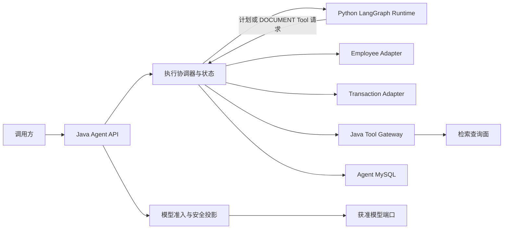

# 单体 Agent 应用与能力 L1 架构设计

> 文档层级：L1 领域/模块架构  
> 文档状态：草稿 / 未评审 / 未实施 / 未生效  
> 当前版本：v1.0

## 1. 文档治理信息

| 项目 | 内容 |
|---|---|
| 文档标识 | `AGENT-APP-L1-001` |
| 权威范围 | 单体 Agent 的 Java 控制面、Python AI 编排面、业务适配、运行时 Tool、状态与安全边界 |
| 文档状态 | 草稿 |
| 评审状态 | 未评审；本文的内部自评不构成正式评审 |
| 实施状态 | 未实施 |
| 生效状态 | 未生效 |
| 当前版本 | v1.0 |
| 上位文档 | [单体Agent智能体总体架构_L0_v1.0.md](./单体Agent智能体总体架构_L0_v1.0.md)（同批候选稿） |
| 同层文档 | [检索与索引基础设施架构_L1_v1.0.md](./检索与索引基础设施架构_L1_v1.0.md)（同批候选稿） |
| 适用基线 | v0.1 冻结提交 `417c140a38d0c32f27a644ac21b1df7f3d936909`（2026-07-17） |
| 维护责任人 | Dylan |
| 目标文档位置 | `docs/design/agent/单体Agent应用与能力架构_L1_v1.0.md` |
| 替代关系 | 内容承接已评审通过的 v0.1；本轮三份 v1.0 正式评审通过前不替代 v0.1 基线 |

## 2. 版本迁移说明

| 项目 | 说明 |
|---|---|
| 来源文档 | [单体Agent应用与能力架构_L1_v0.1.md](./单体Agent应用与能力架构_L1_v0.1.md) |
| 来源 SHA-256 | `3BD87D366E456407D596EDE52A9062158E46751013AB873ABF8985A932124AFC` |
| 迁移原则 | 保留全部有效 `APP-DEC-*`、L0 约束、责任边界、安全策略、质量门禁和下位交付；不复制 v0.1 的逐轮修订与问题关闭流水 |
| 表达调整 | 以“运行时分工—可信执行—权限投影—DOCUMENT 证据闭环—L2 门禁”为主阅读路径 |
| 语义变化 | 无；出现实质差异时不得以“版本整理”名义引入，必须回退或独立发起架构变更 |

### 2.1 v1.0 修订历史

| 序号 | 日期 | 文档位置 | 修改内容 | 修改原因 |
|---:|---|---|---|---|
| 1 | 2026-07-17 | 全文 | 从冻结 v0.1 形成聚焦阅读的 v1.0 候选基线 | 突出实现前必须遵守的边界、决策与门禁 |

## 3. 阅读导引与核心结论

实现与评审应优先核对以下六项：

1. **Java 是控制与事实权威**：入口、执行创建、权限组合、业务调用、终检和持久状态均在 Java；Python 不成为第二事实源。
2. **Python 只做 AI 编排**：负责意图、受约束计划和 DOCUMENT 多路编排，不直连业务服务、检索基础设施或数据库。
3. **计划不等于执行**：QUERY/AGGREGATE 的模型输出只是一份候选计划，Java 确定性校验后执行，业务结果不回传模型。
4. **每次模型调用都重新裁决**：Java 先形成 `ModelAccessDecision`，再以 Agent 字段策略、RBAC 上界和资源属性实时生成安全上下文。
5. **DOCUMENT 证据链归 Agent**：Agent 负责硬过滤组合、多路召回、融合、精排、上下文、回答、引用和拒答；检索域只提供原子候选。
6. **安全门禁不可被平均质量掩盖**：任何越权泄漏为0；固定评价包完成不等于目标系统质量已通过。

## 4. 架构定位、范围与目标

### 4.1 能力范围

| 能力 | Agent 本域责任 | 外部依赖 |
|---|---|---|
| `QUERY` | 理解问题、形成只读计划、确定性校验、调用域 Adapter、投影结果 | employee/transaction 查询契约 |
| `AGGREGATE` | 形成受限聚合计划、校验维度/指标/范围、可信执行 | employee/transaction 聚合契约 |
| `DOCUMENT` | 权限组合、检索编排、融合/精排、上下文构造、回答/引用/拒答 | 检索查询面、获准 LLM/Reranker |

### 4.2 非目标

- 不定义业务服务的主数据、事务或数据库结构；
- 不让 Python、Prompt 或模型成为授权、字段规则、执行终态或业务事实权威；
- 不实现 ES 物理索引、Alias、Embedding 制品或索引管理面；
- 不建设 multi-agent、消息驱动长任务主链或写操作自动重试框架；
- 不在 L1 固化字段级 API、表结构、类/方法或部署拓扑。

### 4.3 架构目标与验收方向

| 目标 | 验收方向 |
|---|---|
| 双运行时职责稳定 | Java/Python 依赖方向单向可审计，Python 无业务与存储直连 |
| 契约可演进 | Java OpenAPI 单一来源；版本、指纹、能力和 readiness 一致 |
| 状态可恢复 | Java/MySQL 为唯一持久权威，终态单调，迟到响应不覆盖 |
| 权限不扩张 | 任一下游只能执行已组合约束；缺失、冲突或过期时失败关闭 |
| DOCUMENT 可验证 | 检索、排序、答案、引用、拒答和越权分别有评价证据 |

## 5. 上位约束承接

### 5.1 L0 全局原则映射

| L0 ID | 本 L1 承接方式 |
|---|---|
| AD-01 | 旧 `agent-*` 仅作迁移证据，目标实现以本架构重新建立边界 |
| AD-02 | Java 与 Python 共同组成一个逻辑 Agent，不拆成多个 Agent |
| AD-03 | Java OpenAPI 是 Java↔Python 唯一跨运行时契约源 |
| AD-04 | 会话、执行、结果、引用和终态只由 Java/MySQL 持久化 |
| AD-05 | Python 不直连业务、数据库、ES 或检索服务，仅调用 Java Runtime Tool |
| AD-06 | Agent 拥有 `DOCUMENT` 业务编排，检索域只提供原子能力 |
| AD-07 | employee 与 transaction 分设 Adapter，不以通用动态适配器混合域语义 |
| AD-08 | Java 组合 RBAC、Agent 字段策略和资源属性，执行端只能收紧 |
| AD-09 | DOCUMENT 授权过滤在候选召回前生效，后验终检不能替代前置过滤 |
| AD-10 | 不引入跨 Java、Python、业务服务和检索域的分布式事务/全局锁 |
| AD-11 | 只读查询可重放；未来有副作用能力使用独立策略族 |
| AD-12 | L2 只交付受控 SQL，应用启动不得自动修改生产 Schema |
| AD-13 | 先稳定日志、指标、追踪端口，可使用可替换 No-op，不绑定后端厂商 |
| AD-14 | 首期不引入 multi-agent 协议，只保留可拆分边界 |
| AD-15 | Agent 仅使用来源稳定 ID/业务版本/资源属性，不拥有 ES 物理版本 |
| AD-16 | 模型与检索结果均是不可信候选，Java 终检后才能持久化/返回 |
| AD-17 | Java 是最终授权组合权威，Adapter/检索只执行不可放宽的约束 |
| AD-18 | Java 以执行版本、栅栏、deadline 和 cancellation 保证终态单调 |
| AD-19 | Java、Python、检索查询面使用契约版本/指纹/readiness 阻断不兼容流量 |
| AD-20 | Python Tool 只暴露检索查询，索引管理面不进入 Agent Tool |
| AD-21 | 历史环境隔离规则仅保留替代关系，由 AD-22 统一治理 |
| AD-22 | 任何模型发送前做业务域/数据分类准入与实时安全投影；计划/执行隔离 |
| AD-23 | Agent 消费受控原始存储/录入清单的稳定标识和版本，不拥有文档主数据 |
| AD-24 | 首期采用单一预配置语料库级权限；文档级 ACL 需联合变更后启用 |

### 5.2 L0 决策落点

| L0 决策 | 本 L1 落点 |
|---|---|
| DEC-01 | APP-DEC-01；绿地建立 Java 控制面与 Python 编排面 |
| DEC-02 | APP-DEC-03；OpenAPI 生成和指纹门禁 |
| DEC-03 | APP-DEC-02；Java/MySQL 单一状态权威 |
| DEC-04 | APP-DEC-07；DOCUMENT 编排归 Agent |
| DEC-05 | APP-DEC-05；Python 不直连，Java 可信执行 |
| DEC-06 | APP-DEC-09；同步主链、受控回调 |
| DEC-07 | 第 10、13 章；Schema 由受控 SQL 治理 |
| DEC-08 | APP-DEC-10；稳定遥测端口和可替换 No-op |
| DEC-09 | 第 4、6 章；不引入 multi-agent |
| DEC-10 | APP-DEC-12/16/17；Java 组合授权且只收紧 |
| DEC-11 | APP-DEC-02/08；栅栏、单调终态和确定性终检 |
| DEC-12 | APP-DEC-03；版本、指纹、能力和 readiness |
| DEC-13 | APP-DEC-07；查询/管理面隔离 |
| DEC-14 | APP-DEC-13；Runtime→Tool 双重凭据 |
| DEC-15 | APP-DEC-15；历史方案已被替代 |
| DEC-16 | APP-DEC-12/16；模型准入、安全投影和计划/执行隔离 |
| DEC-17 | APP-DEC-17；受控文档源与单一语料库级权限 |

## 6. 目标组件、核心职责与责任边界

| 组件 | 唯一责任 | 明确禁止 |
|---|---|---|
| Java Agent API | 入站身份、能力入口、请求边界 | 把未裁决原文直接发给模型 |
| Model Access & Context Policy | `ModelAccessDecision`、字段策略、实时上下文投影 | 让模型自行选信任目标或放宽权限 |
| Execution Coordinator | 创建执行、deadline/取消/栅栏、终态、回调 | 双写 Python 状态或接受迟到结果覆盖 |
| Python Runtime | 意图、计划、DOCUMENT 多路编排 | 直连业务、检索、DB；持久化业务状态 |
| Employee Adapter | employee 查询/聚合契约转换 | 处理 transaction 语义 |
| Transaction Adapter | transaction 查询/聚合契约转换 | 处理 employee 语义 |
| Java Tool Gateway | DOCUMENT 只读 Tool 的鉴权、预算、审计和调用 | 暴露索引管理或通用网络代理 |
| Result & Reference Gate | 契约、权限、事实引用和输出安全终检 | 直接信任模型候选结果 |
| Agent Repository | 会话/任务/执行/结果/引用唯一持久化 | 存储检索技术状态或业务主数据 |
| Telemetry Port | 结构化日志、指标、追踪、审计关联 | 绑定特定后端成为架构前置条件 |

同层检索 L1 拥有 BM25、Dense、可选 Sparse 的原子召回、索引构建/发布/撤销和 ES 技术状态。Agent 拥有意图、最终硬过滤组合、多路调用预算、融合、精排、上下文、答案和引用；双方不得重复实现对方权威责任。

## 7. 契约、权限与交互架构

### 7.1 契约权威与兼容

- Java OpenAPI 定义 Runtime 请求/响应、Tool 请求/响应和错误模型；Python 绑定代码由该契约生成。
- 构建阶段校验生成物无漂移；运行时暴露 `contractVersion`、`contractFingerprint`、`capabilities` 和 readiness。
- 不兼容实例不得接流量；兼容窗口、灰度顺序和回滚版本由 L2 冻结。
- 对业务服务和检索查询面使用独立客户端契约，不把 Python 内部模型泄漏为外部公共契约。

### 7.2 模型准入与安全投影

每次模型调用前，Java 必须按可信主体、租户、能力、业务域、数据分类和目标信任等级形成 `ModelAccessDecision`。未分类或混合输入只能使用获准的本地高信任分类能力，或直接拒绝；不得调用公共模型完成判域。

安全上下文由以下事实取交集，并只允许收紧：

1. `auth-service` 的身份、租户、角色/RBAC 上界；
2. Agent 版本化字段策略（字段级唯一事实源）；
3. 来源资源属性、DOCUMENT 能力和语料库访问权限；
4. 当前执行的目的、能力、模型目标和最小数据范围。

投影必须覆盖 `message`、`history`、`contextViews`、Tool 入参、日志和最终结果。撤权后不得复用旧投影；自由文本中的敏感实体由独立检测策略处理。Auth 当前仍输出字段规则的迁移期只允许受控双读、差异审计和明确退出门禁。

### 7.3 Runtime→Tool 安全

首期使用固定服务密钥确认 Runtime 服务身份，同时使用 Java 生成的不透明短期 `capabilityId` 绑定执行、能力、Tool、范围、过期时间和防重放信息。Java 服务端是唯一校验权威；凭据不得写入普通日志，不得转发给检索服务，不得替代 Java→检索的独立服务身份。

### 7.4 错误与部分成功

- 契约不兼容、权限不确定、计划越界、引用不成立：失败关闭，不返回推测性成功。
- QUERY/AGGREGATE 的业务错误保持域错误语义，不由模型改写为成功。
- DOCUMENT 单路召回失败是否允许降级由能力策略和质量门禁决定；授权过滤、撤权围栏或证据安全失败不得降级。
- 超时/取消后只接受 Java 栅栏允许的终态；迟到响应可记录诊断，但不能写结果、发回调或触发副作用。

## 8. 数据与状态所有权

| 数据/状态 | 权威拥有者 | Agent 使用方式 |
|---|---|---|
| 身份、租户、角色、RBAC | `auth-service` | 按请求获取/验证，作为授权上界 |
| Agent 字段策略 | Java Agent | 版本化维护，每次模型调用实时投影 |
| employee/transaction 主数据 | 对应业务服务 | 仅经独立 Adapter 只读调用 |
| 文档原文、稳定 ID、业务版本、资源属性 | 受控文档源/版本化录入清单 | 只消费引用和授权事实，不复制为主数据 |
| 检索候选与索引技术状态 | 检索基础设施 | 候选按不可信输入校验；不持久化其技术状态 |
| 会话、任务、执行、终态、结果、引用 | Java Agent/MySQL | 唯一持久状态权威 |
| Python 图内临时状态 | Python Runtime | 仅单次执行内存在，失败后由 Java 决定重试 |

执行状态至少覆盖 `CREATED → RUNNING → SUCCEEDED | FAILED | CANCELLED | TIMED_OUT`。终态单调；重试创建新 attempt/执行版本，不回退旧终态。请求、执行、Tool 调用和回调均使用可追踪的幂等/关联标识。

## 9. 核心流程与失败闭环

### 9.1 QUERY / AGGREGATE

1. Java 完成身份/租户/能力校验，创建执行并设置 deadline。
2. Java 形成模型准入决策与最小安全上下文，调用 Runtime。
3. Runtime 只返回类型化计划，不访问业务数据。
4. Java 校验域、字段、操作符、范围、预算和权限，调用对应 Adapter。
5. Adapter 调用业务服务并返回类型化结果；结果不回传模型。
6. Java 投影字段、终检、持久化单调终态并返回/回调。

### 9.2 DOCUMENT

1. Java 校验 DOCUMENT 能力和语料库权限，创建执行与短期 Tool 凭据。
2. Java 裁决模型目标并投影问题/历史；Python 选择获准原子召回通道和预算。
3. Tool Gateway 重验服务身份、执行凭据、deadline 与最终硬过滤，调用检索查询面。
4. Python 对已授权候选进行融合/精排，Java/Runtime 共同确保上下文只含安全、当前、可追溯证据。
5. 模型生成候选答案和引用；Java 校验证据存在、权限、来源、版本、引用覆盖与输出安全。
6. 证据不足或应拒答时返回受控拒答；通过后才持久化答案与引用。

### 9.3 取消、重试与恢复

Java 传播 deadline/cancellation；Python、Adapter 和检索调用必须尽快停止。只读规划/查询在幂等边界内重试，重试不得延长原 deadline。服务重启后由 Java 持久状态判断可重试、失败或超时；Python 不承担跨重启恢复权威。

## 10. 核心架构机制与质量属性

### 10.1 一致性、幂等与副作用

- 不建立跨服务分布式事务；本地持久化与远端只读调用通过状态机、幂等、栅栏和审计闭环。
- QUERY/AGGREGATE/DOCUMENT 首期只读；未来写/提交能力进入独立有副作用策略族，必须新增 ADR/L2，定义幂等键、重复提交、补偿和人工处置。
- 数据库 Schema 只由经审核的前向/回滚/验证 SQL 交付，应用启动不得自动迁移生产库。

### 10.2 性能、韧性与降级

- Java 统一分配端到端 deadline 和各阶段预算；Runtime 不得自行无限扩展 Tool 次数、候选数或上下文。
- employee、transaction、检索、LLM、Reranker 使用独立并发/限流/熔断舱壁。
- 降级不得绕过授权、模型准入、前置硬过滤、引用终检或越权零容忍门禁。
- 生产 SLO、峰值、容量、HA、网络和故障预算须在对应 L2/运行方案中量化。

### 10.3 可观测与审计

所有运行时统一关联 `requestId`、`executionId`、`attempt`、主体/租户摘要、能力、策略版本、模型目标、契约指纹、Tool 调用、来源版本和终态。日志不得记录密钥、短期凭据、未投影原文或越权候选。稳定遥测端口可先接 No-op，但生产启用前须接入获准后端并验证告警闭环。

### 10.4 DOCUMENT 质量门禁

固定评价包 `3.0.0-synthetic` 包含 114 个语料块、30 个用例（20 个可回答、10 个应拒答），单一语料库 `document-default`、统一 `internal` 分类、无文档级 ACL；7 个访问拒绝用例必须产生0候选。可回答样本最小授权候选池为56，至少55个干扰项，满足 Recall@50 的有效性前提。

| 门禁 | 阈值/判定 |
|---|---|
| Recall@50 | ≥ 0.90，且逐样本候选池大于50并含足够干扰项 |
| NDCG@10 | ≥ 0.80 |
| 事实支持率 | ≥ 0.90 |
| 要点覆盖率 | ≥ 0.85 |
| 引用精确率 | ≥ 0.98 |
| 事实性主张引用覆盖率 | ≥ 0.90 |
| 应拒答召回率 | ≥ 0.95 |
| 错误拒答率 | ≤ 0.05 |
| 未授权泄漏 | = 0 |

所有门禁逐项通过，不使用加权总分抵消失败。当前[固定评价包与使用说明](./evidence/eb-l1-003/README.md)、静态校验和 Oracle 自测已具备，但 `target_system_quality_run_executed=false`；目标系统实跑报告形成前，不得宣称 DOCUMENT 系统质量通过。

## 11. 核心架构决策

| ID | 决策 | 主要理由与约束 |
|---|---|---|
| APP-DEC-01 | 一个逻辑 Agent 采用 Java 控制/状态面 + Python LangGraph AI 编排面 | 同时满足企业契约治理与 AI 编排生态；承担双运行时运维成本 |
| APP-DEC-02 | Java 在调用 Runtime 前创建执行并作为唯一持久状态权威 | 防止 Python Checkpointer/双写导致状态分叉 |
| APP-DEC-03 | Runtime/Tool 契约由 Java OpenAPI 生成并以指纹控制就绪 | 防止跨语言手写契约漂移 |
| APP-DEC-04 | QUERY、AGGREGATE、DOCUMENT 使用独立策略子图，共享稳定端口 | 隔离各能力的权限、质量和失败语义 |
| APP-DEC-05 | QUERY/AGGREGATE 只由 Python 返回计划、Java 执行；DOCUMENT 仅经 Java 只读 Tool；Python 不直连业务 | 统一授权审计并隔离业务结果 |
| APP-DEC-06 | employee 与 transaction 使用独立 Adapter | 防止域规则泄漏并支持独立契约演进 |
| APP-DEC-07 | DOCUMENT 业务编排归 Agent，检索域只提供原子查询 | 保持问题、会话、融合、排序和生成上下文统一 |
| APP-DEC-08 | Java 对 AI 候选结果确定性终检后再持久化/返回 | AI 输出不承担授权与事实权威 |
| APP-DEC-09 | 首期同步执行和受控回调，不引入消息主链与 Python 持久恢复 | 降低当前一致性与运维复杂度 |
| APP-DEC-10 | 遥测采用稳定端口、结构化日志和可替换 No-op | 不提前绑定监控后端 |
| APP-DEC-11 | 未来写/提交能力进入独立有副作用策略族 | 防止自动重试/取消造成重复副作用 |
| APP-DEC-12 | Agent 字段策略是字段级唯一事实源，每次模型调用前与 RBAC/资源属性组合安全投影 | 防止双重权威、撤权后历史泄漏和模型放宽 |
| APP-DEC-13 | Runtime→Tool 使用固定服务密钥 + Java 不透明短期执行凭据 + Java 服务端校验 | 兼顾服务身份和逐执行最小授权；需 L2 固化轮换/撤销/防重放 |
| APP-DEC-14 | DOCUMENT 使用9项逐项质量门禁；Recall@50 仅在有效候选池/干扰项条件下成立 | 防止平均分或无区分样本掩盖失败 |
| APP-DEC-15 | 历史“测试平台/生产本地”方案已被 APP-DEC-16 替代 | 部署位置不能替代业务域、数据分类和权限判断 |
| APP-DEC-16 | Java 模型发送前形成 `ModelAccessDecision`，实时安全投影；QUERY/AGGREGATE 结果不回传模型 | 先裁决信任边界，再最小化发送数据，结构隔离业务结果 |
| APP-DEC-17 | 首期 DOCUMENT 采用单一语料库级权限，不启用文档级 ACL；未来优先以有效权限码匹配 | 以最低复杂度适配现有 RBAC 且不复制用户/角色关系 |

## 12. L2 下位交付与门禁

| L2 主题 | 主要覆盖 | 进入详细设计前必须具备 | 非责任 |
|---|---|---|---|
| 跨运行时契约与生成治理 | APP-DEC-03 | OpenAPI 范围、错误语义、兼容矩阵、生成/漂移门禁 | 业务服务契约设计 |
| 执行生命周期与持久状态 | APP-DEC-02/09 | 状态机、幂等、栅栏、回调、SQL 迁移责任 | Python 持久恢复 |
| 模型准入、上下文与权限安全 | APP-DEC-12/13/16/17 | Auth 字段迁移、策略版本、目标信任证明、凭据轮换/撤销 | 修改 Auth 公共契约（须另行授权） |
| 能力路由与 QUERY/AGGREGATE | APP-DEC-04/05/08 | 计划 Schema、校验规则、预算、结果投影 | 业务数据库直连 |
| Employee Adapter | APP-DEC-06 | employee 查询/聚合契约、字段/操作符/错误语义 | transaction 规则 |
| Transaction Adapter | APP-DEC-06 | transaction 查询/聚合契约、分页/聚合/错误语义 | employee 规则 |
| DOCUMENT 编排与证据闭环 | APP-DEC-07/14/17 | 检索查询契约、融合/精排、引用与拒答公式、评价运行入口 | ES 索引生命周期 |
| Runtime Tool 安全 | APP-DEC-05/13 | 凭据载体、有效期、防重放、Tool 白名单、审计 | 索引管理面 |
| 韧性、性能、可观测与部署 | APP-DEC-09/10/16 | SLO/容量/HA/网络/告警；本地模型逻辑项 `LLM_API_KEY`（实际 `AGENT_LLM_API_KEY`）为空、端点与 Serving 制品分层校验 | 以空 Key 替代完整端点/制品证明 |

L2 不得在缺少前置契约时凭假设固化字段；发现上位或同层冲突时必须回到本轮三份架构文档联合治理。

## 13. 演进、发布与回滚

1. 冻结 v0.1 与证据包，三份 v1.0 作为同批候选稿评审；任何一份未通过，不得单独宣称整体 v1.0 生效。
2. 先冻结 OpenAPI、状态机、权限投影和 Runtime Tool 安全，再实现能力子图与 Adapter。
3. 先在非生产环境完成契约、权限、取消/迟到、混合版本和评价集实跑，再灰度生产。
4. 生产本地 Runtime 配置制品的专项校验只要求逻辑项 `LLM_API_KEY` 为空；在当前 `AGENT_` 前缀约定下应检查实际环境变量 `AGENT_LLM_API_KEY`。端点/网络和 Serving 的许可、版本、摘要、加载及回滚证明分别验证，空 Key 单独不能证明目标可信。
5. 回滚以契约兼容窗口、应用版本、策略版本和数据库前向/回滚 SQL 为单位；不得回退安全策略来恢复流量。

## 14. 风险与未关闭门禁

| 风险/门禁 | 当前状态 | 影响与关闭条件 |
|---|---|---|
| 目标系统质量实跑 | 未完成 | 不阻断 DOCUMENT/安全 L2 评审，但阻断系统质量通过与生产放量；需生成版本化实际运行报告 |
| Auth 字段策略迁移 | 未完成 | 阻断权限/上下文 L2 冻结；需明确旧字段规则退出、差异审计和回滚 |
| employee/transaction 契约 | 待冻结 | 分别阻断对应 Adapter L2；需冻结查询、聚合、分页、错误与权限语义 |
| 模型目标信任基线 | 待生产证明 | 阻断对应业务域模型准入；需端点、网络、Serving 制品、配置和回滚证据 |
| SLO/容量/HA | 待量化 | 阻断生产容量与灾备结论，不阻断架构边界评审 |
| 数据保留/删除 | 待治理 | 阻断生产审计与隐私验收；需覆盖会话、结果、引用、日志和评价数据 |

## 15. 一致性与可追溯性

- 上位 `AD-01`～`AD-24` 已在第 5.1 节逐项承接；`DEC-01`～`DEC-17` 已在第 5.2 节映射。
- 本层 `APP-DEC-01`～`APP-DEC-17` 均有责任落点、机制、L2 交付或显式门禁。
- 同层边界以“Agent 编排/授权组合”与“检索原子能力/技术生命周期”分割；不得重复建设融合、上下文或 ES 管理责任。
- 本文与 L0、检索 L1 必须按同一版本批次正式评审；编写期内部自评只证明候选稿完整性。

## 16. 编写期内部自评

内部自评仅检查表达、完整性和与冻结 v0.1 的语义一致性，不改变“未评审”状态。

| 轮次 | 检查范围 | 发现 | 修复 | 结论 |
|---:|---|---|---|---|
| 1 | 结构、稳定 ID、跨文档边界、质量门禁、L2 可交付性 | 严格校验不能识别“架构目标、核心职责、修订历史”；生产本地 Runtime 的逻辑配置项与实际环境变量映射不够明确 | 显式调整章节标题；补充 `LLM_API_KEY`→`AGENT_LLM_API_KEY` 映射及端点/网络、Serving 制品独立证明；增加可解析文档/证据链接 | 已修复，进入第2轮 |
| 2 | 严格结构、APP-DEC/上位追踪、Agent↔检索边界、评价门禁与治理状态 | 0错误0警告；APP-DEC-01～17 与 v0.1 集合相等；AD-01～24、DEC-01～17 均可追踪；未发现 P0/P1/P2 | 无需进一步修复 | 内部自评通过；仍为未评审 |

## 17. 术语与技术边界

| 术语 | 定义 |
|---|---|
| 计划 | 模型产生、尚未执行的类型化候选意图；必须经 Java 确定性校验 |
| 可信执行 | Java 在明确域契约、授权和预算内调用外部服务并处理结果 |
| 安全投影 | 每次模型调用前按当前有效权限最小化形成的 message/history/context 视图 |
| `capabilityId` | Java 生成并校验、绑定单次执行范围的不透明短期 Tool 凭据 |
| 原子检索 | 单一检索通道的受约束候选返回，不包含跨路融合、精排或答案生成 |

技术选型边界：Java 负责控制面/持久化/适配与终检，Python LangGraph 负责 AI 编排，MySQL 负责 Agent 持久状态；具体框架版本、表字段、Prompt、模型参数和部署规格由 L2/实施方案冻结。
