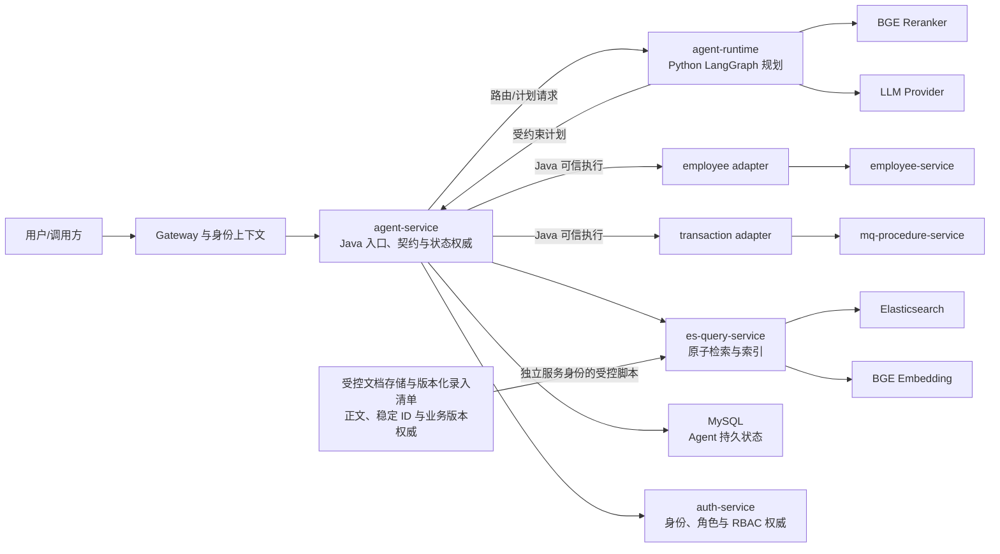
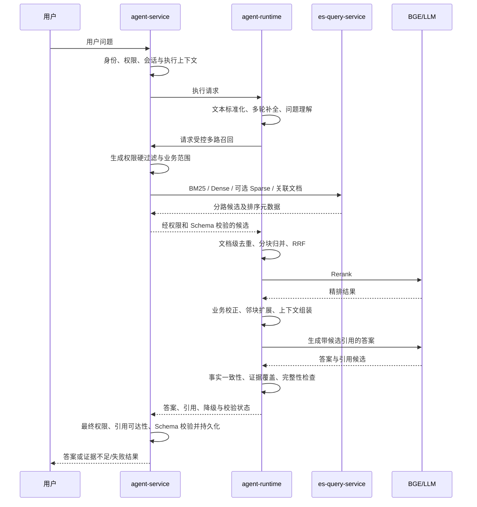

# 单体 Agent 智能体 L0 总体架构设计

> 文档层级：L0
>
> 文档状态：已评审 / 已通过 / 未实施 / 未生效

## 1. 文档治理信息

| 项目 | 内容 |
|---|---|
| 文档标识 | `AGENT-L0-001` |
| 文档层级 | L0 总体架构 |
| 权威范围 | 新建单体 Agent 智能体及其 Agent 应用、AI 编排、业务适配、检索与索引基础设施的总体边界与全局约束 |
| 文档状态 | 已评审 |
| 评审状态 | 已通过；2026-07-17 完成2轮正式评审—修复循环，第1轮2个S1、3个S2已全部关闭，第2轮无新增发现。2026-07-17 新增 `AD-23～AD-24`、`DEC-17` 为编写期同步，尚未改变历史通过结论，须与两份 L1 联合复评 |
| 实施状态 | 未实施 |
| 生效状态 | 未生效 |
| 当前版本 | v0.1 |
| 适用基线 | 2026-07-17 已确认需求与本机测试环境快照；不继承既有实验性 Agent/ES 架构基线 |
| 维护责任人 | Dylan |
| 目标文档位置 | `docs/design/agent/单体Agent智能体总体架构_L0_v0.1.md` |
| 评审报告 | `docs/design/agent/单体Agent智能体总体架构_L0_v0.1_评审报告.md`（截至2026-07-16的历史评审报告；本轮结论以第17节新增记录为准） |
| 上位文档 | 无；本文件是本轮新 Agent 建设的总体架构根文档 |
| 治理的 L1 文档 | `docs/design/agent/单体Agent应用与能力架构_L1_v0.1.md`（已创建，已评审/已通过）；`docs/design/agent/检索与索引基础设施架构_L1_v0.1.md`（已创建，草稿/未评审） |
| 外部契约 | Java 生成的 OpenAPI 契约；`auth-service` 身份、角色及 RBAC 授权投影契约；`employee-service`、`mq-procedure-service` 业务接口；文档来源方数据契约；按业务域准入的外部或本地 LLM 推理服务契约；Embedding、Reranker 服务契约 |
| 替代关系 | 不替代、不继承现有实验性 `agent-*`、`es-*` 项目及相关设计/评审文档；旧资产须先隔离后再使用原项目名建设新实现 |

## 2. 修订历史

| 序号 | 日期 | 文档位置 | 修改内容 | 修改原因 |
|---:|---|---|---|---|
| 1 | 2026-07-16 | 全文 | 创建 L0 总体架构初稿 | 建立新单体 Agent 的统一总体架构基线 |
| 2 | 2026-07-16 | 第 7～16 节 | 补充授权权威、执行终态栅栏、契约版本门禁、索引管理面和不依赖 alpha 的回滚约束 | 修复第 1 轮 L0 评审发现 |
| 3 | 2026-07-16 | 第 5、7、10、12、14 节 | 收窄契约版本门禁适用范围，并补齐新增不变量的成功标准和评审门禁 | 修复第 2 轮 L0 复评发现 |
| 4 | 2026-07-16 | 文档治理信息、第 17 节 | 同步为已评审/已通过，并关联正式评审报告 | 根据用户授权同步 3 轮评审—修复循环的最终结论 |
| 5 | 2026-07-16 | 文档治理信息、第 4、15、18 节 | 同步 DeepSeek LLM 目标配置和实名维护人 Dylan，并收窄剩余 LLM 待决边界 | 根据用户后续确认更新架构事实，不改变 L0 已通过结论 |
| 6 | 2026-07-16 | 第 4、11、15 节 | 确认 Java 侧基于业务域、能力、目的和目标的字段出域白名单机制 | 落实用户确认的数据处理边界顺序和新增字段默认禁止原则 |
| 7 | 2026-07-16 | 第 4、15、18 节 | 同步 LLM Provider 连通性测试通过，并收窄剩余模型验证边界 | 根据用户测试结论记录环境事实，不把连通性等同于契约兼容或效果验收 |
| 8 | 2026-07-16 | 第 4、11～13、15 节 | 确认固定服务密钥与 Java 不透明短期执行凭据组合的内部调用安全机制 | 关闭内部服务身份与能力凭据架构决策门禁，同时保留 L2 实现约束 |
| 9 | 2026-07-16 | 第 4～5、15 节 | 确认 DOCUMENT 首期临时质量指标与阈值，并区分阈值基线和评价集证据 | 部分解除 DOCUMENT 评价门禁，不把阈值表等同于已冻结评价集 |
| 10 | 2026-07-16 | 文档治理信息、第 4、13、15、18 节 | 同步 DeepSeek 公开服务条款及数据使用策略接受、API 契约测试与 L1 最小效果 PoC 证据，并更新 Agent L1 交付状态 | 关闭 Agent L1 的 `EB-L1-001`；L0 已通过结论不变 |
| 11 | 2026-07-16 | 第 4～5、13、15 节 | 同步 `EB-L1-003-DOCUMENT-EVAL` `1.0.0-synthetic` 固定评价包及 Agent L1 当前门禁状态 | 关闭 Agent L1 的 `EB-L1-003`；实际跑分与业务代表性扩展转入 L2/生产门禁，L0 已通过结论不变 |
| 12 | 2026-07-16 | 文档治理信息、第 4～7、11～16、18 节 | 将模型部署边界调整为测试环境使用 DeepSeek 平台 API、生产环境本地化部署，并新增禁止生产公网回退、模型制品治理和本地契约复验约束 | 根据用户确认的生产部署事实消除平台 API 被误作生产依赖的架构歧义，并为 Agent L1 关闭 `REV-L1-004` 建立上位依据 |
| 13 | 2026-07-17 | 文档治理信息、第 4～16、18 节 | 将模型准入从环境/部署形态改为业务域与数据分类治理，复用字段权限生成模型安全投影，并明确 QUERY/AGGREGATE 由 LLM 只产计划、Java 执行且结果不回传模型 | 落实用户确认的粗粒度数据控制方案，消除重复字段权限配置及旧 Tool 回调数据流与当前实现不一致问题；新增决策须正式复评 |
| 14 | 2026-07-17 | 文档治理信息、第 4～16、18 节 | 明确 `auth-service` 仅负责身份、角色和 RBAC 授权上界，Agent 是字段查询、展示、运算、脱敏、分类及模型安全投影策略的唯一权威；补充当前混合权限契约的迁移差距 | 修复 `REV-AUTH-001` 所揭示的权限所有权偏差，避免 `auth-service` 与 Agent 同时维护字段规则；本次为编写期修订，须正式复评 |
| 15 | 2026-07-17 | 文档治理信息、第 4～7、11～18 节 | 将模型调用前的域/信任裁决收口为 Java 权威决策，分离本地目标配置检查、端点/网络门禁与推理制品证明，并同步 DOCUMENT 评价包 v2.0.0 及 Recall@50 适用前提 | 修复本轮第 1 次独立评审发现，消除未分类输入先外发、空 Key 被误当成本地部署充分证明以及评价证据失真的风险 |
| 16 | 2026-07-17 | 文档治理信息、第 13、16～17 节 | 回写第2轮独立复评通过结论并同步 Agent L1 状态 | 本轮5项发现全部关闭且无新增问题，L0 与 L1 可进入下位详细设计阶段 |
| 17 | 2026-07-17 | 文档治理信息、第 4、7～16 节 | 冻结首期受控脚本文档源、单一逻辑语料库、统一安全等级与语料库级访问策略；明确查询侧由 Java 组合 RBAC、DOCUMENT 能力和语料库权限，预留基于稳定权限码的文档级 ACL 演进 | 落实用户确认的文档源和权限方案，解除检索 L1 的文档源架构证据阻断；新增决策须联合正式复评 |

## 3. 文档定位

### 3.1 文档目标

本文建立新单体 Agent 的全局架构约束，统一回答以下问题：

- QUERY、AGGREGATE、DOCUMENT 三类能力由谁决策、编排和执行；
- Java 与 Python 双运行时如何协作，以及哪个运行时拥有跨进程契约和持久状态；
- 业务适配器、检索与索引基础设施、权限系统、业务域系统之间的边界；
- DOCUMENT 的完整编排归属及检索基础设施的原子能力边界；
- 如何在不侵入既有能力实现的前提下扩展提交、修改、工作流等新能力；
- 如何保留未来演进为 multi-agent 的空间，同时避免当前过度设计。

### 3.2 权威范围

本文唯一负责以下全局决策：

- 目标系统上下文、逻辑单体定义、模块分解与依赖方向；
- 跨运行时契约权威、数据与状态权威、权限责任和调用不变量；
- QUERY、AGGREGATE、DOCUMENT 的总体能力边界和关键流程；
- 全局安全、兼容、韧性、可观测、部署、迁移和回滚原则；
- 两份 L1 架构文档的权威范围、约束继承关系及后续交付顺序。

### 3.3 非目标范围

本文不定义：

- 完整 API 路径、DTO 字段、错误码、表字段、索引 Mapping、SQL 内容；
- Java 包、类、方法或 Python Graph State、Node 的实现级结构；
- RRF 参数、召回 TopK、Reranker 阈值、Prompt、Token 预算的最终数值；
- 生产环境高可用拓扑、容量数值和具体 SLO；
- multi-agent 协议、Agent 间协商机制或独立 Planner 服务；
- 既有实验性项目和文档的修订、兼容性背书或正式评审结论。

上述内容分别由 L1、L2、外部契约、测试计划或运维方案承接。

### 3.4 读者与使用方式

本文面向架构、Java、Python、检索、业务服务、测试、安全和运维人员。所有 L1/L2 设计与实现必须映射本文约束 ID；无法满足时必须通过 ADR 或修订本文处理，不得在下位文档中静默偏离。

### 3.5 文档权威顺序

```text
本 L0 总体架构
  → L1：Agent 应用与能力架构
  → L1：检索与索引基础设施架构
      → 各自 L2 实施详细设计
          → Java/Python 代码、OpenAPI、SQL、配置、索引和测试
```

外部业务数据、身份权限和文档主数据仍由各自外部权威系统定义；本 L0 只规定 Agent 如何消费和执行这些外部契约。

## 4. 架构背景与驱动因素

### 4.1 业务背景

本轮建设面向一个逻辑上的单体 Agent，首期提供：

- `QUERY`：面向 employee 与 transaction 业务域的数据查询；
- `AGGREGATE`：面向 employee 与 transaction 业务域的聚合分析；
- `DOCUMENT`：面向受控文档的检索、问答和总结，并输出可校验引用。

employee 域由 `employee-service` 提供外部接口，transaction 域由 `mq-procedure-service` 提供外部接口。业务域通过适配器接入，Agent 不拥有业务主数据。

### 4.2 技术背景与当前基线

目标实现按绿地架构设计。现有 `agent-*`、`es-*` 项目以及相关设计、评审文档均为早期实验资产，只能用于识别迁移对象或验证环境，不得作为目标职责、契约或代码结构的默认依据。

2026-07-16 本机测试环境已核实：

| 类别 | 当前可用基线 | 本轮定位 |
|---|---|---|
| Java | Java 25、Spring Boot 3.5.10、Spring Cloud 2025.0.1、MyBatis | Agent 对外入口、契约权威、持久化、权限执行和业务适配 |
| Python | Python 3.12.4 | LangGraph AI 编排运行时 |
| 数据库 | MySQL，主机 `127.0.0.1:3306` | Agent 持久状态；Schema 由 DB 团队执行 SQL 脚本管理 |
| 检索 | Elasticsearch 9.4.1，三节点 Docker 集群，测试入口 `127.0.0.1:9200` | BM25、Dense、可选 Sparse、索引与向量能力 |
| Embedding | BGE-M3 服务，测试入口 `127.0.0.1:8908` | Dense/Sparse 表征能力，具体启用策略由检索 L1 定义 |
| Reranker | BGE Reranker v2 M3，测试入口 `127.0.0.1:8909` | DOCUMENT 精排能力 |
| LLM | 通过稳定模型端口接入经批准的外部平台或本地推理服务；DeepSeek 平台 `deepseek-v4-flash` 仅形成测试/PoC 证据 | 模型目标不按“公网/本地”一刀切，而由业务域与数据分类决定：公开政策、法律法规和官方通知等公开资料域可使用获批公共服务；公司内部资料域仅允许本地模型或完成专项信任评估的受信服务；未分类或高敏域默认禁止。QUERY/AGGREGATE 只向模型发送最小化规划输入，业务执行结果不进入模型 |
| 其他中间件 | Redis、Kafka、RocketMQ、Zookeeper 运行于本机 Docker | 首期不设为 Agent 核心链路的强制依赖，确有场景后再由 L1 决策 |
| 可观测后端 | 本轮不建设 | 仅保留日志、指标、追踪端口及上下文传播能力 |

本机仅为测试环境，其端口、镜像、单机暴露方式不能推导为生产部署基线。

### 4.3 架构问题

| 编号 | 问题 | 证据 | 影响 | 目标方向 |
|---|---|---|---|---|
| AP-01 | 实验资产与新目标同名，容易形成错误继承 | 工作区已有多个 `agent-*`、`es-*` 项目和旧设计文档 | 新旧职责、契约、依赖可能混用 | 先隔离旧资产，再以本文为根基线重建同名目标项目 |
| AP-02 | “单体 Agent”与 Java/Python 双运行时容易被误解 | AI 编排明确采用 Python LangGraph，跨语言契约由 Java 负责 | 可能出现双入口、双状态权威或循环依赖 | 定义为逻辑单体、双进程协作；Java 统一入口和状态权威 |
| AP-03 | DOCUMENT 编排和 ES 检索职责易混淆 | DOCUMENT 包含理解、融合、精排、生成和校验，ES 仅适合原子检索/索引 | `es-query-service` 可能膨胀为业务服务 | DOCUMENT 归 Agent，检索服务保持技术基础设施边界 |
| AP-04 | Python/Java 契约可能独立演进 | 双运行时需要双向调用 | 字段漂移、兼容失败、生成代码被手改 | Java 作为唯一跨进程契约来源，OpenAPI 自动同步并设置漂移门禁 |
| AP-05 | RBAC 与字段级策略权威必须分离，但要在检索和执行链路组合落实 | 身份、角色和 RBAC 由 `auth-service` 负责；字段策略由 Agent 负责 | 两处同时维护字段规则会漂移，只在入口鉴权又会产生越权检索或引用泄露 | `auth-service` 给出 RBAC 上界，Agent 以唯一字段策略和来源资源属性形成不可扩权约束，分层执行并失败关闭 |
| AP-06 | 当前无追踪与指标后端 | 本轮明确不实现后端 | 后续接入可能侵入核心编排 | 先定义稳定的 Telemetry Port、上下文和 No-op 实现 |
| AP-07 | 未来提交/修改/工作流能力可能侵入只读能力 | 首期只有查询、聚合和文档能力 | 新能力带来幂等、事务、审核和补偿语义 | 以能力契约与适配器扩展，写能力单独定义执行政策 |

### 4.4 架构驱动因素

| 驱动因素 | 优先级 | 约束 | 验证方式 |
|---|---:|---|---|
| 边界清晰且不过度设计 | 高 | 首期只建设三类能力和两个业务域 | L1 职责/非职责检查；禁止无真实消费者的通用服务 |
| 新能力可扩展 | 高 | 新能力不得修改现有 QUERY/AGGREGATE/DOCUMENT 核心逻辑 | 扩展演练与架构依赖检查 |
| 跨语言契约稳定 | 高 | Java 是唯一跨进程契约来源 | 生成物不可手改；CI 契约漂移为零 |
| 权限与证据可信 | 高 | `auth-service` 管理身份、角色和 RBAC；Agent 管理字段策略并负责边界内组合裁决 | 越权测试零泄漏；字段规则单一权威；引用可回溯且访问安全 |
| DOCUMENT 检索质量 | 高 | 多路召回、融合、精排、业务规则和证据校验可独立验证 | 固定评测集上的召回、排序、证据覆盖和拒答测试 |
| 可渐进演进至 multi-agent | 中 | 当前不引入多 Agent 框架或分布式 Agent 协议 | L1 保持能力、状态、工具和契约边界可拆分 |
| 测试环境快速落地 | 中 | 基础设施已在本机可用，DB Schema 不由应用迁移 | 本机端到端冒烟、SQL 前进/回滚/校验脚本检查 |

### 4.5 假设与限制

- `employee-service` 与 `mq-procedure-service` 的外部接口可由业务方维护并支持 Agent 所需查询/聚合语义；若实际契约不足，应修改业务契约设计，不得在 Agent 中复制业务规则或直连业务库。
- 首期不建设独立文档业务系统：具备文档管理权限的管理员或技术人员通过使用独立服务身份的受控后端脚本录入；受控原始文档存储及版本化录入清单是正文、稳定标识和单调业务版本的权威来源。首期文档进入一个预配置逻辑语料库，不自动判断业务类别，统一数据安全等级和语料库访问策略；具体存储、清单字段和脚本接口由检索 L2 冻结。
- 首期请求采用同步交互。QUERY/AGGREGATE 的 Python Runtime 只负责能力路由和结构化计划，Java 校验计划后调用 Adapter/业务服务并直接完成结果安全处理；执行结果不得返回 Python/LLM。DOCUMENT 如采用受控检索 Tool 回调，仍须满足无跨进程数据库事务、可重入、只读幂等和统一超时预算。
- 模型目标由业务域准入策略决定，不以部署形态单独决定。Java 必须在任何正文、历史或结构化上下文进入模型前形成权威 `ModelAccessDecision`：只接受受信入口元数据、已批准业务上下文或确定性规则给出的业务域/数据分类，用户自由文本中的自称域只可作为候选。公开政策、法律法规、官方通知等公开资料域可以使用获批准的公共模型服务；公司制度、内部文件等内部资料域只允许本地模型或通过专项安全、合规、合同和技术评估的受信公共服务。未分类、跨域混合或冲突输入只能使用被批准处理最高敏感等级的本地分类目标并采用最严格投影，或直接拒绝/要求澄清；不得先发送到公共模型再由模型判断所属域。DeepSeek 平台既有 4 项 API 契约测试与 7 项 L1 最小效果 PoC 仅作为平台端口证据，不构成任一业务域的自动准入。
- `auth-service` 提供主体、角色和 RBAC 授权上界，不提供字段规则；Agent 字段策略是字段查询、展示、运算、分类、脱敏、匿名化、令牌化及模型投影的唯一事实来源。Java 在每次模型调用前将 RBAC 上界、来源资源属性与当前 Agent 字段策略组合为最小化 `message/history/context` 安全投影；自由文本中的敏感实体须经独立识别，任一必要策略缺失时失败关闭。
- 首期内部服务身份与执行授权机制已确认为“固定服务密钥 + Java 生成的不透明短期执行凭据 + Java Tool Gateway 服务端校验”，仅适用于仍需 Python Runtime 回调 Java 的只读检索 Tool 链路；不要求先建设 mTLS、OAuth2 或 JWT 签发体系。固定密钥只证明 Runtime 服务级身份，短期凭据才承载本次执行的最小能力；未来写能力或信任边界扩大时必须重新评估并升级机制。
- DOCUMENT 首期质量阈值保持为：`Recall@50 ≥ 0.90`、`NDCG@10 ≥ 0.80`、事实支持率 `≥ 0.90`、关键要点覆盖率 `≥ 0.85`、引用精确率 `≥ 0.98`、事实声明引用覆盖率 `≥ 0.90`、应拒答样本召回率 `≥ 0.95`、错误拒答率 `≤ 0.05`、越权引用或泄漏为0。`EB-L1-003-DOCUMENT-EVAL` `2.0.0-synthetic` 已冻结60个语料块、26个样本、8类场景及标注/公式/强制分层与可重算报告 Schema/校验和，`EB-L1-003` 已关闭；评价包形成不代表系统已经跑分或具备生产业务代表性。当前20个可回答样本中有12个样本的授权后候选池不超过50（范围2～55），因此 v2.0.0 不能单独作为 Recall@50 达标证据；该门禁须由授权后候选池大于50且包含足够非相关干扰项的后续版本执行。
- 生产 SLO、容量、网络隔离和高可用拓扑尚未给出，不阻塞 L0 草稿，但阻塞生产架构批准。

## 5. 架构目标与非目标

### 5.1 功能与能力目标

1. 通过统一 Agent 入口提供 QUERY、AGGREGATE、DOCUMENT。
2. employee、transaction 以独立适配器接入，业务域之间无直接依赖。
3. DOCUMENT 实现权限感知的问题理解、多路召回、去重/合并、RRF、Reranker、规则校正、上下文组装、生成和引用校验。
4. `es-query-service` 提供受控的 BM25、Dense、可选 Sparse、索引/向量 CRUD、Alias 与重建能力，不拥有 DOCUMENT 业务流程。
5. 新增能力时通过能力注册、能力执行政策和业务适配器扩展；写类能力必须独立补充授权、幂等、事务、审核、补偿和审计设计。

### 5.2 质量属性目标

| 质量属性 | L0 目标 | 适用范围 | 验证方式 |
|---|---|---|---|
| 安全 | 未授权业务数据、文档块、引用和调试信息泄漏数为 0；权限系统不可用时失败关闭 | 全链路 | 越权矩阵、撤权、缓存失效、失败注入测试 |
| 契约一致性 | Java 规范与 Python 生成模型/客户端及运行时暴露契约漂移数为 0 | Java/Python 边界 | OpenAPI diff、生成物校验、双向契约测试 |
| 状态一致性 | 持久会话、任务、执行、引用只存在一个权威来源；Python 不形成第二持久事实源 | Agent | 重启恢复、重复请求、异常中断检查 |
| 可解释性 | DOCUMENT 对外事实性回答必须能映射到可访问证据；证据不足时明确拒答或声明不足 | DOCUMENT | 证据覆盖、引用定位、失效文档与冲突证据测试 |
| 可扩展性 | 新增业务域不得修改既有业务适配器；新增能力不得侵入既有能力算法 | Agent 应用 | 编译依赖检查和扩展样例验证 |
| 韧性 | 单路可选召回或 Reranker 故障可按策略降级；权限失败、全部证据不足不得降级放行 | DOCUMENT/外部调用 | 超时、断路、部分失败和降级标记测试 |
| 可运维性 | 每次执行具备统一关联标识、结构化日志和稳定 Telemetry Port | 全链路 | 日志关联与 No-op/测试适配器替换验证 |
| 性能 | 总超时预算可分配到每个外部步骤，调用链不存在无界等待或跨调用持锁 | 全链路 | L1 延迟预算、压测和线程/连接池观测 |

DOCUMENT 临时质量阈值是逐项发布门禁，不采用加权总分抵消单项失败；越权引用或泄漏为绝对零容忍。召回/排序、回答/引用、拒答和安全指标须同时达标，并按业务域与关键场景分层报告。

具体延迟、吞吐数值仍须由两份 L1 基于本机基准补齐；DOCUMENT `2.0.0-synthetic` 固定模拟评价包、指标精确定义和可重算报告契约已形成，但尚未执行实际系统跑分。其 Recall@50 还须由授权后候选池大于50且具有足够干扰项的后续版本给出有效达标证据；经授权脱敏的业务代表性扩展版本仍须由 L1/L2 及生产门禁补齐。

### 5.3 成功标准

- 两个业务域的 QUERY、AGGREGATE 均通过统一能力入口和各自适配器完成，不直连业务数据库。
- DOCUMENT 每个结果都经过权限约束；事实性回答满足引用策略，证据不足路径可稳定拒答。
- Java/Python 任一契约变更都由 Java 源规范触发同步，CI 不允许未同步变更进入集成基线。
- Java/MySQL 是唯一持久执行状态来源，Python 重启后可根据 Java 提供的执行上下文安全重试或终止。
- 执行取消、超时或进入其他终态后，任何迟到 Python 结果或 Tool 调用均不能覆盖终态、追加引用或产生新的持久副作用。
- DOCUMENT Runtime→Tool 请求缺失或伪造固定服务密钥/短期能力凭据、凭据过期、执行非运行态、fence/Tool/主体范围/过滤摘要不匹配时均被拒绝并留下不含原始凭据的审计证据；QUERY/AGGREGATE 不产生 Runtime→Tool 请求。
- 本系统自主管理的 Java Agent、Python Runtime 和检索服务只有在契约版本/指纹满足已批准兼容矩阵时才能通过 readiness 并接收流量。
- 任一 Runtime 只能调用 Java `ModelAccessDecision` 指定且与当前业务域准入策略一致的模型目标；内部资料域调用未通过专项信任评估的公共模型、使用公共模型判定未分类/混合输入所属域、未分类域默认放行或权限安全投影缺失时 readiness/请求门禁必须失败。
- 查询面凭据和 Python Tool 无法调用索引写能力；索引管理面的重复、乱序和越权请求均被拒绝并留下审计证据。
- 新增一个只读业务域只需新增适配器及注册，不修改已有适配器；新增一种能力只需新增能力实现及政策，不修改已有能力内部流程。
- `es-query-service` 不包含问题理解、RRF、Reranker、LLM、会话或业务域规则。

### 5.4 非目标

- 不把 Agent 设计为权限、用户、员工、交易或文档主数据系统。
- 不在首期实现数据修改、业务提交、工作流提交或 multi-agent。
- 不建设 `es-document-service`。
- 不在首期引入 Spring AI、LangSmith、Prometheus/Grafana、分布式追踪后端或 Python 持久 Checkpointer。
- 不将 Redis、Kafka、RocketMQ 设置为首期同步执行链路的必要组件。

## 6. 当前架构、目标架构与差距

### 6.1 当前架构

当前可确认的是本机测试基础设施、两个业务域外部接口和若干实验资产。实验资产没有目标架构权威，不据此判定现有模块已经满足新设计。因而本轮采用“环境复用、应用绿地重建”的基线：复用经过验证的本机基础设施，但重新定义应用职责、契约和状态所有权。

### 6.2 目标架构概览

“单体 Agent”是一个统一产品与执行边界，而不是单进程：

- Java `agent-service` 是唯一外部入口、跨进程契约权威、权限执行入口、业务工具网关和持久状态权威；
- Python `agent-runtime` 是唯一 AI/LangGraph 规划运行时，负责理解、路由、生成受约束计划以及 DOCUMENT 的模型推理编排；QUERY/AGGREGATE 不在 Python 中执行或组织业务结果；
- Java 业务适配器负责把通过校验的 QUERY/AGGREGATE 计划转换为 employee、transaction 外部接口调用；
- `es-query-service` 是独立检索与索引技术边界；
- `auth-service` 拥有身份、角色和 RBAC 授权事实；Agent 拥有字段级策略；业务域与文档来源方分别拥有业务主数据和资源访问属性。



图中的 Python → Java 对 QUERY/AGGREGATE 表示计划返回，不携带业务执行结果。DOCUMENT 若使用受控检索 Tool 回调，也不表示 Python 拥有 Java 外部接口、授权或业务状态。

### 6.3 差距分析

| 维度 | 当前状态 | 目标状态 | 差距 | 处理阶段 |
|---|---|---|---|---|
| 架构权威 | 旧项目/文档多且实验性 | 本 L0 及两份 L1 形成唯一新基线 | 缺少隔离和新文档体系 | 阶段 0～1 |
| Agent 运行时 | 不能作为新基线判断 | Java 控制与 Python AI 编排职责唯一 | 需按新边界重建 | 阶段 2 |
| 跨语言契约 | 尚无本轮正式基线 | Java OpenAPI 唯一来源、Python 自动同步 | 需建立生成与漂移门禁 | 阶段 2 |
| 业务域接入 | 外部接口存在 | 独立适配器、统一 Tool 语义 | 需重新定义适配器契约 | 阶段 3 |
| DOCUMENT | 需求已明确 | Agent 拥有全流程、检索服务提供原子能力 | 需分层实现与质量基线 | 阶段 4 |
| ES 服务 | 现有实现需重写 | 精简检索/索引基础设施 | 需移除业务、权限管理和版本业务职责 | 阶段 3～4 |
| 状态迁移 | DB 迁移不在应用控制 | DB 团队执行前进/回滚/校验 SQL | 需建立脚本交付门禁 | 各阶段 |
| 可观测 | 无后端 | 稳定端口、上下文、结构化日志、No-op | 先留接口，后接后端 | 阶段 2；后续增强 |
| 权限契约与字段权威 | 当前 `auth-service` 权限投影仍包含可查询/可展示字段及操作符/函数，Agent 再与本地字段策略求交 | `auth-service` 仅提供身份、角色和 RBAC 授权上界；Agent 字段策略是全部字段级规则和模型安全投影的唯一权威 | 当前契约、配置和实现存在双重字段权威，需版本化迁移并删除 Agent 对 Auth 字段规则的依赖 | 权限/安全 L2 与实现阶段；目标实现验收前完成 |

### 6.4 系统与信任边界

- 外部用户流量只能进入 Java API 边界，不能直达 Python、ES 或业务适配器。
- Python Runtime API 与 DOCUMENT 使用的 Java Tool API 均为内部契约，必须受网络隔离和服务身份保护；QUERY/AGGREGATE 不经 Tool API 执行。
- Elasticsearch、Embedding、Reranker 的测试端口不得自动沿用为生产暴露方式。
- 外部公共模型和本地模型都是显式模型目标；是否允许使用由业务域分类、模型目标信任级别和当前权限安全投影共同决定。公开资料域可使用获批公共服务，内部资料域仅允许本地模型或完成专项信任评估的受信服务，未分类时失败关闭。
- 业务域、文档来源和 `auth-service` 是外部权威边界；Agent 不复制其业务主数据、资源属性或 RBAC 所有权，但字段级治理策略属于 Agent 自身权威。

## 7. 全局架构原则与不变量

| 约束 ID | 原则/不变量 | 适用范围 | 设计理由 | 验证方式 | ADR |
|---|---|---|---|---|---|
| AD-01 | 既有实验性 `agent-*`、`es-*` 项目及文档不作为目标基线 | 全系统 | 避免实验职责和技术债被隐式继承 | 新 L1 只引用本 L0；依赖扫描不指向 alpha 项目 | 待需要时建立 |
| AD-02 | 单体 Agent 是逻辑单体、双运行时；Java 为统一入口，Python 为唯一 AI 编排运行时 | Agent | 同时满足 Java 治理与 LangGraph 能力 | 部署图、入口扫描、端到端测试 | 无 |
| AD-03 | Java 是所有 Java↔Python 跨进程契约的唯一来源 | 跨运行时 | 防止双边 DTO 漂移 | OpenAPI 生成、diff 和契约测试 | 无 |
| AD-04 | Java/MySQL 是会话、任务、执行和引用的唯一持久状态权威；Python 首期不启用持久 Checkpointer | Agent | 避免双事实源和恢复歧义 | 重启、重试、持久化依赖检查 | 无 |
| AD-05 | Python 不直连业务服务、`auth-service`、MySQL 或 Elasticsearch；QUERY/AGGREGATE 仅返回计划并由 Java 执行，DOCUMENT 的受控检索如需回调也只能经 Java Tool API | Python/Java | 集中权限、契约、审计和资源控制，阻断业务结果进入模型 | 网络策略、依赖扫描、计划/执行隔离与集成测试 | 无 |
| AD-06 | DOCUMENT 业务编排属于 Agent；检索服务只提供受控原子检索与索引能力 | DOCUMENT/检索 | 防止基础设施业务化 | 模块依赖和功能清单检查 | 无 |
| AD-07 | 首期不建设 `es-document-service`；重写并精简 `es-query-service` | 检索 | 减少服务数量和重复 ES 能力 | 服务清单与职责检查 | 无 |
| AD-08 | 用户身份、角色和 RBAC 规则归 `auth-service`；字段查询、展示、运算、分类、脱敏及模型投影策略归 Agent；适配器和检索服务仅执行 Agent 下发的不可扩权约束 | 安全 | 分离粗粒度授权与字段治理，消除双重字段权威 | RBAC 越权、字段策略、撤权和失败关闭测试 | 无 |
| AD-09 | 用户权限过滤优先于召回；任何召回后校验不能替代召回前硬过滤 | DOCUMENT | 防止候选集、日志和模型上下文泄露 | 检索请求审计与安全测试 | 无 |
| AD-10 | Java 调用 Python 期间不得持有数据库事务、锁或不可重入线程上下文 | 跨运行时 | 避免规划调用或 DOCUMENT 受控回调占用事务资源并形成死锁 | 事务边界测试、线程转储和代码审查 | 无 |
| AD-11 | 内部 Tool 默认只读、幂等、可重入；未来写能力必须使用独立执行政策 | 扩展机制 | 不把读链路语义错误套用到写操作 | 能力元数据与写能力评审门禁 | 无 |
| AD-12 | Schema 迁移只交付 SQL 脚本，由 DB 责任方执行；应用不得启动时迁移 | 数据库 | 符合既定 DB 治理边界 | 启动依赖检查、SQL 交付检查 | 无 |
| AD-13 | 可观测核心只依赖稳定端口和上下文，不依赖具体后端 SDK | 全系统 | 后续接入不侵入核心代码 | No-op 与测试适配器替换测试 | 无 |
| AD-14 | 当前不引入 multi-agent 框架；通过能力、工具、状态和契约边界降低未来拆分风险 | 演进 | 保留演进性但避免预建分布式复杂度 | L1 依赖方向与扩展演练 | 无 |
| AD-15 | ES 索引不是文档主数据或业务版本事实源；物理索引通过 Alias 管理切换和回滚 | 检索/数据 | 支持可重建与安全切换 | 重建、Alias 切换、回滚演练 | 无 |
| AD-16 | LLM/Embedding/Reranker 的输出均视为不可信输入，进入业务返回或持久化前必须校验 | AI 边界 | 控制幻觉、格式错误和提示注入风险 | Schema、引用、内容安全和异常测试 | 无 |
| AD-17 | `auth-service` 拥有主体身份、角色和 RBAC 授权上界；Agent 拥有字段策略并在自身边界组合形成最终可执行授权约束；文档来源方拥有资源访问属性；检索服务只执行 | 安全/文档/检索 | 保持 RBAC、字段策略和资源属性各自单一权威，防止任一下游自行放宽权限 | RBAC/字段策略/资源属性版本、撤权、过滤不可扩大和越权矩阵测试 | 无 |
| AD-18 | Java 执行终态单调且带栅栏；取消、超时或终止后，迟到的 Python 结果和 Tool 调用不得覆盖终态或产生新的持久副作用 | Agent 执行 | 防止同步回调链中的迟到完成和重复执行破坏状态一致性 | 取消传播、迟到结果、重复回调和终态竞争测试 | 无 |
| AD-19 | 本系统自主管理的 Java Agent、Python Runtime 和检索服务部署单元必须携带内部契约版本/指纹并通过兼容性 readiness 门禁；不兼容实例不得接收流量 | 部署/契约 | 防止系统内独立发布产生运行时版本偏差，同时不把内部制品机制强加给外部提供方 | 兼容矩阵、启动握手、滚动升级和回滚测试 | 无 |
| AD-20 | 检索查询面与索引管理面必须逻辑隔离；索引 CRUD 只接受受信文档来源方或运维主体的管理契约，不经 Python Tool 暴露 | 文档/检索 | 防止普通查询链路获得索引写权限或产生索引投毒 | 服务身份、来源范围、幂等、版本顺序、审计和越权写入测试 | 无 |
| AD-21（已被 AD-22 替代） | 原“测试平台/生产本地”环境隔离规则保留为历史决策，不再作为所有业务域的统一模型准入条件 | 历史治理 | 部署形态不能单独代表数据是否允许进入模型 | 由 AD-22 的域级策略与验证替代 | 无 |
| AD-22 | 模型准入按业务域和数据分类治理；Java 在任何模型发送前形成不可由 Python/模型放宽的 `ModelAccessDecision`，未分类/混合输入不得使用公共模型完成域判断；Agent 字段策略是字段安全语义和模型投影的唯一事实来源，并受 `auth-service` RBAC 上界及来源资源属性约束；所有 `message/history/context` 在发送时重新脱敏或匿名化；QUERY/AGGREGATE 业务执行结果不得返回模型 | Agent/AI/安全/数据 | 先完成信任裁决再发送数据，避免用待准入模型决定自身准入；以一个字段策略权威避免配置漂移和历史上下文越权，同时保持模型只规划、Java 可信执行 | 域—模型目标准入矩阵、未分类/混合输入、公共模型预路由零调用、RBAC/字段策略组合、自由文本敏感实体、撤权后上下文、计划/执行隔离及结果不回传测试 | 内部资料域允许公共服务前必须完成专项安全、合规、合同和技术评估；当前 Auth 字段投影须完成版本化迁移 |
| AD-23 | 首期文档只能由具备文档管理权限的操作人通过独立服务身份的受控后端脚本录入；受控原始文档存储及版本化录入清单是正文、稳定 ID、业务版本和录入批次的唯一权威，ES 只保存可重建派生索引 | 文档/检索/运维 | 防止脚本、管理员个人或 ES 成为不可重建的隐式事实源，并保持管理面身份与审计闭环 | 来源身份、操作人、稳定 ID、单调版本、批次/快照、重复/乱序、重建和审计测试 | 物理存储、清单 Schema 与脚本接口由检索 L2 冻结 |
| AD-24 | 首期文档进入一个预配置逻辑语料库，不自动判断业务类别，按统一数据安全等级和语料库级访问策略治理；Java 基于可信主体/租户、`auth-service` RBAC、DOCUMENT 能力和语料库权限形成最终约束，检索服务只执行且不得放宽。首期不启用文档级差异化 ACL；未来启用时优先由 RBAC 输出稳定有效权限、文档引用权限码，资源列表只承载少量例外授权 | DOCUMENT/权限/检索 | 以最小权限模型交付首期，避免检索域复制用户/角色关系，同时保留差异化 ACL 的安全演进路径 | 语料库越权、缺失权限失败关闭、角色/权限撤销、未来 ACL 兼容与重建测试 | 启用文档级 ACL 前须修订录入契约、资源属性字典和两份 L1，禁止直接把用户列表写入索引 |

## 8. 分域与模块架构

### 8.1 模块地图

| 域/模块 | 唯一职责 | 不负责事项 | 数据/状态所有权 | 架构责任角色 | 治理 L1 |
|---|---|---|---|---|---|
| `agent-api` | Java 对外/内部契约的源码载体与 OpenAPI 发布 | 业务编排、持久化、Python 内部 State | 跨进程契约定义权 | Dylan | Agent 应用与能力 L1 |
| `agent-service` | 统一入口、模型访问决策、执行生命周期、Agent 字段策略、权限约束组合、Tool 网关、最终校验和持久化 | 身份/角色/RBAC 管理、LLM 编排、业务主数据、ES 物理实现 | 会话/任务/执行/结果/引用持久状态、字段策略及单次 `ModelAccessDecision` 审计事实 | Dylan | Agent 应用与能力 L1 |
| `agent-runtime` | LangGraph 理解、规划、能力路由和 AI 编排 | 外部入口、持久状态、直接访问业务/ES/DB/Auth | 仅拥有单次执行的临时图状态 | Dylan | Agent 应用与能力 L1 |
| `agent-adapter-api` | 定义 Java 侧稳定的业务域计划执行/Adapter 语义 | 任一具体业务域实现 | 无业务主数据 | Dylan | Agent 应用与能力 L1 |
| `agent-adapter-employee` | employee QUERY/AGGREGATE 契约转换 | transaction、文档、员工主数据 | 无；数据权威在 `employee-service` | Dylan | Agent 应用与能力 L1 |
| `agent-adapter-transaction` | transaction QUERY/AGGREGATE 契约转换 | employee、文档、交易主数据 | 无；数据权威在 `mq-procedure-service` | Dylan | Agent 应用与能力 L1 |
| `es-query-api` | 分别定义检索查询面和索引管理面的 Java 语义契约 | DOCUMENT 业务流程、ES 客户端实现、主体权限决策 | 检索技术契约定义权 | Dylan | 检索与索引 L1 |
| `es-query-service` | BM25/Dense/可选 Sparse、索引/向量 CRUD、Alias、重建和 ES 韧性；隔离查询面与管理面 | 问题理解、RRF、Reranker、LLM、会话、权限管理 | 派生索引、索引构建状态和技术版本 | Dylan | 检索与索引 L1 |
| `auth-service`（外部） | 用户/服务主体身份、角色关系、RBAC 规则及授权上界权威 | Agent 字段策略、模型安全投影、资源属性和检索实现 | 用户、角色与 RBAC 授权事实 | 身份权限负责人 | 外部契约，不受本文治理 |
| 业务域服务（外部） | employee/transaction 业务规则和主数据 | Agent 编排 | 各自业务数据 | 业务域负责人 | 外部契约，不受本文治理 |
| 受控文档源（外部权威边界） | 保存原始文档和版本化录入清单；由获授权操作人通过独立服务身份脚本提交新增、替换、停用和删除 | 主体身份/RBAC、Agent 字段策略、查询编排、ES 物理实现 | 文档正文、稳定 ID、单调业务版本、录入批次及首期统一语料库属性 | 文档域负责人 | 外部契约语义由两份 L1 消费；物理实现由检索 L2 冻结 |

当前不创建独立 `agent-adapter-document` 或文档业务服务。若后续出现多个异构文档来源且转换职责稳定，再由 Agent L1 判断是否增加来源适配模块；该决策不得把 DOCUMENT 编排下沉到来源适配器或 ES 服务。

### 8.2 能力边界

| 能力 | Agent 决策/规划 | Java 可信执行 | 外部权威 |
|---|---|---|---|
| QUERY | LLM 基于最小安全上下文完成意图识别、域选择和参数规划，不接收执行结果 | Java 校验计划、执行字段/资源权限、调用适配器并完成结果 Schema/业务边界校验 | employee/transaction 数据与查询语义 |
| AGGREGATE | LLM 基于最小安全上下文完成指标/维度、域和过滤规划，不接收执行结果 | Java 校验计划、执行字段/资源权限、调用适配器并完成聚合结果校验 | employee/transaction 聚合规则与数据 |
| DOCUMENT | 问题理解、召回编排、RRF、精排、上下文、生成、候选引用 | 权限上下文、原子检索调用、最终引用/结果校验与持久化 | 文档主数据/版本、权限事实、ES 派生索引 |

历史对话可用于问题补全和检索提示，但必须在每次模型调用前依据当前业务域准入、`auth-service` RBAC 上界和 Agent 字段策略重新生成脱敏/匿名安全投影；RBAC 或字段策略撤销后的旧值、QUERY/AGGREGATE 执行结果不得继续进入模型上下文。只有当前仍可访问且经过证据校验的文档内容可以作为事实性回答依据。

### 8.3 依赖方向

| 调用方/消费者 | 提供方/权威方 | 依赖语义 | 允许方向 | 禁止事项 |
|---|---|---|---|---|
| 外部调用方 | `agent-service` | Agent 统一能力 API | 外部 → Java | 外部直达 Python/ES/Adapter |
| `agent-service` | `agent-runtime` | 受控路由/规划请求及安全上下文 | Java → Python | Python 契约自定义、Java 持事务等待、发送未经权限投影的数据 |
| `agent-runtime` | `agent-service` | 返回受约束计划；DOCUMENT 如需检索，仅经受控 Tool API | Python → Java | Python 直连业务、Auth、DB、ES；QUERY/AGGREGATE 执行结果回传 Runtime |
| `agent-service` | Java Adapter | 经校验的标准业务域计划执行 | Java → Adapter | Adapter 反向依赖 Agent 编排 |
| Adapter | 业务域服务 | 外部业务接口 | Adapter → Domain | 绕过业务服务直连业务库 |
| `agent-service` | `es-query-service` 查询面 | 受控原子检索 API | Java → ES Service Query | Python 直接调用 ES Service，或通过查询面执行索引写入 |
| 受控录入脚本/受权运维主体 | `es-query-service` 管理面 | 使用独立服务身份提交版本化录入清单、索引变更、重建与撤销；同时保留可审计操作人 | Source/Ops → ES Service Management | 通过查询面或 Python Tool 获取索引写权限；绕过清单直接写 ES |
| `es-query-service` | Elasticsearch/Embedding | 索引与召回 | ES Service → Infra | ES Service 调用 LLM 或管理会话 |
| `agent-runtime` | Reranker/LLM | AI 推理 | Python → AI Infra | AI Provider 回写业务状态 |

QUERY/AGGREGATE 的 Java → Python → Java 仅形成“请求规划—返回计划”链路，必须由 `requestId`、`executionId`、`conversationId` 关联，Java 随后独立执行并直接返回结果。DOCUMENT 的受控 Tool 回调仍须携带步骤标识，但不形成权威循环：契约、权限、工具执行和持久状态始终由 Java 掌握。

### 8.4 所有权冲突检查

| 检查项 | 结论 | 说明 |
|---|---|---|
| 重复职责 | 无 | DOCUMENT 编排与原子检索已分离；Java 状态治理与 Python AI 编排已分离 |
| 无主职责 | 无 | 入口、决策、执行、数据、状态、权限、索引和审计均有责任边界 |
| 重复数据所有权 | 目标态无；现状有待迁移差距 | MySQL Agent 状态、Agent 字段策略、业务主数据、文档主数据/资源访问属性、主体/角色/RBAC 和 ES 派生索引分别唯一；当前 Auth 契约中的字段规则须迁出 |
| 循环依赖 | 可控回调，无权威循环 | QUERY/AGGREGATE 仅返回计划；DOCUMENT 回调 Java Tool API 受契约和权限约束，不形成持久状态或编译依赖循环 |

## 9. 关键端到端流程

### 9.1 QUERY / AGGREGATE

1. Java 接收请求，获取身份、租户和 RBAC 授权上界，加载当前 Agent 字段策略，依据受信入口/业务上下文和确定性规则形成 `ModelAccessDecision`，建立会话与执行上下文并持久化执行起始状态。若业务域未分类、跨域混合或冲突，只能选择获准处理最高敏感等级的本地分类目标，或拒绝/要求澄清；不得调用公共模型完成该前置判断。
2. Java 根据 `ModelAccessDecision` 与业务域模型准入策略，将 RBAC 上界与 Agent 字段策略组合，生成最小化 `message/history/context` 安全投影；自由文本中的敏感实体按 Agent 字段策略脱敏、匿名化或令牌化。
3. Java 在无活动数据库事务的条件下调用 Python Runtime API；Python 只完成意图、能力、业务域和参数规划并返回受约束计划。
4. Java 校验计划、执行上下文、RBAC 能力/业务域上界、资源范围和 Agent 字段策略，选择对应 Adapter；Adapter 调用外部业务接口。
5. Java 校验业务响应并按当前 RBAC 上界和 Agent 字段策略完成最终结果安全处理；业务响应和聚合结果不返回 Python/LLM，也不写入后续模型历史。
6. Java 持久化终态并将规范结果直接返回调用方。

### 9.2 DOCUMENT



DOCUMENT 的强制顺序为：

1. 身份与权限上下文建立；
2. 文本标准化、多轮上下文补全和问题理解；
3. 召回前权限硬过滤与业务范围约束；
4. BM25、Dense、可选 Sparse、关联文档等多路并行召回；
5. 分路结果标准化、精确去重、文档级归并；
6. RRF 融合；
7. Reranker 精排；
8. 业务规则过滤、排序校正与结果多样性控制；
9. 相邻分块扩展与合并；
10. Token 预算内的上下文组装；
11. LLM 生成答案及候选引用；
12. 引用可达性、事实一致性、证据覆盖、完整性及最终权限校验。

任何后置校验都不能代替第 3 步的召回前权限硬过滤。若最小证据条件不满足，系统必须拒答或明确说明证据不足，不能仅依赖模型常识补齐。

### 9.3 文档索引生命周期

首期由具备文档管理权限的管理员或技术人员操作受控后端脚本；脚本使用独立服务身份，通过索引管理契约提交受控原始存储中的文档及版本化录入清单。清单必须能够关联稳定文档标识、单调业务版本、录入批次/快照边界、统一逻辑语料库和资源状态；具体字段由 L2 定义。`es-query-service` 管理面校验服务身份、可审计操作人、来源范围、操作权限、幂等键和版本顺序，再执行分块、表示生成、物理索引构建、Alias 切换和恢复。查询面和 Python Tool 不得获得索引写能力，ES 中的数据始终是可重建派生数据。

删除、停用和访问收窄必须经同一受控管理入口提交。检索域先持久化操作并建立撤权围栏，只有围栏对全部查询实例全局可见后才能确认成功，物理索引收敛可以异步完成；围栏状态不确定时相关语料库查询失败关闭。重复、乱序或旧版本变更不得覆盖新版本，Alias 切换或回滚不得使已撤权文档重新可见。

### 9.4 流程责任总表

| 流程 | 起点 | 决策责任 | 执行责任 | 状态/数据权威 | 失败与恢复 | 审计责任 |
|---|---|---|---|---|---|---|
| QUERY | Java API | Python 规划；Java 权限裁决 | Java Adapter + 业务服务 | Java 执行状态；业务服务数据 | 超时/断路；只读幂等重试 | Java Agent |
| AGGREGATE | Java API | Python 规划；Java 权限裁决 | Java Adapter + 业务服务 | Java 执行状态；业务服务数据 | 超时/断路；禁止在 Agent 伪造聚合 | Java Agent |
| DOCUMENT | Java API | Python 编排；Java 权限裁决 | Java/检索/Python/AI 协作 | Java 执行与引用；来源文档；ES 派生索引 | 分路降级、拒答、可追踪终态 | Java Agent + 检索技术审计 |
| 索引重建 | 受控录入/运维入口 | 录入清单快照边界；检索服务技术策略 | 检索服务 + ES/Embedding | 原始存储/版本化清单与 ES 构建状态 | 新索引构建失败不切 Alias；旧索引追平回滚水位后才可回切 | 检索服务 |
| 权限撤销 | `auth-service`/Agent/受控文档源 | `auth-service` 撤销 RBAC；Agent 撤销字段策略/语料库访问决定；文档源提交停用或访问收窄 | Java 与检索边界执行 | 主体/角色/RBAC 在 `auth-service`；字段策略与最终组合在 Agent；文档状态/统一语料库属性在录入清单 | 任一版本失效即失败关闭；文档撤权围栏全局可见后才确认成功 | 权限系统 + Java Agent + 文档/检索负责人 |
| 索引变更 | 受控录入脚本/受权运维主体 | 版本化录入清单业务版本；检索服务技术策略 | 检索管理面 + ES/Embedding | 原始文档与清单；检索服务构建状态 | 幂等、拒绝乱序、围栏、构建失败不切 Alias、可追平回滚 | 文档负责人 + 检索服务 |

## 10. 数据、状态与契约所有权

### 10.1 数据所有权

| 数据 | 权威所有者 | Agent 中的允许形态 | 禁止事项 |
|---|---|---|---|
| 员工数据 | `employee-service` | 查询/聚合结果快照或必要审计摘要 | Agent 建员工主表或绕过服务直连 |
| 交易数据 | `mq-procedure-service` | 查询/聚合结果快照或必要审计摘要 | Agent 建交易主表或复制业务规则 |
| 文档正文、稳定 ID、业务版本、录入批次与首期统一语料库属性 | 受控原始文档存储及版本化录入清单 | 索引派生数据、受控上下文、引用定位、语料库范围/状态/策略版本等不可扩大的过滤属性 | 把 ES 技术版本当业务版本；由文档源维护用户/角色关系；绕过清单直接写 ES |
| 用户/服务主体、角色与 RBAC 授权上界 | `auth-service` | 最小化身份上下文、带版本/有效期的角色及能力/业务域/操作上界 | Agent 管理用户、复制 RBAC 规则或放宽 RBAC 上界 |
| Agent 字段策略 | `agent-service` | 可查询/展示字段、允许操作符/函数、字段分类、脱敏/匿名/令牌化及模型处理用途策略和版本 | `auth-service`、业务服务、检索服务或模型维护另一套字段规则并成为权威 |
| ES 索引 | `es-query-service` | 物理索引、向量、Alias 和构建状态 | 当作文档主数据唯一副本 |
| Agent 会话与执行 | `agent-service` + MySQL | 会话、任务、执行步骤、终态、引用和审计关联 | Python 建第二持久事实源 |

### 10.2 状态所有权

- Java 在调用 Python 前创建 `executionId` 并记录可恢复执行起点；调用结束后记录成功、拒答、失败、取消或超时终态。
- Python LangGraph State 只在单次执行内存在，可由 Java 提供的上下文重建，不启用独立持久 Checkpointer。
- 外部 Tool 调用必须包含幂等/关联标识；读操作可按政策重试，LLM 生成和未来写操作不得无条件自动重放。
- Java 等待 Python 时不持有数据库事务；持久状态通过短事务分段更新。
- Java 持久执行状态只能单调进入终态；取消、超时或显式终止必须推进执行栅栏版本。Python Runtime、Tool API 和最终结果提交都必须携带当前执行栅栏，旧栅栏或终态后的请求只允许返回“已终止/已过期”，不得再更新结果、引用或审计终态。
- Java 应把剩余 deadline 与取消信号传播到 Python 和下游 Tool；下游停止属于尽力清理，正确性依赖 Java 终态栅栏而不是依赖取消一定及时到达。重复取消必须幂等。

### 10.3 跨进程契约权威

| 契约/事实 | 权威来源 | 消费方 | 演进策略 | 兼容性 |
|---|---|---|---|---|
| 外部 Agent API | Java Controller/DTO 与生成的 OpenAPI | 外部调用方 | 版本化、向后兼容优先 | 破坏性变更需版本升级 |
| Java → Python Runtime API | Java `agent-api` 中的规范模型/OpenAPI | Python FastAPI | Python 使用生成的 Pydantic DTO 实现路由 | CI 比较 Python `/openapi.json` 与 Java 规范 |
| Python → Java Tool API | Java `agent-api` 中的 Tool Controller/DTO/OpenAPI | Python LangGraph | 生成 Python httpx 客户端 | 生成物只读，漂移即失败 |
| Python 内部 Graph State | Python 源码 | Python 节点 | Python 内部演进 | 不得泄漏为跨进程权威 |
| 业务域 API | 对应业务服务 | Java Adapter | 由业务服务治理，Adapter 隔离变化 | 变更需业务契约协调 |
| RBAC 授权投影契约 | `auth-service` | Java Agent | 仅包含身份、角色及能力/业务域/操作等粗粒度授权上界；版本化、失败关闭 | 不允许携带字段规则或降级为默认放行；当前字段相关字段须版本化迁出 |
| Agent 字段策略 | Java Agent 安全/策略配置 | Java Agent 的计划校验、结果处理、模型投影与检索约束组合 | 字段策略版本化且新增字段默认拒绝 | 不允许从 Auth 字段映射或模型输出反向扩大 |

Java 侧使用 Springdoc 2.8.x 生成规范。Python 侧建议使用 Pydantic 2.x、FastAPI、Uvicorn、httpx，并通过 `datamodel-code-generator` 生成 DTO、OpenAPI Generator 稳定 Python Client 生成 Tool 客户端。FastAPI 路由实现可以手写，但请求/响应模型必须使用生成类型；不以处于 Beta 的 `python-fastapi` Server Generator 作为核心生成方案。

生成代码不得手工修改。Java 规范变更、生成、Python 类型检查、运行时 OpenAPI diff 和双向契约测试必须成为同一变更链路。本系统自主管理的 Java Agent、Python Runtime 和检索服务制品必须携带其内部契约规范版本或不可变指纹；调用方与提供方在 readiness/握手阶段校验兼容性，未进入 L1 明确兼容矩阵的组合不得接收流量。滚动升级与回滚必须保持一段已验证的兼容重叠，无法提供兼容重叠时采用协调停机切换，不允许依赖运行时“尽量兼容”。外部业务、权限和模型提供方继续遵循各自权威契约的版本策略，由对应 Adapter/Port 隔离变化。

### 10.4 有效授权的权威与执行

有效授权采用“RBAC 授权上界 + Agent 字段策略 + 来源资源属性 + 分层执行”，不得由任一执行组件自行补全或放宽：

1. `auth-service` 拥有用户/服务主体、角色关系和 RBAC 规则，返回与主体、租户、能力、业务域及操作绑定且带决策版本和有效期的授权上界；不得在该契约中定义字段可见性、字段运算或字段脱敏规则。
2. Agent 拥有字段查询、展示、操作符/函数、分类、脱敏、匿名化、令牌化和模型处理用途策略；新增字段默认拒绝，字段策略是所有消费目标字段安全语义的唯一权威。
3. 首期文档源只提供统一逻辑语料库所需的最小资源属性：租户/语料库范围、有效状态、统一数据安全等级和语料库访问策略版本；不提供文档级差异化 ACL，也不定义用户身份、角色关系、RBAC 或 Agent 字段策略。任何必需属性缺失时拒绝录入或失败关闭。
4. Java `agent-service` 校验 RBAC 投影与当前执行的绑定关系，将可信主体/租户、DOCUMENT 能力、语料库访问权限、Agent 字段策略和来源最小资源属性组合为最终可执行约束；组合只能收窄任一上界，不能扩大。未来文档级 ACL 优先消费 RBAC 的稳定有效权限投影并匹配文档权限码，不把用户列表复制到检索索引。
5. Adapter 与 `es-query-service` 只执行 Java 下发的受控查询、字段和资源过滤，不成为授权或字段策略决策方；索引中的资源属性只能来自受控管理面。
6. Rerank 后、上下文组装前和最终结果/引用返回前，Java 使用仍有效的 RBAC、字段策略和资源属性版本复核；任一撤销、过期或版本无法确认时失败关闭。

两份 L1 必须共同定义 RBAC 投影、Agent 字段策略和资源属性的最小组合语义、版本传播、失效时限和不可扩大验证；不得复制 `auth-service` 的 RBAC 实现，也不得在 Auth、来源方或检索服务中复制 Agent 字段策略。当前 Auth 契约仍输出字段规则属于实现差距，须由权限/安全 L2 给出兼容迁移和删除路径。

## 11. 全局关键机制

### 11.1 一致性、事务、幂等与补偿

- Agent 不建立跨 Java/Python/业务服务/ES 的分布式事务。
- Java 持久状态采用短事务，外部调用前后记录可恢复边界；禁止持事务等待 Python 或外部服务。
- 首期 Tool 为只读语义，重试必须基于 `executionId + stepId + toolCallId` 去重，并受总超时预算约束。
- DOCUMENT 的索引构建与 Alias 切换采用“构建新索引—验证—原子切换—保留回滚窗口”的最终一致策略。
- 未来提交、修改、工作流能力必须新增写执行政策，明确幂等键、事务权威、审批、补偿、重放和审计，不能复用只读重试默认值。

### 11.2 安全、权限、隐私、风控与审计

- `auth-service` 负责主体身份、角色关系和 RBAC 授权上界；Agent 负责字段策略及本边界内最终约束组合；文档来源方负责资源访问属性；Java 负责入口认证上下文、服务身份、版本绑定、不可扩大过滤和最终结果安全校验。
- Java 必须在模型调用前记录不可变的 `ModelAccessDecision`，至少绑定业务域/数据分类、目标引用与信任等级、决策依据、策略版本和允许发送的数据范围。Python 只消费该决策，不得自行换目标；未分类、混合或冲突输入禁止调用公共模型做预分类。
- 模型目标先按业务域和数据分类准入：公开政策、法律法规和官方通知等公开资料域可使用获批准公共服务；公司制度和内部文件等内部资料域仅允许本地模型或完成专项信任评估的受信服务；未分类、高敏域或目标信任等级不足时失败关闭。
- Agent 字段策略是字段查询、展示、运算、分类、脱敏、匿名化、令牌化、拒绝及模型处理用途的唯一权限事实来源；它必须受 `auth-service` RBAC 上界和来源资源属性约束。不得在 Auth、业务服务、模型侧或日志侧另建平行字段许可清单，模型不能放宽。
- Python 只接收执行所需的最小化 `message/history/context` 安全投影与有界能力，不持有用户原始令牌、完整权限清单或 QUERY/AGGREGATE 业务执行结果。安全投影必须在每次发送时按当前权限重算，撤权后不得复用旧快照。
- 用户自由文本不一定能映射到结构化字段权限，进入模型前必须执行敏感实体识别及相应转换；无法可靠分类或转换时按业务域策略拒绝发送。
- 日志、模型和最终用户是不同消费目标，但不重复维护字段策略：它们共同消费 Agent 字段策略计算结果，再分别执行最小化、格式和保留规则。允许返回给用户的 QUERY/AGGREGATE 结果不自动进入模型或日志。
- Java Tool API 首期使用固定 Runtime 服务密钥与 Java 生成的不透明短期 `capabilityId` 双重校验；固定密钥只识别 Runtime 服务，`capabilityId` 绑定执行、栅栏、允许 Tool、租户/用户范围、授权过滤摘要和过期时间，任一校验失败即拒绝。
- `capabilityId` 必须由密码学安全随机源生成且不可猜测，服务端只保存摘要及授权映射；有效期不得超过执行截止时间，首期建议上限为5分钟。执行进入终态、栅栏变化或凭据轮换时立即失效，不得自动延长旧凭据。
- 固定服务密钥按环境隔离、通过秘密注入、支持轮换且不得进入仓库；两个凭据均不得进入 Prompt、Graph 业务状态、LLM 输入、日志、异常或追踪属性。非本机受控网络仍需服务器身份可验证的加密传输，固定密钥不替代传输安全。
- 该组合机制只批准首期只读 Tool；只读重放仍须绑定 `toolCallId` 并幂等审计。提交、修改、工作流等写能力不得直接复用，必须补充请求防重放、幂等、确认和更强工作负载身份设计。
- 检索前必须把权限硬约束下推到检索请求；检索返回、Rerank 后和最终引用返回前再次校验。
- 首期 DOCUMENT 查询必须至少绑定可信主体/租户、DOCUMENT 能力、唯一逻辑语料库、有效状态和语料库访问策略版本；Python 不能提交用户身份、角色或扩大语料库范围。首期所有文档共享语料库级访问策略，不支持文档级差异化 ACL。
- 若后续启用文档级 ACL，优先由 `auth-service` RBAC 形成稳定有效权限投影，文档只引用权限码，少量显式资源授权可作为例外；直接角色绑定仅可作为版本化过渡，禁止把人员名单或完整权限清单写入 ES。
- 日志、Prompt、模型输入、异常和追踪属性不得记录令牌、完整敏感正文或超出必要范围的个人信息。
- LLM 输出、引用 ID、文档定位和 Tool 参数均按不可信输入处理，执行 Schema、白名单、长度和访问性校验。
- 权限服务不可用、上下文不完整或撤权状态不确定时失败关闭。
- 索引管理面必须与查询凭据、路由和限流策略隔离；管理操作必须绑定来源范围和业务版本并形成不可抵赖审计，查询调用方和 Python Runtime 不得继承管理权限。

### 11.3 性能、容量、限流与降级

- Java 为一次执行定义总超时预算，Python 将其分配给问题理解、Tool、各召回分路、Rerank、生成和校验；子步骤不得超出剩余预算。
- Java Tool API、业务服务、ES、Embedding、Reranker、LLM 分别设置独立连接/读取超时、并发上限和断路策略。
- BM25 与 Dense 可并行，可选 Sparse 不得成为首期强制成功条件。
- 单个可选召回分路失败时，可在仍满足最小证据和权限条件下使用其他分路；Embedding 失败时是否允许仅 BM25 由检索 L1 明确。
- Reranker 失败可按策略退化到 RRF 排序，并携带降级标记；LLM 失败不能伪装为成功答案。
- 上下文组装必须受文档数、分块数、单文档占比和 Token 总预算约束，避免单文档垄断及上下文爆炸。

### 11.4 可用性、韧性、容灾与恢复

| 故障 | 行为 | 禁止行为 |
|---|---|---|
| Python Runtime 不可用 | Java 记录失败终态并返回可识别错误；按幂等政策有限重试 | 长时间持事务等待或绕过 Python 临时实现 AI 流程 |
| 执行已取消/超时但迟到结果到达 | Java 依据执行终态和栅栏拒绝结果与后续 Tool 调用；下游尽力取消 | 迟到结果覆盖终态、追加引用或重新触发外部调用 |
| 跨进程契约版本不兼容 | 实例 readiness 失败并停止接流量；使用已验证兼容制品回滚或协调切换 | 让不兼容实例带流运行或依赖字段默认值猜测兼容 |
| 业务域服务不可用 | 对对应域失败/降级，不影响无关域的独立请求 | 返回过期或伪造业务数据且不标记 |
| ES 全部不可用 | DOCUMENT 检索失败并明确不可回答 | 使用模型常识冒充文档回答 |
| 单路召回不可用 | 满足最小证据时降级并标记 | 绕过权限过滤 |
| Reranker 不可用 | 可回退 RRF，记录降级 | 静默改变结果质量状态 |
| LLM 不可用 | 返回失败或结构化证据结果（若契约允许） | 生成伪答案 |
| `auth-service`/权限上下文不可用 | 失败关闭 | 默认放行 |
| MySQL 不可用 | 不启动新执行或安全终止，禁止形成无记录执行 | 转由 Python 建临时持久事实源 |
| 索引管理请求越权、重复或乱序 | 拒绝写入并记录主体、来源版本和原因；已生效 Alias 不变 | 通过查询面补写、回退业务版本或跳过审计 |

测试环境不等于生产容灾方案。生产高可用、备份恢复目标和跨节点拓扑须在部署设计中补齐后方可批准上线。

### 11.5 日志、指标、追踪与告警

本轮实现：

- Java 定义 `AgentTelemetry` Port 与 No-op 实现；Python 定义等价 `RuntimeTelemetry` 回调/协议与 No-op 实现；
- 全链路保留 `requestId`、`executionId`、`conversationId`、步骤和能力标识；
- 跨进程透传 W3C `traceparent`、`tracestate`，即使当前没有 Trace 后端；
- 使用结构化日志记录阶段、耗时、结果状态、降级原因和错误分类，但不记录敏感正文。

本轮不实现：分布式追踪后端、指标后端、OTLP Exporter、Prometheus/Grafana 或 LangSmith。后续只能通过新增 Telemetry Adapter 和配置接入，不得修改核心能力节点和业务适配器。

### 11.6 部署、运行时与运维边界

| 部署单元 | 技术选型 | 首期边界 |
|---|---|---|
| Java Agent | Java 25、Spring Boot 3.5.10、Spring Cloud 2025.0.1、MyBatis | 唯一外部入口、状态、契约、Tool 和 Adapter |
| Python Runtime | Python 3.12、LangGraph 1.x LTS、FastAPI、Pydantic 2.x、Uvicorn、httpx | 内部 AI 编排；独立虚拟环境与锁定依赖 |
| LLM 推理 | 通过统一模型端口接入经业务域策略批准的公共或本地推理目标 | 公开资料域可使用获批公共服务；内部资料域仅允许本地模型或完成专项信任评估的受信服务；目标不匹配、业务域未分类或安全投影缺失时失败关闭 |
| 检索服务 | Java、官方 Elasticsearch Java Client 9.4.x | 原子检索和索引能力 |
| MySQL | 当前测试入口 `127.0.0.1:3306` | DB 团队执行脚本；应用只做兼容性检查 |
| Elasticsearch/BGE | 本机 Docker 测试实例 | 仅测试基线，生产不得直接复用端口/凭据/拓扑 |

Python 依赖采用项目独立虚拟环境、`pyproject.toml` 与可复现锁定文件；不得依赖本机全局 Python 包。具体锁定工具由 Agent L1 确定。

模型目标治理分为三个相互独立的证明面，不得互相替代：

1. **Runtime 配置制品**：当前生产本地推理目标的专项配置校验只要求逻辑配置项 `LLM_API_KEY` 为空；在当前 Runtime 的 `AGENT_` 前缀约定下，实际生效环境变量为 `AGENT_LLM_API_KEY`（配置字段 `llm_api_key`）。公共目标的认证秘密必须独立注入且不得复用于本地目标。
2. **部署与网络**：目标注册表、路由/readiness 和网络策略必须保证 `ModelAccessDecision` 指向获批准端点并阻断未批准或跨信任等级回退。`AGENT_LLM_API_KEY` 为空本身不能证明 Base URL 属于内网，也不能替代出站控制。
3. **推理服务制品**：本地 Serving/部署平台独立提供模型许可、版本、校验和、运行时和回滚制品证明；这些证明不要求复制进 Runtime 配置制品。

数据库变更每次至少交付：前进 SQL、回滚 SQL、执行后校验 SQL、适用版本和执行顺序。应用不得集成 Flyway/Liquibase，也不得在启动时自动建表或改表；可以执行只读 Schema 兼容性检查并在不兼容时拒绝启动。

### 11.7 兼容性、扩展性与技术债治理

- 能力扩展以稳定能力标识、输入/输出语义、执行政策和 Tool 集合注册，不建立一个无边界的“万能适配器”。
- 业务域扩展以新的 Adapter 实现接入，不修改已有 Adapter；公共契约只承载确有至少两个实现共享的稳定语义。
- 模型供应商通过 Python 内部模型端口隔离，供应商切换不得改变 Java/Python 跨进程契约。
- 统一模型端口必须显式标识模型目标及其信任等级；任一公共或本地目标的模型名称、错误码、效果和性能证据不得直接外推到其他目标，每个获批目标均须独立完成兼容和效果回归。
- multi-agent 演进时，优先把现有能力/子图提升为独立 Agent，并复用执行标识、Tool 契约和状态权威；只有出现真实的独立目标、状态和伸缩需求时才拆分。
- 当前 Docker 中 Redis、Kafka、RocketMQ 使用 `latest` 镜像，存在不可复现风险；若纳入正式依赖必须先固定版本、配置和升级策略。
- 实验性 alpha 项目必须与新项目在构建聚合、服务注册、配置、数据库对象和 ES Alias 上隔离。

## 12. 核心架构决策

| 决策 ID | 决策 | 备选方案 | 选择理由 | 影响范围 | 风险 | ADR |
|---|---|---|---|---|---|---|
| DEC-01 | 逻辑单体、Java + Python 双运行时 | 纯 Java；纯 Python；多个独立 Agent 服务 | LangGraph 由 Python 承载，同时保留 Java 契约、业务和状态治理 | Agent 全链路 | 内部同步回调增加超时和运维复杂度 | 需要生产化前评估 |
| DEC-02 | Java 为唯一跨进程契约来源 | Java/Python 各自定义；Python 为来源 | 消除双源漂移，贴合现有 Java 治理边界 | 契约与 CI | 生成链路需严格维护 | 无 |
| DEC-03 | Java/MySQL 为唯一持久状态来源 | LangGraph Checkpointer；双写 | 避免双事实源、恢复和补偿歧义 | 会话与执行 | Java 需提供足够恢复上下文 | 无 |
| DEC-04 | DOCUMENT 属于 Agent，检索服务提供原子能力 | DOCUMENT 下沉 ES；独立 `es-document-service` | 业务编排与技术检索变化速率不同，且无需新增服务 | Agent/检索 | 接口边界需防止候选集过大 | 无 |
| DEC-05 | Python 不访问业务服务；QUERY/AGGREGATE 只返回计划，由 Java 执行；DOCUMENT 检索如需回调仅经 Java Tool API | Python 直连各服务；所有能力均使用 Tool 循环 | 集中权限、审计、契约和资源治理，并阻断业务执行结果进入模型 | Python/Java | Java 成为关键路径，需容量规划 | 无 |
| DEC-06 | 首期同步规划与 Java 可信执行；仅 DOCUMENT 保留受控 Tool 回调能力 | 所有能力采用 Tool 回调；消息驱动；工作流引擎 | 首期交互简单、便于快速落地，同时保持查询结果与模型隔离 | 执行链路 | 长耗时任务未来可能需异步化 | 触发异步需求时建立 |
| DEC-07 | DB 只交付 SQL，由 DB 责任方执行 | Flyway/Liquibase；应用自建表 | 符合已确认治理约束 | 数据库交付 | 环境漂移需额外校验脚本控制 | 无 |
| DEC-08 | 可观测使用 Port + No-op，暂不部署后端 | 立即接入 OTel/Prometheus/LangSmith | 保持首期范围并允许后续非侵入接入 | 全系统 | 初期诊断能力有限 | 后端选型时建立 |
| DEC-09 | 当前不引入 multi-agent 框架 | 预先建设 Supervisor/Agent 协议 | 避免没有真实拆分需求的复杂度 | 演进 | 未来仍需新增 Agent 间治理 | 出现拆分触发条件时建立 |
| DEC-10 | 有效授权由 `auth-service` RBAC 上界、Agent 字段策略和来源资源属性组合；Java 在 Agent 边界形成最终约束，Adapter/检索只执行 | 仅入口鉴权；Auth 管字段；ES 自主判权；来源方直接定义用户权限 | 保持 RBAC、字段策略和资源属性各自单一权威，同时支持字段与文档级硬过滤 | Auth/Agent/文档/检索 | 三类版本传播需共同治理，现有 Auth 字段投影须迁移 | 无 |
| DEC-11 | Java 以单调终态和执行栅栏拒绝迟到完成 | 仅依赖网络取消；允许最后写入获胜 | 网络取消不可靠，持久状态必须由权威方防止回写 | Java/Python/Tool | 下游计算可能短暂继续但不能产生持久副作用 | 无 |
| DEC-12 | 系统自主管理部署单元的内部契约版本/指纹进入 readiness 与滚动升级门禁 | 仅依赖 CI；运行时报错后回滚；要求外部提供方采用内部指纹 | CI 无法消除系统内独立部署版本偏差，外部变化则应由 Adapter/Port 隔离 | Java Agent/Python Runtime/检索服务 | 需在 L1 定义兼容矩阵和发布顺序 | 无 |
| DEC-13 | `es-query-service` 内部隔离查询面与索引管理面 | 共用一个 API/凭据；独立 `es-document-service` | 保留单一检索服务，同时隔离索引写权限 | 文档来源/检索 | 同一部署单元仍需独立路由、认证和限流 | 无 |
| DEC-14 | 首期 DOCUMENT 的 Runtime→Java 检索 Tool 使用固定服务密钥 + Java 不透明短期执行凭据 + Java 服务端校验；QUERY/AGGREGATE 不使用该回调链路 | 立即建设 mTLS、OAuth2/JWT；仅固定密钥；仅内网信任 | 以较小开发量同时建立服务级身份与逐执行最小授权，并由 Java 保持授权权威 | Java Agent、Python Runtime、DOCUMENT Tool API、安全审计 | 固定密钥泄漏影响整个 Runtime 服务；短期凭据被窃取后在有效窗口内可能重放 | 安全 L2 定义密钥轮换、凭据存储/撤销和测试；引入写能力或扩大信任边界时新建 ADR |
| DEC-15（已被 DEC-16 替代） | 原“测试平台、生产本地”模型部署隔离方案保留为历史决策，不再作为全部业务域的统一准入规则 | 保留原方案 | 部署位置不能替代业务域、数据分类和字段权限判断 | 模型端口、部署与安全 | 若仍按环境一刀切，会错误阻断公开资料或错误放行内部数据 | 由 DEC-16 统一治理 |
| DEC-16 | 以业务域和数据分类决定可用模型目标；Java 在任何模型发送前形成 `ModelAccessDecision`，未分类/混合输入不得先交公共模型判域；使用 Agent 唯一字段策略并受 RBAC/资源属性约束生成每次调用的安全上下文投影；QUERY/AGGREGATE 仅由 LLM 生成计划，Java 执行且结果不回传模型 | 仅按本地/公网区分；由模型自行判域并选择目标；由 Auth 或模型侧维护字段权限；将 Tool 结果返回模型组织答案 | 先裁决信任边界再发送数据，以一个字段策略权威降低配置漂移，并兼顾公开资料可用性和内部资料保密性 | 模型端口、权限、上下文、QUERY/AGGREGATE、DOCUMENT、日志、部署配置与审计 | 业务域误分类、字段策略迁移不完整、自由文本漏检、目标配置错配或旧快照复用可能造成外发 | 内部资料使用公共服务前必须完成专项评估；安全与能力 L2 固化前置裁决、Auth 契约迁移、投影、撤权和结果隔离测试；部署 L2 分离空 Key 配置检查、端点/网络门禁和 Serving 制品证明 |
| DEC-17 | 首期采用受控原始存储与版本化录入清单作为文档权威，由获授权操作人经独立服务身份脚本录入；全部文档进入单一预配置语料库并使用统一安全等级/语料库访问策略，Java 组合 RBAC、DOCUMENT 能力和语料库权限后下发硬过滤；不启用文档级 ACL，未来优先演进为 RBAC 有效权限投影与文档权限码匹配 | 建设独立文档业务服务；由 ES 作为唯一文档源；自动按内容分类；首期直接维护文档用户/角色 ACL | 满足首期统一资料治理需求，以最少跨域契约保持可重建、可审计和失败关闭，并避免过早复制权限体系 | 文档源、Auth、Agent DOCUMENT、检索管理/查询面、Embedding 与审计 | 统一语料库无法支持未来差异化访问；权限投影扩展和 ACL 重建需要兼容迁移 | 启用文档级 ACL、多个异构来源或多个安全等级前必须修订 L0/两份 L1并形成迁移、回滚和越权验证证据 |

## 13. L1 下位文档治理计划

| L1 文档 | 权威范围 | 必须承接的约束 | 关联 L1 | 下位 L2 | 顺序/前置 | 状态 |
|---|---|---|---|---|---|---|
| docs/design/agent/单体Agent应用与能力架构_L1_v0.1.md | Java Agent、Python Runtime、能力体系、Adapter、执行状态与 Java/Python 契约 | AD-01～AD-14、AD-16～AD-24；DEC-01～DEC-17 | 检索与索引 L1 | 契约治理、执行生命周期、QUERY/AGGREGATE、DOCUMENT 编排、Adapter、安全与可观测 L2 | AD-23～AD-24/DEC-17 的查询侧权限组合与未来 ACL 演进需联合复评；对应 L2 仍须满足各自前置门禁 | 已创建；历史已评审/已通过；本次新增决策待复评；未实施/未生效 |
| docs/design/agent/检索与索引基础设施架构_L1_v0.1.md | 原子检索、索引/向量生命周期、受控文档源、ES Alias/重建、Embedding 和 ES 韧性 | AD-01、AD-06～AD-09、AD-13、AD-15～AD-20、AD-23～AD-24；DEC-04、DEC-05、DEC-07～DEC-08、DEC-10～DEC-13、DEC-17 | Agent 应用与能力 L1 | 查询/管理契约、文档源录入清单、索引生命周期、权限过滤、Alias/回滚、性能与运维 L2 | 文档源和首期语料库权限架构基线已确认；须完成正式评审后进入 L2 正式评审 | 已创建；草稿/未评审；未实施/未生效 |

DOCUMENT 不单独建立 L1。其业务编排在 Agent L1 下形成 DOCUMENT L2；原子召回、索引与向量实现由检索 L1 下的 L2 承接。

### 13.1 覆盖完整性

| L0 域/模块 | 是否有 L1 | 若无，原因 | 实施影响 |
|---|---|---|---|
| Java Agent API/Service | 是，Agent 应用与能力 L1 | 不适用 | 需先完成契约和执行生命周期设计 |
| Python LangGraph Runtime | 是，Agent 应用与能力 L1 | 不适用 | 需明确图状态、节点责任和模型端口的 L2 边界 |
| Adapter API/employee/transaction | 是，Agent 应用与能力 L1 | 不适用 | 需完成业务契约适配与错误语义设计 |
| DOCUMENT 编排 | 是，Agent 应用与能力 L1 | 不单设 L1，避免能力域碎片化 | 由独立 L2 承接 |
| ES 检索与索引 | 是，检索与索引 L1 | 不适用 | 需定义原子检索和索引生命周期 |
| Auth/业务域/文档来源 | 否 | 外部权威系统，只形成外部契约 | 需在两份 L1 中映射消费与失败边界 |

## 14. 演进、迁移、发布与回滚

| 阶段 | 输入 | 目标状态 | 关键动作 | 验证门禁 | 回滚边界 | 删除项 |
|---|---|---|---|---|---|---|
| 0. 架构定基线 | 已确认需求与本 L0 草稿 | L0 经正式评审 | 评审边界、所有权、约束和待决项 | 独立评审 S0/S1（或作者自审等价 P0/P1）关闭；评审结论明确 | 仅文档，无运行时影响 | 无 |
| 1. 实验资产隔离 | 现有实验项目 | 新旧构建与运行隔离 | 将现存 `agent-*` 追加 `-alpha`（或仓库统一的等价后缀）；对待重写的 ES 项目同样建立隔离；冻结旧文档 | 新构建不依赖 alpha；服务名/配置/DB/索引不冲突；alpha 不进入默认流量 | 保留 alpha 原状但不声明其可运行性 | 未经验证不删除旧资产 |
| 2. 最小骨架 | 两份 L1 与契约设计 | Java/Python 可完成无业务副作用的端到端调用 | 建立 Java OpenAPI、Python 生成链、执行标识/栅栏、契约 readiness、No-op Telemetry、MySQL 脚本 | 契约漂移为 0；兼容握手、重启、取消、超时、迟到回调通过 | 停止新服务并恢复变更前环境；不把 alpha 作为默认回退 | 无 |
| 3. QUERY/AGGREGATE | employee/transaction 外部契约 | 两域只读能力可用 | 新建 Adapter，接通权限、计划校验和 Java 可信执行 | 域级契约、越权、分页/聚合、Runtime 无 Tool 调用及结果不回传测试 | 按能力关闭新入口 | 无 |
| 4. DOCUMENT 与检索 | 文档/检索 L2、评测集 | 多路召回、生成与引用闭环 | 重写精简 ES 服务，隔离查询/管理面，接入 BGE，完成 DOCUMENT 图 | 权限零泄漏；索引管理越权/乱序、检索/排序/引用/拒答/回滚测试 | Alias 回切；关闭 DOCUMENT 能力 | 仅在门禁通过后移除临时索引 |
| 5. 灰度与收敛 | 全链路通过 | 新架构成为测试/后续生产候选 | 灰度路由、契约版本演练、容量与故障演练、SQL/索引回滚演练 | 业务验收、兼容矩阵、性能基线、运行手册 | 回切灰度前已验证的新架构版本，或关闭 Agent 新入口/能力 | alpha 删除需单独授权和稳定期门禁 |

迁移期间禁止新旧实现共享同一服务注册名、写入同一 Agent 状态表或直接复用同一可写 ES Alias。alpha 只作为隔离归档和现状证据，不具备默认回滚资格；只有完成独立契约、安全、数据和运行验证并经明确批准后，才可成为临时回退候选。旧资产删除属于独立破坏性操作，不由本文授权。

## 15. 风险、权衡与待决事项

### 15.1 风险

| 风险 | 触发条件 | 影响 | 概率 | 缓解措施 | 责任角色 |
|---|---|---|---|---|---|
| Java→Python 规划及 DOCUMENT 回调链阻塞 | 超时预算不统一、持事务调用或连接池不足 | 线程/连接耗尽、级联超时 | 中 | 无跨调用事务、总预算、隔离池、断路和压测 | Java/Python 负责人 |
| 取消后的迟到结果覆盖终态 | 网络取消延迟、重复回调或并发完成 | 已取消任务变成功、重复引用或副作用 | 中 | Java 单调终态、执行栅栏、deadline 传播和竞争测试 | Java/Python 负责人 |
| 契约生成链失效 | 手改生成物或 CI 未做漂移检查 | 运行时 4xx/5xx、字段语义不一致 | 中 | Java 单源、只读生成物、OpenAPI diff 和契约测试 | 契约负责人 |
| 独立部署产生契约版本偏差 | Java、Python 或检索服务滚动升级时缺少兼容重叠 | readiness 误通过、请求失败或字段误解 | 中 | 制品指纹、兼容矩阵、readiness 和升级/回滚演练 | 契约/运维负责人 |
| 权限泄漏 | RBAC、Agent 字段策略与资源属性混用、仅最终过滤、撤权延迟或引用未复核 | 敏感内容进入候选/模型/日志 | 中 | 三类权威分离、Agent 不可扩大组合、召回前硬过滤、分层复核和撤权测试 | 安全/文档/Agent/检索负责人 |
| 索引投毒或业务版本回退 | 查询凭据可写索引、管理请求越权/重复/乱序 | 错误或恶意内容进入检索与回答 | 中 | 查询/管理面隔离、服务身份、来源范围、幂等、单调版本和审计 | 文档/检索负责人 |
| DOCUMENT 模拟评价集业务代表性不足 | 固定模拟集可复算，但没有脱敏真实业务分布、长尾表达和生产噪声 | L2 质量判断偏乐观，错误上线 | 高 | 模拟集保留为稳定回归；生产批准前新增经授权脱敏、分层抽样的业务扩展版本并独立签署 | 产品/检索/AI/安全负责人 |
| ES 服务再次业务化 | 把 RRF、会话、LLM 或业务版本放入 ES 服务 | 边界膨胀、难以复用与测试 | 中 | L1 职责门禁和依赖扫描 | 检索负责人 |
| SQL 人工执行环境漂移 | 脚本顺序、版本记录或校验缺失 | 启动失败、数据不一致 | 中 | 前进/回滚/校验脚本、版本登记、只读兼容检查 | DB 责任方 |
| 本机镜像不可复现 | `latest` 镜像被更新或本机配置未记录 | 测试结果漂移 | 高 | 正式纳入依赖前固定镜像、配置和校验和 | 运维负责人 |
| 业务域或模型目标误分类 | 内部资料域被标记为公开、公共服务未完成专项评估却被配置为受信目标，或未分类域默认放行 | 内部数据进入未获准模型、合规和合同边界失效 | 高 | 业务域—模型目标准入矩阵、默认拒绝、变更审批、策略版本审计和负向测试 | Dylan / 业务 / 安全 / AI 负责人 |
| 模型准入形成判定循环或配置证明混用 | 使用公共模型先判断输入所属域，或只凭 `AGENT_LLM_API_KEY` 为空就认定端点/模型制品可信 | 未分类或内部数据在准入前外发，或请求被路由到错误端点 | 高 | Java 前置 `ModelAccessDecision`；未分类/混合输入仅本地高信任分类或拒绝；Runtime 配置、端点/网络和 Serving 制品三层独立验证 | Dylan / 安全 / Agent / 运维负责人 |
| 字段策略投影或上下文撤权失效 | Auth/模型侧保留平行字段清单、自由文本敏感实体漏检、历史上下文复用旧策略快照 | 敏感值或已撤权数据进入模型、日志或后续会话 | 高 | 以 Agent 字段策略为唯一字段事实源；每次发送重算安全投影；自由文本识别；撤权与历史污染测试 | Dylan / 安全 / Agent 负责人 |
| Auth 字段规则迁移不完整 | 新旧契约并行期仍同时消费 Auth 字段映射和 Agent 字段策略，或调用方未按版本切换 | 双重权威产生放宽/误拒绝，字段策略变更无法可靠生效 | 高 | 版本化迁移、兼容期只允许取交集、调用方清单、删除旧字段映射门禁和契约回归测试 | Dylan / Auth / Agent / 安全负责人 |
| 本地或公共 LLM 目标不可用/不兼容 | 本地制品、公共服务契约或容量未验证，或模型端点输出语义发生漂移 | 能力不可用、质量下降、资源耗尽或升级不可回滚 | 中 | 每个获批模型目标独立执行契约、效果、容量、灰度和回滚验证；禁止跨信任等级自动回退 | Dylan / Python AI / 运维负责人 |
| 未来写能力误用读链路 | 直接复用只读 Tool 重试和权限模型 | 重复提交、事务和审计风险 | 中 | 写能力独立执行政策与 L1/L2 评审 | Agent 架构负责人 |

### 15.2 待决事项

以下事项均不阻塞本 L0 草稿生成；其截止条件决定后续文档或上线门禁。

| 问题 | 影响 | 建议决策角色 | 截止条件 | 是否阻塞当前 L0 |
|---|---|---|---|---|
| DeepSeek 测试平台服务条款、数据使用策略、API 契约与 L1 最小效果 PoC | 该模型目标的处理边界和端口可行性 | Dylan / Python AI / 安全负责人 | 已完成：仅使用合成数据，公开条款及数据使用策略已接受，4 项契约测试和 7 项 L1 最小效果 PoC 通过（2026-07-16） | 否；`EB-L1-001` 已关闭，但证据不构成业务域自动准入，也不外推到其他模型目标 |
| 业务域分类、允许模型目标与专项信任评估基线 | 模型调用是否获准、内部资料是否可进入公共服务 | Dylan / 业务 / 安全 / 合规 / AI 负责人 | 对应业务域启用模型能力前形成 | 是（对应业务域） |
| 各获批 LLM 目标的契约、许可、容量、网络和回滚基线 | 模型目标的生产可用性与可恢复性 | Dylan / Python AI / 安全 / 运维负责人 | 对应目标生产启用前形成并完成实测 | 是（对应模型目标） |
| DOCUMENT 固定评测集工件 | 检索和生成验收、结果复现 | 产品/检索/AI/安全负责人 | 已完成：`EB-L1-003-DOCUMENT-EVAL` `2.0.0-synthetic`（2026-07-16） | 否；固定工件和可重算报告契约已形成并关闭 `EB-L1-003`。v2.0.0 尚未实际跑分，且12/20个可回答样本的授权后候选池不超过50，Recall@50 达标证明须由满足候选池前提的后续版本承接；业务代表性扩展仍属生产门禁 |
| 文档来源、稳定 ID、业务版本、资源访问属性和撤权事件契约 | 索引生命周期、授权组合与引用稳定性 | 文档域/安全/检索负责人 | 已完成架构语义冻结（2026-07-17）：受控原始存储+版本化录入清单、独立服务身份脚本、单一语料库/统一策略、撤权围栏成功点；字段级清单/接口由 L2 承接 | 否；`EB-RETR-L1-001` 的架构前置证据已形成，检索 L1 仍须正式复评 |
| `auth-service` RBAC 投影与 Agent 字段策略的版本化迁移方案 | 消除当前 Auth 字段映射与 Agent 字段策略的双重权威，影响权限/安全 L2、契约和实现验收 | Dylan / Auth / Agent / 安全负责人 | 权限/安全 L2 正式评审前形成；目标实现验收前完成迁移 | 否（不阻塞本次文档修订）；是（阻塞权限实现验收） |
| 生产 SLO、容量、网络与高可用拓扑 | 资源、限流、容灾和成本 | 运维/架构负责人 | 生产架构批准前 | 否 |
| 内部服务身份与能力凭据具体机制 | Java/Python Tool API 安全 | Dylan / 安全 / Agent 负责人 | 已完成：固定服务密钥 + Java 不透明短期执行凭据 + Java 服务端校验（2026-07-16） | 否；已关闭，具体存储、轮换和撤销由安全 L2 承接 |
| 各文档和模块的实名维护人 | 治理与问题归属 | 项目负责人 | 已完成：Dylan（2026-07-16） | 否；已关闭 |

## 16. 约束追踪与验证

| 约束/决策 ID | 适用 L1 | 下位验证证据 | 当前状态 |
|---|---|---|---|
| AD-01～AD-05 | Agent 应用与能力 | 项目隔离清单、部署/依赖图、OpenAPI 生成与状态恢复测试 | 待 L1 |
| AD-06～AD-09 | 两份 L1 | DOCUMENT/检索职责矩阵、权限检索契约和越权测试 | 待 L1 |
| AD-10～AD-14 | Agent 应用与能力 | 事务边界、Tool 幂等、SQL 交付、Telemetry 替换、扩展演练 | 待 L1 |
| AD-15 | 检索与索引 | 索引重建、Alias 切换和回滚测试 | 待 L1 |
| AD-16 | 两份 L1 | 模型输出 Schema、提示注入、引用和内容安全测试 | 待 L1 |
| AD-17 | 两份 L1 | RBAC 投影、Agent 字段策略与资源属性契约、版本绑定、不可扩大组合、撤权和越权矩阵测试 | 待 L1；Auth 字段契约迁移待安全 L2 |
| AD-18 | Agent 应用与能力；检索 L1 承接 deadline | 终态状态机、执行栅栏、取消传播、迟到回调和竞争测试 | 待 L1 |
| AD-19 | 两份 L1 | 契约版本/指纹、兼容矩阵、readiness、升级与回滚测试 | 待 L1 |
| AD-20 | 两份 L1 | 查询/管理面契约、服务身份、幂等、乱序和索引写入越权测试 | 待 L1 |
| AD-21 | Agent 应用与能力 | 历史环境隔离决策及替代关系可追踪 | 已由 AD-22 替代，不再作为统一准入规则 |
| AD-22 | Agent 应用与能力 | Java 前置 `ModelAccessDecision`、未分类/混合输入公共模型零调用、域—模型目标准入矩阵、Agent 字段策略安全投影、RBAC/资源属性约束、自由文本敏感实体、撤权上下文、QUERY/AGGREGATE 结果不回传，以及本地目标配置/网络/Serving 制品分层验证 | Agent L1 已承接并通过本轮正式复评；Auth 字段契约迁移及运行证据由对应 L2/实现验收承接 |
| AD-23 | 检索与索引；Agent 应用与能力 | 受控脚本双重身份、原始存储/录入清单权威、稳定 ID、单调版本、批次/快照、重建和审计证据 | 两份 L1 已同步；字段级契约与运行证据待 L2 |
| AD-24 | 两份 L1 | 单一语料库、统一数据安全/访问策略、RBAC+DOCUMENT+语料库权限组合、召回前硬过滤、未来权限码 ACL 兼容迁移和越权测试 | 两份 L1 已同步；新增决策待联合正式复评 |
| DEC-01～DEC-17 | 按第 13 节映射 | L1 决策映射表、L2 交付及测试证据 | DEC-15 已由 DEC-16 替代；DEC-17 已同步两份 L1，待联合正式复评 |

L1 文档不得仅复制约束文本，必须给出本域实现方式、责任组件、失败边界和下位验证证据。

## 17. 评审关注点与记录

### 17.1 正式评审重点

- 逻辑单体双运行时是否符合团队部署和故障隔离预期；
- Java 单一契约权威对双向调用的生成链是否可执行；
- Python 不直连业务/ES/DB/Auth 的边界是否满足性能与安全要求；
- DOCUMENT 与检索服务职责是否无遗漏、无重叠；
- 权限硬过滤、引用校验和撤权路径是否完整；
- 两份 L1 是否覆盖所有内部模块，且不存在第三份必要 L1；
- 实验资产隔离与回滚策略是否能避免新旧污染。

### 17.2 评审记录

正式评审记录只能根据人工评审或用户明确结果填写。

| 日期 | 评审类型 | 结论 | 问题摘要 | 处理状态 |
|---|---|---|---|---|
| 2026-07-16 | L0 独立架构评审与修复后复审 | 通过（`L0→L1` ready） | 初评 5 个 S1；第 2 轮 2 个 S2；第 3 轮无新增问题 | 全部关闭，详见评审报告 |
| 2026-07-17 | 本轮正式第1轮独立评审 | 需修订 | `REV-L0-008`（S1）模型准入存在前置判域循环；`REV-L0-009`（S1）本地目标空 Key 与端点/网络/Serving 证明边界不清；`REV-L0-010`（S2）评价包仍指向v1；`REV-L0-011`（S2）Recall@50候选池缺少区分度；治理状态与新增决策不同步（S2） | 已授权并完成L0/L1同步修订 |
| 2026-07-17 | 本轮正式第2轮独立复评 | 通过（`L0→L1` ready） | 复核边界、权威、模型访问决策、配置证明分层、评价证据及L0→L1追踪，无新增S0/S1/S2 | 第1轮5项全部关闭；未实施/未生效状态及L2/生产门禁保留 |

## 18. 附录

### 18.1 技术选型矩阵摘要

| 层面 | 选型 | 约束 |
|---|---|---|
| Java Agent | Java 25、Spring Boot 3.5.10、Spring Cloud 2025.0.1、Spring MVC、MyBatis | Java 为入口、状态和跨进程契约权威；虚拟线程需 PoC 后启用 |
| Python AI | Python 3.12、LangGraph 1.x LTS、FastAPI、Pydantic 2.x、Uvicorn、httpx | 独立 venv/锁文件；不使用全局旧包；首期无持久 Checkpointer |
| 契约 | Springdoc 2.8.x、OpenAPI、`datamodel-code-generator`、OpenAPI Generator Python Client | 生成物只读；Java 源规范与 Python 运行时契约必须一致 |
| 检索 | Elasticsearch 9.4.1、官方 Java Client 9.4.x、BM25/Dense/可选 Sparse | 原子检索/索引；RRF 和 Reranker 不进入 ES 服务 |
| 模型 | BGE-M3 Embedding、BGE Reranker v2 M3；LLM 通过稳定模型端口接入获业务域批准的公共或本地目标 | 模型输出不可信并需校验；公开资料域可用获批公共服务，内部资料域仅可用本地或专项评估通过的受信服务；每个目标独立验证许可、契约、容量、效果和回滚，禁止跨信任等级自动回退 |
| 数据库 | MySQL、MyBatis、SQL 脚本交付 | 无 Flyway/Liquibase；DB 方执行并登记版本 |
| 可观测 | 结构化日志、W3C 上下文、Telemetry Port + No-op | 本轮无指标/追踪后端；后续适配器式接入 |
| 中间件 | Redis/Kafka/RocketMQ 暂不作为核心依赖 | 有明确异步、缓存或事件需求且完成 L1 决策后再引入 |

### 18.2 术语

| 术语 | 含义 |
|---|---|
| 逻辑单体 Agent | 对外呈现一个统一 Agent、统一入口和统一执行状态，但内部允许 Java/Python 两个协作进程 |
| Runtime API | Java 调用 Python 发起一次 AI 编排执行的内部 API |
| Tool API | Python 在 DOCUMENT 等确需工具交互的能力中，请求 Java 执行受控检索的内部 API；QUERY/AGGREGATE 不通过该接口执行或回传结果 |
| RBAC 授权上界 | `auth-service` 基于主体、角色、租户、能力、业务域和操作给出的粗粒度许可范围；不包含任何字段查询、展示、运算或脱敏规则 |
| Agent 字段策略 | Agent 对字段查询、展示、允许操作符/函数、分类、脱敏、匿名化、令牌化及模型处理用途的唯一权威规则 |
| ModelAccessDecision | Java 在任何模型发送前形成的单次不可变访问裁决，绑定业务域/数据分类、获准目标及信任等级、决策依据、策略版本和允许发送范围；Python/模型不得放宽 |
| 模型安全投影 | Java 基于当前业务域准入，将 RBAC 授权上界、Agent 字段策略和来源资源属性组合后，对 `message/history/context` 实时生成的最小化、脱敏、匿名化或令牌化视图 |
| 原子检索 | 单次 BM25/Dense/Sparse/关联文档等候选获取，不包含完整 DOCUMENT 业务编排 |
| 业务版本 | 文档来源方定义的文档版本事实 |
| 技术版本 | ES 物理索引、Mapping、模型或构建批次版本 |
| 证据不足 | 当前权限和检索范围内的可访问证据不能支持可靠回答 |

### 18.3 参考依据

- 2026-07-16 用户确认的需求、架构文档层级、技术选型与测试证据；2026-07-17 用户进一步确认按业务域决定模型目标、上下文只发送脱敏/匿名内容、QUERY/AGGREGATE 由 LLM 只产计划且 Java 执行结果不回传模型，并明确 `auth-service` 只提供身份/角色/RBAC、Agent 作为字段级管理和模型投影策略的唯一权威；
- 本机只读核实的 Java/Python/DB/ES/BGE/Docker 测试环境；
- DeepSeek [官方隐私政策](https://cdn.deepseek.com/policies/en-US/deepseek-privacy-policy.html)、[开放平台服务条款](https://cdn.deepseek.com/policies/en-US/deepseek-open-platform-terms-of-service.html)、[上下文缓存说明](https://api-docs.deepseek.com/guides/kv_cache/)、[Chat Completion API](https://api-docs.deepseek.com/api/create-chat-completion/) 与[错误码文档](https://api-docs.deepseek.com/quick_start/error_codes/)的 2026-07-16 核验快照；API 与效果实测摘要见 Agent L1 第 16.3～16.4 节；
- DeepSeek [V4 官方发布说明](https://api-docs.deepseek.com/news/news260424/)与[官方 `DeepSeek-V4-Flash` 模型卡](https://huggingface.co/deepseek-ai/DeepSeek-V4-Flash)的 2026-07-16 核验快照，用于确认开放权重、本地运行说明和 MIT License；实际生产制品、运行时和容量仍须在生产部署 L2 中冻结并实测；
- LangGraph、Springdoc、OpenAPI Generator、Elasticsearch Java Client 和 OpenTelemetry 的官方文档，仅用于验证技术可行性，不构成外部架构权威。
