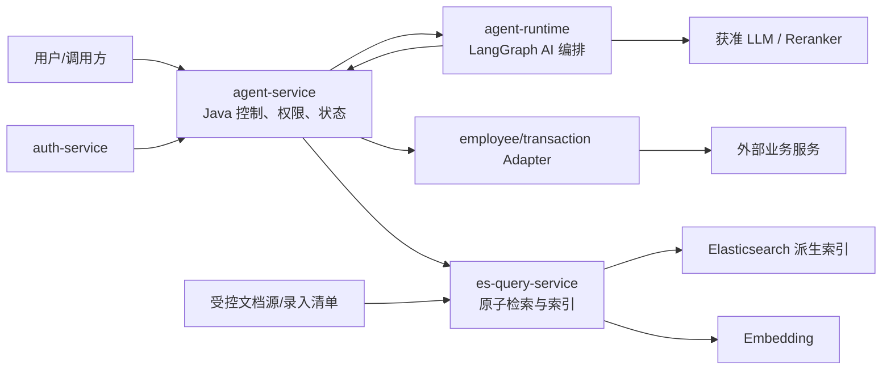

# 单体 Agent 智能体 L0 总体架构设计

> 文档层级：L0 总体架构  
> 文档状态：草稿 / 未评审 / 未实施 / 未生效  
> 当前版本：v1.0

## 1. 文档治理信息

| 项目 | 内容 |
|---|---|
| 文档标识 | `AGENT-L0-001` |
| 权威范围 | 新建单体 Agent 智能体及其 Agent 应用、AI 编排、业务适配、检索与索引基础设施的总体边界与全局约束 |
| 文档状态 | 草稿 |
| 评审状态 | 未评审；仅允许通过编写期内部自评提高质量 |
| 实施状态 | 未实施 |
| 生效状态 | 未生效 |
| 当前版本 | v1.0 |
| 适用基线 | v0.1 冻结提交 `417c140a38d0c32f27a644ac21b1df7f3d936909`（2026-07-17） |
| 维护责任人 | Dylan |
| 目标文档位置 | `docs/design/agent/单体Agent智能体总体架构_L0_v1.0.md` |
| 上位文档 | 无；本文是本轮新 Agent 建设的总体架构根文档 |
| 治理的 L1 文档 | [单体Agent应用与能力架构_L1_v1.0.md](./单体Agent应用与能力架构_L1_v1.0.md)；[检索与索引基础设施架构_L1_v1.0.md](./检索与索引基础设施架构_L1_v1.0.md) |
| 外部契约 | Java OpenAPI；`auth-service` RBAC；`employee-service`、`mq-procedure-service`；受控文档源；获准 LLM、Embedding、Reranker 服务契约 |
| 替代关系 | 内容承接已评审通过的 v0.1；v1.0 正式评审通过前不替代 v0.1 的已批准基线 |

## 2. 版本迁移说明

| 项目 | 说明 |
|---|---|
| 来源文档 | [单体Agent智能体总体架构_L0_v0.1.md](./单体Agent智能体总体架构_L0_v0.1.md) |
| 来源 SHA-256 | `E265C0B67A8306EF78DC056EB8ED39AA0C98618E014FCC81AA64A9A271E03B4B` |
| 迁移原则 | 保留全部有效架构决策、责任边界、安全约束、质量门禁和下位治理关系；不复制 v0.1 的逐轮修订与评审流水 |
| 表达调整 | 合并重复说明，以“关键方向—权威边界—流程—门禁—下位交付”为主阅读路径 |
| 语义变化 | 无；若后续发现 v1.0 与冻结 v0.1 存在实质差异，必须回退或按新架构变更重新评审 |

### 2.1 v1.0 修订历史

| 序号 | 日期 | 文档位置 | 修改内容 | 修改原因 |
|---:|---|---|---|---|
| 1 | 2026-07-17 | 全文 | 从冻结 v0.1 形成聚焦阅读的 v1.0 候选基线 | 减少历史过程和重复解释，突出架构方向、边界、决策与门禁 |

## 3. 阅读导引与核心结论

读者应先掌握以下六项方向，再按职责查阅后续章节：

1. **逻辑单体、双运行时**：Java 是统一入口、契约、权限和持久状态权威；Python LangGraph 只承担 AI 理解、规划和 DOCUMENT 编排。
2. **计划与可信执行分离**：QUERY/AGGREGATE 由模型生成受约束计划，Java 校验并调用业务服务；业务结果不返回模型。
3. **DOCUMENT 与检索解耦**：Agent 拥有多路编排、融合、精排、上下文和生成；检索域只拥有原子召回、派生索引和技术生命周期。
4. **三类权限权威分离**：`auth-service` 拥有身份/角色/RBAC，Agent 拥有字段策略和最终组合，文档源拥有资源属性；任何下游不得放宽。
5. **文档源可重建、撤权失败关闭**：受控原始存储和版本化录入清单是权威，ES 只是派生数据；撤权围栏全局可见后才能确认成功。
6. **评价工件与系统质量分门禁**：`3.0.0-synthetic` 固定包已形成，但目标系统尚未实跑；静态校验和 Oracle 自测不能替代系统质量报告。

## 4. 架构定位、范围与目标

### 4.1 业务与系统范围

首期对外提供一个统一 Agent，包含：

- `QUERY`：employee、transaction 业务查询；
- `AGGREGATE`：employee、transaction 聚合分析；
- `DOCUMENT`：受控文档检索、问答、总结和可校验引用。

业务主数据由外部业务服务拥有；Agent 不直连业务数据库。目标系统采用绿地架构，现有 `agent-*`、`es-*` 代码和旧设计只用于迁移风险识别，不构成目标权威。

### 4.2 非目标

- 不在 L0 定义完整 API 字段、表结构、类/方法、索引 Mapping 或 Prompt 参数；
- 不建设 multi-agent 协议、独立 Planner、文档业务系统或新的业务主数据中心；
- 不把测试环境端口、镜像和拓扑外推为生产基线；
- 不以 v1.0 编写期自评替代正式架构评审、实现验收或生产批准。

### 4.3 架构目标与成功标准

| 目标 | 成功标准 |
|---|---|
| 统一入口与能力隔离 | 三类能力由同一 Java API 接入；employee/transaction Adapter 相互独立 |
| 契约单一权威 | Java OpenAPI 为 Java↔Python 唯一来源，生成物漂移为0 |
| 状态单一权威 | 会话、执行、终态和引用只持久化于 Java/MySQL；Python 无第二事实源 |
| 权限与证据安全 | 未授权候选、引用、正文和日志泄漏为0；权限不确定时失败关闭 |
| DOCUMENT 可解释 | 事实性回答可追溯到当前可访问证据；证据不足时拒答或明确说明 |
| 可演进 | 新业务域通过 Adapter、新能力通过能力策略扩展，不侵入既有能力核心 |

### 4.4 质量门禁

| 质量属性 | 架构目标 | 验证方式 |
|---|---|---|
| 安全 | 越权引用或泄漏为0；撤权、策略缺失和安全状态未知均失败关闭 | 越权矩阵、撤权、缓存失效和故障注入 |
| 契约 | Java/Python/检索契约漂移为0 | OpenAPI diff、生成物和双向契约测试 |
| 一致性 | 终态单调，迟到结果不能覆盖取消/超时 | 栅栏、竞争、重复回调和恢复测试 |
| DOCUMENT 质量 | `Recall@50 ≥ 0.90`、`NDCG@10 ≥ 0.80`、事实支持率 `≥ 0.90`、要点覆盖率 `≥ 0.85`、引用精确率 `≥ 0.98`、事实性主张引用覆盖率 `≥ 0.90`、应拒答召回率 `≥ 0.95`、错误拒答率 `≤ 0.05`、越权泄漏为0 | v3 固定包及目标制品实际报告逐项判定，禁止加权抵消 |
| 韧性 | 可选召回或 Reranker 可受控降级；权限失败和证据不足不得降级放行 | 超时、断路、部分失败和降级测试 |
| 可运维 | 全链路具有统一关联标识、结构化日志和稳定 Telemetry Port | 日志关联、No-op/测试适配器替换 |

## 5. 目标架构、能力版图与权威边界

### 5.1 模块责任

| 模块/外部权威 | 唯一职责 | 明确不负责 | 数据/状态所有权 | 治理文档 |
|---|---|---|---|---|
| `agent-api` | Java 契约源码与 OpenAPI 发布 | 编排和持久化 | 跨进程契约定义权 | Agent L1 |
| `agent-service` | 统一入口、`ModelAccessDecision`、权限组合、执行生命周期、Tool 网关、终检和持久化 | 身份/RBAC 管理、LLM 编排、业务主数据、ES 实现 | 会话、执行、结果、引用、字段策略 | Agent L1 |
| `agent-runtime` | LangGraph 理解、规划、能力路由和 DOCUMENT 编排 | 外部入口、持久状态、直连业务/Auth/DB/ES | 单次临时图状态 | Agent L1 |
| `agent-adapter-*` | 业务计划到外部契约的隔离转换 | 其他业务域、业务主数据和 Agent 编排 | 无业务主数据 | Agent L1 |
| `es-query-api/service` | 查询/管理语义契约、原子召回、派生索引、Alias、重建和技术状态 | 问题理解、融合、Reranker、LLM、会话和权限规则管理 | 派生索引、构建状态和技术版本 | 检索 L1 |
| `auth-service` | 主体、角色、RBAC 规则及上界 | Agent 字段策略和资源属性 | 身份、角色和 RBAC | 外部契约 |
| 业务域服务 | employee/transaction 规则和主数据 | Agent 编排 | 各自业务数据 | 外部契约 |
| 受控文档源 | 原文、稳定 ID、业务版本、录入批次和首期语料库属性 | 用户/角色关系、查询编排和 ES 物理实现 | 原始文档与版本化清单 | 外部权威；检索 L2 细化 |

### 5.2 能力与依赖方向

| 能力 | AI 责任 | Java 可信责任 | 禁止路径 |
|---|---|---|---|
| QUERY/AGGREGATE | 生成意图、域和参数计划 | 前置判域、权限投影、计划校验、Adapter 执行、结果终检和持久化 | Python 直连业务；业务结果进入模型 |
| DOCUMENT | 问题理解、多路编排、融合、精排、上下文和生成 | 身份/权限、原子检索调用、候选和引用终检、持久化 | Python 直连 ES；检索域承担 RRF/LLM |
| 文档录入/撤权 | 不适用 | 检索管理面校验双身份、版本、幂等和来源 | 查询面或 Tool 获得索引写权限 |

依赖只允许：外部→Java、Java→Python、Java→Adapter/检索查询面、Adapter→业务服务、受控来源→检索管理面、检索→ES/Embedding、Python→获准 AI 端口。Python→Java 只返回计划或调用受控 DOCUMENT Tool，不形成状态或权限权威循环。

## 6. 全局架构原则与不变量

| ID | 原则/不变量 | 验证重点 |
|---|---|---|
| AD-01 | 实验性 `agent-*`、`es-*` 资产不作为目标基线 | 依赖和迁移清单不隐式继承 alpha |
| AD-02 | 逻辑单体采用 Java 控制/状态面 + Python AI 编排面 | 单一外部入口和部署边界 |
| AD-03 | Java OpenAPI 是 Java↔Python 唯一契约来源 | 生成、diff、契约测试 |
| AD-04 | Java/MySQL 是会话、任务、执行和引用的唯一持久状态权威 | 重启恢复和持久依赖扫描 |
| AD-05 | Python 不直连业务、Auth、MySQL、ES；QUERY/AGGREGATE 只返回计划，DOCUMENT 只经 Java Tool 检索 | 网络策略和计划/执行隔离 |
| AD-06 | DOCUMENT 编排归 Agent；检索域只提供原子检索与索引 | 职责和依赖扫描 |
| AD-07 | 首期不建设 `es-document-service`，重写并精简 `es-query-service` | 服务清单 |
| AD-08 | Auth 拥有身份/角色/RBAC；Agent 拥有字段策略；下游只执行不可扩权约束 | 权限单一权威和越权测试 |
| AD-09 | 权限硬过滤必须发生在召回前 | 候选、日志和上下文零泄漏 |
| AD-10 | Java 等待 Python 时不得持有数据库事务、锁或不可重入上下文 | 事务边界和线程检查 |
| AD-11 | 内部 Tool 默认只读、幂等、可重入；写能力采用独立政策 | 重试和副作用评审 |
| AD-12 | DB Schema 只交付 SQL，由 DB 责任方执行，应用启动不得迁移 | 启动和交付检查 |
| AD-13 | 可观测核心依赖稳定 Port 和上下文，不绑定后端 SDK | No-op/测试适配器替换 |
| AD-14 | 当前不引入 multi-agent 框架，只保留可拆分边界 | 扩展演练 |
| AD-15 | ES 不是文档/业务版本权威；物理索引通过 Alias 发布和回滚 | 重建和回滚演练 |
| AD-16 | LLM、Embedding、Reranker 输出均按不可信输入校验 | Schema、引用和内容安全 |
| AD-17 | RBAC、Agent 字段策略、文档资源属性分别单一权威，Java 形成最终约束 | 版本绑定、撤权和不可扩大 |
| AD-18 | Java 终态单调且带执行栅栏，迟到结果不得覆盖终态或产生副作用 | 取消、超时和竞争测试 |
| AD-19 | Java/Python/检索部署单元携带契约版本/指纹并通过 readiness 门禁 | 兼容矩阵和滚动升级 |
| AD-20 | 检索查询面和管理面在契约、身份、入口和审计上隔离 | 越权写入和身份测试 |
| AD-21 | 原“测试平台/生产本地”规则仅保留为被 AD-22 替代的历史决策 | 替代关系可追踪 |
| AD-22 | 模型目标按业务域/数据分类准入；Java 先形成 `ModelAccessDecision`，未分类/混合输入不得先交公共模型判域；每次发送重新生成安全投影；业务执行结果不返回模型 | 准入矩阵、零前置外发、上下文撤权和分层证明 |
| AD-23 | 获授权操作人经独立服务身份脚本录入；原始存储和版本化清单是文档权威，ES 仅派生 | 双身份、版本、批次、重建和审计 |
| AD-24 | 首期单一预配置语料库、统一安全/访问策略；Java 组合 RBAC、DOCUMENT 能力和语料库权限；不启用文档级 ACL，未来优先使用权限码 | 零候选拒绝、撤权和 ACL 兼容迁移 |

## 7. 关键流程与失败闭环

### 7.1 QUERY / AGGREGATE

1. Java 建立主体、租户、RBAC、字段策略和执行上下文，先完成 `ModelAccessDecision`。
2. Java 生成最小化 `message/history/context` 安全投影；未分类或冲突输入只允许高信任本地分类目标，或拒绝/澄清。
3. Python 只返回受约束计划；Java 不持事务等待。
4. Java 校验计划并经独立 Adapter 调用业务服务；只读调用在时限内按唯一责任方重试。
5. Java 执行结果安全校验、持久化单调终态并直接返回；业务结果不进入模型或后续模型历史。

### 7.2 DOCUMENT

强制顺序为：身份/权限上下文 → 问题理解 → 召回前硬过滤 → BM25/Dense/可选 Sparse 原子召回 → 去重/归并 → RRF → Reranker → 业务校正 → 邻块扩展 → Token 预算上下文 → 带引用生成 → 引用、事实、覆盖、完整性和最终权限终检。

任何后置检查都不能替代召回前硬过滤。证据不足必须拒答或明确说明，不得使用模型常识补齐事实。

### 7.3 文档录入、发布与撤权

1. 获授权操作人通过独立服务身份脚本提交原文对象和版本化录入清单。
2. 管理面校验操作人授权证据、服务身份、来源、幂等键、业务版本和快照边界。
3. 检索域生成派生分块/表示，在新索引完成校验并追平变更水位后切换 Alias。
4. 删除、停用和访问收窄先持久化撤权围栏；围栏全局可见后才能确认成功，物理收敛可异步。
5. 围栏未知、版本乱序或来源无法验证时失败关闭；回滚不得恢复已撤权内容。

## 8. 数据、状态、权限与契约所有权

| 事实/状态 | 唯一权威 | 允许消费 | 禁止事项 |
|---|---|---|---|
| 员工/交易数据与业务规则 | 对应业务服务 | Adapter 读取结果快照 | Agent 建业务主表或复制业务规则 |
| 文档正文、稳定 ID、业务版本、批次和语料库属性 | 受控原始存储与版本化清单 | ES 派生索引、引用定位和受控上下文 | ES/脚本成为第二正文权威 |
| 主体、角色、RBAC 上界 | `auth-service` | Java 消费带版本/有效期的授权上界 | Agent 复制 RBAC 规则 |
| Agent 字段策略 | `agent-service` | Java 形成字段查询、展示、运算和模型投影约束 | Auth/模型/检索维护平行字段权威 |
| Agent 执行与引用 | `agent-service` + MySQL | Python 获得单次临时上下文 | Python 持久 Checkpointer 或双写终态 |
| ES 物理制品与技术状态 | `es-query-service` | Agent 使用逻辑语料库/配置档 | 调用方指定物理索引、裸 DSL 或 Provider |

Java `agent-api` 是跨运行时契约来源。外部业务、Auth、文档源和模型服务按各自契约演进，由 Adapter/Port 隔离；内部 Java/Python/检索制品不兼容时 readiness 失败，不得接流量。

## 9. 全局关键机制

### 9.1 一致性、幂等与恢复

- Java 通过短事务记录执行起点和单调终态，不持事务调用外部服务。
- 执行栅栏、deadline 和取消信号贯穿 Runtime 与 Tool；下游取消是尽力清理，正确性依赖 Java 栅栏。
- 管理写入使用幂等键、单调业务版本、持久操作日志、水位、状态机、对账和补偿，不使用分布式事务。
- Alias 切换前完成制品校验和增量追平；回滚是新的受审计发布决策。

### 9.2 安全、隐私与审计

- Java 在数据进入任何模型前完成业务域/数据分类、目标信任和字段投影裁决；用户自称域不能作为权威。
- Runtime→Java DOCUMENT Tool 使用固定服务密钥证明服务身份，并使用 Java 不透明短期凭据承载本次最小能力；两者不得进入 Prompt、日志或异常。
- 首期 DOCUMENT 至少绑定可信主体/租户、DOCUMENT 能力、唯一语料库、有效状态和策略版本；检索服务只等价执行或收窄。
- 查询、管理、模型访问、撤权和终态均保留关联标识、策略/制品版本、决策结果与失败原因；日志不记录敏感正文或凭据。

生产本地推理目标采用三层独立证明：Runtime 配置制品的专项检查只要求逻辑项 `LLM_API_KEY` 为空，在当前 `AGENT_` 前缀约定下对应实际环境变量 `AGENT_LLM_API_KEY`；目标注册表、路由/readiness 与网络策略证明请求只到获准端点并阻断跨信任回退；Serving/部署平台独立提供许可、版本、摘要、加载和回滚制品证明。三层不得互相替代，空 Key 不是端点或模型制品可信的充分证据。

### 9.3 性能、韧性与运维

- 每次执行只有一个总 deadline；Java/Python/检索/模型只分配剩余预算，禁止无界重试和跨调用持锁。
- 可选 Sparse、Reranker 或单路召回故障可按策略降级并标记；权限、契约、安全和证据不足不得降级放行。
- 生产 SLO、容量、HA、网络和故障目标由对应 L2/生产架构补齐；测试拓扑不能外推生产。
- Java、Python 和检索服务可独立部署，但共同受制品指纹、兼容矩阵、readiness、灰度和回滚门禁约束。

## 10. 核心架构决策

| ID | 决策 | 关键取舍/变更触发 |
|---|---|---|
| DEC-01 | 逻辑单体采用 Java + Python 双运行时 | 兼顾企业治理与 AI 生态；承担内部调用复杂度 |
| DEC-02 | Java 是唯一跨进程契约来源 | 生成链故障会阻断发布，但消除双源漂移 |
| DEC-03 | Java/MySQL 是唯一持久状态来源 | 不启用 Python Checkpointer，长任务恢复需求需重评 |
| DEC-04 | DOCUMENT 归 Agent，检索域提供原子能力 | 防止 ES 服务业务化 |
| DEC-05 | Python 不访问业务服务；QUERY/AGGREGATE 只产计划，DOCUMENT 只经 Java Tool | Java 成为执行关键路径，需容量治理 |
| DEC-06 | 首期同步规划/执行，仅 DOCUMENT 保留受控回调 | 出现长任务或异步需求时建立 ADR |
| DEC-07 | DB 只交付 SQL，由 DB 责任方执行 | 需脚本版本和环境校验控制漂移 |
| DEC-08 | 可观测采用 Port + No-op，暂不部署后端 | 后端选型时补充 ADR/实现设计 |
| DEC-09 | 当前不引入 multi-agent | 出现独立目标、状态和伸缩需求时重评 |
| DEC-10 | RBAC、Agent 字段策略和资源属性分权，Java 形成最终约束 | 现有 Auth 字段投影必须版本化迁移 |
| DEC-11 | Java 单调终态和执行栅栏拒绝迟到完成 | 下游可短暂继续计算，但不得产生持久副作用 |
| DEC-12 | 内部部署单元以契约指纹/readiness 控制兼容 | 外部提供方仍由 Adapter/Port 隔离 |
| DEC-13 | 单一 `es-query-service` 内部隔离查询面与管理面 | 资源或发布隔离无法满足 SLO 时再评估拆服 |
| DEC-14 | DOCUMENT Tool 使用固定服务密钥 + Java 短期执行凭据 | 写能力或信任边界扩大时升级身份机制 |
| DEC-15 | 原“测试平台、生产本地”方案被 DEC-16 替代，仅保留历史关系 | 不再作为统一准入规则 |
| DEC-16 | 模型目标按业务域/数据分类准入，Java 前置裁决和实时安全投影；业务执行结果不回模型 | 内部资料使用公共服务前必须专项评估 |
| DEC-17 | 受控原文/清单权威、单一语料库、语料库级权限和未来权限码 ACL | 多来源、多安全等级或文档 ACL 启用前联合修订三份架构 |

## 11. L1 与下位治理

| L1 文档 | 权威范围 | 必须承接 | 关键 L2 方向 | 当前状态 |
|---|---|---|---|---|
| `单体Agent应用与能力架构_L1_v1.0.md` | Java Agent、Python Runtime、能力体系、Adapter、执行/会话、跨运行时契约 | 逐项说明 AD-01～AD-24、DEC-01～DEC-17；非本域责任必须显式标注边界 | 契约、生命周期、QUERY/AGGREGATE、DOCUMENT 编排、Adapter、安全、状态、可观测 | v1.0 草稿/未评审 |
| `检索与索引基础设施架构_L1_v1.0.md` | 原子检索、受控文档源、索引/向量生命周期、Alias、Embedding、检索韧性 | 逐项说明 AD-01～AD-24、DEC-01～DEC-17；非本域责任必须显式标注边界 | 查询/管理契约、候选安全、文档源、表示、发布、技术状态、性能、运维、评价 | v1.0 草稿/未评审 |

DOCUMENT 不单独建立第三份 L1：业务编排进入 Agent L1 的 DOCUMENT L2；原子检索和索引进入检索 L1 的 L2。任何 L2 都不得修改本 L0 或同层 L1 的权威边界。

## 12. 演进、迁移与回滚

| 阶段 | 目标 | 进入/退出门禁 | 回滚边界 |
|---|---|---|---|
| P0 基线隔离 | 旧实验资产不污染目标 | 命名、注册、状态表和可写 Alias 隔离 | 仅文档/构建资产，无生产回滚 |
| P1 契约与骨架 | 建立 Java 单源契约、执行状态和查询/管理隔离 | 契约、身份、状态机和 SQL 交付检查 | 不兼容制品不接流量 |
| P2 QUERY/AGGREGATE | 完成计划/执行隔离与两域 Adapter | 权限、错误、分页/聚合和结果不回模型测试 | 按独立能力/Adapter 回退 |
| P3 DOCUMENT/检索 | 完成受控录入、原子召回、融合、生成和引用闭环 | 越权为0、撤权、评价包、故障和恢复门禁 | 新索引不合格不切 Alias；旧制品须满足当前围栏才可回切 |
| P4 生产批准 | 完成目标制品实跑、容量、安全和运维验收 | L2、实际 v3 报告、业务代表性、SLO/HA 全部通过 | 按制品和数据水位执行受审计回滚 |

旧资产不具备默认运行时回滚资格。任何临时兼容路径必须有所有者、截止日期、删除条件和回滚验证。

## 13. 风险与未关闭门禁

| 风险/待决项 | 影响 | 关闭点 | 是否阻塞当前 v1.0 编写 |
|---|---|---|---|
| Auth 字段规则迁移未完成 | 可能形成字段双重权威 | 权限/安全 L2 正式评审前形成方案，实现验收前完成 | 否；阻塞对应 L2/实现验收 |
| employee/transaction 外部契约细节未冻结 | QUERY/AGGREGATE 适配可能不可执行 | 对应能力 L2 正式评审前 | 否；阻塞对应能力 L2 |
| 生产 SLO、容量、网络和 HA 未确认 | 无法承诺生产目标 | 性能/部署 L2 和生产架构批准前 | 否；阻塞生产批准 |
| v3 目标系统实跑未执行 | 不能证明 Recall@50 等系统质量 | 系统质量放行前生成并用 `--report` 校验实际报告 | 否；阻塞系统质量放行 |
| v3 仍为纯模拟数据 | 业务长尾和噪声代表性不足 | 生产批准前增加经授权脱敏的业务扩展集 | 否；阻塞生产质量批准 |
| 文档源物理方案和操作人授权证据载体未细化 | 管理链路无法实施 | 检索管理/安全 L2 正式评审前 | 否；阻塞对应 L2 |
| 文档级 ACL 需求未确认 | 首期只能统一语料库级访问 | 仅在申请启用 ACL 前联合修订三份架构和评价包 | 否；首期禁止启用 |

`EB-L1-003-DOCUMENT-EVAL` 当前固定包为 `3.0.0-synthetic`：114个语料块、30个案例、单一 `document-default` 语料库、统一 `internal` 等级、无文档级 ACL；20个 Recall@50 计分案例最小候选池56，7个访问拒绝案例要求零候选。`target_system_quality_run_executed=false`，命令用途以[评价证据入口](./evidence/eb-l1-003/README.md)为准。

## 14. 约束追踪与验证

| 约束范围 | 责任文档 | 下位证据 |
|---|---|---|
| AD-01～AD-05、AD-10～AD-14、AD-18、AD-21～AD-22 | Agent L1 | 项目隔离、部署/依赖、OpenAPI、状态机、事务、Tool、SQL、Telemetry、模型准入和上下文测试 |
| AD-06～AD-09、AD-16～AD-17、AD-19～AD-20、AD-23～AD-24 | 两份 L1 | 职责矩阵、权限检索契约、双身份录入、制品兼容、撤权、越权和评价证据 |
| AD-15 | 检索 L1 | 重建、Alias 切换、增量追平和回滚演练 |
| DEC-01～DEC-17 | 按两份 L1 决策映射 | L1 决策、L2 交付、测试与发布门禁 |

## 15. 编写期内部自评

内部自评只检查 v1.0 的表达、完整性和与冻结 v0.1 的语义一致性，不构成正式批准。

| 轮次 | 检查重点 | 发现与处理 | 结果 |
|---|---|---|---|
| 1 | L0 完整性、聚焦表达、L0→L1 追踪和 v0.1 语义保持 | 严格结构校验发现“修订历史、能力版图”标题不够显式；语义复核发现 L1 承接范围表述有歧义，且生产本地模型三层证明未完整保留。已调整标题，要求两份 L1 逐项说明全部 AD/DEC，并恢复 `LLM_API_KEY`/`AGENT_LLM_API_KEY`、端点/网络、Serving 制品的独立证明 | 已修复，进入第2轮 |
| 2 | 严格结构、稳定 ID、链接、同层边界、质量门禁和治理状态 | 严格校验0错误0警告；AD/DEC 集合与 v0.1 相等；两份 L1 追踪完整，链接有效，未发现 P0/P1/P2 | 内部自评通过；仍为未评审 |

## 16. 附录

### 16.1 关键技术边界

| 类别 | 目标边界 |
|---|---|
| Java | Java 25、Spring Boot 3.5.10、Spring Cloud 2025.0.1、MyBatis；统一入口、契约、权限和状态 |
| Python | Python 3.12.4、LangGraph；单次 AI 编排状态，不持久化业务事实 |
| 检索 | Elasticsearch 9.4.1、BGE-M3；测试环境事实不外推生产 |
| Reranker | BGE Reranker v2 M3；不可用时仅按明确策略回退 RRF |
| 模型 | 通过稳定 Port 接入按业务域/数据分类获准的公共或本地目标；禁止跨信任等级自动回退 |

### 16.2 术语

| 术语 | 含义 |
|---|---|
| 逻辑单体 | 对外一个 Agent、一个入口和一个权威执行状态，内部允许 Java/Python 协作进程 |
| `ModelAccessDecision` | Java 在模型调用前形成的域、分类、目标和安全投影权威决定 |
| 执行栅栏 | 拒绝取消、超时或重试后的迟到请求写入权威状态的世代标识 |
| 撤权围栏 | 在物理索引收敛前阻止已撤权资源继续被查询的全局可见安全状态 |
| 版本化录入清单 | 关联原文、稳定 ID、业务版本、批次/快照和资源属性的权威清单 |
