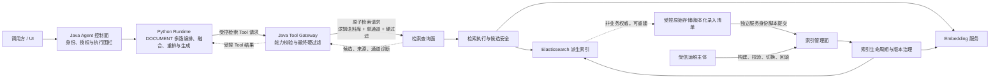

# 检索与索引基础设施 L1 架构设计

> 文档状态：草稿 / 未评审 / 未实施 / 未生效 
> 文档层级：L1 
> 文档编号：AGENT-RETRIEVAL-L1-001 
> 当前版本：v0.1 
> 文档负责人：Dylan 
> 上位架构：[单体 Agent 智能体总体架构 L0](./单体Agent智能体总体架构_L0_v0.1.md) 
> 同层协作：[单体 Agent 应用与能力架构 L1](./单体Agent应用与能力架构_L1_v0.1.md) 
> 基线日期：2026-07-17 
> 目标基线：绿地目标架构；现有 `es-*` 代码与历史设计仅作为迁移风险证据，不作为目标实现基线

---

## 1. 文档治理

### 1.1 文档目的

本文定义检索与索引基础设施域的 L1 目标架构，用于：

1. 承接 `AGENT-L0-001` 对检索、索引、授权、安全、版本、发布和可观测性的约束。
2. 明确 `es-query-api`、`es-query-service` 与 Agent 应用、文档源、Elasticsearch、Embedding 服务之间的职责边界。
3. 将原子检索、索引构建、版本切换、撤销收敛等基础设施能力，与问题理解、混合检索编排、融合、重排、上下文构造和答案生成等 Agent 业务能力隔离。
4. 为后续 L2 详细设计提供可验证的责任分配、契约语义、状态所有权、质量门禁和迁移路径。

本文不定义字段级 API、Elasticsearch Mapping、具体索引名称、类/方法、数据库表、部署清单或容量参数；这些内容由受本文治理的 L2 文档给出。

### 1.2 适用范围

本文覆盖：

- 原子关键词检索、向量检索及经门禁启用的可选稀疏检索能力。
- 文档、分块、向量和检索所需授权属性的派生索引。
- 增量写入、删除/撤销、全量重建、校验、Alias 切换和回滚。
- 查询面与管理面的语义契约、身份边界、版本与兼容性治理。
- 检索过滤、候选安全、幂等、时限、降级、审计和可观测性。
- 与 Agent `DOCUMENT` 路由和版本化评价集的联合验证边界。

本文不覆盖：

- 用户问题理解、路由决策、查询改写和检索计划生成。
- 多路结果融合、RRF、去重、业务排序、Reranker、上下文构造和答案生成。
- 会话状态、Agent 执行状态、业务文档主数据和业务授权规则管理。
- 前端交互、模型本地化部署、业务服务实现和多 Agent 协作。
- Elasticsearch 物理 Mapping、分片副本、字段级契约及实现代码。

### 1.3 读者

- 架构与设计评审人
- Agent Java、检索服务与文档源研发人员
- 安全、测试、运维与发布负责人
- 后续 L2 详细设计编写与实现人员

### 1.4 治理状态

| 项目 | 当前值 |
|---|---|
| 文档层级 | L1 域/服务架构 |
| 文档状态 | 草稿 |
| 评审状态 | 未评审 |
| 实施状态 | 未实施 |
| 生效状态 | 未生效 |
| 上位约束来源 | `AGENT-L0-001` |
| 同层边界来源 | Agent 应用与能力 L1 |
| 目标实现策略 | 绿地重建，旧资产隔离评估后选择性迁移 |

### 1.5 权威性与冲突处理

1. 本文对检索与索引基础设施域的目标边界具有 L1 权威性，但不得改变 L0 决策。
2. Agent `DOCUMENT` 编排相关语义以同层 Agent L1 为权威；本文只规定其消费的检索基础设施能力。
3. 首期以受控原始文档存储及版本化录入清单为文档正文、稳定 ID、单调业务版本和录入批次的权威；Elasticsearch 仅保存可重建派生数据。
4. 若后续 L2、代码或旧文档与本文冲突，先停止相关实现并发起架构变更，不得以旧实现反向覆盖本文。
5. 本文自评只能提高草稿质量，不能替代独立评审，也不能将状态改为“已评审”或“已通过”。

---

## 2. 修订历史

| 版本 | 日期 | 作者 | 变更说明 | 状态 |
|---|---|---|---|---|
| v0.1 | 2026-07-17 | Dylan | 新建检索与索引基础设施 L1，承接 L0 并冻结与 Agent L1 的同层边界 | 草稿 |
| v0.1 | 2026-07-17 | Dylan | 修正 L0 `DEC-14～DEC-16` 继承语义，补充 Embedding 信任边界、重建水位、撤销生效点、强制质量门禁、L2 追踪与重试责任 | 第 1 轮正式评审修复，仍为草稿 |
| v0.1 | 2026-07-17 | Dylan | 对齐文档源契约阻断点，收紧 `document-eval-2.0` 证据边界并修正决策追溯计数 | 第 2 轮正式评审修复，仍为草稿 |
| v0.1 | 2026-07-17 | Dylan | 承接 L0 `AD-23～AD-24`、`DEC-17`，冻结受控脚本文档源、单一语料库权限和未来权限码 ACL 演进；关闭 `EB-RETR-L1-001` 的架构证据阻断 | 编写期同步，仍为草稿/未评审，待正式复评 |
| v0.1 | 2026-07-17 | Dylan | 补齐操作人授权证据、录入清单与不可变原文绑定，并纠正 v2.0 评价包与首期语料库权限模型不一致 | 第 4 轮正式评审修复，仍为草稿/未评审，待第 5 轮复评 |

---

## 3. 架构定位与上下文

### 3.1 架构定位

检索与索引基础设施是单体 Agent 体系中的独立基础设施域。它向 Java Agent 提供可约束、可追踪的原子候选检索能力，向使用独立服务身份的受控录入脚本和运维主体提供索引生命周期管理能力；它不理解用户问题的业务意图，不决定多路检索策略，也不负责生成最终上下文或答案。

目标逻辑仍是“单体 Agent”，但检索服务拥有独立部署、数据派生和运维边界。该独立性用于隔离 Elasticsearch 与 Embedding 的技术复杂度，不表示新增业务 Agent 或新的业务主数据中心。

### 3.2 系统上下文

### 3.3 核心职责与唯一责任

本域唯一负责把受控原始存储和版本化录入清单声明的数据构建为可重建检索制品，并在最终授权硬过滤下向 Java Agent 返回可追踪的单通道候选；任何跨通道或答案级业务决策均不属于本域。

| 能力 | 权威归属 | 检索基础设施责任 |
|---|---|---|
| 用户问题理解与路由 | Agent 应用 | 不实现 |
| 查询改写与多路计划 | Agent 应用 | 只执行单个已确定的原子通道请求 |
| BM25 / Dense / 可选 Sparse | 检索基础设施 | 实现、限额、诊断、返回候选 |
| RRF、跨路融合、去重 | Agent 应用 | 不实现 |
| Reranker、业务排序 | Agent 应用 | 不实现 |
| 上下文构造与答案生成 | Agent 应用 | 不实现 |
| 最终授权约束组合 | Java Agent | 校验并执行不可扩张的硬过滤 |
| 文档正文与业务版本 | 文档源 | 只保存可重建派生快照 |
| 索引技术版本与构建状态 | 检索基础设施 | 唯一技术权威 |
| 物理索引与 Alias | 检索基础设施 | 全生命周期管理，不暴露给普通调用方 |
| 会话与 Agent 执行状态 | Agent 应用 | 不持有、不回写 |

### 3.4 目标模块

| 模块 | 目标职责 | 明确禁止 |
|---|---|---|
| `es-query-api` | 定义检索域 Java 语义契约；隔离查询面与管理面；声明版本、能力与错误语义 | ES 客户端实现、裸 DSL、物理索引名、Agent 编排、Python 契约 |
| `es-query-service` | 原子检索、过滤执行、候选安全、Embedding 适配、索引构建、Alias 发布、回滚、技术状态、审计与遥测 | 问题理解、融合/RRF、Reranker、上下文、LLM、会话、权限规则管理 |

不新建 `es-document-service`。文档源仍由业务域维护；检索域通过受控管理契约消费文档快照并建立派生索引。

---

## 4. 上位约束承接

### 4.1 L0 架构约束映射

| L0 约束 | 本域承接方式 | 验证位置 |
|---|---|---|
| AD-01 | 现有 `es-*` 代码、历史设计和接口均为实验资产；先隔离再选择性迁移，不作为目标基线 | 第 14 章迁移门禁 |
| AD-02 | 检索服务是单体 Agent 的独立基础设施服务，不形成新的业务 Agent | 第 3、6 章 |
| AD-03 | Java↔Python 单一契约约束在本域不直接适用；本域以 `es-query-api` 为唯一 Java 语义契约，Python 不直接调用 | 第 7.1、7.2 节 |
| AD-04 | 不持有会话、任务或业务主数据；仅持有索引、构建、发布和撤销围栏等技术状态 | 第 8 章 |
| AD-05 | Python 不直连检索服务、Elasticsearch 或 Embedding；文档检索只能经 Java Agent | 第 7.2、9.1 节 |
| AD-06 | `DOCUMENT` 业务编排属于 Agent；本域只提供原子检索与索引能力 | 第 3.3、6.2 节 |
| AD-07 | 不建设 `es-document-service`；收敛 `es-query-service` 的目标责任 | 第 3.4 节 |
| AD-08 | RBAC 与 Agent 字段策略不下沉；本域仅执行调用方给出的不可扩张过滤条件 | 第 7.3、10.1 节 |
| AD-09 | 授权过滤必须在候选召回前成为硬过滤；结果后验检查不能替代前置过滤 | 第 9.1、10.1 节 |
| AD-10 | 不引入跨 Agent、文档源、Embedding、Elasticsearch 的分布式事务或全局锁 | 第 8.4、10.4 节 |
| AD-11 | 查询读取幂等且可重入；管理写入以幂等键、版本和操作状态独立保证 | 第 7.4、10.4 节 |
| AD-12 | 默认不新增关系型业务存储；若 L2 选择关系型技术状态存储，迁移必须由受控 SQL 脚本治理，禁止应用启动自动改表 | 第 8.3、12 章 |
| AD-13 | 暴露指标、日志、追踪和审计端口，不绑定固定可观测后端 | 第 11.4 节 |
| AD-14 | 不引入多 Agent、Agent 协同或 Agent 间消息协议 | 第 1.2、3.1 节 |
| AD-15 | Elasticsearch 不是文档或业务版本权威；物理索引通过 Alias 发布与回滚 | 第 8.2、9.3 节 |
| AD-16 | Embedding 输出与检索结果均按不可信技术输入处理，必须校验维度、版本、上限和结果安全 | 第 10.2、10.5 节 |
| AD-17 | 最终授权条件由 Java Agent 组合；首期最小资源属性由版本化录入清单及获准语料库配置提供；本域不得推断或放宽 | 第 7.3、8.1、10.1 节 |
| AD-18 | 接收并遵守 Java Agent 的截止时间与取消信号；迟到结果不得影响 Agent 状态 | 第 9.4、10.3 节 |
| AD-19 | 查询面、管理面均声明独立契约版本、指纹、能力和就绪状态，混合版本必须受兼容矩阵控制 | 第 7.5、10.6 节 |
| AD-20 | 查询面与管理面在契约、身份、网络入口和审计上隔离；管理面不暴露为 Python Tool | 第 6.3、7.2 节 |
| AD-21 | 历史模型环境变量决策不适用于本域；本服务不调用 LLM 或 Reranker | 第 6.2、12 章 |
| AD-22 | 本域不决定 Agent 模型目标或最终字段投影，只返回已授权候选、来源与检索诊断 | 第 7.2、7.6 节 |
| AD-23 | 管理面只接收具备文档管理权限的操作人经独立服务身份脚本提交的版本化录入清单；原始存储/清单为权威，ES 仅派生 | 第 6.3、7.4、8.1、9.2 节 |
| AD-24 | 首期只治理一个预配置逻辑语料库及统一安全/访问策略；Java 组合 RBAC、DOCUMENT 能力和语料库权限，本域只执行。文档级 ACL 仅作为受治理扩展 | 第 6.1、7.2、7.3、10.1 节 |

### 4.2 L0 架构决策承接

| L0 决策 | 本域影响 | 本文落实 |
|---|---|---|
| DEC-01 绿地目标架构 | 旧 `es-*` 不具目标权威性 | 迁移阶段先隔离旧接口和实现 |
| DEC-02 单体 Agent 逻辑边界 | 独立检索服务不等于新 Agent | 仅作为基础设施域部署 |
| DEC-03 Java↔Python 契约治理 | Python 不获得检索直连契约 | Java Agent 是查询面唯一 Agent 调用方 |
| DEC-04 `DOCUMENT` 编排归 Agent | 本域不能吸收融合和上下文职责 | 仅提供原子通道 |
| DEC-05 Python 禁止直连业务与基础设施 | 禁止 Python 直连 ES/Embedding/检索服务 | 由 Java Tool Gateway 发起调用 |
| DEC-06 Agent 状态唯一权威 | 检索域不持有 Agent 状态 | 仅持有可独立恢复的技术状态 |
| DEC-07 数据库迁移治理 | 技术状态存储不得启动时自动迁移 | L2 若选关系库，必须提供受控 SQL |
| DEC-08 可观测端口而非后端 | 不绑定厂商平台 | 输出标准日志、指标、追踪和审计事件 |
| DEC-09 单 Agent 范围 | 不设计多 Agent 索引隔离协议 | 租户/语料库范围来自业务授权语义 |
| DEC-10 授权约束在 Java 组合 | 检索域只执行最终约束 | 失败关闭、禁止默认放宽 |
| DEC-11 Java 执行围栏 | 检索调用必须服从截止时间 | 传播 deadline/cancellation，限制资源消耗 |
| DEC-12 契约指纹与就绪 | 不兼容实例不能接流量 | 两个入口分别发布版本和 readiness |
| DEC-13 查询/管理面隔离 | 管理能力不能混入 Tool 查询 | 身份、入口、限流、审计分别治理 |
| DEC-14 Runtime→Java Tool 双重凭据 | 固定服务密钥与短期 `capabilityId` 只保护 Python→Java Tool，不是 Java→检索的身份凭据 | 检索查询面只信任独立的 Java 服务身份和最终硬过滤；禁止向本服务透传或复用 Runtime 凭据 |
| DEC-15 历史环境隔离决策 | 已被 DEC-16 替代，不作为本域 Embedding 目标的准入依据 | 仅保留替代关系；Embedding 的目标信任不得从“本地/公网”标签或 LLM 配置推断 |
| DEC-16 业务域/数据分类模型准入与安全投影 | Agent 的 `ModelAccessDecision` 和字段安全投影仍由 Agent 权威负责；本域不得重新判定或放宽 | 查询只消费 Java 已允许的最小检索输入；索引/查询 Embedding 仅使用与语料库数据分类匹配的获准表示目标，禁止跨信任等级回退 |
| DEC-17 受控文档源与首期语料库级权限 | 文档源身份、权威存储、录入清单、统一语料库权限及未来 ACL 演进成为本域直接约束 | 管理面验证独立服务身份和操作人审计；查询面只接收 Java 形成的语料库级硬过滤；未来权限码 ACL 需版本化扩展和重建 |

DOCUMENT 版本化评价是 L0 第 4～5、15～16 节和同层 Agent L1 `APP-DEC-14` 的强制质量门禁，不属于 L0 `DEC-16` 的语义；本文在第 11.5 节单独承接，禁止借决策编号错配改变门禁权威。

---

## 5. 背景、现状与目标

### 5.1 当前证据

现有实验资产已经包含 Elasticsearch 查询、文档写入、混合检索、融合、去重、上下文构造、重建和 Alias 等实现信号，但存在以下结构性问题：

1. 裸 Elasticsearch DSL、物理索引名和通用文档 CRUD 可能穿透服务边界，使上层绑定物理实现。
2. 混合融合、去重和上下文构造进入检索模块，与 Agent L1 的 `DOCUMENT` 编排权威冲突。
3. 允许外部提供任意 `sourceUrl` 的重建形态无法证明来源身份、数据范围和审计闭环。
4. JDBC、迁移文件和索引构建状态已出现，但目标状态存储及迁移责任尚未按 L0 重新确认。
5. 旧契约未证明具有查询面/管理面隔离、版本指纹、授权失败关闭和撤销收敛能力。

这些证据只用于制定隔离与迁移门禁，不表示旧资产已经满足目标架构。

### 5.2 目标

| 目标编号 | 目标 | 可验证结果 |
|---|---|---|
| RET-G-01 | 提供稳定、受约束的原子候选检索 | Agent 可按通道独立调用并获得稳定候选标识、来源和诊断 |
| RET-G-02 | 保证授权过滤在召回前生效 | 缺失、非法或无法表达的硬过滤请求被拒绝，无默认放宽路径 |
| RET-G-03 | 建立可追踪的派生索引生命周期 | 任一线上 Alias 可追溯到业务快照、Embedding 版本、Mapping 版本和构建证据 |
| RET-G-04 | 支持幂等增量、撤销与全量重建 | 重复操作不产生额外副作用，旧业务版本不能覆盖新版本 |
| RET-G-05 | 查询面与管理面安全隔离 | 普通 Agent 查询身份无法调用索引管理操作 |
| RET-G-06 | 与 Agent `DOCUMENT` 联合满足质量门禁 | 评价包可分别定位检索召回、过滤、融合、重排和答案问题 |
| RET-G-07 | 支持安全切换、回滚和演进 | 新索引先校验后切换；不兼容契约或制品不接流量 |

### 5.3 非目标

- 不为通用 Elasticsearch 平台提供任意索引和任意 DSL 代理。
- 不建设企业级内容管理、主数据或权限管理系统。
- 不在本域复刻 Agent 的融合、重排和答案生成能力。
- 不承诺未经容量和故障演练证明的生产 SLO、HA 数字或拓扑。
- 不以增加兜底放宽、后验过滤或静默降级来提高表面可用率。

### 5.4 架构假设

| 编号 | 假设 | 失效影响 | 处理方式 |
|---|---|---|---|
| RET-A-01 | 受控原始文档存储及版本化录入清单能提供稳定文档 ID、单调业务版本、录入批次/快照和首期最小语料库属性 | 无法可靠增量、撤销、重建或过滤 | 已由 L0 `AD-23～AD-24`、`DEC-17` 和第 5.5 节冻结架构语义；字段级契约由 L2 承接，不再构成 `EB-RETR-L1-001` |
| RET-A-02 | Java Agent 能形成机器可执行的最终硬过滤 | 检索域无法安全执行授权 | 阻断查询契约联调 |
| RET-A-03 | Embedding 服务提供稳定模型/制品版本和向量维度 | Dense 索引不可兼容或不可复现 | 作为索引发布前置门禁 |
| RET-A-04 | Elasticsearch 支持目标 Alias 原子切换能力 | 无法安全发布与回滚 | L2 必须实测并保留证据 |
| RET-A-05 | 版本化评价集可扩展出有效 Recall@50 候选池 | 无法证明检索召回目标 | 评价包升级为系统质量门禁 |
| RET-A-06 | 文档源和安全责任方能为逻辑语料库提供数据分类及获准表示目标约束 | 无法证明正文/查询文本可发送到指定 Embedding 目标 | 阻断对应语料库的 Dense/Sparse 构建与查询 |

### 5.5 首期已确认文档源与权限基线

1. 具备文档管理权限的管理员或技术人员通过受控后端脚本统一录入；脚本使用与查询身份隔离的独立服务身份。脚本入口必须校验实际操作人的文档管理权限和允许范围，并把不可由调用方伪造、可验证且绑定本次操作/范围/有效期的操作人授权证据传给管理面；管理审计同时关联实际操作人、授权决定和服务身份，裸操作人标识不能替代授权证据。
2. 受控原始文档存储及版本化录入清单是正文、稳定标识、单调业务版本、录入批次/快照和可引用定位的权威来源；每个已接受的清单项必须绑定不可变原文对象版本或内容摘要，同一“文档 ID + 业务版本 + 清单版本”在任何重建中只能解析为相同字节内容。原文或摘要不匹配时失败关闭并阻断构建/发布；ES、向量和分块都是可重建派生数据。
3. 系统不根据文档内容自动判断业务类别。首期全部文档进入一个预配置逻辑语料库，并绑定统一数据安全等级、获准表示配置和语料库访问策略；具体安全等级值与 Embedding 目标仍须在表示 L2/对应语料库启用前冻结。
4. Java Agent 从可信主体/当前租户出发，组合 `auth-service` RBAC 上界、DOCUMENT 能力和语料库访问权限，形成本域不能放宽的最终过滤。首期具备语料库权限即可访问其全部有效文档，不支持文档级差异化 ACL。
5. 后续若启用文档级 ACL，优先由 RBAC 提供稳定有效权限投影、文档引用稳定权限码，显式资源列表只承载少量例外授权；当前仅有角色投影时，稳定角色 ID 绑定只能作为有版本和退出门禁的过渡，禁止把用户列表复制到索引。
6. 删除、停用和访问收窄必须经受控管理入口提交；持久撤权围栏对全部查询实例全局可见后才能确认成功，物理索引收敛可异步完成。

---

## 6. 责任分解与组件边界

### 6.1 查询面

查询面面向 Java Agent，负责：

- 接受唯一预配置逻辑语料库、检索配置档、原子通道、查询文本/向量意图、候选上限、截止时间，以及 Java Agent 形成的语料库级最终硬过滤约束。
- 校验请求上限、契约兼容、语料库能力、过滤语义和 Embedding 兼容性。
- 在授权硬过滤生效的前提下执行单一 BM25、Dense 或已启用 Sparse 通道。
- 返回稳定文档/分块标识、业务版本、通道分值、来源、可审计授权属性摘要和诊断信息。
- 对超时、取消、部分不可用和配置不兼容给出稳定错误语义。

查询面不得接受裸 DSL、脚本、物理索引名、Alias 名或任意字段投影。

首期查询面不得接受文档级 ACL、用户/角色列表或由调用方临时指定的替代语料库；文档管理权限不自动形成文档读取权限。

### 6.2 检索执行与候选安全

该组件负责查询编译、限额、Embedding 调用、Elasticsearch 执行、结果校验和通道内排序。它不负责：

- 跨通道融合、RRF 或分数归一化决策。
- 跨通道去重、最终候选裁剪或业务排序。
- Reranker、上下文拼接、引用选择或答案生成。
- 根据用户自然语言推断租户、角色、数据范围或过滤条件。

同一次 `DOCUMENT` 请求需要多通道时，由 Python Runtime 在 Agent 域内编排多个受控 Tool 请求；每个请求都必须经过 Java Tool Gateway 形成最终硬过滤并由 Java 调用查询面。Python 不直接连接本服务、Elasticsearch 或 Embedding。

### 6.3 管理面

管理面只面向使用独立服务身份的受控后端录入脚本和受信运维主体；由管理员或技术人员发起的操作还必须携带可信且不可伪造的操作人授权证据，管理面校验其操作类型、语料库范围和有效性，并关联可审计操作人，负责：

- 依据版本化录入清单执行增量 upsert、删除/撤销及首期最小资源访问属性更新。
- 全量快照构建、完整性校验、质量校验、Alias 切换和回滚。
- 业务版本、索引技术版本、Embedding 制品版本和 Mapping 版本关联。
- 管理操作幂等、顺序控制、状态查询、失败恢复和审计。

管理面不得成为 Agent Tool，不得接受 Python 调用，也不得允许调用方以 URL 指示服务主动拉取任意数据源。

受控原始文档存储和版本化录入清单分别是正文及稳定标识、业务版本、批次/快照边界的权威来源；录入脚本只是受控提交者，不能成为新的数据权威。

### 6.4 索引生命周期组件

负责将已授权文档快照转换为检索派生数据，并维护构建状态机。生命周期至少包含：

`已受理 → 构建中 → 待校验 → 可发布 → 已切换 → 保留观察 → 已归档`

失败、取消和回滚必须是显式终态或补偿路径，不能通过修改 Alias 或删除旧索引掩盖失败。

### 6.5 Embedding 适配组件

负责查询向量和文档向量生成、制品身份校验、维度校验、超时、批量上限和可观测性。它是检索域内部技术依赖，不向 Agent 暴露模型供应商接口，也不得自行决定数据是否允许进入某个模型目标。

每个逻辑语料库必须绑定由文档源、安全和运维责任方批准的表示配置档，至少确定适用数据分类、获准 Embedding 目标及信任等级、允许发送的数据范围、制品版本和禁止回退边界。查询调用方只能引用获准逻辑配置档，不能指定供应商、Base URL、凭据或任意模型；服务不得在目标不可用时切换到更低信任等级目标。配置档缺失、分类冲突、目标未获准或网络/readiness 证明不足时，Dense/Sparse 失败关闭；是否保留不依赖 Embedding 的 BM25 由语料库能力政策显式声明。

### 6.6 同层协作边界

| 协作项 | Agent 应用 L1 | 本文档域 | 联合门禁 |
|---|---|---|---|
| DOCUMENT 检索计划 | Python Runtime 生成通道与查询，Java 控制总预算和能力围栏 | 校验并执行 Java 提交的原子请求 | 通道能力、预算和 deadline 协商一致 |
| 授权 | 组合最终非扩张约束 | 编译并前置执行 | 零越权样例通过 |
| 多路检索 | 发起多次调用 | 每次返回单通道结果 | 截止时间与总预算可控 |
| 融合/去重/重排 | 唯一责任方 | 不实现 | 评价指标可分层定位 |
| 来源与引用 | 选择最终引用 | 返回稳定来源证据 | doc/chunk/version 可追溯 |
| 失败处理 | 决定业务降级或终止 | 返回稳定技术错误/部分状态 | 禁止静默放宽授权 |
| 质量评价 | NDCG、答案质量、引用质量 | 每通道 Recall、过滤正确性 | 使用同一版本化评价包 |

### 6.7 外部依赖

| 依赖 | 依赖方向 | 必要能力 | 失效策略 |
|---|---|---|---|
| Java Agent | 调用查询面 | 最终硬过滤、deadline、通道和预算 | 非法或不兼容请求直接拒绝 |
| 受控文档源/录入脚本 | 调用管理面/提供快照 | 独立服务身份、绑定操作/范围/有效期的操作人授权证据、稳定 ID、单调业务版本、不可变原文版本/摘要、批次/快照、首期最小访问属性和撤销事件 | 任一身份、授权、来源清单、原文绑定或版本不可验证时不受理 |
| Elasticsearch 9.4.x | 本域调用 | 索引、检索、Alias、健康信息 | 有界重试；禁止转为无过滤查询 |
| Embedding 服务 | 本域调用 | 获准目标/信任等级、模型制品版本、维度、批量生成 | 目标不匹配或不可用时 Dense/Sparse 失败；禁止跨信任等级回退，BM25 仅按显式语料库政策保留 |
| 身份与网络基础设施 | 保护两个入口 | 服务身份、入口隔离、加密与策略 | 身份不可验证时失败关闭 |
| 可观测基础设施 | 消费遥测端口 | 指标、日志、追踪、审计 | 本域不绑定具体后端 |

---

## 7. 语义契约架构

### 7.1 契约权威

`es-query-api` 是检索域 Java 语义契约的唯一代码权威，至少分为两个互不复用身份的契约域：

1. 查询契约：供 Java Agent 使用。
2. 索引管理契约：供独立服务身份的受控录入脚本和受信运维主体使用。

两个契约可以共享稳定标识、错误分类和版本元数据，但不得通过同一万能请求暴露不同权限能力。字段级定义、序列化形式和端点路径由 L2 详细设计给出。

### 7.2 查询契约语义

查询请求必须表达：唯一预配置逻辑语料库、获准检索/表示配置档、一个原子通道、候选预算、Java Agent 形成的最终硬过滤、截止时间以及契约身份。最终硬过滤至少绑定受信主体/当前租户形成的授权决定、`DOCUMENT` 能力、语料库范围、文档状态和策略版本。调用方不能指定用户身份、角色、权限策略、替代语料库、物理索引、内部字段、脚本、Elasticsearch DSL、Embedding 供应商端点或凭据。配置档只能从语料库已发布能力中选择，不能借切换配置扩大数据处理信任边界。

首期拥有该语料库访问权限即允许访问其中全部 `ACTIVE` 文档，不支持文档级差异化 ACL。后续若引入差异化 ACL，查询契约只能承接授权域输出的稳定有效权限码及小规模例外资源范围，不能把用户列表、角色成员关系或授权规则复制到检索索引。

查询响应必须表达：

- 稳定 `documentId`、`chunkId` 与业务版本。
- 通道内分值与通道身份，禁止暗示跨通道分值可直接比较。
- 内容片段或受控内容引用，以及来源定位信息。
- 实际使用的逻辑语料库、索引技术版本、Embedding/检索配置版本。
- 过滤已执行的可验证标记、诊断、耗时和截断信息。
- 成功、部分完成、取消、超时、不兼容或不可用的稳定结果分类。

“部分完成”只能表示非授权相关的显式能力降级，不能表示过滤未执行、身份未验证或候选安全未知。

### 7.3 授权过滤契约

授权约束必须是有限、类型化、可校验、可编译的机器语义，而不是自由文本、脚本或拼接 DSL。支持的属性、操作符、空值语义和组合复杂度由查询契约 L2 固化。

首期资源访问属性字典最小集为：受信租户/语料库范围、文档状态 `ACTIVE`、统一数据安全等级或其配置引用、语料库访问策略版本。任一必需属性缺失、未知或与请求策略版本不一致时，该文档不得进入可查询 Alias，也不得作为候选返回。

后续差异化 ACL 只有在录入契约、资源属性字典和授权投影契约经架构修订后才可启用。推荐由授权域将 RBAC 角色映射为稳定有效权限码，文档只引用权限码；当前授权服务只能输出角色时，可在受版本控制的过渡期直接匹配稳定角色 ID，但必须设退出门禁。资源列表只用于小规模例外，不得成为主授权模型。

本域遵循以下不变量：

1. 过滤条件只能等价执行或进一步收窄，不能扩张。
2. 缺失必需过滤、未知属性、未知操作符、超出复杂度或无法编译时直接拒绝。
3. 硬过滤必须进入 Elasticsearch 召回条件；结果后验过滤只能作为纵深校验。
4. 文档源未提供首期最小访问属性，或后续启用 ACL 后未提供所需 ACL 属性时，该文档不得进入可查询 Alias。
5. 日志与诊断不得泄露完整敏感属性值。

### 7.4 管理契约语义

每个管理操作必须绑定：独立受信服务身份、不可伪造且绑定操作类型/语料库范围/有效期的操作人授权证据、注册的受控原始文档存储/版本化录入清单、唯一预配置语料库范围、操作类型、幂等键、稳定文档标识、单调业务版本、不可变原文对象版本或内容摘要、批次/快照身份和可追踪来源。管理面必须独立校验服务身份与操作人授权证据，不能把裸操作人标识或日志字段当作授权。全量构建必须以版本化录入清单声明的快照为基线，并绑定快照边界/变更起始水位、预期范围，以及经批准的数据分类与表示配置档；调用方不能指定任意模型端点或处理凭据。

处理规则：

- 同一幂等键和同一有效载荷重复提交，返回同一操作语义。
- 同一幂等键但有效载荷不同，返回冲突，不覆盖原操作。
- 旧业务版本不得覆盖新业务版本。
- 相同业务版本但内容或授权属性摘要不同，返回冲突并审计。
- 清单引用的不可变原文对象版本或内容摘要与实际读取内容不一致时，拒绝受理或阻断构建/发布；禁止以重新计算摘要覆盖已接受清单事实。
- 删除/撤销是版本化管理操作，不等同于无条件物理删除。
- 服务不得按调用方提供的任意 URL 主动抓取数据。
- 全量构建期间的增量操作必须进入检索域持久操作日志并具有单调变更水位，不能只写当前活跃物理索引。

### 7.5 版本、指纹与就绪

查询面和管理面分别发布：

- 语义契约版本与契约指纹。
- 当前支持的检索通道、过滤能力和限制。
- 活跃逻辑语料库对应的技术索引版本与制品兼容信息。
- 对各自入口独立计算的 readiness。

不兼容的契约、过滤语义、Embedding 维度、Mapping 或索引制品必须阻断流量或发布，不能依赖运行时猜测兼容。

### 7.6 错误与部分成功

错误至少按以下架构类别稳定区分：

| 类别 | 示例 | 是否允许自动重试 | 调用方动作 |
|---|---|---|---|
| 请求/过滤非法 | 缺失硬过滤、未知通道、超预算 | 否 | 修正请求，不降权重试 |
| 契约/制品不兼容 | 指纹不匹配、向量维度冲突 | 否 | 停止接流量或回滚制品 |
| 截止/取消 | deadline 到期、上游取消 | 否 | Agent 按执行围栏终止或显式降级 |
| 短暂依赖失败 | ES 节点抖动、Embedding 短暂失败 | 仅在剩余时限内有界重试 | 保留失败类别与通道状态 |
| 数据版本冲突 | 旧版本写入、幂等载荷冲突 | 否 | 录入清单责任人修正版本或人工处理 |
| 发布校验失败 | 数量、过滤、质量或制品校验失败 | 否 | 禁止 Alias 切换 |

---

## 8. 数据与状态所有权

### 8.1 所有权矩阵

| 数据/状态 | 唯一权威 | 检索域中的形态 | 可否重建 |
|---|---|---|---|
| 文档正文与业务元数据 | 受控原始文档存储；具体正文版本由录入清单中的不可变对象版本/内容摘要绑定 | 受控派生快照 | 是，且相同清单版本必须重建出相同字节内容 |
| 稳定文档标识、业务版本、原文绑定与批次/快照边界 | 版本化录入清单 | 与索引记录绑定的镜像值 | 是 |
| 首期最小资源访问属性 | 版本化录入清单及获准语料库配置 | 用于前置硬过滤的派生属性 | 是 |
| 授权规则与用户权限 | 业务授权域/Java Agent | 不保存规则，只接收最终约束 | 不适用 |
| 文档/分块稳定标识 | 文档 ID 由版本化录入清单权威提供，分块 ID 由检索域按版本化策略派生 | 索引和响应中的稳定引用 | 是 |
| 分块策略版本 | 检索域与文档源联合确认 | 索引技术制品元数据 | 是 |
| 向量与稀疏表示 | 检索域 | 模型制品派生数据 | 是 |
| 物理索引、Alias | 检索域 | 运行时技术资产 | 是 |
| 构建、校验、发布状态 | 检索域 | 可持久化技术状态 | 可恢复，不得仅靠内存 |
| 撤销/墓碑围栏 | 检索域，来源事件由文档源权威提供 | 防止陈旧索引继续返回已撤销资源 | 可由事件重放恢复 |
| Agent 会话与执行状态 | Agent 应用 | 不保存 | 不适用 |

### 8.2 版本维度

必须区分并可追踪以下版本，禁止混用一个“version”覆盖全部语义：

- 文档业务版本：由版本化录入清单单调推进。
- 文档快照版本：描述全量构建的数据范围和截点。
- 原文对象版本/内容摘要：把清单项不可变地绑定到实际正文，保证重建和引用可复现。
- 录入清单版本：描述稳定标识、业务版本、原文绑定、批次/快照与首期最小访问属性的权威集合。
- 语料库访问策略版本：描述 Java 授权决定与索引最小访问属性必须共同遵循的策略语义。
- 增量变更水位：描述快照之后已由管理面持久受理的变更顺序。
- 分块策略版本：描述内容切分语义。
- Embedding 制品版本与向量维度。
- 表示配置档版本：描述数据分类、获准目标、信任等级、发送范围和禁止回退边界。
- Mapping/检索配置版本。
- 物理索引技术版本。
- Alias 发布版本。
- 查询/管理契约版本与指纹。
- 评价包版本。

### 8.3 技术状态持久化

构建、发布、幂等、持久操作日志、增量/发布水位和撤销围栏状态必须能够在进程重启后恢复。本文不预设其具体物理存储，但 L2 必须证明：

1. 状态具有唯一写入责任和并发控制。
2. 操作记录与 Elasticsearch 实际状态可对账。
3. 恢复不会重放出越权、旧版本覆盖或重复切换。
4. 若采用关系型数据库，按 L0 由受控 SQL 脚本治理，禁止应用启动自动建表/改表。
5. 任一成功确认的管理变更都能从持久状态重放到当前活跃索引、在建索引或回滚目标，不因 Alias 切换丢失。

### 8.4 一致性模型

- 查询读取：对同一活跃 Alias 和同一请求语义应幂等、可重入。
- 增量索引：文档源与派生索引之间最终一致，以业务版本拒绝回退。
- 全量发布：构建期间不改变线上 Alias；所有增量先持久记录并推进单调水位，在建索引追平发布水位后才允许在语料库发布围栏内原子切换。
- 回滚：旧索引只有在追平回滚水位、包含切换后的增量与撤销后才可重新绑定 Alias；无法追平时禁止回切并关闭受影响查询面。
- 撤销：成功确认前必须把撤销/收窄围栏持久化并使全部查询实例可见，再异步收敛物理索引；围栏状态不可确认时受影响语料库查询失败关闭。
- 跨系统：不使用分布式事务；通过幂等、版本、状态机、对账和补偿恢复。

---

## 9. 关键运行时流程

### 9.1 原子检索流程

1. Java Agent 控制面从受信会话建立主体、当前租户、RBAC 角色、`DOCUMENT` 能力和语料库访问决定，随后进入 Python `DOCUMENT` 编排。
2. Python Runtime 选择一个原子通道并向 Java Tool Gateway 发出受控检索请求；Python 只能表达检索意图和收窄请求，不能形成或放宽最终授权。
3. Java Tool Gateway 校验能力凭据与执行围栏，形成包含当前租户、唯一预配置语料库、`ACTIVE` 状态和语料库访问策略版本的最终硬过滤，并携带预算、deadline 调用查询面。
4. 查询面校验 Java 服务身份、契约指纹、能力、预算和过滤完整性；不得接受文档级 ACL、调用方角色/用户列表或替代语料库，任一步失败均不执行检索。
5. 服务解析逻辑语料库对应的活跃技术制品，检查 Mapping、Embedding 和过滤能力兼容性。
6. Dense/Sparse 通道按需调用内部模型适配器；所有输出通过维度、大小和版本校验。
7. 服务把硬过滤编译进 Elasticsearch 查询并执行单通道召回。
8. 对结果执行稳定标识、版本、撤销围栏和首期最小访问属性纵深校验；未知安全状态的候选被丢弃并告警。
9. 单通道候选、来源、分值、制品版本、过滤执行证明和诊断经 Java Tool Gateway 返回 Python Runtime。
10. Python Runtime 在 Agent 域内完成融合、去重、重排、上下文和答案生成；Java 控制面继续负责最终结果安全与执行终态。

### 9.2 增量索引与撤销流程

1. 具备文档管理权限的管理员或技术人员通过受控后端脚本提交变更；脚本入口校验操作人权限与范围，使用独立服务身份调用管理面，并携带绑定操作/范围/有效期的不可伪造操作人授权证据。
2. 管理面独立校验服务身份、操作人授权证据及权限范围，并校验唯一预配置语料库、权威来源清单、稳定文档 ID、不可变原文对象版本/内容摘要、首期最小访问属性、版本单调性和载荷上限；裸操作人标识只用于关联审计，不能放行操作。
3. 先将操作及其业务版本持久化到检索域操作日志并分配单调变更水位；未完成持久化不得确认受理成功。
4. 对新增/更新内容执行受控分块和表示生成；服务校验语料库数据分类、获准表示目标、制品版本、维度和大小。
5. 变更写入当前活跃索引；存在在建或待回滚索引时，按其基线水位重放同一持久操作，不能依赖不受控双写猜测一致。
6. 对删除、停用或语料库访问策略收窄，必须先持久化撤权围栏并确认全部查询实例可见，才能返回管理操作成功；随后推进各物理索引收敛。
7. 围栏写入、传播或查询校验不可确认时，管理操作不得成功，受影响语料库查询失败关闭；不得以“稍后最终一致”继续返回旧候选。
8. 完成后对账业务版本、变更水位与各索引应用水位；失败进入可恢复状态，不静默丢弃。

### 9.3 全量构建、发布与回滚流程

1. 受控脚本依据版本化录入清单声明唯一预配置逻辑语料库、快照身份、快照边界/变更起始水位、预期范围、数据分类和目标制品组合。
2. 服务创建新的物理索引技术版本，不修改当前线上 Alias。
3. 从受控原始文档存储读取录入清单快照绑定的不可变正文版本，先校验对象版本/内容摘要，再按获准表示配置生成分块和向量并记录可追踪构建清单；任一不匹配均阻断本次构建。
4. 构建期间所有管理增量继续进入持久操作日志；服务按单调水位把快照后的更新、撤销和访问属性收窄重放到新索引。
5. 选择发布水位并确认新索引已追平；执行结构、数量、业务版本、增量水位、过滤、撤销、抽样检索、质量和兼容性校验。
6. 只有全部强制门禁通过，目标索引才进入“可发布”。
7. 在单语料库发布围栏内短暂串行化管理写路由，复核发布水位后原子切换 Alias；切换后的更高水位只能路由/重放到新活跃索引。
8. 验证新读路径、Alias 和写入水位；验证失败时，旧索引只有追平回滚水位后才允许原子回切。无法安全追平时保持失败关闭，而不是回到陈旧索引。
9. 旧索引进入受控观察窗口，持续接收回滚所需增量或保持可重放能力，禁止立即删除；回滚需记录原因、主体、水位和证据。
10. 观察期结束后按保留策略归档/清理；清理不是发布成功的前提。

### 9.4 超时、取消与依赖失败

1. 查询面以 Agent 传入的 deadline 为上限，并为内部 ES/Embedding 调用分配更短预算。
2. 剩余预算不足时不发起新的高成本调用。
3. 接到取消或 deadline 到期后，尽快取消下游请求并停止结果组装。
4. 迟到结果不写入 Agent 状态，也不以成功响应返回。
5. BM25、Dense、Sparse 的失败分别报告；是否使用其他已完成通道由 Agent 决定。
6. 任何失败都不能触发去除授权过滤、切换到裸 DSL 或放大检索范围。

### 9.5 状态对账与恢复

1. 周期性比对技术状态、物理索引、Alias、活跃制品和撤销围栏。
2. 同时比对持久操作日志、快照基线、各索引应用水位、发布/回滚水位和表示配置档版本。
3. 发现孤儿索引、无记录 Alias、版本/水位倒退、表示目标不匹配或围栏未收敛时，阻断相关管理操作并告警；无法证明候选安全时阻断查询。
4. 恢复流程必须从持久状态和 Elasticsearch 实际状态共同推导，禁止仅按最后日志猜测。
5. 自动修复只允许执行已证明幂等且不扩张数据访问的动作；Alias 切换、回滚和清理需满足 L2 定义的审批策略。

---

## 10. 核心架构机制

### 10.1 授权失败关闭

- 首期只有一个预配置逻辑语料库；访问权限由 Java Agent 基于受信主体/当前租户、RBAC、`DOCUMENT` 能力和语料库访问权限形成，检索域只执行且不得放宽。
- 首期不支持文档级差异化 ACL；获得语料库访问决定的主体可访问其中全部 `ACTIVE` 文档，未获得时返回零候选或稳定拒绝语义。
- 为该逻辑语料库声明首期最小访问属性与支持的过滤操作。
- 查询编译器只接受白名单语义，不接受脚本或自由 DSL。
- 过滤校验、查询编译、结果纵深校验形成三层保护，但前置硬过滤是不可替代的主控制。
- 撤销围栏在物理索引最终一致期间阻止已撤销资源返回。
- 查询实例必须在返回候选前确认适用撤销围栏已达到当前可见水位；围栏存储、缓存版本或传播状态不可确认时，受影响语料库查询失败关闭。
- 过滤拒绝、围栏命中和候选安全异常必须形成不含敏感值的安全遥测。
- 后续文档级 ACL 必须通过架构修订启用：授权域输出稳定有效权限码，文档引用权限码；仅在小规模例外时附加资源列表。用户列表、角色成员关系和授权规则不得复制到 Elasticsearch。

### 10.2 表示与索引兼容

- 物理索引必须固定 Embedding 制品版本、向量维度、距离/分数语义、分块策略和 Mapping 版本。
- 查询向量只可由与目标索引兼容的制品生成。
- 表示配置档必须把语料库数据分类、获准目标及信任等级、发送范围、制品身份和禁止回退边界绑定为同一发布证据；端点/网络和制品证明不得由 API Key 是否为空替代。
- 文档正文、元数据和查询文本只发送生成表示所必需的最小内容；不得把权限清单、凭据或无关敏感字段发送给 Embedding 目标。
- 目标不可用时不得跨信任等级、跨数据驻留边界或切换到未批准模型；降级到 BM25 必须由语料库能力政策明确允许并保留降级证据。
- Sparse 通道默认关闭；只有模型制品、索引结构、评价收益、容量和运维门禁均通过后才能按语料库启用。
- 不兼容表示不能在查询时隐式转换或混查。
- 模型输出为空、非有限值、超维、维度错误或超限时明确失败。

### 10.3 预算与资源保护

- 查询契约限制 topK、文本长度、过滤复杂度、并发、批量和超时。
- Agent 的总 DOCUMENT 预算由 Agent L1 负责；本域只保证每个原子调用不突破自身预算。
- 管理面与查询面使用独立限流和资源池，索引构建不得无界挤占在线查询。
- 高成本重建、回填和校验必须可暂停、可取消、可恢复。
- 重试受 deadline、操作幂等性和退避策略共同约束。
- 每个下游依赖只能有一个重试责任方：`es-query-service` 唯一负责 Elasticsearch/Embedding 的内部重试；Java Agent 只可按查询契约对“确认未产生调用方可见副作用”的查询面失败进行有界重试。两层尝试次数必须计入同一 deadline/调用预算并返回尝试诊断，禁止乘法重试。

### 10.4 幂等、并发与顺序

- 查询请求不写业务状态，可安全重试但仍受 deadline 和限额约束。
- 文档变更以“逻辑范围 + 文档 ID + 业务版本”判定顺序，以幂等键判定重复。
- 成功受理的管理操作先持久化到单调操作日志；物理索引写入、在建索引追平和回滚重放均消费该权威技术序列。
- 同一逻辑语料库同一发布槽位只允许一个有效切换决策者。
- 并发构建可以存在，但只有明确选定且校验通过的技术版本可绑定线上 Alias。
- 回滚本质是新的受审计 Alias 决策，不通过重写历史操作实现。

### 10.5 不可信输入治理

以下输入均视为不可信：Agent 查询文本、过滤载荷、文档内容、文档元数据、Embedding 输出、Elasticsearch 返回和外部错误信息。服务必须执行：

- 类型、长度、数量、编码、结构和复杂度校验。
- 允许语料库、通道、字段和操作符白名单。
- 日志转义、敏感字段脱敏和错误边界收敛。
- 文档内容与检索片段不作为可执行指令。
- Elasticsearch 响应中的未知字段或异常数据不直接透传给 Agent。

### 10.6 契约兼容与发布门禁

兼容性至少覆盖：

- Agent 查询契约 ↔ 查询服务版本。
- 文档源管理契约 ↔ 管理服务版本。
- 独立服务身份/操作人授权证据 ↔ 管理操作类型、语料库范围与有效期。
- 录入清单版本/业务版本/原文对象版本或内容摘要 ↔ 实际原文字节与构建清单。
- 检索配置 ↔ Mapping/索引版本。
- 查询 Embedding ↔ 文档 Embedding 制品与维度。
- 语料库数据分类/表示配置档 ↔ Embedding 目标信任等级、端点/网络和制品证明。
- 过滤能力 ↔ 索引授权属性。
- Java RBAC/`DOCUMENT`/语料库访问决定 ↔ 首期语料库访问策略版本；后续有效权限码 ↔ 文档权限码（仅在架构修订启用后适用）。
- 快照基线/操作日志水位 ↔ 在建、活跃及回滚索引的应用水位。
- 评价包 ↔ 被评估制品组合。

readiness 必须基于当前入口实际依赖和活跃制品计算。仅“进程存活”不能表示可接收查询或管理流量。

---

## 11. 质量属性与验收门禁

### 11.1 安全与数据保护

| 门禁 | 目标 | 证据 |
|---|---|---|
| 授权泄露 | 已授权评价与攻击样例中为 0 | 过滤契约测试、越权测试、围栏测试 |
| 语料库访问隔离 | 无语料库访问权限时返回的文档候选为 0；有权限时仅返回该语料库 `ACTIVE` 文档 | RBAC/能力/语料库策略组合测试与负向样例 |
| 入口隔离 | Agent 查询身份不能调用管理面 | 身份/网络策略测试与审计记录 |
| 双身份管理授权 | 仅服务身份和操作人授权证据同时有效且范围匹配时才受理管理操作；伪造/过期/越范围证据受理数为 0 | 服务身份、操作人授权、范围绑定、重放和负向测试 |
| 来源控制 | 不接受任意 URL 或未注册来源 | 管理契约负向测试 |
| 来源可重建 | 同一清单/业务版本重建的原文字节与内容摘要一致；原文被原地替换时发布数为 0 | 对象版本/摘要校验、篡改、重建和发布阻断测试 |
| 数据最小化 | 仅索引检索和授权所需字段 | 字段清单、Mapping 评审、日志脱敏测试 |
| 撤销失败关闭 | 撤销受理后不因陈旧 Alias 返回资源 | 并发撤销/查询测试与收敛指标 |
| 表示目标准入 | 未获准或跨信任等级的 Embedding 调用为 0 | 配置档、网络、目标切换和负向测试 |

撤销最大收敛时长、审计留存期和敏感属性分级仍需在对应 L2 评审前量化；未量化前不得宣称满足生产安全 SLO。

### 11.2 可靠性与恢复

- Alias 切换必须原子且可验证，切换失败不改变有效线上读路径。
- 新索引切换前必须追平发布水位；旧索引回切前必须追平回滚水位，切换/回滚期间的成功管理变更丢失数为 0。
- 旧版本写入不得覆盖新版本，幂等冲突不得静默合并。
- 进程重启后构建、发布和撤销状态可恢复并可对账。
- 下游超时和取消不得转化为无界后台工作。
- 发布前必须演练构建失败、校验失败、切换失败和回滚。

### 11.3 性能与容量

生产 QPS、P95/P99、索引规模、分片副本、Embedding 并发和重建窗口尚无有效实测基线。性能 L2 必须在正式评审前给出：

- 按 BM25、Dense、Sparse 分通道的延迟与吞吐预算。
- 在线查询与离线构建的资源隔离策略。
- topK、文本、过滤复杂度和批量硬上限。
- 容量增长、热点、节点失败和重建压力模型。
- 测试环境与生产拓扑差异及外推限制。

在这些数字完成前，本文只确立“有界预算、入口隔离、可取消、可测量”的架构约束，不承诺具体生产数值。

### 11.4 可观测性与审计

必须提供但不绑定具体后端的遥测端口：

- 查询：通道、逻辑语料库、结果数、截断、过滤拒绝、围栏命中、制品版本、延迟、超时和依赖错误。
- 索引：受理、版本冲突、处理量、失败量、积压、Embedding 批次和索引刷新。
- 发布：构建状态、校验结果、Alias 切换、回滚、孤儿资产和对账异常。
- 契约：调用方版本、服务版本、指纹不匹配、能力协商和 readiness 原因。
- 审计：独立服务身份、实际操作人、录入清单版本、逻辑范围、操作、幂等键、业务版本、结果和关联标识。

日志不得记录原始敏感文档全文、完整授权属性、密钥、令牌或可重放管理载荷。

### 11.5 检索质量与版本化评价

检索域与 Agent 域共用版本化评价包，但指标责任分层：

| 指标/检查 | 责任域 | 当前门禁解释 |
|---|---|---|
| 单通道 Recall@K | 检索基础设施 | 分别评价 BM25、Dense、可选 Sparse |
| 授权过滤正确性 | 检索基础设施 | 必须含允许、拒绝、缺失属性、撤销和版本样例 |
| 稳定 ID/来源/版本可追溯 | 检索基础设施 | 候选必须映射到权威来源 |
| 跨路融合 NDCG、去重、Rerank | Agent 应用 | 不归本域实现 |
| 上下文、引用和答案质量 | Agent 应用 | 不归本域实现 |

当前 `document-eval-2.0` 的 `2.0.0-synthetic` 评价包可继续作为报告契约、结构、答案、引用和历史角色/时间过滤回归输入；其现有校验报告只证明评价工件与验证器完整，不证明目标系统已经通过过滤或安全验证。该包包含多个模拟域、混合安全等级和文档级 `allowed_roles`，与首期“单一预配置语料库、统一安全等级、语料库级访问、不启用文档级 ACL”不一致，因此不得作为首期权限安全门禁证据。按照评价包“修改权限语义递增 MAJOR”的版本规则，DOCUMENT/权限安全 L2 正式评审前必须形成 `3.0.0-synthetic` 或等价新主版本：对齐首期语料库权限模型，覆盖无权限零候选、停用/撤权围栏和策略版本失败关闭，并使 Recall@50 计分样例具有大于 50 的有效候选池与足够干扰项。系统质量放行还必须在实际目标制品上执行，不能只通过静态校验。

继承 L0 与同层 Agent L1，DOCUMENT 联合放行必须在有效评价包和实际目标制品上满足 `Recall@50 ≥ 0.90`，不得降为建议项。该联合指标在 Agent 对授权后的多路原子候选完成去重/融合后形成的 Top50 上计算；本域必须同时提供各原子通道及融合前候选的可重算证据，用于区分召回缺陷与 Agent 融合缺陷。单通道独立阈值由联合评价 L2 冻结，但不能替代联合强制门禁。

### 11.6 可维护性与演进

- 上层只依赖逻辑语料库、通道和稳定语义，不依赖物理索引名称。
- 新通道必须通过契约、制品、质量、容量、安全和运维门禁，不能以枚举扩展即默认上线。
- 查询面与管理面可独立演进版本，但共享标识的语义必须兼容。
- Elasticsearch 客户端、Mapping 和模型供应商适配不得泄漏到 Agent 契约。

---

## 12. 本层架构决策

| 决策编号 | 决策 | 理由 | 主要代价/约束 |
|---|---|---|---|
| RET-DEC-01 | 单一 `es-query-service` 提供隔离的查询面与管理面 | 避免多余服务，同时维持安全和运维边界 | 需独立身份、入口、资源池和审计 |
| RET-DEC-02 | 只提供原子检索通道，不实现跨路融合和上下文 | 保持 Agent `DOCUMENT` 编排唯一权威 | Agent 需承担多调用预算和融合责任 |
| RET-DEC-03 | 调用方使用逻辑语料库/配置档，不指定物理索引或 Alias | 隔离物理演进与安全控制 | 需维护可靠的逻辑到技术制品解析 |
| RET-DEC-04 | 授权过滤采用类型化白名单、召回前硬过滤和失败关闭 | 防止 DSL 注入与默认放宽造成越权 | 新过滤能力必须显式演进契约和索引 |
| RET-DEC-05 | 受控原始文档存储拥有正文权威，版本化录入清单拥有稳定标识、业务版本、不可变原文对象版本/内容摘要、批次/快照和首期最小访问属性权威；ES 仅存派生数据 | 避免检索域或录入脚本成为第二业务权威，并保证相同清单版本可重复重建 | 需要清单与原始存储一致性校验、篡改阻断和可重建能力 |
| RET-DEC-06 | 管理写入采用身份、范围、幂等键和单调业务版本 | 保证重试、乱序和冲突可控 | 版本化录入清单必须承担版本契约 |
| RET-DEC-07 | 撤销先建立失败关闭围栏，再收敛物理索引 | 防止最终一致窗口泄露已撤销资源 | 增加围栏状态、查询检查和对账成本 |
| RET-DEC-08 | 全量构建采用新索引校验后原子 Alias 切换并保留回滚窗口 | 避免半成品上线并支持快速回退 | 需要额外存储和发布状态管理 |
| RET-DEC-09 | Embedding 作为检索域内部依赖并与索引制品绑定 | 避免 Agent 感知模型供应商和维度 | 需维护制品兼容矩阵和重建机制 |
| RET-DEC-10 | Sparse 默认关闭，按语料库经证据门禁启用 | 避免无评价收益的复杂度与容量成本 | 可能延后稀疏召回能力 |
| RET-DEC-11 | 查询/管理契约分别发布版本、指纹、能力和 readiness | 阻止混合版本静默不兼容 | 发布链路需增加兼容检查 |
| RET-DEC-12 | 技术状态必须持久可恢复，但物理存储留给 L2 决策 | 先冻结状态语义，避免过早绑定存储 | L2 必须补充并发、迁移和恢复证据 |
| RET-DEC-13 | 不暴露裸 DSL、任意物理索引 CRUD 或任意来源 URL 拉取 | 防止平台穿透、越权和不可审计摄取 | 旧通用接口不能直接兼容迁移 |
| RET-DEC-14 | 检索质量采用分层、版本化、实际运行评价 | 能区分召回缺陷和 Agent 编排缺陷 | 需补充有效 Recall@50 数据集和运行成本 |
| RET-DEC-15 | 每个语料库绑定获准表示配置档，Embedding 不得自行选目标或跨信任等级回退 | 正文和查询文本进入表示模型同样需要数据分类与目标信任约束 | 需维护配置档、端点/网络和制品证明，目标不可用时可能降低可用性 |
| RET-DEC-16 | 全量构建使用持久操作日志、单调变更水位和发布围栏追平后切换 | 防止构建期间增量或撤销在 Alias 切换/回滚时丢失 | 增加日志、水位、重放、对账和短时串行化成本 |
| RET-DEC-17 | 撤销/访问收窄只有在持久围栏全局可见后才能确认成功，围栏不可确认时查询失败关闭 | 消除“已确认撤销但陈旧索引仍可返回”的安全窗口 | 围栏成为查询关键依赖，需高可用、缓存版本和故障演练 |
| RET-DEC-18 | 首期仅允许具备文档管理权限的人员通过独立服务身份的受控后端脚本，携带不可伪造的操作人授权证据，并依据绑定不可变原文的版本化录入清单录入 | 冻结来源权威、双身份授权/审计和可重建边界，避免把操作人日志或服务身份误当作充分授权 | L2 需定义授权证据、清单字段、原文绑定、身份绑定、批次/快照和对账机制 |
| RET-DEC-19 | 首期采用单一逻辑语料库级访问，不支持文档级 ACL；后续 ACL 以授权域有效权限码匹配文档权限码为主 | 与现有 RBAC 能力匹配，避免首期复制角色关系或用户列表到 ES | 首期无法表达同语料库内差异化访问；启用 ACL 必须修订契约、属性字典和评价包 |

### 12.1 主要替代方案、影响与 ADR 触发条件

| 决策 | 主要替代方案 | 未选择原因 | 影响的 L2/协作方 | 需要 ADR 或上位修订的触发条件 |
|---|---|---|---|---|
| RET-DEC-01 | 拆分独立查询服务和索引管理服务 | 当前规模不足以证明新增部署单元收益；逻辑/身份/资源隔离可先在单服务内实现 | 查询、管理、安全、部署 L2 | 单服务资源隔离或发布独立性无法满足 SLO 时 |
| RET-DEC-07、RET-DEC-17 | 仅依赖物理索引删除/刷新完成撤销 | 物理最终一致窗口无法满足零泄露 | 授权过滤、状态恢复、文档源契约 | 上位安全策略允许有界陈旧窗口时；当前未允许 |
| RET-DEC-08、RET-DEC-16 | 构建期间暂停全部写入；或无水位直接 Alias 切换 | 长时间停写不可接受；无水位会丢失并发增量 | 索引发布、状态一致性、管理契约 | 文档源无法提供可关联快照边界且管理日志也无法建立时，须重新评审 |
| RET-DEC-09、RET-DEC-15 | 由调用方直接选择 Embedding Provider | 会泄漏供应商和信任边界，并允许绕过语料库准入 | 表示兼容、安全、部署 L2；文档源/安全方 | 需要跨检索域共享统一表示平台且权威边界改变时 |
| RET-DEC-12 | 在 Elasticsearch 中隐式推断全部技术状态；或只用进程内存 | 无法可靠承载幂等、围栏、发布水位和崩溃恢复 | 技术状态与 SQL/迁移 L2 | 物理存储选择改变数据库治理或新增外部基础设施时 |
| RET-DEC-14 | 加权总分或仅使用静态评价包 | 会掩盖单项失败并把工件完整性误当成系统质量 | 联合评价 L2、Agent DOCUMENT L2 | 质量阈值或零越权语义改变时须联合修订 Agent L1/L0 |
| RET-DEC-18 | 由检索服务抓取任意 URL；以录入脚本/ES 为正文和版本权威；或只记录操作人字符串、不校验其授权证据 | 无法形成稳定来源、版本、重放和双身份授权/审计，且服务身份泄漏后可伪造管理主体 | 管理契约、索引发布、安全审计 L2；文档管理员/技术人员 | 权威存储、录入责任主体或操作人授权机制发生变化时 |
| RET-DEC-19 | 首期按角色直接写入文档；或把用户/角色成员列表复制到 ES | 角色耦合导致策略演进和租户隔离困难，成员复制带来撤权延迟与高基数风险 | 查询、授权过滤、管理契约 L2；auth-service/Java Agent | 业务确认需要同一语料库内差异化访问时，必须联合修订 L0、Agent L1 和本 L1 |

---

## 13. 受治理的 L2 交付物

后续 L2 文档应按以下边界拆分；名称可调整，但责任不得遗漏或跨越本文边界。

| L2 交付物 | 必须细化 | 承接目标/决策 | 进入评审的前置证据 |
|---|---|---|---|
| 检索查询契约与原子通道详细设计 | 字段、错误、预算、版本、通道执行、响应证据 | AD-05、AD-06、AD-18、AD-19、AD-24；RET-G-01；RET-DEC-02、RET-DEC-03、RET-DEC-11、RET-DEC-13、RET-DEC-19 | 与 Agent L1 联合确认的查询语义和首期语料库访问决定样例 |
| 授权硬过滤与候选安全详细设计 | 过滤语法、编译、前置过滤、纵深校验、围栏可见性与失败关闭 | AD-08、AD-09、AD-17、AD-20、AD-24；RET-G-02；RET-DEC-04、RET-DEC-07、RET-DEC-17、RET-DEC-19 | 首期最小访问属性字典、撤权语义与越权测试集 |
| 文档源与索引管理契约详细设计 | 双身份授权、操作人证据、来源清单、不可变原文绑定、幂等、业务版本、快照/变更水位、增删改撤销、状态查询 | AD-15、AD-17、AD-20、AD-23；RET-G-04、RET-G-05；RET-DEC-01、RET-DEC-05、RET-DEC-06、RET-DEC-13、RET-DEC-16、RET-DEC-17、RET-DEC-18 | 受控存储/录入清单物理方案、服务身份/操作人授权证据绑定、原文篡改阻断和管理负向样例 |
| 分块、Embedding 与表示兼容详细设计 | 分块策略、数据分类、获准表示配置档、模型制品、维度、批量、Sparse 门禁 | AD-16、AD-22；RET-G-01、RET-G-03；RET-DEC-09、RET-DEC-10、RET-DEC-15 | 数据分类/获准目标基线、模型/制品清单及实测证据 |
| Elasticsearch 索引与发布详细设计 | Mapping、物理命名、Alias、构建、增量追平、校验、回滚、清理 | AD-15、AD-19、AD-23；RET-G-03、RET-G-07；RET-DEC-03、RET-DEC-05、RET-DEC-08、RET-DEC-13、RET-DEC-16、RET-DEC-18 | ES 9.4.x 能力实测、录入清单重建样例与容量基线 |
| 技术状态、一致性与恢复详细设计 | 状态存储、操作日志、水位、围栏、状态机、并发、对账、补偿、迁移 | AD-10、AD-11、AD-12、AD-15；RET-G-03、RET-G-04、RET-G-07；RET-DEC-06、RET-DEC-07、RET-DEC-08、RET-DEC-12、RET-DEC-16、RET-DEC-17 | 存储选型、迁移方式与故障场景 |
| 性能、容量与韧性详细设计 | SLO、限流、资源隔离、唯一重试责任、可选通道降级、故障演练 | AD-13、AD-18；RET-G-01、RET-G-07；RET-DEC-01、RET-DEC-02、RET-DEC-09、RET-DEC-10、RET-DEC-15 | 生产负载假设与基准测试 |
| 可观测性、安全审计与发布运维详细设计 | 指标、日志、追踪、双身份审计、readiness、目标信任证明、运行手册 | AD-13、AD-19、AD-20、AD-22、AD-23、AD-24；RET-G-02、RET-G-03、RET-G-05、RET-G-07；RET-DEC-01、RET-DEC-04、RET-DEC-06、RET-DEC-07、RET-DEC-08、RET-DEC-11、RET-DEC-15、RET-DEC-16、RET-DEC-17、RET-DEC-18、RET-DEC-19 | 观测端口、安全/运维责任人及目标信任基线确认 |
| 版本化评价与联合验收详细设计 | 单通道召回、联合 Recall@50、首期语料库权限安全、来源追踪、分层报告及与 Agent 指标拼接 | AD-06、AD-09、AD-16、AD-24；RET-G-06；RET-DEC-14、RET-DEC-19 | 与首期权限语义对齐的 `3.0.0-synthetic` 或等价新主版本、Recall@50 有效候选池及目标制品实跑条件 |

任一 L2 不得把 RRF、跨通道去重、Reranker、上下文构造、LLM 或业务授权规则管理重新纳入检索域。

### 13.1 覆盖与重叠检查

| 核心机制 | 唯一主责 L2 | 协作 L2 | 明确不负责 |
|---|---|---|---|
| 原子通道与查询契约 | 检索查询契约与原子通道 | 性能/韧性、联合评价 | 跨通道融合、RRF、上下文和答案 |
| 授权硬过滤与撤销围栏语义 | 授权硬过滤与候选安全 | 管理契约、技术状态、安全运维 | RBAC、Agent 字段策略和用户权限规则管理 |
| 文档正文、业务版本、快照与变更输入 | 文档源与索引管理契约 | 技术状态、索引发布 | 改变受控原始存储和版本化录入清单的权威事实 |
| 首期语料库访问与后续 ACL 演进 | 授权硬过滤与候选安全 | 查询契约、管理契约、安全运维 | RBAC 规则管理、角色成员管理或向 ES 复制用户列表 |
| 表示配置与 Embedding 兼容 | 分块、Embedding 与表示兼容 | 安全运维、性能/韧性 | 自行决定数据分类、模型目标准入或跨信任回退 |
| Alias 构建、切换与物理回滚 | Elasticsearch 索引与发布 | 技术状态、一致性与恢复 | 用 Alias 原子性替代增量水位追平 |
| 操作日志、水位、幂等与崩溃恢复 | 技术状态、一致性与恢复 | 管理契约、索引发布 | 改变来源业务版本或授权事实 |
| Recall@50 与分层报告 | 版本化评价与联合验收 | 查询通道、Agent DOCUMENT L2 | 以单通道指标替代联合门禁或评判答案质量 |

---

## 14. 迁移与实施路线

### 14.1 迁移原则

1. 以目标契约和边界驱动重建，不以旧类和旧端点驱动设计。
2. 旧资产只有在责任一致、契约安全、测试充分时才允许迁移。
3. 旧实现不得作为目标失败时的默认运行时回退路径。
4. 每一阶段都必须可验证、可停止，不把未决安全问题留给下一阶段兜底。

### 14.2 分阶段路线

| 阶段 | 主要内容 | 完成门禁 |
|---|---|---|
| P0 资产隔离 | 标记旧 `es-*` API/实现为实验或 `_alpha`，建立保留/重写/删除清单 | 无旧接口被误认为目标契约 |
| P1 契约骨架 | 建立查询/管理契约隔离、版本指纹、首期单语料库访问决定、能力与 readiness | 契约测试、无权限零候选和身份边界通过 |
| P2 安全索引链路 | 实现独立服务身份受控脚本、操作人审计、受控原始存储/版本化录入清单、幂等版本、持久操作日志、变更水位、首期最小访问属性、撤权围栏和技术状态 | 来源/清单对账、乱序、重复、撤权确认点、围栏不可用和恢复测试通过 |
| P3 原子检索链路 | 实现 BM25、Dense 及候选安全；执行 Java 形成的语料库级硬过滤，按获准表示配置调用 Embedding，Sparse 保持门禁关闭 | 单通道质量、目标信任、语料库隔离、过滤、时限、唯一重试责任和故障测试通过 |
| P4 发布生命周期 | 实现新索引构建、增量追平、发布围栏、Alias 切换、可追平回滚和对账 | 并发写入/撤销下发布与回滚零丢失演练及审计证据完成 |
| P5 Agent 联调 | Java Agent 多路调用并在域外融合、重排和构造上下文 | 同层契约、deadline、错误和来源追踪通过 |
| P6 质量与生产门禁 | 使用有效版本化评价包实跑，完成容量、安全和运维验收 | L2 全部通过且独立评审批准 |

### 14.3 旧资产处理规则

| 旧资产信号 | 目标处理 |
|---|---|
| 裸 ES DSL 与物理索引查询 | 不迁移为公共契约；仅可作为服务内部受控实现参考 |
| 通用文档 CRUD | 替换为受信来源、业务版本和幂等管理契约 |
| 任意 `sourceUrl` 重建 | 禁止；改为注册来源/受信快照通道 |
| 混合融合、去重、上下文 | 从检索域移除，按 Agent L1 在 Agent 域实现 |
| JDBC 与历史迁移文件 | 重新评估；不得默认成为目标状态存储基线 |
| Alias、重建、过滤实现 | 只有满足本文状态、权限、失败关闭和证据门禁后可选择性迁移 |

---

## 15. 跨文档一致性与追踪

### 15.1 父子一致性

- 本文继承 L0 的所有 `AD-01`—`AD-24` 约束及 `DEC-17` 的来源权威、首期语料库级访问和后续 ACL 演进选择，未引入反向覆盖。
- 本文不改变 L0 的模块命名、单体 Agent 范围、授权责任、数据库迁移治理和本地模型决策。
- 本文将 L0 的检索基础设施黑盒展开到组件、契约、状态、运行时和 L2 交付物，但不下降到字段、类、表或部署实例级别。
- `DEC-14` 的 Runtime→Java 凭据不向本域透传，`DEC-15` 仅保留历史替代关系，`DEC-16` 的业务域/数据分类原则在本域专门落实为获准表示配置和禁止跨信任回退；评价门禁不再错误挂接 `DEC-16`。

### 15.2 同层一致性

- Agent L1 拥有 `DOCUMENT` 问题理解、多路编排、融合、去重、重排、上下文和答案。
- 本文拥有原子通道、前置过滤、派生索引、制品兼容、Alias 和技术状态。
- 共同语义包括稳定 doc/chunk ID、业务版本、撤销、查询预算、错误/部分成功、契约版本/指纹/readiness 和评价包版本。
- 共同语义还包括受信主体/当前租户、`DOCUMENT` 能力、唯一预配置语料库、语料库访问策略版本和首期不启用文档级 ACL；Java Agent 形成最终约束，本域只执行且不得放宽。
- 共同语义必须在各自 L2 中使用同一契约证据，不允许双方分别定义同名但不同义的字段。

### 15.3 追踪标识

本域目标使用 `RET-G-*`，假设使用 `RET-A-*`，架构决策使用 `RET-DEC-*`。后续 L2、测试和评审报告应引用这些标识及对应的 L0 `AD-*`/`DEC-*` 标识，形成可追踪闭环。

---

## 16. 风险、待确认项与阻断门禁

### 16.1 主要风险

| 风险编号 | 风险 | 触发场景 | 影响 | 控制措施 |
|---|---|---|---|---|
| RET-R-01 | 旧实现职责反向污染 | 直接迁移融合、上下文或裸 DSL API | Agent 与检索边界再次失效 | P0 隔离与资产逐项判定 |
| RET-R-02 | 授权属性不完整或语义漂移 | 文档源与 Agent 使用不同属性/空值语义 | 越权或误拒绝 | 共同属性字典、契约版本和失败关闭 |
| RET-R-03 | 撤销最终一致窗口泄露 | 已撤销文档仍存在于活跃索引 | 严重数据泄露 | 撤销围栏、对账和收敛指标 |
| RET-R-04 | Embedding 制品漂移 | 查询与文档向量模型/维度不同 | 召回下降或查询失败 | 制品绑定、兼容矩阵、发布阻断 |
| RET-R-05 | 离线构建挤占在线查询 | 重建无资源隔离或无界并发 | 延迟、超时和级联失败 | 入口资源池、限额、可暂停构建 |
| RET-R-06 | 评价集产生虚假通过 | Recall@50 候选池不足、只做静态校验，或继续以 v2.0 文档级角色 ACL 标注验证首期语料库级权限 | 无法证明实际召回质量或错误宣称首期权限安全 | 形成权限语义对齐的 v3.0+ 主版本、有效候选池并执行目标系统 |
| RET-R-07 | 技术状态与 ES 漂移 | 崩溃发生在写状态与 Alias 操作之间 | 错误发布、重复操作或无法恢复 | 状态机、对账、幂等与演练 |
| RET-R-08 | 测试拓扑外推到生产 | 直接使用本地三节点/测试 Embedding 结论 | 容量和可用性误判 | 独立生产容量与韧性证据 |
| RET-R-09 | 重建/回滚丢失并发增量 | 新索引或旧回滚索引未追平水位即切换 | 已确认更新、访问收窄或撤销重新出现/丢失 | 持久操作日志、发布/回滚水位、围栏和并发演练 |
| RET-R-10 | Embedding 目标越过数据处理边界 | 调用方指定目标、跨信任回退或把空 Key 当作可信证明 | 查询或文档内容进入未获准处理方 | 语料库获准表示配置、端点/网络/制品三层证明、失败关闭 |
| RET-R-11 | 权威来源与派生索引漂移 | 绕过受控脚本直写 ES，录入清单未绑定不可变原文，或原始对象被原地覆盖 | 同一版本重建出不同内容、错误版本上线、引用失真或撤权遗漏 | 独立服务身份、不可变对象版本/内容摘要、来源清单校验、构建对账和禁止直接写 ES |
| RET-R-12 | 未来 ACL 提前或错误启用 | 首期把角色/用户列表写入索引，或未修订契约即增加文档权限字段 | 角色耦合、撤权延迟、租户越权 | 首期明确禁用文档 ACL；后续以稳定权限码演进并设置联合评审门禁 |

### 16.2 待确认项

| 编号 | 待确认项 | 责任方 | 最晚关闭点 | 未关闭影响 |
|---|---|---|---|---|
| RET-O-03 | Agent 查询契约、通道预算、错误和部分成功语义 | Agent 域 + 检索域 | 查询 L2 评审前 | 阻断 DOCUMENT 联调 |
| RET-O-04 | 语料库数据分类、获准 Embedding 目标/信任等级、制品、维度、分值语义与 Sparse 收益 | 文档源 + 安全 + 检索域 + 模型运维 | 表示 L2 评审前；对应语料库启用前必须全部关闭 | 未关闭时 Dense/Sparse 失败关闭，不得跨信任回退；不阻断本文对机制的架构评审 |
| RET-O-05 | 撤销收敛 SLO、审计留存和敏感分级 | 安全 + 业务 + 运维 | 生产安全评审前 | 不得宣称生产安全达标 |
| RET-O-06 | 生产负载、容量、HA、网络与故障目标 | 运维 + 业务 + 检索域 | 性能/韧性 L2 评审前 | 不得承诺生产 SLO |
| RET-O-07 | 技术状态物理存储与迁移方式 | 检索域 + 数据库负责人 | 状态 L2 评审前 | 阻断恢复与并发实现 |
| RET-O-08 | 独立服务身份的技术载体、凭据注入/轮换和管理面网络入口方案 | 安全 + 平台 + 文档源 | 管理契约 L2 评审前 | 管理面不得开放；不改变已确认的独立服务身份架构选择 |
| RET-O-09 | 与首期单语料库权限语义对齐的 `document-eval 3.0.0-synthetic` 或等价新主版本、有效 Recall@50 数据与实跑报告 | 测试 + Agent + 检索域 + 安全 | DOCUMENT/权限安全 L2 正式评审前形成固定包；系统质量放行前完成实跑 | 未形成时不得以 v2.0 文档级角色 ACL 标注宣称首期权限通过，也阻断 DOCUMENT 质量通过 |
| RET-O-10 | 受控原始存储、版本化录入清单的物理位置、字段、不可变对象版本/内容摘要、签名/校验、操作人授权证据、批次与对账实现 | 文档源 + 检索域 + 安全 + 运维 | 管理契约 L2 评审前 | 不阻断本 L1 架构语义评审，但阻断管理 L2 实现与生产录入 |
| RET-O-11 | 文档级差异化 ACL 的业务需求、有效权限码投影、文档权限码和例外资源上限 | 业务 + 授权域 + Agent + 检索域 | 仅在申请启用文档级 ACL 前 | 首期不得启用；若需要则必须联合修订 L0、Agent L1、本 L1 和评价包 |
| RET-O-12 | 同层 Agent L1 对 v2.0 安全证据边界及首期权限对齐新主版本的表述同步 | Agent + 检索域 + 测试 + 安全 | DOCUMENT/权限安全 L2 正式评审前 | 未同步前不得把两份 L1 视为共享同一权限评价门禁；不阻断本域其他 L2 草拟 |

### 16.3 已确认前提

- `RET-O-01`、`RET-O-02` 的 L1 架构语义已确认：受控原始存储与版本化录入清单是权威来源，首期采用单一逻辑语料库级访问，资源属性采用最小字典，删除/停用/访问收窄以全局可见撤权围栏作为成功确认点。因此 `EB-RETR-L1-001` 的架构证据已形成并可关闭；字段级、存储级和接口级细化转入 `RET-O-10` 及对应 L2，不恢复该 L1 阻断。
- `document-eval-2.0` 的权限标注沿用文档级 `allowed_roles`，不能证明首期单语料库级权限；该不一致作为 `RET-O-09`、`RET-O-12` 的下位门禁处理，不回退为文档源架构阻断。
- Agent 测试目标的数据使用策略和服务条款接受事实不自动适用于检索域的 Embedding 目标；本域仍须按语料库数据分类独立确认目标信任、数据最小化、网络与制品证据。
- `document-eval-2.0` 已完成，可作为当前评价包基础，但不等于 Recall@50 已获得实际系统证据。
- 生产 Agent 本地 LLM 的 `LLM_API_KEY` 空值检查与本域无直接配置继承关系，也不能证明 Embedding 端点、网络、数据驻留或模型制品可信。

---

## 17. 编写期自评记录

本文只记录编写期内部自评，不构成正式设计评审结论。

| 轮次 | 检查重点 | 发现与修复 | 结果 |
|---|---|---|---|
| 第 1 轮 | 文档治理、层级识别、L0 约束追踪与结构完整性 | 补充标准“文档层级”“核心职责”和“修订历史”信号；确认 `AD-01`—`AD-22`、`DEC-01`—`DEC-16` 全量承接 | 严格校验通过 |
| 第 2 轮 | Agent/检索同层责任、授权调用链、撤销失败关闭与评价证据边界 | 修正运行时图和原子检索流程：Python 负责 DOCUMENT 编排，Java Tool Gateway 负责能力围栏、最终硬过滤和实际调用；确认不夸大 v2.0 评价包 | 通过 |
| 第 3 轮 | 架构决策到下位 L2 的可交付性与追踪闭环 | 为每项 L2 增加完整 `RET-G-*`/`RET-DEC-*` 承接标识，避免缩写导致追踪丢失，并补充版本化评价与联合验收交付物 | 通过；17 项决策均已映射到 L2 |
| 本次同步第 1 轮 | 权威文档源、首期查询权限和后续 ACL 演进的跨层一致性 | 增加受控原始存储/版本化清单权威、双身份录入、单语料库级硬过滤、权限码型 ACL 演进和撤权确认语义；关闭 `EB-RETR-L1-001` 的架构证据缺口 | 通过；19 项决策均已映射到 L2，文档仍为草稿/未正式评审 |

---

## 18. 后续评审重点

独立评审至少应验证：

1. 是否完整承接 L0 `AD-01`—`AD-24` 与 `DEC-17`，且未把 L1 决策伪装成 L0 事实。
2. 是否与 Agent L1 的 `DOCUMENT` 编排、授权和评价责任无重叠或空洞。
3. 撤销围栏、前置硬过滤和管理身份能否形成端到端失败关闭。
4. 文档业务版本、索引技术版本、模型制品版本和 Alias 版本是否可独立追踪。
5. 查询面与管理面的契约、网络、身份、资源和审计是否真正隔离。
6. Alias 发布、回滚、状态恢复和对账是否能处理崩溃窗口与并发。
7. L2 拆分是否足以指导详细设计，又没有过早进入字段、类、表和物理拓扑。
8. 当前评价包的能力边界是否被准确陈述，是否避免以静态校验替代实际召回证明。
