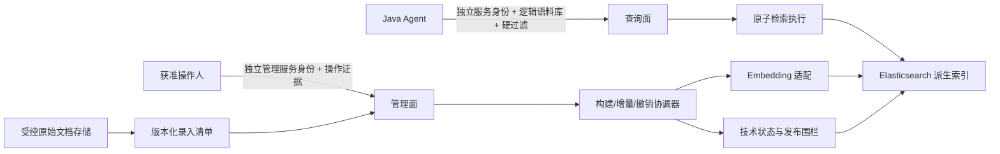

# 检索与索引基础设施 L1 架构设计

> 文档层级：L1 领域/模块架构  
> 文档状态：草稿 / 未评审 / 未实施 / 未生效  
> 当前版本：v1.0

## 1. 文档治理信息

| 项目 | 内容 |
|---|---|
| 文档标识 | `AGENT-RET-L1-001` |
| 权威范围 | 单体 Agent 的原子文档检索、受控文档录入、派生索引构建/发布/撤销、表示制品兼容和检索技术状态 |
| 文档状态 | 草稿 |
| 评审状态 | 未评审；本文的内部自评不构成正式评审 |
| 实施状态 | 未实施 |
| 生效状态 | 未生效 |
| 当前版本 | v1.0 |
| 上位文档 | [单体Agent智能体总体架构_L0_v1.0.md](./单体Agent智能体总体架构_L0_v1.0.md)（同批候选稿） |
| 同层文档 | [单体Agent应用与能力架构_L1_v1.0.md](./单体Agent应用与能力架构_L1_v1.0.md)（同批候选稿） |
| 适用基线 | v0.1 冻结提交 `417c140a38d0c32f27a644ac21b1df7f3d936909`（2026-07-17） |
| 维护责任人 | Dylan |
| 目标文档位置 | `docs/design/agent/检索与索引基础设施架构_L1_v1.0.md` |
| 替代关系 | 内容承接已评审通过的 v0.1；本轮三份 v1.0 正式评审通过前不替代 v0.1 基线 |

## 2. 版本迁移说明

| 项目 | 说明 |
|---|---|
| 来源文档 | [检索与索引基础设施架构_L1_v0.1.md](./检索与索引基础设施架构_L1_v0.1.md) |
| 来源 SHA-256 | `9BAF18C83CE94FFBDB20A3D18DEFC25D857FB1316F149386C4D923DE0783F93B` |
| 迁移原则 | 保留全部 `RET-G-*`、`RET-DEC-*`、L0 约束、检索/管理隔离、安全围栏、质量门禁和下位交付；不复制逐轮修订与关闭问题流水 |
| 表达调整 | 以“原子检索—权威文档源—派生索引—失败关闭—发布恢复—联合评价”为主阅读路径 |
| 语义变化 | 无；发现实质差异时必须回退或按架构变更重新评审 |

### 2.1 v1.0 修订历史

| 序号 | 日期 | 文档位置 | 修改内容 | 修改原因 |
|---:|---|---|---|---|
| 1 | 2026-07-17 | 全文 | 从冻结 v0.1 形成聚焦阅读的 v1.0 候选基线 | 突出检索基础设施的安全边界、技术权威和实施门禁 |

## 3. 阅读导引与核心结论

1. **检索服务不是业务 Agent**：它只提供原子候选和索引技术生命周期，不负责意图、融合、精排、上下文、答案或业务权限决策。
2. **调用方只见逻辑语义**：Java Agent 使用逻辑语料库与检索配置档，不指定物理索引、Alias 或裸 DSL。
3. **授权必须在召回前失败关闭**：检索域只执行 Java 给出的不可扩张硬过滤；缺失、非法、过期或无法表达时拒绝请求。
4. **文档源是权威，ES 是派生物**：原始存储和版本化录入清单拥有正文、稳定 ID、业务版本与资源属性权威；ES 可重建、可切换、可回滚。
5. **撤销先围栏、再物理收敛**：撤销/缩权只有在全局失败关闭围栏可见后才能确认成功，之后再异步清理物理索引。
6. **评价必须实际运行**：版本化固定包、静态自测和 Oracle 不能替代目标系统检索与联合质量报告。

## 4. 架构定位、范围与目标

### 4.1 范围与非目标

本域提供 BM25、Dense 和经证据门禁启用的 Sparse 原子通道；提供受控录入、增量/撤销、全量构建、Alias 发布/回滚、技术状态与对账恢复。

本域不负责：

- Agent 意图识别、跨路融合、业务排序、Reranker 编排、上下文、回答和引用；
- 用户/角色/RBAC、Agent 字段策略或最终业务授权组合；
- 文档主数据、任意 URL 抓取、通用内容管理或业务版本权威；
- Python 直连、裸 Elasticsearch DSL、任意物理索引 CRUD；
- LLM/Reranker 调用或以 Agent 的 `LLM_API_KEY` 配置证明 Embedding 目标可信。

### 4.2 架构目标

| ID | 目标 | 成功标准 |
|---|---|---|
| RET-G-01 | 提供稳定、受约束的原子候选检索 | Agent 可按通道调用并获得稳定候选标识、来源和诊断 |
| RET-G-02 | 保证授权过滤在召回前生效 | 缺失、非法或不可表达的硬过滤请求被拒绝，无默认放宽 |
| RET-G-03 | 建立可追踪的派生索引生命周期 | 线上 Alias 可追溯到业务快照、表示、Mapping 和构建证据 |
| RET-G-04 | 支持幂等增量、撤销与全量重建 | 重复操作无额外副作用，旧业务版本不能覆盖新版本 |
| RET-G-05 | 查询面与管理面安全隔离 | 普通 Agent 查询身份不能调用索引管理操作 |
| RET-G-06 | 与 Agent DOCUMENT 联合满足质量门禁 | 可分别定位召回、过滤、融合、重排和答案问题 |
| RET-G-07 | 支持安全切换、回滚和演进 | 新索引先校验后切换；不兼容契约/制品不接流量 |

## 5. 上位约束承接

### 5.1 L0 全局原则映射

| L0 ID | 本 L1 承接方式 |
|---|---|
| AD-01 | 旧 `es-*` 仅作实验/迁移证据，先隔离再选择性迁移 |
| AD-02 | 检索是独立基础设施服务，不形成新的业务 Agent |
| AD-03 | 本域以 Java `es-query-api` 为语义契约；Python 不直接调用 |
| AD-04 | 不持有 Agent 会话/任务/业务状态，仅持有可恢复技术状态 |
| AD-05 | Python 不直连检索、ES 或 Embedding，调用只能经 Java Agent |
| AD-06 | DOCUMENT 编排归 Agent，本域只提供原子检索与索引能力 |
| AD-07 | 不建设 `es-document-service`，目标责任收敛到 `es-query-service` |
| AD-08 | 不下沉 RBAC/字段策略，只执行调用方给出的不可扩张过滤 |
| AD-09 | 授权过滤在候选召回前成为硬过滤，后验检查不能替代 |
| AD-10 | 不建立跨 Agent、文档源、Embedding、ES 的分布式事务/全局锁 |
| AD-11 | 查询幂等可重入；管理写入以幂等键、版本和操作状态保证 |
| AD-12 | 技术状态若选关系库，必须受控 SQL 迁移，禁止启动自动改表 |
| AD-13 | 暴露日志、指标、追踪和审计端口，不绑定固定后端 |
| AD-14 | 不引入多 Agent、Agent 协同或 Agent 间消息协议 |
| AD-15 | ES 不是文档/业务版本权威；物理索引以 Alias 发布/回滚 |
| AD-16 | Embedding 输出和检索候选均是不可信技术输入，必须校验 |
| AD-17 | 最终授权由 Java 组合；本域不得推断或放宽 |
| AD-18 | 遵守 Java 的 deadline/cancellation；迟到结果不得影响 Agent 状态 |
| AD-19 | 查询/管理面分别声明版本、指纹、能力和 readiness |
| AD-20 | 查询/管理在契约、身份、入口和审计上隔离；管理面不是 Tool |
| AD-21 | 历史模型环境规则不适用 Embedding 目标，由 AD-22 的信任治理承接 |
| AD-22 | 本域不决定 Agent 模型目标/字段投影；Embedding 依数据分类使用获准表示目标 |
| AD-23 | 管理面只接受受控清单和可信身份；原始存储/清单权威，ES 派生 |
| AD-24 | 首期单一预配置逻辑语料库和统一策略；文档级 ACL 仅作受治理扩展 |

### 5.2 L0 决策落点

| L0 决策 | 本 L1 落点 |
|---|---|
| DEC-01 | 旧 `es-*` 不具目标权威，按阶段隔离迁移 |
| DEC-02 | 独立检索部署不等于新 Agent |
| DEC-03 | Python 无检索直连契约，Java Agent 为唯一 Agent 调用方 |
| DEC-04 | RET-DEC-02；只提供原子通道 |
| DEC-05 | Python 不直连 ES/Embedding/检索，Java Tool 发起查询 |
| DEC-06 | 本域不持有 Agent 状态，只持有技术状态 |
| DEC-07 | RET-DEC-12；若选关系库则受控 SQL 迁移 |
| DEC-08 | 标准遥测端口，不绑定厂商平台 |
| DEC-09 | 不设计多 Agent 检索协议 |
| DEC-10 | RET-DEC-04/17/19；执行最终硬过滤并失败关闭 |
| DEC-11 | 接收 deadline/cancellation 并限制资源 |
| DEC-12 | RET-DEC-11；版本、指纹、能力和 readiness |
| DEC-13 | RET-DEC-01/11；查询与管理面隔离 |
| DEC-14 | Runtime 凭据不得透传/复用；Java→检索使用独立服务身份 |
| DEC-15 | 历史环境隔离已被 DEC-16 替代，不作为 Embedding 准入证据 |
| DEC-16 | RET-DEC-15；表示目标按语料库数据分类和获准配置绑定 |
| DEC-17 | RET-DEC-05/18/19；受控文档源和首期语料库级权限 |

## 6. 目标架构、核心职责与责任边界

目标部署为单一 `es-query-service`，但查询面和管理面必须在契约、身份、网络入口、限流资源池和审计上隔离。

| 组件 | 唯一责任 | 明确禁止 |
|---|---|---|
| Query API | 类型化逻辑查询、预算、过滤、版本和诊断契约 | 裸 DSL、物理索引/Alias 参数、管理操作 |
| Retrieval Executor | BM25/Dense/可选 Sparse 单通道执行和候选规范化 | 跨路融合、业务精排、答案生成 |
| Candidate Safety Gate | 前置硬过滤、撤销围栏、输出安全校验 | 推断角色、放宽过滤、只做后验过滤 |
| Management API | 受控构建/增量/撤销/发布/回滚命令 | 任意 URL 摄取、普通 Agent 身份调用 |
| Source/Manifest Validator | 清单、原文对象版本/摘要、稳定 ID、业务版本和访问属性校验 | 成为新的正文/业务权威 |
| Index Lifecycle Coordinator | 构建、校验、Alias 切换、回滚和对账 | 将半成品索引直接上线 |
| Embedding Adapter | 按获准 representation profile 生成/校验向量 | 让调用方选择供应商或跨信任等级回退 |
| Technical State Store | 操作日志、水位、围栏、构建/发布状态的持久恢复 | 存储 Agent 会话或业务主数据 |

同层 Agent L1 拥有意图、最终硬过滤组合、多通道策略、融合、Reranker、上下文、回答、引用与拒答；本域只返回已授权候选、来源、版本和检索诊断。

## 7. 查询与管理契约

### 7.1 查询契约

调用方只提交逻辑 `corpusId`、版本化 `retrievalProfile`、原子 `channel`、类型化 query、不可扩张 `hardFilters`、候选上限、deadline/cancellation 和追踪信息。返回稳定 `documentId/chunkId`、来源/业务版本、受控片段或引用定位、通道分数、制品版本和诊断。

必须满足：

- `corpusId` 与 profile 均在服务端白名单解析，调用方不能选择物理索引、Alias、Embedding 供应商或任意脚本；
- 过滤字段、操作符、值类型和组合深度均为版本化白名单；缺失/未知/冲突/不可表达时失败关闭；
- 候选数、查询长度、过滤复杂度、超时和并发受预算限制；
- 未知语料库、无权限、撤销围栏不可确认、制品不兼容时不允许退回“无过滤查询”。

### 7.2 管理契约

管理面只接受获准操作人经独立服务身份脚本提交的版本化录入清单。命令至少绑定逻辑语料库、操作范围、幂等键、单调业务版本/快照、原文对象不可变版本与内容摘要、manifest 版本/摘要/签名或等效完整性证据、操作人审计证据。

允许的受控动作是构建、增量 upsert、撤销/缩权、校验、发布、回滚和对账；不暴露任意索引 CRUD、任意 URL 拉取或通用脚本执行。

### 7.3 版本、指纹与错误

查询面和管理面分别发布 `contractVersion`、`contractFingerprint`、`capabilities`、制品兼容范围和 readiness；不兼容实例不接流量。错误至少区分契约/过滤非法、未授权、围栏不可确认、制品不兼容、预算/限流、依赖失败、超时/取消与管理冲突。部分成功只适用于明确可重试的管理批次，不得把授权或完整性失败降级为成功。

## 8. 数据、制品与状态所有权

| 对象 | 权威拥有者 | 本域规则 |
|---|---|---|
| 原始正文及不可变对象版本 | 受控原始存储 | 只读校验/处理；不得以 ES 副本反向覆盖 |
| 稳定 ID、业务版本、批次/快照、首期访问属性 | 版本化录入清单 | 管理命令的权威输入；需完整性校验 |
| 身份、租户、角色/RBAC | `auth-service` | 不复制角色关系、不自主判权 |
| 最终硬过滤 | Java Agent | 本域校验并执行，只能拒绝或收紧，不能放宽 |
| 逻辑语料库/profile 配置 | 检索域受控配置 | 版本化并绑定获准表示目标/物理制品 |
| Chunk、向量、倒排项、物理索引 | 检索域派生制品 | 可重建，不是业务权威 |
| 操作日志、change watermark、撤销/发布围栏、构建状态 | 检索技术状态 | 必须持久、可恢复、可对账；物理存储由 L2 冻结 |
| Alias 当前指向 | 检索发布状态 | 只能指向校验通过且围栏满足的制品 |

制品兼容键至少覆盖 corpus snapshot、manifest、chunk policy、mapping、representation profile、Embedding 模型/维度/归一化、检索配置和契约版本。任何不兼容变化均创建新制品并重建，不得原地静默混用。

## 9. 核心流程与失败闭环

### 9.1 原子检索

1. 验证 Java 独立服务身份、契约版本、deadline 和逻辑语料库/profile。
2. 验证 hard filter 的类型、范围与可表达性，并检查撤销/缩权围栏水位。
3. 解析获准且兼容的物理制品，按单一通道执行前置过滤检索。
4. 校验候选身份、来源版本、过滤条件、大小和安全字段，返回受限候选与诊断。
5. 任一授权/围栏/兼容条件不确定则失败关闭，不切换无过滤或低信任制品。

### 9.2 增量、撤销与缩权

1. 管理面验证服务身份、操作人证据、manifest 完整性、幂等键和单调版本。
2. 增量 upsert 只接受高于当前业务版本的清单项；重复同版本同摘要返回幂等结果，冲突摘要拒绝。
3. 撤销/缩权先提交全局可见的失败关闭围栏和单调 change watermark。
4. 只有查询节点均能证明已观察到围栏后，管理操作才可报告安全成功；之后异步删除/更新物理索引并对账。
5. 未知状态、围栏传播超时或旧节点不可确认时保持失败关闭和待处置状态。

### 9.3 全量构建、发布与回滚

1. 从固定 manifest/snapshot 在新物理索引离线构建，生成完整制品清单和证据。
2. 校验数量、摘要、Mapping、向量维度、过滤可表达性、撤销水位、抽样检索和固定评价。
3. 满足 publish fence 后原子切换 Alias；发布状态和操作日志先后关系由单调版本约束。
4. 保留明确回滚窗口和旧制品；回滚不得越过已生效撤销/缩权围栏，也不得恢复不兼容制品。

### 9.4 恢复与对账

重启后从持久操作日志、构建/发布状态、change watermark 和围栏恢复，识别未完成操作并继续或人工处置；不得根据 ES 当前内容猜测业务权威。周期对账覆盖 manifest↔原文、manifest↔索引、Alias↔发布记录、围栏↔查询节点可见性和技术状态↔实际资源。

## 10. 核心架构机制

### 10.1 安全与不可信输入

- 查询面仅信任独立 Java 服务身份和已验证的类型化硬过滤；Runtime 的固定密钥/`capabilityId` 不得透传或复用。
- 管理面同时验证获准操作人和独立管理服务身份，并保存不可抵赖的操作认证证据。
- manifest、原文、Embedding 输出、检索候选和 ES 响应均按不可信输入处理，校验摘要、版本、维度、长度、数量、字符/内容安全和资源上限。
- 首期所有文档位于 `document-default`，统一 `internal`，不支持文档级差异 ACL；未来只允许通过联合版本化变更引入权限码匹配。

### 10.2 幂等、并发与顺序

- 查询读取幂等、可重入，重试不延长原 deadline。
- 管理操作以 `operationId/idempotencyKey + corpus + scope + businessVersion` 定位；同键异载荷冲突拒绝。
- 单调业务版本阻止旧写覆盖新写；持久 operation log 和 change watermark 支持恢复与审计。
- 发布 fence 防止新 Alias 在所需变更/撤销水位之前可见；撤销 fence 优先于物理数据收敛。

### 10.3 表示与索引兼容

Embedding 是本域内部依赖，representation profile 与 corpus 数据分类、目标信任等级、模型标识/摘要、维度、归一化和索引制品绑定。调用方不能选择供应商；失败时不得跨信任等级或不兼容维度回退。Sparse 默认关闭，仅在指定语料库实际评价证明收益且容量/运维成本可接受后启用。

### 10.4 性能、韧性与降级

查询/管理面使用独立连接池、并发、限流和熔断舱壁；分通道限制 topK、超时、查询/过滤复杂度和响应大小。服务遵守 Agent deadline/cancellation，迟到结果只记录诊断。允许的降级必须显式声明通道和质量影响；授权过滤、撤销围栏、制品兼容和管理身份不得降级。

### 10.5 可观测与审计

稳定输出 request/operation ID、主体/操作人摘要、语料库、profile、通道、过滤策略版本、物理制品版本、manifest/snapshot、Embedding 制品、change watermark、围栏、Alias、耗时、候选数、拒绝原因和终态。普通日志不记录凭据、完整敏感原文或越权候选。

## 11. 质量门禁与版本化评价

### 11.1 检索域验收

| 维度 | 必须验证 |
|---|---|
| 功能 | BM25/Dense 及获准 Sparse 的契约、稳定 ID、来源/版本和诊断 |
| 授权 | 前置硬过滤、缺失/非法过滤失败关闭、7个拒绝用例0候选 |
| 一致性 | 幂等、乱序、重复、冲突、撤销围栏、发布 fence、回滚不复活 |
| 兼容 | 契约、Mapping、chunk、Embedding/维度/profile 和混合版本 readiness |
| 恢复 | 构建/发布中断、节点重启、围栏传播失败、对账与人工处置 |
| 性能 | 分通道延迟/吞吐、峰值并发、容量、重建时长和资源保护 |

### 11.2 与 Agent 联合评价

[评价证据入口](./evidence/eb-l1-003/README.md)中的 `3.0.0-synthetic` 固定包提供 114 个语料块、30 个用例（20可回答、10应拒答），单一 `document-default` 语料库和统一 `internal` 分类，无文档级 ACL；可回答样本最小授权候选池56、至少55个干扰项。检索域需输出原子通道候选和诊断，Agent 再完成融合、精排、回答和引用，以分别定位问题。

联合门禁沿用 L0/Agent L1 的 Recall@50≥0.90、NDCG@10≥0.80、事实支持≥0.90、要点覆盖≥0.85、引用精确≥0.98、事实性主张引用覆盖≥0.90、应拒答召回≥0.95、错误拒答≤0.05、未授权泄漏=0；逐项通过。当前 `target_system_quality_run_executed=false`，固定包和自测只能证明评价工件可用，不能证明系统质量通过。

## 12. 核心架构决策

| ID | 决策 | 主要理由与约束 |
|---|---|---|
| RET-DEC-01 | 单一 `es-query-service` 提供隔离的查询面与管理面 | 减少服务数量，同时以身份、入口、资源池和审计维持边界 |
| RET-DEC-02 | 只提供原子检索通道，不实现融合和上下文 | 保持 Agent DOCUMENT 编排唯一权威 |
| RET-DEC-03 | 调用方使用逻辑语料库/profile，不指定物理索引或 Alias | 隔离物理演进和安全控制 |
| RET-DEC-04 | 授权过滤使用类型化白名单、召回前硬过滤和失败关闭 | 防止 DSL 注入与默认放宽 |
| RET-DEC-05 | 原始存储拥有正文权威，版本化 manifest 拥有稳定 ID、业务版本、对象版本/摘要、批次/快照和首期访问属性权威；ES 仅派生 | 保证可追踪、可重建且不产生第二业务权威 |
| RET-DEC-06 | 管理写入采用身份、范围、幂等键和单调业务版本 | 控制重试、乱序和冲突 |
| RET-DEC-07 | 撤销先建立失败关闭围栏，再收敛物理索引 | 消除最终一致窗口中的已撤销资源泄漏 |
| RET-DEC-08 | 全量构建在新索引校验后原子 Alias 切换并保留回滚窗口 | 防止半成品上线并支持快速回退 |
| RET-DEC-09 | Embedding 作为内部依赖并与索引制品绑定 | 隔离供应商/维度并保证兼容重建 |
| RET-DEC-10 | Sparse 默认关闭，按语料库经实际证据门禁启用 | 避免无收益的复杂度与容量成本 |
| RET-DEC-11 | 查询/管理契约分别发布版本、指纹、能力和 readiness | 阻断混合版本静默不兼容 |
| RET-DEC-12 | 技术状态必须持久可恢复，物理存储留给 L2 | 先冻结状态语义，再选择存储并补齐迁移恢复证据 |
| RET-DEC-13 | 不暴露裸 DSL、任意物理索引 CRUD 或任意来源 URL 拉取 | 防止平台穿透、越权和不可审计摄取 |
| RET-DEC-14 | 检索质量采用分层、版本化、目标系统实际运行评价 | 区分召回缺陷与 Agent 编排缺陷；静态自测不能替代实跑 |
| RET-DEC-15 | 每个语料库绑定获准 representation profile，不允许调用方选择供应商或跨信任回退 | 使数据分类、表示目标和索引制品一致 |
| RET-DEC-16 | 持久 operation log、单调 change watermark 和 publish fence 在 Alias 切换前生效 | 保证并发变更、发布和恢复顺序可证明 |
| RET-DEC-17 | 撤销/缩权仅在全局围栏可见后成功；未知状态失败关闭 | 关闭传播窗口和不确定节点带来的泄漏路径 |
| RET-DEC-18 | 管理写入需获准操作人、独立服务身份、不可伪造认证证据和不可变 source manifest | 保证录入来源、责任人和内容完整性可审计 |
| RET-DEC-19 | 首期单一语料库级权限、无文档级 ACL；未来使用权限码匹配 | 避免复制用户/角色关系，并为受治理扩展留边界 |

## 13. L2 下位交付与门禁

| L2 主题 | 主要覆盖 | 进入详细设计前必须具备 | 非责任 |
|---|---|---|---|
| 查询契约与原子通道 | RET-DEC-02/03/11 | 查询 Schema、预算、错误/部分成功、版本与诊断 | 融合、Reranker、答案 |
| 硬过滤与候选安全 | RET-DEC-04/07/17/19 | 过滤白名单、围栏可见性、失败关闭、输出校验 | RBAC/字段策略权威 |
| 文档源与索引管理契约 | RET-DEC-05/06/13/18 | manifest 字段/完整性、身份、幂等、版本、批次/对账 | 文档业务系统 |
| Chunk/Embedding/表示兼容 | RET-DEC-09/10/15 | 数据分类、获准 profile、模型摘要、维度、score 语义、Sparse 证据 | Agent 模型选择 |
| ES 索引构建与发布 | RET-DEC-08/16 | Mapping、构建校验、Alias/fence、回滚窗口 | 业务版本权威 |
| 技术状态、一致性与恢复 | RET-DEC-06/07/12/16/17 | 物理存储、并发、迁移 SQL、恢复/对账与人工处置 | Agent 状态 |
| 性能、容量与韧性 | RET-G-07 | 生产负载、SLO、HA、网络、重建目标和故障预算 | 以测试环境参数外推生产 |
| 可观测、安全审计与发布运维 | RET-DEC-11/13/18 | 身份载体/轮换、管理网络、审计保留、告警、发布清单 | Runtime Tool 身份设计 |
| 版本化评价与联合验收 | RET-DEC-10/14 | 固定包、实际运行入口、逐层指标、报告签名/版本 | 以 Oracle 代替目标系统 |

## 14. 演进、迁移、发布与回滚

1. 三份 v1.0 同批评审；在正式通过前继续以冻结 v0.1 为批准基线。
2. 先隔离旧 `es-*` 接口和物理资产，冻结查询/管理契约、身份、manifest 和技术状态，再选择性迁移可验证实现。
3. 首先上线查询/管理隔离、BM25/Dense、前置硬过滤、围栏、全量构建/发布；Sparse 仅在实际评价证明收益后按语料库启用。
4. 每次发布保留制品清单、构建证据、兼容矩阵、评价报告、Alias 前后指向和回滚窗口；回滚不能越过最新撤销水位。
5. Embedding 生产目标必须同时具备数据分类匹配、获准 profile、端点/网络、Serving 制品和运行证明；Agent 的本地 LLM 空 Key 校验与本域 Embedding 准入相互独立。

## 15. 风险与未关闭门禁

| 门禁 | 当前状态 | 影响与关闭条件 |
|---|---|---|
| 查询契约、预算、错误/部分成功 | 待冻结 | 阻断查询 L2；需与 Agent Tool 联合冻结 |
| 表示目标/profile/维度/score/Sparse | 待生产确认 | 阻断表示 L2 与索引制品冻结 |
| 撤销 SLO、审计保留、数据分级 | 待量化 | 阻断生产安全与运维验收 |
| 生产负载、容量、HA、网络与故障目标 | 待量化 | 阻断容量与灾备结论 |
| 技术状态物理存储/迁移 | 待选择 | 阻断状态 L2；若使用关系库须受控 SQL |
| 管理身份载体、注入、轮换与管理网络 | 待冻结 | 阻断管理面安全 L2 |
| 目标系统质量实跑 | 未完成 | 不阻断 DOCUMENT/安全 L2 评审，但阻断系统质量通过 |
| manifest 物理字段、签名/完整性、批次和对账 | 待冻结 | 阻断管理契约 L2 |
| 文档级 ACL | 首期不启用 | 启用前必须联合修订 L0、两份 L1、录入与查询契约并重建 |

## 16. 一致性与可追溯性

- `RET-G-01`～`RET-G-07` 均在目标、组件、机制或验收中落地。
- `AD-01`～`AD-24` 已在第 5.1 节逐项承接；`DEC-01`～`DEC-17` 已在第 5.2 节映射。
- `RET-DEC-01`～`RET-DEC-19` 均有责任落点、流程、L2 交付或显式门禁。
- 与 Agent L1 的边界以“原子候选/技术生命周期”和“业务编排/最终授权组合”分割；查询契约与评价需联合冻结，但责任不得合并。

## 17. 编写期内部自评

内部自评仅检查表达、完整性和与冻结 v0.1 的语义一致性，不改变“未评审”状态。

| 轮次 | 检查范围 | 发现 | 修复 | 结论 |
|---:|---|---|---|---|
| 1 | 结构、稳定 ID、权威边界、安全围栏、质量门禁、L2 可交付性 | 严格校验不能识别“核心职责、修订历史”；跨文档与评价证据入口不够直接 | 显式调整章节标题并增加可解析的上位、同层、来源和评价证据链接 | 已修复，进入第2轮 |
| 2 | 严格结构、RET-G/RET-DEC/上位追踪、查询/管理隔离、围栏与评价门禁 | 0错误0警告；RET-G-01～07、RET-DEC-01～19 与 v0.1 集合相等；AD-01～24、DEC-01～17 均可追踪；未发现 P0/P1/P2 | 无需进一步修复 | 内部自评通过；仍为未评审 |

## 18. 术语与技术边界

| 术语 | 定义 |
|---|---|
| 原子通道 | 单一 BM25、Dense 或获准 Sparse 检索，不含跨路融合与答案生成 |
| 录入清单（manifest） | 描述稳定 ID、业务版本、原文对象版本/摘要、批次/快照和访问属性的版本化权威输入 |
| change watermark | 表示管理变更全局顺序的单调水位 |
| 撤销围栏 | 在物理索引收敛前阻止已撤销/缩权资源被查询返回的失败关闭状态 |
| publish fence | Alias 切换前证明所需构建、变更和撤销水位已满足的发布条件 |
| representation profile | 与语料库数据分类及索引制品绑定的获准 Embedding/表示配置 |

技术选型边界：首期以 Elasticsearch 承载派生索引，以受控原始存储/manifest 作为权威输入；技术状态的具体数据库、Mapping、向量模型、维度、客户端框架、资源规格与部署拓扑由 L2 和生产方案冻结。
