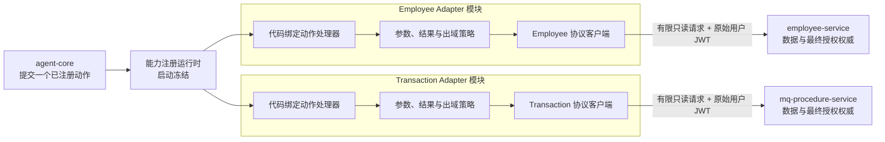
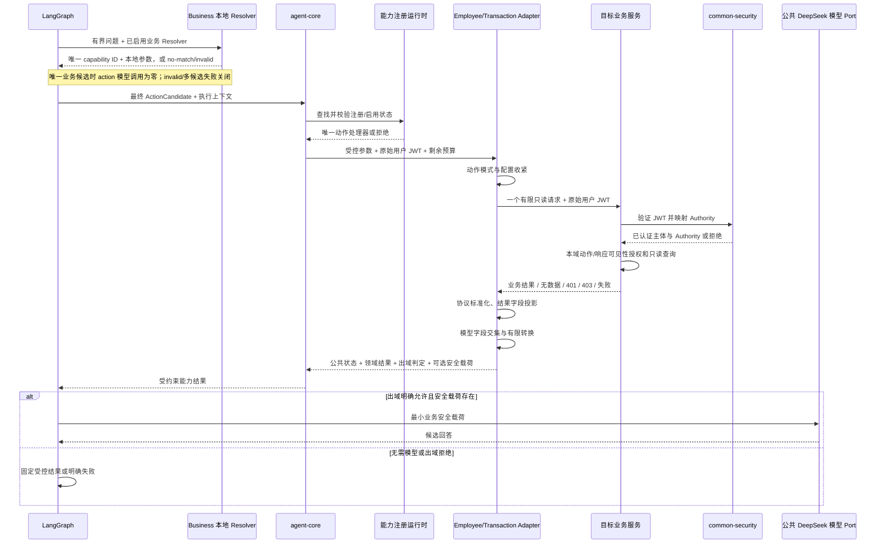

# [L1_02] 单体 Agent 业务查询适配架构 L1

> 文档层级：L1
> 文档状态：已评审

## 1. 文档治理信息

| 项目 | 内容 |
|---|---|
| 文档标识 | `SA-L1-BUSINESS-QUERY-001` |
| 文档编号 | `L1_02` |
| 文档层级 | L1 分域/模块架构 |
| 权威范围 | Employee/Transaction 查询能力描述、代码绑定有限动作、域内本地参数 Resolver、强类型动作配置、`agent-employee-adapter`、`agent-transaction-adapter`、用户 JWT 透传、业务服务最终授权协同、业务结果标准化、字段收紧、模型出域和权限联调边界 |
| 文档状态 | 已评审 |
| 评审状态 | 已通过 |
| 实施状态 | Business common 与 Employee/Transaction Python Adapter、共享 Authority Converter 及 Java Provider 已形成；Employee/Transaction 受控真实只读联调、两个本地参数 Resolver 及业务敏感问题非 live 零调用已验证；P4 的真实 Provider + 默认 stub 模型系统E2E已通过，两个业务域真实结果进入外部模型转为可选 Deferred 实验 |
| 生效状态 | 未生效 |
| 当前版本 | v0.5 |
| 适用基线 | [`REQ_00`](../REQ_00_SINGLE_AGENT_QUERY_REQUIREMENTS.md) v1.3；[`L0_00`](L0_00_SINGLE_AGENT_ARCHITECTURE.md) v0.13（`SA-GATE-001` 已关闭）；[`L1_00`](L1_00_SINGLE_AGENT_CORE_RUNTIME_ARCHITECTURE.md) v0.8；[`L1_01`](L1_01_SINGLE_AGENT_KNOWLEDGE_QUERY_ARCHITECTURE.md) v0.7 |
| 维护责任人 | 项目维护者（个人开发者，姓名未在需求中指定） |
| 目标文档位置 | `docs/design/L1_02_SINGLE_AGENT_BUSINESS_QUERY_ADAPTER_ARCHITECTURE.md` |
| 上位 L0 | [`L0_00`《单体 Agent 查询能力 L0 总体架构设计》](L0_00_SINGLE_AGENT_ARCHITECTURE.md) v0.13 |
| 关联 L1 | [`L1_00`《单体 Agent 核心与运行架构 L1》](L1_00_SINGLE_AGENT_CORE_RUNTIME_ARCHITECTURE.md) v0.8；[`L1_01`《单体 Agent 知识查询能力架构 L1》](L1_01_SINGLE_AGENT_KNOWLEDGE_QUERY_ARCHITECTURE.md) v0.7 |
| 治理的 L2 | `L2_02_00` 业务查询公共约束、配置与出域（v0.57 Approved）；`L2_02_01` Employee Adapter 与业务授权联调（v0.51 Approved）；`L2_02_02` Transaction Adapter 与业务授权联调（v0.25 Approved）；三份 L2 的完整修改/评审流水已迁移到各自只读历史审计附件 |
| 外部契约 | L1_00 能力执行、执行上下文与模型端口语义；`auth-service` 用户 JWT 契约；`common-security` 角色映射契约；`employee-service`、`mq-procedure-service` 公开只读查询契约 |
| 替代关系 | 新建基线；现有业务接口、历史 Agent/Adapter 代码和实现配置只作为现状与迁移输入，不自动成为目标架构 |

> 本文是 P2 第三份 L1 架构基线。v0.5 不改变域内 Resolver、Adapter、Provider、授权、字段或金额契约；仅将“真实业务查询闭环”和“真实业务结果进入外部模型的可选实验”解耦。Employee/Transaction 的 scoped `SA-GATE-006` 继续失败关闭真实外发，但不再阻塞使用默认 stub 模型的系统 E2E。

## 2. 修订历史

| 序号 | 日期 | 文档位置 | 修改内容 | 修改原因 |
|---:|---|---|---|---|
| 1 | 2026-07-25 | 全文 | 创建单体 Agent 业务查询适配 L1 草稿，落实 Employee/Transaction 独立 Adapter、有限动作、强类型配置、JWT 透传、业务最终授权、结果/模型载荷隔离、字段出域和三份 L2 分解 | 承接 REQ_00、L0_00、L1_00 和 L1_01，形成可正式评审的业务查询下位设计基线 |
| 2 | 2026-07-25 | 4.3、10.1、11、13～14、18.2 | 作者第 1 轮自审修复：补入业务查询原始问题进入 DeepSeek 的 `CR-GATE-003` 继承边界，并明确公共模型输入治理与业务敏感输入约束的协作关系 | 防止只控制业务结果出域而遗漏问题中身份证号、交易号等敏感输入；作者自审不改变未评审状态 |
| 3 | 2026-07-25 | 5.7 | 作者第 2 轮自审修复：补充当前状态、目标状态、差距、处理阶段和控制门禁的集中映射 | 使三份 L2 能直接承接现状差距，避免把候选接口或角色配置误写为已满足目标；作者自审不改变未评审状态 |
| 4 | 2026-07-25 | 4.2 | 作者第 3 轮自审修复：将组合缩写的上位架构决策 ID 改为完整逐项 ID | 消除确定性追踪工具对 `SA-AD-011/012/015` 等写法的假缺失；不改变决策语义和未评审状态 |
| 5 | 2026-07-25 | 3、5～7、9～11、13～16、18 | 第 1 轮正式评审修复：将业务服务最终授权从角色/接口允许扩展为动作及响应数据可见性契约，明确 Adapter 的用户/模型投影只能二次收紧，不能替代业务域授权 | 关闭 `REV-BQ-001`（S1），防止宽响应接口把未经业务域授权的数据交给 Adapter 后再以字段投影伪装为授权闭环 |
| 6 | 2026-07-25 | 5～7、9～13 | 第 2 轮正式评审修复：增加动作最小有效用户结果语义，禁止配置删除必需结果字段，并规定字段投影不得制造 `no_result` 或空成功 | 关闭 `REV-BQ-002`（S1），避免已存在记录在投影后被误报无数据，或缺少关键字段的响应被包装成成功 |
| 7 | 2026-07-25 | 3、5～7、10、12～16 | 第 3 轮正式评审修复：收回业务查询 L2 对统一角色映射提供方契约的隐含所有权，限定其只定义消费语义、差距与联调证据；共享安全组件变更须由外部权威另行承接和授权 | 关闭 `REV-BQ-003`（S1），防止 Adapter 详细设计越权定义或修改 `auth-service`/`common-security` 的公共安全契约 |
| 8 | 2026-07-25 | 5.1 | 第 4 轮正式评审修复：按当前只读代码证据校正 `dylan` 的种子角色事实，区分已一致的用户角色分配与仍未闭环的 Authority 规范/有效配置验证 | 关闭 `REV-BQ-004`（S2），避免 L2 设计无效的用户角色迁移，同时保留真实安全缺口和失败关闭门禁 |
| 9 | 2026-07-25 | 5～7、9～13、16～17 | 第 5 轮正式评审修复：将业务文本固定为模型不可执行的数据，增加模型安全载荷到最终回答事实的追踪约束；同时明确有限转换由代码实现、配置只能选择已声明枚举并收紧 | 关闭 `REV-BQ-005`（S1）和 `REV-BQ-006`（S2），防止业务字段中的指令性文本影响模型控制语义、模型补造业务事实或配置演化为转换脚本 |
| 10 | 2026-07-25 | 1、14.1～14.2、17.3、18.2 | 记录五轮正式评审通过，将文档更新为 v0.2 已评审/已通过并关闭 `BQ-GATE-001` | 形成可供三份业务查询 L2 编写的治理基线；不改变未实施、未生效及其余门禁开放状态 |
| 11 | 2026-07-31 | 文档治理信息、权威关系 | 原子同步 `REQ_00` v1.3、`L0_00` v0.5 与 `L1_01` v0.3 当前引用，并核对 Knowledge 两级映射不影响业务查询适配边界 | 保持本文 v0.2 架构决策和 `BQ-GATE-001` 结论；Employee/Transaction 的动作、授权、字段和出域仍仅由本文及其下位 L2 治理 |
| 12 | 2026-07-31 | 文档治理信息 | 原子同步 `L2_02_00/01/02` 当前 v0.3/v0.3/v0.2 Approved 状态 | 保持 L1→L2 当前状态可追踪；不改变本文 v0.2 架构语义、`BQ-GATE-001` 或任何实施/Provider/真实集成/出域门禁 |
| 13 | 2026-08-01 | 文档治理信息 | 原子同步 `L2_02_00` v0.4 与 `L2_02_02` v0.3 精确十进制修订状态 | 两份 L2 进入 In Review；`L2_02_01` 保持历史 Approved 但待兼容性复核；不改变本文 v0.2 架构语义、动作所有权、`BQ-GATE-001` 或任何实施/集成门禁 |
| 14 | 2026-08-01 | 文档治理信息 | 原子同步 `L2_02_00/01/02` 最终评审及兼容性检查状态 | 三份 L2 均为 Approved；公共与 Transaction 两轮复评、Employee GET/no-body 和 Core JSON 定向检查均通过；不重新评审或改变本文 v0.2 架构语义、`BQ-GATE-001` 及任何实施/Provider/真实集成/出域门禁 |
| 15 | 2026-08-01 | 文档治理、P3/P4 状态与 18.2 | 原子同步 Business common、Employee/Transaction Python fake Adapter 的实现、测试和代码对照设计评审证据，将三个 `BQ-GATE-002` 实例按本地切片关闭 | 保持 v0.2 架构决策不变；Java Provider、真实 JWT/业务授权、真实数据出域与生产生效门禁继续 Open |
| 16 | 2026-08-03 | 文档治理、P3/P4 状态与 18.2 | 原子同步 `L2_02_02` v0.6、`P3_00` v0.8 及 Transaction Java Provider 本地候选、共享 Authority 和 MySQL `DECIMAL(50,2)` 契约验证证据 | 保持 v0.2 架构决策不变；Transaction 真实 JWT/业务数据/出域与生产生效门禁继续 Open，Employee Provider 状态未在本次重新评定 |
| 17 | 2026-08-03 | 文档治理、5.1、6.4、15～16、18.2 | 原子同步 `L2_00_03` v0.2、共享 Converter 设计状态及 Employee Provider 当前候选事实 | 不改变业务服务最终授权/可见性权威；Employee 候选仍待独立复核，共享实现关闭与两域真实 JWT/数据/出域门禁保持 Open |
| 18 | 2026-08-06 | 文档治理、Transaction 当前事实、P4 门禁、追踪、外部前提与 18.2 | 基于 `wp-txn-real-01-20260806T134518Z.json` 及独立代码对照设计复核，同步 `transaction.search` 真实角色、精确金额、可见性、禁止接口和日志证据，关闭 `SA-GATE-005` | 保持 v0.2 架构边界；只允许受控目标配置启用 Transaction 只读动作，`CR-GATE-003/SA-GATE-006`、默认启用、模型出域和生产生效保持 Open |
| 19 | 2026-08-07 | 3～18 章 | 为两个业务动作增加代码绑定本地参数 Resolver 责任，明确有限语法、歧义失败关闭、模型零调用和既有 validator 二次校验 | 承接 L0 v0.6 `SA-C-022/SA-AD-016` 与 L1_00 v0.3 `CR-AD-009`，避免模型生成敏感业务执行参数 |
| 20 | 2026-08-12 | 文档治理、5.7、14.2、18.2 及 P3 | 原子同步 Employee/Transaction 敏感类别、未知问题、selector/answer 零调用的非 live 验证 | 关闭 `CR-GATE-003/GATE-023/GATE-025` 的问题输入安全前置；不授权真实业务结果出域、默认 action 或生产生效 |
| 21 | 2026-08-20 | 文档治理、12、14、16、18.2 | 将 P4 系统闭环与真实业务结果外部模型实验解耦，按 Employee/Transaction 分域保留出域安全门禁，并同步三份 L2 与 P3 当前基线 | 修复执行许可、验收门禁和工作包状态混用造成的长期阻断；保持真实业务数据默认不出域及全部历史证据不可变 |
| 22 | 2026-08-20 | 文档治理、实施状态与P3证据 | 原子同步真实Employee/Transaction Provider + 默认stub的Spring→Runtime系统E2E完成证据 | 不关闭scoped真实结果出域门禁，不改变Adapter、Provider、字段、金额、角色或公共契约 |
| 23 | 2026-08-20 | Authority状态、可选实验门禁与设计权威边界 | 同步`AUTH-GATE-002`组合式关闭，移除已退役`GATE-024/026/061`作为当前执行入口的残留表述，并明确历史运行资产仅为审计证据 | 消除正文与当前结论冲突；不关闭业务结果外发门禁，不修改Adapter、Provider、字段、金额或历史资产 |
| 24 | 2026-08-20 | 文档治理信息 | 原子同步三份 Business L2 物理瘦身后的 v0.57/v0.51/v0.25 版本及历史审计边界 | 只同步下位文档引用；不改变本文 v0.5 架构语义、评审状态、业务边界或门禁结论 |

## 3. 文档定位与权威关系

### 3.1 架构目标

本文将 L0 已确认的业务查询边界落实为可继续详细设计的模块架构，重点解决：

1. Employee 与 Transaction 如何作为相互隔离的有限只读查询能力接入统一能力注册入口。
2. 业务 Adapter、Agent 核心、`auth-service`、`common-security` 和业务服务分别拥有什么责任。
3. Employee/Transaction 本地 Resolver 如何从有限、明确的用户表述形成候选参数，并由既有强类型 validator 再约束为最小查询。
4. 用户 JWT 如何原样透传，并由目标业务服务执行最终角色授权。
5. 业务响应、本地领域结果和外部模型安全载荷如何分离并失败关闭。
6. 现有业务接口不足时，如何先记录差距并取得确认，而不是由 Adapter 或配置模拟新契约。

### 3.2 权威关系

```text
REQ_00 已确认需求
  → L0_00 单体 Agent 总体架构
      → L1_00 核心与运行：能力执行、注册、执行上下文、公共状态与模型端口
      → L1_01 Knowledge：知识查询、检索与知识证据出域
      → 本文 L1_02 业务查询适配
          → L2_02_00 业务查询公共约束、配置与出域
          → L2_02_01 Employee Adapter 与业务授权联调
          → L2_02_02 Transaction Adapter 与业务授权联调
```

- L0 对单逻辑 Agent、单动作、业务域数据所有权、业务服务最终授权、有限动作和默认拒绝出域具有上位权威。
- L1_00 对能力执行、注册、原始用户 JWT 执行上下文、公共结果状态和公共 DeepSeek 模型端口具有同层公共权威。
- 本文唯一拥有 Employee/Transaction Agent 侧适配、动作收紧、结果视图和业务字段出域语义，不得反向修改 L1_00 的通用运行契约。
- `auth-service` 是用户与角色分配及角色声明签发权威；`common-security` 是统一角色到 Authority 的转换边界；业务服务是本域数据、动作授权和响应数据可见性的最终权威。
- 本文及其 L2 只定义业务查询对上述安全契约的消费前提、失败语义和联调证据，不取得 `auth-service`、`common-security` 的内部实现或公共契约所有权。
- 业务服务现有公开接口是待核实外部契约，不因接口存在而自动成为 Agent 可注册动作。
- L2 可以固化动作 ID、字段、DTO、配置键、角色矩阵、接口映射、转换枚举和测试，但不得扩大本文、上位文档或业务服务的能力与授权范围。

### 3.3 本文唯一负责

- Employee 与 Transaction 两个独立 Adapter 模块的职责、依赖方向和禁止边界。
- 每个业务域、每个动作的代码绑定、启停、参数收紧、结果字段和模型出域约束。
- 业务动作描述提交统一能力注册入口的语义，以及一个请求至多执行一个业务动作的边界。
- 原始用户 JWT 从执行上下文到目标业务服务的透传语义和服务身份回退禁令。
- 业务服务对具体动作及其响应数据范围执行最终授权，Adapter 只在已授权响应上继续收紧的协作边界。
- 业务响应到统一领域结果、出域判定和可选模型安全载荷的转换边界。
- 业务字段默认拒绝、有限转换和模型调用前执行的架构语义。
- Employee/Transaction 的错误归一化、最小观测、契约演进、L2 分解和真实集成门禁。

### 3.4 本文明确不负责

| 非职责内容 | 唯一负责方 | 本文使用方式 |
|---|---|---|
| Spring 接入、LangGraph 图、能力注册运行时、单动作闸门、公共状态和请求总预算 | L1_00 及其 L2 | 消费执行上下文、能力 API、注册入口和公共状态，不建立第二套核心 |
| 问题改写、多知识域、多路召回、知识证据和知识出域 | L1_01 及其 L2 | 与业务动作相互隔离，不复用其知识域或检索配置 |
| 用户与角色分配、JWT 签发 | `auth-service` | 消费签名后的用户 JWT，不修改主体或角色声明 |
| `role` 到 Spring Security Authority 的统一映射 | `common-security` | 只声明业务查询所需消费语义、差距和联调前提；不在 Python Adapter 复制解析规则，也不由本文 L2 定义提供方内部实现 |
| Employee 数据、业务规则、动作授权和响应数据可见性 | `employee-service` | 通过确认后的有限只读公开契约查询并保留最终授权结果 |
| Transaction 数据、业务规则、动作授权和响应数据可见性 | `mq-procedure-service` | 通过确认后的有限只读公开契约查询并保留最终授权结果 |
| 业务服务内部选择数据库、Elasticsearch 或其他存储 | 对应业务服务 | 只消费公开契约，不直接访问任何业务存储或业务域 ES |
| 完整 DTO、字段清单、接口路径绑定、转换枚举、配置键和测试矩阵 | 本文治理的 L2 或外部契约 | 本文只定义语义、所有权、禁止项和验证类别 |
| 新增或修改业务服务公开接口 | 对应业务服务及单独授权 | L2 可以记录差距和建议契约；未获确认不得设计成既定事实或实施 |
| 聚合、写入、更新、删除、审批、业务提交、工作流、跨域查询和 Multi-Agent | 未来重新立项 | 本期不注册、不调用，也不预留动态执行通道 |

### 3.5 适用范围与简化原则

本文适用于个人学习和技术验证环境中的 Employee、Transaction 两个只读业务域。两个 Adapter 随 Python `agent-runtime` 同进程部署，不新增 Java Agent 代理服务、通用动态 HTTP Adapter、权限中心、规则引擎、字段策略平台或独立 Adapter 微服务。个人项目的简化不弱化用户身份、业务最终授权、只读边界、配置只收紧、默认拒绝出域、契约测试和失败关闭。

## 4. 上位约束映射

### 4.1 L0 约束逐项映射

| L0 约束 ID | 本文落实方式 | 本文章节 | 下位验证证据 | 偏差/说明 |
|---|---|---|---|---|
| `SA-C-001` | 两个业务 Adapter 是同一 Python 运行时内的能力模块，不建立第二 Agent、第二图或独立服务 | 5、6、10 | 部署清单、依赖扫描 | 无 |
| `SA-C-002` | 每个请求只允许执行一个代码绑定且已启用的 Employee 或 Transaction 动作，不在 Adapter 内扩展为第二动作 | 6、7、9 | 单动作、第二动作和跨域拒绝测试 | 无 |
| `SA-C-003` | Adapter 只调用业务服务公开契约，不依赖业务数据库、Mapper、ES 客户端或 `es-query-service` | 5、6、7、10 | 依赖扫描、调用目标测试 | 无 |
| `SA-C-004` | Adapter 不解析角色作最终授权；原始用户 JWT 透传后由目标业务服务校验用户类型和本域角色 | 7、9、10 | `401/403`、角色允许/拒绝和无 Adapter 白名单测试 | 无 |
| `SA-C-005` | 动作、参数、排序、过滤和结果使用均经过确定性边界校验，模型输出不直接成为业务请求 | 6、7、9 | 非法动作、越界参数和动态 URL 拒绝测试 | 无 |
| `SA-C-006` | 处理器和请求/响应类型由代码与业务契约绑定；强类型配置只能启停或收紧条件、分页、结果和模型字段 | 6、7、10 | 启动校验、越界配置和契约测试 | 无 |
| `SA-C-007` | 缺少原始用户 JWT 时业务下游调用为零；客户端不得回退服务令牌或固定高权限身份 | 7、9、10 | 无 JWT、服务身份回退和原令牌透传测试 | 无 |
| `SA-C-008` | Adapter 不保存业务数据、角色、长期会话或跨请求查询结果 | 8、10 | 存储依赖扫描、重启测试 | 无 |
| `SA-C-009` | 无结果、权限拒绝、参数错误、超时、契约失败和不完整响应不得转化为肯定业务事实 | 7、9、11 | 故障注入和回答断言 | 无 |
| `SA-C-010` | 新业务域通过新处理器/Adapter、配置和组合根注册，不修改核心或现有 Adapter 的业务实现 | 6、10、12 | 模拟业务域扩展和依赖扫描 | 无 |
| `SA-C-011` | 日志不记录完整 JWT、账户标识、敏感字段值、完整业务响应或模型载荷 | 10、11 | 日志脱敏断言 | 无 |
| `SA-C-012` | 业务公共契约不兼容变化必须同步 Adapter 代码、配置和契约测试，不能只改配置模拟兼容 | 7、10、14 | 提供方/消费方契约测试 | 无 |
| `SA-C-013` | 聚合、写入、更新、删除、消息提交和索引管理入口不能注册、映射或作为降级调用 | 5、6、7、11 | 注册表、客户端路由和禁止接口零调用测试 | 无 |
| `SA-C-014` | 业务服务协议和客户端位于 Adapter 内，外部协议不进入公共能力 API | 6、7、10 | 依赖方向和客户端替身测试 | 无 |
| `SA-C-015` | 专属于 Knowledge 四项能力分层 | — | — | 不适用；本文不实现知识查询阶段 |
| `SA-C-016` | 专属于逻辑知识域和 ES 边界 | — | — | 不适用；业务域只通过业务服务公开契约查询 |
| `SA-C-017` | 专属于 `es-query-service` Knowledge 检索原子能力 | — | — | 不适用；业务服务是否内部使用 ES 不改变本文依赖 |
| `SA-C-018` | 专属于知识证据支撑的答案约束 | — | — | 不适用；业务查询的等价事实约束由 `SA-C-009/020` 落实 |
| `SA-C-019` | Adapter 只执行 LangGraph/核心已提交的一个动作，不拥有动作选择、图推进、跨动作重试、降级或终止权威 | 6、9、10 | 调用链、单动作和双重编排拒绝测试 | 无 |
| `SA-C-020` | 模型字段默认拒绝；安全载荷不得超过业务授权响应、代码声明结果字段、动作结果配置和模型出域配置的交集，有限转换在模型调用前执行 | 7、9、10、11 | 字段交集、未知字段、转换失败和模型零调用测试 | 无 |
| `SA-C-021` | 专属于知识证据三层出域 | — | — | 不适用；业务字段出域由 `SA-C-020` 独立治理 |
| `SA-C-022` | 每个需要执行参数的业务动作随其代码绑定定义提供本地 Resolver；解析阶段外部模型零调用；重复、冲突、缺失或未声明条件失败关闭，最终候选仍经公共与域 validator | 6、7、9、10 | Resolver 唯一性、有限语法、歧义、模型零调用和二次校验测试 | 无 |

### 4.2 L0 关键架构决策承接

| L0 决策 | 本文承接方式 | 本地决策/章节 | 偏差 |
|---|---|---|---|
| `SA-AD-001`、`SA-AD-013` 一个逻辑 Agent、LangGraph 唯一编排 | Adapter 随 `agent-runtime` 部署，只处理核心提交的动作，不取得图状态 | `BQ-AD-001`；5、6、9 | 无 |
| `SA-AD-002`、`SA-AD-003` 统一能力 API、每请求至多一个动作 | 每个业务动作作为代码绑定注册项，通过同一执行契约执行 | `BQ-AD-002`；6、7、9 | 无 |
| `SA-AD-004` Employee/Transaction 独立 Adapter | 两个域独立配置、客户端、结果映射和测试，不合并为动态 Adapter | `BQ-AD-001`；6 | 无 |
| `SA-AD-005`、`SA-AD-014` 动作代码绑定、既有只读接口为上限、强类型配置只收紧 | 动作目录由代码和已确认契约定义，配置不能增加接口、参数、字段或授权 | `BQ-AD-003/004`；6、7 | 无 |
| `SA-AD-006` 业务服务最终角色授权 | Agent 只认证并透传原始 JWT；业务服务执行 `admin`、`viewer` 等本域角色规则 | `BQ-AD-005`；7、9、10 | 无 |
| `SA-AD-007` DeepSeek 经公共模型端口 | Adapter 只产生独立出域判定和最小安全载荷，不依赖供应商协议 | `BQ-AD-006/007`；7、9 | 无 |
| `SA-AD-008` 三份 L1 | 本文只治理业务查询适配，并分解为三份最小 L2 | `BQ-AD-009`；3、13 | 无 |
| `SA-AD-009` 不持久化会话或业务数据 | Adapter 结果和字段判定只在当前请求内存在 | 8、10 | 无 |
| `SA-AD-010` 现有基础设施按需复用 | 服务发现或直连由环境配置决定，但认证、超时和契约语义相同 | 7、10 | 无 |
| `SA-AD-011`、`SA-AD-012`、`SA-AD-015` Knowledge 服务、知识能力分层和知识出域 | 本文不治理 Knowledge，保持同层隔离 | 3.4、15 | 不适用 |

### 4.3 与 L1_00 的公共契约对齐

| L1_00 公共边界 | 本文消费方式 | 本文不得改变 |
|---|---|---|
| 能力执行契约 | 每个代码绑定业务动作处理器接收受控请求和执行上下文，返回公共状态、领域结果、出域判定和可选模型安全载荷 | 动作选择、单动作闸门和公共状态集合 |
| 能力注册运行时 | 两个 Adapter 在启动期提交本域已启用动作描述和处理器 | 注册表所有权、冻结时机和动态加载禁令 |
| 请求身份和预算 | 使用原始用户 JWT、关联标识、截止时间和取消信号 | Spring 入口认证、总超时所有权和服务身份禁令 |
| 用户问题外部模型输入闸门 | 向 L1_00 提供业务敏感输入类别与负向场景，消费其最小化、允许/拒绝和零调用结果 | 全局问题输入策略、DeepSeek Provider 和 `CR-GATE-003` |
| 领域结果与模型载荷隔离 | Adapter 分别构造受控业务结果、出域决定和安全载荷 | 核心不得从领域结果自行扩大模型载荷 |
| 公共 DeepSeek 模型 Port | LangGraph 只在本文明确允许且安全载荷存在时生成业务回答 | 提供方协议、通用输入闸门和供应商重试边界 |
| 组合根 | 装配每个动作处理器、Adapter 客户端和配置快照 | 不在运行期动态装载、替换或修改动作 |

### 4.4 与 L1_01 的同层隔离

- 业务域 `employee`、`transaction` 不属于逻辑知识域，不能进入 Knowledge 域目录或检索映射。
- 业务 Adapter 不调用 `es-query-service`；业务服务内部是否使用 ES 是业务域实现选择。
- 业务结果出域使用字段交集和有限转换，不复用知识文档三层策略。
- Knowledge 的多域、多路召回不能被业务 Adapter 作为跨域查询或聚合捷径。

## 5. 背景、现状与目标

### 5.1 已核实现状

| 事实 ID | 当前事实 | 架构含义 |
|---|---|---|
| `BQ-FACT-001` | 当前工作区不存在目标 `agent-employee-adapter`、`agent-transaction-adapter` 或对应新 Agent 能力实现 | 本文是新架构，不以历史 Agent 代码为目标基线 |
| `BQ-FACT-002` | `employee-service` 当前存在分页、详情、数量等基础读取入口；公开 `Employee` 模型包含身份证、联系方式、地址、银行账户、亲属等大量敏感字段 | 接口可读不等于适合直接暴露给 Agent；最终动作与结果字段必须按最小范围确认 |
| `BQ-FACT-003` | Employee ES 搜索/向量搜索入口由 `employee-service` 内部调用 `es-query-service`，但当前搜索请求可表达聚合、宽字段条件，响应为原始 ES JSON；同一控制器还存在写入、删除、批量和重建入口 | 业务 Adapter 只能调用确认后的 Employee 只读动作，不能透传通用搜索结构或接触管理入口 |
| `BQ-FACT-004` | `mq-procedure-service` 当前存在详情、条件、列表和分页搜索入口；分页搜索具备条件、分页、排序和总数语义，同时同一控制器还存在聚合、创建、更新、删除和消息提交入口 | 已确认只注册 `transaction.search` 并映射 `POST /txn/search`；其他查询、聚合、写入和消息入口保持不可达 |
| `BQ-FACT-005` | Transaction search 已使用统一 Authority、endpoint-scoped security 与动作 guard，并通过真实允许/拒绝矩阵；相邻入口不因该闭环自动获准 | `SA-GATE-005` 仅按 `transaction.search` 受控真实联调范围关闭，不扩大 Employee 或其他 Transaction 入口 |
| `BQ-FACT-006` | `auth-service` 在 JWT `role` claim 中签发角色集合；`common-security` v0.3 已形成统一严格 `role` → `ROLE_ADMIN/ROLE_VIEWER` Converter、具名 Bean 与 Servlet/Reactive opt-in，并完成限定实现及组合式真实 JWT 验证 | 角色标准化由共享组件单一拥有；目标部署/生产生效仍由 `AUTH-GATE-003` 控制，Adapter 不复制映射 |
| `BQ-FACT-007` | L0 已确认 Employee/Transaction 首批共同允许语义角色为 `admin`、`viewer`，`dylan` 通过 `admin` 访问；Employee/Transaction 受控联调已使用 auth-service 实际签发的 admin/dylan/viewer_t JWT 验证允许/拒绝矩阵 | 不设计 `dylan` 用户角色迁移或 Adapter 用户特例；限定联调证据不等于默认/生产配置生效 |
| `BQ-FACT-008` | 通用 Java Feign 令牌转发在缺少用户 JWT 时可以回退服务令牌 | 新业务 Adapter 的用户查询客户端必须显式禁止此行为；无用户 JWT 时下游调用为零 |
| `BQ-FACT-009` | 现有 Employee/Transaction 查询的无结果、参数错误、响应字段和错误载荷并未形成统一 Agent 契约 | Adapter 需要类型化映射；最终映射须由 L2 和契约测试确认，不能依赖模型解释原始响应 |

以上事实是 2026-07-25 的代码快照，不是最终动作清单、角色契约或运行有效性证据。业务服务未来实现变化不得反向扩大本文的只读、有限动作、最终授权和出域边界。

### 5.2 核心问题

- 业务服务公开能力大于 Agent 本期允许范围，若按控制器或通用 DTO 暴露会使模型触达聚合、写入或宽查询。
- Employee 响应包含大量敏感字段，业务授权成功不代表全部字段可进入 Agent 回答或外部模型。
- 角色声明、统一 Authority 映射、业务方法守卫、响应可见性和受控真实 JWT 矩阵已按限定范围闭环；Adapter 若自行判断角色仍会复制并分裂权限权威，默认/生产生效仍须独立治理。
- 现有接口的无结果、错误和分页语义不一致，模型无法可靠地区分业务无数据与调用失败。
- 若使用一个通用动态 HTTP Adapter，将重新引入动态 URL、字段映射和跨域耦合。

### 5.3 目标逻辑架构



- Employee、Transaction 作为两个独立代码和配置边界，不能由域名参数驱动同一个动态 Adapter。
- 每个已确认动作是一个代码绑定注册项；需要执行参数的业务动作同时绑定一个本地 Resolver。模型只可看到稳定能力 ID 与必要描述，不能看到或生成业务执行参数。
- 本地 Resolver 只执行纯文本有限语法识别与字段抽取，不访问网络、JWT、角色或业务数据，也不记录问题/参数正文；Adapter 在调用前继续校验最终动作参数和配置边界，在调用后校验协议、结果字段和出域条件。
- 业务服务重新验证 JWT，并基于统一 Authority 执行本域最终授权。
- Adapter 返回的领域结果与模型安全载荷分离；是否允许本地显示某字段不自动等于允许发送 DeepSeek。

### 5.4 现有接口候选与确认边界

| 业务域 | 当前只读候选事实 | 主要差距 | L1 处理 |
|---|---|---|---|
| Employee | `employee.detail` 已冻结为复用 `GET /employees/{idCardNo}`，Adapter 投影首期六字段，Provider/角色/可见性/日志受控联调及有限本地 Resolver 已验证 | 默认动作、正式 Gateway 路由、模型出域和生产生效未授权 | 保持已确认动作/接口/字段不变，由 `L2_02_01` 与后续出域工作包承接剩余切片 |
| Transaction | `transaction.search` 已冻结为复用 `POST /txn/search`，精确金额、Provider/角色/可见性/日志受控联调及有限多子句 Resolver 已验证 | 默认动作、模型出域和生产生效未授权 | 保持已确认动作/接口/16,2→50,2 契约不变，由 `L2_02_02` 与后续出域工作包承接剩余切片 |

以下入口即使现状存在，也不得成为本期候选：Employee/Transaction 聚合、创建、更新、删除、审批、消息提交、索引写入、批量、重建和管理入口。若全部现有只读候选都不能满足必要动作，L2 只能形成“缺失能力、影响和建议契约”记录，并触发 `BQ-GATE-003`；未获明确确认不得新增或修改业务接口。

### 5.5 达成标准

1. Employee 与 Transaction 各自拥有独立、代码绑定、启动时冻结的有限动作目录。
2. 每个动作只调用一个已确认的业务服务只读公开契约，不调用业务 DB、业务 ES、聚合或写入入口。
3. 模型不能提供业务执行参数、URL、HTTP 方法、SQL、ES DSL、业务 DTO 类型或未注册字段；Employee/Transaction 动作解析命中时模型调用次数为零。
4. 缺少用户 JWT 时业务服务调用为零；业务服务最终允许或拒绝 `admin`、`viewer` 等角色，并对实际返回的数据范围负责。
5. 领域结果、用户可见结果和模型安全载荷保持分离；每个动作保留代码声明的最小有效用户结果，未知或未分类字段外部模型可见次数为零。
6. 无结果、参数错误、`401/403`、超时、下游失败和出域拒绝可区分。
7. 新增第三个模拟业务域时，不修改核心、Knowledge 或现有两个 Adapter 的业务实现。
8. 三份 L2 覆盖公共约束、Employee 和 Transaction，且没有字段、权限或契约所有权重叠。
9. 业务字符串只能作为结构化数据进入模型，不能形成指令；最终肯定业务事实能够追踪到本次模型安全载荷，未获支撑的候选回答不得返回。

### 5.6 设计假设与限制

1. 第一阶段每次请求最多执行一个 Employee 或 Transaction 动作，不跨域组合。
2. 业务动作只读且默认映射一个业务服务公开契约；不在 Adapter 内组合多个端点形成隐式工作流或聚合。
3. 现有接口是否足够、最终动作 ID、字段和接口映射需在 L2 核实并由项目维护者确认。
4. 角色语义以 L0 已确认的 `admin`、`viewer` 为基线；JWT claim 值、Authority 前缀和大小写由统一安全外部契约定义，`L2_02_00` 只固化业务查询消费语义与联调前提。
5. 配置启动校验、运行只读、重启生效；不建设热更新。
6. 本期不建设生产级重试、熔断或降级框架；超时和取消仍服从 L1_00 的请求总预算。

### 5.7 差距分析

| 维度 | 当前状态 | 目标状态 | 差距 | 处理阶段/门禁 |
|---|---|---|---|---|
| Agent 侧业务模块 | 两个目标 Adapter 均不存在 | 两个独立、同进程、代码绑定的业务 Adapter | 新建处理器、客户端、配置、结果和出域边界 | P2-L2、P3；`BQ-GATE-001/002` |
| Employee 动作 | 多个只读候选与管理/写入入口并存，响应或请求范围偏宽 | 仅注册已确认的 `employee.detail`，复用 `GET /employees/{idCardNo}`，并由 Adapter 投影首期六字段 | 既有映射、受控真实联调与 v0.3 本地 Resolver 已验证；默认仍 disabled | `L2_02_01`；P3 `WP-BUSINESS-LOCAL-RESOLVER-01` |
| Transaction 动作 | 详情/查询/分页、聚合和写入入口并存 | 仅注册 `transaction.search` 并映射 `POST /txn/search` | 受控真实联调已证明其他入口不可达；默认 action 与模型出域仍关闭 | `L2_02_02`；`SA-GATE-005` Closed |
| 角色声明与 Authority | JWT `role` 集合及 `L2_00_03` 统一严格映射已完成本地实现与组合式真实 JWT 验证；两域受控真实签发/角色矩阵已形成证据 | `common-security` 提供单一规范映射，缺失/错误失败关闭；业务查询只消费 | 默认/生产配置仍须独立发布治理；业务域不得复制映射 | `L2_00_03`、`L2_02_00`；`AUTH-GATE-001/002` Closed，`AUTH-GATE-003` Open |
| 业务最终授权 | Employee/Transaction 动作专用守卫、可见性 fixture 及受控真实允许/拒绝矩阵已验证 | 每个实际映射动作仍由目标业务服务执行本域角色授权并保证成功响应的数据范围 | 新 Resolver 不参与角色判定，不改变既有守卫、DTO 或授权证据 | 域 L2；`SA-GATE-004/005` 已按限定范围关闭 |
| 用户令牌透传 | 通用 Java 客户端可能回退服务令牌 | 专用用户查询客户端无 JWT 即零调用 | 客户端策略和负向测试待设计/实现 | `L2_02_00`、P3 |
| 结果与错误契约 | 两域响应、无结果和错误语义不统一 | 类型化领域结果和公共失败映射 | DTO、字段、状态和兼容性测试待固化 | 三份 L2、P3/P4 |
| 业务字段出域 | 公共算法与两个动作的结果字段、模型字段、有限转换基线已由三份 L2 固定；尚无真实模型出域验证 | 默认拒绝、字段交集、模型前转换和零调用 | 缺少真实载荷的允许/拒绝、零泄漏和 grounding 集成证据 | 三份 L2；`SA-GATE-006` |
| 敏感用户问题出域 | Employee/Transaction 代表性敏感类别、未知问题及 selector/answer 零调用已由 fake/model-spy 验证 | 输入最小化、拒绝时 DeepSeek 零调用 | 问题输入安全前置已关闭；真实业务结果是否允许外发仍未验证 | `CR-GATE-003/GATE-023/GATE-025` Closed；`SA-GATE-006.EMPLOYEE/TRANSACTION` Open。历史`GATE-024/026`在当前周期为Not Applicable且不可复用 |

## 6. 模块、职责与配置边界

### 6.1 逻辑组件

| 逻辑组件 | 架构职责 | 依赖 | 明确边界 |
|---|---|---|---|
| Employee 动作描述与处理器 | 提交 Employee 稳定动作、验证动作语义并协调一次 Employee 查询 | 能力 API、Employee Adapter 内部策略和客户端 | 不注册 Transaction/Knowledge，不实现最终授权 |
| Transaction 动作描述与处理器 | 提交 Transaction 稳定动作、验证动作语义并协调一次 Transaction 查询 | 能力 API、Transaction Adapter 内部策略和客户端 | 不注册 Employee/Knowledge，不实现最终授权 |
| 动作参数策略 | 以本域代码绑定 Resolver 形成候选，再由既有 validator/配置约束为允许的条件、排序和分页范围 | 本域动作定义 | 不接受模型猜参、任意 DTO、表达式、URL、SQL 或 DSL |
| 业务协议客户端 | 调用一个确认后的业务服务公开只读契约并透传原始用户 JWT | 环境地址、外部契约 | 不做动作选择，不访问业务存储，不使用服务令牌兜底 |
| 响应标准化器 | 校验外部响应并映射为统一状态和受控领域结果 | 业务响应契约 | 不把原始协议异常或未知字段交给模型解释 |
| 结果视图投影 | 在业务服务已授权响应和代码声明结果模式内按动作配置继续收紧本地可用字段 | 领域结果、动作结果配置 | 不实施行级/字段级业务授权，不把投影当作业务授权补丁 |
| 模型出域投影 | 计算字段交集、执行有限转换并产生独立出域判定和可选安全载荷 | 结果视图、全局和动作出域配置 | 不以用户可见替代可外发，不调用 DeepSeek |
| 启动校验器 | 校验动作、处理器、契约版本、字段引用、最小有效用户结果、转换类型、地址和上限后冻结快照 | 两个 Adapter 配置 | 不动态加载代码，不校验业务角色白名单 |

这些是稳定职责，不强制每项对应独立类或包。L2 可以在不改变所有权和测试边界的前提下合并简单实现；不得把两个业务域合并为动态执行器。

### 6.2 Adapter 作为注册能力处理器

Employee/Transaction 不需要额外增加同名 Capability 或通用业务 Port。两个 Adapter 模块直接提供符合 L1_00 能力 API 的代码绑定动作处理器，并在内部完成：

```text
动作参数确定性校验
  → 强类型配置收紧
    → 原始用户 JWT 透传
      → 业务服务公开只读调用
        → 协议与失败标准化
          → 结果字段投影
            → 模型出域投影
              → 统一能力结果
```

该形态承接 L1_00 `CR-AD-008`。如果未来某个业务能力出现独立复杂策略或多个可替换外部协议，再由上位/本域架构评估是否增加 Capability/Port；本期不为假设场景增加层次。

### 6.3 动作与配置所有权

| 配置类别 | 所有者 | 允许内容 | 禁止内容 |
|---|---|---|---|
| Employee 动作配置 | Employee Adapter | 动作启停、允许条件/排序、分页与时间上限、结果字段、模型字段、代码声明的有限转换类型标识、超时和受控服务地址引用 | Transaction 动作、角色白名单、动态 URL/方法、业务 DTO、SQL/DSL、转换实现/脚本、聚合或写入 |
| Transaction 动作配置 | Transaction Adapter | 同上，但只引用 Transaction 代码声明和公开契约 | Employee 动作、角色白名单、动态执行、转换实现或禁止入口 |
| 代码绑定动作定义 | 对应 Adapter 代码和已确认业务契约 | 稳定动作 ID、语义、请求/结果模式、处理器和允许配置维度 | 运行期创建动作、配置指定类名/函数或映射任意端点 |
| 全局业务模型出域规则 | Agent 安全配置权威 | 默认拒绝、允许的策略版本和有限转换目录引用 | 单个动作或字段放宽全局禁止 |
| 用户与角色配置 | `auth-service` | 用户到角色分配及 JWT 声明 | Adapter 配置用户名、角色允许列表或权限例外 |
| 业务角色规则 | 对应业务服务 | 本域接口允许的 Authority | Agent/Adapter 覆盖或复制 |

配置只能引用代码声明中存在的动作、参数、结果字段和转换类型。每个动作由代码声明“足以表达该动作成功语义”的最小用户结果字段或等价结果不变量；配置可以删除可选字段，但不得删除全部必需字段或使成功结果失去可解释性。未知动作、重复 ID、越界字段、非法转换、非只读映射、缺失必需客户端、最小用户结果不成立或无效上限必须使相关能力不注册或进程启动失败；选择规则由 L2 固定，不允许带着宽松默认值运行。

有限转换的实现、输入/输出语义和失败行为由代码及 L2 契约固定；配置只能为已声明字段选择代码允许的有限枚举标识，不能定义转换逻辑、脚本、表达式、动态参数对象或可执行类。这是对需求 CFG-03“业务字段转换逻辑不可配置化”的直接落实。

### 6.4 动作目录不变量

1. 动作 ID 使用稳定业务语义命名空间，Employee 与 Transaction 不得重名或通过域参数复用同一 ID。
2. 每个动作具有代码绑定处理器、强类型输入、受控结果模式、最小有效用户结果不变量和一个确认后的只读外部契约。
3. 精确动作 ID 和最终目录由各域 L2 根据现有接口核实后固化；本文不把当前路径直接提升为目标动作。
4. 禁用动作不进入运行期注册表；未注册或禁用动作由核心返回 `unsupported`。
5. Adapter 不接受模型提供的域名、URL、HTTP 方法、DTO 名、字段表达式或后端选择。
6. 任何聚合、写入、更新、删除、审批、提交和管理能力均不得通过别名、通用查询或降级路径注册。

### 6.5 依赖方向不变量

```text
agent-core
  → agent-capability-api
      ← Employee 动作处理器 / agent-employee-adapter
          → employee-service 公开只读契约
      ← Transaction 动作处理器 / agent-transaction-adapter
          → mq-procedure-service 公开只读契约
```

- 核心不依赖具体 Adapter、业务客户端、字段配置或角色。
- 两个 Adapter 只依赖能力 API、各自业务契约和协议客户端，不依赖 LangGraph 或 `agent-core` 执行实现。
- Employee Adapter 不依赖 Transaction 契约，Transaction Adapter 不依赖 Employee 契约。
- Adapter 不依赖业务服务内部 Mapper、Repository、数据库或 ES 客户端。
- 业务服务不回调 Agent，不依赖 Agent 动作或模型载荷结构。
- 共用的日志、配置校验或字段投影代码只能承载本文已定义的无业务语义原语，不得成为共享可变动作/权限配置。

## 7. 语义契约

### 7.1 业务动作能力契约

| 契约项 | L1 语义 |
|---|---|
| 动作标识 | 稳定、代码绑定、归属唯一业务域；精确目录由域 L2 固化 |
| 前置条件 | 有效用户执行上下文、未耗尽预算、动作已注册且启用、配置快照有效 |
| 输入 | 核心传入的结构化动作参数和执行上下文；不接受 URL、SQL、DSL、物理索引、任意字段或业务类型名 |
| 外部调用 | 一个确认后的目标业务服务只读公开契约，携带原始用户 JWT |
| 领域结果 | 公共状态、受控业务结果、分页/覆盖等必要元数据；不暴露原始协议异常或未声明字段 |
| 出域结果 | 与领域结果分离的允许/拒绝决定、策略版本和可选最小模型安全载荷 |
| 后置条件 | 无写入、副作用、跨域调用、第二动作、持久状态或服务身份替换 |

完整 DTO、字段、错误码和序列化由 L2 定义。核心不得从业务领域结果重新构造或扩大模型载荷。

### 7.2 参数收紧契约

动作实际可执行参数必须同时满足：

```text
业务服务公开契约允许
  ∩ 代码声明的动作输入模式
  ∩ 动作强类型配置允许范围
  ∩ 当前请求的确定性校验
```

- 配置可以减少允许字段、操作符、排序、分页、时间范围和结果数量，不能增加公共契约或代码模式不存在的内容。
- 模型缺少必需参数、提供未知字段或越界值时，在调用业务服务前返回 `invalid_argument`。
- 不以业务服务“可能会忽略未知字段”为理由透传模型原始对象。
- 参数澄清属于 LangGraph 请求级决策；Adapter 不自行调用模型或选择其他动作。
- 具体字段、操作符、默认值和上限由域 L2 基于真实接口确认。

### 7.3 业务服务调用契约

- Adapter 必须透传当前执行上下文中的原始用户 JWT，不重签、不改写主体、不增删角色。
- 缺少 JWT、令牌类型不是用户或执行上下文不完整时，不创建业务请求。
- 业务服务必须重新验证 JWT，并在本域入口基于统一 Authority 执行最终授权。
- Adapter 只调用代码绑定的业务服务和只读路径；环境可配置地址不能由模型覆盖。
- 第一阶段一个业务动作只映射一个公开契约，不在 Adapter 内组合多个业务端点。
- 业务服务返回的数据和状态属于外部不可信响应，必须经过类型、大小、必需字段和状态校验。

### 7.4 身份与最终授权契约

```text
auth-service
  → 签发用户 JWT 与 role 声明
    → agent-service 验证用户身份
      → agent-runtime / Adapter 原样透传 JWT
        → common-security 统一 role → Authority
          → 目标业务服务执行本域最终授权
```

- 首批允许语义角色继承 L0，为 `admin`、`viewer`；用户名不构成授权规则。
- JWT claim 的大小写、前缀、集合结构及 Authority 规范只由统一安全契约定义，不能由两个业务服务各自解析。
- `L2_02_00` 只能固化业务查询消费该契约所需的输入假设、允许/拒绝语义、兼容要求和联调矩阵；不得定义 `common-security` 私有类、转换实现或替代其公共契约权威。
- 若未来必须修改 `auth-service`、`common-security` 的实现/公共契约或现有角色语义，应先形成精确差距、调用方影响和回滚范围并取得单独授权；受影响域的集成/生效门禁必须重新评定，不得沿用当前限定关闭结论。
- Adapter 不读取角色决定是否调用，也不保存角色白名单；入口认证成功不替代业务最终授权。
- 业务服务最终授权不仅决定当前主体能否调用动作，还必须保证成功响应中的记录、字段和数据范围符合本域可见性契约；具体规则仍由业务域拥有。
- Adapter 的结果字段和模型字段投影只能在业务服务已授权的响应上继续收紧，不能接管、补偿或伪装缺失的业务域行级/字段级授权。
- 任何未来候选接口若不能证明成功响应满足当前用户的数据可见性契约，不得成为真实启用动作；应重新打开对应域门禁或形成窄契约设计，不能沿用 `SA-GATE-004/005` 的现有关闭证据。
- 业务服务的 `401` 表示身份无效或缺失，`403` 表示身份有效但本域不允许；Adapter 必须保持区别。
- 缺失、空白、未知或格式错误的角色声明失败关闭。
- 服务令牌、固定 Agent 身份或管理员兜底不能用于用户查询链路。

### 7.5 响应与统一结果契约

- 外部响应先映射为本域类型化结果，再投影为动作允许的领域结果。
- `no_result` 只表示业务调用成功但没有匹配数据；不能用于隐藏超时、契约失败、权限拒绝或响应解析失败。
- `no_result` 必须由已确认业务契约的明确无数据语义产生；结果字段投影、脱敏、模型出域拒绝或必需字段缺失均不得把已有记录改写为 `no_result`。
- 每个动作的代码结果模式必须声明最小有效用户结果字段或等价结果不变量；配置只能删除可选字段。启动快照无法保留该不变量时动作不得注册。
- 运行期成功响应缺少必需结果字段、类型不符或无法形成最小有效用户结果时属于契约失败，返回 `downstream_failure`，不得返回空 `success`。
- 业务服务返回的额外字段默认不进入领域结果，也不因反序列化宽容而获得可见性。
- 业务响应中的所有字符串、富文本和嵌套内容均是不可信数据；即使字段允许显示或外发，也不得被解释为系统指令、工具指令、动作、字段策略或权限规则。
- 分页是否精确、结果是否截断等语义必须保留，不能把部分结果表述为完整全集。
- 业务服务错误正文不直接进入模型或最终用户事实回答；只保留受控状态和必要诊断标识。
- 具体 HTTP/异常到公共状态的映射由 L2 与契约测试固化。

### 7.6 业务字段和模型出域契约

本地领域结果、用户可见结果和模型安全载荷是不同视图。允许进入外部模型的字段集合至少满足：

```text
模型安全字段
  = 业务服务本次授权成功且符合本域响应数据可见性契约后实际返回的已声明字段
    ∩ 代码声明的动作结果模式
    ∩ 动作结果字段配置
    ∩ 动作模型出域字段配置
    ∩ 全局业务模型出域规则
```

- 任一字段未声明、未分类、策略缺失、转换类型未知或规则冲突时，该字段默认拒绝。
- 允许字段在 Prompt 构造前执行 L2 固化、由代码实现的有限转换；配置只能选择动作代码声明允许的枚举标识，转换不能由模型选择，也不能以脚本、表达式、动态参数对象或动态类名定义。
- 转换失败、必需安全字段缺失或安全载荷为空时，不得调用 DeepSeek。
- 领域结果可供受控本地响应使用，不代表可以原样进入模型。
- Adapter 产生独立的出域判定和安全载荷；LangGraph 只在明确允许且载荷存在时调用公共模型 Port。
- 模型安全载荷必须保持类型化、结构化和有界，并在语义上绑定当前请求、动作、配置/策略快照和实际允许字段；业务文本只作为字段值，不得与系统/开发者指令拼接为同一控制语义。
- 最终候选回答中的肯定业务事实必须能够追踪到本次模型安全载荷的允许字段；新增实体、数值、状态、关系或范围结论没有载荷支撑时必须丢弃候选回答，并使用受控非模型结果或明确失败。
- L1_00/`L2_00_02` 拥有公共模型响应校验和 Provider 失败语义；业务查询 L2 只提供业务安全载荷结构、允许事实映射和代表性越界场景，不复制 DeepSeek 协议。
- 无安全模型载荷时，由 L2 为每个动作选择不泄露业务事实的固定响应或 `model_egress_denied`；不得用模型对原始领域结果“先脱敏再回答”。

### 7.7 失败语义

本文继承 L1_00 的公共状态：

- `success`
- `no_result`
- `unsupported`
- `invalid_argument`
- `unauthenticated`
- `forbidden`
- `timeout`
- `downstream_failure`
- `model_egress_denied`
- `internal_failure`

优先级和约束如下：

1. 身份缺失、动作未注册和参数越界在业务调用前终止。
2. 业务服务 `401/403` 保持为 `unauthenticated/forbidden`，不得重试为其他身份或改调其他接口。
3. 业务无数据只有在契约明确确认后映射为 `no_result`。
4. 超时、网络、协议版本、反序列化和必需字段缺失属于 `timeout/downstream_failure`，不能伪装成无结果。
5. 字段出域拒绝不改变业务服务授权结果，但被拒绝载荷的回答生成模型调用必须为零。
6. 任一失败不得触发跨域查询、聚合、写入或更宽参数降级。

### 7.8 契约演进

1. 动作 ID 和业务语义稳定；接口路径、字段或响应变化通过 Adapter 代码和契约测试吸收。
2. 向后兼容新增业务字段默认不可见，只有代码模式、结果配置和出域配置显式更新后才能使用。
3. 删除、改义或收紧业务字段/状态必须同步 Adapter、配置、测试和受影响动作版本。
4. 不兼容公共接口变化不能仅靠配置映射、忽略错误或任意 JSON 兼容。
5. 若现有接口不足，先关闭 `BQ-GATE-003`；本文不隐含授权新增业务接口。

## 8. 数据、状态与运行所有权

| 数据或状态 | 权威所有者 | Adapter 中的生命周期 | 可持久化 |
|---|---|---|---|
| 用户与角色分配 | `auth-service` | 只通过原始 JWT 消费 | Adapter 否 |
| 角色到 Authority 映射规则 | `common-security` | 业务服务认证时使用 | Adapter 否 |
| Employee 数据和授权规则 | `employee-service` | 当前动作只读调用 | Agent 否 |
| Transaction 数据和授权规则 | `mq-procedure-service` | 当前动作只读调用 | Agent 否 |
| 业务服务内部 DB/ES 状态 | 对应业务服务 | Adapter 不可见 | 否 |
| 动作目录、字段和边界配置 | 对应 Adapter 代码/强类型配置 | 启动校验并冻结 | 仅配置源 |
| 当前可执行动作集合 | L1_00 能力注册运行时 | 组合根启动注册、运行期只读 | 仅进程内 |
| 动作参数、业务响应和领域结果 | 当前请求 | 创建、校验、转换后释放 | 否 |
| 出域判定和模型安全载荷 | 对应 Adapter | 当前请求、模型调用前创建 | 否 |
| 关联标识、状态和耗时元数据 | Agent 运行单元 | 全链路传递和最小记录 | 按现有日志生命周期 |

本文不新增数据库、缓存、消息队列、权限存储、业务数据副本或持久检查点。配置变更通过重启形成新快照；在途请求不跨重启恢复。

## 9. 关键流程与失败闭环

### 9.1 正常业务查询流程

1. LangGraph 混合动作解析节点先对全部已启用本地 Resolver 进行确定性裁决；恰好一个业务候选时形成最终 `ActionCandidate` 且 action 模型调用为零，多候选/非法时失败关闭，零候选才允许进入 selection-only 模型路径。
2. 模型路径只可选择 capability ID；Employee/Transaction 的执行 Schema 非空，因此模型不得补参，若模型选择该动作而没有本地候选则返回 `core.local_arguments_required`。
3. `agent-core` 对最终候选执行注册、启用、单动作和公共参数闸门。
4. 对应 Adapter 处理器执行本域动作模式与强类型配置校验。
5. Adapter 从执行上下文取得原始用户 JWT、关联标识、截止时间和取消信号。
6. Adapter 只调用该动作绑定的一个业务服务只读公开契约。
7. 业务服务验证 JWT，经 `common-security` 获得 Authority，并执行本域最终授权。
8. Adapter 校验响应并映射公共状态和受控领域结果。
9. Adapter 按动作结果字段配置形成本地结果视图。
10. Adapter 计算模型字段交集并执行有限转换，形成独立出域决定和可选安全载荷。
11. 核心把状态、领域结果和安全载荷交回 LangGraph；只有明确允许时才能使用公共模型 Port 生成回答。

### 9.2 请求序列



### 9.3 失败矩阵

| 场景 | 必须行为 | 公共结果方向 | 禁止行为 |
|---|---|---|---|
| 缺少/无效用户 JWT | 动作执行前终止，业务调用为零 | `unauthenticated` | 服务令牌或管理员身份回退 |
| 动作未注册/禁用 | 不进入 Adapter | `unsupported` | 猜测接口或动态创建动作 |
| 参数未知/越界 | 业务调用前拒绝 | `invalid_argument` | 透传模型原始 DTO |
| 业务服务 `401` | 保持身份失败 | `unauthenticated` | 刷新为服务身份或重试其他接口 |
| 业务服务 `403` | 保持本域拒绝 | `forbidden` | Adapter 覆盖、跨域兜底或过滤后伪装无结果 |
| 业务响应无法证明符合已确认的数据可见性契约 | 丢弃响应并保持真实动作禁用；记录契约差距 | `downstream_failure` | 由 Adapter 过滤后宣称业务授权已经闭环 |
| 契约明确无数据 | 返回受控空结果 | `no_result` | 模型补充不存在数据 |
| 业务 `400` | 按 L2 区分调用方参数错误与契约漂移 | `invalid_argument` 或 `downstream_failure` | 一律当作无结果 |
| 网络/服务失败 | 停止回答事实生成 | `downstream_failure` | 使用缓存、其他域或伪造数据 |
| 截止时间耗尽/取消 | 停止新调用并丢弃晚到结果 | `timeout` | 超时后继续后台生成回答 |
| 响应超界或必需字段缺失 | 丢弃不可信响应 | `downstream_failure` | 让模型解释原始 JSON |
| 可选或额外结果字段未允许 | 从领域结果视图移除，保持业务契约原有的成功/无数据语义 | 原业务状态 | 因业务服务返回而自动放行，或因字段被移除而制造 `no_result` |
| 必需结果字段缺失、类型错误或投影后最小用户结果不成立 | 丢弃不完整结果并报告契约失败 | `downstream_failure` | 返回空 `success`、伪装 `no_result` 或交给模型猜测 |
| 模型字段未分类/转换失败/载荷为空 | 不构造或发送业务模型载荷 | `model_egress_denied` 或受控非模型结果 | 把原始结果先发给模型再脱敏 |
| 允许业务字段包含指令性或提示注入文本 | 保持为结构化数据字段，隔离于模型控制指令；不得触发动作、工具或策略变化 | 保持原业务状态或按输出校验失败处理 | 把业务文本拼接为指令、执行第二动作或放宽字段 |
| 模型候选回答包含安全载荷未支撑的业务事实 | 丢弃候选回答，返回受控非模型结果或明确模型失败 | `downstream_failure` 或受控非模型结果 | 删除追踪信息后继续返回、让模型自证或用常识补齐 |

### 9.4 只读、副作用和重试边界

- Adapter 只调用公开只读契约，不创建业务事务、分布式事务、补偿或幂等记录。
- 一个动作只提交一次业务调用；第一阶段不做自动业务重试。
- `401/403`、参数错误、业务拒绝和出域拒绝永不重试。
- 若未来引入传输重试，必须回到对应 L2 明确单一所有者、总预算和只读安全，不得形成重复执行或身份切换；本期只保留客户端/处理器可装饰缝隙。
- 任何错误都不能降级为聚合、写入、其他业务域或更宽查询。

## 10. 横切机制

### 10.1 安全、权限与隐私

- Agent 入口认证不能替代业务服务最终授权。
- 业务查询原始问题可能包含身份证号、交易号、账户或其他敏感条件；首次进入 DeepSeek 前必须服从 L1_00 的全局输入闸门和 `CR-GATE-003`。本文只提供业务敏感类别和验证场景，不另建问题输入策略。
- Adapter 透传原始用户 JWT，但不记录令牌、不解析角色作授权、不增加用户特例。
- 业务服务必须对具体动作及其成功响应的数据范围负责；Adapter 的本地结果和模型出域投影只是二次最小化，不是行级或字段级业务授权点。
- 统一角色映射必须覆盖集合、大小写/前缀、缺失和格式错误语义；具体规则由安全外部契约定义，`L2_02_00` 只固化消费假设和联调矩阵。
- `admin`、`viewer` 是首批允许语义角色，不意味着所有用户、所有动作、所有字段自动可见；最终权限仍由业务服务执行。
- Employee 的身份证、联系方式、住址、账户、亲属等内容默认不得进入普通日志或模型；精确字段分类由 Employee L2 固化。
- Transaction 标识、金额、日期等字段同样默认拒绝外发，只有动作明确允许且完成转换后才能进入模型。

### 10.2 模型数据出域

- Adapter 在模型调用前产生领域专属出域决定，核心和模型 Provider 只消费结果。
- 全局禁止优先于动作允许；动作结果字段允许不等于模型允许。
- 未知字段、嵌套结构、额外响应字段和不受支持转换默认拒绝。
- 转换后的值必须重新验证类型、长度和结构；失败时安全载荷不存在。
- 转换逻辑由代码和契约固定，配置只选择代码声明的有限枚举；任何可执行转换配置均视为非法启动配置。
- 允许外发的业务文本仍是不可信数据，必须与系统指令隔离；它不能修改动作、调用工具、改变权限或要求模型忽略事实约束。
- 模型回答只可表达安全载荷支持的事实；无法验证事实绑定时丢弃候选回答，优先使用结构化本地结果或固定受控响应。
- 出域拒绝的业务载荷进入 DeepSeek 次数为零；此前可能发生的动作选择模型调用不计为业务结果已获允许。
- 本期不建设字段策略管理平台；强类型配置和代码声明足以完成验证。

### 10.3 超时、取消、容量与韧性

- Adapter 消费 L1_00 的剩余总预算，为本次唯一业务调用设置更小的有界超时。
- 分页大小、时间范围、过滤数、排序数、结果条数、字段数和响应大小必须有上限；具体数值由 L2 基于业务契约确定。
- 取消和截止时间传播到客户端；逾期响应不得进入结果或模型载荷。
- 本期不实现生产级熔断、服务发现降级、缓存兜底或分布式重试；客户端/处理器可被组合根装饰，验证未来扩展不侵入核心即可。

### 10.4 可观测性

每次业务动作至少记录：

- 关联标识、动作 ID、目标业务域和配置快照标识。
- 参数校验、业务调用、响应映射、结果投影和出域判定的状态与耗时。
- 公共结果状态、业务 HTTP 状态类别、超时/取消来源、结果数量及是否截断。
- 出域允许/拒绝、允许字段数量和转换结果类别，不记录具体敏感值。

禁止记录完整 JWT、密码、密钥、身份证、账户、联系方式、完整业务响应、完整模型载荷或未裁剪错误正文。第一阶段复用现有日志设施，不建设独立审计平台。

### 10.5 启动与组合根

组合根按以下语义装配：

1. 加载 Employee 与 Transaction 各自的动作和客户端配置。
2. 校验代码动作定义、外部契约版本、字段引用、最小有效用户结果、转换类型、边界值和服务地址。
3. 创建两个业务客户端及各自动作处理器。
4. 向 L1_00 能力注册运行时提交已启用动作描述和处理器。
5. 检测重复动作、跨域字段引用、禁止入口映射和缺失处理器。
6. 冻结配置与注册快照后才允许运行时就绪。

某一业务域配置无效时，至少该域所有动作不得注册；是否使整个 `agent-runtime` 启动失败由 L2 在“可诊断、不可半有效、其他域可独立验证”之间作出单一选择。任何选择都不能以宽松默认值启用无效动作。

### 10.6 兼容性与扩展点

- 稳定扩展点为能力 API、代码绑定动作定义、业务协议客户端边界、强类型配置、结果/出域投影和组合根。
- 新增业务域时增加新的 Adapter 模块、动作、配置和装配，不修改现有两个 Adapter 的业务实现。
- 业务客户端、字段投影和出域判定可以由测试替身或装饰器替换，不要求引入统一动态 Adapter。
- 公共能力 API 变化由 L1_00 治理；业务字段和接口变化由对应业务域 L2/契约治理。
- 聚合、工作流、写入和 Multi-Agent 必须经上位架构重新设计，不能复用当前查询动作绕过范围。

## 11. 质量属性与验证预算

| 质量属性 | L1 预算/不变量 | 验证方式 |
|---|---|---|
| 单动作与域隔离 | 每请求业务动作执行次数为 0 或 1；Employee/Transaction 不交叉调用 | 注册、调用链和跨域拒绝测试 |
| 只读安全 | 聚合、写入、更新、删除、审批、提交、索引管理和业务存储直接访问次数为 0 | 客户端路由白名单、依赖扫描和 Provider spy |
| 身份 | 缺少用户 JWT 时业务下游调用为 0；服务身份回退为 0 | 认证负向和客户端测试 |
| 问题输入出域 | 业务敏感原始问题在 `CR-GATE-003` 未关闭时进入 DeepSeek 次数为 0 | 输入分类、最小化和模型 Provider spy |
| 最终授权 | `admin`、`viewer` 允许场景及其他/缺失/错误角色拒绝场景由各业务服务执行；成功响应的数据范围符合本域可见性契约 | Authority 映射、方法授权、响应数据范围和 P4 集成测试 |
| 参数安全 | 未声明字段、越界分页/时间/排序和动态协议参数在下游调用前全部拒绝 | 配置、边界和属性测试 |
| 结果安全 | 业务额外字段、未知字段和超界结果进入受控领域结果次数为 0；投影制造 `no_result` 或空 `success` 的次数为 0 | 契约漂移、必需字段和响应污染测试 |
| 出域失败关闭 | 未分类/拒绝/转换失败字段进入业务模型载荷次数为 0；拒绝载荷的回答生成调用为 0 | 字段矩阵和模型 Provider spy |
| 回答事实约束 | 业务文本改变控制指令、触发第二动作或放宽策略的次数为 0；最终肯定事实无法追踪到本次安全载荷却被返回的次数为 0 | 提示注入、事实追踪、模型越界输出和固定响应测试 |
| 故障可区分 | 无结果、参数、`401/403`、超时、下游失败和出域拒绝不混淆 | 契约测试和故障注入 |
| 有界执行 | 每个动作的分页、时间、结果、字段、响应和超时均有明确上限 | 启动校验和边界测试 |
| 可扩展性 | 新增模拟业务域不修改核心、Knowledge 或现有 Adapter 业务实现 | 组合根扩展和依赖扫描 |
| 可观测性 | 每次动作可定位域、动作、阶段、状态和耗时，不暴露敏感数据 | 日志/指标断言 |
| 兼容性 | 外部契约变化须由双方契约测试检出，不允许配置静默兼容 | Consumer/Provider 契约测试 |

本文不承诺生产级吞吐、延迟或可用性 SLO。精确边界值、允许动作和字段必须由 L2 根据真实契约和本地验证确定，不能用未经执行的数值制造“已满足”结论。

## 12. 架构决策

| 决策 ID | 决策 | 主要替代方案 | 理由 | 影响/代价 |
|---|---|---|---|---|
| `BQ-AD-001` | Employee 与 Transaction 使用独立 Adapter，并直接提供注册能力处理器 | 通用动态 HTTP Adapter；统一业务 Capability/Port/Adapter | 保留业务契约隔离并继承 `CR-AD-008` 的最小形态 | 两个模块存在少量相似代码，但边界清晰 |
| `BQ-AD-002` | 注册项以代码绑定有限动作而不是“整个业务域接口”作为执行单位 | 每域一个通用查询动作；模型指定路径 | 模型只能选择稳定最小动作，便于独立校验和禁用 | 最终动作目录需在 L2 逐项确认 |
| `BQ-AD-003` | 现有只读公开契约是动作能力上限，强类型配置只能收紧 | 配置生成任意请求；Adapter 直接透传业务 DTO | 保持业务服务契约权威并降低模型越界 | 业务接口变化需代码和测试同步 |
| `BQ-AD-004` | 第一阶段一个动作映射一个业务服务只读契约 | Adapter 内组合多个端点 | 避免隐式聚合、工作流和部分失败复杂度 | 某些复合展示需求需拆成用户新请求 |
| `BQ-AD-005` | 业务服务执行最终动作授权并保证响应数据可见性，Adapter 只透传原始用户 JWT；统一 Authority 提供方契约仍归 `common-security` | Adapter 角色白名单或行/字段授权；仅 Agent/Gateway 授权；由业务查询 L2 重定义共享安全实现 | 动作及数据可见性规则留在数据所有域，角色映射留在共享安全权威，避免复制与绕过 | 需要外部权威补齐 `common-security` 和业务服务当前缺口，业务查询 L2 只提供消费与联调约束 |
| `BQ-AD-006` | 领域结果、最小有效用户结果视图和模型安全载荷分离；投影不改变业务无数据语义 | 业务响应直接进入 Prompt；投影后按剩余字段猜测状态 | 支持最小展示、默认拒绝、状态真实性和外部模型零调用 | 增加确定性投影、必需结果不变量与契约测试 |
| `BQ-AD-007` | 模型出域采用多重字段交集和代码实现的有限转换，配置只选择允许枚举；业务文本保持数据语义，回答事实绑定安全载荷，未知状态拒绝 | 业务授权成功即允许外发；配置定义转换逻辑；模型自行脱敏或补造事实 | 满足 `SA-C-005/009/020`，防止配置扩权、提示注入和无依据回答 | 需要 L2 固化字段分类、转换枚举、结构化载荷和事实追踪测试 |
| `BQ-AD-008` | 共用语义不强制形成共享业务框架 | 提前建设业务查询策略平台 | 控制个人项目复杂度，避免把相似流程变成动态平台 | 少量重复可接受，出现真实第三域后再评估提取 |
| `BQ-AD-009` | 下位拆为一份公共约束 L2 和两份域 Adapter L2 | 每动作一份 L2；全部放一份大 L2 | 既隔离两个业务域，又只集中一次权限/出域公共语义 | 三份 L2 必须按所有权避免重复字段设计 |
| `BQ-AD-010` | 现有接口不足时先记录差距并取得明确确认 | Adapter 模拟新接口；直接修改业务服务 | 遵守“优先复用、追加接口先确认”的需求边界 | 可能推迟单个业务域集成，但不阻塞其他切片 |
| `BQ-AD-011` | Employee/Transaction 各自拥有代码绑定的本地参数 Resolver；Resolver 只返回本动作参数或 `no_match/invalid`，混合节点负责唯一性裁决，业务解析不得回退模型猜参 | 模型生成业务参数；公共正则解析所有业务域；新增独立解析服务 | 将敏感问题和业务参数留在本地，保持域语法所有权与 Adapter/validator 契约稳定，并避免核心按域分支 | 每个域需维护有限语法和负向测试；自然语言覆盖不足时明确拒绝 |
| `BQ-AD-012` | 当前 P4 以真实 Employee/Transaction Provider、真实业务授权和默认 stub 模型完成系统闭环；真实业务结果进入外部模型是分域、显式授权的可选 Deferred 实验，不是查询能力验收前置 | 强制每个业务域以付费模型稳定性实验作为系统 E2E 前置；为通过计划而形式关闭出域安全门禁 | 个人研发目标优先验证完整查询链路，同时维持真实业务数据默认不外发；避免把一次性执行许可和随机模型表现混入架构验收 | 真实外部模型效果不由当前 P4 证明；未来启用时必须重新评估 scoped 出域门禁并取得精确授权 |

## 13. L2 分解与交付边界

### 13.1 下位文档

| 文档编号与名称 | 唯一权威范围 | 主要输入 | 主要输出/验证 | 明确不负责 |
|---|---|---|---|---|
| `L2_02_00` 业务查询公共约束、配置与出域详细设计 | 业务动作公共输入/结果/出域结构、`BusinessActionDefinition` 的 Resolver 绑定/一致性、强类型配置公共约束、字段交集、有限转换、模型安全载荷、JWT 透传、Authority 消费语义、公共失败矩阵与组合根 | 本文、L1_00 混合解析/能力契约、`auth-service`/`common-security` 外部权威 | 公共类型、Resolver 装配校验、结果/出域/权限测试及模拟第三域测试 | Employee/Transaction 精确语法、全局模型 Provider 策略、业务服务公共契约变更 |
| `L2_02_01` Employee Adapter 与业务授权联调详细设计 | Employee 动作目录、Employee 本地有限语法 Resolver、现有接口映射、参数/结果字段、出域、协议、错误、授权/可见性和联调矩阵 | 本文、`L2_02_00`、`employee-service` 当前契约 | Resolver/动作 ID/DTO/配置/接口映射、模型零调用、契约、角色与可见性测试 | Transaction、Knowledge、Employee 业务规则重写、以 Adapter 投影替代业务授权和未授权新接口 |
| `L2_02_02` Transaction Adapter 与业务授权联调详细设计 | Transaction 动作目录、Transaction 本地有限语法 Resolver、现有接口映射、精确金额参数/结果字段、出域、协议、错误、授权/可见性和联调矩阵 | 本文、`L2_02_00`、`mq-procedure-service`/`transaction-api` 当前契约 | Resolver/动作 ID/DTO/配置/接口映射、Decimal 边界、模型零调用、契约、角色与可见性测试 | Employee、Knowledge、Transaction 业务规则重写、以 Adapter 投影替代业务授权和未授权新接口 |

### 13.2 依赖顺序

1. `L2_02_00` 先固定两个域共同消费的能力结果、配置收紧、JWT/Authority 和模型出域语义。
2. `L2_02_01` 与 `L2_02_02` 在公共语义稳定后可以并行编写和核实现有接口。
3. 各域 L2 可以使用业务服务替身完成 Agent 侧设计，不要求等待另一个业务域。
4. 若某域现有接口不足，只阻塞该域的契约变更与真实集成；另一个域和公共模型无关设计可以继续。
5. 每份 L2 达到可实施状态后，按其唯一代码切片独立判断 `BQ-GATE-002`；跨 L2 联调仍需全部直接依赖满足。

### 13.3 防重叠规则

- `L2_02_00` 定义公共语义、字段政策算法和统一角色映射的消费契约，不列出两个业务域完整字段或端点。
- 角色映射消费契约只包含业务查询侧的消费语义、外部契约引用和联调前提；提供方契约及实现仍归 `auth-service`/`common-security`，需要修改时必须另行授权和承接。
- Employee/Transaction L2 各自拥有本域动作、接口、字段分类、业务授权入口和契约测试，不修改另一域。
- `L2_00_01` 拥有能力 API 和核心通用结果结构；`L2_02_00` 只在该结构内定义业务领域载荷和政策细节。
- `L2_00_02` 拥有 DeepSeek Provider；业务查询 L2 只定义业务安全载荷和回答前提。
- 业务查询公共/域 L2 提供结构化安全载荷、允许事实映射和提示注入/无依据事实场景；`L2_00_02` 负责公共模型响应校验与 Provider 失败实现，双方不得重复定义供应商协议或领域字段策略。
- 外部业务服务新增接口的详细设计必须在 `BQ-GATE-003` 获得确认后由对应业务域设计承接，不能由 Adapter L2 代替提供方权威。

### 13.4 覆盖检查

| 核心职责/机制 | 对应 L2 | 是否覆盖 | 是否重叠 | 说明 |
|---|---|---|---|---|
| 公共动作结果、配置收紧和组合根 | `L2_02_00` | 是 | 否 | 域 L2 只实例化本域定义 |
| JWT 透传、Authority 消费规范和公共权限测试 | `L2_02_00` | 是 | 与域 L2 协作 | 公共 L2 引用外部规范并定义消费/联调前提，域 L2 验证最终授权 |
| Employee 动作/接口/字段/Adapter | `L2_02_01` | 是 | 否 | 不进入 Transaction |
| Transaction 动作/接口/字段/Adapter | `L2_02_02` | 是 | 否 | 不进入 Employee |
| 业务模型字段交集和有限转换 | 公共算法归 `L2_02_00`，域字段实例归 `L2_02_01/02` | 是 | 有边界协作 | 公共 L2 不决定具体字段是否允许 |
| DeepSeek 调用实现 | `L2_00_02` | 是，由关联 L1 覆盖 | 否 | 本文只形成安全载荷和出域决定 |

## 14. 演进、门禁与回滚

### 14.1 阶段路径

| 阶段 | 目标 | 允许产出 | 禁止越过 |
|---|---|---|---|
| P2-L1 | 固定业务查询 L1 边界 | v0.3 已完成本次三轮内审和五轮独立评审—修复并与相关架构文档原子同步 | 不声明新增 Resolver 已实施或动作已默认启用 |
| P2-L2 | 固化三份详细设计 | 公共配置/出域、两个域的动作、接口、字段、权限和测试设计 | 不因文档完成而关闭真实集成门禁 |
| P3 | 按已评审 L2 使用替身逐片实现 | 公共业务查询结构、两个 Adapter 和单元/契约测试 | 未满足对应 `BQ-GATE-002` 的代码切片不得开始 |
| P4-Employee | 接入真实 Employee Provider，并以默认 stub 模型完成系统路径 | Employee 允许/拒绝、字段、异常链路及系统 E2E；不产生真实数据模型 outbound | `SA-GATE-004` 已关闭；`SA-GATE-006.EMPLOYEE` 保持 Open，仅禁止真实 Employee 结果进入外部模型，不阻塞 stub E2E |
| P4-Transaction | 接入真实 Transaction Provider，并以默认 stub 模型完成系统路径 | Transaction 允许/拒绝、精确金额、异常链路及系统 E2E；不产生真实数据模型 outbound | `SA-GATE-005` 已关闭；`SA-GATE-006.TRANSACTION` 保持 Open，仅禁止真实 Transaction 结果进入外部模型，不阻塞 stub E2E |
| 可选实验 | 分域验证真实业务结果进入外部模型 | 新鲜授权、字段交集、零泄漏、grounding 与模型结果 | Employee/Transaction 分别 Deferred；不得复用历史一次性授权或将实验结果回写为当前 P4 必需条件 |

### 14.2 门禁

| 门禁 ID | 类型 | 适用阶段/模块切片 | 控制动作 | 关闭条件/证据类别 | 责任方/外部提供方 | 最晚关闭阶段 | 未关闭时允许/禁止动作 | L2 承接 |
|---|---|---|---|---|---|---|---|---|
| `BQ-GATE-001` | `design_decomposition` | 本 L1 → 业务查询 L2 | 开始本文治理的三份 L2 | **已满足（2026-07-25）**：v0.2 完成五轮独立评审—修订—复核，`REV-BQ-001`～`REV-BQ-006` 均关闭，无未关闭 S0/S1；项目维护者已授权按评审结论原子同步 | 项目维护者、独立评审方 | 任一业务查询 L2 开始前 | 已关闭；允许开始三份业务查询 L2；禁止据此开始代码实施、声明 L2 已定版、修改外部契约或绕过其余开放门禁 | 三份业务查询 L2 |
| `BQ-GATE-002` | `slice_implementation` | `L2_02_00/01/02` 各自唯一代码切片 | 开始对应业务查询代码切片 | 对应 L2 已评审可实施；直接依赖契约、测试追踪和回滚范围明确 | 项目维护者；涉及外部模块时包含提供方 | 对应 P3 切片开始前 | 允许其他已解锁 L2/切片和隔离 PoC；禁止当前切片实现或完成声明 | 与代码切片对应的 L2 |
| `BQ-GATE-003` | `slice_implementation` | Employee 或 Transaction 外部公共契约变化 | 新增或不兼容修改业务服务公开接口 | 现有接口缺口、必要性、建议契约、调用方影响和回滚范围已记录，并取得项目维护者对具体业务域和接口的明确授权 | 项目维护者、对应业务服务 | 任何外部契约设计定版或代码修改前 | 允许继续使用现有契约/替身；禁止把建议接口写成已批准事实或实施 | 对应域 L2 及提供方详细设计 |
| `CR-GATE-003` | `integration`（继承 L1_00） | 业务查询用户问题进入 DeepSeek | 发送可能包含身份、交易、账户等敏感信息的原始或改写问题 | **已满足并关闭（2026-08-12）**：全局输入分类/最小化、业务七类敏感 fixture、Employee 姓名与 Transaction 金额未知问题、selector/answer 零调用及本地 Resolver 零模型调用均通过 | 项目维护者、模型提供方；业务查询 L2 提供场景 | 首次敏感业务问题联调前 | 已关闭；只解除问题输入安全前置。真实 Employee/Transaction 结果仍受对应 `SA-GATE-006.*` 控制；历史`GATE-024/026`不再是当前执行入口，本地 Resolver 继续模型零调用 | `L2_00_01/02` 主责，三份业务查询 L2 提供 Resolver/敏感场景 |
| `SA-GATE-004` | `integration`（继承 L0） | Employee 真实查询 | 启用真实 Employee 动作 | **已满足并关闭（2026-08-06）**：`VAL-EMP-003/004/005` 已证明 Authority、业务 guard、字段/status、允许拒绝矩阵、Gateway/Servlet 日志零泄漏、正式无 Employee 路由与原始日志销毁 | `auth-service`、`common-security`、`employee-service`、项目维护者 | Employee P4 联调前 | 已关闭；允许受控目标配置启用；默认 action、正式 Gateway 路由、模型出域和生产生效不在关闭范围 | `L2_02_00/01` |
| `SA-GATE-005` | `integration`（继承 L0） | Transaction 真实查询 | 启用真实 Transaction 动作 | **已满足并关闭（2026-08-06）**：`transaction.search` 映射、真实 `admin/viewer` 允许与四类拒绝、业务 guard/可见性、JSON number→BigDecimal→`DECIMAL(50,2)` 精确链、禁止接口、调用计数与日志零泄漏由 `wp-txn-real-01-20260806T134518Z.json` 和独立代码对照设计复核证明 | `auth-service`、`common-security`、`mq-procedure-service`、项目维护者 | Transaction P4 联调前 | 已关闭；允许受控目标配置启用 Transaction 只读动作；默认启用、模型出域与生产生效仍不在关闭范围 | `L2_02_00/02` |
| `SA-GATE-006.EMPLOYEE` | `security/integration`（继承 L0） | 真实 Employee 结果进入外部模型 | 将真实 Employee 结果发送外部模型 | 新鲜授权、字段默认拒绝、结果/模型交集、有限转换、grounding、未分类/冲突失败关闭及零泄漏证据通过 | 项目维护者、Employee 域、模型提供方 | 未来首次真实 Employee 结果模型联调前 | **Open**；允许真实 Provider + stub E2E，禁止真实 Employee 载荷外发；不作为当前 P3/P4 完成前置 | `L2_02_00/01`、`L2_00_02` |
| `SA-GATE-006.TRANSACTION` | `security/integration`（继承 L0） | 真实 Transaction 结果进入外部模型 | 将真实 Transaction 结果发送外部模型 | 新鲜授权、字段默认拒绝、结果/模型交集、精确金额语义、grounding、未分类/冲突失败关闭及零泄漏证据通过 | 项目维护者、Transaction 域、模型提供方 | 未来首次真实 Transaction 结果模型联调前 | **Open**；允许真实 Provider + stub E2E，禁止真实 Transaction 载荷外发；不作为当前 P3/P4 完成前置 | `L2_02_00/02`、`L2_00_02` |

`BQ-GATE-001` 已关闭且只控制 L1→L2；既有 `BQ-GATE-002` 关闭不覆盖 v0.3 新增 Resolver 实现切片；`CR-GATE-003` 只控制问题进入 DeepSeek，不阻塞本地业务查询；`SA-GATE-004/005` 已按两个域的受控真实联调范围关闭。两个 scoped `SA-GATE-006` 只控制各自业务结果的真实外发，不得反向阻塞真实 Provider + stub 模型的 P4 系统 E2E。历史一次性执行门禁、run、manifest、hash、candidate、JAR与HEAD仅作审计证据且不可复用；未来恢复可选实验须先诊断，仅在存在新的未决决策或安全边界时建立全新有界门禁，并优先复用通用受控harness。

`BQ-GATE-003` 仅控制 Employee/Transaction 公开业务接口变化，不授权修改 `auth-service` 或 `common-security`。共享安全实现或公共契约如需变化，必须由其权威在单独授权范围内设计和实施；业务查询 L2 只能记录消费要求和提供联调场景。

### 14.3 回滚原则

- 两个 Adapter 和公共策略均为新增 Agent 模块，不迁移或写入业务数据。
- 单域失败优先通过配置禁用该域动作并重启，不删除另一域或绕过核心。
- 真实业务集成回滚只需禁用对应动作或停止 Agent；不修改业务数据。
- 角色/契约变更如需回滚，必须同步业务服务、Adapter、配置和契约测试，不能只回滚一侧。
- 出域策略不确定时回滚到模型载荷全拒绝或受控非模型响应，不得回滚到宽松外发。

## 15. 一致性与追踪

### 15.1 需求追踪

| 需求 | 本文落实 | 下位证据 | 当前结论 |
|---|---|---|---|
| FR-03 Employee 查询 | 独立 Employee Adapter、有限只读动作、现有接口优先、业务服务最终授权 | `L2_02_01`、契约/权限/禁止接口测试 | `employee.detail` 映射及真实授权已验证；本地 Resolver 待实施 |
| FR-04 Transaction 查询 | 独立 Transaction Adapter、有限只读动作、聚合/写入不可达 | `L2_02_02`、契约/权限/禁止接口测试 | `transaction.search` 受控真实联调已验证；默认 action 与模型出域未启用 |
| FR-05 Adapter 模块 | 两个 Adapter 随运行时部署，协议转换、JWT 透传和错误标准化 | 依赖扫描、组合根和客户端测试 | 两个 Adapter 的限定实现及组合根接缝已验证；新增本地 Resolver 待实施 |
| FR-06 有限查询动作 | 代码绑定、启动冻结、每请求一个动作、禁止动态协议和跨域 | 动作目录、未注册/禁用/第二动作测试 | `employee.detail`、`transaction.search` 目录与执行边界已冻结；有限本地语法与混合解析待实施 |
| CFG-01 至 CFG-04 | 每域每动作强类型配置只启停/收紧，错误启动失败，重启生效 | `L2_02_00/01/02` 配置与越界测试 | 既有强类型配置已验证；Resolver 配置与默认装配待实施 |
| SEC-01/02 用户 JWT | 原始用户 JWT 透传、无服务身份回退 | 无 JWT、原令牌和客户端测试 | Employee/Transaction 受控真实 JWT 透传与拒绝矩阵已验证；默认/生产生效未证明 |
| SEC-03/04 业务授权与角色映射 | `auth-service` 声明、`common-security` 统一映射、业务服务最终授权 | 角色矩阵、Authority、`401/403` 集成测试 | 共享实现及 Employee/Transaction 单动作受控真实闭环均已满足；新增动作或生产生效不得继承该结论 |
| SEC-05 服务身份 | 用户查询不使用固定 Agent 身份 | 服务令牌回退负向测试 | Employee/Transaction 的 missing/malformed/service-token 拒绝矩阵已验证；新增动作仍须复核 |
| EXT-01/02 新增能力不侵入 | 新域通过新 Adapter、配置和组合根接入 | 模拟第三域扩展测试 | 既有 Adapter 扩展接缝已验证；Resolver 注册扩展待实现和回归 |
| 异常处理 | 无结果、参数、权限、超时、下游和出域分离 | 故障注入和状态映射测试 | 既有 Adapter/Provider 路径已验证；Resolver 新失败语义待验证 |
| 最小日志 | 动作/域/状态/耗时可关联，敏感值不记录 | 日志断言 | 两域受控联调已形成零泄漏证据；Resolver 装配仍须回归 |
| 第一阶段验收 3/4/6～12 | 两域自然语言触发、Adapter 调用、权限、边界和扩展 | P3/P4 实现与集成证据 | 两域 Adapter、Provider、受控真实授权/联调及 v0.3 本地 Resolver 已验证；默认启用和模型出域仍未获准 |

### 15.2 上位与同层一致性

| 检查项 | 结论 | 证据/说明 |
|---|---|---|
| L0 约束承接完整 | 是 | 4.1 逐项映射 `SA-C-001`～`SA-C-021`，知识专属约束明确不适用 |
| 与 L1_00 公共契约一致 | 是 | 只消费能力 API、执行上下文、公共状态、注册和模型 Port |
| 未侵入 L1_01 | 是 | 不使用逻辑知识域、检索 Adapter 或知识出域策略 |
| 数据和授权所有权唯一 | 是 | 业务服务拥有数据、动作授权和响应数据可见性；Adapter 只拥有适配、二次收紧和出域投影 |
| L2 覆盖完整且不重叠 | 是 | 公共约束一份、两个业务域各一份，提供方契约变更另受门禁 |
| 是否需要 ADR/上位修订 | 否 | 本文未偏离 L0；当前实现差距由既有门禁和 L2 关闭 |

## 16. 风险、待确认项与影响

### 16.1 未决外部前提

| 未决前提 | 缺失内容 | 影响 | 当前处理 | 阻塞范围 |
|---|---|---|---|---|
| Employee 本地参数 Resolver 已实现但默认未启用 | `employee.detail` 的有限语法、歧义拒绝、组合根绑定与模型/HTTP 零调用已有 `TEST-EMP-014/VAL-EMP-006` 代码证据 | 后续配置或语法变化可能造成漂移 | 保持工作包回归与默认禁用；扩大语法需回到对应 L2 | 默认启用/生产生效与后续变更复核 |
| Transaction 有限动作、授权与精确金额闭环（已解决） | 已确认 `transaction.search`→`POST /txn/search`，16/2 Agent 金额边界与 `DECIMAL(50,2)` Provider/数据库链 | 受控真实角色、金额、可见性、禁止接口和日志证据已形成 | `SA-GATE-005` Closed；默认启用、模型出域和生产生效仍由独立边界控制 | 不再阻塞 Transaction 目标配置 |
| 统一角色映射与有效用户配置的持续一致性 | `L2_00_03` 已固定大小写/前缀/集合规则并形成共享实现；组合式真实 JWT 证据已覆盖三个 Provider 的角色语义 | 后续配置漂移仍可能导致误拒绝或错误装配 | `AUTH-GATE-002` 已按当前受控配置关闭；`AUTH-GATE-003` 继续控制目标部署/生产生效 | 默认启用与生产生效 |
| 业务服务最终授权与响应可见性的分域闭环 | Employee detail 与 Transaction search 均已按各自受控证据闭环；其他动作或新增域不继承该结论 | 将单动作证据错误外推会造成越权 | 当前动作分别由 `SA-GATE-004/005` 关闭证据控制；新增动作或域仍按自身 L2/门禁判断 | 新增动作或新增域真实集成 |
| 真实业务字段出域验证未完成 | 两个现有动作的结果字段、模型字段和有限转换类型已由各自 L2 固定，但当前不要求完成真实模型出域 | 误把可选付费实验作为 P4 必需验收会造成永久阻断或诱导放宽安全边界 | `SA-GATE-006.EMPLOYEE/TRANSACTION` 保持 Open；两个出域工作包 Deferred | 未来明确恢复对应域真实业务结果模型实验时 |

上述前提不重开已 Approved 的 L2，也不撤销既有 Adapter/Provider/受控真实联调证据；它们只阻塞新增 Resolver 实现、真实字段出域、默认/生产生效或未来外部契约变化。若后续要求改变业务公开契约，必须对具体变化重新判定并关闭 `BQ-GATE-003`。

### 16.2 已识别设计风险

| 风险 | 触发场景 | 影响 | 控制措施 | 下位落实 |
|---|---|---|---|---|
| 通用业务 DTO 透传 | Adapter 直接把模型对象交给业务服务 | 未声明条件、聚合或敏感查询被触发 | 动作专用输入、强类型配置交集和调用前拒绝 | 三份 L2 |
| Employee 宽实体泄露 | 详情/分页响应包含账户、亲属、地址等字段 | 本地日志或模型泄露敏感数据 | 代码结果模式、动作字段投影、默认拒绝和模型零调用 | `L2_02_01` |
| 角色规范漂移 | JWT 使用大写值、业务服务使用其他前缀或各自解析 | 误拒绝或越权 | 单一 Authority 规范、缺失失败关闭和端到端角色矩阵 | `L2_02_00/01/02` |
| 服务令牌兜底 | 复用通用客户端且无用户上下文 | 绕过用户权限或审计主体 | 专用用户查询客户端、无 JWT 零调用 | `L2_02_00` |
| 原始错误或额外字段进入模型 | 宽松反序列化或模型解释业务错误正文 | 幻觉、提示注入或数据泄露 | 类型化响应、额外字段拒绝、领域结果/模型载荷隔离 | 三份 L2 |
| 业务文本被解释为指令或模型补造事实 | 允许字段含提示注入文本，或回答生成超出安全载荷 | 模型改变控制语义、触发越界行为或返回虚假业务事实 | 结构化数据/指令隔离、单动作闸门、事实到安全载荷追踪和候选回答丢弃 | 三份业务查询 L2、`L2_00_02` |
| 配置演化为动态 Adapter | 配置可指定 URL、方法、类名或任意字段 | 重新引入不受控执行平台 | 代码绑定动作、启动校验和动态值拒绝 | `L2_02_00` |
| 接口不足时越权修改业务服务 | 为推进 Agent 直接追加接口 | 扩大公共契约和影响范围 | `BQ-GATE-003`、差距记录和明确授权 | 对应域 L2/提供方设计 |

这些风险不阻塞 L1 文档编写；正式评审必须确认控制措施足以进入 L2，L2/P3/P4 再产生字段、契约、权限和零调用证据。

## 17. 评审与完成条件

### 17.1 正式评审重点

1. 两个 Adapter 是否保持独立且没有动态 HTTP/业务域参数执行通道。
2. 一个动作是否只映射一个已确认只读契约，聚合和写入是否彻底不可达。
3. Agent 认证、JWT 透传、Authority 映射和业务最终授权责任是否唯一。
4. 强类型配置是否只能收紧，不能增加动作、字段、接口或角色。
5. 领域结果、用户结果视图和模型安全载荷是否分离，未知字段是否默认拒绝。
6. 现有接口不足时是否会先停止并取得确认，而不是由 Adapter 模拟契约。
7. 三份 L2 是否足够实施且不存在公共/域字段和权限权威重叠。
8. 当前动作、角色和字段缺口是否由精确门禁阻断，而不是被草稿状态掩盖。
9. 业务文本是否始终作为不可执行数据，有限转换是否代码绑定，以及最终业务事实是否只能来自本次安全载荷。

### 17.2 L1 完成条件

- 上位适用约束逐项映射，无隐式偏差。
- 两域职责、依赖、动作、配置、身份、授权、结果和出域边界完整。
- 当前实现事实与目标架构分离，未把候选接口提升为已确认动作。
- 质量预算、风险、门禁、需求追踪和 L2 分解可验证。
- 独立正式评审无未关闭 S0/S1，项目维护者确认结论。
- L0_00、L1_00、L1_01 和 `ARCHITECTURE.md` 中的链接、版本、状态与门禁引用一致。

### 17.3 正式评审记录

以下记录分别保留历史 L1→L2 基线评审与本次本地 Resolver 架构修订评审；它们不替代 L2 评审、实现验证、外部契约变更授权、真实集成或模型出域证据。

| 日期 | 评审范围 | 结论 | 未关闭 S0/S1 | 确认人 |
|---|---|---|---|---|
| 2026-07-25 | L1→L2 独立评审（五轮评审—修订—复核） | 通过 | 无；`REV-BQ-001`～`REV-BQ-006` 均已关闭 | 项目维护者（本轮用户授权）、独立评审方 |
| 2026-08-07 | v0.3 本地 Resolver 独立评审（`FR-HYBRID-01～05`） | 通过，既有 Provider/联调结论保持 | 无；有限语法、跨域歧义、模型零调用、最终 validator、配置只收紧和现状/历史分界均已复核，新增发现全部关闭 | 项目维护者（本轮用户授权）、独立评审方 |

## 18. 附录

### 18.1 术语

| 术语 | 含义 |
|---|---|
| 有限动作 | 代码绑定、稳定标识、强类型输入、受控结果且映射一个确认后只读契约的 Agent 可执行查询 |
| 业务领域结果 | 业务服务授权成功后，经协议校验和动作结果字段投影形成的本地受控结果 |
| 用户结果视图 | 可用于受控本地/最终响应的最小结果，不自动等于模型载荷 |
| 模型安全载荷 | 通过结果模式、字段配置、全局策略和有限转换后，可发送给外部模型的最小视图 |
| 最终授权 | 目标业务服务基于有效用户身份和本域 Authority 对具体动作作出的允许/拒绝决定，并保证成功响应中的记录、字段和数据范围符合本域可见性契约 |
| 配置只收紧 | 配置只能减少代码和业务契约已允许的范围，不能创建新动作、字段、协议或权限 |
| 外部契约差距 | 现有公开接口不能满足必要动作且需要业务服务确认的缺口，不等于已批准的新接口 |

### 18.2 当前状态声明

- 本文版本：v0.5。
- 文档状态：已评审。
- 评审状态：已通过。
- 实施状态：Business common、两个 Python Adapter、共享 Converter、Java Provider、两个域的受控真实只读联调、本地 Resolver/混合装配及业务敏感问题非 live 零调用已形成验证证据；真实 Provider 与默认 stub 模型的系统 E2E 已通过，真实业务结果模型出域转为可选 Deferred 实验。
- 生效状态：未生效。
- `BQ-GATE-001` 已关闭，只允许开始本文治理的三份 L2。
- 三个 `BQ-GATE-002` 实例仅按各自本地切片关闭；Employee 与 Transaction Provider 的 `BQ-GATE-003` 均已按各自限定实施切片关闭，任何新增或不兼容公开契约变化仍须重新判定。
- `CR-GATE-003` 及 P3 `GATE-023/GATE-025` 已按问题输入安全范围关闭。
- `SA-GATE-004/005` 已按 Employee/Transaction 受控真实联调范围关闭；`SA-GATE-006.EMPLOYEE/TRANSACTION` 保持 Open，继续阻止各自真实业务结果进入外部模型，但不阻塞真实 Provider + stub 模型的系统 E2E。P3 中原用于这些可选实验的 `GATE-024/033/034/061/063` 在当前交付周期记为 `Not Applicable`，历史候选、授权及证据保持不可变。
- `L2_00_03 AUTH-GATE-001/002` 已按本地实现与组合式受控真实 JWT 证据关闭，`AUTH-GATE-003` 继续控制目标部署/生产生效；当前结论不授权继续修改 `auth-service`、`common-security`、`employee-service`、`mq-procedure-service` 或任何外部契约，也不授权新增真实调用、模型出域、默认启用或生产生效。
