# [P3_00] 单体 Agent 查询能力代码实施计划

## 1. 文档信息

| 项目 | 内容 |
|---|---|
| 文档标识 | `PLAN-P3-001` |
| 文档编号 | `P3_00` |
| 文档类型 | 设计驱动实施计划 |
| 文档状态 | Reviewed（当前交付周期门禁治理已收敛） |
| 当前版本 | v1.17 |
| 日期 | 2026-08-20 |
| 目标计划路径 | `docs/plans/P3_00_SINGLE_AGENT_CODE_IMPLEMENTATION_PLAN.md` |
| 适用范围 | 单体 Agent 的 Python Runtime、Spring 接入、DeepSeek 模型边界、Knowledge 查询、Employee/Transaction 只读 Adapter、必要提供方改造、真实集成与 P5 效果验证 |
| 非范围 | Multi-Agent、写操作、聚合查询、知识录入、持久记忆、生产部署、生产级韧性平台、排期/人力/成本估算 |
| 权威顺序 | 用户范围 → 仓库规则 → REQ/L0/L1/外部契约 → L2 → 当前实现证据 → 本计划 |
| 实施授权 | 当前交付周期无Ready/In Progress/Blocked工作包；历史工作包、Gate、run与一次性授权均不可复用。未来恢复Deferred实验、目标部署或生产发布须重新立项并取得与范围匹配的新授权 |
| 可写范围 | 本文及已授权关联设计Markdown的状态/治理维护；生产代码、公共契约、历史wrapper/candidate/evidence保持只读，任何后续代码、外部调用或Git操作均须另行授权 |
| 维护责任人 | 项目维护者（个人开发者，姓名未在需求中指定） |
| 评审状态 | 历史评审、run/manifest/authorization/evidence及失败结论保持；v1.17 将完整修改/评审/实施流水迁移至只读历史审计附件，不改变71包/107条当前直接依赖/63门禁及Done61/Ready0/InProgress0/Blocked0/Deferred10的当前状态；58个计划门禁Closed、5个Not Applicable、0个Open |

> 本文只编排已批准设计，不重新定义 DTO、字段、错误、权限、模型策略或实现签名。工作包是实施与验证单位，L2 是设计权威；文档编号和编写批次不构成代码依赖。

> Ready 不等于实施授权；任何 Ready 工作包仍须取得与其代码、外部调用和 Git 范围相匹配的明确授权后才能执行。

## 2. 修改历史

> 完整修改历史已迁移至 [P3_00 历史审计记录](history/P3_00_CODE_IMPLEMENTATION_AUDIT_HISTORY.md)；历史文档只作审计，不覆盖本文当前权威。

| 序号 | 日期 | 位置 | 修改原因 | 修改内容 |
|---:|---|---|---|---|
| 1 | 2026-08-20 | 文档治理、历史与评审章节 | 对现行文档执行物理瘦身 | 更新为 v1.17；完整历史与逐轮记录迁移到只读审计附件；工作包、依赖、门禁、状态和当前结论不变 |

## 3. 来源清单与当前基线

### 3.1 权威来源

| 资源 | 角色 | 层级 | 状态/版本 | 权威范围 | 是否读取 | 置信度 |
|---|---|---|---|---|---|---|
| [`REQ_00`](../REQ_00_SINGLE_AGENT_QUERY_REQUIREMENTS.md) | 需求基线 | REQ | v1.3 已确认 | 单体 Agent 查询目标、范围、角色与约束 | 是 | 高 |
| [`L0_00`](../design/L0_00_SINGLE_AGENT_ARCHITECTURE.md) | 总体架构 | L0 | v0.13 有条件通过；当前交付周期以真实Provider + stub模型完成系统闭环，真实业务结果外发为可选实验，历史运行资产仅作审计 | 双进程、LangGraph、混合动作解析、适配器、模型与出域边界 | 是 | 高 |
| [`L1_00`](../design/L1_00_SINGLE_AGENT_CORE_RUNTIME_ARCHITECTURE.md) | 核心架构 | L1 | v0.8 已通过；Provider-neutral边界与默认stub系统E2E责任已同步 | Core、Runtime、混合动作解析、接入和模型责任 | 是 | 高 |
| [`L1_01`](../design/L1_01_SINGLE_AGENT_KNOWLEDGE_QUERY_ARCHITECTURE.md) | Knowledge 架构 | L1 | v0.7 已通过；Knowledge出域闭环和live P5已完成，效果结论为`ineffective` | Knowledge 五阶段、检索、证据和 P5 | 是 | 高 |
| [`L1_02`](../design/L1_02_SINGLE_AGENT_BUSINESS_QUERY_ADAPTER_ARCHITECTURE.md) | Business 架构 | L1 | v0.5 已通过；业务查询与可选真实结果外发实验已解耦 | 公共业务约束、两个业务域 Adapter 与本地 Resolver | 是 | 高 |
| [`L2_00_00`](../design/L2_00_00_SINGLE_AGENT_SPRING_ACCESS_RUNTIME_COORDINATION_DETAILED_DESIGN.md) | 接入详细设计 | L2 | v0.9 Approved；Access wire不变，三能力真实Provider + 默认stub系统E2E已完成 | OpenAPI、Spring 接入、Runtime HTTP、双进程协同 | 是 | 高 |
| [`L2_00_01`](../design/L2_00_01_SINGLE_AGENT_CORE_EXECUTION_CAPABILITY_REGISTRATION_DETAILED_DESIGN.md) | Core 详细设计 | L2 | v0.11 Approved；问题输入安全证据未改变 Provider-neutral ID/Core/Resolver边界 | Python 工程、能力 API、Core、LangGraph、组合根 | 是 | 高 |
| [`L2_00_02`](../design/L2_00_02_SINGLE_AGENT_DEEPSEEK_MODEL_ACCESS_CONTROLLED_GENERATION_DETAILED_DESIGN.md) | 模型详细设计 | L2 | v0.23；Runtime及问题输入分类/最小化/零调用验证完成，`GATE-020/SA-GATE-002/CR-GATE-003`按各自范围Closed；真实结果出域/目标启用仍Open | 模型中立契约、输入闸门、DeepSeek、PoC与Runtime装配 | 是 | 高 |
| [`L2_00_03`](../design/L2_00_03_SINGLE_AGENT_USER_ROLE_AUTHORITY_CONVERTER_DETAILED_DESIGN.md) | Authority Converter 详细设计 | L2 | v0.4 Approved；共享 Servlet/Reactive Converter、三个 Provider opt-in与组合式真实JWT证据已验证，`AUTH-GATE-001/002` Closed，`AUTH-GATE-003` Open | 用户 JWT role claim、共享 Authority 映射、Provider opt-in 与阶段门禁 | 是 | 高 |
| [`L2_01_00`](../design/L2_01_00_SINGLE_AGENT_KNOWLEDGE_QUERY_FLOW_CONFIGURATION_DETAILED_DESIGN.md) | Knowledge Flow 详细设计 | L2 | v0.14 Approved；`DR-KFLOW-015`终态优先级、representative v2前置和非live实现验证已闭环，公共Flow/Stage契约与生产组合根不变 | 单动作流程、改写、域选择、阶段接缝、Knowledge task组合根 | 是 | 高 |
| [`L2_01_01`](../design/L2_01_01_SINGLE_AGENT_KNOWLEDGE_RETRIEVAL_LOCAL_MODEL_DETAILED_DESIGN.md) | Knowledge Retrieval 详细设计 | L2 | v0.8 Approved；Python/Java真实JWT/ES/BGE及多域batch快照plan-order契约已验证，`SA-GATE-003/GATE-016/GATE-029` Closed；默认仍 disabled | Python 检索、ES typed endpoint、BGE、授权 | 是 | 高 |
| [`L2_01_02`](../design/L2_01_02_SINGLE_AGENT_KNOWLEDGE_EVIDENCE_EGRESS_SUMMARY_EFFECTIVENESS_DETAILED_DESIGN.md) | Knowledge Evidence 详细设计 | L2 | v0.34 Approved；candidate-04 live/P5、post-consumption及多域Evidence成员校验已完成；结论为`ineffective`，不表示效果达标 | 证据、三层出域、summary v1/v2、有限诊断和 P5 | 是 | 高 |
| [`L2_02_00`](../design/L2_02_00_SINGLE_AGENT_BUSINESS_QUERY_COMMON_CONSTRAINTS_CONFIGURATION_EGRESS_DETAILED_DESIGN.md) | Business Common 详细设计 | L2 | v0.57 Approved；现行权威与历史审计已物理分层，当前Provider + stub系统E2E与可选外发实验边界不变 | 公共配置、Resolver、字段投影、grounding及测试范围candidate/diagnostic/fixture/bootstrap安全不变量 | 是 | 高 |
| [`L2_02_01`](../design/L2_02_01_SINGLE_AGENT_EMPLOYEE_ADAPTER_AUTHORIZATION_DETAILED_DESIGN.md) | Employee 详细设计 | L2 | v0.51 Approved；现行权威与历史审计已物理分层，wrapper-v3和真实结果外发Deferred，scoped安全门禁保持Open | Python Adapter、Employee授权/日志、模型字段矩阵与版本化candidate/diagnostic/fixture/bootstrap边界 | 是 | 高 |
| [`L2_02_02`](../design/L2_02_02_SINGLE_AGENT_TRANSACTION_ADAPTER_AUTHORIZATION_DETAILED_DESIGN.md) | Transaction 详细设计 | L2 | v0.25 Approved；现行权威与历史审计已物理分层，真实结果外发Deferred，scoped安全门禁保持Open | Python Adapter、本地 Resolver、Transaction guard、BigDecimal精确查询及versioned live bootstrap | 是 | 高 |

本计划后续表格中的十份 L2 均以本表路径和编号为稳定别名；工作包、依赖和交接必须同时给出可定位的 ID 或章节，不得仅以别名、文档批次或“相关章节”作为实施依据。`L2_00_03` 是既有 Provider 工作包共同消费的横切安全契约，不因本次模型 PoC 重规划改变。

### 3.2 当前实现基线

| 范围 | 当前事实 | 计划影响 |
|---|---|---|
| `agent-runtime` | Core、接入、Knowledge/Business本地切片、P5、业务Resolver及受控模型Runtime均已实现；Employee fixture create/cleanup与candidate-06完整资格链已验证；两域candidate-04未调用，两域wrapper-v2 non-live准备均已冻结；三能力真实 Provider + 默认 stub 系统 E2E 已完成 | 当前Done61、Deferred10、Blocked0、InProgress0、Ready0。两域真实结果外发实验不属于当前交付；系统E2E已验证默认stub模型与业务数据模型outbound=0 |
| `agent-service` | Spring WebFlux 接入、安全、准入、WebClient、健康和错误边界已创建；31 项测试含本地双进程 E2E 通过；未加入父 POM、Gateway、Eureka，且可选 Config Server 引用未做集成验证 | `WP-ACCESS-SPRING-01`、`WP-ACCESS-E2E-01` Done；不构成部署/路由生效 |
| `agent-contracts` | 两份 OpenAPI 3.1、15 个 fixture case、独立测试配置和 21 项 schema/fixture 测试已创建并验证，Java/Python 消费者/生产者已按同一 v1 契约验证 | `WP-ACCESS-CONTRACT-01` Done；破坏性变化仍须返回 L2/v2 设计 |
| `employee-service` | 复用详情接口并保持既有 400/DTO；共享 Authority Converter、endpoint-scoped 安全链、Guard-before-service、ADMIN/VIEWER 实际 200 的 58 字段、角色拒绝矩阵、版本化可见性/调用方 fixture 及受控真实 JWT/数据矩阵已验证 | `WP-EMP-PROVIDER-01/WP-EMP-REAL-01` Done，`GATE-014/017/030` 与 `SA-GATE-004` Closed；默认 action、正式 Gateway 路由、模型出域和生产生效仍关闭 |
| `gateway-service` | 正式路由不含 Employee；`GatewaySecurityConfig` 完整请求 path 输出已删除，过滤器日志契约和路由退出测试通过；测试临时路由只存在于 opt-in Java 进程且执行后已退出 | `WP-EMP-REAL-01/VAL-EMP-005` 的最小生产修复已完成；首次 live 失败后仅在重新授权下执行一次修正请求并通过，原始日志已扫描删除；不新增正式路由或默认配置 |
| `mq-procedure-service`/`transaction-api` | 已有 `POST /txn/search`、BigDecimal DTO 与 `=/>/<` mapper；生产 `AMOUNT DECIMAL(50,2)`、共享 Authority、调用方/可见性快照和 Provider 已验证；受控真实角色、精确金额、正式 Gateway 与日志 evidence 已通过 | `WP-TXN-PROVIDER-01/WP-TXN-REAL-01` Done；Provider/Authority 定向 33 passed、MySQL 契约 4 passed、Python 9 passed/1 live skipped，`GATE-015/018/031` Closed；默认 action 和模型出域仍关闭 |
| `es-query-api`/`es-query-service` | 已有通用查询；共享 Servlet/Reactive Converter、KRET typed Provider、正式只读 alias/Profile/UUID/mapping/snapshot 与真实授权矩阵已验证，Java 70 项回归通过 | `WP-KRET-PROVIDER-01`、`WP-KRET-REAL-01` Done；`GATE-008/016/029` Closed；默认 endpoint 仍 disabled，知识出域和新快照不在关闭范围 |
| ES/BGE | 2026-07-31 只读点测曾确认 9200/8908/8909 在线 | 属于易漂移事实；真实集成前必须重新验证，不作为当前可用保证 |
| DeepSeek | 隔离transport、`httpx`、append-only历史、candidate-02及受控Runtime装配已实现；默认stub，显式deepseek组合根持有唯一client并注入ID-only selector/answer/context；全部一次性PoC授权均已消费且不得补跑 | `WP-MODEL-ACTION-POC-02/03` Deferred、`WP-MODEL-ACTION-POC-04`与`WP-MODEL-RUNTIME-01` Done；`GATE-038/020/SA-GATE-002`按各自范围Closed，真实出域/目标启用Open |

## 4. 计划原则与范围

1. 工作包按可独立交付、验证和回滚的结果划分，不按 L2 文件一份一包。
2. 只建立 contract、runtime、data、security、validation、rollback 六类直接依赖；禁止以编号、个人串行习惯或文档批次造依赖。
3. `CR-GATE-002`、`KQ-GATE-002`、`BQ-GATE-002/003` 只阻塞对应代码切片；不把真实集成门禁提前变成本地 fake/stub 编码阻塞项。
4. 真实 ES/BGE、业务服务、DeepSeek、真实数据出域和 P5 分别形成后置工作包，不能用本地 fake 关闭。
5. 每个实现工作包先完成直接单元/契约/架构测试，再进入真实集成；失败时保持 feature disabled 或恢复 fake/stub。
6. 无数据库迁移；新增 Provider 端点默认 disabled。任何未来 Schema、公开契约或设计变化须回到对应 L2，不在本文临时决定。
7. 不估算工期和人力。推荐顺序只在已 Ready 的工作包之间选择。
8. 真实集成工作包以“受控 opt-in 测试授权”作为入口门禁；来源 `SA-GATE-*` 的关闭/能力启用作为非入口完成门禁。入口关闭只允许执行限定验证，不允许默认启用；完成门禁未关闭时工作包不得标记 Done。
9. 当前工作包表、门禁表与第14章当前结论是唯一调度权威；修改历史、评审/实验章节及精确run、manifest、hash、candidate、JAR、HEAD只作不可变审计证据。一次失败不自动产生新工作包或门禁；未来Deferred实验须先非live诊断，仅在出现新的未决设计决策或安全边界时新增有界门禁，并优先复用通用受控harness。

## 5. 工作包清单

| 工作包 ID | 名称 | 来源设计 | 范围 | 直接依赖 | 入口门禁 | 交付物 | 验证 | 回滚边界 | 状态 |
|---|---|---|---|---|---|---|---|---|---|
| `WP-CORE-01` | 模型无关 Runtime Core | `L2_00_01` `REQ-CORE-001～009`,`CON-CORE-001～013`,`DR-CORE-001～014` | 创建 Python 工程、能力 API、冻结注册表、单动作 Core、LangGraph state/node、组合根和 stub 测试；不接 HTTP/真实模型/领域实现 | - | `GATE-001` | `agent-runtime` Core 源码、配置、unit/contract/architecture tests | `VAL-CORE-002/003/004` | 保持新模块未被其他包消费；失败时移除仅本包新增的装配和文件，不触碰既有服务 | Done |
| `WP-ACCESS-CONTRACT-01` | 双进程 OpenAPI 与共用 fixtures | `L2_00_00` `DR-ACCESS-002/010/012` | 建立 public/internal OpenAPI、严格 DTO fixtures 和跨语言契约测试骨架；不创建服务实现 | - | `GATE-002` | `agent-contracts/openapi`、`fixtures`、契约校验资产 | `VAL-ACCESS-003` 的 schema/fixture 子集 | 契约未被实现消费前整体回退 | Done |
| `WP-MODEL-LOCAL-01` | 模型中立网关、输入闸门与本地替身 | `L2_00_02` `DR-MODEL-001/003/004/007/009/010/014/015` | 实现 task/gateway/grounding、问题出域 guard、ContextVar、DeepSeek DTO/节点的 fake-transport 契约；不调用真实 DeepSeek | `WP-CORE-01` | `GATE-003` | `agent_runtime/model`、local stubs、unit/contract/architecture tests | `VAL-MODEL-002/003/004`，不含 live PoC | 组合根保持 `stub`；移除 model 装配时保留 Core 公共契约和既有测试基线 | Done |
| `WP-ACTION-RESOLUTION-01` | Provider-neutral 混合动作解析与组合根 | `L2_00_01 REQ-CORE-010/CON-CORE-014/DR-CORE-015～018`；`L2_00_02 DR-MODEL-016/017` | 新增 `LocalActionResolver/Resolution`、ID-only capability selection decision、混合裁决节点、固定失败映射及组合根 Resolver 覆盖/唯一性校验；只使用 local stub selector，不实现域语法或真实模型 | `WP-CORE-01`,`WP-MODEL-LOCAL-01` | - | `IMPL-CORE-010～013`、混合节点/组合根测试与类型检查 | `TEST-CORE-011～014`,`VAL-CORE-006/007`；直接 36 passed、行为 376 passed/4 skipped、完整 strict mypy 229 files 通过 | 保持当前 ActionSelection stub 与组合根；不改 `ActionCandidate`、Core execute 或已注册 handler | Done |
| `WP-ACCESS-RUNTIME-01` | Python Runtime HTTP 接入 | `L2_00_00` `DR-ACCESS-005/006/007/008/010/013/016/017` | 实现 FastAPI ingress、strict models、body/concurrency limit、health、main 和 RuntimeInvoker 映射；不启真实领域/模型 | `WP-CORE-01`,`WP-ACCESS-CONTRACT-01` | `GATE-004` | `agent_runtime/api`、启动入口、Python contract/integration tests | `VAL-ACCESS-003/004` 的 Python 子集 | 停止 HTTP 入口并保留直接 invoker 测试 | Done |
| `WP-ACCESS-SPRING-01` | Spring 接入治理服务 | `L2_00_00` `DR-ACCESS-001/003/004/006/007/009/011/012/013/015/018` | 新建 agent-service 安全、准入、controller、WebClient、健康和错误边界；只连接 fake Runtime | `WP-ACCESS-CONTRACT-01` | `GATE-005` | `agent-service`、Java unit/contract tests | `VAL-ACCESS-002/003` 的 Java 子集 | 不注册路由或停止新服务；不影响既有服务 | Done |
| `WP-ACCESS-E2E-01` | 本地 Spring—Runtime 双进程闭环 | `L2_00_00` `TEST-ACCESS-002～012` | 用模型/能力 stub 验证认证、deadline、取消、错误和启停顺序；不接真实模型/领域数据 | `WP-ACCESS-RUNTIME-01`,`WP-ACCESS-SPRING-01` | - | 双进程集成测试与验证记录 | `VAL-ACCESS-003/004/005` | 恢复单进程测试替身并停止两个测试进程 | Done |
| `WP-KFLOW-01` | Knowledge 单动作流程与 fake stages | `L2_01_00` `REQ-KFLOW-001～009`,`CON-KFLOW-001～010`,`DR-KFLOW-001～014` | 实现问题改写语义、两域目录/选择、检索计划、有限阶段结果、Capability/Provider；retrieval/evidence 使用 fake | `WP-CORE-01`,`WP-MODEL-LOCAL-01` | `GATE-006` | `agent_runtime/knowledge` flow/config、fake-stage tests | `VAL-KFLOW-002/003/004` | `AGENT_KNOWLEDGE_ENABLED=false` 并移除 provider 装配 | Done |
| `WP-KRET-PY-01` | Python Knowledge Retrieval 与 BGE/ES 适配器 | `L2_01_01` `DR-KRET-001/002/005～012` | 实现 typed batch、RRF、并发 stage、BGE/ES bounded clients；Provider 以 fake server 验证 | `WP-KFLOW-01` | `GATE-007` | `knowledge/retrieval` 源码及 fake contract tests | `VAL-KRET-001/002` 的 fake 模式 | Knowledge 继续注入 in-memory retrieval stage | Done |
| `WP-KRET-PROVIDER-01` | ES Knowledge typed 只读端点与授权 | `L2_01_01` `DR-KRET-002/003/004/005/012`，消费 `L2_00_03` | 新增 es-query-api DTO、endpoint-scoped strict codec/security、Profile、读取 guard 和 service；默认 disabled | - | `GATE-008` | `es-query-api`、`es-query-service` 新端点及 Java tests | `VAL-KRET-003` | `es.query.knowledge.enabled=false`，既有通用端点保持原行为；回滚不删除 DTO 或回退原始 DSL | Done |
| `WP-KRET-REAL-01` | 真实 ES/BGE Knowledge 检索联调 | `L2_01_01` `DR-KRET-002～012` | 连接 typed endpoint、9200/8908/8909，验证授权先于正文、Profile/快照、维度、Rerank 和负向矩阵 | `WP-KRET-PY-01`,`WP-KRET-PROVIDER-01` | `GATE-016` | bounded HTTP、opt-in 集成测试、Provider/授权/快照证据 | `VAL-KRET-002/003/004/005` | 禁用真实 stage，恢复 synthetic candidates | Done |
| `WP-KEV-01` | Knowledge 证据、三层策略与抽取式摘要 | `L2_01_02` `DR-KEV-001～011` | 实现证据校验/选择、合成策略目录、三层交集、summary task、子串验证和本地结果；只用 stub 模型/合成证据 | `WP-KFLOW-01`,`WP-KRET-PY-01`,`WP-MODEL-LOCAL-01` | `GATE-009` | `knowledge/evidence`、合成 catalog、unit/contract/integration tests | `VAL-KEV-002/003/004` 的 stub 模式 | 禁用 Knowledge 或恢复 fake Evidence Stage | Done |
| `WP-KP5-HARNESS-01` | P5 成对执行器、结果 Schema 与合成 fixture | `L2_01_02` `DR-KEV-012/013` | 创建 primary/ablation runner、严格结果 schema 和最小合成 fixture；验证 stub/invalid-run，不创建或冒充真实代表性问题集，不形成效果结论 | `WP-KEV-01` | `GATE-010` | evaluation runner/schema、synthetic fixture、stub/invalid result | `VAL-KEV-006` 的 schema/stub/invalid-run 路径 | 结果 append-only；无效 run 不关闭门禁 | Done |
| `WP-KP5-DATASET-01` | P5 代表性问题集与 gold 冻结 | `L2_01_02` `REQ-KEV-007`,`DR-KEV-012/013` | 由维护者提供并核实至少 24 个分层、已授权且不含凭证/真实敏感数据的问题，关联 gold 文档/证据、用户授权 fixture、来源快照和冻结 hash；只形成版本化评估输入，不运行 live P5 | `WP-KP5-HARNESS-01` | `GATE-028` | `representative_questions.v1.jsonl`、authorization/provenance/hash、有限标注记录 | `TEST-KEV-012` 的分层/gold/schema/敏感字段负向子集 | 已被结果引用的数据集不原地改写；修正生成新版本 | Done |
| `WP-KP5-DATASET-V2-01` | GATE-046代表性输入一致性版本修复 | `L2_01_02 DR-KEV-023,IMPL-KEV-021/022`；`L2_01_00 TEST-KFLOW-011` | 从v1创建v2：22个普通case exact object不变，四个security_negative仅替换question；以生产Question Guard denied、生产域选择零域和无真实敏感值为冻结前置。新增独立authorization/provenance/hash并最小扩展loader/history tests；不改v1、gold、Guard、历史candidate，不运行live | `WP-KP5-DATASET-01` | -（用户已明确授权本非live切片） | `representative_questions.v2.*`、版本化loader、输入分类/v1历史/候选历史证据 | `TEST-KEV-022`,`VAL-KEV-014`，随后供`TEST-KEV-021/VAL-KEV-013`消费 | 删除未被live引用的v2新增资产并回退loader分支；v1和历史无需回滚 | Done |
| `WP-BQCOMMON-01` | Business 公共约束、精确 wire 与出域框架 | `L2_02_00` `REQ-BQCOM-001～012`,`CON-BQCOM-001～012`,`DR-BQCOM-001～019` | 实现公共契约、配置、JWT client、result mapping、字段投影、有限转换、grounding、ExactDecimal wire 和 handler；只接 fake domains | `WP-CORE-01`,`WP-MODEL-LOCAL-01` | `GATE-011` | `agent_runtime/business`、common tests/fixtures | `VAL-BQCOM-002/003/004` | 不装配业务 providers，恢复 common fake | Done |
| `WP-EMP-ADAPTER-01` | Python Employee Adapter | `L2_02_01` `DR-EMP-001/002/005～011` | 实现定义、codec、normalizer、六字段、settings/provider；只连接 fake Employee server | `WP-BQCOMMON-01` | `GATE-012` | `adapters/employee` 及 unit/contract/integration tests | `VAL-EMP-001/002` | 禁用 Employee action 并移除 provider | Done |
| `WP-TXN-ADAPTER-01` | Python Transaction Adapter | `L2_02_02` `DR-TXN-001/002/005～012` | 实现 search 定义、Decimal 条件、canonical JSON number、normalizer、字段和 provider；只连接 fake Transaction server | `WP-BQCOMMON-01` | `GATE-013` | `adapters/transaction` 及 unit/contract/integration tests | `VAL-TXN-001/002` | 禁用 Transaction action 并移除 provider | Done |
| `WP-BUSINESS-LOCAL-RESOLVER-01` | Business Resolver 绑定与两域有限参数语法 | `L2_02_00 REQ-BQCOM-013/DR-BQCOM-020`；`L2_02_01 REQ-EMP-009/DR-EMP-013`；`L2_02_02 REQ-TXN-010/DR-TXN-013` | 为 common definition/snapshot 增加 Resolver 绑定与投影，实现 Employee 单标识和 Transaction 有限多子句 Resolver；候选仍经真实 Schema/validator/配置；只执行本地测试，不调用模型或业务服务 | `WP-ACTION-RESOLUTION-01`,`WP-BQCOMMON-01`,`WP-EMP-ADAPTER-01`,`WP-TXN-ADAPTER-01` | - | `IMPL-BQCOM-016/017`,`IMPL-EMP-015`,`IMPL-TXN-015` 与对应 unit/contract/composition tests | `TEST-BQCOM-015/016`,`TEST-EMP-014`,`TEST-TXN-017`,`VAL-BQCOM-006/EMP-006/TXN-007` | 移除新 Resolver 绑定并保持既有 Adapter/Provider disabled；不回滚 Authority、精度或真实联调 evidence | Done |
| `WP-EMP-PROVIDER-01` | Employee 最终授权与可见性提供方改造 | `L2_02_01` `DR-EMP-003/004`，消费 `L2_00_03` | 复用详情端点，增加 ROLE_ADMIN/ROLE_VIEWER guard、响应可见性 fixture 和回归；不改响应 DTO | - | `GATE-014` | Employee Java guard/controller/tests/fixture | `VAL-EMP-003`，真实 JWT 留后置 | Agent action 保持禁用；本地 Provider 回退只涉及详情专用安全链/Guard 接缝及测试资产，不恢复为宽泛 authenticated 读取 | Done |
| `WP-TXN-PROVIDER-01` | Transaction 最终授权与精确金额提供方改造 | `L2_02_02` `DR-TXN-003/004/006/011/012` | 为现有 search 加角色 guard、可见性 fixture、精确 JSON number→BigDecimal→数据库比较测试；不增加 Date/聚合/写入口 | - | `GATE-015` | Transaction Java guard/controller/tests/fixture | `VAL-TXN-003`，真实 JWT 留后置 | Agent action 仍保持禁用；回滚仅针对 Provider 候选切片，不改数据库结构或放宽金额契约 | Done |
| `WP-EMP-REAL-01` | 真实 Employee 只读动作联调 | `L2_02_01` `DR-EMP-003/004/005/008/009/012` | 已复用真实 JWT allow/deny、调用次数与响应可见性证据，并以重新授权的唯一一次 synthetic sentinel 请求完成 actual Gateway→Servlet 日志验证；不进入 DeepSeek | `WP-EMP-ADAPTER-01`,`WP-EMP-PROVIDER-01` | `GATE-017` | 跨服务矩阵、Gateway 日志修复、测试临时路由、runner、契约测试及两份有限 evidence | `VAL-EMP-003/004/005` | 保持 Employee provider/default action 禁用；测试临时路由和原始日志已删除；完整 path 输出不得恢复 | Done |
| `WP-TXN-REAL-01` | 真实 Transaction 只读动作联调 | `L2_02_02` `DR-TXN-003/004/006/008/011/012` | 已以真实用户 JWT 验证 allow/deny、金额精度、覆盖、禁止接口、正式 Gateway 和日志；未进入 DeepSeek | `WP-TXN-ADAPTER-01`,`WP-TXN-PROVIDER-01` | `GATE-018` | `wp-txn-real-01-20260806T134518Z.json`、跨服务矩阵、精度、日志及独立代码对照复核 | `VAL-TXN-003/004/005` 已通过 | 默认保持 disabled；回滚目标配置并恢复 fake server | Done |
| `WP-MODEL-POC-01` | DeepSeek 隔离 transport 与 live PoC | `L2_00_02` `DR-MODEL-002/010～015` | 实现真实 transport 与依赖，运行 opt-in 30 次 action+6 次 answer 合成非敏感 PoC；不接入 Runtime，不发送真实领域数据 | `WP-MODEL-LOCAL-01` | `GATE-019` | DeepSeek transport、PoC tests、append-only 通过/失败记录 | `VAL-MODEL-002/004/005`；action 29/30、answer 6/6，综合不关闭 `SA-GATE-002` | 保持 Runtime 使用 stub；不删除 PoC 历史证据；未经新授权不追加付费调用 | Done |
| `WP-MODEL-ACTION-POC-02` | selection-only v3 适配与固定 Action PoC（历史失败） | `L2_00_02` v0.9 历史 `REQ-MODEL-003/010/011,DR-MODEL-005/006/016/017` | v3 非 live 代码/fixture/manifest 已完成；一次性 run 恰好30次但仅17/30结构、3/30预期，授权已消费。只保留不可变失败证据，不补跑、不续跑、不改判、不接 Runtime | `WP-ACTION-RESOLUTION-01`,`WP-BUSINESS-LOCAL-RESOLVER-01`,`WP-MODEL-POC-01` | `GATE-035`（已消费） | `IMPL-MODEL-007/008/018` 的 v3 历史代码、manifest/consumed/result | `VAL-MODEL-006` 历史非 live 通过；`VAL-MODEL-007` 已执行且失败 | 保持默认 stub；v1～v3 证据 append-only，后继不依赖本包 | Deferred |
| `WP-MODEL-ACTION-V4-LOCAL-01` | selection-only v4 JSON ID 非 live 适配 | `L2_00_02` v0.12 `REQ-MODEL-003/010/011,DR-MODEL-005/006/016/017`；`L2_00_01` v0.9 | 把 selector 最小改为模型安全 capability catalog + 正式 no-tools JSON Output exact ID；唯一化 catalog/envelope/hash 与 Provider wire；创建 v4 10-case fixture、严格 decoder、manifest/Harness/schema 和 v3 artifact/来源提交审计。Employee 仅允许无具体标识值的单员工详情通用意图；任何具体标识仍优先拒绝。不得改变 ID/Schema/validator/Resolver/handler；只用 fake transport，不调用 DeepSeek、不改 Core/领域参数契约 | `WP-ACTION-RESOLUTION-01`,`WP-BUSINESS-LOCAL-RESOLVER-01`,`WP-MODEL-POC-01` | `GATE-036` | `IMPL-MODEL-007/008/019` 的 v4 非 live 代码、模型安全 descriptor metadata、fixture、candidate-01 manifest 与 tests | `TEST-MODEL-004/013/014`,`VAL-MODEL-008`：45 项精确验证、520 passed/4 skipped 回归、strict mypy 239 files、compileall 与代码复核通过 | 默认 stub；candidate-01 后续已消费且失败但不重开本包；所有历史 artifact/hash/来源提交保持不变 | Done |
| `WP-MODEL-ACTION-POC-03` | selection-only v4 candidate-01 一次性 Action PoC（历史失败） | `L2_00_02` v0.12 历史 `REQ-MODEL-010,DR-MODEL-013/014/016/017` | candidate-01 已恰好执行30次：结构30/30、预期27/30、arguments空30/30、真实调用0，但 `transaction_fields=0/3`；授权已消费。只保留 manifest/result/consumed 与来源提交的不可变失败证据，不补跑、续跑、改判或接 Runtime | `WP-MODEL-ACTION-V4-LOCAL-01` | `GATE-037`（已消费） | candidate-01 manifest/consumed/result、commit provenance | `VAL-MODEL-009` 已执行且 failed | 默认 stub；后继不再依赖本包；任何新尝试必须使用新 fixture/run/manifest/门禁/授权 | Deferred |
| `WP-MODEL-ACTION-POC-04` | selection-only v4 corrected fixture 与 candidate-02 Action PoC | `L2_00_02` v0.15 `REQ-MODEL-010,DR-MODEL-013/014/016/017` | corrected fixture/provenance/manifest非live已完成；随后按`GATE-038`绑定授权执行唯一一次10 case×3：结构、预期、arguments空均30/30、逐case均3/3、真实业务执行0。result/consumed append-only且禁止重跑；未改Prompt/descriptor/guard/decoder/Core/Resolver/handler | `WP-MODEL-ACTION-V4-LOCAL-01` | `GATE-038`（Closed） | `IMPL-MODEL-020` corrected fixture、provenance、candidate-02 manifest/consumed/result与测试 | `VAL-MODEL-010/011`已通过；result SHA-256 `f9d48b4cf4f8427b42deee2ebb23e6c646de0552e4dec929acbad55e253a910b` | 默认 stub；本包完成不授权Runtime wiring、额外调用或模型出域 | Done |
| `WP-MODEL-RUNTIME-01` | 已验证 DeepSeek transport 的 Runtime 装配 | `L2_00_02` `DR-MODEL-001/007/010/012～017` | corrected selection-only v4 PoC 达标后，把既有transport、ID-only selector、answer generator和context binder受控接入Runtime；默认仍为stub，只使用fake transport做装配/生命周期验证，不新增真实模型调用或发送真实领域数据 | `WP-MODEL-POC-01`,`WP-MODEL-ACTION-POC-04`,`WP-ACCESS-RUNTIME-01` | `GATE-020` | 已实现显式`deepseek` provider组合根、单client所有权、context binding、启动/关闭及回归测试 | `VAL-MODEL-012`：168模型定向、570全量非live、241文件strict mypy、compileall与代码复核通过；`SA-GATE-002`按实现切片关闭 | 默认保持stub；移除显式provider装配即可回退，不触及append-only历史 | Done |
| `WP-BUSINESS-ANSWER-V2-LOCAL-01` | Business Answer v2模型可见事实引用契约 | `L2_00_02 REQ/CON-MODEL-013,DR-MODEL-019`；`L2_02_00 REQ/CON-BQCOM-027,DR-BQCOM-039` | 新增独立answer v2 task，复用v1 DTO/parser并强化行内`[fact-NNNN]`与`used_fact_ids`集合一致；生产组合根唯一切换v2；只用fake transport，不修改validator/public契约/领域代码/历史 | `WP-MODEL-RUNTIME-01`,`WP-BQCOMMON-01` | `GATE-053` Closed | `answer_generator_v2.py`、bootstrap最小diff、model/Business grounding/组合根/history tests | `VAL-MODEL-015`,`VAL-BQCOM-027`,`VAL-EMP-025`,`VAL-TXN-009`已通过 | 组合根回退v1+stub；v2文件可在未被新candidate引用前移除，v1/history无需回滚 | Done |
| `WP-K-EGRESS-01` | 真实知识证据模型出域联调 | `L2_01_02` `DR-KEV-004～010/014/016/017` | 在summary v2本地实现通过后，使用真实策略目录、fresh guard、真实检索和DeepSeek验证允许/拒绝、零调用、引用与全新30次稳定性；不运行P5结论，不改判v1历史 | `WP-KRET-REAL-01`,`WP-KEV-01`,`WP-MODEL-RUNTIME-01`,`WP-K-SUMMARY-V2-LOCAL-01` | `GATE-021`,`GATE-022`,`GATE-039`,`GATE-040`,`GATE-043`（039/040仅不可变历史，043已关闭） | 既有目录/manifest/hash/journal和v1失败历史继续不可变；v2成功证据append-only冻结；post-consumption测试精确校验四项哈希、绑定、30次终态和零指标 | `VAL-KEV-004/005/009`；live阈值、定向/Knowledge/全量非live、strict mypy及代码复核全部通过 | 禁止追加真实证据出域或复用授权；可回退生产summary为v1+stub，但不得删除v2或历史证据 | Done |
| `WP-K-EGRESS-DIAG-01` | Knowledge validator 有限原因诊断 | `L2_01_02` `DR-KEV-008/009/015` | 增加无内容内部原因，创建不修改历史资产的版本化诊断 journal/harness/runner；冻结3案例×3次、恰好9次的独立 manifest。live仅用于定位拒绝分支，不形成稳定性或完成结论 | `WP-KRET-REAL-01`,`WP-KEV-01`,`WP-MODEL-RUNTIME-01` | `GATE-041` 已关闭 | consumed/result/journal SHA-256 分别为 `7ca40ac5e86b28bc4a20196cda938576d99a3cf6672f42bfeee2f622f2e8ca43`、`c9fd4546b2fe2d76cf0929f4af862e10a1846e2f830d16c6cfee1f8940870b32`、`9ca0b874c27143bbac36adc36b99e2606e722af9992645f85007b4088bffda9c`；9/9终态、retry=0、3 success/6 `duplicate_evidence_ref` | post-consumption精确22 passed、Knowledge 120 passed/5 skipped、全量634 passed/9 skipped、目标strict mypy通过；冻结manifest与三项history精确hash不变，聚焦代码复核无发现 | 保持manifest/marker/history不可变；后继模型输出约束须先设计，生产公开契约不变 | Done |
| `WP-K-SUMMARY-V2-LOCAL-01` | Knowledge summary v2与生产组合根单版本切换 | `L2_01_02 DR-KEV-016/017,IMPL-KEV-015/016`；`L2_01_00` 13.1/`IMPL-KFLOW-009` | 独立v2模块复用v1 DTO/parser/validator/限制；生产registry原子切换为summary v2，V1/历史不变；仅fake/nonlive | `WP-K-EGRESS-DIAG-01` | `GATE-042` Closed | `summary_task_v2.py`、组合根最小diff、contract/composition/history tests | 直接20项、Knowledge124/5 skipped、全量640/9 skipped、strict mypy264 files、compileall和代码复核“符合” | 可回滚组合根到summary v1+stub；不得修改V1、历史、validator或公共契约 | Done |
| `WP-EMP-EGRESS-CANDIDATE-02-PREP` | Employee 出域 candidate-02 非 live 生命周期与冻结准备 | `L2_02_00 REQ/CON-BQCOM-014,DR-BQCOM-021,IMPL-BQCOM-018`；`L2_02_01 REQ-EMP-010,CON-EMP-008,DR-EMP-014,IMPL-EMP-016～018` | 创建独立v2 module/schema/live test/launcher/preparation/harness/history tests；在Employee transport调用前建立journal，精确记录Agent侧0/1次`send`调用，区分`failed_unconsumed/failed_consumed`，逐阶段fake故障关闭；全部通过后才创建并冻结新run/manifest/authorization。不得修改生产src、candidate-01、公开契约或产生outbound | `WP-EMP-REAL-01`,`WP-BQCOMMON-01`,`WP-MODEL-RUNTIME-01` | `GATE-048` Closed | 已冻结run `employee-egress-v2-20260814-candidate-02`、manifest SHA-256 `28cd7b04b0700b43e5feed7bdef22e9da0494cd941e2e9f96b698a75b21b03b1`、`P3_00:GATE-024`、30次上限；18/1 skipped、154/3 skipped、752/12 skipped、mypy293、compileall、AST、四项历史hash、24项资产、DAG和代码复核通过 | `TEST-BQCOM-017`,`TEST-EMP-015`,`VAL-BQCOM-008`,`VAL-EMP-007`、plan/L2 validator、DAG与代码对照设计复核 | candidate-02进入live前禁止删除/改写；若放弃该冻结候选，只删除尚未产生live证据的新资产并重新规划，candidate-01与生产代码无需回滚 | Done |
| `WP-EMP-EGRESS-INPUT-QUALIFY-01` | Employee 出域输入资格筛选（退役历史） | `L2_02_00 DR-BQCOM-022`；`L2_02_01 DR-EMP-015` | v1 strict probe/Schema/Java/Python/launcher非live已实现；首次受控运行以`employee.egress_input_qualify_integration_failed`结束且无最终evidence，detail只能判定0～1；run已在外部动作前硬退役 | -（来源事实由新manifest哈希绑定，不作为完成依赖） | 已执行且不可复用 | v1测试资产和失败事实；六项资产由candidate-02 manifest绑定 | `TEST-BQCOM-018`,`TEST-EMP-016`非live通过；`VAL-BQCOM-009/VAL-EMP-008`live未通过 | 不修改、不补跑、不续跑、不作为资格通过证据 | Deferred |
| `WP-EMP-EGRESS-INPUT-QUALIFY-02-PREP` | Employee 输入资格 candidate-02 非-live准备 | `L2_02_00 DR-BQCOM-023/IMPL-BQCOM-020`；`L2_02_01 DR-EMP-016/IMPL-EMP-022～024` | 新run请求前journal、数据库/detail精确0/1、strict有限result、codec/user-result完整筛选条件、fake故障注入、版本化launcher/manifest/auth；绑定退役run六项和egress八项历史。不得启动服务/数据库/JWT/detail或读取模型密钥 | `WP-EMP-EGRESS-CANDIDATE-02-PREP`,`WP-EMP-REAL-01` | 用户本轮non-live明确授权 | run/hash/auth冻结；lifecycle/result Schema、Python/Java测试接缝和history验证 | `TEST-BQCOM-019`,`TEST-EMP-017`,`VAL-BQCOM-010`,`VAL-EMP-009` | prepared资产及已消费的lifecycle/result均作为不可变历史；生产src不动 | Done |
| `WP-EMP-EGRESS-INPUT-QUALIFY-02` | Employee 输入资格 candidate-02 已消费历史 | `L2_02_00 DR-BQCOM-023`；`L2_02_01 DR-EMP-016` | 只读保持已消费的manifest/auth/lifecycle/result及`not_qualified/employee.no_qualified_input`事实；不得重跑、补跑、续跑或把该run用于门禁关闭 | `WP-EMP-EGRESS-INPUT-QUALIFY-02-PREP` | 无；历史run已消费 | append-only lifecycle/result及资格失败结论 | `VAL-BQCOM-010/VAL-EMP-009`历史hash子集 | 保持全部历史字节不变 | Deferred |
| `WP-EMP-EGRESS-INPUT-QUALIFY-03-PREP` | Employee synthetic资格candidate-03 non-live准备 | `L2_02_00 DR-BQCOM-033/IMPL-BQCOM-030`；`L2_02_01 DR-EMP-025/IMPL-EMP-038～040` | 已创建并冻结全新测试范围candidate/Schema/Java disabled test/launcher/manifest/auth；fake验证同一lifecycle中的fixture create、一次detail资格判定、finally exact cleanup、四终态与历史不可变。未访问数据库、启动服务、签JWT、读取密钥或调用模型 | `WP-EMP-EGRESS-TEST-DATA-CANDIDATE-01`,`WP-EMP-REAL-01` | 用户持续目标non-live授权已完成 | run=`employee-egress-input-qualification-v3-20260814-candidate-03`、manifest=`495063a328af6a233f5600bd4efff31fdae5ab4e28aad8287bfce194051680dd`、auth=`P3_00:GATE-049`、3/1/1+detail1+model0及正式输出不存在 | `TEST-BQCOM-029`,`TEST-EMP-026`,`VAL-BQCOM-021`,`VAL-EMP-019`已通过 | 冻结资产不可改写；旧资格与fixture历史不变 | Done |
| `WP-EMP-EGRESS-INPUT-QUALIFY-03` | Employee synthetic资格candidate-03 首SQL前失败历史 | `L2_02_00 DR-BQCOM-033/034`；`L2_02_01 DR-EMP-025/026` | 只读保留manifest/auth及pre-SQL failure evidence；Spring配置歧义在lifecycle/首SQL前失败，SQL/detail/model均0。授权未消费但run不得重跑、补跑、续跑或原地修复 | `WP-EMP-EGRESS-INPUT-QUALIFY-03-PREP` | 无；历史候选已退役 | pre-SQL failure evidence SHA-256=`bfe4976f9a962bd1f7b9ed870176faefc4fbb742bf9b991cb07bba866a218d77` | history/hash与敏感扫描；不执行live | candidate-03全部资产只读，不能作为`GATE-049`关闭证据 | Deferred |
| `WP-EMP-EGRESS-INPUT-QUALIFY-04-PREP` | Employee synthetic资格candidate-04 non-live准备 | `L2_02_00 DR-BQCOM-034/IMPL-BQCOM-031`；`L2_02_01 DR-EMP-026/IMPL-EMP-041～043` | 独立v4测试资产已实现；显式绑定`EmployeeServiceApplication`，Maven前pre-SQL host journal及Spring失败有限化已验证；复用v3的3/1/1、detail1、投影及finally exact cleanup。仅fake/static/disabled验证 | `WP-EMP-EGRESS-INPUT-QUALIFY-03-PREP`；candidate-03 failure作为不可变来源资产 | non-live授权已完成；随后唯一live已消费 | run `employee-egress-input-qualification-v4-20260816-candidate-04`、manifest SHA-256 `7dcae58a2a503a97fe89de0d01e63cb0450ccb0dd5945e4da5947d2df0875bb9`、authorization `P3_00:GATE-049`及11项history/asset | `TEST-BQCOM-030`,`TEST-EMP-027`,`VAL-BQCOM-022`,`VAL-EMP-020`已通过 | prepared边界作为历史保留；该run已消费，不再构成SQL/JWT/detail/model授权 | Done |
| `WP-EMP-EGRESS-INPUT-QUALIFY-04` | Employee synthetic资格candidate-04 已消费历史 | `L2_02_00 DR-BQCOM-034/035`；`L2_02_01 DR-EMP-026/027` | 只读保留prepared、host/SQL lifecycle/result及业务资格/清理成功但冻结validator拒绝的双重事实；不得重跑、补跑、续跑、改写writer/validator或证据 | `WP-EMP-EGRESS-INPUT-QUALIFY-04-PREP` | 无；已执行且不可复用，资格门禁仍为Open | append-only host/SQL lifecycle/result及post-consumption history test | `VAL-BQCOM-023/VAL-EMP-021`；精确SHA、15条序列、strict result与validator拒绝反证 | 保持全部历史字节不变；未来资格须另行设计全新candidate | Deferred |
| `WP-EMP-EGRESS-INPUT-QUALIFY-05-PREP` | Employee synthetic资格candidate-05 lifecycle一致性non-live准备 | `L2_02_00 REQ/CON-BQCOM-024,DR-BQCOM-036,IMPL-BQCOM-033`；`L2_02_01 REQ-EMP-019,CON-EMP-017,DR-EMP-028,IMPL-EMP-045～047` | schemaVersion5 test-only candidate/host、四Schema、direct/host/history/live-opt-in、versioned launcher与显式生产启动类Java disabled test已实现；live同路finalizer成对写host_validation、追加run终态并在result前调用同一validator。直接绑定candidate-04六项及既有十一项历史，共17项；prepared外部调用0 | `WP-EMP-EGRESS-INPUT-QUALIFY-04-PREP`；candidate-04 post-consumption六项作为只读来源事实 | -；non-live实施授权已完成 | run=`employee-egress-input-qualification-v5-20260816-candidate-05`、manifest=`8b44a38ad6a02edd6db64b7c8e5fd02adee67a19ff1e9ef08e2ed3eb82f5ff74`、auth=`P3_00:GATE-049`、17项history、12项asset且正式live输出不存在 | `TEST-BQCOM-032/TEST-EMP-029`,`VAL-BQCOM-024/VAL-EMP-022`已通过 | prepared资产与历史不得修改；正式live必须另行精确授权 | Done |
| `WP-EMP-EGRESS-INPUT-QUALIFY-05` | Employee synthetic资格candidate-05已消费失败历史 | `L2_02_00 DR-BQCOM-036/037`；`L2_02_01 DR-EMP-028/029` | 唯一执行已完成16条生命周期、3/1/1、detail1/1、exact cleanup和安全零值，但test-only Java staging错误以5校验严格四键`codec`对象，终态`failed/employee_result_invalid`；不得重跑、补跑、续跑或改写证据 | `WP-EMP-EGRESS-INPUT-QUALIFY-05-PREP` | 无；授权已消费且历史候选退役 | append-only host/SQL lifecycle/result及post-consumption精确SHA历史测试 | `VAL-BQCOM-025/VAL-EMP-023`历史子集；冻结validator通过16条序列但业务资格结果失败 | 保持全部prepared/append-only资产字节不变；不得据此关闭`GATE-049` | Deferred |
| `WP-EMP-EGRESS-INPUT-QUALIFY-06-PREP` | Employee synthetic资格candidate-06 decoder一致性non-live准备 | `L2_02_00 REQ/CON-BQCOM-025,DR-BQCOM-037,IMPL-BQCOM-034`；`L2_02_01 REQ-EMP-020,CON-EMP-018,DR-EMP-029,IMPL-EMP-048～050` | 新增独立schemaVersion6 test-only candidate/host、四Schema、direct/host/history/live-opt-in、versioned launcher与Java disabled test；只把嵌套`codec`对象校验收紧为精确四键，保持外层五键、逐字段boolean、生产codec/API/数据和预算不变。绑定candidate-05六项及既有十七项历史，共23项 | `WP-EMP-EGRESS-INPUT-QUALIFY-05-PREP`；candidate-05消费态仅作为不可变来源事实 | -；non-live实施授权已完成 | run=`employee-egress-input-qualification-v6-20260816-candidate-06`、manifest=`44f25232b445e0f1c8184b31ccf2dff4d5751a796b4f3ec327fb1ea2cbb702b2`、auth=`P3_00:GATE-049`、23项history和12项asset | `TEST-BQCOM-033/TEST-EMP-030`,`VAL-BQCOM-025/VAL-EMP-023` non-live子集通过 | prepared资产不得修改；正式live须再次精确授权 | Done |
| `WP-EMP-EGRESS-INPUT-QUALIFY-06` | Employee synthetic资格candidate-06一次性真实资格验证 | `L2_02_00 DR-BQCOM-037`；`L2_02_01 DR-EMP-029` | 已按精确授权完成3/1/1与detail1；完整16条lifecycle、严格四键codec、逐字段布尔、资格、cleanup和安全条件全部通过冻结validator | `WP-EMP-EGRESS-INPUT-QUALIFY-06-PREP` | `GATE-049` Closed；授权已消费且run不可复用 | append-only host/SQL lifecycle/result及独立post-consumption history | `VAL-BQCOM-025/VAL-EMP-023` live与消费后子集 | 保持manifest/auth/host/lifecycle/result及历史测试不可变；禁止补跑/续跑/重试 | Done |
| `WP-EMP-EGRESS-INPUT-QUALIFY-DIAG-02` | Employee 输入资格单查询聚合诊断 | `L2_02_00 DR-BQCOM-024/IMPL-BQCOM-021`；`L2_02_01 DR-EMP-017/IMPL-EMP-025/026` | 针对candidate-02 rows=0只执行一次本地只读聚合，返回总数、四单项、四累积整数和有限首零条件；创建strict Schema/evidence与直接测试。不得查询/持久化原始列或记录，不得启动auth、签JWT、调用Employee端点/模型或修改数据/生产/历史 | `WP-EMP-EGRESS-INPUT-QUALIFY-02-PREP`；candidate-02 lifecycle/result精确hash作为只读进入证据 | 用户本轮明确授权；无新live门禁 | strict有限evidence、Java单聚合测试、Python validator/tests、回归/敏感扫描/代码复核 | `TEST-BQCOM-020`,`TEST-EMP-018`,`VAL-BQCOM-011`,`VAL-EMP-010` | 结果与历史转只读；不得再次聚合、修改数据或据此准备candidate-03 | Done |
| `WP-EMP-EGRESS-WORK-BASE-DIAG-01` | Employee `WORK_BASE_SI` 静态来源诊断 | `L2_02_00 DR-BQCOM-025/IMPL-BQCOM-022`；`L2_02_01 DR-EMP-018/IMPL-EMP-027` | 绑定既有聚合evidence；静态检查Entity/ResultMap/SQL Provider、Map写入口、版本化DDL/初始化/导入/回填及ES下游边界；strict evidence只含路径hash、布尔、计数、有限结论和全零外部调用 | `WP-EMP-EGRESS-INPUT-QUALIFY-DIAG-02` | 用户本轮明确授权；无新live门禁 | 静态诊断module、strict Schema/evidence、直接测试、git历史/资源只读核对、非live回归与代码复核 | `TEST-BQCOM-021`,`TEST-EMP-019`,`VAL-BQCOM-012`,`VAL-EMP-011` | 结果只用于选择后续元数据/聚合诊断；不得改数据、准备candidate-03或关闭`GATE-049` | Done |
| `WP-EMP-EGRESS-WORK-BASE-DATA-DIAG-01` | Employee `WORK_BASE_SI` 列元数据与互斥分布诊断 | `L2_02_00 DR-BQCOM-026/IMPL-BQCOM-023`；`L2_02_01 DR-EMP-019/IMPL-EMP-028` | 绑定静态evidence；一条限定`information_schema.columns`查询只返回六项列属性，一条单行聚合按NULL、长度不合格、控制字符、双向控制字符、有效的互斥优先级返回整数；strict evidence不含标识、字段值、原始记录或分组 | `WP-EMP-EGRESS-WORK-BASE-DIAG-01` | 用户本轮明确授权；无新live门禁 | Python strict validator/Schema/tests、Java只读两查询测试、PowerShell launcher、有限evidence、非live/live验证与代码复核 | `TEST-BQCOM-022`,`TEST-EMP-020`,`VAL-BQCOM-013`,`VAL-EMP-012` | evidence/hash只读；不得修复数据、准备candidate-03或关闭`GATE-049` | Done |
| `WP-EMP-EGRESS-FIXTURE-METADATA-CANDIDATE-02-PREP` | Employee fixture metadata candidate-02非live准备 | `L2_02_00 DR-BQCOM-029/IMPL-BQCOM-026`；`L2_02_01 DR-EMP-022/IMPL-EMP-031～033` | 独立v2 lifecycle/result/manifest validator、binary四查询Java probe、versioned launcher、三份Schema、manifest/auth及fake逐阶段故障；绑定source与run-01两项失败历史。不得访问数据库或创建live结果 | `WP-EMP-EGRESS-WORK-BASE-DATA-DIAG-01` | 用户本轮non-live明确授权 | run `employee-fixture-metadata-diagnostic-v2-20260814-candidate-02`、manifest SHA-256 `ce3dcd481352bbb59be01a2d3b975dfd1b9f35ae1479dd24d7408f11be7af6b7`、`P3_00:GATE-050`、四查询上限 | `TEST-BQCOM-025`,`TEST-EMP-023`,`VAL-BQCOM-016`,`VAL-EMP-015` | prepared/live=false资产只读；正式执行须新授权，失败后不得补跑 | Done |
| `WP-EMP-EGRESS-TEST-DATA-PREP-01` | 独立synthetic Employee测试数据非live准备 | `L2_02_00 REQ/CON-BQCOM-018,DR-BQCOM-027～030`；`L2_02_01 REQ-EMP-014,CON-EMP-012,DR-EMP-020～023` | 已实现确定性非真实标识、四项最小字段、fixture spec、repository Protocol/in-memory fake、耐久lifecycle/strict Schema和逐阶段故障测试；不访问真实数据库 | `WP-EMP-EGRESS-FIXTURE-METADATA-CANDIDATE-02-PREP` | `GATE-050` Closed | run-01/candidate-02双快照；`employee_test_data_fixture.py`、strict Schema和直接测试 | `VAL-BQCOM-014～018`,`VAL-EMP-013～017`；定向16、strict类型/编译/文档校验和代码复核通过 | 后继须先设计真实create/cleanup候选；不得直接写数据或执行`GATE-049` | Done |
| `WP-EMP-EGRESS-TEST-DATA-CANDIDATE-01-PREP` | synthetic Employee真实fixture candidate-01非live准备 | `L2_02_00 REQ/CON-BQCOM-019,DR-BQCOM-031`；`L2_02_01 REQ-EMP-015,CON-EMP-013,DR-EMP-024` | 创建测试范围Python candidate、两份Schema、Java disabled live test、versioned launcher、manifest/auth与fake/static测试；固定3 SELECT/1 INSERT/1 exact DELETE、显式事务、host finalization和失败关闭；不访问数据库 | `WP-EMP-EGRESS-TEST-DATA-PREP-01` | - | run/manifest/auth、六项history、六项asset与non-live验证 | `VAL-BQCOM-019`,`VAL-EMP-018` | 保留prepared资产；不得生成正式lifecycle/result或执行数据库 | Done |
| `WP-EMP-EGRESS-TEST-DATA-CANDIDATE-01` | synthetic Employee真实fixture一次性创建与清理验证 | 同上 | 以冻结run/hash/auth执行最多3次SELECT、1次INSERT、1次exact DELETE；Employee endpoint/JWT/model均0，日志扫描删除后形成append-only有限结果 | `WP-EMP-EGRESS-TEST-DATA-CANDIDATE-01-PREP` | `GATE-051` Closed | lifecycle/result与passed结论、frozen commit及post-consumption history | `VAL-BQCOM-019/VAL-EMP-018`的live/history子集；已证明deleted=1、remaining=0 | run已消费，不得重跑/补跑/续跑；后继不得复用已删除fixture | Done |
| `WP-EMP-EGRESS-CANDIDATE-03-PREP` | Employee egress candidate-03统一生命周期non-live准备 | `L2_02_00 DR-BQCOM-038`,`L2_02_01 DR-EMP-030` | 新增test-only统一journal/validator/finalizer、fake fixture/domain/model、五Schema、Java disabled宿主、versioned launcher、manifest/auth及direct/preparation/history/live-opt-in测试；数据库/JWT/模型/outbound=0 | `WP-EMP-EGRESS-INPUT-QUALIFY-06` | `GATE-052` Closed | run=`employee-egress-v3-20260817-candidate-03`、manifest SHA-256=`901ac019188e1eb15793aa93dd2add0444962f706539742ad6f5b087664ad16e`、authorization=`P3_00:GATE-024`及3/1/1+detail1+30次预算已冻结 | `VAL-BQCOM-026`,`VAL-EMP-024` | 删除未消费新candidate资产；生产/历史不变 | Done |
| `WP-EMP-EGRESS-CANDIDATE-04-PREP` | Employee answer v2出域candidate-04 non-live准备 | `L2_02_00 DR-BQCOM-039`,`L2_02_01 DR-EMP-031` | 全新run/manifest/auth绑定answer v2、current bootstrap、candidate-03五项失败历史及既有资格/授权；复用3/1/1+detail1+answer30、字段/cleanup/四终态；fake/static/disabled验证已完成 | `WP-BUSINESS-ANSWER-V2-LOCAL-01`,`WP-EMP-EGRESS-CANDIDATE-03-PREP` | `GATE-054` Closed | run=`employee-egress-v4-20260817-candidate-04`、manifest=`b2de9dce219fa8de1bba4e96b68951ad51b46407d8c5b91240a23531ab4328eb`、auth=`P3_00:GATE-024`、22项history/31项asset | `TEST-BQCOM-035`,`TEST-EMP-032`,`VAL-EMP-025`已通过 | 删除未消费candidate-04新增资产；candidate-03及生产历史不变 | Done |
| `WP-EMP-EGRESS-LIVE-BOOTSTRAP-01` | Employee candidate-04 versioned live宿主non-live准备 | `L2_02_00 DR-BQCOM-042`,`L2_02_01 DR-EMP-032` | 已创建test-only公共bootstrap接缝、Employee profile/launcher、strict Schema、manifest/auth与direct/history tests；fake/static验证auth阶段、candidate调用、PID/log/secret边界，真实调用0 | `WP-EMP-EGRESS-CANDIDATE-04-PREP` | `GATE-058` Closed | source commit=`038b6a0f...`；run=`employee-egress-live-bootstrap-v1-20260817-candidate-01`；manifest/auth=`b7be5caa...`/`d3d281ba...` | `TEST-BQCOM-038`,`TEST-EMP-033`,`VAL-BQCOM-037`,`VAL-EMP-026`通过 | wrapper/candidate均不可改写；未来live失败保留outer/inner证据 | Done |
| `WP-EMP-EGRESS-LIVE-BOOTSTRAP-02-PREP` | Employee wrapper-v1风险后的独立v2 non-live准备 | `L2_02_00 DR-BQCOM-044`,`L2_02_01 DR-EMP-033` | 已完成test-only v2 wrapper/launcher/tests；域内精确校验器复用公共diagnostic并保持Transaction共享v2字节不变；两步冻结源码commit、确定性auth JAR、v1 prepared历史和candidate-04；真实调用0 | `WP-EMP-EGRESS-LIVE-BOOTSTRAP-01` | `GATE-062` Closed | source=`37b51608b851d463a1b1f6e5a782589efba9c49d`；HEAD=`4dff45bfe0fdb3be2787b4c2231e8859299d6570`；run=`employee-egress-live-bootstrap-v2-20260818-candidate-02`；manifest/auth/auth-JAR SHA见`GATE-062` | `TEST-BQCOM-040`,`TEST-EMP-034`,`VAL-BQCOM-039`,`VAL-EMP-027`均通过 | v1/candidate/生产边界未改写；live输出不存在 | Done |
| `WP-EMP-EGRESS-LIVE-BOOTSTRAP-03-PREP` | Employee wrapper-v2失败后的生命周期/preflight non-live修复（可选实验准备） | `L2_02_00 DR-BQCOM-045/046`,`L2_02_01 DR-EMP-034/035` | 保留建议的独立test-only wrapper-v3设计，但不在当前交付周期实施；历史wrapper-v2失败与全部资产不可变 | `WP-EMP-EGRESS-LIVE-BOOTSTRAP-02-PREP` | - | 未来新立项时使用全新source/run/manifest/auth并绑定历史 | `TEST-BQCOM-041`,`TEST-EMP-035`,`VAL-BQCOM-040`,`VAL-EMP-028` | 不得复用历史run/授权；恢复前须重新设计评估和授权 | Deferred |
| `WP-EMP-EGRESS-01` | Employee 真实结果模型出域实验（可选） | `L2_02_00 DR-BQCOM-046`,`L2_02_01 DR-EMP-035` | 当前不实施真实Employee结果外发；保留所有候选、wrapper、30/27阈值和失败结论作为历史。未来恢复时必须建立新工作包、scoped安全复核与全新精确授权 | `WP-EMP-EGRESS-LIVE-BOOTSTRAP-03-PREP` | `GATE-023` Closed | 仅历史outer/inner append-only evidence只读 | 历史hash与non-live回归保持；未来实验另行定义 | 保持默认模型字段空、Employee action disabled与本地用户结果；禁止真实Employee载荷外发 | Deferred |
| `WP-TXN-EGRESS-CANDIDATE-01-PREP` | Transaction结果出域candidate-01 non-live准备 | `L2_00_02 DR-MODEL-018`,`L2_02_00 DR-BQCOM-032`,`L2_02_02 DR-TXN-014` | 实现`question-egress-v2` exact allow及candidate/Schema/launcher/manifest/auth/history测试；synthetic/fake验证1次search/30次answer、type/amount精确facts、零调用负向、三终态和首outbound消费；不访问真实服务/模型 | `WP-TXN-REAL-01`,`WP-BQCOMMON-01`,`WP-MODEL-RUNTIME-01` | - | 冻结run、manifest SHA-256、authorization reference、30次上限与non-live证据 | `VAL-MODEL-014`,`VAL-BQCOM-020`,`VAL-TXN-008` | 冻结prepared资产只读；真实执行失败须保留append-only证据并新建候选 | Done |
| `WP-TXN-EGRESS-CANDIDATE-02-PREP` | Transaction answer v2出域candidate-02 non-live准备 | `L2_00_02 DR-MODEL-019`,`L2_02_00 DR-BQCOM-039`,`L2_02_02 DR-TXN-015` | 全新run/manifest/auth绑定answer v2/new bootstrap与candidate-01历史；保持1次search/30次answer、type/amount/Decimal、三终态和有限证据；仅fake/static | `WP-BUSINESS-ANSWER-V2-LOCAL-01`,`WP-TXN-EGRESS-CANDIDATE-01-PREP` | `GATE-055` Closed | candidate-02 module/Schema/tests/launcher/manifest/auth已冻结 | `TEST-BQCOM-035`,`TEST-TXN-019`及manifest/history/fake验证已通过 | 删除未消费candidate-02新增资产；candidate-01历史不变 | Done |
| `WP-TXN-EGRESS-CANDIDATE-03-PREP` | Transaction candidate-02初始化失败后的全新non-live准备 | `L2_02_00 DR-BQCOM-040`,`L2_02_02 DR-TXN-016` | 全新run/manifest/auth绑定candidate-01/02历史及失败证据；versioned host launcher在任何SELECT前fsync preflight并验证33项资产、`agent_runtime`冻结来源及live测试collection，fake/static验证失败闭环和既有1/30契约 | `WP-TXN-EGRESS-CANDIDATE-02-PREP` | `GATE-056` Closed | frozen HEAD=`0e6b748b8263fc5f0c35729099e41313bdddc247`；run=`transaction-egress-v3-20260817-candidate-03`；manifest/authorization SHA-256=`9c1fb119f98fa9f1dc9bbd6904955d222c26fb39c837c179d3a85c1d883e6460`/`ca8983463fc051cf87bc563658bbe80cd583453de4547cd4c81df6524522970c`；8 history/33 assets | `TEST-BQCOM-036`,`TEST-TXN-020`,`VAL-BQCOM-035`,`VAL-TXN-010`已通过 | 删除未消费candidate-03新增资产；candidate-01/02历史不变 | Done |
| `WP-TXN-EGRESS-CANDIDATE-04-PREP` | Transaction candidate-03模型前误拒后的全新non-live准备 | `L2_02_00 DR-BQCOM-041`,`L2_02_02 DR-TXN-017` | 全新run/manifest/auth绑定candidate-03六项历史；test-only安全分类排除获准type/amount值与确定性record_ref，继续严格拒绝JWT/key/非模型高熵值、`transaction_id_masked` field ID与未知safe-payload key；复用host preflight、1/30、Decimal、三终态及首outbound消费 | `WP-TXN-EGRESS-CANDIDATE-03-PREP` | `GATE-057` Closed | candidate-04 module/live harness/host launcher/strict Schema/manifest/auth/history及fake/static证据；frozen HEAD=`680cd25ac0475f301260123c8ce6229ed05dc8c9` | `TEST-BQCOM-037`,`TEST-TXN-021`,`VAL-BQCOM-036`,`VAL-TXN-011` | 删除未消费candidate-04新增资产；candidate-01～03历史不变 | Done |
| `WP-TXN-EGRESS-LIVE-BOOTSTRAP-01` | Transaction candidate-04 versioned live宿主non-live准备 | `L2_02_00 DR-BQCOM-042`,`L2_02_02 DR-TXN-018` | 已创建Transaction profile/launcher、strict Schema、manifest/auth与direct/history tests；固定datasource四键、auth/Transaction进程、readiness/login、candidate调用、PID/log/secret边界并绑定latest bootstrap failure；真实调用0 | `WP-TXN-EGRESS-CANDIDATE-04-PREP` | `GATE-059` Closed | source commit=`038b6a0f...`；run=`transaction-egress-live-bootstrap-v1-20260817-candidate-01`；manifest/auth=`c1a90bb9...`/`b2b8d057...` | `TEST-BQCOM-038`,`TEST-TXN-022`,`VAL-BQCOM-037`,`VAL-TXN-012`通过 | wrapper/candidate均不可改写；未来live失败保留outer/inner证据 | Done |
| `WP-TXN-EGRESS-LIVE-BOOTSTRAP-02-PREP` | wrapper-v1失败后的JAR provenance与有限诊断non-live准备 | `L2_02_00 DR-BQCOM-043`,`L2_02_02 DR-TXN-019` | 独立wrapper-v2绑定v1 manifest/auth/lifecycle/result/history、candidate-04、tracked源码和双JAR SHA；新增严格有限diagnostic，fake验证分类、unknown、JAR漂移、秘密零落盘与原日志删除；不修改v1/candidate/生产代码 | `WP-TXN-EGRESS-LIVE-BOOTSTRAP-01`的失败执行历史 | `GATE-060` Closed | v2 module/launcher/Schema/tests、确定性Maven构建、source commit `779c03c084655b2b2caa535c05911f303194f5e8`、run/manifest/auth及双JAR SHA已冻结；正式v2输出不存在 | `TEST-BQCOM-039`,`TEST-TXN-023`,`VAL-BQCOM-038`,`VAL-TXN-013`均通过 | v1与candidate-04历史保持只读；准备资产已冻结，不执行回滚 | Done |
| `WP-TXN-EGRESS-01` | Transaction真实结果模型出域实验（可选） | `L2_02_00 DR-BQCOM-046`,`L2_02_02 DR-TXN-020` | 当前不实施真实Transaction结果外发；保留candidate/wrapper、30/27阈值和失败结论作为历史。未来恢复时必须建立新工作包、scoped安全复核与全新精确授权 | `WP-TXN-EGRESS-LIVE-BOOTSTRAP-02-PREP` | `GATE-025` Closed；`GATE-026` Closed | 仅历史outer/inner append-only evidence只读 | 历史hash与non-live回归保持；未来实验另行定义 | 保留本地用户结果；禁止真实Transaction载荷外发 | Deferred |
| `WP-SYSTEM-E2E-01` | 三能力完整双进程闭环（真实Provider + 默认stub模型） | `L2_00_00 REQ/CON-ACCESS-012,DR-ACCESS-019,IMPL-ACCESS-022～025,TEST-ACCESS-013,VAL-ACCESS-006`及三个领域真实Provider既有证据 | 经 Spring→Runtime 验证Knowledge、Employee、Transaction允许/拒绝/失败路径、单动作和安全日志；模型provider必须为默认stub，Employee/Transaction真实结果模型outbound=0；不宣称P5有效或生产就绪 | `WP-ACCESS-E2E-01`,`WP-KRET-REAL-01`,`WP-EMP-REAL-01`,`WP-TXN-REAL-01` | - | 端到端矩阵、模型零outbound、回归与启动/回滚记录 | Access、Knowledge Retrieval、Employee、Transaction五份L2的联合最小验证集 | 逐能力禁用并恢复stub/fake；双进程逆序停止 | Done |
| `WP-KP5-LIVE-FIX-01` | live P5 evaluation-only 缺陷修复与 candidate-02 冻结 | `L2_01_02 DR-KEV-018/019,IMPL-KEV-017` | 复现并修复 chunk→document 投影；path/fusion/rerank 统一按首次出现去重后top10；launcher从新manifest绑定六项Profile；校验candidate-01不可变历史；用fake验证52对/78预算并冻结candidate-02。不得修改生产链、公共Schema或dataset/gold | `WP-KP5-DATASET-01`,`WP-K-EGRESS-01`,`WP-ACCESS-E2E-01` | - | collector/launcher最小diff、candidate-01 history tests、candidate-02 manifest/authorization及非live证据 | `TEST-KEV-018`,`VAL-KEV-010` | 删除candidate-02准备资产并恢复evaluation旧版本；candidate-01历史不动，生产链无回滚动作 | Done |
| `WP-KP5-LIVE-DIAG-02` | candidate-02 `execution_failed` evaluation-only有限阶段诊断 | `L2_01_02 DR-KEV-020,IMPL-KEV-018` | 新增独立phase checkpoint journal并最小接入live executor/recording wrappers；固定有限字段/phase/reason、预授权内存缓冲、append+flush+fsync和异常原样重抛；用fake逐阶段注入故障。不得修改生产`src`、public Schema、dataset/gold或历史candidate，不得读取密钥、调用DeepSeek或创建candidate-03 | `WP-KP5-LIVE-FIX-01` | - | evaluation-only代码/测试、candidate-01/02精确hash、非live回归、类型与代码复核证据 | `TEST-KEV-019`,`VAL-KEV-011` | 删除新增journal模块/测试并恢复executor/bootstrap接线；历史资产与生产链无回滚动作 | Done |
| `WP-KP5-LIVE-CANDIDATE-03-PREP` | 全新P5 candidate-03非live冻结准备 | `L2_01_02 DR-KEV-021,IMPL-KEV-019` | 创建versioned launcher/manifest/authorization，绑定诊断、六项Profile/索引、dataset/任务/策略、candidate-01/02历史hash；fake验证52对、78预算、首次消费、paid/phase终态和故障关闭 | `WP-KP5-LIVE-DIAG-02` | - | run ID、manifest SHA-256、authorization reference；`TEST-KEV-020/VAL-KEV-012`非live证据 | `TEST-KEV-020`,`VAL-KEV-012` | 删除全新candidate-03资产并恢复bootstrap/preparation接线；不触及历史/生产资产 | Done |
| `WP-KP5-LIVE-CANDIDATE-04-PREP` | representative v2的P5 candidate-04非live冻结准备 | `L2_01_02 DR-KEV-024,IMPL-KEV-023` | 已创建versioned launcher/manifest/authorization；有限candidate ID固定manifest/auth/run/dataset，绑定representative v2、生产Capability/Guard/严格packer、六项Profile/索引与candidate-01/02/03全部历史hash；fake验证52对、78上限、首次消费、paid/phase终态和逐阶段故障关闭 | `WP-KP5-LIVE-CANDIDATE-03-PREP`,`WP-KP5-DATASET-V2-01` | - | run `knowledge-p5-live-v1-20260813-candidate-04`、manifest SHA-256 `8d1976508830024cbdec1a98adb0b5254afe51a33f933ceccf45a2d192a0b4b2`、authorization `P3_00:GATE-047`、73项asset及`VAL-KEV-015`证据 | 聚焦61、evaluation92、全量696/10 skipped、mypy280、compileall/AST/hash和代码复核通过 | 保留prepared资产；未来Git/clean HEAD/live仍须独立授权 | Done |
| `WP-KP5-LIVE-01` | Knowledge P5 真实效果验证 | `L2_01_02` `DR-KEV-012/013/018～024`；`L2_01_00 DR-KFLOW-015` | candidate-01/02/03保持失败历史；candidate-04已形成有效52对、严格结果、人工rubric与`ineffective`结论，不自动调参或改判 | `WP-KP5-LIVE-FIX-01`,`WP-KP5-LIVE-CANDIDATE-03-PREP`,`WP-KP5-DATASET-V2-01`,`WP-KP5-LIVE-CANDIDATE-04-PREP` | `GATE-044`,`GATE-045`,`GATE-046`,`GATE-047`（均Closed） | candidate-04八项精确SHA-256、严格Schema/预算/阶段/安全/rubric及post-consumption状态测试；`GATE-027/SA-GATE-007`完成门禁Closed | `VAL-KEV-006/010～015`,`VAL-KFLOW-006`；evaluation94、全量非live698/10 skipped、strict mypy281、compileall和代码复核通过 | 不改写历史、不补跑；prepared与consumed状态分别严格校验 | Done |

## 6. 直接依赖图

### 6.1 直接依赖表

| 依赖 ID | 前置工作包 | 后继工作包 | 类型 | 技术依据 | 来源证据 |
|---|---|---|---|---|---|
| `DEP-001` | `WP-CORE-01` | `WP-MODEL-LOCAL-01` | contract | 模型节点消费 Core 的窄输入、decision 和能力描述 | `L2_00_02` 直接依赖；`L2_00_01 DR-CORE-005/012` |
| `DEP-002` | `WP-CORE-01` | `WP-ACCESS-RUNTIME-01` | runtime | HTTP ingress 必须构造 scope 并调用 `AgentRuntimeInvoker` | `L2_00_00` 直接依赖、`IMPL-ACCESS-011/012/015` |
| `DEP-003` | `WP-ACCESS-CONTRACT-01` | `WP-ACCESS-RUNTIME-01` | contract | Python transport DTO 必须服从 internal OpenAPI/fixtures | `DR-ACCESS-002/010/012` |
| `DEP-004` | `WP-ACCESS-CONTRACT-01` | `WP-ACCESS-SPRING-01` | contract | Java Controller/WebClient 必须服从 public/internal OpenAPI | `DR-ACCESS-002/011/012` |
| `DEP-005` | `WP-ACCESS-RUNTIME-01` | `WP-ACCESS-E2E-01` | runtime | 双进程闭环需要真实 Runtime HTTP 入口 | `VAL-ACCESS-004/005` |
| `DEP-006` | `WP-ACCESS-SPRING-01` | `WP-ACCESS-E2E-01` | runtime | 双进程闭环需要 Spring 认证、准入和 client | `VAL-ACCESS-002/005` |
| `DEP-007` | `WP-CORE-01` | `WP-KFLOW-01` | contract | Knowledge Capability 注册、上下文和公共结果来自 Core | `L2_01_00` 直接依赖、`DR-KFLOW-001/012` |
| `DEP-008` | `WP-MODEL-LOCAL-01` | `WP-KFLOW-01` | runtime | 问题改写使用受控 task/gateway/guard | `DR-KFLOW-002/003/011/013` |
| `DEP-009` | `WP-KFLOW-01` | `WP-KRET-PY-01` | contract | Retrieval Stage 实现 flow 定义的 plan/context/result 接缝 | `L2_01_01`、`IMPL-KRET-001/002` |
| `DEP-010` | `WP-KRET-PY-01` | `WP-KRET-REAL-01` | runtime | 真实联调通过 Python ES/BGE adapters 执行 | `VAL-KRET-002/004/005` |
| `DEP-011` | `WP-KRET-PROVIDER-01` | `WP-KRET-REAL-01` | runtime | 真实检索需要 typed endpoint、读取 guard 和 Profile | `DR-KRET-002/003/004/012` |
| `DEP-012` | `WP-KFLOW-01` | `WP-KEV-01` | contract | Evidence Stage 必须实现 flow 的 input/result union | `L2_01_02 IMPL-KEV-007/008` |
| `DEP-013` | `WP-KRET-PY-01` | `WP-KEV-01` | contract | Evidence 消费 `RankedKnowledgeBatch` 和候选身份 | `L2_01_02 DR-KEV-001/002` |
| `DEP-014` | `WP-MODEL-LOCAL-01` | `WP-KEV-01` | runtime | summary task 使用同一 guard/gateway/registry | `DR-KEV-006/007/009` |
| `DEP-015` | `WP-KEV-01` | `WP-KP5-HARNESS-01` | contract | runner 必须复用真实 Evidence/Capability 组件与结果 | `DR-KEV-012/013` |
| `DEP-043` | `WP-KP5-HARNESS-01` | `WP-KP5-DATASET-01` | contract | 代表性问题集必须先服从已验证的数据集/result schema、有限字段和 invalid-run 规则 | `L2_01_02 DR-KEV-012/013`,`TEST-KEV-012` |
| `DEP-016` | `WP-CORE-01` | `WP-BQCOMMON-01` | contract | Business handlers/Providers 使用公共能力契约和组合根 | `L2_02_00 DR-BQCOM-001/013/015` |
| `DEP-017` | `WP-MODEL-LOCAL-01` | `WP-BQCOMMON-01` | contract | 业务出域和 grounding 使用模型公共接缝 | `DR-BQCOM-008/010/011/018` |
| `DEP-018` | `WP-BQCOMMON-01` | `WP-EMP-ADAPTER-01` | contract | Employee 复用 common handler、HTTP、projection 和配置 | `L2_02_01` 直接输入；`DR-EMP-001/009` |
| `DEP-019` | `WP-BQCOMMON-01` | `WP-TXN-ADAPTER-01` | contract | Transaction 复用 common handler、wire、projection 和配置 | `L2_02_02` 直接输入；`DR-TXN-001/012` |
| `DEP-020` | `WP-EMP-ADAPTER-01` | `WP-EMP-REAL-01` | runtime | 真实动作由 Python Adapter 携用户 JWT 调用 | `VAL-EMP-002/004` |
| `DEP-021` | `WP-EMP-PROVIDER-01` | `WP-EMP-REAL-01` | security | 真实动作要求业务服务最终角色授权和可见性 | `DR-EMP-003/004` |
| `DEP-022` | `WP-TXN-ADAPTER-01` | `WP-TXN-REAL-01` | runtime | 真实 search 由 Python Adapter 编码并调用 | `VAL-TXN-002/004` |
| `DEP-023` | `WP-TXN-PROVIDER-01` | `WP-TXN-REAL-01` | security | 真实 search 要求角色 guard 和精确金额契约 | `DR-TXN-003/004/012` |
| `DEP-024` | `WP-MODEL-LOCAL-01` | `WP-MODEL-POC-01` | contract | 隔离 live transport/PoC 必须复用已验证 gateway、DTO、guard 和合成任务 | `L2_00_02 DR-MODEL-001/002/010/013～015` |
| `DEP-025` | `WP-ACCESS-RUNTIME-01` | `WP-MODEL-RUNTIME-01` | runtime | Runtime 装配真实模型要服从请求子截止、取消和 ingress 生命周期 | `L2_00_02` 对 `L2_00_00` 的直接依赖 |
| `DEP-042` | `WP-MODEL-POC-01` | `WP-MODEL-RUNTIME-01` | validation | Runtime wiring 复用已验证隔离 transport、answer 6/6、预算、失败与 secret 基线；action 选择可行性必须由后继 v4 PoC 独立证明，不把本包 Done 误作 action 门槛通过 | `L2_00_02 DR-MODEL-010～015`,`VAL-MODEL-002～005` |
| `DEP-026` | `WP-KRET-REAL-01` | `WP-K-EGRESS-01` | data | 真实证据外发必须来自已授权、可追踪 ranked batch | `DR-KEV-001/004/005` |
| `DEP-027` | `WP-KEV-01` | `WP-K-EGRESS-01` | security | 三层策略、fresh guard 和子串校验先实现 | `DR-KEV-004～010` |
| `DEP-028` | `WP-MODEL-RUNTIME-01` | `WP-K-EGRESS-01` | runtime | 真实 summary 需要已验证并完成 Runtime 装配的 DeepSeek transport | `SA-GATE-002/006` |
| `DEP-029` | `WP-EMP-REAL-01` | `WP-EMP-EGRESS-CANDIDATE-02-PREP` | data | 新候选必须绑定已验证的Employee业务授权、单调用与日志安全证据，不能以旧candidate失败替代Provider真实性 | `L2_02_01 SA-GATE-004,DR-EMP-014` |
| `DEP-030` | `WP-BQCOMMON-01` | `WP-EMP-EGRESS-CANDIDATE-02-PREP` | security | candidate-02继续复用已验证字段交集、facts、grounding及新有限生命周期规则，不建立第二套生产出域 | `DR-BQCOM-008～011/018/021` |
| `DEP-031` | `WP-MODEL-RUNTIME-01` | `WP-EMP-EGRESS-CANDIDATE-02-PREP` | runtime | v2 fake/组合验证和未来真实回答均绑定已完成Runtime模型接缝；准备阶段只使用fake transport | `SA-GATE-002/006`,`DR-EMP-014` |
| `DEP-032` | `WP-TXN-REAL-01` | `WP-TXN-EGRESS-CANDIDATE-01-PREP` | data | 候选只能绑定已获业务服务授权的真实链路证据，prepared阶段不发请求 | `L2_02_02 SA-GATE-005/DR-TXN-014` |
| `DEP-033` | `WP-BQCOMMON-01` | `WP-TXN-EGRESS-CANDIDATE-01-PREP` | security | 精确金额 facts、字段交集、grounding和生命周期测试必须复用common | `DR-BQCOM-008～011/019/032` |
| `DEP-034` | `WP-MODEL-RUNTIME-01` | `WP-TXN-EGRESS-CANDIDATE-01-PREP` | runtime | 候选绑定已完成Runtime answer接缝，prepared只使用fake transport | `SA-GATE-002`；`L2_00_02 DR-MODEL-018` |
| `DEP-035` | `WP-ACCESS-E2E-01` | `WP-SYSTEM-E2E-01` | runtime | 完整闭环需要稳定双进程入口 | `L2_00_00 VAL-ACCESS-005` |
| `DEP-036` | `WP-KRET-REAL-01` | `WP-SYSTEM-E2E-01` | runtime | 完整闭环需要已验证真实Knowledge检索Provider；回答模型保持stub，不依赖真实知识摘要出域 | `SA-GATE-003`；`L2_01_01` |
| `DEP-037` | `WP-EMP-REAL-01` | `WP-SYSTEM-E2E-01` | runtime | 完整闭环需要已验证Employee真实查询、业务授权和日志安全；不依赖真实结果模型外发 | `SA-GATE-004`；`L2_02_01 DR-EMP-035` |
| `DEP-038` | `WP-TXN-REAL-01` | `WP-SYSTEM-E2E-01` | runtime | 完整闭环需要已验证Transaction真实查询、业务授权和精确金额；不依赖真实结果模型外发 | `SA-GATE-005`；`L2_02_02 DR-TXN-020` |
| `DEP-039` | `WP-KP5-DATASET-01` | `WP-KP5-LIVE-FIX-01` | data | candidate-02 冻结前必须复用已冻结并通过分层/gold/schema 校验的代表性问题集 | `DR-KEV-012/013/019` |
| `DEP-040` | `WP-K-EGRESS-01` | `WP-KP5-LIVE-FIX-01` | runtime | P5 修复和新 manifest 必须冻结已验证的真实目标 ES/BGE/DeepSeek/策略链 | `L2_01_02` 14.1/14.5、`DR-KEV-019` |
| `DEP-041` | `WP-ACCESS-E2E-01` | `WP-KP5-LIVE-FIX-01` | runtime | candidate-02 fixture 依赖已通过 P4 的运行时身份/读取装配 | `L2_01_02` 14.1、`DR-KEV-019` |
| `DEP-044` | `WP-CORE-01` | `WP-ACTION-RESOLUTION-01` | contract | 混合节点复用既有 candidate、descriptor、state 与 Core 失败契约 | `L2_00_01 DR-CORE-015～018` |
| `DEP-045` | `WP-MODEL-LOCAL-01` | `WP-ACTION-RESOLUTION-01` | contract | ID-only selector 端口须与既有模型 gateway/本地替身边界兼容 | `L2_00_02 DR-MODEL-016/017` |
| `DEP-046` | `WP-ACTION-RESOLUTION-01` | `WP-BUSINESS-LOCAL-RESOLVER-01` | contract | 域 Resolver 必须实现 Provider-neutral `LocalActionResolver` 并由混合节点裁决 | `L2_00_01 DR-CORE-015/016` |
| `DEP-047` | `WP-BQCOMMON-01` | `WP-BUSINESS-LOCAL-RESOLVER-01` | contract | Resolver 绑定/投影必须扩展既有 definition/support snapshot 而不复制 common | `L2_02_00 DR-BQCOM-020` |
| `DEP-048` | `WP-EMP-ADAPTER-01` | `WP-BUSINESS-LOCAL-RESOLVER-01` | contract | Employee Resolver 的最终候选必须复用既有 descriptor/validator | `L2_02_01 DR-EMP-013` |
| `DEP-049` | `WP-TXN-ADAPTER-01` | `WP-BUSINESS-LOCAL-RESOLVER-01` | contract | Transaction Resolver 的金额/互斥/配置复核必须复用既有 validator | `L2_02_02 DR-TXN-013` |
| `DEP-050` | `WP-BUSINESS-LOCAL-RESOLVER-01` | `WP-MODEL-ACTION-POC-02` | validation | v3 actual-ID fixture 必须先证明业务参数由本地 Resolver 形成且不进入模型 | `L2_00_02 DR-MODEL-016/017`、两份域 L2 |
| `DEP-051` | `WP-MODEL-POC-01` | `WP-MODEL-ACTION-POC-02` | runtime | v3 PoC 复用已验证隔离 transport、secret/预算与 append-only 基础 | `L2_00_02 DR-MODEL-002/010～015` |
| `DEP-052` | `WP-ACTION-RESOLUTION-01` | `WP-MODEL-ACTION-POC-02` | contract | DeepSeek selector 必须实现 ID-only `CapabilitySelectionNode` 并服从混合裁决 | `L2_00_01 DR-CORE-016/017` |
| `DEP-054` | `WP-ACTION-RESOLUTION-01` | `WP-MODEL-ACTION-V4-LOCAL-01` | contract | v4 selector 必须继续实现 ID-only `CapabilitySelectionNode` 并服从既有混合裁决 | `L2_00_01 DR-CORE-016/017` |
| `DEP-055` | `WP-BUSINESS-LOCAL-RESOLVER-01` | `WP-MODEL-ACTION-V4-LOCAL-01` | validation | v4 catalog/fixture 必须维持业务参数由本地 Resolver 形成且模型零可达 | `L2_00_02 DR-MODEL-005/017`、两份域 L2 |
| `DEP-056` | `WP-MODEL-POC-01` | `WP-MODEL-ACTION-V4-LOCAL-01` | runtime | v4 复用既有隔离 transport、JSON Output、secret/预算和 append-only 基础 | `L2_00_02 DR-MODEL-002/010～015` |
| `DEP-057` | `WP-MODEL-ACTION-V4-LOCAL-01` | `WP-MODEL-ACTION-POC-03` | validation | 只有 v4 exact decoder、语义 fixture 与新 manifest 非 live 验证通过，才能申请一次性 live 授权 | `L2_00_02 TEST-MODEL-014`,`VAL-MODEL-008`,`GATE-036` |
| `DEP-058` | `WP-MODEL-ACTION-POC-04` | `WP-MODEL-RUNTIME-01` | validation | 只有 corrected selection-only v4 JSON ID PoC 达标才允许真实 selector 接入组合根 | `L2_00_02 DR-MODEL-017`,`VAL-MODEL-011`,`GATE-038` |
| `DEP-059` | `WP-MODEL-ACTION-V4-LOCAL-01` | `WP-MODEL-ACTION-POC-04` | validation | 复用已验证 v4 exact decoder/Provider wire；先完成 corrected fixture、candidate-01 provenance、candidate-02 manifest 与非 live 零调用验证，才可申请新的 live 授权 | `L2_00_02 TEST-MODEL-015`,`VAL-MODEL-010`,`GATE-036` |
| `DEP-060` | `WP-KRET-REAL-01` | `WP-K-EGRESS-DIAG-01` | data | 诊断的三个固定案例必须复用已验证的真实 Retrieval 输入与冻结 Profile/索引快照，不创建第二套证据 | `L2_01_02 DR-KEV-001/015` |
| `DEP-061` | `WP-KEV-01` | `WP-K-EGRESS-DIAG-01` | contract | 有限原因必须由既有 validator 的拒绝路径产生，公开 Stage 结果和接受规则保持不变 | `L2_01_02 DR-KEV-008/011/015` |
| `DEP-062` | `WP-MODEL-RUNTIME-01` | `WP-K-EGRESS-DIAG-01` | runtime | 后续9次诊断复用已完成的受控 DeepSeek transport 与生命周期；非 live阶段只用 fake transport | `L2_00_02 DR-MODEL-010～015`,`L2_01_02 DR-KEV-009/015` |
| `DEP-063` | `WP-K-EGRESS-DIAG-01` | `WP-K-SUMMARY-V2-LOCAL-01` | validation | v2必须以已冻结的 `duplicate_evidence_ref` 有限诊断为根因输入，并保持原validator、公开失败和历史资产不变 | `L2_01_02 DR-KEV-015～017` |
| `DEP-064` | `WP-K-SUMMARY-V2-LOCAL-01` | `WP-K-EGRESS-01` | runtime | 新live只能使用已通过非live契约/组合根/历史不可变验证的summary v2生产单注册 | `L2_01_02 DR-KEV-016/017,VAL-KEV-008/009` |
| `DEP-065` | `WP-KP5-LIVE-FIX-01` | `WP-KP5-LIVE-01` | validation | 只有 document-ID 投影、Profile绑定、candidate-01历史、fake52对/78预算、strict Schema、clean HEAD和candidate-02 manifest均通过，才能打开一次性live入口 | `L2_01_02 DR-KEV-018/019,TEST-KEV-018,VAL-KEV-010` |
| `DEP-066` | `WP-KP5-LIVE-FIX-01` | `WP-KP5-LIVE-DIAG-02` | validation | 有限阶段诊断必须建立在已验证collector/Profile绑定、candidate历史hash和candidate-02失败证据上，不重写既有修复或历史 | `L2_01_02 DR-KEV-018～020,TEST-KEV-018/019` |
| `DEP-067` | `WP-KP5-LIVE-DIAG-02` | `WP-KP5-LIVE-CANDIDATE-03-PREP` | validation | 新candidate冻结必须先有已验证的有限阶段journal、失败关闭和历史不可变基线 | `L2_01_02 DR-KEV-020/021,TEST-KEV-019/020` |
| `DEP-068` | `WP-KP5-LIVE-CANDIDATE-03-PREP` | `WP-KP5-LIVE-01` | validation | candidate-03 live只能消费已完成非live验证并精确冻结的run/manifest/auth/budget/diagnostic资产 | `L2_01_02 DR-KEV-012/013/021,VAL-KEV-012` |
| `DEP-069` | `WP-KP5-DATASET-01` | `WP-KP5-DATASET-V2-01` | data | v2必须以v1 exact object/hash为不可变基线，只允许四个security_negative问题文本发生版本化变化 | `L2_01_02 DR-KEV-012/013/023,TEST-KEV-022` |
| `DEP-070` | `WP-KP5-DATASET-V2-01` | `WP-KP5-LIVE-01` | validation | Capability终态反证和未来新live candidate必须消费已由生产Guard/域选择验证的v2输入，不能复用不一致的v1安全负例或改写历史 | `L2_01_02 DR-KEV-022/023,VAL-KEV-013/014` |
| `DEP-071` | `WP-KP5-DATASET-V2-01` | `WP-KP5-LIVE-CANDIDATE-04-PREP` | data | candidate-04必须精确绑定已冻结并通过生产Guard/域选择验证的representative v2，不能回绑v1或改写数据/gold | `L2_01_02 DR-KEV-023/024,VAL-KEV-014/015` |
| `DEP-072` | `WP-KP5-LIVE-CANDIDATE-03-PREP` | `WP-KP5-LIVE-CANDIDATE-04-PREP` | validation | candidate-04冻结前必须覆盖candidate-01/02/03全部历史hash，并复用已验证的六阶段诊断、预算和失败关闭基础 | `L2_01_02 DR-KEV-020/021/024,TEST-KEV-020/023` |
| `DEP-073` | `WP-KP5-LIVE-CANDIDATE-04-PREP` | `WP-KP5-LIVE-01` | validation | 只有candidate-04 run/manifest/auth、v2/生产链/六项快照/历史hash及fake52对/78预算通过`VAL-KEV-015`，才能另行申请`GATE-047` | `L2_01_02 DR-KEV-024,TEST-KEV-023,VAL-KEV-015` |
| `DEP-074` | `WP-EMP-EGRESS-CANDIDATE-02-PREP` | `WP-EMP-EGRESS-INPUT-QUALIFY-02-PREP` | validation | egress candidate-02精确失败与八项历史是资格candidate-02的根因/历史前置；不得复用旧live候选 | `L2_02_00 DR-BQCOM-021/023`；`L2_02_01 DR-EMP-014/016` |
| `DEP-075` | `WP-EMP-EGRESS-INPUT-QUALIFY-06` | `WP-EMP-EGRESS-CANDIDATE-03-PREP` | validation | candidate-06严格四键、完整user-result/egress、detail1、exact cleanup和同validator lifecycle是新egress候选的直接输入；不替代`GATE-024` | `L2_02_00 DR-BQCOM-037/038`；`L2_02_01 DR-EMP-029/030` |
| `DEP-076` | `WP-EMP-REAL-01` | `WP-EMP-EGRESS-INPUT-QUALIFY-02-PREP` | validation | 资格candidate复用既有真实JWT、Employee detail与日志安全接缝，不得绕过已验证Provider/Auth边界 | `L2_02_01 DR-EMP-003/004/012/016,VAL-EMP-004/005/009` |
| `DEP-077` | `WP-EMP-EGRESS-INPUT-QUALIFY-02-PREP` | `WP-EMP-EGRESS-INPUT-QUALIFY-02` | validation | 只有新run/manifest/auth、请求前journal、strict Schema、fake故障与14项历史绑定通过，才允许申请一次数据库筛选/detail | `L2_02_00 DR-BQCOM-023/VAL-BQCOM-010`；`L2_02_01 DR-EMP-016/VAL-EMP-009` |
| `DEP-078` | `WP-EMP-EGRESS-INPUT-QUALIFY-02-PREP` | `WP-EMP-EGRESS-INPUT-QUALIFY-DIAG-02` | validation | 聚合诊断复用已冻结的四字段资格条件并绑定candidate-02不可变失败哈希，但不依赖Blocked包完成或继承其重跑权利 | `L2_02_00 DR-BQCOM-023/024`；`L2_02_01 DR-EMP-016/017` |
| `DEP-079` | `WP-EMP-EGRESS-INPUT-QUALIFY-DIAG-02` | `WP-EMP-EGRESS-WORK-BASE-DIAG-01` | validation | 静态来源诊断必须绑定已完成聚合evidence及其精确SHA-256，只解释`work_base_si`首零，不重新查询数据或继承任何live授权 | `L2_02_00 DR-BQCOM-024/025`；`L2_02_01 DR-EMP-017/018` |
| `DEP-080` | `WP-EMP-EGRESS-WORK-BASE-DIAG-01` | `WP-EMP-EGRESS-WORK-BASE-DATA-DIAG-01` | validation | 数据诊断必须绑定静态evidence精确SHA-256，只执行授权的列元数据与单行互斥整数聚合两条查询，不继承任何资格或模型授权 | `L2_02_00 DR-BQCOM-025/026`；`L2_02_01 DR-EMP-018/019` |
| `DEP-081` | `WP-EMP-EGRESS-WORK-BASE-DATA-DIAG-01` | `WP-EMP-EGRESS-FIXTURE-METADATA-CANDIDATE-02-PREP` | validation | 新metadata候选必须绑定990条`WORK_BASE_SI`全部NULL的source evidence及run-01失败历史；该依赖不提供数据库执行或fixture授权 | `L2_02_00 DR-BQCOM-026/029`；`L2_02_01 DR-EMP-019/022` |
| `DEP-082` | `WP-EMP-EGRESS-FIXTURE-METADATA-CANDIDATE-02-PREP` | `WP-EMP-EGRESS-TEST-DATA-PREP-01` | validation | 只有binary SQL、查询前lifecycle、strict Schema、manifest/auth和历史hash完成冻结，才能另行申请`GATE-050`并在完整证据后恢复fixture fake实施 | `L2_02_00 DR-BQCOM-027～029`；`L2_02_01 DR-EMP-020～022` |
| `DEP-083` | `WP-EMP-EGRESS-TEST-DATA-PREP-01` | `WP-EMP-EGRESS-TEST-DATA-CANDIDATE-01-PREP` | contract | 真实候选必须复用已验证的四字段模板、fingerprint、lifecycle与清理失败语义，不能建立第二套fixture契约 | `L2_02_00 DR-BQCOM-027/031`；`L2_02_01 DR-EMP-020/024` |
| `DEP-084` | `WP-EMP-EGRESS-TEST-DATA-CANDIDATE-01-PREP` | `WP-EMP-EGRESS-TEST-DATA-CANDIDATE-01` | validation | 只有run/manifest/auth、3/1/1预算、显式事务、host finalization、history/asset hash和fake故障均冻结，才能申请一次`GATE-051`数据库执行 | `L2_02_00 DR-BQCOM-031,VAL-BQCOM-019`；`L2_02_01 DR-EMP-024,VAL-EMP-018` |
| `DEP-085` | `WP-TXN-EGRESS-CANDIDATE-04-PREP` | `WP-TXN-EGRESS-LIVE-BOOTSTRAP-01` | validation | 只有candidate-04的preflight、安全分类、1/30预算、字段/Decimal、三终态与历史冻结完成，才可设计并冻结其外部宿主 | `L2_02_00 DR-BQCOM-041/042`；`L2_02_02 DR-TXN-017/018` |
| `DEP-086` | `WP-EMP-EGRESS-TEST-DATA-CANDIDATE-01` | `WP-EMP-EGRESS-INPUT-QUALIFY-03-PREP` | validation | 新资格候选必须复用已验证的fixture spec、3/1/1、显式事务、exact cleanup和不可变历史，不建立第二套数据契约 | `L2_02_00 DR-BQCOM-031/033`；`L2_02_01 DR-EMP-024/025` |
| `DEP-087` | `WP-EMP-REAL-01` | `WP-EMP-EGRESS-INPUT-QUALIFY-03-PREP` | runtime | 新资格候选只能复用已经验证的Employee detail、ADMIN授权、生产codec/user/egress投影和日志安全接缝 | `L2_02_01 DR-EMP-003～007/025` |
| `DEP-088` | `WP-EMP-EGRESS-INPUT-QUALIFY-03-PREP` | `WP-EMP-EGRESS-INPUT-QUALIFY-03` | validation | 只有run/manifest/auth、同生命周期、3/1/1+detail1、四终态、fake故障、disabled Java和历史hash全部冻结，才能重新精确申请`GATE-049` | `L2_02_00 DR-BQCOM-033,VAL-BQCOM-021`；`L2_02_01 DR-EMP-025,VAL-EMP-019` |
| `DEP-089` | `WP-EMP-EGRESS-INPUT-QUALIFY-03-PREP` | `WP-EMP-EGRESS-INPUT-QUALIFY-04-PREP` | validation | candidate-04继承已验证的3/1/1、detail1、投影、cleanup与历史资产；candidate-03 pre-SQL失败只作为不可变来源证据，不构成可执行前置 | `L2_02_00 DR-BQCOM-034`；`L2_02_01 DR-EMP-026` |
| `DEP-090` | `WP-EMP-EGRESS-INPUT-QUALIFY-04-PREP` | `WP-EMP-EGRESS-INPUT-QUALIFY-04` | validation | 只有新run/manifest/auth、显式Spring启动类、pre-SQL失败闭环、3/1/1+detail1与全部history hash冻结，才能重新精确申请`GATE-049` | `L2_02_00 VAL-BQCOM-022`；`L2_02_01 VAL-EMP-020` |
| `DEP-091` | `WP-EMP-EGRESS-INPUT-QUALIFY-04-PREP` | `WP-EMP-EGRESS-INPUT-QUALIFY-05-PREP` | validation | candidate-05复用v4已验证的显式Spring启动类、pre-SQL host闭环、3/1/1+detail1与cleanup语义；candidate-04消费态只作为17项history来源，不作为可执行前置 | `L2_02_00 DR-BQCOM-036`；`L2_02_01 DR-EMP-028` |
| `DEP-092` | `WP-EMP-EGRESS-INPUT-QUALIFY-05-PREP` | `WP-EMP-EGRESS-INPUT-QUALIFY-05` | validation | 只有同finalizer直测、16条validator通过、17项history、全部asset hash、run/manifest/auth及3/1/1+detail1预算冻结，才能重新精确申请`GATE-049` | `L2_02_00 VAL-BQCOM-024`；`L2_02_01 VAL-EMP-022` |
| `DEP-093` | `WP-EMP-EGRESS-INPUT-QUALIFY-05-PREP` | `WP-EMP-EGRESS-INPUT-QUALIFY-06-PREP` | validation | candidate-06只复用candidate-05已验证的finalizer、validator、启动与cleanup设计；candidate-05已消费失败的六项证据仅作为新增历史输入，不构成可执行前置或重试权利 | `L2_02_00 DR-BQCOM-037`；`L2_02_01 DR-EMP-029` |
| `DEP-094` | `WP-EMP-EGRESS-INPUT-QUALIFY-06-PREP` | `WP-EMP-EGRESS-INPUT-QUALIFY-06` | validation | 只有独立v6 decoder、strict Schema、23项history、12项asset、run/manifest/auth及3/1/1+detail1预算全部冻结，才能重新精确申请`GATE-049` | `L2_02_00 VAL-BQCOM-025`；`L2_02_01 VAL-EMP-023` |
| `DEP-095` | `WP-EMP-EGRESS-CANDIDATE-04-PREP` | `WP-EMP-EGRESS-LIVE-BOOTSTRAP-01` | validation | 只有answer v2、统一生命周期、3/1/1+detail1+answer30、exact cleanup和candidate-04 manifest/auth均冻结，才可设计并冻结其外部auth/JWT宿主 | `L2_02_00 DR-BQCOM-039/042`；`L2_02_01 DR-EMP-031/032` |
| `DEP-096` | `WP-MODEL-RUNTIME-01` | `WP-BUSINESS-ANSWER-V2-LOCAL-01` | runtime | v2复用既有受管transport、answer generator接口和组合根生命周期，不建立第二套模型运行时 | `L2_00_02 DR-MODEL-019` |
| `DEP-097` | `WP-BQCOMMON-01` | `WP-BUSINESS-ANSWER-V2-LOCAL-01` | contract | v2必须以既有Business facts与grounding正反例证明兼容，不修改公共契约 | `L2_02_00 DR-BQCOM-039` |
| `DEP-098` | `WP-BUSINESS-ANSWER-V2-LOCAL-01` | `WP-EMP-EGRESS-CANDIDATE-04-PREP` | validation | 只有v2 task/组合根/grounding/history本地验证通过，才能冻结Employee新候选 | `L2_02_01 DR-EMP-031` |
| `DEP-099` | `WP-EMP-EGRESS-CANDIDATE-03-PREP` | `WP-EMP-EGRESS-CANDIDATE-04-PREP` | validation | candidate-04必须把candidate-03准备与消费失败资产作为不可变历史输入，不赋予重跑权利 | `L2_02_01 DR-EMP-031` |
| `DEP-100` | `WP-BUSINESS-ANSWER-V2-LOCAL-01` | `WP-TXN-EGRESS-CANDIDATE-02-PREP` | validation | 只有v2 task/组合根/grounding/history本地验证通过，才能冻结Transaction新候选 | `L2_02_02 DR-TXN-015` |
| `DEP-101` | `WP-TXN-EGRESS-CANDIDATE-01-PREP` | `WP-TXN-EGRESS-CANDIDATE-02-PREP` | validation | candidate-02必须绑定candidate-01 prepared历史且不得复用其authorization | `L2_02_02 DR-TXN-015` |
| `DEP-102` | `WP-TXN-EGRESS-CANDIDATE-02-PREP` | `WP-TXN-EGRESS-CANDIDATE-03-PREP` | validation | candidate-03必须绑定candidate-02 manifest/auth/launcher及初始化失败证据精确SHA，并证明其不可重跑；不得把失败的candidate-02直接作为live前置 | `L2_02_00 DR-BQCOM-040`；`L2_02_02 DR-TXN-016` |
| `DEP-103` | `WP-TXN-EGRESS-CANDIDATE-03-PREP` | `WP-TXN-EGRESS-CANDIDATE-04-PREP` | validation | candidate-04必须绑定candidate-03 manifest/auth及四项append-only执行证据精确SHA，证明SELECT1/search1已使用、consumed不存在且旧run不可重跑；不得原地修改v3安全分类 | `L2_02_00 DR-BQCOM-041`；`L2_02_02 DR-TXN-017` |
| `DEP-107` | `WP-EMP-EGRESS-LIVE-BOOTSTRAP-01` | `WP-EMP-EGRESS-LIVE-BOOTSTRAP-02-PREP` | validation | v1 source/manifest/auth/history及正式输出不存在反证须先冻结为只读历史，v2不得原地改造v1 | `L2_02_00 DR-BQCOM-044`；`L2_02_01 DR-EMP-033` |
| `DEP-109` | `WP-EMP-EGRESS-LIVE-BOOTSTRAP-02-PREP` | `WP-EMP-EGRESS-LIVE-BOOTSTRAP-03-PREP` | validation | wrapper-v2 manifest/auth/lifecycle/result与candidate零调用事实须先冻结为只读历史，新修复不得原地改写或复用旧run | `L2_02_00 DR-BQCOM-045`；`L2_02_01 DR-EMP-034` |
| `DEP-110` | `WP-EMP-EGRESS-LIVE-BOOTSTRAP-03-PREP` | `WP-EMP-EGRESS-01` | validation | wrapper-v3须通过真实executor+preflight full-path fake并冻结新run/manifest/auth后，才可重新准备`GATE-024` | `L2_02_00 DR-BQCOM-045`；`L2_02_01 DR-EMP-034` |
| `DEP-105` | `WP-TXN-EGRESS-LIVE-BOOTSTRAP-01` | `WP-TXN-EGRESS-LIVE-BOOTSTRAP-02-PREP` | validation | wrapper-v1 manifest/auth/lifecycle/result/history test必须精确冻结，证明candidate未调用且旧授权不可复用，才可准备独立v2 | `L2_02_00 DR-BQCOM-043`；`L2_02_02 DR-TXN-019` |
| `DEP-106` | `WP-TXN-EGRESS-LIVE-BOOTSTRAP-02-PREP` | `WP-TXN-EGRESS-01` | validation | v2须完成双JAR/source/build provenance、有限诊断、fake/static反证和新run/manifest/auth冻结，才可申请`GATE-061` | `L2_02_00 DR-BQCOM-043`；`L2_02_02 DR-TXN-019` |

### 6.2 DAG

```mermaid
flowchart LR
  CORE["WP-CORE-01"]
  AC["WP-ACCESS-CONTRACT-01"]
  ML["WP-MODEL-LOCAL-01"]
  AX["WP-ACTION-RESOLUTION-01"]
  AR["WP-ACCESS-RUNTIME-01"]
  AS["WP-ACCESS-SPRING-01"]
  AE["WP-ACCESS-E2E-01"]
  KF["WP-KFLOW-01"]
  KP["WP-KRET-PY-01"]
  KPR["WP-KRET-PROVIDER-01"]
  KR["WP-KRET-REAL-01"]
  KE["WP-KEV-01"]
  KH["WP-KP5-HARNESS-01"]
  KD["WP-KP5-DATASET-01"]
  KD2["WP-KP5-DATASET-V2-01"]
  BC["WP-BQCOMMON-01"]
  EA["WP-EMP-ADAPTER-01"]
  TA["WP-TXN-ADAPTER-01"]
  BR["WP-BUSINESS-LOCAL-RESOLVER-01"]
  EP["WP-EMP-PROVIDER-01"]
  TP["WP-TXN-PROVIDER-01"]
  ER["WP-EMP-REAL-01"]
  TR["WP-TXN-REAL-01"]
  MP["WP-MODEL-POC-01"]
  MP2["WP-MODEL-ACTION-POC-02"]
  MV4["WP-MODEL-ACTION-V4-LOCAL-01"]
  MP3["WP-MODEL-ACTION-POC-03"]
  MP4["WP-MODEL-ACTION-POC-04"]
  MR["WP-MODEL-RUNTIME-01"]
  BAV2["WP-BUSINESS-ANSWER-V2-LOCAL-01"]
  KX["WP-K-EGRESS-01"]
  KDG["WP-K-EGRESS-DIAG-01"]
  KSV2["WP-K-SUMMARY-V2-LOCAL-01"]
  ECP2["WP-EMP-EGRESS-CANDIDATE-02-PREP"]
  EIQ["WP-EMP-EGRESS-INPUT-QUALIFY-01"]
  EIQP["WP-EMP-EGRESS-INPUT-QUALIFY-02-PREP"]
  EIQ2["WP-EMP-EGRESS-INPUT-QUALIFY-02"]
  EIQD["WP-EMP-EGRESS-INPUT-QUALIFY-DIAG-02"]
  EWBD["WP-EMP-EGRESS-WORK-BASE-DIAG-01"]
  EWBDD["WP-EMP-EGRESS-WORK-BASE-DATA-DIAG-01"]
  EFM2["WP-EMP-EGRESS-FIXTURE-METADATA-CANDIDATE-02-PREP"]
  ETDP["WP-EMP-EGRESS-TEST-DATA-PREP-01"]
  ETC1P["WP-EMP-EGRESS-TEST-DATA-CANDIDATE-01-PREP"]
  ETC1["WP-EMP-EGRESS-TEST-DATA-CANDIDATE-01"]
  EIQ3P["WP-EMP-EGRESS-INPUT-QUALIFY-03-PREP"]
  EIQ3["WP-EMP-EGRESS-INPUT-QUALIFY-03"]
  EIQ4P["WP-EMP-EGRESS-INPUT-QUALIFY-04-PREP"]
  EIQ4["WP-EMP-EGRESS-INPUT-QUALIFY-04"]
  EIQ5P["WP-EMP-EGRESS-INPUT-QUALIFY-05-PREP"]
  EIQ5["WP-EMP-EGRESS-INPUT-QUALIFY-05"]
  EIQ6P["WP-EMP-EGRESS-INPUT-QUALIFY-06-PREP"]
  EIQ6["WP-EMP-EGRESS-INPUT-QUALIFY-06"]
  ECP3["WP-EMP-EGRESS-CANDIDATE-03-PREP"]
  ECP4["WP-EMP-EGRESS-CANDIDATE-04-PREP"]
  EX["WP-EMP-EGRESS-01"]
  TXP["WP-TXN-EGRESS-CANDIDATE-01-PREP"]
  TXP2["WP-TXN-EGRESS-CANDIDATE-02-PREP"]
  TXP3["WP-TXN-EGRESS-CANDIDATE-03-PREP"]
  TX["WP-TXN-EGRESS-01"]
  SE["WP-SYSTEM-E2E-01"]
  KPF["WP-KP5-LIVE-FIX-01"]
  KPD["WP-KP5-LIVE-DIAG-02"]
  KP3["WP-KP5-LIVE-CANDIDATE-03-PREP"]
  KP4["WP-KP5-LIVE-CANDIDATE-04-PREP"]
  KL["WP-KP5-LIVE-01"]

  CORE --> ML
  CORE --> AX
  ML --> AX
  CORE --> AR
  AC --> AR
  AC --> AS
  AR --> AE
  AS --> AE
  CORE --> KF
  ML --> KF
  KF --> KP
  KP --> KR
  KPR --> KR
  KF --> KE
  KP --> KE
  ML --> KE
  KE --> KH
  KH --> KD
  KD --> KD2
  CORE --> BC
  ML --> BC
  BC --> EA
  BC --> TA
  AX --> BR
  BC --> BR
  EA --> BR
  TA --> BR
  EA --> ER
  EP --> ER
  TA --> TR
  TP --> TR
  ML --> MP
  AX --> MP2
  BR --> MP2
  MP --> MP2
  AX --> MV4
  BR --> MV4
  MP --> MV4
  MV4 --> MP3
  MV4 --> MP4
  AR --> MR
  MP --> MR
  MP4 --> MR
  MR --> BAV2
  BC --> BAV2
  KR --> KX
  KE --> KX
  MR --> KX
  KR --> KDG
  KE --> KDG
  MR --> KDG
  KDG --> KSV2
  KSV2 --> KX
  ER --> ECP2
  BC --> ECP2
  MR --> ECP2
  ECP2 --> EIQP
  ER --> EIQP
  EIQP --> EIQ2
  EIQP --> EIQD
  EIQD --> EWBD
  EWBD --> EWBDD
  EWBDD --> EFM2
  EFM2 --> ETDP
  ETDP --> ETC1P
  ETC1P --> ETC1
  ETC1 --> EIQ3P
  ER --> EIQ3P
  EIQ3P --> EIQ3
  EIQ3P --> EIQ4P
  EIQ4P --> EIQ4
  EIQ4P --> EIQ5P
  EIQ5P --> EIQ5
  EIQ5P --> EIQ6P
  EIQ6P --> EIQ6
  EIQ6 --> ECP3
  BAV2 --> ECP4
  ECP3 --> ECP4
  ECP4 --> EX
  TR --> TXP
  BC --> TXP
  MR --> TXP
  BAV2 --> TXP2
  TXP --> TXP2
  TXP2 --> TXP3
  TXP3 --> TX
  AE --> SE
  KR --> SE
  ER --> SE
  TR --> SE
  KD --> KPF
  KX --> KPF
  AE --> KPF
  KPF --> KL
  KPF --> KPD
  KPD --> KP3
  KP3 --> KL
  KD2 --> KL
  KD2 --> KP4
  KP3 --> KP4
  KP4 --> KL
```

## 7. 阶段门禁

本计划自 v1.12 起区分三类治理对象：一次性执行许可记录只证明特定副作用是否获准/已消费；验收门禁只判断当前交付目标；工作包状态只表示当前计划是否要求继续交付。`Not Applicable` 表示该门禁对应的可选实验不在当前交付周期，既不等于通过，也不允许复用历史授权。L0 的 scoped 安全门禁独立保持失败关闭。

| 门禁 ID | 工作包 | 类型 | 控制动作 | 是否阻塞入口 | 关闭条件 | 证据/权威来源 | 责任方/外部提供方 | 最晚关闭阶段 | 验证者与方法 | 未关闭行为 | 状态 |
|---|---|---|---|---|---|---|---|---|---|---|---|
| `GATE-001` | `WP-CORE-01` | slice_implementation | 创建 Core 代码/测试 | 是 | 用户明确授权 `L2_00_01` Core 切片，交付物通过 `VAL-CORE-002/003/004` 与代码对照设计评审 | 用户 2026-08-01 授权；`L2_00_01 CR-GATE-002` | 项目维护者 | P3 Core 前 | 已核对授权、非范围、测试和独立代码对照评审 | 若重新打开则禁止扩大或替换 Core 实现 | Closed |
| `GATE-002` | `WP-ACCESS-CONTRACT-01` | slice_implementation | 创建 public/internal OpenAPI、fixtures 和契约测试资产 | 是 | 用户明确授权目标契约文件和测试资产，schema/fixture 子集验证通过；不得仅据此创建 Spring/Python HTTP 服务 | 用户 2026-08-01 授权；`L2_00_00 DR-ACCESS-002/010/012` | 项目维护者 | P3 Access 契约前 | 已核对公开/内部边界、兼容性、fixture 和 OpenAPI 3.1 校验 | 若重新打开则禁止修改消费者或生产者的 v1 语义；当前服务切片已由 `GATE-004/005` 独立关闭 | Closed |
| `GATE-003` | `WP-MODEL-LOCAL-01` | slice_implementation | 创建模型公共代码和 stub tests | 是 | 用户授权模型公共切片且 `CR-GATE-002` 关闭 | `L2_00_02 CR-GATE-002` | 项目维护者 | P3 Model local 前 | 已核对授权、非 live 范围、97 项模型相关测试、158 项全量回归和代码对照设计评审 | 本地 stub 切片已完成；不授权真实 transport/PoC | Closed |
| `GATE-004` | `WP-ACCESS-RUNTIME-01` | slice_implementation | 创建 Runtime HTTP 代码/测试 | 是 | 用户授权 Runtime ingress 且 `CR-GATE-002` 关闭 | 用户 2026-08-01 授权；`L2_00_00 CR-GATE-002` | 项目维护者 | P3 Runtime HTTP 前 | 已核对依赖、回环边界、180 项回归、Access mypy 与代码对照设计评审 | 本地 stub Runtime HTTP 已完成；不授权真实模型/领域 | Closed |
| `GATE-005` | `WP-ACCESS-SPRING-01` | slice_implementation | 新建 agent-service | 是 | 用户授权 Spring 接入切片且 `CR-GATE-002` 关闭 | 用户 2026-08-01 授权；`L2_00_00 CR-GATE-002` | 项目维护者 | P3 Spring 前 | 已核对安全、准入、契约、31 项 Java/E2E 测试与代码对照设计评审 | Spring 本地接入已完成；未注册 Gateway/Eureka/父 POM | Closed |
| `GATE-006` | `WP-KFLOW-01` | slice_implementation | 创建 Knowledge flow/config | 是 | 用户授权该切片且 `KQ-GATE-002` 关闭 | `L2_01_00 KQ-GATE-002` | 项目维护者 | P3 Knowledge flow 前 | 核对 L2/依赖/测试 | 仅 fake 契约推演 | Closed |
| `GATE-007` | `WP-KRET-PY-01` | slice_implementation | 创建 Python Retrieval | 是 | 用户授权该切片且 `KQ-GATE-002` 关闭 | `L2_01_01 KQ-GATE-002` | 项目维护者 | P3 Retrieval 前 | 核对 Python 文件范围 | 只用 in-memory fake | Closed |
| `GATE-008` | `WP-KRET-PROVIDER-01` | slice_implementation | 新增 ES API/依赖/端点 | 是 | 用户与 ES 提供方明确授权公开契约、依赖和端点，`KQ-GATE-002` 关闭；统一 `role` claim→`ROLE_*` Authority Converter 与具名 Bean 通过 `L2_00_03 AUTH-GATE-001`；KRET Provider 通过代码对照评审 | `L2_01_01 KQ-GATE-002`、`L2_00_03 AUTH-GATE-001` | 项目维护者/ES 提供方/安全方 | Provider 本地实施记录关闭前 | `AUTH-GATE-001` Closed；两轮 KRET 代码对照复核—修改完成，定向 28 项与 `VAL-KRET-003` 63 项通过；默认 disabled 和旧端点兼容保持 | 只证明本地 Provider；后续真实集成已由独立 `GATE-016/029` 验证 | Closed |
| `GATE-009` | `WP-KEV-01` | slice_implementation | 创建 Evidence/Policy/Summary 本地切片 | 是 | 用户授权该切片且 `KQ-GATE-002` 关闭 | `L2_01_02 KQ-GATE-002` | 项目维护者 | P3 Evidence 前 | 核对 synthetic/stub 边界 | 只允许文档和合成推演 | Closed |
| `GATE-010` | `WP-KP5-HARNESS-01` | slice_implementation | 创建 P5 runner/schema/合成测试资产 | 是 | 用户明确授权 P5 harness 资产代码，`L2_01_02 KQ-GATE-002` 已按生产代码切片关闭，synthetic/stub 范围与回滚明确 | `L2_01_02 DR-KEV-012/013`、已关闭的 `KQ-GATE-002` 与本计划 | 项目维护者 | P3 harness 前 | 已核对复用 Capability/Evidence、synthetic/stub/invalid-run、严格 Schema、append-only、69 项相关测试与严格类型检查 | harness 已完成；代表性 dataset 后由独立 `GATE-028` 关闭，live P5 仍由 `GATE-027` 控制 | Closed |
| `GATE-011` | `WP-BQCOMMON-01` | slice_implementation | 创建 Business common | 是 | 用户授权 common 切片且 `BQ-GATE-002` 关闭 | `L2_02_00 BQ-GATE-002` | 项目维护者 | P3 Business common 前 | 核对追踪/ExactDecimal 边界 | 仅纯函数样例 | Closed |
| `GATE-012` | `WP-EMP-ADAPTER-01` | slice_implementation | 创建 Python Employee Adapter | 是 | 用户授权 Employee Python 切片且 `BQ-GATE-002` 关闭 | `L2_02_01 BQ-GATE-002` | 项目维护者 | P3 Employee Adapter 前 | 核对只连接 fake | 不调用真实 endpoint | Closed |
| `GATE-013` | `WP-TXN-ADAPTER-01` | slice_implementation | 创建 Python Transaction Adapter | 是 | 用户授权 Transaction Python 切片且 `BQ-GATE-002` 关闭 | `L2_02_02 BQ-GATE-002` | 项目维护者 | P3 Transaction Adapter 前 | 核对动作/金额/非范围 | 不调用真实 endpoint | Closed |
| `GATE-014` | `WP-EMP-PROVIDER-01` | slice_implementation | 修改 Employee Java guard/公开行为 | 是 | 维护者确认复用详情、ADMIN/VIEWER 完整响应可见性、调用方兼容和具体 Java/测试范围，`BQ-GATE-003` 关闭；统一 Authority 映射通过 `L2_00_03 AUTH-GATE-001`；Employee 实现通过代码对照复核 | `L2_02_01 BQ-GATE-003`、`L2_00_03 AUTH-GATE-001` | 项目维护者/Employee 方/安全方 | Provider 本地实施记录关闭前 | `AUTH-GATE-001/BQ-GATE-003` 已关闭；实际 200 的 58 字段、调用方清单、Guard/角色矩阵、400 兼容和 `VAL-EMP-003` 43 项通过 | 仅关闭本地 Provider 实施切片；其后 `GATE-017/030` 已用独立真实联调证据关闭，但默认 action、正式路由、模型出域和生产生效仍不在本门禁范围 | Closed |
| `GATE-015` | `WP-TXN-PROVIDER-01` | slice_implementation | 修改 Transaction guard/公开行为 | 是 | 维护者确认 search 子集、角色、可见性、生产数据库 precision/scale、精确比较、统一 Authority 映射及具体 Java/测试范围，`BQ-GATE-003` 关闭 | `L2_02_02 BQ-GATE-003`；用户 2026-08-03 精度收紧授权 | 项目维护者/Transaction 方/安全方 | Java 修改前 | 已核对共享 converter、调用方/可见性 fixture、生产 `DECIMAL(50,2)` 快照；Runtime 输入 scale≤2，不改 schema 或扩大金额/动作 | Provider 实施切片已完成；受控真实目标配置由已关闭的 `GATE-018/031` 允许，默认/生产启用仍不在范围 | Closed |
| `GATE-016` | `WP-KRET-REAL-01` | integration | 执行受控 opt-in 真实 ES/BGE/授权矩阵 | 是 | 维护者明确授权限定测试；typed endpoint 默认 disabled，测试身份、Profile/manifest/snapshot、9200/8908/8909 和日志/spy 环境就绪；测试外仍使用 synthetic candidates | `L2_01_01` 14～16 章、`VAL-KRET-002～005` | 维护者/ES/BGE/安全方 | 首次真实正文测试前 | 用户授权、只读快照/正式别名、真实角色与拒绝矩阵、日志零泄漏及版本化证据齐备 | 默认仍 disabled；真实证据不得外发 | Closed |
| `GATE-017` | `WP-EMP-REAL-01` | integration | 执行受控 opt-in Employee 真实 JWT/endpoint 与一次 synthetic Gateway 日志矩阵 | 是 | 维护者明确授权限定测试；既有真实 JWT 矩阵证据继续有效；每次 Gateway live 只能在维护者明确授权后以单次 synthetic sentinel 请求执行，Agent action 在测试外保持禁用 | `L2_02_01` 12～14 章、`VAL-EMP-003～005` | 维护者/安全/Employee 方 | 每次 Gateway live 请求前 | 真实 JWT 矩阵 evidence 已通过；首次 Gateway 请求失败并安全清理后，维护者重新授权的唯一一次重试形成 `wp-emp-gateway-log-20260806T091456Z.json`，严格校验通过 | 本轮入口已消费并关闭；任何新的 live 请求仍须重新授权，默认 action、正式路由和 DeepSeek 保持禁用 | Closed |
| `GATE-018` | `WP-TXN-REAL-01` | integration | 执行受控 opt-in Transaction 真实 JWT/金额矩阵 | 是 | 维护者明确授权限定测试；测试用户/JWT、精确金额、响应可见性、正式 Gateway 和日志环境均已核实；Agent action 在测试外保持禁用 | `L2_02_02` 12～14 章、`VAL-TXN-003～005` | 维护者/安全/Transaction 方 | 首次真实 Transaction 测试前 | evidence `wp-txn-real-01-20260806T134518Z.json` 严格 passed；角色、金额、禁止端点、调用计数和日志隔离通过，独立代码对照复核无 S0/S1/S2 | 本轮入口已消费并关闭；新增 live 请求须重新授权，默认 action 与 DeepSeek 保持禁用 | Closed |
| `GATE-019` | `WP-MODEL-POC-01` | integration | 运行付费 DeepSeek PoC | 是 | 用户另行授权非敏感付费调用，secret 仅环境注入，测试集固定 | `L2_00_02 VAL-MODEL-005/SA-GATE-002` | 项目维护者/DeepSeek | 首次 live PoC 前 | 已核对 opt-in、环境 secret、日志零泄漏、固定输入和 30 action+6 answer 硬上限；恰好执行 36 次且无 retry | 隔离 PoC 已执行；是否允许 Runtime 接入仍由 `GATE-020` 独立控制 | Closed |
| `GATE-020` | `WP-MODEL-RUNTIME-01` | slice_implementation | 在默认 stub 下实施真实 Provider 的 Runtime 组合根 wiring | 是 | candidate-02与answer历史证据满足；维护者明确授权wiring代码与fake测试；组合根/生命周期/并发/取消/失败/secret/全量非live回归及代码对照设计评审通过 | `L2_00_02 REQ-MODEL-010/DR-MODEL-017/VAL-MODEL-010～012`、`GATE-038` | 项目维护者/DeepSeek | Runtime wiring完成前 | 用户2026-08-12授权；168模型定向、570全量非live、241文件strict mypy、compileall和代码复核通过；默认stub、0真实调用、公共契约不变 | 允许维护受控wiring；目标环境deepseek、真实数据出域、额外付费调用仍由独立授权与门禁控制 | Closed |
| `GATE-021` | `WP-K-EGRESS-01` | integration | 用户问题进入 DeepSeek | 是 | 分类、最小化、unknown/denied 零调用通过，`CR-GATE-003` 关闭 | `L2_00_02`,`L2_01_00/02` | 维护者/模型方 | 知识 live summary 前 | 2026-08-12：Knowledge public question只到本地fake rewrite；敏感/未知使用原问题回退并在Evidence前失败关闭，rewrite/summary model spy均为0；相关172项通过 | 只解除问题输入安全前置；真实知识证据仍只能使用synthetic evidence，受`GATE-022`控制 | Closed |
| `GATE-022` | `WP-K-EGRESS-01` | integration | 执行受控 opt-in 真实知识证据 DeepSeek 验证 | 是 | 维护者、知识策略权威和模型方明确授权限定外发测试；真实目录 provenance、索引快照、三层预检、最小 payload、模型预算和零调用负向测试已通过；受控允许路径必须形成严格成功 evidence；测试外禁止真实证据外发 | `L2_01_02` 13～16 章、`VAL-KEV-004/005/009` | 维护者/知识策略权威/模型方 | 首次受控真实证据外发前 | `GATE-043`已形成30/30成功终态、三案例各10/10且全部安全计数为0；append-only证据严格校验通过 | 受控验证入口已关闭，所有一次性授权均不可复用、补跑或续跑；post-consumption测试缺口继续由`GATE-032/SA-GATE-006`阻断完成声明 | Closed |
| `GATE-023` | `WP-EMP-EGRESS-01` | integration | 具体 Employee 问题进入 DeepSeek | 是 | 敏感问题策略和零调用通过，`CR-GATE-003` 关闭 | `L2_02_00`,`L2_02_01` | 维护者/模型方 | Employee live answer 前 | 2026-08-12：身份证、员工编号、姓名、电话、账户、JWT/凭证等敏感类别及未知Employee姓名问题在selector/answer前失败关闭，fake transport与grounding均0 | 只解除问题输入安全前置；真实Employee结果仍受`GATE-024`控制 | Closed |
| `GATE-024` | `WP-EMP-EGRESS-01` | integration | 历史Employee真实结果验证一次性执行许可 | 否 | 历史candidate/wrapper、预算、授权消费和失败证据保持不可变；当前交付周期不再执行该实验 | `L2_02_00 DR-BQCOM-046`；`L2_02_01 DR-EMP-035` | 维护者/Employee/模型方 | 未来重新立项时不得复用 | 当前不授予任何执行权；未来须建立新门禁和新鲜精确授权 | 禁止复用历史run/authorization或产生Employee模型outbound | Not Applicable |
| `GATE-025` | `WP-TXN-EGRESS-01` | integration | 具体交易问题进入 DeepSeek | 是 | 交易 ID、金额、敏感文本策略和零调用通过，`CR-GATE-003` 关闭 | `L2_02_00`,`L2_02_02` | 维护者/模型方 | Transaction live answer 前 | 2026-08-12：交易号、账户、金额等敏感类别及未知Transaction金额问题在selector/answer前失败关闭，fake transport与grounding均0 | 只解除问题输入安全前置；真实Transaction结果仍受`GATE-026`控制 | Closed |
| `GATE-026` | `WP-TXN-EGRESS-01` | integration | wrapper-v1受控Transaction真实结果验证的一次执行入口 | 是 | 已精确绑定prepared HEAD=`3923e4914400b8dc0a9fd939fc10491d8a692bf6`、wrapper/candidate身份与SELECT1+search1+answer30预算并唯一执行 | `L2_02_00 DR-BQCOM-042/043`；`L2_02_02 DR-TXN-018/019`；`EXT-018` | 维护者/Transaction/模型方 | 2026-08-18已消费 | auth启动后在readiness以`process_exited`失败；candidateInvoked=false，SELECT/search/model=0；lifecycle/result SHA-256=`a69fa805b9aa9b77035aa1f3c509195dd8a4e6ae0ed194ad2a58a8aa48f74891`/`626ac18f8738cfe73dbeed9461e7cd21fa07edd9ec6911263a9177d64fc0a60a` | 授权耗尽且不得重开、补跑、续跑或复用；不关闭`GATE-034/SA-GATE-006` | Closed |
| `GATE-027` | `WP-KP5-LIVE-01` | closure | 声明 P5 初步效果验证完成 | 否 | 有效 live run、全部阶段指标、人工 rubric、明确结论及post-consumption回归闭环，`SA-GATE-007` 关闭 | `L2_01_02 SA-GATE-007` | 项目维护者 | 本包 Done 前 | candidate-04 `VAL-KEV-006`、八项精确SHA-256、严格Schema、post-consumption状态测试、evaluation/全量非live/strict mypy/compileall和代码复核均通过 | Closed只表示初步效果验证完成且结论为`ineffective`；禁止声称效果达标、补跑、续跑或改判 | Closed |
| `GATE-028` | `WP-KP5-DATASET-01` | slice_implementation | 将外部核实的代表性问题/gold 输入固化为版本化评估资产 | 是 | 维护者提供至少 24 个已授权、非凭证且不含真实敏感数据的分层 case，提供 gold 文档/证据引用、用户授权 fixture、来源/索引快照和输入 hash，并明确授权创建评估资产 | `L2_01_02 REQ-KEV-007`,`DR-KEV-012/013`,`TEST-KEV-012` | 项目维护者 | 代表性数据集落库前 | 26 case；dataset SHA-256 `00e6a8b3d7b172d4b9de7fe4712ed0f308b41855d5212bc3eb6ed42e78182dd7`；`tax-knowledge-admin-reader-v1`；`WP-KRET-REAL-01:authorizationMatrix.admin`；Profile/索引快照 provenance；分层/gold/敏感数据/授权/快照/Schema/hash 校验；34 项定向、43 项 evaluation、368 项 Runtime 回归与 strict mypy 通过 | 保留冻结 v1；修正须生成新版本；live P5 与真实出域仍禁止 | Closed |
| `GATE-029` | `WP-KRET-REAL-01` | integration | 声明真实 Knowledge retrieval 集成完成并允许目标配置启用 | 否 | `VAL-KRET-002～005` 全部通过，typed endpoint、授权前置、Profile/物理快照、BGE/Rerank 与负向矩阵证据齐备，取得 `SA-GATE-003` 关闭证据 | `L2_01_01 SA-GATE-003` | 维护者/ES/BGE/安全方 | 本包 Done 前 | 2 项正式别名 live、Python 48 passed/2 skipped、strict mypy、Java 70 项、版本化快照/授权证据 | 允许受控目标配置；默认启用、外部模型出域和生产就绪不在关闭范围 | Closed |
| `GATE-030` | `WP-EMP-REAL-01` | integration | 声明 Employee 真实动作集成完成并允许目标配置启用 | 否 | `VAL-EMP-003～005` 全部通过，Authority、guard、可见性、日志和角色矩阵证据齐备，取得 `SA-GATE-004` 关闭证据 | `L2_02_01 SA-GATE-004` | 维护者/安全/Employee 方 | 本包 Done 前 | `VAL-EMP-003` 本地 Provider 回归、`wp-emp-real-01-20260806T075036Z.json` 与 `wp-emp-gateway-log-20260806T091456Z.json` 均通过；调用次数、有限状态、零泄漏和原始日志销毁已核对 | 允许受控目标配置启用；默认 action、正式 Gateway 路由、模型出域和生产生效仍不在关闭范围 | Closed |
| `GATE-031` | `WP-TXN-REAL-01` | integration | 声明 Transaction 真实动作集成完成并允许目标配置启用 | 否 | `VAL-TXN-003～005` 全部通过，Authority、精确金额、可见性、禁止接口、日志和角色矩阵证据齐备，取得 `SA-GATE-005` 关闭证据 | `L2_02_02 SA-GATE-005` | 维护者/安全/Transaction 方 | 本包 Done 前 | evidence SHA-256 `1109da47183a822c9ad82fbcc2ef3619163a8089d8f0f420d045e0d30d80f7d1`、跨服务矩阵、精度、调用计数、日志和独立代码对照复核均通过 | 允许受控目标配置启用；默认/生产 action、模型出域和新增 live 请求仍不在关闭范围 | Closed |
| `GATE-032` | `WP-K-EGRESS-01` | integration | 声明 Knowledge 真实证据出域集成完成 | 否 | 受控允许/拒绝 live 矩阵、引用/grounding、零调用、目录/快照一致性全部通过，取得 `SA-GATE-006` 对 Knowledge 控制动作的关闭证据 | `L2_01_02 SA-GATE-006` | 维护者/知识策略权威/模型方 | 本包 Done 前 | `GATE-043` 30/30与三案例各10/10成功；post-consumption严格哈希/绑定/终态校验、Knowledge/全量非live、strict mypy及代码复核全部通过；Knowledge范围`SA-GATE-006`已关闭 | 允许后继P5引用本关闭证据；禁止常规无界外发、复用已消费授权或扩展到业务域/新快照 | Closed |
| `GATE-033` | `WP-EMP-EGRESS-01` | integration | 历史Employee真实结果外发实验完成判定 | 否 | 30/30、有效≥27及安全指标仍是冻结历史实验标准，但该实验不属于当前P3/P4交付 | `L2_02_00 DR-BQCOM-046`；`L2_02_01 DR-EMP-035` | 维护者/Employee/模型方 | 未来新实验另建门禁 | 不以缺失实验结果阻塞系统E2E，不改判历史失败 | `SA-GATE-006.EMPLOYEE`仍Open并禁止真实Employee结果外发 | Not Applicable |
| `GATE-034` | `WP-TXN-EGRESS-01` | integration | 历史Transaction真实结果外发实验完成判定 | 否 | 30/30、有效≥27及安全指标仍是冻结历史实验标准，但该实验不属于当前P3/P4交付 | `L2_02_00 DR-BQCOM-046`；`L2_02_02 DR-TXN-020` | 维护者/Transaction/模型方 | 未来新实验另建门禁 | 不以缺失实验结果阻塞系统E2E，不改判历史失败 | `SA-GATE-006.TRANSACTION`仍Open并禁止真实Transaction结果外发 | Not Applicable |
| `GATE-035` | `WP-MODEL-ACTION-POC-02` | integration | 执行 selection-only v3 的一次付费 DeepSeek Action PoC | 是 | 绑定 run ID/manifest 的维护者授权存在；首个 outbound 后授权耗尽；恰好30次、无 retry/answer/真实数据/业务调用并产生 append-only result/consumed 证据 | `L2_00_02` v0.9 `DR-MODEL-016/017`,`VAL-MODEL-007`；用户绑定授权 | 项目维护者/DeepSeek | 首次 v3 live 调用前 | run `action-selection-v3-20260807-candidate-01` 已30/30完成；result SHA-256 `1947D17872FDBA8FF9DEFEFC3E2D0F282CB1552FFCFA2D491D67C7EF3C360E0A`，consumed SHA-256 `D60298139EBD2D3FA1E8EE53D823AAAA410812C5EA47A97117CD670B8FEB98E3`；17/30结构、3/30预期，PoC失败 | 该一次性入口已消费且不可重开/复用；保持 stub，失败结果不能关闭 `GATE-020/SA-GATE-002`，后继只能使用新工作包/门禁/授权 | Closed |
| `GATE-036` | `WP-MODEL-ACTION-V4-LOCAL-01` | slice_implementation | 实施 v4 catalog、JSON exact selector、descriptor 展示元数据最小修正、fixture、manifest/Harness 与非 live 测试 | 是 | `L2_00_01` v0.8 与 `L2_00_02` v0.11 完成独立聚焦复评且无未关闭 S0/S1；维护者明确授权 v4 代码/测试及限定 descriptor metadata 范围；确认不改 Core/Resolver/领域参数、无 live 调用 | 本轮两份 L2、`TEST-MODEL-004/013/014`,`VAL-MODEL-008` | 项目维护者/独立评审方 | v4 首个代码修改前 | 用户授权已取得；v4 非 live、限定输入闸门、45 项精确验证、520 passed/4 skipped 回归、strict mypy 239 files、compileall、当时未消费的 candidate-01 manifest 与代码对照设计复核均通过；该 manifest 后续消费失败不否定本门禁的非 live 结论 | 允许保留 v4 非 live 与所有历史资产；不授权新的 DeepSeek 调用、Runtime wiring 或真实数据出域 | Closed |
| `GATE-037` | `WP-MODEL-ACTION-POC-03` | integration | 执行 selection-only v4 candidate-01 的一次付费 DeepSeek Action PoC | 是 | 绑定 run ID/manifest 的维护者授权存在；首个 outbound 后授权耗尽；恰好30次、无 retry/answer/真实数据/业务调用并产生 append-only result/consumed 证据 | `L2_00_02 DR-MODEL-016/017`,`VAL-MODEL-009`；用户绑定授权 | 项目维护者/DeepSeek | 首次 candidate-01 live 调用前 | run `action-selection-v4-20260807-candidate-01` 已30/30完成；结构30/30、预期27/30、arguments空30/30，但 `transaction_fields=0/3`，PoC失败；result SHA-256 `462f7be1140bbd2edee56df97faaacf87422d6a002080edcbeef796e7d1dcdd0`，consumed SHA-256 `b394ca5239af5cbe17181581763983b7ae824f62fd16fff845b8970f2f45e10c` | 该一次性入口已消费且不可重开/复用；保持 stub，失败结果不能关闭 `GATE-020/SA-GATE-002`，后继只能使用新工作包/门禁/授权 | Closed |
| `GATE-038` | `WP-MODEL-ACTION-POC-04` | integration | 执行 corrected candidate-02 的一次付费 DeepSeek Action PoC | 是 | `VAL-MODEL-010` 非 live 完成；严格新 run manifest 冻结且未消费；维护者以新 run ID/manifest 明确授权 corrected 10 case各3次、恰好30次。首个 outbound 后授权耗尽；禁止 answer、补跑/续跑/复用、自动重试、真实问题/数据/JWT | `L2_00_02 DR-MODEL-016/017`,`VAL-MODEL-010/011` | 项目维护者/DeepSeek | 首次 candidate-02 live 调用前 | run `action-selection-v4-20260810-candidate-02` 已30/30完成；结构、预期、arguments空均30/30、逐case均3/3、真实业务执行0；result/consumed SHA-256分别为`f9d48b4cf4f8427b42deee2ebb23e6c646de0552e4dec929acbad55e253a910b`、`64478b36c68afba51fd4eb69b11dc1c6d31e412f45ddb87fbbe3ab7babf48fba` | 该一次性入口已消费并关闭；禁止重跑/补跑/续跑/复用。保持stub，后继wiring仍须单独关闭`GATE-020` | Closed |
| `GATE-039` | `WP-K-EGRESS-01` | integration | 执行 Knowledge egress candidate-02 的一次性真实 summary 联调 | 是 | run `knowledge-egress-v1-20260812-candidate-02`、manifest SHA-256 `505998232ca20000ad072159430cd4fe8c79d163079048bc6a8953d74f67b907` 与授权引用已绑定；首 outbound 后授权耗尽；禁止 answer、补跑/续跑/复用、自动重试、live P5、真实业务数据/JWT | `L2_01_02 DR-KEV-004～010`,`VAL-KEV-004/005` | 项目维护者/知识策略权威/DeepSeek | candidate-02 首次 outbound 前 | consumed SHA-256 `533326a49de1f0da50b486df12be7b7f9dcd24251095773e8a4733eccd045053`；恰好3次、retry=0；`tax-policy=quote_invalid`、`tax-law/tax-mixed=success`；失败 attempt/journal SHA-256 分别为`8974c81b54d2dbfee657282af5b7ffc75f3cadaa4d95ae7befb7a7c331f24d6b`、`c61538602b4da7483f84aa624a951a46c4dc14d1f469647f05b561947f09dd1e` | 一次性入口已消费并关闭，candidate-02 failed；禁止重跑、补跑、续跑或复用。该状态不关闭 `GATE-022/032/SA-GATE-006` | Closed |
| `GATE-040` | `WP-K-EGRESS-01` | integration | 执行 Knowledge egress candidate-03 的一次性30次 summary 稳定性联调 | 是 | run `knowledge-egress-v1-20260812-candidate-03`、manifest SHA-256 `ef1751a4297b653d0ee746c7653bba5642384e5b8a027a912b2760a581d19b18` 与授权引用已绑定；首 outbound 后授权耗尽；禁止 answer、补跑/续跑/复用、自动重试、live P5、业务数据/JWT | `L2_01_02 DR-KEV-004～010/014`,`TEST-KEV-014`,`VAL-KEV-004/005` | 项目维护者/知识策略权威/DeepSeek | candidate-03 首次 outbound 前 | consumed SHA-256 `6d96b5e260f454f2ef15c2a7a4794e6f45304e5b2702a3ea3be10b4b60291e37`；attempt SHA-256 `70a71461fff58e6638e8e3a686cacd5ab260a7ee9b6c82b94da89db2ba9c674c`；journal SHA-256 `b8cbc36a38ca97ca39b7cbcafa768795c72b30b4e007c8ba11ce59aaad23a94b`；30/30 started/terminal、16 success/14 `quote_invalid`、政策0/10、法律6/10、混合10/10、retry/禁止字段/业务调用/日志泄漏均0 | 一次性入口已消费并关闭，candidate-03 failed；禁止重跑、补跑、续跑或复用。该状态不关闭 `GATE-022/032/SA-GATE-006` | Closed |
| `GATE-041` | `WP-K-EGRESS-DIAG-01` | integration | 执行 Knowledge validator candidate-01 的一次性9次有限原因诊断 | 是 | `VAL-KEV-007` 非 live通过；run `knowledge-egress-diagnostic-v1-20260812-candidate-01` 与 manifest SHA-256 `a5d46cb2e3a7bfd1bb6f09ac8a79e672b0b5fbab69d9cccfdcc42cc1e259ea8a` 明确绑定；三个非敏感案例各3次、恰好9次、无 retry/answer/live P5/业务调用；首 outbound 后授权耗尽；只持久化有限原因和安全计数 | `L2_01_02 DR-KEV-015`,`TEST-KEV-015`,`VAL-KEV-007` | 项目维护者/知识策略权威/DeepSeek | candidate-01 首次 outbound 前 | 2026-08-12完成：9/9终态、retry=0、3 success/6 `quote_invalid`；政策/法律各3次均为 `duplicate_evidence_ref`，混合3次均成功；禁止字段、业务调用、日志泄漏均0。consumed/result/journal SHA-256 分别为 `7ca40ac5e86b28bc4a20196cda938576d99a3cf6672f42bfeee2f622f2e8ca43`、`c9fd4546b2fe2d76cf0929f4af862e10a1846e2f830d16c6cfee1f8940870b32`、`9ca0b874c27143bbac36adc36b99e2606e722af9992645f85007b4088bffda9c` | 一次性入口已消费并关闭，禁止重跑/补跑/续跑/复用；只定位后续修复方向，不关闭 `GATE-022/032/SA-GATE-006` | Closed |
| `GATE-042` | `WP-K-SUMMARY-V2-LOCAL-01` | slice_implementation | 实施summary v2及生产组合根单版本切换 | 是 | 独立`summary_task_v2.py`、exact instruction SHA-256 `b6cf5e9a2d49ef09ce441ee5547eb57429f4df37c9efa6cc0bf29feec06a4797`、生产单注册、disabled、fake成功/重复ref、V1/历史hash、Knowledge/全量非live、strict mypy、compileall与代码复核均通过；`summary_task.py`保持`dba0175a7e2810ea1a1c5601499cd9da74de6c3cf60b4026cc7136233b864645` | 两份Knowledge L2、本计划与实施证据 | 项目维护者/独立评审方 | v2生产注册完成前 | 直接20项、Knowledge124/5 skipped、全量640/9 skipped、strict mypy264 files、compileall；代码复核“符合”，公共契约/validator diff=0 | 允许维护V2生产单注册并准备全新`GATE-043`非live资产；仍禁止读取密钥、outbound、双注册或改写V1/历史；2026-08-12关闭 | Closed |
| `GATE-043` | `WP-K-EGRESS-01` | integration | 执行summary v2独立30次真实稳定性验证 | 是 | `WP-K-SUMMARY-V2-LOCAL-01/GATE-042`完成；冻结run/manifest/任务、组合根、目录/Profile/快照及历史引用hash；三个非敏感案例各10次、恰好30次；30/30终态、有效≥27/30、逐案例≥9/10、非法引用接受=0、调用=30、retry/禁止字段/业务调用/日志泄漏=0 | `L2_01_02 DR-KEV-016/017,TEST-KEV-017,VAL-KEV-009` | 项目维护者/知识策略权威/DeepSeek | v2首个outbound前 | 2026-08-13已通过：30/30终态与有效，三案例各10/10，全部安全计数为0；evidence/attempt/journal/consumed SHA-256依次为`060ca50c1f44ab7b1d85f4bc92a327f4383edfbfaf4108d9f457129aa2046fd2`、`7cfed521eabe864e29c320e584ce8be550689cdc5b1b5447b044be737874afb1`、`a65d9a428e5a08afd62dcaf7a1324c226afa200a404c7cbb1d326922d5998805`、`a50f4c7032d90d96340a71a5a82b9b8c6b3c790102ebf945f76b97576044e8e5` | 一次性入口已消费关闭且不得重跑、补跑、续跑或复用；证据已用于关闭`GATE-022`，并供`SA-GATE-006/GATE-032`完成门禁后续复核 | Closed |
| `GATE-044` | `WP-KP5-LIVE-01` | integration | 执行 live P5 candidate-02 的一次性真实52对评估 | 是 | `WP-KP5-LIVE-FIX-01/VAL-KEV-010`完成；新run、manifest SHA-256、authorization reference、六项Profile binding、clean frozen HEAD与最多78次付费预算精确绑定；首outbound后授权耗尽；禁止retry、answer、补跑/续跑/复用、dataset/gold修改和敏感数据持久化 | `L2_01_02 DR-KEV-012/013/018/019,TEST-KEV-018,VAL-KEV-006/010`；用户2026-08-13六步授权 | 项目维护者/知识策略权威/DeepSeek | candidate-02首个outbound前 | 已消费失败：绑定run/hash/auth/HEAD一致；58次started/terminal completed，rewrite22、summary36、retry0；随后`execution_failed`，未进入rubric。consumed/journal/failure SHA-256=`dc729185ebc77eed16c7b0ca493d5d4dd7017a12d4e82998a909b9dae9c39e3d`/`081d881a57ae38e07a7d61f78e80aa515362745b1f845fcf0b5719791eb0b2f6`/`08f4de1203a5fb419eb8e4b032669125da4afdb26aa693c264d87e045e8750fd` | 入口授权已消费且不可复用；本次失败当时未关闭完成门禁，后由candidate-04有效run及post-consumption回归关闭`GATE-027/SA-GATE-007` | Closed |
| `GATE-045` | `WP-KP5-LIVE-01` | integration | 执行live P5 candidate-03的一次性真实52对评估 | 是 | `WP-KP5-LIVE-CANDIDATE-03-PREP/VAL-KEV-012`完成；维护者精确绑定run、manifest SHA-256、authorization reference、最多78次和clean frozen HEAD；首outbound后授权耗尽；禁止retry、answer、补跑/续跑/复用 | `L2_01_02 DR-KEV-012/013/018～021,TEST-KEV-020,VAL-KEV-012`；用户2026-08-13精确live授权 | 项目维护者/知识策略权威/DeepSeek/本地基础设施 | candidate-03首个outbound前 | 已消费失败：HEAD/run/hash/auth及56项asset匹配；58次paid terminal均`completed`，rewrite22、summary36、retry0；`variant_pack/value_error`与fake复现`evaluation.live_rewrite_call_count_invalid`。consumed/failure/paid/phase SHA-256=`c1fe1dcc0abce62620e1eca27103654fa5ffd1605632c57d8de8f15626e92cfe`/`6881cf6194dac87df5b6f9cf5d9c31ffb434f02b8d734506adcbdf5901e27188`/`779e6b318e46a84fdf1ca0b93933190bac1e4e6e542c75f6b3f78bb28dccad75`/`917a8ed73ba43c3d7bef50c8ff88a803c7b6b077af9da98a1e6d9977aae4393f` | 入口授权已消费且不可复用；本次失败当时未关闭完成门禁，后由candidate-04有效run及post-consumption回归关闭`GATE-027/SA-GATE-007` | Closed |
| `GATE-046` | `WP-KP5-LIVE-01` | slice_implementation | 完成denied/zero-domain终态优先级的非live实现、回归和设计符合性闭环 | 是 | `WP-KP5-DATASET-V2-01/VAL-KEV-014`先证明v2四负例生产Guard denied+零域、only-four-question delta和v1/history不变；`L2_01_00 DR-KFLOW-015`与`L2_01_02 DR-KEV-022/023`独立聚焦设计复核符合；最小修改`KnowledgeQueryCapability`，使flag=true且零域返回既有策略拒绝、普通零域保持`no_result`；四个v2安全负例primary/ablation经真实Capability且fake model/retrieval/Evidence调用均0，retry/resume=0；相关pytest、strict mypy、compileall、历史hash和代码对照设计复核通过 | `L2_01_00 DR-KFLOW-015/TEST-KFLOW-011/VAL-KFLOW-006`；`L2_01_02 DR-KEV-022/023/TEST-KEV-021/022/VAL-KEV-013/014`；`GATE-045`有限失败证据 | 项目维护者/Knowledge设计责任方 | 新candidate非live准备前 | 核对v2输入分类/授权/历史、Capability唯一映射、两变体公共终态/错误/策略版本、普通零域、零调用、`live_executor.py`与公共/v1/历史资产diff=0，并执行L2/P3 validator、DAG无环及代码对照设计复核 | 已完成v2数据和fake非live闭环；新live candidate、密钥、DeepSeek、真实服务、outbound或历史授权复用仍须独立授权 | Closed |
| `GATE-047` | `WP-KP5-LIVE-01` | integration | 执行live P5 candidate-04的一次性真实52对评估 | 是 | `WP-KP5-LIVE-CANDIDATE-04-PREP/VAL-KEV-015`完成；维护者另行精确绑定run、manifest SHA-256、authorization reference `P3_00:GATE-047`、最多78次和clean frozen HEAD；首outbound后授权耗尽；禁止retry、answer、补跑、续跑、复用或改写dataset/gold/history | `L2_01_02 DR-KEV-012/013/018～024,TEST-KEV-023,VAL-KEV-006/015`；用户2026-08-13精确live授权 | 项目维护者/知识策略权威/DeepSeek/本地基础设施 | candidate-04首个outbound前 | 已成功消费：frozen HEAD `6108b2ac6718f0b8161f77ced1ef06bf0c994b18`、73项asset 0 drift、52对、58次paid与296项阶段操作全部completed、retry/core answer/安全计数/日志泄漏均0，严格Schema/rubric完成，结论`ineffective`；consumed/paid/phase/result/evidence/launcher SHA-256=`96685b9eb8cd554d45ee8f0511f3ec582192063d816aa6ce64d9ecb9bfbc6651`/`9d83b2970903d97a085ecee9ba8fd6eb2f50987528d8d1a25fbdcd05b3f8d855`/`bd8e9babb8fe44bfd4d1aacef3aab745a1dcccd82f469824908f9b17adac71c2`/`8be86ed49d8560265ab87fbf7441d45d382b2dc40c3e099eb105f55c1507e1c3`/`03932c85d6a9da835aaf6e699af27a1006f025a14c4abec18df48b5bda446cf7`/`afe1a86b7a88649628b0aa43b81cff1006841e5353cf0fe9be70b2ded5c0b837` | 一次性入口已耗尽且不可复用；只允许另行授权修复post-consumption测试，不允许额外outbound | Closed |
| `GATE-048` | `WP-EMP-EGRESS-CANDIDATE-02-PREP` | slice_implementation | 实施candidate-02独立非live生命周期、故障注入、历史hash与冻结准备 | 是 | `L2_02_00` v0.11、`L2_02_01` v0.14及`P3_00` v0.61设计评审符合；维护者明确授权`IMPL-EMP-016～018/TEST-EMP-015/VAL-EMP-007`范围；非live实现、验证、冻结及代码复核全部通过 | `L2_02_00` v0.12、`L2_02_01` v0.15、本计划v0.62、candidate-01四项hash及candidate-02冻结manifest | 项目维护者/Employee设计责任方 | candidate-02首个代码修改前 | run/hash/auth/30次预算已冻结；逐阶段fake、精确0/1计数、三终态、consumed顺序、Schema、四项历史hash、154项域回归、752项全量、mypy293、compileall、AST、DAG与代码复核通过 | 非live入口已关闭；冻结资产只读，正式live仍受`GATE-024`，禁止未经授权读取密钥、启动服务或产生outbound | Closed |
| `GATE-049` | `WP-EMP-EGRESS-INPUT-QUALIFY-06` | integration | 形成满足完整Employee结果链、exact cleanup且可由冻结validator完整重放的受控资格evidence | 是 | candidate-06按manifest SHA-256 `44f25232b445e0f1c8184b31ccf2dff4d5751a796b4f3ec327fb1ea2cbb702b2`与3/1/1+detail1精确授权完成唯一执行；prepared、历史与append-only结果保持不可变 | `L2_02_00 DR-BQCOM-037/VAL-BQCOM-025`；`L2_02_01 DR-EMP-029/VAL-EMP-023` | 项目维护者/Employee设计与数据责任方 | 2026-08-17已消费 | 严格四键及两required-user字段全true、egress qualified、detail1、SELECT/INSERT/DELETE=3/1/1、inserted/verified/deleted1、remaining0、安全零值；live同路finalizer生成完整16条lifecycle且冻结validator通过；host/lifecycle/result SHA-256=`9c4f7d9981bef665bd06068a96155433bfbe838ebad65d4ac5dc4424106c28d5`/`ec87bcb430fc90b3e9511871625bba60c07f7d4cc7e12842f3e18255624f6677`/`750f2e0d13866203116884e1950734bcb2b06100343f142cb5e96c63fe55a9cd` | Closed；run与授权不可复用，禁止补跑/续跑/重试；该结论不授权`GATE-024`或模型外发 | Closed |
| `GATE-050` | `WP-EMP-EGRESS-TEST-DATA-PREP-01` | integration | 冻结synthetic Employee fixture的物理写入与精确清理契约 | 是 | 以新的只读元数据证据证明全表列定义/引擎、主键/唯一键、出入向外键、CHECK和trigger；据此冻结最小INSERT、冲突检查、fingerprint、精确DELETE与恢复且不改生产/表结构 | `L2_02_00 DR-BQCOM-027～030,VAL-BQCOM-014～017`；`L2_02_01 DR-EMP-020～023,VAL-EMP-013～016` | 项目维护者/Employee数据责任方 | fixture fake/Schema/测试首个代码修改前 | candidate-02四查询started/terminal/succeeded=4/4/4、58列、InnoDB、0键/FK/CHECK/trigger、零业务行/写入/外部调用；lifecycle/result SHA-256=`affbd35987e4caaa4950888eaed80cf12e695470b1703735716f2dd54d52a105`/`9973863d43112a8142bf54eaa1ea18905112d8ca802a24dda7eed5599ab7cd51`，prepared commit=`80c52e030f41111aa1394d990a0af94568487b2c`；关闭日期2026-08-14 | 只允许fixture spec、fake repository、lifecycle/Schema和non-live测试；真实fixture、数据写删、新资格candidate和`GATE-049`仍禁止 | Closed |
| `GATE-051` | `WP-EMP-EGRESS-TEST-DATA-CANDIDATE-01` | integration | 执行一次synthetic Employee真实create/verify/exact cleanup | 是 | 维护者已精确绑定run `employee-synthetic-fixture-v1-20260814-candidate-01`、manifest SHA-256=`e0c74e5a21d4b80c292cf20266227f7c8f1a11037d1816a6513f6de604e98b11`、authorization `P3_00:GATE-051`及SELECT/INSERT/DELETE最大3/1/1；首个SQL后授权已耗尽，retry/resume=0 | `L2_02_00 DR-BQCOM-031/VAL-BQCOM-019`；`L2_02_01 DR-EMP-024/VAL-EMP-018` | 项目维护者/Employee数据责任方 | 2026-08-14已消费 | 16项lifecycle、3/1/1 terminal、preexisting0、inserted/verified/deleted=1、remaining0、consumer1、API/JWT/model/leak=0且原始日志已删除；lifecycle/result SHA-256=`4d5ab81e68d24ac76a7c1d6f7b1a57204b7cb81c99f40f93afe444f4077f5b6c`/`f0003ec559fa4606edda2982f0ae6878bfa066262168236128705d0c40aa0e4a` | 不关闭`GATE-049/024`；prepared与结果快照由commit `fd95e181993caec1263529ebf6ff357daad5bcaa`固定，run不得复用 | Closed |
| `GATE-052` | `WP-EMP-EGRESS-CANDIDATE-03-PREP` | slice_implementation | 授权Employee egress candidate-03统一生命周期的non-live实现 | 是 | `L2_02_00 v0.39/DR-BQCOM-038/VAL-BQCOM-026`、`L2_02_01 v0.40/DR-EMP-030/VAL-EMP-024`；run/manifest/auth、17项history/28项asset及验证证据已冻结 | 两份L2；candidate-03 prepared manifest SHA-256=`901ac019188e1eb15793aa93dd2add0444962f706539742ad6f5b087664ad16e` | 项目维护者/Employee设计责任方 | candidate-03首个代码修改前 | 76条fake成功语言、四终态、安全拒绝有限证据、strict Schema、历史/asset、AST、Java disabled、全量回归、strict mypy与代码对照设计复核通过 | prepared阶段数据库/JWT/Employee/DeepSeek/outbound均0；不授权`GATE-024` | Closed |
| `GATE-053` | `WP-BUSINESS-ANSWER-V2-LOCAL-01` | slice_implementation | 实施answer v2模型可见引用契约并切换生产组合根 | 是 | 四份L2与P3聚焦评审通过；独立v2复用v1 DTO/parser，marker/ID集合要求、grounding正反例、默认stub、组合根唯一性、v1/Employee/Transaction/Knowledge历史hash、相关回归、strict mypy、compileall和代码对照设计复核通过；真实调用0 | `L2_00_02 DR-MODEL-019/VAL-MODEL-015`；`L2_02_00 DR-BQCOM-039/VAL-BQCOM-027` | 项目维护者/模型与Business设计责任方 | v2生产组合根代码合入前 | 20项核心定向、67项完整相关定向、全量1024 passed/23 skipped/1既有history deselect、strict mypy354及compileall通过；代码复核无blocker/high/medium | fake transport/nonlive；未读取密钥、未执行旧candidate或产生outbound | Closed |
| `GATE-054` | `WP-EMP-EGRESS-CANDIDATE-04-PREP` | slice_implementation | 准备Employee answer v2全新non-live candidate | 是 | `GATE-053` Closed；维护者已按推荐授权candidate-04测试范围；新run/manifest/auth绑定v2/current bootstrap、candidate-03五项历史和既有资格/授权，fake/static/disabled验证全部通过 | `L2_02_00 DR-BQCOM-039`；`L2_02_01 DR-EMP-031` | 项目维护者/Employee设计责任方 | candidate-04首个代码修改前 | manifest=`b2de9dce219fa8de1bba4e96b68951ad51b46407d8c5b91240a23531ab4328eb`；23项定向、405项相关回归、mypy/compileall/AST/Java disabled与代码复核通过 | prepared外部调用0；关闭只允许后继另行申请`GATE-024` | Closed |
| `GATE-055` | `WP-TXN-EGRESS-CANDIDATE-02-PREP` | slice_implementation | 准备Transaction answer v2全新non-live candidate | 是 | `GATE-053` Closed；维护者已于2026-08-17精确授权candidate-02测试范围；新run/manifest/auth须绑定v2/new bootstrap、candidate-01历史和既有真实授权/精度证据，fake/static验证通过 | `L2_02_00 DR-BQCOM-039`；`L2_02_02 DR-TXN-015`；本轮用户精确授权 | 项目维护者/Transaction设计责任方 | candidate-02首个代码修改前 | 授权范围已核对：仅test/Schema/launcher/manifest/auth/history，真实系统、密钥与outbound均禁止 | candidate-02实施可开始；`GATE-026`仍Open且不得执行live | Closed |
| `GATE-056` | `WP-TXN-EGRESS-CANDIDATE-03-PREP` | slice_implementation | 修复Transaction后继候选的SELECT前import preflight与初始化失败闭环 | 是 | candidate-02四项历史精确哈希已冻结；candidate-03使用全新run/manifest/auth，versioned host launcher在任何SELECT前fsync journal、校验8项history/33项asset、冻结`src`来源和live测试collection；fake/static/direct/history验证通过 | `L2_02_00 DR-BQCOM-040`；`L2_02_02 DR-TXN-016`；持续目标实施授权 | 项目维护者/Transaction设计责任方 | candidate-03首个代码修改前 | run/hash/auth冻结，定向/相关/全量non-live、strict mypy、compileall、AST、历史hash和代码对照设计复核均通过；外部调用0 | 只允许申请新`GATE-026`；不得据此访问数据库、服务或模型 | Closed |
| `GATE-057` | `WP-TXN-EGRESS-CANDIDATE-04-PREP` | slice_implementation | 修复Transaction后继候选test-only允许事实值与禁止字面量分类 | 是 | candidate-03六项历史精确SHA已冻结且run禁止重跑；`DR-BQCOM-041/DR-TXN-017`聚焦评审确认生产字段、payload、validator、grounding和公开契约不变；持续目标授权non-live最小实施 | `L2_02_00 DR-BQCOM-041`；`L2_02_02 DR-TXN-017`；持续目标实施授权 | 项目维护者/Transaction设计责任方 | candidate-04首个代码修改前 | 实施后须以live同源fake证明type/amount与record_ref通过且JWT/key/`transaction_id_masked`值/未知key零delegate，并完成历史hash、Schema、类型、AST和代码复核 | 仅允许candidate-04 test-only non-live准备；禁止SELECT、服务、JWT/key读取、模型或outbound | Closed |
| `GATE-058` | `WP-EMP-EGRESS-LIVE-BOOTSTRAP-01` | slice_implementation | 实施Employee versioned live bootstrap的non-live切片 | 是 | `L2_02_00 v0.49/L2_02_01 v0.45`独立聚焦评审通过；持续目标明确授权最小non-live实现和非Markdown提交推送 | 两份L2、本计划及用户持续目标 | 项目维护者/Employee设计责任方 | bootstrap首个代码修改前 | `REV-BQBOOT-001～003`与域评审无未关闭S0/S1/S2，严格文档校验通过 | 只允许fake/static non-live实现；不授权读取secret、启动服务、SQL/领域请求/模型outbound或live结果 | Closed |
| `GATE-059` | `WP-TXN-EGRESS-LIVE-BOOTSTRAP-01` | slice_implementation | 实施Transaction versioned live bootstrap的non-live切片 | 是 | `L2_02_00 v0.49/L2_02_02 v0.20`独立聚焦评审通过；持续目标明确授权最小non-live实现和非Markdown提交推送 | 两份L2、本计划及用户持续目标 | 项目维护者/Transaction设计责任方 | bootstrap首个代码修改前 | `REV-BQBOOT-001～003`与域评审无未关闭S0/S1/S2，严格文档校验通过 | 只允许fake/static non-live实现；不授权读取secret、启动服务、SELECT/领域请求/模型outbound或live结果 | Closed |
| `GATE-060` | `WP-TXN-EGRESS-LIVE-BOOTSTRAP-02-PREP` | slice_implementation | 实施Transaction wrapper-v2 JAR provenance与有限诊断的non-live切片 | 是 | `L2_02_00 v0.52/L2_02_02 v0.23`；wrapper-v1四项历史和candidate未调用反证保持；v2实现、确定性构建、双JAR/source/build/history冻结、non-live回归及代码对照设计复核全部通过 | source commit `779c03c084655b2b2caa535c05911f303194f5e8`；prepared HEAD `196845090124344deda901132ccd4cdc6c2149eb`；manifest/auth SHA-256 `a244abd6da21ce4bc04c65480208989714380dfbc7a28e61261bb97797fefd0d`/`46f0a6e78b341e6d106d75e4bd72560fd508036844e3fef2085fccdae9d275be` | 项目维护者/Transaction设计责任方 | wrapper-v2首个代码修改前 | 独立v2测试资产、确定性本地构建/JAR哈希、fake/static/AST/history验证和新prepared manifest/auth均已形成；正式输出不存在 | 已关闭；只允许申请`GATE-061`，仍不授权secret、服务启动、SELECT/search/model/outbound | Closed |
| `GATE-061` | `WP-TXN-EGRESS-01` | integration | 历史Transaction wrapper-v2/candidate-04一次性执行许可 | 否 | 已冻结wrapper/candidate与JAR来源继续只读；当前交付周期不再执行该实验 | `L2_02_00 DR-BQCOM-046`；`L2_02_02 DR-TXN-020` | 维护者/Transaction/模型方 | 未来重新立项时不得复用 | 当前不授予任何执行权；未来须建立新门禁和新鲜精确授权 | 禁止复用历史run/authorization或产生Transaction模型outbound | Not Applicable |
| `GATE-062` | `WP-EMP-EGRESS-LIVE-BOOTSTRAP-02-PREP` | slice_implementation | 实施Employee wrapper-v2 auth JAR provenance与有限诊断的non-live切片 | 是 | `L2_02_00 v0.54/L2_02_01 v0.48`；source=`37b51608b851d463a1b1f6e5a782589efba9c49d`、HEAD=`4dff45bfe0fdb3be2787b4c2231e8859299d6570`、run=`employee-egress-live-bootstrap-v2-20260818-candidate-02`、manifest/auth/auth-JAR SHA-256=`899eb378df014085c6e419a1720be96994698457b1f248215e8df2374118b383`/`0f9d71d0636f956aa12c4928a91137e53a211a74718a66a30b8f29fd8eb63000`/`da59695336c6f2fd11581760b41f0958114ac1f9e728ad834ff1a25a7595a96b` | 两份L2、本计划及持续目标 | 项目维护者/Employee设计责任方 | wrapper-v2首个代码修改前 | 独立v2测试资产、确定性auth构建、fake/static/AST/history、新run/manifest/auth冻结及代码复核完成；定向33 passed、全量1189 passed/27 skipped/3个既有历史断言deselect、strict mypy399，正式输出不存在 | 已关闭；只解锁精确`GATE-024`申请，不授权读取secret、启动服务、SQL、Employee、JWT、DeepSeek或live结果 | Closed |
| `GATE-063` | `WP-EMP-EGRESS-LIVE-BOOTSTRAP-03-PREP` | slice_implementation | Employee wrapper-v3可选实验准备切片 | 否 | `DR-BQCOM-045/DR-EMP-034`设计和wrapper-v2失败历史保留；当前不实施wrapper-v3 | `L2_02_00 DR-BQCOM-046`；`L2_02_01 DR-EMP-035` | 项目维护者/Employee设计责任方 | 未来重新立项时 | 当前不授予代码修改或实验准备权；恢复时须重新评估并建立新门禁 | 禁止修改wrapper/candidate/生产src或复用历史授权 | Not Applicable |

## 8. 外部资源与事实

| 资源 ID | 工作包 | 资源/事实 | 提供方 | 开始准备 | 必须完成 | 产物/引用 | 缺失影响 |
|---|---|---|---|---|---|---|---|
| `EXT-001` | `WP-MODEL-ACTION-POC-04` | `LLM_API_KEY`、DeepSeek `deepseek-v4-pro` 可用性及绑定 corrected candidate-02 manifest 的完整付费调用授权；后继 Runtime 只消费已验证 Provider，不据此获得新的live调用授权 | 项目维护者/DeepSeek | `VAL-MODEL-010` 非 live 完成后准备 | `GATE-038` 关闭前 | 已满足并消费：candidate-02完成30次且`VAL-MODEL-011`通过；result/consumed哈希已冻结 | 本次资源已耗尽；任何新live调用必须使用新run/manifest/门禁/授权，不得复用`GATE-038` |
| `EXT-002` | `WP-KRET-REAL-01` | ES 9200、Embedding 8908、Rerank 8909、索引/Profile/UUID/mapping snapshot | ES/BGE/项目维护者 | `WP-KRET-PROVIDER-01` 开始时 | `GATE-016` 关闭前 | 2026-08-03 已形成正式读别名、14783 文档只读快照、Profile snapshot、真实 JWT/ES/BGE 矩阵和版本化证据 | 当前目标已满足；新快照、Provider 版本或部署环境必须重新验证 |
| `EXT-003` | `WP-K-EGRESS-01` | 文档级出域策略权威、导出批次、source revision、catalog hash 与索引快照一致性 | 知识元数据权威/项目维护者 | `WP-KEV-01` 开始时 | `GATE-022` 关闭前 | 已满足目录前置：5596 documents/14783 chunks；catalog `442761355510165265cb2eee3be8ee8a310c38ab7796a998ff1863073dbbd698`、metadata `64f18ff1f8525df2f9a1e1657f87b608f174876157109390e47a653ddeaf2392`、bindings `dc7aa05e04176b8853dc6ba78d6941e5eff5495a80797e9f3e9b8953c81d3ed2` | 目录资源已满足且live验证成功；在完成门禁关闭前仍禁止常规真实知识证据外发 |
| `EXT-004` | `WP-KP5-DATASET-01` | 至少 24 个已授权且不含凭证/真实敏感数据的分层问题、gold 引用、用户授权 fixture、来源/索引快照、维护者确认和输入 hash | 项目维护者 | `WP-KP5-HARNESS-01` 完成后 | `GATE-028` 关闭前 | 26 个 case、正式 authorization/provenance/hash、维护者逐 case 确认与当前冻结 Retrieval 快照已形成；无 JWT/真实敏感值 | 已满足并关闭 `GATE-028`；仅解除 dataset 工作包，live P5 仍受真实链依赖和 `GATE-027/SA-GATE-007` 控制 |
| `EXT-005` | `WP-EMP-PROVIDER-01` | 详情端点复用、ADMIN/VIEWER 完整响应可见性、现有调用方兼容和统一 Authority Converter 确认 | Employee 方/项目维护者/安全方 | 计划批准后可核实 | `GATE-014` 关闭前 | 端点/400 语义、versioned visibility/caller fixture、共享 Converter、Provider 代码对照和本地回归已完成 | 已满足 Provider 本地实施切片；Agent action 保持禁用，不构成真实 Employee 授权闭环 |
| `EXT-006` | `WP-TXN-PROVIDER-01` | search 子集、角色可见性、生产数据库 precision/scale、JSON number→BigDecimal→数据库精确比较、调用方兼容和统一 Authority converter 确认 | Transaction 方/项目维护者/安全方 | 计划批准后可核实 | `GATE-015` 关闭前 | 已确认 `DECIMAL(50,2)`，并形成 versioned visibility/precision/caller fixture、共享 converter、BigDecimal 前置校验和 MySQL 精确比较证据 | 已满足 Provider 实施切片；不构成真实 JWT/动作联调资源 |
| `EXT-007` | `WP-EMP-REAL-01` | ADMIN/VIEWER/unknown/missing/malformed/service-token 测试 JWT、隔离日志环境与 Gateway 测试临时路由 | auth/common-security/Employee/Gateway 方 | Provider tests 完成后 | `GATE-017` 关闭前 | 真实 JWT 矩阵有限证据与重新授权的一次 Gateway→Servlet synthetic 证据均通过；全部报告位于受控临时目录并已扫描/删除原始日志 | 已满足并关闭 `GATE-017/030`；默认 Employee action、正式路由和模型出域仍保持禁用 |
| `EXT-008` | `WP-TXN-REAL-01` | 同角色 JWT 矩阵、精确金额数据 fixture 与日志检索环境 | auth/common-security/Transaction 方 | Provider tests 完成后 | `GATE-018` 关闭前 | `wp-txn-real-01-20260806T134518Z.json` 及独立代码对照复核已证明角色、精度、覆盖、正式 Gateway、调用计数和日志零泄漏 | 已满足并关闭 `GATE-018/031`；默认/生产 action 和模型出域仍禁用 |
| `EXT-009` | `WP-K-EGRESS-DIAG-01` | `LLM_API_KEY`、DeepSeek `deepseek-v4-pro` 可用性及绑定诊断 run/manifest SHA-256/`GATE-041` 的恰好9次付费授权 | 项目维护者/知识策略权威/DeepSeek | `VAL-KEV-007` 非 live与manifest冻结后准备 | `GATE-041` 关闭前 | 已满足并消费：绑定 SHA-256 `a5d46cb2e3a7bfd1bb6f09ac8a79e672b0b5fbab69d9cccfdcc42cc1e259ea8a` 完成恰好9次、retry=0；安全 evidence 已冻结 | 授权不可复用；任何修复后 live 稳定性运行必须使用新 run/manifest/gate/授权 |
| `EXT-010` | `WP-K-EGRESS-01` | summary v2新run/manifest SHA-256、`LLM_API_KEY`与DeepSeek可用性、`GATE-043`恰好30次付费授权 | 项目维护者/知识策略权威/DeepSeek | `GATE-042/VAL-KEV-008`关闭且preparation完成 | `GATE-043`首个outbound前 | 已满足并消费：冻结run/manifest绑定下恰好30次，全部阈值通过，四项append-only证据hash已记录 | 资源授权不可复用；后续测试修复不得读取密钥或产生outbound |
| `EXT-011` | `WP-KP5-LIVE-01` | `LLM_API_KEY`、DeepSeek/ES/BGE可用性、candidate-02 run/manifest/authorization、clean frozen HEAD及最多78次一次性付费授权 | 项目维护者/知识策略权威/DeepSeek/本地基础设施 | `WP-KP5-LIVE-FIX-01/VAL-KEV-010`完成后准备 | `GATE-044`首个outbound前 | 已消费：candidate-02在精确绑定下产生58次付费请求后失败关闭；未达到78上限但余额不可复用 | 不得补跑、续跑或把剩余20次视为可用授权；后继须重新设计、冻结和授权 |
| `EXT-012` | `WP-KP5-LIVE-01` | candidate-03新run/manifest/auth、非Markdown冻结commit、clean worktree、`LLM_API_KEY`、DeepSeek/ES/BGE可用性及最多78次一次性付费授权 | 项目维护者/知识策略权威/DeepSeek/本地基础设施 | `WP-KP5-LIVE-CANDIDATE-03-PREP/VAL-KEV-012`完成后准备 | `GATE-045`首个outbound前 | 已满足并消费：冻结HEAD、clean worktree、密钥存在、9200/8908/8909依赖及18090/19201隔离端口预检通过；授权在58次付费请求后失败终结 | 不得补跑、续跑或把未使用的20次视为可用授权；后继须新设计、新候选、新冻结和新授权 |
| `EXT-013` | `WP-KP5-LIVE-01` | candidate-04新run/manifest/auth、非Markdown冻结commit、clean worktree、`LLM_API_KEY`、DeepSeek/ES/BGE可用性及最多78次一次性付费授权 | 项目维护者/知识策略权威/DeepSeek/本地基础设施 | `WP-KP5-LIVE-CANDIDATE-04-PREP/VAL-KEV-015`完成后准备 | `GATE-047`首个outbound前 | 已满足并消费：frozen HEAD/run/hash/auth/73项asset、9200/8908/8909和隔离端口预检通过；实际paid 58≤78，retry=0，隔离服务已停止、原始日志已删除 | 资源与授权均已耗尽且不可复用；后续测试修复不得读取密钥、启动服务或产生outbound |
| `EXT-014` | `WP-EMP-EGRESS-TEST-DATA-CANDIDATE-01` | 本地Employee数据库、冻结candidate run/manifest/auth及3/1/1一次性数据动作授权 | 项目维护者/Employee数据责任方 | candidate prep完成后 | `GATE-051`首个SQL前 | 已满足并消费：唯一执行通过，3/1/1、inserted/verified/deleted=1、remaining=0，有限证据与原始日志清理已验证 | 资源授权不可复用；后继资格候选须新run/manifest/gate，不得复用已删除fixture |
| `EXT-015` | `WP-TXN-EGRESS-01` | candidate-03新run/manifest/auth、冻结HEAD、真实ADMIN JWT、受控Transaction服务、`LLM_API_KEY`及最多1次类型SELECT+1次search+30次answer的一次性授权 | 项目维护者/Transaction/模型方 | `WP-TXN-EGRESS-CANDIDATE-03-PREP/VAL-TXN-010`完成后 | 新`GATE-026`首次SELECT前 | 部分满足：frozen HEAD=`0e6b748b8263fc5f0c35729099e41313bdddc247`及run/manifest/auth已冻结；真实JWT、受控服务、密钥可用性与一次性调用授权尚未核实 | 必须全新精确授权；任何余额或旧类型值均不得复用 |
| `EXT-016` | `WP-TXN-EGRESS-01` | candidate-04新run/manifest/auth、冻结HEAD、真实ADMIN JWT、受控Transaction服务、`LLM_API_KEY`及最多1次类型SELECT+1次search+30次answer的一次性授权 | 项目维护者/Transaction/模型方 | `WP-TXN-EGRESS-CANDIDATE-04-PREP/VAL-TXN-011`完成后 | 新`GATE-026`首次SELECT前 | 部分满足：candidate-04已冻结为HEAD=`680cd25ac0475f301260123c8ce6229ed05dc8c9`、run=`transaction-egress-v4-20260817-candidate-04`、manifest SHA-256=`ca440b8f3cf664cfe77b803c6a7786816935d391bc56e50a522f6cb76f0535d3`；尚缺维护者对该精确绑定和预算的新一次性live授权 | candidate-03的SELECT/search及授权不可复用；首次SELECT前须重新精确授权`GATE-026` |
| `EXT-017` | `WP-EMP-EGRESS-01` | 未来Employee真实结果外发实验所需全新wrapper/candidate/授权与受控环境 | 项目维护者/Employee/模型方 | Deferred；不属于当前交付周期 | 未来新实验首个副作用前 | 历史candidate/wrapper只读，不作为未来授权绑定 | 当前禁止读取secret、启动实验服务或产生Employee模型outbound；恢复须新立项 |
| `EXT-018` | `WP-TXN-EGRESS-01` | wrapper-v1/candidate-04/服务/密钥及SELECT1+search1+answer30一次性授权 | 项目维护者/Transaction/模型方 | `WP-TXN-EGRESS-LIVE-BOOTSTRAP-01`完成后 | `GATE-026`首次受控副作用前 | 已满足并消费失败：auth进程在readiness前退出，candidate/SELECT/search/model=0；outer证据已冻结 | 本资源授权不可复用；不得把未使用业务/模型预算视为余额 |
| `EXT-019` | `WP-TXN-EGRESS-01` | 未来Transaction真实结果外发实验所需全新wrapper/candidate/授权与受控环境 | 项目维护者/Transaction/模型方 | Deferred；不属于当前交付周期 | 未来新实验首个副作用前 | 历史wrapper-v2/candidate-04只读，不作为未来授权绑定 | 当前禁止读取secret、启动实验服务或产生Transaction模型outbound；恢复须新立项 |

## 9. Ready 队列与执行建议

当前 Ready、In Progress 与 Blocked 队列均为空。`WP-SYSTEM-E2E-01` 已复用三个已完成真实 Provider 前置并固定默认 stub 完成；Employee/Transaction 外部模型出域实验继续 Deferred，全部历史业务 egress wrapper/candidate/run 均不得复用。

| 顺序 | 工作包 | 判定 | 未关闭依赖/门禁 | 选择理由 |
|---:|---|---|---|---|
| 1 | `WP-CORE-01` | Done | - | Core 交付物、验证和代码对照设计评审已完成 |
| 2 | `WP-ACCESS-CONTRACT-01` | Done | - | 双端 wire、fixture 和 schema 验证资产已冻结；无服务实现 |
| 3 | `WP-KRET-PROVIDER-01` | Done | - | 共享 Converter、typed Provider、严格 Profile/ES 边界、授权和兼容回归已完成本地代码对照验证；不代表真实 ES/BGE/JWT 启用 |
| 4 | `WP-EMP-PROVIDER-01` | Done | - | 共享 Converter、Employee Provider、实际 200 完整字段、可见性/调用方 fixture 和本地角色/400 回归已完成验证；不代表真实动作启用 |
| 5 | `WP-TXN-PROVIDER-01` | Done | - | 生产 50/2、调用方/可见性、共享 Authority、Provider 候选与 Python/Java/MySQL 契约验证已闭环；不代表真实动作启用 |
| 6 | `WP-MODEL-LOCAL-01` | Done | - | 本地模型边界、限定验证和代码对照设计评审已完成；无真实 transport/PoC |
| 7 | `WP-ACCESS-RUNTIME-01` | Done | - | Runtime HTTP、限定验证和代码对照设计评审已完成 |
| 8 | `WP-ACCESS-SPRING-01` | Done | - | Spring 接入、限定验证和代码对照设计评审已完成 |
| 9 | `WP-KFLOW-01` | Done | - | Knowledge 单动作 flow/config 与 fake stages 已实现验证 |
| 10 | `WP-BQCOMMON-01` | Done | - | Business common、ExactDecimal、grounding 与 fake-domain tests 已实现验证 |
| 11 | `WP-ACCESS-E2E-01` | Done | - | 本地双进程启动、健康、认证、映射和逆序停止已验证 |
| 12 | `WP-KRET-PY-01` | Done | - | typed batch、RRF、BGE/ES fake adapters 与并发 stage 已实现验证 |
| 13 | `WP-EMP-ADAPTER-01` | Done | - | Employee Python Adapter 仅连接 fake server 并已实现验证 |
| 14 | `WP-TXN-ADAPTER-01` | Done | - | Transaction Python Adapter 与 ExactDecimal canonical wire 已实现验证 |
| 15 | `WP-KEV-01` | Done | - | 合成证据/策略、三层交集、stub summary 与本地结果已实现验证 |
| 16 | `WP-KRET-REAL-01` | Done | - | 当前冻结快照的真实 JWT/ES/BGE 两域四路与负向矩阵已验证；默认仍 disabled |
| 17 | `WP-EMP-REAL-01` | Done | - | `VAL-EMP-003～005`、真实 JWT 矩阵及 synthetic Gateway→Servlet 日志证据均通过；默认 action 仍 disabled |
| 18 | `WP-TXN-REAL-01` | Done | - | `VAL-TXN-003～005`、真实 JWT/精确金额/正式 Gateway/日志矩阵及独立代码对照复核通过；默认 action 仍 disabled |
| 19 | `WP-MODEL-POC-01` | Done | - | 隔离 transport、fake 验证及固定 30+6 PoC 已完成；action 29/30，不代表 `SA-GATE-002` 关闭 |
| 20 | `WP-KP5-HARNESS-01` | Done | - | 复用真实 Capability/Evidence 的 synthetic/stub/invalid-run 资产已实现验证 |
| 21 | `WP-KP5-DATASET-01` | Done | - | 26 个分层 case、gold、授权、快照和 SHA-256 已冻结；未运行 live P5 |
| 22 | `WP-ACTION-RESOLUTION-01` | Done | - | Provider-neutral 接缝、两轮代码对照评审、`VAL-CORE-006/007` 与完整 strict mypy 已通过；不含域语法/真实模型 |
| 23 | `WP-BUSINESS-LOCAL-RESOLVER-01` | Done | - | common 绑定、Employee/Transaction 有限语法、组合根及类型门禁已通过；无模型、HTTP 或真实业务调用 |
| 24 | `WP-MODEL-ACTION-POC-02` | Deferred | - | v3 run 已30/30完成但仅17/30结构、3/30预期；`GATE-035` 已消费，禁止补跑/续跑/改判，后继不再依赖本包 |
| 25 | `WP-MODEL-ACTION-V4-LOCAL-01` | Done | - | v4 catalog/no-tools/exact ID、限定通用 Employee 意图、strict manifest/Harness、验证和代码复核均完成；candidate-01 已成为失败历史但不重开本包 |
| 26 | `WP-MODEL-ACTION-POC-03` | Deferred | - | candidate-01 已30/30完成但 `transaction_fields=0/3`；`GATE-037` 已消费，禁止补跑/续跑/改判，后继不再依赖本包 |
| 27 | `WP-MODEL-ACTION-POC-04` | Done | - | candidate-02已按绑定授权完成30/30，结构/预期/arguments空均30/30、逐case均3/3、真实业务执行0；`GATE-038` Closed且禁止重跑 |
| 28 | `WP-MODEL-RUNTIME-01` | Done | - | 默认stub、显式deepseek受控装配、单client/context/lifecycle与fake失败回归已通过；`GATE-020/SA-GATE-002`按实现切片关闭 |
| 29 | `WP-K-EGRESS-DIAG-01` | Done | - | `GATE-041` 已9/9完成并关闭；6次拒绝均为 `duplicate_evidence_ref`。post-consumption 测试已验证冻结准备快照及后继 consumed/result/journal 不可变历史，相关非live回归与类型检查通过；不修改 manifest、validator 或 Prompt |
| 30 | `WP-K-SUMMARY-V2-LOCAL-01` | Done | - | V2独立模块、生产单注册、fake/nonlive、类型和代码复核通过；`GATE-042` Closed，V1/历史不变 |
| 31 | `WP-K-EGRESS-01` | Done | - | `GATE-022/043`已30/30通过并关闭；post-consumption状态测试、Knowledge/全量非live、strict mypy和代码复核已闭环，Knowledge范围`SA-GATE-006/GATE-032`已关闭 |
| 32 | `WP-EMP-EGRESS-CANDIDATE-02-PREP` | Done | - | 独立v2代码/Schema/launcher/tests、逐阶段fake故障、candidate-01四项hash反证及新run/manifest/authorization冻结均完成；未live/outbound |
| 33a | `WP-EMP-EGRESS-LIVE-BOOTSTRAP-02-PREP` | Done | - | v2已完成auth JAR/source/build、有限diagnostic、v1/candidate历史及零live输出冻结，`GATE-062` Closed |
| 33b | `WP-EMP-EGRESS-LIVE-BOOTSTRAP-03-PREP` | Deferred | - | 可选真实外发实验准备；wrapper-v2失败历史不可变，当前不实施wrapper-v3 |
| 33 | `WP-EMP-EGRESS-01` | Deferred | - | 真实Employee结果外发不属于当前交付；`SA-GATE-006.EMPLOYEE`保持Open并禁止外发 |
| 34 | `WP-TXN-EGRESS-CANDIDATE-01-PREP` | Done | - | policy v2、fake 1/30、strict Schema及run/manifest/auth已冻结；真实search/model为0 |
| 35a | `WP-TXN-EGRESS-LIVE-BOOTSTRAP-02-PREP` | Done | - | 独立v2、双JAR provenance、有限diagnostic、fake/static/历史冻结、回归与代码复核已完成；外部调用0，`GATE-060` Closed |
| 35 | `WP-TXN-EGRESS-01` | Deferred | - | 真实Transaction结果外发不属于当前交付；`SA-GATE-006.TRANSACTION`保持Open并禁止外发 |
| 36 | `WP-SYSTEM-E2E-01` | Done | - | `L2_00_00` v0.9 测试装配、真实三 Provider + 默认 stub、7场景系统 E2E、零 external outbound/日志泄漏、owned PID/临时报告清理及代码对照设计复核均完成 |
| 37 | `WP-KP5-LIVE-FIX-01` | Done | - | document-ID投影、Profile绑定、历史校验、fake52对、candidate-02冻结与代码复核均完成；outbound=0 |
| 38 | `WP-KP5-LIVE-01` | Done | - | candidate-04有效52对、严格结果、人工rubric与`ineffective`结论已形成；post-consumption测试严格校验冻结准备快照与已消费历史，evaluation94、全量非live698/10 skipped、strict mypy281、compileall和代码复核通过，`SA-GATE-007/GATE-027`已关闭 |
| 39 | `WP-KP5-LIVE-DIAG-02` | Done | - | 六阶段有限journal、fake逐阶段故障注入、历史hash、全量非live、类型与代码复核均通过；未创建candidate-03，outbound=0 |
| 40 | `WP-KP5-LIVE-CANDIDATE-03-PREP` | Done | - | run/hash/auth、56项asset、52对/78预算、六阶段诊断、历史hash、全量非live、类型和代码复核通过；live/outbound=0 |
| 41 | `WP-KP5-DATASET-V2-01` | Done | - | representative v2、authorization/provenance/hash、strict loader、生产分类、v1/历史反证和`VAL-KEV-014`已完成；不产生live入口 |
| 42 | `WP-KP5-LIVE-CANDIDATE-04-PREP` | Done | - | run/hash/auth、73项asset、v2/生产链/六项快照/三代历史、52对/78预算、六阶段、全量非live、类型和代码复核均通过；`GATE-047`已消费关闭、outbound历史不可重放 |
| 43 | `WP-EMP-EGRESS-INPUT-QUALIFY-01` | Deferred | - | 首次受控运行失败且无最终evidence，detail只能判定0～1；run已退役并由新manifest绑定，只保留历史事实 |
| 44 | `WP-EMP-EGRESS-INPUT-QUALIFY-02-PREP` | Done | - | 新run/manifest/auth、请求前journal、strict Schema、codec/user-result条件、fake故障、14项历史与代码复核通过；后续已消费的lifecycle/result作为不可变历史 |
| 45 | `WP-EMP-EGRESS-INPUT-QUALIFY-02` | Deferred | - | candidate-02已消费并以rows0的`not_qualified`结束且不得重跑；只保留不可变历史，不再作为`GATE-049`入口 |
| 46 | `WP-EMP-EGRESS-INPUT-QUALIFY-DIAG-02` | Done | - | 唯一一次单行整数聚合确认总数990、完整累积0、首零`work_base_si`；evidence/hash、敏感扫描、回归及代码复核完成，不访问Employee端点/auth/model且不解锁candidate-03 |
| 47 | `WP-EMP-EGRESS-WORK-BASE-DIAG-01` | Done | - | strict evidence绑定聚合结果及9项源码hash；排除Java读取映射并确认数据填充来源缺口，外部调用0；物理列/原始分布保持unknown且不解锁candidate-03 |
| 48 | `WP-EMP-EGRESS-WORK-BASE-DATA-DIAG-01` | Done | - | 元数据/聚合各1次1行，证明nullable `longtext`且990条全部NULL；strict evidence/hash、相关/全量回归、类型及代码复核通过，零HTTP/JWT/model/retry/resume/泄漏 |
| 49 | `WP-EMP-EGRESS-FIXTURE-METADATA-CANDIDATE-02-PREP` | Done | - | binary SQL、查询前lifecycle、四阶段fake失败、三份Schema、Java disabled编译、历史hash及run/manifest/auth冻结通过；未访问数据库 |
| 50 | `WP-EMP-EGRESS-TEST-DATA-PREP-01` | Done | - | fixture spec、repository Protocol/in-memory fake、strict lifecycle/evidence、故障注入、finally cleanup与non-live验证已完成；真实数据库0 |
| 51 | `WP-EMP-EGRESS-TEST-DATA-CANDIDATE-01-PREP` | Done | - | run/manifest/auth、六项history/asset、3/1/1预算、显式事务、host终态、fake故障和Java disabled编译已完成；live=false |
| 52 | `WP-EMP-EGRESS-TEST-DATA-CANDIDATE-01` | Done | - | `GATE-051`唯一执行通过；3/1/1、16项lifecycle、inserted/verified/deleted=1、remaining=0及post-consumption历史均已闭环，run不可复用 |
| 53 | `WP-EMP-EGRESS-INPUT-QUALIFY-03-PREP` | Done | - | 全新run/manifest/auth、同生命周期fixture+detail+cleanup、四终态、fake故障与disabled Java已冻结验证；live资源为0 |
| 54 | `WP-EMP-EGRESS-INPUT-QUALIFY-03` | Deferred | - | 首SQL前Spring配置歧义失败；SQL/detail/model均0，授权未消费但run不可复用，只保留不可变失败历史 |
| 55 | `WP-EMP-EGRESS-INPUT-QUALIFY-04-PREP` | Done | - | 显式生产启动类、Maven前host journal、pre-SQL有限失败闭环与新run/manifest/auth已冻结；仅non-live，真实调用0 |
| 56 | `WP-EMP-EGRESS-INPUT-QUALIFY-04` | Deferred | - | candidate-04已消费：业务资格与exact cleanup成功，但冻结validator拒绝15条SQL lifecycle；run不可复用，只保留不可变历史 |
| 57 | `WP-EMP-EGRESS-INPUT-QUALIFY-05-PREP` | Done | - | 同finalizer/validator、17项history、12项asset和新run/manifest/auth已non-live冻结；定向/回归/类型/AST/Java disabled/代码复核通过，外部调用0 |
| 58 | `WP-EMP-EGRESS-INPUT-QUALIFY-05` | Deferred | - | 唯一执行以`employee_result_invalid`失败；16条lifecycle及cleanup有效，但test-only nested codec错误要求5键；三项结果hash冻结，run不可复用 |
| 59 | `WP-EMP-EGRESS-INPUT-QUALIFY-06-PREP` | Done | - | 独立v6仅修正test-only nested codec为精确四键，23项history、12项asset与新run/manifest/auth已non-live冻结；外部调用0 |
| 60 | `WP-EMP-EGRESS-INPUT-QUALIFY-06` | Done | - | 唯一live已按精确绑定完成并由五项SHA与独立consumed-history锁定；`GATE-049` Closed，run不可复用 |
| 61 | `WP-EMP-EGRESS-CANDIDATE-03-PREP` | Done | `GATE-052` Closed | 统一fixture/detail/model/cleanup生命周期、五Schema、Java/Python/launcher、manifest/auth/history已冻结；数据库/JWT/模型/outbound为0 |
| 62 | `WP-BUSINESS-ANSWER-V2-LOCAL-01` | Done | `GATE-053` Closed | 独立v2 task、组合根最小切换、fake grounding及冻结历史兼容测试通过；真实调用0 |
| 63 | `WP-EMP-EGRESS-CANDIDATE-04-PREP` | Done | - | 全新candidate-04已冻结answer v2/current bootstrap、candidate-03五项历史、22项history/31项asset和3/1/1+detail1+answer30预算；`GATE-054` Closed |
| 64 | `WP-TXN-EGRESS-CANDIDATE-02-PREP` | Done | `WP-BUSINESS-ANSWER-V2-LOCAL-01`,`GATE-055` | answer v2、candidate-01历史绑定、fake/static验证和全新run/manifest/auth冻结均已完成；不复用candidate-01 |
| 65 | `WP-TXN-EGRESS-CANDIDATE-03-PREP` | Done | `GATE-056` Closed | SELECT前完成8项history/33项asset、冻结Python来源和live collection preflight、有限失败闭环、candidate-02失败历史绑定及全新run/manifest/auth冻结；外部调用0 |
| 66 | `WP-TXN-EGRESS-CANDIDATE-04-PREP` | Done | `GATE-057` Closed | test-only允许type/amount/record_ref与禁止秘密/非模型值分类已验证；绑定candidate-03六项不可变历史，外部调用0 |
| 67 | `WP-EMP-EGRESS-LIVE-BOOTSTRAP-01` | Done | - | wrapper源码、manifest/auth、candidate/history双重绑定和non-live验证均已冻结；未执行live |
| 68 | `WP-TXN-EGRESS-LIVE-BOOTSTRAP-01` | Done | - | 固定datasource键、服务宿主、manifest/auth、candidate/failure/history绑定和non-live验证均已冻结；未执行live |

既有真实 Provider、dataset、Knowledge 出域与历史 PoC 均无需重复实施。当前只实施系统 E2E；Employee/Transaction egress、旧业务 candidate 与 bootstrap failure 均保持只读 Deferred 历史，不申请或执行新的业务结果模型外发。

## 10. 实施交接

| 工作包 | 允许动作 | 禁止动作 | 预期文件/模块 | 来源设计 ID | 测试与验证 | 开放后续门禁 | 建议执行技能 |
|---|---|---|---|---|---|---|---|
| `WP-CORE-01` | 创建 Core/graph/settings/runtime 和本地 tests | HTTP、领域分支、真实模型、持久化 | `agent-runtime/pyproject.toml`、`src/agent_runtime/capability_api/core/graph` | `IMPL-CORE-001～009` | `VAL-CORE-002～004` | `CR-GATE-003`,`SA-GATE-002/006` | `implement-from-detailed-design` |
| `WP-ACCESS-CONTRACT-01` | 创建两份 OpenAPI、fixtures 和独立契约校验资产 | 服务实现、运行端口、Python DTO/路由、Schema 自行扩展 | `agent-contracts/pyproject.toml`、`openapi`、`fixtures`、`tests` | `IMPL-ACCESS-001/002/014` | `TEST-ACCESS-001`、`TEST-ACCESS-008` 的 schema/fixture 子集；`VAL-ACCESS-003` 子集 | `CR-GATE-003`；HTTP/Spring 仍受 `GATE-004/005` | `implement-from-detailed-design` |
| `WP-MODEL-LOCAL-01` | 实现 model common、guard、stub/contract tests | 真实 HTTP、付费调用、敏感数据 | `agent_runtime/model` | `IMPL-MODEL-001～005/007～011/014～016` | `VAL-MODEL-002～004` 非 live | `SA-GATE-002`,`CR-GATE-003`,`SA-GATE-006` | `implement-from-detailed-design` |
| `WP-ACTION-RESOLUTION-01` | 实现 Provider-neutral Resolver 契约、混合节点和组合根校验 | 域语法、真实模型、业务调用、改变 Core execute/candidate | `capability_api/action_resolution.py`、`graph/action_resolution.py`、`bootstrap.py` 及测试 | `IMPL-CORE-010～013` | `VAL-CORE-006/007` | 本包完成时 `SA-GATE-002` 保持 Open；后续已由 `WP-MODEL-RUNTIME-01` 按实现切片关闭 | `implement-from-detailed-design` |
| `WP-ACCESS-RUNTIME-01` | 实现 FastAPI ingress/health/limits | 真实模型/领域、服务身份回退 | `agent_runtime/api`、`main.py` | `IMPL-ACCESS-011～013/015/016/018/020` | `VAL-ACCESS-003/004` Python | `CR-GATE-003` | `implement-from-detailed-design` |
| `WP-ACCESS-SPRING-01` | 新建 agent-service 并接 fake Runtime | 修改网关/其他服务、绕过 JWT | `agent-service` | `IMPL-ACCESS-003～010/013/017/019/021` | `VAL-ACCESS-002/003` Java | `CR-GATE-003` | `implement-from-detailed-design` |
| `WP-ACCESS-E2E-01` | 运行本地双进程 stub 集成 | 真实模型/业务/知识数据 | contract/integration tests | `TEST-ACCESS-002～012` | `VAL-ACCESS-003～005` | `CR-GATE-003`,`SA-GATE-006` | `implement-from-detailed-design` |
| `WP-KFLOW-01` | 实现 Knowledge flow 与 fake stages | 物理索引、真实 ES/BGE/证据出域 | `agent_runtime/knowledge` | `IMPL-KFLOW-001～011` | `VAL-KFLOW-002～004` | `CR-GATE-003`,`SA-GATE-003/006` | `implement-from-detailed-design` |
| `WP-KRET-PY-01` | 实现 Python retrieval 与 fake Provider tests | 真实正文、动态索引/DSL | `knowledge/retrieval` | `IMPL-KRET-001～007` | `VAL-KRET-001/002` fake | `SA-GATE-003` | `implement-from-detailed-design` |
| `WP-KRET-PROVIDER-01` | 在明确授权后新增 typed endpoint/security/config | 修改既有通用端点行为、未授权正文返回 | `es-query-api`,`es-query-service` | `IMPL-KRET-008～013` | `VAL-KRET-003` | `SA-GATE-003` | `implement-from-detailed-design` |
| `WP-KRET-REAL-01` | 入口授权后运行 opt-in 真实 ES/BGE/授权矩阵 | 未授权或测试范围外正文进入 Agent/BGE、默认启用 | integration tests/evidence | `TEST-KRET-002/004～007/009/011` | `VAL-KRET-002～005` | `GATE-029`,`SA-GATE-006` | `implement-from-detailed-design` |
| `WP-KEV-01` | 实现并维护 Evidence、合成 catalog、stub summary；按 `L2_01_02` v0.33 校验 batch 快照非空唯一与候选成员关系 | 重建/重排上游 plan-order 快照、放宽候选 hash/授权/策略、真实目录/证据/DeepSeek | `knowledge/evidence` | `IMPL-KEV-001～009/024` | `VAL-KEV-002～005/016` 非 live及受控系统 E2E | `SA-GATE-002/003/006/007` | `implement-from-detailed-design` + `code-review-against-docs` |
| `WP-KP5-HARNESS-01` | 创建 runner/result schema/合成 fixture 并验证 invalid/stub | 创建或冒充真实代表性 dataset、自动回填 gold、伪造 live 结论 | `tests/evaluation/knowledge`（不含真实 dataset） | `IMPL-KEV-011/012` | `TEST-KEV-012/013`,`VAL-KEV-006` stub | `SA-GATE-007` | `implement-from-detailed-design` |
| `WP-KP5-DATASET-01` | 在维护者提供并核实输入后创建版本化代表性 dataset | 自动生成 gold、保存未授权正文、运行 live P5、原地改写已引用版本 | `tests/evaluation/knowledge/representative_questions.v1.jsonl`、标注/hash 记录 | `IMPL-KEV-010` | `TEST-KEV-012` 数据集子集 | `SA-GATE-007` | `implement-from-detailed-design` |
| `WP-KP5-DATASET-V2-01` | 创建v2及独立authorization/provenance/hash，最小扩展loader并验证Guard denied+零域、only-four-question delta和历史hash | 修改v1/gold/生产Guard/历史candidate，运行live或把v2标为live authorized | `tests/evaluation/knowledge/representative_questions.v2.*`、`run_evaluation.py`及直接dataset/preparation/history tests | `IMPL-KEV-021/022` | `TEST-KEV-022`,`VAL-KEV-014` | 完成后仅恢复`GATE-046`非live实施，不开放live | `implement-from-detailed-design` + `code-review-against-docs` |
| `WP-BQCOMMON-01` | 实现 common、ExactDecimal、fake domains | 业务动作语义、role 判定、真实数据 | `agent_runtime/business` | `IMPL-BQCOM-001～015` | `VAL-BQCOM-002～004` | `BQ-GATE-003`,`CR-GATE-003`,`SA-GATE-004/005/006` | `implement-from-detailed-design` |
| `WP-EMP-ADAPTER-01` | 实现 Python Adapter/fake server tests | Employee Java、真实 endpoint、模型外发 | `adapters/employee` | `IMPL-EMP-001～007` | `VAL-EMP-001/002` | `BQ-GATE-003`,`SA-GATE-004/006` | `implement-from-detailed-design` |
| `WP-TXN-ADAPTER-01` | 实现 Python Adapter/fake server tests | Transaction Java/API、Date/聚合/写、未授权真实 endpoint | `adapters/transaction` | `IMPL-TXN-001～007` | `VAL-TXN-001/002` | `SA-GATE-006`；`BQ-GATE-003/SA-GATE-005` 已按限定范围关闭 | `implement-from-detailed-design` |
| `WP-BUSINESS-LOCAL-RESOLVER-01` | 实现 common Resolver 绑定及两域有限语法/混合集成测试 | Java/API、角色判断、动态语法、模型或真实业务调用 | `business`、`adapters/employee/action_resolver.py`、`adapters/transaction/action_resolver.py` | `IMPL-BQCOM-016/017`,`IMPL-EMP-015`,`IMPL-TXN-015` | `VAL-BQCOM-006/EMP-006/TXN-007` | `CR-GATE-003` 只约束模型 fallback；`SA-GATE-004/005` 不重开 | `implement-from-detailed-design` |
| `WP-EMP-PROVIDER-01` | 授权后修改 guard/controller/tests/fixture | 响应 DTO 扩张、未确认角色变更 | `employee-service` | `IMPL-EMP-008～010` | `VAL-EMP-003` | `SA-GATE-004/006` | `implement-from-detailed-design` |
| `WP-TXN-PROVIDER-01` | 维护已验证的 guard/controller/tests/fixture | Date/聚合/写、舍入或字符串金额 wire、公开契约扩大 | `mq-procedure-service`,`transaction-api` | `IMPL-TXN-008～010` | `VAL-TXN-003` | `SA-GATE-006`；`SA-GATE-005` 已按限定范围关闭 | `implement-from-detailed-design` |
| `WP-EMP-REAL-01` | 维护已完成的真实 JWT、Gateway 日志修复、测试临时路由/runner 与有限 evidence；目标配置启用前复核快照 | 未重新授权的新请求、正式 Employee 路由、公开接口、真实员工标识、DeepSeek、持久化 sentinel/JWT/path、默认启用 | `gateway-service` 最小修复与契约测试；`employee-service` opt-in test；`agent-runtime/scripts` 和有限 evidence | `DR-EMP-003/004/012`、`IMPL-EMP-011～014` | `TEST-EMP-012/013`、`VAL-EMP-003～005` 已通过 | `CR-GATE-003`,`SA-GATE-006` | `implement-from-detailed-design` |
| `WP-TXN-REAL-01` | 维护已通过的真实 JWT/金额/正式 Gateway/日志 opt-in runner 与有限 evidence；目标配置启用前复核快照 | DeepSeek、聚合/写、舍入、测试范围外新增真实调用、默认/生产启用 | integration evidence `wp-txn-real-01-20260806T134518Z.json` | `DR-TXN-003/004/012` | `VAL-TXN-003～005` 已通过 | `CR-GATE-003`,`SA-GATE-006` | `implement-from-detailed-design` |
| `WP-MODEL-POC-01` | 双重授权后实现隔离 live transport 并运行非敏感 PoC | Runtime wiring、未授权付费调用、敏感/真实领域数据 | DeepSeek transport、PoC tests/evidence | `IMPL-MODEL-002/006/012/013/017` | `VAL-MODEL-002/004/005` | `SA-GATE-002`,`CR-GATE-003`,`SA-GATE-006` | `implement-from-detailed-design` |
| `WP-MODEL-ACTION-POC-02` | 只读审计 v3 代码、manifest/consumed/result 与失败指标 | 任何补跑/续跑/改判、覆盖历史、接 Runtime或复用 `GATE-035` | v3 append-only 历史资产 | `IMPL-MODEL-007/008/018` 历史 | `VAL-MODEL-006/007` 历史 | 不再解锁后继 | `code-review-against-docs` |
| `WP-MODEL-ACTION-V4-LOCAL-01` | 维护已实现的模型安全 catalog、no-tools Provider wire、JSON exact selector、manifest/Harness/tests及限定输入闸门；current fixture 变化必须版本化且重新冻结 manifest | DeepSeek 调用、Core/Resolver、capability ID/Schema/validator/handler、领域参数修改、Beta endpoint、宽松 decoder、复写任何历史 artifact/hash/来源认定 | `agent_runtime/model/deepseek`、Employee descriptor 展示元数据、限定问题闸门与 PoC 非 live 基础 | `IMPL-MODEL-007/008/019` | `TEST-MODEL-004/013/014`,`VAL-MODEL-008` 已通过 | 解除 corrected 工作包的基础依赖；不重开本包或历史门禁 | `code-review-against-docs` |
| `WP-MODEL-ACTION-POC-03` | 只读审计 candidate-01 manifest/consumed/result、失败指标与来源提交 | 任何补跑/续跑/改判、覆盖历史、接 Runtime 或复用 `GATE-037` | candidate-01 append-only 历史资产 | `IMPL-MODEL-019` 历史 | `VAL-MODEL-009` failed | 不再解锁后继 | `code-review-against-docs` |
| `WP-MODEL-ACTION-POC-04` | 维护已完成的versioned corrected fixture、candidate-01 provenance、candidate-02 manifest/consumed/result与非 live零调用测试；`GATE-038`已消费关闭，不得重跑、补跑、续跑或复用 | Prompt/descriptor/guard/decoder/Core/Resolver/handler修改、再次读取key或发起DeepSeek/answer/真实数据调用、重写append-only证据、Runtime wiring | `tests/poc` 的corrected fixture/provenance/manifest/contracts/Harness/tests/evidence | `IMPL-MODEL-020` | `TEST-MODEL-015`,`VAL-MODEL-010/011`已通过 | candidate-02通过证据仅满足`GATE-020`模型可行性前置，不自动授权wiring或关闭`SA-GATE-002` | `implement-from-detailed-design` |
| `WP-MODEL-RUNTIME-01` | 维护已完成的默认stub/显式deepseek受控组合根、ModelContext与client lifecycle | 重跑付费调用、目标环境deepseek、敏感/真实领域数据、公共Core或HTTP契约修改 | Runtime model composition/context binding/lifespan | `IMPL-MODEL-014/015` 的provider装配 | `VAL-MODEL-012`及既有`VAL-MODEL-002～011` | `CR-GATE-003`,`SA-GATE-006`及`GATE-021～026` | `code-review-against-docs` |
| `WP-BUSINESS-ANSWER-V2-LOCAL-01` | 新增独立answer v2并最小切换生产组合根；补充fake grounding、组合根和历史兼容测试 | 修改v1/parser/validator/public契约/领域代码，读取密钥或真实调用，改写历史candidate/evidence | `agent_runtime/model/deepseek/answer_generator_v2.py`、`bootstrap.py`及直接tests | `IMPL-MODEL-022`,`IMPL-BQCOM-036` | `VAL-MODEL-015`,`VAL-BQCOM-027`,`VAL-EMP-025`,`VAL-TXN-009` | `GATE-054/055`；不直接开放live | `implement-from-detailed-design` + `code-review-against-docs` |
| `WP-EMP-EGRESS-CANDIDATE-04-PREP` | 已创建并冻结全新v2 candidate、四终态、预算、历史及manifest/auth | 复用/修改candidate-03、真实SQL/JWT/Employee/DeepSeek、读取密钥 | candidate-04 test/Schema/launcher/manifest/auth | `IMPL-EMP-054` | `TEST-EMP-032`,`VAL-EMP-025`已通过 | `GATE-024` | `implement-from-detailed-design` + `code-review-against-docs` |
| `WP-TXN-EGRESS-CANDIDATE-02-PREP` | 维护已冻结的answer v2全新candidate、candidate-01不可变历史、1/30预算、三终态及严格有限证据 | 复用/修改candidate-01、真实Transaction/DeepSeek、读取密钥、执行`GATE-026` | candidate-02 test/Schema/launcher/manifest/auth/history | `IMPL-TXN-017` | `TEST-BQCOM-035`,`TEST-TXN-019`已通过 | `GATE-026` | `implement-from-detailed-design` + `code-review-against-docs` |
| `WP-TXN-EGRESS-CANDIDATE-03-PREP` | 全新test-only候选、SELECT前import preflight、host有限失败闭环、candidate-01/02历史绑定和1/30 fake验证 | 修改candidate-02冻结资产、数据库/Transaction/DeepSeek、读取JWT/key、产生outbound或执行`GATE-026` | candidate-03 host/preflight、Schema/tests/launcher/manifest/auth/history | `IMPL-BQCOM-037`,`IMPL-TXN-018` | `TEST-BQCOM-036`,`TEST-TXN-020`,`VAL-BQCOM-035`,`VAL-TXN-010` | `GATE-056`；完成后仅可申请新`GATE-026` | `implement-from-detailed-design` + `code-review-against-docs` |
| `WP-TXN-EGRESS-CANDIDATE-04-PREP` | 全新test-only候选，修复允许type/amount与禁止JWT/key/非模型字段值分类，绑定candidate-03六项历史并复用preflight/1+30契约 | 修改candidate-03、生产src/字段/validator/grounding，访问数据库/Transaction/DeepSeek，读取JWT/key或产生outbound | candidate-04 module/live harness/host launcher、Schema/tests/manifest/auth/history | `IMPL-BQCOM-038`,`IMPL-TXN-019` | `TEST-BQCOM-037`,`TEST-TXN-021`,`VAL-BQCOM-036`,`VAL-TXN-011` | `GATE-057`；完成后仅可申请新`GATE-026` | `implement-from-detailed-design` + `code-review-against-docs` |
| `WP-K-EGRESS-01` | 维护已通过的v2稳定性append-only证据，并在另行授权后最小修复post-consumption状态测试 | 复用任何授权、补跑/续跑、删除分母、改写冻结资产、修改生产代码/Prompt/validator、默认启用 | catalog/evidence integration、v2 stability harness与append-only证据；状态测试 | `DR-KEV-004～010/014/016/017` | `VAL-KEV-004/005/009`；`GATE-022/043`已关闭 | `GATE-032`,`SA-GATE-006/007` | `code-review-against-docs`；测试修复须新授权且仅允许非live验证 |
| `WP-K-EGRESS-DIAG-01` | 维护已完成的有限原因、版本化diagnostic journal/harness/runner、post-consumption状态测试与 `GATE-041` append-only历史 | 修改冻结manifest/marker/历史candidate、公开Stage/API、Prompt或validator接受规则；记录quote/正文/问题/原始响应/身份；再次调用模型或把诊断结果当稳定性通过 | `summary_validation.py`、版本化 `knowledge-egress-diagnostic-v1` 测试/runner/manifest及consumed/result/journal | `DR-KEV-008/009/015`,`IMPL-KEV-014` | `TEST-KEV-015`,`VAL-KEV-007` 已通过 | 诊断包已完成；不直接关闭 `GATE-022/032/SA-GATE-006` | `code-review-against-docs`；任何模型约束修改或新live先回到设计与新授权 |
| `WP-K-SUMMARY-V2-LOCAL-01` | 维护已完成的独立summary v2、生产rewrite v1+summary v2单注册及fake/nonlive反证 | 修改/删除v1或历史asset、改validator/DTO/Stage/Core/HTTP、双注册、动态版本选择、读取密钥或执行live | `knowledge/evidence/summary_task_v2.py`、`agent_runtime/bootstrap.py`及contract/composition/history tests；`summary_task.py`零修改 | `IMPL-KEV-015/016`,`IMPL-KFLOW-009` | `TEST-KEV-016`,`TEST-KFLOW-008`,`VAL-KEV-008`已通过 | `GATE-042` Closed；允许准备`GATE-043`但不自动授权live或关闭出域门禁 | `code-review-against-docs` |
| `WP-EMP-EGRESS-CANDIDATE-02-PREP` | 已完成独立v2 lifecycle module/evidence Schema/live test/launcher/preparation/harness/history tests、fake逐阶段故障及新run/manifest/auth冻结 | 修改candidate-01/02冻结资产或生产src；读取密钥、启动服务、真实Employee/DeepSeek、创建consumed/result、补跑/续跑/重试、Git操作 | `egress_candidate_v2.py`、`test_real_employee_egress_candidate_v2.py`、candidate-02 preparation/harness、candidate-01 history、v2 schema/launcher/manifest/auth | `DR-BQCOM-021`,`IMPL-BQCOM-018`,`DR-EMP-014`,`IMPL-EMP-016～018` | `TEST-BQCOM-017`,`TEST-EMP-015`,`VAL-BQCOM-008`,`VAL-EMP-007` | `GATE-048`Closed；只允许另行申请`GATE-024`，不自动授权live | `implement-from-detailed-design` + `code-review-against-docs` |
| `WP-EMP-EGRESS-INPUT-QUALIFY-01` | 只读维护退役run的六项资产与失败事实 | 重跑、修改、补写evidence或把该run用作资格通过证据 | v1 qualification tests/Schema/launcher只读 | `DR-BQCOM-022`,`DR-EMP-015` | `VAL-BQCOM-009/VAL-EMP-008`历史失败 | 无 | `code-review-against-docs` |
| `WP-EMP-EGRESS-INPUT-QUALIFY-02-PREP` | 维护冻结manifest/auth、strict lifecycle/result、fake故障和history测试 | 启动服务/数据库、签发JWT、执行detail、读取模型密钥、产生outbound或创建live结果 | v2 qualification module/tests/Schema、Java disabled test、versioned launcher、manifest/auth | `DR-BQCOM-023`,`DR-EMP-016` | `TEST-BQCOM-019`,`TEST-EMP-017`,`VAL-BQCOM-010`,`VAL-EMP-009` | `GATE-049` | `implement-from-detailed-design` + `code-review-against-docs` |
| `WP-EMP-EGRESS-INPUT-QUALIFY-02` | 只读维护已消费candidate-02历史 | 重跑/补跑/续跑、修改manifest/auth/lifecycle/result或把该run用于新资格证据 | append-only历史资产 | `DR-BQCOM-023`,`DR-EMP-016` | `VAL-BQCOM-010/VAL-EMP-009`历史hash子集 | 无；已由candidate-03替代 | `code-review-against-docs` |
| `WP-EMP-EGRESS-INPUT-QUALIFY-03-PREP` | 实现并冻结candidate-03测试范围module/Schema/Java disabled test/launcher/manifest/auth/history；仅fake验证 | 数据库、服务、JWT、Employee HTTP、模型密钥/DeepSeek、正式lifecycle/result、生产/API/历史修改 | v3 candidate Python/Schema/tests、Java disabled test、versioned launcher、manifest/auth | `DR-BQCOM-033`,`DR-EMP-025` | `TEST-BQCOM-029`,`TEST-EMP-026`,`VAL-BQCOM-021`,`VAL-EMP-019` | 完成后只允许精确申请`GATE-049` | `implement-from-detailed-design` + `code-review-against-docs` |
| `WP-EMP-EGRESS-INPUT-QUALIFY-03` | 只读维护manifest/auth与pre-SQL failure evidence | 重跑、补跑、续跑、原地修复、SQL/JWT/detail/model或改写失败历史 | candidate-03不可变资产及精确SHA | `DR-BQCOM-034`,`DR-EMP-026` | history/hash与敏感扫描 | 无；候选已退役 | `code-review-against-docs` |
| `WP-EMP-EGRESS-INPUT-QUALIFY-04-PREP` | 实现并冻结独立v4 candidate、显式Spring启动类、pre-SQL host journal/result、launcher/manifest/auth/history；仅fake/static/disabled验证 | 数据库、服务、JWT、Employee HTTP、模型密钥/DeepSeek、正式live输出、生产/API/历史修改 | v4 candidate/Schema/tests、Java disabled test、versioned launcher、manifest/auth | `DR-BQCOM-034`,`DR-EMP-026` | `TEST-BQCOM-030`,`TEST-EMP-027`,`VAL-BQCOM-022`,`VAL-EMP-020` | 完成后只允许重新精确申请`GATE-049` | `implement-from-detailed-design` + `code-review-against-docs` |
| `WP-EMP-EGRESS-INPUT-QUALIFY-04` | 只读维护candidate-04 prepared与post-consumption历史，持续证明业务/cleanup事实及validator拒绝 | 重跑/补跑/续跑、SQL/JWT/detail/model、修改v4 writer/validator/Schema/manifest/auth/evidence或追认门禁 | history test、append-only host/SQL lifecycle/result与frozen HEAD | `DR-BQCOM-034/035`,`DR-EMP-026/027` | `VAL-BQCOM-023/VAL-EMP-021` | 无；已转Deferred，未来全新candidate须另行设计 | `code-review-against-docs` |
| `WP-EMP-EGRESS-INPUT-QUALIFY-05-PREP` | 实施并冻结schemaVersion5 test-only candidate/host、四Schema、direct/host/history/live-opt-in、versioned launcher/manifest/auth和显式启动类Java disabled测试；仅fake/static | 数据库、服务、JWT、Employee HTTP、模型密钥/DeepSeek、正式live输出、生产/API/v4历史修改 | v5 Python/Schema/tests、Java disabled test、versioned launcher、manifest/auth | `DR-BQCOM-036`,`DR-EMP-028` | `TEST-BQCOM-032`,`TEST-EMP-029`,`VAL-BQCOM-024`,`VAL-EMP-022` | 完成后只允许以冻结新run/hash/auth申请`GATE-049` | `implement-from-detailed-design` + `code-review-against-docs` |
| `WP-EMP-EGRESS-INPUT-QUALIFY-05` | 只读维护candidate-05 prepared与已消费失败历史、三项精确SHA及post-consumption反证 | 任何SQL/JWT/detail、重跑/补跑/续跑/重试、改写证据或以失败结果关闭门禁 | candidate-05 append-only host/SQL lifecycle/result及consumed history test | `DR-BQCOM-036/037`,`DR-EMP-028/029` | `VAL-BQCOM-025/VAL-EMP-023`历史子集 | 已退役Deferred；不再构成`GATE-049`入口 | `code-review-against-docs` |
| `WP-EMP-EGRESS-INPUT-QUALIFY-06-PREP` | 实施并冻结独立v6 test-only decoder/candidate/host、四Schema、direct/host/history/live-opt-in、launcher/manifest/auth和Java disabled测试；仅fake/static | 数据库、服务、JWT、Employee HTTP、密钥/DeepSeek、正式live输出、生产/API/candidate-05历史修改 | v6 Python/Schema/tests、Java disabled test、versioned launcher、manifest/auth | `DR-BQCOM-037`,`DR-EMP-029` | `TEST-BQCOM-033`,`TEST-EMP-030`,`VAL-BQCOM-025`,`VAL-EMP-023` non-live子集 | 完成后只允许以冻结新run/hash/auth申请`GATE-049` | `implement-from-detailed-design` + `code-review-against-docs` |
| `WP-EMP-EGRESS-INPUT-QUALIFY-06` | 只读维护唯一qualified run及五项精确SHA历史 | 重跑/补跑/续跑/重试、再次SQL/JWT/detail、模型调用、生产/API/历史修改 | candidate-06 manifest/auth/host/SQL lifecycle/result及独立consumed-history test | `DR-BQCOM-037`,`DR-EMP-029` | `VAL-BQCOM-025/VAL-EMP-023` live与消费后子集 | `GATE-049` Closed；当前Done | `code-review-against-docs` |
| `WP-EMP-EGRESS-INPUT-QUALIFY-DIAG-02` | 执行且只执行一次本地只读聚合，写strict有限计数evidence并完成回归/代码复核 | 第二次查询、原始列/记录、auth/JWT/Employee HTTP、模型密钥/DeepSeek、数据/生产/历史修改、candidate-03或GATE-049重跑 | diagnostic Python validator/Schema/tests、Java opt-in aggregate test与有限evidence | `DR-BQCOM-024`,`DR-EMP-017` | `TEST-BQCOM-020`,`TEST-EMP-018`,`VAL-BQCOM-011`,`VAL-EMP-010` | 无；结果只供后续设计决策 | `implement-from-detailed-design` + `code-review-against-docs` |
| `WP-EMP-EGRESS-WORK-BASE-DIAG-01` | 静态核对聚合evidence、Employee映射/写入链、版本化DDL/初始化/导入/回填和ES下游边界，生成strict有限evidence | 数据库/Employee端点/服务/JWT/密钥/模型、业务值、生产/数据/历史修改、candidate-03或门禁关闭 | Employee测试范围static diagnostic module/Schema/tests/evidence | `DR-BQCOM-025`,`DR-EMP-018` | `TEST-BQCOM-021`,`TEST-EMP-019`,`VAL-BQCOM-012`,`VAL-EMP-011` | 无；若静态证据不足只建议单独授权最小元数据/聚合诊断 | `implement-from-detailed-design` + `code-review-against-docs` |
| `WP-EMP-EGRESS-WORK-BASE-DATA-DIAG-01` | 只读维护两查询strict evidence与代码/历史反证 | 追加查询、原始列值/记录/分组、Employee HTTP/auth/JWT/模型、数据/结构/生产/历史修改、candidate-03或`GATE-049`重跑 | Python validator/Schema/tests、Java test-only只读查询、versioned launcher与有限evidence | `DR-BQCOM-026`,`DR-EMP-019` | `TEST-BQCOM-022`,`TEST-EMP-020`,`VAL-BQCOM-013`,`VAL-EMP-012`已通过 | 无；后继数据处理须新设计与授权 | `code-review-against-docs` |
| `WP-EMP-EGRESS-FIXTURE-METADATA-CANDIDATE-02-PREP` | 只读维护冻结v2 probe/Schema/launcher/manifest/auth/lifecycle/result及run-01三项历史 | 修改任何绑定asset/hash、设置live开关、再次访问数据库/服务/凭证/模型、创建fixture | v2 Python/Java/PowerShell、三份Schema、manifest/auth、append-only lifecycle/result、direct/history tests | `DR-BQCOM-029/030`,`DR-EMP-022/023` | `TEST-BQCOM-025/026`,`TEST-EMP-023/024`,`VAL-BQCOM-016/017`,`VAL-EMP-015/016` | `GATE-050` Closed；run不可复用 | `code-review-against-docs` |
| `WP-EMP-EGRESS-TEST-DATA-PREP-01` | 只读维护已完成fixture spec、repository Protocol/in-memory fake、耐久lifecycle、strict Schema、cleanup终态和故障测试 | 创建真实fixture、访问/写删业务数据库、服务/JWT/模型、生产/API/历史修改、资格candidate或`GATE-049` | `employee_test_data_fixture.py`、strict Schema和直接测试 | `DR-BQCOM-027～030`,`DR-EMP-020～023` | `VAL-BQCOM-014～018`,`VAL-EMP-013～017` | `GATE-050` Closed；真实create/cleanup需后继新设计和门禁 | `code-review-against-docs` |
| `WP-EMP-EGRESS-TEST-DATA-CANDIDATE-01-PREP` | 只读维护冻结candidate Python/Schema/Java disabled test/launcher/manifest/auth/tests | 访问数据库、创建正式lifecycle/result、启动服务、JWT/模型或改写history/asset | candidate-01六项实现资产与prepared绑定 | `DR-BQCOM-031`,`DR-EMP-024` | `VAL-BQCOM-019`,`VAL-EMP-018` | prep已Done；live受`GATE-051` | `code-review-against-docs` |
| `WP-EMP-EGRESS-TEST-DATA-CANDIDATE-01` | 只读维护冻结prepared与post-consumption历史 | retry/resume/补跑、再次数据库动作、宽DELETE/UPDATE、Employee API/JWT/model、改写证据 | append-only lifecycle/result与frozen commit | `DR-BQCOM-031`,`DR-EMP-024` | `VAL-BQCOM-019/VAL-EMP-018`history子集 | 已关闭`GATE-051` | `code-review-against-docs` |
| `WP-EMP-EGRESS-CANDIDATE-03-PREP` | 实现并冻结test-only统一journal/validator/finalizer、fake fixture/domain/model、strict Schema、Java disabled宿主、launcher/manifest/auth/tests | 数据库/服务/JWT/`LLM_API_KEY`/DeepSeek/outbound、正式live结果、生产src/API/DTO/角色/数据或任一历史修改 | candidate-03 versioned Python/Java/PowerShell/Schema/test/manifest/auth | `DR-BQCOM-038`,`DR-EMP-030` | `TEST-BQCOM-034`,`TEST-EMP-031`,`VAL-BQCOM-026`,`VAL-EMP-024` | `GATE-052`；完成后仍须精确申请`GATE-024` | `implement-from-detailed-design` + `code-review-against-docs` |
| `WP-EMP-EGRESS-LIVE-BOOTSTRAP-01` | 实现测试范围公共bootstrap接缝及Employee versioned wrapper；在任何服务/SQL/领域请求/模型前写入并fsync外层lifecycle，以fake/static验证auth readiness/login、candidate调用、PID归属、日志删除和secret仅内存 | 读取真实secret、启动服务、SQL/Employee/DeepSeek/outbound、修改candidate-04/生产src/公开契约、把外层失败写成inner consumed | test-only live bootstrap common、Employee wrapper/Schema/launcher/manifest/auth/direct/history tests | `DR-BQCOM-042`,`DR-EMP-032` | `TEST-BQCOM-038`,`TEST-EMP-033`,`VAL-BQCOM-037`,`VAL-EMP-026` | `GATE-058`；完成后只允许准备新的精确`GATE-024`授权 | `implement-from-detailed-design` + `code-review-against-docs` |
| `WP-EMP-EGRESS-LIVE-BOOTSTRAP-02-PREP` | 新建独立v2 wrapper，绑定wrapper-v1 prepared历史、candidate-04、tracked源码与auth JAR SHA；fake/static验证有限诊断、JAR漂移、原日志删除和零外部调用 | 修改v1 helper/历史/candidate/生产src、读取secret、启动服务、SQL/Employee/DeepSeek/outbound | Employee v2 module/launcher/tests、确定性auth JAR构建、manifest/auth | `DR-BQCOM-044`,`DR-EMP-033` | `TEST-BQCOM-040`,`TEST-EMP-034`,`VAL-BQCOM-039`,`VAL-EMP-027` | `GATE-062`；完成后只允许准备新的精确`GATE-024`授权 | `implement-from-detailed-design` + `code-review-against-docs` |
| `WP-EMP-EGRESS-LIVE-BOOTSTRAP-03-PREP` | Deferred；只读保留wrapper-v3设计和wrapper-v2失败历史 | 修改任何历史资产、继续准备或执行旧实验 | 既有设计与历史资产只读 | `DR-BQCOM-045/046`,`DR-EMP-034/035` | 历史hash校验保持 | 当前P3门禁Not Applicable；未来须新立项 | `code-review-against-docs` |
| `WP-EMP-EGRESS-01` | Deferred；只读保留Employee真实出域实验历史 | 真实Employee结果外发、复用旧run/authorization、补跑/续跑/改判 | 历史candidate/wrapper/evidence只读 | `DR-BQCOM-046`,`DR-EMP-035` | 历史hash及现有non-live回归 | `SA-GATE-006.EMPLOYEE`保持Open；未来须全新门禁与授权 | `code-review-against-docs` |
| `WP-TXN-EGRESS-CANDIDATE-01-PREP` | 实施`question-egress-v2` exact allow和Transaction candidate/Schema/launcher/manifest/auth/history；fake验证1/30预算、字段/facts/grounding、三终态、消费顺序和零调用负向 | 真实Transaction/DeepSeek、读取密钥/JWT、创建live结果、修改业务Provider/API/金额契约、历史资产、默认启用 | model policy直接测试与`tests/integration/adapters/transaction`测试范围资产 | `DR-MODEL-018`,`DR-BQCOM-032`,`DR-TXN-014` | `VAL-MODEL-014`,`VAL-BQCOM-020`,`VAL-TXN-008` | 完成后只允许申请`GATE-026`，不自动授权live | `implement-from-detailed-design` + `code-review-against-docs` |
| `WP-TXN-EGRESS-LIVE-BOOTSTRAP-01` | 实现测试范围公共bootstrap接缝及Transaction versioned wrapper；固定解析datasource四个Spring键，在任何SELECT前写入并fsync外层lifecycle，以fake/static验证auth/Transaction readiness、ADMIN登录、candidate调用、PID/log/secret边界 | 真实配置读取、服务启动、SELECT/search/DeepSeek/outbound、脆弱多行regex、修改candidate-04/生产src/公开契约或历史failure | test-only live bootstrap common、Transaction wrapper/Schema/launcher/manifest/auth/direct/history tests | `DR-BQCOM-042`,`DR-TXN-018` | `TEST-BQCOM-038`,`TEST-TXN-022`,`VAL-BQCOM-037`,`VAL-TXN-012` | `GATE-059`；完成后只允许准备新的精确`GATE-026`授权 | `implement-from-detailed-design` + `code-review-against-docs` |
| `WP-TXN-EGRESS-LIVE-BOOTSTRAP-02-PREP` | 新增独立v2 wrapper，绑定wrapper-v1四项失败历史、candidate-04、tracked源码与双JAR SHA；fake/static验证有限诊断、JAR漂移、原日志删除和零外部调用 | 修改v1 helper/历史/candidate/生产src、读取secret、启动服务、SELECT/search/DeepSeek/outbound | Transaction v2 module/diagnostic Schema/launcher/tests、确定性本地JAR构建、manifest/auth | `DR-BQCOM-043`,`DR-TXN-019` | `TEST-BQCOM-039`,`TEST-TXN-023`,`VAL-BQCOM-038`,`VAL-TXN-013` | `GATE-060` Closed；只允许准备新的精确`GATE-061`授权 | `implement-from-detailed-design` + `code-review-against-docs` |
| `WP-TXN-EGRESS-01` | Deferred；只读保留Transaction真实出域实验历史 | 真实Transaction结果外发、复用旧run/authorization、补跑/续跑/改判 | 历史candidate/wrapper/evidence只读 | `DR-BQCOM-046`,`DR-TXN-020` | 历史hash及现有non-live回归 | `SA-GATE-006.TRANSACTION`保持Open；未来须全新门禁与授权 | `code-review-against-docs` |
| `WP-SYSTEM-E2E-01` | 维护已完成的三能力双进程端到端回归；真实Knowledge/Employee/Transaction Provider，模型provider固定stub | 发布/部署、效果达标声明、读取`LLM_API_KEY`、真实业务结果模型outbound | `tests/system_e2e`测试组合根、Java公共入口E2E、版本化launcher、strict有限evidence | `REQ/CON-ACCESS-012`,`DR-ACCESS-019`,`IMPL-ACCESS-022～025`,`TEST-ACCESS-013`,`VAL-ACCESS-006`及三个领域真实Provider既有证据 | Access/Knowledge Retrieval/Employee/Transaction联合最小验证集 | Done；7场景、零模型outbound/日志泄漏、清理及代码复核已通过 | `implement-from-detailed-design` + `code-review-against-docs` |
| `WP-KP5-LIVE-FIX-01` | 修复evaluation document-ID投影和Profile绑定，冻结candidate-02并执行非live/类型/代码复核 | 生产检索、公共Schema、dataset/gold、candidate-01历史、真实outbound、Markdown Git提交 | `tests/evaluation/knowledge`、版本化launcher/manifest/authorization | `DR-KEV-018/019`,`IMPL-KEV-017` | `TEST-KEV-018`,`VAL-KEV-010` | `GATE-044` | `implement-from-detailed-design` + `code-review-against-docs` |
| `WP-KP5-LIVE-DIAG-02` | 实现evaluation内部有限阶段journal、executor/recording wrappers最小接线和fake逐阶段故障注入 | 生产`src`、public Schema、dataset/gold、candidate-01/02字节、密钥/DeepSeek/outbound、candidate-03、Git提交推送 | `tests/evaluation/knowledge/live_diagnostics.py`、`live_executor.py`、`live_bootstrap.py`、`test_live_p5_diagnostics.py`及必要历史/preparation测试 | `DR-KEV-020`,`IMPL-KEV-018` | `TEST-KEV-019`,`VAL-KEV-011` | 无新live门禁；完成后只允许回到设计决策 | `implement-from-detailed-design` + `code-review-against-docs` |
| `WP-KP5-LIVE-CANDIDATE-03-PREP` | 创建全新P5 candidate-03 versioned launcher/manifest/auth；fake验证52对、最多78次、六阶段journal、首调用消费与失败关闭；冻结run/hash/auth reference | 生产`src`、public Schema、dataset/gold、历史candidate、密钥/DeepSeek/真实依赖/outbound、candidate-03 live、Git提交推送 | `tests/evaluation/knowledge`、`scripts/run-knowledge-p5-live-candidate-03.ps1`、candidate-03 evidence资产 | `DR-KEV-021`,`IMPL-KEV-019` | `TEST-KEV-020`,`VAL-KEV-012` | `GATE-045` | `implement-from-detailed-design` + `code-review-against-docs` |
| `WP-KP5-LIVE-CANDIDATE-04-PREP` | 创建candidate-04 versioned launcher/manifest/auth；evaluation内部有限candidate ID接缝；绑定representative v2、生产Capability/Guard/严格packer、六项快照及candidate-01/02/03全历史；fake验证52对、78上限、阶段、首消费和失败关闭 | 生产`src`、公共JSON Schema、representative v1/v2、gold、历史candidate/manifest/evidence、密钥/DeepSeek/真实依赖/outbound、`GATE-047`执行、Git提交推送 | `tests/evaluation/knowledge`、`scripts/run-knowledge-p5-live-candidate-04.ps1`、candidate-04 manifest/authorization | `DR-KEV-024`,`IMPL-KEV-023` | `TEST-KEV-023`,`VAL-KEV-015` | `GATE-047`保持Open | `implement-from-detailed-design` + `code-review-against-docs` |
| `WP-KP5-LIVE-01` | 维护candidate-01/02/03失败历史与candidate-04有效`ineffective`结果；冻结准备态与已消费态由独立测试持续校验 | 自动调参、改写任何历史或candidate-04证据、补跑/续跑/重试/复用`GATE-047`、修改packer/公共Schema/dataset/gold、Markdown Git提交 | `test_live_p5_candidate_04_preparation.py`、`test_live_p5_candidate_04_history.py`；candidate-04结果资产只读 | `DR-KFLOW-015`,`DR-KEV-012/013/018～024` | `VAL-KFLOW-006`,`VAL-KEV-006/010～015`、evaluation/全量非live/strict mypy/compileall/历史hash已通过 | `GATE-047/SA-GATE-007/GATE-027` Closed；未来新run须新设计与授权 | `code-review-against-docs` |

## 11. 风险与阻塞

| 风险 ID | 工作包 | 类型 | 触发条件 | 影响 | 缓解/解除条件 | 责任方 |
|---|---|---|---|---|---|---|
| `RISK-001` | `WP-CORE-01` | 范围 | 将 Core Done 误当成 HTTP、领域或真实模型实现授权 | 后续代码侵入已冻结核心或越过入口门禁 | 继续由独立工作包和 `GATE-003/004/006/011` 控制；Core 架构负向测试保持通过 | 项目维护者 |
| `RISK-002` | `WP-ACCESS-CONTRACT-01` | 契约 | 后续 Java/Python 消费者不复用同一 OpenAPI/fixture 判定 | 双端 wire 漂移 | 消费者必须执行 `TEST-ACCESS-008` 全量子集；破坏性变化回到 L2 和 v2 契约 | 项目维护者 |
| `RISK-003` | `WP-KRET-PROVIDER-01` | 公共接口 | 未单独确认新增 ES endpoint/依赖 | 违反提供方修改边界 | 关闭 `GATE-008`，保持默认 disabled 和 endpoint-scoped security | ES 提供方 |
| `RISK-004` | `WP-EMP-PROVIDER-01` | 兼容性 | 新角色 guard 影响现有调用方 | 既有详情请求 403 | 角色矩阵、调用方核实、fixture 和回归先通过 | Employee 方 |
| `RISK-005` | `WP-TXN-PROVIDER-01` | 精度/兼容性 | 生产 50/2 快照、Runtime 16/2、Decimal wire 或 guard 后续漂移 | 金额误查、既有调用受影响 | versioned precision/caller/visibility fixture、scale±1、无舍入、角色和 MySQL 回归持续通过；变更重回 L2 | Transaction 方 |
| `RISK-006` | `WP-MODEL-POC-01`,`WP-MODEL-RUNTIME-01` | 外部/成本 | 模型、配额、凭证或 wire 漂移 | PoC 失败、产生未授权费用或未经门禁接入 Runtime | 隔离 opt-in、预算、非敏感固定测试和实时模型核实；PoC 与 Runtime wiring 分包 | 项目维护者/DeepSeek |
| `RISK-007` | `WP-K-EGRESS-01`,`WP-K-EGRESS-DIAG-01`,`WP-K-SUMMARY-V2-LOCAL-01` | live证据完整性/版本兼容 | `GATE-043`已30/30通过，但状态测试仍断言consumed不存在；若修改冻结资产、生产任务/validator，或忽略红色回归直接关闭完成门禁 | 破坏历史可重放性、削弱grounding或形成不可持续验证的完成结论 | v1/v2/validator/历史字节不变；仅最小修复状态测试以同时校验prepared快照和精确append-only后继资产，随后执行非live回归 | 项目维护者/模型方 |
| `RISK-008` | `WP-KP5-DATASET-01`,`WP-KP5-DATASET-V2-01`,`WP-KP5-LIVE-01` | 评估有效性/历史兼容 | v1安全输入与生产Guard不一致、v2普通case/gold漂移、身份/快照或两变体不一致，或把v2 preparation当live授权 | 终态反证不可达、历史不可重放或形成虚假效果结论 | v1精确hash；v2 only-four-question delta、生产Guard denied+零域、独立authorization/provenance/hash；candidate历史继续绑定v1，未来live须新manifest/gate | 项目维护者 |
| `RISK-009` | `WP-SYSTEM-E2E-01` | 范围膨胀 | 为闭环顺手加入韧性、写入、聚合或工作流 | 偏离个人验证目标 | 只执行 3.1 来源清单中的 10 份 L2；新增需求另行设计 | 项目维护者 |
| `RISK-010` | `WP-MODEL-ACTION-POC-02/03/04`,`WP-MODEL-ACTION-V4-LOCAL-01` | 契约/成本/评估 | 把执行 Schema/wire 参数名再次暴露给模型、catalog/registration/hash 漂移、Provider wire 多义、沿用语义不匹配 fixture，或把历史失败 run/当前工作树当作可补跑样本 | 参数权威回流模型、错误动作选择、虚假 PoC 结论或未授权费用 | v4 catalog 只含安全展示元数据；no-tools wire 与 exact JSON ID decoder不变；corrected fixture 版本化且3/3/3/1；从各自来源 commit 审计历史 bytes；`GATE-036` 控本地基础、`GATE-035/037` 只作已消费历史、`GATE-038` 单独控制 candidate-02 one-shot；全部历史 artifact/hash 不可改写或复用 | 项目维护者 |
| `RISK-011` | `WP-KP5-LIVE-FIX-01`,`WP-KP5-LIVE-01` | 评估采集/环境/成本 | 同文档不同chunk未做document投影、Profile依赖外部环境残留、candidate-01被误作可续跑，或candidate-02在非clean HEAD/未精确绑定下发起 | 严格Schema误失败、快照不可复现、历史被改判或产生未授权费用 | 首出现去重后top10；六项Profile进入manifest与launcher code binding；candidate-01精确history test；candidate-02新run/hash/auth/clean HEAD；最多78次、retry=0、首outbound耗尽 | 项目维护者/知识策略权威/DeepSeek |
| `RISK-012` | `WP-KP5-LIVE-DIAG-02`,`WP-KP5-LIVE-01` | 评估诊断/安全 | broad `execution_failed`无阶段证据，或诊断journal提前创建output、记录自由异常/内容、吞异常或改变重试语义 | 再次消费授权仍无法定位，破坏授权一次性或造成敏感信息持久化 | 有限phase/reason/字段、预授权内存缓冲、append+flush+fsync、异常原样重抛、fake逐阶段故障注入、历史hash与生产/public diff反证 | 项目维护者 |
| `RISK-013` | `WP-KP5-LIVE-CANDIDATE-03-PREP`,`WP-KP5-LIVE-01` | 冻结/授权/命名空间 | P5 candidate-03与旧Knowledge egress candidate-03混淆，或prepared静态auth被误作live授权；manifest资产、HEAD、Profile/index在执行前漂移 | 未授权费用、历史误复用、不可重放或再次缺少诊断 | 完整P5 run ID、`GATE-045/EXT-012`、manifest全asset hash、六项绑定、history测试、future clean HEAD和精确live授权 | 项目维护者/知识策略权威 |
| `RISK-014` | `WP-KP5-DATASET-V2-01`,`WP-KP5-LIVE-01` | 安全终态/评估一致性 | Guard denied后生产rewriter以`question_egress_denied=true`本地fallback；若Capability在零域分支忽略flag而返回`no_result`，或测试输入实际未被Guard拒绝/仍命中域，P5安全gold与严格packer不一致 | 安全负例零模型出域仍在collector失败，无法形成完整成对run与效果结论 | `DR-KEV-023`先冻结生产Guard denied+零域的v2输入且保持v1历史；`DR-KFLOW-015/DR-KEV-022`再由Capability唯一映射flag=true为既有策略拒绝、flag=false为`no_result`；`GATE-046`验证两变体、普通零域、零调用和历史不变 | 项目维护者/Knowledge设计责任方 |
| `RISK-015` | `WP-KP5-LIVE-CANDIDATE-04-PREP`,`WP-KP5-LIVE-01` | 候选选择/冻结完整性 | generic bootstrap接受任意manifest路径、candidate-04误绑v1，或新manifest遗漏当前生产Capability/Guard/严格packer、六项快照及任一candidate-01/02/03历史文件 | 可绕过冻结边界、破坏历史重放或再次形成无效/不可归因run | 只允许有限candidate ID映射且保持candidate-03默认兼容；`TEST-KEV-023/VAL-KEV-015`逐项验证v2、生产链、六项绑定、完整历史hash、fake预算/阶段/失败关闭；`GATE-047`另行绑定clean HEAD | 项目维护者/Knowledge设计责任方 |
| `RISK-016` | `WP-EMP-EGRESS-CANDIDATE-02-PREP`,`WP-EMP-EGRESS-01` | pre-model可观测性/历史不可变性 | 复用candidate-01 runner、在投影后才建journal、finally读取缺失journal，或以未消费为由再次执行candidate-01 | 原始失败被覆盖、Employee请求计数不精确、授权/门禁误判或历史哈希漂移 | `DR-BQCOM-021/DR-EMP-014`要求独立v2资产、请求前journal、transport精确started/terminal、consumed派生三终态、四项candidate-01 hash反证；`GATE-048`与`GATE-024`分离非live实施和live授权 | 项目维护者/Employee设计责任方 |
| `RISK-017` | `WP-EMP-EGRESS-INPUT-QUALIFY-01/02-PREP/02`,`WP-EMP-EGRESS-01` | 输入资格可观测性/契约完整性 | 复用退役run、journal晚于查询/detail，或筛选漏掉codec/required user最小字段 | detail计数不可判定、再次消耗一次性机会、仍在codec/user projection失败或错误进入candidate-03 | v2 prepared资产固定请求前fsync、数据库/detail精确0/1、四codec+两required user+两egress字段、有限失败和14项history；正式run/hash/auth再次授权且首筛选后不可补跑 | 项目维护者/Employee设计责任方 |
| `RISK-018` | `WP-EMP-EGRESS-WORK-BASE-DIAG-01`,`WP-EMP-EGRESS-INPUT-QUALIFY-02` | 静态归因/证据边界 | 把映射一致等同于物理列定义已知，或把没有版本化初始化资产等同于990条全部NULL | 错误设计数据修复、再次消费资格门禁或修改不相关生产代码 | strict evidence分开记录mapping排除、data provenance gap和physical/value distribution unknown；任何元数据/整数分类查询、数据修复或新candidate均须独立授权 | 项目维护者/Employee设计责任方 |
| `RISK-019` | `WP-EMP-EGRESS-WORK-BASE-DATA-DIAG-01`,`WP-EMP-EGRESS-INPUT-QUALIFY-02` | 只读诊断/隐私/分类互斥 | 元数据查询越过目标列、聚合类别重叠、返回原始值/分组，或失败后自动重跑导致超出两查询上限 | 暴露员工数据、错误归因990条分布、不可证明调用预算或未经授权再次访问数据库 | exact SQL投影；NULL→长度→控制→双向控制→有效的互斥优先级；单行整数与partition sum；metadata/aggregate各1/1；strict evidence、零标识/字段值、无自动重试，失败即停止 | 项目维护者/Employee设计责任方 |
| `RISK-020` | `WP-EMP-EGRESS-TEST-DATA-PREP-01`,`WP-EMP-EGRESS-INPUT-QUALIFY-02` | 测试数据安全/物理契约 | 仅凭动态SQL实现fixture，或metadata名称比较依赖隐式collation并在失败后重试/继续 | 物理证据不完整、预算失真，进一步可能误伤现有990条或遗留测试行 | `GATE-050`固定四查询、失败即停与不可变history；新run使用collation-neutral比较。门禁关闭后才允许synthetic标识、fingerprint、精确0/1 create/cleanup | 项目维护者/Employee数据责任方 |
| `RISK-021` | `WP-EMP-EGRESS-TEST-DATA-CANDIDATE-01` | 测试数据残留/误删 | INSERT后进程失败、隐式事务未提交、仅按标识删除、宿主日志失败被误报成功或自动resume | 遗留synthetic记录、误删既有记录、门禁假关闭 | 显式事务提交、四字段BINARY exact DELETE、INSERT后强制cleanup、host_validation终态、`failed_cleanup_required`和一次性`GATE-051`；hard crash另行授权 | 项目维护者/Employee数据责任方 |
| `RISK-021` | `WP-EMP-EGRESS-FIXTURE-METADATA-CANDIDATE-02-PREP`,`WP-EMP-EGRESS-TEST-DATA-PREP-01` | prepared/live授权混淆 | manifest冻结后仅凭进程开关执行，或修改asset后仍复用旧SHA | 绕过精确授权、运行不可重放或误关`GATE-050` | manifest/auth均prepared且live/database=false；launcher强制run/hash/auth、七asset和三历史校验；正式数据库执行须新授权，失败后不得补跑 | 项目维护者/Employee数据责任方 |
| `RISK-022` | `WP-EMP-EGRESS-INPUT-QUALIFY-04`,`WP-EMP-EGRESS-01` | live lifecycle契约一致性 | fake路径与live finalizer生成不同的`host_validation`序列，且result落盘前未调用冻结完整lifecycle validator | 业务/cleanup成功但证据不可由自身契约重放，误关`GATE-049`或诱发同run重试 | candidate-04三项SHA与validator拒绝反证只读固定；run转Deferred。未来candidate须以live同路finalizer做non-live输出测试并由同一validator通过，设计/冻结/live分别授权 | 项目维护者/Employee设计责任方 |
| `RISK-023` | `WP-EMP-EGRESS-INPUT-QUALIFY-05-PREP/05`,`WP-EMP-EGRESS-01` | finalizer/validator再分叉 | non-live测试手工构造16条记录、launcher调用另一函数，或result在validator前落盘 | 再次消耗SQL/detail机会但证据仍不可关闭门禁 | direct test必须导入launcher实际`finalize_live_candidate`，覆盖成功/host失败/log leak/invalid无result；manifest冻结函数、launcher、测试和17项history，prep/live分离授权 | 项目维护者/Employee设计责任方 |
| `RISK-024` | `WP-EMP-EGRESS-INPUT-QUALIFY-05/06-PREP/06`,`WP-EMP-EGRESS-01` | test staging与Python严格codec形状漂移 | Java staging把外层五键数量错误套用于嵌套`codec`，使真实四键对象被拒绝且一次性run失效 | 重复消耗数据库/detail授权、门禁假阴性或以放宽校验掩盖契约错误 | candidate-05三项失败证据不可变；v6只在test-only Java decoder固定外层5键、nested codec精确4键并逐字段boolean，direct/static/history tests和manifest同时冻结，生产codec/API/数据不变 | 项目维护者/Employee设计责任方 |

## 12. 追踪矩阵

| 工作包 | 来源 REQ/CON/DR | IMPL | TEST | VAL | 交付状态 |
|---|---|---|---|---|---|
| `WP-CORE-01` | `REQ-CORE-001～009`,`CON-CORE-001～013`,`DR-CORE-001～014` | `IMPL-CORE-001～009` | `TEST-CORE-001～010` | `VAL-CORE-002～004` | Done |
| `WP-ACCESS-CONTRACT-01` | `DR-ACCESS-002/010/012` | `IMPL-ACCESS-001/002/014` | `TEST-ACCESS-001`、`TEST-ACCESS-008` 的 schema/fixture 子集 | `VAL-ACCESS-003` 的 schema/fixture 子集 | Done |
| `WP-MODEL-LOCAL-01` | `REQ-MODEL-001～009`,`CON-MODEL-001～010`,`DR-MODEL-001/003/004/007/009/010/014/015` | `IMPL-MODEL-001～005/007～011/014～016` | `TEST-MODEL-001～010` | `VAL-MODEL-002～004` | Done |
| `WP-ACTION-RESOLUTION-01` | `REQ-CORE-010`,`CON-CORE-014`,`DR-CORE-015～018` | `IMPL-CORE-010～013` | `TEST-CORE-011～014` | `VAL-CORE-006/007` | Done |
| `WP-ACCESS-RUNTIME-01` | `DR-ACCESS-005～010/013/016/017` | `IMPL-ACCESS-011～013/015/016/018/020` | Runtime/取消/limit tests | `VAL-ACCESS-003/004` | Done |
| `WP-ACCESS-SPRING-01` | `DR-ACCESS-001/003/004/006/007/009/011～013/015/018` | `IMPL-ACCESS-003～010/013/017/019/021` | Java access tests | `VAL-ACCESS-002/003` | Done |
| `WP-ACCESS-E2E-01` | `DR-ACCESS-003/005～010/013/016` | 无新增生产代码；装配 `WP-ACCESS-RUNTIME-01` 与 `WP-ACCESS-SPRING-01` | `TEST-ACCESS-002～012` | `VAL-ACCESS-003～005` | Done |
| `WP-KFLOW-01` | `REQ-KFLOW-001～009`,`CON-KFLOW-001～010`,`DR-KFLOW-001～014` | `IMPL-KFLOW-001～011` | `TEST-KFLOW-001～010` | `VAL-KFLOW-002～004` | Done |
| `WP-KRET-PY-01` | `DR-KRET-001/002/005～012` | `IMPL-KRET-001～007` | Python retrieval/BGE contract tests | `VAL-KRET-001/002` | Done |
| `WP-KRET-PROVIDER-01` | `DR-KRET-002～005/009/012` | `IMPL-KRET-008～013` | Java DTO/security/service tests | `VAL-KRET-003` | Done |
| `WP-KRET-REAL-01` | `DR-KRET-002～012` | 补齐 `IMPL-KRET-006` bounded/no-redirect transport；装配既有 Python/Java 切片并增加 opt-in live/evidence 资产 | `TEST-KRET-002/004～007/009/011` | `VAL-KRET-002～005` | Done |
| `WP-KEV-01` | `REQ-KEV-001～007`,`CON-KEV-001～008`,`DR-KEV-001～011` | `IMPL-KEV-001～009` | `TEST-KEV-001～010` | `VAL-KEV-002～005` | Done |
| `WP-KP5-HARNESS-01` | `REQ-KEV-007`,`DR-KEV-012/013` | `IMPL-KEV-011/012` | `TEST-KEV-012/013` 的 schema/stub/invalid-run 子集 | `VAL-KEV-006` stub | Done |
| `WP-KP5-DATASET-01` | `REQ-KEV-007`,`DR-KEV-012/013` | `IMPL-KEV-010` | `TEST-KEV-012` 的分层/gold/schema 子集 | `VAL-KEV-006` 数据集预检 | Done |
| `WP-KP5-DATASET-V2-01` | `REQ-KEV-007`,`DR-KEV-012/013/023` | `IMPL-KEV-021/022` | `TEST-KEV-022` | `VAL-KEV-014` | Done |
| `WP-BQCOMMON-01` | `REQ-BQCOM-001～012`,`CON-BQCOM-001～012`,`DR-BQCOM-001～019` | `IMPL-BQCOM-001～015` | `TEST-BQCOM-001～014` | `VAL-BQCOM-002～004` | Done |
| `WP-EMP-ADAPTER-01` | `REQ-EMP-001～008`,`CON-EMP-001～006`,`DR-EMP-001/002/005～011` | `IMPL-EMP-001～007` | `TEST-EMP-001～003/006～012` | `VAL-EMP-001/002` | Done |
| `WP-TXN-ADAPTER-01` | `REQ-TXN-001～009`,`CON-TXN-001～007`,`DR-TXN-001/002/005～012` | `IMPL-TXN-001～007` | `TEST-TXN-001～005/008～015` | `VAL-TXN-001/002` | Done |
| `WP-BUSINESS-LOCAL-RESOLVER-01` | `REQ-BQCOM-013/CON-BQCOM-013/DR-BQCOM-020`,`REQ-EMP-009/CON-EMP-007/DR-EMP-013`,`REQ-TXN-010/CON-TXN-008/DR-TXN-013` | `IMPL-BQCOM-016/017`,`IMPL-EMP-015`,`IMPL-TXN-015` | `TEST-BQCOM-015/016`,`TEST-EMP-014`,`TEST-TXN-017` | `VAL-BQCOM-006/EMP-006/TXN-007` | Done |
| `WP-EMP-PROVIDER-01` | `DR-EMP-003/004` | `IMPL-EMP-008～010` | `TEST-EMP-004/005` | `VAL-EMP-003` | Done |
| `WP-TXN-PROVIDER-01` | `DR-TXN-003/004/006/011/012` | `IMPL-TXN-008～014` | `TEST-TXN-006/007/016` | `VAL-TXN-003` | Done |
| `WP-EMP-REAL-01` | `DR-EMP-003～005/008/009/012` | `IMPL-EMP-011～014` 已实现，并装配既有 Adapter/Provider 证据 | `TEST-EMP-004/005/010～013` 与真实 JWT/synthetic Gateway log matrix | `VAL-EMP-003/004/005` 均有通过证据 | Done |
| `WP-TXN-REAL-01` | `DR-TXN-003/004/006/008/011/012` | 无新增生产代码；装配 Adapter、Provider、正式 Gateway route 与 opt-in runner/evidence | `TEST-TXN-006～008/011～016` 与真实 JWT/precision/log matrix | `VAL-TXN-003～005` 均有通过证据 | Done |
| `WP-MODEL-POC-01` | `REQ-MODEL-010`,`CON-MODEL-010`,`DR-MODEL-002/010～015` | `IMPL-MODEL-002/006/012/013/017` | `TEST-MODEL-007～009/011/012` | `VAL-MODEL-002/004/005` | Done |
| `WP-MODEL-ACTION-POC-02` | `L2_00_02` v0.9 历史 `REQ-MODEL-003/010/011`,`DR-MODEL-005/006/016/017` | `IMPL-MODEL-007/008/018` v3 历史 | `TEST-MODEL-004/013` 历史 | `VAL-MODEL-006/007`（live failed） | Deferred |
| `WP-MODEL-ACTION-V4-LOCAL-01` | `REQ-MODEL-003/010/011`,`CON-MODEL-011`,`DR-MODEL-005/006/016/017` | `IMPL-MODEL-007/008/019` 非 live | `TEST-MODEL-004/013/014` | `VAL-MODEL-008` | Done |
| `WP-MODEL-ACTION-POC-03` | `REQ-MODEL-010`,`CON-MODEL-010/011`,`DR-MODEL-013/014/016/017` | `IMPL-MODEL-019` 历史 live evidence | `TEST-MODEL-011/014` 历史 | `VAL-MODEL-009`（live failed） | Deferred |
| `WP-MODEL-ACTION-POC-04` | `REQ-MODEL-010`,`CON-MODEL-010/011`,`DR-MODEL-013/014/016/017` | `IMPL-MODEL-020` | `TEST-MODEL-015`、candidate-02 live evidence | `VAL-MODEL-010/011` | Done |
| `WP-MODEL-RUNTIME-01` | `REQ-MODEL-001/007/008/010/011`,`CON-MODEL-001/002/007/009～011`,`DR-MODEL-001/007/010/012～017` | `IMPL-MODEL-014/015` 的真实 provider 装配 | `TEST-MODEL-001/008/009/014～016` 与 Runtime stub/deepseek composition 回归 | `VAL-MODEL-002～005/008/010～012` | Done |
| `WP-K-EGRESS-01` | `DR-KEV-004～010/014/016/017` | Knowledge/Model v2集成 | 既有catalog/journal/v1历史 + v2 manifest/runner/append-only成功证据 | `VAL-KEV-004/005/009` | Done（`GATE-022/032/043`与Knowledge范围`SA-GATE-006` Closed） |
| `WP-K-EGRESS-DIAG-01` | `DR-KEV-008/009/015` | `IMPL-KEV-014` | `TEST-KEV-015` | `VAL-KEV-007` | Done（`GATE-041` Closed；post-consumption manifest与append-only历史校验通过） |
| `WP-K-SUMMARY-V2-LOCAL-01` | `DR-KEV-016/017`、`L2_01_00` 13.1 | `IMPL-KEV-015/016`,`IMPL-KFLOW-009` | `TEST-KEV-016`,`TEST-KFLOW-008` | `VAL-KEV-008` | Done（`GATE-042` Closed；无真实调用） |
| `WP-EMP-EGRESS-CANDIDATE-02-PREP` | `DR-BQCOM-021`,`DR-EMP-014` | 独立v2测试/launcher/Schema/manifest/auth已实现并冻结；生产src与candidate-01零修改 | `TEST-BQCOM-017`,`TEST-EMP-015`；逐阶段fake、0/1精确计数、消费前后、三终态、四项历史hash | `VAL-BQCOM-008`,`VAL-EMP-007`、L2/P3 validator、DAG和代码对照设计复核 | Done（`GATE-048` Closed） |
| `WP-EMP-EGRESS-INPUT-QUALIFY-01` | `DR-BQCOM-022`,`DR-EMP-015` | v1 test资产及失败事实只读 | `TEST-BQCOM-018`,`TEST-EMP-016` | `VAL-BQCOM-009`,`VAL-EMP-008`历史失败 | Deferred（退役不可复用） |
| `WP-EMP-EGRESS-INPUT-QUALIFY-02-PREP` | `REQ/CON-BQCOM-015`,`DR-BQCOM-023`,`REQ-EMP-011`,`CON-EMP-009`,`DR-EMP-016` | v2 journal/result/manifest validator、Schema、Java/Python/launcher、frozen manifest/auth | `TEST-BQCOM-019`,`TEST-EMP-017` | `VAL-BQCOM-010`,`VAL-EMP-009`非live | Done |
| `WP-EMP-EGRESS-INPUT-QUALIFY-02` | `DR-BQCOM-023`,`DR-EMP-016` | 已消费append-only lifecycle/result只读 | 历史hash子集 | `VAL-BQCOM-010`,`VAL-EMP-009`历史失败 | Deferred（run不可复用） |
| `WP-EMP-EGRESS-INPUT-QUALIFY-03-PREP` | `REQ/CON-BQCOM-021`,`DR-BQCOM-033`,`REQ-EMP-016`,`CON-EMP-014`,`DR-EMP-025` | v3 candidate module/Schema/Java disabled test/launcher/manifest/auth/history已冻结 | `TEST-BQCOM-029`,`TEST-EMP-026`已通过 | `VAL-BQCOM-021`,`VAL-EMP-019` non-live已通过 | Done |
| `WP-EMP-EGRESS-INPUT-QUALIFY-03` | `DR-BQCOM-033/034`,`DR-EMP-025/026` | manifest/auth/pre-SQL failure evidence只读 | history/hash反证 | 失败证据SHA-256与零SQL/detail/model | Deferred（首SQL前失败，不可复用） |
| `WP-EMP-EGRESS-INPUT-QUALIFY-04-PREP` | `REQ/CON-BQCOM-022`,`DR-BQCOM-034`,`REQ-EMP-017`,`CON-EMP-015`,`DR-EMP-026` | v4 candidate/Schema/显式启动类Java test/launcher/manifest/auth/history已冻结 | `TEST-BQCOM-030`,`TEST-EMP-027`已通过 | `VAL-BQCOM-022`,`VAL-EMP-020` non-live已通过 | Done |
| `WP-EMP-EGRESS-INPUT-QUALIFY-04` | `DR-BQCOM-034/035`,`DR-EMP-026/027` | 已消费append-only host/SQL lifecycle/result及history test | 精确SHA、15条实际序列、strict result、冻结validator拒绝反证 | `VAL-BQCOM-023`,`VAL-EMP-021` | Deferred（业务成功但证据契约未闭合；run不可复用） |
| `WP-EMP-EGRESS-INPUT-QUALIFY-05-PREP` | `REQ/CON-BQCOM-024`,`DR-BQCOM-036`,`REQ-EMP-019`,`CON-EMP-017`,`DR-EMP-028` | `IMPL-BQCOM-033`,`IMPL-EMP-045～047`已实施冻结 | `TEST-BQCOM-032`,`TEST-EMP-029`已通过 | `VAL-BQCOM-024`,`VAL-EMP-022`已通过 | Done（non-live） |
| `WP-EMP-EGRESS-INPUT-QUALIFY-05` | `DR-BQCOM-036/037`,`DR-EMP-028/029` | 已消费append-only host/SQL lifecycle/result与post-consumption历史 | 三项精确SHA、16条生命周期、严格失败原因和历史hash | `VAL-BQCOM-025/VAL-EMP-023`历史子集 | Deferred（decoder假阴性，run不可复用） |
| `WP-EMP-EGRESS-INPUT-QUALIFY-06-PREP` | `REQ/CON-BQCOM-025`,`DR-BQCOM-037`,`REQ-EMP-020`,`CON-EMP-018`,`DR-EMP-029` | `IMPL-BQCOM-034`,`IMPL-EMP-048～050`已实施冻结 | `TEST-BQCOM-033`,`TEST-EMP-030`已通过 | `VAL-BQCOM-025`,`VAL-EMP-023` non-live子集通过 | Done（non-live） |
| `WP-EMP-EGRESS-INPUT-QUALIFY-06` | `DR-BQCOM-037`,`DR-EMP-029` | 唯一qualified run及manifest/auth/host/lifecycle/result五项SHA已冻结 | 独立consumed-history严格重放16条序列、字段、预算、cleanup和安全零值 | `VAL-BQCOM-025/VAL-EMP-023` live与消费后子集通过 | Done（`GATE-049` Closed；run不可复用） |
| `WP-EMP-EGRESS-INPUT-QUALIFY-DIAG-02` | `DR-BQCOM-024`,`DR-EMP-017` | strict计数Schema/validator、Java单聚合测试与有限evidence | `TEST-BQCOM-020`,`TEST-EMP-018` | `VAL-BQCOM-011`,`VAL-EMP-010` | Done |
| `WP-EMP-EGRESS-WORK-BASE-DIAG-01` | `REQ/CON-BQCOM-016`,`DR-BQCOM-025`,`REQ-EMP-012`,`CON-EMP-010`,`DR-EMP-018` | test-only静态诊断module、strict Schema/evidence | `TEST-BQCOM-021`,`TEST-EMP-019` | `VAL-BQCOM-012`,`VAL-EMP-011` | Done |
| `WP-EMP-EGRESS-WORK-BASE-DATA-DIAG-01` | `REQ/CON-BQCOM-017`,`DR-BQCOM-026`,`REQ-EMP-013`,`CON-EMP-011`,`DR-EMP-019` | test-only strict validator/Schema、Java两查询测试、launcher及有限evidence | `TEST-BQCOM-022`,`TEST-EMP-020` | `VAL-BQCOM-013`,`VAL-EMP-012` | Done |
| `WP-EMP-EGRESS-FIXTURE-METADATA-CANDIDATE-02-PREP` | `REQ/CON-BQCOM-018`,`DR-BQCOM-029`,`REQ-EMP-014`,`CON-EMP-012`,`DR-EMP-022` | `IMPL-BQCOM-026`,`IMPL-EMP-031～033` | `TEST-BQCOM-025`,`TEST-EMP-023` | `VAL-BQCOM-016`,`VAL-EMP-015` | Done（non-live冻结） |
| `WP-EMP-EGRESS-TEST-DATA-PREP-01` | `REQ/CON-BQCOM-018`,`DR-BQCOM-027～030`,`REQ-EMP-014`,`CON-EMP-012`,`DR-EMP-020～023` | `IMPL-BQCOM-024/IMPL-EMP-029`已实现fixture non-live/fake资产；metadata历史与结果保持不可变 | `TEST-BQCOM-023～026`,`TEST-EMP-021～024`已通过 | `VAL-BQCOM-014～018`,`VAL-EMP-013～017` | Done（真实fixture未授权） |
| `WP-EMP-EGRESS-TEST-DATA-CANDIDATE-01-PREP` | `REQ/CON-BQCOM-019`,`DR-BQCOM-031`,`REQ-EMP-015`,`CON-EMP-013`,`DR-EMP-024` | `IMPL-BQCOM-028`,`IMPL-EMP-035～037`已实现并冻结 | `TEST-BQCOM-027`,`TEST-EMP-025`已通过 | `VAL-BQCOM-019`,`VAL-EMP-018` | Done（live=false） |
| `WP-EMP-EGRESS-TEST-DATA-CANDIDATE-01` | 同上 | `IMPL-BQCOM-028`,`IMPL-EMP-035～037`已完成唯一live执行与历史冻结 | `TEST-BQCOM-027`,`TEST-EMP-025`的live/history子集已通过 | `VAL-BQCOM-019`,`VAL-EMP-018` | Done（`GATE-051` Closed；run不可复用） |
| `WP-EMP-EGRESS-CANDIDATE-03-PREP` | `REQ/CON-BQCOM-026`,`DR-BQCOM-038`,`REQ-EMP-021`,`CON-EMP-019`,`DR-EMP-030` | `IMPL-BQCOM-035`,`IMPL-EMP-051～053` | `TEST-BQCOM-034`,`TEST-EMP-031` | `VAL-BQCOM-026`,`VAL-EMP-024` | Done（non-live；`GATE-052` Closed） |
| `WP-BUSINESS-ANSWER-V2-LOCAL-01` | `REQ/CON-MODEL-013`,`DR-MODEL-019`,`REQ/CON-BQCOM-027`,`DR-BQCOM-039` | `IMPL-MODEL-022`,`IMPL-BQCOM-036` | `TEST-MODEL-019`,`TEST-BQCOM-035`,`TEST-EMP-032`,`TEST-TXN-019` | `VAL-MODEL-015`,`VAL-BQCOM-027`,`VAL-EMP-025`,`VAL-TXN-009` | Done（`GATE-053` Closed） |
| `WP-EMP-EGRESS-CANDIDATE-04-PREP` | `DR-BQCOM-039`,`REQ/CON-EMP-022/020`,`DR-EMP-031` | `IMPL-EMP-054`已完成 | `TEST-BQCOM-035`,`TEST-EMP-032`已通过 | `VAL-EMP-025`通过 | Done（`GATE-054` Closed） |
| `WP-EMP-EGRESS-LIVE-BOOTSTRAP-01` | `REQ/CON-BQCOM-030`,`DR-BQCOM-042`,`REQ-EMP-023`,`CON-EMP-021`,`DR-EMP-032` | `IMPL-BQCOM-039`,`IMPL-EMP-055` | `TEST-BQCOM-038`,`TEST-EMP-033` | `VAL-BQCOM-037`,`VAL-EMP-026` | Done（`GATE-058` Closed；wrapper已冻结） |
| `WP-EMP-EGRESS-LIVE-BOOTSTRAP-02-PREP` | `REQ/CON-BQCOM-032`,`DR-BQCOM-044`,`REQ-EMP-024`,`CON-EMP-022`,`DR-EMP-033` | `IMPL-BQCOM-041`,`IMPL-EMP-056` | `TEST-BQCOM-040`,`TEST-EMP-034` | `VAL-BQCOM-039`,`VAL-EMP-027` | Done（`GATE-062` Closed；只解锁精确`GATE-024`申请） |
| `WP-EMP-EGRESS-LIVE-BOOTSTRAP-03-PREP` | `REQ/CON-BQCOM-033/034`,`DR-BQCOM-045/046`,`REQ-EMP-025/026`,`CON-EMP-023/024`,`DR-EMP-034/035` | 不实施；历史设计与资产只读 | 历史hash保持 | 文档/DAG一致性 | Deferred（当前P3门禁Not Applicable） |
| `WP-EMP-EGRESS-01` | `DR-BQCOM-046`,`DR-EMP-035` | 不实施真实外发 | 历史append-only evidence只读 | 历史hash与scoped安全门禁 | Deferred（`SA-GATE-006.EMPLOYEE` Open） |
| `WP-TXN-EGRESS-CANDIDATE-01-PREP` | `DR-MODEL-018`,`DR-BQCOM-032`,`DR-TXN-014` | `IMPL-MODEL-021`,`IMPL-BQCOM-029`,`IMPL-TXN-016` | `TEST-MODEL-018`,`TEST-BQCOM-028`,`TEST-TXN-018` | `VAL-MODEL-014`,`VAL-BQCOM-020`,`VAL-TXN-008` | Done |
| `WP-TXN-EGRESS-CANDIDATE-02-PREP` | `DR-MODEL-019`,`DR-BQCOM-039`,`REQ/CON-TXN-012/010`,`DR-TXN-015` | `IMPL-TXN-017`已完成 | `TEST-BQCOM-035`,`TEST-TXN-019`已通过 | `VAL-TXN-009` prep子集通过 | Done（`GATE-055` Closed） |
| `WP-TXN-EGRESS-CANDIDATE-03-PREP` | `REQ/CON-BQCOM-028`,`DR-BQCOM-040`,`REQ/CON-TXN-013/011`,`DR-TXN-016` | `IMPL-BQCOM-037`,`IMPL-TXN-018`已完成 | `TEST-BQCOM-036`,`TEST-TXN-020`已通过 | `VAL-BQCOM-035`,`VAL-TXN-010`通过 | Done（`GATE-056` Closed） |
| `WP-TXN-EGRESS-CANDIDATE-04-PREP` | `REQ/CON-BQCOM-029`,`DR-BQCOM-041`,`REQ/CON-TXN-014/012`,`DR-TXN-017` | `IMPL-BQCOM-038`,`IMPL-TXN-019`已完成 | `TEST-BQCOM-037`,`TEST-TXN-021`已通过 | `VAL-BQCOM-036`,`VAL-TXN-011`已通过 | Done（`GATE-057` Closed） |
| `WP-TXN-EGRESS-LIVE-BOOTSTRAP-01` | `REQ/CON-BQCOM-030`,`DR-BQCOM-042`,`REQ-TXN-015`,`CON-TXN-013`,`DR-TXN-018` | `IMPL-BQCOM-039`,`IMPL-TXN-020` | `TEST-BQCOM-038`,`TEST-TXN-022` | `VAL-BQCOM-037`,`VAL-TXN-012` | Done（`GATE-059` Closed；wrapper已冻结） |
| `WP-TXN-EGRESS-LIVE-BOOTSTRAP-02-PREP` | `REQ/CON-BQCOM-031`,`DR-BQCOM-043`,`REQ-TXN-016`,`CON-TXN-014`,`DR-TXN-019` | `IMPL-BQCOM-040`,`IMPL-TXN-021` | `TEST-BQCOM-039`,`TEST-TXN-023` | `VAL-BQCOM-038`,`VAL-TXN-013` | Done（`GATE-060` Closed；source/run/manifest/auth/JAR/history已冻结，正式输出不存在） |
| `WP-TXN-EGRESS-01` | `DR-BQCOM-046`,`DR-TXN-020` | 不实施真实外发 | 历史append-only evidence只读 | 历史hash与scoped安全门禁 | Deferred（`SA-GATE-006.TRANSACTION` Open） |
| `WP-SYSTEM-E2E-01` | `REQ/CON-ACCESS-012`,`DR-ACCESS-019`及三个领域真实Provider既有证据 | `IMPL-ACCESS-022/023/024/025`；Evidence verifier 维护纠偏由`IMPL-KEV-024`单独治理 | `TEST-ACCESS-013/TEST-KEV-024`、三能力E2E/回归、模型outbound=0 | `VAL-ACCESS-006/VAL-KRET-006/VAL-KEV-016`及领域联合最小验证集 | Done |
| `WP-KP5-LIVE-FIX-01` | `REQ-KEV-007`,`DR-KEV-018/019` | `IMPL-KEV-017` | `TEST-KEV-018`、candidate-01 history、fake 26 case×2 variants | `VAL-KEV-010` | Done |
| `WP-KP5-LIVE-DIAG-02` | `REQ-KEV-007`,`DR-KEV-020` | `IMPL-KEV-018` | `TEST-KEV-019`、candidate-01/02 history | `VAL-KEV-011` | Done |
| `WP-KP5-LIVE-CANDIDATE-03-PREP` | `REQ-KEV-007`,`DR-KEV-021` | `IMPL-KEV-019` | `TEST-KEV-020`及candidate-01/02 history | `VAL-KEV-012` | Done |
| `WP-KP5-LIVE-CANDIDATE-04-PREP` | `REQ-KEV-007`,`DR-KEV-024` | `IMPL-KEV-023` | `TEST-KEV-023`及candidate-01/02/03全部历史 | `VAL-KEV-015` | Done |
| `WP-KP5-LIVE-01` | `REQ-KEV-007`,`DR-KEV-012/013/018～024`、`DR-KFLOW-015`；`RISK-KEV-006/010/RISK-008/014/015` | 保留`IMPL-KEV-011/012/017～019`历史；`IMPL-KEV-021～023`已由candidate-04有效live消费；`IMPL-KFLOW-007/IMPL-KEV-020`保持完成 | `TEST-KEV-013/018～023`,`TEST-KFLOW-011`；candidate-04为26 case×2 variants，人工rubric与post-consumption历史测试完成 | `VAL-KEV-006/010～015`,`VAL-KFLOW-006` | Done（有效`ineffective`结果、冻结/append-only哈希和非live持续回归均已闭环；`SA-GATE-007/GATE-027`Closed） |

## 13. 自检与评审记录

| 日期 | 检查范围 | 结论 |
|---|---|---|
| 2026-08-20 | 工作包/依赖/门禁当前表、DAG、当前结论与历史迁移完整性 | 现行调度权威和当前状态不变；完整生成、评审、实施与实验流水见历史审计文档 |

> 完整记录见 [`P3_00` 历史审计记录](history/P3_00_CODE_IMPLEMENTATION_AUDIT_HISTORY.md)。历史记录与精确运行资产仅作审计证据，不是当前执行入口或可复用授权。
## 14. 当前结论

- 计划状态：Reviewed（当前交付周期门禁治理与系统 E2E 已收敛），v1.17；Knowledge/P5既有关闭结论有效，`AUTH-GATE-002`已按组合式受控真实JWT证据关闭，默认Runtime仍为stub。
- 工作包总数：71。
- 直接依赖：107条当前有效边；编号已到`DEP-110`，其中`DEP-053/104/108`为历史退役编号且不在当前边集合。`DEP-109/110`仅保留Deferred实验内部关系；`DEP-035～038`以Access E2E和三个已完成真实Provider包解锁系统E2E，DAG无环。
- 阶段门禁：63项；58项Closed、5项Not Applicable、0项Open。Not Applicable的`GATE-024/033/034/061/063`不表示通过，也不授予任何执行权。
- 外部资源：19项；`EXT-017/019`转Deferred，不属于当前交付周期。
- Ready 工作包：0。
- In Progress工作包：0。
- Blocked工作包：0。
- Done工作包：61。默认provider仍为stub，三能力真实Provider系统E2E已完成；业务结果模型出域、目标环境启用或生产生效均未启用；P5初步效果验证结论为`ineffective`。
- Deferred 工作包：10：原7个历史包，加Employee wrapper-v3准备、Employee真实出域、Transaction真实出域；均禁止补跑、续跑或改判，恢复时须新立项。
- L0 scoped安全门禁：`SA-GATE-006.EMPLOYEE/TRANSACTION`保持Open，只阻止对应域真实业务结果外部模型outbound，不阻塞本地查询、真实Provider联调或stub模型系统E2E。
- 当前判定：两域wrapper/candidate及一次性授权只作不可变历史；30/27等阈值只属于冻结实验，不是当前P3/P4完成条件。
- 当前调度权威：以工作包表、门禁表和本节结论为准；修订历史、评审/实验记录及精确运行资产不得覆盖当前状态，也不得自动生成后继工作包、门禁或授权。
- 下一动作：当前交付周期无 Ready/In Progress/Blocked 工作包；如需恢复 Employee/Transaction 真实结果外发、目标环境启用或生产部署，必须从 Deferred/未生效边界重新立项并取得新授权。
- 本文证明六十一个工作包Done；当前无Blocked、Ready或In Progress工作包，十个Deferred实验不属于当前交付完成条件，目标环境启用和生产生效仍未授权。
