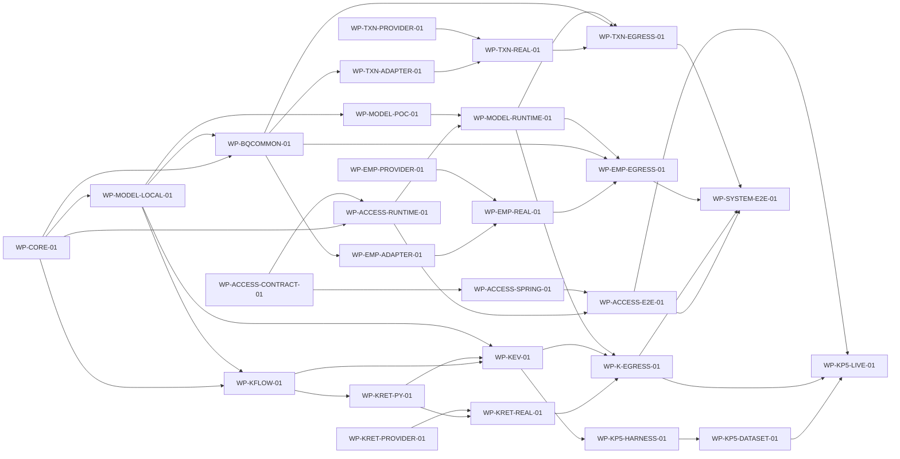

# [P3_00] 单体 Agent 查询能力代码实施计划

## 1. 文档信息

| 项目 | 内容 |
|---|---|
| 文档标识 | `PLAN-P3-001` |
| 文档编号 | `P3_00` |
| 文档类型 | 设计驱动实施计划 |
| 文档状态 | Draft |
| 当前版本 | v0.2 |
| 日期 | 2026-08-01 |
| 目标计划路径 | `docs/plans/P3_00_SINGLE_AGENT_CODE_IMPLEMENTATION_PLAN.md` |
| 适用范围 | 单体 Agent 的 Python Runtime、Spring 接入、DeepSeek 模型边界、Knowledge 查询、Employee/Transaction 只读 Adapter、必要提供方改造、真实集成与 P5 效果验证 |
| 非范围 | Multi-Agent、写操作、聚合查询、知识录入、持久记忆、生产部署、生产级韧性平台、排期/人力/成本估算 |
| 权威顺序 | 用户范围 → 仓库规则 → REQ/L0/L1/外部契约 → L2 → 当前实现证据 → 本计划 |
| 实施授权 | 未授权；本计划的 Ready 不等于实施授权，当前各来源 `slice_implementation` 门禁仍为 Open |
| 可写范围 | 仅本文；REQ、L0/L1/L2、代码、测试、配置、Schema 和外部系统均为只读计划输入 |
| 维护责任人 | 项目维护者（个人开发者，姓名未在需求中指定） |
| 评审状态 | 已完成五轮计划评审—修复；无未关闭文档 Blocker/Major/Minor，不构成实施或 Git 授权 |

> 本文只编排已批准设计，不重新定义 DTO、字段、错误、权限、模型策略或实现签名。工作包是实施与验证单位，L2 是设计权威；文档编号和编写批次不构成代码依赖。

## 2. 修改历史

| 序号 | 日期 | 位置 | 原因 | 修改内容 |
|---:|---|---|---|---|
| 1 | 2026-08-01 | 全文 | 生成 P3 代码实施计划 | 从 9 份 Approved L2 提取 25 个工作包、41 条直接依赖、27 项门禁、8 项外部资源及实施交接 |
| 2 | 2026-08-01 | 1～14 章 | 五轮计划评审—修复 | 拆分 Model PoC/Runtime 与 P5 harness/dataset，精确化来源追踪、公开契约、回滚和敏感数据边界，分离受控集成测试入口与来源门禁关闭；收口为 27 个工作包、43 条直接依赖、34 项门禁和 8 项外部资源 |

## 3. 来源清单与当前基线

### 3.1 权威来源

| 资源 | 角色 | 层级 | 状态/版本 | 权威范围 | 是否读取 | 置信度 |
|---|---|---|---|---|---|---|
| [`REQ_00`](../REQ_00_SINGLE_AGENT_QUERY_REQUIREMENTS.md) | 需求基线 | REQ | v1.3 已确认 | 单体 Agent 查询目标、范围、角色与约束 | 是 | 高 |
| [`L0_00`](../design/L0_00_SINGLE_AGENT_ARCHITECTURE.md) | 总体架构 | L0 | v0.5 有条件通过，`SA-GATE-001` Closed | 双进程、LangGraph、适配器、模型与出域边界 | 是 | 高 |
| [`L1_00`](../design/L1_00_SINGLE_AGENT_CORE_RUNTIME_ARCHITECTURE.md) | 核心架构 | L1 | v0.2 已通过 | Core、Runtime、接入和模型责任 | 是 | 高 |
| [`L1_01`](../design/L1_01_SINGLE_AGENT_KNOWLEDGE_QUERY_ARCHITECTURE.md) | Knowledge 架构 | L1 | v0.3 已通过 | Knowledge 五阶段、检索、证据和 P5 | 是 | 高 |
| [`L1_02`](../design/L1_02_SINGLE_AGENT_BUSINESS_QUERY_ADAPTER_ARCHITECTURE.md) | Business 架构 | L1 | v0.2 已通过 | 公共业务约束和两个业务域 Adapter | 是 | 高 |
| [`L2_00_00`](../design/L2_00_00_SINGLE_AGENT_SPRING_ACCESS_RUNTIME_COORDINATION_DETAILED_DESIGN.md) | 接入详细设计 | L2 | v0.2 Approved | OpenAPI、Spring 接入、Runtime HTTP、双进程协同 | 是 | 高 |
| [`L2_00_01`](../design/L2_00_01_SINGLE_AGENT_CORE_EXECUTION_CAPABILITY_REGISTRATION_DETAILED_DESIGN.md) | Core 详细设计 | L2 | v0.4 Approved | Python 工程、能力 API、Core、LangGraph、组合根 | 是 | 高 |
| [`L2_00_02`](../design/L2_00_02_SINGLE_AGENT_DEEPSEEK_MODEL_ACCESS_CONTROLLED_GENERATION_DETAILED_DESIGN.md) | 模型详细设计 | L2 | v0.4 Approved | 模型中立契约、输入闸门、DeepSeek、PoC | 是 | 高 |
| [`L2_01_00`](../design/L2_01_00_SINGLE_AGENT_KNOWLEDGE_QUERY_FLOW_CONFIGURATION_DETAILED_DESIGN.md) | Knowledge Flow 详细设计 | L2 | v0.3 Approved | 单动作流程、改写、域选择、阶段接缝 | 是 | 高 |
| [`L2_01_01`](../design/L2_01_01_SINGLE_AGENT_KNOWLEDGE_RETRIEVAL_LOCAL_MODEL_DETAILED_DESIGN.md) | Knowledge Retrieval 详细设计 | L2 | v0.2 Approved | Python 检索、ES typed endpoint、BGE、授权 | 是 | 高 |
| [`L2_01_02`](../design/L2_01_02_SINGLE_AGENT_KNOWLEDGE_EVIDENCE_EGRESS_SUMMARY_EFFECTIVENESS_DETAILED_DESIGN.md) | Knowledge Evidence 详细设计 | L2 | v0.2 Approved | 证据、三层出域、摘要和 P5 | 是 | 高 |
| [`L2_02_00`](../design/L2_02_00_SINGLE_AGENT_BUSINESS_QUERY_COMMON_CONSTRAINTS_CONFIGURATION_EGRESS_DETAILED_DESIGN.md) | Business Common 详细设计 | L2 | v0.4 Approved | 公共配置、JWT client、字段投影、精确 Decimal、grounding | 是 | 高 |
| [`L2_02_01`](../design/L2_02_01_SINGLE_AGENT_EMPLOYEE_ADAPTER_AUTHORIZATION_DETAILED_DESIGN.md) | Employee 详细设计 | L2 | v0.3 Approved | Python Adapter、Employee guard、可见性验证 | 是 | 高 |
| [`L2_02_02`](../design/L2_02_02_SINGLE_AGENT_TRANSACTION_ADAPTER_AUTHORIZATION_DETAILED_DESIGN.md) | Transaction 详细设计 | L2 | v0.3 Approved | Python Adapter、Transaction guard、BigDecimal 精确查询 | 是 | 高 |

本计划后续表格中的 `L2_00_00`～`L2_02_02` 均为本表对应路径的稳定别名；工作包、依赖和交接必须同时给出可定位的 ID 或章节，不得仅以别名、文档批次或“相关章节”作为实施依据。

### 3.2 当前实现基线

| 范围 | 当前事实 | 计划影响 |
|---|---|---|
| `agent-runtime` | 目录不存在 | `WP-CORE-01` 创建最小 Python 工程；其他 Python 包只能在其契约完成后验证 |
| `agent-service` | 目录不存在 | `WP-ACCESS-SPRING-01` 新建 Spring 接入服务 |
| `agent-contracts` | 目录不存在 | `WP-ACCESS-CONTRACT-01` 新建两份 OpenAPI 和共用 fixtures |
| `employee-service` | 已存在详情端点与基础 guard，但角色最终授权和响应可见性证据不完整 | Python fake 不受阻；Java 改造由独立 `BQ-GATE-003` 控制 |
| `mq-procedure-service`/`transaction-api` | 已存在 `POST /txn/search` 与 BigDecimal 能力，但角色 guard、精确金额全链和可见性证据未关闭 | Python fake 不受阻；Java/API 行为由独立 `BQ-GATE-003` 控制 |
| `es-query-api`/`es-query-service` | 已有通用查询，尚无 Knowledge typed endpoint、Profile、读取授权和稳定候选契约 | Provider 代码与真实 ES/BGE 集成拆包，避免阻塞 Python fake |
| ES/BGE | 2026-07-31 只读点测曾确认 9200/8908/8909 在线 | 属于易漂移事实；真实集成前必须重新验证，不作为当前可用保证 |
| DeepSeek | `LLM_API_KEY` 存在性已核实，目标模型代码和 PoC 不存在 | secret 不进入计划；真实调用另需显式付费调用授权 |

## 4. 计划原则与范围

1. 工作包按可独立交付、验证和回滚的结果划分，不按 L2 文件一份一包。
2. 只建立 contract、runtime、data、security、validation、rollback 六类直接依赖；禁止以编号、个人串行习惯或文档批次造依赖。
3. `CR-GATE-002`、`KQ-GATE-002`、`BQ-GATE-002/003` 只阻塞对应代码切片；不把真实集成门禁提前变成本地 fake/stub 编码阻塞项。
4. 真实 ES/BGE、业务服务、DeepSeek、真实数据出域和 P5 分别形成后置工作包，不能用本地 fake 关闭。
5. 每个实现工作包先完成直接单元/契约/架构测试，再进入真实集成；失败时保持 feature disabled 或恢复 fake/stub。
6. 无数据库迁移；新增 Provider 端点默认 disabled。任何未来 Schema、公开契约或设计变化须回到对应 L2，不在本文临时决定。
7. 不估算工期和人力。推荐顺序只在已 Ready 的工作包之间选择。
8. 真实集成工作包以“受控 opt-in 测试授权”作为入口门禁；来源 `SA-GATE-*` 的关闭/能力启用作为非入口完成门禁。入口关闭只允许执行限定验证，不允许默认启用；完成门禁未关闭时工作包不得标记 Done。

## 5. 工作包清单

| 工作包 ID | 名称 | 来源设计 | 范围 | 直接依赖 | 入口门禁 | 交付物 | 验证 | 回滚边界 | 状态 |
|---|---|---|---|---|---|---|---|---|---|
| `WP-CORE-01` | 模型无关 Runtime Core | `L2_00_01` `REQ-CORE-001～009`,`CON-CORE-001～013`,`DR-CORE-001～014` | 创建 Python 工程、能力 API、冻结注册表、单动作 Core、LangGraph state/node、组合根和 stub 测试；不接 HTTP/真实模型/领域实现 | - | `GATE-001` | `agent-runtime` Core 源码、配置、unit/contract/architecture tests | `VAL-CORE-002/003/004` | 保持新模块未被其他包消费；失败时移除仅本包新增的装配和文件，不触碰既有服务 | Blocked |
| `WP-ACCESS-CONTRACT-01` | 双进程 OpenAPI 与共用 fixtures | `L2_00_00` `DR-ACCESS-002/010/012` | 建立 public/internal OpenAPI、严格 DTO fixtures 和跨语言契约测试骨架；不创建服务实现 | - | `GATE-002` | `agent-contracts/openapi`、`fixtures`、契约校验资产 | `VAL-ACCESS-003` 的 schema/fixture 子集 | 契约未被实现消费前整体回退 | Blocked |
| `WP-MODEL-LOCAL-01` | 模型中立网关、输入闸门与本地替身 | `L2_00_02` `DR-MODEL-001/003/004/007/009/010/014/015` | 实现 task/gateway/grounding、问题出域 guard、ContextVar、DeepSeek DTO/节点的 fake-transport 契约；不调用真实 DeepSeek | `WP-CORE-01` | `GATE-003` | `agent_runtime/model`、local stubs、unit/contract/architecture tests | `VAL-MODEL-002/003/004`，不含 live PoC | 组合根保持 `stub`；移除 model 装配时保留 Core 公共契约和既有测试基线 | Blocked |
| `WP-ACCESS-RUNTIME-01` | Python Runtime HTTP 接入 | `L2_00_00` `DR-ACCESS-005/006/007/008/010/013/016/017` | 实现 FastAPI ingress、strict models、body/concurrency limit、health、main 和 RuntimeInvoker 映射；不启真实领域/模型 | `WP-CORE-01`,`WP-ACCESS-CONTRACT-01` | `GATE-004` | `agent_runtime/api`、启动入口、Python contract/integration tests | `VAL-ACCESS-003/004` 的 Python 子集 | 停止 HTTP 入口并保留直接 invoker 测试 | Blocked |
| `WP-ACCESS-SPRING-01` | Spring 接入治理服务 | `L2_00_00` `DR-ACCESS-001/003/004/006/007/009/011/012/013/015/018` | 新建 agent-service 安全、准入、controller、WebClient、健康和错误边界；只连接 fake Runtime | `WP-ACCESS-CONTRACT-01` | `GATE-005` | `agent-service`、Java unit/contract tests | `VAL-ACCESS-002/003` 的 Java 子集 | 不注册路由或停止新服务；不影响既有服务 | Blocked |
| `WP-ACCESS-E2E-01` | 本地 Spring—Runtime 双进程闭环 | `L2_00_00` `TEST-ACCESS-002～012` | 用模型/能力 stub 验证认证、deadline、取消、错误和启停顺序；不接真实模型/领域数据 | `WP-ACCESS-RUNTIME-01`,`WP-ACCESS-SPRING-01` | - | 双进程集成测试与验证记录 | `VAL-ACCESS-003/004/005` | 恢复单进程测试替身并停止两个测试进程 | Blocked |
| `WP-KFLOW-01` | Knowledge 单动作流程与 fake stages | `L2_01_00` `REQ-KFLOW-001～009`,`CON-KFLOW-001～010`,`DR-KFLOW-001～014` | 实现问题改写语义、两域目录/选择、检索计划、有限阶段结果、Capability/Provider；retrieval/evidence 使用 fake | `WP-CORE-01`,`WP-MODEL-LOCAL-01` | `GATE-006` | `agent_runtime/knowledge` flow/config、fake-stage tests | `VAL-KFLOW-002/003/004` | `AGENT_KNOWLEDGE_ENABLED=false` 并移除 provider 装配 | Blocked |
| `WP-KRET-PY-01` | Python Knowledge Retrieval 与 BGE/ES 适配器 | `L2_01_01` `DR-KRET-001/002/005～012` | 实现 typed batch、RRF、并发 stage、BGE/ES bounded clients；Provider 以 fake server 验证 | `WP-KFLOW-01` | `GATE-007` | `knowledge/retrieval` 源码及 fake contract tests | `VAL-KRET-001/002` 的 fake 模式 | Knowledge 继续注入 in-memory retrieval stage | Blocked |
| `WP-KRET-PROVIDER-01` | ES Knowledge typed 只读端点与授权 | `L2_01_01` `DR-KRET-002/003/004/005/012` | 新增 es-query-api DTO、endpoint-scoped strict codec/security、Profile、读取 guard 和 service；默认 disabled | - | `GATE-008` | `es-query-api`、`es-query-service` 新端点及 Java tests | `VAL-KRET-003` | `es.query.knowledge.enabled=false`，既有通用端点保持原行为 | Blocked |
| `WP-KRET-REAL-01` | 真实 ES/BGE Knowledge 检索联调 | `L2_01_01` `DR-KRET-002～012` | 连接 typed endpoint、9200/8908/8909，验证授权先于正文、Profile/快照、维度、Rerank 和负向矩阵 | `WP-KRET-PY-01`,`WP-KRET-PROVIDER-01` | `GATE-016` | opt-in 集成测试、Provider/授权/快照证据 | `VAL-KRET-002/003/004/005` | 禁用真实 stage，恢复 synthetic candidates | Blocked |
| `WP-KEV-01` | Knowledge 证据、三层策略与抽取式摘要 | `L2_01_02` `DR-KEV-001～011` | 实现证据校验/选择、合成策略目录、三层交集、summary task、子串验证和本地结果；只用 stub 模型/合成证据 | `WP-KFLOW-01`,`WP-KRET-PY-01`,`WP-MODEL-LOCAL-01` | `GATE-009` | `knowledge/evidence`、合成 catalog、unit/contract/integration tests | `VAL-KEV-002/003/004` 的 stub 模式 | 禁用 Knowledge 或恢复 fake Evidence Stage | Blocked |
| `WP-KP5-HARNESS-01` | P5 成对执行器、结果 Schema 与合成 fixture | `L2_01_02` `DR-KEV-012/013` | 创建 primary/ablation runner、严格结果 schema 和最小合成 fixture；验证 stub/invalid-run，不创建或冒充真实代表性问题集，不形成效果结论 | `WP-KEV-01` | `GATE-010` | evaluation runner/schema、synthetic fixture、stub/invalid result | `VAL-KEV-006` 的 schema/stub/invalid-run 路径 | 结果 append-only；无效 run 不关闭门禁 | Blocked |
| `WP-KP5-DATASET-01` | P5 代表性问题集与 gold 冻结 | `L2_01_02` `REQ-KEV-007`,`DR-KEV-012/013` | 由维护者提供并核实至少 24 个分层、已授权且不含凭证/真实敏感数据的问题，关联 gold 文档/证据、用户授权 fixture、来源快照和冻结 hash；只形成版本化评估输入，不运行 live P5 | `WP-KP5-HARNESS-01` | `GATE-028` | `representative_questions.v1.jsonl`、有限标注记录、dataset hash | `TEST-KEV-012` 的分层/gold/schema/敏感字段负向子集 | 已被结果引用的数据集不原地改写；修正生成新版本 | Blocked |
| `WP-BQCOMMON-01` | Business 公共约束、精确 wire 与出域框架 | `L2_02_00` `REQ-BQCOM-001～012`,`CON-BQCOM-001～012`,`DR-BQCOM-001～019` | 实现公共契约、配置、JWT client、result mapping、字段投影、有限转换、grounding、ExactDecimal wire 和 handler；只接 fake domains | `WP-CORE-01`,`WP-MODEL-LOCAL-01` | `GATE-011` | `agent_runtime/business`、common tests/fixtures | `VAL-BQCOM-002/003/004` | 不装配业务 providers，恢复 common fake | Blocked |
| `WP-EMP-ADAPTER-01` | Python Employee Adapter | `L2_02_01` `DR-EMP-001/002/005～011` | 实现定义、codec、normalizer、六字段、settings/provider；只连接 fake Employee server | `WP-BQCOMMON-01` | `GATE-012` | `adapters/employee` 及 unit/contract/integration tests | `VAL-EMP-001/002` | 禁用 Employee action 并移除 provider | Blocked |
| `WP-TXN-ADAPTER-01` | Python Transaction Adapter | `L2_02_02` `DR-TXN-001/002/005～012` | 实现 search 定义、Decimal 条件、canonical JSON number、normalizer、字段和 provider；只连接 fake Transaction server | `WP-BQCOMMON-01` | `GATE-013` | `adapters/transaction` 及 unit/contract/integration tests | `VAL-TXN-001/002` | 禁用 Transaction action 并移除 provider | Blocked |
| `WP-EMP-PROVIDER-01` | Employee 最终授权与可见性提供方改造 | `L2_02_01` `DR-EMP-003/004` | 复用详情端点，增加 ROLE_ADMIN/ROLE_VIEWER guard、响应可见性 fixture 和回归；不改响应 DTO | - | `GATE-014` | Employee Java guard/controller/tests/fixture | `VAL-EMP-003`，真实 JWT 留后置 | Agent action 保持禁用；若恢复改造前行为，只撤销本包新增 hook 并保留全部既有安全配置/guard | Blocked |
| `WP-TXN-PROVIDER-01` | Transaction 最终授权与精确金额提供方改造 | `L2_02_02` `DR-TXN-003/004/006/011/012` | 为现有 search 加角色 guard、可见性 fixture、精确 JSON number→BigDecimal→数据库比较测试；不增加 Date/聚合/写入口 | - | `GATE-015` | Transaction Java guard/controller/tests/fixture | `VAL-TXN-003`，真实 JWT 留后置 | Agent action 保持禁用；若恢复改造前行为，只撤销本包新增 hook 并保留全部既有安全配置/guard | Blocked |
| `WP-EMP-REAL-01` | 真实 Employee 只读动作联调 | `L2_02_01` `DR-EMP-003/004/005/008/009` | 用真实用户 JWT 验证 allow/deny、调用次数、响应可见性和日志；不进入 DeepSeek | `WP-EMP-ADAPTER-01`,`WP-EMP-PROVIDER-01` | `GATE-017` | 跨服务矩阵和日志证据 | `VAL-EMP-003/004/005` | 禁用 Employee provider，恢复 fake server | Blocked |
| `WP-TXN-REAL-01` | 真实 Transaction 只读动作联调 | `L2_02_02` `DR-TXN-003/004/006/008/011/012` | 用真实用户 JWT 验证 allow/deny、金额精度、覆盖、禁止接口和日志；不进入 DeepSeek | `WP-TXN-ADAPTER-01`,`WP-TXN-PROVIDER-01` | `GATE-018` | 跨服务矩阵、精度和日志证据 | `VAL-TXN-003/004/005` | 禁用 Transaction provider，恢复 fake server | Blocked |
| `WP-MODEL-POC-01` | DeepSeek 隔离 transport 与 live PoC | `L2_00_02` `DR-MODEL-002/010～015` | 实现真实 transport 与依赖，运行 opt-in 30 次 action+6 次 answer 合成非敏感 PoC；不接入 Runtime，不发送真实领域数据 | `WP-MODEL-LOCAL-01` | `GATE-019` | DeepSeek transport、PoC tests、append-only 通过/失败记录 | `VAL-MODEL-002/004/005` | 保持 Runtime 使用 stub；不删除 PoC 历史证据 | Blocked |
| `WP-MODEL-RUNTIME-01` | 已验证 DeepSeek transport 的 Runtime 装配 | `L2_00_02` `DR-MODEL-001/007/010/012～015` | 仅在 PoC 达标并关闭 `SA-GATE-002` 后，把真实 transport、selector、answer generator 和 context binder 接入 Runtime；不发送真实领域数据 | `WP-MODEL-POC-01`,`WP-ACCESS-RUNTIME-01` | `GATE-020` | 受控 `deepseek` provider 组合根、启动/关闭和回归测试 | `VAL-MODEL-002～005` 与 Runtime stub/deepseek 装配检查 | 组合根恢复 `stub`，不删除 PoC 历史证据 | Blocked |
| `WP-K-EGRESS-01` | 真实知识证据模型出域联调 | `L2_01_02` `DR-KEV-004～010` | 使用真实策略目录、fresh guard、真实检索和 DeepSeek 验证允许/拒绝、零调用与引用；不运行 P5 结论 | `WP-KRET-REAL-01`,`WP-KEV-01`,`WP-MODEL-RUNTIME-01` | `GATE-021`,`GATE-022` | 目录一致性、model spy、真实 summary 集成证据 | `VAL-KEV-004/005` 的 live 授权路径 | 禁止真实证据出域，恢复 synthetic catalog/payload | Blocked |
| `WP-EMP-EGRESS-01` | Employee 结果模型出域联调 | `L2_02_00 DR-BQCOM-008～011/018`,`L2_02_01 DR-EMP-006/007` | 验证字段交集、有限转换、facts/grounding 和零调用；不扩大业务响应或角色 | `WP-EMP-REAL-01`,`WP-BQCOMMON-01`,`WP-MODEL-RUNTIME-01` | `GATE-023`,`GATE-024` | Employee 出域矩阵和模型 spy 证据 | `VAL-BQCOM-003/005` 与 Employee 出域场景 | 关闭 Employee 模型出域，保留本地用户结果 | Blocked |
| `WP-TXN-EGRESS-01` | Transaction 结果模型出域联调 | `L2_02_00 DR-BQCOM-008～011/019`,`L2_02_02 DR-TXN-006/011/012` | 验证金额/类型事实、字段交集、grounding、无聚合越界和零调用 | `WP-TXN-REAL-01`,`WP-BQCOMMON-01`,`WP-MODEL-RUNTIME-01` | `GATE-025`,`GATE-026` | Transaction 出域矩阵和模型 spy 证据 | `VAL-BQCOM-003/005` 与 Transaction 出域场景 | 关闭 Transaction 模型出域，保留本地用户结果 | Blocked |
| `WP-SYSTEM-E2E-01` | 三能力完整双进程闭环 | `L2_00_00 TEST-ACCESS-002～012/VAL-ACCESS-005`,`L2_01_02 VAL-KEV-004/005`,`L2_02_00 VAL-BQCOM-003/005`,`L2_02_01 VAL-EMP-004/005`,`L2_02_02 VAL-TXN-004/005` | 经 Spring→Runtime 验证 Knowledge、Employee、Transaction 允许/拒绝/失败路径、单动作和安全日志；不宣称 P5 效果 | `WP-ACCESS-E2E-01`,`WP-K-EGRESS-01`,`WP-EMP-EGRESS-01`,`WP-TXN-EGRESS-01` | - | 端到端矩阵、回归与启动/回滚记录 | 所列五份 L2 的联合最小验证集 | 逐能力禁用并恢复 stub/fake；双进程逆序停止 | Blocked |
| `WP-KP5-LIVE-01` | Knowledge P5 真实效果验证 | `L2_01_02` `DR-KEV-012/013` | 在固定用户 profile、快照和真实链路上运行 24 case×2 variants，形成 append-only 结论；不自动调参 | `WP-KP5-DATASET-01`,`WP-K-EGRESS-01`,`WP-ACCESS-E2E-01` | - | schema-valid result、人工 rubric、明确结论 | `VAL-KEV-006` | 无效 run 不覆盖历史、不关闭 `SA-GATE-007` | Blocked |

## 6. 直接依赖图

### 6.1 直接依赖表

| 依赖 ID | 前置工作包 | 后继工作包 | 类型 | 技术依据 | 来源证据 |
|---|---|---|---|---|---|
| `DEP-001` | `WP-CORE-01` | `WP-MODEL-LOCAL-01` | contract | 模型节点消费 Core 的窄输入、decision 和能力描述 | `L2_00_02` 直接依赖；`L2_00_01 DR-CORE-005/012` |
| `DEP-002` | `WP-CORE-01` | `WP-ACCESS-RUNTIME-01` | runtime | HTTP ingress 必须构造 scope 并调用 `AgentRuntimeInvoker` | `L2_00_00` 直接依赖、`IMPL-ACCESS-011/012/015` |
| `DEP-003` | `WP-ACCESS-CONTRACT-01` | `WP-ACCESS-RUNTIME-01` | contract | Python transport DTO 必须服从 internal OpenAPI/fixtures | `DR-ACCESS-002/010/012` |
| `DEP-004` | `WP-ACCESS-CONTRACT-01` | `WP-ACCESS-SPRING-01` | contract | Java Controller/WebClient 必须服从 public/internal OpenAPI | `DR-ACCESS-002/011/012` |
| `DEP-005` | `WP-ACCESS-RUNTIME-01` | `WP-ACCESS-E2E-01` | runtime | 双进程闭环需要真实 Runtime HTTP 入口 | `VAL-ACCESS-004/005` |
| `DEP-006` | `WP-ACCESS-SPRING-01` | `WP-ACCESS-E2E-01` | runtime | 双进程闭环需要 Spring 认证、准入和 client | `VAL-ACCESS-002/005` |
| `DEP-007` | `WP-CORE-01` | `WP-KFLOW-01` | contract | Knowledge Capability 注册、上下文和公共结果来自 Core | `L2_01_00` 直接依赖、`DR-KFLOW-001/012` |
| `DEP-008` | `WP-MODEL-LOCAL-01` | `WP-KFLOW-01` | runtime | 问题改写使用受控 task/gateway/guard | `DR-KFLOW-002/003/011/013` |
| `DEP-009` | `WP-KFLOW-01` | `WP-KRET-PY-01` | contract | Retrieval Stage 实现 flow 定义的 plan/context/result 接缝 | `L2_01_01`、`IMPL-KRET-001/002` |
| `DEP-010` | `WP-KRET-PY-01` | `WP-KRET-REAL-01` | runtime | 真实联调通过 Python ES/BGE adapters 执行 | `VAL-KRET-002/004/005` |
| `DEP-011` | `WP-KRET-PROVIDER-01` | `WP-KRET-REAL-01` | runtime | 真实检索需要 typed endpoint、读取 guard 和 Profile | `DR-KRET-002/003/004/012` |
| `DEP-012` | `WP-KFLOW-01` | `WP-KEV-01` | contract | Evidence Stage 必须实现 flow 的 input/result union | `L2_01_02 IMPL-KEV-007/008` |
| `DEP-013` | `WP-KRET-PY-01` | `WP-KEV-01` | contract | Evidence 消费 `RankedKnowledgeBatch` 和候选身份 | `L2_01_02 DR-KEV-001/002` |
| `DEP-014` | `WP-MODEL-LOCAL-01` | `WP-KEV-01` | runtime | summary task 使用同一 guard/gateway/registry | `DR-KEV-006/007/009` |
| `DEP-015` | `WP-KEV-01` | `WP-KP5-HARNESS-01` | contract | runner 必须复用真实 Evidence/Capability 组件与结果 | `DR-KEV-012/013` |
| `DEP-043` | `WP-KP5-HARNESS-01` | `WP-KP5-DATASET-01` | contract | 代表性问题集必须先服从已验证的数据集/result schema、有限字段和 invalid-run 规则 | `L2_01_02 DR-KEV-012/013`,`TEST-KEV-012` |
| `DEP-016` | `WP-CORE-01` | `WP-BQCOMMON-01` | contract | Business handlers/Providers 使用公共能力契约和组合根 | `L2_02_00 DR-BQCOM-001/013/015` |
| `DEP-017` | `WP-MODEL-LOCAL-01` | `WP-BQCOMMON-01` | contract | 业务出域和 grounding 使用模型公共接缝 | `DR-BQCOM-008/010/011/018` |
| `DEP-018` | `WP-BQCOMMON-01` | `WP-EMP-ADAPTER-01` | contract | Employee 复用 common handler、HTTP、projection 和配置 | `L2_02_01` 直接输入；`DR-EMP-001/009` |
| `DEP-019` | `WP-BQCOMMON-01` | `WP-TXN-ADAPTER-01` | contract | Transaction 复用 common handler、wire、projection 和配置 | `L2_02_02` 直接输入；`DR-TXN-001/012` |
| `DEP-020` | `WP-EMP-ADAPTER-01` | `WP-EMP-REAL-01` | runtime | 真实动作由 Python Adapter 携用户 JWT 调用 | `VAL-EMP-002/004` |
| `DEP-021` | `WP-EMP-PROVIDER-01` | `WP-EMP-REAL-01` | security | 真实动作要求业务服务最终角色授权和可见性 | `DR-EMP-003/004` |
| `DEP-022` | `WP-TXN-ADAPTER-01` | `WP-TXN-REAL-01` | runtime | 真实 search 由 Python Adapter 编码并调用 | `VAL-TXN-002/004` |
| `DEP-023` | `WP-TXN-PROVIDER-01` | `WP-TXN-REAL-01` | security | 真实 search 要求角色 guard 和精确金额契约 | `DR-TXN-003/004/012` |
| `DEP-024` | `WP-MODEL-LOCAL-01` | `WP-MODEL-POC-01` | contract | 隔离 live transport/PoC 必须复用已验证 gateway、DTO、guard 和合成任务 | `L2_00_02 DR-MODEL-001/002/010/013～015` |
| `DEP-025` | `WP-ACCESS-RUNTIME-01` | `WP-MODEL-RUNTIME-01` | runtime | Runtime 装配真实模型要服从请求子截止、取消和 ingress 生命周期 | `L2_00_02` 对 `L2_00_00` 的直接依赖 |
| `DEP-042` | `WP-MODEL-POC-01` | `WP-MODEL-RUNTIME-01` | validation | 只有 action/answer PoC 与预算、失败、secret 证据达标后才允许真实 transport 接入 Runtime | `L2_00_02 SA-GATE-002`,`VAL-MODEL-002～005` |
| `DEP-026` | `WP-KRET-REAL-01` | `WP-K-EGRESS-01` | data | 真实证据外发必须来自已授权、可追踪 ranked batch | `DR-KEV-001/004/005` |
| `DEP-027` | `WP-KEV-01` | `WP-K-EGRESS-01` | security | 三层策略、fresh guard 和子串校验先实现 | `DR-KEV-004～010` |
| `DEP-028` | `WP-MODEL-RUNTIME-01` | `WP-K-EGRESS-01` | runtime | 真实 summary 需要已验证并完成 Runtime 装配的 DeepSeek transport | `SA-GATE-002/006` |
| `DEP-029` | `WP-EMP-REAL-01` | `WP-EMP-EGRESS-01` | data | 模型只可消费已获业务服务授权的真实结果 | `L2_02_01 SA-GATE-004/006` |
| `DEP-030` | `WP-BQCOMMON-01` | `WP-EMP-EGRESS-01` | security | 字段交集、facts 和 grounding 属于 common | `DR-BQCOM-008～011/018` |
| `DEP-031` | `WP-MODEL-RUNTIME-01` | `WP-EMP-EGRESS-01` | runtime | 真实回答使用已完成 Runtime 装配的受控 DeepSeek gateway | `SA-GATE-002/006` |
| `DEP-032` | `WP-TXN-REAL-01` | `WP-TXN-EGRESS-01` | data | 模型只可消费已获业务服务授权的真实结果 | `L2_02_02 SA-GATE-005/006` |
| `DEP-033` | `WP-BQCOMMON-01` | `WP-TXN-EGRESS-01` | security | 精确金额 facts、字段交集和 grounding 属于 common | `DR-BQCOM-008～011/019` |
| `DEP-034` | `WP-MODEL-RUNTIME-01` | `WP-TXN-EGRESS-01` | runtime | 真实回答使用已完成 Runtime 装配的受控 DeepSeek gateway | `SA-GATE-002/006` |
| `DEP-035` | `WP-ACCESS-E2E-01` | `WP-SYSTEM-E2E-01` | runtime | 完整闭环需要稳定双进程入口 | `L2_00_00 VAL-ACCESS-005` |
| `DEP-036` | `WP-K-EGRESS-01` | `WP-SYSTEM-E2E-01` | validation | 完整闭环必须先关闭 Knowledge 真实出域验证 | `SA-GATE-003/006` |
| `DEP-037` | `WP-EMP-EGRESS-01` | `WP-SYSTEM-E2E-01` | validation | 完整闭环必须先关闭 Employee 真实授权/出域验证 | `SA-GATE-004/006` |
| `DEP-038` | `WP-TXN-EGRESS-01` | `WP-SYSTEM-E2E-01` | validation | 完整闭环必须先关闭 Transaction 真实授权/出域验证 | `SA-GATE-005/006` |
| `DEP-039` | `WP-KP5-DATASET-01` | `WP-KP5-LIVE-01` | data | live run 需要已冻结并通过分层/gold/schema 校验的代表性问题集 | `DR-KEV-012/013` |
| `DEP-040` | `WP-K-EGRESS-01` | `WP-KP5-LIVE-01` | runtime | P5 必须使用真实目标 ES/BGE/DeepSeek/策略链 | `L2_01_02` 14.1/14.5 |
| `DEP-041` | `WP-ACCESS-E2E-01` | `WP-KP5-LIVE-01` | runtime | P5 fixture 依赖已通过 P4 的运行时身份/读取装配 | `L2_01_02` 14.1 |

### 6.2 DAG

## 7. 阶段门禁

| 门禁 ID | 工作包 | 类型 | 控制动作 | 是否阻塞入口 | 关闭条件 | 证据/权威来源 | 责任方/外部提供方 | 最晚关闭阶段 | 验证者与方法 | 未关闭行为 | 状态 |
|---|---|---|---|---|---|---|---|---|---|---|---|
| `GATE-001` | `WP-CORE-01` | slice_implementation | 创建 Core 代码/测试 | 是 | 用户明确授权 `L2_00_01` 切片且 `CR-GATE-002` 关闭 | `L2_00_01 CR-GATE-002` | 项目维护者 | P3 Core 前 | 核对授权、评审、追踪和回滚 | 仅文档/样例，不创建代码 | Open |
| `GATE-002` | `WP-ACCESS-CONTRACT-01` | slice_implementation | 创建 public/internal OpenAPI 与 fixtures | 是 | 用户明确确认 public/internal 契约内容、兼容范围和目标文件，授权 Access 契约切片且 `CR-GATE-002` 关闭 | `L2_00_00 CR-GATE-002`,`DR-ACCESS-002/010/012` | 项目维护者 | P3 Access 前 | 核对公开/内部边界、兼容性和明确文件范围 | 只可推演契约，不创建或发布 Schema | Open |
| `GATE-003` | `WP-MODEL-LOCAL-01` | slice_implementation | 创建模型公共代码和 stub tests | 是 | 用户授权模型公共切片且 `CR-GATE-002` 关闭 | `L2_00_02 CR-GATE-002` | 项目维护者 | P3 Model local 前 | 核对授权与非 live 范围 | 仅文档，不调用模型 | Open |
| `GATE-004` | `WP-ACCESS-RUNTIME-01` | slice_implementation | 创建 Runtime HTTP 代码/测试 | 是 | 用户授权 Runtime ingress 且 `CR-GATE-002` 关闭 | `L2_00_00 CR-GATE-002` | 项目维护者 | P3 Runtime HTTP 前 | 核对授权和依赖完成 | 不开放端口 | Open |
| `GATE-005` | `WP-ACCESS-SPRING-01` | slice_implementation | 新建 agent-service | 是 | 用户授权 Spring 接入切片且 `CR-GATE-002` 关闭 | `L2_00_00 CR-GATE-002` | 项目维护者 | P3 Spring 前 | 核对模块/配置/测试范围 | 不创建/注册服务 | Open |
| `GATE-006` | `WP-KFLOW-01` | slice_implementation | 创建 Knowledge flow/config | 是 | 用户授权该切片且 `KQ-GATE-002` 关闭 | `L2_01_00 KQ-GATE-002` | 项目维护者 | P3 Knowledge flow 前 | 核对 L2/依赖/测试 | 仅 fake 契约推演 | Open |
| `GATE-007` | `WP-KRET-PY-01` | slice_implementation | 创建 Python Retrieval | 是 | 用户授权该切片且 `KQ-GATE-002` 关闭 | `L2_01_01 KQ-GATE-002` | 项目维护者 | P3 Retrieval 前 | 核对 Python 文件范围 | 只用 in-memory fake | Open |
| `GATE-008` | `WP-KRET-PROVIDER-01` | slice_implementation | 新增 ES API/依赖/端点 | 是 | 用户与 ES 提供方明确授权公开契约、依赖和端点，`KQ-GATE-002` 关闭 | `L2_01_01 KQ-GATE-002` | 项目维护者/ES 提供方 | Provider 代码前 | 核对 DTO、endpoint、security、兼容范围 | 既有通用端点不变，不创建新端点 | Open |
| `GATE-009` | `WP-KEV-01` | slice_implementation | 创建 Evidence/Policy/Summary 本地切片 | 是 | 用户授权该切片且 `KQ-GATE-002` 关闭 | `L2_01_02 KQ-GATE-002` | 项目维护者 | P3 Evidence 前 | 核对 synthetic/stub 边界 | 只允许文档和合成推演 | Open |
| `GATE-010` | `WP-KP5-HARNESS-01` | slice_implementation | 创建 P5 runner/schema/合成测试资产 | 是 | 用户授权 P5 资产代码且 `KQ-GATE-002` 关闭 | `L2_01_02 KQ-GATE-002` | 项目维护者 | P3 harness 前 | 核对 synthetic/stub 边界和无 live 结论 | 不创建 runner/schema；代表性 dataset 仍由 `GATE-028` 独立控制 | Open |
| `GATE-011` | `WP-BQCOMMON-01` | slice_implementation | 创建 Business common | 是 | 用户授权 common 切片且 `BQ-GATE-002` 关闭 | `L2_02_00 BQ-GATE-002` | 项目维护者 | P3 Business common 前 | 核对追踪/ExactDecimal 边界 | 仅纯函数样例 | Open |
| `GATE-012` | `WP-EMP-ADAPTER-01` | slice_implementation | 创建 Python Employee Adapter | 是 | 用户授权 Employee Python 切片且 `BQ-GATE-002` 关闭 | `L2_02_01 BQ-GATE-002` | 项目维护者 | P3 Employee Adapter 前 | 核对只连接 fake | 不调用真实 endpoint | Open |
| `GATE-013` | `WP-TXN-ADAPTER-01` | slice_implementation | 创建 Python Transaction Adapter | 是 | 用户授权 Transaction Python 切片且 `BQ-GATE-002` 关闭 | `L2_02_02 BQ-GATE-002` | 项目维护者 | P3 Transaction Adapter 前 | 核对动作/金额/非范围 | 不调用真实 endpoint | Open |
| `GATE-014` | `WP-EMP-PROVIDER-01` | slice_implementation | 修改 Employee Java guard/公开行为 | 是 | 维护者确认复用详情、角色可见性、调用方兼容和具体 Java/测试范围，`BQ-GATE-003` 关闭 | `L2_02_01 BQ-GATE-003` | 项目维护者/Employee 方 | Java 修改前 | 变更影响与回归核对 | 禁止 Java/公开行为修改 | Open |
| `GATE-015` | `WP-TXN-PROVIDER-01` | slice_implementation | 修改 Transaction guard/公开行为 | 是 | 维护者确认 search 子集、角色、可见性、精度及具体 Java/测试范围，`BQ-GATE-003` 关闭 | `L2_02_02 BQ-GATE-003` | 项目维护者/Transaction 方 | Java 修改前 | 变更影响与回归核对 | 禁止 Java/API/真实金额修改 | Open |
| `GATE-016` | `WP-KRET-REAL-01` | integration | 执行受控 opt-in 真实 ES/BGE/授权矩阵 | 是 | 维护者明确授权限定测试；typed endpoint 默认 disabled，测试身份、Profile/manifest/snapshot、9200/8908/8909 和日志/spy 环境就绪；测试外仍使用 synthetic candidates | `L2_01_01` 14～16 章、`VAL-KRET-002～005` | 维护者/ES/BGE/安全方 | 首次真实正文测试前 | 预检授权、快照、端点和测试隔离范围 | 保持 synthetic candidates；不得查询或发送真实正文 | Open |
| `GATE-017` | `WP-EMP-REAL-01` | integration | 执行受控 opt-in Employee 真实 JWT/endpoint 矩阵 | 是 | 维护者明确授权限定测试；已核实测试用户/JWT、允许拒绝 fixture、响应可见性和日志检索环境；Agent action 在测试外保持禁用 | `L2_02_01` 12～14 章、`VAL-EMP-003～005` | 维护者/安全/Employee 方 | 首次真实 Employee 测试前 | 预检 JWT、测试数据、调用计数和日志隔离 | 保持 fake Employee；不得调用真实 endpoint | Open |
| `GATE-018` | `WP-TXN-REAL-01` | integration | 执行受控 opt-in Transaction 真实 JWT/金额矩阵 | 是 | 维护者明确授权限定测试；已核实测试用户/JWT、精确金额 fixture、响应可见性和日志检索环境；Agent action 在测试外保持禁用 | `L2_02_02` 12～14 章、`VAL-TXN-003～005` | 维护者/安全/Transaction 方 | 首次真实 Transaction 测试前 | 预检 JWT、金额数据、禁止端点和日志隔离 | 保持 fake Transaction；不得调用真实 endpoint/金额条件 | Open |
| `GATE-019` | `WP-MODEL-POC-01` | integration | 运行付费 DeepSeek PoC | 是 | 用户另行授权非敏感付费调用，secret 仅环境注入，测试集固定 | `L2_00_02 VAL-MODEL-005/SA-GATE-002` | 项目维护者/DeepSeek | 首次 live PoC 前 | 核对 opt-in、secret/log 和调用预算 | 只运行 fake transport | Open |
| `GATE-020` | `WP-MODEL-RUNTIME-01` | slice_implementation | 将真实 transport 接入 Runtime并声明模型切片完成 | 是 | 30 次 action+6 次 answer PoC、预算/失败/secret 测试通过且维护者确认，`SA-GATE-002` 关闭 | `L2_00_02 SA-GATE-002` | 项目维护者/DeepSeek | Runtime live wiring 前 | `VAL-MODEL-002～005` | 可保留隔离 PoC，禁止 Runtime live 接入 | Open |
| `GATE-021` | `WP-K-EGRESS-01` | integration | 用户问题进入 DeepSeek | 是 | 分类、最小化、unknown/denied 零调用通过，`CR-GATE-003` 关闭 | `L2_00_02`,`L2_01_02` | 维护者/模型方 | 知识 live summary 前 | model spy/负向测试 | 只用本地 rewrite/summary stub | Open |
| `GATE-022` | `WP-K-EGRESS-01` | integration | 执行受控 opt-in 真实知识证据 DeepSeek 验证 | 是 | 维护者、知识策略权威和模型方明确授权限定外发测试；真实目录 provenance、索引快照、三层预检、最小 payload、模型预算和零调用负向测试已通过；测试外禁止真实证据外发 | `L2_01_02` 14～16 章、`VAL-KEV-004/005` | 维护者/知识策略权威/模型方 | 首次受控真实证据外发前 | 核对 allowlist、provenance/hash、快照、model spy 和调用预算 | 只用 synthetic evidence | Open |
| `GATE-023` | `WP-EMP-EGRESS-01` | integration | 具体 Employee 问题进入 DeepSeek | 是 | 敏感问题策略和零调用通过，`CR-GATE-003` 关闭 | `L2_02_00`,`L2_02_01` | 维护者/模型方 | Employee live answer 前 | sensitive fixture/model spy | 只用 synthetic question | Open |
| `GATE-024` | `WP-EMP-EGRESS-01` | integration | 执行受控 opt-in Employee 真实结果 DeepSeek 验证 | 是 | 维护者、Employee 方和模型方明确授权限定外发测试；字段交集、有限转换、facts/grounding、冲突失败关闭和零调用负向测试已通过；输入只取已授权测试结果 | `L2_02_00`,`L2_02_01` 12～14 章 | 维护者/Employee/模型方 | 首次受控 Employee 结果外发前 | field matrix、allowlist、model spy 和预算核对 | 仅保留本地用户结果 | Open |
| `GATE-025` | `WP-TXN-EGRESS-01` | integration | 具体交易问题进入 DeepSeek | 是 | 交易 ID、金额、敏感文本策略和零调用通过，`CR-GATE-003` 关闭 | `L2_02_00`,`L2_02_02` | 维护者/模型方 | Transaction live answer 前 | sensitive fixture/model spy | 只用 synthetic question | Open |
| `GATE-026` | `WP-TXN-EGRESS-01` | integration | 执行受控 opt-in Transaction 真实结果 DeepSeek 验证 | 是 | 维护者、Transaction 方和模型方明确授权限定外发测试；字段交集、精确 facts、grounding、无聚合越界和零调用负向测试已通过；输入只取已授权测试结果 | `L2_02_00`,`L2_02_02` 12～14 章 | 维护者/Transaction/模型方 | 首次受控 Transaction 结果外发前 | field/precision matrix、allowlist、model spy 和预算核对 | 仅保留本地结构化结果 | Open |
| `GATE-027` | `WP-KP5-LIVE-01` | closure | 声明 P5 初步效果验证完成 | 否 | 有效 live run、全部阶段指标、人工 rubric 和明确结论，`SA-GATE-007` 关闭 | `L2_01_02 SA-GATE-007` | 项目维护者 | 本包 Done 前 | `VAL-KEV-006` 与 schema 审核 | 可保留 invalid/stub run，禁止效果声明 | Open |
| `GATE-028` | `WP-KP5-DATASET-01` | slice_implementation | 将外部核实的代表性问题/gold 输入固化为版本化评估资产 | 是 | 维护者提供至少 24 个已授权、非凭证且不含真实敏感数据的分层 case，提供 gold 文档/证据引用、用户授权 fixture、来源/索引快照和输入 hash，并明确授权创建评估资产 | `L2_01_02 REQ-KEV-007`,`DR-KEV-012/013`,`TEST-KEV-012` | 项目维护者 | 代表性数据集落库前 | 输入 provenance/hash、敏感字段负向检查、分层/gold/schema 预检 | 仅保留 synthetic fixture；禁止把合成、未授权或未核实数据标记为代表性数据集 | Open |
| `GATE-029` | `WP-KRET-REAL-01` | integration | 声明真实 Knowledge retrieval 集成完成并允许目标配置启用 | 否 | `VAL-KRET-002～005` 全部通过，typed endpoint、授权前置、Profile/物理快照、BGE/Rerank 与负向矩阵证据齐备，取得 `SA-GATE-003` 关闭证据 | `L2_01_01 SA-GATE-003` | 维护者/ES/BGE/安全方 | 本包 Done 前 | 审核测试记录、manifest/snapshot 和 gate evidence | 可保留受控测试证据；禁止目标配置启用或 Done 声明 | Open |
| `GATE-030` | `WP-EMP-REAL-01` | integration | 声明 Employee 真实动作集成完成并允许目标配置启用 | 否 | `VAL-EMP-003～005` 全部通过，Authority、guard、可见性、日志和角色矩阵证据齐备，取得 `SA-GATE-004` 关闭证据 | `L2_02_01 SA-GATE-004` | 维护者/安全/Employee 方 | 本包 Done 前 | 审核跨服务矩阵、调用计数、日志和 gate evidence | 可保留受控测试证据；真实 Agent action 保持禁用 | Open |
| `GATE-031` | `WP-TXN-REAL-01` | integration | 声明 Transaction 真实动作集成完成并允许目标配置启用 | 否 | `VAL-TXN-003～005` 全部通过，Authority、精确金额、可见性、禁止接口、日志和角色矩阵证据齐备，取得 `SA-GATE-005` 关闭证据 | `L2_02_02 SA-GATE-005` | 维护者/安全/Transaction 方 | 本包 Done 前 | 审核跨服务矩阵、精度、调用计数、日志和 gate evidence | 可保留受控测试证据；真实 Agent action 保持禁用 | Open |
| `GATE-032` | `WP-K-EGRESS-01` | integration | 声明 Knowledge 真实证据出域集成完成 | 否 | 受控允许/拒绝 live 矩阵、引用/grounding、零调用、目录/快照一致性全部通过，取得 `SA-GATE-006` 对 Knowledge 控制动作的关闭证据 | `L2_01_02 SA-GATE-006` | 维护者/知识策略权威/模型方 | 本包 Done 前 | 审核 `VAL-KEV-004/005`、model spy 与 gate evidence | 可保留受控测试记录；禁止常规真实知识证据外发或 Done 声明 | Open |
| `GATE-033` | `WP-EMP-EGRESS-01` | integration | 声明 Employee 真实结果出域集成完成 | 否 | 受控 field/facts/grounding/零调用矩阵全部通过，取得 `SA-GATE-006` 对 Employee 控制动作的关闭证据 | `L2_02_00`,`L2_02_01 SA-GATE-006` | 维护者/Employee/模型方 | 本包 Done 前 | 审核 field matrix、model spy 与 gate evidence | 可保留受控测试记录；禁止常规真实 Employee 结果外发或 Done 声明 | Open |
| `GATE-034` | `WP-TXN-EGRESS-01` | integration | 声明 Transaction 真实结果出域集成完成 | 否 | 受控 precision/facts/grounding/无聚合越界/零调用矩阵全部通过，取得 `SA-GATE-006` 对 Transaction 控制动作的关闭证据 | `L2_02_00`,`L2_02_02 SA-GATE-006` | 维护者/Transaction/模型方 | 本包 Done 前 | 审核 precision/field matrix、model spy 与 gate evidence | 可保留受控测试记录；禁止常规真实 Transaction 结果外发或 Done 声明 | Open |

## 8. 外部资源与事实

| 资源 ID | 工作包 | 资源/事实 | 提供方 | 开始准备 | 必须完成 | 产物/引用 | 缺失影响 |
|---|---|---|---|---|---|---|---|
| `EXT-001` | `WP-MODEL-POC-01` | `LLM_API_KEY`、DeepSeek `deepseek-v4-pro` 可用性和单独付费调用授权 | 项目维护者/DeepSeek | `WP-MODEL-LOCAL-01` 开始后可准备 | `GATE-019` 关闭前 | 仅 secret 存在性、模型/PoC 记录；不保存 key | 只能使用 fake transport |
| `EXT-002` | `WP-KRET-REAL-01` | ES 9200、Embedding 8908、Rerank 8909、索引/Profile/UUID/mapping snapshot | ES/BGE/项目维护者 | `WP-KRET-PROVIDER-01` 开始时 | `GATE-016` 关闭前 | manifest、Profile、snapshot 和 opt-in 契约证据 | 只能使用 synthetic candidates |
| `EXT-003` | `WP-K-EGRESS-01` | 文档级出域策略权威、导出批次、source revision、catalog hash 与索引快照一致性 | 知识元数据权威/项目维护者 | `WP-KEV-01` 开始时 | `GATE-022` 关闭前 | versioned catalog/provenance/manifest | 禁止真实知识证据外发 |
| `EXT-004` | `WP-KP5-DATASET-01` | 至少 24 个已授权且不含凭证/真实敏感数据的分层问题、gold 引用、用户授权 fixture、来源/索引快照、维护者确认和输入 hash | 项目维护者 | `WP-KP5-HARNESS-01` 完成后 | `GATE-028` 关闭前 | 外部输入 artifact、有限标注/provenance 记录及输入 hash；不得嵌入 secret | 只能运行 synthetic/invalid 评估，live P5 保持 Blocked |
| `EXT-005` | `WP-EMP-PROVIDER-01` | 详情端点复用、ADMIN/VIEWER 完整响应可见性和现有调用方兼容确认 | Employee 方/项目维护者 | 计划批准后可核实 | `GATE-014` 关闭前 | versioned visibility fixture/确认记录 | 禁止 Employee Java 改造 |
| `EXT-006` | `WP-TXN-PROVIDER-01` | search 子集、角色可见性、JSON number→BigDecimal→数据库精确比较和现有调用方兼容确认 | Transaction 方/项目维护者 | 计划批准后可核实 | `GATE-015` 关闭前 | versioned visibility/precision fixture | 禁止 Transaction Java/API 改造 |
| `EXT-007` | `WP-EMP-REAL-01` | ADMIN/VIEWER/unknown/missing/malformed/service-token 测试 JWT 与日志检索环境 | auth/common-security/Employee 方 | Provider tests 完成后 | `GATE-017` 关闭前 | 只保存有限通过/拒绝/调用计数证据 | 禁止真实 Employee 动作 |
| `EXT-008` | `WP-TXN-REAL-01` | 同角色 JWT 矩阵、精确金额数据 fixture 与日志检索环境 | auth/common-security/Transaction 方 | Provider tests 完成后 | `GATE-018` 关闭前 | 有限授权、精度、覆盖和日志证据 | 禁止真实 Transaction 动作 |

## 9. Ready 队列与执行建议

当前没有 Ready 工作包：来源设计已 Approved，但代码实施授权尚未给出，所有根工作包至少受一个开放入口门禁控制。未来授权后只重算受影响包，不把推荐顺序写成新依赖。

| 顺序 | 工作包 | 判定 | 未关闭依赖/门禁 | 选择理由 |
|---:|---|---|---|---|
| 1 | `WP-CORE-01` | Blocked | `GATE-001` | 授权后优先；解锁最多 Python 后继 |
| 2 | `WP-ACCESS-CONTRACT-01` | Blocked | `GATE-002` | 授权后可与 Core 并行，提前冻结双端 wire |
| 3 | `WP-KRET-PROVIDER-01` | Blocked | `GATE-008` | 独立 Java 分支，真实检索准备周期最长 |
| 4 | `WP-EMP-PROVIDER-01` | Blocked | `GATE-014` | 独立业务提供方安全分支 |
| 5 | `WP-TXN-PROVIDER-01` | Blocked | `GATE-015` | 独立业务提供方精度/安全分支 |
| 6 | `WP-MODEL-LOCAL-01` | Blocked | `WP-CORE-01`,`GATE-003` | 提供 Knowledge/Business 共用模型 stub |
| 7 | `WP-ACCESS-RUNTIME-01` | Blocked | `WP-CORE-01`,`WP-ACCESS-CONTRACT-01`,`GATE-004` | 建立 Python HTTP 边界 |
| 8 | `WP-ACCESS-SPRING-01` | Blocked | `WP-ACCESS-CONTRACT-01`,`GATE-005` | 可在 Runtime 后端完成前使用 fake |
| 9 | `WP-KFLOW-01` | Blocked | `WP-CORE-01`,`WP-MODEL-LOCAL-01`,`GATE-006` | 解锁 Knowledge 两个后继 |
| 10 | `WP-BQCOMMON-01` | Blocked | `WP-CORE-01`,`WP-MODEL-LOCAL-01`,`GATE-011` | 解锁 Employee/Transaction Python 分支 |
| 11 | `WP-ACCESS-E2E-01` | Blocked | `WP-ACCESS-RUNTIME-01`,`WP-ACCESS-SPRING-01` | 验证双进程基线 |
| 12 | `WP-KRET-PY-01` | Blocked | `WP-KFLOW-01`,`GATE-007` | 建立 fake 可验证检索链 |
| 13 | `WP-EMP-ADAPTER-01` | Blocked | `WP-BQCOMMON-01`,`GATE-012` | 业务分支可并行 |
| 14 | `WP-TXN-ADAPTER-01` | Blocked | `WP-BQCOMMON-01`,`GATE-013` | 业务分支可并行 |
| 15 | `WP-KEV-01` | Blocked | `WP-KFLOW-01`,`WP-KRET-PY-01`,`WP-MODEL-LOCAL-01`,`GATE-009` | 完成 Knowledge 本地闭环 |
| 16 | `WP-KRET-REAL-01` | Blocked | `WP-KRET-PY-01`,`WP-KRET-PROVIDER-01`,`GATE-016` | 首个真实 Knowledge 集成 |
| 17 | `WP-EMP-REAL-01` | Blocked | `WP-EMP-ADAPTER-01`,`WP-EMP-PROVIDER-01`,`GATE-017` | 独立验证 Employee 最终授权 |
| 18 | `WP-TXN-REAL-01` | Blocked | `WP-TXN-ADAPTER-01`,`WP-TXN-PROVIDER-01`,`GATE-018` | 独立验证 Transaction 精度/授权 |
| 19 | `WP-MODEL-POC-01` | Blocked | `WP-MODEL-LOCAL-01`,`GATE-019` | 隔离验证非敏感 action/answer live transport，不等待 HTTP ingress |
| 20 | `WP-KP5-HARNESS-01` | Blocked | `WP-KEV-01`,`GATE-010` | 可先完成 stub/invalid-run 资产 |
| 21 | `WP-KP5-DATASET-01` | Blocked | `WP-KP5-HARNESS-01`,`GATE-028` | runner/schema 稳定后再冻结真实代表性输入 |
| 22 | `WP-MODEL-RUNTIME-01` | Blocked | `WP-MODEL-POC-01`,`WP-ACCESS-RUNTIME-01`,`GATE-020` | PoC 达标后才允许真实 transport 接入 Runtime |
| 23 | `WP-K-EGRESS-01` | Blocked | `WP-KRET-REAL-01`,`WP-KEV-01`,`WP-MODEL-RUNTIME-01`,`GATE-021`,`GATE-022` | 真实知识出域安全闭环 |
| 24 | `WP-EMP-EGRESS-01` | Blocked | `WP-EMP-REAL-01`,`WP-BQCOMMON-01`,`WP-MODEL-RUNTIME-01`,`GATE-023`,`GATE-024` | Employee 数据出域闭环 |
| 25 | `WP-TXN-EGRESS-01` | Blocked | `WP-TXN-REAL-01`,`WP-BQCOMMON-01`,`WP-MODEL-RUNTIME-01`,`GATE-025`,`GATE-026` | Transaction 数据出域闭环 |
| 26 | `WP-SYSTEM-E2E-01` | Blocked | `WP-ACCESS-E2E-01`,`WP-K-EGRESS-01`,`WP-EMP-EGRESS-01`,`WP-TXN-EGRESS-01` | 最后验证三能力完整链路 |
| 27 | `WP-KP5-LIVE-01` | Blocked | `WP-KP5-DATASET-01`,`WP-K-EGRESS-01`,`WP-ACCESS-E2E-01` | 只依赖 Knowledge 真实链，不等待业务 E2E |

授权后首轮建议 Ready 队列应为：`WP-CORE-01`、`WP-ACCESS-CONTRACT-01`，以及仅在分别明确授权公开契约/业务 Java 修改后进入 Ready 的 `WP-KRET-PROVIDER-01`、`WP-EMP-PROVIDER-01`、`WP-TXN-PROVIDER-01`。个人串行执行时建议先选 `WP-CORE-01`；这只是 Ready 包中的选择，不增加依赖边。

## 10. 实施交接

| 工作包 | 允许动作 | 禁止动作 | 预期文件/模块 | 来源设计 ID | 测试与验证 | 开放后续门禁 | 建议执行技能 |
|---|---|---|---|---|---|---|---|
| `WP-CORE-01` | 创建 Core/graph/settings/runtime 和本地 tests | HTTP、领域分支、真实模型、持久化 | `agent-runtime/pyproject.toml`、`src/agent_runtime/capability_api/core/graph` | `IMPL-CORE-001～009` | `VAL-CORE-002～004` | `CR-GATE-003`,`SA-GATE-002/006` | `implement-from-detailed-design` |
| `WP-ACCESS-CONTRACT-01` | 创建两份 OpenAPI 和 fixtures | 服务实现、运行端口、Schema 自行扩展 | `agent-contracts/openapi`、`fixtures` | `IMPL-ACCESS-001/002/014/015` | `VAL-ACCESS-003` 子集 | `CR-GATE-003` | `implement-from-detailed-design` |
| `WP-MODEL-LOCAL-01` | 实现 model common、guard、stub/contract tests | 真实 HTTP、付费调用、敏感数据 | `agent_runtime/model` | `IMPL-MODEL-001～005/007～011/014～016` | `VAL-MODEL-002～004` 非 live | `SA-GATE-002`,`CR-GATE-003`,`SA-GATE-006` | `implement-from-detailed-design` |
| `WP-ACCESS-RUNTIME-01` | 实现 FastAPI ingress/health/limits | 真实模型/领域、服务身份回退 | `agent_runtime/api`、`main.py` | `IMPL-ACCESS-011～013/015/016/018/020` | `VAL-ACCESS-003/004` Python | `CR-GATE-003` | `implement-from-detailed-design` |
| `WP-ACCESS-SPRING-01` | 新建 agent-service 并接 fake Runtime | 修改网关/其他服务、绕过 JWT | `agent-service` | `IMPL-ACCESS-003～010/013/017/019/021` | `VAL-ACCESS-002/003` Java | `CR-GATE-003` | `implement-from-detailed-design` |
| `WP-ACCESS-E2E-01` | 运行本地双进程 stub 集成 | 真实模型/业务/知识数据 | contract/integration tests | `TEST-ACCESS-002～012` | `VAL-ACCESS-003～005` | `CR-GATE-003`,`SA-GATE-006` | `implement-from-detailed-design` |
| `WP-KFLOW-01` | 实现 Knowledge flow 与 fake stages | 物理索引、真实 ES/BGE/证据出域 | `agent_runtime/knowledge` | `IMPL-KFLOW-001～011` | `VAL-KFLOW-002～004` | `CR-GATE-003`,`SA-GATE-003/006` | `implement-from-detailed-design` |
| `WP-KRET-PY-01` | 实现 Python retrieval 与 fake Provider tests | 真实正文、动态索引/DSL | `knowledge/retrieval` | `IMPL-KRET-001～007` | `VAL-KRET-001/002` fake | `SA-GATE-003` | `implement-from-detailed-design` |
| `WP-KRET-PROVIDER-01` | 在明确授权后新增 typed endpoint/security/config | 修改既有通用端点行为、未授权正文返回 | `es-query-api`,`es-query-service` | `IMPL-KRET-008～013` | `VAL-KRET-003` | `SA-GATE-003` | `implement-from-detailed-design` |
| `WP-KRET-REAL-01` | 入口授权后运行 opt-in 真实 ES/BGE/授权矩阵 | 未授权或测试范围外正文进入 Agent/BGE、默认启用 | integration tests/evidence | `TEST-KRET-002/004～007/009/011` | `VAL-KRET-002～005` | `GATE-029`,`SA-GATE-006` | `implement-from-detailed-design` |
| `WP-KEV-01` | 实现 Evidence、合成 catalog、stub summary | 真实目录/证据/DeepSeek | `knowledge/evidence` | `IMPL-KEV-001～009` | `VAL-KEV-002～005` 非 live | `SA-GATE-002/003/006/007` | `implement-from-detailed-design` |
| `WP-KP5-HARNESS-01` | 创建 runner/result schema/合成 fixture 并验证 invalid/stub | 创建或冒充真实代表性 dataset、自动回填 gold、伪造 live 结论 | `tests/evaluation/knowledge`（不含真实 dataset） | `IMPL-KEV-011/012` | `TEST-KEV-012/013`,`VAL-KEV-006` stub | `SA-GATE-007` | `implement-from-detailed-design` |
| `WP-KP5-DATASET-01` | 在维护者提供并核实输入后创建版本化代表性 dataset | 自动生成 gold、保存未授权正文、运行 live P5、原地改写已引用版本 | `tests/evaluation/knowledge/representative_questions.v1.jsonl`、标注/hash 记录 | `IMPL-KEV-010` | `TEST-KEV-012` 数据集子集 | `SA-GATE-007` | `implement-from-detailed-design` |
| `WP-BQCOMMON-01` | 实现 common、ExactDecimal、fake domains | 业务动作语义、role 判定、真实数据 | `agent_runtime/business` | `IMPL-BQCOM-001～015` | `VAL-BQCOM-002～004` | `BQ-GATE-003`,`CR-GATE-003`,`SA-GATE-004/005/006` | `implement-from-detailed-design` |
| `WP-EMP-ADAPTER-01` | 实现 Python Adapter/fake server tests | Employee Java、真实 endpoint、模型外发 | `adapters/employee` | `IMPL-EMP-001～007` | `VAL-EMP-001/002` | `BQ-GATE-003`,`SA-GATE-004/006` | `implement-from-detailed-design` |
| `WP-TXN-ADAPTER-01` | 实现 Python Adapter/fake server tests | Transaction Java/API、Date/聚合/写、真实 endpoint | `adapters/transaction` | `IMPL-TXN-001～007` | `VAL-TXN-001/002` | `BQ-GATE-003`,`SA-GATE-005/006` | `implement-from-detailed-design` |
| `WP-EMP-PROVIDER-01` | 授权后修改 guard/controller/tests/fixture | 响应 DTO 扩张、未确认角色变更 | `employee-service` | `IMPL-EMP-008～010` | `VAL-EMP-003` | `SA-GATE-004/006` | `implement-from-detailed-design` |
| `WP-TXN-PROVIDER-01` | 授权后修改 guard/controller/tests/fixture | Date/聚合/写、舍入或字符串金额 wire | `mq-procedure-service`,`transaction-api` | `IMPL-TXN-008～010` | `VAL-TXN-003` | `SA-GATE-005/006` | `implement-from-detailed-design` |
| `WP-EMP-REAL-01` | 入口授权后运行真实 JWT/endpoint/log opt-in 联调 | DeepSeek、服务身份回退、测试范围外真实调用、默认启用 | integration evidence | `DR-EMP-003/004` | `VAL-EMP-003～005` | `GATE-030`,`CR-GATE-003`,`SA-GATE-006` | `implement-from-detailed-design` |
| `WP-TXN-REAL-01` | 入口授权后运行真实 JWT/金额/日志 opt-in 联调 | DeepSeek、聚合/写、舍入、测试范围外真实调用、默认启用 | integration evidence | `DR-TXN-003/004/012` | `VAL-TXN-003～005` | `GATE-031`,`CR-GATE-003`,`SA-GATE-006` | `implement-from-detailed-design` |
| `WP-MODEL-POC-01` | 双重授权后实现隔离 live transport 并运行非敏感 PoC | Runtime wiring、未授权付费调用、敏感/真实领域数据 | DeepSeek transport、PoC tests/evidence | `IMPL-MODEL-002/006/012/013/017` | `VAL-MODEL-002/004/005` | `SA-GATE-002`,`CR-GATE-003`,`SA-GATE-006` | `implement-from-detailed-design` |
| `WP-MODEL-RUNTIME-01` | PoC 达标并关闭 `SA-GATE-002` 后接入受控 Runtime 组合根 | 重跑未授权付费调用、默认启用、敏感/真实领域数据 | Runtime model composition/context binding | `IMPL-MODEL-014/015` 的真实 provider 装配 | `VAL-MODEL-002～005` 与 Runtime 装配回归 | `CR-GATE-003`,`SA-GATE-006` | `implement-from-detailed-design` |
| `WP-K-EGRESS-01` | 入口授权后运行真实策略/证据/summary 受控安全集成 | 未分类/冲突放行、稳定 evidence ID 外发、测试范围外外发、默认启用 | catalog/evidence integration | `DR-KEV-004～010` | `VAL-KEV-004/005` live | `GATE-032`,`SA-GATE-007` | `implement-from-detailed-design` |
| `WP-EMP-EGRESS-01` | 入口授权后运行 Employee field/facts/grounding 受控 live tests | 超字段、自由转换、未授权角色、测试范围外外发、默认启用 | business/model integration | `DR-BQCOM-008～011/018`,`DR-EMP-006/007` | 出域矩阵/model spy | `GATE-033` | `implement-from-detailed-design` |
| `WP-TXN-EGRESS-01` | 入口授权后运行 Transaction precision/facts/grounding 受控 live tests | 聚合、Date、写、float/舍入、测试范围外外发、默认启用 | business/model integration | `DR-BQCOM-008～011/019`,`DR-TXN-006/011/012` | 出域矩阵/model spy | `GATE-034` | `implement-from-detailed-design` |
| `WP-SYSTEM-E2E-01` | 运行三能力双进程端到端回归 | 发布/部署、效果达标声明 | e2e tests/evidence | `TEST-ACCESS-002～012`,`VAL-KEV-004/005`,`VAL-BQCOM-003/005`,`VAL-EMP-004/005`,`VAL-TXN-004/005` | 所列五份 L2 的联合最小验证集 | `SA-GATE-007` | `implement-from-detailed-design` |
| `WP-KP5-LIVE-01` | 运行固定 live P5并记录结论 | 自动调参、改写历史、无效 run 关门禁 | append-only P5 result | `DR-KEV-012/013` | `VAL-KEV-006` | `SA-GATE-007` 需在 Done 前关闭 | `implement-from-detailed-design` |

## 11. 风险与阻塞

| 风险 ID | 工作包 | 类型 | 触发条件 | 影响 | 缓解/解除条件 | 责任方 |
|---|---|---|---|---|---|---|
| `RISK-001` | `WP-CORE-01` | 授权 | 用户只批准计划，未批准代码 | 全部 Python 主链无法开始 | 明确授权首批工作包及文件范围，关闭对应 gate | 项目维护者 |
| `RISK-002` | `WP-ACCESS-CONTRACT-01` | 契约 | 两端实现先于 OpenAPI/fixture | Java/Python wire 漂移 | 先完成契约包并让两端复用同一 fixture | 项目维护者 |
| `RISK-003` | `WP-KRET-PROVIDER-01` | 公共接口 | 未单独确认新增 ES endpoint/依赖 | 违反提供方修改边界 | 关闭 `GATE-008`，保持默认 disabled 和 endpoint-scoped security | ES 提供方 |
| `RISK-004` | `WP-EMP-PROVIDER-01` | 兼容性 | 新角色 guard 影响现有调用方 | 既有详情请求 403 | 角色矩阵、调用方核实、fixture 和回归先通过 | Employee 方 |
| `RISK-005` | `WP-TXN-PROVIDER-01` | 精度/兼容性 | Decimal wire 或 guard 漂移 | 金额误查、既有调用受影响 | 精度/scale/无舍入和角色回归证据 | Transaction 方 |
| `RISK-006` | `WP-MODEL-POC-01`,`WP-MODEL-RUNTIME-01` | 外部/成本 | 模型、配额、凭证或 wire 漂移 | PoC 失败、产生未授权费用或未经门禁接入 Runtime | 隔离 opt-in、预算、非敏感固定测试和实时模型核实；PoC 与 Runtime wiring 分包 | 项目维护者/DeepSeek |
| `RISK-007` | `WP-K-EGRESS-01` | 安全权威 | 真实 policy catalog/provenance 不存在或冲突 | 证据泄露风险 | 三层求交、全量 snapshot 校验，缺失失败关闭 | 知识策略权威 |
| `RISK-008` | `WP-KP5-DATASET-01`,`WP-KP5-LIVE-01` | 评估有效性 | dataset/gold/身份/快照或两变体不一致 | 形成虚假效果结论 | 代表性输入独立冻结、严格 schema 和 invalid-run 条件；append-only | 项目维护者 |
| `RISK-009` | `WP-SYSTEM-E2E-01` | 范围膨胀 | 为闭环顺手加入韧性、写入、聚合或工作流 | 偏离个人验证目标 | 只执行 3.1 来源清单中的 9 份 L2；新增需求另行设计 | 项目维护者 |

## 12. 追踪矩阵

| 工作包 | 来源 REQ/CON/DR | IMPL | TEST | VAL | 交付状态 |
|---|---|---|---|---|---|
| `WP-CORE-01` | `REQ-CORE-001～009`,`CON-CORE-001～013`,`DR-CORE-001～014` | `IMPL-CORE-001～009` | `TEST-CORE-001～010` | `VAL-CORE-002～004` | Blocked |
| `WP-ACCESS-CONTRACT-01` | `DR-ACCESS-002/010/012` | `IMPL-ACCESS-001/002/014/015` | `TEST-ACCESS-002/003/012` | `VAL-ACCESS-003` | Blocked |
| `WP-MODEL-LOCAL-01` | `REQ-MODEL-001～009`,`CON-MODEL-001～010`,`DR-MODEL-001/003/004/007/009/010/014/015` | `IMPL-MODEL-001～005/007～011/014～016` | `TEST-MODEL-001～010` | `VAL-MODEL-002～004` | Blocked |
| `WP-ACCESS-RUNTIME-01` | `DR-ACCESS-005～010/013/016/017` | `IMPL-ACCESS-011～013/015/016/018/020` | Runtime/取消/limit tests | `VAL-ACCESS-003/004` | Blocked |
| `WP-ACCESS-SPRING-01` | `DR-ACCESS-001/003/004/006/007/009/011～013/015/018` | `IMPL-ACCESS-003～010/013/017/019/021` | Java access tests | `VAL-ACCESS-002/003` | Blocked |
| `WP-ACCESS-E2E-01` | `DR-ACCESS-003/005～010/013/016` | 无新增生产代码；装配 `WP-ACCESS-RUNTIME-01` 与 `WP-ACCESS-SPRING-01` | `TEST-ACCESS-002～012` | `VAL-ACCESS-003～005` | Blocked |
| `WP-KFLOW-01` | `REQ-KFLOW-001～009`,`CON-KFLOW-001～010`,`DR-KFLOW-001～014` | `IMPL-KFLOW-001～011` | `TEST-KFLOW-001～010` | `VAL-KFLOW-002～004` | Blocked |
| `WP-KRET-PY-01` | `DR-KRET-001/002/005～012` | `IMPL-KRET-001～007` | Python retrieval/BGE contract tests | `VAL-KRET-001/002` | Blocked |
| `WP-KRET-PROVIDER-01` | `DR-KRET-002～005/009/012` | `IMPL-KRET-008～013` | Java DTO/security/service tests | `VAL-KRET-003` | Blocked |
| `WP-KRET-REAL-01` | `DR-KRET-002～012` | 无新增生产代码；装配 `WP-KRET-PY-01` 与 `WP-KRET-PROVIDER-01` | `TEST-KRET-002/004～007/009/011` | `VAL-KRET-002～005` | Blocked |
| `WP-KEV-01` | `REQ-KEV-001～007`,`CON-KEV-001～008`,`DR-KEV-001～011` | `IMPL-KEV-001～009` | `TEST-KEV-001～010` | `VAL-KEV-002～005` | Blocked |
| `WP-KP5-HARNESS-01` | `REQ-KEV-007`,`DR-KEV-012/013` | `IMPL-KEV-011/012` | `TEST-KEV-012/013` 的 schema/stub/invalid-run 子集 | `VAL-KEV-006` stub | Blocked |
| `WP-KP5-DATASET-01` | `REQ-KEV-007`,`DR-KEV-012/013` | `IMPL-KEV-010` | `TEST-KEV-012` 的分层/gold/schema 子集 | `VAL-KEV-006` 数据集预检 | Blocked |
| `WP-BQCOMMON-01` | `REQ-BQCOM-001～012`,`CON-BQCOM-001～012`,`DR-BQCOM-001～019` | `IMPL-BQCOM-001～015` | `TEST-BQCOM-001～014` | `VAL-BQCOM-002～004` | Blocked |
| `WP-EMP-ADAPTER-01` | `REQ-EMP-001～008`,`CON-EMP-001～006`,`DR-EMP-001/002/005～011` | `IMPL-EMP-001～007` | `TEST-EMP-001～003/006～012` | `VAL-EMP-001/002` | Blocked |
| `WP-TXN-ADAPTER-01` | `REQ-TXN-001～009`,`CON-TXN-001～007`,`DR-TXN-001/002/005～012` | `IMPL-TXN-001～007` | `TEST-TXN-001～005/008～015` | `VAL-TXN-001/002` | Blocked |
| `WP-EMP-PROVIDER-01` | `DR-EMP-003/004` | `IMPL-EMP-008～010` | `TEST-EMP-004/005` | `VAL-EMP-003` | Blocked |
| `WP-TXN-PROVIDER-01` | `DR-TXN-003/004/006/011/012` | `IMPL-TXN-008～010` | `TEST-TXN-006/007/016` | `VAL-TXN-003` | Blocked |
| `WP-EMP-REAL-01` | `DR-EMP-003～005/008/009` | 无新增生产代码；装配 Adapter 与 Provider | `TEST-EMP-004/005/010～012` 与真实 JWT/log matrix | `VAL-EMP-003～005` | Blocked |
| `WP-TXN-REAL-01` | `DR-TXN-003/004/006/008/011/012` | 无新增生产代码；装配 Adapter 与 Provider | `TEST-TXN-006～008/011～016` 与真实 JWT/precision/log matrix | `VAL-TXN-003～005` | Blocked |
| `WP-MODEL-POC-01` | `REQ-MODEL-010`,`CON-MODEL-010`,`DR-MODEL-002/010～015` | `IMPL-MODEL-002/006/012/013/017` | `TEST-MODEL-007～009/011/012` | `VAL-MODEL-002/004/005` | Blocked |
| `WP-MODEL-RUNTIME-01` | `REQ-MODEL-001/007/008/010`,`CON-MODEL-001/002/007/009/010`,`DR-MODEL-001/007/010/012～015` | `IMPL-MODEL-014/015` 的真实 provider 装配 | `TEST-MODEL-001/008/009` 与 Runtime stub/deepseek composition 回归 | `VAL-MODEL-002～005` | Blocked |
| `WP-K-EGRESS-01` | `DR-KEV-004～010` | Knowledge/Model 集成 | live policy/summary/model-spy tests | `VAL-KEV-004/005` | Blocked |
| `WP-EMP-EGRESS-01` | `DR-BQCOM-008～011/018`,`DR-EMP-006/007` | 无新增生产代码；装配 Business、Employee 与 Model | `TEST-BQCOM-007/008/012/013`,`TEST-EMP-008/009` 与 model spy | `VAL-BQCOM-003/005` | Blocked |
| `WP-TXN-EGRESS-01` | `DR-BQCOM-008～011/019`,`DR-TXN-006/011/012` | 无新增生产代码；装配 Business、Transaction 与 Model | `TEST-BQCOM-007/008/012～014`,`TEST-TXN-009/010/014` 与 model spy | `VAL-BQCOM-003/005` | Blocked |
| `WP-SYSTEM-E2E-01` | `TEST-ACCESS-002～012`,`VAL-KEV-004/005`,`VAL-BQCOM-003/005`,`VAL-EMP-004/005`,`VAL-TXN-004/005` | 无新增生产代码；装配四个直接前置工作包 | 三能力 E2E/回归 | 所列五份 L2 的联合最小验证集 | Blocked |
| `WP-KP5-LIVE-01` | `REQ-KEV-007`,`DR-KEV-012/013` | 无新增生产代码；执行 `IMPL-KEV-011/012` | `TEST-KEV-013` live 路径、24 case×2 variants/人工 rubric | `VAL-KEV-006` | Blocked |

## 13. 自检与评审记录

### 13.1 生成阶段自检（历史）

| 轮次 | 日期 | Blocker | Major | Minor | 已修复 | 遗留 | 停止原因 |
|---:|---|---:|---:|---:|---:|---|---|
| 1 | 2026-08-01 | 1 | 0 | 0 | 1 | 0 | 严格校验通过；修复工作包主表 5 行缺少状态列导致的结构性阻断 |
| 2 | 2026-08-01 | 0 | 0 | 0 | 0 | 0 | 25 节点、41 条直接依赖无环；入口门禁、真实集成和外部资源分层一致 |
| 3 | 2026-08-01 | 0 | 0 | 0 | 0 | 0 | 严格校验、来源链接、状态统计与 Git diff 终检通过 |

### 13.2 本次五轮评审—修复

| 轮次 | 日期 | Blocker | Major | Minor | 已修复 | 遗留 | 停止原因 |
|---:|---|---:|---:|---:|---:|---|---|
| 1 | 2026-08-01 | 0 | 1 | 0 | 1 | 0 | 拆分 DeepSeek 隔离 PoC 与 Runtime wiring，严格校验通过后进入第 2 轮 |
| 2 | 2026-08-01 | 0 | 1 | 1 | 2 | 0 | 清除通配符/模糊章节并精确化测试子集，527 个来源引用无缺失后进入第 3 轮 |
| 3 | 2026-08-01 | 0 | 1 | 0 | 1 | 0 | 拆分 P5 harness 与外部代表性 dataset，补齐数据入口门禁后进入第 4 轮 |
| 4 | 2026-08-01 | 0 | 1 | 2 | 3 | 0 | 修复安全回滚、公开契约确认和 P5 敏感输入边界后进入第 5 轮 |
| 5 | 2026-08-01 | 1 | 0 | 1 | 2 | 0 | 消除真实集成循环门禁并同步版本/统计；终检通过，达到用户指定 5 轮 |

## 14. 当前结论

- 计划状态：Draft，v0.2；五轮计划评审—修复已完成，待项目维护者确认计划，不构成正式独立批准或实施授权。
- 工作包总数：27。
- 直接依赖：43 条，DAG 无环。
- 阶段门禁：34 项；其中真实集成采用“受控测试入口门禁 + 非入口完成门禁”双层表达。
- 外部资源：8 项。
- Ready 工作包：0。
- Blocked 工作包：27。
- In Progress 工作包：0。
- Done 工作包：0。
- Deferred 工作包：0。
- 关键开放入口门禁：`CR-GATE-002`、`KQ-GATE-002`、`BQ-GATE-002/003`，以及真实集成/付费调用/数据外发的 plan-local 入口门禁。
- 关键开放完成门禁：`GATE-027`、`GATE-029～034`；未关闭时不得标记对应工作包 Done 或默认启用真实能力。
- 当前 Ready 队列为空的原因：截至本次仅授权计划生成与评审修复，没有授权创建代码、测试、配置或公开契约。
- 授权后的推荐首包：`WP-CORE-01`；可与 `WP-ACCESS-CONTRACT-01` 并行，提供方根包须分别取得明确授权。
- 本文不关闭任何来源门禁，不改变任何 L2 状态，也不证明实现、集成、P5 或生效完成。
