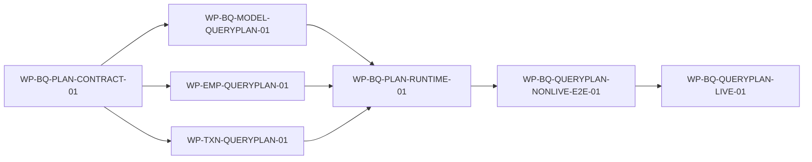

# [P3_00] 单体 Agent 代码实施计划

## 1. 文档信息

| 项目 | 内容 |
|---|---|
| 文档标识 | P3_00 |
| 文档类型 | 设计驱动实施计划 |
| 文档状态 | Reviewed |
| 当前版本 | v1.29 |
| 更新日期 | 2026-08-24 |
| 目标计划路径 | Employee/Transaction LLM QueryPlan 唯一链路 |
| 适用范围 | QueryPlan 合同、模型任务、两域定义、Runtime 切换、non-live/live 集成 |
| 非范围 | Knowledge 改造、结果模型出域、新业务接口/DTO/DB、生产发布 |
| 权威顺序 | 用户范围 → REQ/L0/L1 → L2 → 当前实现证据 → 本计划 |
| 历史审计 | [`P3_00_CODE_IMPLEMENTATION_AUDIT_HISTORY.md`](history/P3_00_CODE_IMPLEMENTATION_AUDIT_HISTORY.md)，只读且不构成新授权 |
| 实施授权 | Ready 不等于实施授权；`GATE-064` 已由 2026-08-24 用户目标授权关闭，non-live 代码/测试/状态同步及原子 Git 提交推送已授权，真实模型/业务调用仍受 `GATE-065` 控制 |

## 2. 修改历史

| 序号 | 日期 | 位置 | 原因 | 修改内容 |
|---:|---|---|---|---|
| 1 | 2026-08-21 | 全文 | 建立瘦身后的当前计划基线 | v1.17；历史流水迁移到审计附件 |
| 2 | 2026-08-24 | 全文 | Business 查询权威改为 LLM QueryPlan | v1.18；重算7包、8条依赖、3个P3门禁和UAT交接 |
| 3 | 2026-08-24 | §5/7/9/12/14 | `GATE-064` 授权与公共合同实施证据成立 | v1.19；关闭 `GATE-064`，完成 `WP-BQ-PLAN-CONTRACT-01`，开放 Model/Employee/Transaction 三个 Ready 工作包 |
| 4 | 2026-08-24 | §5/9/12/14 | `business-query-plan-v1` non-live task、输入保护、严格 provider decoder、fake transport 与模型回归证据成立 | v1.20；完成 `WP-BQ-MODEL-QUERYPLAN-01`，Employee/Transaction 保持 Ready，Runtime 等待两域前置 |
| 5 | 2026-08-24 | §5/9/12/14 | Employee protected-ref definition/config、固定 GET/codec、Java 最终授权与历史测试隔离证据成立 | v1.21；完成 `WP-EMP-QUERYPLAN-01`，Transaction 保持 Ready，Runtime 仅等待 Transaction |
| 6 | 2026-08-24 | §5/9/12/14 | Transaction 8字段 QueryPlan、protected-ref、Decimal/page/sort 配置及 Java 合同回归成立 | v1.22；完成 `WP-TXN-QUERYPLAN-01`，Runtime 前置全部关闭并转为 Ready |
| 7 | 2026-08-24 | §3/5/9/12/14 | Runtime 实施发现 binder 当前请求签名、extractor/Guard 责任和共享分支描述不闭合 | v1.23；原子修订三份 L2，`WP-BQ-PLAN-RUNTIME-01` 转为 In Progress，待修订评审后恢复代码收口 |
| 8 | 2026-08-24 | §5/12/13/14 | 独立复评发现 request cancellation 未显式进入 planning | v1.24；L2_00_01 v1.4 增加取消/迟到结果接缝，Runtime 保持 In Progress |
| 9 | 2026-08-24 | §3/5/9/12/13/14 | 扩展回归发现旧 Business Local Resolver 测试与唯一链路冲突 | v1.25；区分历史 evidence 与过时可执行资产，增加范围受限清理活动，不改变7个目标工作包 DAG |
| 10 | 2026-08-24 | §5/9/12/14/15 | Runtime 唯一分支、取消/迟到失败关闭、生产 Resolver 拒绝及专属旧旁路清理验证成立 | v1.26；完成 `WP-BQ-PLAN-RUNTIME-01`，`WP-BQ-QUERYPLAN-NONLIVE-E2E-01` 转为 Ready |
| 11 | 2026-08-24 | §5/11/13/14/15 | non-live 全量回归发现4项旧架构绝对断言与已评审 planning 设计冲突 | v1.27；按个人项目最小性保留唯一 provider-neutral bridge，更新精确架构门禁；non-live E2E 转 In Progress |
| 12 | 2026-08-24 | §3/5/9/12/14/15 | 10-case 双域 E2E、精确架构门禁、全量当前 non-live 回归及代码复评成立 | v1.28；完成 `WP-BQ-QUERYPLAN-NONLIVE-E2E-01`，关闭最后空 support 字段清理，live 仍受 `GATE-065` 阻塞 |
| 13 | 2026-08-24 | §5/7/9/12/13/14/15 | `GATE-065` non-live 候选、严格 manifest/authorization template、预算/消费/失败关闭及历史不可变验证成立 | v1.29；冻结 candidate-01，live 仍待绑定最终 frozen HEAD 的一次性明确授权，未产生 outbound |

## 3. 来源清单与当前基线

### 3.1 权威来源

| 资源 | 角色 | 层级 | 状态/版本 | 权威范围 | 是否读取 | 置信度 |
|---|---|---|---|---|---|---|
| [`REQ_00`](../REQ_00_SINGLE_AGENT_QUERY_REQUIREMENTS.md) | 需求 | REQ | 已确认 v1.6 | 唯一查询链、接口缺口、UAT目标、历史/过时资产边界 | 是 | 高 |
| [`L0_00`](../design/L0_00_SINGLE_AGENT_ARCHITECTURE.md) | 总体架构 | L0 | Approved v1.3 | 全局不变量、所有权和清理边界 | 是 | 高 |
| [`L1_00`](../design/L1_00_SINGLE_AGENT_CORE_RUNTIME_ARCHITECTURE.md) | Core/Runtime架构 | L1 | Approved v1.3 | planning node、Core、组合根 | 是 | 高 |
| [`L1_02`](../design/L1_02_SINGLE_AGENT_BUSINESS_QUERY_ADAPTER_ARCHITECTURE.md) | Business架构 | L1 | Approved v1.2 | plan/config/Adapter/权限和专属旧 Resolver 清理 | 是 | 高 |
| [`L2_00_01`](../design/L2_00_01_SINGLE_AGENT_CORE_EXECUTION_CAPABILITY_REGISTRATION_DETAILED_DESIGN.md) | Core详细设计 | L2 | Approved v1.6 | plan→candidate、composition、request cancellation | 是 | 高 |
| [`L2_00_02`](../design/L2_00_02_SINGLE_AGENT_DEEPSEEK_MODEL_ACCESS_CONTROLLED_GENERATION_DETAILED_DESIGN.md) | 模型详细设计 | L2 | Approved v1.5 | model task/catalog/decoder/Business Guard | 是 | 高 |
| [`L2_02_00`](../design/L2_02_00_SINGLE_AGENT_BUSINESS_QUERY_COMMON_CONSTRAINTS_CONFIGURATION_EGRESS_DETAILED_DESIGN.md) | Business common | L2 | Approved v1.6 | plan/config/validator/binder和旧兼容字段清理 | 是 | 高 |
| [`L2_02_01`](../design/L2_02_01_SINGLE_AGENT_EMPLOYEE_ADAPTER_AUTHORIZATION_DETAILED_DESIGN.md) | Employee | L2 | Approved v1.4 | detail/ref/接口缺口 | 是 | 高 |
| [`L2_02_02`](../design/L2_02_02_SINGLE_AGENT_TRANSACTION_ADAPTER_AUTHORIZATION_DETAILED_DESIGN.md) | Transaction | L2 | Approved v1.4 | search/Decimal/page/sort | 是 | 高 |

### 3.2 当前实现基线

| 模块 | 当前事实 | 新目标差距 |
|---|---|---|
| Access/Core/Registry | 已实现并有测试 | 可复用，公共契约不扩大 |
| Model runtime | transport/gateway/ID-only selector/answer task 与 `business-query-plan-v1` 本地任务已实现，默认 stub；Business Runtime 装配完成 | 缺真实 QueryPlan 集成 |
| Business common | handler/JWT/config snapshot/result/egress、plan validator/binder、两域 typed config、唯一 Runtime 入口与 fake system E2E 已实现 | 缺真实 QueryPlan 集成 |
| Employee | detail Adapter、最终授权、protected-ref definition/config 与 fake system E2E 已实现 | 缺真实 QueryPlan 集成 |
| Transaction | search Adapter、ExactDecimal、最终授权、8字段 definition/config 与 fake system E2E 已实现 | 缺真实 QueryPlan 集成 |
| UAT | 旧 evidence 使用 stub/本地解析 | 不满足真实 LLM QueryPlan 目标 |

历史 `WP-ACTION-RESOLUTION-01`、`WP-BUSINESS-LOCAL-RESOLVER-01` 和 ID-only PoC 的 Done 不改写，但不是新目标的完成证据。Employee 只确认 detail；地点/职位筛选不在计划内。

## 4. 计划原则与范围

1. 先合同和 non-live，再切生产对象图，最后真实集成/UAT。
2. Employee/Transaction 在公共合同后可并行；Runtime cutover 等待两域定义和模型 task。
3. 模型失败、非法计划和 unsupported 均在 Adapter 前终止，无 Resolver/Knowledge/跨域 fallback。
4. 真实模型、业务服务和付费调用由后置门禁控制，历史授权不可复用。
5. 默认 stub、动作 disabled；回滚不改写历史 evidence。
6. 发现需要新业务 API/DTO/DB/依赖/扩权时停止，不扩大工作包。

## 5. 工作包清单

| 工作包 ID | 名称 | 来源设计 | 范围 | 直接依赖 | 入口门禁 | 交付物 | 验证 | 回滚边界 | 状态 |
|---|---|---|---|---|---|---|---|---|---|
| `WP-BQ-PLAN-CONTRACT-01` | QueryPlan 公共合同与配置 | `L2_02_00 IMPL-BQCOM-001～005` | plan/value/ref/slot、payload decoder、validator/binder、typed config/snapshot、catalog；fake/static | - | `GATE-064` | Business planning common 源码与测试 | 14项定向、53项Business回归、strict mypy/compileall；补齐跨请求slot拒绝，复评无未关闭Major | feature disabled；不改 Core/历史 | Done |
| `WP-BQ-MODEL-QUERYPLAN-01` | `business-query-plan-v1` 本地任务 | `L2_00_02 IMPL-MODEL-001～006` | task/prompt/catalog wire/provider response exact JSON decoder/generator；fake transport、零密钥 | `WP-BQ-PLAN-CONTRACT-01` | - | model task 与 contract tests | 20项新契约测试、199项Model非live回归、strict mypy/compileall；代码对照设计无未关闭Major | 移除新task注册；保留既有tasks与默认stub | Done |
| `WP-EMP-QUERYPLAN-01` | Employee detail QueryPlan | `L2_02_01 IMPL-EMP-001～006` | definition 去 Resolver、protected-ref config/provider、detail/unsupported tests；不改 Java API | `WP-BQ-PLAN-CONTRACT-01` | - | Employee plan definition/config/tests | 25项定向、442项相关非live通过/14项按授权跳过、Java授权/可见性7项通过、strict mypy/compileall；2项旧bootstrap仅因本地冻结JAR哈希漂移未计入 | 保持action disabled；回滚新组合装配，不恢复旧 Resolver；历史evidence不改 | Done |
| `WP-TXN-QUERYPLAN-01` | Transaction search QueryPlan | `L2_02_02 IMPL-TXN-001～007` | definition 去 Resolver、field/operator/config、Decimal/page/sort；不改 Java DTO | `WP-BQ-PLAN-CONTRACT-01` | - | Transaction plan definition/config/tests | 代码评审修复文本 literal 下游 strip 风险后，112项定向、226项Transaction非live通过/5项live按门禁跳过、243项Business/Model回归、Java授权/Decimal 25项通过、strict mypy/compileall；3项冻结历史环境测试不计入且资产未改 | Transaction action disabled；不改DB | Done |
| `WP-BQ-PLAN-RUNTIME-01` | Runtime 唯一链路切换 | `L2_00_01 IMPL-CORE-001～008` | planning node、protected extractor 组合、request cancellation、plan→candidate、ModelContext、composition切断Resolver/ID-only Business路径 | `WP-BQ-MODEL-QUERYPLAN-01`,`WP-EMP-QUERYPLAN-01`,`WP-TXN-QUERYPLAN-01` | - | Runtime对象图、启动校验、测试 | 64项直接回归、452项相关回归、strict mypy/compileall；独立代码复核修复1个固定失败码 Minor 后复评无 Blocker/Major/Minor | 两域 disabled；不恢复旁路为目标配置 | Done |
| `WP-BQ-QUERYPLAN-NONLIVE-E2E-01` | fake 双域系统闭环 | 全部五份L2测试约束 | Spring→Runtime→fake model→fake domain；成功/非法/失败/unsupported/JWT/单动作；精确架构门禁 | `WP-BQ-PLAN-RUNTIME-01` | - | non-live E2E与零旁路证据 | 10-case Spring/Runtime/fake 双域、31项定向/架构测试、strict mypy/compileall 通过；全量1220通过/27 live跳过/3项冻结JAR哈希漂移精确排除；代码复评修复3个证据严格性 Minor 后无未关闭 Blocker/Major/Minor | 新链路 disabled | Done |
| `WP-BQ-QUERYPLAN-LIVE-01` | 真实模型与业务服务集成 | `REQ_00 §12`; UAT前置 | 冻结非敏感case、真实DeepSeek plan、Employee detail/Transaction search、权限/计数/零泄漏 | `WP-BQ-QUERYPLAN-NONLIVE-E2E-01` | `GATE-065` | append-only有限evidence与集成结论 | candidate-01 non-live：12项定向、strict mypy/compileall、PowerShell AST、预算/消费/失败关闭/历史hash通过；正式 live 未执行，`GATE-066` 未关闭 | 停隔离进程、恢复disabled | Blocked |

### 5.1 范围受限清理活动（不新增工作包或依赖边）

`CLN-BQP-001` 已完成：第一阶段删除 Employee/Transaction 专属 `action_resolver.py`、只验证旧旁路的测试与 UAT launcher 入口，生产 `BusinessSupportFactory` 拒绝非空 resolver；第二阶段在 system E2E 切换 QueryPlan binding 后删除无调用方的 `BusinessSupportSnapshot.local_action_resolvers` 空字段。`BusinessActionDefinition` legacy 字段和底层 validator 因冻结历史 Employee egress harness 复验保留；共享非 Business resolver 继续保留。引用扫描、历史哈希、Core/Business/Knowledge/双域回归和 Git 删除范围复核已通过。

必须保留通用 capability/graph resolver 合同及仍由非 Business 使用的实现；必须保留全部冻结 manifest、authorization、evidence、hash、审计记录和旧 UAT fixture。旧 UAT fixture 不再执行为本版本测试。清理不得改变公共 HTTP、业务 DTO、数据库、权限或历史文件字节。

## 6. 直接依赖图

| 依赖 ID | 前置工作包 | 后继工作包 | 类型 | 技术依据 | 来源证据 |
|---|---|---|---|---|---|
| `DEP-BQP-001` | `WP-BQ-PLAN-CONTRACT-01` | `WP-BQ-MODEL-QUERYPLAN-01` | contract | task/catalog 消费确定 plan/config schema | `L2_00_02 DR-MODEL-016/017` |
| `DEP-BQP-002` | `WP-BQ-PLAN-CONTRACT-01` | `WP-EMP-QUERYPLAN-01` | contract | Employee 使用 common ref/config | `L2_02_01 DR-EMP-014` |
| `DEP-BQP-003` | `WP-BQ-PLAN-CONTRACT-01` | `WP-TXN-QUERYPLAN-01` | contract | Transaction 使用 common field/operator/config | `L2_02_02 DR-TXN-014/015` |
| `DEP-BQP-004` | `WP-BQ-MODEL-QUERYPLAN-01` | `WP-BQ-PLAN-RUNTIME-01` | runtime | Runtime 需要 generator | `L2_00_01 DR-CORE-012/013` |
| `DEP-BQP-005` | `WP-EMP-QUERYPLAN-01` | `WP-BQ-PLAN-RUNTIME-01` | contract | 组合根需最终 Employee definition | `L2_00_01 §6` |
| `DEP-BQP-006` | `WP-TXN-QUERYPLAN-01` | `WP-BQ-PLAN-RUNTIME-01` | contract | 组合根需最终 Transaction definition | `L2_00_01 §6` |
| `DEP-BQP-007` | `WP-BQ-PLAN-RUNTIME-01` | `WP-BQ-QUERYPLAN-NONLIVE-E2E-01` | runtime | E2E 需要唯一对象图 | `L1_00 §5/8` |
| `DEP-BQP-008` | `WP-BQ-QUERYPLAN-NONLIVE-E2E-01` | `WP-BQ-QUERYPLAN-LIVE-01` | validation | 真实调用前证明预算/失败关闭/无旁路 | `REQ_00 §11/12` |

DAG 无环，Employee/Transaction 之间没有依赖边。

## 7. 阶段门禁

| 门禁 ID | 工作包 | 类型 | 控制动作 | 是否阻塞入口 | 关闭条件 | 证据/权威来源 | 责任方/外部提供方 | 最晚关闭阶段 | 验证者与方法 | 未关闭行为 | 状态 |
|---|---|---|---|---|---|---|---|---|---|---|---|
| `GATE-064` | `WP-BQ-PLAN-CONTRACT-01` | slice_implementation | non-live代码实施 | 是 | 用户明确授权目标代码/测试/文档范围 | 2026-08-24目标授权与提交范围 | 用户 | P3开始 | 授权边界复核；真实调用仍排除 | 后续non-live包按依赖推进 | Closed |
| `GATE-065` | `WP-BQ-QUERYPLAN-LIVE-01` | integration | 真实模型/服务/付费调用 | 是 | 前六包Done；冻结HEAD/task/prompt/catalog/config/cases/预算并一次性授权 | candidate-01：frozen HEAD `b22497242807e38855a322b6d1ee7d5514edeaaa`；run `business-query-plan-live-v1-20260824-candidate-01`；manifest SHA-256 `eed2e0c3b84649823bcfc0fd52a899f6336d8de8bf3fe5f83731e96dd3daa2b8`；预算 model/Employee/Transaction=`6/2/2` | 用户/维护者 | P4 live前 | 独立hash/schema/preflight | 候选已准备；未获绑定上述 frozen HEAD 的一次性授权前不产生outbound | Open |
| `GATE-066` | `WP-BQ-QUERYPLAN-LIVE-01` | closure | 宣告唯一链路集成完成 | 否 | 合格case plan=1、业务≤1、Resolver/另一域/Knowledge=0，权限/跨语言/零泄漏通过 | live evidence | Codex复核 | UAT前 | code-against-design + evidence | live包不Done | Open |

## 8. 外部资源与事实

| 资源 ID | 工作包 | 资源/事实 | 提供方 | 开始准备 | 必须完成 | 产物/引用 | 缺失影响 |
|---|---|---|---|---|---|---|---|
| `EXT-BQP-001` | `WP-BQ-QUERYPLAN-LIVE-01` | `LLM_API_KEY`、可用DeepSeek模型/额度 | OS环境/用户 | non-live Done后 | GATE-065前 | 仅存在性/模型版本/预算，不记录key | live保持Blocked |
| `EXT-BQP-002` | `WP-BQ-QUERYPLAN-LIVE-01` | Employee测试标识、ADMIN/VIEWER JWT、detail服务 | 维护者/auth/employee-service | live preflight | 首个Employee case前 | 内存值、有限授权/服务证据 | Employee live不执行 |
| `EXT-BQP-003` | `WP-BQ-QUERYPLAN-LIVE-01` | Transaction查询值、JWT、search服务与DB精度事实 | 维护者/auth/transaction-service | live preflight | 首个Transaction case前 | 内存值、有限服务/precision证据 | Transaction live不执行 |

## 9. Ready 队列与执行建议

| 顺序 | 工作包 | 判定 | 未关闭依赖/门禁 | 选择理由 |
|---:|---|---|---|---|
| 1 | `WP-BQ-QUERYPLAN-LIVE-01` | Blocked | `GATE-065` 的一次性明确授权及运行时资源 | candidate-01 已冻结并通过 non-live 验证；真实模型和域服务调用尚未授权 |
| 2 | `WP-BQ-QUERYPLAN-NONLIVE-E2E-01` | Done | 无 | 10-case 双域 E2E、精确架构门禁和全量当前 non-live 回归已通过 |
| 3 | `WP-BQ-PLAN-RUNTIME-01` | Done | 无 | planning 顺序、取消/迟到、组合根、Resolver 隔离与清理已验证 |
| 4 | `WP-BQ-PLAN-CONTRACT-01` | Done | 无 | 公共合同、配置、binder 和 catalog 已验证 |
| 5 | `WP-BQ-MODEL-QUERYPLAN-01` | Done | 无 | QueryPlan task、输入保护、decoder/generator 与 fake transport 已验证 |
| 6 | `WP-EMP-QUERYPLAN-01` | Done | 无 | protected-ref、definition/config、固定GET及Java授权回归已验证 |
| 7 | `WP-TXN-QUERYPLAN-01` | Done | 无 | 8字段配置、protected-ref、Decimal/page/sort及固定POST合同已验证 |

本表只描述当前推进顺序，不构成新的依赖边。当前进入 fake 双域系统闭环。

## 10. 实施交接

| 工作包 | 允许动作 | 禁止动作 | 预期文件/模块 | 来源设计 ID | 测试与验证 | 开放后续门禁 | 建议执行技能 |
|---|---|---|---|---|---|---|---|
| `WP-BQ-PLAN-CONTRACT-01` | common plan/config non-live | Core/HTTP/真实调用 | `agent_runtime.business` | `IMPL-BQCOM-001～005` | common tests/mypy | 后续三包 | `implement-from-detailed-design` |
| `WP-BQ-MODEL-QUERYPLAN-01` | 新task/fake transport | key/live/改历史task | `agent_runtime.model` | `IMPL-MODEL-001～006` | model contract/history | Runtime包 | `implement-from-detailed-design` |
| `WP-EMP-QUERYPLAN-01` | detail definition/config/tests | 新Employee API/DTO/DB | Employee Python Adapter | `IMPL-EMP-001～006` | Employee contract/Java回归 | Runtime包 | `implement-from-detailed-design` |
| `WP-TXN-QUERYPLAN-01` | search definition/config/tests | Date/aggregate/write/DTO/DB | Transaction Python Adapter | `IMPL-TXN-001～007` | Decimal/Python/Java回归 | Runtime包 | `implement-from-detailed-design` |
| `WP-BQ-PLAN-RUNTIME-01` | planning node/组合根切换 | 保留Business旁路 | Runtime/bootstrap | `IMPL-CORE-001～008` | reachability/concurrency/cancel | non-live E2E | `implement-from-detailed-design` |
| `WP-BQ-QUERYPLAN-NONLIVE-E2E-01` | fake system E2E | key/真实服务 | tests/system_e2e | 各L2 TEST | 全量non-live | GATE-065准备 | `implement-from-detailed-design` |
| `WP-BQ-QUERYPLAN-LIVE-01` | 精确授权内live | retry/补跑/结果出域 | opt-in launcher/evidence | REQ §12/UAT | schema/hash/权限/零泄漏 | GATE-066/UAT | `implement-from-detailed-design` |

## 11. 风险与阻塞

| 风险 ID | 工作包 | 类型 | 触发条件 | 影响 | 缓解/解除条件 | 责任方 |
|---|---|---|---|---|---|---|
| `RISK-BQP-001` | Runtime | 双链路 | Resolver/ID-only仍可达 | 绕过LLM目标 | composition reachability+失败零调用 | 实施者/评审者 |
| `RISK-BQP-002` | Contract/两域 | 契约扩大 | config包含新field/operator | 越权/接口不兼容 | startup subset失败关闭 | 实施者 |
| `RISK-BQP-003` | Employee | 复用条件缺口 | 尝试用仅校验用户令牌、返回原始ES字符串的通用搜索支持地点筛选 | 绕过最终角色授权或形成不稳定契约 | 保持unsupported；另行授权业务端点收紧与兼容性设计 | 用户/业务维护者 |
| `RISK-BQP-004` | Model/live | 敏感/费用 | 标识出域或预算不固定 | 数据/成本风险 | slot、spy、一次性授权 | 用户/实施者 |
| `RISK-BQP-005` | Transaction | 精度 | float/scale/rounding | 查询结果错误 | canonical string→JSON number→BigDecimal tests | 实施者 |

## 12. 追踪矩阵

| 工作包 | 来源 REQ/CON/DR | IMPL | TEST | VAL | 交付状态 |
|---|---|---|---|---|---|
| `WP-BQ-PLAN-CONTRACT-01` | `DR-BQCOM-019～024` | `IMPL-BQCOM-001～005` | `TEST-BQCOM-001～012` | `VAL-BQCOM-001～003` | Done |
| `WP-BQ-MODEL-QUERYPLAN-01` | `DR-MODEL-016～021` | `IMPL-MODEL-001～006` | `TEST-MODEL-001～008` | `VAL-MODEL-001～003` | Done |
| `WP-EMP-QUERYPLAN-01` | `DR-EMP-013～017` | `IMPL-EMP-001～006` | `TEST-EMP-001～012` | `VAL-EMP-001～003` | Done |
| `WP-TXN-QUERYPLAN-01` | `DR-TXN-013～018` | `IMPL-TXN-001～007` | `TEST-TXN-001～012` | `VAL-TXN-001～003` | Done |
| `WP-BQ-PLAN-RUNTIME-01` | `DR-CORE-012～016` | `IMPL-CORE-001～008` | `TEST-CORE-001～009` | `VAL-CORE-001～003` | Done |
| `WP-BQ-QUERYPLAN-NONLIVE-E2E-01` | 全部L2 non-live约束 | 各包组合根/测试 | 全量non-live | 跨层验证 | Done |
| `WP-BQ-QUERYPLAN-LIVE-01` | `REQ_00 §12`; UAT_00 | opt-in launcher/evidence | live matrix | `GATE-066` | Blocked |

## 13. 自检记录

| 轮次 | 日期 | Blocker | Major | Minor | 已修复 | 遗留 | 停止原因 |
|---:|---|---:|---:|---:|---|---|---|
| 1 | 2026-08-24 | 0 | 4 | 3 | 补齐 L2 trace/readiness、计划模板/门禁/资源所有权及格式 | 0 | - |
| 2 | 2026-08-24 | 0 | 2 | 0 | 统一 `unauthenticated`；闭合 unsupported 终态且禁止进入 Core | 0 | - |
| 3 | 2026-08-24 | 0 | 1 | 2 | 核实 Employee ES 端点复用缺口；修正工作包引用和失真评审表述 | 0 | - |
| 4 | 2026-08-24 | 0 | 2 | 1 | 闭合 binder 当前请求签名、Runtime 分支隔离和 input denied 语义 | 0 | - |
| 5 | 2026-08-24 | 0 | 1 | 1 | 分离 protected extractor 与 Model Guard 责任；非法业务输入不回退 | 0 | - |
| 6 | 2026-08-24 | 0 | 0 | 2 | 同步三份 L2 版本、工作包状态和实现触点；DAG 无环 | 0 | 三轮完成 |
| 7 | 2026-08-24 | 0 | 1 | 0 | 独立复评发现取消信号缺口；补充 request-scoped 透传、三检查点和零迟到执行测试要求 | 0 | 修订完成，待复评 |
| 8 | 2026-08-24 | 0 | 1 | 1 | 纠正旧 Resolver 测试与唯一链路冲突、移除恢复旧 definition 回滚表述 | 0 | - |
| 9 | 2026-08-24 | 0 | 1 | 0 | 发现冻结历史 harness 依赖 legacy 字段；收窄为生产 factory 拒绝、专属实现删除 | 0 | - |
| 10 | 2026-08-24 | 0 | 0 | 2 | 修复 L2 当前基线标题与 Transaction readiness 值；版本/DAG/门禁复核无环 | 0 | 三轮完成 |
| 11 | 2026-08-24 | 0 | 0 | 3 | non-live 代码评审修复 evidence 通过不变式、空字段响应断言和 Employee 精确端点校验 | 0 | 修复后复评通过 |
| 12 | 2026-08-24 | 0 | 2 | 4 | 修复构造期资源清理/有限失败证据、逐 case 跨域计数、资产路径约束、受保护值模型输入扫描、Git SHA 长度校验及 authorization template 可执行性约束 | 0 | candidate-01 non-live 复评通过；正式 live 等待授权 |

## 14. 当前结论

- Ready 工作包：0。
- Blocked 工作包：1（`WP-BQ-QUERYPLAN-LIVE-01`）。
- In Progress 工作包：0。
- Done 工作包：6（`WP-BQ-PLAN-CONTRACT-01`、`WP-BQ-MODEL-QUERYPLAN-01`、`WP-EMP-QUERYPLAN-01`、`WP-TXN-QUERYPLAN-01`、`WP-BQ-PLAN-RUNTIME-01`、`WP-BQ-QUERYPLAN-NONLIVE-E2E-01`）。
- Deferred 工作包：0。
- 关键开放门禁：P3 `GATE-065/066`；`GATE-064` 已关闭；UAT 另有 `GATE-UAT-006`。
- `GATE-065` non-live 候选已冻结：run `business-query-plan-live-v1-20260824-candidate-01`，manifest SHA-256 `eed2e0c3b84649823bcfc0fd52a899f6336d8de8bf3fe5f83731e96dd3daa2b8`，frozen HEAD `b22497242807e38855a322b6d1ee7d5514edeaaa`，精确预算 model/Employee/Transaction=`6/2/2`。
- 推荐下一步：申请并绑定上述 frozen HEAD/run/manifest/预算的一次性 `GATE-065` live 授权；授权前不读取密钥、不调用真实模型或业务服务、不产生 outbound。
- 当前不得执行真实 LLM、业务服务调用或 Employee/Transaction 成功 UAT。
- Employee 地点/职位筛选保持 `unsupported`：现有通用 ES 搜索的字段能力已确认，但最终角色授权与受限响应契约未满足，不属于本计划。

## 15. 评审记录

原 v1.18 三轮作者内审及独立评审已通过。v1.25 清理修订另执行三轮内审与三轮独立复评：R1 关闭冻结历史 harness legacy 字段误删 Major，R2 关闭旧 UAT launcher 可执行旁路及实现落点缺口，R3 无 Blocker/Major/Minor。Runtime 代码对照设计复核 R1 发现 binder 失败固定 code 不一致 Minor，最小修复并补测试后 R2 无 Blocker/Major/Minor。Reviewed/Done 均不表示 live 门禁关闭。

v1.27 门禁审查按“个人学习验证、必要安全边界、避免过度治理”执行三轮内审：R1 确认4项为旧架构断言而非业务合同失败；R2 将例外收紧到唯一 planning bridge、request cancellation、有限 union 和 Registry validate-only；R3 复核 Core/handler 执行所有权、provider 隔离和 DAG 无环。独立评审 R1 补充禁止私有 registered-call 类型与 handler 调用，R2 无 Blocker/Major/Minor。

v1.28 non-live 代码对照设计评审 R1 发现3个 Minor：evidence 的 passed 未绑定完整矩阵，Java 未断言空 `capabilityId/error`，fake Employee 只校验路径前缀。最小修复及负向测试后 R2 无 Blocker/Major/Minor；3项冻结历史 JAR 哈希漂移不改写、不计为当前实现缺陷。

v1.29 candidate-01 non-live 代码对照设计评审 R1 发现构造阶段失败清理与逐 case 跨域计数2个 Major，以及资产路径、模型输入受保护值扫描等4个 Minor；最小修复后 R2 发现 `preparedHead` 错按 SHA-256 长度校验和授权模板缺少不可执行断言2个 Minor，修复后 R3 无 Blocker/Major/Minor。全量当前非-live为1224通过、27项live跳过；5项独立历史环境/冻结hash测试精确排除且未修改历史资产。
