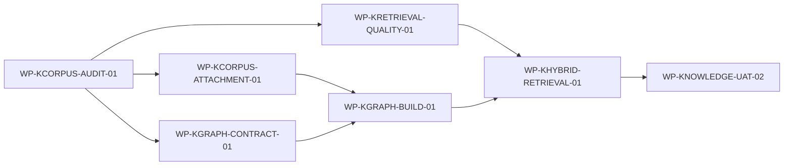

# [ROADMAP_01] Knowledge 正文附件、检索质量与轻量知识图谱演进路线图

## 1. 文档信息

| 项目 | 内容 |
|---|---|
| 文档编号 | `ROADMAP_01` |
| 当前版本 | v0.8 |
| 文档状态 | Reviewed |
| 更新时间 | 2026-09-04 |
| 规划性质 | 后续能力路线图，不是当前实施计划、完成声明或代码授权 |
| 来源 | 当前非历史 Knowledge 架构与详细设计、现有检索链路，以及“正文附件补齐、检索质量修复、轻量知识图谱、原文最终取证”四项改进方向 |
| 适用范围 | Knowledge 语料完整性、附件处理、跨域召回、问题改写、排序、失败语义、轻量知识图谱、效果验收 |
| 当前设计依据 | `L1_01`、`L2_01_00`、`L2_01_01`、`L2_01_02` 当前非历史版本 |
| 实施授权 | 本路线图中的 `Ready` 仅表示规划前置具备，不等于数据库、索引、外部下载、代码或生产实施授权 |

本路线图记录后续演进方向、直接依赖、门禁和验收顺序。阶段 A 已由 REQ_00 v2.3、L1_01 v1.15、L2_01_00 v1.15、L2_01_01 v2.5、L2_01_02 v1.16 和 P3 v2.40 实施收口；阶段 B 的当前设计和实施已进入独立专项验收，但尚未通过。阶段 C/D 仍须先完成相应设计修订。动态状态以当前P3/UAT为准。

Ready 不等于实施授权。

## 2. 修改历史

| 版本 | 日期 | 变更内容 |
|---|---|---|
| v0.1 | 2026-09-02 | 建立正文附件补齐、检索质量修复、轻量知识图谱和原文证据闭环的初始路线图 |
| v0.2 | 2026-09-02 | 阶段 A 启动 | 明确 P0/P1/P2 有限完成范围，把首次持久获取/候选写入入口门禁与 alias 发布门禁拆开，消除以构建结果关闭构建入口的循环 |
| v0.3 | 2026-09-02 | 审计边界纠偏 | 将索引库存、官方来源可达性和正文完整性拆分；不可达来源不等于正文缺失，P0/P1 改由人工清单和官方替代来源证明治理 |
| v0.4 | 2026-09-02 | 阶段 A 收口 | 同步 audit v3、版本化附件处理、candidate a2、14/14专项 UAT 与受控发布；阶段 B 四项质量问题保持独立 |
| v0.5 | 2026-09-03 | 阶段 A 复评收口 | 保留证据映射不足的 UAT attempt-01，以修复后的 attempt-02 作为最终 14/14 证据，并同步严格流水线合同复评结果 |
| v0.6 | 2026-09-03 | 阶段 A 结构完整性收口 | 修复 legacy DOC 扁平解析和条款关系缺失，以 candidate a4、UAT attempt-04、新快照及三步 alias 演练完成最终发布；早期 candidate/证据不删除 |
| v0.7 | 2026-09-03 | 阶段 A 可复现发布收口 | 修复逐资产网络/损坏容器失败隔离，以最终工具源码重建 Stage A corpus candidate-08/a5；UAT/release attempt-05 完成 14/14 和 a4→a5→a4→a5 原子演练，a1～a4 均保留 |

## 3. 来源清单与当前基线

本路线图以当前非历史 `L1_01`、`L2_01_00`、`L2_01_01` 和 `L2_01_02` 为约束基线，并把上一轮问题诊断仅作为待复核的规划输入。当前设计之外的语料导入、索引生命周期和图谱能力，必须先建立新的权威设计。

## 4. 计划原则与范围

### 4.1 方向结论

四项方向整体合理，但应按“先补语料、再修检索、后建图谱、最后联合验收”推进，不能把知识图谱当作正文缺失或召回缺陷的替代方案。

| 方向 | 判断 | 关键约束 |
|---|---|---|
| 补齐正文及附件 | 必要且优先级最高 | 先只读盘点，再建立版本化导入、解析、质量校验和回滚；不得覆盖现行索引 |
| 修复跨域召回、改写、排序和失败语义 | 合理且应在图谱前完成 | 先证明问题来自域选择、召回、排序还是证据不足；不得用跨域 fallback 掩盖失败 |
| 建立轻量知识图谱 | 合理，但应小步实施 | 首期采用版本化关系数据和类型化导航，不引入独立图数据库或第二条 Knowledge 在线链路 |
| 原文作为最终证据 | 必须保持为不可破坏的不变量 | 图谱只发现候选和扩展查询；任何肯定回答都必须回到已授权原文片段并通过现有 Evidence/引用校验 |

推荐演进顺序：

```text
语料与附件缺口审计
→ 权威设计补齐与评审
→ 正文/附件版本化导入
→ 跨域召回、改写、排序和失败语义修复
→ 轻量图谱合同与关系数据建设
→ 图谱导航和原文检索联合
→ 功能、效果和安全 UAT
```

### 4.2 来源依据与详细基线

#### 4.2.1 当前权威设计

| 文档 | 当前稳定职责 | 与本路线图的关系 |
|---|---|---|
| `docs/design/L1_01_SINGLE_AGENT_KNOWLEDGE_QUERY_ARCHITECTURE.md` | 一个 `knowledge.query` 内完成改写、逻辑域选择、多路召回、融合重排、Evidence 和摘要 | 保持唯一在线链路、两级映射、授权和出域边界；当前范围明确排除文档导入和索引生命周期 |
| `docs/design/L2_01_00_SINGLE_AGENT_KNOWLEDGE_QUERY_FLOW_CONFIGURATION_DETAILED_DESIGN.md` | Knowledge 流程、域目录、检索计划、阶段失败和生产装配 | 跨域选择、问题改写和失败语义若调整，必须先修订本设计 |
| `docs/design/L2_01_01_SINGLE_AGENT_KNOWLEDGE_RETRIEVAL_LOCAL_MODEL_DETAILED_DESIGN.md` | 类型化 keyword/vector 检索、Profile 映射、读取授权、RRF 和 rerank | 排序、Profile、候选扩展和图谱导航必须继续隐藏物理索引、字段和 DSL |
| `docs/design/L2_01_02_SINGLE_AGENT_KNOWLEDGE_EVIDENCE_EGRESS_SUMMARY_EFFECTIVENESS_DETAILED_DESIGN.md` | Evidence 完整性、三层出域、抽取式摘要、引用校验和效果评估 | 图谱关系不能绕过原文 Evidence；效果 UAT 继续使用安全 Gate 和如实分类 |

#### 4.2.2 上一轮问题诊断形成的规划输入

以下内容属于需要在首个工作包重新核实的诊断输入，不是本路线图新建的事实权威：

- 部分政策页面的正文只列出附件名称，关键税目、服务分类或税率规则位于附件正文中；
- 当前单域选择可能使与法律或法规正文相关的必要证据未进入候选集合；
- 关键词和向量路径能够命中相关行业文档，但回答所需的分类依据与税率依据可能没有同时进入有限候选窗口；
- 问题改写、域选择、融合和重排共同影响必要证据覆盖，不能仅靠扩大 `topK` 解决；
- “无召回、证据不足、需要澄清、策略拒绝、下游失败”需要保持可区分语义。

#### 4.2.3 当前设计缺口

| 缺口 | 当前状态 | 处理原则 |
|---|---|---|
| 文档正文、附件下载、解析、OCR、切片和索引发布合同 | 当前 L1/L2 明确范围外 | 先形成新的需求/L1/L2 权威设计并评审 |
| 图谱实体、关系、溯源、时效和读取接口合同 | 尚未定义 | 先设计最小合同，不以本路线图表格代替详细设计 |
| 跨域检索增强 | 当前设计允许受控多域，但有明确选择规则且禁止 fallback | 仅允许在问题语义要求时一次性规划多域，不得失败后自动切换域 |
| 更细失败原因 | 当前公共状态以既有合同为准 | 优先作为内部有限 reason；若要改变公共 DTO，需另行评审和授权 |

### 4.3 规划边界

#### 4.3.1 必须保持的不变量

1. 生产中仍只有一个 `knowledge.query`，不建立第二套 Knowledge 在线流程或独立 `knowledge-service`。
2. Agent 只使用逻辑知识域和类型化检索合同，不接触 ES 索引名、字段物理名称、DSL、别名切换或图数据库查询语言。
3. `es-query-service` 继续独占稳定 Profile 到物理资源、字段和查询实现的映射。
4. 候选正文进入 Agent、Rerank、Evidence 或模型前，必须完成当前用户读取授权。
5. 模型出域继续取全局规则、逻辑域默认策略和文档级收紧策略的交集。
6. 图谱只用于分类、时效判断、候选文档定位、查询扩展和受控多跳导航；不得直接生成无原文引用的答案。
7. 任一图谱关系要进入回答链路，必须能解析到可读取的原始文档或片段，并通过现有 Evidence、引用唯一性和连续子串校验。
8. Knowledge 与 Employee/Transaction 互不 fallback；单请求仍只能执行一个顶层动作。
9. 历史 candidate、manifest、authorization、journal、result、evidence 和哈希保持不可变。
10. 当前项目为个人学习和技术验证项目，优先采用最小可验证实现，不预先引入 Neo4j、分布式图计算或生产级内容平台。

#### 4.3.2 规划范围内

- 当前知识语料和附件完整性盘点；
- 官方来源、附件、正文、表格和扫描件的受控获取与版本化；
- PDF、DOC、DOCX、XLS/XLSX 及必要 OCR 的解析质量验证；
- 父文档—附件—条款—片段的稳定关联；
- keyword/vector 跨域计划、问题改写、RRF/rerank 和必要证据覆盖优化；
- 有限、确定、可追溯的图谱实体和关系；
- 图谱候选扩展与原文检索联合；
- 功能、安全和效果 UAT。

#### 4.3.3 规划范围外

- 图谱直接回答用户问题；
- 以模型常识、图谱摘要或人工结论替代原文 Evidence；
- Agent 直接访问 ES、数据库、图数据库或物理索引；
- 修改公共接口、公共 DTO、角色、读取权限或模型出域权限；
- 自动修改真实知识正文、gold、历史效果结果或效果阈值；
- 一开始建设通用知识中台、独立图数据库集群、实时流式图谱或通用规则引擎；
- 未经专项设计和授权执行生产索引写入、别名切换或真实内容发布。

### 4.4 目标链路

```text
用户问题
→ 输入安全检查与问题改写
→ tax.policy / tax.law 受控单域或多域选择
→ es-query-service 当前用户读取授权
→ keyword + vector 授权原文召回
→ 轻量图谱的实体识别、时效约束和候选文档扩展
→ 候选合并、RRF、rerank
→ 原文 Evidence 选择与完整性校验
→ 三层模型出域决策
→ 受证据约束的摘要
→ 引用、连续子串和唯一性校验
→ 返回有原文依据的结果
```

图谱不单独构成回答路径。规范的回证据路径是：

```text
图谱关系或路径
→ 稳定 document/provision 标识
→ es-query-service 类型化原文读取或检索
→ 当前用户读取授权
→ Evidence Builder
→ Summary Validator
```

若关系无法解析到授权原文，结果只能是候选不足或 `insufficient_evidence`，不得依据关系标签给出肯定结论。

### 4.5 阶段方案

#### 4.5.1 阶段 A：正文及附件完整性

##### 4.5.1.1 只读盘点

建立文档—附件清单，至少检查：

- 文档号、标题、发布机关、发布日期、生效/失效日期；
- 正文是否完整、是否仅含附件名称、是否截断或为空；
- 附件 URL、文件类型、下载状态、SHA-256、字节数；
- 是否需要 OCR、表格结构是否保留、解析文本长度；
- 父文档、附件、条款和片段的关联是否完整；
- keyword/vector 索引版本及片段覆盖；
- 失败原因和待人工核验项。

优先级建议：

| 优先级 | 范围 | 目的 |
|---|---|---|
| P0 | 当前 UAT、常见税率和服务分类问题依赖的正文与附件 | 先修复已知回答缺口 |
| P1 | 当前有效税收政策及其附件 | 提升日常查询覆盖 |
| P2 | 历史、废止或低频材料 | 支持时效和沿革查询 |

##### 4.5.1.2 版本化处理流水线

待详细设计批准后，建议采用：

```text
官方来源发现
→ 受控下载
→ MIME/扩展名和哈希校验
→ 原始资产只读保存
→ 文本/表格解析
→ 必要 OCR
→ 标题、条款、表格感知切片
→ 父子关系和来源元数据绑定
→ 质量检查与隔离失败件
→ embedding
→ 新索引版本
→ 回归与抽样核验
→ 受控别名切换
```

不得原地覆盖现行索引。新版本发布前必须具备回滚目标；解析失败、来源不明或哈希异常的资产进入隔离区，不得静默进入检索。

#### 4.5.2 阶段 B：跨域召回、改写、排序和失败语义

##### 4.5.2.1 跨域召回

- 多域选择必须由原问题语义一次性产生，例如问题同时要求政策分类与法律依据时选择 `tax.policy` 和 `tax.law`；
- 不得先查一个域，失败后再自动切换另一个域；
- 每个域独立执行读取授权，任一整域明确拒绝继续遵循现有优先级；
- 跨域结果进入统一候选前保留来源域、路径、快照和授权依据。

##### 4.5.2.2 问题改写

改写应保留主体、服务类型、纳税人类型、计税方法、日期、税率/征收率和否定条件。以“酒店行业的住宿费用，适用哪种税率”为例，候选表达可覆盖：

- 酒店、住宿服务、增值税、税率；
- 住宿服务、生活服务；
- 酒店住宿、服务分类、适用规则。

上述只是语义类别示例，不应硬编码为逐句规则。模型输出必须继续由确定性合同约束，不能改变用户问题或补造未提供的纳税人类型。

##### 4.5.2.3 排序

排序优化应先通过离线诊断证明根因，再在现有服务合同内调整。可评估的信号包括：

- 标题、文号和条款精确匹配；
- 正文语义相关度；
- 发文机关和材料权威性；
- 生效、失效、废止和适用期间；
- 服务分类、纳税人类型和计税方法；
- keyword/vector 路径、RRF 和 BGE rerank 分数。

阶段 B 只使用现有接口实际提供且可验证的信号；不能仅凭 writtenDate 推断现行有效。图谱距离属于阶段 C/D，不参与阶段 B 排序。本轮详细合同和实施状态以当前 Knowledge L1/L2 与 P3_00 §20 为准；当前方案不扩大 per-path top20，而先修复 vector size 的既有合同实现，再检验域内排序与有限召回锚点。

##### 4.5.2.4 失败语义

建议在不改变公共 DTO 的前提下，先形成内部有限 reason：

| 内部 reason | 含义 | 对外原则 |
|---|---|---|
| `no_retrieval_hit` | 所有成功路径均无候选 | 映射现有无结果语义 |
| `insufficient_evidence` | 有候选但缺少回答全部显式要点的直接证据 | 返回非肯定结果 |
| `clarification_required` | 用户缺少决定查询含义的必要条件 | 仅在现有公共合同可表达时启用，否则先设计 |
| `model_egress_denied` | 读取可用但模型出域交集拒绝 | 保持摘要模型零调用 |
| `downstream_failure` | 依赖、超时、非法响应或全部技术路径失败 | 不得伪装为无结果 |

内部 reason 不得泄漏索引、策略、正文或依赖内部细节。任何公共错误合同变化必须单独评审。

##### 4.5.2.5 独立实施与验收路径

阶段 B 由 P3_00 的诊断→设计→实施→non-live→专项 UAT→质量收口直接依赖链执行。GATE-KRG-006 只控制受影响代码实施，关闭条件不包含代码完成或 live UAT。UAT_01 §14 独立验证核心 P0、错误语义、安全和保留回归，不依赖 WP-KNOWLEDGE-UAT-02、图谱或阶段 C/D。各工作包和 Gate 动态状态仅由 P3_00 维护；本路线图只保留职责、依赖及状态入口，不能把实现入口通过等同专项验收通过。

#### 4.5.3 阶段 C：轻量知识图谱

##### 4.5.3.1 最小实体集合

首期只纳入能直接提升税务分类、时效和多跳导航的实体：

- `Document`、`Attachment`、`Provision`；
- `TaxType`、`ServiceCategory`；
- `TaxRate`、`CollectionRate`；
- `TaxpayerType`、`CalculationMethod`；
- `EffectivePeriod`、`ExemptionOrPreference`。

##### 4.5.3.2 最小关系集合

- `contains`；
- `classifies_as`；
- `applies_rate`；
- `applies_to`；
- `uses_calculation_method`；
- `effective_during`；
- `supersedes`；
- `amends`；
- `exception_to`；
- `supported_by`。

关系名称和字段仅为路线图候选，必须在详细设计中冻结后才能实施。

##### 4.5.3.3 溯源与时效

每条可用关系至少绑定：

- `source_document_id`；
- `source_chunk_id` 或条款定位；
- 原文连续片段或其可验证定位；
- `source_sha256`；
- `effective_from`、`effective_to`；
- `validity_status`；
- `extraction_method`；
- `review_status`；
- `graph_version`。

没有来源、来源不可读、哈希不一致、时效不明或未通过审核的关系，不得用于扩展回答证据。

##### 4.5.3.4 首期技术形态

优先采用以下最小实现之一，由后续 L2 评审确定：

1. 版本化关系 JSON/JSONL，加严格 Schema、哈希和只读加载；
2. `es-query-service` 内部受控的独立关系索引；
3. 由 `es-query-service` 暴露类型化的实体解析和候选文档导航能力。

首期不建议引入 Neo4j。只有关系规模、复杂查询和超过三跳的稳定需求被真实 UAT 证明后，才评估专用图数据库。

#### 4.5.4 阶段 D：图谱与原文检索联合

图谱返回内容应限制为规范实体、关系路径、扩展词、时间约束和候选文档/条款标识。其后必须重新进入类型化原文检索和授权链路。

允许的用途：

- 将“酒店住宿”扩展到受控服务分类；
- 根据纳税人类型、计税方法和适用期间缩小候选；
- 从政策文件导航到附件、条款、修订或废止文件；
- 支持“分类依据 → 适用规则 → 时效状态”的有限多跳查询。

禁止的用途：

- 直接把图谱中的税率、结论或关系标签返回给用户；
- 让模型生成图查询语言、索引或物理字段；
- 在原文召回失败时把图谱关系当作证据；
- 以客户端二次过滤代替业务服务读取授权；
- 因一个域失败而切换到另一域。

## 5. 工作包清单

| 工作包 ID | 名称 | 来源设计 | 范围 | 直接依赖 | 入口门禁 | 交付物 | 验证 | 回滚边界 | 状态 |
|---|---|---|---|---|---|---|---|---|---|
| `WP-KCORPUS-AUDIT-01` | 正文及附件缺口只读审计 | `L1_01 §4.3`、`L2_01_01 DR-KRET-002/003`、本路线图 §4.5.1.1 | 盘点来源、正文、附件、解析、父子关系、索引覆盖和 P0/P1/P2 优先级；不下载、不写索引 | - | - | 有限缺口清单、来源证明、优先级、设计输入 | Schema、抽样复核、敏感信息扫描、现有索引零写入 | 删除本轮临时诊断；不改变线上资产 | Done |
| `WP-KCORPUS-ATTACHMENT-01` | 正文及附件版本化补齐 | `REQ-KCORPUS-001～006`；`L2_01_01 DR-KRET-013～025`；`L2_01_02 DR-KEV-023～025` | 受控获取、哈希、解析/OCR、结构化切片、父子绑定、新索引和回滚 | `WP-KCORPUS-AUDIT-01` | `GATE-KRG-001` | 版本化原始资产、解析结果、质量报告、新索引候选、回滚记录；alias 生效另受发布门禁控制 | 解析合同、表格/OCR抽样、索引完整性、别名切换演练 | 新索引整体下线；旧索引和别名目标可恢复 | Done |
| `WP-KRETRIEVAL-QUALITY-01` | 跨域召回、改写、排序与失败语义修复 | `DR-KFLOW-016～018`、`DR-KRET-027`、`DR-KEV-026` | 在现有 typed contract 内优化域选择、改写、候选覆盖、RRF/rerank 和内部失败 reason | `WP-KCORPUS-AUDIT-01` | `GATE-KRG-006`仅控制实施入口 | 新版本配置/Prompt/实现、离线诊断、回归结果 | keyword/vector、跨域、排序、失败矩阵、零调用和防 fallback 测试 | 恢复旧版本配置/任务绑定；不改历史效果资产 | 见P3_00 §20 |
| `WP-KGRAPH-CONTRACT-01` | 轻量图谱合同实现与只读接口 | 待新增 Knowledge Graph REQ/L1/L2；保持 `L1_01 §5/6` 两级映射 | 按已批准设计实现实体、关系、溯源、时效、版本、读取授权和类型化导航合同 | `WP-KCORPUS-AUDIT-01` | `GATE-KRG-007` | 严格 Schema、类型化接口、版本策略实现、fake 合同测试 | Schema 正反例、来源缺失、过期、未授权和物理信息零暴露 | 禁用图谱导航配置；原检索链路不受影响 | Blocked |
| `WP-KGRAPH-BUILD-01` | 版本化关系数据构建 | `WP-KGRAPH-CONTRACT-01` 批准后的 IMPL/TEST/VAL | 从已核验原文提取、校验和发布最小关系数据，不修改原文 | `WP-KCORPUS-ATTACHMENT-01`、`WP-KGRAPH-CONTRACT-01` | - | 关系数据、来源绑定、时效信息、构建报告和只读快照 | 100% 可追溯、哈希、时效、抽样人工复核和敏感扫描 | 整体撤下图谱版本；不回滚原文索引 | Blocked |
| `WP-KHYBRID-RETRIEVAL-01` | 图谱导航与原文检索联合 | 待新增联合检索 DR；保持 `L2_01_02 DR-KEV-*` | 在一个 `knowledge.query` 内使用图谱扩展候选，再回到授权原文 Evidence | `WP-KRETRIEVAL-QUALITY-01`、`WP-KGRAPH-BUILD-01` | - | 联合检索实现、类型化 Provider、配置快照和故障降级规则 | 图谱命中/缺失/过期/不可用、多跳、原文回证据、无图谱答案测试 | 关闭图谱导航，保留批准的原文检索路径 | Blocked |
| `WP-KNOWLEDGE-UAT-02` | 语料、检索与图谱联合 UAT | 批准后的 P3/UAT 计划；`L2_01_02 TEST/VAL` | 功能、安全、时效、多跳和效果验收；如需付费调用另行冻结授权 | `WP-KHYBRID-RETRIEVAL-01` | - | case 追踪、有限 evidence、功能结论、效果分类和剩余风险 | 严格 Schema、安全 Gate、原文引用、人工 rubric、全量回归 | 失败如实记录；不自动创建下一 candidate | Blocked |

说明：`DR-KFLOW-*`、`DR-KRET-*`、`DR-KEV-*` 在表中表示相关现有约束集合，不表示当前设计已批准语料写入或图谱实现。新增能力必须获得新的精确 REQ/DR/IMPL/TEST/VAL 后，工作包才能转为实施 Ready。

## 6. 直接依赖图

| 依赖 ID | 前置工作包 | 后继工作包 | 类型 | 技术依据 | 来源证据 |
|---|---|---|---|---|---|
| `DEP-KRG-001` | `WP-KCORPUS-AUDIT-01` | `WP-KCORPUS-ATTACHMENT-01` | data | 未知缺口和来源前不能安全下载、解析或发布 | 本路线图 §4.5.1 |
| `DEP-KRG-002` | `WP-KCORPUS-AUDIT-01` | `WP-KRETRIEVAL-QUALITY-01` | validation | 必须区分语料缺失与召回/排序缺陷 | 本路线图 §4.2.2、§4.5.2 |
| `DEP-KRG-003` | `WP-KCORPUS-AUDIT-01` | `WP-KGRAPH-CONTRACT-01` | data | 图谱实体和关系必须来源于可用文档与真实查询缺口 | 本路线图 §4.5.3 |
| `DEP-KRG-004` | `WP-KCORPUS-ATTACHMENT-01` | `WP-KGRAPH-BUILD-01` | data | 不从缺失、未核验或不可追溯正文构建关系 | 本路线图 §4.5.1、§4.5.3.3 |
| `DEP-KRG-005` | `WP-KGRAPH-CONTRACT-01` | `WP-KGRAPH-BUILD-01` | contract | 关系数据必须遵循已批准 Schema、溯源和时效合同 | 本路线图 §4.5.3 |
| `DEP-KRG-006` | `WP-KRETRIEVAL-QUALITY-01` | `WP-KHYBRID-RETRIEVAL-01` | runtime | 先稳定原文检索基线，才能判断图谱增益 | 本路线图 §4.5.2、§4.5.4 |
| `DEP-KRG-007` | `WP-KGRAPH-BUILD-01` | `WP-KHYBRID-RETRIEVAL-01` | data | 联合检索依赖可追溯的关系快照 | 本路线图 §4.5.3.3、§4.5.4 |
| `DEP-KRG-008` | `WP-KHYBRID-RETRIEVAL-01` | `WP-KNOWLEDGE-UAT-02` | runtime | UAT 验证完整联合对象图，而非局部替身 | 本路线图 §10.1 |



该图只表达直接技术依赖，不把推荐执行顺序伪造成依赖边。

## 7. 阶段门禁

| 门禁 ID | 工作包 | 类型 | 控制动作 | 是否阻塞入口 | 关闭条件 | 证据/权威来源 | 责任方/外部提供方 | 最晚关闭阶段 | 验证者与方法 | 未关闭行为 | 状态 |
|---|---|---|---|---|---|---|---|---|---|---|---|
| `GATE-KRG-001` | `WP-KCORPUS-ATTACHMENT-01` | slice_implementation | 首次持久官方附件下载、保存和候选索引写入 | 是 | REQ/L1/L2 原子修订及评审通过；官方来源/P0-P2范围、显式workspace、工具版本、操作预算与精确回滚目标明确 | Approved阶段A设计、audit v3和旧alias证明 | 设计/维护者 | 首次持久下载或候选写入前 | 分层/跨层评审、strict Schema和只读基线 | 仅允许不落盘来源与索引元数据审计 | Closed |
| `GATE-KRG-002` | `WP-KCORPUS-ATTACHMENT-01` | release_effective | 候选索引通过只读 alias 生效 | 否 | 解析质量、P0全部、目标P1全部、P2清单、索引完整性、Profile/策略快照、读取/Evidence、回归和回滚演练通过 | Stage A corpus candidate-08/a5 manifest、14/14 UAT attempt-05、release attempt-05 journal与评审 | 内容来源/维护者 | alias 切换前 | manifest、direct typed retrieval、权限/引用、原子切换/回滚 | 允许继续修复候选；禁止切别名，现行alias不变 | Closed |
| `GATE-KRG-003` | `WP-KGRAPH-BUILD-01` | integration | 关系数据发布为可检索快照 | 否 | 关系 100% 绑定来源和时效；未知/失效/未审核关系不可用；Schema 和人工抽样通过 | 图谱 manifest、Schema、hash、抽样报告 | Knowledge 维护者 | 联合检索接入前 | 自动校验 + 人工抽样 | 保持图谱版本 disabled | Open |
| `GATE-KRG-004` | `WP-KHYBRID-RETRIEVAL-01` | release_effective | 图谱导航进入生产对象图 | 否 | 图谱只返回候选；所有回答回到授权原文；图谱不可用时无权限放宽、无图谱直接答案、无第二动作 | 联合 E2E、model/provider spy、引用验证 | Runtime/Knowledge 维护者 | 受控 UAT 前 | 代码对照设计评审 | 保持原文检索路径，图谱 disabled | Open |
| `GATE-KRG-005` | `WP-KNOWLEDGE-UAT-02` | closure | 路线图阶段收口 | 否 | P0/P1 功能、安全、时效、多跳和引用 case 完整；效果按现行口径如实分类；Blocker/Major=0 | UAT、有限 evidence、测试和评审报告 | 维护者/UAT | 最终收口 | Schema、安全 Gate、人工 rubric、回归 | 如实保留未完成和效果风险，不自动重跑 | Open |
| `GATE-KRG-006` | `WP-KRETRIEVAL-QUALITY-01` | slice_implementation | 跨域选择、改写、排序和失败语义调整进入实现 | 是 | 相关 L1/L2 语义修订、三轮内审和独立评审通过；无 fallback、权限或公共合同越权 | 当前设计 + 新 Approved 设计 | 设计/维护者 | 相关生产代码修改前 | 分层及跨层设计评审 | 保留当前检索行为，只执行只读诊断 | 见P3_00；非UAT通过门 |
| `GATE-KRG-007` | `WP-KGRAPH-CONTRACT-01` | slice_implementation | 图谱 Schema、类型化接口和导航合同进入实现 | 是 | Knowledge Graph REQ/L1/L2 获批，明确实体、关系、溯源、时效、授权和物理边界 | 新 Approved 设计 | 设计/维护者 | 图谱合同代码编写前 | 分层及跨层设计评审 | 不创建图谱代码、数据或依赖 | Open |

## 8. 外部资源与事实

| 资源 ID | 工作包 | 资源/事实 | 提供方 | 开始准备 | 必须完成 | 产物/引用 | 缺失影响 |
|---|---|---|---|---|---|---|---|
| `EXT-KRG-001` | `WP-KCORPUS-AUDIT-01` | 当前知识文档、附件元数据、索引和 Profile 快照的只读访问 | 本地知识基础设施 | 工作包开始 | 审计结束 | 有限清单和快照引用 | 无法确定真实缺口和优先级 |
| `EXT-KRG-002` | `WP-KCORPUS-ATTACHMENT-01` | 官方正文和附件来源、许可及稳定 URL | 官方来源/维护者 | 设计阶段 | 下载前 | 来源 manifest | 不得下载或发布语料 |
| `EXT-KRG-003` | `WP-KCORPUS-ATTACHMENT-01` | PDF/Office/OCR 解析运行时 | 本地工具链 | 设计批准后 | 解析前 | 版本和能力快照 | 对应文件类型保持隔离 |
| `EXT-KRG-004` | `WP-KCORPUS-ATTACHMENT-01` | 新索引、只读别名、存储和回滚目标 | `es-query-service`/ES 维护者 | 实施准备 | 发布前 | 索引发布 manifest | 不得写入或切换索引 |

阶段 A 的精确 workspace、工具版本、下载/存储/embedding/索引/alias 硬预算、候选索引和旧 alias 回滚目标由 `P3_00 §19` 唯一维护；本路线图只引用，不复制易漂移运行值。
| `EXT-KRG-005` | `WP-KGRAPH-CONTRACT-01` | 税务分类、时效和关系人工核验规则 | 设计/领域维护者 | 合同设计 | 关系发布前 | 规则版本和抽样记录 | 图谱只能保留实验性，不得接入生产 |
| `EXT-KRG-006` | `WP-KNOWLEDGE-UAT-02` | 代表性问题、gold、人工 rubric 和必要 live 预算 | UAT/维护者 | non-live 准备 | live 前 | frozen dataset、manifest、精确授权 | 仅能完成 non-live，不能产生付费 outbound |

## 9. Ready 队列与执行建议

| 顺序 | 工作包 | 判定 | 未关闭依赖/门禁 | 选择理由 |
|---|---|---|---|---|
| 1 | `WP-KCORPUS-AUDIT-01` | Done | - | audit v3 已建立库存、来源可达性和完整性三层事实 |
| 2 | `WP-KCORPUS-ATTACHMENT-01` | Done | - | candidate a5、14/14专项 UAT、alias回滚演练及发布完成 |
| 3 | `WP-KRETRIEVAL-QUALITY-01` | 见P3_00 §20 | 独立专项UAT、核心P0及正式评审 | 实施入口已获批准；阶段B质量不能依赖图谱或用non-live代替真实效果 |
| 4 | `WP-KGRAPH-CONTRACT-01` | Blocked | `WP-KCORPUS-AUDIT-01`、`GATE-KRG-007` | 当前没有图谱权威合同 |
| 5 | `WP-KGRAPH-BUILD-01` | Blocked | `WP-KCORPUS-ATTACHMENT-01`、`WP-KGRAPH-CONTRACT-01`、`GATE-KRG-003` | 关系不能建立在缺失或未核验原文上 |
| 6 | `WP-KHYBRID-RETRIEVAL-01` | Blocked | `WP-KRETRIEVAL-QUALITY-01`、`WP-KGRAPH-BUILD-01`、`GATE-KRG-004` | 需先有稳定原文基线和可追溯图谱快照 |
| 7 | `WP-KNOWLEDGE-UAT-02` | Blocked | `WP-KHYBRID-RETRIEVAL-01`、`GATE-KRG-005` | 只验收完整对象图，不以局部 fake 冒充最终效果 |

推荐顺序只用于从 Ready 工作包中选择，不构成新的依赖边。

## 10. 实施交接

| 工作包 | 允许动作 | 禁止动作 | 预期文件/模块 | 来源设计 ID | 测试与验证 | 开放后续门禁 | 建议执行技能 |
|---|---|---|---|---|---|---|---|
| `WP-KCORPUS-AUDIT-01` | 只读元数据、附件和索引覆盖核实；生成有限清单 | 下载附件、保存正文、写 ES、改 alias | `knowledge-corpus-tools` 审计入口及外部 workspace | `REQ-KCORPUS-001/005`、`DR-KRET-013/025` | Schema、抽样、零写入、敏感扫描 | 为 `GATE-KRG-001/002/006/007` 提供事实 | `implement-from-detailed-design` |
| `WP-KCORPUS-ATTACHMENT-01` | 入口门禁通过后按版本化流水线实施；发布另受发布门禁控制 | 覆盖旧索引、无来源导入、静默忽略解析失败 | `knowledge-corpus-tools`、`es-query-service` 内部 mapping/Profile、版本化 policy catalog | `DR-KRET-013～025`、`DR-KEV-023～025` | 解析、OCR、表格、hash、索引、授权、回滚 | 发布后开放 `GATE-KRG-003` | `implement-from-detailed-design` |
| `WP-KRETRIEVAL-QUALITY-01` | 仅在批准设计内调整 Prompt/配置/排序和内部 reason | 跨域 fallback、放宽授权、无限 topK | `agent-runtime` Knowledge 与 es-query-service 既有 typed 查询内部实现 | `DR-KFLOW-016～018`、`DR-KRET-027`、`DR-KEV-026` | 离线指标、E2E、失败矩阵、零调用 | UAT_01 §14；P3_00 阶段 B 独立收口 | `implement-from-detailed-design` |
| `WP-KGRAPH-CONTRACT-01` | 按已批准设计实现最小实体、关系、溯源、时效和类型化接口合同 | 未批准先编码、引入 Neo4j、让 Agent 看到物理查询 | 待详细设计确定的 `agent-runtime`/`es-query-service` 接缝 | 待新增 REQ/DR/IMPL/TEST/VAL | Schema fake、接口合同和物理信息零暴露 | `GATE-KRG-003` | `implement-from-detailed-design` |
| `WP-KGRAPH-BUILD-01` | 按批准合同构建版本化关系数据 | 修改原文、无来源关系、自动生效 | 待详细设计确定 | 待新增 IMPL/TEST/VAL | 溯源、时效、hash、人工抽样 | `GATE-KRG-004` | `implement-from-detailed-design` |
| `WP-KHYBRID-RETRIEVAL-01` | 图谱扩展候选后回到授权原文检索 | 图谱直接回答、第二链路、物理资源暴露 | `agent-runtime` Knowledge + `es-query-service` 类型化接口内部实现 | 待新增 DR/IMPL/TEST/VAL | provider spy、授权、原文引用、故障注入 | `GATE-KRG-005` | `implement-from-detailed-design` |
| `WP-KNOWLEDGE-UAT-02` | non-live 和经精确授权的受控效果测量 | 自动重跑、改 gold/阈值、保存敏感内容 | UAT/evaluation/evidence 范围 | 待批准 UAT/P3 | 安全 Gate、Q 指标、人工 rubric、历史 hash | 阶段收口 | `code-review-against-docs` |

### 10.1 UAT 建议

#### 10.1.1 代表性问题类别

至少覆盖：

1. 酒店一般纳税人住宿服务的分类与适用规则；
2. 酒店住宿与不动产租赁的边界；
3. 酒店式公寓等可能跨分类的场景；
4. 小规模纳税人的征收率或计税方式；
5. 学生公寓、免税或优惠场景；
6. 历史税率与当前有效规则的变化；
7. 用户未提供纳税人类型或计税方法时的结果或澄清语义；
8. 已失效、被废止或被替代政策；
9. 图谱关系存在但原文缺失、不可读或未授权时拒绝肯定回答；
10. `tax.policy` 可读而 `tax.law` 被整域拒绝时的优先级；
11. 图谱不可用但原文检索仍可完成的受控路径；
12. 原文检索无必要证据时不得由图谱补结论。

#### 10.1.2 逐用例追踪

```text
UAT case
→ 用户问题和显式条件
→ 选择的逻辑域
→ 改写候选
→ keyword/vector 路径
→ 可选图谱实体和关系路径
→ 原始文档/条款候选
→ 时效判断
→ 读取授权
→ Evidence 和引用
→ 功能状态
→ 效果分类
```

功能 UAT 与效果 UAT 保持分离。图谱提高候选覆盖不自动代表回答有效；只有原文证据、授权、安全和引用均通过后，才能计入有效回答。

## 11. 风险与阻塞

| 风险 ID | 工作包 | 类型 | 触发条件 | 影响 | 缓解/解除条件 | 责任方 |
|---|---|---|---|---|---|---|
| `RISK-KRG-001` | `WP-KCORPUS-ATTACHMENT-01` | 数据质量 | 附件损坏、扫描质量差或表格解析丢语义 | 错误切片和错误证据 | 原始资产 hash、OCR/表格专项抽样、失败隔离 | 内容/检索维护者 |
| `RISK-KRG-002` | `WP-KRETRIEVAL-QUALITY-01` | 设计 | 将跨域增强实现为失败后 fallback | 授权和失败语义被绕过 | 一次性域计划、整域拒绝优先级、调用计数测试 | Knowledge 维护者 |
| `RISK-KRG-003` | `WP-KRETRIEVAL-QUALITY-01` | 效果 | 仅扩大 topK 或堆 Prompt 示例 | 成本上升且必要证据仍不稳定 | case 级诊断、离线对比和最小参数变化 | Knowledge 维护者 |
| `RISK-KRG-004` | `WP-KGRAPH-BUILD-01` | 事实性 | 模型抽取关系无原文来源或时效错误 | 图谱传播错误结论 | 强制 source、hash、有效期和 review 状态 | 图谱维护者 |
| `RISK-KRG-005` | `WP-KHYBRID-RETRIEVAL-01` | 安全 | 图谱候选绕过读取授权或原文回证据 | 越权或无引用答案 | typed Provider、授权 spy、Evidence validator | Runtime/Knowledge 维护者 |
| `RISK-KRG-006` | 全部 | 过度设计 | 首期引入图数据库、事件流和复杂本体 | 成本超过学习验证价值 | 版本化关系数据优先，真实规模证明后再升级 | 架构维护者 |
| `RISK-KRG-007` | `WP-KNOWLEDGE-UAT-02` | 验收 | 通过改 gold、降阈值或重复 candidate 追求通过 | 效果结论失真 | 冻结数据、如实分类、禁止自动重跑 | UAT/维护者 |

## 12. 追踪矩阵

| 工作包 | 来源 REQ/CON/DR | IMPL | TEST | VAL | 交付状态 |
|---|---|---|---|---|---|
| `WP-KCORPUS-AUDIT-01` | `REQ-KCORPUS-001/005`、`DR-KRET-013`、本路线图 §4.5.1.1 | strict audit JSONL/summary/hash | 全量计数、抽样、零写入 | audit v3、P0/P1/P2、三层事实 | Done |
| `WP-KCORPUS-ATTACHMENT-01` | `REQ-KCORPUS-001～006`、`DR-KRET-013～025`、`DR-KEV-023～025` | `IMPL-KRET-010～016` | `TEST-KRET-010～020`、`TEST-KEV-016` | candidate a5结构完整、源码可复现、可检索、可引用且可回滚 | Done |
| `WP-KRETRIEVAL-QUALITY-01` | `DR-KFLOW-016～018`、`DR-KRET-027`、`DR-KEV-026` | 当前Knowledge实现及P3_00 §20 | 跨域、改写、排序、失败矩阵 | 必要证据覆盖提升且安全不回退 | 见P3_00/UAT_01 |
| `WP-KGRAPH-CONTRACT-01` | 待新增 Knowledge Graph REQ/L1/L2 | 合同和 Schema 待形成 | fake、正反例、物理信息零暴露 | 独立设计评审通过 | Blocked |
| `WP-KGRAPH-BUILD-01` | 待批准图谱 DR | 待设计 | 来源、时效、hash、人工抽样 | 关系可追溯率 100% | Blocked |
| `WP-KHYBRID-RETRIEVAL-01` | 待批准联合检索 DR + `DR-KEV-*` | 待设计 | 联合 E2E、授权、引用、故障注入 | 图谱仅导航，原文最终取证 | Blocked |
| `WP-KNOWLEDGE-UAT-02` | 待批准 P3/UAT | 待准备 | 功能、安全、效果和历史 hash | 如实分类、Blocker/Major=0 | Blocked |

## 13. 自检记录

| 轮次 | 检查内容 | 结论 |
|---|---|---|
| 内审 1 | 四项方向、先后顺序、唯一 Knowledge 链路和原文证据不变量 | Passed；明确图谱不能替代语料补齐 |
| 内审 2 | 当前 L1/L2 范围、设计权威、工作包依赖和门禁 | Passed；阶段 A 已由 REQ/L1/L2/P3/UAT 原子补齐，入口与发布门禁分离 |
| 内审 3 | 授权、读取/出域安全、历史不可变、回滚和过度设计 | Passed；仅阶段 A 获授权，不引入图数据库、不产生真实模型 outbound |

该自检仅是路线图编制自审，不等于后续 REQ/L1/L2 的正式独立设计评审，也不证明任何工作包已经实施。

## 14. 当前结论

- 当前工作包/Gate状态唯一入口为P3_00；阶段B实现入口已通过，non-live完成，但真实专项首例语义失败，质量收口尚未完成。UAT_01记录失败和未执行项，不把本路线图作为重复状态账本。
- 阶段B剩余问题：缺条件的适用判断仍可能被当作一般规则查询；存在的必要原文仍可能在排序/Evidence阶段丢失。须先核对语义边界和同快照非live证据，不得只增加topK、放宽引用或针对酒店硬编码。
- 本批真实调用已经停止，不补跑、续跑或追加付费候选；后续真实效果确认需要新的受控目标。阶段C/D仍未实施，不能替代阶段B核心P0验证。
- 阶段A成果及其发布证据保持不可变；本路线图继续只提供跨阶段顺序，不替代P3/UAT/evidence权威。
- 阶段 A 终态：audit v3 共5597项（P0=3个稳定标识，对应2份逻辑来源文档；目标P1=0、P2=5594）；5个官方 asset 经版本化处理形成749个有序block、738个新chunk和55个条款引用；最终源码一致的 candidate `agent-doc-tax-policy-v4-20260903-corpus-a5` 共15521 chunk；最终 UAT attempt-05 14/14 Passed（SHA-256=`ad86ae89b48e0c96426cbadddef526d391e6b61214a254bba90049286afc162a`）；alias 已按 a4→a5→a4→a5 完成原子切换/回滚并发布到 a5，起始索引和a1～a4均保持不变。
- 阶段 B 独立输入：最终用户问句仍可能受 domain selection、query rewrite、ranking 和 failure semantics 影响；这些问题不得反向改判阶段 A，也不得在未关闭 `GATE-KRG-006` 前修改在线算法。
